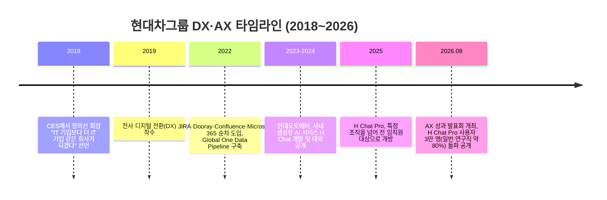

> 
> 현대차그룹이 지난달 AX 성과 발표회를 했다.
> 제일 인상적이었던 건 성과 숫자가 아니라 이 문장이었다.
> 
> **"우리가 Confluence 문서화를 일찍 도입한 것이, 다른 회사보다 AI를 훨씬 빨리 적용할 수 있었던 기반이 됐습니다."**
> 
> AI를 잘 도입해서 성공한 게 아니라, 문서를 정리해둬서 성공했다는 얘기다.
> 
> 타임라인을 보면 납득이 된다.
> 
> - 2018 "IT 기업보다 더 IT 기업 같은 회사가 되자"
> - 2019 전사 DX 착수
> - 2022 Jira·Dooray·Confluence·M365 도입
> - 2023 사내 LLM 플랫폼 개발 시작
> - 2025 전 임직원 개방
> - 2026.7 사용자 3만 명, 일반·연구직의 80%
> 
> 2022년에 Confluence를 깔 때 목적은 AI가 아니었다. 그냥 협업이었다.
> 그게 3년 뒤에 AI 연료가 됐다.
> 
> 왜 하필 문서였나. 발표에서 이유를 직접 말한다.
> 
> LLM이 퍼지면서 마크다운이라는 공통 포맷이 중요해졌고, 그 형식으로 쓰인 문서는 AI가 이해하고 학습하고 활용하기 훨씬 쉽다는 것.
> 
> 바꿔 말하면,
> PPT와 개인 폴더에 있는 지식은 AI에게 존재하지 않는 지식이다.
> 구조화된 위키에 있어야 비로소 읽힌다.
> 
> 결과 (2026년 7월 기준)
> 
> 1. 충돌안전 AI: 사례 탐색·분석 시간 90% 단축
> 2. 정비 지원 AI: 대응시간 42% 단축
> 3. 고객 리뷰 대응: 건당 35분 → 5분, 85%를 AI가 처리
> 4. VIN 인식 AI: 글로벌 70개 거점, 연 52.4억 절감
> 5. 대차 정렬 최적화: 생산 중단시간 86% 감소
> 
> 앞의 두 개는 모델이 좋아서가 아니다. 자료가 정리돼 있어서 가능했다.
> 
>  https://www.threads.com/share/BAW8JtiO4P/
> 

## 1. 발표회 개요

현대자동차그룹은 2026년 8월 12일 서울 서초구 양재동 본사에서 미디어를 대상으로 '현대차그룹 AX 성과 발표회(Beyond AI, Transforming the Way We Work)'를 열었다. 이 자리에서 그룹은 2018~2019년부터 이어온 전사 디지털 전환(DX)과 AI 전환(AX)의 과정, 그리고 사업 영역별 구체적인 성과와 향후 계획을 공개했다.

발표에는 현대차·기아 ICT담당 진은숙 사장을 중심으로 정보보안2실 이상홍 상무, 제네시스고객경험팀 장영석 책임매니저, 웹프론트엔드개발팀 서창윤 책임매니저, AX PMO분과 성화창 팀장이 나섰다. 현대오토에버 류석문 대표는 별도로 마련된 '바이브 코딩(Vibe Coding)' 실습 세션을 진행했다.

이 발표회에서 가장 눈에 띄는 대목은 개별 AI 서비스의 화려한 숫자가 아니라, 그 숫자들이 나오기까지 걸린 시간의 구조다. 현대차그룹의 AX는 2026년에 갑자기 시작된 것이 아니라, 2018년의 선언과 2019년부터의 디지털 전환(DX) 위에 쌓아 올린 결과물이라는 점을 발표회 전반이 일관되게 보여주고 있다.

## 2. 타임라인 — DX에서 AX까지, 8년의 궤적

정의선 회장이 "IT 기업보다 더 IT 기업 같은 회사가 되겠다"고 밝힌 시점은 생성형 AI가 대중화되기 훨씬 전인 2018년이다(이비엔·서플·딜사이트 등 다수 매체, 2026.8.12 보도). 이 선언을 계기로 현대차그룹은 2019년부터 단계적으로 전사 DX를 추진했고, 이 DX가 완성된 이후에야 AI 전환(AX)으로 범위를 넓혔다. 현대차그룹 스스로도 이 순서를 강조한다. DX의 핵심은 새로운 시스템을 들여오는 것 자체가 아니라, 조직 간에 흩어져 있던 정보와 데이터를 연결해 "일하는 방식"을 바꾸는 데 있었다는 것이다.

## 3. 왜 협업 도구부터였나 — 2019~2022년의 기반 공사

현대차그룹은 2022년부터 업무 진행 상황과 의사결정을 관리하는 JIRA와 Dooray, 문서 공동 작성과 지식 공유를 지원하는 Confluence를 순차적으로 도입했다. 같은 해 마이크로소프트의 클라우드 기반 협업 플랫폼 Microsoft 365(M365)도 적용해 전 세계 사업장과 조직의 업무 환경을 하나로 연결했다. 보안 규정 때문에 외부 협업 도구를 쓸 수 없었던 자율주행·수소 연구개발 조직 역시 정부 부처의 가이드라인 제정을 거쳐 동일한 플랫폼을 사용할 수 있게 됐다(서플, 2026.8.13).

이와 함께 연구개발·생산·품질·판매 등 밸류체인 전반에 흩어져 있던 데이터는 '글로벌 원 데이터 파이프라인(Global One Data Pipeline)'을 통해 표준화하고 연결했다. 이 작업의 목적은 애초부터 AI가 아니라 협업과 투명성이었다. 조직 간 업무 현황을 빠르게 확인하고, 정보 공유의 투명성을 높이기 위한 프로젝트였다는 것이 여러 매체의 공통된 서술이다(더퍼블릭, 2026.8.12).

이 대목에서 진은숙 사장의 발언은 시사하는 바가 크다. 그는 과거에는 메일이나 메신저로 파일을 주고받다 보니 결과물이 개인 PC나 메일함에 쌓여 조직의 자산으로 이어지기 어려웠다고 지적하며, 협업 도구와 공동 문서 편집기를 도입한 이유는 조직의 지식과 경험을 개인이 아닌 조직의 자산으로 쌓기 위해서였다고 설명했다(딜사이트, 2026.8.12). 같은 자리에서 장영석 제네시스고객팀 책임매니저도 예전에는 담당자가 자리를 비우면 업무 맥락을 파악하기 어려웠지만, 이제는 지식이 개인이 아니라 조직 안에 남는다고 소개했다.

즉 2022년의 Confluence·JIRA·Dooray 도입은 'AI 준비'라는 명목으로 이뤄진 것이 아니라, 순수하게 협업 효율과 지식 자산화를 위한 결정이었다. 그런데 3년 뒤 생성형 AI가 전사로 확산되는 국면에서, 이때 구조화돼 있던 문서와 데이터가 AI가 검색하고 학습할 수 있는 재료로 그대로 활용됐다. PPT 파일이나 개인 폴더에 흩어져 있던 지식이었다면 AI가 곧바로 읽어낼 수 없었을 것이라는 추론은, 발표회에서 공개된 실제 도입 순서와 앞뒤가 맞는다.

다만 한 가지는 분명히 구분할 필요가 있다. "Confluence를 일찍 도입한 것이 AI를 더 빨리 적용할 수 있었던 기반이 됐다"는 취지의 설명과, "마크다운이라는 공통 포맷 덕분에 AI가 이해하고 학습하기 쉬웠다"는 구체적인 이유는, 진은숙 사장 등 발표자의 발언을 다룬 다수의 기사에서 문장 단위로 확인되지는 않는다. 언론 보도에서 확인되는 것은 협업 도구 도입의 목적이 '조직 지식의 자산화'였다는 취지의 발언이며, 마크다운 형식과 AI 학습 효율성을 직접 연결 지은 설명은 별도로 확인되지 않았다. 이 부분은 이 글 말미의 사실관계 확인 표에서 다시 짚는다.

## 4. 사내 AI 플랫폼의 확산 — H Chat Pro와 E-FOREST: POLARIS

2022년까지의 DX로 쌓은 디지털 업무 환경과 데이터 자산 위에서, 현대차그룹은 AI 활용 범위를 전 임직원으로 넓혀갔다. 그 중심에 있는 것이 사내 생성형 AI 플랫폼 'H Chat Pro'다. 이 플랫폼은 보안이 확보된 환경에서 임직원이 ChatGPT, Gemini, Claude 등 여러 생성형 AI 모델을 선택해 사용할 수 있도록 만든 현대차그룹 전용 서비스다.

계열사인 현대오토에버가 개발한 기반 서비스 'H Chat'은 마이크로소프트의 Azure OpenAI(AOAI)를 기반으로 하며, 2024년 11월 공식적으로 대외에 소개됐다(헬로티·딜사이트, 2024.11.26). 이후 이 서비스는 'H Chat Pro'로 고도화돼 2025년부터 특정 개발 조직에 한정하지 않고 일반 임직원 전체로 개방됐다. 그 결과 2026년 7월 기준 H Chat Pro 사용자는 3만 명을 넘어섰고, 이는 현대차·기아 일반직·연구직 임직원의 약 80%에 해당한다(이비엔·네이트뉴스 등 다수 매체, 2026.8.12).

활용 범위도 단순한 문서 작성이나 정보 검색을 넘어서고 있다. 최근에는 전문 개발자가 아닌 현업 직원이 자신의 업무에 필요한 AI 에이전트를 직접 만들어 실제 업무에 적용하는 사례가 늘고 있다는 것이 발표회의 핵심 메시지 중 하나였다. 제조 분야에서는 이를 뒷받침하기 위해 별도의 제조 특화 플랫폼 'E-FOREST: POLARIS'를 구축했다. 품질, 생산, 설비, 물류 등 각 영역에 쌓인 업무 경험과 노하우를 현업 엔지니어가 직접 AI 에이전트 형태로 구현해 현장에 적용하는 방식이다.

## 5. 숫자로 보는 다섯 가지 성과

발표회에서 공개된 구체적인 성과 지표는 다음과 같다. 모두 2026년 8월 12일 발표 시점 기준이며, 이비엔·네이트뉴스·서울신문·더피알 등 다수 매체가 동일한 수치를 교차 보도했다.

| 분야 | 서비스명 | 적용 범위·시점 | 성과 |
|---|---|---|---|
| 연구개발(R&D) | 충돌안전 AI 어시스턴트 | 2025년 말 남양기술연구소 도입 | 유사 사례 탐색·분석 자료 검토 시간 약 90% 단축 |
| 제조(생산라인) | AI 자동화 인식 서비스(비전 AI 기반 VIN 판독) | 국내외 생산거점 약 70곳 | 연간 52억 4,000만 원 비용 절감 |
| 제조(부품 물류) | 대차 정렬 최적화 기술(탐색 알고리즘+강화학습) | 생산라인 부품 공급 공정 | 생산 중단시간 약 86% 감소(약 50분→7분 수준) |
| 애프터서비스(정비) | 정비 지원 AI 서비스(LLM 기반) | 해외 정비 현장 | 정비 대응시간 약 42% 단축 |
| 고객 서비스 | 고객 리뷰 대응 자동화 솔루션 | 현대차·기아·제네시스 앱 리뷰 전체 | 건당 처리시간 35분→5분, 전체 리뷰의 85% 이상을 AI가 처리, 9월부터 전체 프로세스 자동화 예정 |

이 다섯 가지 사례를 관통하는 공통점이 있다. 충돌안전 AI 어시스턴트와 정비 지원 AI 서비스는 새로운 알고리즘의 힘이 아니라, 수십 년간 여러 시스템에 흩어져 있던 시험 결과·해석 자료·정비 매뉴얼·과거 정비 기록을 AI가 통합 검색할 수 있게 만든 결과물이다. 즉 모델의 성능이 아니라 '검색 가능한 형태로 정리된 자료'가 성과를 만들어낸 결정적 요인이었다는 것이 이비엔(2026.8.12) 보도의 분석이다. 반면 VIN 인식 AI와 대차 정렬 최적화는 비전 AI와 강화학습을 결합한 자동화 기술로, 생성형 AI의 문서 이해 능력과는 다른 축의 성과에 해당한다.

## 6. 경영진이 직접 배운다 — 바이브 코딩과 정의선 회장

이번 발표회에서 언론이 가장 비중 있게 다룬 일화는 정의선 회장의 '바이브 코딩' 체험이다. 바이브 코딩은 사용자가 자연어로 원하는 기능을 설명하면 생성형 AI가 코드를 작성하는 개발 방식을 말한다. 진은숙 사장에 따르면 실무진은 처음에 회장까지 직접 배울 필요는 없다는 입장을 전했지만, 정 회장이 다시 연락해 뜻을 굽히지 않았다는 후일담이 소개됐다(네이트뉴스, 2026.8.12). 정 회장은 경영진이 바이브 코딩을 직접 해봐야 AI 기술을 이해할 수 있다는 취지로 이를 요청했고, 실제로 그룹 주요 경영진이 올해 초부터 관련 교육에 참여해왔다.

정 회장은 교육을 받은 소감으로, 최고경영진이 가장 먼저 해야 할 일은 기술을 이해하는 것이며, 그래야 이 기술로 해결할 수 있는 일과 없는 일을 정확히 구분해 의사결정을 내릴 수 있다는 취지로 말한 것으로 전해졌다(네이트뉴스, 2026.8.12). 이 실습 세션은 현대오토에버 류석문 대표가 직접 진행했으며, 발표회 현장에서 공개된 자료 화면에는 정 회장이 실습에 참여하는 장면이 포함돼 있었다(이비엔, 2026.8.12).

진은숙 사장은 이날 현대차그룹이 지향하는 목표를 두고 "AI를 가장 많이 사용하는 기업이 아니라 가장 제대로 활용하는 기업이 되는 것"이라고 강조했다. AI를 얼마나 많이 쓰느냐가 아니라, 새로운 기술을 얼마나 빠르게 이해하고 실제 업무와 사업 성과로 연결하는 역량이 경쟁력이라는 설명이다.

## 7. 앞으로의 계획

현대차그룹은 오는 9월부터 고객 리뷰 대응 프로세스 전체를 자동화할 예정이며, 10월경에는 별도의 소프트웨어 관련 기술 행사를 통해 세부 기술 전략을 추가로 공개할 계획이라고 밝혔다(딜사이트, 2026.8.12). 중장기적으로는 AX를 통해 축적한 데이터와 운영 경험, 실행 역량을 차량과 로보틱스, 제조·서비스 현장 등 물리적 세계와 AI가 결합하는 'Physical AI' 시대를 준비하는 기반으로 활용한다는 구상도 제시됐다. 아울러 그룹이 쌓아온 AX 경험을 바탕으로 중소기업의 AI 전환을 지원하겠다는 계획도 함께 공개됐다(네이트뉴스, 2026.8.12).

## 8. 사실관계 확인 표

아래 표는 이 글에서 다룬 주요 주장들을 언론 보도로 교차 확인한 결과를 정리한 것이다. 다수 매체가 동일하게 보도한 내용은 '확인됨'으로, 취지는 확인되지만 원문 그대로의 표현이 보도에서 발견되지 않은 내용은 별도로 표시했다.

| 항목 | 확인 상태 | 비고 |
|---|---|---|
| 발표회 일시(2026.8.12)·장소(양재 본사)·행사명 | 확인됨 | 이비엔, 서울신문, 더퍼블릭, 오토모닝 등 다수 매체 |
| 2018년 정의선 회장 선언, 2019년 DX 착수, 2022년 협업도구(JIRA·Dooray·Confluence·M365) 도입 | 확인됨 | 서플, 이지경제, 네이트뉴스 등 다수 매체 |
| H Chat Pro 사용자 3만 명, 일반·연구직 약 80%(2026.7 기준) | 확인됨 | 이비엔, 네이트뉴스, 서플 등 다수 매체 |
| 5개 성과 지표(90% 단축, 52.4억 원 절감, 86% 감소, 42% 단축, 35분→5분/85%) | 확인됨 | 이비엔, 네이트뉴스, 더피알, 서울신문 교차 확인 |
| 정의선 회장의 바이브 코딩 교육 참여 일화 | 확인됨 | 이비엔, 딜사이트, 서플, 네이트뉴스 |
| "Confluence를 일찍 도입한 것이 AI를 더 빨리 적용하는 기반이 됐다"는 취지의 설명 | 취지는 부합, 원문 확인 안 됨 | 진은숙 사장은 협업 도구·공동 문서 편집기 도입의 목적이 '조직 지식의 자산화'였다는 취지로 발언(딜사이트, 2026.8.12). 다만 "다른 회사보다 AI를 빨리 적용할 수 있었던 기반"이라는 구체적 문장은 조사한 언론 보도에서 직접 확인되지 않았다 |
| "마크다운이라는 공통 포맷 덕분에 AI가 이해·학습하기 쉬웠다"는 설명 | 확인 안 됨 | 조사한 언론 보도에서 발표자가 마크다운 형식을 명시적으로 언급한 내용은 확인되지 않았다. 이는 원 게시물(Threads)의 해석으로 판단되며, 사실 여부를 별도로 확정할 수 없다 |
| H Chat(사내 LLM 플랫폼)의 개발 착수 시점이 2023년이라는 설명 | 부분 확인 | 현대오토에버가 H Chat을 대외에 공식 소개한 시점은 2024년 11월이다(헬로티·딜사이트, 2024.11.26). 내부 개발이나 파일럿이 2023년부터 시작됐을 가능성은 있으나, 이를 명시적으로 특정한 1차 보도는 확인되지 않았다 |

## 9. 참고 자료

- 이비엔(EBN), "현대차그룹 AX 어디까지 왔나…충돌자료 검토 90% 단축·연 52억원 절감", 2026.8.12
- 이비엔(EBN), "[현장] 진은숙 사장 '정의선 회장, 바이브 코딩 직접 챙겨'…현대차그룹 AX 가속", 2026.8.12
- 서울신문, "차 부품 정렬 50분→7분…현대차그룹 '전사 AX' 속도전", 2026.8.12
- 더퍼블릭, "현대차그룹, AX 성과 발표회 개최…DX·AX 추진 현황과 미래 비전 공개", 2026.8.12
- 딜사이트, "'빨리빨리 DNA가 AI도 바꿔'…현대차 AX의 힘은 '실행력'", 2026.8.12
- 네이트뉴스, "회장도 직접 코딩…현대차그룹 AI로 대전환", 2026.8.12
- 네이트뉴스, "현대차그룹, 직원 10명 중 8명 생성형 AI 쓴다…전사 AX 가속", 2026.8.12
- 네이트뉴스, "'AX' 팔걷은 현대차그룹, AI로 생산중단 시간 90% 줄었다", 2026.8.12
- 더피알(The PR), "AI보다 '일하는 방식' 먼저 바꿨다…현대차그룹의 AX 공식", 2026.8.12
- 서플(supple.kr), "정의선 회장도 직접 '바이브 코딩'…현대차그룹, 전사 AX 가속 [종합]", 2026.8.12
- 이지경제, "현대차그룹, AI 전환 본격화…'H Chat Pro' 사용자 3만명 돌파", 2026.8.12
- 헬로티(hellot.net) / 딜사이트, "현대오토에버, 생성형 AI 기반 업무지원 서비스 'H Chat' 개발", 2024.11.26
- 현대자동차그룹 공식 저널, "현대차그룹이 AI를 경쟁력으로 만드는 방법", hyundaimotorgroup.com

---

작성일: 2026년 9월 19일
