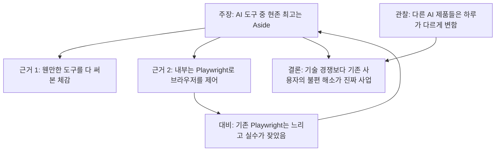
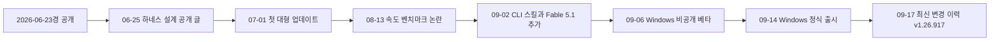
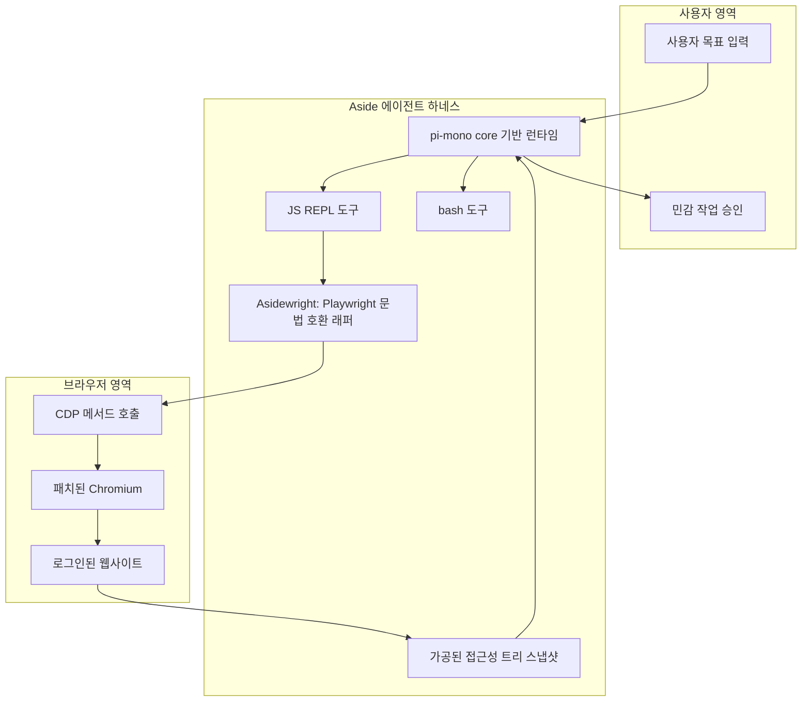
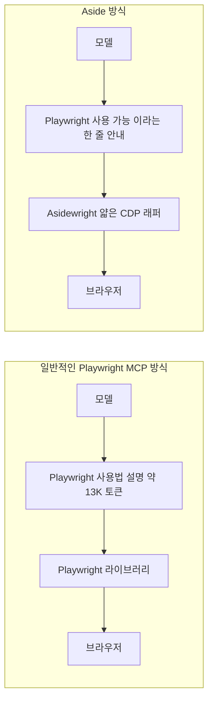
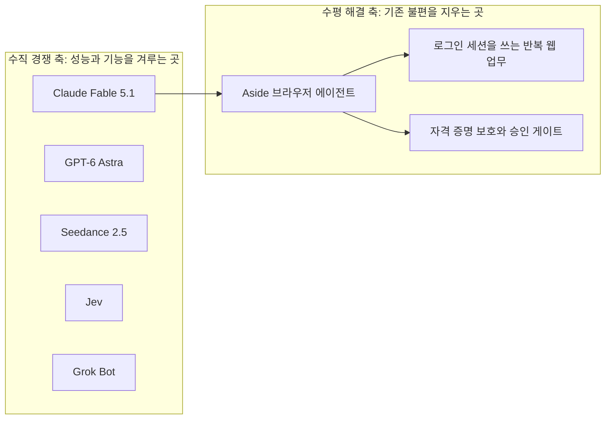
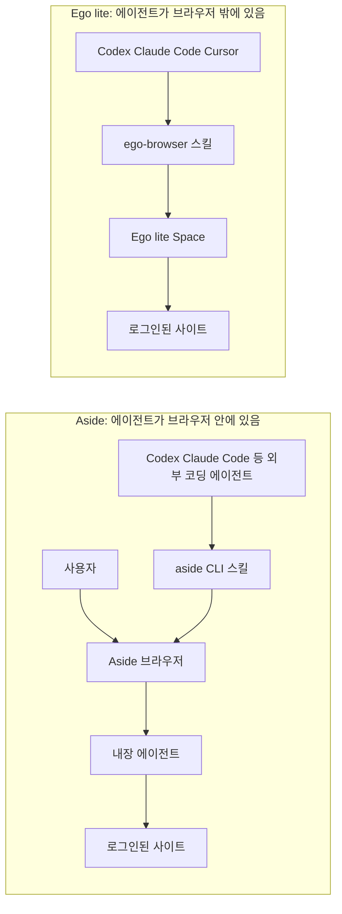

## Threads 게시글과 댓글 상세 해설

- 작성일: 2026-09-21
- 조사 기준: 2026-09-21까지 공개된 자료
- 작성 방식: 웹 검색으로 공식 문서, 변경 이력, 벤치마크 저장소, 언론 보도를 직접 열어 확인한 뒤 작성

> 
> **Ai 현존 최고는 aside**
> 
> 웬만한거 다써보면서 느낌.
> 까보니까 얘도 결국 playwright로 브라우저 컨트롤 하는데 이거 하나 제대로 파서 포지셔닝 제대로함
> 
> 어찌보면 별거 아니지만 기존 playwright 느려터지고 실수 잦은거 생각하면 그냥 ‘신‘ 그 자체
> 
> 페이블, 아스트라, 시댄스, jev, 그록봇 하루하루 눈에 띄게 달라지지만 단순히 이런 수직적인 피터지는 기술력 경쟁보다 
> 
> 기존 이용자의 가려운 곳을 제대로 긁어주는게 진짜 비지니스 잘한 서비스지
> 
> 새로운 걸 쉽게 시도하는 것도 좋지만. 이제 이 불편함은 없어요가 좋은듯.
> 
>  https://www.threads.com/share/BAkW055_hi/
> 

---

## 0. 이 글을 읽는 방법

이 글은 Threads에 올라온 한 편의 게시글과 그 아래 달린 댓글들이 무슨 이야기를 하고 있는지 풀어서 설명하는 글입니다. 게시글의 주인공은 **Aside**라는 AI 브라우저이고, 게시글 작성자는 "지금 존재하는 AI 중 최고는 Aside"라고 평가하면서, 그 이유를 기술 경쟁이 아니라 "기존 사용자의 불편을 제대로 없애 주는 것"에서 찾습니다.

먼저 조사의 한계를 밝혀 둡니다. 게시글 주소는 Threads의 자동 접근 차단 정책 때문에 직접 열어 볼 수 없었습니다. 그래서 게시글 본문과 댓글은 전달받은 텍스트를 기준으로 삼았고, 좋아요 수처럼 시점마다 바뀌는 수치는 다루지 않았습니다. 또 게시글이 나열한 제품 이름(페이블, 아스트라, 시댄스, jev, 그록봇)은 작성자가 따로 설명하지 않았기 때문에, 이름이 일치하는 최근 제품을 검색으로 찾아 확인했습니다. 그것이 작성자가 의도한 대상과 같다고 100% 확정할 수는 없다는 점을 6장에서 다시 짚겠습니다.

이 글에서는 문장마다 근거의 무게가 다르기 때문에 아래 네 가지 표기를 씁니다.

| 표기 | 의미 | 예시 |
|---|---|---|
| **[확인]** | 공식 문서, 변경 이력, 가격 페이지 같은 1차 자료를 직접 열어 확인한 사실 | Aside 가격 페이지의 요금 |
| **[주장]** | 제품을 만든 회사가 스스로 내놓은 수치나 설명. 제3자 검증 전 | Aside가 발표한 벤치마크 점수 |
| **[보도]** | 언론, 리뷰, 블로그 등 제3자가 전한 내용 | 리뷰 매체의 사용 후기 |
| **[해석]** | 위 자료를 바탕으로 한 저의 해석 | "이 논지는 이 점에서 타당하다" |

---

## 1. 한눈에 보기

게시글의 핵심은 세 가지입니다. 첫째, Aside를 "현존 최고"라고 부릅니다. 둘째, 그 이유가 대단한 신기술이 아니라 브라우저 조작 방식을 Playwright에 맞춰 제대로 파고들었기 때문이라고 봅니다. 셋째, 그래서 요즘 쏟아지는 새 모델과 새 도구들 사이의 "피 터지는 기술 경쟁"보다, 이미 쓰고 있는 사람들의 가려운 곳을 긁어 주는 서비스가 사업적으로 더 잘한 것이라고 결론 내립니다.

이 세 가지를 검증해 보면 결과는 이렇습니다. Aside가 로그인된 웹사이트를 사람처럼 대신 조작해 주는 브라우저라는 점은 공식 자료로 확인됩니다. "결국 Playwright로 제어한다"는 말도 대체로 맞지만, 정확히는 Playwright 라이브러리를 그대로 쓰는 것이 아니라 **Playwright와 문법이 똑같은 자체 경량 구현(Asidewright)** 을 쓴다고 Aside가 직접 설명합니다. "현존 최고"라는 평가는 작성자의 사용 체감으로는 충분히 있을 수 있는 이야기지만, 객관적 근거로 내세울 벤치마크(Online-Mind2Web 99.0% 등)는 **Aside가 자기 저장소에 직접 공개한 결과**여서 독립 검증은 아직 없습니다. Aside 스스로도 모델과 하네스를 비교하는 홍보 문구가 "도발용"이었다고 인정합니다.

댓글들은 크게 세 갈래입니다. 하나는 "Ego lite와 경쟁하게 될 것"이라는 시장 전망, 하나는 "어떻게 활용하느냐", "토큰이 너무 빨리 소진된다"는 실사용 질문과 불만, 나머지는 "없던 시절로 못 돌아간다", "완전 공감" 같은 공감 표현입니다. 이 글은 각각이 사실관계상 무엇을 가리키는지 하나씩 풀어 드립니다.

---

## 2. 게시글은 무엇을 말하고 있나

게시글의 논리는 아래처럼 흘러갑니다.

작성자는 스스로 "어찌 보면 별거 아니지만"이라고 전제를 답니다. 즉 Aside의 기술이 완전히 새로운 발명이라고 주장하는 것이 아닙니다. 이미 있는 도구(Playwright)를 "제대로 파서" 그 위에 포지셔닝을 정확히 했다는 점을 높이 평가하는 것입니다. 이 점이 중요합니다. 뒤에서 보겠지만, Aside 공식 블로그의 설명도 정확히 이 방향입니다. 새로운 프로토콜을 만든 것이 아니라 모델이 이미 잘 아는 인터페이스를 골라 그 위에서 군더더기를 걷어냈다는 이야기입니다.

마지막 두 문단은 시장 전체에 대한 관점입니다. 작성자는 "페이블, 아스트라, 시댄스, jev, 그록봇"이 하루하루 눈에 띄게 달라지고 있다고 말합니다. 이 목록은 모델(성능), 영상 생성(창작), 새로운 유형의 모델(속도와 비용), 자율 에이전트(자동화)를 모두 포함하는 "최신 AI 뉴스 상위권"에 가깝습니다. 그리고 이런 **수직적 기술 경쟁**보다 "이제 이 불편함은 없어요"라고 말할 수 있는 서비스가 더 좋다는 것이 결론입니다.

---

## 3. Aside는 무엇인가

### 3.1 한 문장으로

Aside는 **내가 이미 로그인해 둔 웹사이트들을 사람처럼 대신 열고, 누르고, 입력해 주는 AI 에이전트가 내장된 데스크톱 브라우저**입니다. 크롬 확장 프로그램이 아니라 Chromium 기반의 독립 브라우저입니다. [보도: eesel 리뷰]

쉽게 비유하면 이렇습니다. 보통의 AI 비서는 메일, 캘린더, 문서 도구 같은 서비스마다 "연동(통합)"을 따로 설정해야 일을 시킬 수 있습니다. Aside는 연동 대신 **화면 앞에 앉은 사람처럼 웹사이트를 직접 조작**합니다. 그래서 연동을 지원하지 않는 사내 도구나 결제 페이지처럼 "브라우저로는 열 수 있지만 API는 없는" 곳까지 일을 시킬 수 있다는 것이 제품의 핵심 주장입니다. [주장: Aside 공식 블로그]

### 3.2 출시 경과

Aside는 2026년 6월 하순에 공개되었습니다. 공식 블로그는 6월 25일 자로 올라와 있고, 언론 보도들도 6월 23~24일경 공개로 전합니다. 이후 3개월 동안 빠르게 변화했습니다.

각 시점의 근거는 다음과 같습니다.

- 공개 시점: eesel 리뷰가 "2026년 6월 23일경 출시"라고 적었고, 6월 24일 자 X 글도 그날 공개를 전합니다. [보도]
- 첫 대형 업데이트(7월 1일): 고정 탭 기능, 지원 AI 제공자 확대(SuperGrok, Kimi, Z.ai, 사용자 지정 제공자), 인텔 맥 문제 수정, GPU 렌더링 메모리 사용량을 초기 대비 약 3분의 1로 줄였다는 내용입니다. 같은 기사의 필자는 초기 버전이 느리고 맥북이 뜨거워졌다고 적었습니다. [보도: PiunikaWeb]
- Windows: 9월 6일 비공개 베타 시작, 9월 14일 정식 출시. 공동 창업자이자 CTO가 "맥 버전 기능의 99%"라고 밝혔고 기사 필자도 큰 기능 누락을 찾지 못했다고 했습니다. [보도: PiunikaWeb] 공식 다운로드 페이지는 현재 macOS와 Windows를 함께 안내합니다. [확인]
- 최신 변경 이력은 9월 17일 자 v1.26.917.1731까지 확인됩니다. [확인: Aside 변경 이력]

회사 정보로는 Y Combinator 2025년 가을 배치 출신이며, 샌프란시스코의 3인 팀이고 Jun Kim이 이끈다고 eesel 리뷰가 전합니다. 공식 블로그의 글쓴이도 Jun Kim입니다. [보도 및 확인]

### 3.3 핵심 기능

공식 블로그와 변경 이력, 가격 페이지에서 확인되는 기능을 정리하면 다음과 같습니다.

**로그인 상태를 그대로 쓰는 에이전트.** 통합이나 API 연결 없이, 사용자가 이미 로그인한 계정으로 웹사이트를 조작합니다. 추론 강도를 낮음, 중간, 높음, 그리고 장시간 자율 실행인 "Ultrabrowse"에서 고를 수 있습니다. [보도: eesel] 가격 페이지에서 Ultrabrowse는 Pro 플랜 항목에 명시되어 있고, 변경 이력에는 무료 플랜의 Ultrabrowse 한도를 더 분명히 보여 준다는 항목(6월 20일)이 있습니다. [확인]

**자체 기억(메모리).** 작업 내용을 기억해서 매번 맥락을 다시 설명하지 않게 합니다. 공식 블로그는 "로컬 임베딩 모델을 이용한 자기 조직화 메모리"라고 설명하고, eesel 리뷰는 메모리가 사용자 기기에 사람이 읽고 고칠 수 있는 마크다운 파일로 저장된다고 전합니다. [주장 및 보도]

**자격 증명 보호(비밀번호 관리자).** 로그인 정보가 AI 모델에는 노출되지 않은 채 웹페이지에만 자동 입력되도록 설계했다고 공식 블로그가 설명합니다. 9월 14일 변경 이력에서 이 기능의 이름이 "Aside Vault"로 바뀌었고, 1Password, Proton Pass, Apple Passwords 등에서 가져오기가 지원됩니다. 8월 26일 변경 이력에는 이름, 생일, 전화번호 같은 본인 정보를 채우는 기능이 **한국식 본인 확인 양식에도 적용된다**고 적혀 있습니다. [주장 및 확인]

**민감한 작업은 사람의 승인.** 결제나 게시처럼 되돌리기 어려운 작업은 사용자 승인을 기다린다고 공식 블로그가 밝힙니다. 변경 이력에도 "Review before action(실행 전 검토) 모드"(6월 1일), 초안 카드에서 전송, 게시 동작을 작업 입력창으로 넘기는 흐름(7월 17일) 같은 항목이 있습니다. 다만 eesel 리뷰는 이 승인 게이트가 개인정보처리방침 본문에는 명시되어 있지 않다고 지적합니다. [주장, 확인, 보도]

**루틴, 원격 제어, 메일과 메신저 연동 동작.** 정해진 일정이나 이벤트로 반복 실행하는 루틴, Slack과 Telegram으로 원격 제어하는 채널(Pro), Gmail과 Slack 안에서 "Handle with Aside"를 눌러 해당 메시지를 옆 패널 작업으로 넘기는 기능(9월 3일)이 변경 이력에 있습니다. [확인]

**코딩 에이전트와의 연결.** 9월 2일 변경 이력에 `aside skills install` 명령이 추가되어, Aside 브라우저 스킬을 Codex, Claude Code, Cursor, OpenCode에 설치할 수 있게 되었습니다. [확인] 이 점은 7장에서 댓글과 연결해 다시 다룹니다.

### 3.4 요금과 모델

가격 페이지에서 확인한 요금 구조는 다음과 같습니다. [확인: aside.com/pricing]

| 플랜 | 월 요금 | 주요 내용 |
|---|---|---|
| Free | $0 | 본인 AI 구독 연결, 월 500 크레딧, 루틴 최대 3개, 비밀번호 관리자, 개인화 메모리 |
| Pro | $20 | Free의 약 3배 사용량, Ultrabrowse(심층 리서치), 무제한 루틴, 채널(원격 제어), 클라우드 핸드오프 |
| Max | $200 | Free의 약 40배 사용량, 얼리 액세스 참여 |
| Enterprise | 문의 | 팀 단위 좌석과 결제 관리, 공유 계정 로그인의 비밀 노출 없는 사용, 앱이나 크론에서 에이전트 실행 |

여기서 짚을 점은 **"본인 구독을 가져와 쓰는(Bring Your Own)" 구조**입니다. 무료 플랜에도 "Bring your own subscription"이 명시되어 있고, 변경 이력에는 ChatGPT, Claude, GitHub Copilot, Grok, Kimi 등 구독 연결과 Ollama, LM Studio 같은 로컬 모델 연결이 계속 추가되어 있습니다. 즉 Aside는 자체 모델을 파는 회사가 아니라, **여러 회사의 모델을 얹어 쓰는 하네스(구동 장치)이자 브라우저**입니다. 이 사실은 6장에서 게시글의 논지를 평가할 때 중요합니다.

크레딧이 어떤 작업에서 얼마씩 차감되는지의 세부 규칙은 이번 조사에서 확인하지 못했습니다.

---

## 4. "결국 Playwright로 브라우저를 제어한다"는 말의 정확한 의미

게시글 작성자는 "까보니까 얘도 결국 playwright로 브라우저 컨트롤하는데"라고 했습니다. 이 부분은 Aside 공식 블로그(2026-06-25, Jun Kim)에서 직접 확인할 수 있습니다. 결론부터 말하면 **방향은 맞고, 세부는 조금 다릅니다.**

### 4.1 공식 블로그가 밝힌 설계 원칙

블로그는 에이전트 하네스를 "대부분 처음부터 직접 만들었다"고 설명하며, 토대로는 `pi-mono/core`를 골랐고 압축(컴팩션), 스킬, 훅, 샌드박스, REPL, bash, 브라우저 자동화를 그 위에 직접 쌓았다고 합니다. [주장]

네 가지 원칙이 핵심입니다.

1. **모델의 학습 데이터를 따라간다.** 모델이 가장 많이 본 것은 코드이므로, Aside를 "코딩 에이전트"로 설계했습니다. 핵심 도구가 JS REPL이고, 그 문법은 가장 널리 쓰이는 Playwright입니다.
2. **최소한의 지침이 더 높은 지능을 만든다.** 시스템 프롬프트와 도구 정의를 합쳐 약 1만 토큰으로 유지하며, Claude Code는 2만 토큰을 쓴다고 비교합니다. AI가 프롬프트를 쓰게 두지 않는다는 원칙도 밝힙니다.
3. **컨텍스트 창을 보호한다.** 도구 출력에 잡음이 많으면 모델이 빠르게 나빠지므로, 원시 DOM이나 CDP 대신 자체적으로 다듬은 접근성 트리(a11y tree)를 씁니다.
4. **거인의 어깨 위에 선다.** Codex, Claude Code, OpenCode 등 오픈소스에서 많이 빌렸다고 밝힙니다.

### 4.2 구조

핵심 도구가 딱 두 개(REPL과 bash)라는 점이 눈에 띕니다. 공식 블로그는 OpenClaw나 Hermes처럼 브라우저 전용 도구 묶음을 쓰는 방식과 다르다고 대비합니다. [주장]

이 도식을 말로 풀면 다음과 같습니다. 사용자가 목표를 주면 하네스의 런타임이 모델에게 두 가지 도구를 줍니다. 모델은 브라우저를 조작할 때 JS REPL 안에서 Playwright 문법의 코드를 씁니다. 그 코드는 진짜 Playwright 라이브러리가 아니라 **Asidewright**가 받아서 CDP(크롬 개발자 도구 프로토콜) 호출로 바꿔 브라우저에 전달합니다. 페이지 상태는 사람이 보기 쉬운 형태의 접근성 트리로 다듬어 모델에게 돌려줍니다. 결제나 게시 같은 민감 동작 앞에서는 사람에게 승인을 요청합니다.

### 4.3 일반적인 Playwright 방식과의 차이

블로그가 강조하는 차이를 도식으로 비교하면 아래와 같습니다. 여기 적힌 토큰 수치는 모두 Aside 측이 밝힌 값입니다. [주장]

블로그가 든 이유는 이렇습니다. Playwright는 원래 웹사이트 테스트(E2E) 자동화를 위해 만들어져 무겁고 부피가 큽니다. 그래서 Aside는 인터페이스는 Playwright와 100% 동일하게 유지하되, 각 API를 CDP 호출 위에 얹은 "의견이 들어간 얇은 래퍼"로 직접 만들었다고 합니다. 모델이 Playwright를 이미 잘 알기 때문에 프롬프트에서 사용법을 가르칠 필요가 없고, 그만큼 토큰을 아낀다는 논리입니다. 블로그는 agent-browser 대비 최대 80% 적은 토큰, 접근성 스냅샷 크기 약 70% 감소를 주장합니다. [주장]

한 가지 흥미로운 대목이 있습니다. 블로그는 "CDP는 나쁜 선택"이라고도 말합니다. 모델이 CDP를 학습하지 않았고 너무 저수준이라는 이유입니다. 얼핏 모순처럼 보이지만, 정리하면 **모델에게 보여 주는 인터페이스는 Playwright, 그 아래 실제 구현은 CDP**라는 뜻이라 서로 충돌하지 않습니다. 변경 이력에도 이 방식의 흔적이 보입니다. 7월 9일 항목에는 같은 문서 내 이동, Playwright 페이지 단축 메서드, `locator.last` 연쇄 호출 지원이 적혀 있고, 인자가 전달되지 않을 `page.evaluate` 호출은 거부한다고 되어 있습니다. 즉 Playwright 호환 표면을 하나씩 채워 가는 작업이 진행 중이라는 뜻입니다. [확인]

### 4.4 "진짜 사용자 브라우저"에서 돌리기 위한 손질

블로그는 헤드리스(화면 없는) 브라우저 에이전트와 달리 사용자가 매일 쓰는 브라우저 안에서 돌기 때문에 필요한 세 가지 손질을 밝힙니다. [주장]

- 에이전트가 여는 탭이 사용자의 포커스를 빼앗지 않도록 Chromium의 Blink 엔진을 수정했습니다.
- 봇 탐지를 피하기 위해 Chromium 내부를 수정했으며, Browserbase와 Browser Use가 쓰는 것과 같은 기법이라고 합니다.
- 에이전트가 여는 백그라운드 탭의 화면 크기를 1440x900으로 고정했습니다. 사용자가 창 크기를 바꿔도 클릭 좌표가 틀어지지 않게 하려는 목적이며, 화면 기반 조작(Computer Use) 학습 데이터가 이 해상도 주변에 몰려 있다는 점도 이유로 듭니다.

또한 블로그는 DOM으로 제어할 수 없는 사이트에는 화면 정보와 클릭 좌표를 쓰는 대체 경로를 붙였고, 페이지가 정상 경로를 막으면 네트워크 요청을 살펴 사이트 내부 API를 알아내 우회하기도 한다고 설명합니다. 이 마지막 동작은 성능 면에서는 영리하지만, 사이트 이용 약관 관점에서는 별도 검토가 필요할 수 있습니다. [해석]

### 4.5 게시글 표현에 대한 평가

정리하면 게시글의 "Playwright로 제어한다"는 표현은 **사용자가 체감하는 수준에서는 정확하지만, 구현 수준에서는 "Playwright와 똑같은 사용법을 가진 자체 경량 구현"** 이라는 단서가 붙습니다. 언론 보도도 같은 방향으로 "Playwright를 둘러싼 자체 경량 자동화 스택"이라고 요약합니다. [보도: PiunikaWeb]

작성자가 겪었다는 "기존 Playwright의 느림과 잦은 실수"는 개인 경험이라 제가 진위를 검증할 수는 없습니다. 다만 Playwright가 에이전트용이 아니라 테스트용으로 설계되었다는 진단은 Aside 블로그와 일치하고, Vercel의 agent-browser 같은 다른 도구들도 접근성 트리를 쓰며 같은 문제를 다룬다는 자료가 검색됩니다. 즉 "기존 방식의 불편"이라는 문제 인식 자체는 업계에서 널리 공유되고 있습니다. [해석]

---

## 5. "현존 최고"라는 평가는 얼마나 뒷받침되나

### 5.1 Aside가 공개한 벤치마크

Aside는 세 개의 브라우저 에이전트 벤치마크에서 1위라고 주장합니다. 결과는 Aside가 운영하는 GitHub 저장소(`at-inc/aside-benchmarks`)에 공개되어 있습니다. 저장소를 직접 열어 확인한 값은 다음과 같습니다. [주장: 저장소 자체 결과]

| 벤치마크 | 내용 | Aside 결과 | 실행 설정 |
|---|---|---|---|
| Online-Mind2Web | 실제 웹사이트 136곳의 300개 과제 | 297/300 통과, 99.0% (불가능 과제 1개 제외 시 99.3%) | gpt-5.5, 사고 강도 high, fast 모드, 동시 3~6, 과제당 900초, 채점은 gpt-5.4 자동 채점 |
| Odysseys | 실제 브라우징 기록에서 뽑은 장기 과제 200개 | 완전 성공 151/200 (75.5%), 루브릭 항목 통과 88.8%, 과제 평균 86.5% | gpt-5.5, 사고 강도 high, 최대 200단계, 채점은 gemini-3.1-flash-lite |
| BU Bench V1 | 어려운 자동화 과제 100개 | gpt-5.5로 93.0%, kimi-k2.6으로 88.0% | 사고 강도 high, fast 모드, 동시 6 |

과제 난이도별로는 Online-Mind2Web에서 쉬움 80/80, 보통 142/143, 어려움 75/77이고, Odysseys의 어려운 과제는 완전 성공률이 67.0%로 크게 낮아집니다. 공개된 결과에는 실패한 과제(예: 재고가 없어 구매 불가능한 상품 담기)도 이유와 함께 적혀 있어, 결과를 감추지는 않았습니다. 다만 이것은 "사실을 숨겼다"의 문제가 아니라 "누가 측정했는가"의 문제입니다.

Aside 블로그는 같은 벤치마크에서 비교 대상 수치도 제시합니다. Online-Mind2Web에서 GPT-5.4 CUA 92.8%(OpenAI 발표 인용), Claude Code와 Playwright MCP 조합의 Opus 4.8 84.0%(자체 측정), ChatGPT Atlas 70.0%이고, BU-Bench-V1에서는 Claude Code와 Playwright MCP 조합의 Fable 5가 80%(자체 측정)라고 적습니다. [주장]

### 5.2 이 숫자를 어디까지 믿을 수 있나

여기서부터는 냉정하게 봐야 합니다. 신뢰도에 영향을 주는 사실을 나열합니다.

첫째, **측정 주체가 Aside 자신**입니다. eesel 리뷰도 "수치는 실제이지만 Aside의 자체 저장소, 자체 채점 방식이며 독립 감사를 받은 리더보드가 아니다"라고 지적합니다. [보도]

둘째, **비교 대상의 일부도 Aside가 직접 돌린 값**입니다. Opus 4.8과 Fable 5의 수치는 블로그가 "우리 실행에서"라고 밝힌 값입니다. 다른 회사 제품을 그 회사의 최적 조건이 아닌 Aside의 조건에서 측정했을 가능성을 배제할 수 없습니다. 이것이 부정행위라는 뜻이 아니라, 측정 조건이 다르면 비교가 성립하기 어렵다는 일반적인 한계입니다. [해석]

셋째, **Aside 스스로 비교의 성격을 인정**합니다. 블로그에는 모델을 자기 하네스와 비교하는 것이 맞느냐는 자문이 나오고, 그 비교가 도발 성격이 있었음을 사과하면서 자신들이 말하려는 것은 모델의 효율이 아니라 하네스의 효율이라고 답합니다. 또한 모델이 성능의 상한선을 정하지만 더 나은 하네스로 최적화할 여지는 많다고 씁니다. 결론부에서도 Aside가 Fable을 이겼다는 표현이 도발에 가깝다고 인정합니다. [주장] 이 부분은 오히려 정직한 대목입니다. 그리고 제 관점에서는 바로 이 문장이 이 벤치마크를 읽는 올바른 방법입니다. 이 표는 "Aside 모델이 최고"가 아니라 "같은 계열 모델도 하네스에 따라 결과가 크게 달라진다"는 증거로 읽어야 합니다. [해석]

넷째, **다른 하네스들도 비슷하게 높은 자체 수치를 냅니다.** Browser Use의 자체 저장소는 Online-Mind2Web에서 bu-max가 291/300(97%)을 기록했다고 적고, Microsoft의 Webwright 저장소는 GPT-5.4로 86.7%(공개 하네스 중 최고 수준이라는 자체 설명)라고 적습니다. 서로 모델, 채점기, 설정이 달라 직접 비교할 수 없지만, 최상위권 수치가 모두 자체 측정이라는 점은 같습니다. [주장: 각 저장소]

다섯째, 커뮤니티 반응은 뜨겁기만 하지는 않았습니다. eesel이 인용한 Hacker News 댓글 중에는 "X에서는 좋아요 5천 개인데 여기서는 댓글이 하나도 없다"는 회의적인 반응이 있습니다. [보도]

### 5.3 함께 기억할 사건: 속도 벤치마크 논란

Aside의 자체 수치를 둘러싼 논쟁은 에이전트 벤치마크에만 있지 않았습니다. 8월에 Aside는 브라우저 속도 측정 도구인 Speedometer 3.1에서 자사가 49.9점으로 Chrome(46.7), Helium(44.4), Arc(33.2)보다 빠르다는 차트를 게시했습니다. 이에 Helium 개발자로 알려진 사용자가 8월 13일 X에서 "같은 조건을 재현하지 못했고, Aside가 결과를 조작했거나 다른 브라우저를 오염된 환경에서 돌린 것 같다"고 주장했습니다. [보도 및 커뮤니티]

Aside 측 해명 자료(vercel 도메인에 게시)는 다음을 인정합니다. 원래 차트는 확장 프로그램이 설치된 일상용 프로필에서 돌린 것이었고, Speedometer 지침이 요구하는 깨끗한 프로필이 아니었으며 그 사실을 공개하지 않았다는 점, 이는 "방법론상의 정당한 오류이고 우리 잘못"이라는 점입니다. 이후 깨끗한 환경에서 화면을 녹화하며 두 번 다시 측정했더니 Aside 51.09와 50.10, Chrome 49.7과 48.9, Helium 49.1과 48.6으로 Aside가 근소하게 앞섰다고 합니다. 그러나 같은 자료는 "이 결과가 Aside가 더 빠르다는 증명은 아니고, 그날 그 기계에서 그랬다는 것"이라고 선을 긋고, 하드웨어를 바꾸면 같은 브라우저 점수가 24.3점 움직인다고 밝힙니다. [주장]

이 사건에서 읽을 점은 두 가지입니다. 하나는 Aside가 처음부터 조건을 정확히 공개하지 않았다는 실수, 다른 하나는 지적을 받은 뒤 원자료와 Aside가 지는 실행까지 공개하며 주장의 범위를 스스로 줄였다는 대응입니다. [해석] 에이전트 벤치마크를 읽을 때도 같은 태도가 필요합니다.

### 5.4 이 절의 결론

"현존 최고"라는 평가는 두 층으로 나눠서 봐야 합니다. **작성자의 체감 평가**("웬만한 걸 다 써 보고 느낀 것")는 첫 손 경험이므로 존중할 가치가 있지만 사례 한 건입니다. **객관적 우위**를 뒷받침하는 자료는 현재 Aside 자체 측정뿐이며, 제3자가 같은 조건에서 재현했다는 자료는 이번 조사에서 찾지 못했습니다. 따라서 "체감상 매우 좋다는 평가가 다수 있고, 공개된 수치도 강하지만, 독립 검증은 아직 부족하다"가 사실에 가장 가까운 문장입니다. [해석]

---

## 6. 게시글이 나열한 다섯 가지 이름

작성자는 "페이블, 아스트라, 시댄스, jev, 그록봇"이 하루하루 눈에 띄게 달라진다고 썼습니다. 게시글은 이 이름들을 설명하지 않았습니다. 그래서 이름이 발음과 철자상 일치하고, 최근 실제로 출시 소식이 있었던 제품을 검색해 확인했습니다. **작성자가 정확히 이 제품들을 뜻했는지는 확정할 수 없으나, 다섯 이름이 모두 2026년 6월부터 9월 사이 출시 소식이 있었던 제품과 일치하고, 성격도 서로 다른 축(모델, 영상, 판단 모델, 자율 에이전트)을 대표하므로 개연성이 높습니다.** [해석]

| 이름 | 일치하는 제품 | 확인된 사실 |
|---|---|---|
| 페이블 | Claude Fable 5.1 (Anthropic) | 2026-09-01 일반 공개. 같은 모델의 안전 장치를 달리한 Mythos 5.1은 신뢰 접근 프로그램에서만 제공. 일반적인 사용에서 Fable 5 대비 약 25% 저렴(캐시 읽기 가격 인하 때문)이라고 회사가 밝힘 [확인 및 보도] |
| 아스트라 | GPT-6 Astra (OpenAI) | 2026-09-03 일부 조직에 먼저 공개, 이후 ChatGPT 유료 플랜과 API로 확대. OpenAI는 "컴퓨터와 브라우저 사용의 새 경계"라고 소개 [보도: TechCrunch, Fortune 등] |
| 시댄스 | Seedance 2.5 (ByteDance) | 2026-07-31 공식 출시. 한 번에 만드는 영상 길이가 15초에서 30초로 늘었다고 공식 블로그가 밝힘. 6월 23일 행사에서 미리 공개 [확인 및 보도] |
| jev | Jev (TypeSafe AI) | 2026-09-15 스텔스 해제와 함께 시드 투자 4천만 달러를 발표한 신생 연구소의 첫 공개 모델. 글을 쓰지 않고 예, 아니오나 점수 같은 판단만 내는 "System One" 모델 [보도] |
| 그록봇 | Grok Bot (xAI) | 2026-08-11 초기 베타 시작. 이름 붙인 봇마다 기억, 자체 클라우드 컴퓨터, 브라우저 접근, 루틴을 갖는 상시 에이전트 [보도] |

몇 가지를 조금 더 풀어 씁니다.

**Fable 5.1과 Astra**는 모델 자체의 성능을 겨루는 축입니다. 특히 Astra는 OpenAI가 "컴퓨터 사용" 능력을 대표 기능으로 내세웠다는 점에서 Aside와 직접 겹치는 영역입니다. 모델을 만드는 회사가 브라우저 조작 능력을 모델에 내재화하면, 하네스만 다듬는 서비스의 입지가 좁아질 수 있다는 것이 가능한 반론입니다. 저는 이것을 사실이라기보다 **검토할 만한 위험**으로 봅니다. [해석]

**Seedance 2.5**는 영상 생성으로, 브라우저 자동화와는 직접 경쟁하지 않습니다. 게시글의 논지에서는 "눈에 띄게 진화하는 화려한 영역"의 대표로 등장한다고 보입니다. 참고로 이전 버전 Seedance 2.0은 2026년 2월 실제 배우와 캐릭터를 닮은 영상이 화제가 되면서 저작권 논란도 함께 겪었습니다. [보도: Wikipedia]

**Jev**는 특히 흥미롭습니다. 회사 측 주장은 매체마다 표현이 다르지만 기존 대형 언어 모델보다 수십에서 수백 배 빠르고 저렴하다는 범위이고, 입력 백만 토큰당 0.042달러에 출력은 무료라고 전해집니다. 다만 현재는 조기 접근 단계이고, 한 기술 리뷰는 자신이 "문서와 구조를 검토한 것이며 독립적인 지연 시간 측정이 아니다"라고 명시합니다. [주장 및 보도] Jev는 "채팅이나 코딩을 하는 모델"이 아니라 에이전트 내부에서 경로를 고르는 판단 단계를 빠르고 싸게 처리하는 부품에 가깝습니다. [보도]

**Grok Bot**은 "메모리와 자체 컴퓨터를 갖고 오프라인에서도 일하는 상시 에이전트"라는 점에서 Aside의 루틴, 채널 기능과 성격이 일부 겹칩니다. 다만 Grok Bot이 자체 클라우드 컴퓨터에서 돈다는 점에서 Aside의 "내 기기에서, 내 로그인으로"와는 설계 철학이 다릅니다. 엔터프라이즈 무료 체험과 월 20달러 진입 가격은 제3자 정리 글에서 나온 정보라 공식 확인은 못 했습니다. [보도]

### 6.1 "수직 경쟁"과 "수평 해결"이라는 구도

게시글의 핵심 구도를 도식으로 옮기면 다음과 같습니다.

도식의 선은 **Aside가 실제로 모델 선택기에 반영한 경우**만 그렸습니다. 변경 이력에 따르면 Aside는 Fable 5.1이 공개된 다음 날(9월 2일) 곧바로 Claude Fable 5.1을 모델 목록에 추가했습니다. Grok 4.6은 8월 20일, Claude Opus 5는 7월 26일, Gemini Flash 3.8은 9월 3일에 각각 추가되었습니다. [확인] Astra, Seedance, Jev, Grok Bot이 Aside에 반영되었다는 기록은 이번에 읽은 변경 이력에서 찾지 못해 선을 그리지 않았습니다.

여기서 게시글의 논지에 대해 한 가지 뉘앙스를 더할 수 있습니다. 작성자는 수직 경쟁과 수평 해결을 대립시키지만, **Aside는 수직 경쟁의 결과물을 재료로 씁니다.** 새 모델이 나올 때마다 Aside의 쓸모가 함께 올라가는 구조입니다. 그러니 두 축은 대립이라기보다 **위층(모델)과 아래층(사용 경험)의 분업**으로 보는 편이 더 정확합니다. [해석]

---

## 7. 댓글 해설

### 7.1 "Ego lite와 박터지는 경쟁 예정"

이 댓글의 Ego lite는 CitroLabs가 만든 브라우저입니다. 확인된 특징은 다음과 같습니다.

- Chromium 기반의 브라우저로, 사람과 AI 에이전트가 **각자 분리된 공간(Space)에서 병렬로** 일하게 합니다. 에이전트가 사용자의 탭을 뺏지 않습니다. [확인: 공식 사이트, GitHub]
- Chrome 데이터를 가져와 로그인, 쿠키, 확장 프로그램을 유지할 수 있습니다. `ego-browser` 스킬로 Codex, Claude Code, Cursor 같은 **외부 코딩 에이전트**가 이 브라우저를 조작합니다. [확인: SourceForge 소개, 공식 사이트]
- 무료, 오픈소스(MIT 라이선스라는 보도), 현재 macOS 전용이고 Windows와 Linux는 로드맵에 있다고 소개됩니다. [보도: Infrabase, CoddyKit]
- GitHub 별 개수는 7월 24일 자 글에서 약 2천 개, 8월 18일 자 글에서 약 1만 개로 전해져 짧은 기간에 빠르게 늘었음을 시사합니다. 두 수치 모두 제3자 글입니다. [보도]
- 자체 벤치마크에서 Vercel의 agent-browser보다 2.5배 빠르다는 주장이 인용되지만 이는 개발 측 주장입니다. [주장 및 보도]

두 제품의 가장 큰 차이는 **에이전트가 어디에 있느냐**입니다.

Aside는 자체 에이전트, 메모리, 비밀번호 관리자, 요금제를 갖춘 "완성형 제품"이고, Ego lite는 외부 에이전트가 쓰는 "에이전트용 브라우저"라는 점에서 출발점이 다릅니다. 그런데 도식의 A5, A6에서 보듯 Aside도 9월 2일 CLI 스킬을 추가해 외부 코딩 에이전트에서 Aside를 부를 수 있게 했습니다. 반대로 Ego lite 공식 사이트에는 "ego (lite)는 브라우저일 뿐이고, ego는 기기를 넘나드는 개인 에이전트이며 대기자 명단을 받는다"는 문구가 있습니다. 즉 두 제품은 **서로의 영역으로 다가서는 중**이라는 점에서 댓글의 "경쟁 예정"이라는 전망에는 근거가 있습니다. 다만 그것은 제 해석이고, 실제로 누가 이길지는 현재 자료로 판단할 수 없습니다. [해석]

### 7.2 작성자의 답글: "aside가 ide에 붙으면 참 좋은데 그게 아쉽단 말이지"

작성자의 답글은 글자 일부가 잘려 보이지만 문맥상 "Aside가 IDE에 붙으면 좋을 텐데 그게 아쉽다"로 읽힙니다. Ego lite는 코딩 에이전트에 붙는 형태라는 이야기에 대한 대답입니다.

사실관계로는 이렇습니다. Aside는 독립 브라우저이고, IDE 안에 들어가는 형태의 공식 통합은 이번 조사에서 확인하지 못했습니다. 다만 9월 2일 변경 이력에 `aside skills install`이 추가되어 Codex, Claude Code, Cursor, OpenCode에 브라우저 스킬을 설치할 수 있고, `aside session resume`으로 대화를 이어갈 수 있으며, 7월에는 MCP 서버 연결 설정도 들어갔습니다. [확인] 작성자가 원한 것이 "IDE 화면 안에서의 결합"인지 "코딩 에이전트에서 Aside를 도구로 부르는 것"인지는 글만으로는 알 수 없으므로, 후자라면 이미 어느 정도 가능해졌을 수 있다고만 말씀드립니다. 다만 이 스킬이 작성자가 원하는 수준으로 동작하는지는 제가 직접 써 보지 못했습니다.

### 7.3 "어떻게 활용하시나요? 제가 너무 단순하게 쓰고 있나 생각이 들어요"

이 댓글은 사실 이 글에서 가장 중요한 질문에 가깝습니다. 공식 자료에서 확인되는 활용 방식을 정리해 드립니다.

- **반복 업무의 루틴화.** 브라우징 기록을 바탕으로 루틴을 제안하는 기능(6월 3일), 이벤트를 계기로 깨어나는 루틴(6월 12일), 월 단위 루틴(7월 10일)이 있고, 무료 플랜에서는 루틴이 3개까지입니다. [확인]
- **메일과 메신저 처리.** Gmail이나 Slack에서 "Handle with Aside"로 메시지를 넘겨 답장 초안을 만드는 방식입니다. LinkedIn과 X 게시글 초안 미리보기와 본문 복사 버튼도 있습니다(7월 21일). 전송과 게시는 사용자가 승인합니다. [확인]
- **긴 조사 작업.** Ultrabrowse가 여러 사이트를 오가며 조사합니다. [보도]
- **본인 정보 입력.** 이름, 생일, 전화번호를 채우는 기능이 한국식 본인 확인 양식까지 적용됩니다. [확인]
- **원격 지시.** Slack이나 Telegram에서 작업을 지시하고 음성 메시지를 받아쓰기로 처리하는 기능(8월 31일)이 있습니다. [확인]
- 공식 사이트가 안내하는 사용 사례 분류는 운영, 채용, 영업, 개발, 연구입니다. 리뷰 매체는 안 쓰는 구독 서비스 해지, 명세서 확인 같은 예를 전합니다. [확인 및 보도]

질문하신 분의 걱정에 대해서는 이 글의 결론과 연결지어 말씀드릴 수 있습니다. 게시글의 논지가 맞다면, **단순한 반복 업무 하나를 확실히 없애는 사용법이 곧 이 도구의 가치**입니다. "고급 활용 사례"를 찾지 못했다고 위축될 필요는 없다는 뜻입니다. [해석]

### 7.4 "토큰만 어케 좀. 한 달 사용량 1시간 만에 다 쓰고..."

이 댓글은 어떤 도구를 가리키는지 적혀 있지 않습니다. 다만 게시글 맥락상 Aside 또는 그와 비슷한 에이전트 도구에 대한 이야기로 읽히며, 이번 조사로는 이분의 실제 사용량이나 소진 원인을 확인할 수 없습니다. 그래서 확인된 사실만 정리합니다.

- Aside는 본인의 AI 구독(ChatGPT, Claude, Grok, Kimi 등)이나 API 키, 로컬 모델을 연결해 쓰는 구조입니다. 그렇다면 소진되는 것은 연결한 서비스의 한도일 수 있습니다. [확인: 가격 페이지, 변경 이력]
- 변경 이력에는 사용량과 관련한 항목이 여럿 있습니다. 6월 29일에는 "컴팩션 루프가 크레딧을 소진시킬 수 있는 문제"를 고쳤고, 8월 14일에는 작업별, 모델별 월 크레딧 사용량과 CSV 내려받기(Plan & Usage)를 추가했으며, 8월 21일에는 모델 선택기 옆에 ChatGPT, Kimi, Grok 플랜 한도를 표시했고, 8월 24일에는 잔여 20% 미만일 때 경고를 띄웁니다. [확인]
- 공식 블로그는 시스템 프롬프트가 약 1만 토큰으로 Claude Code의 절반이라고 주장하지만, 이것이 실제 소진량 차이로 이어지는지는 확인되지 않았습니다. [주장]
- eesel 리뷰는 Ultrabrowse처럼 긴 자율 작업에서 토큰 소모가 가장 빨리 늘고, 가벼운 작업은 낮음이나 중간 추론 수준에 두라고 권합니다. [보도: 리뷰어 의견]

즉 이 불만은 근거 없는 것이 아니라 **에이전트 도구 전반의 구조적 이슈**(긴 작업일수록 컨텍스트와 토큰이 커짐)이고, Aside는 그것을 관리하기 위한 도구를 이미 여러 개 추가한 상태입니다. 다만 그 도구들이 이분의 문제를 해결하는지는 알 수 없습니다.

### 7.5 공감과 감탄 댓글

나머지 댓글들은 사실 검증의 대상이라기보다 반응입니다. 다만 한 댓글(기존 툴 하나로 불편을 제대로 없애 주는 사람이 더 세다는 이야기)은 게시글의 논지를 그대로 요약하고 있어 흥미롭습니다. "없던 시절로 못 돌아간다", "어사이드 인정", "너무너무 좋다"는 반응은 이 도구를 실제로 써 본 사용자층이 있다는 정황을 보여 주지만, 표본이 작아 만족도의 근거가 될 수는 없습니다. [해석]

---

## 8. 게시글 논지에 대한 종합 평가

### 8.1 타당한 부분

"기술 경쟁보다 기존 불편 해소"라는 논지는 몇 가지 사실과 잘 맞습니다.

첫째, 변경 이력의 성격이 그렇습니다. 지난 3개월의 항목 중 상당수가 비밀번호 관리자, 계정 복구, 온보딩, 채팅 스크롤, Windows 설치 안정성 같은 **사용 마찰 제거**에 해당합니다. 기능 발표 위주가 아니라 "쓰다가 막히는 곳을 메우는" 작업이 대부분이라는 뜻입니다. [해석: 확인된 변경 이력에 대한 해석]

둘째, Aside 자체의 설계 철학이 같은 방향입니다. "통합 20개를 연결하게 하지 말고 사람이 쓰는 방식 그대로 쓰게 한다"는 것이 핵심이고, 새 기술의 발명이 아니라 이미 알려진 인터페이스(Playwright)를 골라 군더더기를 걷어냈다고 스스로 설명합니다. [주장]

셋째, 사용자 관점에서 "새 도구 10개를 아는 것보다 기존 도구 1개로 불편을 없애는 것"이 더 실용적이라는 말은 도구 과잉 시대에 설득력 있는 관찰입니다. [해석]

### 8.2 조심해야 할 부분

**첫째, 증거의 성격입니다.** 게시글의 "현존 최고"는 한 사람의 체감이고, 객관 수치는 Aside 자체 발표입니다. 3개월 된 제품에 대해 재구매율, 유지율, 유료 전환 같은 사용자 지표는 공개된 것을 찾지 못했습니다. 따라서 "가려운 곳을 긁어 진짜 비즈니스를 잘했다"는 결론은 **아직 검증되지 않은 가설**입니다. [해석]

**둘째, 수직 경쟁이 수평 서비스를 잠식할 위험입니다.** OpenAI가 Astra를 "컴퓨터와 브라우저 사용의 새 경계"라고 홍보했고, 같은 시장에서 ChatGPT Atlas가 종료되었다는 보도도 있습니다. 브라우저 에이전트는 모델 회사의 기능 확장과 스타트업의 제품 사이에서 경계가 유동적인 시장입니다. [보도 및 해석]

**셋째, 가치의 원천이 모델과 하네스 중 어디인지 분리되지 않습니다.** Aside가 쓰는 모델은 대부분 다른 회사의 것이고, 같은 모델도 하네스에 따라 결과가 갈린다는 것이 Aside의 주장입니다. 그렇다면 "Aside가 최고"라는 평가는 "Aside 하네스에서 특정 모델이 잘 돌아간다"는 조합의 평가입니다. [해석]

**넷째, 작동 방식에 따른 위험입니다.** 로그인된 계정을 쓴다는 것은 강력한 만큼 사고의 영향 범위도 큽니다. 결제, 게시, 메시지 전송처럼 되돌리기 어려운 동작은 승인 절차가 있다고는 하지만, eesel 리뷰는 고객 응대처럼 타인에게 직접 작용하는 업무에는 "끝날 때까지 알아서 진행" 방식이 맞지 않는다고 평가합니다. [보도]

### 8.3 하네스 엔지니어링 관점에서의 시사점

이 사례는 "에이전트 성능은 모델만이 아니라 하네스에서 갈린다"는 관점의 좋은 사례입니다. Aside 블로그의 네 원칙은 그대로 하네스 설계 원칙으로 읽힙니다. 모델이 익숙한 인터페이스를 쓴다, 지침은 최소화한다, 컨텍스트를 깨끗하게 유지한다, 이미 검증된 오픈소스를 빌린다. 특히 "프롬프트에서 Playwright를 가르치지 않는다"는 접근은 지침을 줄이는 것이 성능을 높인다는 주장의 구체적 사례입니다. 다만 이것은 Aside 측 설명이며, 각 원칙이 성능 향상에 기여한 정도를 따로 분리해 보여 주는 실험(원칙별 제거 실험)은 공개 자료에서 확인하지 못했습니다. [해석]

---

## 9. 도입을 고려한다면 확인할 것

쉽게 정리하면 다음 순서로 확인하는 것이 안전합니다. 개인 업무용으로는 부담이 적습니다. 무료 플랜이 있고 본인 구독을 연결하므로, 시험 비용은 시간뿐입니다. 다만 처음에는 **결제나 대외 발송이 없는 조회성 작업**에서 시작해 승인 화면이 어떻게 뜨는지 직접 확인하시길 권합니다. 그다음 Plan & Usage 화면에서 작업별 사용량을 보며 토큰 소모 패턴을 파악하고, 긴 작업은 낮은 추론 강도부터 시도하는 것이 무난합니다.

조직에서 쓰려는 경우에는 세 가지가 미확인 상태로 남습니다. 첫째, 벤치마크의 독립 재현 여부. 둘째, 로그인 세션과 비밀번호 보관 방식에 대한 보안 심사(공식 Trust Center가 있으나 이번에 내용을 확인하지는 못했습니다). 셋째, Enterprise 플랜의 실제 조건입니다. 또한 Windows는 9월 14일에 나온 지 일주일 남짓이므로, 관리되는 기기에서는 설치 문제가 있었다는 점(9월 16일 변경 이력에서 "관리되는 기기에서 설치 안정성 개선")을 고려해 파일럿부터 시작하는 것이 좋습니다. [해석]

---

## 10. 이번 조사에서 확인하지 못한 것

정직하게 밝혀 두는 것이 이 글의 신뢰도에 도움이 되므로 정리합니다.

- Threads 게시글 원문 페이지는 자동 접근이 차단되어 직접 열지 못했습니다. 게시글 본문과 댓글은 전달받은 텍스트를 기준으로 했습니다.
- 게시글이 나열한 다섯 이름이 정확히 6장의 제품들을 뜻하는지는 확정할 수 없습니다.
- Aside 벤치마크의 제3자 재현 자료, 사용자 유지율과 매출 같은 성과 지표는 찾지 못했습니다.
- Aside 크레딧의 세부 차감 규칙은 확인하지 못했습니다.
- Aside가 Astra, Seedance, Jev, Grok Bot을 지원한다는 기록은 변경 이력(9월 17일까지)에서 찾지 못했습니다. 기록이 없다는 것이 지원하지 않는다는 뜻은 아닙니다.
- Ego lite의 세부 성능 수치와 라이선스는 제3자 글에 의존했고, Grok Bot의 요금과 Jev의 성능 배수도 제3자 또는 회사 측 주장에 의존했습니다.
- 댓글 작성자들의 실제 사용 환경(어떤 도구를 어떤 플랜으로 썼는지)은 알 수 없습니다.

---

## 11. 참고 자료

열람일은 모두 2026-09-21입니다. 등급은 이 글의 표기 기준을 따랐습니다.

### Aside 공식 및 1차 자료

| 자료 | 주소 | 등급 |
|---|---|---|
| How we built the SOTA browser agent that outperforms Fable (2026-06-25, Jun Kim) | https://aside.com/blog/how-we-built-the-sota-browser-agent-that-outperforms-fable | 확인, 주장 |
| Aside 벤치마크 결과 저장소 | https://github.com/at-inc/aside-benchmarks | 주장 |
| Aside 변경 이력 (최신 v1.26.917.1731, 2026-09-17) | https://docs.aside.com/changelog/components | 확인 |
| Aside 가격 페이지 | https://aside.com/pricing | 확인 |
| Aside 다운로드 페이지 | https://aside.com/download | 확인 |
| Speedometer 재측정 해명 자료 | https://aside-speedometer.vercel.app/ | 주장 |
| Speedometer 재현 실패를 주장한 X 게시글 (2026-08-13) | https://x.com/uwukko/status/2087869280700240098 | 커뮤니티 |

### Aside 관련 보도와 리뷰

| 자료 | 주소 | 등급 |
|---|---|---|
| eesel, Aside AI browser review (2026-06-29) | https://www.eesel.ai/blog/aside-ai-browser-review | 보도 |
| eesel, Aside AI browser explained (2026-06-29) | https://www.eesel.ai/blog/aside-ai-browser | 보도 |
| PiunikaWeb, 바이럴 이후 첫 대형 업데이트 (2026-07-01) | https://piunikaweb.com/2026/07/01/aside-ai-browser-big-update-after-viral-launch/ | 보도 |
| PiunikaWeb, Windows 비공개 베타 (2026-09-07) | https://piunikaweb.com/2026/09/07/aside-windows-beta-rolling-out/ | 보도 |
| PiunikaWeb, Windows 정식 출시 (2026-09-14) | https://piunikaweb.com/2026/09/14/aside-ai-browser-windows-release/ | 보도 |
| Tapbit, 공개 당시 소개 (2026-06-24) | https://x.com/Tapbitglobal/article/2069724598804062534 | 보도 |

### 벤치마크 배경

| 자료 | 주소 | 등급 |
|---|---|---|
| Online-Mind2Web (OSU NLP Group) | https://github.com/OSU-NLP-Group/Online-Mind2Web | 1차 |
| Browser Use의 Online-Mind2Web 결과 | https://github.com/browser-use/online-mind2web | 주장 |
| Microsoft Webwright 저장소 | https://github.com/microsoft/Webwright | 주장 |

### Ego lite

| 자료 | 주소 | 등급 |
|---|---|---|
| ego (lite) 공식 사이트 | https://lite.ego.app/ | 확인 |
| citrolabs/ego-lite 저장소 | https://github.com/citrolabs/ego-lite | 확인 |
| MindStudio, What Is Ego Lite (2026-08-18) | https://www.mindstudio.ai/blog/egoite-fast-ai-agent-browser | 보도 |
| Infrabase, ego lite 소개 | https://infrabase.ai/agents/ego-lite | 보도 |
| CoddyKit, Ego-Lite 소개 (2026-07-24) | https://www.coddykit.com/pages/blog-detail?id=512959&slug=ego-lite-the-open-source-browser-that-lets-ai-agents-work-alongside-you-2-194-gi | 보도 |
| SourceForge, ego (lite) 소개 | https://sourceforge.net/projects/ego-lite.mirror/ | 보도 |

### 게시글이 나열한 다섯 제품

| 제품 | 자료 | 주소 |
|---|---|---|
| Claude Fable 5.1 | Anthropic 발표 | https://www.anthropic.com/claude-fable-and-mythos-5-1 |
| Claude Fable 5.1 | MacRumors (2026-09-01) | https://www.macrumors.com/2026/09/01/anthropic-claude-fable-5-1/ |
| Claude Fable 5.1 | 9to5Mac (2026-09-01) | https://9to5mac.com/2026/09/01/anthropic-upgrades-claude-with-new-fable-5-1-model-details-here/ |
| GPT-6 Astra | TechCrunch (2026-09-03) | https://techcrunch.com/2026/09/03/openai-launches-astra-its-powerful-and-controversial-new-model/ |
| GPT-6 Astra | Fortune (2026-09-03) | https://fortune.com/2026/09/03/openai-debuts-gpt-6-astra-computer-use-greg-brockman-says-start-of-agi/ |
| GPT-6 Astra | Axios (2026-09-03) | https://www.axios.com/2026/09/03/openai-astra-gpt-6-agi-brockman |
| Seedance 2.5 | ByteDance Seed 공식 블로그 (2026-07-31) | https://seed.bytedance.com/en/blog/one-take-creation-flexible-referencing-introducing-seedance-2-5 |
| Seedance 2.5 | TechNode (2026-07-31) | https://technode.com/2026/07/31/bytedance-launches-seedance-2-5-video-generation-model/ |
| Seedance | 2026-06-23 행사 미리 공개 정리 (Tosea) | https://tosea.ai/blog/seedance-2-5-bytedance-ai-video-model-guide |
| Seedance | Wikipedia | https://en.wikipedia.org/wiki/Seedance |
| Jev | TechCrunch (2026-09-18) | https://techcrunch.com/2026/09/18/a-new-kind-of-ai-model-from-a-chatgpt-inventor-is-thrilling-developers/ |
| Jev | DataCamp | https://www.datacamp.com/blog/system-one-models-jev |
| Jev | Flavio Copes 해설 (스텔스 해제와 시드 투자 정보) | https://flaviocopes.com/jev/ |
| Jev | Wavect 검토 (2026-09-18) | https://wavect.io/blog/jev-ai-decision-model-review/ |
| Jev | LangChain 블로그 (2026-09-17) | https://www.langchain.com/blog/building-a-harness-with-jev |
| Grok Bot | Blockchain.News | https://blockchain.news/news/xai-redefines-persistent-ai-agents-grok-bot |
| Grok Bot | Netalith (2026-09-05) | https://netalith.com/blogs/ai-tools/what-is-grok-bot |
| Grok Bot | Big Hat Group xAI Weekly (2026-09-06) | https://www.bighatgroup.com/blog/xai-weekly-2026-09-06/ |

---

작성일: 2026-09-21
