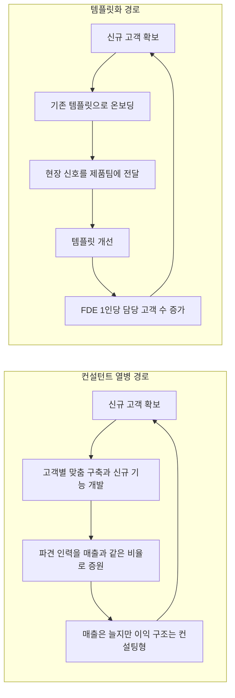
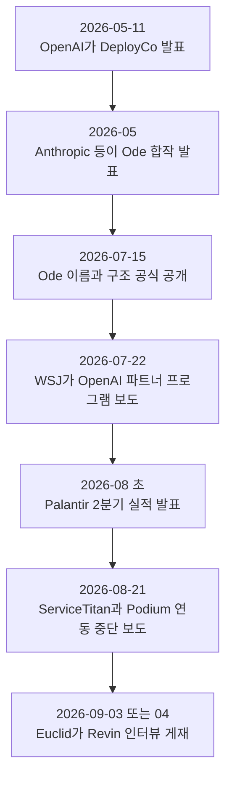
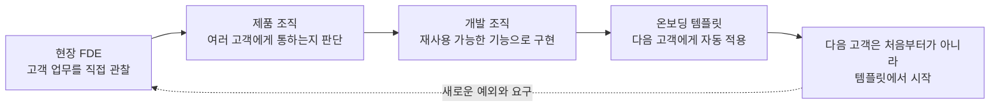
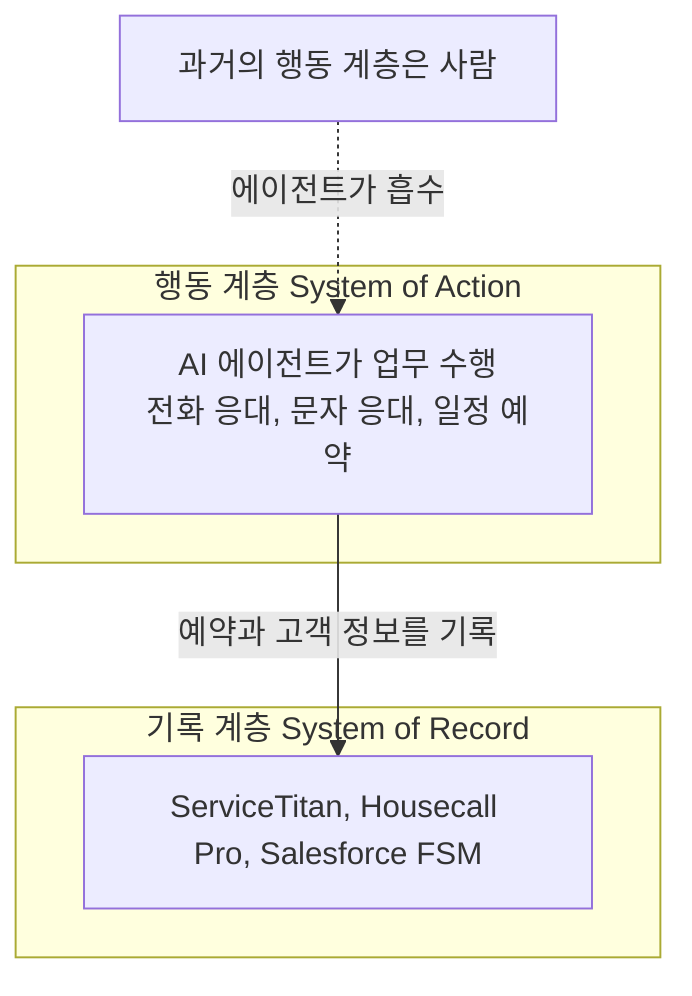

## Revin 창업자 인터뷰로 읽는 버티컬 AI의 '현장 파견 전략'

- **작성일**: 2026-09-21
- **분석 대상**: (1) 국내 SNS에 올라온 요약 게시글, (2) Euclid Ventures 뉴스레터 *The Verticalist* 원문 "Forward-Deployed Everything — with Quinn Litherland, Founder & CEO @ Revin"
- **작성 방식**: 원문 전체를 직접 열람하고, 원문이 언급한 회사·사건을 별도로 검색해 교차 확인했습니다. 확인하지 못한 내용은 확인하지 못했다고 적었습니다.

## 관련글

[**<팔란티어 CTO가 'FDE 따라쟁이'들을 비웃은 이유>**](https://www.facebook.com/share/p/1FNM1L1Ln7/)

[**Forward-Deployed Everything**](https://insights.euclid.vc/p/forward-deployed-everything-fde-quinn-litherland-revin-ai)

---

### 이 문서에서 쓰는 표기

| 표기 | 의미 |
|---|---|
| **[확인]** | 공식 발표, 1차 보도, 회사 공식 페이지 등 공개 자료로 직접 확인한 사실 |
| **[보도]** | 언론·분석 매체의 2차 보도에 근거한 내용 (원출처 직접 확인은 못함) |
| **[주장]** | 당사자(회사, 창업자, 투자사)가 말한 내용으로, 독립적으로 검증하지 못한 것 |
| **[해석]** | 작성자의 해석·정리. 사실이 아니라 관점입니다 |

---

## 0. 먼저 읽는 요약

이 글의 핵심 질문은 하나입니다. **"고객사 현장에 최고의 엔지니어를 파견하는 방식(FDE, Forward Deployed Engineer)이 왜 어떤 회사에서는 제품 회사의 성장 엔진이 되고, 어떤 회사에서는 '인공지능 간판을 단 컨설팅 회사'가 되는가?"**

답을 내놓은 사람은 뉴욕의 AI 스타트업 Revin의 창업자 Quinn Litherland입니다. Revin은 냉난방(HVAC), 배관, 지붕, 리모델링 같은 집수리·주택 서비스 업체에 음성·문자 AI 상담원을 도입해 주는 회사입니다. 그는 FDE 전략이 무너지는 길이 크게 두 가지라고 말합니다.

첫째는 **'컨설턴트 열병'** 입니다. 파견된 인력이 고객을 매우 만족시키지만, 현장에서 배운 것이 회사의 제품과 시스템으로 축적되지 않아서 고객이 늘 때마다 인력도 똑같이 늘려야 하는 상태입니다. 매출은 늘어도 이익 구조는 Palantir가 아니라 Accenture를 닮게 됩니다.

둘째는 **'현장 통제 불능'** 입니다. 직원의 절반이 고객사를 돌아다니며 불을 끄고 계약을 따오는데, 그 귀한 현장 피드백을 제품으로 옮기는 통로가 없어서 로드맵이 누더기가 되는 상태입니다.

처방은 두 가지입니다. 하나는 **템플릿화**, 즉 'FDE → 제품 → 개발'로 이어지는 규율 있는 통로를 만들고 "FDE 1인당 담당 고객 수"를 핵심 지표로 삼는 것입니다. 다른 하나는 **조직 설계**, 즉 FDE를 개발이나 영업이 아니라 제품 조직 아래에 두는 것입니다.

그리고 좋은 FDE는 '엔지니어'라기보다 **'미니 창업자'** 에 가깝다고 봅니다. 실제로 Revin의 최고 FDE는 자동차 디테일링(세차·광택) 사업을 직접 키워 매각한 경험이 있는 사람입니다.

다만 이 글은 **한 창업자의 관점과, 버티컬 AI에 투자하는 VC의 편집이 결합된 콘텐츠**입니다. 그래서 이 문서는 (a) 원문이 무엇을 말하는지 정확히 풀어 설명하고, (b) 원문이 언급한 사실들을 검색으로 확인했으며, (c) 확인되지 않거나 반론이 존재하는 부분을 따로 표시했습니다.

---

## 1. 이 글은 어떤 글인가: 출처의 구조

### 1-1. 세 겹의 구조

이 내용은 세 단계를 거쳐 전달되었습니다.

1. **원본 콘텐츠**: *Verticals*라는 주간 팟캐스트의 Quinn Litherland 편입니다. 챕터 목록이 59분대까지 이어지는 1시간 안팎의 대담입니다.
2. **1차 요약**: Euclid Ventures가 운영하는 뉴스레터 *The Verticalist*가 이 편을 글로 정리했습니다. 이 글이 이번 분석의 핵심 원문입니다.
3. **2차 요약**: 국내 SNS 게시글이 위 뉴스레터를 한국어로 다시 요약하고 재해석했습니다.

**[해석]** 따라서 국내 게시글의 문장 중 일부는 원문에 없는 수사(修辭)가 들어가 있을 수 있습니다. 예를 들어 "코웃음 치며 했다"는 표현은 원문에 없습니다. 원문은 Palantir CTO가 흉내 내는 회사들을 "놀렸다(made fun of)"고 쓸 뿐입니다. 이 차이는 아래 검증 표에서 다시 다룹니다.

### 1-2. 이번 분석의 한계

- 저는 뉴스레터 원문을 읽었고, 팟캐스트 음성 자체는 듣지 못했습니다. 따라서 뉴스레터에 인용부호로 나온 Quinn의 발언은 **Euclid가 옮긴 그대로** 다룹니다.
- 뉴스레터 하단의 챕터 목록에는 "인수합병(M&A) 물결", "왜 90%의 회사가 잘못된 계층에서 싸우는가", "UI는 방어력이 없다면 무엇이 대체하는가" 같은 항목이 있습니다. 이들은 팟캐스트 안에서 다뤄지는 주제이지만, 뉴스레터 본문에는 자세히 풀려 있지 않아서 **이 문서에서는 내용을 다루지 않습니다.**
- 게시일은 열람 환경에 따라 9월 3일 또는 9월 4일로 표시됩니다. 제가 페이지를 열었을 때는 "Sep 03, 2026"이었고 수정 시각 메타데이터는 UTC 기준 2026-09-03 16:59(한국 시각으로는 9월 4일 오전 1시 59분)였습니다. 국내 게시글과 제공해 주신 본문은 9월 4일로 표기했습니다.

---

## 2. 배경: FDE는 무엇이고, 왜 지금 모두가 하려 하는가

### 2-1. FDE의 원형은 Palantir

FDE(현장 파견 엔지니어)는 고객사 현장에 기술 인력을 직접 투입해서 실무를 속속들이 파악하고, 거기서 얻은 통찰로 제품을 만드는 방식입니다. 이 모델의 원조는 Palantir입니다. 현재 Palantir CTO인 Shyam Sankar는 2006년에 13번째 직원으로 합류했고, 미 하원 청문회 제출용 약력에 따르면 FDE라는 역할을 구상한 사람입니다. **[확인]** 스탠퍼드 강연 요약에서도, 최종 사용자 곁에 엔지니어를 두고 현장 피드백으로 2주 단위로 반복 개선하는 방식이 Palantir의 제품 개발 엔진으로 소개됩니다. **[확인]**

### 2-2. 지금 이 모델이 유행하는 이유

원문은 FDE가 버티컬 AI에서 "1년 넘게 이 분야의 전략"이었고, 거의 모든 회사가 갖고 있는 보편 기능이 되었다고 말합니다. 이유는 단순합니다. 5,000만 달러 규모의 냉난방 업체가 잠재 고객을 어떻게 분류하는지, 지역 업체가 문자·이메일·전화에 걸쳐 영업 주기를 어떻게 관리하는지, 30년 동안 같은 방식으로 장사해 온 제조업 사장이 어떤 상황에서 어떻게 반응하는지 같은 지식은 **문서로 거의 남아 있지 않기 때문**입니다. 현장에 들어가서 직접 보는 것 외에는 얻을 길이 없다는 것이 원문의 논리입니다.

여기에 2026년 들어 모델 회사들이 이 흐름에 직접 뛰어들었습니다. 이 부분은 4장에서 자세히 확인합니다.

### 2-3. Palantir CTO의 "흉내쟁이" 발언은 실제로 어땠나

원문은 Palantir CTO가 FDE를 흉내 내는 회사들을 놀렸고, 그 표현이 대략 "옷만 갈아입힌 세일즈 엔지니어"라는 취지라고 전합니다. 이 발언을 검색해 확인한 결과는 다음과 같습니다.

- 2026년 8월 초 Palantir 2분기 실적 발표에서 Sankar는 회사의 성장을 AI 플랫폼(AIP)과 FDE 팀의 공으로 돌리며, 대략 **"FDE는 Palantir만 갖고 있고, 다른 곳에는 번지르르한 세일즈 엔지니어가 있을 뿐"** 이라는 취지로 말한 것으로 보도되었습니다. 같은 실적 발표에서 매출은 전년 대비 93% 증가해 약 20억 달러에 근접했다고 합니다. **[보도]**
- 그 전에도 실적 후 주주 Q&A에서 그는 FDE 채용이 유행이 되었지만 다른 회사들은 본질을 이해하지 못하고 그저 모방(mimetic)할 뿐이라는 취지로 말한 것으로 보도되었습니다. **[보도]**

즉 **취지는 일치**합니다. 다만 뉴스레터가 인용부호 안에 넣은 문장("just sales engineers dressed up")과 제가 찾은 보도의 표현은 동일하지 않아서, 뉴스레터의 문구는 의역일 수 있습니다. 이 문서에서는 "Palantir CTO가 FDE 유행을 세일즈 엔지니어에 빗대 비판했다"까지만 확정 사실로 다룹니다.

---

## 3. 주인공 회사: Revin과 Quinn Litherland

### 3-1. Revin이 하는 일

Revin 공식 사이트는 자신을 트레이드·주택 서비스 사업자를 위한 AI 파트너로 소개합니다. 전화와 문자를 받아 고객의 의도를 분류하고, 일정을 잡고, 그 결과를 업체가 쓰는 기록 시스템(system of record)에 자동으로 예약·입력하는 것이 핵심입니다. **[확인]** 사이트는 또한 AI 엔지니어가 고객의 실제 업무 흐름, 연동, 예외 상황을 함께 살펴본다고 설명합니다. 이것이 곧 이 글의 주제인 'FDE 방식'입니다.

주로 연동되는 시스템은 ServiceTitan, Housecall Pro, Salesforce FSM 같은 **현장 서비스 관리(FSM) 소프트웨어**입니다. 원문 표현으로는 이들이 '기록 시스템'이고, 사람이 해 오던 전화 응대·일정 조율 같은 실무는 '행동 시스템(system of action)'입니다.

### 3-2. 회사 규모와 투자: 일치하는 것과 어긋나는 것

| 항목 | 원문(Euclid)의 서술 | 다른 자료에서 확인한 것 |
|---|---|---|
| 본사 | 뉴욕 | 일치 **[확인]** |
| 누적 투자금 | 1,000만 달러 남짓, 두 라운드 | 데이터베이스 두 곳(Preqin, Tracxn)은 **2025년 8월경 약 1,070만 달러 1건**으로 표기 **[보도]** |
| 주도 투자자 | Stellation Capital, Toyota Ventures | Revin 채용 공고에는 Stellation Capital 외 여러 투자자 이름이 있으나, **Toyota Ventures는 제가 찾은 자료에서 확인하지 못함** |
| 창업 | (기재 없음) | Tracxn 기준 2024년 Quinn Litherland 창업 **[보도]** |
| 인력 | (기재 없음) | Tracxn 기준 2026년 8월 시점 19명 **[보도]** |

**[해석]** 투자 라운드 수나 투자자 구성은 비공개 자료가 많아서 데이터베이스마다 다를 수 있습니다. 원문의 "두 라운드" 서술을 틀렸다고 단정할 근거는 없지만, 저는 공개 자료로 확인하지 못했습니다.

### 3-3. 성과 수치는 전부 회사 측 주장

원문은 Revin의 AI 상담원이 "종종 첫날부터 콜센터 최고 실적의 '직원'이 되고", 고객사가 "500만 달러 이상의 신규 매출"을 얻는다고 전합니다. **[주장]** 이는 Revin·Euclid 측 서술이며 제3자 검증은 확인하지 못했습니다. 또한 Revin 채용 공고들에는 "Revin 위에서 돌아가는 매출 규모"가 게시물에 따라 23억 달러, 30억 달러로 서로 다르게 적혀 있어서, 이런 규모 수치는 **참고용 자기 보고**로만 보는 것이 안전합니다. **[주장]**

또 하나 짚어 둘 점이 있습니다. 국내 게시글은 "6,500억 달러 시장"이라고 썼고 원문은 "$650B+ 산업"이라고 씁니다. 이것 역시 Euclid 측이 제시한 시장 규모이며 이 문서에서 별도로 검증하지 않았습니다.

---

## 4. 함정 1: 컨설턴트 열병 (Consultant Fever)

### 4-1. 어떤 상태인가

원문이 그리는 시나리오는 이렇습니다. 똑똑한 기술 인력을 고객 현장에 보냅니다. 일을 훌륭하게 해냅니다. 고객은 만족하고 매출도 오릅니다. 그런데 **배운 것을 회사의 자산으로 만들지 않습니다.** 새 고객마다, 어쩌면 새 사업장이나 팀마다 새로 구축해야 하고 새 기능까지 개발해야 합니다. 결과적으로 FDE 인력은 매출에 비례해 **선형으로** 늘어납니다. 매출총이익률은 Palantir가 아니라 Accenture를 닮게 됩니다.

Quinn은 이를 "제품이나 반복 가능한 시스템을 만들지 않으려는 100% 핑계"라고 강하게 말합니다. 고객은 당신 없이 살 수 없게 되지만, 정작 당신은 사업에서 레버리지를 얻지 못합니다. 원문은 "3년 차에도 고객마다 손으로 깔아주고 있다면 제품 회사가 아니라 AI를 쓰는 컨설팅 회사"라고 정리합니다.

### 4-2. 왜 모델 회사(OpenAI·Anthropic)는 예외로 취급되는가

원문은 이 대목에서 "일부 조직에게는 이것이 말이 되는 사업 모델"이라며 모델 회사의 구축 조직을 예로 듭니다. 그리고 그 이유를 이렇게 설명합니다. 이들의 목적은 모델 소비량을 늘리는 것이므로, 1,000만 달러 규모로 AI를 구축해 주고 떠나든, 남아서 LLM의 새 활용 사례를 계속 개발하든 **토큰이 더 소비되면 어떤 형태든 성공**이라는 것입니다. 반면 스타트업이 AI 인프라 비용 위에 얹을 수 있는 마진이 일회성 구축 용역뿐이라면 **모델 회사의 하청업체**에 불과하다고 경고합니다.

이 부분에서 원문이 언급한 두 조직의 실체를 확인했습니다.

**OpenAI의 DeployCo (OpenAI Deployment Company)**
- 2026년 5월 11일 OpenAI가 공식 발표했습니다. FDE를 고객 조직에 투입하는 것을 목적으로 하며, 19개 글로벌 투자사·컨설팅사·시스템 통합 업체와의 파트너십으로 구성됩니다. 영국 에든버러 기반 AI 컨설팅사 Tomoro를 인수해 약 150명의 FDE·배포 전문가를 첫날부터 확보하는 구조입니다. **[확인]**
- 이후 Northslope 인수로 FDE 규모가 수백 명으로 늘었고, 7월 22일 월스트리트저널이 OpenAI의 1억 5,000만 달러 규모 엔터프라이즈 파트너 프로그램을 보도했다고 합니다. **[보도]**

**Anthropic의 Ode (Ode with Anthropic)**
- Anthropic이 단독으로 만든 조직이 아니라, **Blackstone, Hellman & Friedman, Goldman Sachs 등과 함께 만든 15억 달러 규모 합작 법인**입니다. TechCrunch 보도에 따르면 5월에 시작해 7월 15일 이름과 구조가 공식 공개되었습니다. **[확인]**
- 출발점은 Blackstone이 포트폴리오 기업들에 AI를 도입하려고 대형 컨설팅사와 소형 AI 서비스 회사들을 써 본 뒤, 그중 성과가 좋았던 Fractional AI를 토대로 삼은 것입니다. Fractional의 공동창업자 Chris Taylor가 CEO를 맡았습니다. 초기 엔지니어는 약 100명으로 보도되었고, 절반 이상이 창업 경험자라고 소개됩니다. **[보도]**

**[해석] 원문의 "토큰 소비" 프레임은 Euclid의 분석입니다.** 원문은 이들의 동기를 모델 소비 증가로 설명하지만, Ode 측 공식 발언은 조금 결이 다릅니다. TechCrunch에 따르면 Ode의 CTO는 모델 선택이 중요하긴 해도 노력의 대부분이 들어가는 지점은 아니라고 말했고, Ode는 필요하면 경쟁사 AI 제품도 쓴다고 합니다. 즉 "모델 회사의 구축 조직은 토큰 소비가 목적"이라는 설명은 유력한 해석이지만, 각 조직이 그렇게 공언한 것은 아닙니다. 한편 Palantir 경영진은 실적 발표에서 토큰 과금 모델이 모델 회사에게는 좋을지 몰라도 다른 기업에는 성과 없이 비용만 늘린다는 취지로 비판했다고 보도됩니다. **[보도]** 이 논쟁은 아직 진행 중입니다.

### 4-3. Quinn의 경고

Quinn은 벤처 시장이 이상한 시기라며, 팀이 현금을 어디에 쓰는지에 훨씬 의도적이어야 하고 "거창한 비전 대신 반복 가능한 워크플로"를 만들어야 한다는 취지로 말합니다. 그가 문제 삼는 것은 **현장에 보내는 사람에게 들어가는 터무니없는 비용**입니다. 구원자는 오지 않는다는 표현이 이 맥락에서 나옵니다.

---

## 5. 함정 2: 현장 통제 불능 (Forward-Deployed Chaos)

### 5-1. 어떤 상태인가

두 번째 함정은 조직 문제입니다. 인력의 절반이 고객사를 뛰어다니며 불을 끄고 계약을 따오는데, **그 학습을 반복 가능한 제품으로 옮기는 사람이 없는** 상태입니다. 관리가 부실하면 FDE 방식은 의도된 제품 전략이 아니라 조직 혼란의 핑계가 됩니다.

### 5-2. 처방 ① 템플릿화 파이프라인

원문은 처방의 시작을 "템플릿화(templatization)"에서 찾습니다. FDE에서 제품으로, 제품에서 개발로 이어지는 규율 있는 통로입니다. 사례로 든 것이 Revin 자신입니다. 오늘 5,000만 달러 규모 냉난방 업체가 Revin에 가입하면, Revin 팀은 그 업체의 **상담 자격 판별 절차, 작업 유형 매칭 방식, ServiceTitan 연동 방법의 99%를 이미 알고** 시작한다고 합니다. 예전에는 현장에서 처음부터 세팅해야 했던 온보딩이 미리 만들어 둔 템플릿으로 진행되고, 사람은 감독하되 뼈대는 깔려 있다는 설명입니다. **[주장]**

**[해석]** "99%"는 정밀한 측정치라기보다 "거의 다 안다"는 수사로 읽는 것이 합리적입니다. 원문에서도 이를 측정 방법과 함께 제시하지 않았습니다. 또 원문의 "$50M HVAC company"가 매출 규모인지 기업 가치인지는 문장만으로는 명확하지 않은데, 국내 게시글은 매출로 옮겼습니다.

### 5-3. 처방 ② 진짜 봐야 할 숫자는 '1인당 담당 고객 수'

Quinn은 FDE가 매달 더 많은 것을 감당할 수 있어야 한다고 말합니다. 그가 꼽는 핵심 지표는 **인원수가 아니라 FDE 1인당 담당 고객(계정) 수**입니다. 이 비율이 개선되지 않는다면 제품을 키우는 것이 아니라 서비스 조직의 몸집만 키우고 있다는 뜻입니다.

**[해석]** 이 지표가 좋은 이유는 함정 1의 상태를 숫자 하나로 드러내기 때문입니다. 매출이 늘어도 이 값이 제자리라면 인력이 매출을 따라 선형으로 늘고 있다는 뜻이고, 값이 오른다면 템플릿과 제품이 사람의 일을 흡수하고 있다는 뜻입니다.

### 5-4. 처방 ③ FDE의 소속은 '제품 조직'

Quinn은 FDE가 개발이나 영업이 아니라 **제품 조직 아래** 있어야 한다고 봅니다. 현장 팀은 매일 실시간 피드백을 만들어 내는데, 그 신호가 만들고 있는 제품으로 곧장 흘러가지 않으면 가장 비싼 직원들을 '값비싼 건의함'으로 쓰는 셈이라는 논리입니다. 인용된 그의 말은, 개발 리더가 현장에서 배울 만큼 제품 중심적이지 않다면 언제나 겉핥기에 머문다는 취지입니다.

Euclid는 여기에 한 가지 함의를 덧붙입니다. 개발과 제품의 역할 구분이 과거보다 **더 이른 단계에서 중요해질 수 있다**는 것입니다. FDE가 자기 고객에게서 얻은 통찰을 직접 만들어 내면 효율적이지만, 그 결과물이 개별 고객에 한정되는 예외가 아니라 규칙이 되면 제품 로드맵이 순식간에 비일관적으로 변하기 때문입니다.

### 5-5. 가장 어려운 딜레마: 확장 요청을 거절할 것인가

원문에서 가장 현실적인 대목입니다. Revin이 2~3개 업무를 잘 해내면 고객은 **6개를 더** 원합니다. 새 업무는 새로운 시스템, 새로운 데이터 소스, 팀이 아직 풀지 못한 어려운 기술 문제를 건드릴 수 있습니다. Quinn은 이 긴장을 솔직히 인정하며, 과잉 약속으로 신뢰를 잃지 않으면서 "그거 만들 수 있어요"라고 말하는 방법이 무엇이냐고 묻습니다.

확장 매출을 거절하는 것은 아프고, 제품이 준비되기 전에 혹은 **다른 고객도 쓸 기능인지 확인하기 전에** "됩니다"라고 답하면 두 함정에 한꺼번에 빠집니다.

**[해석]** 원문은 이 딜레마에 정답을 제시하지 않습니다. 원문이 제공하는 것은 판단 기준의 방향입니다. 즉 확장 요청을 받았을 때 "이 기능이 대표 고객군(ICP) 전체에 통하는가"를 먼저 묻고, 그렇지 않다면 고객 한 곳을 위한 예외가 되는 것이므로 함정 1로 이어진다는 것입니다.

### 5-6. 반대 진영의 목소리: Decagon 사례

Quinn 본인은 AI 고객 서비스 스타트업 Decagon을 "인센티브 구조를 제대로 짠 회사"의 예로 언급합니다. 그런데 Decagon 관련 공개 자료를 찾아 보니 시각이 갈립니다.

- Decagon의 FDE 총괄(CTO of Forward Deployed Engineering) Sunny Rekhi의 발표 요약에 따르면, Decagon은 **FDE를 제품 엔지니어링과 같은 채용 기준·보고 체계·팀 구성으로 운영**하고, "맞춤 작업은 결국 셀프서비스가 되어야 한다"는 원칙을 내세운다고 합니다. **[보도]** 이는 Quinn의 "제품 조직 아래"라는 처방과 방향이 일치합니다.
- 반면 뉴스레터 *Newcomer*(2026-08-11)는 Decagon이 연 매출 1억 달러를 넘겼으며, CEO Jesse Zhang이 **FDE에 기대는 것을 약한 제품의 신호로 본다**며 FDE 의존에 강하게 반대하는 입장이라고 전합니다. 제품은 직관적이고 빠르게 커스터마이징되며 손이 덜 가야 한다는 것입니다. **[보도]** (해당 기사는 유료 구독자용이라 앞부분만 확인했습니다.)
- Decagon 공식 블로그(2026-06-22)는 고객 구축을 담당하는 역할을 'Agent Development Manager'로 재정의하며, 예전에 엔지니어가 한 스프린트를 들여 만들던 작업을 평문 영어로 반나절에 설계·디버깅·테스트한다고 설명합니다. **[확인]** 회사 자체의 설명입니다.
- **Quinn이 말한 "FDE가 갱신·확장 성과로 큰 보상을 받는 구조"가 Decagon에 실제로 있는지는 제가 확인하지 못했습니다.**

**[해석]** 이 대조가 주는 교훈은 "FDE는 옳다 / 그르다"가 아니라 **FDE를 얼마나 오래, 어떤 조건에서 쓰는가**입니다. 같은 분야의 성공한 회사들이 'FDE를 줄이는 것이 목표'라는 방향에서는 오히려 일치합니다. 다만 Revin이 속한 주택 서비스 시장처럼 고객이 기술 친화적이지 않은 곳에서는 사람의 개입이 더 오래 필요할 수 있다는 것이 원문의 암묵적 전제이나, 원문이 이를 직접 검증하지는 않습니다.

---

## 6. 누가 FDE를 잘하는가: '엔지니어'가 아니라 '미니 창업자'

### 6-1. Paul의 사례

Revin에서 가장 뛰어난 배포 리드 Paul은 텍사스 오스틴에서 자동차 디테일링 사업을 운영하다 합류했습니다. 국내 게시글은 이를 "세차장 사장"이라고 옮겼는데, 원문 표현은 car detailing business, 즉 세차와 광택·실내 관리를 포함하는 자동차 관리 서비스 사업입니다. 그는 이 사업을 월 매출 약 50만 달러까지 **자기 자본으로** 키워 매각했고, 이 과정에서 업계 사장님들이 어떻게 생각하는지에 대한 몸으로 익힌 감각을 얻었습니다. 지금은 기업가치 합계가 수십억 달러 규모인 지붕 업체 계정들을 관리한다고 합니다.

Quinn은 Paul이 지금 Revin을 나가 지붕 업체 인수합병(roll-up)을 굴려도 **사모펀드 종사자의 95%보다 잘할 것**이라고 말합니다. **[주장]** 물론 이는 창업자의 칭찬이므로 사실 진술이 아니라 평가로 읽어야 합니다.

### 6-2. 요구되는 자질

원문이 정리하는 FDE는 다음을 겸비해야 합니다.

- 업계 전문성
- 제품 감각
- 영업력
- 수십 년 같은 방식으로 장사해 온 사장님들에 대한 공감

이런 사람은 같은 주에 현장에서 에이전트를 배포하고, 추가 계약(업셀) 대화를 이끌고, 제품 인사이트를 팀에 되돌려 줍니다. 원문 표현으로 FDE는 "가끔 고객과 대화하는 엔지니어"도 "가끔 티켓을 올리는 고객 성공 담당자(CSM)"도 아닙니다.

### 6-3. 동시에 붙들어야 할 두 가지 인식

원문은 좋은 FDE가 다음 두 가지를 **동시에** 이해해야 한다고 강조합니다.

1. 나는 AI를 통해 고객의 **장사 방식을 바꾸러** 왔다.
2. 그분들의 수십 년 경험에는 **진짜 지혜**가 있고, 그것을 배워서 제품에 담아야 진정한 버티컬 AI가 된다.

앞의 것만 있으면 현장을 무시하는 외부인이 되고, 뒤의 것만 있으면 기존 방식을 그대로 자동화하는 대행업체가 됩니다. 이 균형 감각이 창업자 경험자를 선호하는 이유로 읽힙니다. **[해석]**

### 6-4. 이름이 바뀌고 있는 역할

원문은 일부 스타트업이 FDE라는 명칭을 바꾸고 있다고 전합니다. AI deployment strategist, forward-deployed architect / specialist, GTM engineer, 심지어 AI coach 같은 이름이 들린다고 합니다. 또 버티컬 AI 고객은 이 역할을 다르게 받아들인다고 합니다. 단순한 고객 지원의 연장이 아니라, AI를 아는 사람으로서 **드디어 자기 이야기를 들어주고 함께 만들어 주는 존재**라는 것입니다. 그래서 영업 과정에서 "나는 누구와 일하게 되나요?"가 하나의 질문으로 등장합니다.

Euclid는 이들이 점점 미니 창업자를 닮아 가므로 "직함 업그레이드가 필요할지도 모른다"고 관찰합니다. 국내 게시글은 이를 "Euclid는 이들을 '미니 창업자'라 부른다"고 단정적으로 옮겼는데, 원문은 "닮아 간다(resemble)"는 표현이라 정확히는 **관찰에 가까운 서술**입니다.

---

## 7. 돈 계산: FDE의 경제학

### 7-1. 핵심 숫자 정리

| 항목 | 원문의 서술 | 성격 |
|---|---|---|
| 고객 지원 비용 | FDE형 버티컬 AI는 SaaS 기준선보다 **약 50% 더 비쌈** | Euclid의 추정 **[주장]** |
| 계약 단가(ACV) | 컨설턴트·자문가·임원 역할까지 흡수하므로 상당히 큼 | Euclid가 본 바 **[주장]** |
| 성장 시나리오 | 10만 달러 계정이 100만 달러로 확장 (10배) | 가정 |
| Quinn의 계산 | 500만 달러 신규 매출을 만들어 주고 7만 달러를 받으면 심하게 저가 | 가정 (계산상 약 71배 차이) |
| 천장 | 고객 평균 매출이 50만 달러면 투입 가능한 인건비에 한계 | 논리적 제약 |

### 7-2. 왜 '지원 부서로 위장한 수익 부서'인가

FDE에게 갱신과 확장에 대한 수수료를 주면, 10만 달러 계정이 100만 달러로 커질 때 FDE 조직이 비용 부서가 아니라 **수익 부서**가 됩니다. 원문은 이를 "지원 부서로 위장한 수익 부서(a profit center disguised as a support function)"라고 부릅니다. Quinn은 FDE가 매일 출근하며 "모든 계정을 갱신하고 확장하면 올해 100만 달러를 벌 수 있다"고 생각하게 만들어야 한다고 말합니다.

### 7-3. 그러나 천장이 있다

원문은 곧바로 반대편의 제약을 붙입니다. **고객의 평균 매출이 50만 달러 수준이라면 쓸 수 있는 FTE 지출에는 자연스러운 한계가 있습니다.** 반면 Palantir처럼 매출이 수십억 달러에 이르는 대기업을 상대하면 고객사 전담팀을 상시 두는 것도 충분히 정당화됩니다. 여기서 "50만 달러 매출 고객"은 원문상 평균적인 고객사 자체의 연 매출이며, FDE에게 지급하는 금액이 아니라는 점에 유의해야 합니다.

**[해석]** Revin의 고객 중에는 원문에서 "5,000만 달러급 냉난방 업체"나 "기업가치 수십억 달러의 지붕 업체 계정"이 등장합니다. 즉 이들은 소규모 사장님과 초대형 기업의 **중간 이상 규모**를 겨냥하는 것으로 읽히며, 이 규모 선택 자체가 FDE 경제성을 성립시키는 조건일 수 있습니다.

### 7-4. 왜 '싸게 팔고 있다'고 보는가

Quinn의 논리는 이렇습니다. 사장님들은 이미 컨설턴트와 임시 전문 인력(fractional)에게 SaaS의 몇 배에서 수십 배를 내고 있습니다. 대시보드 사용법을 새로 배워 직접 관리하게 하는 것보다 **업무를 통째로 처리해 주는 것**에 대한 지불 의향이 훨씬 높다는 것입니다. 그래서 500만 달러의 신규 매출을 만들어 주고 7만 달러를 받는 것은 지나치게 싼 가격일 수 있다고 봅니다.

**[해석]** 다만 이 계산은 "500만 달러 신규 매출"이라는 성과가 사실이고 그 성과가 AI 상담원 덕분이라는 인과를 전제합니다. 앞서 봤듯 이 성과 수치는 회사 측 주장이므로, 가격 정당화 논리도 같은 조건부로 읽어야 합니다.

---

## 8. FDE가 통하면 무엇이 달라지는가: '행동 계층'을 먹는다

### 8-1. 기록 시스템과 행동 시스템

원문은 요즘 흔한 구분을 소개합니다. **기록 시스템(system of record)** 은 데이터가 저장되는 곳으로, Quinn의 분야에서는 ServiceTitan, Housecall Pro, Salesforce FSM입니다. **행동 시스템(system of action)** 은 그 데이터를 보고 실제로 일을 하는 계층입니다. Revin의 시각에서 지금까지의 행동 시스템은 **사람**이었습니다. 이제 에이전트가 그 계층의 상당 부분을 흡수할 잠재력이 있다는 것입니다.

전통적 버티컬 SaaS가 "내 플랫폼에서 시간을 보내게 하라"는 UI 계층 장악에 집중했다면, FDE를 앞세운 버티컬 AI는 **그 아래의 일 자체를 통째로 삼키는 것**에 집중한다는 것이 원문의 주장입니다.

### 8-2. 검증된 사례: ServiceTitan이 Podium을 끊은 사건

원문은 이 계층 다툼의 사례로 ServiceTitan과 Podium의 갈등을 듭니다. 이 사건은 별도 매체를 열어 확인했습니다.

**확인된 사실 [보도, SaaStr 2026-08-21]**
- Podium의 공동창업자·CEO가 게시한 내용에 따르면, ServiceTitan은 양사 **공유 고객 약 1,000곳**에 **약 30일의 유예**를 두고 Podium 연동을 끊겠다고 통지했습니다. 9년간 이어진 파트너십이었고 시기는 냉난방 성수기였습니다.
- ServiceTitan은 Podium을 새로운 AI·에이전트 시대 조건의 인증 프로그램에 편입시키려 했지만 인증이 진행되지 않았다고 설명한다고 합니다. (SaaStr 문장상 누가 진행하지 않기로 했는지는 분명하지 않습니다.)
- ServiceTitan은 이 정책을 통지 7주 전에 이미 공개했고, 그 핵심은 겹치는 제품을 가진 파트너는 환영하되 **파트너십과 지원을 이용해 ServiceTitan의 다른 부분을 점차 대체하려는 경우는 예외**라는 취지였습니다.
- Podium은 이 기간에 스스로 현장 서비스 관리(FSM) 제품을 내놓았고, 고객 연락처·작업 이력·가격표를 14일 안에 이전해 주는 팀까지 두었다고 합니다.
- ServiceTitan의 API 약관(2026-04-15 개정)에는 파트너의 AI 시스템이 스스로 호출할 엔드포인트나 수행할 동작을 결정하지 못하게 하는 등 AI 관련 제한이 포함되었다고 합니다.

Quinn의 해석은 이렇게 전해집니다. ServiceTitan이 Podium을 끊은 것은 Podium이 **에이전트를 돌려서가 아니라 경쟁 FSM을 만들었기 때문**이며, "곰을 찌르려고만 하지 않으면 아마 괜찮을 것"이라는 취지입니다. 그의 실무 조언은 **워크플로를 소유하라, 나머지는 신경 쓰지 마라**입니다. 일을 소유하면 UI와 데이터베이스까지 소유할 권리를 얻을 수도 있지만, 초기 스타트업이 그 길로 가면 힘센 기존 강자의 분노를 살 수 있고 오히려 협력하는 편이 나을 수 있다는 것입니다.

**[해석] 이 사건에서 주의할 점이 있습니다.**
- SaaStr의 글은 "Quinn의 해석이 옳다"고 확인해 주는 것이 아닙니다. 원인 서술은 양측 주장이 엇갈립니다. 게다가 같은 글이 **API 약관에 AI의 자율적 호출을 제한하는 조항**이 있다는 점도 함께 짚고, 시스템 오브 레코드 업체들이 에이전트 전용 약관을 강화하는 중이라 지금 열려 있는 것이 9~12개월 뒤에도 열려 있으리라 가정하지 말라고 조언합니다.
- 즉 "에이전트를 돌리는 것 자체는 괜찮다"는 Quinn의 낙관과, "기록 시스템 업체가 에이전트 접근을 제한하는 약관을 도입하고 있다"는 SaaStr의 관찰은 **긴장 관계**에 있습니다. 어느 쪽이 Revin 같은 회사에 더 크게 작용할지는 이 문서의 자료로는 판단할 수 없습니다.

### 8-3. 끝에 그려진 미래: 5명이 굴리는 5억 달러 지붕 회사

Quinn이 그리는 최종 시나리오는 **매출 5억 달러의 지붕 업체를 5명의 사람과 에이전트 부대가 운영하는 세상**입니다. 경영진과 핵심 관계 담당자, 즉 핵심 역량이 있는 곳은 사람이 남고 나머지 대부분은 자동화될 수 있다는 구도입니다. 그는 SaaS 시대에 '레거시'로 취급되던 전통 사업자들이 이제 자기 사업을 키우는 가장 멋진 방법들을 발견하고 있다고 봅니다.

**[해석]** 이는 예측이 아니라 비전입니다. 현재 검증된 내용은 아닙니다.

---

## 9. 초기 핵심 채용 세 가지와 '없는 직군'의 의미

### 9-1. 세 가지 채용

Quinn이 꼽은 AI 네이티브 버티컬 기업의 가장 중요한 세 명은 다음입니다.

| 순번 | 직군 | 원문이 말하는 프로필 |
|---|---|---|
| 1 | **FDE (AI 배포 전략가)** | 창업 경험자 프로필. 현장에서 신뢰를 쌓고 에이전트를 배포하며 확장 기회를 찾는 사람 |
| 2 | **영업** | 그 업계의 토박이. 업계 행사, 페이스북 그룹, 유통 채널을 다 꿰고 있는 사람. 일반 SDR이 아님 |
| 3 | **개발 (기술 리더)** | 기능 출시가 아니라 멀리 보고 시스템을 키울 수 있는 사람. 그리고 점점 까다로워지는 FDE–제품–개발의 접점을 관리할 사람 |

### 9-2. "PM, 디자이너, 마케팅 책임자가 없다"는 말의 정확한 뜻

국내 게시글은 이렇게 요약했습니다. **"명단에 PM, 디자이너, 마케팅 책임자가 아예 없음."** 원문은 이것이 "그 직군이 중요하지 않다는 뜻이 아니다"라고 분명히 덧붙입니다. 상위 3명을 물었기 때문에 빠졌을 뿐이며, **아주 초기 단계 스타트업에서는 FDE가 4번째 이후 모자를 여럿 쓸 수 있다**는 취지입니다.

Quinn의 문장은 이렇게 전해집니다. **FDE가 PM이고, 고객이 디자이너이고, 에이전트의 성과가 마케팅이다.** 즉 고객이 요구와 사용 방식을 통해 설계에 참여하고, 에이전트가 낸 성과가 곧 제품의 홍보 자료가 된다는 논리입니다.

**[해석]** 이것은 "PM·디자이너·마케터를 채용하지 말라"는 처방이 아니라, 매우 초기 단계에서 우선순위를 어떻게 잡을지에 대한 한 창업자의 견해로 읽는 것이 정확합니다. 참고로 Revin 채용 공고 중에는 첫 사내 시니어 프로덕트 디자이너를 뽑는 공고가 있습니다. **[확인]** 이 공고가 있다는 사실만 확인했고, 그 이유나 시점이 Quinn의 발언과 어떤 관계인지는 확인하지 못했습니다.

### 9-3. 결론에서 나온 비유: FDE를 CT 촬영기처럼

원문의 마무리는 다음과 같습니다.

- FDE를 **당장의 매출을 받치는 목발**로 쓰면 컨설팅 회사(AI 네이티브 서비스가 아닌 개발 외주사)가 됩니다.
- FDE를 **아무 제약 없이** 쓰면 로드맵이 방대해지고 제품이 일관성을 잃어 복리로 쌓이는 가치가 없어집니다.
- 가장 잘하는 창업자는 FDE를 **CT 촬영기**처럼 씁니다. 고객의 업무를 단층별로 촘촘히 훑어서, 여러 고객에게 통하는 제품으로 옮기고, 산업 안에 숨은 '행동 계층'을 드러내는 용도입니다.

FDE에서 얻어야 할 것은 어떤 워크플로를 소유할지, 그것을 어떻게 제도화할지, 창출한 가치를 어떻게 가격에 반영할지, 그리고 판매·마케팅에 쓸 고객의 관점과 언어입니다.

---

## 10. 국내 요약 게시글 ↔ 원문 ↔ 외부 검증: 대조표

| 주장 | 원문 기준 | 외부 검증 결과 |
|---|---|---|
| Palantir CTO가 FDE 흉내 내는 회사를 "옷만 갈아입힌 세일즈 엔지니어"라며 코웃음 | 원문: 놀렸다(made fun of), 인용 문구 "just sales engineers dressed up" | **취지는 확인** [보도]. 2026년 8월 실적 발표에서 "FDE는 Palantir만, 나머지는 번지르르한 세일즈 엔지니어" 취지 발언 보도. **인용 문구 자체는 동일 확인 못함**. "코웃음"은 원문에 없는 표현 |
| OpenAI는 DeployCo, Anthropic은 Ode를 꾸림 | 원문: OpenAI가 DeployCo를 분사하고 Anthropic이 Ode를 출범 | **확인** [확인]. 단 Ode는 Anthropic 단독이 아닌 Blackstone·H&F·Goldman 등과의 합작 15억 달러 법인. DeployCo는 19개 투자·컨설팅·통합 업체와의 파트너십 구조 |
| 모델 회사는 토큰만 많이 쓰이면 성공 | Euclid의 분석 | **해석**. Ode 측은 모델 선택이 노력의 중심이 아니며 경쟁사 AI도 쓴다고 밝힘 [보도] |
| Revin 누적 투자 1,000만 달러 남짓 | 일치 | 데이터베이스는 약 1,070만 달러 [보도]. Toyota Ventures 참여는 확인 못함 |
| 첫날부터 콜센터 1등 직원, 500만 달러 이상 신규 매출 | 원문 그대로 | **회사 측 주장, 독립 검증 못함** [주장] |
| 세차장 사장 출신 | 원문: car detailing business | 정확히는 자동차 디테일링 사업. 월 매출 약 50만 달러는 원문 서술 [주장] |
| "FDE 1인당 담당 고객 수"가 핵심 지표 | 원문 그대로 | 원문 서술 (Quinn의 견해) |
| FDE는 제품 조직 아래 | 원문 그대로 | Decagon FDE 총괄 발표는 FDE=제품 엔지니어링 동일 체계라는 방향 [보도] |
| Decagon이 인센티브 구조를 잘 짠 회사 | Quinn의 언급 | **확인 못함**. 오히려 CEO가 FDE 의존을 비판한다는 보도 존재 [보도] |
| ServiceTitan이 Podium을 차단 | 원문 링크로 제시 | **확인** [보도]. 약 1,000개 공유 고객, 약 30일 유예. 원인 설명은 양측이 엇갈림 |
| 지붕 업체를 5명이 굴리는 세상 | Quinn의 비전 | **비전**이며 검증 대상 아님 |
| 명단에 PM·디자이너·마케팅이 아예 없음 | 원문: 상위 3명 질문이라 빠졌을 뿐, 중요하지 않다는 뜻 아님 | **뉘앙스 보정 필요**. "채용하지 말라"가 아님 |

---

## 11. 비판적으로 읽기: 이 글의 한계

### 11-1. 이해관계와 구조

- 이 글은 버티컬 AI에 투자하는 VC의 뉴스레터이고, 본문 중간에 **스폰서 광고 구간**(핀테크 회사 Parafin)이 들어 있습니다. 뉴스레터 자체가 투자 콘텐츠·홍보 채널의 성격을 갖는 매체라는 점은 인지하고 읽어야 합니다. **[확인]**
- 인터뷰 대상은 자기 회사의 성과를 말하는 창업자입니다. 성과 수치와 FDE 사례는 대부분 **성공한 회사의 관점에서 본 회고**입니다. **[해석]**

### 11-2. 일반화의 범위

- 배경은 **주택 서비스 SMB** 시장입니다. 고객이 소규모 사업자이고, 전화·문자 응대처럼 성과가 눈에 띄게 측정되는 업무가 중심입니다. 이 조건이 다른 산업(금융, 제조, 공공)에 그대로 적용된다고 볼 근거는 원문에 없습니다. **[해석]**
- 원문 스스로도 "50만 달러 매출 고객"과 "수십억 달러 매출 고객"의 FDE 경제성이 다르다고 인정합니다.

### 11-3. 플랫폼 의존 리스크

- Podium 사례가 보여 주듯, 행동 계층에서 일하는 스타트업은 기록 시스템 업체의 약관과 정책 변화에 **구조적으로 의존**합니다. 이는 FDE 전략과 별개의 위험이지만 "행동 계층을 삼킨다"는 전략의 뒷면입니다. **[해석]**

### 11-4. 반대편 시각

- Decagon의 사례처럼 "FDE는 약한 제품의 증거"라는 관점이 실제 성공한 회사에서 공개적으로 나옵니다. 그러므로 "FDE가 필수"라기보다 "**어떤 고객·어떤 단계에서 FDE가 필요하고, 언제 줄여야 하는가**"가 더 정확한 질문입니다. **[해석]**

---

## 12. 실무 시사점 (모두 해석입니다)

원문이 직접 제시한 원칙을 점검 질문 형태로 바꿔 보았습니다. 이것은 원문의 주장을 실무에 옮기려는 시도이며, 원문에 그대로 있는 조언이 아닙니다.

1. **우리 팀의 "1인당 담당 고객(또는 프로젝트) 수"는 늘고 있는가?** 매출이 늘어도 이 값이 정체라면 서비스 조직이 되어 가고 있다는 신호입니다.
2. **현장에서 배운 것이 어디에 저장되는가?** 특정 사람의 머릿속이나 고객별 코드가 아니라 온보딩 템플릿·제품 기능으로 옮겨지는 경로가 있는지 확인해야 합니다.
3. **현장 신호를 받는 곳이 어디인가?** 원문은 그곳이 제품 조직이어야 한다고 봅니다.
4. **고객의 확장 요청을 받을 때 판별 기준이 있는가?** "다른 고객도 쓸 기능인가"를 확인하기 전의 '됩니다'는 두 함정 모두를 부릅니다.
5. **우리가 의존하는 기록 시스템의 약관이 바뀔 때 어떻게 되는가?** SaaStr 분석처럼 지금 열려 있는 통로가 계속 열려 있다고 가정하지 않는 편이 안전합니다.
6. **가격이 우리가 만드는 가치와 연동되어 있는가?** 원문의 '500만 달러 대 7만 달러' 논리는, 결과 단위 가격이 도구 단위 가격과 다를 수 있다는 문제의식을 던집니다. 다만 성과 측정이 신뢰 가능해야 성립합니다.

---

## 13. 용어 정리

| 용어 | 뜻 |
|---|---|
| **FDE (Forward Deployed Engineer)** | 고객 현장에 파견되어 실무를 파악하고 솔루션을 구축·배포하며 피드백을 제품으로 되돌리는 엔지니어 |
| **버티컬 AI** | 특정 산업(예: 주택 서비스, 의료, 법률)에 특화된 AI 제품·서비스 |
| **ICP (Ideal Customer Profile)** | 이상적인 고객 유형 |
| **ACV (Annual Contract Value)** | 연간 계약 금액 |
| **ARPA** | 계정당 평균 매출 |
| **기록 시스템 (System of Record)** | 업무 데이터가 저장되는 핵심 시스템 (예: ServiceTitan) |
| **행동 시스템 (System of Action)** | 데이터를 바탕으로 실제 업무를 수행하는 계층. 과거에는 사람, 앞으로는 에이전트가 흡수할 수 있다는 주장 |
| **FSM (Field Service Management)** | 현장 서비스 업체의 일정, 배차, 청구 등을 관리하는 소프트웨어 |
| **AINS (AI Native Service)** | AI 네이티브 서비스. Euclid가 쓰는 표현으로, AI가 서비스 제공을 수행하는 사업 형태 |
| **Roll-up** | 여러 소규모 업체를 인수해 하나로 묶어 키우는 전략 |
| **템플릿화 (Templatization)** | 반복되는 온보딩·업무 패턴을 재사용 가능한 틀로 굳히는 것 |
| **SDR** | 영업 개발 담당(초기 영업 접촉 담당) |
| **FTE** | 정규직 환산 인력 |

---

## 14. 참고 자료

접근일은 모두 2026-09-21입니다.

### 핵심 원문
- Euclid Ventures, The Verticalist, "Forward-Deployed Everything — with Quinn Litherland, Founder & CEO @ Revin" (2026-09-03/04): https://insights.euclid.vc/p/forward-deployed-everything-fde-quinn-litherland-revin-ai
- 위 원문이 링크한 팟캐스트 전체 에피소드(YouTube): https://www.youtube.com/watch?v=rfNGq2rzG7o

### Palantir·FDE 배경
- Channel Dive, "Palantir touts forward deployed engineers, reports record revenue growth" (2026-08-05): https://www.channeldive.com/news/palantir-forward-deployed-engineers-ai-revenue-spike/827139/
- Benzinga, Palantir 경영진 주주 Q&A 보도: https://benzinga.com/z/48613347
- 미 하원 청문회 제출 Shyam Sankar 약력 (2024-09-16): https://docs.house.gov/meetings/AS/AS00/20240916/117651/HHRG-118-AS00-Bio-SankarS-20240916.pdf
- Stanford, "The Palantir Story: Data And Operations For USG": https://svusg.stanford.edu/featured-sessions/the-palantir-story-data-and-operations-for-usg

### 모델 회사의 구축 조직
- OpenAI, "OpenAI launches the OpenAI Deployment Company" (2026-05-11): https://openai.com/index/openai-launches-the-deployment-company/
- MarketScale, OpenAI DeployCo와 1.5억 달러 파트너 프로그램 (2026-07-30, 2026-08-17): https://www.marketscale.com/industries/software-and-technology/openais-150-million-enterprise-push-puts-forward-deployed-engineers-inside-client-operations
- TechCrunch, "Anthropic, Blackstone bet the next trillion-dollar AI business is implementation, not just models" (2026-07-15): https://techcrunch.com/2026/07/15/anthropic-blackstone-bet-the-next-trillion-dollar-ai-business-is-implementation-not-models/
- Business Wire, "Anthropic, Blackstone, and Hellman & Friedman Introduce Ode with Anthropic" (2026-07-15): https://www.businesswire.com/news/home/20260715205134/en/Anthropic-Blackstone-and-Hellman-Friedman-Introduce-Ode-with-Anthropic-an-Enterprise-AI-Services-Firm
- MarketScale, Ode 관련 보도 (2026-08-01): https://www.marketscale.com/industries/software-and-technology/anthropic-and-blackstone-launch-15b-ai-implementation-firm-ode-betting-enterprise-deployment-beats-model-building

### Revin
- Revin 공식 사이트: https://revin.ai/
- Tracxn, Revin 프로필: https://tracxn.com/d/companies/revin/__JZjdTH67_khUe-ZiBzq9DOa6lXVnQpZ4-tuIjmFVP3E
- Preqin, Revin AI 프로필: https://www.preqin.com/data/profile/asset/revin-ai/763564

### ServiceTitan과 Podium
- SaaStr, "ServiceTitan Just Shut Off Podium's Integration for ~1,000 Shared Customers" (2026-08-21): https://www.saastr.com/servicetitan-just-shut-off-podiums-integration-for-1000-shared-customers-agents-turned-a-9-year-partner-into-a-direct-competitor/

### Decagon
- Newcomer, "Decagon Hit $100 Million Betting Against Forward Deployed Engineers" (2026-08-11, 유료 기사로 앞부분만 확인): https://www.newcomer.co/p/decagon-hit-100-million-betting-against
- Decagon, "Introducing Agent Development: How Decagon is redefining forward deployment" (2026-06-22): https://decagon.ai/blog/how-decagon-is-redefining-forward-deployment
- ZenML LLMOps Database, Decagon FDE 정리: https://www.zenml.io/llmops-database/scaling-forward-deployment-engineering-for-ai-customer-service-agents
- daily.dev, Sunny Rekhi 발표 요약 (2026-07-28): https://daily.dev/posts/how-forward-deployed-engineering-is-done-at-decagon-sunny-rekhi-yttztofti

---

**작성 일자: 2026-09-21**
