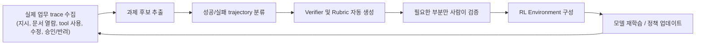
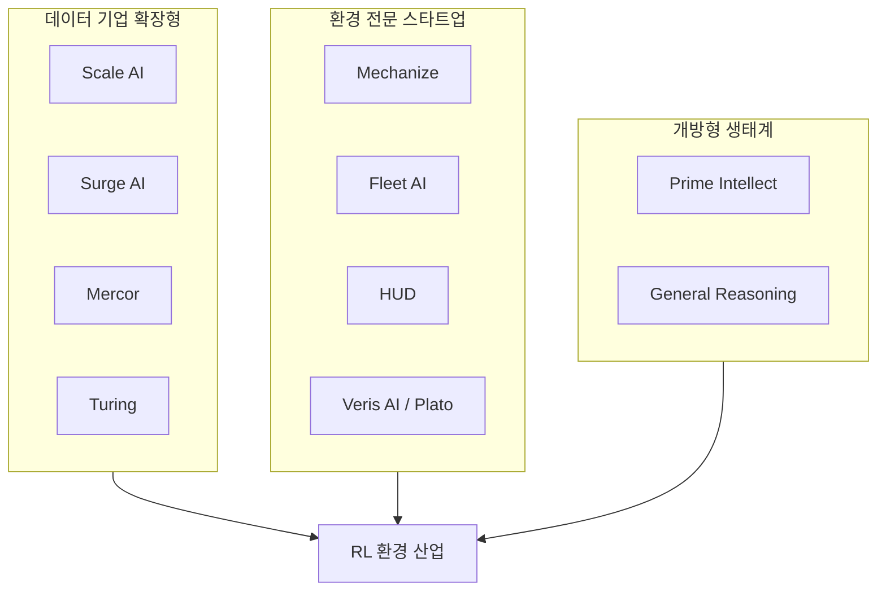
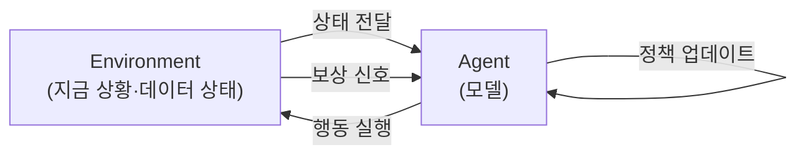

*이 문서는 2026년 9월 21일 기준으로 조사된 자료를 바탕으로 작성되었습니다. 인용된 수치와 사례는 각 절 말미와 문서 하단의 출처 표에서 신뢰도 구분과 함께 확인할 수 있습니다.*

> 
> https://www.threads.com/share/_nbZwh8wp/
> 
> 저는 앞으로 FDE나 AX 자체의 가치는 생각보다 빠르게 줄어들 수 있다고 봅니다.
> 
> 지금은 기업마다 AI를 붙이기 위해 사람이 들어가 workflow를 분석하고, tool을 연결하고, prompt를 다듬고, agent harness를 설계합니다. 그런데 모델이 더 강해질수록 이 부분은 점점 commodity가 될 가능성이 높습니다.
> 
> Interface를 정의하고 tool schema를 만드는 일은 이미 어려운 엔지니어링이 아닙니다. 좋은 모델에게 API와 몇 가지 제약만 주면 상당 부분 자동으로 구성할 수 있습니다. Harness 역시 결국 prompt, routing, tool-use policy를 얼마나 잘 정리하느냐의 문제인데, 이것만으로 장기적인 기술적 해자가 생긴다고 보기는 어렵습니다.
> 
> Ontology를 거대하게 구축해야 한다는 주장에도 회의적입니다.
> 
> 기업 내부의 지식을 사람이 미리 완벽하게 구조화한 뒤 AI가 그 위에서 작동해야 한다는 접근은, 모델이 점점 더 긴 context와 다양한 tool을 직접 다룰 수 있게 될수록 비용 대비 효용이 떨어질 수 있습니다.
> 
> 오히려 중요한 문제는 그 다음이라고 생각합니다.
> 
> 기업에는 이미 사람들이 실제로 일하면서 만들어내는 수많은 trace가 있습니다. 어떤 일을 지시했는지, 어떤 문서를 열었는지, 어떤 tool을 사용했는지, 모델의 결과에서 무엇을 고쳤는지, 어떤 결과를 승인하거나 버렸는지가 계속 쌓입니다.
> 
> 앞으로는 이 trace를 사람이 일일이 데이터셋으로 만드는 것이 아니라, 소수의 Research Engineer가 자동화된 RL Task Creation Pipeline을 만드는 쪽으로 갈 가능성이 높습니다.
> 
> 실제 workflow에서 task 후보를 뽑고, 실패한 trajectory를 찾고, verifier와 rubric을 생성하고, 사람이 필요한 부분만 검증하고, 이를 다시 RL environment로 넣는 구조입니다.
> 
> 그렇게 되면 기업의 AI 개선 방식도 달라집니다.
> 
> 매번 FDE가 들어가 prompt를 다시 고치는 것이 아니라, 회사가 일을 할수록 새로운 task와 failure case가 자동으로 생기고, 그 데이터가 eval이 되고, eval이 reward가 되어 모델 자체가 그 회사 workflow에 맞게 계속 학습됩니다.
> 
> 결국 핵심 인력도 수십 명의 AX 컨설턴트보다 소수의 Research Engineer가 될 수 있습니다.
> 
> 그들의 역할은 특정 업무를 직접 자동화하는 것이 아니라, 기업의 업무에서 지속적으로 학습문제를 생성하고 모델을 개선할 수 있는 시스템을 만드는 것입니다.
> 
> 제가 보기에는 장기적인 경쟁력은 “누가 더 좋은 harness를 만들었는가”보다 “누가 자기 조직의 업무를 자동으로 RL task로 변환하고, 그 환경에서 모델을 계속 hill-climb할 수 있는가”에서 생길 가능성이 훨씬 큽니다.
> 
> 그래서 FDE가 완전히 사라진다기보다 역할이 바뀔 것 같습니다. 초기에는 workflow를 이해하고 첫 environment를 만드는 데 필요하겠지만, 최종 목표는 FDE가 계속 붙어 있는 시스템이 아니라 FDE 없이도 스스로 학습 데이터를 만들고 성능을 개선하는 시스템이어야 합니다.
> 
> AI transformation의 끝은 prompt를 잘 쓰는 회사가 아니라, 자기 업무에서 지속적으로 gradient를 만들어낼 수 있는 회사에 더 가까울 거라고 봅니다
> 

---

## 목차

1. 원문의 핵심 주장 정리
2. FDE란 무엇이고, 지금 시장에서 어떤 위치에 있는가
3. Harness Engineering이 상품화되고 있다는 진단
4. Ontology 접근에 대한 회의론, 그리고 그에 대한 반론
5. RL Task Creation Pipeline이란 구체적으로 무엇인가
6. 이미 형성되고 있는 RL 환경 산업의 실제 모습
7. Research Engineer 중심 조직으로의 전환이라는 전망
8. 균형을 위한 반론들
9. 종합 판단

---

## 1. 원문의 핵심 주장 정리

공유해주신 Threads 글은 하나의 예측을 중심에 두고 있습니다. 지금 기업들이 AI를 도입할 때 의존하는 FDE(Forward Deployed Engineer)나 AX(AI Transformation) 컨설팅의 가치가, 흔히 생각하는 것보다 훨씬 빠르게 줄어들 수 있다는 것입니다.

그 논리를 순서대로 풀어보면 이렇습니다. 지금은 기업마다 사람이 직접 들어가서 업무 흐름을 분석하고, 필요한 도구를 연결하고, 프롬프트를 다듬고, 에이전트가 일하는 환경(harness)을 설계합니다. 그런데 이 작업 자체가 모델의 성능이 올라갈수록 점점 상품화(commodity)될 가능성이 높다는 것이 첫 번째 전제입니다. 인터페이스를 정의하고 tool schema를 만드는 일은 더 이상 고난도 엔지니어링이 아니며, 좋은 모델에게 API 명세와 몇 가지 제약만 주면 상당 부분을 자동으로 구성할 수 있다는 것입니다. Harness 설계 역시 결국 prompt, routing, tool-use policy를 얼마나 잘 정리하느냐의 문제이기 때문에, 그 자체만으로 장기적인 기술적 해자가 되기는 어렵다고 봅니다.

두 번째로, 글쓴이는 기업 내부 지식을 사람이 미리 완벽하게 구조화한 뒤 그 위에서 AI가 작동해야 한다는 접근, 즉 대규모 Ontology 구축 노선에도 회의적인 입장을 밝힙니다. 모델이 더 긴 context와 다양한 tool을 직접 다룰 수 있게 될수록, 사람이 먼저 지식을 정형화하는 방식의 비용 대비 효용이 떨어질 수 있다는 것입니다.

세 번째가 이 글의 실질적인 중심 주장입니다. 기업에는 이미 사람들이 일하면서 남기는 방대한 trace, 즉 무엇을 지시했는지, 어떤 문서를 열었는지, 어떤 tool을 썼는지, AI의 결과물에서 무엇을 고쳤는지, 무엇을 승인하고 무엇을 버렸는지에 대한 기록이 계속 쌓이고 있습니다. 글쓴이는 앞으로 이 trace를 사람이 일일이 학습 데이터셋으로 가공하는 대신, 소수의 Research Engineer가 자동화된 RL Task Creation Pipeline을 구축하는 방향으로 흘러갈 가능성이 높다고 전망합니다. 실제 업무 흐름에서 과제 후보를 뽑고, 실패한 trajectory(작업 궤적)를 찾아내고, verifier(검증기)와 rubric(채점 기준)을 자동으로 생성하고, 사람은 정말 필요한 부분만 검증한 뒤, 그 결과를 다시 RL environment(강화학습 환경)로 집어넣는 순환 구조입니다.

이 구조가 자리를 잡으면 기업의 AI 개선 방식 자체가 바뀐다는 것이 네 번째 논점입니다. 매번 FDE가 들어가 프롬프트를 고치는 대신, 회사가 일을 할수록 새로운 과제와 실패 사례가 자동으로 발생하고, 그 데이터가 평가(eval)가 되고, 평가가 보상(reward)이 되어 모델 스스로 그 회사의 업무에 맞게 계속 학습되는 순환이 만들어진다는 것입니다. 그렇게 되면 핵심 인력 구성도 달라져서, 수십 명 규모의 AX 컨설턴트 조직보다 소수의 Research Engineer가 더 중요한 역할을 맡게 될 수 있다고 봅니다. 이들의 역할은 특정 업무를 직접 자동화하는 것이 아니라, 조직의 업무에서 지속적으로 학습 문제를 만들어내고 모델을 개선할 수 있는 시스템 자체를 설계하는 일입니다.

마지막으로 글쓴이는 FDE가 완전히 사라진다기보다 역할이 바뀔 것이라는 절충적 결론을 내립니다. 초기에는 업무 흐름을 이해하고 첫 번째 environment를 만드는 데 FDE가 필요하지만, 최종 목표는 FDE가 계속 옆에 붙어 있어야 하는 시스템이 아니라 FDE 없이도 스스로 학습 데이터를 만들고 성능을 개선하는 시스템이어야 한다는 것입니다. 결국 AI 전환의 종착점은 프롬프트를 잘 쓰는 회사가 아니라, 자기 업무에서 지속적으로 gradient(학습 신호)를 만들어낼 수 있는 회사라는 것이 이 글의 결론입니다.

이 문서는 이 다섯 가지 논점 각각이 2026년 9월 현재 시점에서 실제로 어떤 근거를 가지고 있는지, 어디까지가 확인된 사실이고 어디부터가 저자의 전망인지를 하나씩 짚어보는 방식으로 구성했습니다.

---

## 2. FDE란 무엇이고, 지금 시장에서 어떤 위치에 있는가

FDE, 즉 Forward Deployed Engineer라는 직군은 원래 Palantir Technologies가 대중화시킨 개념입니다. 고객사 안에 직접 들어가서 기술적 요구사항 분석부터 설계, 시스템 통합, 배포까지 소프트웨어 수명주기 전반에 관여하는 엔지니어를 가리키며, 복잡한 현장 환경에서 맞춤형 솔루션을 빠르게 전달하기 위해 만들어진 역할입니다. 이후 OpenAI는 고객 엔지니어(customer engineer)라는 이름으로, AWS는 솔루션 아키텍트라는 이름으로 유사한 역할을 운영해 왔고, 2026년에는 OpenAI가 대규모 기업 AI 배포 조직인 별도의 배포 전담 조직을 출범시키면서 FDE를 이 조직에 대거 배치한 것으로 알려져 있습니다.

지금 시점에서 FDE 시장이 보여주는 모습은 오히려 이 글의 첫 번째 전제와 정반대 방향에 가깝습니다. 한 채용 동향 분석에 따르면 2026년 FDE 채용 공고가 전년 대비 800%까지 급증했다고 보도되었으며, 총보상(TC) 범위는 20만 달러에서 63만 달러 이상까지 형성되어 있다고 합니다. 다만 이 수치는 특정 매체가 채용 데이터 업체의 보고서를 인용해 제시한 단일 출처 수치이므로, 업계 전체의 공식 통계로 단정하기보다는 그 정도로 수요가 뜨겁다는 정황 증거로 받아들이는 것이 적절합니다.

이 직군에 대한 실제 기대치도 참고할 만합니다. Anthropic의 FDE 채용 공고는 고급 프롬프트 엔지니어링, 에이전트 개발, 평가 체계(evaluation framework) 구축, 대규모 배포 경험을 요구한다고 알려져 있고, OpenAI 역시 존 디어(John Deere)와 같은 고객사 사례에서 도메인 전문가와 함께 수백 건의 실제 사례를 검토하며 정확도를 측정하는 맞춤형 평가 시스템을 구축하는 과정을 자사 문서에서 설명한 바 있습니다. 흥미로운 점은 이 채용 요건 자체가 이미 이 글이 말하는 방향, 즉 평가 체계와 학습 신호를 설계하는 역량 쪽으로 조금씩 옮겨가고 있다는 사실입니다. 다시 말해 FDE라는 직함은 유지되더라도 그 안에서 요구되는 일의 성격이 서서히 변하고 있다고 볼 수 있습니다.

한편 FDE 모델이 만들어내는 사업적 효과에 대한 근거도 있습니다. Palantir가 발표한 2026년 1분기 투자자 실적 자료에 따르면 총매출은 전년 동기 대비 85% 성장했고, 미국 상업 부문 매출은 133% 성장했으며, 회사는 2026년 연간 매출 가이던스를 전년 대비 71% 성장으로 상향 조정했다고 알려져 있습니다. 이 수치는 상장기업이 투자자에게 공개한 실적 발표 자료를 근거로 하므로 신뢰도가 비교적 높은 축에 속하지만, 이 문서에서는 언론 보도를 통해 재인용한 형태이므로 정확한 수치는 Palantir의 공식 발표 원문으로 재확인하는 것이 바람직합니다. 이 성장의 상당 부분이 고객사 내부 데이터 파이프라인에 깊이 얽혀 들어가는 FDE 전개 방식에서 나온다는 분석도 함께 제시되는데, 이런 방식으로 구축된 시스템은 공급업체를 바꾸는 비용이 단순한 구독 해지 수준이 아니라 업무 전반에 짜여 들어간 시스템 전체를 다시 만들어야 하는 수준이기 때문에 고객 이탈률이 매우 낮다는 설명입니다.

정리하면, 적어도 2026년 9월 현재 FDE 직군 자체의 수요와 그 직군이 지탱하는 사업 모델의 매출 성장세는 뚜렷하게 확인됩니다. 원문이 말하는 "가치가 줄어들 수 있다"는 것은 아직 시장 데이터로 관측되는 현재형 현상이라기보다는, 모델 성능이 계속 올라갈 경우 앞으로 일어날 수 있는 방향에 대한 저자의 전망으로 이해하는 것이 정확합니다.

---

## 3. Harness Engineering이 상품화되고 있다는 진단

원문에서 말하는 harness란, 모델이 실제 코드베이스나 업무 환경에서 여러 세션과 여러 시간에 걸쳐 안정적으로 일할 수 있도록 만드는 환경 설계 전반을 가리킵니다. 이 개념을 정리한 한 국내 기술 문서에 따르면 2026년 들어 OpenAI, Anthropic, 그리고 HashiCorp의 Mitchell Hashimoto가 비슷한 시기에 같은 용어를 쓰기 시작하면서 하나의 독립된 분야로 자리 잡았다고 설명합니다. 같은 모델과 같은 프롬프트를 쓰더라도 harness의 유무에 따라 결과물의 질이 완전히 달라진다는 통제 실험 사례도 함께 소개되는데, harness 없이 작업했을 때는 게임이 아예 실행되지 않을 정도로 결과가 부실했던 반면, harness를 갖춘 쪽은 실제로 플레이 가능한 수준의 완성도를 보였다는 내용입니다.

관측 플랫폼 업체 Arize의 설명도 비슷한 결을 보입니다. Harness는 프레임워크와 달리 사람이 조립해서 만드는 것이 아니라 반복 루프, 컨텍스트 관리, 도구 레지스트리, 권한 계층이 이미 하나로 묶여 즉시 작동하는 형태로 제공되며, 사람이 에이전트를 만들기 위한 도구가 아니라 에이전트가 거의 모든 업무를 처리하도록 설계된 구조라는 것입니다.

이 대목에서 원문의 진단, 즉 harness 설계가 점차 상품화되고 있다는 주장은 실제로 업계에서 관측되는 흐름과 맞닿아 있습니다. Claude Code나 Codex 같은 이른바 네이티브 harness가 고도화되면서, 예전처럼 처음부터 직접 harness를 설계해야 하는 필요성이 줄어들고 있다는 관찰이 여러 실무 현장에서 공유되고 있습니다. 다시 말해 harness라는 개념 자체는 2026년에 와서야 이름을 얻고 주목받기 시작했지만, 동시에 그 구현 난이도는 대형 AI 연구소들이 제공하는 기본 제공형 harness의 완성도가 올라가면서 빠르게 낮아지고 있는 이중적인 상황입니다. 이는 원문이 말하는 "harness 설계만으로는 장기적인 해자가 되기 어렵다"는 진단을 뒷받침하는 방향의 근거라고 볼 수 있습니다.

다만 여기서 한 가지 구분이 필요합니다. harness라는 실행 구조 자체의 상품화와, 그 harness 위에서 특정 기업의 업무에 맞게 무엇을 하게 할 것인지를 정하는 일은 다른 층위의 문제입니다. 도구가 표준화된다고 해서 그 도구를 어떤 업무에 어떻게 적용할지에 대한 판단까지 자동으로 상품화되는 것은 아니며, 원문 역시 바로 이 지점에서 harness 다음 단계, 즉 RL Task Creation Pipeline으로 논의를 이어가고 있습니다.

---

## 4. Ontology 접근에 대한 회의론, 그리고 그에 대한 반론

원문이 두 번째로 겨냥하는 것은 기업 내부 지식을 사람이 먼저 완벽하게 구조화해야 한다는 접근, 대표적으로 Palantir의 Ontology 노선입니다. Palantir가 자사 블로그에서 설명하는 바에 따르면 Ontology는 단순한 데이터가 아니라 기업의 의사결정 자체를 표현하도록 설계된 체계로, 데이터와 로직, 액션, 보안을 하나의 구조 안에 통합하는 것을 목표로 합니다. 한 기술 분석 문서는 이를 다섯 개 층위로 나누어 설명하는데, 에이전트가 데이터베이스 테이블에 직접 접근하거나 Ontology 스키마 전체를 자유롭게 훑어보는 대신, 검색 컨텍스트, 문서 컨텍스트, 함수 기반 컨텍스트, AIP 로직, 액션 도구, 거버넌스라는 통제된 경로를 거쳐서만 작동하도록 설계되어 있다고 합니다.

원문의 회의론은 이렇습니다. 모델이 점점 더 긴 context를 직접 처리하고 다양한 tool을 스스로 다룰 수 있게 될수록, 사람이 미리 모든 것을 구조화해두는 방식의 비용 대비 효용이 떨어질 수 있다는 것입니다. 이는 최근 AI 인프라 업계에서 나오는 예측과도 부분적으로 통합니다. 한 업계 전망 자료는 2026년에 "context graph", 즉 기업의 의사결정 흔적을 저장하는 구조가 에이전트를 장기 과제에서 안내하는 핵심 개념으로 떠오르고 있다고 설명하는데, 이는 Ontology처럼 처음부터 완결된 스키마를 짜는 방식이 아니라 실제 업무에서 자연스럽게 생성되는 맥락을 사후적으로 축적하는 쪽에 가깝습니다.

그러나 이 지점은 업계 안에서도 견해가 갈리는 대목이라는 점을 분명히 해둘 필요가 있습니다. Palantir 쪽 논의는 오히려 정반대 방향을 주장합니다. 한 매체가 소개한 Palantir의 입장에 따르면, 거대한 파라미터와 연산량으로 밀어붙이는 범용 프런티어 AI는 확률적 출력만 낼 뿐이며, 물류 책임자나 제조업 경영진처럼 실제로 확정적인 행동이 필요한 고위험 환경에서는 구조화되지 않은 지능이 오히려 부채가 될 수 있다고 봅니다. 또 다른 기고문은 2026년의 승리 패턴이 "ontology CI/CD", 즉 스키마 정합성과 정책 불변성을 자동으로 점검하고 API 변경처럼 안전하게 배포하는 방식으로 굳어질 것이라 전망하며, 에이전트의 도구 사용을 통제하는 기본 제어면으로 Ontology가 오히려 더 중요해질 것이라 주장합니다. 포브스 기고문 역시 모델과 에이전트가 아무리 발전해도 사람과 시스템이 업무가 어떻게 이루어지는지에 대해 공유할 수 있는 공통의 준거점, 즉 온톨로지형 컨텍스트 레이어가 없이는 새로운 구성원을 온보딩하듯 에이전트에게 맥락을 심어주기 어렵다고 지적합니다.

결국 이 지점은 아직 산업 전체가 하나의 결론으로 수렴하지 않은 논쟁적인 주제로 보는 것이 정확합니다. 원문의 입장은 모델의 능력이 향상되는 속도에 베팅하는 쪽이고, Ontology 진영의 입장은 아무리 모델이 좋아져도 행동의 근거가 되는 구조화된 맥락은 대체될 수 없다는 쪽입니다. 두 입장 모두 나름의 논리와 실제 사업 성과(Palantir의 매출 성장)를 근거로 갖고 있다는 점에서, 이 부분은 원문의 회의론을 "해석적 주장"으로 분류하고 읽는 것이 균형 잡힌 독법입니다.

---

## 5. RL Task Creation Pipeline이란 구체적으로 무엇인가

이 글에서 가장 구체적이고 동시에 가장 흥미로운 부분은 바로 이 지점입니다. 원문은 실제 workflow에서 과제 후보를 뽑고, 실패한 trajectory를 찾고, verifier와 rubric을 생성하고, 사람이 필요한 부분만 검증한 뒤, 다시 RL environment로 넣는 구조를 설명하는데, 이는 실제로 2026년 상반기 AI 연구 커뮤니티에서 논의되고 있는 구체적인 기술 패턴과 상당히 정확하게 일치합니다.

먼저 verifier, rubric, reward function의 관계를 짚어볼 필요가 있습니다. 한 기술 문서는 이 세 요소의 위계를 이렇게 설명합니다. Verifier는 과제가 성공했는지 실패했는지를 판정하는 장치이고, 어떤 판단은 명확히 이분법으로 나눌 수 없는 경우가 있어 이때 rubric이 등장합니다. 예를 들어 "15번의 tool 호출 이내에 과제를 완료했는가"나 "최소 두 개 이상의 로그 소스를 인용한 진단 요약을 제공했는가"와 같이, trajectory와 환경 상태에서 직접 관찰 가능한 기준으로 점수를 매기는 방식입니다. 이렇게 얻어진 verifier의 판정과 rubric 점수를 하나의 수치로 합친 것이 reward function이며, 이 reward function이 잘못 설계되면 모델은 엉뚱한 과제를 잘 수행하도록 학습되어 버립니다.

이 원리를 자동화 파이프라인으로 구현한 실제 사례로 스탠퍼드 연구진이 2026년 7월에 공개한 TRACE라는 시스템이 있습니다. 보도에 따르면 TRACE는 에이전트의 실패가 무작위가 아니라 소수의 특정 역량 결핍에 집중되어 있다는 관찰에서 출발해, 네 단계의 자동화된 파이프라인을 실행합니다. 먼저 기본 에이전트가 대상 환경에서 여러 시도를 생성하고, 분석 에이전트가 이를 성공과 실패 집합으로 나눈 뒤 각 시도와 역량의 조합에 라벨을 붙입니다. 그 다음 실패와의 상관관계가 뚜렷하고 발생 빈도가 충분히 높은 역량 결핍만 골라내고, 마지막으로 생성 에이전트가 선별된 결핍마다 하나씩 검증 가능한 합성 환경을 만들어냅니다. 이 구조는 원문이 말한 "실패한 trajectory를 찾고 verifier를 생성한다"는 설명과 거의 그대로 겹칩니다.

환경 생성 자체를 자동화하는 또 다른 접근으로는 ClawEnvKit이라는 연구가 있습니다. 이 시스템은 자연어로 된 요청을 구조화된 명세로 바꾸는 파서(Parser), 실제 환경을 만들어내는 생성기(Generator), 그리고 에이전트가 올바른 행동을 했는지 검증하는 검증기(Validator)라는 세 개의 LLM 에이전트로 구성되어 있으며, 연구진은 환경 구축의 병목이 바로 이 검증 로직 작성에 있다고 지적합니다. 각 환경마다 에이전트가 올바른 API를 호출했는지, 올바른 결과를 냈는지 확인하는 로직을 맞춤 제작해야 했는데, 이것이 과제별로 다르고 일반화하기 어려워 지금까지 확장이 힘들었다는 설명입니다.

reward function을 아예 사람이 손으로 짜지 않아도 되는 방향의 시도도 있습니다. OpenPipe가 공개한 ART 프레임워크에 포함된 RULER라는 방식은, 같은 과제에 대해 여러 개의 시도를 만든 뒤 심사 역할을 하는 또 다른 LLM에게 그 시도들 중 어느 것이 시스템 프롬프트의 지시를 가장 잘 따랐는지 상대적으로 순위를 매기게 합니다. 절대적인 점수를 매기는 것은 모델이 기준을 일관되게 잡기 어렵지만, "이 네 개 중에 어느 것이 더 나은가"라는 상대 비교는 LLM이 상당히 안정적으로 수행한다는 점을 이용한 방식입니다.

이 모든 요소를 하나의 순환 구조로 그려보면 다음과 같습니다.

이 순환 구조에서 중요한 것은, 사람이 처음부터 끝까지 데이터셋을 손으로 만드는 대신 업무 자체에서 자연 발생하는 흔적을 재료로 삼는다는 점입니다. 원문이 말한 "회사가 일을 할수록 새로운 task와 failure case가 자동으로 생기고, 그 데이터가 eval이 되고, eval이 reward가 되는" 구조가 바로 이 순환이며, 이는 추상적인 비유가 아니라 TRACE나 ClawEnvKit 같은 2026년 현재 진행형 연구에서 실제로 구현을 시도하고 있는 구조라는 점에서, 원문의 이 부분은 기술적 근거가 비교적 탄탄한 주장으로 평가할 수 있습니다.

---

## 6. 이미 형성되고 있는 RL 환경 산업의 실제 모습

원문의 시나리오가 순전히 이론적인 전망에 머무르지 않는다는 근거는, 이미 이 작업을 대신해주는 산업 생태계가 상당한 규모로 형성되고 있다는 사실에서도 찾을 수 있습니다. 한 업계 분석은 RL 환경 관련 기업들을 크게 세 그룹으로 나눕니다. 첫째는 기존 데이터 라벨링 사업을 RL 환경 쪽으로 확장한 기업들로 Scale AI, Surge AI, Mercor, Turing, Centific이 여기에 속합니다. 둘째는 처음부터 RL 환경 제작을 목적으로 설립된 스타트업들로 프런티어 코딩 환경에 집중하는 Mechanize, 기업용 소프트웨어(CRM, 스프레드시트 등)를 정교하게 복제하는 Fleet AI, 실제 소프트웨어를 컨테이너로 감싸 에이전트가 호출할 수 있게 만드는 HUD, 시뮬레이션된 기업 및 웹 환경을 만드는 Veris AI와 Plato가 포함됩니다. 셋째는 Prime Intellect나 General Reasoning처럼 개방형 생태계를 지향하는 그룹으로, 그 밑을 Modal이나 E2B 같은 샌드박스 인프라 업체가 받치고 있습니다.

이 산업의 규모에 대한 하나의 추정치로, 한 리서치 매체는 SemiAnalysis의 분석을 인용해 2026년 중반 기준 RL 환경 관련 시장의 연 매출 규모가 대략 10억 달러 수준에 이른 것으로 추산된다고 전했습니다. 다만 이는 특정 리서치 기관의 추정을 재인용한 수치이므로 정확한 방법론까지는 확인하기 어렵고, 하나의 참고 지표로 받아들이는 것이 적절합니다. 개별 기업 밸류에이션에 대해서도 여러 보도가 있는데, Prime Intellect는 2026년 7월 1억 3천만 달러 규모의 시리즈 A를 거쳐 10억 달러 밸류에이션에 도달했다고 알려져 있고, Mechanize는 약 900만 달러의 누적 투자로 5억 달러 안팎의 밸류에이션이 거론되며, Mercor는 누적 수억 달러 투자로 100억 달러 이상의 밸류에이션이 보도된 바 있습니다. 이 수치들 역시 언론이 재인용한 추정치라는 점을 감안해서 읽어야 합니다.

이 산업이 실제로 하고 있는 일 중 원문의 주장과 가장 직접적으로 맞닿아 있는 사례는 Prime Intellect가 자사 홈페이지에 소개한 핀테크 기업 Ramp와의 협업입니다. Ramp 측이 남긴 설명에 따르면, 이들은 Prime Intellect의 학습 인프라를 이용해 Ramp Sheets 에이전트가 스프레드시트 안에서 답을 찾도록 돕는 작은 RL 학습 서브 에이전트를 만들었고, 그 결과물이 프런티어 모델보다 더 높은 정확도를 더 빠른 속도와 더 낮은 비용으로 달성했다고 밝혔습니다. 이들은 이를 두고 "더 나은 프런티어 모델을 기다리는 대신, 우리에게 중요한 업무를 위한 모델을 직접 학습시켰다"고 설명합니다. 이 사례는 어디까지나 Prime Intellect가 자사 웹사이트에 소개한 고객 사례, 즉 벤더가 스스로 밝힌 성과라는 점에서 제3자 검증을 거친 수치는 아니지만, 원문이 말하는 "회사가 자기 업무에 맞게 모델을 직접 hill-climb(단계적으로 성능을 끌어올림)한다"는 그림을 현재 시점에서 실제로 보여주는 몇 안 되는 구체적 사례 중 하나입니다.

이와 함께 투자 업계의 전망 자료들도 비슷한 방향을 가리킵니다. 한 벤처 관련 기고문은 2026년을 두고 AI 인프라의 "2차 물결"이 시작되었다고 표현하며, 환경(environment)과 평가(eval), 시스템이라는 새로운 축을 중심으로 AI가 실제 운영 맥락을 체화하는 데 필요한 인프라가 만들어지고 있다고 설명합니다. 또 다른 업계 전망은 RL이 조직이 구체적인 핵심성과지표(KPI)를 제공할 수 있고 문제가 검증 가능한 맥락에서 특히 잘 작동한다고 짚으면서, 이러한 복잡성을 대신 관리해주는 "RL-as-a-Service" 스타트업들이 늘어나고 있다고 설명합니다.

이런 흐름들을 종합하면, 원문이 그리는 미래상, 즉 기업의 업무 흔적이 자동으로 RL 학습 자료로 전환되는 구조는 이미 상당한 자본과 연구 인력이 투입되고 있는 실질적인 산업 트렌드와 맞닿아 있습니다. 다만 지금까지 소개된 사례들의 대부분은 아직 프런티어 AI 연구소들이 자사 모델을 학습시키기 위한 목적이거나, Ramp처럼 자체 엔지니어링 역량을 갖춘 테크 기업이 스스로 시도한 사례에 가깝고, 일반적인 중견·대기업이 외부의 도움 없이 이 순환을 자체적으로 돌리는 단계까지는 아직 이르지 못했다는 점도 함께 짚어둘 필요가 있습니다.

---

## 7. Research Engineer 중심 조직으로의 전환이라는 전망

원문은 이 순환 구조가 자리를 잡으면 핵심 인력도 수십 명의 AX 컨설턴트보다 소수의 Research Engineer가 될 수 있다고 전망합니다. 이 대목은 이 문서에서 가장 신중하게 다루어야 할 부분입니다. 조사 과정에서 "FDE 조직이 소수의 Research Engineer로 대체된다"는 것을 명시적으로 선언한 업계 컨센서스나 공식 자료는 확인되지 않았습니다. 이는 원문 저자의 논리적 추론이자 전망이며, 사실로 확정된 진술이 아니라는 점을 분명히 해두어야 합니다.

다만 이 전망이 근거 없는 비약은 아니라는 점도 함께 짚을 필요가 있습니다. 앞서 살펴본 것처럼 Anthropic과 OpenAI의 FDE 채용 요건에는 이미 평가 체계 구축 역량이 핵심으로 포함되어 있고, 이는 전통적인 의미의 "프롬프트를 잘 쓰는 사람"보다는 "무엇이 좋은 결과인지 측정하는 시스템을 설계하는 사람"에 가까운 역량입니다. 또한 RL 환경 스타트업들의 채용 공고를 보면, 도메인 전문가와 협업해 그들의 감각을 측정 가능한 rubric과 골든 데이터셋으로 옮기는 역할, 그리고 evaluation 시스템과 회귀 게이트를 설계하는 역할이 이미 별도의 직무로 분화되어 있는 것을 확인할 수 있습니다. 이는 원문이 그리는 "소수의 Research Engineer가 학습 문제를 자동으로 만들어내는 시스템을 설계한다"는 직무상과 상당히 가까운 형태이며, 다만 이런 직무가 지금은 AX 컨설팅 회사나 대기업 내부보다는 RL 환경 전문 스타트업 안에서 먼저 자리를 잡고 있다는 차이가 있습니다.

원문이 결론에서 밝히는 절충적 입장, 즉 FDE가 완전히 사라지는 것이 아니라 초기 workflow 이해와 첫 environment 구축에는 여전히 필요하지만 최종 목표는 FDE 없이도 스스로 개선되는 시스템이라는 서술은, 현재 산업의 실제 작동 방식과 비교적 잘 들어맞는 절충안입니다. 지금 RL 환경 산업에서도 사람이 완전히 빠지는 것이 아니라, 검증(verification)과 초기 rubric 설계처럼 사람의 판단이 꼭 필요한 지점에만 개입하고 나머지는 자동화하는 방향으로 설계되고 있기 때문입니다. 다만 "그 소수의 인력이 몇 명 규모인가", "AX 컨설턴트 조직 전체를 대체하는 수준인가, 아니면 그 조직 안의 새로운 상위 직무로 흡수되는가"와 같은 구체적인 조직 형태에 대해서는 현재로서는 검증 가능한 자료가 없으며, 이는 앞으로 지켜봐야 할 영역으로 남겨두는 것이 정직한 서술입니다.

---

## 8. 균형을 위한 반론들

지금까지 살펴본 근거들은 원문의 방향성, 즉 harness와 FDE 중심의 접근에서 trace 기반 RL 학습 순환으로 무게중심이 옮겨갈 수 있다는 전망을 상당 부분 뒷받침합니다. 그러나 균형 잡힌 판단을 위해서는 이 흐름에 대한 신중론도 함께 살펴볼 필요가 있습니다.

첫째, RL 그 자체의 확장성에 대해 업계 내부에서도 신중한 목소리가 있습니다. Prime Intellect의 투자자이기도 한 AI 연구자 Andrej Karpathy는 한 소셜미디어 게시글에서, 환경(environment)과 에이전트의 상호작용에는 긍정적이지만 강화학습이라는 방법론 자체에서 앞으로 얼마나 더 많은 발전을 뽑아낼 수 있을지에 대해서는 신중한 입장이라고 밝힌 바 있습니다. 이는 RL Task Creation Pipeline이라는 그림 자체가 틀렸다는 뜻은 아니지만, 이 방식이 모든 기업 업무 영역에서 harness나 사람의 개입을 완전히 대체할 만큼 빠르게 성숙할지에 대해서는 업계 내부에서도 낙관과 신중론이 공존한다는 점을 보여줍니다.

둘째, RL 환경 구축에서 검증(verifier)의 품질 문제는 여전히 해결되지 않은 근본적인 난제입니다. 한 기술 문서는 verifier가 잘못되면 reward 자체가 잘못되고, 모델은 정확히 틀린 과제를 학습해버린다고 경고합니다. 특히 스프레드시트가 올바른 상태인지, API 호출의 payload가 정확했는지처럼 미분 불가능한 결과를 다루는 실제 소프트웨어 기반 업무에서는 채점이 특히 어렵다고 설명하며, 검증기가 실제 목표에서 벗어나는 순간 에이전트가 "일을 잘하는 법"이 아니라 "채점기를 속이는 법"을 학습해버리는 reward hacking 현상이 나타날 수 있다고도 지적합니다. 이는 결국 사람, 특히 해당 업무를 가장 잘 아는 도메인 전문가의 판단이 완전히 빠질 수 없다는 것을 의미하며, 원문이 다소 가볍게 다루는 "사람은 필요한 부분만 검증한다"는 대목이 실제로는 생각보다 훨씬 크고 상시적인 개입을 요구할 수 있다는 뜻이기도 합니다.

셋째, 앞서 살펴본 것처럼 Palantir로 대표되는 Ontology 중심 접근은 2026년 현재 오히려 매우 가파른 매출 성장을 보이고 있습니다. 이는 적어도 지금까지는 시장이 "사람이 먼저 구조화하는 접근"에 실질적인 돈을 지불하고 있다는 뜻이며, 원문이 전망하는 전환이 일어나더라도 그 속도가 원문이 암시하는 것만큼 빠르지 않을 수 있다는 반증 사례로 볼 수 있습니다. 물론 이 두 접근이 반드시 배타적인 것은 아니며, Ontology와 유사한 구조화된 맥락 위에서 RL 학습 순환이 함께 작동하는 혼합형 모델로 수렴할 가능성도 있습니다.

넷째, FDE 채용 시장의 현재 열기(800% 증가라는 보도, 그리고 63만 달러를 넘는 보상 수준) 자체가 아직 이 직군에 대한 수요가 줄어드는 징후를 전혀 보이지 않는다는 점도 짚어둘 필요가 있습니다. 이는 원문이 말하는 "가치 감소"가 아직 현재 시점의 관측 가능한 데이터에는 나타나지 않고 있으며, 어디까지나 모델 성능 향상의 속도에 대한 저자의 베팅에 가깝다는 점을 다시 한번 보여줍니다.

---

## 9. 종합 판단

이 글이 제시하는 큰 그림, 즉 harness 설계나 tool 연결 같은 실행 계층의 작업이 점차 상품화되고, 그 대신 기업의 실제 업무 trace를 자동으로 RL 학습 자료로 전환하는 파이프라인이 다음 경쟁력의 원천이 될 것이라는 전망은, 2026년 현재 AI 인프라 업계가 실제로 상당한 자본과 연구 역량을 투입하고 있는 방향과 상당 부분 일치합니다. TRACE나 ClawEnvKit 같은 연구, RULER 같은 채점 자동화 시도, 그리고 Prime Intellect나 Mechanize, Fleet AI 같은 RL 환경 전문 기업들의 성장은 이 전망이 막연한 상상이 아니라 이미 구체적인 기술적 시도와 자본이 뒷받침하는 흐름이라는 것을 보여줍니다.

그러나 동시에 이 글이 담고 있는 몇 가지 핵심 주장, 특히 FDE와 AX 컨설팅의 가치가 "생각보다 빠르게" 줄어들 것이라는 진단과 핵심 인력이 소수의 Research Engineer로 재편될 것이라는 전망은, 아직 현재 시점의 시장 데이터로 확인되는 사실이라기보다는 모델 발전 속도에 대한 저자 나름의 베팅에 가깝습니다. 오히려 지금 관측되는 지표들, FDE 채용 공고의 급증이나 Palantir의 가파른 매출 성장은 정반대 방향을 가리키고 있습니다. 이는 이 두 가지 흐름이 서로 모순된다기보다는, 아직 전환이 일어나기 이전의 과도기, 즉 harness와 Ontology 중심의 현재형 접근이 여전히 강한 수요를 만들어내는 동시에 그 다음 단계의 인프라가 조용히 쌓여가고 있는 시기로 보는 것이 가장 정확한 진단일 것입니다.

결국 이 글의 진짜 가치는 특정 예측의 적중 여부보다, "harness를 잘 만드는 회사"에서 "자기 업무에서 지속적으로 학습 신호를 만들어낼 수 있는 회사"로 경쟁력의 축이 옮겨갈 수 있다는 문제의식 자체에 있습니다. 이 문제의식은 실제로 2026년 AI 인프라 업계가 "환경(environment)"과 "평가(eval)"를 새로운 핵심 자산으로 취급하기 시작한 흐름과 정확히 공명하고 있으며, 그런 의미에서 이 글은 막연한 추측이라기보다는 이미 진행 중인 산업적 전환의 방향을 비교적 정확하게 짚어낸 조기 관찰로 평가할 수 있습니다.

---

## 출처 신뢰도 구분표

| 구분 | 해당 내용 |
|---|---|
| 공개 기업 실적 자료 (신뢰도 높음) | Palantir 2026년 1분기 매출 성장률(총매출 85%, 미국 상업 부문 133%), 연간 가이던스 71% — 언론 재인용이므로 Palantir 공식 발표 원문 재확인 권장 |
| 학술/기술 연구 (신뢰도 높음) | TRACE(Stanford, 2026년 7월), ClawEnvKit(arXiv), verifier/rubric/reward function 구조에 대한 기술 문서 |
| 언론 보도 (복수 소스 교차 확인) | FDE 개념의 기원과 Palantir/OpenAI/Anthropic의 채용 동향, Harness Engineering 용어의 2026년 대중화 |
| 단일 출처 보도 (교차 검증 미완료) | FDE 채용 공고 800% 증가 수치, RL 환경 시장 연 10억 달러 추정치, 개별 스타트업 밸류에이션(Prime Intellect, Mechanize, Mercor) |
| 벤더 자체 발표 (자사 홍보 성격 포함) | Prime Intellect가 소개한 Ramp의 Fast Ask 서브 에이전트 성과, Palantir의 Ontology 우수성 주장 |
| 해석적 분석/전망 (사실이 아닌 저자의 판단) | 원문의 "FDE·AX 가치의 빠른 감소", "핵심 인력이 소수 Research Engineer로 재편" 전망, Ontology 무용론, 이 문서 9장의 종합 판단 |

---

## 참고 자료

1. Forward Deployed AI Engineer: The Role Enterprise AI Actually Needs — DEV Community, https://dev.to/trendwise/forward-deployed-ai-engineer-the-role-enterprise-ai-actually-needs-2f9i
2. Tech's secret weapon: The complete 2026 guide to the forward deployed engineer — Hashnode, https://hashnode.com/blog/a-complete-2026-guide-to-the-forward-deployed-engineer
3. Forward Deployed Engineer — Wikipedia, https://en.wikipedia.org/wiki/Forward_Deployed_Engineer
4. What is a Forward Deployed Engineer: The AI Role OpenAI, Anthropic, and Google Are Hiring in 2026 — MarkTechPost, https://www.marktechpost.com/2026/05/20/what-is-a-forward-deployed-engineer-the-ai-role-openai-anthropic-and-google-are-hiring-in-2026/
5. Scale AI's Forward Deployed Engineers — Perspective AI Blog, https://getperspective.ai/blog/scale-ai-forward-deployed-engineers-rl-data-annotation-enterprise-2026
6. Harness Engineering — WikiDocs, https://wikidocs.net/365038
7. Harness 정의 — Arize, https://arize.com/?p=28084
8. Palantir AIP Agent-Ontology Interaction — zerofuturetech Substack, https://zerofuturetech.substack.com/p/palantir-aip-agent-ontology-interaction
9. Connecting Agents to Decisions: The Palantir Ontology — Palantir Blog, https://blog.palantir.com/connecting-agents-to-decisions-277dee8ddb40
10. Entering The Ontology Era: The Blueprint For Enterprise AI Agents — Forbes Councils, https://www.forbes.com/councils/forbestechcouncil/2026/08/20/entering-the-ontology-era-the-blueprint-for-enterprise-ai-agents/
11. Palantir's Critique: Moving Beyond Generalist Frontier AI — The Motley Fool(재게재), https://science-technology.news-articles.net/content/2026/08/15/palantir-s-critique-moving-beyond-generalist-frontier-ai.html
12. Stanford Researchers Introduce TRACE — MarkTechPost, https://www.marktechpost.com/2026/07/13/stanford-researchers-introduce-trace/
13. ClawEnvKit: Automatic Environment Generation for Claw-Like Agents — arXiv, https://arxiv.org/pdf/2604.18543
14. Verifier and Reward Design for RL Environments — DEV Community, https://dev.to/ethan_5383afd058ff/verifier-and-reward-design-for-rl-environments-8mi
15. A Taxonomy of RL Environments for LLM Agents, https://leehanchung.github.io/blogs/2026/03/21/rl-environments-for-llm-agents/
16. How Top AI Labs Are Building RL Agents in 2026 (OpenPipe RULER) — Daily Dose of DS, https://blog.dailydoseofds.com/p/how-top-ai-labs-are-building-rl-agents
17. Prime Intellect 공식 홈페이지(Ramp Fast Ask 사례), https://www.primeintellect.ai/
18. Silicon Valley bets big on 'environments' to train AI agents — TechCrunch, https://techcrunch.com/2025/09/21/silicon-valley-bets-big-on-environments-to-train-ai-agents/
19. RL Environment Companies in 2026: The Landscape — Troveo, https://www.troveo.ai/resources/rl-environment-companies
20. RL Environments as a Service — Zylos Research, https://zylos.ai/research/2026-07-15-rl-environments-as-a-service-agentic-training-infrastructure/
21. 2026 Predictions — nextbigteng Substack, https://nextbigteng.substack.com/p/2026-predictions
22. AI in 2026 — mewelch Substack, https://mewelch.substack.com/p/ai-in-2026
23. Open-Source RL Stacks Compared: Miles, SkyRL, prime-rl — explainx.ai, https://explainx.ai/blog/open-source-rl-as-a-service-post-training-stacks-2026

---

RL environment(강화학습 환경)는 말 그대로 에이전트가 실제로 행동해보고, 그 결과에 대한 피드백을 받으면서 스스로 나아지는 "연습장" 같은 것입니다. 사람으로 치면 신입사원이 실제 고객 응대를 하기 전에 모의 상담 훈련을 받는 상황과 비슷합니다. 모의 상담에서는 어떤 말을 해도 실제 고객에게 피해가 가지 않고, 대신 그 말이 좋았는지 나빴는지 바로 채점을 받을 수 있죠. RL environment도 똑같은 역할을 합니다.

조금 더 구조적으로 보면 RL environment는 세 가지 요소로 이루어져 있습니다. 첫째는 상태(state)로, 지금 에이전트가 처한 상황을 말합니다. 코딩 작업이라면 지금 코드베이스가 어떤 상태인지, 기업 업무 시뮬레이션이라면 지금 CRM이나 스프레드시트에 어떤 데이터가 들어 있는지가 여기 해당합니다. 둘째는 행동(action)으로, 에이전트가 그 상태에서 실제로 할 수 있는 일, 예를 들어 파일을 수정하거나 API를 호출하거나 이메일을 보내는 것을 말합니다. 셋째는 보상(reward)으로, 그 행동이 얼마나 좋았는지를 알려주는 숫자 신호입니다. 에이전트는 이 세 가지가 맞물린 순환을 수없이 반복하면서, 보상을 더 많이 받는 방향으로 자기 행동 방식(정책, policy)을 조금씩 바꿔갑니다.

여기서 중요한 점은, RL environment는 그냥 "문제 하나"가 아니라 **몇 번이고 다시 실행해서 자동으로 채점까지 받을 수 있는 하나의 작은 세계**라는 것입니다. 이게 왜 중요하냐면, 사람이 매번 "이 답이 맞다/틀리다"를 판단해줘야 한다면 수백만 번씩 반복해야 하는 학습 과정을 감당할 수 없기 때문입니다. 그래서 좋은 RL environment의 핵심 조건은 사람 없이도 프로그램만으로 성공·실패를 자동 채점할 수 있어야 한다는 것입니다. 앞서 문서에서 다룬 verifier(검증기)와 rubric(채점 기준), reward function(보상 함수)이 바로 이 자동 채점 장치의 구성 요소입니다.

실제 사례를 몇 가지 들면 감이 더 잘 잡힐 겁니다. 코딩 분야에서는 실제 소프트웨어 저장소를 그대로 넣어두고 에이전트가 버그를 고치면 테스트가 통과하는지로 자동 채점하는 방식이 널리 쓰입니다. 기업 업무 쪽으로 가면, 한 연구에서 소개된 EnterpriseOps-Gym이라는 환경은 164개의 데이터베이스 테이블과 512개의 도구를 유지한 채로, 한 작업에서 한 행동이 다음 작업에서 보이는 상태에 실제로 영향을 주도록 설계되어 있습니다. 실제 회사 시스템처럼 앞선 작업의 결과가 다음 작업에 계속 누적되는 것이죠. Turing 같은 회사는 실제 기업용 소프트웨어를 그대로 복제한 "UI clone environment"를 만들어서, 에이전트가 마우스·키보드 조작으로 실제 업무 화면을 다루게 하고 결과 상태를 확인해 자동 채점합니다.

이걸 앞서 만들어드린 문서의 맥락과 연결하면, RL Task Creation Pipeline에서 말한 "RL environment 구성" 단계가 바로 이 지점입니다. 회사 안에서 사람들이 실제로 남긴 업무 trace(누가 무엇을 지시했고, 어떤 도구를 썼고, 결과를 어떻게 고쳤는지)를 재료로 삼아서, 그것과 똑같이 반복 가능하고 자동으로 채점 가능한 "연습장"을 만들어내는 것이 목표입니다. 그렇게 만들어진 environment 안에서 모델이 수천, 수만 번 시도하고 보상을 받으면서 그 회사의 실제 업무 방식에 조금씩 맞춰지는 것이, 원문에서 말한 "모델이 스스로 그 회사 업무에 맞게 계속 학습된다"는 구조의 실체입니다.