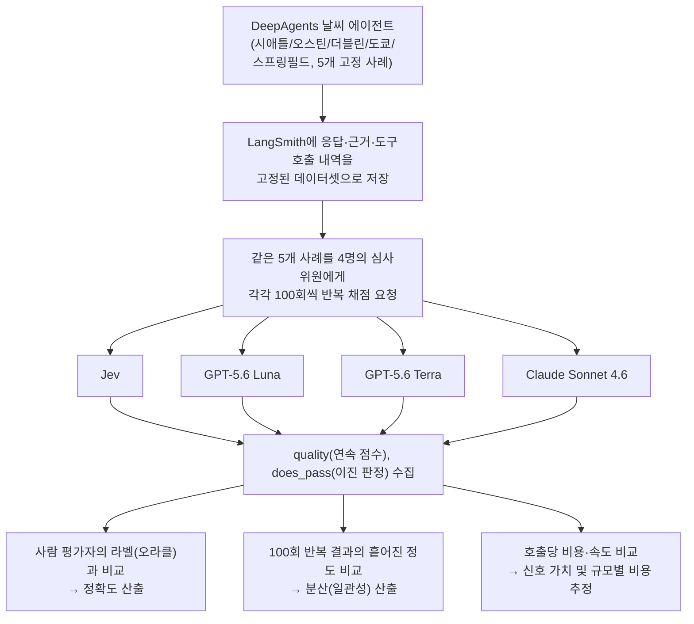
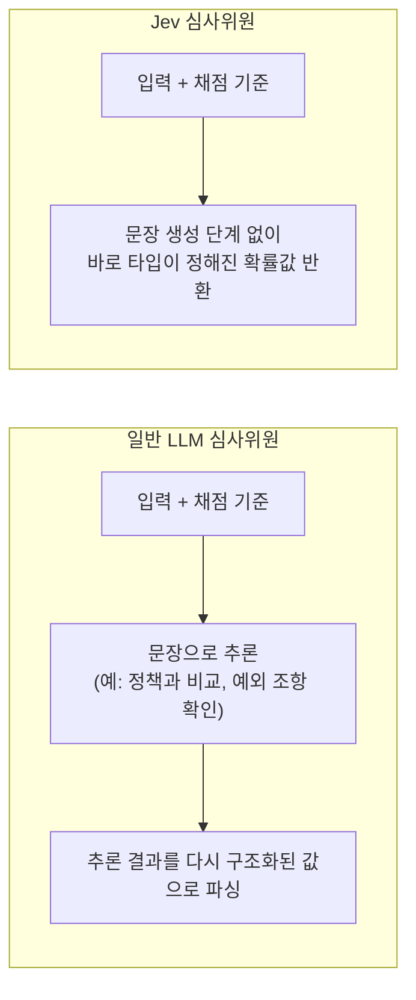
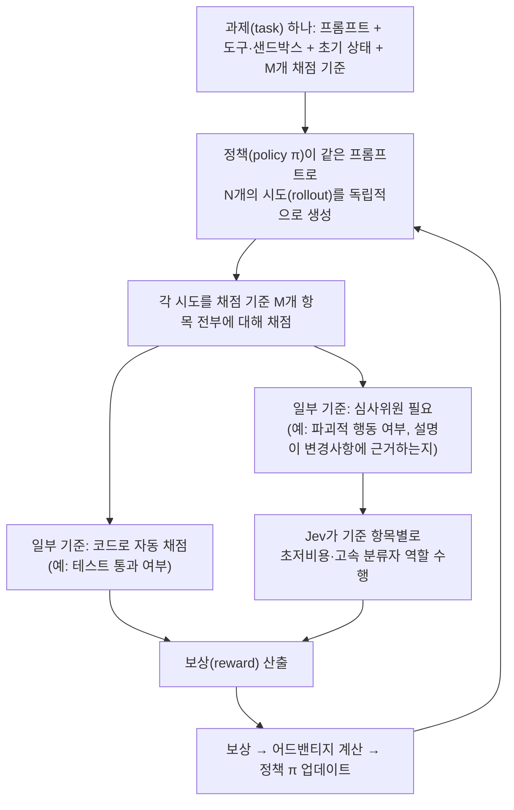

> 이 문서는 앞서 정리한 "Jev(TypeSafe AI) 완전 해설" 문서에 이어지는 내용으로, 이번에 새로 공유된 두 가지 자료 — LangChain(LangSmith)이 발표한 "Jev를 에이전트 평가자로 써봤다"는 벤치마크 글, 그리고 강화학습(RL) 환경 검증자로 Jev를 활용하자는 제안 트윗 — 를 이해하기 쉽게 풀어 설명합니다. 앞선 문서가 Jev의 한계(언어별 편향, 압축 오남용, 분류 오탐)를 다뤘다면, 이번 문서는 반대로 Jev가 실제로 강점을 보이는 좁지만 뚜렷한 영역, 즉 "심사(judging)와 검증(verification)" 용도에서의 성능을 다룹니다. 수치는 모두 원본 자료와 이를 뒷받침하는 공개 저장소·블로그 글을 대조해 확인한 것이며, 확인이 안 되는 부분은 임의로 채우지 않았습니다.

> 
> https://x.com/Vtrivedy10/status/2101688022513160700
> 
> [Viv](https://x.com/Vtrivedy10)[@Vtrivedy10](https://x.com/Vtrivedy10)
> 
> **Jev-as-a-judge RL Environment Verifiers  way cheaper + faster RL**
> 
> a lot of things in Agent World look like classification problems…including grading RL
> 
> many RL Tasks need a judge to verify pieces of outputs or trajectories
> at scale this can be very expensive and slow with tons of rollouts to score
> 
> Jev is incredibly fast and cheap meaning, can potentially remove the verification bottleneck for many tasks
> 
> we previously worked with
> [@harvey](https://x.com/harvey)
>  on their LAB benchmark which used LLM-as-Judge for tens of criteria per task
> 
> we found that Harness/Prompt Engineering +  Open Models meant we could judge tasks orders of magnitude cheaper
> 
> like any verifier, it needs to be calibrated to make you’re giving back a good signal
> 
> but Jev has the opportunity to massively bring down verification costs (and tuning friction) for many tasks
> 
> which means more teams will do RL, which is great!
> 
> https://x.com/LangChain/status/2101454284927959080
> 

---

## 1. 들어가며 — 왜 AI 에이전트에게는 "심사위원"이 필요한가

AI 에이전트를 만들고 운영하다 보면 반드시 마주치는 질문이 있습니다. "이 에이전트가 방금 한 행동이 정말 잘한 것인가?"라는 질문입니다. 사람이 에이전트의 응답 하나하나를 다 검토할 수는 없기 때문에, 이 판단을 대신 내려줄 자동화된 채점자, 즉 "평가자(evaluator)" 또는 "심사위원(judge)"이 필요합니다. 그리고 이 채점자가 내린 점수는 두 가지 용도로 쓰입니다. 하나는 이미 배포된 서비스가 잘 작동하고 있는지 확인하는 **평가(evaluation)** 용도이고, 다른 하나는 강화학습으로 모델을 훈련시킬 때 "이 시도는 잘했으니 보상을 주고, 이 시도는 못했으니 보상을 주지 않는다"를 결정하는 **검증(verification)** 용도입니다. 이번에 소개할 두 자료는 각각 이 두 가지 용도에서 Jev를 심사위원으로 써본 사례를 다룹니다.

---

## 2. 지금까지의 두 가지 채점 방식과 그 한계

지금까지 에이전트를 채점하는 방식은 크게 두 가지로 나뉘어 있었습니다.

**첫째, 코드 기반 평가**입니다. 코드가 존재해온 만큼 오래된 방식으로, 저렴하고 빠르고 결과가 일관적이라는 장점이 있습니다. 그러나 결정론적인 입력·출력만 다룰 수 있다는 근본적인 한계가 있습니다. 예를 들어 에이전트가 첫 실행에서 어떤 도구를 호출했는지는 코드로 쉽게 확인할 수 있지만, 그 도구가 반환한 결과를 에이전트가 실제로 잘 활용해서 사용자의 질문에 제대로 답했는지를 코드만으로 판단하기는 어렵습니다. 개방형 작업에서는 같은 도구 결과를 가지고도 여러 가지 방식으로 올바르게 답할 수 있기 때문에, 그 모든 경우의 수를 결정론적 로직으로 미리 정의하는 것은 금방 한계에 부딪힙니다.

**둘째, LLM을 심사위원으로 쓰는 방식(LLM-as-a-judge)** 입니다. 질문, 에이전트의 응답, 근거 자료를 통째로 언어모델에게 건네주고, 정해진 채점 기준(rubric)에 따라 문장으로 추론한 뒤 점수를 매기게 하는 방식입니다. 이 방식은 개방형 상황도 유연하게 다룰 수 있다는 장점이 있지만, 동시에 근본적으로 비결정적(non-deterministic)인 시스템이라 신뢰할 수 있는 테스트 기반으로 삼기 어렵고, 코드 기반 평가보다 느리고 비용도 많이 든다는 단점이 꾸준히 지적되어 왔습니다.

LangChain 팀은 여기서 한 가지 질문을 던집니다. 에이전트를 평가하는 일 자체가 본질적으로 "이 상태와 행동을 보고 하나의 점수·판정을 내리는" **판단(decision) 작업**이라면, 애초에 판단 작업에 특화되어 있다고 주장하는 Jev가 이 자리에 들어갈 수 있지 않을까 하는 것입니다. LLM 심사위원이 텍스트를 한 토큰씩 생성해가며 판단에 도달하는 반면, Jev는 처음부터 구조화된 상태(state)와 정해진 질문(questions)을 놓고 확률이 딸린 값을 곧바로 반환하도록 설계되어 있기 때문입니다.

---

## 3. LangChain의 실험: 네 명의 심사위원에게 같은 답안지를 채점시키다

### 3.1 실험 설계

LangChain은 자사의 오픈소스 에이전트 프레임워크인 Deep Agents로 날씨 정보를 알려주는 에이전트를 하나 만들었습니다. 이 에이전트에게 다음과 같은 다섯 가지 유형의 날씨 관련 질문을 던졌습니다.

| 요청 유형 | 지역 | 사용자의 의도 |
|---|---|---|
| 현재 날씨 | 시애틀 | 지금 날씨가 어떤지 |
| 주말 예보 | 오스틴 | 이번 주말 날씨가 어떨지 |
| 의사결정 지원 | 더블린 | 우산을 챙겨야 하는지 |
| 장기 예보 | 도쿄 | 확장 예보는 어떻게 나오는지 |
| 모호한 지역명 | 스프링필드 | 지역명이 명확히 특정되지 않은 요청을 어떻게 처리하는지 |

에이전트가 이 다섯 가지 질문에 답한 결과(응답, 근거, 도구 호출 내역, 기대되는 행동까지 포함)를 LangSmith라는 평가 플랫폼에 고정된 데이터셋으로 저장해 두었습니다. 그리고 이 다섯 개의 "고정된" 결과물을 놓고, 네 명의 심사위원 — Jev, GPT-5.6 Luna, GPT-5.6 Terra, Claude Sonnet 4.6 — 에게 **각각 100번씩 반복해서** 채점을 시켰습니다. 에이전트의 답안 자체는 이미 고정되어 있으므로, 100번의 채점 결과가 서로 달라진다면 그 편차는 순전히 "심사위원 쪽의 비일관성"에서 비롯된 것이라고 해석할 수 있는 설계입니다.

각 심사위원은 두 가지 신호를 반환하도록 요청받았습니다.

- **quality**: 검색 결과에 얼마나 근거했는지(grounding), 검색 행동이 적절했는지, 답변이 얼마나 쓸모 있었는지를 종합한 0~1 사이의 연속 점수
- **does_pass**: 단순히 합격/불합격을 가르는 이진 판정(0 또는 1)

그리고 별도로 사람 평가자가 다섯 개의 고정된 응답 각각에 대해 같은 채점 기준으로 "정답"에 해당하는 라벨을 매겨두었습니다. 이 사람의 라벨을 기준점(오라클, oracle)으로 삼아, 각 AI 심사위원이 사람의 판단과 얼마나 일치하는지(정확도)와, 같은 대상을 반복해서 채점했을 때 얼마나 같은 점수를 내는지(정밀도·재현성)를 따로 측정했습니다. 이 글에서 특히 강조하는 부분은, 낮은 분산(일관성)이 자동으로 높은 정확도를 뜻하지는 않는다는 점입니다. 어떤 심사위원은 매번 똑같이 틀린 판단을 반복할 수도 있기 때문입니다. 다만 어떤 심사위원이 정확하다는 전제 위에서는, 분산이 낮을수록 그 정확성을 실제 운영 환경에서 더 신뢰할 수 있게 됩니다.

### 3.2 Jev가 판단을 내리는 방식 — 세 가지 질문 유형 복습

이 실험에서 쓰인 Jev의 질문 유형은 앞선 문서에서 설명한 것과 동일하게 세 가지입니다.

- **Choice**: 여러 선택지 중 하나를 고르고 각 선택지별 확률과 전체 신뢰도를 함께 반환합니다. 예를 들어 "이 대화는 어떤 주제에 관한 것인가?"라는 질문에 청구(billing) 91%, 계정(account) 7%, 기술지원(technical) 2%처럼 답하면서, 이 판단 자체에 대한 신뢰도를 72%로 함께 제시하는 식입니다.
- **Score**: 정해진 등급(예: 미해결/부분해결/해결됨) 위에 답을 위치시켜 점수(예: 1.74점)와 신뢰도(예: 81%)를 함께 반환합니다.
- **Noul**: 참일 확률 하나만 반환하는 예/아니오 질문입니다. 예를 들어 "사용자가 결과에 만족했는가?"라는 질문에 94%라는 확률로 답하는 식입니다.

LangChain 팀이 제시한 비유가 이 차이를 잘 보여줍니다. "이 송장(invoice)은 사기인가?"라는 같은 질문을 던졌을 때, 일반 LLM은 항목과 거래처 이력을 근거로 이 송장이 정상으로 보인다는 문장을 새로 생성해서 답합니다. 반면 Jev는 처음부터 정해둔 선택지(사기/정상/검토 필요) 각각에 확률을 매겨 사기 7%, 정상 88%, 검토 필요 5%처럼 곧바로 구조화된 값으로 답합니다. 뒤에서 이 값을 파싱하거나 검증하는 과정이 따로 필요 없다는 것이 핵심 차이입니다.

이 차이는 "심사위원"으로서의 작동 방식에도 그대로 이어집니다. 예를 들어 "우리 회사의 환불 가능 기간은 언제까지인가?"라는 질문에 "30일 이내 어떤 물건이든 반품 가능"이라는 답이 왔고, 채점 기준이 정답과 일치하는지(correct), 출처에 근거하는지(grounded), 조건을 빠짐없이 담았는지(complete) 세 가지라고 해봅시다. 일반 LLM 심사위원은 먼저 문장으로 추론을 풀어놓습니다. 30일 반품 기간이 정책 문서와 일치하니 정답이자 근거가 있다고 판단하고, 다만 개봉된 상품에 대한 예외 조항이 정책에 명시되어 있는데 이 답변에는 빠져 있어서 정확하지만 완전하지는 않다고 결론짓는 식입니다. 이 추론 과정을 거친 뒤 correct: true, grounded: true, complete: false, 그리고 종합 점수 0.67이라는 구조화된 결과를 최종적으로 뽑아냅니다. 반면 Jev 심사위원은 이런 문장 추론 단계 없이, 같은 입력과 채점 기준을 곧바로 correct 98%, grounded 92%, complete 11%라는 세 개의 확률값으로 답하고, 이를 종합한 점수 역시 0.67로 나타냅니다. 최종 종합 점수는 비슷하게 나올 수 있지만, 그 점수에 도달하는 경로 자체가 "문장으로 추론한 뒤 구조화하는" 방식과 "처음부터 구조화된 확률로 직접 답하는" 방식으로 근본적으로 다르다는 것을 보여주는 예시입니다.

### 3.3 결과 ① — 정확도: 사람의 판단과 얼마나 일치했는가

사람 평가자의 라벨을 기준으로, 100번씩 반복된 does_pass(합격/불합격) 판정이 그 기준과 얼마나 일치했는지를 측정한 결과는 다음과 같습니다.

| 심사위원 | 사람 기준과의 일치율 |
|---|---|
| Jev | 100.0% (500번의 반복 판정 전부 일치) |
| GPT-5.6 Terra | 99.8% |
| GPT-5.6 Luna | 96.4% |
| Claude Sonnet 4.6 | 80.0% |

이 좁은 실험 범위 안에서는 Jev가 사람의 판단과 가장 잘 일치했고, Claude Sonnet 4.6이 상대적으로 가장 낮은 일치율을 보였습니다.

### 3.4 결과 ② — 정밀도(일관성): 같은 답안을 100번 채점해도 같은 점수가 나오는가

이 실험에서 가장 두드러진 차이는 정확도보다도 오히려 **일관성(분산)** 에서 나타났습니다. 다섯 개의 고정된 사례에 대해 100번 반복 채점했을 때 나온 quality 점수의 평균 분산은 다음과 같습니다.

| 심사위원 | 평균 분산 | Jev 대비 배수 |
|---|---|---|
| Jev | 0.0000149 | 1배(기준) |
| GPT-5.6 Luna | 0.00647 | 약 433배 |
| GPT-5.6 Terra | 0.01364 | 약 913배 |
| Claude Sonnet 4.6 | 0.00137 | 약 92배 |

숫자로는 잘 와닿지 않을 수 있는데, 100번 반복 채점한 점수를 실제로 선으로 그려보면 그 차이가 확연히 드러납니다. Jev의 점수 선은 거의 평평하게 유지되는 반면, 나머지 세 LLM 심사위원의 점수 선은 반복할 때마다 위아래로 눈에 띄게 출렁였습니다. 특히 이진 판정인 does_pass의 경우, Jev와 Terra는 100번 내내 거의 흔들림 없이 같은 판정을 유지한 반면, Luna는 반복 사이에 판정이 여러 차례 뒤집히는 모습을 보였습니다.

LangChain 팀은 이 결과의 "원인"까지는 이 실험만으로 단정할 수 없다고 스스로 밝히고 있습니다. 다만 한 가지 가능한 설명으로, TypeSafe AI가 Jev를 보정된 확률과 타입이 정해진 답을 반환하도록 훈련된 결정 모델이라고 설명하는 반면, 일반 LLM 심사위원은 먼저 텍스트를 생성한 뒤 그 결과를 점수로 변환하는 과정을 거친다는 구조적 차이를 언급합니다. 이런 차이가 이 좁은 범위의 채점 작업에서 Jev를 더 유리하게 만들었을 수 있지만, 이는 관찰된 결과일 뿐 그 원인이 훈련 목표 자체에 있다고 증명된 것은 아니라고 못박고 있습니다.

### 3.5 결과 ③ — 비용과 속도

비용과 속도 차이는 더욱 극명합니다.

| 심사위원 | 호출당 평균 비용 | 평균 응답 속도 | 실험 전체 비용 |
|---|---|---|---|
| Jev | $0.00035 | 0.44초 | $0.34 |
| GPT-5.6 Luna | $0.00039 | 2.50초 | $0.39 |
| GPT-5.6 Terra | $0.00289 | 2.83초 | $2.90 |
| Claude Sonnet 4.6 | $0.02811 | 2.16초 | $28.17 |

전체 실험 비용을 기준으로 보면 Jev는 Claude Sonnet 4.6 대비 약 83분의 1 수준의 비용으로 같은 채점 작업을 마쳤습니다. 이 수치는 danielgshea/jev-as-a-judge라는 공개 저장소에 실험 재현 정보와 함께 기록되어 있어, LangChain 블로그 글의 수치와 서로 일치함을 확인했습니다.

### 3.6 결과 ④ — 규모가 커졌을 때의 실질적 의미

LangChain 팀은 여기서 한 걸음 더 나아가 "신호 가치(signal value)"라는 지표를 제안합니다. 이는 사람 기준과의 일치율(정확도)과 반복 재현성(같은 대상을 다시 채점했을 때 같은 결론이 나올 확률)을 곱한 값으로, 정확하면서도 안정적인 심사위원일수록 높은 점수를 받도록 설계되었습니다. 이 지표와 함께, 하루에 1만 건의 트레이스(에이전트 실행 기록)를 채점하는 실제 서비스 규모를 가정했을 때의 비용을 추정한 결과는 다음과 같습니다.

| 심사위원 | 신호 가치 | 하루 1만 건 채점 시 비용 | 30일 누적 비용 |
|---|---|---|---|
| Jev | 100.0% | $3.45 | $103.59 |
| GPT-5.6 Luna | 90.1% | $3.91 | $117.24 |
| GPT-5.6 Terra | 99.4% | $28.89 | $866.61 |
| Claude Sonnet 4.6 | 80.0% | $281.14 | $8,434.08 |

즉 Jev는 이 실험 조건 안에서 가장 낮은 운영 비용으로 가장 높은 신호 가치를 냈다는 것이 LangChain 팀의 결론입니다. 이런 저비용 구조는 단순히 돈을 아낀다는 의미를 넘어, 팀이 채점을 더 자주, 더 많은 기준에 대해, 더 넓은 범위의 실행 기록에 대해 돌릴 수 있게 해준다는 실질적 의미를 갖습니다. 특히 실시간으로 운영 중인 서비스의 트레이스를 지속적으로 채점하는 "온라인 평가(online evaluation)"에서는, 호출당 비용이 낮을수록 더 촘촘한 피드백 신호를 얻을 수 있어 품질 저하를 더 빨리 감지할 수 있다는 이점으로 이어집니다.

### 3.7 LangChain 스스로 밝힌 한계

이 글에서 특히 눈여겨볼 부분은, LangChain 팀이 이 결과를 무비판적으로 홍보하지 않고 스스로 여러 단서를 달았다는 점입니다.

- 이 실험은 다섯 개의 고정된 사례로 이루어진 좁은 범위의 테스트이며, 다른 종류의 에이전트나 실제 프로덕션 환경에서도 같은 결과가 재현될지는 아직 확인되지 않았습니다.
- 여기서 "기대되는 행동"이란 사람이 사례별로 직접 정의한 기준일 뿐, 객관적인 절대 정답이 아닙니다.
- 비용이 낮다는 것은 동시에 위험 요인이기도 합니다. 만약 어떤 심사위원이 일관되게 틀린 판단을 반복한다면, 그 저렴한 비용은 잘못된 피드백을 대규모로 쏟아내는 결과로 이어질 수 있습니다. 그래서 엔지니어는 여전히 사람의 검토와 심사위원 자체의 정렬(alignment) 점검을 워크플로에 포함시켜야 한다고 강조합니다.

이 마지막 단서는 앞서 살펴본 Jev의 다른 한계들 — 언어에 따라 판단이 달라지는 현상, 충분한 맥락 없이 판단을 맡겼을 때의 위험 — 과도 정확히 같은 맥락에 있습니다. 낮은 분산(일관성)은 "믿을 만한 근거" 그 자체가 아니라, "일단 한 번 검증되고 나면 그 검증 결과를 계속 신뢰할 수 있는 근거"에 가깝습니다.

### 3.8 실험 구조를 도식으로 정리

---

## 4. 또 다른 사례 — 강화학습(RL) 환경을 검증하는 데 Jev를 쓰자는 제안

### 4.1 RL에서 "검증자(verifier)"가 왜 병목이 되는가

이번에 함께 공유된 또 다른 게시물은 LangChain의 벤치마크와는 조금 다른 맥락에서 Jev를 다룹니다. 강화학습으로 에이전트나 모델을 훈련시킬 때는, 하나의 과제(task)에 대해 정책(policy)이 여러 개의 시도(rollout)를 독립적으로 생성하고, 그 각각을 채점 기준(rubric)에 있는 여러 항목에 대해 전부 채점한 뒤, 그 점수를 보상으로 바꿔 정책을 업데이트하는 과정을 반복합니다. 이런 훈련 방식 중 하나를 GRPO(Group Relative Policy Optimization)라고 부릅니다.

문제는 이 채점 기준에 있는 항목들 중 일부만 코드로 자동 판정할 수 있고("테스트를 통과했는가" 같은 항목), 나머지는 사람이나 AI 심사위원의 판단이 필요하다는 점입니다("설명이 실제 변경 사항(diff)에 근거하고 있는가", "파괴적인 행동을 하지 않았는가" 같은 항목이 그 예입니다). 그런데 한 번의 훈련 스텝마다 필요한 심사위원 호출 횟수는 대략 "과제 수 × 과제당 시도 횟수 × 심사가 필요한 채점 기준 수"라는 곱셈으로 늘어납니다. 즉 과제가 많아지고, 과제당 시도 횟수가 늘어나고, 채점 기준이 세분화될수록 심사위원 호출 횟수는 기하급수적으로 불어나며, 이것이 대규모 강화학습에서 심사(검증) 단계가 속도와 비용 양쪽에서 병목이 되는 근본적인 이유입니다.

### 4.2 Jev를 검증자로 쓰자는 제안

이 문제의식에서 나온 제안이 바로 "Jev를 심사위원으로 써서 RL 환경의 검증 병목을 줄이자"는 것입니다. 게시물 작성자는 에이전트 환경에서 벌어지는 많은 일들이 본질적으로 분류(classification) 문제와 닮아 있으며, 강화학습의 채점(grading) 작업도 마찬가지라고 지적합니다. 많은 RL 과제가 결과물이나 시도 과정의 일부를 검증하는 심사위원을 필요로 하는데, 이 작업은 대규모로 진행될수록 매우 비싸고 느려질 수 있습니다. 이때 Jev처럼 압도적으로 빠르고 저렴한 모델을 쓴다면, 여러 과제에서 이 검증 병목 자체를 제거할 수 있는 잠재력이 있다는 것이 핵심 주장입니다.

게시물 작성자는 이전에 법률 AI 기업 하비(Harvey)와 협업하며 "LAB 벤치마크"라는 프로젝트에서 과제당 수십 개에 이르는 채점 기준에 대해 LLM 심사위원을 활용한 경험을 언급합니다. 이 협업을 통해 하네스(harness, 실행 환경을 감싸는 코드 구조) 설계와 프롬프트 엔지니어링을 오픈 모델과 결합하면, 과제를 수 배 더 저렴한 비용으로 채점할 수 있다는 것을 확인했다고 밝히고 있습니다. 다만 이 부분은 게시물 작성자 본인의 이전 경험을 요약해 소개한 것으로, 이 문서를 작성하며 LAB 벤치마크 자체의 세부 방법론까지 독립적으로 재확인하지는 못했습니다.

그리고 게시물은 한 가지 중요한 단서를 분명히 남깁니다. 어떤 검증자든 훈련에 좋은 신호를 되돌려주려면 반드시 **캘리브레이션(보정)** 이 필요하다는 것입니다. 이는 앞서 LangChain 실험이 강조한 것과 같은 맥락으로, Jev가 빠르고 저렴하다는 사실이 자동으로 "훈련에 쓸 만큼 신뢰할 수 있는 신호"를 보장하지는 않는다는 뜻입니다.

### 4.3 RL 검증 구조를 도식으로 정리

이번에 함께 공개된 도식의 내용을 정리하면 다음과 같은 흐름이 됩니다.

이 구조에서 한 훈련 스텝마다 필요한 심사 호출 수는 "과제 수 × 시도 횟수 × 심사가 필요한 기준 수"로 늘어나기 때문에, 이 중 심사위원 호출 하나하나의 비용과 속도를 줄이는 것이 전체 훈련 파이프라인의 처리량에 직접적인 영향을 미칩니다.

---

## 5. 두 사례를 종합하면 — Jev의 강점이 분명해지는 지점과, 여전히 남는 숙제

이번에 살펴본 두 자료는 앞선 문서에서 다룬 Jev의 한계와 대조적으로, Jev가 실제로 뚜렷한 강점을 보이는 영역을 구체적인 수치로 보여줍니다. 정리하면 다음과 같습니다.

첫째, Jev가 잘 맞는 영역은 "가능한 답의 형태가 미리 정해져 있고, 같은 유형의 판단을 대량으로 반복해야 하는" 상황이라는 점이 이번 두 사례에서도 다시 확인됩니다. 에이전트 응답을 정해진 채점 기준에 따라 합격/불합격 판정하는 일이나, RL 시도가 특정 규칙을 어겼는지 판정하는 일은 모두 이 조건에 정확히 들어맞습니다.

둘째, Jev의 가장 두드러진 강점은 단순한 정확도보다도 **반복 시의 일관성(낮은 분산)** 과 **압도적으로 낮은 비용·짧은 지연시간**에 있다는 것이 두 사례 모두에서 공통적으로 드러납니다. 이는 앞선 문서에서 짚었던 속도·비용상의 이점이 마케팅 수사가 아니라 실제로 독립적인 벤치마크에서도 재현되고 있다는 뜻이기도 합니다.

셋째, 그럼에도 두 사례 모두 공통적으로 "캘리브레이션(보정)이 전제되어야 한다"거나 "사람의 검토와 심사위원 정렬 점검이 여전히 필요하다"는 단서를 명시적으로 달고 있습니다. 이는 앞선 문서에서 다룬 언어별 판단 편향이나 맥락 부족 문제와 본질적으로 이어지는 지점입니다. 아무리 일관되게 같은 답을 낸다 해도, 그 판단 기준 자체(무엇을 "AI 관련 대화"로 볼지, 무엇을 "파괴적 행동"으로 볼지, 어떤 언어의 관점을 기본값으로 삼을지)를 명확히 정의해서 넘겨주지 않으면, 일관되게 틀린 답을 빠르고 저렴하게 대량으로 반복하는 결과로 이어질 수 있다는 경고는 여전히 유효합니다.

결국 이번 두 자료가 보여주는 것은, Jev가 "심사위원"이라는 좁은 역할에 한정될 때는 매우 강력한 도구가 될 수 있다는 구체적인 근거이지, 그 판단 기준을 설계하고 검증하는 책임까지 자동으로 사라진다는 뜻은 아니라는 점입니다. 오히려 심사위원이 빠르고 저렴해질수록, 그 심사위원에게 무엇을 어떻게 물을 것인가를 설계하는 사람의 역할이 그만큼 더 중요해진다고 볼 수 있습니다.

---

## 6. 참고 자료

**이번 문서에서 다룬 1차 자료**
- LangChain 블로그, "Can Jev Be a Better Agent Evaluator?" (Daniel Shea, Seán Roche 저) — https://www.langchain.com/blog/jev-agent-evals-langsmith
- 실험 재현용 공개 저장소, `danielgshea/jev-as-a-judge` — https://github.com/danielgshea/jev-as-a-judge
- Viv(@Vtrivedy10), "Jev-as-a-judge RL Environment Verifiers" 트윗 — https://x.com/Vtrivedy10/status/2101688022513160700
- LangChain 공식 계정의 관련 트윗 — https://x.com/LangChain/status/2101454284927959080
- LangChain·TypeSafe AI 공동 웨비나 안내, "Building a harness with Jev" (2026년 9월 22일) — https://events.langchain.com/webinar/building-a-harness-with-jev/

**교차 확인에 사용한 보조 출처**
- Langfuse 문서, "Observability for TypeSafe Jev with Langfuse"(Noul/Choice/Score 질문 유형 재확인) — https://langfuse.com/integrations/model-providers/typesafe
- LiteLLM 블로그, "Reduce agent context with TypeSafe Jev and LiteLLM"(Jev의 판단 반환 형식 재확인) — https://docs.litellm.ai/blog/typesafe-jev-compaction

> Harvey와의 "LAB 벤치마크" 협업 경험은 게시물 작성자 본인의 서술을 그대로 옮긴 것으로, 이 벤치마크 자체의 세부 방법론까지 별도로 재확인하지는 못했습니다. 임의의 수치나 세부사항을 새로 지어내지 않았습니다.
