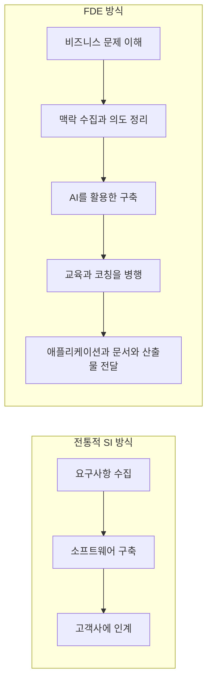
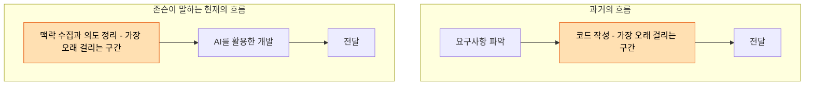
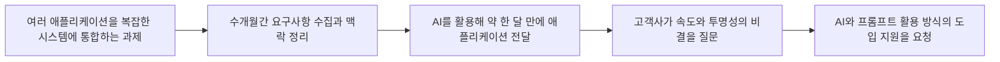
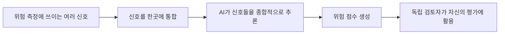
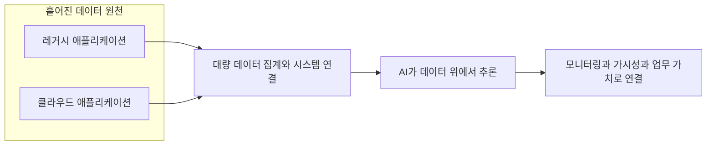
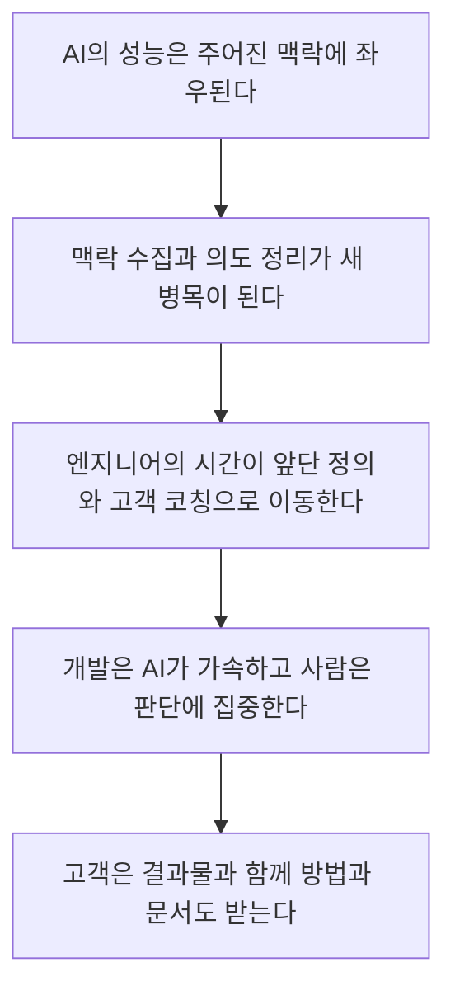

- 작성일: 2026-09-21
- 대상 콘텐츠: Business Insider 인터뷰 기사 "I'm a KPMG forward-deployed engineer. AI has moved my job beyond writing code." (Lakshmi Varanasi 기자) 및 이를 한국어로 요약한 스레드 게시글
- 검증 방식: 기사 원문 전문(사용자 제공본), 원문을 그대로 전재한 미러 사이트 2곳, KPMG·Deloitte·Accenture·Palantir 채용 공고, 2026년 FDE 관련 업계 글을 교차 확인했습니다.

> 
> KPMG 포워드 디플로이드 엔지니어가 말하는 인공지능 시대의 개발 업무 변화
> 
> 컨설팅 회사 케이피엠지(KPMG)의 수석 기술 아키텍트 저스틴 존슨(Justin Johnsen)이 비즈니스 인사이더(Business Insider)에 자신의 달라진 업무를 전했습니다. 2020년 개발자로 입사해 직접 코드를 짜던 그는 1년 전부터 고객사에 상주하며 문제 정의부터 solution 전달까지 책임지는 역할을 맡고 있습니다. 그는 인공지능(AI)의 성능이 결국 주어진 맥락에 달려 있다고 보고, 필요한 정보를 모아 정리하는 일과 고객사 직원들에게 활용법을 가르치는 일에 시간을 씁니다. 한 고객사에서는 수개월간 요구사항과 맥락을 다듬은 뒤 약 한 달 만에 복잡한 통합 애플리케이션을 완성했습니다. 이제 병목은 코드 작성이 아니라 맥락 수집과 의도 정리로 옮겨갔다고 말합니다.
> 
>>  https://www.businessinsider.com/how-kpmg-fde-uses-ai-work-clients-2026-9
> 
> https://www.threads.com/share/BAdvF-DqUu/
> 

---

## 0. 먼저 결론부터

이 기사는 "AI가 개발자를 대체한다"는 흔한 이야기가 아닙니다. KPMG의 리드 테크니컬 아키텍트 저스틴 존슨(Justin Johnsen)이 자신의 하루를 설명하면서, **소프트웨어 개발의 병목이 '코드를 짜는 일'에서 '무엇을 만들어야 하는지 맥락을 모으고 의도를 정리하는 일'로 옮겨갔다**고 말하는 글입니다. 그는 2020년경 KPMG에 소프트웨어 엔지니어로 입사해 손으로 코드를 짜던 사람이고, 약 1년 전부터는 고객사 팀과 함께 일하며 문제 이해부터 동작하는 솔루션 전달까지 책임지는 포워드 디플로이드 엔지니어(FDE)로 일하고 있습니다.

기사의 핵심 논리는 네 단계로 정리됩니다. 첫째, AI는 매우 유능하지만 주어진 맥락만큼만 좋은 결과를 냅니다. 둘째, 그래서 자신의 시간은 맥락을 모으는 일과 고객사 직원들에게 AI 활용법을 가르치는 일에 쓰입니다. 셋째, 그 결과 한 고객사에서는 몇 달간 요구사항과 맥락을 다듬은 뒤 AI를 활용해 약 한 달 만에 애플리케이션을 전달했습니다. 넷째, 반복적이고 단조로운 작업에 쓰던 시간이 줄어든 만큼 문제를 정의하고 핵심 판단을 내리는 일에 더 집중할 수 있게 되었다는 것입니다.

---

## 1. 이 글은 어떤 성격의 콘텐츠인가

### 1.1 출처와 형식

원문은 Business Insider에 실린 1인칭 인터뷰 형식의 글입니다. 기사 첫머리에 "이 대화는 명확성을 위해 편집 및 압축되었다(This conversation has been edited and condensed for clarity)"라고 밝혀 두었기 때문에, 존슨이 말한 내용을 기자가 다듬어 하나의 독백처럼 구성한 것입니다. 기사 주소에 `2026-9`가 들어 있어 2026년 9월에 게재된 것으로 보이며, 이 문서를 작성한 2026-09-21 시점의 검색에서도 미러 사이트들에 "16시간 전"으로 표시될 만큼 최근에 퍼진 글입니다.

한 가지 밝혀 둘 점이 있습니다. Business Insider 사이트에는 제 검색 도구가 직접 접속할 수 없었습니다(접속 차단). 그래서 원문 전문을 옮겨 실은 Jingletree, Bytes Europe 두 미러 사이트의 문장과 사용자께서 제공하신 원문 전문을 대조해 내용을 확인했습니다. 세 곳의 문장은 서로 일치했습니다.

### 1.2 스레드 요약과 원문의 미세한 차이

스레드에 올라온 한국어 요약은 대체로 정확하지만, 원문과 비교하면 몇 군데 표현의 결이 다릅니다. 이 차이를 알고 읽는 것이 중요합니다.

| 항목 | 스레드 요약 | 원문에서 확인되는 내용 |
|---|---|---|
| 직함 | 수석 기술 아키텍트 | "the lead technical architect at KPMG" (리드 테크니컬 아키텍트) |
| 입사 시점 | 2020년 | "I joined KPMG six years ago" (6년 전), 기사 게재 연도를 감안하면 2020년경 |
| 근무 형태 | 고객사에 상주 | "We work directly with client teams, often on-site." 즉 **주로 현장에서 일하지만**, 일부 고객은 원격이며 팀이 사무실에 있을 때 자신도 대개 그곳에 있다는 뜻 |
| 사례 | 통합 애플리케이션을 약 한 달 만에 완성 | "initially hired to integrate several applications into a complex software system", 몇 달의 요구사항·맥락 정리 후 AI로 약 한 달 만에 전달 |
| 원문에만 있는 내용 | 언급 없음 | "act as my own enterprise"(자기 자신이 하나의 기업처럼 일하는 것), 위험 점수 산정 애플리케이션 사례, 데이터·통합 계층으로의 이동 |

요약본은 핵심 메시지를 잘 살렸지만, 위험 점수 사례와 데이터·통합 계층 이야기, 그리고 여러 고객사의 맥락을 동시에 유지한다는 대목은 빠져 있습니다. 아래에서는 원문 전체를 기준으로 설명합니다.

---

## 2. 저스틴 존슨은 누구이고 어떤 일을 하는가

원문에 따르면 존슨은 컴퓨터공학을 전공했고, 아키텍처 분야에서 경력을 쌓다가 컨설팅과 고객 프로젝트로 넘어왔습니다. KPMG에 입사했을 때는 소프트웨어 엔지니어였고 "모든 코드를 손으로 작성"했습니다. 지금은 약 1년째 FDE로서 여러 고객사를 오가며 일하고 있습니다.

이 이력이 중요한 이유는, 그의 발언이 "개발을 해 본 적 없는 사람의 AI 낙관론"이 아니라 **직접 코드를 짜던 사람이 업무 방식이 바뀐 것을 회고하는 증언**이라는 점입니다. 다만 이것은 어디까지나 한 사람의 1인칭 진술이며, 독립적으로 검증된 통계가 아니라는 점은 뒤에서 다시 다룹니다.

KPMG 미국 채용 사이트에는 "Director, Technical Lead Forward Deployed Engineer"라는 직책이 어드바이저리(Advisory) 부문의 여러 지역(오스틴, 보스턴, 댈러스, 휴스턴, 어바인, 로스앤젤레스, 모리스타운, 뉴욕, 산타클라라)에 게시되어 있는 것이 확인됩니다. KPMG가 FDE를 공식 직무로 운영하고 있다는 사실은 채용 공고로 뒷받침됩니다.

---

## 3. 포워드 디플로이드 엔지니어(FDE)란 무엇인가

### 3.1 기사가 내리는 정의

존슨은 FDE를 이렇게 설명합니다. 고객과 직접 일하면서 **비즈니스 요구를 이해하는 단계부터 동작하는 솔루션을 전달하는 단계까지 문제 곁에 머무는** 엔지니어입니다. 고객사 팀과 함께, 대개는 현장에서 일합니다.

### 3.2 전통적 SI 방식과의 차이

그는 전통적인 시스템 통합(SI) 방식과 FDE 방식을 대비합니다. 전통적 구현에서는 시스템 통합업체가 요구사항을 모으고, 소프트웨어를 만들고, 고객에게 넘깁니다. 이때 "벽 너머로 던지기(throw it over the wall)" 같은 역학이 생기고, 그는 "엉망이 된 Salesforce 구현을 많이 봤다"고 말합니다. 반면 FDE는 개발, 교육, 코칭을 고객 팀과 함께 진행하므로 지식을 실시간으로 이전할 수 있고, 고객은 애플리케이션과 함께 모범 사례, 문서, 산출물을 받아 갑니다.

### 3.3 FDE라는 역할의 기원과 확산

이 역할은 KPMG가 만든 것이 아닙니다. 여러 업계 글이 공통으로 Palantir를 원조로 꼽습니다. Palantir의 소프트웨어가 너무 복잡해서 고객이 그냥 꽂아 쓸 수 없었기 때문에, 실제 엔지니어를 고객에게 상주시키는 방식을 만들었다는 설명입니다. 다만 기원 시점은 자료마다 다르게 적혀 있습니다. 어떤 글은 2005년, 어떤 글은 2000년대 중반, 또 어떤 글은 2010년경이라고 쓰고 있어서, 정확한 연도는 단정하지 않는 편이 안전합니다.

2026년 들어 이 모델이 AI 업계 전반으로 퍼졌다는 점은 여러 자료가 일치합니다. Palantir 자체 채용 공고는 Forward Deployed AI Engineer가 고객과 직접 일하며 생성형 AI 전략과 구현을 맡고, 엔드투엔드 워크플로를 만들어 프로덕션까지 가져간다고 설명합니다. 업계 분석 글들은 FDE 채용 공고가 2025년 1월부터 9월 사이에 약 800% 늘었다고 전하고, 2026년 중반 기준으로 39개 AI 기업에서 224개의 FDE 포지션이 열려 있다는 시장 조사도 소개합니다. 이런 수치는 채용 플랫폼이나 교육 사이트가 낸 2차 자료이므로 "방향성을 보여 주는 참고치"로 받아들이는 것이 적절합니다.

컨설팅·SI 업계도 같은 흐름에 올라탔습니다. Deloitte는 "Forward Deployed Engineer - Palantir" 채용 공고를 내고 있고(공고에는 채용 종료일이 2026년 10월 30일로 적혀 있습니다), Accenture는 2025년에 Palantir와의 확대된 전략적 제휴의 일환으로 Accenture Palantir Business Group을 출범시켰다고 밝히며 FDE를 채용하고 있습니다. 즉 KPMG의 사례는 개별 회사의 실험이라기보다 **컨설팅 업계 전반에서 나타나는 역할 재편의 한 장면**입니다.

---

## 4. 핵심 주장 하나: "AI는 맥락만큼만 좋다"

존슨이 가장 먼저 내세우는 명제는 "AI는 대단히 유능하지만, 그 실력은 결국 맥락(context)만큼"이라는 것입니다. 그래서 그의 업무의 큰 부분은 **AI가 가치 있는 자산과 산출물을 만들어 낼 수 있도록 필요한 정보를 모으는 일**이고, 그렇게 만들어진 결과물을 고객사 납품물과 소프트웨어 애플리케이션 곳곳에 펼쳐 넣는 일입니다.

쉬운 비유를 들어 보겠습니다. 아주 뛰어난 신입 사원이 오늘 처음 출근했다고 생각해 보십시오. 이 사람은 능력이 뛰어나지만 회사의 업무 규칙, 과거 결정의 이유, 고객이 진짜로 원하는 것을 모릅니다. 이 사람에게 "알아서 만들어 와"라고 하면 그럴듯하지만 엉뚱한 결과가 나옵니다. 반대로 배경과 제약과 목적을 충분히 설명해 주면 놀라운 속도로 일합니다. 존슨이 말하는 맥락 수집은 바로 이 "충분한 설명"을 체계적으로 만드는 일입니다.

이 지점은 최근 AI 엔지니어링에서 말하는 **컨텍스트 엔지니어링(context engineering)** 과 맞닿아 있습니다. 실제로 KPMG의 FDE 기술 리드 채용 공고는 필수 역량으로 컨텍스트 엔지니어링과 평가 규율(evaluation discipline)을 명시하고 있어서, 이것이 존슨 개인의 취향이 아니라 KPMG가 FDE에게 기대하는 역량의 일부임을 알 수 있습니다.

---

## 5. 핵심 주장 둘: 병목이 코드에서 맥락으로 옮겨갔다

기사에서 가장 인용하기 좋은 문장은 이것입니다. 과거에는 병목이 소프트웨어 개발과 코드 작성이었지만, **이제는 개발이 시작되기 전에 맥락을 모으고 의도를 다듬는 일이 병목**이라는 것입니다.

여기서 주의할 점은, 존슨이 "코드가 필요 없어졌다"고 말하는 것이 아니라는 사실입니다. 그는 "AI가 가치 있는 산출물을 생성하도록" 한다고 표현합니다. 코드를 쓰는 주체가 사람에서 AI로 옮겨가고, 사람의 시간은 앞 단계인 **무엇을, 왜, 어떤 제약 아래서** 만들 것인지를 명확히 하는 데로 이동했다는 이야기입니다.

또 하나 흥미로운 대목은 "자기 자신이 하나의 기업처럼 일할 수 있다(act as my own enterprise)"는 표현입니다. AI 덕분에 여러 고객사와 프로젝트의 맥락을 동시에 유지하며 산출량을 배가시킬 수 있다는 뜻입니다. 한 사람이 감당하는 프로젝트의 폭이 넓어졌다는 주장이지만, 기사에는 구체적인 프로젝트 수나 생산성 수치는 나오지 않습니다.

---

## 6. 사례 하나: 통합 애플리케이션을 약 한 달 만에

### 6.1 무슨 일이 있었나

원문 사례의 줄거리는 다음과 같습니다. 존슨은 한 고객사에서 **여러 애플리케이션을 복잡한 소프트웨어 시스템으로 통합**하는 일을 맡아 고용되었습니다. 그는 몇 달 동안 요구사항을 모으고 맥락을 다듬었고, 그 뒤 AI를 활용해 약 한 달 만에 애플리케이션을 전달했습니다. 고객사는 어떻게 그렇게 빠르게 진행할 수 있었는지, 그리고 왜 과정이 그토록 투명했는지를 궁금해했습니다. 그러자 고객사는 존슨에게 자사 팀들이 그 AI 활용 및 프롬프트 작성 방식을 도입하도록 도와 달라고 요청했습니다.

### 6.2 이 사례를 정확하게 읽는 법

이 사례는 "한 달 만에 만들었다"라는 헤드라인으로 소비되기 쉽지만, 원문을 꼼꼼히 읽으면 **한 달 앞에 몇 달의 준비가 있었다**는 점이 핵심입니다. 스레드 요약의 표현도 "수개월간 요구사항과 맥락을 다듬은 뒤 약 한 달 만에"로 이 순서를 유지하고 있습니다. 즉 이 사례는 "개발 기간이 짧아졌다"는 주장이면서 동시에 "준비 기간(맥락 정리)이 결과의 품질과 속도를 결정한다"는 주장입니다.

다만 기사는 이 프로젝트가 전통적 방식이었다면 얼마나 걸렸을지, 전체 소요 기간이 실제로 얼마나 단축되었는지는 밝히지 않습니다. 따라서 "전체 일정이 몇 배 빨라졌다"고 읽는 것은 원문의 범위를 넘어서는 해석입니다. 원문에서 확인되는 사실은 "몇 달의 맥락 정리 후 약 한 달의 AI 활용 전달"이라는 순서와, 고객이 그 과정의 속도와 투명성에 관심을 보여 교육 요청으로 이어졌다는 것까지입니다.

---

## 7. 사례 둘: 위험 점수 산정 애플리케이션

두 번째 사례는 **AI로 고객이나 파트너가 사업 상대로서 얼마나 위험한지 평가하는 애플리케이션**입니다. 위험을 가늠하는 데 쓰이는 신호들을 한데 모은 다음, AI가 그 신호들을 종합적으로 추론해 점수를 만들어 냅니다. 그리고 **독립적인 검토자(independent reviewers)** 가 이 AI 생성 점수를 자신들의 평가에 활용합니다.

이 구조에서 눈여겨볼 부분은 AI의 점수가 **최종 결정이 아니라 사람 검토자의 평가에 들어가는 입력값**이라는 점입니다. 기사에는 점수의 정확도를 어떻게 검증했는지, 오류나 편향을 어떻게 다루는지에 대한 설명은 없습니다. 이 사례는 "AI가 여러 데이터를 종합해 판단 재료를 만든다"는 활용 패턴을 보여 주는 것으로 읽는 것이 정확합니다.

---

## 8. 핵심 주장 셋: 소프트웨어 개발이 데이터·통합 계층으로 이동한다

존슨은 자신이 관찰한 패턴으로, **소프트웨어 개발 업무가 데이터 계층과 통합 계층 쪽으로 옮겨가고 있다**고 말합니다. 그의 설명에 따르면 많은 기업의 과제는 결국 다음으로 압축됩니다. AI가 데이터를 이해하도록 돕는 일, 모니터링과 가시성을 위해 정보를 한데 모으는 일, 그리고 레거시와 클라우드 애플리케이션에 흩어진 데이터에서 가치를 끌어내는 일입니다. 자신의 업무도 대량의 데이터를 모으고, AI로 그 위에서 추론하고, 서로 자연스럽게 소통하지 못하는 시스템을 연결하는 데 상당 부분이 쓰인다고 합니다.

이 주장을 쉬운 말로 풀면 이렇습니다. 예전에는 "화면과 기능을 새로 만드는 개발"이 일의 중심이었다면, 이제는 "이미 여기저기 흩어져 있는 데이터와 시스템을 이어 붙이고, 그 위에 AI가 판단하게 만드는 일"의 비중이 커졌다는 것입니다. 이는 존슨 개인의 관찰이라는 단서가 붙은 진술이며, 업계 전체의 통계로 제시된 것은 아닙니다.

---

## 9. 핵심 주장 넷: 현장에 있다는 것과 지식 이전

### 9.1 현장 근무의 장점

존슨은 현장에 있는 것의 실질적 이점을 꼽습니다. 대화가 자연스럽게 오가고, Teams 같은 화상 회의보다 **표정과 감정 같은 신호를 읽기가 쉽다**는 것입니다. 일부 고객사는 원격이지만, 팀이 사무실에 있을 때는 자신도 대체로 그곳에 있다고 말합니다. 앞서 표에서 보았듯 "상주"라는 단어보다는 "대체로 현장에서 일한다"가 원문에 더 가깝습니다.

### 9.2 교육과 코칭이 산출물의 일부

FDE로서 그는 개발만 하는 것이 아니라 고객 팀이 **AI를 효과적으로 쓰도록 코칭**합니다. 기술적 깊이, 비즈니스 이해, 명확한 커뮤니케이션을 결합해 고객의 업무를 개선하고 증폭하도록 돕는다는 표현입니다. 앞선 사례에서 고객이 스스로 "우리 팀에도 그 방식을 가르쳐 달라"고 요청한 것이 이 모델의 특징을 잘 보여 줍니다. 결과물(애플리케이션)만 인도하는 것이 아니라 **그 결과물을 만든 방법까지 이전**하는 것입니다.

---

## 10. 핵심 주장 다섯: 사람의 시간이 판단으로 이동한다

기사의 마지막 문장들은 이 모든 변화의 의미를 요약합니다. AI 덕분에 **반복적이고 단조로운 작업에 쓰던 시간이 줄고, 문제를 정의하고 핵심 결정을 내리는 데 쓸 여유가 늘었다**는 것입니다. 그래서 인간의 판단이 필요한 일에 더 집중할 수 있다고 말합니다.

여기까지의 흐름을 한 장으로 요약하면 다음과 같습니다.

---

## 11. KPMG의 FDE 조직은 어떻게 설명되고 있나 (채용 공고 기준)

기사에는 KPMG의 FDE 조직 규모나 구조에 대한 설명이 없습니다. 다만 KPMG 미국의 "Technical Lead, Forward Deployed Engineering" 채용 공고가 그 역할의 기대치를 상당히 구체적으로 보여 줍니다. 이 공고는 존슨 개인의 직무 기술서가 아니라 **KPMG가 FDE 기술 리드에게 요구하는 일반 요건**이라는 점을 구분해서 읽어야 합니다.

공고에 따르면 이 포지션은 KPMG의 AI & Data Labs 실무 조직에 속하며, "AI 네이티브 풀스택 엔지니어로 구성된 소규모 팟(pod)" 안에서 **문제 정의부터 측정 가능한 성과가 나는 배포된 워크플로까지 전 과정을 책임**합니다. 엔지니어부터 C레벨까지 이해관계자와의 워킹 세션을 이끌고, 정책이 허용하는 범위에서 Claude Code, Lovable, Cursor 같은 개발 가속 도구를 활용해 전달 속도와 품질을 높이라고 요구합니다. 또한 컨텍스트 엔지니어링, 평가, 운영 준비 상태에 대한 모범 사례를 지키고, 골든 셋(golden set)과 회귀 테스트 하니스, 레드팀 테스트 같은 엄격한 테스트를 의무화하며, 보안·관측 가능성·감사 가능성을 갖춘 코드의 기준을 세우라고 명시합니다. 자격 요건으로는 데이터, 머신러닝, AI 네이티브 애플리케이션 중심의 프로덕션 소프트웨어를 엔드투엔드로 출시해 본 7년 이상의 최근 경력이 제시됩니다.

이 공고와 기사를 나란히 놓으면 흥미로운 대비가 보입니다. 기사는 맥락 수집, 고객 코칭, 판단 업무를 강조하지만 **평가(evaluation)나 테스트 체계는 언급하지 않습니다.** 반면 채용 공고는 평가와 테스트 규율을 핵심 요건으로 못 박습니다. 이것은 모순이 아니라, 짧게 편집된 인터뷰 기사가 담지 못한 부분이 조직의 요구 사항에는 들어 있다는 뜻으로 읽을 수 있습니다. 다만 존슨의 실제 프로젝트에서 평가가 어떻게 수행되었는지는 기사만으로는 확인할 수 없습니다.

---

## 12. 이 기사가 말하지 않는 것들 (한계와 주의점)

이 글을 근거로 삼을 때 지켜야 할 경계선을 정리합니다.

첫째, **1인칭 진술이며 편집된 인터뷰**입니다. 존슨이 자신의 업무를 소개하는 글이라 독립적인 검증 자료가 아닙니다. 기사도 편집·압축되었음을 밝히고 있습니다.

둘째, **수치가 거의 없습니다.** "약 한 달"과 "수개월"이라는 기간 외에는 생산성 향상률, 비용 절감, 품질 지표, 고객 만족도 같은 정량 정보가 없습니다. 따라서 "몇 배 빨라졌다" 같은 표현은 원문에 근거가 없습니다.

셋째, **고객사와 산업 분야가 익명**입니다. 통합 애플리케이션 사례와 위험 점수 사례 모두 어느 회사, 어느 산업의 이야기인지 밝히지 않습니다.

넷째, **AI 결과물의 검증 방법이 없습니다.** 위험 점수의 정확도를 어떻게 확인했는지, 오류를 어떻게 잡는지, 어떤 모델과 도구를 썼는지는 나오지 않습니다.

다섯째, **일반화의 범위**입니다. "개발 업무가 데이터·통합 계층으로 옮겨간다"는 것은 존슨이 자신의 경험에서 관찰한 패턴이라고 말한 것이지, 업계 전체에 대한 조사 결과가 아닙니다.

---

## 13. 그래서 무엇을 가져갈 수 있나 (해석)

이 절은 기사의 사실이 아니라, 위 내용에서 끌어낸 **해석과 시사점**입니다. 근거가 되는 대목을 함께 적었습니다.

**하나, 맥락은 자산이자 납품물입니다.** 존슨의 사례에서 고객이 가장 관심을 보인 것은 결과물뿐 아니라 그것을 만든 과정의 투명성이었고, 그 결과 방법론 교육 요청으로 이어졌습니다. 그리고 FDE 방식의 정의 자체가 애플리케이션과 함께 모범 사례, 문서, 산출물을 넘기는 것입니다. AI를 쓰는 프로젝트에서 요구사항과 맥락 문서를 체계적으로 남기는 일은 부수 작업이 아니라 핵심 산출물이 될 수 있다는 읽기가 가능합니다.

**둘, 앞단이 길어질 수 있다는 점을 일정에 반영해야 합니다.** 사례의 순서는 몇 달의 맥락 정리 다음 약 한 달의 전달이었습니다. AI를 도입한다고 해서 모든 단계가 짧아지는 것이 아니라, 시간의 무게중심이 앞으로 이동한다는 신호로 읽을 수 있습니다.

**셋, 역할의 경계가 넓어집니다.** 존슨의 하루에는 요구사항 파악, 데이터 통합, AI 추론 설계, 고객 코칭이 함께 들어 있습니다. KPMG 채용 공고가 기술 역량과 함께 C레벨까지 포함하는 이해관계자 소통 능력을 요구하는 것과 같은 방향입니다.

**넷, 판단과 검증의 자리는 오히려 커집니다.** 기사는 사람의 시간이 "인간의 판단이 필요한 일"로 이동한다고 말하고, 위험 점수 사례에서도 최종 평가는 독립 검토자가 맡습니다. 여기에 채용 공고의 평가·레드팀 요건을 함께 보면, AI가 만든 결과를 어떻게 검증하고 책임질지에 대한 설계가 이 역할의 중요한 부분임을 짐작할 수 있습니다. 다만 이 마지막 연결은 기사가 아니라 채용 공고에서 나온 것임을 다시 밝혀 둡니다.

---

## 14. 사실 확인 수준 한눈에 보기

| 내용 | 확인 수준 | 근거 |
|---|---|---|
| 존슨은 KPMG 리드 테크니컬 아키텍트이며 약 6년 전 입사, 약 1년째 FDE | 기사 원문 진술 | 원문, 미러 사이트 대조 |
| FDE는 문제 이해부터 솔루션 전달까지 고객과 함께함 | 기사 원문 진술 | 원문 |
| 수개월의 맥락 정리 후 AI로 약 한 달 만에 애플리케이션 전달 | 기사 원문 진술(고객사와 산업은 미공개) | 원문 |
| 위험 점수 애플리케이션과 독립 검토자 활용 | 기사 원문 진술(정확도 검증은 미공개) | 원문 |
| 개발이 데이터·통합 계층으로 이동 중 | 존슨 개인의 관찰 | 원문 |
| KPMG가 FDE 직무를 공식 채용 중 | 확인됨 | KPMG 미국 채용 사이트 |
| KPMG FDE 기술 리드의 요건(평가, 레드팀, 개발 도구 활용 등) | 확인됨(공고 기준, 존슨 개인의 직무 기술서는 아님) | KPMG 채용 공고 |
| Palantir가 FDE 모델의 원조 | 다수 자료가 일치(기원 연도는 자료마다 상이) | 업계 글, Palantir 공고 |
| FDE 공고 약 800% 증가, 39개 AI 기업 224개 포지션 | 2차 자료(방향성 참고용) | 채용·교육 사이트 |
| Deloitte, Accenture의 FDE 채용 | 확인됨 | 각사 채용 공고 |

---

## 15. 용어 정리

| 용어 | 쉬운 설명 |
|---|---|
| 포워드 디플로이드 엔지니어(FDE) | 고객 현장(또는 고객 환경)에 들어가 문제 이해부터 동작하는 시스템 전달까지 책임지는 엔지니어 |
| 맥락(context) | AI가 제대로 일하기 위해 알아야 하는 배경 정보, 제약 조건, 목적, 과거 결정의 이유 |
| 의도 정리(refining intent) | 무엇을 왜 만들려는지를 모호함 없이 다듬는 작업 |
| 병목(bottleneck) | 전체 흐름에서 가장 오래 걸리고 속도를 결정하는 구간 |
| 시스템 통합업체(SI) | 고객을 위해 여러 시스템을 구축하고 연결해 주는 업체 |
| 벽 너머로 던지기 | 요구사항 수집과 구축 후 결과물만 고객에게 넘기고 지식은 이전되지 않는 방식 |
| 컨텍스트 엔지니어링 | AI에 어떤 정보를 어떤 구조로 제공할지 설계하는 실무 |
| 골든 셋 / 회귀 테스트 | 정답이 확인된 평가 데이터 모음 / 변경 후 기존 기능이 망가지지 않았는지 반복 확인하는 테스트 |

---

## 16. 참고 자료

원문 및 미러
- Business Insider, "I'm a KPMG forward-deployed engineer. AI has moved my job beyond writing code." https://www.businessinsider.com/how-kpmg-fde-uses-ai-work-clients-2026-9 (사이트 접속 차단으로 직접 열람 불가, 사용자 제공 전문과 미러로 대조)
- Jingletree 미러: https://jingletree.com/i-m-a-kpmg-forward-deployed-engineer-ai-has-moved-my-job-beyond-writing-code-273041.html
- Bytes Europe 미러: https://www.byteseu.com/2382285/
- HyperAI 요약: https://hyper.ai/en/stories/c16de245c15684ed972d373068cba02b

KPMG 채용 정보 (1차 자료, 기업 공고)
- KPMG US, Technical Lead, Forward Deployed Engineering: https://www.kpmguscareers.com/jobdetail/?jobId=134525-A
- KPMG US 채용 검색 페이지(Director, Technical Lead Forward Deployed Engineer 게시 확인): https://www.kpmguscareers.com/job-search/

FDE 역할과 업계 동향
- Palantir, Forward Deployed AI Engineer 공고: https://jobs.lever.co/palantir/636fc05c-d348-4a06-be51-597cb9e07488
- Deloitte, Forward Deployed Engineer - Palantir 공고: https://apply.deloitte.com/en_US/careers/JobDetail/Forward-Deployed-Engineer-Palantir/351451
- Accenture, Palantir Forward Deployed Engineer 공고: https://www.accenture.com/us-en/careers/jobdetails?id=R00324743_en
- Yochana, Forward Deployed Engineer 2026 AI Hiring Guide (2026-08-18, 2차 자료): https://www.yochana.com/forward-deployed-engineer-2026-hiring-guide/
- AITraining2U, Forward Deployed Engineer 2026 (2026-06-10, 2차 자료): https://www.aitraining2u.com/blog/forward-deployed-engineer-jobs-2026.html
- MarkTechPost, What is a Forward Deployed Engineer (2026-05-21): https://www.marktechpost.com/2026/05/20/what-is-a-forward-deployed-engineer-the-ai-role-openai-anthropic-and-google-are-hiring-in-2026/
- Paraform, Forward-Deployed Engineer Role (2026-04-22, 2차 자료): https://www.paraform.com/insights/forward-deployed-engineer-palantir-runway-greptile

---

작성일: 2026-09-21
