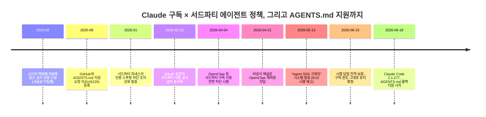

> 
> 클로드가 똥줄 타나 보네.
> 
> AGENTS.md 지원에.
> 
> Hermes 구독 연동까지.
> 
> 고객 떠나가니까 아쉽나?
> 
> https://www.threads.com/share/BAYVogp76v/
> 

## 들어가며

먼저 밝혀둘 것이 하나 있다. 공유해주신 Threads 게시물 링크는 접근이 차단되어 있어(로봇 수집 차단 정책) 원문을 직접 열어볼 수 없었다. 대신 같은 주제를 다룬 여러 독립적인 매체와 Anthropic 공식 고객센터 문서, GitHub 이슈, 개발자 커뮤니티 기록을 교차 확인해 이 글을 작성했다. 언급하신 두 가지 사건, 즉 **Claude Code의 AGENTS.md 지원**과 **Hermes 같은 서드파티 에이전트 도구의 구독 연동 문제**는 실제로 최근 몇 달간 Anthropic 커뮤니티에서 상당한 화제가 되어 온 사안이며, 특히 후자는 4월부터 6월까지 세 차례나 입장이 바뀐 복잡한 이야기다. 아래에서 각각을 시간 순서대로, 근거와 함께 정리한다.

## 1. 왜 이 두 소식이 함께 묶여 보이는가

두 사건은 표면적으로는 전혀 다른 주제처럼 보인다. 하나는 프로젝트 설정 파일 형식에 관한 기술적인 이야기이고, 다른 하나는 구독 요금제의 과금 정책에 관한 이야기다. 하지만 두 사건을 관통하는 흐름은 같다. Claude Code는 지난 1년 가까이 "가장 폐쇄적인 코딩 에이전트"라는 평판과 "가장 개방적인 코딩 에이전트"라는 평판 사이를 오갔고, 그 진자가 최근 들어 부쩍 개방 쪽으로 쏠리는 움직임을 보이고 있다. AGENTS.md 지원은 경쟁 도구들과의 상호운용성을 받아들였다는 신호이고, Hermes·OpenClaw 같은 서드파티 에이전트의 구독 사용을 다시 열어준 것은 개발자 생태계를 붙잡아 두려는 움직임으로 해석하는 시각이 많다. 두 흐름 모두 OpenAI Codex를 비롯한 경쟁 코딩 에이전트들이 빠르게 세를 넓히던 시기와 맞물려 있다는 점에서, "고객이 이탈할까 봐 조급해진 것 아니냐"는 농담 섞인 해석이 커뮤니티 안팎에서 나오는 것도 무리는 아니다. 다만 이것이 Anthropic의 공식 입장은 아니며, 어디까지나 외부 관찰자들의 해석이라는 점은 짚어둘 필요가 있다.

## 2. Claude Code, 마침내 AGENTS.md를 지원하다

### 2-1. AGENTS.md란 무엇인가

AGENTS.md는 AI 코딩 에이전트에게 프로젝트 구조, 빌드·테스트 명령어, 코드 스타일 같은 맥락 정보를 알려주기 위한 단일 마크다운 파일 규격이다. OpenAI, Google, Cursor, Amp, Factory가 공동으로 만들었고, 현재는 리눅스 재단 산하 Agentic AI Foundation이 관리를 맡고 있다. 이미 6만 개가 넘는 오픈소스 저장소가 이 파일을 채택했을 정도로 사실상의 업계 표준으로 자리 잡았으며, OpenAI Codex, GitHub Copilot, Google Jules, Cursor, Windsurf, Amp, Kilo Code, OpenClaw 등 대부분의 주요 코딩 에이전트가 이를 읽어들인다.

문제는 정작 Claude Code만 이 표준을 따르지 않고 있었다는 점이다. Claude Code는 처음부터 자체 규격인 CLAUDE.md만을 인식했고, 여러 에이전트를 함께 쓰는 팀이나 오픈소스 프로젝트 입장에서는 도구마다 별도의 안내 파일을 중복으로 관리해야 하는 번거로움이 계속됐다. 두 파일은 처음엔 똑같은 내용으로 시작하지만 시간이 지나면 어느 한쪽만 업데이트되면서 서서히 어긋나기 시작하고, 결국 어느 에이전트가 이미 몇 달 전에 폐기된 빌드 명령어를 그대로 따라 하는 상황까지 벌어지곤 했다.

### 2-2. 2025년 8월부터 이어져 온 요청

이 문제는 하루 이틀 된 이야기가 아니다. Anthropic의 공식 GitHub 저장소에는 2025년 8월 21일에 이미 AGENTS.md 지원을 요청하는 이슈(#6235)가 등록되어 있었다. 당시 이슈를 올린 개발자는 Codex, Amp, Cursor 등이 이미 AGENTS.md를 중심으로 표준화되고 있는데, CLAUDE.md는 지나치게 Claude Code 전용이어서 다른 도구를 함께 쓰는 협업 환경에서 불편하다는 점을 지적했다. 이 이슈는 이후 해당 저장소에서 가장 많은 공감(업보트)을 받은 요청 중 하나로 꼽힐 만큼 누적된 요구가 컸다.

공식 지원이 나오기 전, 커뮤니티 차원의 임시방편도 여럿 등장했다. 예를 들어 2026년 3월 1일에는 한 기여자가 CLAUDE.md가 없는 디렉터리에서 AGENTS.md를 자동으로 불러오는 플러그인을 담은 풀 리퀘스트(#29833)를 올리기도 했다. 이 풀 리퀘스트는 세션 시작 훅을 이용해 CLAUDE.md의 로딩 순서를 그대로 흉내 내는 방식이었는데, 결국 공식 병합으로 이어지지는 않고 종료되었다. 그 밖에도 CLAUDE.md 안에 "AGENTS.md의 내용을 그대로 따르라"는 한 줄을 적어 두 파일을 우회적으로 동기화하는 수작업 패턴들이 개발자 가이드 형태로 돌아다니기도 했다. 즉, 공식 지원이 나오기 전까지 개발자들은 꽤 오랫동안 각자의 방식으로 이 문제를 땜질해 온 셈이다.

### 2-3. 2026년 9월 18일, 드디어 공식 지원이 시작되다

이런 흐름 속에서 지난 9월 18일, Anthropic은 Claude Code 2.1.277 버전을 통해 AGENTS.md 지원을 정식으로 발표했다. Claude Code 팀 소속 Thariq Shihipar가 공개적으로 밝힌 바에 따르면, 이제 어떤 폴더에 CLAUDE.md 파일이 없을 경우 Claude Code가 자동으로 그 폴더의 AGENTS.md를 찾아 대신 사용하도록 바뀌었다. 다시 말해 완전한 동등 지원이라기보다는 "CLAUDE.md가 없을 때만 작동하는 대체 수단(폴백)"에 가깝다. CLAUDE.md가 이미 존재하는 프로젝트라면 여전히 CLAUDE.md가 우선한다. 다만 설정 화면의 "Project instructions" 항목에서 이 동작 방식을 바꿔 두 파일을 함께 불러오도록 지정할 수도 있다.

흥미로운 점은 이 기능이 모델 자체의 변화가 아니라 "하네스" 계층, 즉 Claude Code가 컨텍스트를 모으고 도구를 호출하고 세션을 그려내는 소프트웨어 계층에서 동작하는 내부 플러그인(Anthropic은 이를 "모드"라고 부른다) 형태로 구현되었다는 사실이다. 같은 날 공개된 정보에 따르면 현재 공개 저장소에는 AGENTS.md 로더, 변경 사항을 보여주는 diff 패널, 사용량 측정을 위한 텔레메트리, 조직 보안 모드까지 총 네 가지 내장 모드가 포함되어 있다. 사용자가 직접 만드는 커스텀 모드는 아직 얼리 액세스 단계이며, Anthropic 스스로도 이 훅 구조가 이후 버전에서 바뀔 수 있다고 안내하고 있어 생태계는 이제 막 형성되는 초기 단계로 보인다. 같은 릴리스에는 여러 작업 흐름을 동시에 관리하는 새로운 Projects 베타, 데스크톱에서의 백그라운드 컴퓨터 사용 기능, 플러그인을 테스트하는 /plugin eval 명령어 등도 함께 담겼다.

### 2-4. 작동 방식과 아직 남아 있는 한계

이번 지원에는 몇 가지 눈여겨볼 제약이 있다. 첫째, CLAUDE.local.md 파일이 있으면 이 파일이 AGENTS.md보다 우선 적용된다. 둘째, 이 기능은 Claude Code 세션이 Anthropic으로부터 기능 플래그를 정상적으로 내려받을 수 있어야 작동하는데, Amazon Bedrock이나 Google Vertex AI, Microsoft Azure AI Foundry를 통해 Claude Code를 쓰는 경우, 혹은 텔레메트리(사용 데이터 전송)를 꺼둔 환경에서는 이 플래그를 받아올 수 없어 AGENTS.md 지원 자체가 비활성화되고 CLAUDE.md로만 동작하게 된다. 로컬 파일을 읽는 데는 네트워크가 필요 없는데도 기능 활성화 여부는 네트워크 상태에 좌우된다는 점이 다소 역설적이라는 지적도 나온다. 셋째, AGENTS.md라는 이름의 파일이라고 해서 모든 도구의 관례를 다 받아들이는 것은 아니어서, 일부 변형된 작성 관례는 인식되지 않을 수 있다. 따라서 CI처럼 사람이 매번 눈으로 확인하기 어려운 자동화 환경이나 클라우드 배포 환경을 운영하는 팀이라면, 실제로 파일이 의도한 대로 읽히는지 별도로 점검해 두는 편이 안전하다.

### 2-5. 여전히 남아 있는 불만: .agents/skills/ 문제

지원이 시작된 뒤에도 완전히 잦아들지 않은 논쟁이 하나 있다. Anthropic은 AGENTS.md와는 별개로 "Agent Skills"라는 개방형 표준을 직접 만들어 운영하고 있는데, 이 표준이 정의하는 스킬 저장 위치는 .agents/skills/ 디렉터리다. 실제로 OpenAI Codex CLI나 Vercel AI SDK 같은 도구들은 이 위치를 기본값으로 삼아 스킬을 서로 호환해서 쓸 수 있게 했다. 그런데 정작 이 표준을 만든 Anthropic의 Claude Code는 지금도 .claude/skills/라는 독자적인 위치를 고집하고 있다. 커뮤니티 일각에서는 "자신들이 만든 개방형 표준을 자신들의 도구가 안 따르는 것은 모순"이라는 비판을 이어가고 있다. AGENTS.md 지원이 이런 논쟁 전체를 잠재운 것은 아니고, 프로젝트 설명 파일 수준의 호환성 문제 하나를 해결한 정도로 보는 것이 정확하다.

## 3. Claude 구독과 서드파티 에이전트 — 넉 달간의 롤러코스터

이제 두 번째 이야기, Hermes를 비롯한 서드파티 에이전트 도구와 Claude 구독 요금제 사이의 관계로 넘어가 보자. 이 쪽은 AGENTS.md보다 훨씬 굴곡이 많았다.

### 3-1. 시작: 구독을 API처럼 쓰는 우회로

Claude Pro나 Max 요금제에 가입하면 매달 고정 요금으로 Claude Code를 비롯한 Anthropic 자체 제품을 쓸 수 있다. 그런데 로그인 과정에서 발급되는 OAuth 인증 토큰을 다른 프로그램에 그대로 넘기면, 이론적으로는 API 요금을 내지 않고도 구독 한도 안에서 다양한 외부 도구를 Claude로 돌릴 수 있었다. 이 방법은 특히 OpenClaw(개발자 Peter Steinberger가 만든 오픈소스 에이전트 프레임워크)와 Hermes Agent(지속적인 기억과 자기 개선 기능을 내세운 개인용 에이전트 도구) 같은 서드파티 하네스 사용자들 사이에서 널리 퍼졌다. 월 200달러짜리 Max 요금제로 API 환산 기준 1,000달러가 넘는 사용량을 뽑아낼 수 있다는 소문이 돌면서 이용이 폭발적으로 늘었다.

사실 이런 우회 사용을 금지하는 조항 자체는 새로운 것이 아니었다. Anthropic의 소비자 약관에는 이미 2024년 2월부터 "API 키가 아닌 자동화된 수단으로 서비스에 접근하는 것을 금지한다"는 문구가 있었지만, 2년 넘게 사실상 집행되지 않은 채 방치되어 있었다.

### 3-2. 2026년 1~2월, 조이기 시작

상황은 2026년 들어 바뀌기 시작했다. 1월, Anthropic 엔지니어 Thariq Shihipar는 Claude Code의 인증 절차를 흉내 내(스푸핑) 접근하는 서드파티 도구들에 대한 차단 조치를 강화했다고 공식적으로 밝혔다. 이 과정에서 일부 계정이 일시 정지되는 사례가 보고되었고, 해당 계정들은 이후 복구됐다. 그리고 2월 19일에는 법률·컴플라이언스 관련 공식 문서를 개정해, Free·Pro·Max 요금제의 OAuth 토큰은 오직 Claude Code와 claude.ai에서만 쓸 수 있다는 점을 명문화했다. 이 개정으로 Agent SDK를 활용해 자체 도구를 개발해 온 사람들까지 API 키 기반 종량제로 전환해야 하는 상황에 놓였다.

### 3-3. 2026년 4월 4일, 전면 차단이 시행되다

경고 수준에 머물렀던 조치는 4월 4일 정오(태평양 시간 기준)를 기해 실제 시행으로 바뀌었다. Claude Code 총괄인 Boris Cherny는 X(옛 트위터)를 통해, 이제부터 OpenClaw 같은 서드파티 도구에서는 구독 크레딧을 쓸 수 없다고 공지했다. Anthropic 측이 내세운 이유는 컴퓨팅 자원 관리였다. 구독 요금제는 애초에 이런 방식의 사용 패턴을 상정하고 설계된 것이 아니라는 설명이었다. 영향을 받는 사용자에게는 한 달 치 구독료에 해당하는 일회성 크레딧(4월 17일까지 신청 가능), 최대 30%까지 할인되는 종량제 사용량 번들, 원할 경우 환불이라는 세 가지 전환 지원책이 제시됐다.

### 3-4. 개발자 커뮤니티의 반발과 번복

반발은 즉각적이었다. OpenClaw 창시자 Peter Steinberger와 보드 멤버 Dave Morin은 정책 시행 전 Anthropic을 설득하려 했으나 실패했고, 시행을 다소 늦추는 데만 성공했다고 훗날 밝혔다(공교롭게도 Steinberger는 이후 경쟁사인 OpenAI 합류를 발표하기도 했다). tinygrad·comma.ai로 잘 알려진 개발자 George Hotz는 "이 결정으로는 사람들이 다시 Claude Code로 돌아오지 않을 것이며, 오히려 다른 모델 제공사로 옮겨가게 만들 것"이라는 취지의 경고성 글을 자신의 블로그에 올렸다. Flask와 Jinja로 유명한 개발자 Armin Ronacher는 비상업적 커뮤니티용 하네스만이라도 예외를 인정해 달라고 요청하며, 구독료가 이미 상당히 비싼 만큼 사용자들이 폭넓은 사용 권한을 기대하는 것은 당연하다는 논리를 폈다.

그리고 불과 2주 뒤인 4월 21일, Anthropic은 공식 블로그나 트윗이 아닌 비공식적인 경로로 OpenClaw 측에 "다시 사용해도 된다"는 뜻을 전달했다. 정식 발표 없이 이뤄진 이 번복은 해커뉴스 등 개발자 커뮤니티에서 오히려 더 큰 논쟁을 낳았다. 논쟁의 핵심은 기술적인 문제가 아니라 신뢰의 문제였다. "Anthropic의 정책 방향을 믿고 무언가를 만들어도 되는가"라는 의문이 커진 것이다.

### 3-5. 5월 13일, "Agent SDK 크레딧"이라는 절충안

한 달 가까운 진통 끝에 Anthropic은 좀 더 체계적인 해법을 들고 나왔다. 5월 13일, 공식 개발자 소통 계정인 @ClaudeDevs는 6월 15일부터 시행될 새로운 방식을 발표했다. 핵심은 이렇다. Claude Agent SDK, 비대화형으로 작업을 수행하는 claude -p 명령, Claude Code의 깃허브 액션 연동, 그리고 OpenClaw·Hermes를 포함한 Agent SDK 기반 서드파티 앱의 사용량을 더 이상 일반 구독 한도에서 차감하지 않고, 별도의 월간 크레딧 풀에서 처리하겠다는 것이었다. 요금제별 월간 크레딧은 Pro 20달러, Max 5x 100달러, Max 20x 200달러, Team 표준 좌석 20달러, Team 프리미엄 좌석 100달러, Enterprise 사용량 기반 20달러, Enterprise 좌석 기반 프리미엄 200달러로 책정됐다. 이 크레딧을 다 쓰고 나면, 추가 사용량 결제(Extra Usage)를 켜둔 경우에 한해 표준 API 요금으로 계속 이용할 수 있고, 그렇지 않으면 크레딧이 다음 결제 주기에 초기화될 때까지 프로그램 방식 사용이 멈추는 구조였다. Anthropic 기술 담당자 Lydia Hallie는 이 변경이 추가 요금이 아니라 같은 구독료 안에서 사용 항목을 나눈 것뿐이라고 설명했다.

### 3-6. 6월 15일, 시행 당일 전격 보류되다

그런데 이 방침이 실제로 시행되기로 예정된 바로 그날, Anthropic은 계획을 유보한다고 발표했다. Claude 고객센터 문서에는 "지금은 아무것도 바뀌지 않는다. Agent SDK, claude -p, 서드파티 앱 사용은 여전히 기존 구독 한도에서 그대로 처리된다"는 문구가 추가되었고, 앞서 예고했던 별도의 월간 크레딧은 신청할 수 없는 상태가 되었다. Anthropic은 사용자들의 실제 이용 패턴을 더 잘 반영할 수 있도록 계획을 다듬고 있으며, 향후 변경이 있을 경우 시행 전에 미리 안내하겠다고 밝혔다.

업계에서는 이 막판 보류의 배경으로 몇 가지 요인을 함께 짚는다. 월스트리트저널 보도를 인용한 외신들은 OpenAI가 API 가격을 큰 폭으로 내리는 방안을 검토 중이라는 소식이 있었다는 점, Anthropic이 기업공개(IPO)를 준비하는 시점이었다는 점, 그리고 미국 정부 쪽의 압박도 있었다는 관측을 함께 언급했다. 다만 이는 외부 보도의 해석이며 Anthropic이 공식적으로 이런 이유를 밝힌 것은 아니라는 점은 분명히 해 둘 필요가 있다.

결과적으로, 이 글을 쓰는 시점에서 확인할 수 있는 가장 최근의 공식 안내(6월 16일 자 고객센터 문서)를 기준으로 하면, OpenClaw나 Hermes 같은 서드파티 에이전트 도구도 Claude Pro·Max 구독 한도 안에서 별도의 추가 결제 없이 그대로 사용할 수 있는 상태가 유지되고 있다. 다만 Anthropic이 스스로 밝혔듯 이 정책은 앞으로 다시 조정될 가능성이 열려 있는 사안이므로, Hermes나 다른 서드파티 도구를 구독으로 붙여 쓰고 있다면 이후 공지를 주기적으로 확인해 두는 편이 안전하다.

### 3-7. Hermes란 어떤 도구인가

여기서 잠깐 Hermes Agent 자체에 대해서도 짚어볼 필요가 있다. Hermes는 Claude Code처럼 세션 단위로 코드를 짜는 도구라기보다는, 지속적인 기억(persistent memory)과 자기 개선(self-improving) 기능을 축으로 삼아 텔레그램·디스코드·왓츠앱·아이메시지 같은 메신저와 연동하거나 크론(정기 실행) 기반의 반복 작업을 자동화하는 데 특화된 개인용 에이전트 도구로 소개되고 있다. 커뮤니티 문서들을 보면, 복잡하고 새로운 작업은 Claude Code로 설계·프로토타이핑한 뒤 지속적이고 반복적인 운영 업무만 Hermes로 넘기는 식의 역할 분담을 권장하는 경우가 많다. Hermes는 Anthropic·OpenAI·오픈라우터 등 여러 모델 제공사를 한 인터페이스 안에서 골라 쓸 수 있게 설계되어 있고, Claude 구독을 연결할 때는 API 키를 직접 입력하는 방식보다 Claude CLI를 통한 OAuth 로그인 방식을 권장한다는 것이 해당 도구의 공식 안내다. 다만 이 방식이 실제로 안정적으로 작동하는지는 바로 위에서 설명한 Anthropic의 정책 변화에 그대로 연동되어 있었다. 4월의 전면 차단 때는 이 경로가 막혔고, 6월의 보류 결정 이후로는 다시 정상적으로 작동하는 것으로 파악된다.

## 4. 타임라인 한눈에 보기

## 5. 이 모든 변화가 말해주는 것

두 사건을 나란히 놓고 보면 몇 가지 공통된 배경이 보인다. 먼저, Claude Code 생태계가 더 이상 Anthropic 혼자만의 것이 아니라 OpenClaw, Hermes를 비롯한 수많은 서드파티 도구와 얽혀 있다는 점을 Anthropic 스스로도 인정할 수밖에 없는 상황이 됐다는 것이다. 4월의 전면 차단이 컴퓨팅 자원 관리라는 합리적인 이유에서 출발했음에도 두 달을 넘기지 못하고 사실상 원상 복구된 과정은, 서드파티 생태계를 억지로 끊어내는 쪽보다 어떻게든 끌어안는 쪽이 더 이득이라는 판단이 내부에서 우세해졌음을 시사한다. AGENTS.md 지원 역시 비슷한 맥락에서 읽힌다. 자체 표준을 고집하는 것보다 업계 공통 표준에 올라타는 편이, 여러 도구를 넘나드는 개발자들을 붙잡아 두는 데 더 유리하다는 계산이 작용했을 가능성이 높다.

다만 이런 해석을 "다급함"이나 "위기감" 같은 단어로 단정 짓는 것은 신중할 필요가 있다. 정책이 여러 차례 바뀐 것은 분명한 사실이지만, 그 원인이 순전히 경쟁 압박 때문인지, 아니면 Anthropic이 밝힌 대로 실제 사용 패턴을 더 정교하게 반영하려는 내부적 시행착오 때문인지는 외부에서 단정하기 어렵다. 다만 확실한 것은, 이 기간 동안 Anthropic의 공지 방식 자체에 대한 신뢰 문제가 반복적으로 제기되었다는 점이다. 특히 4월 21일의 번복이 공식 블로그 발표 없이 비공식 채널로만 전달되면서, "정책을 믿고 그 위에 무언가를 만들어도 되는가"라는 질문이 개발자 커뮤니티 안에서 여러 차례 되풀이해서 나왔다.

## 6. 정리

정리하면, 최근 화제가 된 두 소식은 다음과 같이 요약할 수 있다. 첫째, Claude Code는 9월 18일부터 버전 2.1.277을 통해 업계 표준 파일인 AGENTS.md를 CLAUDE.md가 없을 때 대신 읽어들이는 방식으로 지원하기 시작했다. 다만 이는 완전한 동등 지원이 아니라 CLAUDE.md 우선의 폴백 방식이고, Bedrock·Vertex·Azure Foundry 등 일부 환경에서는 아직 작동하지 않으며, Anthropic이 별도로 만든 Agent Skills 개방 표준(.agents/skills/)은 여전히 Claude Code 자체 규격(.claude/skills/)으로 남아 있다는 한계가 있다. 둘째, Hermes·OpenClaw 같은 서드파티 에이전트 도구의 구독 연동 문제는 지난 4월 전면 차단, 5월 유료 크레딧으로의 분리 예고, 6월 시행 당일 전격 보류라는 세 차례의 큰 정책 변화를 거쳐, 현재는 구독 한도 안에서 다시 자유롭게 쓸 수 있는 상태로 돌아와 있다. 두 가지 모두 Claude Code를 둘러싼 개방성과 통제 사이의 긴장이 표면화된 사례로 볼 수 있으며, 구독 정책 쪽은 아직 완전히 봉합되지 않은 만큼 앞으로도 추가적인 변화 가능성을 열어 두고 지켜볼 필요가 있다.

## 참고 자료

- DevOps.com, "Claude Code Adds AGENTS.md Fallback, Cutting Instruction File Sprawl" (2026. 9)
- InfoWorld, "Claude Code now also accepts instructions in OpenAI's Agents.md format" (2026. 9)
- MindStudio, "Claude Code Mods and agents.md: What's New and Why It Matters" (2026. 9. 19)
- Hacker News, "Anthropic finally adds AGENTS.md support to Claude Code" (2026. 9)
- GitHub, anthropics/claude-code Issue #6235, #31005, PR #29833
- VentureBeat, "Anthropic cuts off the ability to use Claude subscriptions with OpenClaw and third-party AI agents" (2026. 4. 4)
- VentureBeat, "Anthropic reinstates OpenClaw and third-party agent usage on Claude subscriptions — with a catch" (2026. 5. 13)
- the-decoder, "Anthropic backs off unpopular billing overhaul as price war with OpenAI looms" (2026. 6. 16)
- The New Stack, "Anthropic pauses Claude Agent SDK subscription change on day it was due to take effect" (2026. 6. 16)
- Zed 공식 블로그, "What Anthropic's New Claude Billing Means for Zed Users" (업데이트 2026. 6. 16)
- Anthropic Claude Help Center, "Use the Claude Agent SDK with your Claude plan" (업데이트 2026. 6. 16)
- Herdl, "Anthropic Announces Claude Will Allow Third-Party Agent Usage Again" (2026. 6. 11)
- WinBuzzer, "Anthropic Bans Claude Subscription OAuth in Third-Party Apps" (2026. 2. 19)
- KERSAI, "Anthropic Banned Third-Party Claude Auth: Full Guide 2026"
- wikidocs.net(@jaehong) 블로그, Anthropic 서드파티 정책 관련 연속 기고 (2026. 2~6)
- Hermes Agent 공식 레퍼런스 문서(blakecrosley.com), Hermes 튜토리얼(techbukket.com), Hermes 관련 커뮤니티 게시물(wikidocs.net, gpters.org)

---

작성일: 2026년 9월 22일
