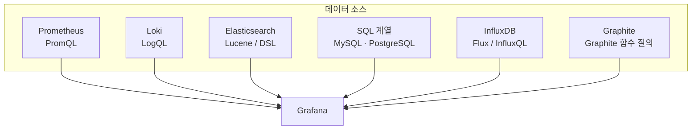
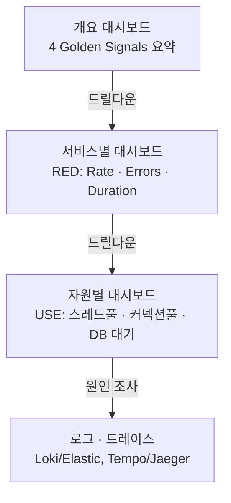

이 문서는 Grafana를 다룬 열두 장의 슬라이드를 정리하되, 특히 두 가지에 무게를 두었다. 첫째는 대시보드를 "그냥 만드는 것"이 아니라 "잘 만드는 것"이 무엇인지이고, 둘째는 Prometheus 말고도 Grafana가 붙일 수 있는 데이터 소스들이 각각 무엇이며 언제 쓰는지다.

---

## Grafana란 무엇인가

Grafana는 오픈소스 데이터 시각화·모니터링 도구다. 가장 먼저 알아 둘 특징은 Grafana 자신은 데이터를 저장하지 않는다는 점이다. Prometheus·Graphite·InfluxDB·Elasticsearch·SQL 등 다른 곳에 있는 데이터를 가져와 그릴 뿐이며, 여러 곳을 동시에 붙일 수 있다. 그중 Prometheus에 대한 지원이 가장 성숙해 있어서, Prometheus와 Grafana를 함께 쓰는 구성이 사실상 표준으로 자리 잡았다.

### 왜 직접 만들지 않고 Grafana를 쓰는가

- **오픈소스**: 무료로 쓰고 필요하면 직접 고칠 수 있다.
- **커뮤니티**: 이미 만들어진 대시보드를 번호 하나로 그대로 가져와 쓸 수 있다. Node Exporter용 대시보드(번호 1860, "Node Exporter Full")가 대표적이며, Import 화면에 이 번호만 입력하면 남이 만든 화면이 그대로 올라온다.
- **알림**: 값이 기준을 넘으면 알림을 보낸다.
- **데이터 저장 방식**: Grafana는 값을 복사해 두지 않고, 화면을 열 때마다 원본 데이터 소스에 다시 물어본다. 그래서 데이터 소스가 무거우면 Grafana도 함께 느려진다.

### 확장성과 패널 종류

Grafana는 Prometheus 외에도 Datadog·Jira 등 다양한 서비스와 연동되며, 이 연동은 플러그인 형태로 이루어진다. 플러그인은 데이터 소스 플러그인, 패널 플러그인, 애플리케이션 플러그인 세 종류다. 화면에 그릴 수 있는 패널 종류도 막대 차트·파이 차트·히스토그램·시계열 그래프·단일 숫자(Stat)·게이지·표·히트맵 등으로 다양하며, 화면을 보는 목적에 맞게 골라 쓸 수 있다.

---

## Grafana 자체는 가볍다

지원 운영체제는 Debian·Ubuntu, Red Hat·RHEL·Fedora, SUSE·openSUSE, macOS, Windows다. 무거운 것은 Grafana 자신이 아니라 뒤에 있는 데이터 소스이며, 대시보드가 느리다면 대개 원인은 질의(쿼리)이지 Grafana가 아니라는 점이 슬라이드의 핵심 메시지다.

다만 최소 하드웨어 요구사항 수치는 한 가지 짚어둘 부분이 있다. 슬라이드는 "메모리 255MB·CPU 1코어"라고 적었는데, 이는 과거 버전(6 ~ 7대) 공식 문서에 실려 있던 수치다. 현재(2026년 기준) Grafana 공식 설치 문서는 최소 권장 메모리를 512MB로 상향해 안내하고 있으며, 이는 어디까지나 "평가용 최소 바닥선"이고 실제 운영 환경에서는 동시 사용자 수·알림 규칙 수·데이터 소스 개수·패널 수와 갱신 주기에 따라 훨씬 더 많은 자원이 필요하다고 명시한다. 예를 들어 소규모 운영 기준으로는 2코어, 2 ~ 4GB 메모리 정도를 권장한다. "Grafana는 가볍다"는 메시지 자체는 지금도 유효하지만, 정확한 최소 수치는 255MB가 아니라 512MB로 업데이트되었다는 점을 알아 두면 좋다.

---

## 패널이 그림이 되기까지 — 4단계 아키텍처

대시보드는 패널들을 모아 놓은 화면이며, 패널 하나하나는 다음 네 단계를 거쳐 완성된다.


화면이 이상하게 나온다면 이 순서를 거꾸로 짚어보는 것이 원칙이다. 패널 설정 → 변환 → 쿼리 → 데이터 소스 순으로 거슬러 올라가며 확인한다.

### ① 데이터 소스(Data Source)

데이터 소스는 Grafana가 데이터를 가져올 곳과 방법을 정의한 설정이다. 한 Grafana에 여러 개를 등록해 두고, 패널마다 그중 무엇을 쓸지 고를 수 있다. 등록은 한 번만 하면 되고, 이후 모든 패널이 그 설정을 함께 쓴다. 등록 화면에서는 Prometheus·Graphite·InfluxDB·OpenTSDB가 "Time series databases"로, Loki가 "Logging & document databases"로 분류되어 있으며, 이 중 다수는 별도 플러그인 설치 없이 Grafana 안에 기본 내장된 "Core" 데이터 소스다. 등록할 때는 반드시 Save & test를 눌러 초록불이 뜨는 것을 확인해야 하며, Prometheus를 등록한다면 주소는 Prometheus 서버의 9090 포트다.

### ② 쿼리(Query)

쿼리는 전체 데이터에서 화면에 보여줄 부분만 추려내는 단계이며, 대시보드가 느려지는 원인은 대개 여기에 있다. 데이터 소스마다 쓰는 질의 언어가 다른데, Prometheus는 오전에 다룬 PromQL을, Loki는 LogQL을, 관계형 DB는 SQL을 쓴다. 한 패널에 쿼리를 여러 개 걸 수도 있다. 패널이 느리다면 조회 기간을 줄이거나, 자주 쓰는 계산을 PromQL의 레코딩 규칙(record)으로 미리 계산해 저장해 두는 방법을 쓴다.

### ③ 변환(Transform)

변환은 가져온 데이터의 모양이 그리려는 모양과 다를 때 쓰는 선택 단계다. 데이터 유형 바꾸기, 필요 없는 행 걸러내기, 열 합치기와 이름 바꾸기, 정렬 같은 작업을 한다. 중요한 점은 원본 데이터 자체는 바뀌지 않고 화면에서만 다르게 보인다는 것이다. 슬라이드가 조언하듯, 여기서 억지로 모양을 맞추기보다는 애초에 쿼리를 고치는 편이 대개 더 깔끔하다.

### ④ 패널(Panel)

패널은 시각화의 마지막 단계로, 막대 차트·파이 차트·히스토그램·시계열 그래프·단일 숫자(Stat)·게이지·표·히트맵 중에서 데이터 성격에 맞는 형태를 고른다. 단위, 소수 자릿수, 임계값 색상 같은 옵션을 패널마다 따로 지정할 수 있다.

---

## Prometheus 외의 데이터 소스들

Grafana의 진짜 힘은 이 여러 데이터 소스를 한 화면에 나란히 붙일 수 있다는 데 있다. 각각의 성격을 정확히 알아 두면 언제 어떤 소스를 골라야 할지 판단할 수 있다.



- **Prometheus**: 이 트랙 전체가 다룬 대로, Pull 기반으로 메트릭을 모으는 사실상 표준이다. PromQL로 질의하며, Grafana에서 가장 성숙하게 지원되는 소스다.
- **Graphite**: Prometheus보다 앞서 널리 쓰이던 시계열 DB로, 자체적인 함수형 질의 언어(예: `summarize()`, `alias()` 같은 함수를 체이닝하는 방식)를 쓴다. Grafana 자체가 처음 만들어질 때 주로 겨냥했던 데이터 소스였던 만큼 지금도 기본(Core) 소스로 지원된다.
- **InfluxDB**: Prometheus와 달리 애플리케이션이 값을 직접 밀어 넣는(Push) 방식이 기본인 시계열 DB다. 버전에 따라 InfluxQL(SQL과 비슷한 문법) 또는 Flux(함수형 질의 언어)를 쓴다. 고빈도 쓰기가 많은 IoT·센서 데이터에서 자주 선택된다.
- **Elasticsearch**: 앞선 관측성 도구 지형 문서에서 다룬 대로 로그의 전체 텍스트를 색인하는 저장소이며, Grafana에서는 Lucene 질의 문법으로 로그를 검색·집계해 그래프로 그릴 수 있다. 로그 건수 추이나 특정 키워드 검색 결과를 시계열로 보여줄 때 쓴다.
- **SQL 계열(MySQL·PostgreSQL 등)**: 이미 운영 중인 관계형 DB에 있는 비즈니스 데이터(주문 수, 가입자 수 등)를 그대로 SQL로 조회해 그릴 수 있다. 굳이 별도 시계열 DB로 옮기지 않고도 기존 DB 데이터를 관측성 대시보드에 바로 얹을 수 있다는 뜻이다.
- **Loki**: Grafana Labs가 만든 로그 시스템으로, 로그 전체가 아니라 레이블만 색인하는 방식 덕분에 Elasticsearch보다 저장 비용이 저렴하다. LogQL로 질의하며, Prometheus와 레이블 철학을 공유해 같은 레이블로 메트릭과 로그를 오갈 수 있다는 것이 큰 장점이다.

여러 소스를 조합하는 실전 패턴도 있다. 한 대시보드 안에서 메트릭 패널은 Prometheus를, 로그 패널은 Loki나 Elasticsearch를 데이터 소스로 지정해 나란히 배치하면, 이상 구간을 메트릭에서 먼저 확인하고 바로 옆 패널의 로그로 내려가 원인을 좁히는 흐름을 한 화면 안에서 구현할 수 있다.

---

## 대시보드를 잘 구성하는 법

여기서부터가 이 문서의 핵심이다. 패널 하나하나를 만드는 법을 안다고 해서 좋은 대시보드가 되는 것은 아니다. Grafana 공식 문서가 제시하는 대시보드 설계 원칙과, 앞선 4 Golden Signals·미들웨어 관측 문서에서 다룬 내용을 실제 화면 구성에 적용하면 다음과 같다.

### 계층을 나눈다 — 개요에서 상세로 드릴다운



Grafana 공식 문서는 대시보드를 서비스 계층 구조를 반영해 설계하고, 상위 대시보드에서 하위 대시보드로 드릴다운할 수 있게 만들 것을 권장한다. 맨 위에는 전체 서비스 상태를 4 Golden Signals(Latency·Traffic·Errors·Saturation)로 요약한 개요 대시보드를 두고, 거기서 특정 서비스를 클릭하면 그 서비스의 RED(Rate·Errors·Duration) 대시보드로, 다시 특정 자원을 클릭하면 스레드풀·커넥션풀·DB 대기 같은 USE 지표로, 마지막에는 로그와 트레이스로 내려가는 구조다. 이렇게 하면 한 화면에 모든 것을 욱여넣지 않고도 필요한 깊이까지 빠르게 도달할 수 있다.

### 행(Row)의 순서가 곧 데이터 흐름이어야 한다

Grafana 공식 예시는 RED 방법을 쓸 때 요청·오류율은 왼쪽에, 지연시간은 오른쪽에 두고, 서비스마다 한 행(row)씩 배치하며, 행의 순서 자체가 실제 요청이 흘러가는 순서를 반영하도록 구성할 것을 권장한다. 사용자가 위에서 아래로, 왼쪽에서 오른쪽으로 읽어 내려가는 자연스러운 시선 흐름에 맞춰 가장 중요한 정보(전체 상태나 심각한 알림)를 좌상단에 배치하는 것도 같은 원칙이다.

### 패널 타입을 데이터 성격에 맞게 고른다

이전 문서에서 다룬 p95·p99 같은 지연시간 지표는 평균 하나만 보여주는 단일 숫자(Stat)보다, 시계열 그래프로 p50·p95·p99를 함께 그리거나 히트맵으로 분포 전체를 보여주는 패널이 훨씬 정직하다. 실제로 이번 슬라이드의 예시 대시보드도 지연시간을 백분위별 꺾은선 그래프와 히트맵 두 가지로 동시에 보여주고 있었다. 반대로 현재 가용률이나 성공률처럼 "지금 한 숫자로 상태를 판단"하면 되는 지표는 게이지나 Stat 패널이 적합하다. 데이터의 성격과 패널 타입을 맞추지 않으면, 정보는 다 있는데도 읽는 사람이 잘못된 결론을 내리기 쉽다. 공식 문서도 누적(stacked) 그래프는 값을 왜곡해 보이게 할 수 있으므로 대부분의 경우 꺼두라고 권고한다.

### 템플릿 변수로 대시보드 난립을 막는다

서버 한 대마다, 서비스 하나마다 대시보드를 따로 만들면 금방 수백 개로 불어난다. Grafana 공식 문서는 이런 "대시보드 난립"을 막기 위해 쿼리 변수(템플릿 변수)를 쓰라고 권장한다. 예를 들어 다음처럼 레이블 값 목록을 변수로 만들어 두면,

```
label_values(node_cpu_seconds_total, instance)
```

대시보드 상단에 인스턴스를 고르는 드롭다운이 생기고, 쿼리에서는 `$instance`로 이를 참조해 같은 패널을 서버마다 새로 만들 필요 없이 재사용할 수 있다. 한 걸음 더 나아가 데이터 소스 자체도 변수로 만들면, 운영 클러스터용으로 만든 대시보드를 개발 클러스터의 다른 Prometheus에도 그대로 재사용할 수 있다.

### 패널 제목과 설명을 명확히 단다

"Query 1"처럼 기본값을 그대로 두지 않고, "웹 앱 응답 시간(ms)"처럼 무엇을 보여주는 패널인지 제목만 보고 알 수 있게 짓는다. 패널 설정에서 설명(description)을 추가해 두면, 화면 좌상단의 작은 정보 아이콘에 마우스를 올렸을 때 그 패널이 무엇을 뜻하는지 보여줄 수 있어 신규 팀원이 대시보드를 처음 볼 때도 헤매지 않는다.

### 공개 대시보드로 시작해서 다듬는다

슬라이드의 조언대로, 실무에서는 Node Exporter Full(1860)처럼 이미 검증된 공개 대시보드를 가져와 다듬는 편이 처음부터 새로 만드는 것보다 훨씬 빠르다. 다만 그 전에 데이터 소스·쿼리·변환·패널이라는 네 단계를 직접 한 번은 손으로 만들어 봐야, 가져온 대시보드가 내부적으로 어떻게 동작하는지 이해하고 우리 환경에 맞게 고칠 수 있다. 더 많은 공개 대시보드는 grafana.com/grafana/dashboards/ 에서 찾을 수 있다.

### 쿼리 성능부터 의심한다

대시보드가 느리면 Grafana 자체보다 데이터 소스에 던지는 쿼리를 먼저 의심해야 한다는 것은 이 슬라이드 세트 전체가 반복해서 강조하는 메시지다. 조회 기간을 줄이거나, Query Inspector로 어떤 패널의 쿼리가 오래 걸리는지 확인하거나, 자주 쓰는 무거운 계산을 Prometheus의 레코딩 규칙으로 미리 계산해 두는 것이 실질적인 해법이다.

---

## [참고] 로그와 트레이스는 어떻게 연결되는가

이 두 장은 참고용이며 오늘 실습 범위(Metric 파이프라인)에는 포함되지 않지만, 앞서 다룬 관측성 도구 지형·OpenTelemetry 문서와 이어지는 내용이라 간단히 짚어 둔다.

메트릭이 "무엇이 이상한가"를 알려준다면, 로그는 "그때 정확히 무슨 일이 있었나"를 알려준다. 로그는 Filebeat나 Fluent Bit 같은 에이전트가 각 서버·컨테이너의 로그 파일을 수집해 Elasticsearch에 색인하고, Kibana에서 검색·시각화하는 경로를 거친다. 구조화(JSON)된 로그일수록 검색 품질이 올라간다. 실전에서는 메트릭 알림으로 이상 시점을 먼저 포착한 뒤, 그 시간대의 로그를 검색해 원인을 좁혀가는 순서로 두 파이프라인의 역할이 나뉜다.

서비스가 여러 개로 쪼개지면 요청 하나가 지나간 전체 경로를 봐야 하는데, 이를 위한 표준이 OpenTelemetry다(앞선 문서의 부록 A에서 자세히 다뤘다). 트레이스의 구조는 Trace(요청 하나) 안에 여러 Span(구간 하나씩)이 이어지는 형태이며, 요청이 거친 서비스마다 Span이 생겨 트리로 연결되고, 어느 구간에서 시간이 소모됐는지 한눈에 확인할 수 있다. 결국 Prometheus(메트릭) + Elastic Stack(로그) + OpenTelemetry(트레이스)가 모여 관측성의 3요소가 완성된다.

---

## 정정 및 보완 사항

| 항목 | 슬라이드 내용 | 확인 결과 |
|---|---|---|
| Grafana 최소 메모리 요구사항 | 메모리 255MB · CPU 1 core | 255MB는 과거(v6~7대) 공식 문서 기준 수치다. 현재(2026년) Grafana 공식 설치 문서는 최소 권장 메모리를 512MB로 상향했으며, 이 역시 평가용 최소 바닥선일 뿐 실제 운영에는 동시 사용자·알림 규칙 수 등에 따라 더 많은 자원이 필요하다고 명시한다 |
| 그 외 내용 | Grafana의 정의, 4단계 아키텍처, 데이터 소스·쿼리·변환·패널 설명, 1860번 대시보드, 로그/트레이스 파이프라인 | Grafana·Prometheus 공식 문서와 대조한 결과 정확했다. 별도로 정정할 내용은 없었다 |

---

## 부록 A — "1860 Node Exporter Full" 대시보드 상세히 보기

### 무엇이고 누가 만들었나

1860은 Grafana 공개 대시보드 저장소(grafana.com/grafana/dashboards)에 올라온 대시보드 하나의 고유 번호다. 이름은 "Node Exporter Full"이며, 슬라이드의 팁 박스가 짚은 대로 Import 화면에 이 번호만 입력하면 남이 만들어 둔 화면이 그대로 올라온다. rfmoz라는 개발자가 2017년 4월 처음 게시했고, 소스는 GitHub(github.com/rfmoz/grafana-dashboards)에서 공개로 관리된다. 이 문서를 쓰는 시점 기준으로 리비전 45까지 나왔고 2026년 4월에도 업데이트가 있었을 만큼 지금도 활발히 유지보수되고 있으며, 누적 다운로드 수는 1억 3천만 회를 넘는다. Grafana 커뮤니티 대시보드 중에서도 손꼽히게 널리 쓰이는 화면이라는 뜻이며, 슬라이드가 "실무에서는 공개 대시보드를 가져와 다듬는 것이 빠르다"고 조언한 근거가 되는 실제 사례다.

### 무엇을 보여주는가

공식 설명 그대로 "node_exporter가 기본으로 내놓는 거의 모든 값을 그래프로 그려 둔" 대시보드다. 앞서 살펴본 화면(사용자 24-node-server 인스턴스)에서 보였던 두 구간이 대표적이다.

- **Quick CPU / Mem / Disk**: CPU 사용률, 시스템 부하(load average), 메모리·스왑 사용률, 루트 파일시스템 사용률 같은 핵심 지표를 게이지 형태로 한눈에 보여주는 요약 구간이다. 앞서 살펴본 화면에서 초록·노랑·빨강으로 색이 바뀌던 원형 게이지들이 여기 속한다.
- **Basic CPU / Mem / Net / Disk**: CPU Basic(사용자·시스템·유휴·대기 시간별 CPU 사용률), Memory Basic(전체·사용·캐시·여유 메모리), Network Traffic Basic(인터페이스별 송수신 트래픽), Disk Space Used Basic(마운트 지점별 디스크 사용량)을 시계열 그래프로 보여주는 구간이다.

이 두 구간 외에도 실제 대시보드에는 CPU 압력·메모리 압력·I/O 압력을 보여주는 Pressure(PSI) 구간, 코어별로 더 세분화된 CPU 구간, 메모리 계층을 쌓아 보여주는 Memory Stack 구간, 파일시스템별 상세 구간, systemd 서비스 상태 구간 등 훨씬 많은 행(row)이 접힌 상태로 포함되어 있다. 슬라이드에서 본 화면은 이 중 맨 위 두 구간만 펼쳐 보여준 것이다.

### 쓰려면 무엇이 필요한가

이 대시보드는 저절로 채워지지 않는다. 다음 전제조건이 갖춰져 있어야 한다.

1. 대상 서버에 node_exporter가 떠 있고, 기본 포트인 9100번으로 지표를 내놓고 있어야 한다.
2. Prometheus의 `prometheus.yml`에 이 서버를 대상으로 하는 Job이 등록되어 있어야 한다. 공식 예시는 다음과 같다.

```yaml
scrape_configs:
  - job_name: node
    static_configs:
      - targets: ['localhost:9100']
```

3. node_exporter를 실행할 때 `--collector.systemd`와 `--collector.processes` 옵션을 함께 켜는 것이 권장된다. 대시보드의 일부 패널이 이 두 컬렉터가 내놓는 지표를 사용하기 때문에, 옵션 없이 실행하면 해당 패널들이 비어 보일 수 있다.
4. node_exporter 버전과 대시보드 리비전이 맞아야 한다. 리비전 12부터는 node_exporter v0.16 이상을, 리비전 16부터는 v0.18 이상을 전제로 한다.

### 실제로 가져오는 절차

Grafana 화면에서 Dashboards → New → Import로 들어가 ID 입력란에 1860을 넣고, 이 대시보드가 쓸 데이터 소스로 앞서 등록해 둔 Prometheus를 지정한 뒤 Import를 누르면 끝이다. 앞서 다룬 4단계 아키텍처(데이터 소스 → 쿼리 → 변환 → 패널)가 이미 다 채워진 상태로 화면이 만들어지는 셈이다.

### 내부적으로 어떤 계산을 쓰는가 — 몇 가지 예시

패널 뒤에 숨어 있는 PromQL을 몇 가지만 들여다보면, 이 문서 앞부분에서 다룬 지표들이 그대로 쓰이고 있다는 것을 알 수 있다. 예를 들어 CPU 사용률 패널은 유휴(idle) 시간의 반대를 구하는 방식으로 계산되고,

```promql
100 - (avg by (instance) (rate(node_cpu_seconds_total{mode="idle"}[5m])) * 100)
```

메모리 사용률 패널은 앞선 문서에서 다룬 `node_memory_MemAvailable_bytes`(Gauge)를 그대로 활용한다.

```promql
(node_memory_MemTotal_bytes - node_memory_MemAvailable_bytes) / node_memory_MemTotal_bytes * 100
```

즉 이 대시보드는 특별한 마법이 아니라, 이 트랙에서 배운 Counter(`node_cpu_seconds_total`에 `rate()`를 적용)와 Gauge(`node_memory_MemAvailable_bytes`를 그대로 활용) 개념을 그대로 응용해 만들어진 결과물이다.

### 가져온 뒤 알아 둘 점

이 대시보드는 지금도 계속 손이 가는 살아있는 프로젝트다. 과거에는 인스턴스 레이블 표기 방식이나 디스크 장치를 구분하는 정규식 같은 세부 사항 때문에 "Node Exporter Full with Hostname", "Node Exporter Full and K8s containers"처럼 1860을 기반으로 한 여러 파생 대시보드(포크)가 따로 만들어지기도 했다. 그중 상당수는 이후 원본 1860 자체에 개선 사항으로 합쳐졌다. 이는 커뮤니티 대시보드를 가져다 쓸 때 유의할 점을 보여준다. 번호 하나로 통째로 가져오더라도, 우리 환경의 레이블 체계나 node_exporter 실행 옵션과 맞지 않는 부분이 있다면 직접 손봐야 하며, 이때 앞서 다룬 쿼리·변환 단계를 이해하고 있어야 어디를 고쳐야 할지 알 수 있다.

---

## 참고 자료

- [Grafana 공식 문서 — Install Grafana (하드웨어 요구사항)](https://grafana.com/docs/grafana/latest/setup-grafana/installation/) (현재 최소 권장 메모리 512MB 확인)
- [Grafana 공식 문서 — Dashboard best practices](https://grafana.com/docs/grafana/latest/visualizations/dashboards/build-dashboards/best-practices/) (계층 구조, RED 방법 행 배치, 템플릿 변수, 스택 그래프 주의사항의 공식 근거)
- [Grafana 공식 문서 — Panels and visualizations](https://grafana.com/docs/grafana/latest/panels-visualizations/) (패널 타입 전체 목록)
- [Grafana Dashboards — Node Exporter Full (ID 1860)](https://grafana.com/grafana/dashboards/1860) (슬라이드가 언급한 공개 대시보드)
- [rfmoz/grafana-dashboards (GitHub)](https://github.com/rfmoz/grafana-dashboards) (1860 대시보드의 소스와 유지보수 이력, 부록 A)
- [Kaspersky — Node Exporter Full 대시보드 패널 설명](https://support.kaspersky.com/help/KEDR_Expert_on_prem/8.0/en-US/319952.htm) (Quick CPU/Mem/Disk, Pressure 등 세부 구간별 설명, 부록 A)
- [MetricFire — 7 Best Practices for Grafana Dashboard Design](https://www.metricfire.com/blog/7-best-practices-for-grafana-dashboard-design/) (역할별 뷰, 쿼리 최적화 실전 팁)

---

작성일: 2026-09-22
