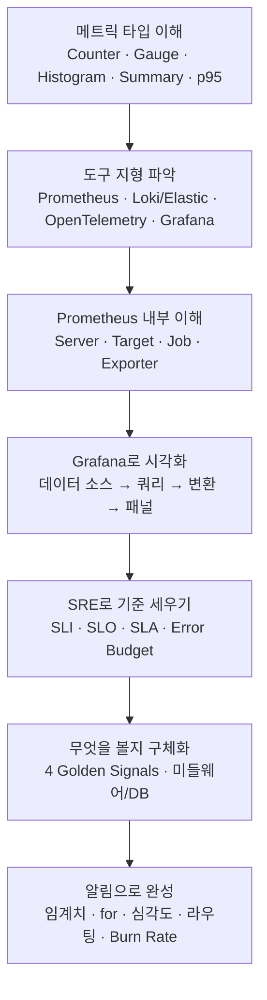

오늘 하루 동안 살펴본 내용은 얼핏 보면 메트릭 타입, 도구 지형, Prometheus 아키텍처, Grafana, SRE 개념, 알림 설계처럼 서로 다른 일곱 개의 주제로 흩어져 있는 것처럼 보인다. 하지만 실제로는 "시스템 안에서 무슨 일이 일어나고 있는지 어떻게 알 수 있는가"라는 하나의 질문에서 출발해, 그 답을 점점 구체적인 도구와 절차로 좁혀 온 하나의 이야기다. 이 문서는 그 이야기를 처음부터 끝까지 서술형으로 다시 짚어보면서, 각 대목을 더 깊이 다룬 개별 문서로 안내하는 지도 역할을 한다.

## 왜 관측성이 필요한가

서비스가 작을 때는 개발자 한 사람이 로그 파일을 눈으로 훑어보는 것만으로도 무슨 일이 벌어지는지 파악할 수 있었다. 그러나 서버가 여러 대로 늘어나고, 그 서버들이 컨테이너 안에서 초 단위로 뜨고 사라지며, 요청 하나가 여러 서비스를 거쳐 처리되는 순간부터는 "지금 무슨 일이 일어나고 있는가"를 사람이 직접 눈으로 좇는 것이 불가능해진다. 관측성(Observability)은 이 질문에 답하기 위한 체계이며, 흔히 메트릭(Metric)·로그(Log)·트레이스(Trace)라는 세 요소로 이야기된다. 메트릭은 "무엇이 이상한가"를 숫자로 빠르게 알려주고, 로그는 "그 순간 정확히 무슨 일이 있었는가"를 문장으로 기록하며, 트레이스는 요청 하나가 여러 서비스를 거치는 전체 경로를 보여준다. 오늘 다룬 내용의 대부분은 이 세 요소 중에서도 가장 먼저 다뤄야 할 메트릭 파이프라인을 중심에 두고, 그 파이프라인이 로그·트레이스와 어떻게 맞물리는지를 곁가지로 확인하는 순서로 이어졌다.

## 메트릭이라는 언어부터 익히다

관측성의 출발점은 메트릭이 어떤 모양을 하고 있는지 정확히 아는 것이었다. Prometheus는 메트릭을 Counter·Gauge·Histogram·Summary라는 네 가지 타입으로 나누는데, 이 구분은 단순한 분류가 아니라 "이 숫자를 어떻게 다뤄야 하는가"를 결정하는 실질적인 기준이다. 누적 요청 수처럼 오직 증가만 하는 값은 Counter이고, 그대로 그리면 의미가 없어 `rate()`로 변화 속도로 바꿔야 한다. 현재 메모리 사용량처럼 오르내리는 값은 Gauge이며 있는 그대로 그려도 된다. 요청 처리 시간처럼 분포 자체가 궁금한 값은 Histogram으로 구간별 개수를 세어 두고 나중에 `histogram_quantile()`로 p95 같은 백분위수를 계산하며, Summary는 그 계산을 미리 애플리케이션 쪽에서 끝내 놓는 대신 여러 서버 값을 합칠 수 없다는 대가를 치른다. 이 대목에서 함께 짚은 p95의 의미도 중요했다. 평균은 소수의 느린 요청이 만드는 나쁜 경험을 감쪽같이 감춰 버리기 때문에, 서비스 수준을 이야기할 때는 평균이 아니라 "가장 운이 나빴던 사용자들이 실제로 얼마나 기다렸는가"를 보여주는 p95·p99를 쓴다. 이 개념은 프로메테우스만의 것이 아니라 CloudWatch나 대역폭 과금처럼 업계 전반에서 쓰이는 일반적인 통계 개념이라는 점도 확인했다. 이 모든 내용은 메트릭 타입을 다룬 문서에 상세히 정리되어 있다.

## 도구들의 지형을 넓게 보다

메트릭이라는 언어를 익힌 다음에는 그 언어를 실제로 쓰는 도구들이 어떤 지형을 이루고 있는지 살펴보았다. 메트릭 영역에서는 Prometheus가 사실상 표준이고, 로그 영역에는 전문 검색에 강한 Elastic Stack과 레이블만 색인해 저장 비용을 아끼는 Loki라는 서로 다른 두 갈래가 있으며, 트레이스 영역에서는 OpenTelemetry가 계측 자체를 벤더 중립적으로 표준화하고 Jaeger·Tempo가 그 데이터를 저장·조회하는 역할을 맡는다. 이 모든 것을 한 화면에서 보게 해주는 공통 창구가 Grafana이고, 이 조합을 직접 구축하는 대신 Datadog·New Relic·IBM Instana 같은 상용 플랫폼을 통째로 사서 쓰는 선택지도 있다. 특히 OpenTelemetry는 단순히 트레이스 하나만 담당하는 도구가 아니라, Jaeger의 최신 버전이 그 위에서 다시 지어지고 Grafana의 새 수집 에이전트인 Alloy도 그 배포판일 만큼 이 지형 전체의 뼈대 역할을 하고 있다는 점이 특히 인상적이었다. 이 지형도와 OpenTelemetry에 대한 자세한 설명은 관측성 도구 지형을 다룬 문서에 담겨 있다.

## Prometheus 안으로 들어가 보다

도구들의 큰 그림을 본 다음에는 그 중심에 있는 Prometheus 내부로 들어가 보았다. Prometheus 서버는 대상에게 찾아가 값을 긁어오는 Retrieval, 그 값을 저장하는 TSDB, 저장된 값을 PromQL로 돌려주는 HTTP Server 세 부분으로 이루어져 있으며, 이렇게 서버가 대상을 찾아가는 Pull 방식이 컨테이너처럼 대상이 수시로 뜨고 지는 환경에서 사실상 표준으로 자리 잡은 이유였다. 이 구조에서 실제로 수집 대상이 되는 하나하나를 Target이라 부르고, 같은 역할을 하는 Target의 묶음을 Job이라 부른다. 그런데 세상의 모든 시스템이 스스로 Prometheus 형식의 값을 내놓지는 않기 때문에, 기존 시스템을 고치지 않고 그 옆에 붙어 값을 대신 번역해 주는 Exporter라는 중간 소프트웨어가 필요했고, 반대로 내가 직접 만드는 애플리케이션이라면 코드 안에 Client Library를 심는 방식을 썼다. 다만 Prometheus 서버와 Target만 알아서는 이 시스템 전체를 안다고 할 수 없었다. 대상을 자동으로 찾아주는 Service Discovery, 값을 실제로 꺼내 보는 PromQL, 알림 조건 판단(Prometheus)과 전달(Alertmanager)의 역할 분리, 그리고 짧게 살다 사라지는 배치 작업을 위한 Pushgateway까지 알아야 비로소 전체 그림이 완성된다는 것이 이 대목의 결론이었다. 이 아키텍처 전체와 Job·Exporter에 대한 더 깊은 설명은 Prometheus 아키텍처 문서에 정리되어 있다.

## 숫자를 그림으로 바꾸다

값을 모으고 저장하는 방법을 익힌 다음에는 그 값을 사람이 읽을 수 있는 그림으로 바꾸는 단계로 넘어갔다. Grafana는 스스로 데이터를 저장하지 않고 Prometheus를 비롯한 여러 데이터 소스에 매번 다시 물어보는 도구이며, 패널 하나가 화면에 그려지기까지는 데이터 소스를 고르고, 쿼리로 볼 부분만 추려내고, 필요하면 변환으로 모양을 다듬고, 마지막으로 패널 타입을 고르는 네 단계를 거친다. 여기서 특히 강조한 것은 대시보드를 그저 만드는 것과 잘 만드는 것의 차이였다. 개요에서 서비스별 화면으로, 다시 자원별 화면으로 드릴다운하는 계층 구조를 만들고, RED 방법대로 행의 순서를 데이터 흐름에 맞추고, p95·p99처럼 꼬리가 중요한 지표는 단일 숫자가 아니라 시계열이나 히트맵으로 보여주며, 템플릿 변수로 서버 대수만큼 늘어나는 대시보드 난립을 막는 것이 실전에서 대시보드의 질을 가르는 기준이었다. Grafana 자체는 가볍고, 대시보드가 느리다면 범인은 Grafana가 아니라 그 뒤에 있는 쿼리라는 점도 여러 번 반복해서 확인했다. Node Exporter를 위한 1860번 공개 대시보드처럼 이미 검증된 화면을 가져다 다듬는 실전 전략까지 포함해, 이 내용은 Grafana 문서에 자세히 담겨 있다.

## 안정성을 합의된 약속으로 바꾸다

도구를 다루는 법을 익힌 다음에는 방향을 조금 바꿔, "얼마나 안정적이어야 하는가"를 누가 어떻게 정하는지를 다루었다. SRE(Site Reliability Engineering)는 운영 문제를 소프트웨어 엔지니어링으로 푸는 방식이며, 그 핵심 도구가 SLO로 합의하고 Error Budget으로 속도를 조절하고 Toil을 줄이는 것이었다. SLI는 가용성·지연시간·오류율처럼 서비스 수준을 나타내는 정량 지표이고, 여기에 목표값을 붙이면 SLO, 그 목표에 위반 시 결과가 따르는 계약을 붙이면 SLA가 된다. Error Budget은 1에서 SLO를 뺀 값으로, 이번 달에 허용된 실패의 양을 뜻하며, 예산이 남아 있으면 배포 속도를 내고 다 쓰면 멈추고 안정화에 집중한다는 다이얼 역할을 한다. 이 모든 개념이 특히 중요했던 이유는, SLI·SLO·SLA·Error Budget·Toil·비난 없는 사후분석이 각각 따로 노는 개념이 아니라, 하나라도 빠지면 나머지가 제 역할을 하지 못하는 하나의 순환 고리를 이루고 있다는 점이었다. 이 순환 전체에 대한 자세한 설명은 SRE 핵심 개념 문서에 담겨 있다.

## 무엇을 지켜봐야 하는지 구체화하다

이론을 익힌 다음에는 실제로 무엇을 관측해야 하는지를 구체화했다. 서버 지표만으로는 "서버 CPU는 한가한데 응답이 느리다"는 흔한 함정을 설명할 수 없으며, 그 답은 대개 미들웨어의 스레드풀·커넥션풀 고갈이나 데이터베이스의 락 대기에 있었다. 무엇을 볼지 막막할 때 시작점이 되어 준 것이 Google SRE가 제시한 4 Golden Signals, 즉 지연시간(Latency)·트래픽(Traffic)·오류(Errors)·포화(Saturation)였고, 스레드풀·커넥션풀·락 대기 같은 지표들이 바로 이 중 Saturation을 실제로 측정하는 재료였다. 이 지표들을 무작정 알림으로 걸면 안 된다는 것도 함께 확인했다. 사용자에게 실제로 보이는 증상(오류율·지연)은 알림으로, CPU·디스크 같은 원인 지표는 대시보드로 내려야 하며, 좋은 알림은 긴급하고 실행 가능하고 사용자 영향이 있고 사람의 판단이 필요해야 한다는 네 조건을 만족해야 한다. 원인 지표로 호출하기, 지속 시간 없이 임계치만 걸기, 전원에게 알림을 뿌리기처럼 현장에서 반복되는 안티패턴과 그 처방도 이 대목에서 정리했다. 이 내용은 미들웨어·DB 관측과 알림 설계 문서에서 자세히 다룬다.

## 알림을 실제로 설계하고 SLO에 연결하다

마지막으로는 이 모든 원칙을 실제 알림 규칙으로 옮기는 절차를 다뤘다. Prometheus와 Alertmanager를 함께 쓰는 경로에서는 Prometheus가 규칙을 평가해 알림 발생 사실만 만들고 Alertmanager가 그것을 묶고 걸러내고 전달하는 역할을 나눠 맡으며, Grafana Alerting에서는 규칙·수신처·정책 세 단계를 화면에서 바로 설정한다. 알림 규칙 하나를 잘 만드는 일은 임계치를 증상 기반으로 잡고, 순간 스파이크를 흡수하도록 지속 시간을 정하고, 심각도별로 대응 강도를 나누고, 레이블로 라우팅하고, 계획된 소음과 연쇄 소음을 Silence와 Inhibition으로 차단하는 다섯 가지 설계로 이루어졌다. 그리고 이 모든 설계의 출발점은 결국 "무엇을 알릴 것인가"를 정하는 SLI/SLO 정의 절차였다. 사용자가 가장 아파하는 핵심 여정 하나를 고르고, 그 여정을 대표하는 SLI 소수를 고르고, 사용자 기대에서 역산한 SLO 수치를 확정한 뒤, 그 1−SLO만큼의 Error Budget을 멀티윈도우·멀티번레이트 알림이라는 구체적인 기법으로 실제 알림 임계치와 잇는 방법까지 살펴보았다. 이 절차를 실제 서비스에 적용해 본 워크시트 사례들과, 이 모든 것을 표현하는 데 필요한 PromQL 문법 전체는 알림 규칙 설계와 SLI/SLO 정의 문서에 정리되어 있다.

## 오늘 하루를 한 장으로

지금까지 이야기한 흐름을 하나의 그림으로 정리하면 다음과 같다.

메트릭이 무엇인지 아는 것에서 시작해, 그 메트릭을 다루는 도구들의 지형을 넓게 보고, 가장 중심에 있는 Prometheus의 내부 구조를 파고들고, 그 값을 Grafana로 사람이 읽을 수 있는 그림으로 바꾸고, SRE라는 틀로 "얼마나 안정적이어야 하는가"에 대한 합의를 만들고, 4 Golden Signals로 무엇을 지켜봐야 할지 구체화한 뒤, 마지막으로 그 모든 것을 실제 알림 규칙으로 완성하는 것. 이것이 오늘 다룬 일곱 편의 문서를 관통하는 하나의 줄기다.

## 더 깊이 보려면

이 개요 문서는 각 주제를 가볍게 훑었을 뿐이며, 실제로 손을 움직여 구성하거나 정확한 수치·PromQL·설정 예시가 필요하다면 아래 문서를 참고하면 된다.

| 문서 | 다루는 내용 |
|---|---|
| 메트릭의 네 가지 타입 | Counter·Gauge·Histogram·Summary, p95의 의미와 일반화, CPU 임계치와의 관계 |
| 관측성 도구 지형 | Prometheus·Loki·Elastic Stack·OpenTelemetry·Grafana·상용 플랫폼의 관계와 2026년 최신 동향 |
| Prometheus 아키텍처 | Server·Target·Job·Exporter·Client Library·Service Discovery·Alertmanager·PromQL |
| Grafana 완전 정리 | 4단계 패널 아키텍처, Prometheus 외 데이터 소스, 대시보드 설계 모범 사례, 1860 대시보드 |
| SRE 핵심 개념 깊이 보기 | SRE·Toil·비난 없는 사후분석·SLI·SLO·SLA·Error Budget·Error Budget Policy와 그 시너지 |
| 미들웨어·DB 관측과 알림 설계 | 풀(Pool)·DB 대기, 4 Golden Signals, 좋은 알림의 조건, 알림 안티패턴 다섯 가지 |
| 알림 규칙 설계와 SLI/SLO 정의 | Alertmanager·Grafana Alerting 설정, 알림 설계 다섯 요소, Burn Rate 알림, PromQL 가이드 |

---

작성일: 2026-09-22
