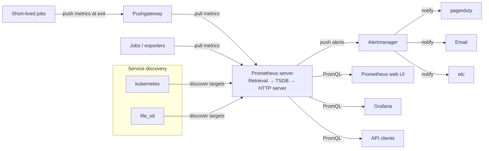
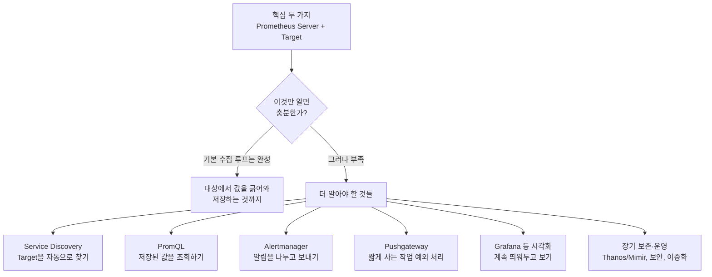

이 문서는 Prometheus를 다룬 여덟 장의 슬라이드 — Prometheus란 무엇인가, Push vs Pull, 전체 아키텍처, Prometheus Server, Target, Alertmanager, PromQL & Visualization, 아키텍처 리뷰 — 를 하나로 엮어 정리한다. 특히 Job과 Exporter는 요청한 대로 더 깊이 파고들었고, 문서 마지막에는 "Server와 Target만 알면 Prometheus를 다 아는 것인가"라는 질문에 직접 답한다.

---

## Prometheus란 무엇인가

Prometheus는 SoundCloud가 2012년 자사 운영을 위해 내부적으로 개발을 시작한 오픈소스 시스템 모니터링 도구다. 이후 커뮤니티가 커지면서 2016년 5월 Cloud Native Computing Foundation(CNCF)에 두 번째로 호스팅되는 프로젝트로 합류했으며(Kubernetes에 이어 두 번째), 2018년 8월에는 CNCF의 최고 성숙도 단계인 "Graduated"에 도달했다. 슬라이드가 "2016년 CNCF 정식 프로젝트가 되었다"고 적은 것은 이 CNCF 합류 시점을 가리키며, 정확한 사실이다.

Prometheus가 컨테이너 환경의 사실상 표준이 된 이유는 슬라이드가 짚은 대로 대상이 수시로 뜨고 지는 환경을 전제로 설계되었기 때문이다. Kubernetes 위에서는 파드가 초 단위로 생성되고 사라지는데, Prometheus는 서버가 능동적으로 대상을 찾아가 값을 긁어오는 방식이기 때문에 이런 유동적인 환경에서도 "지금 살아있는 대상이 누구인지"를 스스로 계속 갱신할 수 있다.

---

## Push vs Pull — 누가 먼저 말을 거는가

Pull 방식은 모니터링 서버가 대상에게 주기적으로 찾아가 값을 가져오는 방식이다. 대상은 값을 HTTP로 열어두기만 하면 되고, 얼마나 자주 가져올지(수집 주기)는 서버가 정한다. 이 구조 덕분에 대상이 살아 있는지 여부가 수집 성공 여부로 그대로 드러나는데, 이를 나타내는 것이 Prometheus의 `up` 메트릭이다. 대상이 응답하면 1, 응답하지 않으면 0이 찍힌다.

Push 방식은 반대로 대상이 스스로 서버에게 값을 밀어 넣는다. 서버가 찾아갈 틈이 없을 만큼 짧게 살다 사라지는 작업(배치 잡)에는 이 방식이 유리하다.

슬라이드는 Nagios·Zabbix 같은 전통적인 도구를 Push 방식에 가깝다고 설명하는데, 조금 더 정확히 짚을 부분이 있다. Nagios는 기본적으로 "액티브 체크"라는, Nagios 서버가 스스로 대상에 접속해 상태를 확인하는 방식이 주력이며 이는 사실 Pull에 가깝다. 다만 방화벽 뒤에 있어 서버가 접속할 수 없는 대상이나 배치 작업의 완료 상태를 보고받을 때 쓰는 "패시브 체크"가 예외적으로 Push 방식이다. 반면 Zabbix는 에이전트가 서버로 접속해 결과를 보고하는 "액티브 아이템"을 오히려 권장 모드로 채택하는 경우가 많아, Push 성격이 더 뚜렷하다. 즉 슬라이드의 일반화는 Zabbix에는 잘 들어맞고, Nagios는 기본 동작이 오히려 Pull에 가깝다는 점을 함께 알아 두면 더 정확하다.

Prometheus도 예외적으로 Push가 필요할 때가 있다는 팁 박스의 설명대로, 곧 사라지는 배치 작업은 자신의 값을 Pushgateway라는 중간 저장소에 밀어 넣어 두고, Prometheus 서버가 여느 대상과 똑같이 Pushgateway를 Pull해서 값을 가져간다. 즉 Pushgateway는 Push를 Pull로 다시 감싸는 어댑터 역할을 한다.

---

## 전체 아키텍처 한눈에 보기

여덟 장에 걸쳐 조각조각 설명된 구성 요소를 하나로 합치면 다음과 같다.

이 그림은 Prometheus 공식 문서의 개요 페이지에 실린 아키텍처 다이어그램과 동일한 구조이며, 슬라이드가 그대로 인용한 것으로 보인다. 이제 이 그림의 각 조각을 하나씩 자세히 본다.

---

## Prometheus Server — 수집·저장·응답의 핵심

Prometheus Server 내부는 세 부분으로 나뉜다.

- **Retrieval**: 대상에게 찾아가 메트릭을 긁어오는(scrape) 부분이다.
- **TSDB(시계열 데이터베이스)**: 긁어온 값을 시각(timestamp)과 함께 로컬 디스크에 저장한다.
- **HTTP Server**: 저장된 값을 PromQL 질의로 돌려준다. 기본 포트는 9090이며, 이 포트로 Prometheus 자체 웹 UI와 Grafana가 접속한다.

이 세 부분이 바로 "수집하고·저장하고·답한다"는 슬라이드 소제목의 구현체다.

---

## Target·Job·Exporter·Client Library — 자세히 보기

이 절은 요청받은 대로 특히 자세히 다룬다.

### Target

Target은 메트릭을 수집할 대상 하나하나를 가리킨다. 슬라이드의 정의대로 "브라우저로 열어 볼 수 있게 숫자를 내놓는 곳"이며, 구체적으로는 `http://호스트:포트/metrics` 같은 HTTP 엔드포인트 하나다. Prometheus는 이 엔드포인트를 정해진 주기로 호출해서 텍스트 형식의 메트릭 목록을 받아온다.

### Job

Job은 같은 역할을 하는 Target들의 묶음이다. 웹 서버가 10대 떠 있다면, 이 10대를 하나의 Job으로 묶어서 관리한다. 실제 설정 파일(`prometheus.yml`)에서는 `scrape_configs` 아래 `job_name`으로 이름을 붙이고, 그 아래 어떤 주기로(`scrape_interval`) 어떤 대상들을(`static_configs`의 `targets` 또는 서비스 디스커버리) 긁어올지를 정의한다. Job으로 묶인 Target들에는 자동으로 `job` 레이블이 붙기 때문에, 나중에 PromQL에서 `{job="web-server"}`처럼 특정 역할의 지표만 골라 볼 수 있다.

### Exporter — 대상을 고치지 않고 옆에 붙이는 방법

Exporter는 스스로 Prometheus 형식의 메트릭을 내놓지 못하는 대상 옆에 붙어, 그 대상을 대신해 `/metrics`를 열어주는 중간 소프트웨어다. 존재 이유는 명확하다. MySQL이나 리눅스 커널처럼 이미 만들어져 널리 쓰이고 있는 시스템의 내부 코드를 고쳐서 Prometheus 형식을 직접 내놓게 만들 수는 없기 때문에, 그 시스템이 원래 제공하는 방식(리눅스의 `/proc` 파일시스템, MySQL의 `SHOW STATUS` 명령, JVM의 JMX 인터페이스 등)으로 값을 읽어 온 뒤 Prometheus가 이해하는 텍스트 형식으로 번역해서 다시 HTTP로 내놓는 번역기 역할을 한다.

대표적인 Exporter는 다음과 같다.

| Exporter | 대상 | 성격 |
|---|---|---|
| node_exporter | 리눅스·유닉스 서버의 CPU·메모리·디스크·네트워크 | 공식(Prometheus 팀 관리) |
| mysqld_exporter | MySQL | 공식 |
| postgres_exporter | PostgreSQL | 커뮤니티(널리 채택) |
| blackbox_exporter | HTTP·HTTPS·DNS·TCP·ICMP로 외부에서 가용성 확인 | 공식 |
| JMX Exporter | JVM 기반 애플리케이션(WAS)의 JMX MBean | 공식 |
| windows_exporter | 윈도우 서버 | 커뮤니티(널리 채택) |
| redis_exporter, elasticsearch_exporter, kafka_exporter 등 | 각 미들웨어·데이터 저장소 | 대부분 커뮤니티 |

이전 문서에서 다룬 미들웨어·DB 관측 대상(스레드풀, 커넥션풀, 슬로우 쿼리, 락 대기 등)이 실제로 Prometheus로 들어오는 경로가 바로 이 Exporter들이다. Exporter는 보통 대상 프로세스와 같은 서버에서 사이드카(나란히 붙는 별도 프로세스)로 돌아가거나, DB처럼 원격 접속이 가능한 대상이라면 별도 서버에서 그 대상에 접속해 값을 긁어 온 뒤 자신만의 `/metrics`를 여는 방식으로 동작한다.

### Client Library — 대상 안에 직접 넣는 방법

Client Library는 Exporter와 반대로, 이미 내가 직접 코드를 짤 수 있는 애플리케이션이라면 그 코드 안에 라이브러리를 넣어 `/metrics`를 직접 열게 하는 방식이다. Prometheus는 Go, Java(Scala 포함), Python, Ruby를 공식 클라이언트 라이브러리로 제공하며, 그 외 언어(Rust, C++, PHP, Node.js 등)는 커뮤니티가 만든 비공식 라이브러리로 폭넓게 지원된다. 애플리케이션을 만든 언어와 같은 라이브러리를 고르는 것이 원칙이다.

### 정리 — 언제 무엇을 쓰는가

슬라이드의 팁 박스가 정확히 요약한 대로, "대상을 고치지 않고 붙인다"면 Exporter, "대상 안에 직접 넣는다"면 Client Library다. 판단 기준은 결국 그 대상의 소스 코드를 내가 수정할 수 있는가이다. 미들웨어·DB는 대개 내가 만들지 않은 기성 소프트웨어이므로 Exporter 쪽이고, 내가 직접 개발하는 애플리케이션은 Client Library를 코드에 넣는 쪽이 일반적이다. 다만 자바처럼 소스는 내가 만들었어도 프레임워크(스프링 등)가 이미 JMX나 Micrometer 같은 표준 계측을 내장하고 있다면, 그 위에 얇은 Exporter를 얹어 값을 번역해 오는 방식도 실무에서는 흔히 쓰인다.

---

## Service Discovery — Target을 자동으로 찾기

아키텍처 그림에 등장하는 "Service discovery" 상자는 슬라이드 본문에서 깊게 다뤄지지는 않았지만, 시스템 전체를 이해하는 데 빠질 수 없는 조각이다. Target 목록을 `prometheus.yml`에 하나하나 고정으로 적어 두는 대신(`static_configs`), Kubernetes API나 파일(`file_sd`) 같은 외부 시스템에 "지금 살아있는 대상이 누구냐"고 물어 목록을 자동으로 갱신하는 기능이다. 앞서 "Prometheus란 무엇인가" 절에서 다룬 "대상이 뜨고 지기를 반복해도 서버가 스스로 찾아가 수집한다"는 특징이 실제로 구현되는 지점이 바로 여기다.

---

## Alertmanager — 조건 판단과 전달의 분리

Prometheus는 알림 규칙에 걸린 알림을 Alertmanager로 넘기기만 하고, 그 알림을 묶고(grouping) · 걸러내고(silencing, inhibition) · 정해진 곳으로 보내는(routing) 일은 전적으로 Alertmanager가 담당한다. 슬라이드가 정리한 대로 "무엇을 알릴지"는 Prometheus 쪽 알림 규칙에, "어디로 보낼지"는 Alertmanager 쪽 수신처 설정에 나뉘어 있다. 이 역할 분리 덕분에, 알림 규칙을 건드리지 않고도 회사의 당직 채널이나 페이징 도구만 바꿀 수 있다.

---

## PromQL & Visualization — 저장된 값을 꺼내 보는 두 가지 길

TSDB에 쌓인 메트릭은 PromQL이라는 질의 언어로 조회한다. Prometheus 자체 웹 콘솔에서도 바로 질의하고 그래프를 그릴 수 있지만, 이 콘솔은 값을 그때그때 확인하는 용도에 가깝고 여러 패널을 구성해 계속 띄워 두는 대시보드로 쓰기에는 기능이 얇다. 그래서 실무에서는 보통 Grafana를 붙여 쓰며, 이 밖에도 외부 시스템이 HTTP API로 같은 데이터를 직접 가져가 자체적으로 가공하는 경우도 흔하다.

---

## "서버와 Target만 알면 Prometheus를 다 아는 것인가?"

아니다. Prometheus Server와 Target은 이 시스템의 심장에 해당하는 가장 기본적인 수집 루프이지만, 오늘 살펴본 여덟 장의 슬라이드 자체가 이미 그 둘만으로는 설명이 끝나지 않는다는 것을 보여준다.

구체적으로 Server·Target만으로는 다음이 빠진다.

- **Job·Exporter·Client Library**: 애초에 Target이 어떻게 만들어지는지, 즉 어떤 대상을 어떻게 Prometheus가 읽을 수 있는 형태로 바꾸는지에 대한 지식이다. 이번 절에서 자세히 다룬 부분이다.
- **Service Discovery**: 컨테이너 환경처럼 Target 목록이 계속 바뀌는 상황에서 Target 자체를 자동으로 찾아내는 방법이다.
- **PromQL**: 저장된 데이터를 "어떻게 물어볼 것인가"에 대한 지식으로, Server가 아무리 잘 수집해도 이것 없이는 값을 꺼내 볼 수 없다.
- **Alertmanager**: Server가 판단한 알림 조건을 실제 사람에게 전달하는 별도의 독립 컴포넌트다. Server 안에 포함된 것이 아니라 아예 분리된 프로그램이다.
- **Pushgateway**: 짧게 살다 사라지는 배치 작업처럼, 기본 Pull 구조로는 다루기 어려운 예외 상황을 처리하는 별도 경로다.
- **시각화 계층(Grafana 등)**: Server의 웹 UI만으로는 부족한, 계속 띄워 두고 보는 대시보드를 만드는 부분이다.
- **운영 측면**: 이번 문서와 이전 문서에서 다룬 장기 보존(Thanos·Mimir·VictoriaMetrics), 이중화(Prometheus는 기본적으로 단일 인스턴스이므로 고가용성을 위해서는 별도 구성이 필요하다), relabeling(레이블을 가공하는 규칙), recording rules(자주 쓰는 질의를 미리 계산해 저장) 같은 실전 운영 지식도 Server·Target의 바깥 영역이다.

정리하면 Prometheus Server와 Target은 "무엇을, 어떻게 가져와 저장하는가"라는 핵심 질문에 답해 주지만, "가져온 데이터를 어떻게 조회하고, 언제 누구에게 알리고, 어떻게 계속 볼 수 있게 만드는가"라는 나머지 질문에는 답해주지 못한다. 오늘 다룬 여덟 장이 정확히 이 나머지 질문들을 하나씩 채워 가는 구성이었던 셈이다.

---

## 참고 자료

- [Prometheus 공식 문서 — Overview](https://prometheus.io/docs/introduction/overview/) (전체 아키텍처 다이어그램의 원본)
- [CNCF — Cloud Native Computing Foundation Announces Prometheus Graduation](https://www.cncf.io/announcements/2018/08/09/prometheus-graduates/) (SoundCloud 개발 시점, 2016년 5월 CNCF 합류, 2018년 8월 졸업 확인)
- [Prometheus 공식 문서 — Exporters and integrations](https://prometheus.io/docs/instrumenting/exporters/) (공식·커뮤니티 Exporter 전체 목록)
- [Prometheus 공식 문서 — Client libraries](https://prometheus.io/docs/instrumenting/clientlibs/) (공식 클라이언트 라이브러리 목록)
- [Serverspace — Active vs Passive Zabbix Agent Checks: Push vs Pull](https://serverspace.io/support/help/active-and-passive-zabbix-agent-checks/) (Zabbix의 액티브·패시브 체크와 Push·Pull 대응 관계)
- [Nagios Library — Understand Architecture and Data Paths in Nagios Tools](https://library.nagios.com/?p=55903) (Nagios의 액티브 체크가 기본적으로 Pull 방식임을 확인)

---

작성일: 2026-09-22
