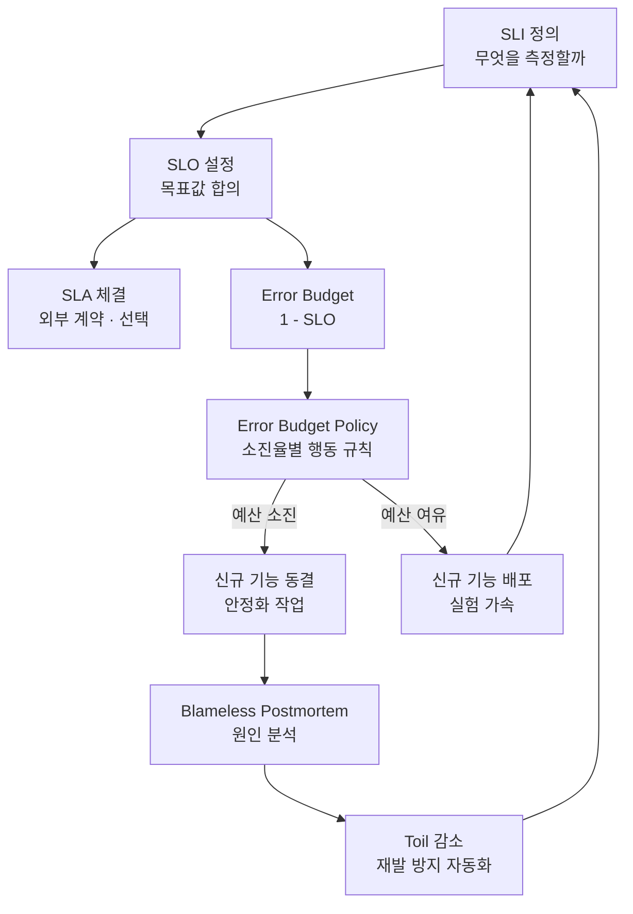

이 문서는 Observability 강의자료가 SRE(Site Reliability Engineering)에 대해 순서대로 보여준 여섯 장의 내용 — SRE란 무엇인가, SLI, SLI의 측정 방식과 지점, SLO와 SLA, Error Budget, Error Budget Policy — 을 핵심 키워드별로 깊이 있게 풀어 설명한다. 각 키워드를 따로 이해하는 데서 그치지 않고, 이 개념들이 왜 하나라도 빠지면 전체가 흔들리는 하나의 시스템으로 설계되었는지를 마지막 절에서 다룬다. 자료 내용 중 정밀하게 짚어볼 부분도 함께 정리했다.

---

## 전체 그림 먼저 보기

여섯 장의 슬라이드에 흩어져 있는 개념들을 하나의 흐름으로 이으면 다음과 같다. 이 순환이 이 문서 전체를 관통하는 뼈대다.



---

## 키워드 1 — SRE(Site Reliability Engineering)

SRE는 "운영 문제를 소프트웨어 엔지니어링으로 푸는 방식"이라는 슬라이드의 정의 그대로, 사람의 감이나 관행이 아니라 소프트웨어 엔지니어링의 도구와 사고방식으로 서비스 안정성을 다루는 접근법이다. 슬라이드가 제시한 세 기둥 — SLO로 합의하기, Error Budget으로 조절하기, Toil을 줄이기 — 은 Google이 정리한 SRE 실천의 핵심 축이며, 이 문서의 뒷부분에서 하나씩 자세히 다룬다.

DevOps와의 관계에 대한 슬라이드의 설명(DevOps가 방향이라면 SRE는 그 방향을 실행하는 구체적 도구)도 업계에서 통용되는 정확한 비유다. DevOps는 "개발과 운영의 벽을 없앤다"는 철학적 목표를 제시하는 운동에 가깝고, SRE는 그 목표를 SLO·Error Budget 같은 구체적이고 측정 가능한 도구로 구현하는 방법론이다. 즉 DevOps가 "왜"를 답한다면 SRE는 "어떻게"를 답한다고 볼 수 있다.

---

## 키워드 2 — Toil

Toil은 슬라이드가 "매번 같은 조치는 사람이 할 일이 아니다"라고 요약한 개념으로, Google의 SRE 도서(*Site Reliability Engineering*) 5장에서 정식으로 정의된 용어다. 원문의 정의를 풀어 쓰면, Toil은 다음 여섯 가지 성질을 많이 가질수록 Toil에 가깝다.

- **수작업(Manual)**: 사람이 직접 손을 대야 한다. 스크립트를 실행하는 것도, 그 스크립트를 사람이 "실행하는" 손 놀림 자체는 Toil이다.
- **반복적(Repetitive)**: 처음 하는 일이나 새로운 문제를 푸는 일은 Toil이 아니다. 똑같은 일을 계속 반복할 때 Toil이 된다.
- **자동화 가능(Automatable)**: 사람의 판단력이 꼭 필요하지 않고 기계가 대신할 수 있는 일이다.
- **전술적(Tactical)**: 전략적으로 계획된 일이 아니라, 알림이 울려서 반응적으로 하게 되는 일이다.
- **지속적 가치가 없음(No enduring value)**: 작업을 마쳐도 시스템은 작업 전과 같은 상태로 돌아간다. 반면 사후분석을 쓰거나 자동화를 만드는 일은 시스템에 영구적인 개선을 남기므로 Toil이 아니다.
- **서비스 규모에 비례해 커짐**: 트래픽이나 서버 대수가 늘어날수록 이 작업량도 함께 늘어난다.

Google은 SRE가 업무 시간의 50%를 넘겨 Toil에 쓰지 않도록 하는 것을 원칙으로 제시한다. 슬라이드의 예시(같은 명령을 스크립트로 바꾸고 그 알림을 지운다)는 이 정의에 정확히 들어맞는다. 남는 시간을 개선에 쓴다는 마지막 문장이 중요한데, Toil을 줄여 확보한 시간이야말로 뒤에서 다룰 Error Budget Policy가 요구하는 "안정화 작업"을 실제로 수행할 수 있는 유일한 자원이기 때문이다.

---

## 키워드 3 — Blameless Postmortem(비난 없는 사후분석)

슬라이드의 초록 확인 박스가 짚은 "장애 대응의 전제"인 비난 없는 사후분석은 Google SRE 도서 15장이 다루는 "사후분석 문화"의 핵심이다. 장애가 발생했을 때 "누가 잘못했는가"를 묻는 대신 "시스템과 절차의 어떤 허점이 사람의 실수를 장애로까지 키웠는가"를 묻는 방식이다.

다만 이것이 "책임을 묻지 않는다"는 뜻은 아니라는 점을 함께 알아 두면 좋다. 비난 없는 문화는 명령을 실행한 사람을 처벌하지 않는다는 뜻이지, 후속 조치 자체를 없앤다는 뜻이 아니다. 오히려 처벌에 대한 두려움이 없어야 담당자가 "제가 이 명령을 실행하다가 이런 실수를 했습니다"라고 솔직하게 증언할 수 있고, 그래야 재발 방지책(대개는 자동화나 안전장치)을 정확하게 설계할 수 있다. 이 재발 방지책이 다시 Toil을 줄이는 작업으로 이어진다는 점에서, 비난 없는 사후분석은 앞서 다룬 Toil 감소와 직접 맞물려 있다.

---

## 키워드 4 — SLI(Service Level Indicator)

SLI는 슬라이드의 정의대로 "서비스 수준을 나타내는 정량 지표"다. 슬라이드가 예시로 든 네 가지 — 가용성(성공 요청 ÷ 전체 요청), 지연시간(p95·p99 백분위), 오류율(5xx 서버 오류 ÷ 전체 요청), 처리량(초당 요청 수) — 은 웹·API 서비스에서 가장 널리 쓰이는 표준 SLI 조합이며, Google Cloud의 SLO 모니터링 문서에서도 동일한 네 가지를 핵심 지표로 다룬다.

### 평균의 함정

슬라이드는 "100명 중 95명이 0.1초, 5명이 3초를 기다려도 평균은 0.25초"라는 예시로 왜 SLO를 평균이 아니라 p95·p99로 적어야 하는지를 설명한다. 정확히 계산해 보면 다음과 같다.

```
(95명 × 0.1초 + 5명 × 3초) ÷ 100명
= (9.5 + 15) ÷ 100
= 24.5 ÷ 100
= 0.245초
```

정확한 값은 0.245초이며, 슬라이드가 적은 0.25초는 이를 반올림한 값이다(0.245는 관례적인 반올림 규칙상 0.25로 올림된다). 결론에는 전혀 영향이 없는 차이지만, 정확한 수치를 확인해 두면 이 예시를 직접 검산해 보는 학습자에게 도움이 된다.

### 측정 방식과 측정 지점 — 두 개의 서로 다른 축을 하나로 합쳐 보여준 부분

슬라이드는 "측정 방식 세 가지"로 요청 기반·시간 기반·롤링 창을 나란히 제시하는데, 조금 더 정확히 하자면 이 셋은 같은 층위의 선택지가 아니라 서로 다른 두 가지 질문에 대한 답이다.

첫 번째 질문은 "무엇을 한 단위로 좋음·나쁨을 셀 것인가"이며, 여기에 대한 답이 슬라이드가 말한 요청 기반과 시간 기반이다. Google Cloud의 공식 문서도 이 둘을 각각 "Request-based SLI"(성공 요청 수를 전체 요청 수로 나누는 방식)와 "Windows-based SLI"(1분 같은 짧은 구간마다 그 구간이 기준을 만족했는지 판정하는 방식)로 부르며, 슬라이드의 설명과 정확히 일치한다.

두 번째 질문은 "그 평가를 어느 기간에 대해 할 것인가"이며, 여기에 대한 답이 "롤링 창"이다. 즉 롤링 창은 요청 기반이든 시간 기반이든 상관없이 적용할 수 있는 별도의 선택지로, "이번 달 1일부터 평가해 매달 리셋할 것인가" 대 "항상 최근 28일을 기준으로 미끄러지듯 평가할 것인가"를 정하는 것이다. 슬라이드가 셋을 나란히 늘어놓은 것은 이해하기 쉽게 만든 실용적인 압축이지만, 엄밀히는 (요청 기반 vs 시간 기반)이라는 한 축과 (롤링 창 vs 고정 캘린더 창)이라는 또 다른 축이 겹쳐 있는 것이라고 이해하면 더 정확하다.

측정 지점 네 곳(애플리케이션 서버 로그 → 로드밸런서·게이트웨이 → 합성 모니터링 → 클라이언트 실사용)을 "아래로 갈수록 사용자에 가깝고 구현은 어렵다"고 정리한 부분은 정확하다. 서버 로그는 이미 있는 데이터를 쓰는 것이라 구현이 가장 쉽지만 로드밸런서 앞단에서 발생한 실패나 사용자 기기·네트워크 구간의 문제는 잡아내지 못한다. 반대로 클라이언트 실사용 측정은 가장 정직한 사용자 경험을 보여주지만 별도의 계측 코드를 배포해야 하므로 구현 난이도가 가장 높다.

---

## 키워드 5 — SLO(Service Level Objective)

SLO는 슬라이드가 정리한 대로 "SLI에 목표를 부여한 것"이다. "가용성 99.9% 이상", "p95 지연 300ms 이하"처럼 SLI에 구체적인 목표값이나 범위를 붙이면 SLO가 된다.

가장 중요한 포인트는 SLO의 기준이 "현재 성능"이 아니라 "사용자 기대"라는 점이다. 지금 시스템이 99.99%를 달성하고 있다고 해서 SLO를 99.99%로 잡으면 안 된다. 대신 "이 지표가 얼마나 나빠지면 사용자가 실제로 떠나기 시작하는가"를 기준으로 목표를 정해야 한다. 100%가 목표가 될 수 없는 이유도 여기에 있다. 99.9%에서 99.99%로 한 자릿수를 더 올리려면 비용은 몇 배로 뛰지만, 사용자는 그 차이를 거의 체감하지 못한다. 슬라이드의 팁 박스가 인용한 "왜 99.9인가에 답할 수 있어야 진짜 SLO"라는 문장은 Google SRE 도서 4장의 핵심 주장이며, 근거는 정확히 사용자 기대와 비용 사이의 균형이다.

---

## 키워드 6 — SLA(Service Level Agreement)

SLA는 SLO에 "미충족 시 결과가 따르는 계약"을 붙인 것이다. 슬라이드가 정리한 순서 — SLI(측정) → SLO(내부 목표) → SLA(외부 계약) — 는 언제나 이 방향으로만 성립한다. 측정할 수 없는 것에는 목표를 정할 수 없고, 목표가 없는 것에는 계약을 걸 수 없기 때문이다.

SLA가 SLO보다 느슨하게 잡히는 것이 관례라는 설명도 정확하다. SLA를 위반하면 환불이나 페널티 같은 실제 금전적 결과가 따르므로, 팀은 내부적으로 더 엄격한 SLO를 잡아 두고 그보다 여유 있는 수치를 SLA로 외부에 약속한다. 이렇게 하면 SLO를 살짝 벗어나더라도 SLA까지 위반하는 일은 드물게 만들 수 있다.

---

## 키워드 7 — Error Budget(허용된 실패의 양)

Error Budget은 "1 − SLO"로 정의된다. 슬라이드가 제시한 표를 검산하면 다음과 같다(한 달을 30일, 즉 43,200분으로 계산).

| SLO | 계산 | 허용 다운타임 |
|---|---|---|
| 99.9% | 43,200분 × 0.1% | 43.2분 |
| 99.5% | 43,200분 × 0.5% | 216분 = 3.6시간 |
| 99.0% | 43,200분 × 1% | 432분 = 7.2시간 |

셋 모두 슬라이드의 수치와 정확히 일치한다. Error Budget의 진짜 역할은 단순한 계산값이 아니라 "이번 주에 얼마나 위험을 감수할 수 있는가"라는 질문에 감이 아니라 숫자로 답하게 해주는 데 있다. 슬라이드가 "변경 속도를 정하는 다이얼"이라고 표현한 것이 정확한 비유다. 예산이 남아 있으면 배포와 실험의 속도를 올리고, 소진되면 멈추고 안정화에 집중한다.

---

## 키워드 8 — Error Budget Policy(소진하면 무엇을 할 것인가)

Error Budget Policy는 예산이라는 숫자를 실제 행동 규칙으로 바꾸는 문서다. Google SRE Workbook의 부록 B(Appendix B, "Example Error Budget Policy")에 실린 실제 예시도 슬라이드와 같은 구조를 취한다. 소진율이 낮을 때는 평소대로 진행하고, 예산을 완전히 소진하면 보안 패치나 심각한 장애 대응을 제외한 모든 변경·배포를 동결하며, 예산이 회복되면 다시 재개한다. 슬라이드가 제시한 네 단계(~50% 평소 진행 / 50~75% 경고 및 원인 리뷰 / 75~100% 위험한 변경 동결 검토 / 100% 신규 배포 중단)는 이 공식 예시를 그대로 세분화한 합리적인 구성이다.

두 가지 경고 박스도 실무에서 자주 강조되는 지점과 일치한다. 정책은 반드시 장애가 나기 전에 정해 둬야 하며, 장애 도중에 정하면 기술적 판단이 정치적 다툼으로 변질된다. 또한 이 정책에는 개발·운영·제품 조직이 함께 서명해야 하는데, Error Budget Policy가 결국 "언제 기능 개발을 멈출 것인가"를 미리 정하는 제품 조직과의 합의이기 때문이다.

---

## 이 개념들을 통합했을 때 생기는 시너지

여섯 장의 슬라이드는 각각 독립된 주제처럼 보이지만, 실제로는 하나라도 빠지면 나머지가 제대로 작동하지 않는 하나의 폐루프(closed loop) 시스템이다. 그 연결을 순서대로 짚으면 다음과 같다.

**SLI 없이는 SLO를 정할 수 없다.** 무엇을 측정할지, 어떤 방식과 지점에서 측정할지가 먼저 합의되어 있어야, "얼마나 안정적이어야 하는가"라는 SLO 논의 자체가 성립한다. 측정 방법이 애매하면 슬라이드가 경고한 대로 "가용성 99.9%"라는 숫자만 적은 합의는 나중에 반드시 숫자를 둘러싼 다툼으로 되돌아온다.

**SLO 없이는 Error Budget이 존재하지 않는다.** Error Budget은 1에서 SLO를 뺀 값이므로, SLO가 감이 아니라 사용자 기대에 근거한 숫자로 정해져 있어야 Error Budget도 의미 있는 숫자가 된다.

**Error Budget의 진짜 힘은 정치적 논쟁을 숫자 논쟁으로 바꾸는 데 있다.** "배포하자"와 "위험하다"라는 입장 대립은 원래 누구의 목소리가 크냐로 결판나기 쉽지만, Error Budget이 있으면 "예산이 몇 퍼센트 남았는가"라는 검증 가능한 질문으로 바뀐다.

**그런데 Error Budget Policy가 없으면 Error Budget은 그저 대시보드 위의 숫자일 뿐이다.** 소진되었을 때 무엇을 할지 사전에 합의해 두지 않으면, 정작 예산이 바닥났을 때 "그래도 이번 배포는 예외로 하자"는 예외가 반복되고 예산이라는 개념 자체가 무력화된다. 슬라이드가 "반드시 장애가 나기 전에 정해 둔다"고 강조한 이유다.

**Error Budget Policy가 요구하는 "안정화 작업"은 Toil을 줄여 확보한 시간이 없으면 수행할 인력 자체가 없다.** 팀이 이미 반복 작업에 시달리고 있다면, 예산이 소진되어 안정화에 집중하기로 정책이 정해져 있어도 실제로 그 작업을 할 여력이 없다. Toil 감소는 Error Budget Policy가 실제로 작동하기 위한 전제 조건이다.

**Error Budget 소진의 원인을 찾는 과정은 비난 없는 사후분석 없이는 왜곡된다.** 소진 원인 상위 3건을 리뷰하는 단계(슬라이드의 50~75% 구간)가 "누가 이 장애를 냈는가"를 찾는 자리로 변질되면, 사람들은 사실을 숨기게 되고 같은 원인이 반복된다. 비난 없는 사후분석이라는 문화가 있어야 이 리뷰가 실제로 재발 방지로 이어진다.

**그 재발 방지책은 대개 자동화, 즉 Toil을 줄이는 작업으로 귀결된다.** 이렇게 줄어든 Toil은 다시 팀에 여유 시간을 만들어 주고, 그 시간은 SLI를 더 정교하게 측정하거나 새로운 신뢰성 개선에 투입된다. 순환이 처음 지점으로 되돌아오는 것이다.

결국 이 여섯 개념은 "측정(SLI) → 목표(SLO/SLA) → 예산(Error Budget) → 규칙(Error Budget Policy) → 문화(Blameless Postmortem) → 여력(Toil 감소)"이라는 하나의 순환 고리이며, SRE라는 이름은 이 순환 전체를 가리킨다. 어느 한 조각만 떼어내 도입하면(예를 들어 SLO만 정하고 Error Budget Policy는 만들지 않거나, Error Budget은 있는데 비난 없는 문화가 없는 경우) 나머지 조각들이 제 역할을 하지 못하고 시스템 전체가 형식적인 문서로만 남는 경우가 실무에서 흔히 나타난다.

---

## 2026년 현재 덧붙일 것 — AI 시스템으로 확장되는 Error Budget

이 문서에서 다룬 Error Budget의 원형은 가용성·지연시간처럼 인프라 관점의 실패를 전제로 설계되었다. 그런데 2026년 현재는 AI가 서비스 로직 안에 깊이 들어오면서, 이 틀을 그대로 적용하기 어려운 상황이 늘고 있다. AI로 구성된 컴포넌트는 가용성과 지연시간 SLO를 100% 만족하면서도, 답변이 사실과 다르거나(hallucination) 오래된 정보를 내놓거나 안전하지 않은 응답을 내는 식으로 "의미적으로는" 실패할 수 있기 때문이다. 그래서 최근에는 답변 품질 저하율, 폴백(fallback) 발생률, 정책 준수 여부 같은 차원까지 Error Budget 개념을 확장하려는 시도가 늘고 있다. 이 문서가 다룬 전통적인 Error Budget 체계를 인프라 신뢰성의 기본기로 확실히 익혀 둔 뒤, AI 컴포넌트를 도입하는 서비스라면 이런 확장까지 함께 고려할 필요가 있다.

---

## 정정 및 보완 사항 정리

| 항목 | 슬라이드 내용 | 확인 결과 |
|---|---|---|
| 평균 지연시간 예시 | "평균은 0.25초입니다" | 정확한 값은 0.245초이며, 0.25초는 반올림한 값이다. 결론(p95·p99를 써야 하는 이유)에는 영향 없음 |
| SLI 측정 방식 세 가지 | 요청 기반·시간 기반·롤링 창을 같은 층위로 나열 | 요청 기반 vs 시간 기반(윈도우 기반)은 "무엇을 셀 것인가"의 축이고, 롤링 창 vs 고정 캘린더 창은 "어느 기간을 평가할 것인가"라는 별개의 축이다. 두 축이 겹쳐 있다고 이해하면 더 정확하다 |
| 그 외 정의·계산·인용 | SRE 세 기둥, Toil 정의, Blameless Postmortem, SLO/SLA 관계, Error Budget 계산식과 다운타임 수치, Error Budget Policy 4단계 구조, Google SRE Book 4장 인용 | 모두 Google SRE Book·Workbook의 공식 정의 및 계산과 정확히 일치한다. 별도로 정정할 내용은 없다 |

---

## 참고 자료

- [Google SRE Book — Chapter 4: Service Level Objectives](https://sre.google/sre-book/service-level-objectives/) (SLI·SLO·SLA 정의와 "왜 99.9인가"의 근거)
- [Google SRE Book — Chapter 5: Eliminating Toil](https://sre.google/sre-book/eliminating-toil/) (Toil의 6가지 정의 원문)
- [Google SRE Workbook — Appendix B: Example Error Budget Policy](https://sre.google/workbook/error-budget-policy) (Error Budget Policy의 실제 공식 예시)
- [Google Cloud — Concepts in service monitoring](https://docs.cloud.google.com/stackdriver/docs/solutions/slo-monitoring) (Request-based SLI와 Windows-based SLI의 공식 구분)
- [Google Cloud Architecture Framework — Measure SLOs](https://cloud.google.com/architecture/framework/reliability/measure-slos) (가용성·지연시간 등 SLI 유형별 실무 정의)
- [PagerDuty — Toil: Still Plaguing Engineering Teams](https://www.pagerduty.com/?p=80291) (Toil 정의의 현재 시점 재해석)
- [Traversal — Error Budget](https://www.traversal.com/glossary/error-budget) (2026년 기준 AI 시스템으로의 Error Budget 확장 논의)

---

작성일: 2026-09-22
