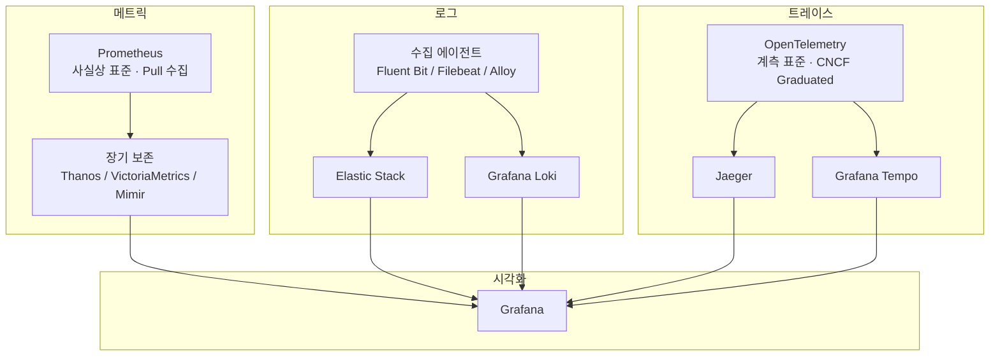
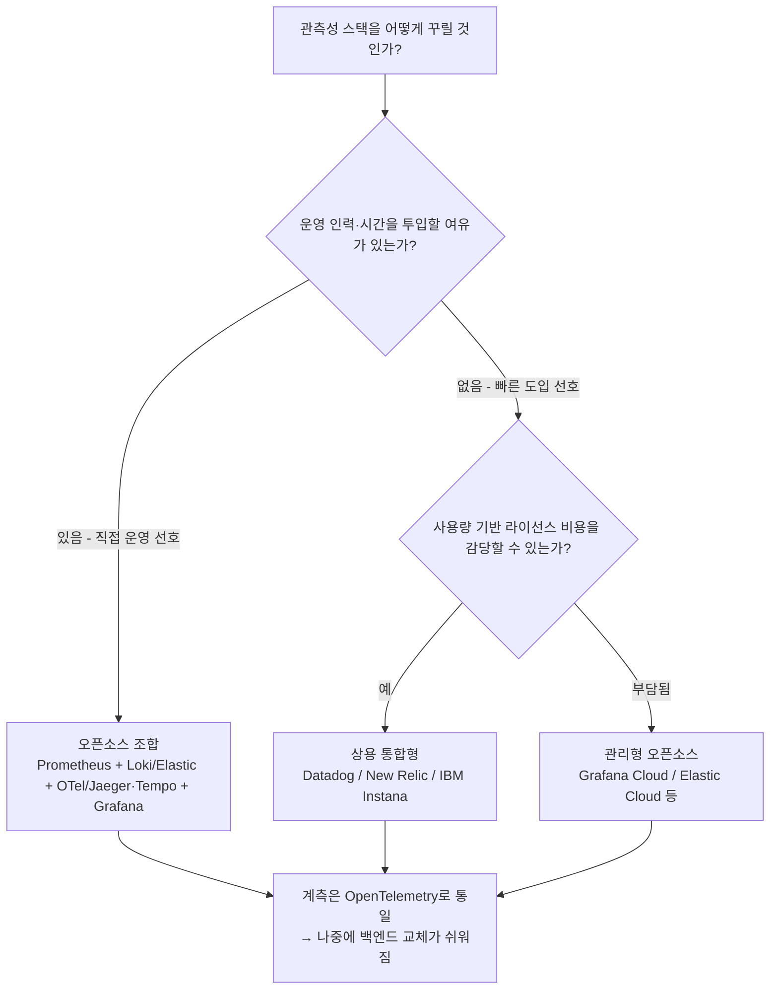
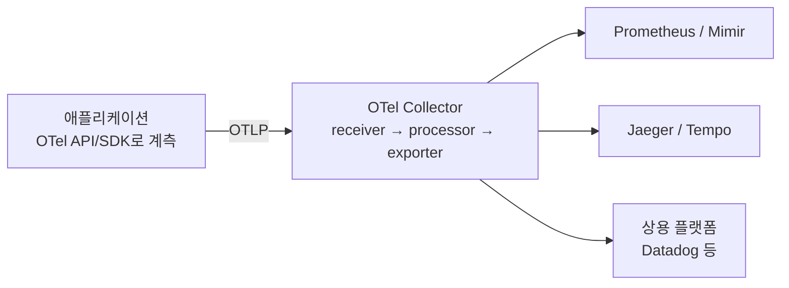

이 문서는 Observability 기본 강의(M1)의 "관측성 도구 지형 — 오늘 어디를 다루는가" 슬라이드를 바탕으로, 메트릭·로그·트레이스 각 영역에서 실제로 쓰이는 도구들이 무엇이고 서로 어떻게 연결되는지를 처음 접하는 사람도 이해할 수 있도록 풀어서 설명한다. 슬라이드가 정리한 다섯 줄(메트릭, 로그, 트레이스, 시각화, 상용 통합) 각각을 자세히 들여다보고, 슬라이드 작성 이후 2026년 현재까지 이 생태계에서 일어난 중요한 변화도 함께 반영했다.

---


## 이 지도를 보는 법

강의자료의 표는 관측성 도구 생태계를 다섯 개의 줄로 요약한다. 앞의 세 줄(메트릭·로그·트레이스)은 관측성의 3요소 각각에 대해 "사실상 표준으로 자리 잡은 오픈소스 도구가 무엇인가"를 보여주고, 네 번째 줄(시각화)은 그 셋을 한 화면에서 보게 해주는 공통 창구를, 다섯 번째 줄(상용 통합)은 그 모든 것을 직접 구축하는 대신 하나의 제품으로 사서 쓰는 대안을 보여준다. 즉 이 표는 "무엇을 살 것인가"의 목록이 아니라, 관측성 스택을 짤 때 실제로 마주치게 되는 선택지의 지형도에 가깝다.

핵심은 표 아래의 팁 박스가 말하는 두 가지 선택 기준이다. 첫째는 직접 운영에 드는 인력·시간 비용과 상용 제품의 라이선스 비용 사이의 균형이고, 둘째는 계측(instrumentation)을 특정 벤더의 SDK가 아니라 OpenTelemetry로 통일해 두면 나중에 백엔드(저장·조회 시스템)를 바꾸기가 쉬워진다는 점이다. 이 문서는 이 두 기준을 염두에 두고 각 영역을 하나씩 살펴본다.



---

## 메트릭 — Prometheus를 중심으로 한 생태계

앞선 문서에서 다뤘듯 Prometheus는 메트릭 영역의 사실상 표준이며, 계측 대상이 노출한 `/metrics` 엔드포인트를 주기적으로 당겨오는 Pull 방식으로 동작한다. 다만 Prometheus 서버에 내장된 저장소(TSDB)는 기본 보존 기간이 15일에 불과하도록 설계되어 있다. 스크레이핑과 즉각적인 알림이라는 원래 목적에는 이 정도면 충분하지만, 몇 달·몇 년치 이력을 비교하거나 여러 클러스터를 한 화면에서 봐야 하는 순간 한계에 부딪힌다.

그래서 등장하는 것이 "장기 보존(long-term storage)" 계층이다. 슬라이드가 언급한 Thanos와 VictoriaMetrics가 대표적이며, 여기에 더해 2026년 현재는 Grafana Labs가 만든 Mimir도 세 번째 주요 선택지로 널리 자리 잡았다. 셋의 성격은 조금씩 다르다. Thanos는 기존 Prometheus 인스턴스를 감싸는 방식이라 도입 장벽이 낮고, VictoriaMetrics는 단일 바이너리로 동작해 운영 부담이 가장 적으며, Mimir는 테넌트별 격리가 필요한 대규모 멀티테넌시 환경에 특화되어 있다. 과거 널리 쓰이던 Cortex 프로젝트는 개발이 사실상 멈췄고 유지보수 인력 상당수가 Mimir로 옮겨갔기 때문에, 신규 구축이라면 Cortex보다는 Mimir를 검토하는 것이 일반적이다.

| 도구 | 성격 | 적합한 상황 |
|---|---|---|
| Thanos | 기존 Prometheus를 감싸는 모듈형 구조 | 기존 Prometheus 자산을 최대한 유지하고 싶을 때 |
| VictoriaMetrics | 단일 바이너리의 자체 시계열 DB | 운영 인력이 적고 리소스 효율이 중요할 때 |
| Grafana Mimir | 테넌트 격리를 갖춘 대규모 멀티테넌시 시스템 | 여러 팀·고객에게 모니터링을 서비스로 제공할 때 |

---

## 로그 — Elastic Stack와 Loki, 서로 다른 두 갈래

로그 영역에는 성격이 뚜렷하게 다른 두 갈래가 있다. 하나는 Elasticsearch·Logstash·Kibana로 구성된 Elastic Stack(흔히 ELK로 불린다)이고, 다른 하나는 Grafana Labs가 만든 Loki다.

Elastic Stack은 로그의 전체 텍스트를 색인(indexing)해서 저장하기 때문에 자유로운 전문 검색이 강력하지만, 그만큼 저장·색인 비용이 크다. 한 가지 짚어둘 만한 최신 동향은 라이선스 이력이다. Elastic은 2021년 Elasticsearch·Kibana를 Apache 2.0에서 독자 라이선스(Elastic License)와 SSPL로 전환하며 한동안 오픈소스 진영을 떠났었는데, 2024년 8월 AGPLv3를 라이선스 선택지로 다시 추가하면서 공식적으로 "다시 오픈소스"로 인정받는 상태로 돌아왔다. 이 변화를 계기로 AWS가 만든 포크 프로젝트인 OpenSearch도 독자적인 생태계로 계속 발전하고 있다.

반면 Loki는 "Prometheus에서 영감을 받은" 로그 시스템이라는 소개 문구 그대로, 로그 내용 전체가 아니라 각 로그 스트림에 붙는 레이블(label)만 색인한다. 즉 Prometheus가 메트릭을 레이블 조합으로 식별하듯, Loki는 로그 스트림을 레이블 조합으로 식별하고 실제 로그 본문은 압축해서 그대로 쌓아 둘 뿐 색인하지 않는다. 그 덕분에 저장 비용이 Elastic Stack 대비 훨씬 저렴하지만, 그 대신 레이블에 잡히지 않은 내용으로 검색할 때는 해당 구간의 로그를 실제로 훑어야 해서 검색 방식에 제약이 있다. 정리하면 "무엇이든 자유롭게 검색해야 한다"면 Elastic Stack이, "레이블로 좁힌 뒤 비용을 아끼고 싶다"면 Loki가 자연스러운 선택이다. Loki는 여전히 AGPLv3 라이선스로 배포된다.

로그를 수집해 이 두 저장소로 실어 나르는 수집 에이전트로는 슬라이드가 언급한 Fluent Bit와 Filebeat가 여전히 널리 쓰인다. Fluent Bit는 CNCF 산하 Fluent 프로젝트의 경량 버전으로 Kubernetes 환경에서 특히 많이 쓰이고, Filebeat는 Elastic의 Beats 계열 경량 수집기다. 여기에 더해 2026년 현재는 Grafana Alloy라는 에이전트도 눈여겨볼 만하다. Alloy는 OpenTelemetry Collector를 기반으로 한 벤더 중립적 배포판으로, Loki 진영에서 오랫동안 쓰이던 Promtail을 대체했다. Promtail은 기능 동결(feature-complete) 상태로 유지보수만 이어지다가 2025년 11월 수명을 다했으므로, 신규로 Loki를 도입한다면 Promtail이 아니라 Alloy를 쓰는 것이 현재 권장되는 방식이다.

---

## 트레이스 — OpenTelemetry라는 계측 표준과 그 위의 저장소들

트레이스 영역에서 반드시 구분해야 할 것은 "계측 표준"과 "저장·조회 백엔드"가 서로 다른 역할이라는 점이다. OpenTelemetry는 애플리케이션 코드에 트레이스(그리고 메트릭·로그까지)를 심는 방식을 벤더 중립적으로 표준화한 API·SDK·수집기(Collector) 묶음이다. 즉 OpenTelemetry 자체는 트레이스 데이터를 저장하거나 화면에 보여주지 않는다. 그 데이터를 받아 저장하고 조회하게 해주는 것이 Jaeger나 Tempo 같은 백엔드다.

2026년 현재 시점에서 가장 눈에 띄는 변화는 OpenTelemetry의 위상 자체다. OpenTelemetry는 2026년 5월 CNCF(Cloud Native Computing Foundation)의 최고 성숙도 단계인 "Graduated"를 공식 획득했다. 이는 Kubernetes, Prometheus와 같은 반열에 오른 것으로, 트레이스·로그·메트릭 세 신호 모두가 정식(GA) 단계에 이르렀고 수천 개 조직이 프로덕션에서 쓰고 있다는 뜻이다. 슬라이드가 트레이스 영역에 "계측 표준"이라는 한 줄로 적어 둔 OpenTelemetry는, 강의자료가 만들어진 시점보다 지금 한층 더 확고한 업계 표준으로 자리 잡았다고 보면 된다.

이 계측 표준 위에서 실제로 트레이스를 저장하고 검색하게 해주는 두 백엔드가 Jaeger와 Tempo다. Jaeger는 원래 Uber가 만들어 CNCF에 기증한 프로젝트로, 트레이싱 도구로는 가장 먼저 CNCF 졸업(2019년)을 달성한 원조 격 도구다. 흥미로운 지점은 Jaeger 스스로도 최근 몇 년 사이 OpenTelemetry 쪽으로 완전히 재편되었다는 점이다. 2024년 11월 공개된 Jaeger v2는 아예 OpenTelemetry Collector 프레임워크를 뼈대 삼아 다시 만들어졌고, 기존 방식(Jaeger 에이전트·전용 프로토콜)을 쓰던 v1은 2025년 12월 31일 자로 수명을 다했다. 즉 지금 Jaeger를 새로 도입한다면 자연스럽게 OpenTelemetry Collector 기반의 v2를 쓰게 된다. Tempo는 Grafana Labs가 만든 트레이스 백엔드로, Jaeger·Zipkin·OpenTelemetry 등 주요 트레이싱 프로토콜을 모두 받아들이며 AGPLv3로 배포된다.

---

## 시각화 — Grafana라는 공통 창구

슬라이드가 짚은 대로 Grafana는 메트릭·로그·트레이스 세 요소를 각각 다른 도구로 수집·저장하더라도 한 화면에서 넘나들며 볼 수 있게 해주는 공통 창구 역할을 한다. Grafana 자체도 2021년부터 AGPLv3로 배포되고 있으며, 2026년 9월 기준 안정 버전은 13.2.2다.

Grafana Labs는 자사가 만든 오픈소스 백엔드들(Loki, Grafana, Tempo, Mimir)을 묶어 "LGTM 스택"이라고 부른다. 이 문서에서 다룬 로그(Loki)·시각화(Grafana)·트레이스(Tempo)·메트릭 장기 보존(Mimir)이 바로 이 네 글자에 해당하며, 네 가지 모두 하나의 벤더가 만들었기 때문에 서로 맞물려 동작하도록 최적화되어 있다는 것이 특징이다. 다만 이 스택을 꼭 통째로 써야 하는 것은 아니며, Prometheus·Elastic Stack·Jaeger처럼 다른 조합과 섞어 쓰는 경우도 흔하다.

---

## 상용 통합 — 하나의 제품으로 세 요소를 사는 방법

지금까지 다룬 도구들을 직접 조합해 구축하는 대신, Datadog·New Relic·IBM Instana처럼 메트릭·로그·트레이스를 처음부터 하나의 제품으로 묶어 파는 상용 플랫폼을 택하는 방법도 있다. 이들은 각 신호마다 서로 다른 오픈소스 도구를 골라 연결하고 운영하는 수고를 없애는 대신, 사용량에 비례하는 라이선스 비용을 지불하는 구조다. IBM Instana는 2020년 IBM이 인수한 이후에도 독자 브랜드로 계속 운영되고 있으며, Datadog은 관측성을 넘어 보안·AI 운영까지 아우르는 넓은 제품군으로 확장해 왔다.

2026년 현재 이 상용 플랫폼들 사이의 경쟁에서 두드러지는 흐름은 AI 기반 조사(investigation) 기능이다. 장애가 발생했을 때 사람이 대시보드를 뒤지는 대신, AI가 가설을 세우고 관련 지표·로그·트레이스를 스스로 훑어 원인 후보를 정리해 제시하는 기능이 여러 상용 플랫폼의 핵심 차별화 요소로 자리 잡고 있다. 다만 이런 상용 플랫폼도 데이터를 받아들이는 입구로는 OpenTelemetry(OTLP) 수집을 점점 더 폭넓게 지원하는 추세이며, 이는 다음 절에서 다룰 "계측을 OpenTelemetry로 통일해 두라"는 조언이 오픈소스 조합뿐 아니라 상용 플랫폼을 고를 때도 여전히 유효한 이유이기도 하다.

---

## 두 가지 선택 기준을 다시 보기

슬라이드의 팁 박스가 남긴 두 기준을 이제 구체적인 맥락에서 다시 보면 이렇다.

첫째, 비용의 균형이다. 오픈소스 조합(Prometheus+Loki/Elastic+OTel/Jaeger·Tempo+Grafana)은 라이선스 비용이 들지 않지만, 여러 컴포넌트를 각각 배포·업그레이드·장애 대응해야 하는 운영 인력과 시간이 필요하다. 반대로 상용 통합형은 그 운영 부담을 벤더에게 넘기는 대신 사용량에 따라 커지는 라이선스 비용을 감수해야 한다. 어느 쪽이 유리한지는 팀의 운영 역량과 예산 구조에 달려 있으며, 그 중간 지점으로 Grafana Cloud나 Elastic Cloud 같은 "관리형 오픈소스"를 선택하는 경우도 많다.

둘째, 계측을 OpenTelemetry로 통일해 두는 것의 가치다. 애플리케이션 코드에 Datadog 전용 SDK나 특정 백엔드 전용 라이브러리를 직접 심어 버리면, 나중에 백엔드를 바꾸고 싶을 때 계측 코드 자체를 다시 써야 한다. 반면 OpenTelemetry의 벤더 중립적 API로 계측해 두면, 뒤에서 데이터를 받는 백엔드를 Jaeger에서 Tempo로, 혹은 오픈소스에서 상용 플랫폼으로 바꾸더라도 애플리케이션 코드는 그대로 두고 수집기(Collector)의 내보내기(export) 설정만 바꾸면 된다. OpenTelemetry가 2026년 CNCF Graduated에 이를 만큼 널리 채택된 배경에는 이런 실용적인 이유가 크게 작용했다.



---

## 2026년 현재 기준으로 달라진 것들

슬라이드 자체에 틀린 내용은 없지만, 슬라이드가 다섯 줄로 압축한 지형 위에서 2026년까지 몇 가지 중요한 변화가 있었다. 아래 표로 정리한다.

| 영역 | 슬라이드 내용 | 2026년 현재 덧붙일 내용 |
|---|---|---|
| 메트릭 | 장기 보존은 Thanos·VictoriaMetrics | Grafana Mimir가 세 번째 주요 선택지로 자리 잡았고, 과거 널리 쓰이던 Cortex는 사실상 개발이 멈추고 Mimir로 수렴하는 중이다. |
| 로그 | 수집 에이전트는 Fluent Bit·Filebeat | Loki 진영에서는 Promtail이 2025년 11월 수명을 다했고, OpenTelemetry Collector 기반의 Grafana Alloy가 그 자리를 대신하고 있다. Elastic Stack은 2024년 8월 AGPLv3를 추가하며 공식적으로 오픈소스 지위를 되찾았다. |
| 트레이스 | OpenTelemetry(계측 표준) + Jaeger·Tempo | OpenTelemetry는 2026년 5월 CNCF 최고 등급인 Graduated를 획득했다. Jaeger는 2024년 11월 공개된 v2부터 OpenTelemetry Collector를 기반으로 재구축되었고, 구버전인 v1은 2025년 12월 31일 자로 수명이 끝났다. |
| 상용 통합 | Datadog·New Relic·IBM Instana | 세 플랫폼 모두 장애 원인을 스스로 조사해 제시하는 AI 기반 조사 기능을 핵심 차별화 요소로 내세우는 추세이며, 데이터 수집 입구로 OpenTelemetry(OTLP) 지원을 점차 넓히고 있다. |

---

## 오늘 실습 범위와의 연결

슬라이드의 초록색 확인 박스가 밝히듯, 이번 세션에서 직접 세워 보는 것은 이 지도의 첫 줄과 넷째 줄, 즉 Prometheus와 Grafana 축이다. 이 조합은 이 지도 전체에서 가장 진입 장벽이 낮고 자료가 가장 풍부한 조합이기도 하다. 앞서 다룬 메트릭의 네 가지 타입(Counter·Gauge·Histogram·Summary)과 p95 개념은 바로 이 Prometheus 축 위에서 그대로 쓰이게 된다.

---

## 부록 A — OpenTelemetry 상세 설명

본문 곳곳에서 확인했듯, OpenTelemetry는 이 지도의 다섯 줄 중 단순히 "트레이스" 한 줄에만 머무르지 않는다. Jaeger는 v2부터 OpenTelemetry Collector 위에 다시 지어졌고, Loki 진영의 신규 수집 에이전트인 Alloy도 OpenTelemetry Collector의 배포판이며, 상용 플랫폼들도 데이터 수집 입구로 OpenTelemetry(OTLP)를 점점 더 넓게 받아들이고 있다. "OpenTelemetry가 핵심일 것 같다"는 직관은 정확하다. 이 부록에서는 OpenTelemetry가 정확히 무엇으로 이루어져 있고, 왜 이렇게까지 이 생태계의 뼈대가 되었는지를 자세히 다룬다.

### OpenTelemetry는 정확히 무엇인가

가장 먼저 분명히 해 둘 것은, OpenTelemetry 자체는 데이터를 저장하거나 화면에 보여주는 제품이 아니라는 점이다. OpenTelemetry는 애플리케이션에서 텔레메트리(trace·metric·log 등 관측 데이터)를 만들어내고, 가공하고, 어딘가로 실어 보내는 과정을 벤더 중립적으로 표준화한 명세와 도구 모음이다. 이 문서 앞부분에서 다룬 Jaeger·Tempo·Prometheus·Loki·Datadog 같은 이름들은 모두 이 표준을 따라 만들어진 데이터를 "받아서 저장·조회하는" 쪽이고, OpenTelemetry는 그 데이터가 애초에 어떤 모양으로, 어떤 경로를 거쳐 만들어지는지를 정의하는 쪽이다.

### 왜 만들어졌는가 — OpenTracing와 OpenCensus의 통합

OpenTelemetry는 2019년 5월, 먼저 존재하던 두 프로젝트인 OpenTracing(CNCF 산하 트레이싱 표준)과 OpenCensus(Google이 만든 계측 라이브러리)가 하나로 합쳐지며 탄생했다. 그전까지는 트레이싱 벤더마다 자체 SDK를 요구했기 때문에, 백엔드를 바꾸려면 애플리케이션 코드에 심어 둔 계측 라이브러리 자체를 통째로 걷어내고 다시 심어야 했다. 게다가 트레이스·메트릭·로그가 서로 다른 체계로 다뤄져서 셋을 연관 지어 보기도 어려웠다. OpenTelemetry는 이 두 가지 문제, 즉 벤더 종속과 신호 간 단절을 한 번에 풀기 위해 만들어졌다. 통합 이후 두 선조 프로젝트는 각각 보관(archive) 처리되었는데, OpenTracing은 2022년 1월, OpenCensus는 2023년 7월에 공식적으로 개발이 종료되었다.

### 네 가지 구성 요소

OpenTelemetry는 크게 네 부분으로 이루어진다.

- **API**: 계측 코드가 호출하는, 언어별로 제공되는 인터페이스. "여기서 스팬을 하나 시작한다", "이 카운터를 1 증가시킨다"처럼 개발자가 직접 코드에 심는 부분이다.
- **SDK**: API의 실제 구현체로, 샘플링 비율, 배치 전송 주기, 내보낼 곳(exporter) 등을 설정한다.
- **Collector**: 애플리케이션과 별도로 독립 실행되는 프로세스로, 데이터를 받아들이는 수신기(receiver), 가공·필터링·배치 처리를 하는 처리기(processor), 최종 목적지로 내보내는 내보내기(exporter)를 파이프라인 형태로 조합한다. 이 문서에서 다룬 "계측은 그대로 두고 백엔드만 바꾼다"는 유연성이 실제로 일어나는 지점이 바로 이 Collector다.
- **OTLP(OpenTelemetry Protocol)**: 위 모든 구성 요소가 데이터를 주고받을 때 공통으로 쓰는 전송 프로토콜(gRPC 또는 HTTP)이다.

### 네 가지 신호(signal)

OpenTelemetry가 다루는 텔레메트리 종류를 신호(signal)라고 부르는데, 현재 네 가지가 있다.

| 신호 | 다루는 내용 | 2026년 현재 성숙도 |
|---|---|---|
| Traces | 요청이 여러 서비스를 거치는 경로와 각 구간의 소요 시간 | GA(정식) |
| Metrics | 카운터·게이지 등 앞서 다룬 숫자형 시계열 | GA(정식) |
| Logs | 타임스탬프가 찍힌 이벤트 기록 | GA(정식) |
| Profiles | 코드 실행 중 CPU·메모리 사용을 함수 단위로 들여다보는 연속 프로파일링 | 신규 4번째 신호, Alpha 단계 |

트레이스와 메트릭이 먼저 안정화되었고, 로그는 그보다 다소 늦게 GA에 도달했다. 프로파일링은 2025년 무렵 네 번째 신호로 추가되어 아직 초기 단계이므로, 지금 당장 프로덕션에 적용하기보다는 앞으로 지켜볼 항목에 가깝다.

### Collector 파이프라인이 실제로 하는 일

"계측을 OpenTelemetry로 통일해 두면 백엔드 교체가 쉽다"는 본문의 설명을 구체적인 설정으로 보면 다음과 같다. 애플리케이션은 OTLP 하나로만 데이터를 내보내고, 그 데이터를 어디로 보낼지는 오직 Collector의 설정 파일이 결정한다.

```yaml
receivers:
  otlp:
    protocols:
      grpc:
      http:

processors:
  batch:

exporters:
  otlphttp/jaeger:
    endpoint: http://jaeger:4318
  prometheusremotewrite:
    endpoint: http://mimir:9009/api/v1/push

service:
  pipelines:
    traces:
      receivers: [otlp]
      processors: [batch]
      exporters: [otlphttp/jaeger]
    metrics:
      receivers: [otlp]
      processors: [batch]
      exporters: [prometheusremotewrite]
```

이 설정에서 트레이스는 Jaeger로, 메트릭은 Mimir(Prometheus 원격 쓰기)로 보내지도록 되어 있다. 만약 트레이스 백엔드를 Jaeger에서 상용 플랫폼으로 바꾸고 싶다면, `exporters` 항목 하나만 그 플랫폼의 OTLP 수신 주소로 바꾸면 된다. 애플리케이션에 심어 둔 계측 코드는 단 한 줄도 건드릴 필요가 없다. 이것이 본문에서 "벤더 중립적"이라고 표현한 것의 실체다.



### 이 지도의 다른 도구들과 맺는 관계

본문에서 다룬 도구들을 다시 놓고 보면, 이미 상당수가 OpenTelemetry를 뼈대로 삼거나 입구로 받아들이고 있다는 것이 드러난다.

- **Prometheus**는 원래 자체 노출 형식과 Pull 수집 방식으로 출발했지만, 이제 OTLP로 들어오는 메트릭을 직접 받아들일 수 있고, Collector의 exporter를 통해 Prometheus 포맷으로 내보내는 것도 가능하다.
- **Jaeger**는 v2부터 아예 OpenTelemetry Collector 프레임워크 위에서 다시 지어졌다.
- **Grafana Alloy**는 OpenTelemetry Collector의 벤더 중립적 배포판이며, Loki 진영의 기존 수집 에이전트인 Promtail을 대체했다.
- **Datadog·New Relic·IBM Instana** 같은 상용 플랫폼들도 자체 에이전트 외에 OTLP 수집을 점점 더 폭넓게 지원하는 추세다.

즉 이 지도의 다섯 줄 중 메트릭·트레이스·로그 세 줄 모두에서 OpenTelemetry가 이미 공통 입구이거나 내부 골격 역할을 하고 있다. "OpenTelemetry가 핵심"이라는 인상은 개별 도구 하나하나를 따로 볼 때보다, 이 지도 전체를 겹쳐서 볼 때 훨씬 분명하게 드러난다.

### 2026년 현재 상태 요약

- CNCF 성숙도 단계: **Graduated**(2026년 5월 획득, Kubernetes·Prometheus와 같은 최고 등급)
- 지난 12개월간 JavaScript API 패키지는 13억 6천만 회 이상, Python API 패키지는 13억 회 이상 다운로드되었으며, 두 패키지 모두 2026년 4월에 월간 다운로드 최고 기록을 새로 세웠다.
- CNCF 내에서 Kubernetes 다음으로 개발 활동(velocity)이 활발한 프로젝트로 꼽힌다.

### 실무에 도입할 때의 순서

1. 애플리케이션에 OpenTelemetry API/SDK로 계측한다. 코드를 거의 건드리지 않고도 적용할 수 있는 자동 계측(auto-instrumentation)부터 검토하는 것이 일반적인 출발점이다.
2. 애플리케이션 옆(사이드카) 또는 클러스터마다(데몬셋) OpenTelemetry Collector를 배치해 OTLP 데이터를 받는다.
3. Collector의 exporter 설정으로 원하는 백엔드(Prometheus·Mimir, Jaeger·Tempo, 상용 플랫폼 등)로 데이터를 라우팅한다.
4. 이후 백엔드를 교체하거나 추가할 때는 Collector 설정만 바꾸고, 애플리케이션 코드는 그대로 둔다.

---

## 참고 자료

- [Greptime — Prometheus Long-Term Storage in 2026: The Options Compared](https://greptime.com/tech-content/2026-06-17-prometheus-long-term-storage-options) (Thanos·Mimir·VictoriaMetrics 등 2026년 기준 장기 보존 옵션 비교)
- [Procedure Blog — Choosing Long-Term Prometheus Storage in 2026](https://procedure.tech/blogs/prometheus-long-term-storage/) (Cortex의 개발 정체와 Mimir로의 수렴을 다룬 최신 분석)
- [Grafana Loki 공식 문서 — Community FAQs](https://grafana.com/docs/loki/latest/community/faqs/) (Loki의 AGPLv3 라이선스와 레이블 기반 색인 방식)
- [Wikipedia — Grafana](https://en.wikipedia.org/wiki/Grafana) (Grafana 최신 버전, LGTM 스택, Alloy의 Promtail 대체 이력)
- [HPCwire — Elastic Announces Open Source License for Elasticsearch and Kibana](https://www.hpcwire.com/bigdatawire/this-just-in/elastic-announces-open-source-license-for-elasticsearch-and-kibana-source-code/) (2024년 8월 Elastic의 AGPLv3 재도입 발표)
- [CNCF — Cloud Native Computing Foundation Announces OpenTelemetry's Graduation](https://www.cncf.io/announcements/2026/05/21/cloud-native-computing-foundation-announces-opentelemetrys-graduation-solidifying-status-as-the-de-facto-observability-standard/) (2026년 5월 OpenTelemetry의 CNCF Graduated 등급 획득)
- [CNCF — Jaeger v2 released: OpenTelemetry in the core!](https://www.cncf.io/blog/2024/11/12/jaeger-v2-released-opentelemetry-in-the-core/) (Jaeger v2의 OpenTelemetry Collector 기반 재설계)
- [Groundcover — Jaeger vs OpenTelemetry: complementary layers](https://www.groundcover.com/guides/jaeger-opentelemetry-distributed-tracing) (Jaeger v1의 2025년 12월 31일 수명 종료 등 최신 버전 현황)
- [Better Stack — Datadog vs IBM Instana: A Complete Comparison for 2026](https://betterstack.com/community/comparisons/datadog-vs-ibm-instana/) (상용 통합형 플랫폼의 2026년 기준 AI 조사 기능 등 최신 동향)
- [OpenTelemetry 공식 블로그 — OpenTelemetry Has Graduated… Now what?](https://opentelemetry.io/blog/2026/otel-grad-now-what/) (역사, 4대 구성 요소, 다운로드 통계 등 CNCF Graduated 이후 현황, 부록 A)
- [OpenTelemetry 공식 사이트](https://opentelemetry.io/) (API·SDK·Collector·OTLP 등 전체 구성 요소 개요, 부록 A)
- [Logz.io — OpenTelemetry Guide](https://logz.io/learn/opentelemetry-guide/) (신호(signal)별 성숙도와 Collector 구조 설명, 부록 A)
- [SigNoz — Is OpenTelemetry Ready for Production?](https://signoz.io/guides/is-opentelemetry-ready-for-production) (Alpha·Beta·RC·GA 성숙도 단계 정의, 부록 A)

---

작성일: 2026-09-22
