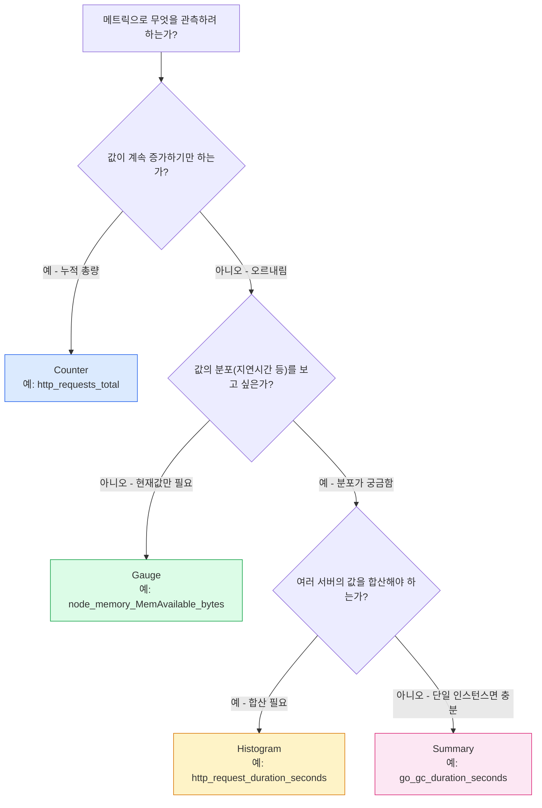
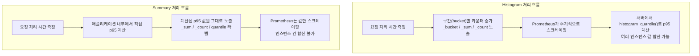

이 문서는 Observability 기본 강의(M1) 중 "메트릭의 네 가지 타입" 슬라이드를 바탕으로, 프로메테우스(Prometheus)가 정의하는 네 가지 메트릭 타입을 처음 접하는 사람도 이해할 수 있도록 원리부터 실전 사용법까지 풀어서 설명한다. 또한 원본 슬라이드의 내용 중 부정확하거나 최신 정보로 보완이 필요한 부분을 프로메테우스 공식 문서를 근거로 정정했다.

---

## 관측성 3요소 속에서 메트릭이 하는 역할

강의자료의 앞부분에서 다루듯, 관측성(Observability)은 흔히 Metric, Log, Trace라는 세 요소로 설명된다. 이 중 메트릭은 "특정 시점의 측정값이 쌓여 만들어지는 시계열"이다. 값과 측정 시각, 그리고 이를 구분하는 레이블(예: `http_requests_total{job="web"}`)로 구성되며, 15초 같은 짧은 주기로 계속 점을 찍어 나가면 그 점들이 모여 추세선이 된다.

메트릭의 강점은 숫자 하나만 저장하면 되기 때문에 아주 저렴한 비용으로 오래 보관할 수 있고, 계산이 빨라 알림(alert)의 재료로 쓰기에 적합하다는 데 있다. 반면 한계도 뚜렷하다. "오류율이 5%로 올랐다"는 사실은 알려주지만 "왜 올랐는지"는 말해주지 않는다. 그 이유를 찾으려면 로그나 트레이스로 넘어가야 한다. 이런 메트릭 파이프라인의 사실상 표준 도구가 프로메테우스이며, 프로메테우스는 수집하는 모든 메트릭을 반드시 네 가지 타입 중 하나로 분류하도록 요구한다.

## 프로메테우스는 왜 메트릭에 타입을 나누는가

타입을 나누는 이유는 단순하다. 같은 "숫자 하나"라도 그 숫자가 무엇을 의미하는지에 따라 PromQL에서 다뤄야 하는 방식이 완전히 달라지기 때문이다. 예를 들어 누적 요청 수(Counter)를 그래프에 그대로 그리면 우상향하는 직선만 보일 뿐 의미가 없다. 반드시 `rate()`나 `increase()` 같은 함수로 "변화하는 속도"로 바꿔줘야 한다. 반대로 현재 메모리 사용량(Gauge)은 있는 값을 그대로 그려도 이미 의미가 있다. 즉, 메트릭의 타입을 안다는 것은 그 메트릭에 어떤 PromQL 함수를 써야 하는지를 안다는 것과 같다. 오후 세션에서 다룰 PromQL 실습은 사실상 이 타입 구분을 전제로 진행된다.

다만 한 가지 알아둘 점이 있다. 프로메테우스 서버 자체는 (뒤에서 설명할 네이티브 히스토그램을 제외하면) 스크레이핑한 시점에는 타입 정보를 유지하지 않고 모든 값을 그냥 부동소수점 시계열로 평탄화해서 저장한다. 타입 구분은 어디까지나 계측 라이브러리의 API와 노출 형식(`/metrics` 엔드포인트에 찍히는 `# TYPE` 줄) 수준에서 이루어지는 개념이라는 뜻이다. 그래도 사용자 입장에서는 타입을 아는 것이 쿼리 작성의 출발점이므로, 이 구분은 실무적으로 여전히 매우 중요하다.

## 전체 그림: 어떤 상황에 어떤 타입을 쓰는가

네 가지 타입을 고르는 과정을 하나의 의사결정 흐름으로 그리면 다음과 같다.



이제 각 타입을 하나씩 자세히 들여다본다.

---

## Counter — 오직 증가만 하는 누적 계수기

### 정의와 동작 방식

Counter는 프로메테우스 공식 문서가 "단조 증가하는 단일 누적 값으로, 값이 오직 증가하거나 프로세스 재시작 시 0으로 리셋될 수만 있다"고 정의하는 타입이다. 요청 수, 완료된 작업 수, 오류 수처럼 "이벤트가 몇 번 일어났는가"를 세는 데 쓴다. 공식 문서는 감소할 수 있는 값에는 Counter를 쓰지 말라고 명시한다. 예를 들어 "현재 실행 중인 프로세스 수"는 줄어들 수 있으므로 Counter가 아니라 Gauge를 써야 한다.

### 실전 예시

가장 흔한 예는 `http_requests_total`이다. 이 값은 서비스가 시작된 이후 처리한 전체 HTTP 요청 수를 누적해서 담고 있으며, 서비스가 재배포되어 프로세스가 재시작되면 다시 0부터 쌓이기 시작한다.

### rate()와 increase()가 필요한 이유

Counter를 그래프에 그대로 그리면 우상향하는 직선(또는 재시작 시 뚝 떨어졌다가 다시 오르는 톱니 모양)만 보일 뿐, "지금 초당 몇 건의 요청이 들어오는가" 같은 실질적인 정보를 주지 않는다. 그래서 반드시 변화율로 바꿔서 봐야 하며, 이를 위한 PromQL 함수가 `rate()`와 `increase()`다.

```promql
# 최근 5분간 초당 요청 수(rate)
rate(http_requests_total[5m])

# 최근 5분간 총 증가량(increase)
increase(http_requests_total[5m])
```

`rate()`와 `increase()`는 모두 중간에 있었던 카운터 리셋(프로세스 재시작)을 자동으로 보정해서 계산해 주기 때문에, 재시작이 있었더라도 값이 튀지 않고 매끄럽게 이어진다.

---

## Gauge — 오르내리는 현재 상태값

### 정의와 동작 방식

Gauge는 공식 문서가 "임의로 오르내릴 수 있는 단일 숫자 값을 나타내는 메트릭"이라고 정의한다. 온도나 현재 메모리 사용량 같은 "측정된 값"뿐 아니라, 동시 요청 수처럼 오르내릴 수 있는 "개수"도 여기 해당한다.

### 실전 예시

대표적인 예가 노드 상태를 수집하는 node_exporter가 노출하는 `node_load1`(최근 1분간 평균 시스템 로드)과 `node_memory_MemAvailable_bytes`(사용 가능한 메모리 바이트 수)다. 두 값 모두 시간에 따라 오르내리며, 그 순간의 값 자체가 곧바로 의미를 가진다.

### 그대로 그려도 되지만, 변화량이 필요할 땐 delta

Counter와 달리 Gauge는 있는 그대로 그래프에 그려도 의미가 통한다. 다만 "이 값이 최근에 얼마나 늘었는지"가 궁금하다면 `delta()`(구간 내 절대 변화량)나 `deriv()`(구간 내 변화율의 선형 추정치) 함수를 쓴다.

```promql
# 최근 1시간 동안 메모리 여유량이 얼마나 변했는가
delta(node_memory_MemAvailable_bytes[1h])
```

---

## Histogram — 구간별로 나눠 세는 분포 계수기

### 정의와 동작 방식

Histogram은 요청 처리 시간이나 응답 크기처럼 "값들의 분포"를 관측할 때 쓰는 타입이다. 공식 문서의 표현을 빌리면, 관측값(observation)들을 미리 정해둔 여러 구간(bucket)에 나눠 담아 개수를 세고, 그와 함께 관측값들의 총합(sum)도 함께 기록한다. 즉 Histogram은 본질적으로 "버킷 단위로 쪼갠 Counter들의 묶음"이다.

예를 들어 0.1초, 0.5초, 1초를 버킷 경계로 설정했다면, 요청이 하나 들어와 0.08초 만에 끝났을 때 0.1초 이하 버킷, 0.5초 이하 버킷, 1초 이하 버킷의 카운터가 모두 함께 1씩 증가한다. 각 버킷은 "이 값 이하"라는 누적(cumulative) 방식으로 세어지기 때문이다.

### 노출되는 세 가지 시계열

Histogram 하나를 계측하면 실제로는 다음 세 종류의 시계열이 함께 노출된다.

- `이름_bucket{le="구간경계"}`: 각 구간 경계 이하로 들어온 누적 관측 건수. `le`는 "less or equal(이하)"의 약자다.
- `이름_sum`: 관측값들의 총합.
- `이름_count`: 관측 건수의 총합.

이 세 시계열 모두 카운터처럼 단조 증가하는 값이므로, Counter와 마찬가지로 `rate()`를 씌워 "초당 속도"로 바꿔서 사용하는 것이 기본이다.

### histogram_quantile()로 p95 계산하기

Histogram의 가장 큰 특징은 분위수(quantile) 계산을 애플리케이션이 아니라 프로메테우스 서버가 쿼리 시점에 수행한다는 점이다. 이를 담당하는 함수가 `histogram_quantile()`이다.

```promql
# 최근 5분간 요청 처리 시간의 95번째 백분위수(p95)
histogram_quantile(
  0.95,
  sum by (le) (rate(http_request_duration_seconds_bucket[5m]))
)
```

### 왜 여러 서버의 값을 합산할 수 있는가

각 버킷의 값은 결국 Counter이기 때문에, 같은 이름의 버킷끼리는 인스턴스가 여러 대여도 `sum by (le) (...)`처럼 그냥 더할 수 있다. 이렇게 합산한 뒤 `histogram_quantile()`을 적용하면 "서비스 전체의 p95"를 구할 수 있다. 이것이 원본 슬라이드가 말하는 "서버 간 합산 가능"의 의미이며, 뒤에서 다룰 Summary와 Histogram을 가르는 가장 결정적인 차이점이다.

다만 버킷을 기반으로 한 분위수 계산은 근사치라는 점도 알아둘 필요가 있다. 실제 값이 어느 버킷 경계 정확히 어디쯤에 있었는지는 알 수 없으므로, 프로메테우스는 버킷 안에서 값이 균등하게 분포한다고 가정하고 선형 보간(linear interpolation)을 한다. 따라서 버킷 개수가 적거나 경계 설정이 실제 값 분포와 맞지 않으면 오차가 커질 수 있다. 이 부분은 뒤의 "2026년 최신 동향" 절에서 조금 더 다룬다.

---

## Summary — 애플리케이션이 직접 계산해 내놓는 분위수

### 정의와 동작 방식

Summary도 Histogram처럼 요청 처리 시간 같은 관측값의 분포를 다루지만, 접근 방식이 정반대다. Histogram이 "구간별 개수만 세어두고 분위수 계산은 나중에 서버가 한다"면, Summary는 "애플리케이션(계측 대상) 내부에서 미리 정해둔 분위수(예: p50, p90, p99)를 슬라이딩 윈도우 방식으로 직접 계산해서 그 결과값 자체를 노출"한다.

### 노출되는 시계열

Summary는 다음과 같은 시계열을 노출한다.

- `이름{quantile="0.95"}`: 미리 설정해 둔 분위수 값(예: p95) 그 자체.
- `이름_sum`: 관측값들의 총합(Histogram과 동일).
- `이름_count`: 관측 건수의 총합(Histogram과 동일).

원본 슬라이드가 짚은 대로, 이 계산은 프로메테우스가 값을 받아가기 전에 이미 애플리케이션 쪽에서 끝나 있다. 그만큼 계산 부담이 계측 대상 프로세스에 걸리며, 스트리밍 방식으로 분위수를 추정하는 알고리즘의 특성상 관측 하나하나를 처리하는 비용이 Histogram의 "버킷 카운터 증가"보다 상대적으로 크다.

### 왜 여러 서버의 값을 합산할 수 없는가

Summary가 뽑아내는 p95는 이미 계산이 끝난 "결과값"이다. 인스턴스 A의 p95가 200ms, 인스턴스 B의 p95가 400ms일 때 이 둘을 평균 내도 "전체 서비스의 p95"가 되지 않는다. 분위수는 산술적으로 평균을 낼 수 있는 값이 아니기 때문이다. 반면 `_sum`과 `_count`는 Counter와 같은 성질을 가지므로 이 둘은 합산해서 평균 지연시간을 구하는 용도로는 쓸 수 있다. "합칠 수 없는 것"은 정확히는 미리 계산된 분위수 값이며, 원본 슬라이드의 설명은 이 핵심을 정확히 짚고 있다.

### 언제 Summary를 쓰는가

여러 인스턴스를 운영하며 서비스 전체 관점의 분위수가 필요한 일반적인 상황이라면 Histogram이 적합하다. 반면 인스턴스가 하나뿐이거나 애초에 인스턴스 간 합산이 필요 없고, 버킷 경계를 미리 정하지 않고도 정확한 분위수 값을 얻고 싶다면 Summary가 합리적인 선택이다.

---

## Histogram과 Summary, 무엇이 다른가

| 구분 | Histogram | Summary |
|---|---|---|
| 분위수 계산 주체 | 프로메테우스 서버(쿼리 시점) | 계측 대상 애플리케이션(관측 시점) |
| 계측 비용 | 버킷 카운터 증가만 하면 되어 저렴 | 스트리밍 분위수 계산으로 상대적으로 비쌈 |
| 분위수·시간창 변경 | 쿼리만 바꾸면 언제든 재계산 가능 | 계측 코드를 바꾸고 재배포해야 함 |
| 여러 인스턴스 합산 | 가능 (버킷은 Counter이므로 sum 가능) | 불가능 (분위수는 평균 낼 수 없음) |
| 오차의 성격 | 버킷 경계 설정에 좌우됨 | 설정한 φ(분위수) 오차 범위에 좌우됨 |



---

## 정정 1 — 메트릭 이름으로 타입을 추정하는 법

원본 슬라이드의 팁 박스는 "이름으로 구분하는 요령"으로 세 가지를 제시했다.

> `_total`로 끝나면 Counter · `_bytes`·`_seconds`는 대개 Gauge · `_bucket`이 보이면 Histogram

이 중 앞뒤 두 가지, 즉 "`_total`로 끝나면 Counter"와 "`_bucket`이 보이면 Histogram"은 프로메테우스 공식 네이밍 관례와 정확히 일치한다. 공식 문서는 Counter의 이름은 관례적으로 `_total` 접미사를 붙이도록 권장하며, `_bucket` 시계열은 Histogram에서만 나오는 구조이기 때문이다.

다만 가운데 규칙인 "`_bytes`·`_seconds`는 대개 Gauge"는 정정이 필요하다. `_bytes`나 `_seconds`는 타입을 나타내는 접미사가 아니라 값의 **단위(unit)** 를 나타내는 접미사다. 프로메테우스 공식 네이밍 가이드는 오히려 `_seconds`가 붙는 대표 예시로 Histogram인 `http_request_duration_seconds`를 직접 제시하고 있으며, Counter인 `process_cpu_seconds_total`, 그리고 실제로 프로메테우스 Go 클라이언트 라이브러리가 Summary로 노출하는 `go_gc_duration_seconds`도 모두 `_seconds` 접미사를 쓴다. `_bytes` 역시 Gauge인 `node_memory_MemAvailable_bytes`뿐 아니라 Counter인 `node_network_receive_bytes_total`처럼 다양한 타입에 두루 쓰인다.

즉 단위 접미사만 보고 타입을 짐작하는 것은 신뢰할 수 있는 방법이 아니다. 실제로 타입을 확인하려면 다음 순서로 판단하는 편이 정확하다.

1. 이름이 `_total`로 끝나는가 → Counter일 가능성이 높다.
2. 같은 이름 아래 `_bucket{le="..."}` 시계열이 함께 있는가 → Histogram이다.
3. `quantile="..."` 레이블과 `_sum`, `_count`가 함께 있는가 → Summary다.
4. 위 셋 중 어디에도 해당하지 않는다 → Gauge일 가능성이 높다.
5. 가장 확실한 방법은 `/metrics` 엔드포인트에 함께 노출되는 `# TYPE 이름 counter|gauge|histogram|summary` 주석을 직접 확인하는 것이다.

---

## 정정 2 — p95 설명의 예시 수치

원본 슬라이드는 p95의 중요성을 설명하기 위해 다음과 같은 예시를 들었다.

> 100건 중 90건은 0.2초, 10건은 8초. 평균은 1.0초라 "괜찮네"로 읽히지만 p95는 8초입니다.

이 설명이 전달하려는 핵심 통찰, 즉 "평균은 좋아 보여도 꼬리 부분에 있는 소수의 느린 요청이 실제 사용자 경험을 좌우하며, 그래서 SLI를 평균이 아닌 p95로 잡는다"는 메시지는 정확하고 현업에서도 그대로 통용되는 설명이다. p95가 8초라는 결론도 맞다. 100건을 오름차순으로 나열했을 때 91번째부터 100번째 값이 모두 8초이므로, 95번째 값 역시 8초가 되기 때문이다.

다만 평균값 계산에는 작은 오차가 있다. 실제 평균은 다음과 같이 계산된다.

```
(90건 × 0.2초 + 10건 × 8초) ÷ 100건
= (18 + 80) ÷ 100
= 98 ÷ 100
= 0.98초
```

즉 평균은 "1.0초"가 아니라 "0.98초"다. 결론에 영향을 주는 차이는 아니지만(0.98초든 1.0초든 "평균만 보면 괜찮아 보인다"는 메시지는 동일하다), 정확한 수치를 요구하는 자리이거나 학습자가 직접 검산해볼 가능성을 고려하면 정정해 둘 필요가 있다.

---

## 2026년 현재 시점에서 함께 알아두면 좋은 최신 동향: 네이티브 히스토그램

원본 슬라이드에는 나오지 않지만, 최근 프로메테우스 생태계에서 가장 중요한 변화 중 하나가 바로 네이티브 히스토그램(Native Histogram)이다. 앞서 설명한 Histogram, 즉 버킷 경계를 사람이 직접 정해서 여러 개의 `_bucket` 시계열을 노출하는 방식은 이제 "클래식 히스토그램(classic histogram)"이라고 불리며, 그 대안으로 네이티브 히스토그램이라는 새로운 방식이 도입되었다.

### 네이티브 히스토그램이란

네이티브 히스토그램은 2022년 11월 실험적 기능으로 처음 도입되었으며, 클래식 히스토그램처럼 버킷 하나하나를 별도의 시계열로 쪼개 저장하는 대신, 하나의 히스토그램 전체(개수, 합계, 그리고 동적으로 생성되는 버킷들)를 단 하나의 복합 시계열로 저장한다. 버킷 경계를 사람이 미리 정할 필요 없이 지수(exponential) 방식으로 자동 생성되며, 이 덕분에 다음과 같은 이점을 얻는다.

- 버킷 경계를 손으로 튜닝하지 않아도 훨씬 높은 해상도의 분포를 얻을 수 있다.
- 비어 있는 버킷은 저장 비용이 거의 들지 않는(sparse) 구조라서, 클래식 히스토그램 대비 저장 비용이 크게 줄어든다.
- 서로 다른 인스턴스나 레이블로 쪼개진 히스토그램끼리도 항상 안전하게 병합(merge)할 수 있는 스키마를 쓴다.

### 현재 상태 (2026년 9월 기준)

프로메테우스 공식 사양 문서에 따르면, 네이티브 히스토그램은 프로메테우스 서버 v3.8.0부터 안정(stable) 기능으로 지원되기 시작했다. 다만 여전히 스크레이프 설정에서 `scrape_native_histograms` 값을 명시적으로 켜야 수집되며, v3.9부터는 예전에 쓰이던 기능 플래그(`--enable-feature=native-histograms`)가 완전히 무력화되고 이 설정값을 직접 지정해야 한다. Grafana Labs도 2025년 10월 PromCon EU 2025에서 네이티브 히스토그램이 안정화되었다고 공식 발표했고, 이후 Grafana Cloud와 Amazon Managed Service for Prometheus 등 주요 관측성 플랫폼들이 잇달아 네이티브 히스토그램 지원을 추가했다. 다만 계측 라이브러리 쪽 지원은 아직 제한적이어서, 2026년 6월 기준 공식적으로 네이티브 히스토그램을 지원하는 언어는 Go, Java, Rust 세 가지뿐이며 Python이나 Ruby 등은 아직 지원하지 않는다.

이 변화가 실무에 주는 의미는 프로메테우스 공식 문서의 "Histograms and summaries" 가이드에 있는 다음 권고에 잘 요약되어 있다.

> 가능하다면 네이티브 히스토그램을 쓰고, 클래식 히스토그램과 Summary보다 우선하라.

즉 원본 슬라이드가 제시한 "Summary보다는 Histogram을 권장한다"는 조언은 여전히 유효하지만, 2026년 현재 시점의 최신 권고는 한 단계 더 나아가 "가능하면 네이티브 히스토그램을 최우선으로 쓰고, 계측 라이브러리가 아직 지원하지 않거나 기존 시스템과의 호환이 필요한 경우에만 클래식 히스토그램을 쓰며, 인스턴스 간 합산이 애초에 필요 없는 특수한 경우에만 Summary를 고려하라"는 3단계 우선순위로 정리할 수 있다. 이는 원본 슬라이드가 틀렸다기보다, 슬라이드 작성 시점 이후 프로메테우스 생태계가 한 걸음 더 발전했다고 보는 편이 정확하다.

---

## 정정 사항 한눈에 보기

| 항목 | 원본 슬라이드 내용 | 정정·보완 내용 |
|---|---|---|
| 이름 규칙 | `_bytes`·`_seconds`는 대개 Gauge | `_bytes`·`_seconds`는 값의 단위 접미사일 뿐 타입 표시가 아니다. Counter(`process_cpu_seconds_total`), Histogram(`http_request_duration_seconds`), Summary(`go_gc_duration_seconds`)에도 흔히 쓰인다. 타입은 `_total`·`_bucket`·`quantile` 레이블 유무나 `# TYPE` 주석으로 확인해야 한다. |
| p95 예시 수치 | "90건 0.2초, 10건 8초 → 평균 1.0초" | 정확한 평균은 (90×0.2 + 10×8) ÷ 100 = 0.98초. p95가 8초라는 결론과 핵심 메시지는 정확함. |
| Histogram 권장 근거 | "그래서 대개 Histogram 권장" (Summary 대비) | 2026년 현재는 한 단계 더 나아가 프로메테우스 공식 문서가 "가능하면 네이티브 히스토그램 우선 → 어려우면 클래식 히스토그램 → 합산이 불필요한 경우에만 Summary"라는 3단계 우선순위를 권고하고 있다. |

---

## 부록 A — P95가 중요한 이유와 실전 활용법

이 부록은 본문의 "p95가 중요한 이유" 절에서 다룬 내용을 별도로 확장하여, P95(95번째 백분위수)가 정확히 어떤 개념이고 어느 범위까지 쓰이며 실무에서 구체적으로 어떻게 활용되는지를 정리한다.

### P95는 프로메테우스만의 개념인가

아니다. P95는 프로메테우스가 만든 개념이 아니라 **백분위수(percentile)**, 통계학에서 말하는 순서통계량(order statistic) 중 하나이며, 프로메테우스가 등장하기 훨씬 전부터 쓰여 온 일반적인 수학·통계 개념이다. "관측값들을 오름차순으로 정렬했을 때 앞에서부터 95% 지점에 해당하는 값"이라는 정의 자체는 어떤 도구를 쓰든 동일하다.

실제로 P95·P99 같은 백분위수는 관측성·모니터링 업계 전반에서 표준적으로 쓰인다.

- Amazon CloudWatch는 거의 모든 지표에 대해 p95, p99는 물론 임의의 백분위수를 기본 통계 옵션으로 제공한다. CloudWatch 공식 문서는 백분위수를 "데이터셋에서 한 값이 차지하는 상대적 위치를 나타내는 지표"로 정의하며, p95는 해당 구간 데이터의 95%가 그 값보다 낮다는 뜻이라고 설명한다.
- Datadog, New Relic 등 상용 APM(애플리케이션 성능 모니터링) 도구들도 지연시간 대시보드의 기본 지표로 p50·p90·p95·p99를 함께 제공한다.
- Google이 자사의 운영 노하우를 정리해 공개한 *Site Reliability Engineering* 책의 "Service Level Objectives" 장에서도, 지연시간처럼 사용자 체감과 직결되는 지표는 평균이 아니라 백분위수 기반으로 정의하도록 권장하고 있으며, 이는 오늘날 업계 전반의 SLI/SLO 설계 관행으로 자리 잡았다.
- 분산 시스템에서 스트리밍 방식으로 백분위수를 근사 계산하는 알고리즘(HdrHistogram, t-digest, DDSketch 등)도 프로메테우스 바깥의 생태계에 다수 존재한다.

다만 프로메테우스만의 고유한 부분도 분명히 있다. 그것은 "P95라는 개념" 자체가 아니라 **"메트릭 시계열 데이터에서 P95를 계산해 내는 방식"** 이다. 프로메테우스는 이를 위해 본문에서 설명한 두 가지 경로, 즉 Histogram의 버킷 데이터에 `histogram_quantile()` 함수를 적용하는 방식과, Summary가 애플리케이션 내부에서 직접 계산해 노출하는 방식을 제공한다. 반면 CloudWatch는 원시 데이터 포인트를 직접 이용해 백분위수를 계산하고, HdrHistogram이나 DDSketch 같은 라이브러리는 또 다른 자료구조와 오차 보장 방식을 쓴다. 즉 "P95"라는 목적지는 같지만, 그 목적지까지 가는 계산 경로는 도구마다 다르다.

### 왜 하필 P95인가 — 평균의 함정을 조금 더 깊이 보기

본문에서 든 예시(100건 중 90건은 0.2초, 10건은 8초)는 평균과 p95의 괴리를 보여주는 축소판이다. 실제 서비스에서는 이 괴리가 훨씬 극적으로 나타나는 경우가 많다. 예를 들어 1,000건의 요청 중 단 십여 건만 유난히 느려도, 그 소수의 요청이 평균을 크게 끌어올리는 동안 중앙값(p50)은 거의 그대로인 경우가 흔하다. 평균이 사용자 절반이 실제로 체감하는 속도와 전혀 다른 숫자가 되어버리는 것이다. 반대로 p95나 p99는 "가장 운이 나빴던 사용자들이 실제로 얼마나 기다렸는가"를 직접 보여주기 때문에, 평균이 감춰버리는 긴 꼬리(long tail)를 드러낸다.

그렇다면 왜 p50도 아니고 p99도 아닌 p95를 많이 쓸까. 대략적인 경험칙은 다음과 같다.

| 백분위수 | 의미 | 실무에서 자주 쓰이는 용도 |
|---|---|---|
| p50 (중앙값) | 요청의 절반이 이 값보다 빠름 | 배포 전후 등 전반적인 변화 감지 |
| p90 | 요청의 90%가 이 값보다 빠름 | 꼬리 구간의 초기 신호 파악 |
| p95 | 요청의 95%가 이 값보다 빠름 | SLO의 기본값으로 가장 널리 쓰이는 기준점 |
| p99 | 요청의 99%가 이 값보다 빠름 | 핵심 경로의 심각한 지연 감지, 장애 디버깅 |
| p99.9 | 요청의 99.9%가 이 값보다 빠름 | 금융 거래 등 초저지연이 요구되는 특수 경로 |

p50은 사용자 절반의 나쁜 경험을 그냥 허용해 버리는 셈이라 기준으로는 너무 느슨하고, p99.9는 트래픽이 아주 많은 서비스에서는 달성 비용이 급격히 커진다. 예를 들어 하루 1,000만 건을 처리하는 서비스라면 p99.9 기준으로도 매일 1만 건의 "나쁜 경험"이 허용되는 셈이라, 그 경계를 맞추는 데 드는 인프라 비용이 급격히 커진다. p95는 이 둘 사이에서 "소수의 나쁜 경험은 감내하되 그 비율을 눈에 보이는 선에서 관리한다"는 실용적인 절충점 역할을 하기 때문에 기본값으로 가장 널리 자리 잡았다.

한 가지 운영상 주의할 점도 있다. 트래픽이 적은 서비스나 짧은 시간창에서는 "가장 느린 5%"에 해당하는 표본 수 자체가 너무 적어서 p95 값이 들쭉날쭉하게 튈 수 있다. 예를 들어 5분 동안 요청이 20건뿐이라면 p95는 사실상 상위 1건의 값과 거의 같아져서 통계적으로 불안정해진다. 이런 경우에는 쿼리의 시간창을 늘리거나(`[30m]`처럼), 트래픽이 충분히 쌓인 상위 서비스 단위로 집계해서 봐야 한다.

또한 본문에서 이미 짚었듯, 백분위수는 여러 인스턴스나 여러 시간창에 걸친 값을 평균 내는 방식으로는 합칠 수 없다. 인스턴스별 p95를 구해서 그 값들을 다시 평균 내면 실제 전체 서비스의 p95와는 다른, 통계적으로 의미 없는 값이 나온다. 반드시 원본 분포(히스토그램 버킷이든 원시 로그든)를 먼저 합친 뒤 그 위에서 다시 백분위수를 계산해야 한다.

### 구체적으로 어떻게 사용하는가

**1) SLI/SLO 정의와 에러 버짓**

가장 대표적인 활용은 서비스 수준 지표(SLI)를 정의하는 것이다. 예를 들어 다음과 같은 문장이 전형적인 지연시간 SLO다.

> "최근 28일 동안 결제 API 요청의 95%는 300ms 이내에 응답해야 한다."

이 정의는 그대로 "허용된 나쁜 경험의 비율"인 에러 버짓(error budget) 개념과 연결된다. 남은 5%의 여유분을 빠르게 소진하면(즉 300ms를 넘는 요청이 급증하면) 신규 기능 배포 속도를 늦추고 성능 개선 작업에 우선순위를 두는 식으로 운영 정책을 바꾼다. 강의자료 도입부에 나오는 "SRE와 SLI/SLO·Error Budget" 항목이 바로 이 개념을 다루는 부분이며, P95는 이 SLI를 계산하는 가장 실질적인 도구다.

**2) 알림(Alerting) 규칙**

Prometheus·Alertmanager 환경에서는 p95 지연시간이 일정 시간 이상 임계값을 넘을 때 알림을 울리는 규칙을 흔히 구성한다.

```yaml
groups:
  - name: latency-alerts
    rules:
      - alert: HighP95Latency
        expr: |
          histogram_quantile(
            0.95,
            sum by (le) (rate(http_request_duration_seconds_bucket[5m]))
          ) > 0.3
        for: 10m
        labels:
          severity: warning
        annotations:
          summary: "p95 지연시간이 300ms를 초과함"
          description: "현재 p95: {{ $value }}초"
```

`for: 10m`을 넣어 순간적인 튐이 아니라 10분 이상 지속되는 경우에만 알림이 울리도록 하는 것이 일반적이다. 앞서 설명한 표본 수 문제 때문에, 알림 기준으로 쓰는 시간창(`[5m]`)은 대상 서비스의 트래픽량을 고려해 충분히 길게 잡아야 한다.

**3) 대시보드 구성**

Grafana 같은 대시보드 도구에서는 평균 하나만 그리지 않고, 같은 그래프에 p50·p95·p99 세 선을 함께 그리는 것이 표준적인 구성이다. p50 선은 "평소 상태"를, p95·p99 선은 "꼬리 상태"를 보여주므로, 두 선이 벌어지는 정도를 보면 분포가 얼마나 고르지 않은지(꼬리가 얼마나 긴지)를 한눈에 파악할 수 있다.

**4) 부하 테스트와 성능 회귀 감지**

k6, Locust, JMeter 같은 부하 테스트 도구는 테스트 통과·실패 기준으로 p95 임계값을 흔히 사용한다. 예를 들어 "p95 응답 시간이 500ms를 넘으면 빌드 실패 처리"와 같은 조건을 CI/CD 파이프라인에 넣어, 배포 전 단계에서 성능 저하를 자동으로 잡아낸다.

**5) Apdex 점수**

본문에서 다룬 Apdex(Application Performance Index)도 사실상 백분위수와 같은 발상을 쓴다. 목표 응답 시간과 그 4배까지의 허용 응답 시간을 정해두고 각 구간에 속하는 요청 비율로 점수를 매기는 방식이기 때문에, 분포의 꼬리를 다루는 문제의식은 p95와 동일하다.

---

## 부록 B — CPU 임계치 알림과 P95, 어떤 관계가 있을까

앞서 본문과 부록 A에서 다룬 p95는 주로 응답 지연시간처럼 "요청 하나하나에 값이 매겨지는" 지표에 적용되는 개념이었다. 그렇다면 "CPU 사용률이 60%를 넘으면 경고, 80%를 넘으면 장애로 본다"처럼 흔히 쓰는 CPU 임계치 알림은 p95와 관련이 있을까. 결론부터 말하면, 계산 방식 자체는 다르지만 두 방식은 같은 문제의식에서 출발하며 실제로는 서로 연결해서 쓸 수 있다.

### 계산 방식은 다르다

"CPU 80% 이상 = 장애"는 어느 한 시점(또는 아주 짧게 평균을 낸 구간)의 Gauge 값 하나에 단순한 경계선을 긋는 방식이다. 반면 p95는 여러 개의 관측값을 오름차순으로 줄 세웠을 때 앞에서부터 95% 지점에 오는 값을 골라내는 계산이다. CPU 임계치 알림에는 이 "여러 값을 모아 정렬한다"는 과정이 보통 들어 있지 않으므로, 계산 방식만 놓고 보면 둘은 서로 다른 메커니즘이다.

### 그런데도 같은 문제의식을 공유한다

두 방식이 이어지는 지점은 "순간값이나 평균만 보면 진짜 위험을 놓친다"는 문제의식이다. 지연시간에서 평균이 소수의 느린 요청을 감춰버리듯, CPU도 순간값 하나만 보고 알림을 걸면 1초짜리 반짝 스파이크에 오탐할 수 있고, 반대로 5분 평균으로 알림을 걸면 CPU가 구간 대부분에서 이미 80% 근처를 오가던 진짜 위험한 상황이 평균 속에 묻혀버릴 수 있다. 즉 "값 하나로 판단하지 말고, 값들의 분포를 보고 판단하라"는 철학은 지연시간이든 CPU든 동일하게 적용된다.

### 실전에서는 이렇게 연결해서 쓴다

Prometheus는 이 철학을 CPU 같은 Gauge 지표에도 그대로 빌려올 수 있는 함수를 제공한다. 본문에서 다룬 `histogram_quantile()`이 Histogram 전용이라면, `quantile_over_time()`은 Histogram이든 Gauge든 어떤 시계열이든 상관없이 지정한 시간창 안에 모인 값들에서 곧바로 백분위수를 뽑아준다.

```promql
# 지난 10분간 CPU 사용률의 p95가 80%를 넘을 때 알림
quantile_over_time(0.95, cpu_usage_percent[10m]) > 80
```

이렇게 쓰면 순간적인 100% 스파이크 한두 번에는 흔들리지 않으면서도(상위 5%로 걸러지므로), CPU가 구간 대부분에서 꾸준히 높았던 진짜 위험한 상황은 그대로 잡아낸다. 단순히 구간 평균(`avg_over_time()`)을 쓰는 것보다 꼬리를 훨씬 정직하게 반영하는 방식이다.

### 업계에는 훨씬 더 직접적인 선례도 있다

이 개념은 Prometheus나 CPU에 국한되지 않는다. 인터넷 회선이나 데이터센터 대역폭 요금을 매길 때 오래전부터 써 온 **"95번째 백분위수 과금(버스터블 빌링)"** 이 대표적인 예다. 방식은 이렇다. 5분마다 트래픽 사용량을 측정해 한 달치 샘플(약 8,640개)을 모은 뒤, 사용량이 가장 높았던 상위 5%는 버리고 남은 95% 중 가장 큰 값을 그달의 요금 기준으로 삼는다. 잠깐의 트래픽 폭주는 봐주되, 꾸준히 유지되는 사용량만 비용에 반영하려는 취지다. 이는 "잠깐의 CPU 스파이크는 넘어가되, 꾸준히 높은 부하만 장애로 취급한다"는 CPU 임계치 알림의 설계 취지와 정확히 같은 곳을 겨냥하고 있다. 다만 실제로 CPU 알림에 쓰이는 사례라기보다는, "리소스 사용률에 백분위수를 적용한다"는 발상이 업계 전반에서 이미 검증되어 온 방식임을 보여주는 참고 사례에 가깝다.

### 정리

"CPU 60%는 경고, 80%는 장애"라는 조건 자체에는 p95 계산이 들어 있지 않다. 하지만 그 알림을 더 견고하게(짧은 스파이크에는 무디게, 지속적인 고부하에는 민감하게) 만들고 싶다면, 지연시간에 쓰던 것과 같은 p95라는 도구를 `quantile_over_time()`을 통해 CPU에도 그대로 가져다 쓸 수 있다. 즉 두 개념은 계산 대상(지연시간 대 리소스 사용률)은 다르지만, "분포의 꼬리를 보고 판단한다"는 같은 설계 철학 위에 서 있다.

---

## 참고 자료

- [Prometheus 공식 문서 — Metric types](https://prometheus.io/docs/concepts/metric_types/) (Counter·Gauge·Histogram·Summary 공식 정의)
- [Prometheus 공식 문서 — Metric and label naming](https://prometheus.io/docs/practices/naming/) (단위 접미사와 타입 접미사에 대한 공식 네이밍 가이드, 2026년 판)
- [Prometheus 공식 문서 — Histograms and summaries](https://prometheus.io/docs/practices/histograms/) (Histogram·Summary·네이티브 히스토그램 비교 및 2026년 기준 사용 권고)
- [Prometheus 공식 문서 — Native Histograms 사양](https://prometheus.io/docs/specs/native_histograms/) (v3.8.0부터 안정 기능으로 전환된 근거)
- [Grafana Labs — Native Histograms are Generally Available](https://grafana.com/whats-new/2025-10-29-native-histograms-are-generally-available/) (2025년 10월 29일, PromCon EU 2025에서의 안정화 발표)
- [Amazon Web Services — Amazon Managed Service for Prometheus now supports Native Histograms](https://aws.amazon.com/about-aws/whats-new/2026/06/amazon-managed-service-prometheus-native-histograms/) (2026년 6월, 관리형 서비스로의 확산 사례)
- [Amazon CloudWatch 공식 문서 — CloudWatch statistics definitions](https://docs.aws.amazon.com/AmazonCloudWatch/latest/monitoring/Statistics-definitions.html) (백분위수가 프로메테우스 밖에서도 표준 통계로 제공된다는 근거, 부록 A)
- [Google — Site Reliability Engineering, Chapter 4: Service Level Objectives](https://sre.google/sre-book/service-level-objectives/) (평균 대신 백분위수 기반 SLI를 쓰도록 권장하는 원전, 부록 A)
- [Prometheus 공식 문서 — histogram_quantile() 함수](https://prometheus.io/docs/prometheus/latest/querying/functions/#histogram_quantile) (프로메테우스에서 p95를 계산하는 구체적 함수 설명, 부록 A)
- [Prometheus 공식 문서 — quantile_over_time() 등 _over_time 함수](https://prometheus.io/docs/prometheus/latest/querying/functions/#aggregation_over_time) (Gauge 등 임의의 시계열에 백분위수를 적용하는 함수, 부록 B)
- [Wikipedia — Burstable billing](https://en.wikipedia.org/wiki/Burstable_billing) (95번째 백분위수를 이용한 대역폭 과금 방식, 부록 B)

---

작성일: 2026-09-22
