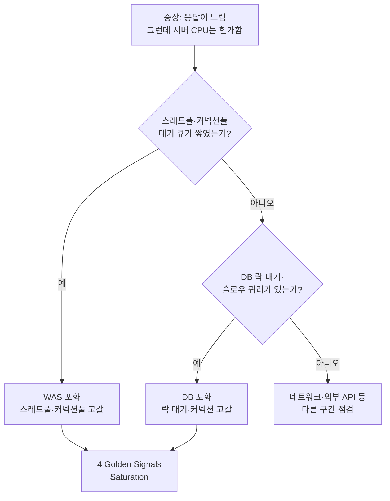
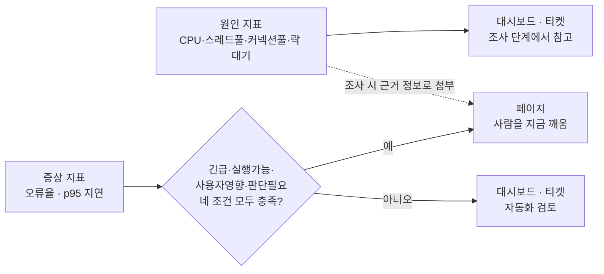

이 문서는 Observability 강의자료가 네 장에 걸쳐 다룬 내용 — 미들웨어·DB가 무엇을 보여줘야 하는가, 4 Golden Signals, 좋은 알림의 조건, 알림 안티패턴 — 을 핵심 키워드별로 풀어 설명한다. 이 네 장은 따로따로 읽으면 각각 독립된 팁 목록처럼 보이지만, 실제로는 "무엇을 관측할 것인가"에서 "무엇을 알림으로 보낼 것인가"로 이어지는 하나의 파이프라인이다. 이 연결을 마지막 절에서 자세히 다룬다.

---

## 키워드 1 — WAS·미들웨어가 가장 먼저 포화되는 곳: 풀(Pool)

슬라이드가 짚은 대로, 미들웨어(WAS, 애플리케이션 서버)의 포화는 서버 지표(CPU·메모리 총량)보다 먼저 풀(pool)에서 드러난다. 여기서 풀이란 동시에 처리할 수 있는 작업의 수를 미리 정해 둔 자원 창구를 말한다.

- **스레드풀**: 요청을 실제로 처리하는 일꾼의 수다. 활성 스레드 수가 풀 크기에 근접하고 대기 큐가 쌓이기 시작하면, 서버는 아직 여유가 있어 보여도 신규 요청은 이미 줄을 서서 기다리는 중이다.
- **커넥션풀**: 애플리케이션과 데이터베이스 사이를 잇는 연결 통로의 수다. 커넥션을 얻기까지 기다리는 시간(획득 대기 시간)이 늘어난다는 것은, 실제로는 DB가 아니라 "DB로 가는 통로"가 부족하다는 신호다.
- **힙 사용량·GC(가비지 컬렉션)**: Java 계열 WAS라면 힙이 가득 차 GC가 자주, 길게 도는 것만으로도 요청 처리가 순간적으로 멈추는(stop-the-world) 구간이 생긴다.
- **요청 처리 시간(p95)·오류율**: 위 세 가지 원인 지표가 결국 사용자에게 드러나는 결과 지표다.

실무에서 이 지표들을 Prometheus로 가져오는 표준적인 방법은, JVM 기반 WAS(Tomcat 등)에는 JMX Exporter를 자바 에이전트로 붙여 스레드풀·힙·GC를 노출시키고, 커넥션풀로 HikariCP를 쓴다면 HikariCP 자체가 제공하는 Prometheus 지표 통합 기능을 쓰는 것이다.

## 키워드 2 — 데이터베이스가 느려지는 이유: 대기(Wait)

슬라이드가 짚은 "느려지는 이유는 대개 대기에 있다"는 문장은 DB 성능 튜닝의 오래된 격언과 정확히 일치한다. CPU는 한가한데 쿼리가 느리다면, 대개 그 쿼리는 계산을 하고 있는 게 아니라 무언가를 기다리고 있는 것이다.

- **슬로우 쿼리 건수·수행 시간**: 실행 계획이 나쁘거나 인덱스가 없어 오래 걸리는 쿼리를 직접 잡아낸다.
- **활성 세션 수·커넥션 사용률**: 미들웨어 쪽 커넥션풀과 짝을 이루는 DB 쪽 지표로, DB가 동시에 얼마나 많은 연결을 감당하고 있는지를 보여준다.
- **락 대기 시간·데드락 발생**: 여러 트랜잭션이 같은 행(row)이나 테이블을 두고 경합하면서 서로를 기다리게 되는 구간이다.
- **리플리케이션 지연·버퍼 캐시 적중률**: 읽기 복제본을 쓰는 구조라면 원본과 복제본 사이의 지연이, 그리고 디스크 I/O 대신 메모리 캐시를 얼마나 잘 활용하는지가 성능을 좌우한다.

Prometheus 생태계에서는 mysqld_exporter, postgres_exporter 같은 DB 전용 익스포터가 이 지표들을 표준적으로 노출해 준다.

## 키워드 3 — "서버는 한가한데 느리다"의 정체

슬라이드의 경고 박스가 던진 "서버 CPU는 한가한데 응답이 느리다"는 질문은 이 트랙 전체의 핵심 메시지다. 이 증상의 답은 거의 언제나 앞서 다룬 커넥션풀 고갈이나 락 대기이며, CPU·메모리처럼 서버 지표만 보는 모니터링은 이 지점을 놓친다. 슬라이드가 예고한 대로, 이것이 바로 다음 절에서 다룰 4 Golden Signals 중 Saturation(포화)이 가리키는 자리다.

---

## 키워드 4 — 4 Golden Signals (Google SRE)

무엇을 봐야 할지 모르겠다면 이 넷부터 보라는 슬라이드의 조언은, Google SRE 도서 6장("Monitoring Distributed Systems")이 제시한 프레임으로, 자원이 제한적이라면 반드시 감시해야 할 최소한의 네 가지 지표를 정의한다.

- **Latency(지연시간)**: 요청 처리 시간. 성공한 요청과 실패한 요청을 반드시 구분해서 측정해야 하는데, DB 연결이 끊겨 즉시 실패하는 요청처럼 "실패가 빠른 것"도 그 자체로 중요한 신호이기 때문이다. 실패 응답을 성공 응답과 섞어서 평균을 내면 오히려 지연시간이 좋아 보이는 착시가 생긴다.
- **Traffic(트래픽)**: 시스템에 걸리는 수요. 초당 HTTP 요청 수, 세션·트랜잭션 수처럼 서비스 성격에 맞는 단위로 잰다.
- **Errors(오류)**: 실패한 요청의 비율. 명시적인 5xx 응답뿐 아니라, 응답 코드는 200이지만 내용이 틀린 경우처럼 "정책상 실패"도 포함해서 봐야 사용자가 실제로 겪은 실패에 가까워진다.
- **Saturation(포화)**: 시스템이 얼마나 찼는가. 가장 제약이 심한 자원(앞서 다룬 스레드풀·커넥션풀·DB 락 같은 것들)을 중심으로 보며, 포화는 지연이 본격적으로 나빠지기 직전의 예고편 역할을 한다.

슬라이드의 팁 박스가 제시한 변형도 정확한 설명이다. 요청 중심 서비스에는 Tom Wilkie가 제안한 **RED**(Rate·Errors·Duration) 방법이, 서버·큐 같은 자원 중심 컴포넌트에는 Brendan Gregg가 제안한 **USE**(Utilization·Saturation·Errors) 방법이 더 잘 들어맞는다. 4 Golden Signals는 이 둘을 아우르면서 Saturation을 명시적으로 포함시킨 상위 프레임으로 이해하면 된다.

---

## 키워드 5 — 좋은 알림의 조건: Alert Fatigue 회피

"무시되는 알림은, 없는 알림보다 나쁩니다"라는 슬라이드의 문장은 Google SRE 진영에서 오래 통용되어 온 원칙을 정확히 요약한다. 이 절의 뿌리는 Google에서 SRE로 일했던 Rob Ewaschuk가 쓴 "My Philosophy on Alerting"이라는 문서이며, 이후 Google SRE 도서 6장에 녹아 들어간 알림 철학의 원전이다.

### 증상 기반으로 알린다

슬라이드가 "무엇이 깨졌나로 호출하고 왜는 조사 단계에서"라고 정리한 원칙은 Ewaschuk가 말한 "원인이 아니라 증상을 감시하라(monitor for your users)"는 원칙 그대로다. 사용자에게 실제로 보이는 증상(오류율·지연)은 페이지(사람을 깨우는 알림)로, CPU·디스크 같은 원인 지표는 대시보드나 티켓으로 내리는 것이 핵심이다. 원인 지표를 완전히 버리라는 뜻이 아니라, 페이지가 울렸을 때 조사에 참고할 수 있도록 증상 알림에 원인 정보를 함께 담아 두라는 것이 Ewaschuk 원문의 조언이다. Black-box(외부에서 보이는 증상) 감시와 White-box(내부 지표) 감시를 결합해야 한다는 슬라이드의 설명도 이와 같은 맥락이다.

### 페이지의 4조건

슬라이드가 제시한 네 조건 — 긴급한가, 실행 가능한가, 사용자 영향이 있는가, 사람의 판단이 필요한가 — 은 Ewaschuk 원문의 표현("Pages should be urgent, important, actionable, and real")을 실무적으로 풀어 쓴 것이다. 원문은 페이지가 긴급(urgent)하고, 중요(important)하며, 실행 가능(actionable)하고, 실재하는 사용자 영향(real)이어야 한다고 말하는데, 슬라이드는 여기에 "사람의 판단이 필요한가 — 자동화 가능하면 자동화로"라는 조건을 덧붙여, 판에 박힌 대응만 필요한 알림은 애초에 사람을 부를 게 아니라 자동화해야 한다는 Ewaschuk의 또 다른 핵심 주장("no robotic, scriptable responses")까지 함께 담아냈다. 네 조건 중 하나라도 아니면 부르지 않는다는 원칙은 원문의 "과잉 감시가 과소 감시보다 고치기 어려운 문제"라는 태도와 정확히 일치한다.

---

## 키워드 6 — 알림 안티패턴 다섯 가지

슬라이드가 정리한 다섯 가지 안티패턴은 현장에서 실제로 반복되는 실수들이며, 각각의 처방은 Prometheus·Alertmanager로 구현할 수 있는 구체적인 기능과 정확히 맞물린다.

| 안티패턴 | 문제 | 처방 | Prometheus·Alertmanager 구현 |
|---|---|---|---|
| ① 원인 지표로 호출 | CPU 80% 같은 원인 지표를 페이지로 보냄 | 증상 지표(오류율·지연)로 올리고 원인은 대시보드로 | 알림 규칙은 증상 지표에만 걸고, 원인 지표는 Grafana 대시보드로 분리 |
| ② 임계치만 있고 기간이 없음 | 순간 스파이크마다 발화 | 지속될 때만 울리게 함 | Prometheus 알림 규칙의 `for`(대기 기간) 절 |
| ③ 실행할 일이 없는 알림 | 받아도 아무 조치를 하지 않음 | 조치가 없으면 삭제, 조치가 늘 같으면 자동화 | 알림 규칙 정리 또는 runbook 자동화 스크립트 연결 |
| ④ 전원 수신 | 모두에게 가면 아무도 자기 일로 여기지 않음 | 레이블 라우팅으로 담당 팀·채널을 지정 | Alertmanager의 레이블 기반 라우팅 트리 |
| ⑤ 복구 통지 없음 | 언제 끝났는지 몰라 계속 신경 쓰임 | 해소(resolved) 통지를 함께 설정 | Alertmanager의 resolved 알림 전송 설정 |

슬라이드의 마지막 자가 진단 질문 — "지난달 받은 알림 중 실제로 조치한 것의 비율이 절반을 밑돈다면 그것은 알림이 아니라 소음이다" — 은 Ewaschuk의 "과잉 감시가 과소 감시보다 해결하기 어렵다"는 원칙을 실제로 측정 가능한 자가 진단 질문으로 바꿔 놓은 실용적인 도구다.

---

## 이 네 장이 하나로 맞물리는 방식

이 네 장은 사실 하나의 파이프라인을 각 단계별로 나눠 보여준 것이다.

미들웨어·DB 절(키워드 1·2)이 나열한 지표들 — 스레드풀, 커넥션풀, 락 대기 — 은 모두 4 Golden Signals의 Saturation(키워드 4)을 실제로 측정하는 구체적인 재료다. "서버 CPU는 한가한데 느리다"는 경고(키워드 3)는 Saturation을 놓치면 정확히 이 함정에 빠진다는 것을 보여주는 실전 사례였던 셈이다.

그런데 이 원인 지표들(스레드풀·커넥션풀·락 대기·CPU)을 곧바로 알림으로 보내면, 키워드 6의 안티패턴 ①에 정확히 해당한다. 좋은 알림의 조건(키워드 5)이 말하듯, 이 원인 지표들은 대시보드로 내려가야 하고, 대신 그 원인들이 실제로 만들어내는 결과인 오류율·p95 지연(Golden Signals의 Errors·Latency)이 페이지 여부를 결정하는 증상 지표가 되어야 한다.

정리하면, 이 네 장의 관계는 다음과 같은 하나의 흐름이다. 미들웨어·DB에서 무엇을 관측할지 정하고(키워드 1·2) → 그 지표들을 4 Golden Signals라는 공통 틀로 분류하고(키워드 4, 특히 Saturation) → 그중 사용자에게 실제로 보이는 증상만 골라 좋은 알림의 조건으로 걸러내고(키워드 5) → 걸러지지 않은 알림들이 안티패턴에 빠지지 않도록 다섯 가지 처방으로 점검한다(키워드 6). 이 파이프라인의 어느 한 단계를 건너뛰면, 예를 들어 관측 지표를 정리하지 않고 곧바로 알림부터 걸면 안티패턴 ①(원인 지표로 호출)에 빠지기 쉽고, 반대로 좋은 알림의 조건만 알고 실제 원인 지표 체계가 없으면 정작 페이지가 울렸을 때 조사할 근거가 없어진다.

---

## 확인 결과

이번 자료도 전반적으로 Google SRE 도서 6장과 Rob Ewaschuk의 원문 "My Philosophy on Alerting"의 내용과 정확히 일치했다. 별도로 정정할 오류는 없었고, 다음 표처럼 출처와 실무 구현 방법을 보강했다.

| 항목 | 슬라이드 내용 | 보강한 내용 |
|---|---|---|
| 페이지의 4조건 | 긴급·실행 가능·사용자 영향·판단 필요 | Rob Ewaschuk의 원문 표현("urgent, important, actionable, and real")과 대응 관계를 명시하고, 마지막 조건이 원문의 "자동화 가능한 응답은 페이지가 아니다"는 별도 주장을 함께 담고 있음을 확인 |
| RED·USE 변형 | 요청 중심은 RED, 자원 중심은 USE | RED는 Tom Wilkie, USE는 Brendan Gregg가 제안한 방법이라는 출처를 명시 |
| 알림 안티패턴 다섯 가지 처방 | for·레이블 라우팅·해소 통지 등 | 각 처방이 Prometheus 알림 규칙의 `for` 절, Alertmanager의 레이블 라우팅, resolved 알림 기능과 정확히 대응됨을 표로 정리 |
| WAS·DB 지표 수집 방법 | 지표 목록만 제시 | JMX Exporter(WAS/JVM), HikariCP Prometheus 통합, mysqld_exporter·postgres_exporter(DB) 같은 실제 수집 도구를 추가 |

---

## 참고 자료

- [Google SRE Book — Chapter 6: Monitoring Distributed Systems](https://sre.google/sre-book/monitoring-distributed-systems/) (4 Golden Signals의 공식 정의와 출처)
- [Rob Ewaschuk — My Philosophy on Alerting](https://docs.google.com/document/d/199PqyG3UsyXlwieHaqbGiWVa8eMWi8zzAn0YfcApr8Q/edit) (증상 기반 알림, 페이지의 4조건 원문)
- [Speedscale — The 4 Golden Signals of Monitoring Explained](https://speedscale.com/blog/golden-signals/) (Golden Signals·RED·USE의 관계와 각각의 제안자)
- [Grafana — Dashboards best practices: The Four Golden Signals](https://grafana.com/docs/grafana/next/dashboards/build-dashboards/best-practices) (RED 방법 원문 출처 링크 포함)
- [Elastic — Apache Tomcat OpenTelemetry Assets](https://www.elastic.co/docs/reference/integrations/apache_tomcat_otel) (JMX Exporter로 Tomcat 스레드풀·GC·커넥션풀을 수집하는 실제 구성)
- [nlighten/tomcat_exporter, HikariCP Grafana 대시보드](https://github.com/nlighten/tomcat_exporter) (WAS·커넥션풀 지표를 Prometheus로 노출하는 구체적 도구)

---

작성일: 2026-09-22
