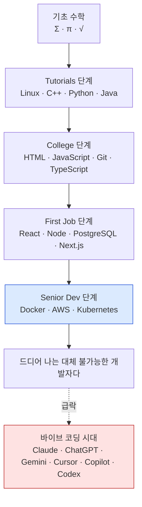
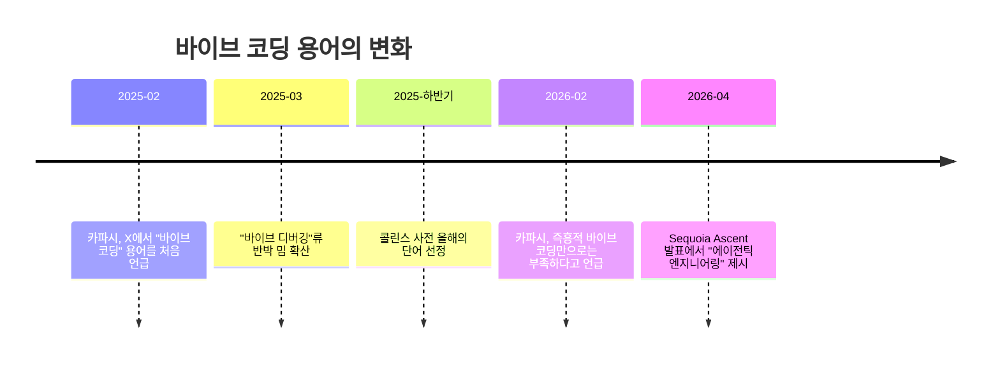
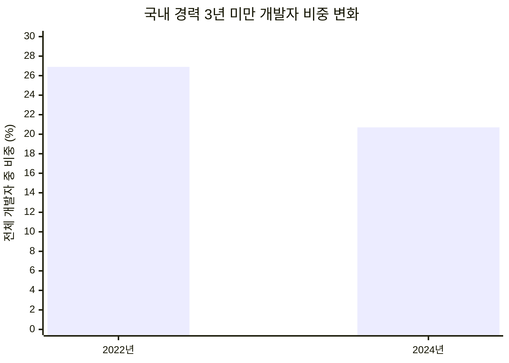

> 
> Eighteen years to climb this curve. One sentence to fall off it.
> 
> Calculus for an entrance exam. Data structures. System design patterns. The ML math by hand.
> 
> Week one on the job, someone looked at my screen and said “why not just vibe code it.”
> 
> Felt pointless for a second. Changed my mind since.
> 
> Prompting is the consumer end of AI. Nobody puts “owns a phone” on a resume. The careers sit with people who know how the thing works 🔥
> 
> Starting today, would you still grind the fundamentals?
> 
> https://www.facebook.com/share/1Bvj8h8coP/
> 

공유해주신 페이스북 게시물은 크게 두 부분으로 이루어져 있습니다. 하나는 "Life of a Developer"라는 제목이 붙은 곡선 그래프이고, 다른 하나는 그 아래 덧붙은 개인적인 회고 형식의 글입니다. 두 요소는 서로 다른 방식으로 같은 메시지를 향해 갑니다. 그래프는 시각적 반전으로, 글은 서사적 고백으로 "18년 동안 쌓아온 실력이 AI 코딩 도구 한 문장 앞에서 흔들렸다"는 하나의 경험을 전달하고 있습니다.

이 문서는 그래프와 캡션의 내용을 있는 그대로 풀어 설명한 뒤, 그 안에 담긴 "바이브 코딩(vibe coding)"이라는 용어의 실제 기원과 확산 과정, 그리고 이 게시물이 건드리고 있는 주니어 개발자 고용 시장의 실제 통계까지 최신 자료를 바탕으로 정리했습니다. 다만 그래프 자체의 최초 제작자나 최초 게시 시점, 정확한 확산 경로는 검색을 통해 확인하지 못했습니다. 이 점은 뒤에서 다시 명확히 밝히며, 확인되지 않은 부분에 대해서는 추측을 덧붙이지 않았습니다.

## 목차

1. 게시물이 담고 있는 두 개의 층위
2. 그래프가 그리는 성장 곡선: 18년 동안 쌓아 올린 것들
3. 정점에서의 반전: "바이브 코딩 시대"라는 급락
4. "바이브 코딩"이라는 말은 실제로 어디서 왔는가
5. 캡션이 던지는 주장: 소비자와 생산자의 차이
6. 데이터로 보는 배경: 정말 주니어 개발자 자리가 줄고 있는가
7. 반론과 균형: "바이브 코딩만으로는 부족하다"는 목소리
8. 이 게시물을 어떻게 읽으면 좋을까
9. 출처 투명성
10. 참고 자료

---

## 1. 게시물이 담고 있는 두 개의 층위

먼저 구조를 짚어보겠습니다. 게시물의 위쪽은 "Life of a Developer(개발자의 일생)"라는 제목이 달린 하나의 곡선 그래프입니다. 가로축은 왼쪽부터 "Tutorials(입문 강의)", "College(대학)", "First Job(첫 직장)", "Senior Dev(시니어 개발자)"의 네 단계로 나뉘어 있고, 세로축은 "Skill Level(실력 수준)"입니다. 곡선은 왼쪽 아래에서 시작해 완만하다가 점점 가팔라지며 오른쪽 위로 치솟아 정점을 찍은 뒤, 마지막 순간 거의 수직으로 곤두박질치며 끝납니다.

이 곡선을 따라 여러 기술 이름들이 순서대로 배치되어 있는데, 이는 실제 개발자들이 커리어를 쌓아가며 익히는 기술 스택의 전형적인 순서를 흉내 낸 배치로 보입니다. 곡선이 급락하는 지점 바로 옆에는 "THE VIBE CODING ERA(바이브 코딩 시대)"라는 글자가 화살표와 함께 달려 있고, 그래프 오른쪽 아래 구석에는 Claude, ChatGPT, Gemini, Cursor, Copilot, Codex라는 여섯 개의 AI 코딩 도구 로고가 별도로 묶여 있습니다. 정점 부분에는 말풍선이 하나 붙어 있는데, 그 안에는 "FINALLY. I AM IRREPLACEABLE DEV(드디어 나는 대체 불가능한 개발자다)"라는 문구가 적혀 있고, 화살표는 이 말풍선에서 곡선의 정점으로 이어져 있습니다. 즉 "내가 대체 불가능하다고 외치는 순간"과 "곡선이 곤두박질치기 직전의 정점"이 같은 지점으로 겹쳐지도록 구성되어 있는 셈입니다.

게시물 아래쪽 글은 이 곡선과 짝을 이루는 1인칭 회고입니다. 글쓴이는 대학 입시를 위한 미적분부터 자료구조, 시스템 설계 패턴, 손으로 직접 풀어야 했던 머신러닝 수학까지 언급하며 "이 곡선을 오르는 데 18년이 걸렸다"고 말합니다. 그리고 입사 첫 주에 누군가 자신의 화면을 보고 "그냥 바이브 코딩하면 되지 않느냐"고 말한 순간을 전환점으로 제시합니다. 이어서 "프롬프트를 쓰는 것은 AI의 소비자 쪽 행위이며, '휴대폰을 가지고 있다'는 사실을 이력서에 적는 사람은 없다"는 비유를 통해, 진짜 커리어는 도구를 다룰 줄 아는 사람이 아니라 그 도구가 어떻게 작동하는지 아는 사람에게 있다는 주장으로 마무리됩니다. 글의 마지막 문장은 독자를 향한 질문입니다. "오늘 다시 시작한다면, 그래도 기초를 갈고닦을 것인가."

---

## 2. 그래프가 그리는 성장 곡선: 18년 동안 쌓아 올린 것들

그래프의 왼쪽 아래, 곡선이 시작되는 지점에는 시그마(Σ)와 파이(π), 제곱근(√) 기호로 표현된 "수학"이 놓여 있습니다. 이는 전통적으로 컴퓨터공학 교육이 자료구조와 알고리즘의 복잡도 분석, 확률과 통계, 선형대수 같은 수학적 기초 위에서 출발한다는 점을 압축한 표현으로 읽힙니다.

이후 "Tutorials" 구간에는 Linux, C++, Python, Java 같은 이름이 등장합니다. 프로그래밍을 처음 배우는 사람이 운영체제의 기본 개념과 절차형·객체지향 언어를 익히는 단계에 해당합니다. "College" 구간으로 넘어가면 HTML, JavaScript, Git, TypeScript가 이어지는데, 이는 웹 개발의 기본기와 버전 관리 도구, 그리고 대규모 코드베이스에서 타입 안정성을 보장하는 언어로의 확장을 나타냅니다. "First Job" 구간에는 React, Node, PostgreSQL, Next.js가 놓여 있어 실무에서 자주 쓰이는 프런트엔드·백엔드 프레임워크와 데이터베이스로의 이행을 보여주고, 마지막 "Senior Dev" 구간 직전에는 Docker, AWS, Kubernetes가 자리해 컨테이너화와 클라우드 인프라, 오케스트레이션까지 다뤄야 하는 시니어 레벨의 책임 범위를 암시합니다.

이 순서를 하나의 흐름으로 정리하면 다음과 같습니다.

정리하면, 곡선 전체는 "수학이라는 기초에서 출발해 프로그래밍 언어, 웹 기술, 프레임워크, 클라우드 인프라까지 단계적으로 쌓아 올린 뒤 시니어가 되는" 전통적인 개발자 성장 경로를 압축해서 그린 것입니다. 그리고 그 성장의 끝, 즉 실력이 가장 높은 지점에서 "나는 대체 불가능하다"는 확신이 등장하도록 배치했다는 점이 이 그래프의 핵심적인 서사 구조입니다.

---

## 3. 정점에서의 반전: "바이브 코딩 시대"라는 급락

그래프의 극적인 지점은 정점 직후입니다. "드디어 나는 대체 불가능한 개발자다"라는 확신에 찬 말풍선 바로 다음, 곡선은 거의 수직으로 떨어집니다. 그리고 그 낙하 지점에는 "THE VIBE CODING ERA"라는 문구와 함께 Claude, ChatGPT, Gemini, Cursor, Copilot, Codex의 로고가 나열되어 있습니다.

이 배치가 전달하는 메시지는 비교적 명확합니다. 수십 개의 기술을 순서대로 익히며 쌓아온 실력의 가치가, AI 코딩 도구들이 등장한 시점에서 급격히 재평가된다는 것입니다. 다만 이 그래프가 "AI 도구를 쓰는 사람의 실력이 실제로 0에 가깝게 떨어진다"는 문자 그대로의 주장을 하는 것인지, 아니면 "실력을 쌓아온 사람이 느끼는 상대적 박탈감과 혼란"을 과장된 곡선으로 표현한 풍자인지는 그래프 자체만으로는 단정하기 어렵습니다. 곡선의 급락과 "THE VIBE CODING ERA"라는 라벨, AI 도구 로고의 조합은 유머러스한 과장법에 가까운 형식이며, 아래 캡션의 논조 역시 "AI 도구 사용 자체를 부정한다"기보다는 "AI를 다루는 능력과 AI가 작동하는 원리를 이해하는 능력은 다르다"는 구분으로 이어집니다. 이 구분은 뒤에서 다시 살펴보겠습니다.

한 가지 확인해 둘 부분이 있습니다. 이 특정 그래프의 제작자나 최초 게시 시점, 정확한 확산 경로는 검색을 통해 확인하지 못했습니다. 기술 스택을 단계별로 쌓아 올리는 형태의 곡선 그래프 자체는 개발자 커뮤니티에서 종종 만들어지는 형식이지만, 이 버전이 처음 어디서 만들어졌는지에 대한 근거 자료는 찾을 수 없었습니다. 따라서 이 문서에서는 그래프의 기원에 대해 추측하지 않고, 그래프가 다루고 있는 "바이브 코딩"이라는 용어 자체의 실제 기원과 확산 과정에 집중해 설명하겠습니다.

---

## 4. "바이브 코딩"이라는 말은 실제로 어디서 왔는가

"바이브 코딩"은 만들어진 지 채 2년이 되지 않은 신조어입니다. 이 용어는 2025년 2월 2일, OpenAI 공동창업자이자 테슬라의 전 AI 총괄이었던 안드레이 카파시(Andrej Karpathy)가 X(옛 트위터)에 올린 글에서 처음 등장했습니다. 그는 자신이 코드를 한 줄 한 줄 검토하기보다, 원하는 결과를 말로 설명하면 AI가 코드를 생성하고, 그 결과를 실행해보고, 오류가 나면 오류 메시지를 그대로 AI에게 붙여넣어 고치게 하는 방식으로 개발하고 있다고 설명하며 이 작업 방식에 "바이브 코딩"이라는 이름을 붙였습니다[1][3]. 그는 이 방식이 프로덕션 소프트웨어를 만드는 정석적인 방법은 아니며, 주말에 가볍게 만들어보는 프로젝트에 어울리는 접근이라는 단서도 함께 남겼습니다[6].

이 게시물은 한 달 만에 수백만 건의 조회수를 기록했고, 몇 주 사이에 뉴욕타임스, 가디언, 아르스테크니카 같은 주요 매체에 인용되며 빠르게 퍼졌습니다[1]. 이후 이 용어를 둘러싸고 개발자 커뮤니티 안에서는 찬반 양론이 오갔습니다. "바이브 코딩은 쉽지만 바이브 디버깅이 진짜 어려운 부분"이라는 식의 반박성 밈이 등장했고[2], 검토 없이 AI 코드를 그대로 받아들이는 방식이 보안 취약점과 유지보수 문제를 키운다는 비판도 꾸준히 제기되었습니다. 그럼에도 이 단어의 파급력은 상당해서, 2025년 말 콜린스 사전은 "바이브 코딩"을 올해의 단어로 선정했습니다[1].

흥미로운 지점은 카파시 본인이 이 용어를 1년 만에 스스로 넘어섰다는 사실입니다. 그는 2026년 2월, 자신이 용어를 만든 지 정확히 1년이 되는 시점에 즉흥적인 "바이브 코딩" 방식만으로는 충분하지 않다는 취지의 언급을 내놓았고[5], 이후 2026년 4월 세쿼이아 캐피털의 컨퍼런스인 Sequoia Ascent 2026 발표에서 "Software 3.0, Agentic Engineering, and Jagged Intelligence"라는 제목의 강연을 통해 "에이전틱 엔지니어링(Agentic Engineering)"이라는 새로운 개념을 제시했습니다[4]. 이 자리에서 그는 바이브 코딩이 진입장벽을 낮추는 역할은 했지만 그 자체가 도착점은 아니라는 취지로, "바이브 코딩은 문턱을 낮출 뿐"이라는 말을 남겼습니다[4]. 에이전틱 엔지니어링은 즉흥적으로 프롬프트를 던지고 결과를 받아들이는 방식 대신, 작업 계획을 먼저 세우고 AI가 만든 변경 사항을 체계적으로 검토하며 테스트와 검증 과정을 함께 자동화하는, 보다 구조화된 개발 방법론을 가리킵니다[3][11].

이 흐름을 시간순으로 정리하면 다음과 같습니다.

즉 "바이브 코딩"이라는 말을 만든 사람 스스로가, 게시물의 캡션이 말하는 것과 비슷한 결론—즉흥적으로 프롬프트만 던지는 방식에는 한계가 있고, 그 위에 더 체계적인 이해와 검증 능력이 필요하다는 결론—에 1년 만에 도달했다는 점은 이 논의의 흐름을 이해하는 데 중요한 배경입니다.

---

## 5. 캡션이 던지는 주장: 소비자와 생산자의 차이

캡션의 핵심 논리는 크게 세 문장으로 압축할 수 있습니다. 첫째, 입사 첫 주에 "그냥 바이브 코딩하면 되지 않느냐"는 말을 들었을 때는 그동안의 노력이 무의미하게 느껴졌다는 것. 둘째, 그러나 생각을 바꾸게 되었다는 것. 셋째, 그 이유는 "프롬프트를 쓰는 것은 AI를 소비하는 쪽의 행위일 뿐이며, 휴대폰을 소유하고 있다는 사실을 이력서에 적는 사람은 없듯, 진짜 커리어는 그 도구가 어떻게 작동하는지 아는 사람들의 몫"이라는 것입니다.

이 글쓴이가 제시하는 18년이라는 기간, 입사 첫 주의 대화, 그 순간의 감정 변화는 모두 본인의 개인적인 경험담으로, 외부에서 사실관계를 검증할 수 있는 종류의 내용이 아닙니다. 이 문서에서는 이를 사실로 단정하지 않고, 게시물이 전하는 서술로만 다룹니다.

다만 이 주장 자체—즉 "AI를 사용하는 능력"과 "AI가 어떻게 작동하는지 이해하는 능력"을 구분해야 한다는 논지—는 현재 소프트웨어 업계 담론에서 실제로 반복해서 등장하는 주제이기도 합니다. 앞서 살펴본 카파시의 에이전틱 엔지니어링 개념이 "즉흥적 프롬프트"에서 "구조적 이해와 검증"으로의 이동을 말하고 있다는 점, 그리고 다음 장에서 다룰 구글·앤스로픽 출신 엔지니어링 리더 애디 오스마니(Addy Osmani)의 분석에서 "AI가 왜 틀렸는지 아는 사람이 결국 뛰어난 개발자가 될 것"이라는 관점이 제시된다는 점은, 이 캡션의 주장과 같은 방향을 가리키고 있습니다[7]. 다시 말해 "프롬프트 자체는 소비자의 행위"라는 표현은 다소 도발적인 비유이지만, 그 밑에 깔린 문제의식—AI 산출물을 그대로 받아들이기만 하는 태도와, AI 산출물의 타당성을 판단하고 고칠 수 있는 능력 사이에는 분명한 격차가 있다는 인식—은 업계에서 폭넓게 공유되고 있는 문제의식과 겹칩니다.

---

## 6. 데이터로 보는 배경: 정말 주니어 개발자 자리가 줄고 있는가

이 게시물이 다루는 불안감, 즉 "실력을 쌓아온 사람도 AI 앞에서 자리를 위협받는다"는 정서는 근거 없는 과장이 아닙니다. 최근 발표된 여러 연구와 채용 데이터가 이 흐름을 뒷받침하고 있습니다.

가장 자주 인용되는 것은 하버드 연구진이 약 2,850만 개 이상 규모의 미국 기업 데이터를 바탕으로, 정확히는 약 28만 5,000개 기업과 6,200만 명의 근로자를 추적한 연구입니다. 이 연구에 따르면 생성형 AI를 도입한 기업에서는 도입 후 6분기 안에 주니어 직군의 고용이 약 9~10퍼센트 감소한 반면, 시니어 직군의 고용은 거의 변화가 없었습니다[7]. 스탠퍼드 디지털 이코노미랩의 별도 분석에서는 AI 노출도가 높은 직군, 그중에서도 소프트웨어 개발을 포함한 분야에서 22~25세 근로자의 고용이 2022년 말 고점 대비 최대 20퍼센트가량 줄어든 것으로 나타났습니다[7]. 같은 기간 빅테크 기업들은 최근 3년 사이 신규 졸업자 채용을 약 50퍼센트 줄인 것으로 분석되었습니다[7].

한국 시장의 상황도 비슷한 방향을 가리킵니다. 소프트웨어정책연구소(SPRi)가 2026년 8월 발표한 "2025 SW산업 실태조사"에 따르면, 2025년 국내 소프트웨어 인력은 64만 3,000명으로 전년 대비 0.2퍼센트, 인원으로는 약 1,400명 늘어나는 데 그쳤습니다. 이는 2024년의 증가율 7.3퍼센트와 비교하면 사실상 정체에 가까운 수준입니다[8]. 같은 연구소의 다른 조사에서는 경력 3년 미만 주니어 개발자가 전체 개발자에서 차지하는 비중이 2022년 26.9퍼센트에서 2024년 20.7퍼센트로 줄어든 것으로 나타났습니다[9].

다만 이 흐름을 "채용이 줄어든다"는 단순한 그림만으로 읽는 것은 정확하지 않습니다. 2026년 6월 테크크런치가 보도한 SignalFire의 "State of Tech Talent Report 2026"에 따르면, 대형 기술기업의 신규 채용 가운데 엔지니어가 차지하는 비중은 2019년 46퍼센트에서 2025년 55퍼센트로 오히려 늘었습니다[10]. 이는 개발 업무 자체가 줄어든다기보다, 기업들이 더 적은 인원으로 더 높은 성과를 내는 방향으로 조직을 재편하면서 기획·조율·보조 업무의 비중이 줄고 실제 개발자의 비중은 상대적으로 커지고 있다는 해석과 함께 제시된 데이터입니다[10]. 미국 노동통계국은 여전히 2024년부터 2034년까지 소프트웨어 개발자 고용이 약 15퍼센트 성장할 것으로 전망하고 있어[7], "개발자라는 직군 자체가 사라진다"기보다는 "진입 경로가 좁아지고 있다"는 쪽이 현재까지의 데이터에 더 가까운 설명입니다.

---

## 7. 반론과 균형: "바이브 코딩만으로는 부족하다"는 목소리

이 게시물의 결론—즉 AI를 다루는 법만 아는 것으로는 부족하고, 그 작동 원리를 이해하는 사람이 결국 살아남는다는 주장—은 업계 안에서 상당한 지지를 받고 있는 관점이기도 합니다.

구글에서 14년 넘게 개발자 경험 부문을 이끌었고 현재는 앤스로픽에서 Claude Code 관련 업무를 맡고 있는 애디 오스마니는 2026년 1월 발표한 분석 글에서, 앞으로 소프트웨어 엔지니어링을 가를 다섯 가지 질문 가운데 하나로 "기술 질문"을 꼽았습니다. 그는 이미 개발자의 84퍼센트가 AI 도구를 정기적으로 사용하고 있다는 스택오버플로 설문 결과를 인용하며, 핵심 역량이 "알고리즘을 직접 구현하는 능력"에서 "AI에게 올바른 질문을 던지고 그 결과를 검증하는 능력"으로 옮겨가고 있다고 진단했습니다[7]. 동시에 그는 AI가 일상적인 코드 작성의 상당 부분을 처리하게 되면서, 오히려 아키텍처 설계나 보안 분석처럼 AI가 대신하기 어려운 영역에서 인간의 전문성이 더 중요해지는 반대 방향의 흐름도 함께 나타나고 있다고 지적합니다. 그가 인용한 한 시니어 엔지니어의 표현을 빌리면, 앞으로 뛰어난 개발자를 가르는 기준은 "누가 가장 빨리 코드를 짜느냐"가 아니라 "AI를 언제 믿지 말아야 하는지 아는 사람이 누구냐"가 될 것이라고 합니다[7].

같은 맥락에서 국내 기술 블로그에서도 "바이브 코딩만으로는 부족하다"는 논지의 글들이 꾸준히 나오고 있습니다. 한 사례에서는 프로그래밍 경험이 전혀 없던 작가가 AI 코딩 도구만으로 8개월간 무언가를 만들다가, "왜 이게 되는지, 왜 갑자기 안 되는지" 스스로 설명할 수 없는 지점에서 한계를 느꼈다는 이야기를 다루고 있습니다[11]. 또 다른 분석에서는 비개발자에게는 바이브 코딩이 여전히 도메인 문제를 빠르게 실험해보는 강력한 도구이지만, 사용자가 늘어나거나 보안·운영 요구가 커지는 순간부터는 계획을 먼저 세우고 결과물을 체계적으로 검증하는 에이전틱 엔지니어링 방식, 즉 개발자의 전문성이 다시 필요해진다고 설명합니다[11]. CIO Korea에 실린 분석 역시 코딩이라는 직군 자체가 사라지지는 않겠지만, 개발자의 역할이 점차 직접 타이핑하는 사람에서 AI의 결과물을 감독하고 검증하는 사람으로 옮겨가고 있다고 진단하고 있습니다[12].

이 모든 논의를 종합하면, "AI 도구를 잘 쓰는 것"과 "AI 도구가 만든 결과물이 맞는지 판단할 수 있는 것"은 서로 다른 능력이며, 후자는 결국 기초 지식—자료구조, 시스템 설계, 보안, 아키텍처에 대한 이해—없이는 갖추기 어렵다는 쪽으로 의견이 모이고 있습니다. 이는 게시물 캡션이 말하는 "소비자와 생산자의 차이"라는 비유와 방향이 일치합니다.

---

## 8. 이 게시물을 어떻게 읽으면 좋을까

정리하면, 이 게시물은 두 개의 서로 다른 표현 방식—과장된 곡선 그래프와 개인적인 회고—을 통해 같은 하나의 주장을 하고 있습니다. AI 코딩 도구의 등장이 전통적인 방식으로 쌓아온 실력의 가치를 한순간에 흔들어놓는 것처럼 보이지만, 그 흔들림에 대한 올바른 대응은 기초를 포기하는 것이 아니라 오히려 AI가 만든 결과물을 검증할 수 있는 기초 역량을 더 단단히 다지는 것이라는 결론입니다.

실제 데이터를 보면 이 불안감에는 근거가 있습니다. 주니어 개발자의 채용 비중은 국내외 모두에서 감소 추세이고, 그 배경에는 AI 도구의 확산이라는 요인이 분명히 포함되어 있습니다. 동시에 개발자라는 직군 자체가 사라지고 있다는 근거는 아직 뚜렷하지 않으며, 오히려 대형 기술기업의 신규 채용 중 엔지니어 비중은 늘어나는 등 엇갈린 신호도 함께 존재합니다. "바이브 코딩"이라는 용어를 만든 카파시 본인조차 1년 만에 더 체계적인 접근으로 논의를 옮겨갔다는 사실은, 이 게시물이 던지는 질문—"그래도 기초를 갈고닦을 것인가"—에 대해 업계 스스로가 "그렇다"는 쪽으로 조금씩 답을 만들어가고 있음을 보여줍니다.

---

## 9. 출처 투명성

| 구분 | 내용 |
|---|---|
| 복수 출처로 교차 확인된 사실 | 카파시의 2025년 2월 "바이브 코딩" 용어 첫 언급, 콜린스 사전 2025년 올해의 단어 선정, 2026년 2~4월 카파시의 "에이전틱 엔지니어링" 제시, 하버드 연구의 주니어 고용 9~10퍼센트 감소 결과 |
| 단일 출처 기반 수치 (교차 확인 제한적) | SignalFire "State of Tech Talent Report 2026"의 엔지니어 채용 비중 46→55퍼센트, 국내 SPRi의 경력 3년 미만 비중 26.9→20.7퍼센트 (모두 이를 인용한 2차 보도 1건씩만 확인) |
| 설문·자체 보고 기반 데이터 | 개발자의 84퍼센트가 AI 도구를 정기 사용한다는 스택오버플로 설문 결과, 미국 노동통계국의 2024~2034년 소프트웨어 개발자 고용 15퍼센트 성장 전망 |
| 검증 불가능한 개인 서술 | 게시물 캡션에 담긴 "18년", 입사 첫 주 대화, 글쓴이의 감정 변화 등 개인적인 경험담 |
| 해석적 분석 (사실이 아닌 견해) | 그래프의 서사 구조 해석, 캡션 주장과 업계 담론의 연결, 이 문서의 8장 결론 부분 |
| 확인하지 못한 부분 | 그래프 자체의 최초 제작자, 최초 게시 시점, 정확한 확산 경로 |

---

## 10. 참고 자료

[1] Wikipedia, "Vibe coding" 항목, https://en.wikipedia.org/wiki/Vibe_coding (검색 결과 기준)

[2] KnowYourMeme, "Vibe Coding", https://knowyourmeme.com/memes/vibe-coding

[3] Growth Acceleration Partners, "Agentic Engineering vs. Vibe Coding: What's the Difference?", https://www.growthaccelerationpartners.com/blog/agentic-engineering-vs-vibe-coding

[4] israynotarray.com, "Vibe Coding's 2026 Upgrade: A Six-Stage Agentic Engineering SOP with Templates and a Real Case", https://israynotarray.com/en/ai/2026/05/17/agentic-engineering-2026-six-stage-sop/

[5] agenticmsp.substack.com, "From Vibe Coding to Agentic Engineering", https://agenticmsp.substack.com/p/from-vibe-coding-to-agentic-engineering

[6] OCDevel, "MLA 022 Vibe Coding" 쇼노트, https://dev.ocdevel.com/mlg/mla-22

[7] Addy Osmani, "The Next Two Years of Software Engineering" (2026년 1월 5일), https://addyosmani.com/blog/next-two-years/

[8] 잡플래닛, "2026 하반기 신입 개발자 취업 현실과 전략은?" (2026년 9월 10일), https://www.jobplanet.co.kr/contents/news-8452

[9] 쿠키뉴스, "'주니어 필요 없다'…시니어급 AI 등장에 개발자 취업문 좁아진다", https://www.kukinews.com/article/view/kuk202604060238

[10] brunch(@jabez), "AI 개발자 채용 반전 보고서" (SignalFire "State of Tech Talent Report 2026" 및 2026년 6월 24일 테크크런치 보도 인용), https://brunch.co.kr/@jabez/105

[11] WikiDocs 블로그(@edwin), "바이브 코딩에서 에이전틱 엔지니어링으로 그리고 비개발자에게 여전히 중요한 바이브 코딩" (2026년 7월 4일), https://wikidocs.net/blog/@edwin/21757/

[12] CIO Korea(Grant Gross), "'AI 시대, 프로그래머 역할이 바뀐다' 신입 개발자 수요는 급감 중" (2025년 9월 25일), https://www.cio.com/article/4062887/
