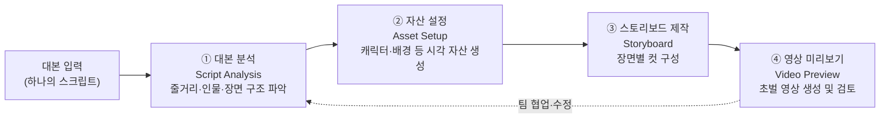
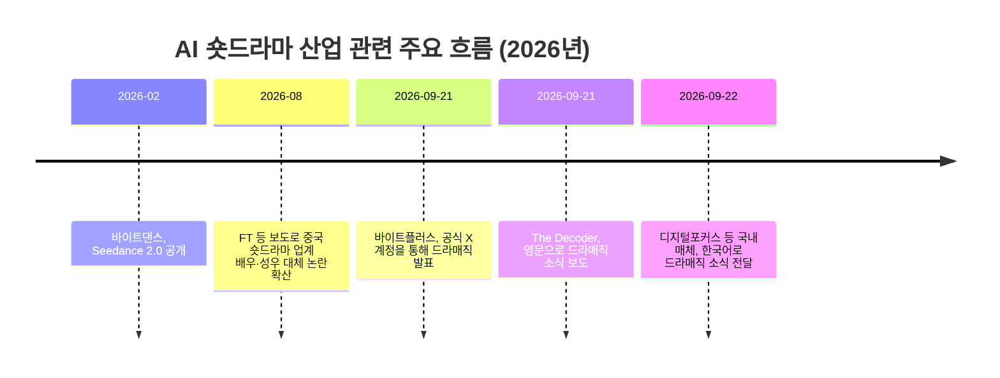

## 1. 들어가며

Threads에서 공유된 게시물은 두 층으로 구성되어 있다. 원 게시물은 'choi.openai' 계정이 바이트댄스(ByteDance)의 기업용 AI 플랫폼 바이트플러스(BytePlus)가 숏드라마·영상 제작 도구인 '드라매직(Dramagic)'을 공개했다는 소식을 전한 것이고, 이를 인용한 'keke_appa' 계정의 게시물은 이 소식에 대해 "1년 남았다, AI로 인간이 할 일은.. 강의 들을 필요 없음. 그냥 강의비로 AI 회사 주식 샀다가 1년 뒤에 팔아서 그 돈으로 토큰 사서 해줘 하면 될 듯"이라는 풍자적인 반응을 덧붙였다.

아래에서는 먼저 드라매직이 실제로 어떤 제품인지, 어떤 기술적 배경 위에 서 있는지, 그리고 이 제품이 나온 산업적 맥락(중국 숏드라마 시장의 급성장과 그로 인한 고용 지형의 변화)을 최신 자료를 바탕으로 정리한다. 이어서 keke_appa의 발언이 어떤 맥락에서 나온 의견인지를 짚어보고, 마지막으로 이 글에 담긴 각 주장들의 출처와 확인 수준을 별도의 표로 정리한다.

---

## 2. 드라매직(Dramagic)은 무엇인가

드라매직은 바이트댄스의 기업용 AI 서비스 부문인 바이트플러스가 2026년 9월 21일(현지시간) 공식 X(옛 트위터) 계정을 통해 공개한 제품으로, 대본 한 편을 넣으면 숏드라마·영상 제작에 필요한 전 과정을 하나의 플랫폼 안에서 처리하도록 설계된 기업용 AIGC(AI가 생성한 콘텐츠) 도구다. 바이트플러스는 이 제품을 "대본 분석(Script Analysis) → 자산 설정(Asset Setup) → 스토리보드(Storyboard) → 영상 미리보기(Video Preview)로 이어지는, 하나로 연결된 워크플로우"라고 소개하고 있으며, 캐릭터와 장면의 일관성을 자동으로 점검하는 기능, 편집자 수준의 세밀한 제어 기능, 그리고 여러 사용자가 동시에 작업할 수 있는 협업 기능을 핵심 특징으로 내세우고 있다(바이트플러스 공식 홈페이지, 2026년 9월 기준).

바이트플러스 자체에 대해서도 짚어둘 필요가 있다. 바이트플러스는 틱톡(TikTok)·더우인(Douyin)을 운영하는 바이트댄스가 2021년 설립한 별도의 기업용(B2B) 사업 부문으로, 싱가포르에 본사를 두고 중국 밖의 해외 기업 고객을 대상으로 바이트댄스의 추천 알고리즘, 컴퓨터 비전, 생성형 AI 기술 등을 API·SDK 형태로 판매해왔다. 즉 드라매직은 바이트댄스가 중국 내수 시장(볼케이노 엔진·Volcengine을 통해 서비스)이 아니라 해외 기업 고객을 겨냥해 내놓은 제품이라는 점에서, 중국의 숏드라마 제작 노하우를 글로벌 엔터테인먼트·미디어 기업에 수출하려는 시도로 볼 수 있다.

다만 한 가지는 분명히 짚고 넘어가야 한다. 드라매직은 일반 소비자가 바로 써볼 수 있는 서비스가 아니라, 홈페이지를 통해 별도로 "관심 등록(Interested in Dramagic)" 양식을 제출하고 접근 권한을 요청해야 하는 기업 전용 서비스다. 가격 정책이나 상세한 이용 조건은 공개된 자료에서 확인되지 않으며, 이는 바이트플러스가 아직 이 제품을 제한적으로 시범 공급하고 있다는 뜻으로 해석할 수 있다.

---

## 3. 드라매직의 작업 흐름

바이트플러스가 공개한 워크플로우를 도식으로 정리하면 다음과 같다.

한국어 매체 보도를 종합하면, 이 과정은 대본 하나만 입력하면 인물 설정과 장면 구성을 거쳐 초벌 영상까지 순차적으로 산출되는 구조로 설명된다(디지털포커스, 2026년 9월 22일). 위 그림의 마지막 단계에서 다시 앞 단계로 돌아가는 화살표는 바이트플러스가 강조한 "팀이 제작 전 과정에서 정렬된 상태를 유지할 수 있다"는 협업·반복 수정 기능을 표현한 것이며, 이는 제품 소개 문구를 바탕으로 한 구조적 해석이지 바이트플러스가 그림으로 직접 공개한 내용은 아니라는 점을 밝혀둔다.

---

## 4. 드라매직을 뒷받침하는 기술적 배경 — Seedance 2.0

드라매직이 정확히 어떤 영상 생성 모델을 내부적으로 사용하는지는 바이트플러스의 공식 제품 설명 자료에 명시되어 있지 않다. 다만 같은 시기 바이트댄스가 기업·개발자용으로 공급하고 있는 대표 영상 생성 모델은 'Seedance 2.0'이며, 드라매직 역시 바이트댄스의 'Seed' 계열 생성 모델 기술 스택(영상 생성 Seedance, 이미지 생성 Seedream 등) 위에서 만들어졌을 가능성이 높다. 다만 이는 기술 스택의 계열성에 근거한 추정이며, 바이트플러스가 "드라매직은 Seedance 2.0으로 구동된다"고 명시적으로 밝힌 바는 확인되지 않았다는 점을 분명히 해둔다.

Seedance 2.0 자체의 사양을 보면, 2026년 2월 초 공개된 이 모델은 텍스트·이미지·영상·오디오를 함께 입력받아 대사·효과음·배경음까지 동시에 생성하는 멀티모달 영상 생성 모델로, 최대 9개의 참조 이미지와 참조 영상·오디오를 함께 반영해 캐릭터와 장면의 일관성을 유지하도록 설계되었다. 해상도는 480p부터 1080p까지, 길이는 4초에서 최대 15초까지 지원하며, 카메라 워크(줌, 패닝 등)를 정밀하게 제어할 수 있고 8개 이상의 언어로 립싱크가 가능하다는 점이 특징으로 소개된다(Hedra 모델 카탈로그 기준). 이 모델은 Sora, Veo 3, Kling 2.x 등 경쟁 모델들과 함께 비교되는 최상위권 영상 생성 모델 중 하나로 거론되고 있다.

---

## 5. 왜 지금 이런 제품이 나왔나 — 중국 숏드라마 시장의 폭발적 성장

드라매직의 등장은 갑자기 튀어나온 것이 아니라, 이미 진행 중이던 중국 숏드라마(短剧, 세로형 미니 드라마) 산업의 AI 전환 흐름 위에 놓여 있다. 여러 매체가 공통으로 인용하는 수치를 정리하면 다음과 같다.

| 항목 | 수치 | 출처 |
|---|---|---|
| 2026년 1분기 중국 내 발표된 숏드라마 편수 | 약 12만 8,000편 (전년 한 해 전체의 약 3배) | 중국 넷캐스팅서비스협회(China Netcasting Services Association) 집계, The Decoder·디지털포커스 보도(2026.9.21~22) |
| 이 중 AI로 제작된 비중 | 약 95% | 위와 동일 |
| AI 영상 제작비(1분 기준) | 약 90~120달러(칭화대 선양 교수 추산, 디지털포커스 인용) / 약 600~800위안(칭화대 메타버스실험실 연구팀, 아주경제 인용) | 두 매체가 서로 다른 자릿수·출처로 인용하고 있어 정확히 일치하지는 않으나, 원화 환산 시 약 11만~16만 원대로 큰 틀에서는 비슷한 범위 |
| 기존 방식 대비 제작비 절감 폭 | 약 10분의 1 수준 | 위 자료들 공통 |
| 숏드라마 산업 직접 고용 인원 | 약 69만 명 | 베이징대 국가발전연구원 보고서, 한국경제·아주경제 등 다수 매체 인용(2026.8.30~31) |
| 라이브 스트리밍을 주업으로 하는 인구 | 약 1,500만 명 | 위와 동일 |

이 표에서 특히 눈여겨볼 대목은 제작비 수치다. 두 계열의 보도가 각각 "1분당 90~120달러"와 "1분당 600~800위안"이라는, 출처가 다른 별개의 추산치를 내놓고 있다. 원화로 환산하면 두 수치 모두 대략 11만~16만 원대에 걸쳐 있어 큰 틀에서는 겹치지만, 하나의 공식 통계로 확정된 수치라기보다는 서로 다른 연구자·기관이 각자의 방식으로 추산한 근사치로 이해하는 편이 정확하다.

이러한 시장 확대를 보여주는 또 다른 사례로, AI 애니메이션 제작사 '지린(吉林 계열 스타트업, 국내 보도에서는 '지린'으로 표기)'이 2026년 5월 한 달 동안 1분짜리 숏폼 에피소드를 약 8,000편 쏟아냈다는 칭화대 연구팀의 언급도 있다(아주경제, 2026년 9월 18일 인용). 다만 이 수치는 특정 기업 한 곳의 자체 생산 실적이므로, 업계 전체의 평균적인 생산성으로 곧바로 일반화하기는 어렵다는 점도 함께 짚어둘 필요가 있다.

---

## 6. 그 이면 — AI가 대체하고 있는 배우와 성우들

드라매직 같은 자동화 도구가 확산되는 배경에는 비용 절감이라는 동기만 있는 것이 아니다. 동시에 진행되고 있는 것은 실제 배우·성우·쇼호스트의 일자리가 AI로 빠르게 대체되는 현상이다. 파이낸셜타임스(FT) 보도를 인용한 국내 매체들의 내용을 종합하면 다음과 같은 흐름이 확인된다.

- 중국 베이징에서 숏드라마 배우 겸 제작자로 활동하는 그레그 월너(Greg Woldner)는 바이트댄스의 고성능 영상 생성 모델이 확산되기 전까지 일주일에 세 작품씩 촬영했지만, 이후 사실상 일이 사라졌다고 밝혔다(한국경제, 2026년 8월 30일).
- 더우인(중국판 틱톡)의 인기 애니메이션형 드라마 상위 100편 가운데 89편이 AI로 제작된 작품이었다는 조사 결과도 있다(데이터에이지 자료 인용, 아시아경제, 2026년 8월 31일).
- 유명 라이브 스트리머 뤄융하오(罗永浩)의 모습과 말투를 학습시킨 AI 진행자가 단 7시간 만에 5,500만 위안(약 100억~113억 원) 상당의 매출을 기록해, 일부 품목에서는 실제 인물의 판매 실적을 넘어섰다는 사례도 보도되었다(아주경제·네이트뉴스, 2026년 8월 30~31일).
- 배우나 방송 진행자의 얼굴·목소리·연기 방식을 AI 학습 데이터로 만드는 작업을 업계에서는 '증류(distil)'라고 부르는데, 인기 어린이 교육 프로그램 진행자로 일하던 한 출연자는 자신의 AI 복제본 제작에 동의하지 않으면 다른 배우를 쓰겠다는 소속사의 압박에 못 이겨 계약서에 서명했다고 밝혔다(네이트뉴스, 2026년 8월 30일).

정리하면, 배우가 자신의 얼굴과 목소리, 연기 스타일을 AI에 학습시킨 뒤 정작 본인은 해고당하고 그 디지털 복제본만 계속 활용되는 사례가 노동 분쟁의 새로운 쟁점으로 떠오르고 있다는 것이 여러 매체가 공통으로 짚고 있는 흐름이다. 노동 전문가들은 이러한 해고와 권익 침해 관련 분쟁이 최근 2~3년 사이 급증했다고 진단하고 있으며, 일부 지역에서는 AI로 대체됐다고 주장하는 노동자들이 법적 대응에 나서는 사례도 늘고 있다고 전해진다.

여기서 한 가지 구분이 필요하다. 위에서 소개한 배우·성우 대체 사례들은 주로 바이트댄스의 영상 생성 모델(시댄스 2.0 등) 확산에 따른 현상으로 보도된 것이며, 드라매직이라는 제품 자체가 특정 배우를 해고로 이어지게 했다고 직접 보도한 자료는 확인되지 않는다. 즉 드라매직은 '대본에서 스토리보드·영상까지'를 자동화하는 제작 도구이고, 배우·성우 대체 이슈는 그와 같은 계열의 생성 AI 기술이 산업 전반에 퍼지면서 나타나는 더 넓은 맥락의 현상으로 이해하는 것이 정확하다.

아래는 전체 흐름을 시간순으로 정리한 도해다.

---

## 7. Threads 게시물 속 풍자를 어떻게 읽을 것인가

keke_appa의 게시물은 "1년 남았다, AI로 인간이 할 일은.. 강의 들을 필요 없음. 그냥 강의비로 AI 회사 주식 샀다가 1년 뒤에 팔아서 그 돈으로 토큰 사서 해줘 하면 될 듯"라는 짧은 문장으로 구성되어 있다. 이는 드라매직 소식에 대한 개인적인 반응이자 풍자적 표현으로, 검증 가능한 사실 주장이라기보다 의견에 가깝다는 점을 분명히 해둘 필요가 있다.

문맥을 풀어보면 다음과 같은 취지로 읽힌다. AI가 숏드라마 대본 분석부터 촬영·편집까지 대신하는 시대가 되면서, 사람에게 노하우나 기술을 가르치는 '강의'에 돈을 쓰는 것보다, 차라리 그 돈으로 AI 기업의 주식을 사서 자산을 불린 뒤, 필요할 때 AI 서비스 이용료(토큰)를 지불하고 결과물을 얻는 편이 더 합리적이라는 풍자다. 이는 AI의 발전 속도가 사람이 새로운 기술을 배워 따라잡는 속도보다 빨라지고 있다는 문제의식을 농담 형식으로 표현한 것으로 볼 수 있다.

다만 이 글은 특정 투자 조언이나 검증된 경제적 사실이 아니라 한 개인 사용자의 견해와 유머이므로, 실제로 강의를 들을 필요가 없다거나 특정 종목에 투자하는 것이 합리적이라는 취지로 받아들여서는 안 된다는 점을 밝혀둔다. 아래 사실관계 검증 표에서도 이 항목은 '의견·풍자'로 별도 분류했다.

---

## 8. 사실관계 검증

이 글에 담긴 주요 주장들을 출처와 확인 수준별로 정리하면 다음과 같다.

| 항목 | 확인 수준 | 비고 |
|---|---|---|
| 바이트플러스가 2026년 9월 21일 드라매직을 공식 발표했다 | 공식 확인 | 바이트플러스 공식 X 계정 게시물, 바이트플러스 홈페이지 제품 페이지로 직접 교차 확인 |
| 드라매직의 4단계 워크플로우(대본 분석→자산 설정→스토리보드→영상 미리보기) | 공식 확인 | 바이트플러스 공식 홈페이지 문구 기준 |
| 드라매직은 기업 전용이며 접속 신청 절차가 필요하다 | 공식 확인 | 바이트플러스 공식 홈페이지의 신청 양식으로 직접 확인 |
| 드라매직의 가격 정책 | 미공개 | 공개 자료에서 확인되지 않음. 별도 문의 필요 |
| 드라매직이 Seedance 2.0을 기반으로 한다 | 미확인(추정) | 바이트댄스의 동일 기술 계열이라는 정황은 있으나, 바이트플러스가 명시적으로 확인한 바는 확인되지 않음 |
| 2026년 1분기 중국 숏드라마 약 12만 8,000편, 전년 전체의 3배 | 복수 매체 교차 보도 | 중국 넷캐스팅서비스협회 집계를 다수 매체가 인용. 협회의 1차 원자료를 직접 확인하지는 못함 |
| 중국 숏드라마의 95%가 AI 제작 | 복수 매체 교차 보도 | 위와 동일한 출처 계열 |
| AI 영상 제작비 1분당 90~120달러 vs 600~800위안 | 단일 출처·추정치(매체 간 소폭 불일치) | 서로 다른 연구자·매체가 인용한 수치로, 하나의 공식 통계는 아님 |
| 숏드라마 산업 직접 고용 약 69만 명 | 복수 매체 교차 보도 | 베이징대 국가발전연구원 보고서를 다수 매체가 인용. 원 보고서 직접 확인은 못함 |
| 더우인 인기작 100편 중 89편이 AI 제작 | 단일 출처 인용 | 데이터에이지 조사 결과를 매체가 인용 |
| 뤄융하오 AI 클론이 7시간 만에 5,500만 위안 매출 기록 | 복수 매체 교차 보도 | FT 보도를 다수 국내 매체가 인용 |
| 배우 '증류' 관행 및 해고 사례 | 복수 매체 교차 보도 | FT 보도를 다수 국내 매체가 인용. 개별 피해 사례의 실명 확인은 매체 보도에 의존 |
| keke_appa의 "강의 대신 AI 주식 매수" 발언 | 의견·풍자 | 사실 주장이 아닌 개인 견해로, 검증 대상이 아님 |

---

## 9. 정리하며

드라매직은 대본 한 편으로 숏드라마 제작의 전 과정(분석-자산-스토리보드-영상)을 처리하겠다는 바이트플러스의 기업용 AI 제품으로, 중국에서 이미 90% 이상의 숏드라마가 AI로 만들어지고 있는 현실 위에서 나온 결과물이다. 제작비가 기존 대비 10분의 1 수준으로 떨어지는 만큼 산업 전체의 비용 구조가 빠르게 재편되고 있지만, 그 이면에서는 배우·성우의 일자리가 줄어들고 자신의 얼굴과 목소리를 AI에 내주는 대가로 오히려 해고 통보를 받는 사례들도 함께 보고되고 있다. keke_appa의 풍자적 게시물은 이러한 변화의 속도를 체감한 개인의 반응으로 읽을 수 있으며, 이는 검증된 사실이 아니라 하나의 의견으로 받아들이는 것이 적절하다.

---

작성일: 2026년 9월 22일
