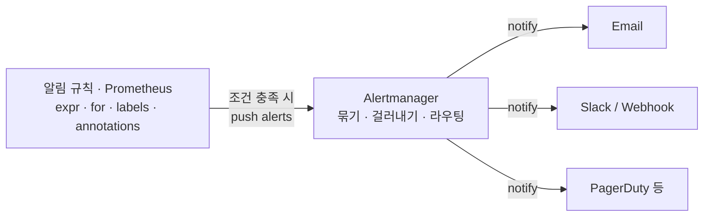
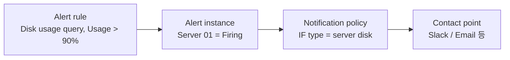
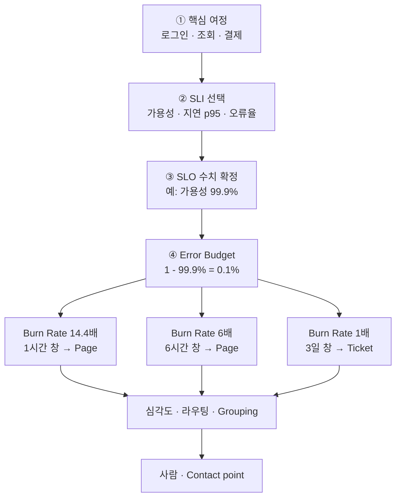
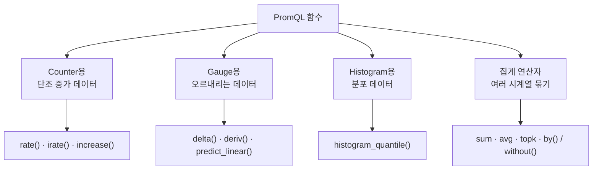

이 문서는 M3(알림·SLO 설계) 챕터의 슬라이드 열네 장을 바탕으로, 알림을 실제로 구현하는 두 경로(Prometheus+Alertmanager, Grafana Alerting)를 정리하고, 그보다 더 중요한 질문인 "알림을 어떻게 설계해야 하는가"와 "무엇을 알릴지는 어떻게 정하는가(SLI/SLO)"를 특히 상세하게 다룬다.

---

## 알림이란 무엇이고 왜 필요한가

알림은 정해둔 조건에 걸리면 사람에게 알려주는 기능이다. 목적은 사람이 화면을 계속 들여다보지 않아도 되게 하는 것이며, 큰 사고로 번지기 전에 잡아내는 1차 방어선 역할을 한다. 구현 방법은 크게 두 가지다. Prometheus+Alertmanager는 규칙과 라우팅을 파일로 관리하는 방식이고, Grafana Alerting은 화면에서 바로 설정하는 방식이다. 둘을 함께 쓰기도 하며, 화면에서 바로 확인할 수 있다는 이유로 실습은 보통 Grafana 쪽으로 진행한다.

---

## 경로 1 — Prometheus + Alertmanager: 판단과 전달의 분리

이 경로의 핵심 원칙은 역할 분리다. Prometheus는 규칙을 평가해 "알림이 발생했다"는 사실만 만들고, 누구에게 어떻게 보낼지는 전적으로 Alertmanager가 맡는다. 조건을 PromQL로 쓰기 때문에 복잡한 계산이 들어간 판단도 표현할 수 있다는 것이 이 경로의 장점이다. "규칙은 Prometheus, 수신처는 Alertmanager"라는 구분을 기억해 두면, 설정이 안 될 때 어느 쪽 파일을 봐야 할지 바로 판단할 수 있다.



설정은 세 단계로 이루어진다.

### ① Alertmanager 설치

Alertmanager는 Prometheus와는 완전히 별개의 프로그램이라 따로 받아 따로 띄워야 한다. 공식 다운로드 페이지에서 실행 파일(바이너리)을 받아 실행하거나, Docker 컨테이너로 띄울 수도 있다. 기본 포트는 9093이다.

### ② Prometheus 서버에서 Alertmanager 등록

`prometheus.yml`의 `alerting` 항목에 Alertmanager 주소를 적어, Prometheus에게 "알림은 여기로 넘겨라"라고 알려주는 단계다.

```yaml
# Alertmanager 연결
alerting:
  alertmanagers:
    - static_configs:
        - targets:
          - alertmanager:9093
```

기본 파일에는 이 줄들이 주석 처리되어 있으므로, 주석을 풀고 Alertmanager가 떠 있는 호스트와 9093 포트로 주소를 채워야 한다. 주석을 풀지 않으면 알림이 조용히 사라진다는 점이 이 단계의 가장 흔한 함정이다. 저장한 뒤에는 설정을 다시 읽혀야(reload) 반영된다.

### ③ 알림 규칙 작성

규칙은 yml 파일로 쓰고 `prometheus.yml`의 `rule_files`에 등록한다. 규칙 한 덩이는 조건(expr)·지속시간(for)·꼬리표(labels)·메시지(annotations) 네 가지로 이루어진다. 아래는 대상이 5분간 응답하지 않으면(`up == 0`) critical 알림을 내는 예시다.

```yaml
groups:
- name: example
  rules:
  - alert: TargetDown
    expr: up == 0
    for: 5m
    labels:
      severity: critical
    annotations:
      summary: "Target {{ $labels.instance }} is down"
      description: "The target {{ $labels.instance }} has been down for more than 5 minutes."
```

### Alertmanager 구성 — alertmanager.yml 안을 들여다보기

Alertmanager의 설정 파일은 `alertmanager.yml` 하나이며, 크게 세 덩어리로 나뉜다.

- **global**: SMTP 서버 주소처럼 여러 곳에서 공통으로 쓰는 기본값이다.
- **route**: 받은 알림을 어떻게 묶고 누구에게 보낼지 정한다. `group_wait`는 동시에 터진 알림을 한 통에 담으려고 잠깐 기다리는 시간, `group_interval`은 이미 열려 있는 그룹에 새 알림을 추가로 묶어 보내는 주기, `repeat_interval`은 같은 알림이 계속될 때 다시 알리는 간격이다.
- **receivers**: 실제로 보낼 곳으로, 이메일·Slack·Webhook(다른 프로그램의 주소로 알림을 그대로 넘기는 방식) 등을 지정한다.

```yaml
route:
    group_by: ['alertname']
    group_wait: 30s
    group_interval: 5m
    repeat_interval: 1h
    receiver: 'web.hook'
receivers:
    - name: 'web.hook'
      webhook_configs:
        - url: 'http://127.0.0.1:5001/'
```

슬라이드가 강조하듯, 이 묶음(group) 설계가 알림 피로를 줄이는 핵심이다. `group_wait`를 너무 짧게 잡으면 동시에 터진 알림 10건이 따로따로 10통으로 날아오고, 너무 길게 잡으면 정작 급한 알림도 늦게 도착한다.

---

## 경로 2 — Grafana Alerting: 화면에서 바로 설정하기

Grafana 대시보드의 Alerting 기능을 쓰면 보고 있는 화면에서 바로 규칙을 걸 수 있어 시작이 쉽다. 설정 순서는 규칙 → 수신처 → 정책이며, 오늘 실습(Lab 4)이 이 방식을 쓴다.



### ① 알림 규칙(Alert rule) 설정

먼저 "무엇을 보고 판단할 것인가"를 정하는 단계다. 알림이 울리기 전에 충족되어야 하는 조건을 정하며, 데이터 소스에서 가져온 값에 조건을 거는 데 PromQL을 쓴다. 조건이 얼마나 오래 이어져야 하는지(지속 시간)도 함께 정한다. 자주 쓰는 예는 CPU 사용률 초과, 서비스 무응답, DB 연결 실패, 특정 이벤트 감지 등이다.

### ② Contact points 구성

다음은 "어디로 보낼 것인가"다. Contact point는 알림을 실제로 보낼 곳으로, 메일·Slack·Webhook 중 어디로 보낼지 지정하고 화면에서 바로 테스트 발송을 해볼 수 있다. Notification templates로 메시지 내용을 원하는 형태로 바꿀 수도 있다.

### ③ 알림 정책(Notification policy) 생성

마지막은 "누구에게·얼마나 자주"다. 알림 정책은 규칙과 Contact point를 잇는 배선에 해당하며, 같은 알림이 반복될 때 다시 보내는 간격을 조절한다. Mute timings로 특정 시간대나 요일에는 보내지 않도록 막을 수도 있다.

---

## 알림 규칙을 "잘" 설계하는 법

여기서부터가 이 문서의 핵심이다. 문법을 안다고 좋은 알림이 되는 것이 아니라, 좋은 알림은 설계에서 나온다.

### 임계치(expr) — 증상 기반으로 정한다

무엇에 조건을 걸지 정할 때 1순위는 오류율·지연시간(p95)·포화처럼 사용자에게 실제로 영향을 미치는 지표다. CPU·디스크 같은 원인 지표는 알림이 아니라 티켓이나 대시보드 쪽으로 내려야 한다. 이 원칙은 앞선 미들웨어·DB 관측 문서에서 다룬 "증상 기반으로 알린다"는 원칙, 그리고 Black-box(사용자에게 보이는 증상)와 White-box(내부 원인 지표)를 결합하는 방식과 정확히 같은 이야기다. 규칙을 쓸 때 스스로 던져야 할 설계 질문은 하나다. "이 알림을 받으면 무엇을 하는가?" 답이 없다면 그 알림은 애초에 필요 없는 알림이다.

### 지속기간(for) — 순간 스파이크를 흡수하는 장치

`for`는 조건이 지속될 때만 pending에서 firing으로 전환되게 하는 장치다. 너무 짧게 잡으면 순간적인 튐에도 알림이 울려 소음이 되고, 너무 길게 잡으면 실제 장애를 늦게 알아차리게 된다. 정답은 그 지표가 평소에 얼마나 출렁이는지(정상 변동폭)를 보고 정하는 것이며, 5분이 흔히 쓰이는 기준값이다. 이 원칙 역시 앞선 문서에서 다룬 알림 안티패턴 ②("임계치만 있고 기간이 없음")에 대한 정확한 처방이다.

### 심각도 체계 — severity 레이블

모든 알림이 같은 크기의 소리를 내면 결국 아무 소리도 들리지 않는다. `severity` 레이블로 대응 강도를 구분한다. `critical`은 즉시 호출(페이지), `warning`은 업무시간 채널 알림, `info`는 기록·대시보드용으로만 쓴다.

### 라우팅과 Grouping — 레이블 매칭으로 받을 사람을 나눈다

팀·서비스 레이블을 기준으로 채널을 분기하고, 동시에 여러 건 터진 알림은 그루핑으로 한 통에 묶어 보낸다. Grafana Alerting의 알림 정책과 Prometheus Alertmanager의 `route`가 각각 이 역할을 한다.

### Silence와 Inhibition — 계획된 소음과 연쇄 소음의 차단

Silence는 점검 시간대처럼 미리 예정된 소음을 무음 처리하는 것으로, Grafana의 Mute timings가 이에 해당한다. Inhibition은 상위 장애가 발생했을 때 그로 인해 줄줄이 터지는 하위 경보를 자동으로 억제하는 기능이다. Alertmanager 설정으로 구체적인 예를 들면 다음과 같다.

```yaml
inhibit_rules:
  - source_match:
      severity: 'critical'
    target_match:
      severity: 'warning'
    equal: ['alertname', 'cluster', 'service']
```

같은 `alertname`·`cluster`·`service`를 가진 알림 중에서 `severity: critical` 알림이 울리고 있는 동안에는, 같은 조건의 `severity: warning` 알림을 억제하라는 뜻이다. 데이터센터 전체가 다운되면 그 안의 개별 서버 다운 알림 수백 건이 동시에 쏟아지는 상황을 막아주는 장치가 바로 이것이다. 슬라이드가 짚은 대로, Alert Fatigue 대책은 문화이기 전에 설정이며, 심각도·라우팅·Silence·Inhibition 이 네 가지가 도구가 기본으로 제공하는 안전장치다.

### 결국 페이지의 4조건으로 수렴한다

임계치·지속기간·심각도·라우팅을 아무리 정교하게 설계해도, 최종 점검 기준은 Google SRE가 제시한 페이지(호출)의 4조건이다. 긴급하고, 실행 가능하고, 사용자 영향이 있고, 사람의 판단이 필요해야 한다. 앞선 알림 안티패턴 문서에서 이 네 조건의 원문("urgent, important, actionable, and real")과 출처를 자세히 다뤘으니, 알림 하나를 새로 걸 때마다 이 네 가지에 비춰 검토하는 습관을 들이는 것이 좋다.

---

## SLI/SLO 정의 절차 — 무엇을 알릴지는 결국 SLO가 결정한다

알림 규칙을 아무리 잘 설계해도, 애초에 "무엇을 알릴 것인가"를 정하지 않으면 출발할 수 없다. 그 상위 절차가 SLI/SLO 정의이며, 네 단계로 이루어진다.

### ① 핵심 여정 선정

사용자가 가장 아파하는 기능 하나를 고른다. 로그인, 조회, 결제 같은 것들이다. 서비스 전체를 한 번에 다루려 하지 않고, 가장 중요한 여정 하나부터 시작하는 것이 핵심이다.

### ② SLI 선택

그 여정을 대표하는 지표를 소수만 고른다. 가용성·지연시간(p95)·오류율이 대표적이며, 이 세 가지는 이 트랙 앞부분에서 이미 자세히 다룬 지표들이다.

### ③ SLO 수치 확정

사용자 기대에서 역산한다. 지금 성능이 얼마인지가 아니라 "얼마나 나빠지면 사용자가 떠나는가"가 기준이며, 100%도 목표가 아니다. 이 원칙은 앞선 SRE 개념 문서에서 이미 자세히 다뤘다.

### ④ Error Budget 연결 — 알림 임계값과 배포 속도의 근거

1 − SLO만큼의 실패 허용량이 Error Budget이며, 이것이 알림 임계치와 배포 속도의 근거가 된다는 것이 슬라이드의 핵심 메시지다. 이 연결을 구체적인 알림 규칙으로 어떻게 만드는지가 실무에서 가장 자주 막히는 지점이므로, 조금 더 깊이 들어가 본다.

#### Burn Rate(소진 속도) 알림 — Error Budget을 실제 알림 임계치로 바꾸는 방법

Error Budget을 그냥 "이번 달에 몇 분 남았다"로만 알고 있으면 알림을 걸 수 없다. 필요한 것은 "지금 이 속도로 계속 나빠지면 예산이 얼마 만에 바닥나는가"를 나타내는 소진 속도(burn rate)라는 개념이다. Google SRE 도서(2권, Workbook)의 "Alerting on SLOs" 장이 제시하는 공식은 다음과 같다.

```
소진된 예산 비율 = burn rate × 알림 창 크기 ÷ SLO 평가 기간
```

예를 들어 SLO 평가 기간이 30일인 서비스에서, 최근 1시간 동안 burn rate가 14.4배로 나타났다면 이는 "이 속도가 유지될 경우 30일치 예산을 30/14.4일, 즉 약 2일 만에 다 쓴다"는 뜻이다. 이 수치가 위험한 이유는, 1시간 동안 전체 30일 예산의 2%를 이미 태웠기 때문이다(14.4 × 1시간 ÷ 30일 ≈ 2%).

이 발상을 실전에 옮긴 것이 멀티윈도우·멀티번레이트(multiwindow, multi-burn-rate) 알림이며, Google SRE Workbook이 권장하는 표준 구성은 다음과 같다.

| 단계 | 창(window) | burn rate | 의미 | 대응 |
|---|---|---|---|---|
| 1단계 | 1시간(짧은 창 5분과 함께 확인) | 14.4배 | 1시간 만에 예산의 2%를 태움 | 즉시 페이지 |
| 2단계 | 6시간(짧은 창 30분과 함께 확인) | 6배 | 6시간 만에 예산의 5%를 태움 | 즉시 페이지 |
| 3단계 | 3일(짧은 창 6시간과 함께 확인) | 1배 | 3일 만에 예산의 10%를 태움 | 티켓(업무시간 처리) |

각 단계마다 긴 창과 그 12분의 1 길이의 짧은 창을 함께 확인해, 두 창 모두에서 임계치를 넘었을 때만 알림이 울리도록 한다. 긴 창만 쓰면 문제가 해소된 뒤에도 한참 동안 알림이 꺼지지 않고, 짧은 창만 쓰면 순간적인 튐에도 오탐이 잦아지기 때문에, 두 창을 동시에 요구해 이 둘의 단점을 서로 보완한다.

가용성 SLO 99.9%(오류율 임계 0.1%)에 대한 1단계 알림을 PromQL로 표현하면 대략 다음과 같은 형태가 된다.

```promql
(
  (1 - (sum(rate(http_requests_total{code!~"5.."}[1h])) / sum(rate(http_requests_total[1h])))) / (1 - 0.999) > 14.4
)
and
(
  (1 - (sum(rate(http_requests_total{code!~"5.."}[5m])) / sum(rate(http_requests_total[5m])))) / (1 - 0.999) > 14.4
)
```

한 가지 주의할 점은, 이 방식이 요청 수가 충분히 많은 서비스에 적합하다는 것이다. 시간당 요청이 10건뿐인 저트래픽 서비스라면 단 한 건의 실패만으로도 순간 오류율이 10%가 되어 버려, 통계적으로 무의미한 알림이 즉시 울릴 수 있다. 이런 경우에는 시간 기반 창 대신 요청 건수 기반 임계치를 따로 고려해야 한다.

### SLO는 적을수록 좋다

Google SRE Book 4장은 SLO를 시스템 속성을 커버하는 최소 개수로 잡으라고 권고한다. SLO가 많아질수록 어느 것을 우선해야 할지 판단하기 어려워지고, Error Budget도 여러 개로 쪼개져 관리가 복잡해진다.

---

## 미니 설계 워크시트 — 실제로 채워보는 법

슬라이드의 미니 설계 실습은 서비스/핵심 여정 · SLI(지표·측정식) · SLO 목표 · 알림 임계·for · 라우팅(누가 받나) 다섯 칸으로 이루어진 표를 채우는 형식이다. 이 다섯 칸은 이 문서에서 다룬 전체 절차를 한 줄로 압축한 것과 같다. 왼쪽 세 칸(여정·SLI·SLO)이 "무엇을 지킬 것인가"를 정하고, 오른쪽 두 칸(알림 임계·for, 라우팅)이 그것을 실제 알림 규칙으로 옮긴다. 다 채운 뒤에는 반드시 검증 질문 하나를 통과시켜야 한다. "이 알림을 받으면 무엇을 하시겠습니까?" 답이 나오지 않는 칸이 있다면, 그 알림은 아직 설계된 것이 아니라 소음이 될 준비를 하고 있는 것이다.

---

## 전체 파이프라인 한눈에 보기

이 문서에서 다룬 절차를 하나로 이으면 다음과 같다.



핵심 여정을 고르는 것에서 시작해 SLI·SLO·Error Budget을 거쳐 실제 알림 규칙(임계치·지속기간)과 라우팅(심각도·수신처)까지 한 줄로 이어진다는 것이 이 문서 전체의 결론이다.

---

## 정정 및 보완 사항

| 항목 | 슬라이드 내용 | 확인 결과 |
|---|---|---|
| Alertmanager 버전 정보 | 화면에 0.26.0-rc.0(2023-08-17)·0.25.0(2022-12-22) 릴리스가 표시됨 | 이는 슬라이드 캡처 시점의 화면이며, 2026년 9월 현재 Alertmanager 최신 안정 버전은 v0.34.1(2026년 9월 17일 출시)이다. 설치·구성 개념 자체(바이너리·Docker, 9093 포트, alertmanager.yml 구조)는 지금도 동일하게 유효하다 |
| 그 외 내용 | 알림 3단계 설정, Grafana Alerting 3단계, 알림 규칙 설계 원칙, SLI/SLO 정의 절차, Error Budget 개념 | Prometheus·Grafana·Google SRE 공식 문서와 대조한 결과 정확했다. Error Budget과 알림 임계값을 구체적으로 잇는 방법(Burn Rate 알림)은 슬라이드에 명시되어 있지 않아 이번 문서에서 심화 보강했다 |

---

## 부록 A — 워크시트 예시 다섯 건, 데이터로 뜯어보기

업로드된 워크시트("핵심 서비스 SLI/SLO 정의 워크시트")에는 미니 설계 실습을 위한 빈 칸 외에, 실제로 채워진 예시 다섯 건이 들어 있다. 이 예시들은 이 문서에서 다룬 절차(핵심 여정 → SLI → SLO → 알림 임계·for → 심각도 → 라우팅)가 실전에서 어떤 구체적인 숫자와 PromQL로 구현되는지를 보여주는 좋은 자료이므로, 각 항목을 수치 기준으로 분석한다.

### 다섯 건 종합

| 서비스/여정 | SLI | SLO 목표 | 알림 임계·for | 심각도 | 라우팅 |
|---|---|---|---|---|---|
| 주문 API / 주문 생성 | 가용성(성공 요청 비율) | 99.9%(월) | <99.5%가 5m 지속 | critical | 페이지 → 주문팀 당직 |
| 주문 API / 주문 조회 | 지연시간(200ms 이하 비율) | 99%(월) | <95%가 10m 지속 | warning | 슬랙 → 주문팀 채널 |
| 결제 연동 / PG 승인 처리 | 결제 성공률(5xx·타임아웃 제외) | 99.95%(월) | <99.0%가 3m 지속 | critical | 페이지(PagerDuty) → 결제 플랫폼팀 당직 |
| 알림 서비스 / 푸시 발송 큐 | 지연 처리율(Kafka 소비 지연, 건수) | Lag < 500건 유지 | >1000건이 10m 지속 | warning | 슬랙 → 알림플랫폼팀 당직 |
| 인증 서비스 / 로그인 API | 가용성(서버 에러율) | 에러율 <0.1%(월) | 에러율 >1%가 5m 지속 | critical | 페이지 → 인증/계정팀 당직 |

다섯 건을 검토한 결과, PromQL 문법과 지표·SLO·알림 임계 사이의 수치 관계 모두 기술적으로 정확했다. 별도로 정정할 오류는 없었으며, 아래에서는 이 예시들이 담고 있는 설계 패턴을 수치로 풀어 본다.

### 사례별 분석

**주문 생성(가용성)** 은 가장 정석적인 형태다.

```promql
sum(rate(http_requests_total{status!~"5.."}[5m]))
/ sum(rate(http_requests_total[5m]))
```

5xx가 아닌 요청의 비율을 그대로 가용성으로 쓰는 방식이며, 본문에서 다룬 Counter(`http_requests_total`)에 `rate()`를 씌우는 패턴 그대로다. SLO 99.9%는 이 문서 앞부분의 Error Budget 표와 같은 값으로, 월 43.2분의 실패를 허용한다는 뜻이다. 알림은 이보다 느슨한 99.5%(0.4%p 차이)가 5분 지속될 때 울리도록 잡혀 있는데, 이는 부록에서 다룬 Burn Rate 알림처럼 예산 소진 속도를 계산하는 정교한 방식은 아니지만, "월간 평균이 아니라 지금 이 5분이 이상하다"는 신호를 빠르게 잡아내는 훨씬 단순하고 접근하기 쉬운 형태의 조기 경보다. 미니 설계 실습 단계에서는 이 정도의 단순 임계치 방식이 현실적인 출발점이며, 이후 트래픽이 충분히 쌓이면 Burn Rate 알림으로 고도화하는 것이 자연스러운 다음 단계다.

**주문 조회(지연시간)** 는 이 트랙 앞부분에서 다룬 Histogram을 `histogram_quantile()`이 아닌 방식으로 쓴 예다.

```promql
sum(rate(http_request_duration_seconds_bucket{le="0.2", job="order"}[5m]))
/ sum(rate(http_request_duration_seconds_count{job="order"}[5m]))
```

이 쿼리는 "p95가 몇 ms인가"를 구하는 대신, "전체 요청 중 200ms 이하로 끝난 비율이 몇 %인가"를 직접 계산한다. 둘 다 같은 Histogram 데이터(`_bucket`, `_count`)를 쓰지만 질문의 방향이 다르다. SLO는 99%(1%까지 200ms 초과 허용)인데 알림 임계는 95%(4%p 차이, 다섯 건 중 가장 넓은 여유폭)로 상당히 느슨하게 잡혀 있고 지속시간도 10분으로 가장 길다. 지연시간은 트래픽 패턴에 따라 짧은 구간에서 출렁임이 크기 때문에, 순간적인 튐에 오탐하지 않도록 일부러 여유를 넉넉히 준 설계로 볼 수 있다.

**결제 PG 승인**은 다섯 건 중 가장 엄격하다.

```promql
sum(rate(payment_requests_total{status="success"}[5m]))
/ sum(rate(payment_requests_total[5m]))
```

SLO 99.95%는 월 21.6분(43,200분 × 0.05%)의 실패만 허용하는 수준으로, 이 문서에서 다룬 세 가지 SLO 등급(99.9%/99.5%/99.0%) 중 어느 것보다도 엄격하다. 알림 임계와 SLO 사이 격차(0.95%p)는 중간 수준이지만, 지속시간(`for`)이 3분으로 다섯 건 중 가장 짧다. 결제라는 서비스의 특성상 조금의 오탐을 감수하더라도 가장 빠르게 반응해야 한다는 판단이 반영된 결과이며, PagerDuty로 즉시 호출하는 라우팅과도 일치한다.

**알림 서비스 큐 랙**은 나머지 넷과 근본적으로 다른 유형의 SLI다.

```promql
kafka_consumergroup_lag{topic="order-push", consumergroup="push-sender"}
```

비율(ratio)이 아니라 절대 건수를 그대로 쓰는 Gauge형 지표이며, `rate()`를 씌우지 않고 값을 그대로 읽는다는 점에서 이 트랙 초반에 다룬 Counter와 Gauge의 구분이 실전에서 왜 중요한지를 보여주는 예다. 앞선 미들웨어·DB 관측 문서에서 다룬 Saturation(포화) 신호의 전형이기도 하다. SLO도 백분율이 아니라 "Lag 500건 미만 유지"라는 절대치로 잡혀 있어, SLI/SLO가 항상 퍼센트로 표현되어야 하는 것은 아니라는 점을 확인시켜 준다.

**로그인 API**는 첫 번째 사례와 짝을 이루는 예다.

```promql
sum(rate(http_requests_total{job="auth", status=~"5.."}[5m]))
/ sum(rate(http_requests_total{job="auth"}[5m]))
```

주문 생성 사례가 "성공 비율"로 가용성을 표현했다면, 이 사례는 정확히 반대 방향인 "에러 비율"로 같은 개념을 표현한다(레이블 매처가 `!~"5.."`에서 `=~"5.."`로 뒤집혔을 뿐이다). SLO 0.1% 에러율은 99.9% 가용성과 수학적으로 동일한 목표이며, 알림 임계(1%)는 SLO 대비 정확히 10배 격차로 설정되어 있다. 같은 목표를 성공률로 표현할지 에러율로 표현할지는 팀의 관례에 따라 다를 뿐, 어느 쪽이 맞고 틀리다의 문제가 아니라는 것을 이 두 사례가 함께 보여준다.

### 데이터로 보는 설계 패턴 두 가지

**패턴 1 — 심각도가 높을수록 지속시간(for)이 짧다.** 세 건의 critical 사례(결제 3분, 주문 생성 5분, 로그인 5분)의 평균 지속시간은 약 4.3분인 반면, 두 건의 warning 사례(주문 조회·큐 랙 모두 10분)는 평균 10분이다. critical로 분류한 지표일수록 오탐 가능성을 일부 감수하더라도 더 빨리 반응하도록 설계되어 있으며, 이는 본문에서 다룬 "지속기간은 지표의 정상 변동폭을 보고 정한다"는 원칙이 실제로 심각도와 맞물려 적용된 사례다.

**패턴 2 — 심각도와 라우팅 채널이 정확히 대응한다.** critical 세 건은 모두 페이지(즉시 호출)로, warning 두 건은 모두 슬랙 채널 알림으로 연결된다. 본문에서 다룬 심각도 체계(critical=즉시 호출, warning=업무시간 채널 알림) 원칙이 다섯 건 모두에서 예외 없이 지켜지고 있다.

### 검증 질문에 비춰 보기

다섯 건 모두 라우팅 칸에 "어느 팀의 당직 또는 채널로 보내는지"가 구체적으로 적혀 있다. 이는 워크시트 하단의 검증 질문("이 알림을 받으면 무엇을 하시겠습니까?")에 이미 답이 마련되어 있다는 뜻이다. 예를 들어 결제 PG 알림을 받은 결제 플랫폼팀 당직자는 "지금 결제 성공률이 무너지고 있으니 PG사 상태와 최근 배포를 확인한다"는 구체적인 행동으로 이어질 수 있지만, 만약 라우팅 칸이 비어 있었다면 이 알림은 받는 사람도, 할 일도 정해지지 않은 소음이 되었을 것이다.

---

## 부록 B — PromQL 가이드

이 문서와 앞선 문서들에 나온 PromQL 조각들(`rate()`, `histogram_quantile()`, `up == 0` 등)을 낱낱이 뜯어보지 않고 지나온 부분이 많다. 이 부록은 알림 규칙과 SLI를 직접 작성할 수 있도록 PromQL의 구성 요소를 체계적으로 정리한다.



### PromQL이 다루는 데이터 타입 네 가지

- **순간 벡터(Instant vector)**: 한 시점에서 레이블이 다른 여러 시계열의 값을 모아 놓은 것. `up`처럼 쿼리 결과가 여러 줄로 나오는 가장 흔한 형태다.
- **범위 벡터(Range vector)**: 순간이 아니라 `[5m]`처럼 일정 구간에 걸친 값들의 모음. 그 자체로는 그래프에 그릴 수 없고, `rate()` 같은 함수에 넣어야 순간 벡터로 바뀐다.
- **스칼라(Scalar)**: 레이블 없는 숫자 하나. `100`처럼 직접 쓴 숫자나 계산 결과가 여기 해당한다.
- **문자열(String)**: PromQL 자체 문법에는 거의 쓰이지 않고, 일부 함수의 인자로만 등장한다.

### 셀렉터와 레이블 매칭

메트릭 이름 뒤 중괄호 안에 레이블 조건을 걸어 원하는 시계열만 골라낸다. 매칭 방식은 네 가지다.

| 연산자 | 의미 | 예시 |
|---|---|---|
| `=` | 정확히 같음 | `up{job="node"}` |
| `!=` | 같지 않음 | `up{job!="node"}` |
| `=~` | 정규식 일치 | `http_requests_total{status=~"5.."}` |
| `!~` | 정규식 불일치 | `http_requests_total{status!~"5.."}` |

이 문서 부록 A의 워크시트 예시에서 `status!~"5.."`(5xx가 아닌 것)와 `status=~"5.."`(5xx인 것)로 같은 레이블을 반대로 매칭해 가용성과 에러율을 각각 표현한 것이 바로 이 매칭 문법의 실전 활용이다.

### 범위 벡터와 시간 구간 `[5m]`

메트릭 이름 뒤에 `[5m]`처럼 대괄호로 기간을 붙이면, 그 구간 동안 쌓인 값들의 모음인 범위 벡터가 된다. `http_requests_total[5m]`은 그 자체로는 그래프가 되지 않으며, 반드시 `rate()`나 `increase()` 같은 함수를 씌워야 한 시점의 값(순간 벡터)으로 바뀐다.

### Counter용 함수 — rate · irate · increase

이 트랙 첫 문서에서 다뤘듯 Counter는 그대로 그리면 의미가 없어 반드시 변화율로 바꿔야 한다.

- **`rate(m[5m])`**: 구간 내 초당 평균 증가율. 알림 규칙처럼 매끄러운 추세가 필요할 때 표준으로 쓴다.
- **`irate(m[5m])`**: 구간 안의 마지막 두 데이터 포인트만으로 계산하는 순간 증가율. 짧은 스파이크에 민감하게 반응하지만 그만큼 그래프가 들쭉날쭉해서, 대시보드보다는 순간적인 변화를 정밀하게 봐야 할 때 제한적으로 쓴다.
- **`increase(m[5m])`**: 구간 동안의 총 증가량(초당이 아니라 구간 전체 합). 내부적으로 `rate()`에 구간 길이를 곱한 값과 같다.

세 함수 모두 중간에 있었던 카운터 리셋(재시작)을 자동으로 보정한다.

### Gauge용 함수 — delta · deriv · predict_linear

Gauge는 그대로 그려도 의미가 있지만, 변화량이 궁금할 때는 다음 함수를 쓴다.

- **`delta(m[1h])`**: 구간 내 절대 변화량(끝값 − 시작값에 해당).
- **`deriv(m[1h])`**: 구간 내 변화율을 선형 회귀로 추정한 값.
- **`predict_linear(m[1h], 3600)`**: 지금 추세가 이어진다면 지정한 초(여기서는 1시간 뒤) 후 값이 얼마가 될지 예측한다. 디스크 공간이 언제 바닥나는지 미리 알림을 걸 때 흔히 쓰인다.
- **`quantile_over_time(0.95, m[10m])`**: 부록 A와 앞선 CPU 임계치 문서에서 다뤘듯, Gauge 값들의 시간에 따른 분포에서 백분위수를 뽑아낸다.

### Histogram용 함수 — histogram_quantile과 버킷 비율

이 트랙 첫 문서에서 다룬 대로 두 가지 쓰임이 있다.

- **`histogram_quantile(0.95, sum by (le) (rate(m_bucket[5m])))`**: 버킷 데이터로부터 p95 같은 특정 백분위수의 실제 값을 근사 계산한다.
- **`sum(rate(m_bucket{le="0.2"}[5m])) / sum(rate(m_count[5m]))`**: 부록 A의 "주문 조회" 사례처럼, 특정 임계값(0.2초) 이하로 끝난 요청의 비율을 직접 계산한다. 두 방식 모두 같은 버킷 데이터를 쓰지만 "몇 번째 백분위수가 몇 초인가"와 "몇 초 이하가 몇 %인가"라는 서로 다른 질문에 답한다.

### 집계 연산자 — 여러 시계열을 하나로 묶기

인스턴스가 여러 대일 때 이들을 합쳐서 보려면 집계 연산자를 쓴다.

| 연산자 | 의미 |
|---|---|
| `sum` | 합계 |
| `avg` | 평균 |
| `min` / `max` | 최솟값 / 최댓값 |
| `count` | 시계열 개수 |
| `stddev` / `stdvar` | 표준편차 / 분산 |
| `topk(n, ...)` / `bottomk(n, ...)` | 값이 가장 큰(작은) 상위 n개만 |
| `quantile(φ, ...)` | 여러 시계열에 걸친 백분위수 |

`sum(rate(node_cpu_seconds_total{mode!="idle"}[5m])) by (instance)`처럼 뒤에 `by (레이블)`을 붙이면 그 레이블별로 나눠 집계하고, `without (레이블)`을 붙이면 그 레이블만 빼고 나머지 레이블 조합별로 집계한다. 이 트랙 앞선 문서에서 다룬 `histogram_quantile()`에 항상 `sum by (le) (...)`가 함께 붙는 이유도, 버킷을 인스턴스별로는 합치되 `le` 레이블은 그대로 유지해야 분위수를 제대로 계산할 수 있기 때문이다.

### 연산자 — 산술·비교·논리

- **산술**: `+ - * / % ^`. 스칼라끼리, 벡터와 스칼라, 벡터끼리 모두 가능하다.
- **비교**: `== != > < >= <=`. 두 벡터 사이에 쓰면 기본적으로 조건을 만족하지 않는 시계열을 걸러내는 필터로 동작한다. 알림 규칙의 `expr: up == 0`이 바로 이 방식이며, 조건을 만족하는(즉 다운된) 시계열만 결과로 남긴다. `bool` 수식어를 붙이면 걸러내는 대신 조건을 만족하면 1, 아니면 0을 남긴다(예: `cpu_usage > bool 80`).
- **논리(집합) 연산자**: `and`(두 벡터 모두에 있는 것만) · `or`(둘 중 하나라도 있으면) · `unless`(왼쪽에서 오른쪽과 겹치는 것 제외). 앞선 문서에서 다룬 멀티윈도우 Burn Rate 알림의 "긴 창과 짧은 창이 동시에 임계치를 넘을 때만" 조건이 바로 `and`로 두 조건을 묶어 구현된다.
- **벡터 매칭**: 레이블 집합이 서로 다른 두 벡터를 연산할 때는 `on(레이블)`로 매칭 기준을 좁히거나 `ignoring(레이블)`로 특정 레이블을 무시할 수 있다. 한쪽이 여러 개, 다른 쪽이 하나인 다대일 매칭에는 `group_left`·`group_right`를 쓴다. 이 셋은 고급 기능이라 처음에는 몰라도 되지만, 서로 다른 두 메트릭을 엮어야 할 때 반드시 필요해지는 문법이다.

### 시간을 이동해서 보기 — offset, @ 모디파이어, 서브쿼리

- **`offset`**: 셀렉터 바로 뒤에 붙여 과거(또는 `offset -1w`처럼 음수를 쓰면 미래) 시점의 값을 가져온다. `rate(http_requests_total[5m] offset 1w)`는 일주일 전 같은 시각의 5분 rate를 구한다. 이번 주와 지난주를 나란히 비교할 때 쓴다.
- **`@` 모디파이어**: 특정 유닉스 타임스탬프 시점으로 평가 시각 자체를 고정한다. `http_requests_total @ 1609746000`처럼 쓴다.
- **서브쿼리 `[5m:1m]`**: 순간 벡터를 만드는 쿼리(예: `rate(...)`)를 감싸서, 그 쿼리를 일정 구간 동안 일정 간격으로 반복 평가한 범위 벡터를 만든다. `max_over_time(deriv(node_memory_MemAvailable_bytes[10m])[1h:5m])`처럼, "변화율의 변화율"을 보고 싶을 때처럼 함수를 겹쳐 써야 하는 상황에 쓴다.

### 자주 쓰는 패턴 모음

이 트랙 전체에서 등장한 패턴을 한데 모으면 다음과 같다.

| 목적 | 쿼리 예시 |
|---|---|
| 가용성(성공 비율) | `sum(rate(http_requests_total{status!~"5.."}[5m])) / sum(rate(http_requests_total[5m]))` |
| 에러율 | `sum(rate(http_requests_total{status=~"5.."}[5m])) / sum(rate(http_requests_total[5m]))` |
| 초당 요청 수 | `sum(rate(http_requests_total[5m]))` |
| p95 지연시간 | `histogram_quantile(0.95, sum by (le) (rate(http_request_duration_seconds_bucket[5m])))` |
| 임계값 이하 비율 | `sum(rate(m_bucket{le="0.2"}[5m])) / sum(rate(m_count[5m]))` |
| CPU 사용률 | `100 - (avg by (instance) (rate(node_cpu_seconds_total{mode="idle"}[5m])) * 100)` |
| 메모리 사용률 | `(node_memory_MemTotal_bytes - node_memory_MemAvailable_bytes) / node_memory_MemTotal_bytes * 100` |
| 대상 다운 감지 | `up == 0` |
| 큐 지연(Gauge 그대로) | `kafka_consumergroup_lag{topic="order-push"}` |

---

## 부록 C — Lab 4 실습 기록: 알림을 실제로 발화시켜 보기

앞선 절들이 알림 규칙 설계와 SLI/SLO 정의를 이론과 예시로 다뤘다면, 이 부록은 그것을 실제로 손으로 해 본 실습(Lab 4)의 기록이다. Grafana Alerting 경로와 Prometheus+Alertmanager 경로를 모두 직접 구성해 보고, 알림을 실제로 발화시켜 그 지연이 어디서 오는지, 그리고 "규칙은 Prometheus, 수신처는 Alertmanager"라는 원칙이 실전에서 무엇을 뜻하는지를 눈으로 확인하는 과정이었다.

### Lab 4-0 — SLO를 숫자로 재보기

이론에서 다룬 SLI 정의 절차를 실제 쿼리로 옮기는 단계다. `up`은 대상이 응답하면 1, 아니면 0인 값이므로, 이를 시간에 따라 평균 내면 그대로 "살아 있던 비율"이 된다.

```promql
avg_over_time(up{job="vm-node"}[1h]) * 100
```

이 값을 근거로 "대상 서버는 30일 동안 99% 이상 수집에 응답한다"처럼 빈칸을 채우는 방식으로 SLO 문장을 완성하고, 이어서 그 목표가 허용하는 멈춤 시간을 30일(43,200분) 기준으로 직접 계산해 본다.

| SLO 목표 | 허용되는 멈춤 시간 |
|---|---|
| 99% | 432분(7.2시간) |
| 99.9% | 43.2분 |
| 99.99% | 4.32분 |

이 표는 앞선 SRE 문서의 Error Budget 표(99.0%→7.2시간, 99.9%→43.2분)와 정확히 같은 값이며, 여기에 99.99%(4.32분)까지 한 단계 더 나아간 것이다. 9가 하나 늘 때마다 허용 시간이 10분의 1로 줄어든다는 규칙이 그대로 확인된다.

### Lab 4-1 — SMTP 설정과 Contact Point

Grafana가 메일을 보내려면 `/etc/grafana/grafana.ini`의 `[smtp]` 섹션에 Gmail 계정과 앱 비밀번호를 채워야 한다. 2단계 인증이 켜진 계정은 일반 비밀번호로 SMTP 로그인이 되지 않기 때문에, 이 프로그램 하나에만 쓰는 16자리 앱 비밀번호를 별도로 발급받아 쓴다.

```ini
[smtp]
enabled = true
host = smtp.gmail.com:587
user = <계정명>@gmail.com
password = <16자리 앱 비밀번호>
skip_verify = true
```

설정을 저장한 뒤 `sudo systemctl restart grafana-server`로 반영하고, Alerting의 Contact points 화면에서 이메일 주소를 등록한 뒤 테스트 발송으로 실제 메일이 도착하는지부터 확인한다. 알림 규칙보다 이 Contact point 테스트를 먼저 검증해야 하는 이유는, 규칙과 수신처를 동시에 새로 만들면 문제가 생겼을 때 "규칙이 틀렸는지, 전달 경로가 막혔는지"를 동시에 의심하게 되어 디버깅이 두 배로 어려워지기 때문이다.

### Lab 4-2·4-3 — Alert rule 작성과 부하로 직접 발화시키기

Grafana의 Alert rule에는 이 문서 본문에서 다룬 CPU 사용률 패턴을 그대로 조건으로 건다.

```promql
100 - (avg by(instance) (irate(node_cpu_seconds_total{mode="idle"}[1m])) * 100) > 50
```

여기서 Grafana의 **Pending period**는 본문에서 다룬 Prometheus의 `for`와 정확히 같은 개념이다. 임계치를 넘는 순간 바로 알리지 않고 그 상태가 일정 시간 지속될 때만 발화시켜, 순간적인 튐이 알림 피로로 이어지는 것을 막는다. `stress -c 2`로 CPU에 실제 부하를 걸면 규칙 상태가 Inactive → Pending → Firing 순으로 바뀌는 것을 직접 확인할 수 있는데, 이때 관찰되는 지연의 구성이 특히 실전 감각을 준다.


대시보드의 CPU 패널은 수집 주기(15초) 안에 바로 반응하지만, 실제 메일은 여기에 평가 주기(최대 1분)와 Pending period(1분), 메일 전송 시간(수십 초)이 차례로 더해져 대략 2분 가까이 걸린 뒤에야 도착한다. 이 합산 시간이 실무에서 "장애를 얼마나 빨리 알아차리는가"를 결정하는 실질적인 수치이며, 본문에서 다룬 지속기간(for) 설계가 감지 속도에 직접적인 비용으로 작용한다는 것을 체감하게 해준다.

### Lab 4-4 — 같은 것을 Prometheus 쪽에서 해보기

지금까지는 Grafana가 규칙 판단과 메일 전달을 모두 맡았다. 이번에는 규칙을 Prometheus 쪽에 직접 올려, 본문에서 다룬 역할 분리 원칙을 실제 구성으로 재현한다.

```yaml
groups:
  - name: lab
    rules:
      - alert: TargetDown
        expr: up{job="vm-node"} == 0
        for: 1m
        labels:
          severity: critical
        annotations:
          summary: "수집 대상이 응답하지 않습니다"
```

이 파일을 `rule_files`에 등록하기 전에 `./promtool check rules alert.rules.yml`로 문법을 먼저 검사하고, `prometheus.yml`의 `rule_files` 항목에 경로를 추가한 뒤 Prometheus를 재시작한다. Node Exporter를 실제로 멈추면 Prometheus 자체 화면의 Alerts 탭에서 Inactive → Pending → Firing으로 상태가 바뀌는 것까지는 Grafana 쪽과 동일하게 확인되지만, 이번에는 **메일이 오지 않는다.**

이 지점이 이 실습 전체에서 가장 중요한 확인이다. Prometheus는 "조건이 참이다"라는 사실만 만들 뿐이고, 그 사실을 누구에게 보낼지는 전적으로 Alertmanager의 몫이다. 이 실습 환경에는 Alertmanager가 설치되어 있지 않으므로, Firing 상태는 화면에만 남고 그 이상 아무 데도 전달되지 않는다.

| 구성 | 규칙을 가진 곳 | 메일을 보내는 곳 | 결과 |
|---|---|---|---|
| Lab 4-1~4-3 | Grafana | Grafana | 규칙·수신처가 모두 있어 메일이 도착한다 |
| Lab 4-4 | Prometheus | Alertmanager(미설치) | 화면에는 Firing이 뜨지만 그 이상 전달되지 않는다 |
| 실무 구성 | Prometheus | Alertmanager(9093) | 규칙과 수신처가 각각의 프로그램에 나뉘어 있다 |

즉 설정이 뜻대로 되지 않을 때 "조건 자체가 이상한 것인지" 아니면 "조건은 맞는데 전달이 안 되는 것인지"를 구분해야 한다는, 본문에서 다룬 원칙을 빈 Alertmanager 자리를 통해 직접 겪어 본 셈이다.

### 이 실습이 본문과 맞물리는 지점

Lab 4-0은 이 문서의 SLI/SLO 정의 절차를 실제 쿼리로 구현한 것이고, Lab 4-1~4-3은 Grafana Alerting 경로를, Lab 4-4는 Prometheus+Alertmanager 경로를 각각 손으로 재현한 것이다. 특히 Pending period·`for`가 만들어 내는 실제 지연 시간과, Alertmanager가 빠졌을 때 알림이 어디서 멈추는지는 본문의 설명만으로는 체감하기 어려운 부분이었는데, 이번 실습이 그 감각을 구체적인 초 단위 숫자와 눈에 보이는 상태 전환으로 채워 주었다.

---

## 참고 자료

- [Prometheus 공식 문서 — Alerting overview](https://prometheus.io/docs/alerting/latest/overview/) (Prometheus·Alertmanager 역할 분리 공식 설명)
- [Prometheus 공식 문서 — Alertmanager configuration](https://prometheus.io/docs/alerting/latest/configuration/) (route·receivers·inhibit_rules 전체 설정 항목)
- [Alertmanager GitHub Releases](https://github.com/prometheus/alertmanager/releases) (최신 버전 v0.34.1, 2026년 9월 17일 확인)
- [Grafana 공식 문서 — Alerting](https://grafana.com/docs/grafana/latest/alerting/) (Alert rules·Contact points·Notification policies 공식 가이드)
- [Google SRE Workbook — Alerting on SLOs](https://sre.google/workbook/alerting-on-slos/) (Burn Rate, 멀티윈도우·멀티번레이트 알림의 원전, 저트래픽 서비스 주의사항)
- [Google SRE Book — Service Level Objectives](https://sre.google/sre-book/service-level-objectives/) ("SLO는 적을수록 좋다"는 권고의 출처)
- [Prometheus 공식 문서 — Querying basics](https://prometheus.io/docs/prometheus/latest/querying/basics/) (데이터 타입, offset·@ 모디파이어, 서브쿼리, 부록 B)
- [Prometheus 공식 문서 — Query functions](https://prometheus.io/docs/prometheus/latest/querying/functions/) (rate·irate·increase·delta·deriv·predict_linear 등 함수 전체 목록, 부록 B)
- [Prometheus 공식 문서 — Operators](https://prometheus.io/docs/prometheus/latest/querying/operators/) (산술·비교·논리 연산자와 벡터 매칭, bool 수식어, 부록 B)

---

작성일: 2026-09-22
