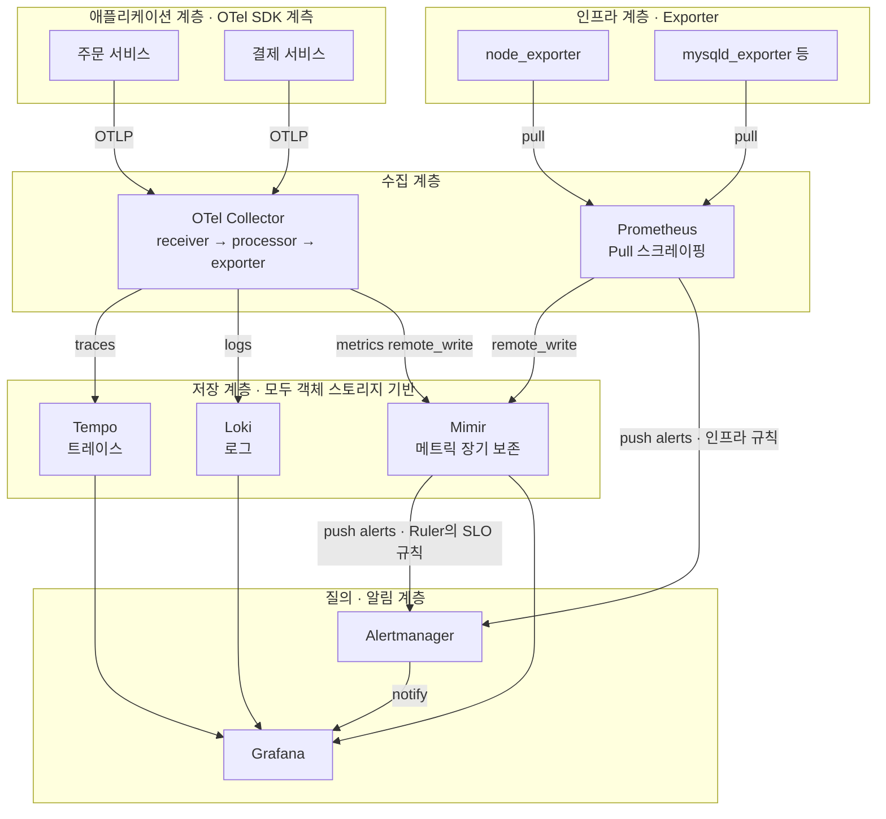
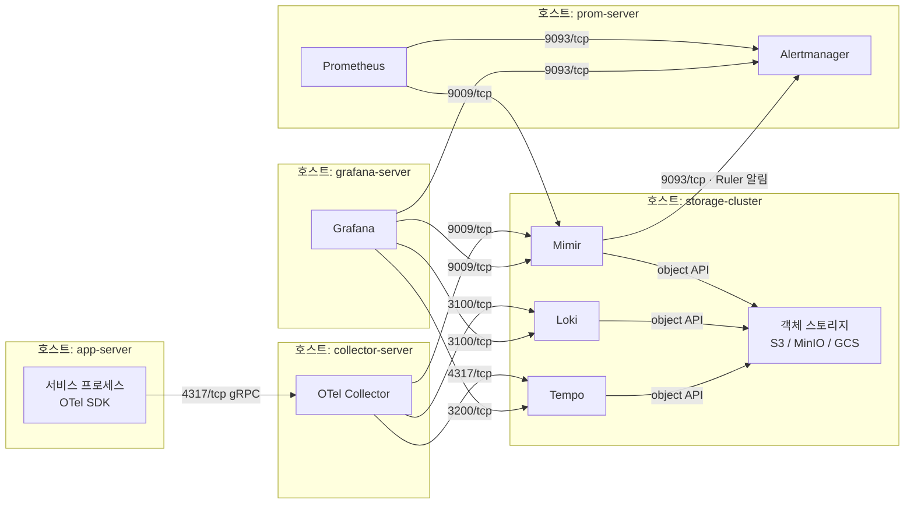
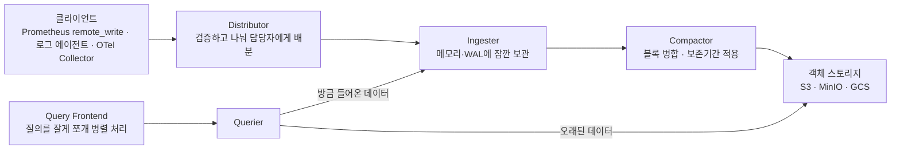
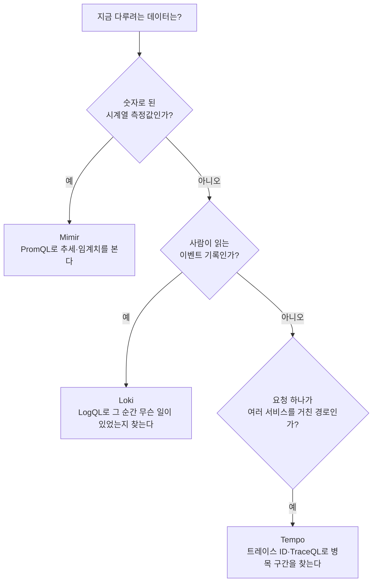
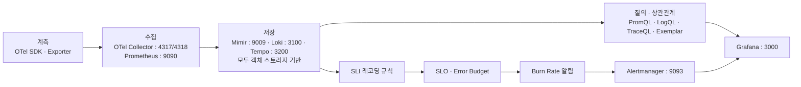

이 문서는 지금까지 다룬 메트릭·로그·트레이스·Prometheus·Grafana·SRE·알림 설계 내용을 하나의 완결된 참조 아키텍처로 종합한다. 애플리케이션이 신호를 만들어내는 지점부터, 그 신호를 모으는 Collector, 저장하는 Storage, 눈으로 보는 Grafana, 사람에게 알리는 Alerting까지 전체 구간을 다루며, 특히 이해하기 어려운 저장 계층을 쉬운 비유로 풀고, 포트 번호까지 명시한 물리 아키텍처와 실제 SRE의 SLI/SLO를 반영한 Grafana 구성을 제공한다.

---

## 이 아키텍처가 지향하는 것

이상적인 관측성 아키텍처를 설계할 때 지켜야 할 원칙은 세 가지로 요약된다. 첫째, 트레이스·메트릭·로그를 각각 다른 방식으로 계측하지 않고 OpenTelemetry라는 하나의 표준으로 계측해, 수집기를 하나로 통일한다. 둘째, 저장소는 각기 다른 제품(Mimir·Loki·Tempo)을 쓰더라도 "적재 후 압축해 객체 스토리지로 내려보내고, 질의는 프런트엔드가 캐시와 병렬 조회로 처리한다"는 같은 패턴을 공유하게 해, 운영 부담을 하나의 정신 모델로 다룰 수 있게 한다. 셋째, 알림은 임계치 하나로 끝나지 않고 SLO에서 역산한 Error Budget과 Burn Rate에 근거하게 해, "지금 알림이 왜 울렸는가"에 항상 숫자로 답할 수 있게 한다. 아래 모든 설계는 이 세 원칙에서 출발한다.

---

## 전체 논리 아키텍처



애플리케이션 코드에는 OpenTelemetry SDK 하나만 심고, 인프라·미들웨어·DB처럼 코드를 고칠 수 없는 대상에는 Exporter를 붙인다. OTel Collector와 Prometheus는 경쟁 관계가 아니라 각자의 강점을 살린 병렬 경로다. OTel Collector는 애플리케이션이 직접 푸시하는 트레이스·로그·메트릭을 한 번에 받아 세 곳으로 나눠 보내고, Prometheus는 대상이 수시로 뜨고 지는 인프라·미들웨어를 여전히 Pull 방식으로 능숙하게 긁어온다. 두 경로 모두 최종적으로 Mimir라는 같은 메트릭 저장소로 모이므로, Grafana에서는 이 둘을 구분할 필요 없이 하나의 통합된 메트릭으로 조회할 수 있다.

알림 규칙을 어디서 평가하는지도 이 구조에서 자연스럽게 정해진다. 애플리케이션 메트릭은 Collector를 거쳐 Mimir로 곧장 들어가므로 Prometheus는 그 값을 갖고 있지 않다. 따라서 애플리케이션의 SLO 규칙은 두 경로의 데이터가 모두 모이는 Mimir 안의 Ruler가 평가하고, Prometheus는 자신이 직접 긁어온 인프라 지표에 대한 규칙만 평가한다. 두 곳 모두 결과 알림은 같은 Alertmanager로 보낸다.

---

## 물리 아키텍처 — 포트까지 포함



실제로 방화벽 규칙을 열거나 트러블슈팅할 때 필요한 전체 포트는 다음과 같다.

| 컴포넌트 | 포트 | 프로토콜 | 용도 |
|---|---|---|---|
| OTel Collector | 4317 | gRPC | OTLP 수신(트레이스·메트릭·로그 공용) |
| OTel Collector | 4318 | HTTP | OTLP 수신(HTTP/protobuf) |
| OTel Collector | 8888 | HTTP | Collector 자신의 상태를 Prometheus 형식으로 노출 |
| OTel Collector | 13133 | HTTP | 헬스체크(`health_check` 확장) |
| Prometheus | 9090 | HTTP | 웹 UI · PromQL 질의 |
| Alertmanager | 9093 | HTTP | 알림 수신 · 웹 UI |
| Node Exporter | 9100 | HTTP | `/metrics` 노출 |
| Pushgateway | 9091 | HTTP | 배치 작업이 값을 밀어 넣는 곳 |
| Grafana Mimir | 9009 | HTTP | Prometheus remote_write 수신 및 질의(`/prometheus`) |
| Grafana Loki | 3100 | HTTP | 로그 푸시 · LogQL 질의 |
| Grafana Loki | 9095 | gRPC | 내부 통신 |
| Grafana Tempo | 3200 | HTTP | TraceQL 질의(Grafana가 붙는 지점) |
| Grafana Tempo | 4317 / 4318 | gRPC / HTTP | OTLP 트레이스 직접 수신 |
| Grafana Tempo | 9095 | gRPC | 내부 통신(같은 호스트에 Loki가 있으면 포트 충돌 주의) |
| Grafana | 3000 | HTTP | 대시보드 웹 UI |
| Elasticsearch | 9200 | HTTP | REST API |
| Kibana | 5601 | HTTP | 웹 UI |

한 가지 실무적으로 자주 걸리는 함정을 짚어 두면, Loki와 Tempo는 기본 내부 gRPC 포트가 똑같이 9095이기 때문에 같은 호스트에 함께 올릴 때는 둘 중 하나의 `grpc_listen_port`를 다른 값(예: 9097)으로 바꿔야 한다. 표의 Pushgateway(9091)는 이 문서의 논리·물리 다이어그램에는 등장하지 않는데, 이 아키텍처가 상정한 워크로드에 짧게 살다 사라지는 배치 작업이 없기 때문이다. 그런 작업이 생긴다면 Prometheus 앞에 Pushgateway를 추가로 두면 되므로, 트러블슈팅에 대비해 표에는 포함해 두었다. Elasticsearch·Kibana도 같은 이유로 표에만 있다. 이 아키텍처는 로그 저장소로 Loki를 택했으므로 둘 다 실제 구성에는 등장하지 않지만, 로그 전체 텍스트를 색인해 자유로운 전문 검색을 우선하는 조직이라면 Loki 대신 Elastic Stack을 선택하기도 하므로 참고용으로 남겨 두었다.

---

## 계층 1 — 계측(Instrumentation)

애플리케이션 코드에는 OTel SDK를 심어 트레이스·메트릭·로그 세 신호를 한 번에 계측하고, 소스를 고칠 수 없는 인프라·미들웨어·DB에는 node_exporter·mysqld_exporter·blackbox_exporter 같은 Exporter를 붙인다. Exporter는 대상 소프트웨어를 고치지 않고 그 옆에 붙어, 그 소프트웨어가 원래 가진 방식(예: 리눅스의 `/proc`, MySQL의 `SHOW STATUS`)으로 값을 읽어 Prometheus가 이해하는 형식으로 번역해 내놓는 중개 프로그램이다. 이 둘의 결과물은 모두 다음 계층인 Collector로 흘러 들어간다.

---

## 계층 2 — 수집(Collector)

OTel Collector는 4317(gRPC)과 4318(HTTP) 포트로 OTLP 데이터를 받아, 파이프라인 설정에 따라 트레이스는 Tempo로, 로그는 Loki로, 메트릭은 Mimir로 나눠 보낸다. 세 신호를 한 곳으로 모아 한 번에 처리한다는 것이 이 계층의 핵심 가치이며, 아래는 그 파이프라인을 실제로 정의하는 설정이다.

```yaml
receivers:
  otlp:
    protocols:
      grpc:
        endpoint: 0.0.0.0:4317
      http:
        endpoint: 0.0.0.0:4318

processors:
  memory_limiter:
    check_interval: 1s
    limit_mib: 512
  k8sattributes:
  batch:

exporters:
  otlp/tempo:
    endpoint: tempo:4317
    tls:
      insecure: true
  otlphttp/loki:
    endpoint: http://loki:3100/otlp
  prometheusremotewrite:
    endpoint: http://mimir:9009/api/v1/push

extensions:
  health_check:
    endpoint: 0.0.0.0:13133

service:
  extensions: [health_check]
  pipelines:
    traces:
      receivers: [otlp]
      processors: [memory_limiter, k8sattributes, batch]
      exporters: [otlp/tempo]
    logs:
      receivers: [otlp]
      processors: [memory_limiter, k8sattributes, batch]
      exporters: [otlphttp/loki]
    metrics:
      receivers: [otlp]
      processors: [memory_limiter, k8sattributes, batch]
      exporters: [prometheusremotewrite]
```

`memory_limiter`는 Collector 자신이 메모리 부족으로 죽는 것을 막는 안전장치이고, `k8sattributes`는 Kubernetes 파드 정보를 자동으로 레이블에 붙여 어느 서비스·네임스페이스에서 온 신호인지 식별하게 해주며(Kubernetes 클러스터 안에서 실행될 때만 의미가 있고, 부록 A의 노트북용 Docker Compose 구성에서는 그런 정보 자체가 없어 이 프로세서를 뺀다), `batch`는 신호를 묶어서 보내 네트워크 호출 횟수를 줄인다. Collector 자신의 상태는 8888 포트에 Prometheus 형식으로 노출되므로, Prometheus가 이 Collector 자체도 하나의 Target으로 등록해 "수집기가 잘 동작하고 있는가"까지 관측할 수 있다.

인프라 Exporter들은 이 경로를 거치지 않고 Prometheus가 직접 Pull로 긁어오며, Prometheus는 자신이 모은 값을 `remote_write`로 Mimir에 그대로 흘려보낸다. 즉 Collector와 Prometheus는 각각 "애플리케이션이 미는 신호"와 "인프라를 당겨오는 신호"라는 서로 다른 입구를 맡고, 저장 계층에서 다시 합쳐진다.

---

## 계층 3 — 저장(Storage), 쉽게 풀어보기

### 왜 이 구조가 필요한지부터 — 고객에게 던질 질문

고객에게 이 구조를 권할 때는 기술 설명보다 질문 하나가 먼저다. "지금 Prometheus나 ELK를 한 대(또는 몇 대)로 쓰고 계신데, 데이터가 지금보다 열 배로 늘어나면 어떻게 하실 건가요?" 대부분의 답은 "더 큰 서버를 산다"이다. 이 답의 문제는 서버를 아무리 키워도 결국 다시 그 한계에 부딪히고, 그사이 데이터를 오래 보관하지도 못한다는 데 있다. Mimir·Loki·Tempo는 모두 이 질문에 대한 같은 답을 준다. 큰 서버 한 대를 키우는 대신, 값싼 저장소(객체 스토리지) 위에 작은 처리 부품 여러 개를 필요한 만큼 늘려 붙이는 구조다. 아래에서 그 부품들이 실제로 무엇이고 왜 그렇게 나뉘어 있는지 하나씩 뜯어본다.

### 세 저장소가 공유하는 하나의 패턴

세 가지 저장소를 각각 다른 제품으로 배워야 한다고 생각하면 부담스럽지만, 실제로는 셋 다 똑같은 부품 구성을 하고 있다. 마치 세 개의 서로 다른 도서관이 있는데, 책(원본 데이터)은 모두 같은 창고 하나(객체 스토리지)에 보관하고, 각 도서관은 자기 나름의 색인 카드로 그 창고에서 책을 빨리 찾아주는 역할만 다르게 한다고 생각하면 된다.



- **Distributor(분배자)**: 데이터가 처음 도착하는 문이다. 형식이 맞는지 검사하고, 같은 종류의 데이터를 항상 같은 처리 담당자(Ingester)에게 보내도록 일관된 규칙(해시)으로 나눠 준다. 이 부품은 상태를 갖지 않아서, 트래픽이 늘면 그냥 개수를 늘리기만 하면 된다.
- **Ingester(적재자)**: 방금 들어온 데이터를 메모리와 로컬 디스크(WAL)에 잠깐 붙잡아 두면서, 조회가 들어오면 "아직 창고에 넣지 않은 가장 최신 데이터"를 직접 응답해 준다. 일정 시간이 지나면 쌓인 데이터를 하나의 블록으로 만들어 창고로 넘긴다.
- **Compactor(정리자)**: 여러 Ingester가 만들어낸 작은 블록들을 큰 블록 하나로 합치고, 중복을 제거하고, 정해진 보존 기간이 지난 데이터를 지운다. 창고가 어질러지지 않도록 주기적으로 정리하는 역할이다.
- **Query Frontend / Querier(질의자)**: 조회 요청이 오면 Query Frontend가 "최근 1시간은 이쪽, 그 이전은 저쪽"처럼 요청을 잘게 쪼개 여러 Querier에 나눠 맡기고, 각 Querier는 아직 창고에 넘어가지 않은 최신 데이터는 Ingester에서, 오래된 데이터는 객체 스토리지에서 가져와 합쳐 응답한다.

이 네 종류의 부품이 각자 독립된 프로그램이기 때문에, "쓰기가 몰리면 Ingester만 늘리고, 조회가 몰리면 Querier만 늘리는" 식으로 병목이 생긴 부분만 골라서 확장할 수 있다. 서버 한 대를 통째로 키워야 하는 기존 방식과 가장 크게 다른 지점이 이것이다.

한 가지 최신 동향도 알아 둘 필요가 있다. 위 그림은 오랫동안 쓰여 온 "클래식" 구조이며, Mimir 3.0부터는 Distributor와 Ingester 사이에 Kafka를 완충 지대로 두어 쓰기 경로와 읽기 경로를 완전히 분리하는 "인제스트 스토리지(ingest storage)" 구조가 대규모 운영의 권장안이 되었다. 클래식 구조에서는 Ingester가 데이터 적재와 최신 데이터 조회 응답을 함께 떠맡아, 조회가 몰리면 적재까지 느려질 수 있었는데, Kafka를 사이에 두면 이 둘이 서로 간섭하지 않고 따로 확장된다. Tempo의 최신 버전도 대규모 구성에서 같은 방향(Kafka를 거쳐 최신 데이터 보관용과 장기 블록 생성용 부품을 분리)으로 움직이고 있다. 다만 클래식 구조도 여전히 공식 지원되며, "받는 부분과 저장하는 부분을 나누고 원본은 객체 스토리지에 둔다"는 핵심 원리는 두 구조가 똑같다. 부록 A의 노트북 실습은 Kafka가 필요 없는 클래식 구조로 구성한다.

### Mimir — 메트릭을 수억 개 시계열까지 버티게 하는 방법

Mimir는 위 공통 부품에 더해 두 가지를 추가로 갖췄다. 하나는 오래된 블록을 창고에서 직접 꺼내 오는 **Store-gateway**이고, 다른 하나는 알림 규칙을 평가하는 **Ruler**(원한다면 Alertmanager까지 내장할 수 있다)다. 쓰기는 기본적으로 3중 복제(Ingester 세 대 중 두 대 이상이 받아야 성공 처리)로 이뤄져, 서버 한 대가 죽어도 데이터가 사라지지 않는다. Grafana Labs는 이 구조로 5억 개 시계열까지 늘려 가며 실제 벤치마크를 공개한 바 있다. 고객에게는 "지표 몇 개짜리 프로젝트로는 실감이 안 나겠지만, 나중에 팀이 열 개, 서비스가 백 개로 늘어도 서버 사양 걱정 없이 Ingester·Querier 개수만 늘리면 된다"는 식으로 설명하면 와닿는다.

### Loki — 로그를 훨씬 싸게 쌓는 방법

Loki가 다른 이유는 딱 하나, 색인 범위를 확 줄였다는 데 있다. Elasticsearch 계열은 로그 안의 모든 단어를 색인해 어떤 단어로도 검색되게 하는 대신, 그 색인 자체가 원본 로그와 맞먹거나 더 커진다. Loki는 로그 본문은 그냥 압축해서 창고에 던져 넣고, 레이블(어느 서비스·어느 환경인지 같은 꼬리표)만 색인한다. 조회할 때는 먼저 레이블로 "어느 압축 뭉치(청크)를 열어 볼지"를 좁힌 뒤, 그 안에서만 실제 문자열을 훑는다.

이 차이는 저장 비용으로 그대로 드러난다. 하루 100GB의 원본 로그를 기준으로 실측에 가까운 비교를 하면, Elasticsearch 계열은 색인 오버헤드(원본의 1.5~3배)와 복제본까지 더해 하루 약 500GB, 한 달이면 약 15TB까지 쌓인다. 같은 로그를 Loki로 받으면 압축된 청크(약 30GB)와 레이블 색인(약 5GB)을 합쳐 한 달에 약 1TB 수준이다. 같은 로그량을 두고 저장 용량이 대략 15배 차이 나는 셈이다. 고객에게는 "로그 검색 경험은 살짝 달라지지만(모든 단어가 아니라 레이블로 먼저 좁혀야 한다), 그 대가로 로그 보관 비용이 10분의 1 수준으로 줄어든다"는 트레이드오프로 설명하면 정확하다.

### Tempo — 트레이스를 트레이스 ID 하나로 찾는 방법

Tempo는 한 걸음 더 나아가 색인을 거의 없앤 경우다. 트레이스를 찾는 질문은 거의 언제나 "이 트레이스 ID에 해당하는 요청 하나를 보여 달라"이므로, 굳이 스팬의 모든 속성을 색인해 둘 필요가 없다. Tempo는 저장할 때 각 블록에 그 안에 어떤 트레이스 ID가 들어있는지를 나타내는 블룸 필터(있는지 없는지를 아주 빠르게, 아주 작은 용량으로 판별하는 자료구조)만 함께 저장한다. 조회할 때는 이 블룸 필터로 "이 블록엔 그 트레이스가 없다"는 것을 순식간에 걸러내고, 있을 가능성이 있는 블록만 열어 본다. 최근 버전은 스팬 데이터를 컬럼 지향 포맷(Apache Parquet)으로 저장해, 트레이스 ID 검색뿐 아니라 "특정 서비스에서 300ms 넘게 걸린 스팬"처럼 조건을 걸어 찾는 TraceQL 질의도 함께 지원한다. 고객에게는 "트레이스는 메트릭 그래프의 이상 지점을 클릭해서 들어가는 경우가 대부분이라, 모든 속성을 미리 색인해 둘 필요가 없다. 그래서 Tempo는 셋 중 저장 비용이 가장 저렴하다"고 설명하면 된다.

### 무엇을 쓸지 판단하는 법



이 질문 흐름 자체가 이 트랙 첫머리에서 다룬 "메트릭은 무엇이 이상한가, 로그는 왜 그랬는가, 트레이스는 어디서 그랬는가"라는 관측성 3요소의 역할 분담과 정확히 겹친다.

### 세 저장소 한눈에 비교

| 구분 | Mimir | Loki | Tempo |
|---|---|---|---|
| 저장 대상 | 숫자 시계열(메트릭) | 로그 한 줄 한 줄 | 스팬(트레이스의 구성 조각) |
| 색인 범위 | 메트릭 이름 + 레이블 조합 | 레이블만(본문 미색인) | 트레이스 ID(블룸 필터) |
| 주 질의 언어 | PromQL | LogQL | TraceQL · 트레이스 ID 조회 |
| 주된 강점 | 압도적인 확장성(수억 시계열) | 압도적으로 저렴한 저장 비용 | 가장 가벼운 색인, 빠른 ID 조회 |
| 참고 수치 | 5억 개 시계열까지 벤치마크 공개 | 동일 로그량 기준 저장 용량 약 1/15 | 스팬을 컬럼형(Parquet)으로 저장 |

### 고객에게 그대로 옮길 수 있는 한 문단 요약

"지금 쓰시는 모니터링 서버 한 대는 데이터가 늘어날수록 언젠가 한계에 부딪힙니다. Mimir·Loki·Tempo는 그 한계를 없애기 위해, 데이터를 받는 부분과 저장하는 부분을 분리했습니다. 받는 부분(Distributor·Ingester)은 필요한 만큼 늘릴 수 있는 작은 프로그램들이고, 저장하는 부분은 서버 디스크가 아니라 S3 같은 저렴하고 사실상 무제한인 저장소입니다. 그래서 트래픽이 늘어나면 서버를 새로 사는 대신 이 작은 프로그램의 개수만 늘리면 되고, 데이터도 지금보다 훨씬 오래, 훨씬 싸게 보관할 수 있습니다. 셋의 차이는 무엇을 색인해 두느냐뿐입니다. 메트릭(Mimir)은 정확한 계산이 필요해 세밀하게, 로그(Loki)는 양이 많으니 꼬리표만 가볍게, 트레이스(Tempo)는 ID 하나로 찾는 경우가 대부분이라 아주 가볍게 색인합니다."

이 공통 구조 덕분에, 셋 다 "로컬 디스크가 부족해서 장애가 난다"는 걱정에서 비교적 자유롭고, 객체 스토리지의 저렴한 비용으로 몇 달·몇 년치 데이터를 쌓아 둘 수 있다는 것이 이 저장 계층 설계의 핵심 이점이다. Prometheus 자체 TSDB는 이런 구조 없이 로컬 디스크에만 의존하기 때문에 보존 기간이 짧을 수밖에 없으며, 그래서 장기 보존이 필요하면 Prometheus 옆에 Mimir 같은 별도 저장소를 두고 그쪽으로 흘려보내는 것이다.

---

## 계층 4 — 질의와 상관관계

세 저장소는 각자 다른 질의 언어를 쓴다. 메트릭은 이 문서 전체에서 다뤄 온 PromQL, 로그는 레이블로 좁힌 뒤 `|= "검색어"`처럼 로그 본문을 필터링하는 LogQL, 트레이스는 `{ resource.service.name = "order-api" && duration > 300ms }`처럼 스팬의 속성으로 찾는 TraceQL을 쓴다.

이 셋을 진짜로 하나처럼 쓰게 해주는 것이 Grafana의 상관관계 기능이다. 메트릭에 예시값(Exemplar)이라는 표식을 남겨 두면, 그래프 위의 특정 지점을 클릭해 바로 그 순간에 실제로 발생했던 트레이스로 이동할 수 있고, 트레이스에서 다시 그 요청과 같은 시간대·서비스의 로그로 내려갈 수 있다. Grafana의 데이터 소스 설정에서 이렇게 연결한다.

```yaml
datasources:
  - name: Mimir
    type: prometheus
    url: http://mimir:9009/prometheus
    jsonData:
      exemplarTraceIdDestinations:
        - name: trace_id
          datasourceUid: tempo

  - name: Tempo
    type: tempo
    url: http://tempo:3200
    jsonData:
      tracesToLogsV2:
        datasourceUid: loki
        spanStartTimeShift: "-5m"
        spanEndTimeShift: "5m"
```

이 설정이 있으면 "메트릭 그래프에서 이상 구간을 본다 → 그 지점의 예시값을 눌러 실제 느렸던 요청의 트레이스를 연다 → 트레이스에서 오래 걸린 구간을 눌러 그 서비스의 그 시각 로그로 내려간다"는, 메트릭이 무엇을·트레이스가 어디서·로그가 왜를 순서대로 답해주는 흐름이 한 화면 안에서 완성된다.

Exemplar는 데이터 소스 설정 하나만으로 저절로 나타나지 않는다는 점을 짚어 두어야 한다. 예시값이 그래프에 찍히려면 파이프라인의 모든 구간이 이를 넘겨줘야 한다. 애플리케이션 SDK가 요청을 처리하는 도중에 기록한 측정값에 그 순간의 트레이스 ID를 붙이고, 수집기가 이를 버리지 않고 전달하고, 저장소가 이를 보관하도록 허용되어 있어야 한다. 이때 OpenTelemetry가 붙이는 예시값의 레이블 이름은 `trace_id`이므로, 위 설정의 `name`도 반드시 `trace_id`로 맞춰야 Grafana가 그 값을 트레이스 링크로 인식한다. 구간별로 무엇을 켜야 하는지는 부록 A의 실제 설정 파일에 모두 반영해 두었다.

---

## 계층 5 — 알림(Alerting)

규칙을 평가하는 쪽(Prometheus 또는 Mimir Ruler)은 조건을 만족하면 "알림이 발생했다"는 사실만 만든다. 그 알림을 누구에게·어떻게 보낼지는 전적으로 Alertmanager(9093)의 몫이며, Alertmanager는 여러 알림을 묶고·걸러내고·정해진 곳으로 라우팅하는 역할을 한다. 이 아키텍처에서는 인프라 규칙은 Prometheus가, 애플리케이션 SLO 규칙은 Mimir Ruler가 평가하고, 둘 다 같은 Alertmanager로 알림을 보낸다. Mimir Ruler가 알림을 보낼 곳은 Mimir 설정의 `ruler.alertmanager_url`에 Alertmanager 주소를 적어 지정한다. Grafana Alerting도 병행해 화면에서 바로 규칙을 걸 수 있으며, 어느 경로든 최종적으로는 이 다음 절에서 다룰 SLO 기반 판단에 근거해야 "좋은 알림"이 된다.

---

## Grafana를 실제 SRE의 SLI/SLO로 구성하기

여기서부터는 이 문서의 핵심이다. 임계치 하나만 걸어 놓은 알림이 아니라, 실제 SRE 현장에서 쓰는 SLI/SLO/Error Budget 체계를 Grafana 대시보드와 알림 규칙으로 직접 구현한다. 예시 서비스는 "주문 API"이며, SLO는 가용성 99.9%(월), 지연시간은 300ms 이하 요청이 99%(월)로 정한다.

### ① SLI를 레코딩 규칙으로 미리 계산해 둔다

매번 무거운 쿼리를 대시보드와 알림 규칙에서 각각 다시 계산하지 않도록, 레코딩 규칙으로 SLI 자체를 미리 만들어 둔다. 앞서 설명한 대로 이 규칙들은 Mimir Ruler에 올려 평가한다(규칙 파일은 Grafana가 제공하는 `mimirtool rules load` 명령으로 업로드한다).

규칙에 등장하는 `job="order-api"`는 주문 API 서비스의 메트릭만 골라내는 레이블이다. OTLP로 들어온 메트릭은 Prometheus 형식으로 변환될 때 애플리케이션의 서비스 이름(`service.name` 리소스 속성)이 `job` 레이블 값이 되므로, 운영 환경에서는 주문 API의 서비스 이름을 `order-api`로 정해 두면 이 레이블이 자동으로 붙는다.

```yaml
groups:
  - name: order_api_sli_recording_rules
    interval: 30s
    rules:
      - record: slo:order_api_requests:rate5m
        expr: sum(rate(http_requests_total{job="order-api"}[5m]))

      - record: slo:order_api_errors:rate5m
        expr: sum(rate(http_requests_total{job="order-api", status=~"5.."}[5m]))

      - record: slo:order_api_availability:ratio5m
        expr: >
          1 - (
            slo:order_api_errors:rate5m
            / slo:order_api_requests:rate5m
          )

      - record: slo:order_api_availability:ratio30m
        expr: >
          1 - (
            sum(rate(http_requests_total{job="order-api", status=~"5.."}[30m]))
            / sum(rate(http_requests_total{job="order-api"}[30m]))
          )

      - record: slo:order_api_availability:ratio1h
        expr: >
          1 - (
            sum(rate(http_requests_total{job="order-api", status=~"5.."}[1h]))
            / sum(rate(http_requests_total{job="order-api"}[1h]))
          )

      - record: slo:order_api_availability:ratio6h
        expr: >
          1 - (
            sum(rate(http_requests_total{job="order-api", status=~"5.."}[6h]))
            / sum(rate(http_requests_total{job="order-api"}[6h]))
          )

      - record: slo:order_api_availability:ratio30d
        expr: >
          1 - (
            sum(rate(http_requests_total{job="order-api", status=~"5.."}[30d]))
            / sum(rate(http_requests_total{job="order-api"}[30d]))
          )

      - record: slo:order_api_latency_good:ratio5m
        expr: >
          sum(rate(http_request_duration_seconds_bucket{job="order-api", le="0.3"}[5m]))
          / sum(rate(http_request_duration_seconds_count{job="order-api"}[5m]))
```

각 창(5분·30분·1시간·6시간·30일)의 가용성을 매번 원본 카운터에서 직접 계산해 별도로 기록해 둔 것이 핵심이다. "1시간 창의 가용성"을 구할 때 5분 단위 비율 여러 개를 평균 내는 방식은 쓰지 않는다. 비율의 평균은 원본 요청량으로 가중되지 않은 값이라, 트래픽이 시간대별로 고르지 않으면 실제 1시간 전체의 가용성과 어긋날 수 있기 때문이다. 매 창마다 `sum(rate(...))`으로 원본 카운터를 직접 집계해야 트래픽 양과 무관하게 정확한 비율이 나온다.

다만 `[30d]`처럼 긴 창을 원본 카운터에서 매번 새로 계산하면, 트래픽이 많은 운영 환경에서는 30초마다 한 달치 원본 데이터를 훑어야 해서 부담이 크다. 이럴 때는 5분 단위로 미리 기록해 둔 분자(오류 수)와 분모(전체 요청 수)를 각각 따로 합산하는 방법을 쓴다.

```promql
1 - (
  sum_over_time(slo:order_api_errors:rate5m[30d])
  / sum_over_time(slo:order_api_requests:rate5m[30d])
)
```

이 방식은 비율끼리 평균 내는 것이 아니라 분자와 분모를 각각 더한 뒤 마지막에 한 번 나누기 때문에, 트래픽 양에 따른 가중이 그대로 유지되면서도 계산량은 크게 줄어든다.

### ② Error Budget 소진을 Burn Rate 알림으로 감시한다

Error Budget(1 − SLO)은 "이번 달에 얼마나 남았는가"를 보여주는 숫자일 뿐, 그 자체로는 알림이 되지 못한다. 알림으로 쓰려면 "지금 이 속도로 계속 나빠지면 예산이 얼마 만에 바닥나는가"를 나타내는 소진 속도, 즉 Burn Rate가 필요하다. 계산식은 다음과 같다.

```
소진된 예산 비율 = burn rate × 알림 창 크기 ÷ SLO 평가 기간
```

예를 들어 SLO 평가 기간이 30일인 서비스에서 최근 1시간 동안 burn rate가 14.4배로 측정되었다면, 이 속도가 유지될 경우 30일치 예산을 30 ÷ 14.4 ≈ 2일 만에 다 쓴다는 뜻이다(1시간 만에 이미 전체 예산의 14.4 × 1시간 ÷ 30일 ≈ 2%를 태운 셈이다). 그래서 14.4라는 배수는 "1시간을 이 속도로 보내면 이틀 안에 예산이 바닥난다"는 위험 신호의 기준선으로 널리 쓰인다. 같은 논리로 6이라는 배수는 "6시간을 이 속도로 보내면 5일 안에 바닥난다"는, 조금 더 느긋하게 반응해도 되는 경고 수준의 기준선이다.

한 가지 창만 쓰면 문제가 생긴다. 1시간 창 하나만 본다면, 장애가 끝난 뒤에도 그 1시간이 다 지나갈 때까지 알림이 꺼지지 않아 늦게까지 시끄럽고, 반대로 순간적인 튐 한 번에도 바로 발화해 오탐이 잦아진다. 그래서 아래 규칙은 긴 창(1시간)과 그보다 훨씬 짧은 창(5분)을 동시에 요구해, 둘 다 임계치를 넘겼을 때만 발화하도록 만든다. 긴 창은 "정말로 지속되는 문제인가"를, 짧은 창은 "지금도 여전한가"를 확인하는 역할이며, 두 조건을 `and`로 묶은 것이 그 구현이다.

앞서 만든 레코딩 규칙 위에 이 논리를 그대로 얹으면 다음과 같다.

```yaml
groups:
  - name: order_api_slo_burn_rate_alerts
    rules:
      - alert: OrderAPIAvailabilityBurnRateCritical
        expr: >
          (
            (1 - slo:order_api_availability:ratio1h) / (1 - 0.999) > 14.4
          )
          and
          (
            (1 - slo:order_api_availability:ratio5m) / (1 - 0.999) > 14.4
          )
        for: 2m
        labels:
          severity: critical
        annotations:
          summary: "주문 API 가용성 Error Budget이 빠르게 소진되고 있습니다"
          description: "1시간 창 burn rate가 14.4배를 넘었습니다. 이 속도가 이어지면 30일 예산이 약 2일 안에 소진됩니다."

      - alert: OrderAPIAvailabilityBurnRateWarning
        expr: >
          (
            (1 - slo:order_api_availability:ratio6h) / (1 - 0.999) > 6
          )
          and
          (
            (1 - slo:order_api_availability:ratio30m) / (1 - 0.999) > 6
          )
        for: 15m
        labels:
          severity: warning
        annotations:
          summary: "주문 API 가용성 Error Budget 소진 속도가 평소보다 빠릅니다"
```

### ③ Grafana 대시보드를 Error Budget 중심으로 구성한다

SLO 대시보드는 임계치 하나를 보여주는 화면이 아니라, "지금 얼마나 안전한가"를 한눈에 답하는 화면이어야 한다. 패널은 하나의 화면에 지표를 욱여넣기보다, 한 패널에 한 가지만 명확히 보여주는 다섯 개로 나눈다. 각 패널의 PromQL은 다음과 같다.

**① 현재 가용성 대 목표(Stat 패널)**

```promql
slo:order_api_availability:ratio5m * 100
```

목표값 99.9를 임계값 색상 경계로 지정해, 이 숫자가 초록(목표 이상)인지 빨강(목표 미달)인지 한눈에 보이게 한다.

**② 잔여 Error Budget(Gauge 패널)**

```promql
clamp_min(
  (
    1 - (
      (1 - slo:order_api_availability:ratio30d) / (1 - 0.999)
    )
  ) * 100,
  0
)
```

30일 평균 가용성을 기준으로 예산 소진 비율을 계산한 뒤, 100에서 그 소진 비율을 뺀 값을 게이지로 보여준다. 0에 가까울수록 이번 달 예산을 거의 다 썼다는 뜻이다.

**③ 300ms 이하 비율(Stat 패널)**

```promql
slo:order_api_latency_good:ratio5m * 100
```

지연시간 SLO(99%)를 지금 지키고 있는지를 가용성 패널과 같은 방식(Stat, 임계값 색상)으로 보여준다.

**④ Burn Rate 추이(시계열 패널)**

```promql
(1 - slo:order_api_availability:ratio1h) / (1 - 0.999)
```

이 값이 1을 넘으면 예산을 평소보다 빠르게 쓰고 있다는 뜻이고, 14.4나 6처럼 알림 규칙에 걸어 둔 임계선을 함께 그려 두면 지금이 경고 구간에 얼마나 가까운지 시각적으로 바로 확인된다.

**⑤ p95 지연시간(시계열 패널)**

```promql
histogram_quantile(0.95, sum by (le) (rate(http_request_duration_seconds_bucket{job="order-api"}[5m])))
```

③이 "목표를 지키는 비율"이라는 합격·불합격 관점이라면, ⑤는 "실제로 몇 초 걸리는지"라는 절댓값 관점이다. 이 둘은 단위(퍼센트 대 초)가 전혀 달라 한 패널에 같이 그리면 눈금이 뒤틀려 보이므로 패널을 나눈다.

이렇게 다섯 개로 나눠 구성한 대시보드는 대시보드 설계 원칙(개요에서 상세로 드릴다운, 꼬리가 중요한 지표는 단일 숫자가 아니라 시계열로)과 SRE의 Error Budget 개념을 하나의 화면 위에서 실제로 결합한 결과물이다. 이 다섯 패널을 Grafana 화면에서 실제로 만드는 클릭 단위 절차는 부록 A에 자세히 정리했다.

---

## 전체 파이프라인을 한 장으로



계측에서 시작해 수집·저장·질의를 거치고, 같은 저장된 값 위에서 SLI를 미리 계산해 SLO·Error Budget으로 판단 기준을 세우고, 그 기준의 소진 속도(Burn Rate)를 알림으로 감시해 Alertmanager를 거쳐 사람에게 전달되기까지가 이 문서가 그리는 이상적인 아키텍처의 전체 경로다.

---

## 이 아키텍처의 한계와 확장 방향

이 아키텍처는 중간 규모 이상의 조직을 기준으로 설계되었으며, 몇 가지 전제를 깔고 있다. 객체 스토리지를 별도로 운영할 여력이 없는 아주 작은 팀이라면 Mimir·Loki·Tempo 세 컴포넌트를 각각 이중화하는 대신 단일 바이너리 모드로 시작해 점진적으로 분리하는 편이 현실적이다. 또한 OTel Collector를 애플리케이션과 별도 서버에 두는 대신, 각 노드에 에이전트(Grafana Alloy 등)로 배치하고 그 뒤에 게이트웨이 역할의 Collector를 한 번 더 두는 2단 구조가 대규모 환경에서는 흔히 쓰이는데, 이 문서는 이해를 위해 단일 Collector 계층으로 단순화했다는 점도 함께 밝혀 둔다.

---

## 부록 A — 노트북에서 통째로 실행하기 (Windows + WSL2 + Docker Desktop)

바로 앞 절이 프로덕션 규모를 염두에 둔 한계와 확장 방향이었다면, 이 부록은 반대 방향이다. 같은 설계를 지금 당장 노트북 한 대에서, 별도 VM 없이 손으로 만져 보는 것이 목적이다. WEB(nginx) → WAS(Flask, OTel 계측) → DB(MySQL) 3계층 샘플 애플리케이션을 함께 구성해, 실제로 트래픽을 흘려보내며 메트릭·로그·트레이스가 파이프라인을 타고 Grafana에 도착하고, 마지막에는 Burn Rate 알림이 실제로 발화하는 것까지 눈으로 확인한다.

### 왜 별도 VM 없이 WSL2만으로 충분한가

Docker Desktop을 "WSL2 기반 엔진"으로 설정하면, Docker Desktop 자신이 내부적으로 경량 리눅스 VM(WSL2)을 이미 띄워 그 안에서 컨테이너를 실행한다. 즉 사용자가 VirtualBox나 Hyper-V로 별도 가상 머신을 만들 필요 없이, WSL2 자체가 "이미 준비된 리눅스 실행 환경"이자 사실상의 VM 역할을 겸한다. 이 문서 전체에서 다룬 모든 컴포넌트(Prometheus·Alertmanager·OTel Collector·Mimir·Loki·Tempo·Grafana·MySQL·샘플 앱)는 리눅스용 Docker 이미지로 배포되므로, WSL2 위의 Docker Desktop만으로 완전히 동일하게 동작한다.

### 0단계 — WSL2와 Docker Desktop 준비

1. Windows PowerShell을 관리자 권한으로 열고 WSL2와 기본 배포판(Ubuntu)을 설치한다.

```powershell
wsl --install
wsl --set-default-version 2
```

설치 후 재부팅하면 Ubuntu 배포판의 초기 사용자 설정 화면이 뜬다.

2. [Docker Desktop for Windows](https://www.docker.com/products/docker-desktop/)를 내려받아 설치한다. 설치 마법사에서 **"Use WSL 2 instead of Hyper-V"** 옵션이 기본으로 켜져 있는지 확인한다.

3. Docker Desktop 설정 → **Resources → WSL Integration**에서 방금 만든 Ubuntu 배포판과의 연동을 켠다.

4. 리소스를 넉넉히 쓰고 싶다면, Windows 사용자 홈 폴더(`C:\Users\<사용자명>\.wslconfig`)에 다음과 같이 적어 WSL2에 할당할 메모리·CPU를 조정한다. 이 아키텍처 전체(13개 컨테이너)를 여유 있게 돌리려면 메모리 8GB 이상을 권장한다.

```ini
[wsl2]
memory=8GB
processors=4
```

수정 후에는 PowerShell에서 `wsl --shutdown`으로 WSL을 재시작해야 반영된다.

5. Ubuntu 배포판(WSL) 터미널을 열고 Docker가 정상 인식되는지 확인한다.

```bash
docker --version
docker compose version
```

버전 정보가 출력되면 준비가 끝난 것이다. 이후의 모든 명령은 이 WSL 터미널에서 실행한다.

### 1단계 — 폴더 구조 잡기

```
observability-lab/
├── docker-compose.yml
├── otel-collector-config.yaml
├── prometheus.yml
├── recording_rules.yml
├── alert_rules.yml
├── alertmanager.yml
├── mimir.yaml
├── loki-config.yaml
├── tempo.yaml
├── grafana/
│   └── provisioning/
│       ├── datasources/
│       │   └── datasources.yaml
│       └── dashboards/
│           ├── dashboards.yaml
│           └── order-api-slo.json
├── was-app/
│   ├── Dockerfile
│   ├── requirements.txt
│   └── app.py
├── web/
│   ├── Dockerfile
│   └── nginx.conf
├── db/
│   └── init.sql
└── load.sh
```

`grafana/provisioning/dashboards/` 아래 두 파일은 6-1단계의 "대안" 부분에서 다루는 자동 대시보드 등록용이며, 화면에서 직접 대시보드를 만들 계획이라면 지금 만들어 두지 않아도 된다.

### 2단계 — WEB · WAS · DB 샘플 애플리케이션 만들기

**WAS(`was-app/app.py`)** — Flask로 만든 주문 API이며, 이 문서 전체에서 다룬 세 신호를 모두 스스로 만들어낸다. 트레이스와 로그는 OTel SDK로 OTel Collector에 직접 보내고, 메트릭은 이 문서의 PromQL 예시(`http_requests_total`, `http_request_duration_seconds`)와 이름을 맞춰 직접 계측한다.

```python
import os
import time
import logging
import pymysql
from flask import Flask, jsonify

from opentelemetry import trace, metrics
from opentelemetry.sdk.resources import Resource
from opentelemetry.sdk.trace import TracerProvider
from opentelemetry.sdk.trace.export import BatchSpanProcessor
from opentelemetry.exporter.otlp.proto.grpc.trace_exporter import OTLPSpanExporter
from opentelemetry.sdk.metrics import MeterProvider
from opentelemetry.sdk.metrics.export import PeriodicExportingMetricReader
from opentelemetry.exporter.otlp.proto.grpc.metric_exporter import OTLPMetricExporter
from opentelemetry.sdk.metrics.view import View, ExplicitBucketHistogramAggregation
from opentelemetry.instrumentation.flask import FlaskInstrumentor
from opentelemetry.instrumentation.pymysql import PyMySQLInstrumentor
from opentelemetry.instrumentation.logging import LoggingInstrumentor
from opentelemetry.sdk._logs import LoggerProvider, LoggingHandler
from opentelemetry.sdk._logs.export import BatchLogRecordProcessor
from opentelemetry.exporter.otlp.proto.grpc._log_exporter import OTLPLogExporter

OTLP_ENDPOINT = os.environ.get("OTEL_EXPORTER_OTLP_ENDPOINT", "http://otel-collector:4317")
resource = Resource.create({"service.name": "order-was"})

# --- 트레이스 ---
tracer_provider = TracerProvider(resource=resource)
tracer_provider.add_span_processor(
    BatchSpanProcessor(OTLPSpanExporter(endpoint=OTLP_ENDPOINT, insecure=True))
)
trace.set_tracer_provider(tracer_provider)

# --- 메트릭 (300ms 경계를 포함하는 버킷을 명시적으로 지정) ---
latency_view = View(
    instrument_name="http_request_duration_seconds",
    aggregation=ExplicitBucketHistogramAggregation(
        boundaries=[0.05, 0.1, 0.2, 0.3, 0.5, 1, 2, 5, 10]
    ),
)
reader = PeriodicExportingMetricReader(
    OTLPMetricExporter(endpoint=OTLP_ENDPOINT, insecure=True), export_interval_millis=5000
)
meter_provider = MeterProvider(resource=resource, metric_readers=[reader], views=[latency_view])
metrics.set_meter_provider(meter_provider)
meter = metrics.get_meter("order-was")
request_counter = meter.create_counter("http_requests_total", description="총 HTTP 요청 수")
request_duration = meter.create_histogram("http_request_duration_seconds", description="요청 처리 시간(초)")

# --- 로그(OTLP로 실제 전송 + 트레이스 ID가 자동으로 찍히도록) ---
# LoggingInstrumentor는 로그 레코드에 otelTraceID·otelSpanID 필드를 주입하는 역할만 하고,
# 실제로 그 레코드를 Collector로 내보내는 것은 별도로 붙이는 OTLP 핸들러의 일이다.
# 이 핸들러를 빼먹으면 로그는 콘솔에만 찍히고 Loki에는 영원히 도착하지 않는다.
logger_provider = LoggerProvider(resource=resource)
logger_provider.add_log_record_processor(
    BatchLogRecordProcessor(OTLPLogExporter(endpoint=OTLP_ENDPOINT, insecure=True))
)
otlp_log_handler = LoggingHandler(level=logging.INFO, logger_provider=logger_provider)

LoggingInstrumentor().instrument()
logging.basicConfig(
    level=logging.INFO,
    format="%(asctime)s %(levelname)s [trace_id=%(otelTraceID)s] %(message)s",
)
logging.getLogger().addHandler(otlp_log_handler)  # 콘솔 출력은 그대로 두고 OTLP로도 함께 내보낸다
logger = logging.getLogger("order-was")

app = Flask(__name__)
FlaskInstrumentor().instrument_app(app)
PyMySQLInstrumentor().instrument()  # DB 호출마다 자식 스팬을 만들어 SQL 구간을 트레이스에 남긴다

DB_CONFIG = dict(
    host=os.environ.get("DB_HOST", "mysql"),
    user=os.environ.get("DB_USER", "orders"),
    password=os.environ.get("DB_PASSWORD", "orders"),
    database=os.environ.get("DB_NAME", "orders"),
)


def record(status: str, start: float):
    # job 레이블은 코드에서 붙이지 않는다. Prometheus가 스크레이프 설정의 job_name("order-api")으로 붙여 준다.
    request_counter.add(1, {"status": status})
    request_duration.record(time.time() - start)


def health():
    return jsonify(status="ok")


def list_orders():
    start = time.time()
    conn = pymysql.connect(**DB_CONFIG)
    try:
        with conn.cursor() as cur:
            cur.execute("SELECT id, item, amount FROM orders ORDER BY id DESC LIMIT 10")
            rows = cur.fetchall()
        logger.info("주문 목록 조회 성공 rows=%d", len(rows))
        record("200", start)
        return jsonify(orders=rows)
    finally:
        conn.close()


def slow_orders():
    start = time.time()
    conn = pymysql.connect(**DB_CONFIG)
    try:
        with conn.cursor() as cur:
            cur.execute("SELECT SLEEP(2)")  # 커넥션풀·락 대기를 흉내 낸 인위적 지연
            cur.execute("SELECT id, item, amount FROM orders ORDER BY id DESC LIMIT 10")
            rows = cur.fetchall()
        logger.warning("느린 주문 조회 완료 rows=%d", len(rows))
        record("200", start)
        return jsonify(orders=rows)
    finally:
        conn.close()


def error_orders():
    start = time.time()
    logger.error("주문 처리 중 강제 오류가 발생했습니다")
    record("500", start)
    return jsonify(error="internal error"), 500


if __name__ == "__main__":
    app.run(host="0.0.0.0", port=5000)
```

```text
# was-app/requirements.txt
flask
pymysql
opentelemetry-api
opentelemetry-sdk
opentelemetry-exporter-otlp-proto-grpc
opentelemetry-instrumentation-flask
opentelemetry-instrumentation-pymysql
opentelemetry-instrumentation-logging
```

> 버전을 고정하지 않고 pip이 서로 호환되는 최신 버전을 고르게 두는 편을 권한다. `opentelemetry-sdk`의 Views API는 버전에 따라 세부 임포트 경로가 조금씩 달라질 수 있으므로, 위 코드가 그대로 실행되지 않으면 [OpenTelemetry Python 공식 문서의 Views 가이드](https://opentelemetry.io/docs/languages/python/instrumentation/#customizing-the-otlp-exporter)에서 해당 부분만 맞춰 고치면 된다.

```dockerfile
# was-app/Dockerfile
FROM python:3.12-slim
WORKDIR /app
COPY requirements.txt .
RUN pip install --no-cache-dir -r requirements.txt
COPY app.py .
EXPOSE 5000
CMD ["python", "app.py"]
```

**WEB(`web/nginx.conf`, `web/Dockerfile`)** — 사용자 요청이 가장 먼저 닿는 관문 역할의 리버스 프록시다. 다만 기본 nginx 이미지는 트레이스를 만들거나 전달하는 기능이 전혀 없다. 아무 설정도 하지 않으면 nginx는 그냥 요청을 흘려보낼 뿐이라, 트레이스는 WEB이 아니라 WAS에서부터 새로 시작해 버린다. 이 문제를 그대로 두지 않고, nginx 공식(nginx.org)이 배포하는 `ngx_otel_module`을 붙여 WEB 계층도 트레이스의 첫 스팬을 만들도록 구성한다. Docker Hub의 nginx 공식 이미지는 이 모듈을 미리 설치해 둔 `-otel` 태그 변형(예: `nginx:1.31-otel`)을 따로 제공하므로, 모듈을 직접 설치하거나 빌드할 필요 없이 설정 파일만 넣으면 된다.

```dockerfile
# web/Dockerfile
FROM nginx:1.31-otel
COPY nginx.conf /etc/nginx/nginx.conf
```

```nginx
# web/nginx.conf
load_module modules/ngx_otel_module.so;

events {}

http {
    otel_exporter {
        endpoint otel-collector:4317;
    }
    otel_service_name "order-web";

    server {
        listen 80;

        location / {
            otel_trace on;
            otel_trace_context propagate;
            proxy_pass http://was-app:5000;
            proxy_set_header Host $host;
        }
    }
}
```

`otel_trace on`이 nginx가 요청마다 스팬을 직접 만들게 하고, `otel_trace_context propagate`가 두 가지를 동시에 한다. 들어온 요청에 이미 `traceparent` 헤더가 있으면 그 트레이스를 이어받고(브라우저나 다른 서비스가 트레이스를 시작해 온 경우), 없으면 nginx가 새 트레이스를 시작한 뒤 그 헤더를 만들어 뒤쪽(WAS)으로 넘겨준다. 이렇게 해야 Tempo에서 트레이스 하나를 열었을 때 `order-web`(nginx가 요청을 받아 넘기는 데 걸린 시간) → `order-was`(Flask가 실제로 처리한 시간) → DB 호출까지 세 구간이 부모·자식 관계로 이어진 하나의 트리로 보인다.

**DB(`db/init.sql`)** — 컨테이너가 처음 뜰 때 자동으로 실행되는 초기화 스크립트다.

```sql
CREATE TABLE IF NOT EXISTS orders (
    id INT AUTO_INCREMENT PRIMARY KEY,
    item VARCHAR(100) NOT NULL,
    amount DECIMAL(10,2) NOT NULL,
    created_at TIMESTAMP DEFAULT CURRENT_TIMESTAMP
);
INSERT INTO orders (item, amount) VALUES ('키보드', 45000), ('마우스', 25000), ('모니터', 189000);

-- mysqld-exporter가 세션·스레드·복제 상태 같은 서버 지표를 읽을 수 있도록 권한을 준다
GRANT PROCESS, REPLICATION CLIENT, SELECT ON *.* TO 'orders'@'%';
FLUSH PRIVILEGES;
```

`orders` 계정은 MySQL 컨테이너가 이 스크립트를 실행하기 전에 `docker-compose.yml`의 `MYSQL_USER` 설정으로 먼저 만들어 두므로, 여기서는 권한만 추가하면 된다. 실습의 편의를 위해 애플리케이션과 mysqld-exporter가 같은 계정을 쓰지만, 운영 환경에서는 exporter 전용 계정을 따로 만들어 이 세 가지 권한만 주는 것이 원칙이다.

### 3단계 — 수집 · 저장 스택 설정 파일

**OTel Collector(`otel-collector-config.yaml`)** — 본문의 파이프라인과 한 가지가 다르다. 본문에서는 애플리케이션 메트릭을 Collector가 Mimir로 곧장 보내고 SLO 규칙은 Mimir Ruler가 평가했지만, 노트북 실습에서는 부품 수를 줄이기 위해 규칙 평가를 Prometheus 한 곳에 모은다. 그래서 Collector는 애플리케이션 메트릭을 Mimir로 직접 보내지 않고, 8889 포트에 Prometheus 형식으로 열어 두기만 한다. Prometheus가 이것을 긁어가 규칙을 평가하고, 원본과 규칙 결과를 함께 Mimir로 흘려보낸다.

이때 Collector에서도 Mimir로 직접 보내고 Prometheus에서도 보내면, 같은 메트릭이 Mimir에 두 벌 쌓여 합계를 낼 때마다 값이 두 배로 부풀려진다. 그래서 출구를 하나(Prometheus 경유)로만 둔다.

```yaml
receivers:
  otlp:
    protocols:
      grpc:
        endpoint: 0.0.0.0:4317
      http:
        endpoint: 0.0.0.0:4318

processors:
  memory_limiter:
    check_interval: 1s
    limit_mib: 512
  batch:

exporters:
  otlp/tempo:
    endpoint: tempo:4317
    tls:
      insecure: true
  otlphttp/loki:
    endpoint: http://loki:3100/otlp
  prometheus:
    endpoint: 0.0.0.0:8889
    enable_open_metrics: true   # Exemplar(트레이스 ID)를 함께 노출하려면 OpenMetrics 형식이어야 한다

extensions:
  health_check:
    endpoint: 0.0.0.0:13133

service:
  extensions: [health_check]
  telemetry:
    metrics:
      readers:
        - pull:
            exporter:
              prometheus:
                host: 0.0.0.0   # Collector 자신의 상태 지표(8888)를 다른 컨테이너에서 긁어갈 수 있게 연다
                port: 8888
  pipelines:
    traces:
      receivers: [otlp]
      processors: [memory_limiter, batch]
      exporters: [otlp/tempo]
    logs:
      receivers: [otlp]
      processors: [memory_limiter, batch]
      exporters: [otlphttp/loki]
    metrics:
      receivers: [otlp]
      processors: [memory_limiter, batch]
      exporters: [prometheus]
```

`telemetry` 항목은 Collector 자신의 상태 지표를 8888 포트에 여는 설정이다. 최근 버전의 Collector는 보안상 이 포트를 기본적으로 자기 컨테이너 안(localhost)에서만 열기 때문에, 이 설정 없이는 Prometheus 컨테이너가 `otel-collector:8888`을 긁어가지 못해 `otel-collector-self` 대상이 계속 DOWN으로 보인다.

**Prometheus(`prometheus.yml`)** — 인프라 Exporter를 직접 Pull하고, WAS 앱의 메트릭은 방금 OTel Collector가 열어 둔 8889 포트에서 다시 Pull해 SLO 규칙을 평가할 수 있게 한다. `job_name: "order-api"`가 붙이는 `job` 레이블이 이후 모든 PromQL의 `job="order-api"` 조건과 맞물린다.

```yaml
global:
  scrape_interval: 15s

remote_write:
  - url: http://mimir:9009/api/v1/push
    send_exemplars: true   # 트레이스 ID가 붙은 예시값도 Mimir로 함께 보낸다

rule_files:
  - "/etc/prometheus/recording_rules.yml"
  - "/etc/prometheus/alert_rules.yml"

alerting:
  alertmanagers:
    - static_configs:
        - targets: ["alertmanager:9093"]

scrape_configs:
  - job_name: "otel-collector-self"
    static_configs:
      - targets: ["otel-collector:8888"]
  - job_name: "order-api"
    static_configs:
      - targets: ["otel-collector:8889"]
  - job_name: "node-exporter"
    static_configs:
      - targets: ["node-exporter:9100"]
  - job_name: "mysqld-exporter"
    static_configs:
      - targets: ["mysqld-exporter:9104"]
```

**레코딩·알림 규칙(`recording_rules.yml`, `alert_rules.yml`)** — 본문의 SLI/SLO 절에서 만든 규칙을 그대로 쓴다. 지연시간 SLI(`slo:order_api_latency_good:ratio5m`)까지 포함해야 본문의 지연시간 패널이 실제로 값을 받는다는 점에 유의한다.

```yaml
# recording_rules.yml
groups:
  - name: order_api_sli_recording_rules
    interval: 30s
    rules:
      - record: slo:order_api_requests:rate5m
        expr: sum(rate(http_requests_total{job="order-api"}[5m]))
      - record: slo:order_api_errors:rate5m
        expr: sum(rate(http_requests_total{job="order-api", status=~"5.."}[5m]))
      - record: slo:order_api_availability:ratio5m
        expr: 1 - (slo:order_api_errors:rate5m / slo:order_api_requests:rate5m)
      - record: slo:order_api_availability:ratio30m
        expr: >
          1 - (
            sum(rate(http_requests_total{job="order-api", status=~"5.."}[30m]))
            / sum(rate(http_requests_total{job="order-api"}[30m]))
          )
      - record: slo:order_api_availability:ratio1h
        expr: >
          1 - (
            sum(rate(http_requests_total{job="order-api", status=~"5.."}[1h]))
            / sum(rate(http_requests_total{job="order-api"}[1h]))
          )
      - record: slo:order_api_availability:ratio6h
        expr: >
          1 - (
            sum(rate(http_requests_total{job="order-api", status=~"5.."}[6h]))
            / sum(rate(http_requests_total{job="order-api"}[6h]))
          )
      - record: slo:order_api_availability:ratio30d
        expr: >
          1 - (
            sum(rate(http_requests_total{job="order-api", status=~"5.."}[30d]))
            / sum(rate(http_requests_total{job="order-api"}[30d]))
          )
      - record: slo:order_api_latency_good:ratio5m
        expr: >
          sum(rate(http_request_duration_seconds_bucket{job="order-api", le="0.3"}[5m]))
          / sum(rate(http_request_duration_seconds_count{job="order-api"}[5m]))
```

```yaml
# alert_rules.yml
groups:
  - name: order_api_slo_burn_rate_alerts
    rules:
      - alert: OrderAPIAvailabilityBurnRateCritical
        expr: >
          (
            (1 - slo:order_api_availability:ratio1h) / (1 - 0.999) > 14.4
          )
          and
          (
            (1 - slo:order_api_availability:ratio5m) / (1 - 0.999) > 14.4
          )
        for: 1m
        labels:
          severity: critical
        annotations:
          summary: "주문 API 가용성 Error Budget이 빠르게 소진되고 있습니다"

      - alert: OrderAPIAvailabilityBurnRateWarning
        expr: >
          (
            (1 - slo:order_api_availability:ratio6h) / (1 - 0.999) > 6
          )
          and
          (
            (1 - slo:order_api_availability:ratio30m) / (1 - 0.999) > 6
          )
        for: 5m
        labels:
          severity: warning
        annotations:
          summary: "주문 API 가용성 Error Budget 소진 속도가 평소보다 빠릅니다"
```

노트북 실습에서는 실무 기준(각각 2분·15분)보다 `for`를 짧게(1분·5분) 줄여 발화를 빨리 체감할 수 있게 했다. 다만 Critical 규칙의 6시간·Warning 규칙의 30분처럼 긴 창을 쓰는 조건은, 컨테이너를 막 띄운 직후에는 그만큼의 과거 데이터 자체가 없어 당장은 값이 비어 있거나 조건을 만족하지 못한다. 이 부록의 7단계처럼 몇 분만 부하를 흘려보낸 상태에서는 1시간·5분 창을 쓰는 Critical 규칙이 먼저 반응하고, 6시간·30분 창을 쓰는 Warning 규칙은 그만큼의 시간이 실제로 지나야 의미 있는 값을 낸다는 점을 감안해서 관찰한다. 같은 이유로, 잔여 Error Budget 게이지 패널의 `[30d]` 구간도 노트북을 띄운 지 30일이 지나지 않았다면 그 기간만큼만 누적된 값으로 계산되므로, 초기에는 실제 한 달 성능을 반영하지 못한다.

**Alertmanager(`alertmanager.yml`)** — 알림이 실제로 어디로 가는지 눈으로 바로 확인할 수 있도록, 기본값은 받은 알림을 그대로 되돌려주는 테스트용 웹훅으로 잡는다. 설정 없이 바로 동작하므로 처음 실행할 때는 이 상태로 두면 된다.

```yaml
route:
  group_by: ['alertname']
  group_wait: 10s
  group_interval: 1m
  repeat_interval: 15m
  receiver: 'webhook'
receivers:
  - name: 'webhook'
    webhook_configs:
      - url: 'https://httpbin.org/post'
```

실제 메일로 받고 싶다면, Alertmanager는 별도 도구 없이 자체적으로 메일을 보낼 수 있으므로 다음 두 가지만 준비하면 된다.

**① Gmail 앱 비밀번호 발급** — 2단계 인증이 켜진 Gmail 계정은 일반 로그인 비밀번호로 SMTP 인증이 되지 않기 때문에, 이 메일 발송 기능 하나에만 쓰는 16자리 전용 비밀번호를 따로 받아야 한다.

1. [myaccount.google.com](https://myaccount.google.com) → **보안**으로 들어간다.
2. **2단계 인증**이 꺼져 있다면 먼저 켠다. 앱 비밀번호 메뉴는 2단계 인증이 켜져 있어야만 나타난다.
3. 검색창에 "앱 비밀번호"를 입력해 들어간 뒤, 앱 이름을 아무거나(예: `observability-lab`) 적고 **만들기**를 누른다.
4. 화면에 뜨는 16자리 비밀번호를 그대로 복사해 둔다. 이 화면을 벗어나면 다시 볼 수 없으니 메모장 등에 잠깐 저장해 둔다.

회사 메일 계정은 관리자 정책으로 이 메뉴 자체가 막혀 있는 경우가 많으므로, 개인 Gmail 계정을 쓰는 편이 수월하다.

**② `alertmanager.yml`에 메일 설정 추가** — 앞의 `route`·`receivers`를 다음과 같이 바꾼다. `global` 항목의 네 값이 Gmail 발송 계정 정보이고, `email_configs.to`가 알림을 받을 주소다. 두 주소는 같아도 되고 달라도 된다.

```yaml
global:
  smtp_smarthost: 'smtp.gmail.com:587'
  smtp_from: '<발송에 쓸 Gmail 주소>'
  smtp_auth_username: '<발송에 쓸 Gmail 주소>'
  smtp_auth_password: '<위에서 발급받은 16자리 앱 비밀번호>'
  smtp_require_tls: true

route:
  group_by: ['alertname']
  group_wait: 10s
  group_interval: 1m
  repeat_interval: 15m
  receiver: 'email-and-webhook'

receivers:
  - name: 'email-and-webhook'
    email_configs:
      - to: '<알림을 받을 메일 주소>'
    webhook_configs:
      - url: 'https://httpbin.org/post'
```

파일을 저장한 뒤 `docker compose restart alertmanager`로 반영하면, 이후 알림이 발화될 때마다 앞서 설정한 주소로 실제 메일이 도착한다.

**Mimir(`mimir.yaml`)** — 노트북 한 대에서 모든 역할을 겸하는 단일 프로세스 모드로 띄우고, 객체 스토리지 대신 로컬 디스크를 백엔드로 쓴다. 운영 환경에서는 이 `backend` 항목 하나만 `s3`로 바꾸면 그대로 이 문서 본문에서 설명한 객체 스토리지 구조가 된다.

```yaml
target: all
multitenancy_enabled: false

server:
  http_listen_port: 9009
  grpc_listen_port: 9095

blocks_storage:
  backend: filesystem
  filesystem:
    dir: /data/blocks
  tsdb:
    dir: /data/tsdb
  bucket_store:
    sync_dir: /data/sync

compactor:
  data_dir: /data/compactor
  sharding_ring:
    kvstore:
      store: memberlist

distributor:
  ring:
    kvstore:
      store: memberlist

ingester:
  ring:
    kvstore:
      store: memberlist
    replication_factor: 1

store_gateway:
  sharding_ring:
    replication_factor: 1

ruler_storage:
  backend: filesystem
  filesystem:
    dir: /data/rules

limits:
  max_global_exemplars_per_user: 100000   # 0(기본값)이면 Exemplar를 받아도 저장하지 않는다
```

마지막 `limits` 항목이 없으면 Prometheus가 예시값을 보내도 Mimir가 이를 저장하지 않아, Grafana 그래프에서 트레이스로 넘어가는 점이 나타나지 않는다.

**Loki(`loki-config.yaml`)**

```yaml
auth_enabled: false

server:
  http_listen_port: 3100

common:
  path_prefix: /loki
  storage:
    filesystem:
      chunks_directory: /loki/chunks
      rules_directory: /loki/rules
  replication_factor: 1
  ring:
    kvstore:
      store: inmemory

schema_config:
  configs:
    - from: 2020-10-24
      store: tsdb
      object_store: filesystem
      schema: v13
      index:
        prefix: index_
        period: 24h

limits_config:
  allow_structured_metadata: true
```

**Tempo(`tempo.yaml`)** — 트레이스로부터 RED 지표(요청·오류·지연)를 자동으로 뽑아 Mimir로 보내는 `metrics_generator`도 함께 켜 둔다. 계측하지 않은 지표까지 트레이스만으로 덤으로 얻을 수 있어, "트레이스만 있어도 기본적인 메트릭은 자동으로 따라온다"는 것을 직접 확인할 수 있다.

```yaml
server:
  http_listen_port: 3200

distributor:
  receivers:
    otlp:
      protocols:
        grpc:
          endpoint: 0.0.0.0:4317

storage:
  trace:
    backend: local
    local:
      path: /var/tempo/blocks
    wal:
      path: /var/tempo/wal

metrics_generator:
  registry:
    external_labels:
      source: tempo
  storage:
    path: /var/tempo/generator/wal
    remote_write:
      - url: http://mimir:9009/api/v1/push

overrides:
  defaults:
    metrics_generator:
      processors: [span-metrics, service-graphs]
```

**Grafana 데이터 소스(`grafana/provisioning/datasources/datasources.yaml`)** — 이 문서 본문의 계층 4에서 다룬 상관관계 설정을 실제로 채운다.

```yaml
apiVersion: 1
datasources:
  - name: Mimir
    uid: mimir
    type: prometheus
    access: proxy
    url: http://mimir:9009/prometheus
    isDefault: true
    jsonData:
      exemplarTraceIdDestinations:
        - name: trace_id
          datasourceUid: tempo

  - name: Loki
    uid: loki
    type: loki
    access: proxy
    url: http://loki:3100
    jsonData:
      derivedFields:
        - name: TraceID
          datasourceUid: tempo
          matcherType: label
          matcherRegex: trace_id
          url: "$${__value.raw}"

  - name: Tempo
    uid: tempo
    type: tempo
    access: proxy
    url: http://tempo:3200
    jsonData:
      tracesToLogsV2:
        datasourceUid: loki
        spanStartTimeShift: "-5m"
        spanEndTimeShift: "5m"
        customQuery: true
        query: '{service_name="order-was"} | trace_id="$${__trace.traceId}"'
      tracesToMetrics:
        datasourceUid: mimir
      serviceMap:
        datasourceUid: mimir

  - name: Prometheus-local
    uid: prom-local
    type: prometheus
    access: proxy
    url: http://prometheus:9090
```

로그와 트레이스를 잇는 방식은 한 가지 함정이 있어 짚어 둔다. WAS 앱의 콘솔 로그에는 `[trace_id=...]`가 문장 안에 찍히지만, OTLP로 Loki에 전달되는 로그 본문에는 이 문구가 들어가지 않는다. OTLP 로그는 "메시지 본문"과 "이 로그가 어느 트레이스에 속하는지"를 별도 필드로 나눠 보내기 때문이다. Loki는 이 트레이스 ID를 로그 본문이 아니라 `trace_id`라는 구조화 메타데이터로 저장한다. 그래서 로그 본문에서 정규식으로 `trace_id=`를 찾는 방식은 동작하지 않고, 위 설정처럼 두 방향 모두 이 메타데이터를 기준으로 잇는다.

- **로그 → 트레이스**(`Loki`의 `derivedFields`): `matcherType: label`로 지정해 각 로그의 `trace_id` 메타데이터 값을 곧장 Tempo 링크로 만든다.
- **트레이스 → 로그**(`Tempo`의 `tracesToLogsV2`): 트레이스를 열었을 때 "이 트레이스 ID를 가진 로그만 보여 줘"라는 LogQL(`| trace_id="..."`)을 자동으로 실행해, 그 요청 처리 중에 찍힌 로그만 골라 보여준다.

설정 파일 안의 `$$`는 Grafana가 이 파일을 읽을 때 환경 변수 치환으로 오인하지 않도록 `$`를 한 번 더 써서 표시한 것이며, 실제로는 `$` 하나로 해석된다.

### 4단계 — 부하 생성기(`load.sh`)

트래픽 대부분은 빠르게 끝나고 소수만 느리거나 실패하는 것이 실제 서비스에 훨씬 가까운 모습이다. 아래 스크립트는 이 비율을 재현해 WEB(nginx, 8080 포트)에 트래픽을 흘려보내며, 오류와 느린 요청의 비율을 실행할 때 바꿀 수 있게 만들었다.

```bash
#!/usr/bin/env bash
# load.sh — WSL 터미널에서 bash load.sh 로 실행
# 비율은 "1000건 중 몇 건"(퍼밀) 단위로 지정한다.
URL="http://localhost:8080"
ERROR_PERMIL=${ERROR_PERMIL:-1}   # 오류 요청: 기본 1000건 중 1건(0.1%)
SLOW_PERMIL=${SLOW_PERMIL:-5}     # 느린 요청(2초): 기본 1000건 중 5건(0.5%)

while true; do
  r=$((RANDOM % 1000))
  if [ "$r" -lt "$ERROR_PERMIL" ]; then
    curl -s -o /dev/null "$URL/orders/error"
  elif [ "$r" -lt $((ERROR_PERMIL + SLOW_PERMIL)) ]; then
    curl -s -o /dev/null "$URL/orders/slow"
  else
    curl -s -o /dev/null "$URL/orders"
  fi
  sleep 0.2
done
```

기본값이 이렇게 작은 이유는 SLO와 맞물려 있기 때문이다. 가용성 SLO가 99.9%라는 것은 허용 오류율이 0.1%라는 뜻이고, 오류율이 0.1%면 Burn Rate가 정확히 1배, 즉 "예산을 한 달에 딱 맞게 쓰는 속도"가 된다. 만약 기본 오류율을 2%로 두면 Burn Rate가 20배(2% ÷ 0.1%)가 되어, 아무 장애도 일으키지 않았는데 시작하자마자 Critical 알림(기준 14.4배)이 울려 버린다. 지연시간도 마찬가지로, 2초 걸리는 느린 요청을 0.5%로 두면 300ms 이하 비율이 약 99.5%로 지연시간 SLO(99%)를 만족하는 "건강한 평상시" 상태가 된다.

실행 방법은 두 가지다.

```bash
bash load.sh                        # 평상시 트래픽(오류 0.1%, 느린 요청 0.5%)
ERROR_PERMIL=300 bash load.sh       # 장애 상황 재현(오류 30%) — 7단계에서 사용
SLOW_PERMIL=100 bash load.sh        # 지연 상황 재현(느린 요청 10%) — 지연시간 SLO 위반 관찰용
```

느린 요청은 한 건에 2초씩 걸리고 스크립트는 요청을 하나씩 순서대로 보내므로, `SLOW_PERMIL`을 크게 올리면 초당 요청 수 자체가 눈에 띄게 줄어드는 것도 함께 관찰된다.

### 5단계 — 전체 `docker-compose.yml`

```yaml
services:
  otel-collector:
    image: otel/opentelemetry-collector-contrib:latest
    volumes:
      - ./otel-collector-config.yaml:/etc/otelcol-contrib/config.yaml
    ports:
      - "4317:4317"
      - "4318:4318"
      - "8888:8888"
      - "8889:8889"
      - "13133:13133"
    depends_on: [tempo, loki, mimir]

  prometheus:
    image: prom/prometheus:latest
    command:
      - "--config.file=/etc/prometheus/prometheus.yml"
      - "--storage.tsdb.retention.time=31d"     # 기본 15일로는 30일 창 SLO를 계산할 수 없다
      - "--enable-feature=exemplar-storage"     # 트레이스 ID가 붙은 예시값을 저장한다
    volumes:
      - ./prometheus.yml:/etc/prometheus/prometheus.yml
      - ./recording_rules.yml:/etc/prometheus/recording_rules.yml
      - ./alert_rules.yml:/etc/prometheus/alert_rules.yml
    ports:
      - "9090:9090"
    depends_on: [otel-collector, alertmanager]

  alertmanager:
    image: prom/alertmanager:latest
    volumes:
      - ./alertmanager.yml:/etc/alertmanager/alertmanager.yml
    ports:
      - "9093:9093"

  node-exporter:
    image: prom/node-exporter:latest
    ports:
      - "9100:9100"

  mysql:
    image: mysql:8.4
    environment:
      MYSQL_ROOT_PASSWORD: root
      MYSQL_DATABASE: orders
      MYSQL_USER: orders
      MYSQL_PASSWORD: orders
    volumes:
      - ./db/init.sql:/docker-entrypoint-initdb.d/init.sql
    ports:
      - "3306:3306"

  mysqld-exporter:
    image: prom/mysqld-exporter:latest
    command:
      - "--mysqld.address=mysql:3306"
      - "--mysqld.username=orders"
    environment:
      MYSQLD_EXPORTER_PASSWORD: orders
    ports:
      - "9104:9104"
    depends_on: [mysql]

  mimir:
    image: grafana/mimir:latest
    command: ["-config.file=/etc/mimir/mimir.yaml"]
    volumes:
      - ./mimir.yaml:/etc/mimir/mimir.yaml
      - mimir-data:/data
    ports:
      - "9009:9009"

  loki:
    image: grafana/loki:latest
    command: ["-config.file=/etc/loki/loki-config.yaml"]
    volumes:
      - ./loki-config.yaml:/etc/loki/loki-config.yaml
      - loki-data:/loki
    ports:
      - "3100:3100"

  tempo:
    image: grafana/tempo:latest
    command: ["-config.file=/etc/tempo/tempo.yaml"]
    volumes:
      - ./tempo.yaml:/etc/tempo/tempo.yaml
      - tempo-data:/var/tempo
    ports:
      - "3200:3200"
    depends_on: [mimir]

  grafana:
    image: grafana/grafana:latest
    environment:
      - GF_AUTH_ANONYMOUS_ENABLED=true
      - GF_AUTH_ANONYMOUS_ORG_ROLE=Admin
    volumes:
      - ./grafana/provisioning:/etc/grafana/provisioning
      - grafana-data:/var/lib/grafana
    ports:
      - "3000:3000"
    depends_on: [mimir, loki, tempo]

  mysql-init-wait:
    image: busybox
    depends_on: [mysql]
    command: ["sh", "-c", "sleep 10"]

  was-app:
    build: ./was-app
    environment:
      OTEL_EXPORTER_OTLP_ENDPOINT: http://otel-collector:4317
      DB_HOST: mysql
      DB_USER: orders
      DB_PASSWORD: orders
      DB_NAME: orders
    depends_on:
      otel-collector:
        condition: service_started
      mysql-init-wait:
        condition: service_completed_successfully

  web:
    build: ./web
    ports:
      - "8080:80"
    depends_on:
      otel-collector:
        condition: service_started
      was-app:
        condition: service_started

volumes:
  mimir-data:
  loki-data:
  tempo-data:
  grafana-data:
```

`mysql-init-wait`는 MySQL이 완전히 초기화되기 전에 WAS 앱이 먼저 접속을 시도해 실패하는 것을 막기 위한 간단한 지연 장치다. 여기서 `was-app`의 `depends_on`에 `condition: service_completed_successfully`를 명시한 것이 중요하다. 이 조건을 생략하면 Compose는 `mysql-init-wait` 컨테이너가 "시작되었는지"만 확인하고 곧바로 `was-app`을 띄우기 때문에, 정작 10초 대기는 아무 의미 없이 지나가 버린다. 프로덕션이라면 이런 시간 기반 지연 대신 정식 헬스체크로 대체해야 하지만, 노트북 실습에서는 이 정도로 충분하다.

### 6단계 — 실행하고 확인하기

```bash
cd observability-lab
docker compose up -d --build
docker compose ps
```

모든 컨테이너가 `Up` 상태가 되면 다음 주소들이 열린다.

| 화면 | 주소 | 용도 |
|---|---|---|
| Grafana | http://localhost:3000 | 대시보드(로그인 없이 바로 열림) |
| Prometheus | http://localhost:9090 | 규칙 상태(Alerts 탭) 확인 |
| Alertmanager | http://localhost:9093 | 수신된 알림 확인 |
| 샘플 앱 | http://localhost:8080/orders | WEB을 거쳐 WAS 호출 |
| OTel Collector 상태 | http://localhost:13133 | 헬스체크 |

**"익명 관리자로 접속된다"는 것이 정확히 무슨 뜻인가.** `docker-compose.yml`의 Grafana 서비스에 넣은 `GF_AUTH_ANONYMOUS_ENABLED=true`와 `GF_AUTH_ANONYMOUS_ORG_ROLE=Admin`은 "이 계정으로 로그인된다"는 뜻이 아니라, **로그인 절차 자체를 건너뛴다**는 뜻이다. 브라우저로 `http://localhost:3000`을 열면 아이디·비밀번호 입력 화면 없이 곧바로 대시보드가 뜨고, 그 상태에서 이 사용자는 Grafana 내부적으로 이름도 이메일도 없는 "익명 사용자"로 취급되면서 기본 조직(Main Org.)에서 Admin 권한을 부여받는다. 즉 실제로 존재하는 특정 계정에 로그인하는 것이 아니라, 로그인이라는 단계 자체가 없는 것이다.

이 설정 뒤에는 Grafana가 컨테이너를 처음 띄울 때 자동으로 만드는 진짜 관리자 계정도 그대로 남아 있다. 아이디는 `admin`, 비밀번호는 `admin`이며, 이 계정으로 처음 로그인하면 비밀번호를 바꾸라는 화면이 뜬다. 익명 접속을 쓰는 지금 구성에서는 이 계정을 몰라도 되지만, 로그인 화면을 굳이 보고 싶거나 API 토큰 발급처럼 익명 사용자로는 할 수 없는 작업을 하고 싶다면 주소창에 `http://localhost:3000/login`을 직접 입력해 이 계정으로 들어갈 수 있다.

노트북을 벗어나 다른 사람도 접속할 수 있는 네트워크에 이 스택을 올릴 계획이라면, `GF_AUTH_ANONYMOUS_ENABLED`를 반드시 끄거나 `GF_AUTH_ANONYMOUS_ORG_ROLE`을 `Viewer`로 낮춰야 한다. 지금 설정 그대로 두면 그 네트워크에 있는 누구나 로그인 없이 관리자 권한으로 들어올 수 있다는 뜻이기 때문이다.

다른 WSL 터미널을 하나 더 열어 부하를 흘려보낸다.

```bash
bash load.sh
```

이제 Grafana에서 다음을 순서대로 확인한다.

1. **데이터 소스**: 설정 → Data sources에 Mimir·Loki·Tempo·Prometheus-local이 자동으로 등록되어 있다.
2. **메트릭**: Explore에서 Mimir를 고르고 `rate(http_requests_total{job="order-api"}[1m])`를 실행하면 부하 생성기가 만든 트래픽이 바로 보인다.
3. **로그**: Explore에서 Loki를 고르고 `{service_name="order-was"}`로 조회하면 WAS 앱이 찍은 로그가 실시간으로 쌓인다.
4. **트레이스**: Explore에서 Tempo를 고르고 서비스 이름 `order-web` 또는 `order-was`로 검색하면 트레이스 목록이 뜬다. `/orders/slow` 요청 하나를 열어 보면 `order-web`(nginx가 받아 넘긴 구간) → `order-was`(Flask가 처리한 구간) → `SELECT`(PyMySQL이 만든 DB 호출 구간, `SELECT SLEEP(2)`가 대부분의 시간을 차지하는 것도 보인다) 순으로 부모·자식 관계를 이룬 스팬 트리가 보인다. 이것이 "WEB에서 시작해 DB까지 추적된다"는 것을 직접 눈으로 확인하는 지점이다.
5. **상관관계**: Explore에서 Mimir를 고르고 `histogram_quantile(0.95, sum by (le) (rate(http_request_duration_seconds_bucket{job="order-api"}[5m])))`를 실행한 뒤, 쿼리 입력창 아래 **Options**에서 **Exemplars**를 켠다. 그래프 위에 작은 점(예시값)들이 찍히고, 점 하나에 마우스를 올려 `trace_id` 옆의 링크를 누르면 바로 그 요청의 트레이스가 열린다. 트레이스 화면에서는 스팬 옆의 로그 아이콘을 눌러 그 요청 처리 중에 찍힌 로그로 넘어간다. 예시값은 요청이 들어온 뒤 몇 번의 수집 주기를 거쳐야 쌓이므로, 부하를 흘린 지 1~2분 뒤에 확인하는 편이 좋다.

node-exporter가 보여주는 CPU·메모리·디스크 값은 Windows 노트북 자체가 아니라, Docker Desktop이 컨테이너를 돌리기 위해 띄운 WSL2 가상 환경의 값이다. `.wslconfig`에서 메모리를 8GB로 제한했다면 node-exporter의 전체 메모리도 약 8GB로 보이는 것이 정상이다.

본문에서 설계한 SLO 대시보드는 자동으로 만들어지지 않으므로, 화면에서 직접 만들거나(아래) 미리 만들어 둔 파일을 불러오는(더 아래) 두 가지 방법 중 하나를 쓴다.

### 6-1단계 — Grafana에서 SLO 대시보드 직접 만들기

대시보드를 처음부터 눌러 가며 만드는 과정을 패널 하나하나 순서대로 적는다. 다섯 패널 모두 데이터 소스는 **Mimir**를 쓰는데, Prometheus가 remote_write로 원본 지표와 레코딩 규칙 결과(`slo:order_api_*`)를 모두 Mimir로 흘려보내기 때문에, Mimir 하나만 봐도 필요한 값이 다 있다.

**대시보드 새로 만들기**

1. 왼쪽 메뉴에서 **Dashboards**를 클릭한다.
2. 오른쪽 위 **New** 버튼 → **New Dashboard**를 누른다.
3. 빈 대시보드에서 **Add visualization**을 누른다.
4. 데이터 소스를 고르는 창이 뜨면 **Mimir**를 선택한다. 패널 편집 화면(왼쪽에 쿼리 입력창, 오른쪽에 패널 옵션)으로 들어간다.

**① 현재 가용성 패널**

1. 쿼리 입력창에 다음을 붙여넣는다.
   ```promql
   slo:order_api_availability:ratio5m * 100
   ```
2. 오른쪽 위 시각화 종류 목록에서 **Stat**을 고른다(기본값이 이미 Stat일 수 있다).
3. 오른쪽 옵션 패널에서 **Standard options → Unit**을 펼쳐 `Percent (0-100)`를 검색해 고른다.
4. 같은 옵션 패널의 **Thresholds**로 내려가 기본으로 있는 항목을 지우고 `Add threshold`로 값 `99.9`, 색상 `Green`을 추가한다. 그 아래 기본값(보통 빨강)은 그대로 두어 99.9 미만은 빨강, 이상은 초록이 되게 한다.
5. 패널 제목 칸(옵션 패널 맨 위 **Panel options → Title**)에 `현재 가용성`을 입력한다.
6. 오른쪽 위 **Apply**(또는 뒤로가기 화살표)를 눌러 대시보드로 돌아간다.

**② 잔여 Error Budget 패널**

1. 대시보드 화면에서 **Add → Visualization**으로 패널을 하나 더 만들고, 데이터 소스는 다시 Mimir를 고른다.
2. 쿼리에 다음을 붙여넣는다.
   ```promql
   clamp_min(
     (
       1 - (
         (1 - slo:order_api_availability:ratio30d) / (1 - 0.999)
       )
     ) * 100,
     0
   )
   ```
3. 시각화 종류를 **Gauge**로 바꾼다.
4. Standard options → Unit을 `Percent (0-100)`으로, **Min**을 0, **Max**를 100으로 지정한다(Gauge는 최소·최댓값을 직접 정해야 눈금이 제대로 잡힌다).
5. Thresholds에 `50`(Orange), `80`(Green)처럼 몇 단계를 추가해, 예산이 얼마나 남았는지 색으로 바로 보이게 한다.
6. 제목을 `잔여 Error Budget`으로 정하고 Apply.

**③ 300ms 이하 비율 패널**

①과 완전히 같은 방식(Stat, Unit=Percent, Threshold 99 기준 Green)으로 새 패널을 만들되, 쿼리만 다음으로 바꾼다.

```promql
slo:order_api_latency_good:ratio5m * 100
```

제목은 `300ms 이하 응답 비율`로 정한다.

**④ Burn Rate 추이 패널**

1. 새 패널을 만들고 쿼리에 다음을 넣는다.
   ```promql
   (1 - slo:order_api_availability:ratio1h) / (1 - 0.999)
   ```
2. 시각화 종류는 기본값인 **Time series**를 그대로 쓴다.
3. 위험 수준을 선으로 표시하고 싶다면 Standard options → Thresholds에 `6`(Orange), `14.4`(Red)를 추가하고, 그 아래 **Graph styles → Show thresholds**(또는 Thresholds style)를 `As lines`로 바꾼다. 그래프 위에 6과 14.4 높이로 가로선이 그어져, 지금 값이 경고·위험 구간에 얼마나 가까운지 한눈에 보인다.
4. 제목을 `Burn Rate 추이(1시간 창)`로 정하고 Apply.

**⑤ p95 지연시간 패널**

1. 새 패널, 쿼리는 다음.
   ```promql
   histogram_quantile(0.95, sum by (le) (rate(http_request_duration_seconds_bucket{job="order-api"}[5m])))
   ```
2. 시각화는 Time series 그대로, Standard options → Unit만 `Time → seconds(s)`로 지정한다.
3. 제목을 `p95 지연시간`으로 정하고 Apply.

**배치와 저장**

각 패널의 테두리를 드래그하면 크기를, 제목 표시줄을 드래그하면 위치를 옮길 수 있다. ①·②·③을 위쪽 한 줄에, ④·⑤를 아래쪽 한 줄에 나란히 놓으면 "지금 상태 요약 세 개 → 추이 그래프 두 개"로 읽기 좋은 배치가 된다. 다 배치한 뒤 오른쪽 위 **Save dashboard**(디스크 모양 아이콘)를 눌러 이름(예: `주문 API SLO`)을 입력하고 저장한다.

### 대안 — 파일로 미리 만들어 자동으로 띄우기

패널을 매번 손으로 만들기보다 미리 만들어 둔 정의를 그대로 불러오고 싶다면, 데이터 소스를 자동 등록했던 것과 같은 방식(프로비저닝)을 대시보드에도 쓸 수 있다. `grafana/provisioning/dashboards/` 아래에 다음 두 파일을 추가한다.

```yaml
# grafana/provisioning/dashboards/dashboards.yaml
apiVersion: 1
providers:
  - name: default
    folder: ""
    type: file
    options:
      path: /etc/grafana/provisioning/dashboards
```

```json
{
  "title": "주문 API SLO",
  "uid": "order-api-slo",
  "tags": ["slo", "order-api"],
  "timezone": "",
  "schemaVersion": 39,
  "version": 1,
  "time": {"from": "now-1h", "to": "now"},
  "panels": [
    {
      "id": 1, "type": "stat", "title": "현재 가용성",
      "gridPos": {"h": 6, "w": 8, "x": 0, "y": 0},
      "datasource": {"type": "prometheus", "uid": "mimir"},
      "targets": [{"expr": "slo:order_api_availability:ratio5m * 100", "refId": "A"}],
      "fieldConfig": {"defaults": {"unit": "percent", "min": 0, "max": 100,
        "thresholds": {"mode": "absolute", "steps": [{"color": "red", "value": null}, {"color": "green", "value": 99.9}]}}}
    },
    {
      "id": 2, "type": "gauge", "title": "잔여 Error Budget",
      "gridPos": {"h": 6, "w": 8, "x": 8, "y": 0},
      "datasource": {"type": "prometheus", "uid": "mimir"},
      "targets": [{"expr": "clamp_min((1 - ((1 - slo:order_api_availability:ratio30d) / (1 - 0.999))) * 100, 0)", "refId": "A"}],
      "fieldConfig": {"defaults": {"unit": "percent", "min": 0, "max": 100,
        "thresholds": {"mode": "absolute", "steps": [{"color": "red", "value": null}, {"color": "orange", "value": 50}, {"color": "green", "value": 80}]}}}
    },
    {
      "id": 3, "type": "stat", "title": "300ms 이하 응답 비율",
      "gridPos": {"h": 6, "w": 8, "x": 16, "y": 0},
      "datasource": {"type": "prometheus", "uid": "mimir"},
      "targets": [{"expr": "slo:order_api_latency_good:ratio5m * 100", "refId": "A"}],
      "fieldConfig": {"defaults": {"unit": "percent", "min": 0, "max": 100,
        "thresholds": {"mode": "absolute", "steps": [{"color": "red", "value": null}, {"color": "green", "value": 99}]}}}
    },
    {
      "id": 4, "type": "timeseries", "title": "Burn Rate 추이(1시간 창)",
      "gridPos": {"h": 8, "w": 12, "x": 0, "y": 6},
      "datasource": {"type": "prometheus", "uid": "mimir"},
      "targets": [{"expr": "(1 - slo:order_api_availability:ratio1h) / (1 - 0.999)", "refId": "A"}],
      "fieldConfig": {"defaults": {"unit": "short", "custom": {"thresholdsStyle": {"mode": "line"}},
        "thresholds": {"mode": "absolute", "steps": [{"color": "green", "value": null}, {"color": "orange", "value": 6}, {"color": "red", "value": 14.4}]}}}
    },
    {
      "id": 5, "type": "timeseries", "title": "p95 지연시간",
      "gridPos": {"h": 8, "w": 12, "x": 12, "y": 6},
      "datasource": {"type": "prometheus", "uid": "mimir"},
      "targets": [{"expr": "histogram_quantile(0.95, sum by (le) (rate(http_request_duration_seconds_bucket{job=\"order-api\"}[5m])))", "refId": "A"}],
      "fieldConfig": {"defaults": {"unit": "s"}}
    }
  ]
}
```

`docker-compose.yml`의 Grafana 서비스는 이미 `./grafana/provisioning:/etc/grafana/provisioning` 전체를 마운트하고 있으므로, 이 두 파일만 그 아래 `dashboards/` 폴더에 추가하고 `docker compose restart grafana`를 실행하면 "주문 API SLO" 대시보드가 별도 조작 없이 왼쪽 Dashboards 목록에 나타난다. 다만 대시보드 JSON 스키마는 Grafana 버전에 따라 세부 필드가 조금씩 바뀌므로, 이 파일을 불러왔을 때 일부 패널이 어긋나 보인다면 위의 수동 절차대로 해당 패널만 다시 만드는 편이 빠르다.

### 7단계 — 알림을 실제로 발화시켜 보기

평상시 부하를 돌리던 터미널에서 `Ctrl + C`로 스크립트를 멈추고, 오류 비율을 30%로 올려 다시 실행한다.

```bash
ERROR_PERMIL=300 bash load.sh
```

오류율 30%는 허용 오류율(0.1%)의 300배, 즉 Burn Rate 300배에 해당하므로 Critical 기준(14.4배)을 크게 넘는다. 몇 분 안에 다음 순서를 직접 관찰할 수 있다.

1. Grafana SLO 대시보드의 "현재 가용성" 패널이 초록에서 빨강으로 바뀌고, "Burn Rate 추이" 그래프가 14.4 선을 뚫고 올라간다.
2. Prometheus의 **Alerts** 탭에서 `OrderAPIAvailabilityBurnRateCritical`이 Inactive → Pending → Firing으로 바뀐다. Pending에 머무는 약 1분이 규칙의 `for: 1m`이다.
3. Alertmanager의 웹 화면(http://localhost:9093)에 같은 알림이 나타난다.
4. `alertmanager.yml`에서 지정한 웹훅(`https://httpbin.org/post`)으로 알림이 전송된다. 메일 설정을 추가했다면 메일함에서도 확인할 수 있다. 전송이 실패했다면 `docker compose logs alertmanager`에 그 오류가 남는다.

이 과정을 확인한 뒤에는 다시 `Ctrl + C`로 멈추고 `bash load.sh`로 평상시 부하로 되돌린다. 이때 관찰할 만한 점이 하나 있다. "Burn Rate 추이" 그래프(1시간 창)는 장애 구간이 1시간 창 안에 섞여 있는 동안 한참 높은 값을 유지하지만, 알림 자체는 5분쯤 뒤에 꺼진다. 알림 조건이 "1시간 창 **그리고** 5분 창이 모두 기준을 넘을 때"이므로, 5분 창의 오류율이 기준 아래로 내려오는 순간 조건 전체가 거짓이 되기 때문이다. 본문에서 짧은 창을 함께 두는 이유로 설명한 "장애가 끝난 뒤에도 긴 창 때문에 알림이 한참 꺼지지 않는 문제"를 이 장면에서 직접 확인할 수 있다. 알림이 Inactive로 돌아오는 것까지 지켜보면, 이 문서 전체에서 다룬 이론이 노트북 위에서 완전한 한 바퀴를 돈 것이다.

### 자원과 트러블슈팅

- **메모리가 부족해 컨테이너가 자주 죽는다면**: `.wslconfig`의 `memory` 값을 늘리거나, Tempo의 `metrics_generator`처럼 필수는 아닌 기능부터 꺼서 부담을 줄인다.
- **Loki와 Tempo의 내부 gRPC 포트(9095) 충돌**: 이 구성에서는 두 서비스가 같은 네트워크 안에서 서로 다른 컨테이너로 떠 있어 충돌하지 않지만, 만약 단일 바이너리로 합쳐 실행한다면 본문의 포트 표에서 짚은 대로 한쪽의 `grpc_listen_port`를 바꿔야 한다.
- **`docker compose up`이 처음에 오래 걸린다**: 이미지 13개를 처음 내려받는 과정이라 정상이며, 이후 재시작은 훨씬 빠르다.
- **WAS 앱이 MySQL 연결에 실패한다**: `mysql-init-wait`의 대기 시간(10초)이 노트북 성능에 비해 짧을 수 있으니 늘려서 재시도한다.
- **`le="0.3"`을 쓴 지연시간 쿼리가 값을 내지 않는다**: 히스토그램의 `le` 레이블은 부동소수점 경계값을 문자열로 바꾼 것이라, 환경에 따라 `0.3`이 아니라 `0.29999999999999993`처럼 표기될 수 있다. Grafana Explore에서 `http_request_duration_seconds_bucket{job="order-api"}`만 먼저 실행해 실제 `le` 레이블 값을 확인한 뒤, 레코딩 규칙과 대시보드 쿼리의 `le` 값을 그 표기에 맞춰 고친다.
- **`web` 컨테이너가 `unknown directive "otel_exporter"` 오류로 뜨지 않는다**: 베이스 이미지가 `-otel` 태그가 아닌 일반 nginx 이미지로 되어 있어 모듈 파일이 없는 경우다. `web/Dockerfile`의 `FROM`이 `nginx:1.31-otel`처럼 `-otel`로 끝나는지 확인한다.
- **Grafana 그래프에 Exemplar 점이 전혀 찍히지 않는다**: 예시값은 네 구간을 모두 통과해야 나타난다. Collector의 `prometheus` 익스포터에 `enable_open_metrics: true`, Prometheus 실행 옵션에 `--enable-feature=exemplar-storage`, `remote_write`에 `send_exemplars: true`, Mimir 설정에 `max_global_exemplars_per_user`가 모두 들어 있는지 차례로 확인한다. 먼저 Prometheus 웹(9090)에서 같은 쿼리로 Exemplar가 보이는지 확인하면, 문제가 Prometheus 앞단인지 Mimir 쪽인지 빠르게 가를 수 있다.
- **Loki에서 로그는 보이는데 트레이스로 가는 링크가 없다**: 로그 한 줄을 펼쳐 `trace_id` 필드가 있는지 확인한다. 없다면 그 로그가 요청 처리 도중이 아니라(예: 앱 시작 시점) 트레이스 바깥에서 찍힌 것이다. `/orders` 같은 요청 처리 중에 찍힌 로그에만 `trace_id`가 붙는다.
- **Prometheus Targets 화면에서 `mysqld-exporter`가 UP인데 `mysql_up` 값이 0이다**: exporter는 떠 있지만 MySQL 접속에 실패한 것이다. `docker compose logs mysqld-exporter`로 오류를 확인하고, `init.sql`의 `GRANT` 문이 적용됐는지(볼륨을 지우지 않고 재시작하면 초기화 스크립트는 다시 실행되지 않는다) 확인한다.
- **설정 파일은 그대로인데 어느 날 특정 컨테이너가 설정 오류로 뜨지 않는다**: 이 가이드는 편의상 대부분의 이미지를 `latest` 태그로 받는다. Mimir·Loki·Tempo는 판이 바뀔 때 설정 항목 이름을 바꾸거나 기본 구조를 바꾸는 일이 있어, `latest`가 새 판으로 넘어가면 같은 설정 파일이 거부될 수 있다. `docker compose logs <서비스명>`에 어떤 항목이 문제인지 나오므로 그 부분만 해당 판의 공식 문서대로 고치거나, 한 번 정상 동작을 확인한 뒤에는 `grafana/mimir:<버전>`처럼 태그를 특정 버전으로 고정해 두는 것이 안전하다.
- **Tempo에서 `order-web` 스팬은 보이는데 `order-was`로 이어지지 않는다**: `nginx.conf`의 `location` 블록 안에 `otel_trace_context propagate;`가 빠져 있지 않은지 확인한다. 이 줄이 없으면 nginx는 스팬을 만들기만 하고 그 컨텍스트를 다음 요청(WAS)에 넘기지 않아, 트레이스가 두 개로 끊어져 보인다.
- **깨끗하게 초기화하고 싶다면**:

```bash
docker compose down -v
```

`-v` 옵션이 Mimir·Loki·Tempo·Grafana의 데이터 볼륨까지 모두 지워, 다음번에는 완전히 빈 상태에서 다시 시작할 수 있다.

---

## 참고 자료

- [OpenTelemetry Collector 공식 문서 — Configuration](https://opentelemetry.io/docs/collector/configuration/) (receiver·processor·exporter 파이프라인 구조)
- [Grafana Tempo 공식 문서](https://grafana.com/docs/tempo/latest/) (3200·4317·4318·9095 포트 확인)
- [Grafana Mimir 공식 문서](https://grafana.com/docs/mimir/latest/) (9009 remote_write 엔드포인트 확인)
- [Grafana Mimir 공식 문서 — Components](https://grafana.com/docs/mimir/latest/references/architecture/components/) (Distributor·Ingester·Compactor·Querier·Store-gateway 등 컴포넌트 구성, 계층 3)
- [GoCodeo — Grafana Mimir: Long-Term Metrics Storage at Scale](https://www.gocodeo.com/post/grafana-mimir-long-term-metrics-storage-at-scale) (3중 복제, 수억 시계열 규모의 수평 확장성, 계층 3)
- [Grafana Enterprise Metrics — Benchmarking up to 500 million active series](https://grafana.com/docs/enterprise-metrics/v2.17.x/reference/mimir-arch/components/) (5억 시계열 벤치마크, 계층 3)
- [Grafana Loki 공식 문서 — Components](https://grafana.com/docs/loki/latest/get-started/components/) (Distributor·Ingester·Querier·Compactor·Index Gateway 구성, 3100·9095 포트, 객체 스토리지 기반 구조, 계층 3)
- [OneUpTime — Loki vs Elasticsearch: Log Management Comparison](https://oneuptime.com/blog/post/2026-01-21-loki-vs-elasticsearch/view) (동일 로그량 기준 저장 용량 비교 수치, 계층 3)
- [Grafana Tempo 공식 문서 — Architecture](https://grafana.com/docs/tempo/latest/operations/architecture/) (Distributor·Ingester·Compactor·Querier 구성, 블룸 필터, Parquet 저장, 계층 3)
- [nginx.org — Module ngx_otel_module](https://nginx.org/en/docs/ngx_otel_module.html) (`otel_trace`·`otel_trace_context`·`otel_exporter` 지시어, WEB 계층 트레이스 계측, 부록 A)
- [nginx/nginx-otel (GitHub)](https://github.com/nginx/nginx-otel) (W3C 트레이스 컨텍스트 전파, 부록 A)
- [Docker Hub — nginx 공식 이미지](https://hub.docker.com/_/nginx) (OpenTelemetry 모듈이 내장된 `-otel` 태그 변형, 부록 A)
- [prometheus/mysqld_exporter Releases](https://www.github.com/prometheus/mysqld_exporter/releases) (v0.15.0부터 `DATA_SOURCE_NAME` 폐지, `--mysqld.address`·`MYSQLD_EXPORTER_PASSWORD` 방식으로 변경, 부록 A)
- [Grafana Mimir 공식 문서 — Architecture](https://grafana.com/docs/mimir/latest/get-started/about-grafana-mimir-architecture/) (3.0부터 Kafka 기반 인제스트 스토리지 권장, 클래식 구조 병행 지원, 계층 3)
- [Google SRE Workbook — Alerting on SLOs](https://sre.google/workbook/alerting-on-slos/) (Burn Rate·멀티윈도우 알림의 원전)
- [OpenTelemetry Python 공식 예제 — Logs](https://github.com/open-telemetry/opentelemetry-python/blob/main/docs/examples/logs/example.py) (`LoggerProvider`·`LoggingHandler`·`BatchLogRecordProcessor`·`OTLPLogExporter`로 로그를 OTLP로 실제 전송하는 공식 패턴, 부록 A)
- [Grafana 공식 문서 — Configure exemplars](https://grafana.com/docs/grafana/latest/fundamentals/exemplars/) (메트릭-트레이스 상관관계, Exemplar 설정)
- [OneUpTime — How to Monitor OpenTelemetry Pipeline Health](https://oneuptime.com/blog/post/2026-02-06-monitor-opentelemetry-pipeline-health-automated-failover/view) (Collector 8888·13133 포트 확인)
- [OneUpTime — How to Build a Local LGTM Stack for OpenTelemetry Development](https://oneuptime.com/blog/post/2026-02-06-build-local-lgtm-stack-opentelemetry-development/view) (부록 A의 docker-compose 및 Mimir·Loki·Tempo 설정의 기반이 된 검증된 로컬 구성)
- [Microsoft Learn — WSL 설치 가이드](https://learn.microsoft.com/windows/wsl/install) (`wsl --install` 절차, 부록 A)
- [Docker 공식 문서 — Docker Desktop WSL 2 backend](https://docs.docker.com/desktop/wsl/) (WSL2 통합 설정, 부록 A)

---

작성일: 2026-09-22
