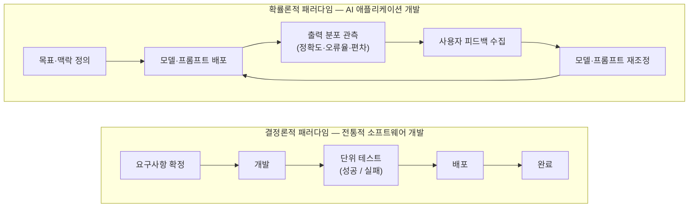
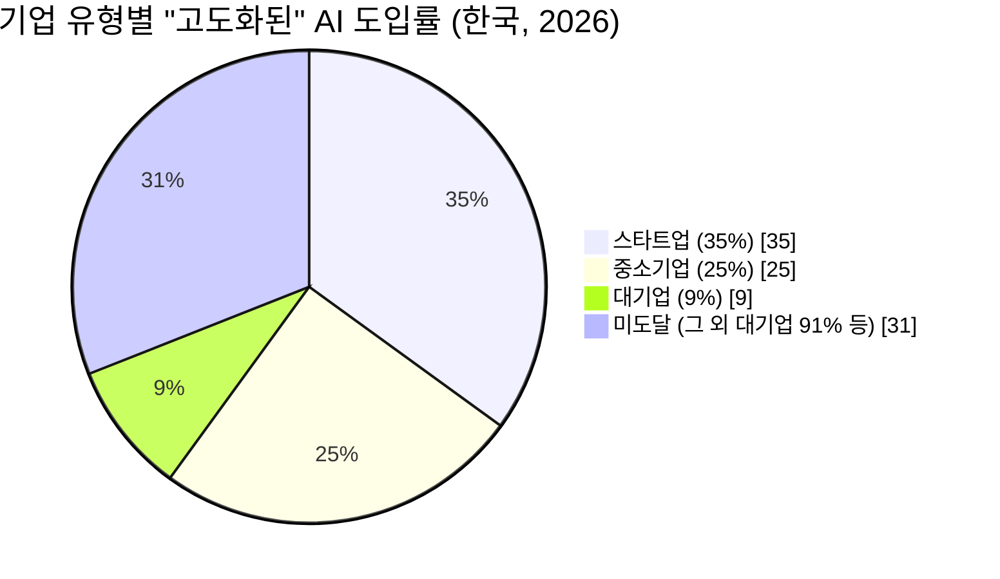

---

## 0. 이 문서에 대하여

이 문서는 페이스북에 올라온 짧은 글 하나를 출발점으로 삼는다. 원 게시자는 "김성완"이라는 이름으로 되어 있고, 그 아래에 공유자 본인이 자신의 생각을 덧붙인 형태다. 원문 URL(`https://www.facebook.com/share/p/1BC3dxHpqp/`)에 직접 접근을 시도했으나, 페이스북은 자동화된 접근을 차단하고 있어 본문 전체를 다시 확인할 수는 없었다. 따라서 이 문서는 이미 전달받은 게시물 본문 텍스트와 댓글 텍스트를 근거로 그 내용을 분석·해설하는 방식으로 작성했다. 원 게시자의 신원이나 직함을 별도로 검증할 수 있는 공개 자료는 찾지 못했으므로, 이 문서에서는 그의 배경에 대해 어떠한 추정도 하지 않고 글의 내용 자체에만 집중한다.

글의 구조는 두 겹이다. 첫째 겹은 "AI를 제대로 다루려면 사고의 틀을 결정론적 패러다임에서 확률론적 패러다임으로 확장해야 한다"는 원 게시자의 주장이고, 둘째 겹은 그 주장에 공감하면서 "AX(AI Transformation, AI 전환)를 하려는 대기업 임원들이 결정론적 패러다임을 버리지 않는 한, 대기업 AX는 제대로 시작도 못 해볼 것"이라고 덧붙인 공유자의 코멘트다. 이 문서는 이 두 겹을 각각 풀어서 설명하고, 그 주장이 실제 데이터로도 뒷받침되는지를 국내외 최신 조사 자료를 통해 검증한다.

---

## 1. 원 게시물이 말하고자 하는 것

원 게시물의 핵심 문장을 필자 나름대로 풀어보면 다음과 같다. 지금 시대에 AI를 제대로 다루려면 생각하는 틀 자체를 바꿔야 하는데, 그 방향은 "결정론적 패러다임"에서 "확률론적 패러다임"으로의 확장이다. 모든 입력에 대해 하나의 정해진 출력이 나와야 안심할 수 있는 고전적인 프로그래밍 사고방식으로는, AI가 열어주는 세계의 극히 일부만 마주할 수 있을 뿐이라는 것이다.

여기서 "결정론적(deterministic)"과 "확률론적(probabilistic)"이라는 단어는 원래 물리학이나 통계학에서 쓰이던 개념이지만, 소프트웨어 개발의 맥락으로 옮겨오면 꽤 구체적인 의미를 갖는다. 이 두 단어의 차이를 정확히 이해하는 것이 이 게시물 전체를, 그리고 뒤이어 나오는 "대기업 AX가 왜 막히는가"라는 질문을 이해하는 열쇠가 된다.

---

## 2. 결정론적 패러다임이란 무엇인가

전통적인 소프트웨어는 "특정 입력 A를 주면 반드시 특정 출력 B가 나와야 한다"는 전제 위에서 만들어져 왔다. 덧셈 함수에 2와 3을 넣으면 언제나 5가 나와야 하고, 로그인 함수에 올바른 아이디와 비밀번호를 넣으면 언제나 로그인에 성공해야 한다. 이 전제가 무너지면 그것은 버그다. 그래서 개발자들은 수십 년 동안 "같은 입력에는 같은 출력"이라는 원칙을 지키기 위해 단위 테스트(unit test)를 짜고, 예외 처리를 하고, 회귀 테스트(regression test)를 돌려왔다.

이런 사고방식 안에서 일하는 사람에게 세상은 명확하게 둘로 나뉜다. 맞았거나(정답) 틀렸거나(오답), 성공했거나 실패했거나, 참이거나 거짓이거나. 요구사항 정의서를 정확히 작성하고, 그 요구사항을 그대로 코드로 옮기고, 코드가 요구사항과 한 치의 어긋남 없이 동작하는지를 확인하는 것이 일의 전부였다. 이 방식은 지난 반세기 동안 은행 시스템, 항공 예약 시스템, 제조업 자동화 설비 등 "절대 틀리면 안 되는" 영역에서 압도적으로 성공적이었다. 원 게시물이 말한 "모든 입력과 출력이 확정되어야 안도하는 고전적 프로그래밍 마인드"란 바로 이런 세계관을 가리킨다.

문제는 이 세계관이 대규모 언어모델(LLM)을 만났을 때 발생한다. LLM은 애초에 "정답을 계산해내는 함수"가 아니라 "다음에 올 가능성이 가장 높은 단어(토큰)들의 확률 분포를 추정하고 그중 하나를 뽑아내는 통계적 기계"에 가깝다. 이 근본적인 작동 방식의 차이 때문에, 결정론적 사고방식을 그대로 AI에 적용하려는 시도는 반드시 어딘가에서 어긋나게 된다.

---

## 3. 확률론적 패러다임이란 무엇인가

한국의 한 스타트업 인사이트 칼럼(브라이언 장동욱, 2025년 1월)은 이 전환을 특히 명료하게 설명한다. 이 글에 따르면 학습된 모델, 특히 LLM을 다룰 때는 입력 A를 주었을 때 항상 동일한 B가 나오지 않는다. 같거나 유사한 입력을 넣어도 맥락에 따라 다른 문장이 생성될 수 있고, 때로는 의도하지 않은 환각(hallucination) 현상까지 발생한다. 그래서 이런 비결정성이 내재된 모델을 다룰 때는 "딱 하나의 정답 여부"로 판단하기보다, 원하는 답변에 얼마나 가까운 출력을 얼마나 안정적으로 뽑아내는지, 즉 확률적 성능을 관찰하고 개선해나가는 접근이 필요해진다.

이 관점을 실무 프로세스로 옮기면 몇 가지 구체적인 변화가 따라온다.

첫째, "요구사항 정의 → 개발 → 테스트 → 배포"라는 과거의 선형적 과정은 더 이상 충분하지 않다. AI 애플리케이션 개발은 모델이나 프롬프트를 배포하고, 실제 사용자의 입력·행동 데이터를 모니터링하며 성능을 측정하고, 피드백과 추가 데이터를 반영해 모델이나 프롬프트를 조정하고, 다시 배포하는 과정을 끊임없이 반복하는 순환적 구조를 가진다.

둘째, 평가 시스템(evaluation system)이 필수가 된다. AI 모델은 "작동하는가, 하지 않는가"만으로 판단할 수 없다. 다양한 입력과 시나리오에서 어떤 결과가 나왔는지, 그 결과가 얼마나 타당했는지를 정확도·정밀도·재현율 같은 정량 지표와 사용자 설문 같은 정성 평가로 함께 측정해야 한다.

셋째, 결과의 "편차"를 관리하는 일이 중요해진다. 예를 들어 어떤 모델이 70%의 확률로 좋은 답변을 주지만 30%의 확률로는 심각하게 틀린 정보를 준다고 할 때, 이 30%가 발생하는 상황을 어떻게 줄이고 대비할 것인지가 핵심 과제가 된다. "최소 정답률", "오류율 허용 범위" 같은 기준을 명확히 세우고 지속적으로 모니터링해야 한다는 것이다.

이 세 가지, 즉 평가 체계 구축, 사용자 중심 피드백 루프, 결과 편차 관리는 과거에는 우버의 배차 알고리즘이나 아마존의 추천 랭킹처럼 일부 ML 엔지니어 집단만 다루던 전문 영역이었다. 그런데 생성형 AI 시대에는 AI 모델의 출력이 곧 제품 자체이자 사용자 경험 전부가 되기 때문에, 이 확률론적 사고방식이 개발팀 전체, 나아가 조직 전체에 요구되는 기본 소양이 되어버렸다.

---

## 4. 두 패러다임의 실무적 차이

두 사고방식의 차이를 표로 정리하면 다음과 같다.

| 구분 | 결정론적 패러다임 | 확률론적 패러다임 |
|---|---|---|
| 기본 전제 | 같은 입력 → 같은 출력 | 같은 입력 → 분포를 이루는 여러 출력 |
| 성공의 기준 | 요구사항과 완전히 일치(맞다/틀리다) | 목표에 충분히 가까운 결과를 안정적으로 재현(정도의 문제) |
| 검증 방법 | 단위 테스트, 회귀 테스트 | 평가 지표(정확도·정밀도 등)와 정성 평가의 병행, 지속적 관측 |
| 개발 프로세스 | 요구사항 → 개발 → 테스트 → 배포(선형적) | 배포 → 관측 → 피드백 → 재조정 → 재배포(순환적) |
| 실패를 다루는 방식 | 버그 수정으로 재발 방지 | 오류율·편차를 통계적으로 관리, 완전한 제거보다 허용 범위 설정 |
| 조직에 필요한 태도 | 명확한 명세와 통제 | 불확실성에 대한 내성, 지속적 실험과 학습 |

아래는 이 차이를 흐름으로 표현한 그림이다.

이 그림에서 알 수 있듯, 결정론적 패러다임은 "끝"이 있는 직선형 과정이지만 확률론적 패러다임은 애초에 "끝"이 정의되지 않은 순환형 과정이다. 결정론적 사고에 익숙한 사람에게는 이 순환 구조 자체가 불안하게 느껴진다. "언제 완성되는가"라는 질문에 명확히 답할 수 없기 때문이다. 바로 이 지점이, 원 게시물이 지적한 "모든 입력과 출력이 확정되어야 안도하는" 마인드와 AI가 요구하는 사고방식 사이의 근본적인 충돌 지점이다.

---

## 5. 왜 이 전환이 특히 대기업 임원들에게 어려운가

공유자가 덧붙인 코멘트는 이 충돌을 조직의 문제로 확장한다. "AX 하고자 하는 IT 대기업 임원들이 결정론적 패러다임을 버리지 않고 사수하는 한, 반드시 대기업 AX는 제대로 된 시작도 못 해볼 것"이라는 주장이다. 이 주장이 왜 설득력을 갖는지, 그리고 실제로 그런지를 몇 가지 각도에서 짚어볼 필요가 있다.

대기업 임원이라는 자리는 구조적으로 결정론적 사고에 최적화되어 있다. 분기별 매출 목표, KPI 달성률, 투자 대비 수익률(ROI) 같은 지표들은 모두 "얼마를 투입하면 얼마가 나온다"는 예측 가능성을 전제로 설계된 관리 체계다. 이사회에 보고할 때, 감사를 받을 때, 예산을 승인받을 때 임원은 "확실한 숫자"를 제시해야 하는 위치에 놓인다. 반면 확률론적 패러다임은 본질적으로 "이번 분기에 이 AI 프로젝트가 정확히 얼마의 가치를 낼지는 배포하고 관측해봐야 안다"는 불확실성을 껴안으라고 요구한다. 이 둘 사이의 긴장은 개인의 의지 문제라기보다, 대기업이라는 조직의 통제·보고 체계 자체가 만들어내는 구조적 긴장에 가깝다.

여기에 더해 대기업 특유의 조직 관성이 작용한다. 새로운 제품이나 프로젝트 하나를 시작하려면 개발팀, 운영팀, 영업팀, 법무·컴플라이언스 검토까지 여러 부서가 동원되어야 하고, 그 과정에서 "예측 가능한 계획서"와 "명확한 책임 소재"가 요구된다. 확률적으로 성과가 오르내리는 AI 프로젝트는 이런 전통적인 품의·결재 체계 안에서 설 자리를 찾기 어렵다. 결국 많은 대기업에서 AI 프로젝트는 "실패하면 안 되는 프로젝트"로 취급되고, 그 결과 실패 가능성을 원천적으로 줄이려는 방향으로, 즉 확률론적 실험보다는 결정론적으로 통제 가능한 좁은 범위의 파일럿으로 축소되는 경향을 보인다.

---

## 6. 데이터로 보는 현실 — 글로벌

이 주장이 감정적 비판에 그치지 않고 실제 데이터로도 뒷받침되는지 확인하기 위해 2025~2026년의 주요 조사 결과를 살펴본다.

### 6.1 MIT NANDA의 "95% 실패" 보고서와 그에 대한 반론

2025년 7월, MIT 미디어랩에서 시작된 NANDA(Networked Agents and Decentralized AI) 프로젝트가 "The GenAI Divide: State of AI in Business 2025"라는 예비 보고서를 발표했다. 이 보고서는 2025년 상반기 동안 진행된 조사를 바탕으로, 기업들의 생성형 AI 이니셔티브 가운데 95%가 측정 가능한 수익을 전혀 만들어내지 못하고 있으며, 나머지 5%의 통합된 파일럿만이 수백만 달러 규모의 가치를 창출하고 있다고 밝혔다. 조사 대상 기업들의 생성형 AI 투자 규모는 300억~400억 달러로 추산되었다. 흥미로운 점은 보고서가 실패의 원인을 모델 성능이나 규제가 아니라 구현 방식에서 찾았다는 것이다. 취약한 워크플로우, 맥락을 학습하고 유지하는 능력의 부족, 일상 업무와의 낮은 정합성이 주요 원인으로 지목되었다. 외부에서 구매한 AI 도구와 파트너십을 활용한 경우 약 67%의 성공률을 보인 반면, 내부적으로 직접 구축한 경우 성공률이 그 3분의 1 수준에 그쳤다는 대목도 눈에 띈다.

다만 이 95%라는 숫자가 유통되는 방식에 대해서는 비판적으로 볼 지점이 있다. 보도 매체마다 인용하는 조사 방법론의 수치가 조금씩 다르다. 일부 매체는 "150명의 리더 인터뷰, 350명 직원 대상 설문, 300개의 공개된 AI 도입 사례 분석"이라고 전하는 반면, 다른 매체는 "52개 조직 인터뷰, 153명의 고위 리더 설문"이라고 전한다. 또한 NANDA는 MIT에서 출발한 프로젝트이지만 MIT가 공식적으로 관리·검증하는 학술 보고서는 아니며, 보고서 원문에 접근하는 절차 자체가 까다로웠다는 지적도 있었다. 와튼스쿨의 한 교수는 이 보고서를 세 번이나 읽었지만 "95%"라는 표현을 정확히 그 숫자 그대로 찾지 못했다고 언급하며, 이 통계가 원 보고서의 뉘앙스를 벗어나 지나치게 단순화된 채 기업 영업 자료나 이사회 보고서에 반복 인용되고 있다고 지적했다. 이런 정황을 종합하면, "AI 프로젝트 대부분이 뚜렷한 성과를 내지 못하고 있다"는 방향성 자체는 이후 다른 독립적인 조사들(아래 6.2 참고)로도 반복 확인되는 신뢰할 만한 경향이지만, "95%"라는 특정 숫자 하나에 지나치게 의존해 인용하는 것은 신중할 필요가 있다.

### 6.2 BCG의 교차 검증 — "5%만 실질적 가치, 60%는 무성과"

보스턴컨설팅그룹(BCG)이 2025년 말 발표한 별도의 연구에서도 상당히 유사한 그림이 나타난다. 이 연구에 따르면 AI로부터 실질적인 가치를 얻고 있는 기업은 전체의 5%에 불과했고, 60%는 눈에 띄는 가치를 전혀 얻지 못하고 있다고 응답했다. BCG는 AI 주도 변화가 실패하는 원인을 기술이 아니라 사람에게서 찾는다. 목표에 대한 이해 부족, 특정 직원군의 낮은 동의와 참여, 저조한 채택률, 설득력 없는 스토리텔링 같은 인간적 요인들이 실패의 실질적 원인이라는 것이다. 반대로 성공하는 조직은 리더가 모든 의사결정의 중심에 사람을 두고, 구성원의 감정과 사고, 행동에 대한 깊은 이해를 바탕으로 변화를 이끈다고 분석했다. 특히 BCG는 성공적인 기업일수록 평균 3~4개의 핵심 사용 사례에 집중하는 반면, 성과가 낮은 조직은 평균 6~7개의 사용 사례를 동시에 벌여놓는다는 대비되는 수치를 제시했는데, 이는 "선택과 집중"이 사라진 자리에 "모든 곳에 AI를"이라는 구호만 남을 때 나타나는 전형적인 실패 패턴을 보여준다.

한편 2026년 1월 발표된 BCG의 "2026 AI 레이더" 보고서는 조금 다른 결을 보여준다. 이 조사는 16개국, 10개 산업, 2,360명의 임원을 대상으로 진행되었는데, CEO의 72%가 스스로를 AI의 핵심 의사결정자로 인식하고 있었고, 기업들은 올해 AI 투자 규모를 전년 대비 두 배로 늘릴 계획이며, 단기 성과가 나지 않더라도 AI 투자를 지속하겠다는 응답이 94%에 달했다. AI 전환을 선도하는 CEO들은 개인적인 AI 역량 강화를 위해 주당 8시간 이상을 투자하고 있는 것으로 나타났다. 이 조사는 "투자 의지"라는 측면에서는 낙관적인 그림을 보여주지만, 그 투자 의지가 앞서 언급한 "5%만 실질적 가치" 같은 실행 성과로 이어지고 있는지는 별개의 문제로 남는다. 투자를 늘리겠다는 결심과, 그 투자가 실제로 조직의 일하는 방식을 바꾸는 성과로 전환되는 것 사이에는 여전히 큰 간극이 존재하는 셈이다.

### 6.3 Gartner — "에이전틱 AI 프로젝트의 40% 이상이 2027년까지 취소될 것"

2025년 6월, 글로벌 리서치 기업 가트너(Gartner)는 비용 급증, 불분명한 비즈니스 가치, 부실한 리스크 관리 등을 이유로 2027년 말까지 에이전틱 AI(agentic AI) 프로젝트의 40% 이상이 취소될 것이라고 전망했다. 가트너의 애널리스트 애너슈리 버마는 "현재 대부분의 에이전틱 AI 프로젝트는 과대광고에 이끌린 초기 단계의 실험이나 개념 증명(PoC)에 불과하다"며, 이것이 조직으로 하여금 AI 에이전트를 실제 규모로 배포할 때 필요한 진짜 비용과 복잡성을 보지 못하게 만들어 프로젝트가 실제 운영 단계로 넘어가지 못하고 멈춰 서게 만든다고 설명했다. 2025년 1월 3,412명의 웨비나 참석자를 대상으로 한 가트너의 설문에서는 응답자의 19%만이 에이전틱 AI에 유의미한 투자를 했다고 답했고, 42%는 보수적인 투자에 그쳤으며, 31%는 관망하거나 계획이 불확실하다고 답했다. 가트너는 또한 수많은 벤더들이 기존의 AI 어시스턴트나 RPA(로보틱 프로세스 자동화), 챗봇 제품을 실질적인 자율성 없이 "에이전틱 AI"라는 이름으로 재포장하는 이른바 "에이전트 워싱(agent washing)" 현상을 경고했는데, 수천 개에 이르는 자칭 에이전틱 AI 벤더 가운데 실제로 진짜 에이전틱 기능을 제공하는 곳은 약 130개 정도에 불과하다고 추정했다.

---

## 7. 데이터로 보는 현실 — 한국

글로벌 조사만으로는 원 게시물과 댓글이 겨냥하는 "한국 대기업"이라는 구체적 대상을 충분히 설명하기 어렵다. 그래서 국내 조사 자료를 별도로 확인했다.

### 7.1 대한상공회의소 조사 — 대기업 절반이 여전히 AI를 경영에 쓰지 않는다

대한상공회의소 지속성장이니셔티브(SGI)가 국내 제조기업 504곳을 대상으로 실시해 2026년 초 공개한 "K-성장 시리즈 기업의 AI 전환 실태와 개선방안" 보고서에 따르면, 응답 기업의 82.3%가 여전히 AI를 경영에 활용하지 않고 있다고 답했다. 기업 규모별로 보면 대기업의 AI 활용률은 49.2%였고 중소기업은 4.2%에 그쳐, 규모가 클수록 활용률이 높기는 하지만 대기업조차 절반가량은 AI를 경영에 활용하지 못하고 있다는 뜻이다. AI 도입에 소극적인 이유로는 투자 비용 부담(73.6%가 부담스럽다고 응답)과 전문인력 부족(80.7%가 전문인력이 없다고 응답)이 꼽혔다.

### 7.2 itworld.co.kr 조사 — "경영진의 전략적 의지"가 가장 필요한 요소로 꼽히다

국내 기업 대상의 또 다른 조사에서는 생성형 AI 도입의 가장 큰 장애 요인으로 기술 인력 및 기술력 부족(49.8%)이 1위로 꼽혔고, 이어 적절한 인프라와 데이터 확보의 어려움(32.0%), 경영진의 지원 및 투자 부족(21.0%)이 뒤를 이었다. 그런데 흥미로운 것은 반대 질문, 즉 "생성형 AI를 성공적으로 확산시키기 위해 가장 필요한 요소는 무엇인가"에 대한 응답이다. 여기서는 경영진의 전략적 의지와 리더십이 41.1%로 가장 높은 응답률을 기록했다. 즉 장애 요인으로는 "경영진 지원 부족"이 상대적으로 낮은 순위(3위)로 나타났지만, 성공을 좌우하는 요인을 물었을 때는 압도적으로 "경영진의 의지"가 1순위로 꼽힌 것이다. 이는 현재의 문제를 인력이나 인프라 같은 실무적 자원 부족으로 체감하고 있더라도, 그 근본 해법은 결국 경영진의 태도 변화에 있다고 현장이 인식하고 있음을 시사한다.

### 7.3 대기업의 역설 — 규모가 클수록 "고도화된" AI 활용은 오히려 뒤처진다

2026년 9월 11일, AWS코리아는 글로벌 자문사 스트랜드 파트너스(Strand Partners)가 작성한 "Unlocking South Korea's AI Potential 2026" 보고서를 인용해 기자간담회를 열었다. 이 보고서는 원 게시물의 주장을 가장 구체적인 숫자로 뒷받침하는 자료라고 할 수 있다. 보고서에 따르면 기업 유형별 "고도화된" AI 도입률은 스타트업이 35%, 중소기업이 25%인 데 반해, 대기업은 겨우 9%에 그쳤다. 즉 자원과 인력, 자본을 가장 풍부하게 가진 대기업이 오히려 AI를 실질적으로 "고도화된" 수준까지 활용하는 데는 가장 뒤처져 있다는, 직관에 반하는 결과가 나온 것이다.

이 보고서를 발표한 스트랜드 파트너스의 닉 본스토우 디렉터는 이 결과를 보고서의 핵심 발견 중 하나로 꼽으면서, 대기업이 이 격차를 극복하려면 최고경영자를 비롯한 경영진이 AI를 우선순위에 두고 명확한 전략과 비전을 제시해야 하며, 데이터 기반에 투자하고 직원들이 AI와 협업할 수 있도록 준비시켜야 한다고 조언했다. 보고서는 또한 차세대(에이전틱) AI에 대비되어 있다고 응답한 한국 기업이 전체의 24%에 불과하다는 점, 공식적인 AI 전략을 보유한 기업이 27%에 그친다는 점, 그리고 AI 투자수익률(ROI)을 신뢰성 있게 측정할 방법이 없다고 답한 기업이 47%에 달한다는 점도 함께 지적했다. ROI를 정확히 측정할 수 있다고 자신한 기업은 33%, 일관된 성과 측정 체계를 갖춘 기업은 24%에 불과했다.

같은 행사에서 발표된 AWS와 하버드 비즈니스 리뷰(HBR)의 별도 조사(의사결정자 623명 대상)도 비슷한 간극을 보여준다. 응답자의 84%가 에이전틱 AI가 자신의 회사를 바꿀 것이라고 믿었지만, 실제로 이를 효과적으로 활용하고 있다고 답한 조직은 26%에 불과했다. 발표를 맡은 AWS의 오순영 수석 솔루션즈 아키텍트는 "에이전트 수가 아니라 처리 시간, 오류율, 전환율 같은 경제성을 증명해야 하는 시기가 됐다"고 언급하며, 기업들이 여전히 기존 생성형 AI를 도입하던 방식, 즉 결과물 하나하나를 확인하고 승인하는 결정론적 검수 방식에 머물러 있는 경우가 많다고 지적했다.

한편 국내 IT 전문지 CIO코리아가 실시한 "2026 IT 전망 조사"에서는 전사적으로 또는 일부 부서를 중심으로 생성형 AI를 활용하고 있다는 응답이 53.9%로 절반을 넘었고, 여기에 구현 중이거나 파일럿 단계라는 응답(15.8%)을 합치면 전체 응답 기업의 약 70%가 생성형 AI에 투자하고 있는 것으로 나타났다. 이 조사에서는 응답 기업의 약 30%가 "고도화 진입" 단계에 있다고 분류되었는데, 이는 앞서 언급한 스트랜드 파트너스 조사에서 대기업만 따로 떼어 집계한 9%라는 수치와는 차이가 크다. 두 조사는 표본 구성과 "고도화"의 정의가 서로 다르기 때문에(CIO코리아 조사는 기업 규모를 섞은 전체 응답자 기반이며 IT 예산을 늘린 기업이 상대적으로 많이 포함되어 있을 가능성이 있다) 직접 비교하기는 어렵지만, "생성형 AI를 쓰고는 있으나 그것이 실제 경쟁력으로 이어지는 심화 단계까지 가지는 못했다"는 공통된 그림을 보여준다는 점에서는 일치한다.

마지막으로 2025년 11월 보도에서는 지난 10년간 누적 AI 투자액 기준으로 한국이 세계 9위에 올라 있음에도 정작 AI 인재들이 해외로 빠져나가고 있다는 지적이 있었고, AI 전환이 성과를 가져다줄 것으로 기대하는지를 묻는 질문에 응답 기업의 60.6%가 "효과가 미미할 것"이라고 답했다(이 조사는 제조업 중심 응답 기업을 대상으로 한 것으로, 투자 대비 효과에 대한 회의감이 큰 산업적 특성이 반영되어 있을 수 있다는 점은 감안할 필요가 있다). 이 기사는 OECD가 G7 국가 및 브라질 기업을 대상으로 실시한 별도 설문에서도 "투자수익률 추정의 어려움"이 AI 도입·활용을 저해하는 요인으로 지목되었다고 함께 전하고 있어, 이런 회의감이 한국만의 특수한 현상이 아니라 여러 나라에서 공통적으로 관찰되는 경향임을 시사한다.

---

## 8. 데이터를 종합하면 — 공유자의 주장은 근거가 있는가

이제 원 게시물과 그에 대한 공유자의 코멘트로 돌아가 보자. "AX 하고자 하는 IT 대기업 임원들이 결정론적 패러다임을 버리지 않고 사수하는 한, 대기업 AX는 제대로 된 시작도 못 해볼 것"이라는 주장은, 위에서 살펴본 여러 독립적인 조사 결과들과 상당히 정합적으로 맞아떨어진다.

첫째, 자원과 자본이 가장 풍부한 대기업이 오히려 "고도화된" AI 활용에서는 스타트업이나 중소기업보다 뒤처진다는 사실(대기업 9% vs. 스타트업 35%, 스트랜드 파트너스·AWS코리아, 2026년 9월)은 이 문제가 단순히 돈이나 인력의 문제가 아니라는 것을 강하게 시사한다. 돈과 인력만이 문제였다면 대기업이 가장 앞서 나가야 정상이다.

둘째, "성공에 가장 필요한 요소가 무엇이냐"는 질문에 대한 국내 조사 응답에서 압도적 1위가 경영진의 전략적 의지와 리더십(41.1%)이었다는 점, 그리고 BCG의 글로벌 조사에서도 AI 주도 변화의 성패가 기술이 아니라 리더가 사람과 불확실성을 다루는 방식에 달려 있다고 결론 내린 점은, 조직의 최상단에 있는 의사결정자의 사고방식이 실제로 병목 지점이라는 것을 가리킨다.

셋째, ROI를 신뢰성 있게 측정할 방법이 없다고 답한 기업이 47%에 달하고, 공식적인 AI 전략을 가진 기업이 27%에 불과하다는 결과는, 대기업들이 여전히 "명확한 숫자로 확정된 성과"를 전제로 하는 결정론적 평가 틀 안에서 AI를 평가하려다가, 그 틀 자체가 AI의 확률적 특성과 맞지 않아 좌초하고 있는 모습을 보여준다. 가트너가 지적한 "40% 이상의 에이전틱 AI 프로젝트가 2027년까지 취소될 것"이라는 전망 역시, 근본 원인으로 "비용과 복잡성을 제대로 보지 못하게 만드는" 과대광고와 성급한 도입, 그리고 이를 뒷받침할 전략과 리스크 관리 체계의 부재를 꼽고 있어 같은 맥락에 있다.

다만 이 주장을 전적으로 받아들이기 전에 짚어야 할 반론도 있다. BCG의 "2026 AI 레이더" 조사가 보여주듯, 적어도 투자 의지의 측면에서는 전 세계 CEO의 상당수가 이미 AI를 최우선 경영 과제로 받아들이고 있으며 단기 성과가 없어도 투자를 지속하겠다는 응답이 94%에 달했다. 이는 "임원들이 결정론적 패러다임을 완고하게 사수하고 있다"는 명제를 다소 단순화된 진단으로 만들 여지가 있다. 실제로는 투자 의지 자체는 있으나, 그 의지를 확률론적 사고에 맞는 조직 구조와 평가 체계로 전환하는 실행력이 따라가지 못하는 것에 더 가깝다고 보는 편이 데이터에 더 부합한다. 즉 "의지의 부재"라기보다는 "전환의 실패"에 가깝다는 뜻이다. 이런 뉘앙스의 차이는 있지만, 결국 그 실행력 부재의 근저에 결정론적 관리 관행(명확한 ROI, 고정된 KPI, 실패를 허용하지 않는 품의 체계)이 자리 잡고 있다는 점에서, 원 게시물과 공유자의 문제의식이 가리키는 방향 자체는 최신 데이터로도 상당히 지지된다고 볼 수 있다.

---

## 9. 그렇다면 무엇을 바꿔야 하는가

여러 조사에서 공통적으로 제시하는 실행 방향을 정리하면 다음과 같다.

BCG는 성공적인 AI 변화를 이끄는 조직의 공통점으로, 리더들 사이의 진짜 합의(막연히 모두가 동의하는 척하는 "거짓 정합"이 아니라, AI가 정확히 어디에 쓰여야 하는지에 대한 구체적 합의)를 이루고, 모든 곳에 AI를 적용하려 하기보다 경제성이 근본적으로 바뀌는 소수의 핵심 업무 흐름(평균 3~4개)에 집중하며, 일선 관리자에게 실행 권한을 부여하고, 역할별로 맞춤화된 지속적 학습을 통해 역량 격차를 해소하는 것을 꼽았다.

AWS코리아가 소개한 스트랜드 파트너스의 제언도 비슷한 방향을 가리킨다. 최고경영자를 비롯한 경영진이 AI를 우선순위로 삼아 명확한 전략과 비전을 제시하는 것, 데이터 기반에 투자하는 것, 그리고 직원들에게 AI와 협업하는 데 필요한 역량—특히 비판적 사고, 판단력, 적응력 같은, AI가 대신할 수 없는 역량—을 함께 길러주는 것이다. 이 보고서 응답 기업의 78%가 향후 3년간 AI 관련 역량 수요가 늘어날 것으로 예상했고, 76%는 지속적인 교육과 재교육이 경쟁력에 필수적이라고 답했다.

에이전틱 AI로 넘어가는 국면에서는 평가의 단위 자체를 바꿔야 한다는 지적도 나온다. AWS의 오순영 수석은 에이전트를 얼마나 많이 도입했는지가 아니라, 처리 시간이 얼마나 빨라졌는지, 오류율이 얼마나 줄었는지, 전환율이 얼마나 개선됐는지 같은 실제 경제적 성과로 평가를 옮겨가야 한다고 강조했다. 또한 비용을 계산할 때도 추론 비용만이 아니라 데이터·API 사용료, 실패와 재시도, 사람의 검수, 보안과 감사에 드는 비용까지 총원가 관점에서 함께 봐야 한다고 조언했다. 이는 결국 "명확한 하나의 답"을 요구하는 결정론적 평가 틀을 버리고, 확률적으로 분포하는 성과와 비용을 있는 그대로 받아들여 관리하는 쪽으로 조직의 평가 체계 자체를 옮겨야 한다는 이야기와 같다.

아래 그림은 지금까지 살펴본 한국 대기업의 AI 도입 현황을 기업 규모별로 정리한 것이다.

*(참고: 위 파이 차트는 스트랜드 파트너스·AWS코리아 조사에서 발표된 "고도화 도입률" 수치를 있는 그대로 나열한 것으로, 네 조각의 합이 전체 표본 구성비를 의미하지는 않는다. 각 수치는 해당 기업군 내에서 고도화 단계에 도달한 비율을 뜻한다.)*

---

## 10. 결론

정리하면, 원 게시물이 던진 "결정론적 패러다임에서 확률론적 패러다임으로 사고의 틀을 확장해야 한다"는 메시지는 단순한 철학적 수사가 아니라, LLM이라는 기술의 작동 원리 자체에서 비롯되는 실무적 요구다. 입력과 출력이 일대일로 고정되지 않는 도구를 다루면서 여전히 "하나의 정답"만을 기대한다면, 환각이나 편차를 실패로만 인식하게 되고, 그 결과 AI가 실제로 잘할 수 있는 일의 범위조차 제대로 탐색하지 못하게 된다.

그리고 이 사고 전환이 특히 대기업에서 어려운 이유는 개인의 완고함 때문이라기보다, 명확한 숫자와 확정된 책임 소재를 요구하는 대기업 특유의 관리·보고 체계 자체가 확률론적 사고와 구조적으로 충돌하기 때문이다. 2026년 9월 현재 한국 대기업의 "고도화된" AI 활용률이 스타트업의 4분의 1 수준인 9%에 그치고, 공식 AI 전략을 가진 기업이 27%, ROI를 신뢰성 있게 측정하는 기업이 33%에 불과하다는 최신 조사 결과는, 이 구조적 충돌이 실제로 대기업의 발목을 잡고 있다는 것을 상당히 구체적인 숫자로 보여준다. 동시에 여러 조사가 한목소리로 "경영진의 전략적 의지와 리더십"을 성공의 가장 중요한 조건으로 꼽고 있다는 사실은, 이 문제의 해법 역시 기술이 아니라 결국 조직 최상단의 사고방식 전환에 달려 있다는 원 게시물과 공유자의 문제의식을 뒷받침한다.

---

## 부록 A. 한국어-영어 용어 대조표

| 한국어 | 영어 | 간단한 의미 |
|---|---|---|
| 결정론적 패러다임 | Deterministic Paradigm | 같은 입력에는 항상 같은 출력이 나온다는 전제 |
| 확률론적 패러다임 | Probabilistic Paradigm | 같은 입력에도 확률적으로 다른 출력이 나올 수 있다는 전제 |
| 대규모 언어모델 | Large Language Model (LLM) | 방대한 텍스트로 학습되어 다음 단어의 확률을 예측하는 AI 모델 |
| 환각 | Hallucination | AI가 사실이 아닌 내용을 그럴듯하게 생성하는 현상 |
| AI 전환 | AI Transformation (AX) | 조직의 업무 방식과 사업 구조를 AI 중심으로 재설계하는 과정 |
| 에이전틱 AI | Agentic AI | 목표를 받아 스스로 계획을 세우고 도구를 사용해 실행까지 하는 AI |
| 평가 시스템 | Evaluation System | AI 출력의 정확도·오류율 등을 정량·정성적으로 측정하는 체계 |
| 투자수익률 | Return on Investment (ROI) | 투입한 비용 대비 얻은 성과의 비율 |
| 에이전트 워싱 | Agent Washing | 기존 자동화 도구를 실질적 자율성 없이 "에이전틱 AI"로 재포장하는 현상 |

---

## 부록 B. 출처 신뢰도 4단계 분류

- **① 공식 1차 출처**: Gartner 공식 보도자료(gartner.com), BCG 공식 발간 보고서(bcg.com)
- **② 복수 매체 교차검증**: MIT NANDA 보고서 관련 내용(Fortune, letsdatascience, superdatascience 등 다수 매체가 유사한 핵심 수치를 반복 보도, 단 세부 방법론 수치는 매체 간 불일치가 있어 본문에서 별도로 명시함); Gartner 40% 전망(Gartner 공식 발표 및 crn.in, yourstory.com, outlookbusiness.com, rcrwireless.com 등 다수 매체 보도 일치)
- **③ 단일 출처(국내 개별 매체 보도)**: 대한상공회의소 SGI 조사(헤럴드경제), itworld.co.kr의 생성형 AI 도입 장벽 조사, CIO코리아의 2026 IT 전망 조사, AWS코리아·스트랜드 파트너스 조사를 다룬 CIO코리아 기사(2026.9.14), 쿠키뉴스의 AI 인재 유출·효과 회의감 보도(2025.11.18)
- **④ 분석적 종합·편집 판단**: 결정론적/확률론적 패러다임 비교표, 두 패러다임의 개발 프로세스 흐름도, 국내외 데이터를 종합해 원 게시물의 주장을 검증한 8장 및 결론부의 해석은 필자가 위 1~3단계 출처들을 근거로 구성한 분석이며, 원문에 명시적으로 존재하는 사실이 아니다.

원 게시물(김성완의 페이스북 글)과 공유자의 코멘트 자체는 개인의 의견이며, 위 신뢰도 분류 체계의 대상이 아니라 이 문서가 검증하고자 하는 "주장"으로 다뤘음을 밝힌다. 또한 원 게시자의 신원이나 전문 분야에 대해서는 신뢰할 수 있는 공개 자료로 확인하지 못했으므로 어떠한 배경 설명도 추가하지 않았다.

---

## 참고문헌

1. 김성완, 페이스북 게시물 및 공유자 코멘트, 2026년 (원문 접근 제한으로 전달받은 텍스트를 근거로 인용). https://www.facebook.com/share/p/1BC3dxHpqp/
2. Taeho(장동욱), "AI 애플리케이션 개발의 패러다임 시프트: 결정론적 개발에서 확률론적 개발로", 2025.1.26. https://briandwjang.substack.com/p/ai
3. Gartner, Inc., "Gartner Predicts Over 40% of Agentic AI Projects Will Be Canceled by End of 2027", 2025.6.25. https://www.gartner.com/en/newsroom/press-releases/2025-06-25-gartner-predicts-over-40-percent-of-agentic-ai-projects-will-be-canceled-by-end-of-2027
4. Sheryl Estrada, "MIT report: 95% of generative AI pilots at companies are failing", Fortune, 2025.8.18. https://fortune.com/2025/08/18/mit-report-95-percent-generative-ai-pilots-at-companies-failing-cfo/
5. "MIT NANDA's 2025 Report Says 95% of Organizations Saw No GenAI Return", letsdatascience.com. https://letsdatascience.com/news/mit-report-documents-genai-pilot-roi-gap-e0924d7d
6. "The MIT 95% AI Failure Rate Is Not What You Think", Medium, 2025년 하반기. https://medium.com/@shreyasihalder/the-mit-95-ai-failure-rate-is-not-what-you-think-68e8f43f242d
7. BCG, "Why AI change is actually a people change", 2026. https://www.bcg.com/publications/2026/why-ai-change-is-actually-a-people-change
8. "BCG 'AI, CEO 핵심 경영 과제…올해 투자 두 배 확대'", 이투데이, 2026.1.16. https://www.etoday.co.kr/news/view/2546245
9. "'AI 대전환' 못따라 잡는 기업들 10곳 중 8곳 '경영 활용은 아직'", 헤럴드경제, 2026.1.1. https://www.heraldk.com/article/2026010118283500362
10. "생성형 AI가 IT 전략을 바꾼다: 2026 IT 전망 조사 결과", CIO코리아. https://www.cio.com/article/4111617/
11. Jihyun Lee, "AWS코리아 '한국 대기업 AI 고도화율 9%…경영진 주도 전략·데이터·인재 정비 필요'", CIO코리아, 2026.9.14. https://www.cio.com/article/4221377/
12. "예측이 어려운 전환의 시대에 AI로 기업을 재설계할 준비가 되어 있습니까?", EY 한국, 2026. https://www.ey.com/ko_kr/the-world-of-navi/2026-new-year-economic-outlook-survey
13. 관련 기사(제목 미상, 인재 유출 및 AI 효과 회의감 관련), 쿠키뉴스, 2025.11.18. https://www.kukinews.com/article/view/kuk202511180093
14. 생성형 AI 도입 장벽 관련 국내 기업 조사 보도, ITWorld Korea. https://www.itworld.co.kr/article/4045729/

---

*이 문서는 페이스북 게시물 원문 텍스트와 2025~2026년 사이에 공개된 국내외 조사 자료를 근거로 작성되었으며, 웹 검색을 통해 확인 가능한 범위 내에서 사실관계를 교차 검증했다. 다만 MIT NANDA 보고서처럼 매체 간 세부 수치가 엇갈리는 자료는 본문과 부록 B에 그 불일치를 명시했으며, 원 게시자의 신원처럼 검증되지 않은 정보는 추정하지 않았다.*
