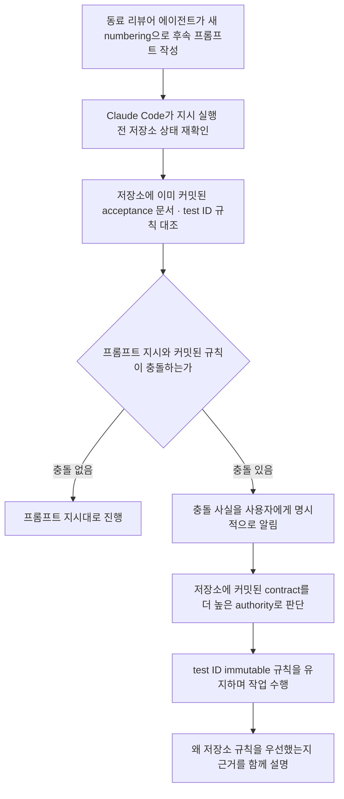
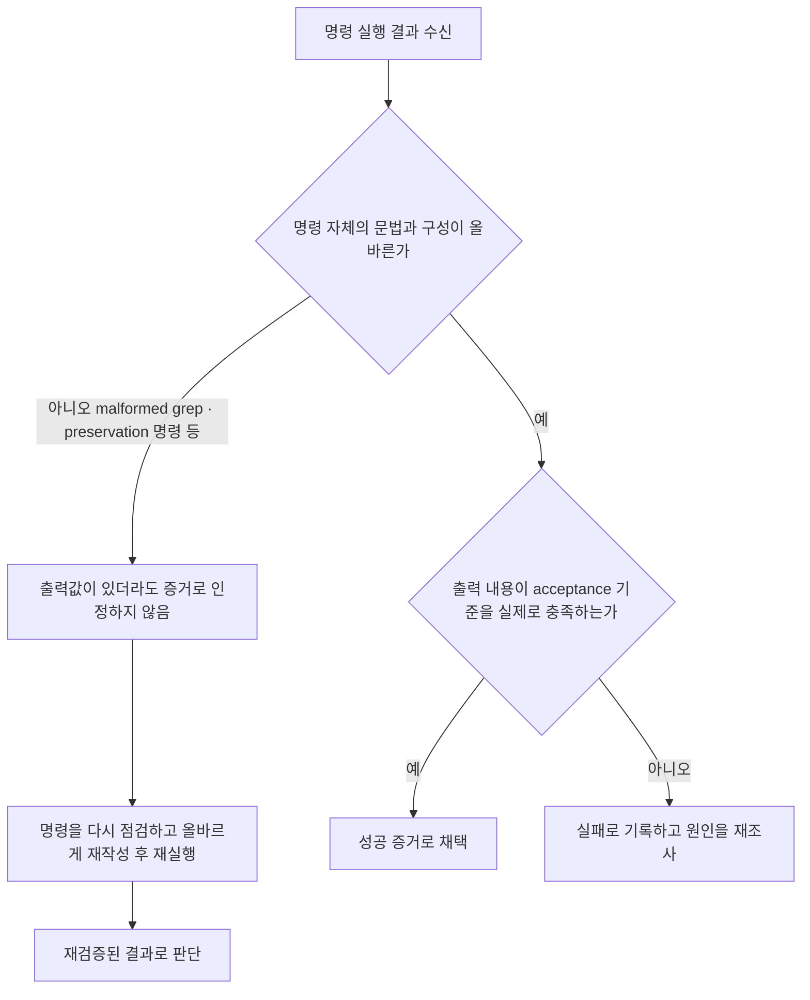
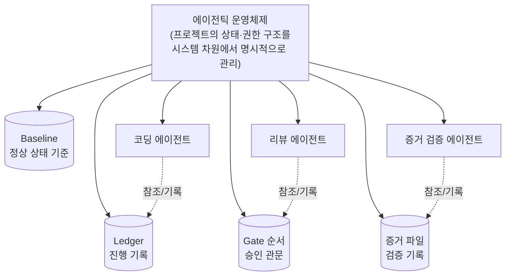

**이 문서는 사용자가 공유한 글(엔터프라이즈 프로젝트에서 Claude Opus 5.5를 하루 동안 사용해 본 후기)의 내용을 자세히 풀어 설명하고, 그 안에 나오는 사실관계를 Anthropic 공식 문서와 대조하여 정리한 것입니다. **공식적으로 확인된 사실**과 **글쓴이 개인의 관찰·경험**을 분명히 구분해서 서술했습니다.**

> 
> https://www.facebook.com/share/p/1J5gRQz6Lp/
> 
> Opus 5.5는 역대급으로 코딩을 잘한다. 단순히 코드 '생성' 능력이 좋아진 것이 아니라, 간혹 틀릴 수 있는 내 지시보다 프로젝트에서 이미 얼려둔 규칙을 우선하는 경향이 뚜렷해졌다. 프로젝트의 규칙과 권한 구조를 읽고 그 안에서 스스로 행동을 제한하는 능력은, 하루 동안 써본 바로는 Fable보다 확실히 낫다.
> 
> 내가 진행하는 프로젝트는 대부분 엔터프라이즈라 규모가 꽤 크다. 여러 단계의 구현 작업이 병렬로 이어지고, 이미 확정된 acceptance contract, test ID, ledger, gate 순서, baseline, 증거 파일 등이 서로 얽혀 있다. 이런 프로젝트에서는 코드를 빨리 만드는 것보다 더 중요한 질문들이 생긴다.
> 
> 무엇이 진짜 기준인지, 어떤 파일은 수정해도 되는지, 어떤 규칙은 이미 확정되어 더 이상 바꾸면 안 되는지, 테스트가 실패한 이유가 정말 구현 때문인지, 아니면 테스트 자체가 잘못된 것인지, 이전 단계에서 확보한 증거를 다음 단계에서도 같은 의미로 보존하고 있는지 등. 
> 
> Opus 5.5로 바꾸고 나서 특히 좋아진 점이 바로 이 부분이다. 최근 작업에서 이미 commit된 acceptance 문서에는 "test ID는 한번 발급되면 바꿀 수 없다"는 immutable 규칙이 있었는데, 내가 만든 리뷰어 에이전트가 후속 프롬프트에서 무심코 다른 numbering을 사용했다.
> 
> Claude Code는 동료 에이전트의 최신 지시를 그대로 따르지 않았다. repo 안에서 이미 확정된 artifact를 재확인한 뒤, "프롬프트의 임시 numbering보다 commit된 repository contract가 더 높은 authority를 가진다"고 판단했다.
> 
> 내가 자연어로 준 지시나 동료 에이전트의 해석이 프로젝트의 공식 규칙과 충돌하자, repo를 SSOT로 우선한 것이다.
> 
> 게다가 그 지시를 조용히 무시한 것도 아니다. 지시와 repository authority가 충돌한다는 사실을 명시적으로 드러냈고, 왜 repo의 규칙을 우선했는지 근거까지 설명했다.
특정 에이전트에 신뢰가 가는 건 단순히 "말을 잘 들을" 때가 아니다. 언제, 왜 지시와 다르게 행동했는지를 투명하게 설명할 수 있을 때다.
> 
> 증거를 다루는 방식도 매우 인상적이었다.
> 
> 테스트 과정에서 malformed grep이나 잘못 작성된 preservation command처럼 얼핏 보면 결과가 제대로 나온 것 같은 명령이 있었지만, Opus 5.5는 이를 성공 증거로 쓰지 않았다. 명령 자체가 잘못되었다면 그 결과도 증거가 될 수 없다고 판단하고 다시 확인했더라.
> 
> 이건 단순한 코딩 능력과는 결이 다르다. "무언가 출력되었다"와 "그 출력이 유효한 증거다"를 구분하는 능력에 가깝다.
> 
> Baseline을 잡는 방식도 더 정교해진 느낌이다. 보통 typecheck baseline이라고 하면 "지금 오류가 17개니까 이후에도 17개면 된다" 정도로 처리하기 쉽다. 
> 
> 그런데 Opus 5.5는 오류 개수가 아니라 diagnostic multiset, 즉 어떤 오류가 어떤 종류로 어느 위치에서 발생했는지까지를 baseline identity로 잡아냈다. 오류 하나가 사라지고 전혀 다른 오류 하나가 새로 생겨도 전체 개수는 같다. 이걸 "baseline 유지"로 착각하지 않기 위해서인 듯하다.
> 
> 수십 개의 acceptance gate와 상태가 장기간 누적되는 프로젝트에서는 코드 생성 능력만으로는 어림도 없다. 더 중요한 건 장기 상태 관리, 규칙 준수, authority 판단, 증거 보존, 그리고 잘못된 해석과 가정을 스스로 발견하고 고치는 능력이다.
> 
> 프로젝트가 커질수록 AI 코딩 에이전트는 단순한 "코드 생성기"가 아니라, 프로젝트의 세계와 규칙을 이해하며 움직이는 실행 주체에 가까워져야 한다.
> 
> 그리고 이 경험이 오래 품어온 생각을 다시 꺼내게 했다. 모델이 규칙을 잘 지키는 것에만 기대지 않고, 프로젝트의 상태와 권한 구조 자체를 시스템이 명시적으로 관리하는 에이전틱 운영체제 기반 코딩 에이전트! OS는 있으니, 앱만 구현하면 되는데, 틈날 때마다 Opus 5.5 기반 에이전트들과 함께 빌드해봐야겠다.
> 

---

## 1부. 이 글은 전체적으로 무엇에 관한 이야기인가

원문은 한 실무자가 대규모 엔터프라이즈 소프트웨어 프로젝트에서 Claude Code(Anthropic의 에이전틱 코딩 도구)를 통해 Claude Opus 5.5를 하루 정도 사용해 본 뒤 남긴 기록입니다. 핵심 주장은 다음과 같습니다.

- Opus 5.5는 단순히 "코드를 잘 생성하는 능력"이 좋아진 것이 아니라, **프로젝트 안에 이미 확정되어 있는 규칙과 권한 구조를 스스로 읽고 그 안에서 행동을 제한하는 능력**이 눈에 띄게 좋아졌다.
- 이런 능력은 수십 개의 승인 단계(acceptance gate)와 장기간 누적되는 상태(state)를 다루는 대규모 프로젝트에서 특히 중요하다.
- 글쓴이는 실제 작업 중 관찰한 세 가지 구체적인 장면 — ① 규칙 충돌 시 권위 판단, ② 증거의 유효성 자체를 검증하는 태도, ③ 베이스라인(baseline)을 오류 개수가 아니라 오류의 "정체성"으로 다루는 방식 — 을 근거로 이 주장을 뒷받침합니다.
- 마지막으로 글쓴이는 이 경험을 계기로, 모델의 규칙 준수 능력에만 의존하지 않고 프로젝트의 상태와 권한 구조 자체를 시스템 차원에서 명시적으로 관리하는 "에이전틱 운영체제(agentic OS)" 기반 코딩 에이전트라는 오래된 구상을 다시 꺼내며, 틈틈이 Opus 5.5 기반 에이전트로 이를 직접 만들어 보겠다는 계획을 밝힙니다.

아래에서는 먼저 Opus 5.5라는 모델 자체가 공식적으로 무엇인지 확인한 뒤, 원문에 등장하는 세 가지 관찰 사례를 하나씩 자세히 풀어서 설명합니다.

---

## 2부. Claude Opus 5.5는 공식적으로 무엇인가

원문이 다루는 모델의 실체를 먼저 확인해 둘 필요가 있습니다. 아래 내용은 Anthropic의 공식 플랫폼 문서(platform.claude.com)에서 확인한 사실입니다.

### 기본 사양

| 항목 | 내용 |
|---|---|
| 모델 ID | `claude-opus-5-5` |
| 공식 포지셔닝 | "장시간 실행되는 에이전틱 코딩과 지식노동을 위한 모델" |
| 출시일 | 2026년 9월 22일 |
| 컨텍스트 윈도우 | 100만 토큰 |
| 최대 출력 | 12만 8천 토큰 |
| API 가격 | 입력 100만 토큰당 4달러, 출력 100만 토큰당 20달러 (이전 모델인 Opus 5는 5달러/25달러였음) |
| 사고(thinking) 방식 | 항상 켜져 있음(적응형), 끌 수 없음 — 이전 Opus 5에서는 끌 수 있었음 |
| 기본 사고 강도(effort) | medium (Opus 5의 기본값은 high였음) |
| 신뢰 가능 지식 기준일 | 2026년 6월 |
| 제공 플랫폼 | Claude API, Amazon Bedrock, Google Cloud, Microsoft Foundry, AWS 상의 Claude Platform |

원문의 날짜와도 맞아떨어집니다. 글쓴이는 "하루 동안 써본 바로는"이라고 적었는데, Opus 5.5의 공식 출시일이 9월 22일이므로 글이 작성된 시점(9월 23일 전후)과 정확히 일치합니다.

### 모델 라인업에서의 위치

Anthropic은 현재 네 가지 계열의 모델을 운영하고 있습니다.

| 모델 | 포지셔닝 | 가격(입력/출력, 100만 토큰당) |
|---|---|---|
| Claude Fable 5.1 | 고난도 추론과 장시간 자율 에이전트 작업을 위한, 가장 상위 등급의 지능 | 10달러 / 50달러 |
| **Claude Opus 5.5** | 장시간 실행되는 에이전틱 코딩과 지식노동 | 4달러 / 20달러 |
| Claude Sonnet 5 | 속도와 지능의 최적 조합 | 2달러 / 10달러 |
| Claude Haiku 4.5 | 프론티어급에 근접한 지능을 가진 가장 빠른 모델 | 1달러 / 5달러 |

즉 원문에서 비교 대상으로 언급되는 "Fable"은 Anthropic 라인업에서 Opus보다 한 단계 위에 있는, 가장 비싸고 가장 자율성이 높은 모델(현재 세대는 Claude Fable 5.1)을 가리키는 것으로 보입니다. Opus 5.5는 Fable보다 저렴하면서도 "일상적으로 매일 쓰는" 실무용 코딩·지식노동 모델로 포지셔닝되어 있습니다.

### 공식 문서가 밝히는 Opus 5.5의 개선점 (Opus 5 대비)

Anthropic의 프롬프트 엔지니어링 가이드 문서는 Opus 5.5가 Opus 5 대비 다음과 같은 차이를 보인다고 설명합니다.

- **에이전틱 코딩과 코드 리뷰**: 실제 저장소(repository) 안에서 여러 단계에 걸친 작업, 예를 들어 하나의 변경 사항을 테스트가 통과할 때까지 끌고 가는 작업에서 가장 강점을 보입니다. Anthropic의 자체 테스트에서는 기본 강도인 medium 설정만으로도 Opus 5가 가장 높은 강도(high)로 수행한 결과와 비슷하거나 더 나은 결과를, 더 적은 단계와 더 적은 토큰으로 만들어냈다고 밝히고 있습니다.
- **장시간 자율 작업의 지속성**: 여러 시간에 걸친 감사(audit)나 대규모 코드베이스 마이그레이션처럼, 병렬로 움직이는 서브에이전트들과 함께 사람의 개입 없이 오래 실행되는 작업을 Opus 5보다 더 잘 버텨낸다고 설명합니다.
- **코드 리뷰 품질**: 초기 테스터들은 Opus 5보다 더 많은 버그를 잡아내면서도 잘못된 경보(false alarm)는 더 적었고, 변경 사항을 평이한 언어로 설명해 준다고 보고했습니다.
- **지식노동 정확도**: 잘못된 수치를 말하거나 출처를 잘못 인용하는 경우가 훨씬 줄었고, 긴 입력물 속에서 놓치기 쉬운 세부사항(예: 계획 문서 속 요일이 맞지 않는 날짜)을 더 잘 잡아낸다고 설명합니다.
- **속도**: Opus 5보다 초당 출력 토큰 생성 속도가 30% 이상 빠르고, 같은 작업을 더 적은 토큰으로 끝내는 경향이 있습니다.
- **장시간 무인 실행에 대한 태도**: 공식 문서는 별도로 "무인 에이전틱 실행(unattended agentic runs)"이라는 항목을 두어, Opus 5.5가 작업이 아직 끝나지 않았는데도 진행 보고를 "작업 종료"로 착각하지 않도록 설계·운용해야 한다는 점을 설명합니다. 즉 모델이 중간 보고를 하더라도 그것을 "완료 증명"이 아니라 "경과 보고"로 다루어야 한다는 원칙을 문서 차원에서 강조하고 있는데, 이는 원문 글쓴이가 관찰한 "증거를 곧이곧대로 믿지 않는 태도"와 같은 방향의 설계 철학을 보여줍니다.
- **안전장치 확대**: 사이버보안 분류기에 더해 생물학 안전 분류기가 새로 추가되었고, 모델이 내부 추론 과정을 응답 텍스트로 그대로 노출하도록 유도하는 요청을 거부할 수 있는 별도 범주(reasoning extraction)도 생겼습니다.

여기까지가 Anthropic 공식 문서에서 확인 가능한 사실입니다. 이제부터는 원문 글쓴이가 실제로 관찰했다고 서술한 세 가지 구체적 장면을 자세히 풀어 설명합니다. **이 세 가지 장면 자체는 Anthropic이 공식적으로 발표하거나 문서화한 내용이 아니라, 글쓴이가 자신의 프로젝트에서 하루 동안 직접 사용하며 관찰한 개인적 경험담입니다.** 다만 위에서 확인한 공식 개선점(장시간 자율 작업 지속성, 코드 리뷰 품질, 무인 실행 시 진행 보고를 완료로 오인하지 않는 설계 방향)과 방향성은 일치합니다.

---

## 3부. 글쓴이가 관찰한 세 가지 행동 패턴

글쓴이가 진행하는 프로젝트는 규모가 큰 엔터프라이즈 프로젝트로, 다음과 같은 요소들이 여러 단계에 걸쳐 얽혀 있다고 설명합니다.

- **acceptance contract**: 무엇을 완료로 인정할지에 대한 확정된 합의 문서
- **test ID**: 각 테스트 항목에 부여된 고유 식별 번호
- **ledger**: 진행 상황과 결정 사항을 기록해 두는 장부
- **gate 순서**: 다음 단계로 넘어가기 위해 반드시 통과해야 하는 승인 관문들의 순서
- **baseline**: 현재 시점에서 "정상"으로 인정하는 오류·경고의 기준선
- **증거 파일**: 각 단계가 실제로 통과했음을 증명하는 기록물

이런 환경에서는 "코드를 빨리 만드는 것"보다 "무엇이 진짜 기준인지, 어떤 파일을 수정해도 되는지, 어떤 규칙은 이미 확정되어 더 이상 바꾸면 안 되는지, 실패의 원인이 구현 문제인지 테스트 자체의 문제인지, 이전 단계의 증거가 다음 단계에서도 같은 의미로 보존되고 있는지"를 정확히 판단하는 능력이 훨씬 중요해집니다. 글쓴이가 든 세 가지 사례는 모두 이 판단 능력에 관한 것입니다.

### 3-1. 규칙이 충돌했을 때, 저장소에 이미 확정된 계약을 우선시한 사례

**무슨 일이 있었나**

프로젝트의 acceptance 문서에는 이미 "test ID는 한 번 발급되면 절대 바꿀 수 없다"는 불변(immutable) 규칙이 커밋되어 있었습니다. 그런데 이 프로젝트에서 함께 일하는 또 다른 리뷰어 에이전트가 후속 작업을 지시하는 과정에서, 무심코 기존과 다른 새로운 번호 체계(numbering)를 사용하는 프롬프트를 작성했습니다.

이때 Claude Code(Opus 5.5)는 이 최신 지시를 그대로 따르지 않았습니다. 대신 저장소 안에 이미 커밋되어 있는 확정된 산출물(artifact)을 다시 확인한 뒤, "프롬프트에 담긴 일시적인 번호 체계보다, 이미 저장소에 커밋된 계약(repository contract)이 더 높은 권위(authority)를 가진다"고 판단했습니다. 즉 자연어로 주어진 지시나 동료 에이전트의 해석이 프로젝트의 공식 규칙과 충돌했을 때, 저장소를 "신뢰할 수 있는 단일 정보원(Source of Truth, 이하 SSOT)"으로 삼아 그것을 우선시한 것입니다.

중요한 점은, 이 판단을 조용히 혼자 내리고 넘어간 것이 아니라는 사실입니다. 모델은 지시와 저장소의 권위가 서로 충돌한다는 사실 자체를 명시적으로 드러내고, 왜 저장소의 규칙을 우선했는지 근거까지 함께 설명했습니다. 글쓴이는 이 지점을 특히 강조합니다 — 어떤 에이전트를 신뢰할 수 있는 이유는 단순히 "말을 잘 듣기" 때문이 아니라, **언제, 왜 지시와 다르게 행동했는지를 투명하게 설명할 수 있을 때**라는 것입니다.

**흐름을 그림으로 정리하면 다음과 같습니다.**

이 사례가 시사하는 바는, 모델이 "가장 최근에 받은 지시"를 무조건 따르는 것이 아니라 "무엇이 프로젝트 안에서 더 확정적이고 되돌릴 수 없는 규칙인가"를 스스로 가늠할 수 있었다는 점입니다. 사람 사이의 협업에서도, 나중에 온 메시지가 이전에 팀 전체가 합의해 문서화한 규칙보다 우선할 수는 없다는 것과 같은 원리입니다.

### 3-2. "무언가 출력되었다"와 "그것이 유효한 증거다"를 구분한 사례

**무슨 일이 있었나**

테스트 과정에서, 겉보기에는 정상적으로 결과가 나온 것처럼 보이는 명령들이 있었습니다. 예를 들어 잘못 작성된 grep 명령이나, 문법 자체가 틀린 preservation 명령(증거 보존용 명령) 같은 것들입니다. 이런 명령은 화면에 뭔가 출력값을 내놓기 때문에 얼핏 보면 "성공했다"는 신호처럼 보일 수 있습니다.

그러나 Opus 5.5는 이런 출력을 곧바로 성공의 증거로 받아들이지 않았습니다. 명령 그 자체가 잘못 작성되었다면, 설령 그 명령이 어떤 결과값을 출력했다 하더라도 그 결과는 신뢰할 수 있는 증거가 될 수 없다고 판단하고, 다시 확인하는 절차를 거쳤습니다.

글쓴이는 이를 "단순한 코딩 능력과는 결이 다른 능력"이라고 평가합니다. 코드를 작성하는 능력이 "명령을 만들어내는 능력"이라면, 이 사례에서 드러난 것은 "그 명령과 그 결과물이 애초에 신뢰할 만한 근거인지를 한 번 더 따지는 능력", 다시 말해 **출력(output)과 유효한 증거(valid evidence)를 구분하는 인식론적 태도**입니다.

**흐름을 그림으로 정리하면 다음과 같습니다.**

이 태도는 특히 자동화된 증거 수집이 많은 대규모 프로젝트에서 중요합니다. 잘못 작성된 검증 스크립트가 우연히 "정상처럼 보이는" 출력을 내놓았을 때, 이를 그대로 신뢰해 버리면 실제로는 통과하지 않은 단계를 통과한 것으로 잘못 기록하게 되기 때문입니다.

### 3-3. Baseline을 오류의 "개수"가 아니라 "정체성의 집합"으로 취급한 사례

**무슨 일이 있었나**

여러 단계로 이어지는 프로젝트에서는 보통 typecheck(타입 검사) 같은 정적 검사 도구가 발견하는 오류의 개수를 기준선(baseline)으로 삼는 경우가 많습니다. 예를 들어 "현재 오류가 17개이니, 이후 작업에서도 17개를 유지하면 baseline이 지켜진 것"이라는 식의 단순한 접근입니다.

그런데 이 방식에는 함정이 있습니다. 만약 기존에 있던 오류 하나가 우연히 사라지고, 그 대신 전혀 다른 위치에서 전혀 다른 종류의 새로운 오류가 하나 생겨난다면 어떻게 될까요? 전체 개수는 여전히 17개로 동일하기 때문에, 개수만 보는 방식으로는 이 변화를 "baseline이 그대로 유지되었다"고 잘못 판단하게 됩니다. 실제로는 오류의 구성 자체가 바뀌었는데도 말입니다.

글쓴이에 따르면 Opus 5.5는 이런 착각을 피하기 위해, 오류의 총 개수가 아니라 **각 오류가 어떤 종류(kind)로, 어느 위치(location)에서 발생했는지까지 포함한 조합 전체를 baseline의 정체성(identity)으로 삼았다**고 합니다. 이런 구성 전체를 다중집합(multiset)이라는 수학적 개념으로 다루었다는 것이 글쓴이의 표현입니다. 다중집합이란, 같은 원소가 여러 번 나올 수 있는 집합으로, "무엇이 몇 번 나오는가"까지 정확히 구분한다는 뜻입니다. 즉 오류를 하나의 뭉뚱그려진 숫자로 보는 대신, "종류 A 오류가 파일 X의 12번째 줄에 1개, 종류 B 오류가 파일 Y의 30번째 줄에 2개" 같은 식으로 구체적인 항목들의 목록으로 취급했다는 뜻입니다.

아래 표는 개수 기준과 정체성 기준이 실제로 얼마나 다른 결과를 낼 수 있는지 보여주는 예시입니다.

| 상황 | 오류 총 개수만 보는 방식의 판단 | 오류의 종류·위치까지 보는 방식의 판단 |
|---|---|---|
| 기존 17개 오류가 그대로 유지됨 | baseline 유지 | baseline 유지 |
| 기존 오류 1개가 사라지고, 전혀 다른 새 오류 1개가 발생 | baseline 유지 (개수가 같으므로) | baseline 변경 감지 (구성이 달라졌으므로) |
| 기존 오류 중 하나의 위치만 이동 | baseline 유지 (개수가 같으므로) | baseline 변경 감지 |

이 방식은 특히 수십 개의 승인 단계와 오랜 기간 누적된 상태를 다루는 프로젝트에서 중요합니다. 겉으로 드러나는 숫자만 같다고 해서 실제 상태가 같다고 보장할 수 없기 때문에, "무엇이 정확히 같은가"를 더 세밀하게 정의하고 지키는 태도가 필요하다는 것입니다.

---

## 4부. 이 관찰들이 왜 중요한가 — 글쓴이의 결론

글쓴이는 이 세 가지 사례를 근거로 다음과 같은 결론에 도달합니다.

수십 개의 승인 관문(acceptance gate)과 상태가 장기간에 걸쳐 쌓이는 프로젝트에서는, 코드를 생성하는 속도나 양만으로는 충분하지 않습니다. 오히려 다음과 같은 능력이 훨씬 중요해진다는 것입니다.

- 장기간에 걸친 상태 관리
- 이미 확정된 규칙의 준수
- 여러 지시가 충돌할 때 무엇이 더 높은 권위를 갖는지 판단하는 능력
- 증거를 있는 그대로 믿지 않고 그 유효성 자체를 검증하는 태도
- 스스로의 잘못된 해석이나 가정을 발견하고 고치는 능력

프로젝트의 규모가 커질수록, AI 코딩 에이전트는 단순한 "코드 생성기"가 아니라 프로젝트가 가진 세계관과 규칙 체계를 이해하면서 그 안에서 움직이는 하나의 실행 주체(agent)에 더 가까워져야 한다는 것이 글쓴이의 시각입니다.

이 경험을 계기로 글쓴이는 오래전부터 품고 있던 구상을 다시 꺼냅니다. 바로 **모델이 규칙을 잘 지켜주기를 기대하는 데에만 의존하지 않고, 프로젝트의 상태와 권한 구조 자체를 시스템이 명시적으로 관리하는 "에이전틱 운영체제(agentic operating system)" 위에서 작동하는 코딩 에이전트**라는 구상입니다. 글쓴이의 표현을 빌리면 "OS는 있으니, 앱만 구현하면 되는" 상황이라는 것인데, 이는 다음과 같은 비유로 이해할 수 있습니다.

즉 일반적인 컴퓨터 운영체제가 파일 시스템, 권한, 프로세스 상태를 애플리케이션과 별개로 관리하듯이, 프로젝트의 규칙·권한·증거·기준선 같은 것들을 개별 AI 에이전트의 판단력에만 맡기지 않고 시스템 층위에서 명시적으로 관리하자는 아이디어입니다. 그 위에서 Opus 5.5 같은 코딩 에이전트는 하나의 "앱"으로서 동작하게 됩니다. 글쓴이는 이 구상을 실제로 구현해 보겠다는 계획을 언급하며 글을 마칩니다.

여기서 한 가지 분명히 해 둘 점은, 이 "에이전틱 운영체제" 구상은 **Anthropic이 공식적으로 제공하는 제품이나 기능이 아니라, 글쓴이 개인이 오래 품어 온 아이디어이자 앞으로 직접 만들어 보려는 계획**이라는 것입니다.

---

## 5부. 정리 — 공식적으로 확인된 사실과 개인적 경험의 구분

이 글 전체를 읽을 때 혼동하지 않도록, 사실관계의 출처를 다시 한번 명확히 구분해 둡니다.

**Anthropic 공식 문서로 확인 가능한 사실**
- Claude Opus 5.5는 2026년 9월 22일 출시되었고, "장시간 실행되는 에이전틱 코딩과 지식노동"을 위한 모델로 포지셔닝되어 있다.
- 가격은 입력 100만 토큰당 4달러, 출력 100만 토큰당 20달러로, 이전 모델 Opus 5(5달러/25달러)보다 저렴해졌다.
- 사고(thinking) 기능이 상시 켜져 있는 구조로 바뀌었고, 기본 사고 강도는 medium이다.
- 공식 테스트에서 Opus 5.5는 기본 강도만으로 이전 모델의 최고 강도 결과와 비슷하거나 더 나은 성능을 보였고, 장시간 무인 자율 작업의 지속성과 코드 리뷰 품질이 개선되었다고 설명되어 있다.
- 공식 문서는 모델이 중간 진행 보고를 "작업 완료"로 착각하지 않도록 설계·운용하는 것이 중요하다는 원칙을 별도로 강조하고 있다.
- Claude Fable 5.1은 Opus 5.5보다 상위 등급으로, "고난도 추론과 장시간 자율 에이전트 작업"에 특화되어 있으며 가격은 입력 10달러/출력 50달러이다.

**글쓴이 개인의 관찰·경험(공식 발표 자료가 아닌, 하루 동안의 직접 사용 후기)**
- test ID 불변 규칙을 둘러싼 저장소 우선 판단 사례
- malformed 명령의 출력을 증거로 인정하지 않은 사례
- baseline을 오류 개수가 아니라 오류의 종류·위치까지 포함한 다중집합으로 다룬 사례
- 이로부터 도출한 "에이전틱 운영체제" 구상과 향후 구현 계획

두 층위를 구분해서 읽으면, 이 글은 "공식적으로 발표된 벤치마크 수치"가 아니라 "실제 대규모 프로젝트 현장에서 한 실무자가 하루 동안 관찰한 구체적인 행동 사례들"을 통해, 모델의 규칙 준수 및 자기 검증 능력을 가늠해 보려 한 기록이라고 이해할 수 있습니다.

---

## 참고 자료

- Claude Opus 5.5 모델 개요 — https://platform.claude.com/docs/en/models/opus-5-5/overview
- Claude Opus 5.5에서 달라진 점 — https://platform.claude.com/docs/en/models/opus-5-5/whats-new-opus-5-5
- Claude Opus 5.5 프롬프팅 가이드 — https://platform.claude.com/docs/en/build-with-claude/prompt-engineering/prompting-claude-opus-5-5
- 전체 모델 개요(Fable 5.1 · Opus 5.5 · Sonnet 5 · Haiku 4.5 비교) — https://platform.claude.com/docs/en/models/overview
