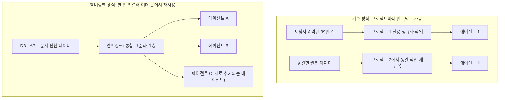
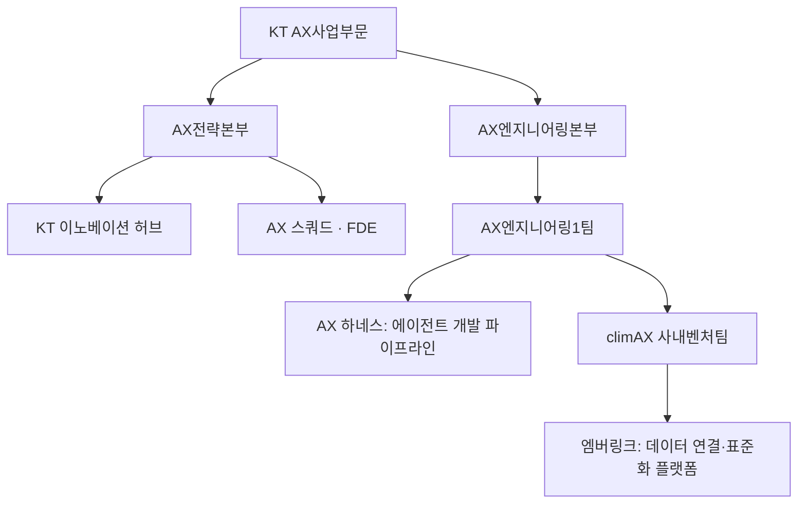

- 작성일: 2026년 9월 23일
- 원본 기사: 뉴스1, ["48명 한달치 일을 6명으로"…KT 개발팀이 AX현장서 찾은 해법](https://v.daum.net/v/20260923063213954) (2026.09.23)

---

## 목차

0. 들어가며
1. 무슨 일이 있었나 — KT Venture Lab과 climAX 팀의 수상
2. 문제의 출발점 — AX 프로젝트마다 반복되는 데이터 가공 지옥
3. 엠버링크는 무엇을 하는 플랫폼인가
4. 숫자로 보는 성과 — 48MM에서 6MM으로
5. climAX는 KT의 AX 조직 안에서 어디에 서 있나
6. climAX 팀의 다음 목표 — '올인원 AX 플랫폼'과 온톨로지
7. 그래서, KT가 가장 자랑스러워하는 것은 무엇일까
8. 용어 정리
9. 출처 투명성
10. 참고 자료
11. 부록 — climAX·엠버링크를 둘러싼 KT의 최근 행보

---

## 0. 들어가며

이 문서는 2026년 9월 23일 뉴스1이 보도한 인터뷰 기사를 바탕으로, KT 사내벤처팀 'climAX'가 만든 데이터 통합 플랫폼 '엠버링크(EmberLink)'의 내용을 상세히 풀어 설명한다. 아울러 이 기사만으로는 파악하기 어려운 KT의 전체 AX(AI 전환) 조직 구조와 관련 기술 용어들을 다른 공개 보도 자료로 보강해, climAX와 엠버링크가 KT라는 큰 그림 속 어디에 위치하는지도 함께 정리했다. 각 사실이 어느 출처에서 나왔는지는 9장의 출처 투명성 표에서 구분해두었으니, 특히 성과 수치처럼 KT 측이 자체적으로 밝힌 값은 그 성격을 염두에 두고 읽는 것이 좋다.

---

## 1. 무슨 일이 있었나 — KT Venture Lab과 climAX 팀의 수상

KT AX사업부문은 올해 처음으로 사내벤처 프로그램 'Venture Lab'을 열었다. 이 프로그램은 KT 내부 직원들이 실제 업무 현장에서 발견한 문제를 스스로 해결책으로 만들어보도록 장려하는 사내 경진 제도로 보이며, 이번 첫 회에서 대상을 받은 팀이 바로 'climAX'다.

climAX 팀은 KT AX엔지니어링1팀 소속 직원 세 명, 즉 팀장을 맡은 이상흔 책임과 팀원인 최재혁 책임, 김원태 책임으로 구성돼 있다. 이들이 출품한 결과물이 기업 내부의 흩어진 데이터를 AI 에이전트가 쓸 수 있는 형태로 표준화·통합해주는 플랫폼 '엠버링크'다. 이 팀의 특징은 처음부터 아이디어 자체가 사무실 책상이 아니라 실제 고객사 프로젝트 현장에서 나왔다는 점인데, 팀원인 김원태 책임은 climAX의 강점을 "현장에서 많이 굴러본 경험"이라는 말로 요약했다.

여기서 climAX라는 사내벤처팀과, 앞으로 5장에서 다룰 'KT AX엔지니어링1팀'이라는 정규 조직은 구분해서 볼 필요가 있다. climAX는 AX엔지니어링1팀 소속 인원들이 사내벤처 프로그램에 참가하기 위해 꾸린 프로젝트성 팀이며, AX엔지니어링1팀 자체는 이보다 큰 정규 조직 단위다.

---

## 2. 문제의 출발점 — AX 프로젝트마다 반복되는 데이터 가공 지옥

엠버링크 개발의 출발점을 이해하려면 먼저 climAX 팀이 주로 어떤 일을 해왔는지를 알아야 한다. 이 팀은 KT의 여러 AX 프로젝트 중에서도 특히 보험사를 대상으로 한 프로젝트를 다수 수행해왔다. 보험사는 업종 특성상 약관과 상품 정보 같은 방대한 문서를 다루고, 내부 데이터 구조도 매우 복잡하다. 이런 환경에서 AI 에이전트를 실제 업무에 투입하려면 에이전트를 만드는 작업 자체보다, 그 전 단계인 데이터 정비 작업에 훨씬 많은 공수가 들어간다.

팀장인 이상흔 책임은 이 지점을 프로젝트를 거듭하며 체감했다고 말한다. AX 프로젝트라고 하면 사람들은 보통 AI 에이전트를 만드는 일을 먼저 떠올리지만, 실제 현장에서 가장 많은 시간이 드는 작업은 여기저기 흩어진 데이터를 연결하고 문서를 에이전트가 이해할 수 있는 형태로 바꾸는 과정이라는 것이다. 문제는 이 변환 작업이 프로젝트마다 새로 반복된다는 데 있었다. 작년 프로젝트에서 했던 것과 똑같은 가공 작업을 다음 프로젝트에서 또다시 처음부터 해야 하는 비효율이 계속 눈에 띄었고, 이것이 팀으로 하여금 "이 작업 자체를 표준화해야 한다"는 문제의식을 갖게 만들었다.

이 비효율을 구체적인 숫자로 보여주는 사례가 있다. 팀원인 최재혁 책임에 따르면, 한 보험사 프로젝트에서는 자사 상품뿐 아니라 타사 보험 상품까지 포함한 약관 문서가 약 39만 건에 달했다. 문제는 이 방대한 문서를 힘들게 하나의 AI 에이전트에 맞춰 정규화(가공)해놓아도, 다른 목적의 에이전트가 같은 데이터를 쓰려면 또다시 그 39만 건을 처음부터 다시 작업해야 했다는 점이다. 데이터가 특정 에이전트 하나에만 종속되는 구조였던 셈이다. climAX 팀은 이 문제를 해결하기 위해 원천 데이터를 하나의 공통 플랫폼에 미리 연결해두면, 이후 어떤 목적의 에이전트가 오더라도 그 데이터를 곧바로 재사용할 수 있게 만들자는 아이디어로 엠버링크를 설계했다.

---

## 3. 엠버링크는 무엇을 하는 플랫폼인가

엠버링크를 한 문장으로 정의하면, 기업 내부에 흩어진 데이터베이스(DB), 응용프로그램인터페이스(API), 각종 문서를 AI 에이전트가 활용할 수 있는 형태로 통합하고 표준화하는 플랫폼이다. 핵심은 '연결의 재사용성'에 있다. 엠버링크를 통해 한 번 연결·가공된 데이터는 특정 하나의 AI 에이전트에 묶이지 않고, 이후 만들어지는 여러 에이전트가 공통으로 가져다 쓸 수 있는 구조로 설계됐다. 새로운 에이전트를 만들 때마다 담당자를 인터뷰해서 DB와 API의 위치·규격을 처음부터 다시 파악하는 대신, 이미 엠버링크로 연결해둔 시스템을 그대로 불러와 쓰는 식으로 프로젝트 초기 작업을 크게 줄일 수 있다는 것이 climAX 팀의 설명이다.

아래 그림은 기존 방식과 엠버링크 방식의 차이를 단순화한 것이다. 기존 방식에서는 프로젝트마다 원천 데이터를 각각 별도로 가공해 그 프로젝트 전용 에이전트에만 연결했다. 반면 엠버링크 방식에서는 원천 데이터를 한 번 표준화 계층에 연결해두면, 이후 여러 목적의 에이전트가 같은 표준화 계층을 공유해서 쓴다.

엠버링크의 역할은 단순히 데이터를 한곳에 모아두는 저장소에 그치지 않는다. 기사에 따르면 이 플랫폼은 기업이 보유한 데이터를 바탕으로 어떤 AI 에이전트를 새로 만들 수 있을지 제안하는 기능, 그리고 연결된 API에 변경 사항이 생겼는지를 지속적으로 모니터링해 실제 오류가 발생하기 전에 미리 대응하는 기능도 갖추고 있다고 소개됐다. 즉 데이터 연결 그 자체를 넘어, 연결된 데이터를 계속 건강하게 유지·관리하는 역할까지 포함하는 셈이다.

---

## 4. 숫자로 보는 성과 — 48MM에서 6MM으로

climAX 팀은 엠버링크를 실제 진행 중인 프로젝트에 적용한 결과로 세 가지 수치를 제시했다. 다만 이 수치들은 모두 climAX 팀이 자체적으로 측정해 인터뷰에서 밝힌 값이며, 외부 기관의 독립적인 검증을 거친 것은 아니라는 점을 먼저 짚어둔다.

첫 번째는 작업량 감소다. 기존 방식으로는 48MM이 필요했던 작업이 엠버링크를 적용한 뒤 6MM 수준으로 줄었다고 한다. 여기서 MM은 '맨먼스(Man-Month)'의 약자로, 한 사람이 한 달 동안 풀타임으로 투입되는 작업량을 1MM로 계산하는 단위다. 원래 기사 제목이 "48명 한달치 일을 6명으로"였던 것도 이 개념을 쉽게 풀어 쓴 표현이다. 즉 이전에는 48명이 한 달 동안 매달려야 끝나던 작업량을, 이제는 6명이 한 달이면 끝낼 수 있는 수준으로 줄였다는 뜻이며, 전체 작업량 기준으로는 기존의 8분의 1 수준으로 축소된 셈이다.

두 번째는 문서 검색 정확도다. 기존 81% 수준이던 문서 검색 정확도가 엠버링크 적용 후 92%로 높아졌다고 한다. AI 에이전트가 방대한 약관·문서 더미 속에서 실제로 필요한 정보를 얼마나 정확히 찾아내는지를 나타내는 지표로 보인다.

세 번째는 토큰 사용량 절감이다. AI 에이전트가 업무 수행에 필요한 도구를 선택하는 과정에서 소비하는 토큰의 양이 약 1만 3300개에서 320개 수준으로 줄어, 약 40분의 1로 절감됐다고 한다. 토큰은 대형언어모델(LLM)이 텍스트를 처리할 때 계산의 기본 단위이자 비용 산정의 기준이 되는 요소로, 토큰 사용량이 줄어든다는 것은 그만큼 AI 에이전트를 운영하는 비용이 낮아진다는 의미다. 팀장인 이상흔 책임은 이 부분에 대해, 프로젝트 초기에는 대형언어모델에 많은 작업을 맡기더라도 결국 고객사에서 비용을 줄여달라는 요구가 나오기 마련이라 이런 현장 경험을 바탕으로 토큰과 자원을 아낄 수 있는 지점을 찾아 엠버링크에 반영했다고 설명했다.

세 지표를 표로 정리하면 다음과 같다.

| 지표 | 기존 방식 | 엠버링크 적용 후 | 변화 |
|---|---|---|---|
| 필요 작업량(MM) | 48MM | 6MM | 약 8분의 1로 감소 |
| 문서 검색 정확도 | 81% | 92% | 약 11%포인트 상승 |
| 도구 선택 시 토큰 사용량 | 약 1만 3300개 | 약 320개 | 약 40분의 1로 감소 |

이 수치들이 어떤 조건에서, 어떤 규모의 프로젝트를 기준으로 측정됐는지 기사에는 구체적으로 명시돼 있지 않다. 특정 보험사 프로젝트를 사례로 든 것으로 보이지만, 이 개선폭이 모든 프로젝트에 동일하게 적용될 수 있는 일반적인 수치인지, 아니면 이번 특정 사례에 한정된 결과인지는 현재 공개된 정보만으로는 확인하기 어렵다.

---

## 5. climAX는 KT의 AX 조직 안에서 어디에 서 있나

이번 climAX 기사만 놓고 보면 이 팀이 KT AX 사업 전체에서 어떤 위치에 있는지 가늠하기 어렵다. 이를 보완하기 위해 2026년 상반기 이후 보도된 KT의 AX 관련 다른 기사들을 함께 살펴보면, 대략적인 조직의 윤곽이 드러난다.

KT AX사업부문 산하에는 전승록 상무가 이끄는 AX전략본부가 있고, 이 본부가 서울 광화문 KT 웨스트사옥에 운영하는 'KT 이노베이션 허브'라는 공간이 있다. 이곳은 2025년 10월 문을 연 이후 약 200여 개 기업 고객이 방문했고, 이 중 30여 곳이 KT와 함께 실제 AX 프로젝트를 진행하는 단계까지 나아갔다고 알려져 있다. 이노베이션 허브에는 약 120여 명의 AI 전문가가 상주하며, 이들은 5명 안팎의 'AX 스쿼드(AX Squad)'를 꾸려 6주 단위의 검증 프레임워크로 고객사 과제를 구체화하는 방식으로 일한다. 현장에 직접 투입돼 고객사의 데이터와 보안 환경을 분석하고 시제품을 실제 서비스로 전환하는 역할을 하는 인력은 '전방배치 엔지니어', 즉 FDE(Forward Deployed Engineer)라는 이름으로 불린다. KT는 팔란티어와도 협력해 FDE 역량을 내재화하는 프로그램을 운영하고 있으며, 관련 임원은 FDE를 '기업의 AX 셰르파'에 비유하기도 했다.

기술적으로는 'AX 하네스(AX Harness)'라는 KT 자체 개발 프레임워크가 이 개발 체계의 기반으로 소개된 바 있다. AX 하네스는 AI 에이전트와 프롬프트, 도구 설계 구조를 외부에 의존하지 않고 내부에서 직접 통제할 수 있도록 만든 것으로, 사용자 요구사항이 들어오면 기획·개발·UI 설계·품질 검증(QA)까지 단계별로 여러 에이전트가 역할을 나눠 수행하고, 마지막에 결과물을 다시 검증하는 파이프라인 구조를 갖추고 있다. 이 프레임워크를 활용하면 자연어 요청 한 번으로 3~5분 안에 실제로 동작하는 최소기능제품(MVP)이 나오고, 비용도 해외 생성형 AI의 API를 직접 이용하는 방식보다 훨씬 저렴하다는 것이 KT의 설명이다. 그리고 이 개발 체계를 총괄하는 조직이 바로 climAX 팀이 소속된 'KT AX엔지니어링1팀'이며, 이 팀의 정규 팀장은 김창수 팀장으로 소개된 바 있다.

정리하면 climAX는 AX엔지니어링1팀이라는 정규 조직 안에서, 팀원들이 스스로 발견한 현장 문제(데이터 가공의 반복)를 사내벤처 형태로 별도 해결해본 프로젝트팀이라고 이해할 수 있다. 아래는 이 관계를 단순화한 그림이다. 다만 이 조직도는 여러 시점의 보도를 종합해 재구성한 것으로, KT가 공식적으로 발표한 조직도 자체는 아니라는 점을 밝혀둔다.

---

## 6. climAX 팀의 다음 목표 — '올인원 AX 플랫폼'과 온톨로지

climAX 팀은 이번 수상 자체보다 엠버링크를 실제 사업으로 키워내는 것을 애초의 목표로 삼았다고 밝혔다. 이상흔 책임은 처음부터 목표로 삼았던 것이 우승이 아니라 사업화였다며, KT 내부에 이미 있는 AI 에이전트 개발 플랫폼과 엠버링크를 결합해 데이터 연결부터 에이전트 개발까지를 한 번에 제공하는 형태로 만드는 것이 큰 목표라고 설명했다.

구체적으로는 엠버링크와, 기사에서 KT의 AI 에이전트 개발 프레임워크로 소개된 'AX Suite'를 결합해 데이터 연결·구조화부터 에이전트 개발·배포까지를 한 번에 지원하는 '올인원 AX 플랫폼'으로 확장한다는 계획이다. 여기에 더해 데이터 간의 의미와 관계를 서로 연결해 AI가 더 정확하게 맥락을 이해할 수 있도록 돕는 '온톨로지' 기반의 지식 고도화 기능도 추가할 예정이라고 밝혔다. 기사에 실린 용어 설명에 따르면 온톨로지는 원래 철학에서 존재하는 것들의 본질과 관계를 다루는 존재론을 뜻하는 말이지만, 컴퓨터 과학에서는 특정 영역의 개념과 속성, 그리고 그 관계를 기계가 이해하고 추론할 수 있는 형태로 구조화한 지식 모델을 가리킨다.

한 가지 짚어둘 점은, 기사에 등장하는 'AX Suite'라는 명칭이 이 인터뷰 기사 외에 다른 공개 보도에서는 확인되지 않았다는 것이다. 반면 앞서 5장에서 소개한 'AX 하네스'는 기획·개발·UI 설계·QA로 이어지는 단계별 에이전트 파이프라인이라는 점에서 기능적으로 상당히 비슷한 설명을 갖고 있다. 다만 'AX Suite'와 'AX 하네스'가 같은 프레임워크를 가리키는 다른 이름인지, 아니면 서로 다른 별개의 제품인지는 현재 공개된 자료만으로는 단정할 수 없다. 참고로 KT는 팔란티어와 함께 진행한 사내 해커톤 '에이전트 캠프'에서도 팔란티어의 데이터 통합 플랫폼 '파운드리'와 AI 플랫폼 'AIP'를 활용해 온톨로지를 직접 설계해보는 과정을 운영한 적이 있어, 온톨로지라는 개념 자체는 climAX의 이번 계획 이전부터 KT 내부에서 이미 통용되던 개념으로 보인다.

마지막으로 climAX 팀은 AX에 도전하려는 다른 기업과 개발자들에게도 조언을 남겼다. 김원태 책임은 AI 개발 자체가 쉬워진 만큼 이제는 "무엇을 만들까"보다 "우리에게 무엇이 있지"를 먼저 고민해야 한다며, 기업 내부에 이미 존재하는 데이터를 실제로 활용 가능한 형태로 만드는 데서 AX를 시작해야 한다고 말했다.

---

## 7. 그래서, KT가 가장 자랑스러워하는 것은 무엇일까

여기서부터는 사실 보도가 아니라, 기사에 담긴 발언들을 근거로 한 해석적 분석이라는 점을 먼저 밝힌다. 질문은 'AX 그 자체'와 'MM(작업량) 절감' 중 어느 쪽이 KT가 더 자랑스러워하는 지점이냐는 것이었는데, 기사 속 발언들을 종합하면 둘 중 어느 하나로 딱 잘라 말하기보다는, 이 두 가지가 서로 다른 층위에 있다고 보는 편이 더 정확하다.

48MM에서 6MM으로, 81%에서 92%로, 1만 3300개에서 320개로 줄었다는 숫자들은 climAX 팀이 인터뷰에서 가장 먼저, 가장 구체적으로 내세운 결과물이다. 기사 제목 자체도 이 숫자에 초점을 맞추고 있다. 그런 점에서 이 수치들은 climAX 팀이 외부에 보여주고 싶어 한 '증거'에 해당한다고 볼 수 있다.

하지만 정작 팀 스스로가 자신들의 강점으로 꼽은 것은 이 숫자 자체가 아니었다. 김원태 책임이 climAX의 강점으로 꼽은 것은 "현장에서 많이 굴러본 경험"이었고, 팀장인 이상흔 책임이 밝힌 진짜 목표 역시 이번 대회에서의 우승이나 특정 수치 달성이 아니라 사업화, 즉 엠버링크를 KT 내부 실험을 넘어 실제로 굴러가는 사업으로 키워내는 것이었다. 다시 말해 48MM을 6MM으로 줄인 결과는 자신들이 실제로 겪은 반복적 비효율이라는 '문제'를 정확히 짚어냈다는 것을 입증하는 증거였을 뿐, 그 수치 자체가 최종 목표는 아니었다는 의미로 읽힌다.

정리하면 이렇게 말할 수 있다. climAX 팀, 그리고 이를 통해 드러나는 KT의 태도에서 더 근본적인 자부심의 대상은 '현장에서 반복적으로 확인한 진짜 문제를 짚어내고, 그것을 재사용 가능한 구조로 표준화했다는 점' 그 자체에 가깝다. MM 절감이나 토큰 절감 같은 수치는 그 구조적 해법이 실제로 효과가 있다는 것을 증명하는 결과물이지, 그 자체가 자랑의 최종 목적지는 아니라는 것이다. 다만 이것은 어디까지나 기사 속 발언을 바탕으로 한 해석이며, KT나 climAX 팀이 "우리는 숫자보다 구조적 통찰을 더 자랑스러워한다"고 명시적으로 밝힌 문장이 따로 존재하는 것은 아니라는 점을 다시 한번 밝혀둔다.

---

## 8. 용어 정리

**AX**: AI Transformation의 약자로, AI 기술을 중심으로 기업이나 조직의 업무 방식 전반을 혁신하는 전환을 뜻한다.

**MM(맨먼스, Man-Month)**: 한 사람이 한 달 동안 풀타임으로 투입되는 작업량을 나타내는 단위. 소프트웨어 개발이나 컨설팅 프로젝트에서 인력 투입량과 비용을 계산할 때 널리 쓰인다.

**엠버링크(EmberLink)**: climAX 팀이 개발한 플랫폼으로, 기업 내부의 DB·API·문서를 AI 에이전트가 활용할 수 있는 형태로 통합·표준화해, 여러 에이전트가 데이터를 공통으로 재사용할 수 있게 해준다.

**정규화(가공)**: 원천 데이터를 특정 시스템이나 에이전트가 처리하기 좋은 일관된 형식으로 변환하는 작업.

**토큰**: 대형언어모델이 텍스트를 처리하는 최소 단위이자, API 사용 비용을 계산하는 기준이 되는 요소. 토큰 사용량이 줄어들면 그만큼 AI 운영 비용도 낮아진다.

**FDE(전방배치 엔지니어, Forward Deployed Engineer)**: 고객사 현장에 직접 투입돼 데이터와 보안 환경을 분석하고, 시제품을 실제 서비스로 전환하는 역할을 하는 엔지니어를 가리키는 용어.

**AX 하네스**: KT가 자체 개발한 AI 에이전트 개발 프레임워크로, 기획·개발·UI 설계·품질 검증(QA) 단계를 여러 에이전트가 나눠 수행하고 결과를 다시 검증하는 파이프라인 구조를 갖는다.

**온톨로지(Ontology)**: 철학적으로는 존재하는 것들의 본질과 관계를 다루는 존재론을 뜻하지만, 컴퓨터 과학에서는 데이터를 기계가 이해하고 추론할 수 있도록 특정 영역의 개념·속성·관계를 구조적으로 정의한 지식 모델을 가리킨다.

---

## 9. 출처 투명성

아래 표는 이 문서에 담긴 정보를 신뢰도와 성격에 따라 네 가지로 구분한 것이다.

| 구분 | 내용 | 비고 |
|---|---|---|
| 확인된 사실(복수 출처로 교차 확인) | KT 이노베이션 허브의 존재와 운영 방식, AX 스쿼드·FDE 개념, AX 하네스 파이프라인 구조, KT AX엔지니어링1팀의 존재 | 뉴스토마토·아이뉴스24·머니투데이·노컷뉴스·딜사이트 등 서로 다른 매체가 유사한 내용을 독립적으로 보도 |
| 단일 출처 주장 | climAX 팀의 구성과 수상 사실, Venture Lab 프로그램 자체, 39만 건 약관 사례, 'AX Suite'라는 명칭 | 2026년 9월 23일 뉴스1(다음 재배포) 인터뷰 기사에만 등장하며 다른 매체의 교차 검증은 확인되지 않음 |
| 벤더 자체 발표 성과 지표 | 48MM→6MM, 문서 검색 정확도 81%→92%, 토큰 사용량 1만 3300개→320개 | climAX 팀이 인터뷰에서 직접 밝힌 수치로, 제3자의 독립적 검증 여부는 확인되지 않음. 측정 조건(대상 프로젝트 규모 등)도 상세히 공개되지 않음 |
| 해석·분석 | 7장의 "KT가 가장 자랑스러워하는 것은 무엇인가"에 대한 답, 'AX Suite'와 'AX 하네스'의 관계에 대한 추정, climAX와 AX엔지니어링1팀의 조직적 관계 재구성 | 이 문서 작성 과정에서 기사 속 발언과 여러 보도를 종합해 도출한 해석으로, KT의 공식 확인을 거친 내용이 아님 |

---

## 10. 참고 자료

[1] 이민주, "48명 한달치 일을 6명으로"…KT 개발팀이 AX현장서 찾은 해법, 뉴스1(다음 재배포), 2026.09.23. https://v.daum.net/v/20260923063213954

[2] 서효빈, "말 한마디에 5분 만에 앱 완성"…KT, 기업 AX 실험실 공개, 아이뉴스24, 2026.06.24. https://www.inews24.com/view/1978995

[3] 이지은, KT 이노베이션 허브, AX 측면 지원 나선다, 뉴스토마토, 2026.06.24. https://newstomato.com/ReadNews.aspx?no=1305033

[4] KT, 현장 중심 AX 체계 구축…필요한 AI 모델 자유롭게 '활용', 노컷뉴스. https://nocutnews.co.kr/news/6537401

[5] 이찬종, "단돈 1000원으로 PoC 1억원 아낀다"…KT, B2B AX '승부수'는?, 머니투데이, 2026.06.24. https://www.mt.co.kr/tech/2026/06/24/2026062315264197533

[6] 변한석, KT "AI 시대 FDE '나침반' 역할…팔란티어와 AX 역량 내재화", 딜사이트, 2026.07.20. https://dealsite.co.kr/articles/165494

[7] KT AX엔지니어링1팀장 인터뷰(AX 하네스 관련), 딜사이트. https://dealsite.co.kr/articles/164092

[8] KT-팔란티어, AX 전문 인력 양성 나서, 미래한국(futurechosun.com). https://futurechosun.com/?p=154778

[9] 최령, KT 박윤영, 외부 임원 13명 영입…AX 신설 조직 배치, 딜사이트, 2026.04.01. https://dealsite.co.kr/articles/159507

[10] 이수영, KT, AX 플랫폼 기업 박차…5년간 18조원 투자로 AI 인프라 확대, 머니투데이방송(MTN), 2026.07.06. https://news.mtn.co.kr/news-detail/2026070609444061706

[11] 김한나, KT, 현장형 엔지니어 500명 육성…AX 사업 강화, SBS Biz, 2026.08.17. https://biz.sbs.co.kr/article/20000329042

---

## 11. 부록 — climAX·엠버링크를 둘러싼 KT의 최근 행보

이 장은 엠버링크에 관한 추가 정보를 별도로 찾아본 결과를 정리한 것이다. 먼저 밝혀둘 것은, '엠버링크(EmberLink)'라는 이름을 직접 언급하거나 이 플랫폼의 기술적 세부사항(아키텍처, 사용 기술, 특허 출원 여부 등)을 다룬 별도의 공개 자료는 이번 조사에서 새로 확인되지 않았다는 점이다. KT의 공식 뉴스룸이나 다른 언론에서도 엠버링크를 단독으로 다룬 기사는 찾지 못했으며, 현재로서는 9월 23일 뉴스1 인터뷰가 엠버링크에 대한 사실상 유일한 공개 출처로 보인다. 대신 climAX 팀과 엠버링크가 소속된 KT AX사업부문이 최근 몇 달 사이 어떤 행보를 보였는지를 정리해, 이 프로젝트가 놓인 배경을 조금 더 넓게 이해할 수 있도록 했다.

### 11.1 2026년 4월 — 박윤영 대표 체제 출범과 AX사업부문 신설

climAX가 소속된 'KT AX엔지니어링1팀'이 지금의 자리에 있게 된 배경에는 2026년 초 있었던 대규모 조직 개편이 있다. 그해 3월 말 구현모 전 대표에 이어 박윤영 대표가 취임하면서, KT는 그동안 전략 수립부터 기술 개발, 사업 수행까지 여러 조직에 흩어져 있던 B2B AX 기능을 하나로 모은 'AX사업부문'을 새로 만들었다. 이 부문의 수장으로는 삼정KPMG 컨설팅 대표 출신의 박상원 전무가 영입됐다. AX사업부문 산하에는 기술 실행을 담당하는 'AX Tech본부'가 있고, 그 아래에 에이전틱 AI 개발, AX 플랫폼 개발, AX 솔루션 개발을 각각 담당하는 조직이 편제됐다. 이와 별도로 기존 기술혁신부문에서 떨어져 나온 'AX미래기술원'도 신설돼, LG AI연구원 출신 인사가 원장을 맡아 프론티어 AI, 에이전틱 AI, AX 데이터라는 세 연구조직을 이끌게 됐다.

이 개편 당시 임원 인사에서 전체 임원의 약 20%에 해당하는 13명이 외부에서 영입됐는데, 그중에서도 특히 AX사업부문장과 AX Tech본부장을 비롯한 AX 관련 신설 조직의 수장 대부분을 외부 전문가로 채웠다는 점이 눈에 띈다. 업계에서는 이를 두고 신임 대표가 AX를 KT 성장 전략의 핵심으로 보고 있다는 신호로 해석했다. 다만 이 조직 개편 보도에는 climAX나 AX엔지니어링1팀이라는 이름이 직접 등장하지는 않으며, AX엔지니어링1팀이 이 새 조직도의 어느 하부 조직에 정확히 속하는지는 별도로 확인되지 않았다.

### 11.2 2026년 7월 — '5년간 18조원' AX 플랫폼 컴퍼니 비전

같은 해 7월 6일 박윤영 대표는 취임 후 첫 기자간담회를 열고 KT를 'AX 플랫폼 컴퍼니'로 전환하겠다는 청사진을 내놓았다. 핵심은 앞으로 5년간 총 18조원을 투자하겠다는 계획으로, 이 중 보안·네트워크 경쟁력 강화에 3년간 약 12조원, AI 인프라 확충에 5년간 약 5조원(자료에 따라 6조원으로 표기된 곳도 있어 정확한 세부 수치에는 다소 차이가 있다)이 배정됐다. 1기가와트(GW) 규모의 AI 데이터센터 확보, 해저케이블 투자 확대 등이 이 계획에 포함됐다.

이 발표에서 특히 눈에 띄는 대목은 신성장 사업으로 '토큰 팩토리(Token Factory)'를 육성하겠다고 밝힌 부분이다. 전국에 흩어진 AI 데이터센터와 자체 GPU 인프라를 바탕으로 AI 연산의 기본 단위인 토큰을 생산·공급하는 사업을 키우겠다는 구상인데, 이는 climAX 팀이 엠버링크를 통해 토큰 사용량을 40분의 1로 줄였다고 강조한 것과 같은 맥락에서 읽을 수 있는 대목이다. 회사 차원에서 토큰이라는 자원 자체를 전략 자산으로 다루기 시작한 시기에, 현장 팀 역시 토큰 절감을 자신들의 핵심 성과로 내세운 셈이다. 다만 이 두 사안이 같은 전사 전략의 일부로 직접 연결돼 있다고 KT가 공식적으로 밝힌 적은 없으며, 시기적으로 맞물린다는 점 이상의 의미를 부여하기는 어렵다.

### 11.3 2026년 8월 — AX사업부문 전 직원의 FDE화, 500명 육성 계획

8월 중순에는 AX사업부문장 박상원 전무가 AX사업부문 소속 전 직원을 '전방배치 엔지니어(FDE)'로 전환하겠다는 방침을 밝혔다. 앞으로 2년 안에 500명 이상의 FDE를 길러내, 고객 현장에서 문제를 정의하고 시제품을 만들어 실제 서비스로 전환하는 실행력을 AX사업부문의 핵심 경쟁력으로 삼겠다는 것이다. 이를 위해 KT는 AX사업부문 구성원을 대상으로 산업·기술·솔루션 역량을 진단하고, 개인별 경력개발경로(CDP)를 설계해 교육과 프로젝트, 자격 인증을 연계하는 인재 육성 체계를 가동하기로 했다.

climAX 팀원들이 인터뷰에서 강조한 "현장에서 많이 굴러본 경험"이라는 표현은, 이 시기 KT AX사업부문 전체가 전략적으로 밀어붙이던 '현장 실행력 중심 조직'이라는 방향과도 맞닿아 있는 것으로 보인다. 다만 climAX 팀원들이 실제로 FDE라는 직함으로 활동하고 있는지, 혹은 이번 전 직원 FDE화 계획이 climAX 팀의 활동과 직접적인 관계가 있는지는 이번 조사에서 확인되지 않았다.

### 11.4 정리 — 무엇이 더 확인되지 않았나

정리하면, 이번 추가 조사를 통해 climAX와 엠버링크가 KT AX사업부문이라는 훨씬 큰 조직적·전략적 흐름, 즉 2026년 초의 조직 개편, 7월의 대규모 투자 발표, 8월의 인재 육성 계획과 시기적으로 맞물려 있다는 정황은 확인할 수 있었다. 그러나 엠버링크라는 제품 자체의 구체적인 기술 스택, 특허 출원 여부, 사업화 진행 상황, 다른 KT 서비스와의 실제 연동 계획처럼 climAX 팀 내부에서만 알 수 있는 정보는 공개된 자료로는 확인할 수 없었다. 이 부분에 대해서는 KT의 추후 공식 발표나 후속 보도를 기다려야 할 것으로 보인다.
