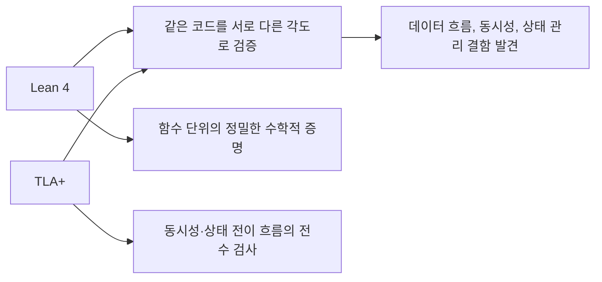
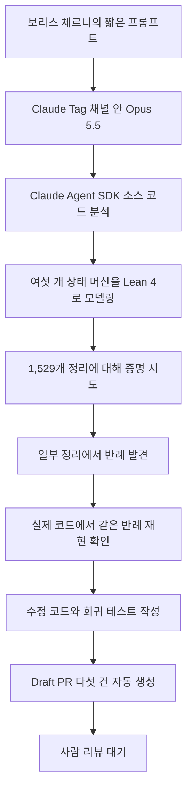
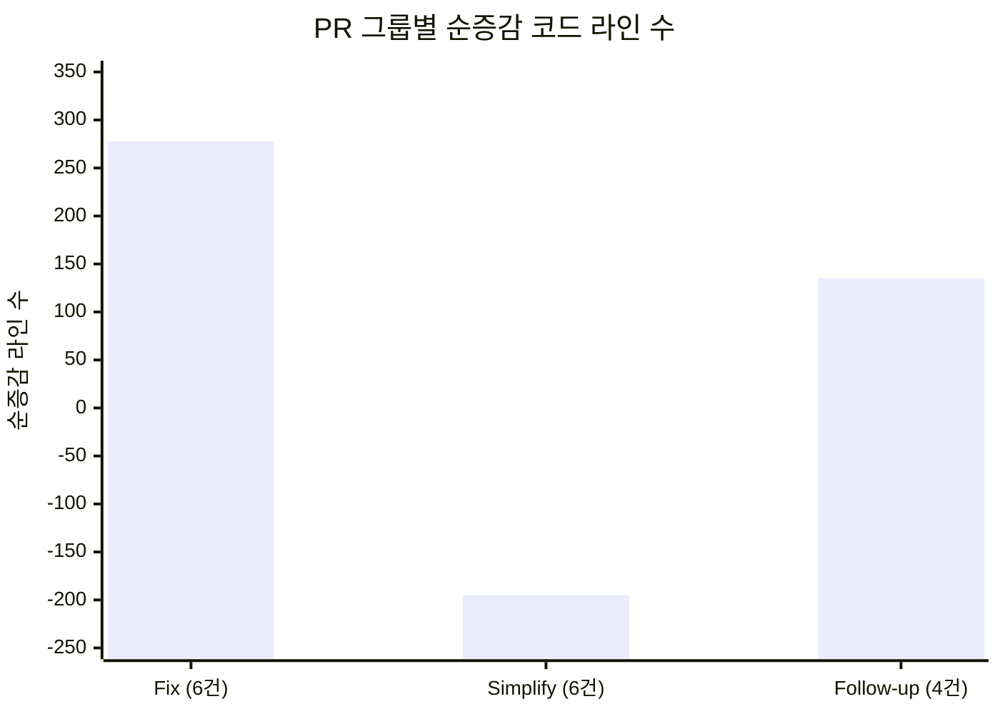

> 
> https://www.threads.com/share/BAuc25kzlG/
> 
> 이거 진짜 충격… Claude Agent SDK를 Opus 5.5로 Lean으로 “정식 검증” 돌렸고, 짧은 프롬프트 몇 개로 16개 PR이 쏟아졌다는 얘기예요.
> 
> 버그/레이스 컨디션 잡는 속도가 사람이 디버깅하는 감각이랑 차원이 다르더라고요.
> 
> 근데 진짜 중요한 건, 이런 포멀 모델링이 앞으로 코딩의 기본 흐름이 될지… 여기서부터입니다.
> 
> 1/ 핵심은 “공식 검증”이 거창한 수학자 전용이 아니라, LLM이 프롬프트로 검증 루프를 만들어준다는 점이에요.
> 
> 짧게 물어보고, Lean/TLA+ 모델로 틀-증명-수정이 빨라지니까요.
> 
> 2/ Lean만 써도 좋지만, 데이터 플로우/동시성/상태관리 같은 건 TLA+가 강점이라 같이 쓰기도 한다고 해요.
> 
> 결국 다른 관점으로 같은 버그를 더 잘 찢어보는 느낌!
> 
> 3/ “언어를 잘 몰라도” Claude가 Lean/TLA+ 모두를 잘 다룬다… 이게 포인트 같아요.
> 
> 인간은 논리/증명 문법에 덜 갇히고, LLM이 실무 검증 파트의 부담을 줄여주는 거죠.
> 
> 여러분은 포멀 검증, 앞으로 진짜 코딩 프로세스에 기본으로 들어올까요? 👇
> 
> 📌 원문 출처:
> [https://x.com/bcherny/status/2102543349102338309](https://x.com/bcherny/status/2102543349102338309)
> 

## 목차

1. 들어가며 — 무슨 일이 있었나
2. 등장인물과 무대
   - 2.1 보리스 체르니(Boris Cherny)는 누구인가
   - 2.2 Claude Opus 5.5
   - 2.3 Claude Agent SDK
   - 2.4 Claude Tag — 이 실험이 진행된 채널
3. 포멀 베리피케이션(formal verification)이란 무엇인가
   - 3.1 우리가 아는 "테스트"와 무엇이 다른가
   - 3.2 Lean 4 — 증명으로 증명하는 언어
   - 3.3 TLA+ — 시간과 동시성을 그려내는 언어
   - 3.4 왜 두 도구를 함께 쓰는가
4. 스레드에서 실제로 벌어진 일
   - 4.1 프롬프트에서 결과까지의 흐름
   - 4.2 증명이 찾아낸 다섯 가지 버그
   - 4.3 두 번째 게시물 — 숫자로 본 작업량
5. 왜 이 결과가 주목받는가
6. 짚고 넘어가야 할 한계와 주의점
7. 더 큰 흐름 — 2026년, AI와 포멀 베리피케이션
8. 정리 — 포멀 검증은 코딩의 기본이 될까
9. 출처 신뢰도 표 및 참고 링크

---

## 1. 들어가며 — 무슨 일이 있었나

Anthropic에서 Claude Code를 만든 보리스 체르니(Boris Cherny)가 자신의 X(옛 트위터) 계정에 올린 게시물이 발단이다. 그는 Claude Opus 5.5에게 몇 개의 짧은 프롬프트만 던져서, 자신이 이끄는 팀이 만든 Claude Agent SDK라는 소프트웨어를 Lean이라는 정리 증명 언어로 "정식으로 검증"하게 했다. 그 결과로 16개의 풀 리퀘스트(PR, 코드 변경 제안)가 나왔고, 그 안에는 사람이 코드 리뷰만으로는 잡아내기 어려웠을 법한 버그와 경쟁 상태(race condition) 수정이 다수 포함되어 있었다.

이 글은 그 게시물과 뒤이어 올라온 두 번째 게시물(인포그래픽)의 내용을 원문 그대로 정리하고, 그 안에 등장하는 Lean, TLA+, Claude Agent SDK, Claude Tag 같은 낯선 용어들을 하나씩 풀어서 설명한다. 아울러 이런 방식의 작업이 2026년 현재 소프트웨어 업계에서 어떤 흐름 속에 놓여 있는지도 함께 짚는다.

먼저 분명히 해둘 점이 있다. 이 문서가 다루는 핵심 수치(16개의 PR, 발견된 버그 24개, 1,529개의 정리 등)는 보리스 체르니 본인이 자신의 게시물에서 직접 밝힌 내용이다. X(트위터)는 게시물 원문을 외부에서 자동으로 다시 가져오는 것을 차단하고 있어서, 이 글을 쓰는 시점에 해당 게시물을 실시간으로 다시 조회해 한 글자 한 글자 대조하는 것은 불가능했다. 다만 같은 시간대에 보리스 체르니가 "Opus 5.5를 최근 몇 주간 매일 쓰고 있다"고 언급한 다른 게시물[1], 그리고 별도의 AI 평가 업체인 Vals AI가 같은 시기에 "Opus 5.5 에이전트 10개에게 더 빠른 최단 경로 알고리즘을 만들고 Lean으로 증명하게 했다"고 올린 게시물[2]이 함께 확인되어, 이 사건이 실제로 그 시점에 있었던 일이라는 정황은 뒷받침된다. 세부 수치의 출처와 신뢰도는 9장의 표에서 다시 한번 정리한다.

## 2. 등장인물과 무대

### 2.1 보리스 체르니(Boris Cherny)는 누구인가

보리스 체르니는 Anthropic에서 Claude Code를 만든 인물로, 현재 Claude Code 부문을 이끌고 있다[3]. Claude Code는 터미널(명령줄)에서 실행하는 에이전트형 코딩 도구로, 그가 여러 차례 공개적으로 밝힌 바에 따르면 Anthropic 사내에서 만들어지는 새 코드의 상당 부분이 이 도구를 통해 작성되고 있다[4]. 그는 평소 X에 자신의 실제 작업 방식—여러 개의 Claude 세션을 동시에 병렬로 돌리는 법, Claude에게 스스로 작업을 검증할 방법을 쥐여주는 법 등—을 자주 공유하는 것으로 알려져 있으며[5], 이번 게시물도 그런 실무 공유 글의 연장선에 있다.

### 2.2 Claude Opus 5.5

이번 실험에 사용된 모델은 Claude Opus 5.5다. Opus 계열은 Anthropic의 모델 중 가장 높은 추론 능력에 무게를 둔 모델 라인으로, 이번 사례처럼 여러 단계를 거쳐야 하는 복잡한 코드 분석·증명 작업에 활용되었다. 보리스 체르니는 같은 시기의 다른 게시물에서 Opus 5.5를 "몇 주째 매일 쓰고 있는 주력 모델"이라고 표현하며, C로 작성된 대규모 프로그램을 Rust로 이식하는 작업에서도 이 모델을 사용했다고 밝힌 바 있다[1].

### 2.3 Claude Agent SDK

이번에 검증 대상이 된 소프트웨어가 바로 Claude Agent SDK다. 이것은 Anthropic이 공식으로 제공하는 개발 도구로, Python과 TypeScript(자바스크립트의 확장 언어)로 AI 에이전트—즉 스스로 계획을 세우고 도구를 호출하며 작업을 끝까지 밀고 나가는 프로그램—를 만들 수 있게 해주는 프레임워크다[6][7]. 원래는 "Claude Code SDK"라는 이름이었다가, 코딩에 국한되지 않는 범용 에이전트 개발 도구로 성격이 넓어지면서 지금의 이름으로 바뀌었다[7]. Claude API를 직접 호출해서 에이전트를 만들 수도 있지만, 그 경우 "도구 호출 결과를 다시 모델에 넘기고, 오류를 처리하고, 언제 멈출지 판단하는" 반복 루프를 매번 새로 구현해야 한다. Claude Agent SDK는 Claude Code를 구동하는 것과 같은 에이전트 엔진을 그대로 가져와, 이 반복 루프와 컨텍스트(대화 맥락) 관리, 도구 호출, 권한 처리 같은 부분을 미리 만들어 제공한다[6][8].

이번 사건에서 특히 의미가 있는 지점은, 검증 대상이 Anthropic이 실제로 배포하고 있는 상용 소프트웨어의 핵심 로직이었다는 사실이다. 즉 실험실의 장난감 코드가 아니라, 실제로 많은 개발자가 의존하고 있는 제품의 내부 상태 관리 로직을 검증한 것이다.

### 2.4 Claude Tag — 이 실험이 진행된 채널

원문 게시물에 첨부된 화면에는 "Thread # boris-tag-spam"이라는 이름의 대화창과, 그 안에서 "Claude"라는 이름의 참여자가 사람처럼 메시지를 올리는 모습이 담겨 있었다. 이는 Anthropic이 2026년 6월 23일 베타로 공개한 Claude Tag라는 제품으로 보인다[9][10]. Claude Tag는 Slack(사내 메신저 서비스) 채널 안에 Claude를 팀원처럼 초대해 두고, 채널에 있는 누구든 "@Claude"라고 부르면 작업을 맡길 수 있게 만든 기능이다[9]. 관리자가 미리 어떤 채널, 어떤 도구, 어떤 코드 저장소에 접근할 수 있는지를 설정해 두면, Claude는 그 범위 안에서 채널의 대화 맥락을 기억하고 작업을 진행한다[10]. 화면 하단에 보이는 "Lens · Opus 5.5 · Configure"라는 표시는 이 채널이 현재 어떤 모델로 구동되고 있으며, 그 설정을 바꿀 수 있다는 것을 보여주는 Claude Tag 화면의 상단 표시줄로 보인다. 정리하면, 보리스 체르니는 이 실험을 자신의 개인 컴퓨터가 아니라 Anthropic 사내 Slack의 한 채널 안에서, 다른 동료들도 볼 수 있는 형태로 진행한 것이다.

## 3. 포멀 베리피케이션(formal verification)이란 무엇인가

### 3.1 우리가 아는 "테스트"와 무엇이 다른가

일반적으로 소프트웨어의 정확성을 확인하는 방법은 테스트다. 특정 입력을 넣어보고 예상한 출력이 나오는지 확인하는 것이다. 문제는 테스트가 "내가 생각해낸 경우의 수"만 확인한다는 점이다. 네트워크 요청이 권한 확인 절차와 동시에 도착하는 경우, 재시도 로직과 타임아웃 로직이 동시에 발동하는 경우처럼 사람이 미처 떠올리지 못한 조합은 테스트에 포함되지 않고, 그 조합에서만 나타나는 버그는 그대로 코드에 숨어 있게 된다.

포멀 베리피케이션(formal verification, 형식 검증 또는 정식 검증이라 부른다)은 이와 다른 접근이다. 프로그램의 동작을 수학적으로 정의된 모델로 표현한 뒤, "이 프로그램은 어떤 상황에서도 이 규칙을 어기지 않는다"는 명제를 수학적 증명으로 확인한다. 테스트가 표본을 뽑아 확인하는 것이라면, 포멀 베리피케이션은 가능한 모든 경우의 수를 논리적으로 남김없이 따져보는 것에 가깝다. 다만 비용이 매우 크다는 것이 오랜 약점이었다. 증명을 사람이 손으로 하나하나 써야 했기 때문에, 실제 상용 소프트웨어 전체를 이런 방식으로 검증하는 일은 극히 드물었다[11].

### 3.2 Lean 4 — 증명으로 증명하는 언어

이번 사례에서 쓰인 첫 번째 도구가 Lean이다. Lean은 수학 정리를 기계가 검증할 수 있는 형태로 쓸 수 있게 해주는 대화형 정리 증명기(interactive theorem prover)이자, 동시에 함수형 프로그래밍 언어이기도 하다[12]. Lean에서는 수학적 명제를 하나의 "타입(type)"으로 표현하고, 그 명제에 대한 증명을 그 타입에 들어맞는 값으로 표현한다. 매우 작고 신뢰할 수 있는 핵심 검사기(커널)가 이 값이 정말로 그 타입에 맞는지를 기계적으로 확인하는 방식으로 증명의 정확성을 보장한다[12]. 2018년 무렵 개발이 시작된 4번째 버전(Lean 4)은 2023년 9월에 첫 정식 버전이 나왔고[13], 이후 Mathlib이라는 커뮤니티가 함께 만드는 수학 라이브러리가 방대하게 쌓이면서, 대학 수준의 수학을 넘어 소프트웨어 검증에도 널리 쓰이는 도구로 자리를 잡았다[13][14].

여기서 중요한 개념이 하나 있다. Lean에는 "sorry"라는 특수한 키워드가 있는데, 이는 "이 부분의 증명은 아직 완성하지 못했다"는 것을 표시하면서도 나머지 코드는 일단 컴파일이 되게 해주는 일종의 빈칸 표시다[12]. 그래서 Lean으로 작성된 증명을 평가할 때는 "sorry가 몇 개 남아 있는가"가 그 증명이 얼마나 완결되었는지를 보여주는 중요한 지표가 된다. 이번 사례에서 보리스 체르니의 게시물에 "0 sorry"라는 문구가 등장하는 것도, 증명에 빈칸이 하나도 남지 않고 전부 완결되었다는 뜻으로 읽을 수 있다.

### 3.3 TLA+ — 시간과 동시성을 그려내는 언어

두 번째로 언급된 도구인 TLA+는 성격이 조금 다르다. TLA+는 1999년 컴퓨터 과학자 레슬리 램포트(Leslie Lamport)가 만든 형식 명세 언어로, 특히 동시성 시스템과 분산 시스템—즉 여러 작업이 동시에 진행되거나 여러 컴퓨터가 서로 통신하며 협력하는 시스템—을 설계하고 검증하는 데 특화되어 있다[15][16]. 램포트는 이후 분산 시스템 이론에 대한 공로로 2013년 튜링상을 받았으며, LaTeX(문서 조판 프로그램)의 창시자이기도 하다[17].

TLA+의 핵심 아이디어는 시스템을 "초기 상태가 무엇인지(Init)"와 "한 상태에서 다음 상태로 넘어갈 수 있는 모든 방법이 무엇인지(Next)"로 정의하는 것이다[18]. 이렇게 정의해두면 모델 체커(model checker)라는 도구가 가능한 모든 상태를 하나씩 따라가 보면서, "나쁜 일이 절대 일어나지 않는다(안전성, safety)"거나 "좋은 일이 언젠가는 반드시 일어난다(생동성, liveness)" 같은 성질이 정말로 지켜지는지를 자동으로 확인해준다[19]. 이 방식은 실제로 아마존의 엔지니어들이 S3, DynamoDB, EBS 같은 핵심 인프라에서 사람이 찾아내기 매우 어려웠을 미묘한 버그를 발견하는 데 도움이 되었다고 보고된 바 있다[20].

### 3.4 왜 두 도구를 함께 쓰는가

정리하면 Lean과 TLA+는 서로 잘하는 영역이 다르다. Lean은 정교한 수학적 증명, 즉 "이 함수는 이런 입력에 대해 항상 이런 성질을 만족한다"는 것을 정밀하게 증명하는 데 강하다. TLA+는 "여러 이벤트가 뒤섞여 도착할 때 시스템이 이상한 상태에 빠지지 않는가"처럼 시간에 따른 상태 변화와 동시성을 다루는 데 강하다. 보리스 체르니는 게시물에서 데이터 흐름, 동시성, 상태 관리와 관련된 문제를 찾을 때 두 도구를 함께 쓴다고 밝혔는데, 이는 같은 코드를 서로 다른 두 개의 렌즈로 들여다봄으로써 한쪽 도구만으로는 놓칠 수 있는 결함을 서로 보완하려는 접근으로 이해할 수 있다.

아래 그림은 이 관계를 간단히 나타낸 것이다.

## 4. 스레드에서 실제로 벌어진 일

### 4.1 프롬프트에서 결과까지의 흐름

보리스 체르니는 "짧은 프롬프트 몇 개"만 입력했다고 밝혔다. 그 뒤 Claude Tag 채널 안의 Opus 5.5가 스스로 작업을 이어받아, Claude Agent SDK의 소스 코드 중 상태 머신(state machine, 프로그램이 가질 수 있는 여러 상태와 그 사이의 전이 규칙을 정리한 구조) 여섯 개를 골라 Lean 4로 모델링했다. 이어서 그 모델에 대해 1,529개의 정리(theorem)를 세우고 증명을 시도했으며, 최종적으로 하나의 sorry(미완성 증명)도 남기지 않고 전부 증명을 완결했다고 밝혔다.

증명 과정에서 몇몇 정리가 성립하지 않는 지점, 즉 "이 규칙이 깨지는 구체적인 상황(반례, counterexample)"이 발견되었다. 그런데 이 반례들이 단지 수학적 모델 안에서만 존재하는 것이 아니라, 실제 Claude Agent SDK 코드를 그 상황대로 재현했을 때 실제로도 똑같이 문제가 발생하는 것으로 확인되었다. 다시 말해 증명이 지적한 결함이 가짜 경고가 아니라 진짜 버그였다는 뜻이다. 이렇게 확인된 문제 중 다섯 건에 대해서는 수정 코드를 담은 초안 풀 리퀘스트(Draft PR)가 자동으로 만들어졌고, 각 PR에는 수정 전에는 실패하고 수정 후에는 통과하는 테스트가 함께 포함되었다.

전체 흐름을 그림으로 나타내면 다음과 같다.

### 4.2 증명이 찾아낸 다섯 가지 버그

게시물에 첨부된 화면에는 다섯 개의 초안 PR 각각에 대한 설명이 짧게 정리되어 있었다. 여기서는 그 내용을 하나씩 풀어서 옮긴다. 다만 이 다섯 항목은 Claude Agent SDK 내부 코드의 매우 구체적인 세부 사항을 다루고 있어, 정확한 코드 구조까지 제3자가 별도로 확인하기는 어려웠다는 점을 밝혀둔다. 아래 설명은 원문 게시물이 밝힌 내용을 그대로 옮긴 것이다.

첫 번째로 다루어진 것(PR #72128)은 세션 단계(session phase)에 관한 문제였다. 샌드박스(격리된 실행 환경)에 대한 네트워크 요청과 권한 확인 요청이 동시에 겹쳐 들어오는 경우, 두 요청에 모두 응답을 마친 뒤에도 세션이 "requires_action(조치 필요)" 상태에 그대로 남아버리는 문제였다. 심할 때는 다음 턴 전체가 이 잘못된 상태에 갇힌 채로 진행되었다고 한다.

두 번째(PR #72130)는 턴(turn) 반복 루프에 관한 문제였다. 형식이 잘못된 도구 호출을 재시도하는 로직과, 최대 토큰 수 초과로 응답이 잘렸을 때 복구하는 로직이 있었는데, 이 둘이 서로의 "방지 장치(guard)"를 매번 초기화시켜 버리는 구조였다. 그 결과 두 출력이 번갈아 나타나며 영원히 반복되는 상황이 생길 수 있었고, 심지어 "최대 턴 수를 1로 제한하라"는 옵션(--max-turns 1)을 걸어도 이 반복을 멈추지 못했다고 한다.

세 번째(PR #72140)는 스트리밍(streaming, 응답을 실시간으로 조금씩 전송하는 방식)에 관한 문제였다. 응답 본문이 정상적으로 끝난 것처럼 보이지만 실제로는 중간에 끊긴 경우, 시스템이 이를 "성공"으로 처리해버려서 왜 멈췄는지에 대한 이유(stop reason)도 기록되지 않고 비용(토큰 사용량)도 집계되지 않는 문제였다. 이 문제를 제대로 처리하려면 중간에 게이트웨이나 제3자(3P) 서비스를 거치는 경로가 필요하다고 설명되어 있다.

네 번째(PR #72145)는 재시도 로직에 관한 문제였다. 지속 실행 모드(persistent mode)에서 429나 529 같은 오류(요청이 너무 많거나 서버가 과부하 상태임을 나타내는 표준 오류 코드)로 인한 대기 시간이, 원래는 다른 종류의 오류를 위해 마련해 둔 재시도 예산까지 다 써버리는 문제였다. 더 나아가 503 오류와 함께 "하루를 기다리라"는 재시도 안내(Retry-After)가 오면, 시스템이 정말로 하루 전체를 그냥 잠들어 버린다는 사실도 함께 지적되었다.

다섯 번째(PR #72135)는 SDK의 제어 프로토콜에 관한 문제였다. 취소되었다가 다시 전달된 권한 요청이 남아 있을 때, 그 요청을 처리하는 핸들러를 어떤 방법으로도 취소할 수 없게 되는 상황과, 전송 통로(transport)가 닫히면서 예외를 던질 때 그 결과를 기다리고 있던 모든 대기자가 그대로 멈춰버리는 문제가 함께 언급되었다.

게시물은 이 다섯 건 외에도 지켜야 할 핵심 불변 규칙들—한 턴에 결과는 정확히 하나씩 순서대로 나와야 하고 초기화가 가장 먼저 이루어져야 한다는 것, 결과가 유휴 상태보다 먼저 나와야 한다는 것, 재시도 횟수에는 한계와 중단 조건이 있어야 한다는 것, 스트림은 오직 닫힌 블록만 내보내야 한다는 것—을 짧게 정리해 두었다. 그리고 마지막에는 중요한 단서를 덧붙였다. "엔진 모델은 아직 일부 실제 실행 결과와 다르게 나오는 경우가 있으므로, 이 증명들은 Lean 소스와 마지막 증명이 끝난 뒤 만들어질 차트가 나올 때까지는 잠정적인 것으로 취급해야 한다"는 내용이었다. 이 단서는 6장에서 다시 짚는다.

### 4.3 두 번째 게시물 — 숫자로 본 작업량

이어서 올라온 두 번째 게시물에서 보리스 체르니는 "Opus가 인포그래픽을 만들었다"며 작업 전체를 요약한 표를 공유했다. 이 인포그래픽에 따르면 제목은 "Lean 4 verification of the SDK + claude.ts state machines(SDK와 claude.ts 상태 머신의 Lean 4 검증)"였고, 결과적으로 16개의 풀 리퀘스트가 나왔으며 그중 5개는 이미 병합(merge)되었고 11개는 아직 열려 있는 상태였다.

16개의 PR은 성격별로 나뉘어 있었다. 버그를 고치는 PR이 6개, 기존 코드를 더 단순하게 정리하는 PR이 6개, 그 뒤에 이어진 후속 작업 PR이 4개였다. 고쳐진 버그는 모두 24건으로 집계되었는데, 이 중 19건은 증명 과정에서 직접 발견된 것이고 5건은 아직 검토 중이었다. 흥미로운 점은 처음 수정본에서도 6건의 허점이 추가로 있었고, 이는 재검토 과정에서 다시 잡아냈다는 메모가 덧붙어 있었다는 것이다. 즉 증명이 한 번에 완벽한 답을 낸 것이 아니라, 증명과 검토를 반복하며 스스로 오류를 줄여나간 과정이었다는 뜻으로 읽을 수 있다.

코드량 측면에서는 테스트 코드를 제외한 순수 로직 코드가 1,381줄 추가되고 1,163줄 삭제되어 순증가 218줄을 기록했다. 반대로 테스트 코드는 94개의 테스트 케이스가 새로 추가되고 9개가 제거되었으며, 테스트 관련 코드 줄 수로는 3,928줄이 추가되고 247줄이 삭제되었다. 기반이 된 것은 여섯 개의 Lean 모델과 1,529개의 정리였으며, 앞서 언급했듯 "sorry"는 0개, 즉 미완성 증명이 하나도 남지 않았다고 명시되어 있었다.

PR 성격별 코드 증감을 좀 더 세밀하게 보면, 버그 수정(Fix) 목적의 6개 PR에서는 245줄이 삭제되고 523줄이 추가되어 순증가 278줄을 기록했다. 코드 단순화(Simplify) 목적의 6개 PR에서는 741줄이 삭제되고 546줄이 추가되어, 오히려 순감소 195줄을 기록했다. 즉 버그를 고치는 작업보다 코드를 정리하는 작업에서 실제로는 코드량이 더 많이 줄어들었다는 뜻이다. 마지막으로 후속 작업(Follow-up) 목적의 4개 PR에서는 177줄이 삭제되고 312줄이 추가되어 순증가 135줄을 기록했다.

이 수치를 그림으로 옮기면 다음과 같다.

원문 게시물에 따르면 첫 번째 글은 게시된 지 약 48분 만에 댓글 87개, 재게시 34회, 좋아요 705개, 조회수 약 4만 5천 회를 기록했고, 두 번째 인포그래픽 게시물은 댓글 3개, 좋아요 37개, 조회수 5,826회를 기록한 상태였다고 한다. 이 숫자들은 게시물을 확인한 시점의 스냅숏이므로 이후 계속 늘어났을 가능성이 높다.

## 5. 왜 이 결과가 주목받는가

이 사례가 눈길을 끄는 이유는 크게 세 가지로 정리할 수 있다.

첫째, 사람이 Lean이나 TLA+ 같은 언어를 몰라도 된다는 점이다. 보리스 체르니는 게시물에서 "나는 두 언어 모두 잘 알지 못하지만, Claude는 둘 다 능숙하게 다룬다"고 밝혔다. 전통적으로 포멀 베리피케이션은 그 언어와 논리학, 타입 이론에 대한 깊은 훈련을 받은 전문가만 다룰 수 있는 영역으로 여겨졌다. 만약 AI 모델이 그 증명 작성 부담을 대신 짊어질 수 있다면, 포멀 베리피케이션을 가로막아 온 가장 큰 진입 장벽 하나가 낮아지는 셈이다.

둘째, 반례가 실제 코드에서 재현되었다는 점이다. 수학적 모델 안에서만 성립하는 결함은 실제 소프트웨어와는 무관할 수 있다. 그런데 이번 사례는 증명 과정에서 나온 반례가 실제 코드를 그 시나리오대로 돌렸을 때 그대로 재현되었다고 밝히고 있다. 이는 증명이 다루는 모델이 실제 시스템을 상당히 충실하게 반영하고 있었다는 뜻이며, 단순한 이론적 훈련이 아니라 실질적인 버그 발견으로 이어졌다는 근거가 된다.

셋째, 사람의 직관으로는 짚어내기 어려운 종류의 버그였다는 점이다. 다섯 개의 PR이 다루는 문제들—권한 요청과 네트워크 요청이 겹치는 순간, 두 개의 재시도 로직이 서로의 방지 장치를 초기화하는 상황, 스트림이 중간에 끊겼는데 성공으로 처리되는 상황—은 모두 "여러 사건이 특정 순서나 타이밍으로 겹칠 때만" 드러나는 종류다. 이런 버그는 코드를 아무리 꼼꼼히 읽어도 놓치기 쉽고, 실제 운영 환경에서 드물게 재현되며 원인을 찾기도 까다로운 경우가 많다. 정확히 이런 유형의 결함을 찾아내는 것이 TLA+ 같은 도구가 원래 잘하는 영역이기도 하다.

## 6. 짚고 넘어가야 할 한계와 주의점

이 사례를 지나치게 낙관적으로만 받아들이지 않기 위해 짚어야 할 지점들이 있다. 다행히 이 한계 중 상당 부분은 원문 게시물 스스로가 밝히고 있다.

가장 중요한 것은 게시물 본문에 등장한 문장, "엔진 모델은 아직 일부 실제 실행과 다르게 나오는 경우가 있어서, 마지막 증명이 끝나고 Lean 소스와 차트가 함께 나올 때까지는 이 증명들을 잠정적인 것으로 취급해야 한다"는 대목이다. 이는 Lean으로 만든 "모델"이 실제 코드의 동작을 완벽히 그대로 옮긴 것이 아니라, 어디까지나 실제 시스템을 단순화해서 옮긴 근사치라는 뜻이다. 모델과 실제 코드 사이에 차이가 남아 있는 한, 모델에서는 증명된 성질이라도 실제 코드에서는 아직 완전히 보장되지 않을 수 있다. 다시 말해 "증명되었다"는 것은 "그 수학적 모델 안에서는 참이다"라는 뜻이지, 실제 프로덕션 코드에 대한 절대적 보증은 아니라는 점을 원문 스스로 인정하고 있는 셈이다.

두 번째로, 16개의 PR 가운데 이 글이 작성된 시점을 기준으로 병합된 것은 5개뿐이고 나머지 11개는 아직 열려 있는 상태였다. 즉 대부분의 수정 사항은 아직 사람의 검토와 승인을 거치지 않은 초안 단계였다. 인포그래픽에도 "19건은 증명으로 발견, 5건은 검토 중"이라는 문구와 함께 "처음 수정본에서도 6건의 허점이 추가로 있었고, 검토 과정에서 다시 발견되었다"는 메모가 있었다. 이는 증명과 자동 수정이 한 번에 완벽한 결과를 내놓은 것이 아니라, 사람의 반복적인 검토가 여전히 필요했다는 사실을 보여준다.

세 번째로, 이 사례는 Anthropic 내부 직원이 자신들이 직접 만든 소프트웨어에 대해, 사내 Slack 환경에서, 회사가 만든 모델을 이용해 진행한 작업이다. 홍보성이 섞여 있을 가능성을 완전히 배제할 수 없고, 외부의 독립적인 제3자가 같은 절차를 그대로 재현해 같은 결과를 얻었는지는 이 글을 쓰는 시점에서는 확인되지 않는다. 앞서 밝혔듯 게시물의 세부 수치 역시 게시자 본인의 발표에 의존하고 있다는 점도 다시 한번 밝혀둔다.

마지막으로, 이번에 검증된 것은 "여섯 개의 상태 머신"이라는 비교적 한정된 범위였다. Claude Agent SDK 전체가 아니라, 세션 관리·턴 반복·스트리밍·재시도·제어 프로토콜처럼 상태 전이가 중요한 특정 모듈들을 골라 검증한 것으로 보인다. 이는 당연히 합리적인 접근이지만(상태 전이와 동시성이 얽힌 부분이야말로 사람이 놓치기 쉽고 포멀 베리피케이션이 강점을 보이는 영역이기 때문이다), 소프트웨어 전체가 이런 방식으로 완전히 검증되었다는 의미로 확대 해석해서는 안 된다.

## 7. 더 큰 흐름 — 2026년, AI와 포멀 베리피케이션

이번 사례는 고립된 해프닝이 아니라, 2026년 들어 눈에 띄게 활발해진 "AI 모델과 포멀 베리피케이션을 결합하려는 흐름" 위에 놓여 있다.

같은 시기에 AI 모델 평가 업체인 Vals AI는 Opus 5.5 에이전트 10개를 투입해, 더 빠른 최단 경로(shortest-path) 알고리즘을 새로 고안하고 이를 Lean으로 증명하게 하는 실험을 진행했다고 밝혔다. 게시물에 따르면 약 15시간 동안 에이전트들이 733개의 메시지를 주고받은 끝에, 기존에 알려진 이론적 한계를 개선한 새로운 알고리즘(C-HD라는 이름이 붙었다)을 완성하고 이를 정식으로 증명하는 데 성공했다고 한다[2].

학계에서도 관련 연구가 이어지고 있다. 2026년 상반기에 공개된 한 논문은 "Lean4Agent"라는 이름으로, Lean 4를 이용해 AI 에이전트 자체의 작업 흐름과 실행 궤적을 형식적으로 모델링하고 검증하는 프레임워크를 제안했다. 이 연구에서는 검증을 통과한 작업 흐름이 그렇지 못한 흐름보다 평균 약 12% 더 나은 성과를 보였다고 보고했다[21][22]. 또 다른 연구는 Claude Agent SDK와 Lean 언어 서버를 연결하는 전용 도구(lean-lsp-mcp)와 Lean 특화 스킬 패키지를 결합해, AI 에이전트가 정리 증명 작업을 자동으로 수행하도록 만드는 실험 환경을 구축하기도 했다[23].

업계 반응도 뜨겁다. 2026년 7월 말에는 개발자 커뮤니티 Hacker News에서 "우리에게는 이제 증명 자동화가 있다"는 제목의 글타래가 220점의 추천과 101개의 댓글을 모으며 화제가 되었는데, 핵심 논지는 "LLM이 등장하면서 Lean 같은 도구로 수학적 증명을 작성하는 비용 구조 자체가 바뀌었다"는 것이었다. 예전에는 대부분의 팀이 감당하기에는 너무 비쌌던 포멀 베리피케이션이, AI 모델의 도움으로 갑자기 현실적인 선택지가 되고 있다는 관찰이었다[24]. 실제로 반도체 산업에서도 NVIDIA가 H100 GPU의 텐서 코어 간 상호작용을 검증하는 데 포멀 베리피케이션을 활용하고 있으며, TSMC의 3나노미터 공정에서도 표준 셀 라이브러리의 상당 부분에 형식적 동등성 검증이 요구되는 등, AI 시대 이전부터도 고신뢰성이 요구되는 하드웨어 분야에서는 이미 포멀 베리피케이션이 자리를 잡고 있었다는 점도 함께 언급되고 있다[25].

다만 학술 연구 쪽에서는 신중론도 함께 존재한다. 2026년 5월 공개된 한 석사 학위논문은 LLM을 이용해 "검증된 코드를 생성하는(vericoding)" 접근을 Lean 환경에서 평가했는데, 폐쇄형 상용 모델들의 비추론(non-reasoning) 성능은 최근 들어 거의 정체되어 있고, 오픈 웨이트 모델들만 소폭 개선되는 흐름을 보였다고 보고했다[26][27]. 즉 AI가 포멀 베리피케이션의 비용을 낮추고 있는 것은 분명해 보이지만, 그 진전이 모든 모델과 모든 문제 영역에서 똑같이 빠르게 이루어지고 있는 것은 아니라는 뜻으로 읽을 수 있다.

## 8. 정리 — 포멀 검증은 코딩의 기본이 될까

보리스 체르니는 게시물을 "포멀 베리피케이션이 앞으로 코딩의, 적어도 버그 찾기의 기본이 될 것인가"라는 질문으로 맺었다. 이 문서가 정리한 내용을 바탕으로 이 질문에 답을 내리기보다는, 판단에 필요한 재료를 정리하는 선에서 마무리하는 것이 정직한 태도일 것이다.

한편에는 이번 사례가 보여준 것처럼, AI 모델이 사람 대신 증명이라는 진입 장벽 높은 작업을 상당 부분 대신 해주고, 그 결과로 실제 프로덕션 코드에서 경쟁 상태 같은 미묘한 버그를 찾아냈다는 실질적인 성과가 있다. 다른 한편에는 이 방식이 아직 "모델과 실제 코드 사이의 괴리"라는 근본적인 한계를 스스로 인정하고 있고, 검증 대상도 시스템 전체가 아니라 상태 전이가 중요한 특정 모듈에 한정되어 있으며, 결과물의 상당수가 아직 사람의 최종 승인을 기다리고 있는 초안 단계라는 현실도 함께 있다. 그리고 학계의 일부 벤치마크에서는 이런 접근의 발전 속도가 모델과 영역에 따라 고르지 않다는 관찰도 나오고 있다.

종합하면, 적어도 "AI가 포멀 베리피케이션의 진입 장벽을 크게 낮추고 있다"는 흐름 자체는 여러 독립된 사례(이번 Claude Agent SDK 사례, Vals AI의 최단 경로 알고리즘 증명, 학계의 Lean4Agent 연구, Hacker News의 논쟁)를 통해 어느 정도 일관되게 관찰된다고 볼 수 있다. 다만 이것이 곧 "모든 코딩에 증명이 기본값이 된다"는 결론으로 곧바로 이어지는지는 아직 열린 질문이며, 앞으로 더 많은 독립적 사례와 재현 결과가 쌓여야 판단할 수 있는 문제로 남아 있다.

## 9. 출처 신뢰도 표 및 참고 링크

아래 표는 이 문서에 담긴 정보를 신뢰도 수준에 따라 구분한 것이다.

| 구분 | 내용 |
|---|---|
| 확인된 사실 (교차 검증됨) | 보리스 체르니가 Anthropic에서 Claude Code를 만들고 이끄는 인물이라는 점, Lean 4와 TLA+의 정의·역사·개발자, Claude Agent SDK의 일반적인 목적과 구조, Claude Tag가 2026년 6월 23일 베타로 공개된 Slack 기반 제품이라는 점 |
| 단일 출처 주장 (원 게시자 본인 발표) | 이번 검증 작업의 구체적인 수치(16개 PR, 5개 병합·11개 대기, 버그 24건, 정리 1,529개, sorry 0개, 코드 증감 줄 수), 다섯 개 PR 각각의 버그 설명과 PR 번호. X의 자동 스크래핑 차단으로 원문을 실시간 재조회해 대조하지 못했으며, 같은 시기 게시자의 다른 게시물 및 제3자(Vals AI)의 유사 게시물로 시기와 정황만 뒷받침됨 |
| 벤더/개인 자체 보고 데이터 | 인포그래픽 자체가 Claude(Opus 5.5)가 만들어 제공한 것으로, 그 수치가 외부 감사를 거치지 않았다는 점 |
| 해석 및 분석(이 문서 작성자의 견해) | 5장의 "왜 주목받는가", 6장의 한계 지적 중 일부 해석, 8장의 종합 정리 부분 |

참고 링크

[1] Boris Cherny, X 게시물(Opus 5.5를 주력 모델로 사용 중이라는 언급) — https://x.com/bcherny/status/2102439069053747549

[2] Vals AI, X 게시물(Opus 5.5 에이전트를 이용한 최단 경로 알고리즘 Lean 증명) — https://x.com/ValsAI/status/2102470503328010349

[3] Boris Cherny LinkedIn 프로필 — https://www.linkedin.com/in/bcherny/

[4] Boris Cherny 관련 보도, The AI Corner — https://www.the-ai-corner.com/p/claude-code-playbook-boris-cherny

[5] Claude Code Playbook 정리 페이지 — https://skzl-ai.github.io/boris-cherny-claude-code-playbook/

[6] Claude Agent SDK 공식 문서(개요) — https://docs.claude.com/es/api/agent-sdk/overview

[7] Claude Agent SDK 용어 설명, Forasoft — https://www.forasoft.com/learn/ai-for-video-engineering/glossary/terms-ai/claude-agent-sdk

[8] Claude Agent SDK 설명, DEV Community — https://dev.to/_8d31359a797ee088ecde8/understanding-intelligent-agents-starting-with-claude-agent-sdk-2omb

[9] Claude Tag 소개 기사, iGeeksBlog — https://www.igeeksblog.com/anthropic-claude-tag-slack/

[10] Claude Tag 상세 설명, mer.vin — https://mer.vin/2026/06/claude-tag-explained-anthropics-multiplayer-ai-teammate-for-slack-beta/

[11] 포멀 베리피케이션과 AI 관련 스페인어 기사 — https://ecosistemastartup.com/verificacion-formal-2026-como-la-ia-esta-revolucionando-la-calidad-del-software/

[12] Lean 4 소개, Lean 공식 학습 페이지 — https://lean-lang.org/learn

[13] Lean 4/Mathlib 4 관련 논문 설명(Harder-Narasimhan 이론 공식화) — https://arxiv.org/pdf/2509.19632

[14] mathlib4 설명, EmergentMind — https://api.emergentmind.com/topics/mathlib4

[15] TLA+ 위키백과 — https://en.wikipedia.org/wiki/TLA%2B

[16] TLA+ FAQ, learntla.com — https://learntla.com/intro/faq.html

[17] TLA+ with Leslie Lamport, Software Engineering Daily — https://softwareengineeringdaily.com/2018/11/09/tla-with-leslie-lamport/

[18] Specifying and Verifying Systems With TLA+, Lamport 외 — https://www.sigops.org/s/archives/ew-history/2002/program/p45-lamport.pdf

[19] TLA+ 개요, mgevs.com — https://www.mgevs.com/tags/tla

[20] TLA+ for System Design 가이드 — https://wal.sh/research/tla-plus-system-design

[21] Lean4Agent 논문 소개, papers.cool — https://papers.cool/arxiv/2606.06523

[22] 포멀 베리피케이션과 AI 관련 스페인어 기사(Lean4Agent 언급 부분) — https://ecosistemastartup.com/?p=99358

[23] Agentic Proving for Program Verification 논문 — https://arxiv.org/pdf/2605.23772

[24] Hacker News "증명 자동화" 논쟁 요약, Enterprise DNA — https://enterprisedna.co/resources/ai-pulse/ai-pulse-2026-07-27-hn-debate-we-have-proof-automation-now

[25] 포멀 베리피케이션 산업 활용 사례(NVIDIA, TSMC) — https://ecosistemastartup.com/verificacion-formal-2026-como-la-ia-esta-revolucionando-la-calidad-del-software/

[26] Automating Formal Verification with Agent-Guided Tree Search 논문 — https://www.roboticscenter.ai/research/papers/automating-formal-verification-with-agent-guided-tree-search-2605

[27] 위 논문 초록, ChatPaper — https://chatpaper.com/es/paper/287148

원 게시물 링크: https://x.com/bcherny/status/2102543349102338309
