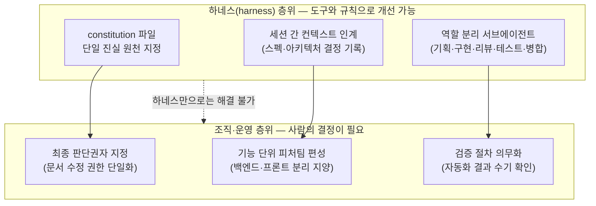
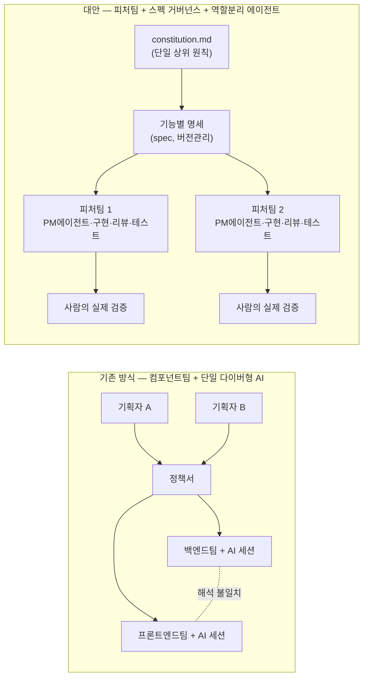

## 1. 문제의 발단

10명 규모의 인력이 투입된 SI 프로젝트가 바이브코딩 방식으로 처음부터 진행되고 있다는 사례가 공유되었다. 진행 방식은 기존 SI 프로젝트와 동일했다. 기획 2명, 백엔드 개발자, 프론트엔드 개발자로 역할을 나누어 각자 맡은 영역을 진행하는 구조다. 풀스택 단위로 기능별로 팀을 나누자는 제안이 있었지만 받아들여지지 않았고, 프로젝트는 기존 조직 구조 위에 AI 도구만 얹은 채로 진행되었다.

중간 결과는 100점 만점에 50점으로 자체 평가되었다. 구체적으로 드러난 문제는 크게 네 가지였다. 기획자 2명이 정책서와 명세서를 각자 작성하면서 AI가 세션마다 다른 의견을 내는 바람에 문서가 끝없이 수정되는 상황이 벌어졌다. 백엔드와 프론트엔드로 나뉜 개발자들은 각자의 AI가 기획서를 서로 다른 관점에서 해석하는 탓에 한 페이지를 완성하는 데도 애를 먹었고, 이 역시 무한 수정의 굴레로 이어지고 있었다. 개발자 중 일부는 자동화 스킬의 결과만 믿고 실제 화면을 열어 테스트하는 과정을 생략했으며, AI가 작성한 코드에는 AI 특유의 압축적인 주석이 달려 있어 사람이 코드를 읽고 판단하는 과정 자체가 사실상 마비되어 있었다.

이 사례를 접하고 떠오르는 질문은 세 가지로 정리할 수 있다. 이런 문제는 하네스, 즉 AI에게 주는 지시 체계와 작업 환경을 잘 설계하면 극복할 수 있는 것인가. 아니면 하네스를 넘어서는 별도의 바이브코딩 방법론이 필요한 것인가. 그리고 그 답은 지금 업계에서 실제로 어떻게 나오고 있는가. 이 문서는 최근 발표된 업계 데이터와 방법론 동향을 근거로 이 세 질문에 답해보려는 시도다.

## 2. 특이한 사례가 아니다 — 업계 데이터가 말하는 것

먼저 확인해야 할 것은 이 프로젝트가 겪은 문제가 특정 팀의 미숙함 때문이 아니라 바이브코딩을 팀 단위, 기업 단위로 확장할 때 반복적으로 나타나는 구조적 패턴이라는 점이다.

구글 클라우드 산하 DORA(DevOps Research and Assessment) 팀이 2025년 9월 발표한 《State of AI-assisted Software Development》 보고서는 이 현상을 "AI는 증폭기다(AI is an amplifier)"라는 한 문장으로 요약했다. 5,000명에 가까운 기술 전문가를 설문하고 100시간 이상의 정성 인터뷰를 더한 이 보고서에 따르면, AI 도입률은 90%에 이르렀고 개인 차원의 생산성 체감도도 높았지만, 배포 안정성은 오히려 떨어졌다. DORA 리드인 네이슨 하비는 이를 두고 AI가 이미 잘 작동하는 조직의 강점은 더 키우고, 병목이 있는 조직의 문제는 그대로 증폭시킨다고 설명했다. 탄탄한 자동 테스트, 성숙한 버전 관리, 빠른 피드백 루프를 갖춘 팀은 AI가 만들어내는 변경량 증가를 더 빠른 딜리버리로 전환하지만, 그런 기반이 없는 팀은 같은 변경량 증가가 곧바로 불안정성으로 돌아온다는 것이다. 2026년 5월 발표된 후속 조사(InfoQ 보도)도 같은 결론을 한 해 더 확인해주었다. 강한 엔지니어링 기반이 AI 투자 수익률을 결정한다는 것이다.

이 관점에서 보면 게시물에 묘사된 프로젝트는 전형적인 "증폭 사례"에 해당한다. 정책서를 각기 다른 관점으로 수정하던 기존의 비효율, 백엔드와 프론트엔드 사이의 소통 비용, 테스트를 생략하는 관행은 AI가 도입되기 전에도 존재했을 가능성이 높은 조직의 약점이다. AI는 이 약점을 없애준 것이 아니라 작업 속도와 변경량을 키워서 약점이 드러나는 속도까지 함께 높인 것이다.

품질 문제를 뒷받침하는 수치도 여럿 발표되었다. 베라코드(Veracode)의 2025년 GenAI 코드 보안 리포트는 100개 이상의 언어 모델이 생성한 코드를 자바, 자바스크립트, 파이썬, C# 전반에 걸쳐 테스트한 결과 AI 생성 코드 샘플의 45%에서 OWASP 상위 10대 취약점이 발견되었다고 밝혔다. 2026년 발표된 AppSec Santa의 별도 연구는 GPT-5.2, Claude Opus 4.6, Gemini 2.5 Pro를 포함한 6개 모델의 코드 샘플 534개를 검증해 25.1%에서 실제로 악용 가능한 결함을 확인했다. 보안 업체 Aikido Security는 기업 보안 침해 사고 5건 중 1건이 AI 생성 코드에서 비롯된다고 보고했다(2026년 게재 블로그 인용). 가트너는 2027년까지 에이전틱 AI 프로젝트의 40% 이상이 취소되거나 폐기될 것으로 전망했는데, 여러 매체는 이 실패의 원인이 기술 자체보다 거버넌스와 운영 체계의 부재에 있다고 지적한다.

2026년 1월에 개정 공개된 MSR(Mining Software Repositories) '26 연구도 비슷한 패턴을 보여준다. 커서(Cursor)를 도입한 806개 깃허브 저장소를 분석한 결과, 초기에는 큰 폭의 속도 향상이 있었지만 이는 일시적이었고, 정적 분석 경고와 코드 복잡도는 지속적으로 상승하는 추세가 확인되었다(Augment Code 정리, 2026년 4월). 바이브코딩이 만들어내는 속도는 실재하지만, 그 속도가 그대로 유지되지는 않는다는 뜻이다.

## 3. 게시물 속 네 가지 실패 패턴 해부

### 3-1. 정책서·명세서의 무한 루프 — "진실의 원천"이 없다

기획자 두 명이 각자 AI와 세션을 이어가며 정책서를 수정했고, 그 결과 세션마다 다른 결론이 문서에 반영되면서 끝나지 않는 수정 루프가 만들어졌다. 이 현상의 본질은 AI의 변덕이 아니라 "이 문서에서 무엇이 최종 진실인가"를 판단할 단일한 기준이 존재하지 않았다는 데 있다. 같은 질문에 대해 AI 세션마다 다른 답을 내는 것은 지극히 정상적인 동작이다. 각 세션은 그 이전 세션의 논의 맥락을 알지 못하고, 문서에 담긴 모순을 스스로 감지할 근거도 없기 때문이다. 사람 두 명이 각자 다른 AI 세션을 통해 같은 문서를 고치는 구조는, 최종 결정권자 없이 두 명의 합의되지 않은 의견이 하나의 문서에 동시에 반영되는 구조와 다르지 않다.

### 3-2. 백엔드·프론트엔드 분리 — 컴포넌트팀 구조가 AI 시대와 충돌한다

풀스택 기능 단위로 나누자는 제안이 기각되고 기존처럼 백엔드팀과 프론트엔드팀으로 나뉜 결과, 각 팀의 AI가 같은 기획서를 서로 다른 관점에서 읽고 서로 어긋나는 구현을 만들어냈다. 이 구조는 소프트웨어 공학에서 오래전부터 "컴포넌트팀"과 "피처팀"으로 구분해온 조직 설계 문제와 정확히 겹친다. 컴포넌트팀은 특정 기술 계층(백엔드, 프론트엔드, 데이터베이스 등)을 전담하는 팀으로, 계층 내부의 전문성은 높아지지만 하나의 사용자 가치를 완성하려면 여러 팀 간의 조율이 필수적으로 발생한다. 반대로 피처팀은 하나의 기능을 처음부터 끝까지 완성할 수 있는 모든 역량을 갖춘 팀으로, 조율 비용이 크게 줄어든다. Craig Larman(LeSS 프레임워크 저자)은 피처팀을 "여러 기능을 처음부터 끝까지 완성하는, 장기간 유지되는 교차 기능팀"으로 정의하며, 이 방식이 가치 전달 속도를 높이는 거의 보편적인 조직 설계 원칙으로 자리잡았다고 설명한다.

AI 에이전트가 개발 과정에 들어오면 이 문제는 완화되는 것이 아니라 오히려 심해진다. 사람 사이의 조율은 회의나 슬랙 메시지로라도 이루어지지만, 서로 다른 AI 세션은 상대방이 무엇을 결정했는지 알 방법이 없다. 결과적으로 백엔드 AI와 프론트엔드 AI는 같은 명세서를 놓고 서로 다른 데이터 구조, 서로 다른 API 계약을 "각자 논리적으로 타당하게" 만들어낸다. 게시물에서 "한 페이지 완성도 힘들다"고 묘사한 상황은 이 어긋남이 누적된 결과로 볼 수 있다.

### 3-3. 인간 판단의 실종, 자동화에 대한 맹신

한 개발자는 자동화 스킬의 실행 결과만 믿고 실제 화면을 열어 테스트하지 않았고, 다른 개발자들도 비슷한 모습을 보였다는 대목은 앞서 언급한 DORA의 "증폭기" 개념과 정확히 맞닿아 있다. 2026년 발표된 DORA의 후속 연구(LinearB 정리 기준)는 AI 도입이 만들어내는 두 가지 숨은 비용을 지목한다. 하나는 "검증세(verification tax)"로, AI가 절약해준 코딩 시간이 그럴듯해 보이지만 실제로는 확인이 필요한 산출물을 검토하는 시간으로 다시 소모된다는 것이다. 다른 하나는 "불안정성세(instability tax)"로, DORA 조사에서 AI 도입이 배포 안정성에 미치는 영향은 개인 생산성 다음으로 큰 부정적 효과로 나타났다. 검증 절차 없이 자동화 결과를 그대로 신뢰하는 것은 이 검증세를 아예 지불하지 않겠다는 선택이며, 그 대가는 필연적으로 불안정성세로 되돌아온다.

### 3-4. 읽을 수 없는 코드 — 기술부채와 이른바 "바이브 슬롭"

AI가 작성한 코드에 AI 특유의 주석이 달리면서 개발자들이 코드를 들여다보길 포기했다는 대목도 여러 매체가 공통으로 지적하는 문제다. 개발자 커뮤니티 논의를 정리한 한 국내 블로그(wikidocs, 2026년 5월)는 이런 현상을 "바이브 슬롭(Vibe Slop)"이라는 표현으로 부르기 시작했다고 전한다. 이는 아직 학계나 업계의 공식 용어라기보다 개발자 커뮤니티에서 통용되기 시작한 속어에 가깝지만, 가리키는 현상은 분명하다. 겉으로는 동작하는 것처럼 보이지만 설계도 없고 테스트도 없는 코드가 수천 줄 쌓여 있는 상태다. 나중에 버그 하나를 잡으려면 전체 구조를 다시 파악해야 하는 상황이 생기고, 처음부터 사람이 직접 설계해서 짰을 때보다 오히려 더 많은 시간이 드는 역설이 발생한다. 미국의 개발 조직 분석 매체 Level Up Coding(2026년 5월)은 이를 "명시적 의도의 부재"라는 말로 표현했다. 바이브코딩 산출물은 무엇을 만들었는지는 보여주지만 왜 그렇게 만들었는지는 기록하지 않으며, 6개월 뒤 다른 사람이 코드를 고치려 할 때 참고할 스펙도, 설계 결정 기록도 남아있지 않다는 것이다.

## 4. 첫 번째 질문 — 하네스로 극복 가능한가

결론부터 말하면 하네스는 이 문제의 일부만 해결할 수 있다. 하네스가 실제로 풀 수 있는 문제와, 하네스만으로는 풀리지 않는 문제를 구분해서 봐야 한다.

하네스 설계로 개선 가능한 영역은 주로 "AI가 일관된 판단을 유지하게 만드는" 층위에 있다. GitHub가 2025년 9월 공개한 오픈소스 도구 Spec Kit는 이 층위의 해법을 구체적으로 제시한다. 핵심은 "constitution(헌법) 파일"이라 부르는 상위 규칙 문서를 프로젝트 루트에 두고, 모든 AI 세션이 새로운 작업을 시작하기 전에 이 문서를 먼저 읽도록 강제하는 것이다. Spec Kit 공식 문서는 이 구조를 두고 "AI를 코드 생성기에서 아키텍처 파트너로 바꾸는 것"이라고 설명한다. 정책서가 세션마다 흔들렸던 문제는, 정책서를 수정할 수 있는 권한과 절차를 명시한 단일 상위 문서 없이 여러 세션이 동등한 자격으로 같은 문서를 고쳐 썼기 때문에 발생한 것이므로, 이 계층을 하네스 차원에서 강제하면 상당 부분 완화된다.

역할을 나눈 서브에이전트 구조도 하네스 차원의 해법이다. 소프트웨어 엔지니어링 조직 IT Revolution의 콘퍼런스에서 스티브 예기(Steve Yegge, Sourcegraph)와 진 킴(Gene Kim, 《피닉스 프로젝트》 저자)은 2025~2026년에 걸쳐 이 문제를 "혼자 잠수하는 다이버"에서 "개미떼"로 전환해야 한다는 비유로 여러 차례 설명했다. 컨텍스트 창을 아무리 키워도 결국 한 명의 에이전트가 혼자 코드베이스라는 바다에 잠수해서 방향을 잃는 것은 마찬가지이며, 해법은 산소통을 더 키우는 것이 아니라 잠수부를 여러 명으로 나누는 것이라는 주장이다. 제품 요구사항을 정리하는 에이전트, 구현하는 에이전트, 리뷰하는 에이전트, 테스트하는 에이전트, 병합을 담당하는 에이전트로 역할을 쪼개면 각 에이전트의 컨텍스트가 좁고 명확해져 판단의 질이 올라간다는 것이다. 이는 작업 분해(task decomposition)와 점진적 정제(successive refinement)라는 소프트웨어 공학의 오래된 원칙을 에이전트 오케스트레이션에 그대로 적용한 것에 가깝다.

반면 하네스만으로는 풀리지 않는 영역도 분명하다. 백엔드팀과 프론트엔드팀으로 조직을 나눈 것은 하네스 설정이 아니라 인력 배치, 즉 조직 설계의 문제다. 아무리 정교한 프롬프트와 규칙 파일을 갖추어도,애초에 서로 다른 사람이 서로 다른 AI 세션으로 같은 기능을 양쪽에서 접근하는 구조 자체를 하네스가 대신 조율해줄 수는 없다. 마찬가지로 자동화 결과를 검증 없이 신뢰하는 문제도 하네스의 결함이 아니라 그 하네스를 사용하는 사람이 검증 절차를 생략하기로 한 판단의 문제다. 아무리 좋은 테스트 자동화 스킬을 갖추어도, 그 결과를 실제로 열어보고 판단하는 마지막 단계를 사람이 생략하면 하네스는 이를 막을 수 없다.

정리하면, 하네스는 "AI가 일관되게, 좁은 책임 범위 안에서, 검증 가능한 형태로 일하게 만드는" 문제는 풀어줄 수 있지만, "사람이 어떤 단위로 팀을 나눌 것인가"와 "사람이 검증을 실제로 수행할 것인가"라는 두 가지 문제는 조직과 개인의 실행 규율에 달려 있다. 게시물이 언급한 50점짜리 결과의 상당 부분은 후자, 즉 하네스 바깥의 영역에서 기인했을 가능성이 높다.

## 5. 두 번째 질문 — 바이브코딩 방법론이 필요한가

하네스만으로 부족하다면 그 다음 단계는 무엇인가. 2025년 하반기부터 업계에서 빠르게 수렴하고 있는 답은 "스펙 주도 개발(Spec-Driven Development, SDD)"이라는 방법론이다. 이는 완전히 새로운 발명이라기보다, 명세를 먼저 작성하고 코드를 그 산출물로 다루는 오래된 소프트웨어 공학 원칙을 AI 에이전트 시대에 맞게 재정립한 것에 가깝다.

SDD의 핵심 규칙은 명확하다. 명세가 진실의 원천이고, 코드는 그 명세로부터 생성되는 산출물이다. 채팅 로그도 아니고, "에이전트가 마지막에 뭐라고 짰는지"도 아니고, 누군가의 머릿속에만 있는 암묵지도 아니다. GitHub Spec Kit 공식 저장소의 설명을 빌리면, 명세는 시스템이 무엇을 하는지(엔티티, 워크플로, API), 어떤 제약 아래서 동작해야 하는지(인증, 테넌시, 컴플라이언스), 왜 그런 결정을 내렸는지(아키텍처 결정 기록)를 함께 담는다. 이 방식을 실제로 지원하는 도구도 여럿 등장했다. GitHub의 Spec Kit는 그린필드 프로젝트를 위한 오픈소스 CLI 툴킷이고, OpenSpec은 이미 존재하는 코드베이스(브라운필드)에 변경 사항을 추가할 때 쓰는 경량 도구이며, BMad Method는 21개의 전문화된 AI 에이전트를 갖춘 엔터프라이즈용 프레임워크다. 아마존 웹서비스가 2025년 11월 정식 출시한 Kiro도 같은 철학을 담은 에이전틱 IDE다. 소프트웨어 컨설팅사 소트웍스(Thoughtworks)의 기술 레이더는 2025년 11월(볼륨 33)에 SDD를 "평가해볼 만한(Assess)" 단계로 처음 등재했고, 2026년 4월(볼륨 34)에는 GitHub Spec Kit 자체를 같은 등급으로 추가했다. 다만 소트웍스는 이 워크플로가 아직 다소 복잡하고 방식이 강하게 정해져 있어, 일부 도구가 만들어내는 스펙 파일은 리뷰하기 어렵다는 유보 의견도 함께 남겼다.

게시물이 겪은 "정책서 무한 수정" 문제에 SDD를 적용해보면 해법의 방향이 분명해진다. 정책서와 명세서를 여러 사람이 AI 세션을 통해 동시에 자유롭게 고치는 대신, 상위 원칙을 담은 단일 constitution 문서를 먼저 확정하고, 그 아래에서 개별 기능 명세를 만들고, 명세가 확정된 뒤에야 구현에 들어가는 순서를 강제하는 것이다. 이 순서를 지키면 "AI가 세션마다 다른 의견을 낸다"는 문제 자체가 성립하지 않는다. AI가 참조할 진실은 그때그때의 대화가 아니라 버전 관리되는 문서이기 때문이다.

한편 이런 체계를 도입하더라도 보안이나 결제처럼 민감한 영역까지 바이브코딩으로 처리하는 것은 여전히 위험하다는 지적도 있다. Anthropic 소속 연구원이자 《Building Efficient Agents》 공동 저자인 에릭 슐런츠(Erik Schluntz)는 2026년 초 공개해 널리 회자된 발표에서, 프로덕션 환경에서 책임 있게 바이브코딩을 하려면 개발자가 "코드를 직접 쓰는 사람"에서 "Claude의 PM(Product Manager)"으로 역할을 바꿔야 한다고 말했다(중국어 매체 36Kr이 2026년 4월 정리). 실무적으로는 프롬프트 한 줄을 던지는 대신 15~20분을 들여 코드베이스를 탐색하고, 영향받는 파일을 식별하고, 실행 계획을 세운 뒤 그 맥락을 하나의 상세한 프롬프트로 정리해서 전달하는 방식이다. "이거 만들어줘"가 아니라 "이 코드베이스의 이 파일들에, 이런 제약 조건 아래, 이런 결과물을 만들어라"를 전달하는 것이 핵심이다. AI 역량 측정 연구기관 METR의 데이터를 인용한 같은 분석은 프론티어 모델이 안정적으로 처리할 수 있는 작업 분량이 약 7개월마다 두 배씩 늘고 있으며 현재는 약 50분 분량의 작업까지 처리한다고 전하는데, 이는 작업을 잘게 쪼개 넘길수록 AI가 안정적으로 완수할 가능성이 높아진다는 뜻이기도 하다.

보안이 특히 중요한 조직에서는 아예 코드를 두 갈래로 나누는 "투 트랙 전략"도 제안된다. IT 매체 CIO(2026년 칼럼)는 배포 파이프라인 통과만을 목표로 삼아 의존성을 환각하고 테스트를 조작하는 방식으로 짜인 코드가 코드베이스의 상당 부분을 차지한다면 이는 소프트웨어가 아니라 "모래성"에 가깝다고 지적하며, 생성형 AI 사용을 금지하는 것은 현실적이지 않지만 확률적 특성을 지닌 바이브코딩이 프로덕션 시스템의 아키텍처 자체를 좌우하도록 방치해서도 안 된다고 주장한다. 인증, 암호화, 권한 모듈처럼 보안에 결정적인 인프라는 미리 정의된 형태로 고정해두고 AI는 그 위의 애플리케이션 계층에서만 생성과 반복 작업을 하도록 분리하는 방식이다(Vybe 블로그, 2026년 7월 정리).

## 6. 조직 구조를 다시 짜야 한다 — 피처팀과 바운디드 에이전시

방법론과 하네스를 아무리 잘 갖추어도, 애초에 사람을 백엔드와 프론트엔드로 나누어 배치한 조직 설계가 그대로 남아있다면 근본 문제는 반복된다. 이 지점에서 참고할 만한 것이 2026년 3월 런던에서 열린 QCon London에서 나온 논의다.

《Team Topologies》의 공동 저자 매튜 스켈턴(Matthew Skelton)은 이 콘퍼런스에서 기업의 AI 투자 대비 성과가 나지 않는 근본 원인이 기술이 아니라 조직 구조에 있다고 지적했다(InfoQ 보도, 2026년 3월). 그가 제시한 핵심 개념은 "바운디드 에이전시(bounded agency)"다. AI에게 위임하는 권한과 자율성은 명확한 경계와 가드레일 안에서 제한되어야 신뢰할 수 있다는 뜻이다. 그는 이미 사람에게 바운디드 에이전시를 부여하는 방식으로 조직을 설계해온 기업일수록 에이전트 도입으로의 전환이 훨씬 수월하다고 언급했으며, AI 도구에 데이터 자원에 대한 무제한 접근 권한을 부여하는 경향을 OWASP가 "과도한 에이전시(Excessive Agency, LLM06)"라는 이름으로 공식화한 취약점 항목과 연결지었다.

이 논의는 소프트웨어 공학에서 이미 정립되어 있던 "피처팀 대 컴포넌트팀" 논쟁과 정확히 맞물린다. 컴포넌트팀 구조에서는 하나의 기능이 여러 팀의 백로그를 순차적으로 거쳐야 완성되므로 가치 전달 속도가 느려질 수밖에 없다. 반대로 피처팀은 하나의 기능을 처음부터 끝까지 완성할 수 있는 모든 역량(화면, 서비스 로직, 데이터베이스)을 한 팀 안에 갖춘다. 게시물에서 언급된 "풀스택으로 기능별로 나누자"는 제안은 바로 이 피처팀 구조를 제안한 것이었고, 소프트웨어 공학계가 이미 거의 보편적으로 받아들인 조직 설계 원칙과 일치한다. AI 에이전트가 들어온 시대에는 이 원칙이 선택 사항이 아니라 필수에 가까워진다. 사람 사이의 조율은 최소한 회의나 메신저로라도 이루어지지만, 서로 다른 AI 세션 사이에는 그런 자연스러운 조율 채널이 존재하지 않기 때문이다.

Steve Yegge와 Gene Kim이 함께 쓴 책 《Vibe Coding》과 이후 발표들이 강조하는 것도 결국 같은 방향이다. 여러 에이전트를 병렬로 쓰는 것이 앞으로 엔지니어가 일하는 방식이 될 것이라 보면서도, 그 오케스트레이션을 다이버 한 명에게 더 큰 산소통을 달아주는 방식(단일 에이전트에게 더 큰 컨텍스트 창)이 아니라, 역할이 분리된 여러 에이전트를 조율하는 방식으로 풀어야 한다고 반복해서 강조한다. 이는 조직 차원에서 피처팀을 구성하는 원칙을, 그 팀 내부에서 사용하는 AI 에이전트 오케스트레이션에도 그대로 적용해야 한다는 뜻이기도 하다.

## 7. 이 프로젝트라면 무엇을 바꿔야 하는가

지금까지의 근거를 종합하면 게시물이 던진 세 질문에 대한 답은 다음과 같이 정리된다.

하네스만으로 극복할 수 있느냐는 질문에는 부분적으로만 가능하다는 답이 맞다. constitution 파일과 같은 단일 진실 원천 장치, 세션 간 결정 기록을 인계하는 구조, 역할을 분리한 서브에이전트 운용은 하네스 설계로 상당 부분 개선할 수 있다. 그러나 백엔드·프론트엔드로 나뉜 조직 구조와, 자동화 결과를 검증 없이 신뢰하는 관행은 하네스가 아니라 조직과 개인의 결정 문제이며, 이 두 가지를 바꾸지 않는 한 아무리 정교한 하네스를 얹어도 같은 유형의 실패가 반복될 가능성이 높다.

바이브코딩 방법론이 필요하냐는 질문에는 이미 업계가 그 답을 만들어가고 있다는 것이 사실에 가깝다. 다만 그것은 "바이브코딩 전용의 새로운 무언가"라기보다, 스펙 주도 개발이라는 이름으로 재정립되고 있는, 명세를 진실의 원천으로 삼고 코드를 산출물로 다루는 원칙에 가깝다. 이 원칙을 팀 규모에 맞게 도구화한 것이 GitHub Spec Kit, OpenSpec, BMad Method 같은 오픈소스 프레임워크들이다. 10인 규모의 조직이라면 처음부터 무거운 프레임워크를 통째로 들여오기보다, 핵심 원칙 — 단일 상위 문서, 명세 확정 후 구현 착수, 명세 변경 권한의 단일화 — 만이라도 먼저 적용해보는 편이 현실적이다.

마지막으로 조직 구조에 대해서는, 게시물 작성자가 이미 제안했던 방향, 즉 겹치지 않는 최소 인력으로 기능 단위 풀스택 팀을 꾸리는 방식이 소프트웨어 공학과 최신 업계 논의 양쪽에서 공통적으로 뒷받침되는 방향이다. 여기에 더해 각 피처팀 내부에서도 하나의 AI에게 기획부터 구현, 테스트까지 전부 맡기기보다 역할을 나눈 여러 개의 좁은 책임 범위 에이전트를 오케스트레이션하는 방식을 검토할 만하다. 그리고 어떤 체계를 택하든, 자동화가 만든 결과를 사람이 실제로 열어보고 판단하는 마지막 단계는 어떤 하네스나 방법론으로도 대체되지 않는다는 점은 분명히 짚어야 한다.

## 8. 결론

바이브코딩으로 프로젝트가 산으로 가는 근본 원인은 AI의 성능 부족이 아니라, AI가 기존 조직의 약점을 있는 그대로 증폭시켰다는 데 있다는 것이 지금까지 살펴본 여러 독립적인 연구와 사례들이 가리키는 공통된 결론이다. 하네스는 이 증폭 효과 중 도구와 규칙으로 다룰 수 있는 부분, 즉 AI가 일관되고 검증 가능한 방식으로 일하게 만드는 부분에서는 분명히 효과가 있다. 그러나 최소 인력으로 영역이 겹치지 않게 팀을 구성하는 것, 그리고 자동화의 결과를 사람이 직접 확인하는 마지막 단계는 하네스가 아니라 조직의 선택과 개인의 규율에 달려 있다. 게시물이 스스로 정리한 교훈 — "바이브코딩은 최소한의 인력으로 서로 분야가 겹치지 않고 진행해야 한다"는 통찰은, 지금 업계가 도달하고 있는 결론과 정확히 같은 방향을 가리키고 있다.

## 참고 자료 및 사실관계 확인

| 구분 | 내용 | 출처 |
|---|---|---|
| 다수 독립 출처로 확인됨 | DORA "AI는 증폭기다" 결론, 배포 안정성 저하 | DORA 《State of AI-assisted Software Development》(2025.9), InfoQ(2026.5), hyperdev.matsuoka.com, pulse.support |
| 다수 독립 출처로 확인됨 | 바이브코딩 용어의 기원(카파시, 2025년 2월) | Tembo.io(2026.7), 36Kr(2026.4), wikidocs 블로그 |
| 다수 독립 출처로 확인됨 | 스펙 주도 개발(SDD) 및 GitHub Spec Kit 존재·구조 | github/spec-kit 공식 저장소, Microsoft for Developers, Augment Code(2026.4), Thoughtworks Technology Radar 볼륨 33·34 |
| 다수 독립 출처로 확인됨 | Team Topologies·바운디드 에이전시 논의(QCon London 2026) | InfoQ(2026.3), teamtopologies.com, qconlondon.com |
| 단일 출처, 참고용 | 베라코드 45% OWASP 취약점, AppSec Santa 25.1% 수치 | gaincafe.com 블로그(2026.5)가 인용한 수치이며 원 리포트 직접 확인은 권장 |
| 단일 출처, 참고용 | "바이브 슬롭(Vibe Slop)" 용어 | wikidocs 블로그(2026.5) — 아직 공식 용어가 아닌 커뮤니티 속어 성격 |
| 단일 출처, 참고용 | 에릭 슐런츠의 "Claude의 PM" 발표 요약 | 36Kr(2026.4)의 발표 정리 기사 기반 — 원 발표 영상 직접 확인은 권장 |
| 개인 사례, 검증 불가 | 게시물에 서술된 SI 프로젝트의 세부 정황과 평가 점수 | 공유된 게시물 원문에만 근거하며 제3자 검증은 이루어지지 않음 |

---

작성일자: 2026년 9월 24일
