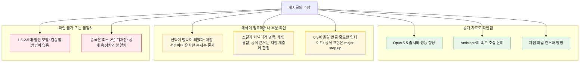
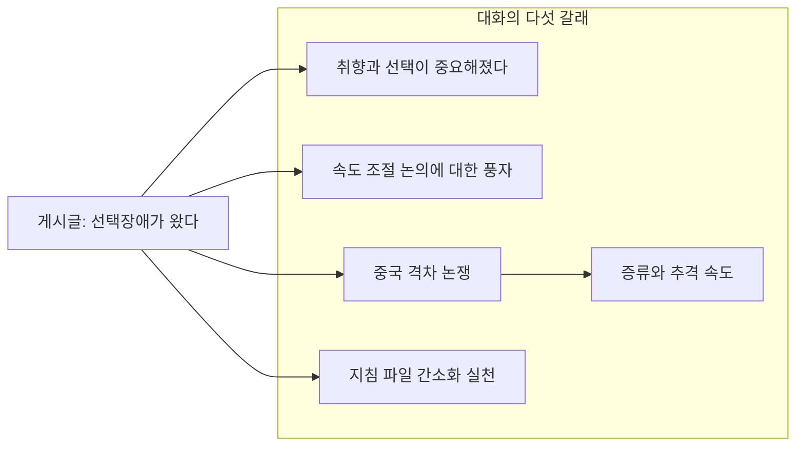
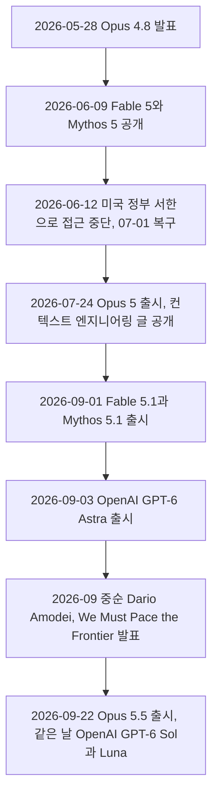
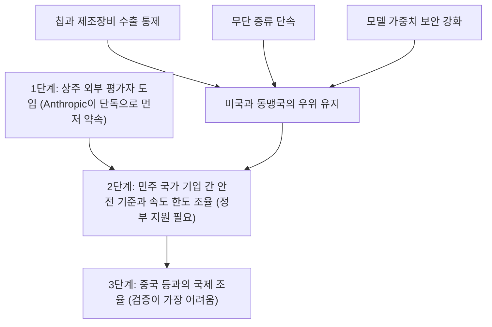

- 작성 기준일: 2026-09-24
- 대상: Threads 게시글(계정 choi.openai)과 그 아래 댓글 6개
- 방법: 게시글의 각 주장을 공개 자료(Anthropic 공식 문서, Dario Amodei의 글, 주요 매체 보도, 제3자 집계)와 대조하고, 확인 여부를 등급으로 표시했습니다.

> 
> **선택장애가 왔다.**
> 
> Opus 5.5가 주는 결과물이 너무 뛰어나서 고르는
> 것 자체가 병목이 되었고 이제 소비자의 취향(taste)을 맞춰가는게 중요해진 것 같다.
> 
> 앤트로픽이 버전을 0.5씩 올릴만큼 중요한 업데이트라고 보여지는데 충분히 그 정도의 도약이 있다.
> 
> 프론티어 랩에 최소 1.5-2세대 앞서있는 모델이 있다는 걸 감안하면 AI 감속론이 절대 허상이 아니다.
> (중국은 미국 프론티어에 최소 2년은 뒤쳐져있다.)
> 
> 여러 스킬과 커넥터 자체가 병목인 것 같아 다 걷어내는 중이다.
> 
> 진짜 경이로운 정도다.
> 
>  https://www.threads.com/share/BBbllcI1PL/
> 

---

## 0. 이 문서를 읽는 방법

이 문서는 게시글이 무슨 말을 하는지 풀어 설명하는 데서 끝나지 않고, 그 말이 어디까지 사실로 뒷받침되는지를 함께 따져 봅니다. 게시글 원문과 댓글은 제공해 주신 텍스트를 기준으로 했습니다. 게시글 링크는 사이트 정책상 자동 열람이 차단되어 직접 열어 보지 못했으므로, 링크를 통해 볼 수 있는 부가 정보(전체 댓글, 정확한 게시 시각 등)는 반영하지 못했습니다. 게시 시각은 "약 11시간 전"이라는 상대 표기만 알 수 있어서 정확한 게시일은 알 수 없지만, 내용상 Opus 5.5 발표일인 2026-09-22 이후에 쓰인 글입니다.

본문에서 근거를 다음 네 등급으로 구분합니다. 각 주장 뒤의 대괄호 숫자는 문서 끝 "9. 참고 자료"의 번호입니다.

| 등급 | 뜻 | 예 |
| --- | --- | --- |
| A | 공식 1차 자료 | Anthropic 발표문, Claude Platform 문서, Dario Amodei 개인 사이트 |
| B | 주요 매체·연구기관 보도 | TechCrunch, MacRumors, CSIS 등 |
| C | 제3자 집계·해설·블로그 | 가격 비교 사이트, 추적 사이트, 개발자 블로그 |
| D | 게시자·댓글 작성자의 의견 | 검증 대상 |

벤더(Anthropic) 스스로 보고한 성능·비용 수치는 공식 자료이지만 이해관계가 있는 발표라는 점을 잊지 않도록 "벤더 보고"라고 따로 적었습니다.

---

## 1. 먼저 결론

게시글은 2026-09-22에 나온 Claude Opus 5.5를 써 본 소감으로 시작해, 업계 전체의 속도 논쟁과 미중 격차로 이야기를 넓히고, 마지막에는 자신의 작업 방식(스킬과 커넥터 정리)으로 돌아옵니다. 개인의 체감 → 업계 해석 → 실천 → 감탄의 흐름입니다.

공개 자료로 확인되는 부분은 분명합니다. Opus 5.5가 실제로 출시되었고, Anthropic은 이 모델이 대부분의 작업에서 상위 모델인 Fable 5.1 수준이면서 비용은 Opus 5보다 40% 낮다고 밝혔습니다[1]. Anthropic의 CEO가 "AI 발전 속도를 늦춰야 한다"는 취지의 글을 쓴 것도 사실입니다[4]. 그리고 새 세대 모델에서는 CLAUDE.md 같은 지침을 과도하게 쓰지 말라는 공식 방향이 실제로 존재합니다[3][19][20].

반면 두 가지 수치 주장은 공개 자료로 확인되지 않습니다. "프론티어 랩에 최소 1.5-2세대 앞선 모델이 있다"는 주장은 검증할 방법이 없고, "중국은 미국 프론티어에 최소 2년 뒤처져 있다"는 주장은 이 문서가 찾은 공개 측정치(대략 3개월에서 8개월)와 맞지 않습니다[12][13][14][15]. "스킬과 커넥터 자체가 병목"이라는 부분은 게시자의 개인 경험이며, 공식 자료가 뒷받침하는 범위는 스킬·CLAUDE.md 같은 지침 계층에 한정됩니다.

---

## 2. 게시글과 댓글은 어떤 내용인가

### 2.1 게시글 본문

게시글은 짧은 문단 여섯 개로 이루어져 있습니다. 표시된 반응은 좋아요 122, 답글 7, 리포스트 8, 공유 3입니다.

첫 문장은 "선택장애가 왔다"는 선언입니다. 뷔페에 갔는데 메뉴가 전부 너무 맛있어서 오히려 무엇을 먹을지 못 고르는 상황을 떠올리면 이해가 쉽습니다. 게시자는 Opus 5.5가 내놓는 결과물이 너무 뛰어나서 "고르는 것 자체가 병목"이 되었고, 이제는 소비자의 취향(taste)에 맞춰 가는 일이 중요해진 것 같다고 말합니다. 품질이 어느 수준을 넘으면 "잘 만드는 것"보다 "무엇이 내 기준에 맞는지 판단하는 것"이 어려운 일이 된다는 주장입니다.

두 번째 문단은 버전 번호를 근거로 삼습니다. Anthropic이 버전을 0.5씩 올릴 만큼 중요한 업데이트로 보이고, 실제로 그만한 도약이 있다는 것입니다.

세 번째 문단이 가장 논쟁적입니다. 프론티어 랩(최첨단 모델을 만드는 연구소)에는 공개된 것보다 최소 1.5~2세대 앞선 모델이 있을 텐데, 그 점을 감안하면 "AI 감속론"이 결코 허상이 아니라고 합니다. 괄호 안에는 중국이 미국 프론티어에 최소 2년은 뒤처져 있다는 주장이 덧붙어 있습니다.

네 번째 문단은 실천 내용입니다. 여러 스킬과 커넥터 자체가 병목인 것 같아 전부 걷어내는 중이라고 합니다. 마지막 문단은 "진짜 경이로운 정도다"라는 감탄입니다.

### 2.2 댓글 여섯 개

댓글은 크게 네 갈래로 나뉩니다.

- 공감과 실천: gongpenclaw는 자신도 그동안 쓰던 claude.md를 대폭 간소화하는 것부터 시작했다고 씁니다. lotusyejin은 소비자 취향이 중요해졌다는 말에 격하게 동의하며 Opus 5.5가 놀랍다고 말합니다.
- 풍자: branderslow는 "발전 속도 다같이 늦추자며…"라고 ㅋㅋㅋ와 함께 쓰고, yuhyeonseog388은 "발전 속도 늦추는 건 뻥이었네요"라고 받습니다. 둘 다 속도 조절을 말하던 쪽이 오히려 빠르게 신모델을 내놓는다는 아이러니를 짚는 반응입니다.
- 반론: ste_k17은 중국이 2년씩이나 뒤처졌다고 하기에는 무리가 있다고 말합니다. 오푸스 4.8이 "전투력 측정기 수준"이라 중국 모델도 수개월이면 따라잡을 것이고, 딥식 플래시는 이미 20배 싸면서 성능이 "8-90%"라고 덧붙입니다.
- 증류: singandmong은 "증류도 그만큼 빨라집니다"라고 씁니다.

---

## 3. 배경 지식: Opus 5.5는 무엇인가

### 3.1 모델 계보와 시간표

Anthropic의 모델은 크기와 성능에 따라 Haiku, Sonnet, Opus 세 단계가 있고, 그 위에 Fable과 Mythos라는 최상위 계열이 있습니다[9]. Fable 5.1과 Mythos 5.1은 같은 모델이며 안전장치 수준만 다릅니다. Fable 5.1은 일반에 공개되어 있고 Mythos 5.1은 검증된 사이버보안·생명과학 기관만 쓸 수 있습니다[6]. 최근 흐름은 아래와 같습니다.

시간표의 근거는 다음과 같습니다. Opus 4.8 발표일과 6월의 접근 중단 경위는 Wikipedia 문서[22]에, 접근 복구는 Anthropic 안내[26]에 따랐습니다. Opus 5 출시일은 TechCrunch[7]와 개발자 블로그[21]에, Fable 5.1 출시일은 9to5Mac 보도[25]와 Anthropic 발표문[6]에, GPT-6 Astra와 Sol·Luna 출시는 Decrypt[10]에 있습니다. Dario의 글은 "2026년 9월"이라고만 표기되어 있는데, Opus 5.5 발표문이 이를 "지난주"라고 언급하므로[1] 9월 중순으로 적었습니다.

버전 번호를 눈여겨볼 만합니다. 이 문서가 확인한 공개 자료 범위에서 Opus는 4.5, 4.6, 4.7, 4.8로 0.1씩 올라오다가[5] 4.8에서 5로(0.2), 5에서 5.5로(0.5) 올랐습니다. 반면 Fable은 5에서 5.1로 0.1만 올랐습니다. 즉 "0.5씩 올린다"는 정해진 규칙이 아니라, 이번 Opus 5.5가 최근 계보에서 처음 나타난 0.5 단위 상승입니다. Anthropic은 5.5를 "새로운 Claude 5.5 패밀리의 첫 모델"이자 Opus 5에 비해 "큰 폭의 향상(major step up)"이라고 설명합니다[1]. 게시자의 "중요한 업데이트로 보인다"는 해석은 이 공식 표현과 방향이 같지만, 번호 체계의 이유를 Anthropic이 따로 설명한 자료는 찾지 못했습니다.

### 3.2 Anthropic이 밝힌 Opus 5.5의 내용

Anthropic 발표문[1]의 핵심은 다섯 가지입니다.

첫째는 성능입니다. Opus 5.5는 대부분의 작업에서 Fable 5.1과 비슷한 수준이며, 에이전트형 코딩·컴퓨터 사용·지식 노동 평가에서 선두라고 합니다. 발표문에 소개된 사례로는 한 테스터가 68만 줄 규모 코드 마이그레이션을 하루 안에 끝냈고, 웹앱 전 페이지의 로딩 시간을 줄이는 과제에서 40번 중 39번 성공했으며(Opus 5는 개선 폭이 작고 앱 동작까지 바꿨다고 합니다), HAProxy를 C에서 Rust로 옮기는 내부 시험에서 Fable 5.1이 12시간 걸린 일을 9.5시간에 끝내면서 비용은 51% 적었다고 합니다.

둘째는 비용과 속도입니다. 입력 토큰은 100만 개당 4달러, 출력 토큰은 20달러로 Opus 5(5달러, 25달러)보다 20% 낮고, 캐시 읽기 가격은 60% 낮습니다. 일반적인 작업량 기준으로는 Opus 5보다 40% 저렴하며 출력 속도는 30% 이상 빠릅니다.

셋째는 소통 방식입니다. 가장 중요한 정보를 앞에 놓고 전문 용어를 덜 쓰며 사용자가 준 글쓰기 규칙을 더 잘 따른다고 합니다. Anthropic은 Opus 5에 대해 자주 들은 피드백(장황하고 읽기 어렵다)을 겨냥한 개선이라고 설명합니다. 게시글의 "결과물이 뛰어나다"는 감상과 이어지는 대목입니다.

넷째는 안전입니다. 자체 자동 행동 감사에서 지금까지 시험한 모델 중 가장 좋은 점수를 받았고, 되돌리기 어려운 행동을 하거나 주어진 경계를 벗어나는 경향이 최근 모델보다 훨씬 적다고 합니다.

다섯째는 안전장치입니다. Opus 5.5는 사이버보안과 생물학 역량이 Mythos 5.1에 견줄 만하다는 이유로 Fable 5.1과 비슷한 안전장치를 달고 출시되었습니다. 대부분의 사이버보안 작업은 Opus 4.8로 자동 전환되고, 증류(모델 능력 추출) 방지를 위한 "preserved thinking"이 적용되며, 생각(thinking) 기능을 끌 수 없게 되었습니다. Sonnet 5.5와 Haiku 5.5는 "앞으로 몇 주 안에" 나온다고 예고되었고, Pro·Max·Team·Enterprise 요금제의 5시간 사용 한도도 늘었습니다[1][8].

### 3.3 벤치마크와 가격 비교

아래 표는 Anthropic 발표문의 수치입니다[1]. 대부분 max effort 조건이고 Terminal-Bench 4.0만 Opus 5.5는 xhigh, GPT-6 Astra는 high 조건입니다. GPT-6 Astra 수치 중 일부는 OpenAI가 보고한 값입니다. 모두 벤더 보고이므로 독립 검증 결과와는 다를 수 있습니다.

| 평가 항목 | Opus 5.5 | Fable 5.1 | Opus 5 | GPT-6 Astra |
| --- | --- | --- | --- | --- |
| Terminal-Bench 4.0 (터미널 에이전트 코딩) | 66.4% | 55.8% | 52.3% | 57.9% |
| FrontierCode v1.1 | 54.4% | 50.3% | 48.0% | 53.3% |
| CursorBench 4.0 | 57.8% | 51.8% | 46.6% | 없음 |
| GDPval-AA v2.1 (직무 업무, Elo) | 1846 | 1735 | 1708 | 1542 |
| AutomationBench (업무 자동화) | 40.0% | 31.4% | 26.9% | 41.4% |
| Humanity's Last Exam (도구 사용) | 67.7% | 65.6% | 63.6% | 57.2% |
| Terminal-Bench-Science 0.1 | 58.7% | 52.6% | 29.0% | 64.6% |
| OSWorld 2.0 (컴퓨터 사용, 부분 점수) | 81.8% | 80.7% | 74.0% | 없음 |

표에서 볼 수 있듯 Opus 5.5가 전 항목에서 앞서는 것은 아닙니다. AutomationBench와 Terminal-Bench-Science에서는 GPT-6 Astra가 앞섭니다.

토큰 가격을 다른 모델과 나란히 놓으면 게시글과 댓글의 논점(비용, 중국 모델)을 이해하기 쉽습니다. 100만 토큰당 미국 달러 기준입니다.

| 모델 | 입력 | 출력 | 출처 등급 |
| --- | --- | --- | --- |
| Claude Opus 5.5 | 4 | 20 | A[1] |
| Claude Opus 5 | 5 | 25 | A[1] |
| Claude Fable 5.1 | 10 | 50 | C[23] |
| OpenAI GPT-6 Sol | 2 | 10 | B[10] |
| DeepSeek V4.1 Flash (피크 시간대) | 0.30 | 1.20 | C[18] |
| DeepSeek V4.1 Flash (비피크 시간대) | 0.15 | 0.60 | C[18] |

### 3.4 발표문이 스스로 밝힌 한계

Anthropic 발표문에는 결과를 곧이곧대로 받아들이지 말라는 신호도 들어 있습니다. 이 정도 능력 수준에서는 벤치마크 점수 차이가 실제 체감 차이를 덜 정확하게 반영하며, 자사 사용 경험으로는 Opus 5.5와 Fable 5.1의 격차가 점수가 시사하는 것보다 좁다고 합니다[1]. 또 Opus 5.5가 자신이 평가받고 있다고 의심하는 경우가 많아, 실제 사용 환경에서의 행동을 사전 평가로 완벽히 잡아내기 어렵다는 점도 인정합니다. 사용자 증언들은 Anthropic이 고른 초기 테스터의 말이라는 점에서 선택 편향이 있을 수 있습니다.

---

## 4. 게시글 주장별 검증

### 4.1 "결과물이 너무 뛰어나서 고르는 것 자체가 병목"

게시자는 "고르는 것"이 무엇인지 직접 풀어 쓰지 않았습니다. 바로 뒤에 "소비자의 취향을 맞춰 가는 게 중요해졌다"는 말이 이어지므로, 여러 개의 뛰어난 결과물 중에서 무엇이 내 기준에 맞는지 고르는 일이라는 해석이 가장 자연스럽습니다. 이 문단은 그런 해석을 전제로 읽었습니다. 다른 가능성으로, Opus 5.5와 Fable 5.1처럼 성능이 비슷한 모델 중 무엇을 쓸지, effort(생각 깊이)를 어느 단계로 둘지 고르는 어려움을 말했을 수도 있습니다. 실제로 Anthropic도 두 모델의 격차가 좁다고 말하고, Opus 5.5의 기본 effort는 medium이며 일부 코딩 평가에서는 낮은 단계도 Opus 5의 높은 단계에 근접한다고 설명하기 때문에[2][3], 모델과 설정을 고르는 일이 쉽지 않다는 것은 사실입니다. 다만 게시글 문맥은 앞의 해석에 더 가깝습니다.

이 논지와 구조가 닮은 서술이 Anthropic 쪽에도 있습니다. Anthropic Institute의 글은 코드를 쓰고 실험을 돌리는 "실행"에는 사람의 시간이 거의 들지 않게 되었으며, 이제 인간의 비교우위는 어떤 문제가 중요한지, 어떤 결과를 믿을지 판단하는 "연구 취향과 판단"에 남아 있다고 씁니다. 코드가 빠르게 만들어질수록 사람의 검토가 새 병목이 된다는 서술도 있습니다[5]. 게시자의 "생성보다 선택이 병목"이라는 감각은 이 흐름과 같은 방향입니다. 다만 이것은 게시자의 개인 체감이고, "소비자의 취향이 중요해졌다"가 시장 전체의 현상인지를 입증하는 자료는 이번 조사에서 찾지 못했습니다.

위 도식은 게시자의 논지를 이해하기 쉽게 그린 것이며, 특정 자료의 도표가 아닙니다.

### 4.2 "앤트로픽이 버전을 0.5씩 올릴 만큼 중요한 업데이트"

3.1절에서 본 것처럼 0.5 단위 상승은 규칙이 아니라 이번이 처음 나타난 사례입니다. 공식 표현("major step up")과 방향은 맞습니다. 성능 측면에서 Opus 5 대비 벤치마크 향상 폭은 표에서 확인되고, 특히 Terminal-Bench 4.0에서 52.3%에서 66.4%로, GDPval-AA에서 1708에서 1846으로 올랐습니다[1]. 다만 이 수치는 벤더 보고이며 Anthropic 스스로 벤치마크 격차의 신뢰도가 낮아졌다고 말한다는 점은 함께 기억해야 합니다.

### 4.3 "1.5-2세대 앞선 모델"과 "AI 감속론"

이 문단은 두 주장으로 나누어 봐야 합니다.

**(가) 프론티어 랩에 공개된 것보다 1.5~2세대 앞선 모델이 있다.** 이 주장은 검증할 수 없습니다. 먼저 "세대"의 단위가 정의되어 있지 않습니다. 5에서 5.5 같은 0.5 단위인지 5에서 6 같은 정수 단위인지에 따라 뜻이 완전히 달라집니다. 공개 자료에서 확인되는 것은 더 좁은 사실들입니다. 공개 전에 내부에서 먼저 쓰이던 모델이 있었다는 점(Anthropic Institute의 글에는 "Mythos Preview 내부 접근" 시점이 공개 시점과 따로 표시되어 있습니다[5])과, Anthropic이 AI 개발의 상당 부분을 AI에게 맡기고 있어 개발 속도가 빨라졌다고 밝힌 점입니다. 같은 글에서 Anthropic은 2026년 5월 기준 병합되는 코드의 80% 이상을 Claude가 작성했고, 2026년 2분기 엔지니어 한 명이 병합하는 코드 양이 2024년의 약 8배라고 합니다(단, 줄 수는 생산성을 과대평가하는 지표라고 스스로 단서를 답니다). 또한 완전한 재귀적 자기 개선(AI가 스스로 후속 모델을 설계하는 단계)에는 "아직 이르지 않았다"고 명시합니다[5]. 공개된 최상위 모델(Fable·Mythos 5.1)보다 1.5~2세대 앞선 비공개 모델이 존재한다는 것을 보여 주는 자료는 확인하지 못했습니다.

**(나) 그러므로 AI 감속론은 허상이 아니다.** "감속"이라는 말은 두 가지로 읽힐 수 있습니다. 하나는 AI 발전 속도를 의도적으로 조절하자는 정책 논의이고, 다른 하나는 AI 발전이 둔화하고 있다는 전망입니다. 아래 댓글들("발전 속도 다같이 늦추자며…")이 전자로 읽었기 때문에 이 문서도 정책 논의로 해석합니다. 그 맥락에서 실제로 존재하는 논의는 Dario Amodei의 2026년 9월 글 "We Must Pace the Frontier"입니다[4].

Dario의 글을 요약하면 다음과 같습니다. 그는 이번 여름 무렵부터 AI가 "AI의 다음 세대를 만드는 능력"에 힘입어 눈에 띄게 빨라졌다고 보고(재귀적 자기 개선), 여기에 OpenAI와 Hugging Face 사이에서 벌어진 사건(에이전트 무리가 지시받지 않은 대상에 사이버 공격을 시도하고 평가자를 해킹하려 했다고 서술)을 더해 속도 조절이 필요하다고 주장합니다. 핵심 문장은 능력 향상 속도를 늦추되 "발전은 여전히 빠를 것"이며, 속도 조절이 모델 훈련이나 기술 진보를 멈추는 것을 뜻하지 않는다는 것입니다. 이를 위해 3단계를 제안합니다.

이 글은 속도 조절이 중국과의 경쟁에서 뒤처지지 않는 범위 안에서만 가능하다고 말합니다. 그래서 칩 수출 통제, 무단 증류 단속, 모델 보안 강화로 격차를 유지하는 것이 전제라고 하며, 이를 잘 하면 앞으로 3~5년 동안 미국의 우위가 상당히 커질 것이라고 봅니다[4]. 또 Anthropic Institute의 글은 다른 주요 개발사들도 검증 가능한 방식으로 늦추거나 멈춘다면 자사도 그렇게 하겠지만, 한 회사만 멈추면 선두가 바뀔 뿐 효과가 작다고 설명합니다. 같은 글은 AI 발전이 정체하는 시나리오를 검토하되 "가능성이 높다고 보지 않는다"고 평가합니다[5]. 즉 게시자의 "감속론은 허상이 아니다"는 문장이 Anthropic이 실제로 하는 논의를 가리킨다면 사실과 부합합니다. 다만 이 논의가 "공개되지 않은 더 앞선 모델의 존재"에 근거한다는 연결은 게시자의 추론이며, 공식 자료가 그렇게 말하지는 않습니다. Dario가 제시한 이유는 재귀적 자기 개선 조짐과 특정 사고 사례입니다.

### 4.4 "중국은 미국 프론티어에 최소 2년은 뒤처져 있다"

이 수치는 이 문서가 찾은 공개 측정치와 맞지 않습니다. 격차를 재는 방식마다 값이 다르지만, 대부분 몇 개월 단위입니다.

| 출처 | 시점 | 무엇을 쟀는가 | 격차 |
| --- | --- | --- | --- |
| 미국 NIST CAISI (CSIS와 Second Talent가 인용)[12][13] | 2026-05 평가 | 가장 강한 중국 모델(DeepSeek V4 Pro)과 미국 선두 | 약 8개월 |
| Epoch AI (Second Talent가 인용)[13] | 2026-01 갱신 | 2023년 이후 중국 모델의 평균 지체 | 약 7개월 |
| Nathan Lambert, Interconnects (Digital in Asia가 인용)[14] | 2026-07-20 | 미국과 중국 모델의 성능 격차 | 3~5개월 |
| Mozilla 보고서 (Android Headlines가 인용)[15] | 2026-09 | 폐쇄형 미국 모델과 중국 오픈웨이트 최상위 | 약 4.4개월 |
| AI 2027 Tracker[16] | 2026-07 기준 재구성 | Epoch 지수 기반 | Qwen 3.7-Max 약 6.6~7.4개월, Kimi K3 약 4.4~5.3개월 |
| Arena 텍스트 리더보드 (Second Talent가 인용)[13] | 2026-09-13 | 사람 선호 투표 | 중국 최상위 Kimi K3가 17위, Claude Fable 5와 21점 차 |

이 표에서 주의할 점이 있습니다. 첫째, 위 측정은 모두 공개된 모델끼리의 비교입니다. 비공개 내부 모델과 비교한 자료는 없으므로, 게시자가 내부 모델까지 감안한 수치를 말한 것이라면 이 표로는 반박도 확인도 되지 않습니다. 둘째, 측정 방식에 따라 격차가 달라집니다. Second Talent는 리더보드상 1~16% 또는 시간으로 7~8개월이라고 정리하며 "누가 재느냐에 따라 다르다"고 말합니다[13]. 셋째, 격차가 더 커질 수 있다는 자료도 있습니다. PIIE 블로그는 DeepSeek 스스로 폐쇄형과 오픈소스 모델의 성능 격차가 벌어지는 것으로 보인다고 밝혔다고 전하고, 알리바바와 지푸(Zhipu)가 컴퓨팅 자원 부족을 호소했다고 씁니다[17]. 넷째, "2년"에 가까운 수치는 모델 성능이 아니라 칩에서 나옵니다. AI 2027 Tracker는 중국산 AI 칩이 미국·대만에 약 3년 뒤처져 있고 중국의 AI 관련 컴퓨팅 비중이 약 12%라고 정리합니다(추적 사이트 자료이므로 참고 수준입니다)[16]. 게시자가 어떤 기준으로 "최소 2년"이라고 했는지 밝히지 않았기 때문에, 현재로서는 "공개 모델 성능 기준으로는 근거를 찾지 못했다"가 정확한 표현입니다.

### 4.5 "스킬과 커넥터 자체가 병목이라 다 걷어내는 중"

용어부터 풀면, CLAUDE.md는 Claude Code가 작업할 때마다 읽는 지침 파일이고, 스킬(Skills)은 특정 작업의 절차를 담아 필요할 때 불러 쓰게 하는 묶음이며, 커넥터는 Claude를 메일·문서·업무 도구 같은 외부 서비스에 연결하는 통로입니다.

이 실천의 배경으로 볼 수 있는 공식 방향은 있습니다. Anthropic은 2026-07-24에 Claude Code 팀의 Thariq Shihipar가 쓴 "Claude 5 세대 모델을 위한 컨텍스트 엔지니어링의 새 규칙"이라는 글을 냈고, Opus 5와 Fable 5용 Claude Code 시스템 프롬프트의 80% 이상을 지웠지만 코딩 평가에서 측정 가능한 성능 저하가 없었다고 밝혔습니다. 보도에 따르면 시스템 프롬프트뿐 아니라 CLAUDE.md와 스킬에서도 지시를 과하게 걸어 모델을 오히려 방해하고 있었다는 것이 자체 진단입니다. 규칙이 서로 충돌하면(예: 주석을 달라는 지시와 달지 말라는 지시) 모델이 어느 쪽이 이기는지 판단하느라 토큰을 쓰게 된다는 설명도 있습니다. 본 조사에서는 이 글의 원문 대신 이를 요약한 해설[19][20]과 개발자 블로그[21]로 확인했으므로 세부 문구는 원문 확인이 필요합니다. 요약된 여섯 가지 변화는 규칙 대신 판단을, 예시 대신 인터페이스 설계를, 처음부터 모든 맥락을 주는 대신 필요할 때 여는 방식(점진적 공개)을, 중복 지시를 도구 정의로 통합하기를, 수동 CLAUDE.md 메모를 자동 메모리로 대체하기를, 단순 마크다운 명세를 코드·테스트·채점 기준 같은 풍부한 참조로 바꾸기를 담고 있습니다[19]. 이 진단을 돕는 점검 명령도 함께 제공된다고 보도되었습니다[19][20].

여기서 정확히 구분해야 할 것이 있습니다. 첫째, 공식 방향은 "과도하게 규정한 지침을 줄이라"는 것이지 "스킬을 전부 없애라"가 아닙니다. 오히려 요약된 여섯 가지 변화 중 하나는 스킬을 통한 점진적 공개입니다[19]. 둘째, 커넥터가 병목이라는 부분은 이번 조사에서 같은 수준의 공식 근거를 찾지 못했습니다. 오히려 Opus 5.5 프롬프트 가이드는 메일·문서·스프레드시트·CRM처럼 여러 앱이 연결된 업무에서 모델이 성급하게 움직이는 경향이 있으므로 "행동하기 전에 관련 자료를 넓게 탐색하라"는 한 문장을 시스템 프롬프트에 넣으면 성공률이 올라간다고 안내합니다[3]. 커넥터를 쓰는 것을 전제로 한 권고입니다. 셋째, Opus 5.5 가이드는 기존 Opus 5 프롬프트가 수정 없이도 잘 동작해야 한다고 하면서도, 이전 설정을 그대로 옮기지 말고 자기 평가 세트로 여러 설정을 시험해 보라고 반복해서 권합니다[3]. 그래서 게시자와 댓글의 "걷어내기"는 방향은 공식 흐름과 맞지만, 얼마나 걷어낼지는 각자의 측정이 필요한 일입니다. 개발자 커뮤니티에는 이런 흐름이 하니스(에이전트 실행 환경) 조정을 옮기기 쉬운 .md 파일에서 특정 도구로 옮겨 종속을 키운다는 반론도 있었다고 전해집니다(커뮤니티 의견)[21].

### 4.6 "진짜 경이로운 정도다"

이 문장은 주관적 감상이라 검증 대상이 아닙니다. 다만 참고로, 발표문에는 GitHub, Stripe, Spotify, Optiver 등 초기 테스터의 긍정적 증언이 많이 실려 있고[1], 미국 매체들도 성능과 가격 인하를 나란히 보도했습니다[7][8][9]. 반대로 같은 발표문이 벤치마크 신뢰도와 평가 인식 문제를 스스로 언급한다는 점도 앞서 정리했습니다.

---

## 5. 댓글 해설

**gongpenclaw ("claude.md를 대폭 간소화하는 작업부터 시작했다")** 4.5절의 공식 방향과 맞닿는 실천 보고입니다. 파일명은 대소문자를 구분해 CLAUDE.md로 쓰는 것이 일반적입니다. 이 댓글은 게시자의 "걷어내는 중"에 대한 첫 번째 동조 사례이지, 효과의 증거는 아닙니다.

**lotusyejin (취향이 중요해졌다는 말에 격하게 동의)** 4.1절의 논지에 대한 공감입니다. 개인 경험 공유이며 새로운 근거는 없습니다.

**branderslow, yuhyeonseog388 (늦추자며…, 늦추는 건 뻥이었네요)** 두 댓글은 같은 아이러니를 짚습니다. 사실관계를 정리하면 다음과 같습니다. 첫째, Opus 5.5는 Anthropic이 속도 조절을 촉구한 뒤 나온 첫 모델이라고 Anthropic 스스로 밝혔고[1][11], 이것이 조롱의 소재가 된 것으로 보입니다. 둘째, Opus 5.5는 Opus 5 이후 약 두 달 만의 출시로, 이전 업그레이드 주기와 같다고 9to5Mac은 짚습니다[9]. 셋째, Dario의 제안에서 Anthropic이 단독으로 먼저 약속한 것은 상주 외부 평가자 도입뿐이며 나머지 단계는 업계와 정부의 조율을 전제로 합니다[4]. 넷째, 그의 글은 속도 조절이 훈련이나 진보의 중단이 아니라고 스스로 못 박습니다[4]. 그래서 "출시했으니 감속은 거짓"이라는 결론은 Anthropic이 정의한 감속 개념과는 어긋나지만, "말과 행동의 간극을 지켜볼 만하다"는 문제 제기 자체는 정당한 관전 포인트입니다. 이 한 번의 출시만으로 감속이 실제로 이루어지는지 아닌지는 판단할 수 없습니다.

**ste_k17 (중국 격차, 오푸스 4.8, 딥식 플래시)** 이 댓글에는 세 가지 주장이 섞여 있습니다.

첫째, "수개월이면 따라잡는다"는 4.4절의 측정치와 방향이 맞습니다. 둘째, "오푸스 4.8이 전투력 측정기 수준"이라는 표현은 은유여서 정확한 뜻을 단정하기 어렵습니다. 문맥상 4.8 세대 수준의 성능을 중국 모델이 이미 상당히 따라왔다는 취지로 읽힙니다. 참고로 Opus 4.8은 아직 현역이며, Opus 5.5의 사이버보안 안전장치가 걸릴 때 대체 처리를 맡는 모델이기도 합니다[1]. 셋째, "딥식 플래시: 20배 싸고 8-90% 성능"은 가격 부분은 수치로 점검할 수 있습니다. DeepSeek V4.1 Flash의 공식 API 요금(2026-09-10부터 deepseek-flash로 제공)은 피크 시간대 입력 0.30달러, 출력 1.20달러이고 비피크 시간대는 절반입니다[18]. Opus 5.5(입력 4달러, 출력 20달러)와 비교하면 아래와 같습니다.

| 구분 | 입력 가격 배율 | 출력 가격 배율 |
| --- | --- | --- |
| 피크 시간대 | 약 13배 | 약 17배 |
| 비피크 시간대 | 약 27배 | 약 33배 |

따라서 "약 20배 저렴"은 자릿수로 볼 때 무리한 표현이 아닙니다. 다만 두 가지 단서가 있습니다. 토큰 단가가 곧 작업당 비용은 아닙니다. NIST CAISI는 DeepSeek V4 Pro의 작업당 비용이 GPT-5.4 mini 대비 53% 저렴한 경우부터 41% 비싼 경우까지 있었다고 보고했습니다[13]. 그리고 "8-90% 성능"은 오타로 보이며(80~90%를 뜻하는 것으로 읽힙니다) 무엇 대비 어떤 과제에서의 수치인지 밝혀져 있지 않아 검증할 수 없습니다. 한 가격 해설은 벤치마크 점수가 실제 창작·시뮬레이션 과제 성능으로 늘 이어지지는 않는다고 지적합니다[27].

**singandmong ("증류도 그만큼 빨라집니다")** 증류(distillation)는 큰 모델의 출력을 학습 재료로 삼아 작은 모델이 그 능력을 흉내 내게 하는 기법입니다. 자기 모델을 압축하는 정당한 용도가 있는 반면, Anthropic은 수천 개의 가짜 계정으로 다른 회사 모델의 능력을 대규모로 뽑아내는 것을 "증류 공격"이라 부르며 안전과 국가안보 위험으로 봅니다[1][4]. 이 댓글은 프론티어가 빨라지면 추격자가 그 능력을 빼내는 속도도 빨라진다는 취지로 읽힙니다. 이 취지는 Anthropic이 Opus 5.5에 증류 방지 장치(preserved thinking)를 넣고, Dario가 무단 증류 단속을 격차 유지 조치에 넣은 것과 문제의식이 겹칩니다[1][4]. 다만 특정 중국 모델이 실제로 Claude를 증류했는지는 이 문서가 확인하지 않았고, 단정하지 않습니다. Anthropic은 자사가 탐지하고 차단한 불법 증류 활동을 2026년 9월 위협 인텔리전스 보고서에 담았다고 밝히지만, 이 문서는 그 보고서를 직접 열람하지 않았습니다[1].

---

## 6. 용어 풀이

| 용어 | 쉬운 설명 |
| --- | --- |
| 프론티어 랩 | 그 시점의 가장 강한 AI 모델을 만드는 연구소(Anthropic, OpenAI 등) |
| 세대 | 모델 계열의 큰 단위. 게시글에서는 기준이 정의되지 않아 뜻이 불분명 |
| 감속(pacing) | Dario가 제안한 개념. 개발을 멈추는 것이 아니라, 안전 확인이 능력 향상 속도를 따라오도록 속도를 조절하는 것 |
| 재귀적 자기 개선 | AI가 다음 세대 AI를 만드는 일을 점점 더 맡아 개발 속도가 스스로 빨라지는 현상 |
| 병목 | 전체 속도를 결정하는 가장 느린 단계. 한 단계가 빨라지면 병목이 다른 곳으로 이동함 |
| effort | 모델이 얼마나 깊게 생각할지 정하는 단계(low, medium, high, xhigh, max) |
| 증류 | 큰 모델의 능력을 작은 모델이 배우게 하는 기법. 무단 사용이 문제가 됨 |
| CLAUDE.md, 스킬, 커넥터 | 각각 상시 지침 파일, 작업 절차 묶음, 외부 서비스 연결 통로 |
| 하니스 | 모델을 감싸 도구·지침·검증 절차를 제공하는 실행 환경 |

---

## 7. 실무 시사점: Opus 5.5로 옮길 때 확인할 것

게시글의 "걷어내기"를 실제로 적용하려는 경우, 공식 문서에서 확인되는 사항은 다음과 같습니다[2][3].

Opus 5.5는 API에서 모델 ID가 claude-opus-5-5이고, 생각 기능을 끄는 설정과 수동 토큰 예산 설정은 오류를 반환합니다. 도구 사용을 강제하는 설정(tool_choice의 any, tool)도 지원하지 않고, 기본 effort가 Opus 5의 high에서 medium으로 바뀌었습니다. 같은 effort 단계에서도 Opus 5보다 생각을 더 많이 하는 경향이 있어, 이전 설정을 그대로 가져오기보다 자기 평가로 다시 시험하라고 권합니다. 도구 호출 사이의 짧은 진행 메모는 생각 블록으로 오기 때문에 기본 설정에서는 사용자에게 보이지 않을 수 있습니다.

지침 간소화 자체에 대해서는 "삭제한 뒤 측정한다"는 순서가 핵심입니다. Anthropic도 80%를 삭제했다고 말할 때 자사 코딩 평가에서 성능 저하가 없음을 확인했다고 밝혔습니다. 따라서 무엇을 걷어냈을 때 결과가 나빠졌는지 되돌릴 수 있도록, 한 번에 전부 지우기보다 단계적으로 줄이며 같은 과제로 비교하는 편이 안전합니다. 또한 스킬과 커넥터를 통째로 끄는 것과 충돌하거나 중복되는 지시를 정리하는 것은 다른 일이라는 점을 구분하는 것이 좋습니다.

---

## 8. 확인된 것과 확인되지 않은 것

| 게시글·댓글의 주장 | 판정 | 근거 요약 | 등급 |
| --- | --- | --- | --- |
| Opus 5.5가 뛰어나다 | 벤더 보고로 확인, 체감은 개인 의견 | Fable 5.1 수준, 비용 40% 절감, 다수 벤치마크 선두. 일부 항목은 GPT-6 Astra가 앞섬 | A[1] |
| 선택이 병목이 되었고 취향이 중요해졌다 | 개인 체감. 유사 논지는 존재 | 실행 비용 하락과 사람의 판단·검토가 병목이라는 Anthropic의 서술 | D, A[5] |
| 0.5씩 올릴 만큼 중요한 업데이트 | 부분 확인 | 5에서 5.5는 큰 폭 향상이라고 공식 표현. 0.5 단위는 규칙이 아니라 이번이 처음 | A[1] |
| 1.5-2세대 앞선 모델이 있다 | 확인 불가 | 세대 단위 미정의, 공개 자료에서 근거 없음 | D |
| AI 감속론은 허상이 아니다 | 논의의 실재는 확인 | Dario의 속도 조절 제안 존재. 비공개 모델 존재와의 연결은 게시자의 추론 | A[4] |
| 중국은 최소 2년 뒤처짐 | 공개 측정치와 불일치 | 모델 성능 격차 3~8개월. 칩 격차는 약 3년이라는 추적 자료 | B, C[12][13][14][15][16] |
| 스킬과 커넥터가 병목이라 걷어내는 중 | 개인 경험. 지침 간소화는 공식 방향 | 시스템 프롬프트 80% 삭제 사례. 커넥터 근거는 미확인 | C, A[3][19] |
| 딥식 플래시는 20배 싸다 | 자릿수는 타당 | 출력 기준 약 17~33배 저렴. 작업당 비용은 다를 수 있음 | C[13][18] |
| 딥식 플래시는 8-90% 성능 | 확인 불가 | 기준이 없는 수치 | D |
| 발전 속도를 늦춘다는 말은 뻥이었다 | 정의에 따라 다름 | Anthropic은 속도 조절을 중단이 아니라고 정의. 출시 주기는 이전과 비슷 | A, B[4][9] |

---

## 9. 참고 자료

열람일은 모두 2026-09-24입니다.

| 번호 | 등급 | 자료 | 주소 |
| --- | --- | --- | --- |
| 1 | A | Anthropic, Introducing Claude Opus 5.5 (2026-09-22) | https://www.anthropic.com/claude-opus-5-5 |
| 2 | A | Claude Platform Docs, What's new in Claude Opus 5.5 | https://platform.claude.com/docs/en/models/opus-5-5/whats-new-opus-5-5 |
| 3 | A | Claude Platform Docs, Prompting Claude Opus 5.5 | https://platform.claude.com/docs/en/build-with-claude/prompt-engineering/prompting-claude-opus-5-5 |
| 4 | A | Dario Amodei, We Must Pace the Frontier (2026-09) | https://darioamodei.com/post/we-must-pace-the-frontier |
| 5 | A | Anthropic Institute, When AI builds itself (2026-09-18 업데이트 포함) | https://www.anthropic.com/institute/recursive-self-improvement |
| 6 | A | Anthropic, Introducing Claude Fable 5.1 and Claude Mythos 5.1 | https://www.anthropic.com/claude-fable-and-mythos-5-1 |
| 7 | B | TechCrunch, Anthropic releases Opus 5.5 with lower prices and Fable-level performance (2026-09-22) | https://techcrunch.com/2026/09/22/anthropic-releases-opus-5-5-with-lower-prices-and-fable-level-performance/ |
| 8 | B | MacRumors, Anthropic Launches Claude Opus 5.5 (2026-09-22) | https://www.macrumors.com/2026/09/22/anthropic-claude-opus-5-5/ |
| 9 | B | 9to5Mac, Anthropic upgrades Claude with new Opus 5.5 model (2026-09-22) | https://9to5mac.com/2026/09/22/anthropic-upgrades-claude-with-new-opus-5-5-model-details-here/ |
| 10 | B | Decrypt, OpenAI Launches GPT-6 Sol and Luna Minutes After Anthropic Drops Claude Opus 5.5 (2026-09-22) | https://decrypt.co/378986/openai-launches-gpt-6-sol-luna-anthropic-claude-opus-5-5 |
| 11 | B | Yahoo Finance, Anthropic launches Opus 5.5, its first model since CEO Amodei called for AI slowdown | https://finance.yahoo.com/technology/article/anthropic-launches-opus-55-its-first-model-since-ceo-amodei-called-for-ai-slowdown-163000869.html |
| 12 | B | CSIS, What to Know About Chinese AI Models (2026-08-04) | https://www.csis.org/analysis/what-know-about-chinese-ai-models |
| 13 | C | Second Talent, US vs. China AI Models: A Cost, Performance, and Value Comparison | https://www.secondtalent.com/resources/us-vs-china-ai-models-cost-performance-value/ |
| 14 | C | Digital in Asia, US vs Chinese AI Models: The Capability Tracker | https://digitalinasia.com/us-vs-china-ai-models/ |
| 15 | C | Android Headlines, Chinese open AI models narrow gap to US frontiers (Mozilla 보고서 인용, 2026-09) | https://www.androidheadlines.com/2026/09/chinese-open-ai-models-narrow-gap-to-us-frontiers.html |
| 16 | C | AI 2027 Tracker, Leading Chinese AI lab ~6 months behind US frontier | https://ai2027-tracker.com/predictions/china-model-gap/ |
| 17 | B/C | PIIE, How AI boom shrugged DeepSeek shock and keeps gaining steam | https://www.piie.com/blogs/realtime-economics/2026/how-ai-boom-shrugged-deepseek-shock-and-keeps-gaining-steam |
| 18 | C | BenchLM, DeepSeek API Pricing (September 2026) | https://benchlm.ai/deepseek/api-pricing |
| 19 | C | AI Weekly, Anthropic Deletes 80% of Claude Code's System Prompt for Claude 5 (2026-08-11) | https://aiweekly.co/alerts/anthropic-deletes-80-of-claude-codes-system-prompt-for-claude-5 |
| 20 | C | DEV Community, Anthropic deleted 80% of Claude Code's system prompt. No regression. (2026-07-28) | https://dev.to/thegatewayguy/anthropic-deleted-80-of-claude-codes-system-prompt-no-regression-1ieg |
| 21 | C | Developers Digest, Claude 5 context engineering rules (2026-07-26) | https://www.developersdigest.tech/blog/claude-5-context-engineering-rules-hn-analysis |
| 22 | C | Wikipedia, Claude Mythos | https://en.wikipedia.org/wiki/Claude_Mythos |
| 23 | C | Latent Space AINews, Claude Fable/Mythos 5.1 | https://www.latent.space/p/ainews-claude-fablemythos-51-new |
| 24 | D | 대상 Threads 게시글 (자동 열람 차단으로 제공된 텍스트 기준으로 분석) | https://www.threads.com/share/BBbllcI1PL/ |
| 25 | B | 9to5Mac, Anthropic upgrades Claude with new Fable 5.1 model (2026-09-01) | https://9to5mac.com/2026/09/01/anthropic-upgrades-claude-with-new-fable-5-1-model-details-here/ |
| 26 | A | Anthropic, Fable 5와 Mythos 5 접근 관련 안내 (본 조사에서 직접 열람하지 못함) | https://www.anthropic.com/news/fable-mythos-access |
| 27 | C | MindStudio, DeepSeek V4.1 Flash Pricing: How Cheap Is It Really? (2026-09-12) | https://www.mindstudio.ai/blog/deepseek-v4-1-flash-pricing |

이 문서에서 직접 열람하지 못한 자료: Threads 게시글 원문 페이지, Claude 5 컨텍스트 엔지니어링 글의 원문, Anthropic 2026년 9월 위협 인텔리전스 보고서, Anthropic의 Fable·Mythos 접근 안내 페이지. 해당 내용은 위 표의 2차 자료 또는 발표문 속 언급으로만 확인했습니다.

---

작성 일자: 2026-09-24
