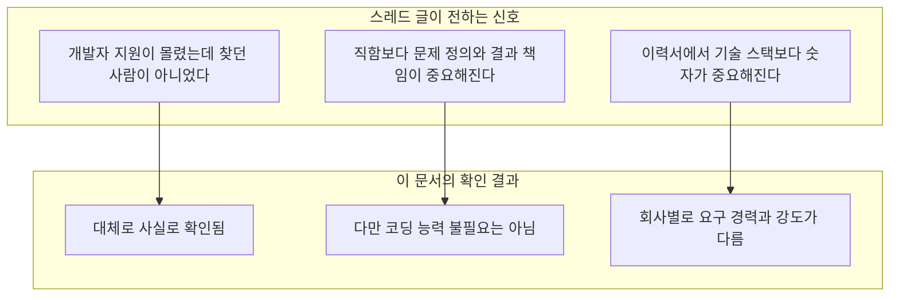
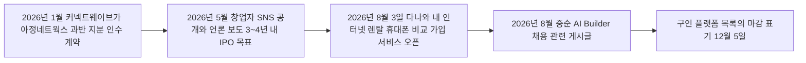
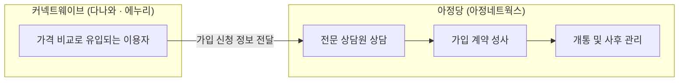
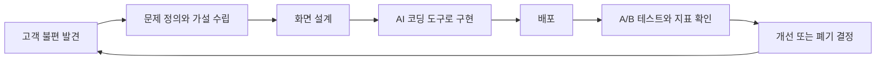
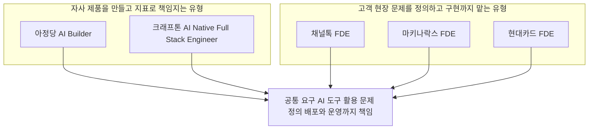
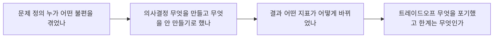

> 개발자 지원이 몰렸는데 "찾던 사람이 아니었다"는 이야기는 무엇을 뜻하는가, 그리고 크래프톤·채널톡·마키나락스·현대카드의 비슷한 공고는 정말 같은 사람을 찾고 있는가

- 작성일: 2026-09-24
- 조사 기준일: 2026-09-24 (검색 및 원문 확인 시점)
- 대상 글: 스레드(Threads)에 올라온 "요즘 채용공고 보다가 좀 충격받음" 게시글과 [아정당 AI Builder 채용 공고 원문](https://recruit.ajd.co.kr/ko/o/235973)

```
https://www.threads.com/share/BA08eR56O7/

요즘 채용공고 보다가 좀 충격받음

아정당이 'AI Builder'라는 직무를 뽑는데
개발자 지원이 엄청 몰렸는데 찾던 사람이 아니었대

찾는 건 코드 잘 짜는 사람이 아니라
AI로 일단 빨리 만들고
매출 보면서 계속 고치는 사람

전 직무가 PM이든 디자이너든 상관없다고 함

개발자로 N년 일했는데 기분이 좀 묘함

궁금해서 비슷한 공고 더 찾아봄

크래프톤은 AI Native Full Stack Engineer
채널톡, 마키나락스, 현대카드는 FDE(Forward Deployed Engineer)

이름만 다르지 다 비슷한 사람 찾는 느낌
FDE라고 붙은 공고만 7개 회사에 17개였음

채널톡 FDE팀 블로그에 이런 말도 있었음
"코드를 짜는 것만이 엔지니어의 해결방식이 아닙니다"

이력서에 기술 스택 늘어놓는 것보다
무슨 문제 찾아서 뭘 만들었고 숫자가 어떻게 바뀌었는지가 더 중요해지는 듯

혹시 이런 공고 면접 본 사람 있음? 뭐 물어봤는지 궁금함
```


---

## 0. 이 문서를 읽는 방법

이 문서는 스레드 글에 담긴 주장을 그대로 받아들이지 않고, 하나씩 원문과 보도로 확인한 뒤 정리한 것입니다. 스레드 원문 링크는 자동 접근이 차단되어 직접 열람하지 못했고, 전달해 주신 본문을 기준으로 검토했습니다. 아정당 채용 공고의 세부 내용은 전달해 주신 공고 원문의 문구를 기준으로 삼았고, 채용 사이트와 구인 플랫폼 목록으로 교차 확인했습니다.

근거의 무게가 서로 다르기 때문에, 본문에서는 다음 네 가지를 구분해서 표시합니다.

| 표기 | 의미 | 예시 |
|---|---|---|
| **[1차]** | 회사가 직접 게시한 공고, 채용 사이트, 공식 블로그, 담당자 본인의 게시글 | 아정당·채널톡 채용 페이지, 채널톡 팀 블로그 |
| **[보도]** | 언론 기사 | 대한경제, 뉴스1, 전자신문 등 |
| **[2차]** | 채용 플랫폼의 해설글, 공고 집계 사이트, 분석 블로그 | 잡코리아 FDE 가이드, 공고 집계 사이트 |
| **[해석]** | 확인된 사실을 바탕으로 한 이 문서의 해석 | 5장, 8장, 9장의 판단 |

확인하지 못한 것도 분명히 적어 둡니다. 스레드 작성자가 세었다는 "FDE 공고 7개 회사 17개"라는 숫자는 독립적으로 검증할 수 없었습니다. 또 아정당 AI Builder 면접 후기는 검색으로 찾을 수 없었습니다. 이런 부분은 추측으로 채우지 않고 해당 장에서 "확인되지 않음"으로 남겼습니다.

---

## 1. 한눈에 보기

스레드 글의 큰 줄기는 사실로 확인됩니다. 아정당 소속 담당자의 게시글에는 공고를 올린 지 하루 만에 많은 지원서가 들어왔고, 상당수가 개발자였으며, 그중 많은 수가 개발자 이력서를 그대로 냈다는 내용이 있습니다. 그리고 찾는 사람은 AI를 잘 쓰는 개발자나 AI 연구자가 아니라고 분명히 선을 긋습니다. 이전 직함이 PM이든 PO든 개발자든 디자이너든 창업가든 중요하지 않다는 말도 같은 게시글에 있습니다. **[1차]**

다만 "코드를 잘 짜는 사람이 필요 없다"고 읽으면 절반만 맞습니다. 공고 원문은 Claude Code 같은 AI 코딩 도구로 실제 배포까지 완성해 본 경험, 그리고 DB·API·인증·배포 같은 개발의 기본 구조를 이해하고 AI가 만든 결과물을 다룰 수 있는 능력을 요구합니다. 즉 코드를 직접 타이핑하는 능력의 비중이 줄어든 것이지, 소프트웨어가 어떻게 돌아가는지 모르는 사람을 뽑는다는 뜻이 아닙니다. **[1차]**

같이 언급된 크래프톤, 채널톡, 마키나락스, 현대카드의 공고를 실제로 확인해 보면 "이름만 다르지 다 비슷하다"는 관찰은 반은 맞고 반은 다릅니다. 공통점은 AI 도구를 실무에 쓰는 것, 문제 정의부터 배포·운영까지 한 사람이 책임지는 것입니다. 차이는 요구 경력과 코딩 강도, 그리고 일하는 무대에서 큽니다. 크래프톤과 채널톡은 시니어 엔지니어를 요구하고 높은 코딩 역량을 전제로 하며, 아정당은 직함을 묻지 않는 대신 성과 지표에 대한 책임을 전면에 내세웁니다. 이 차이를 알아야 "개발자 시장이 통째로 바뀌었다"는 과장도, "나와는 상관없다"는 안심도 피할 수 있습니다.



---

## 2. 스레드 글의 주장을 하나씩 확인하기

스레드 글을 문장 단위로 나누어 확인한 결과입니다.

| 스레드 글의 주장 | 확인 결과 | 근거 |
|---|---|---|
| 아정당이 'AI Builder'라는 직무를 뽑는다 | **사실** | 아정당 채용 사이트 공고, 사람인·잡코리아 공고 목록 **[1차]** |
| 개발자 지원이 엄청 몰렸다 | **사실(정성적)** | 아정당 측 게시글이 하루 만에 많은 지원서가 왔고 상당수가 개발자, 특히 프런트엔드 개발자가 많았다고 밝힘. 정확한 지원자 수는 공개되지 않음 **[1차]** |
| 그런데 찾던 사람이 아니었다 | **사실** | 같은 게시글이 개발자 이력서를 그대로 낸 지원자가 많아 아쉬웠다고 서술 **[1차]** |
| 찾는 건 AI로 빨리 만들고 매출을 보며 계속 고치는 사람 | **사실** | 공고의 업무 항목(A/B 테스트, 전환율·매출 책임)과 게시글이 일치 **[1차]** |
| 전 직무가 PM이든 디자이너든 상관없다 | **사실** | 게시글이 PM, PO, 개발, 디자인, 창업 등 이전 직함은 중요하지 않다고 명시. 공고도 어떤 배경이든 좋다고 서술 **[1차]** |
| 크래프톤은 AI Native Full Stack Engineer | **사실** | 크래프톤 AI Frontier 본부 공고(5년 이상, 10년 이상 두 종류). 채용 공고 집계 사이트에 게재된 내용 기준 **[2차]** |
| 채널톡은 FDE를 뽑는다 | **사실** | 채널톡 채용 페이지 **[1차]** |
| 마키나락스, 현대카드도 FDE를 뽑는다 | **사실** | 마키나락스 채용 사이트, 현대카드 채용 사이트 목록 **[1차]** |
| FDE 공고가 7개 회사에 17개였다 | **검증 못 함** | 작성자 본인의 집계로, 독립적으로 확인할 수 없음 |
| 채널톡 FDE 팀 블로그에 "코드를 짜는 것만이 엔지니어의 해결방식이 아닙니다"라는 말이 있다 | **사실** | 채널톡 팀 블로그 2026-03-04 게시글 **[1차]** |

이 표에서 눈여겨볼 부분은 마지막 줄입니다. 채널톡 블로그의 그 문장은 사실이지만, 같은 회사의 채용 공고는 팀원 모두가 높은 코딩 역량을 갖췄다고 적고 있습니다. 문장 하나만 떼어 읽으면 "코딩이 덜 중요하다"로 오해하기 쉽고, 이 점은 6장과 7장에서 다시 다룹니다.

---

## 3. 먼저 이 회사를 이해해야 공고가 읽힙니다

### 3.1 아정당은 어떤 사업을 하는 회사인가

아정당은 인터넷·TV·가전 렌탈·휴대폰 가입 비교와 이사·청소·보험 중개를 하는 생활 서비스 플랫폼입니다. 아정당 홈페이지 소개에 따르면 통신사의 인터넷과 IPTV 상품을 중개하는 온라인 대리점이며, 지원금을 사전에 공개하는 방식을 내세웁니다. 이 사업의 핵심은 상담원이 고객과 직접 연결되어 계약까지 이끄는 구조이고, 통신·렌탈처럼 월 정액 계약은 한 번 성사되면 수수료가 장기간 이어진다는 점이 언론 분석에서 자주 언급됩니다. **[1차·보도]**

이 사업 구조를 알면 공고에 왜 "전환율", "매출", "상담 조직", "통신·렌탈·구독·O2O 서비스 기획 경험"이 반복해서 나오는지 이해됩니다. 화면이 예쁘거나 코드가 우아한 것보다, 방문한 사람이 상담을 신청하고 계약으로 이어지는 흐름이 사업의 생명줄이기 때문입니다. **[해석]**

### 3.2 2026년에 무슨 일이 있었나

2026년은 아정당에게 경영 구조가 바뀐 해입니다. 언론 보도를 종합하면 MBK파트너스 계열 커넥트웨이브(다나와·에누리 운영사)가 2026년 1월 아정네트웍스의 경영권 지분을 약 1,500억 원 규모로 인수하는 계약을 맺었습니다. 지분율은 대다수 매체가 51%로 쓰고 뉴스1은 "50%+1주"로 표현하는데, 둘 다 과반 인수를 가리킵니다. 이 거래에서 아정당은 약 3,000억 원의 기업가치를 인정받은 것으로 보도되었고, 창업자는 공동 경영 체제로 남으며 3~4년 내 상장(IPO)을 목표로 한다고 밝혔습니다. **[보도]**

이후 2026년 8월 3일 다나와가 아정당과 손잡고 다나와 안에 인터넷·렌탈·휴대폰 비교·가입 서비스를 정식 오픈했습니다. 다나와에서 상품을 비교한 이용자가 아정당 상담원을 통해 가입 가능한 상품과 혜택을 안내받는 구조입니다. **[보도]** AI Builder 채용 글은 이 시점 직후인 8월 중순으로 표시되어 있습니다. 새로운 트래픽이 들어오는 시점에 그 흐름을 계약으로 바꿔 줄 제품과 실험을 빠르게 돌릴 사람이 필요해졌다는 것이 자연스러운 배경으로 보이지만, 회사가 이 인과관계를 직접 밝힌 것은 아니므로 어디까지나 **[해석]** 입니다.



### 3.3 트래픽과 상담이 만나는 구조

언론 분석은 이 인수의 논리를 "탐색 트래픽과 세일즈 클로징의 결합"으로 설명합니다. 다나와·에누리는 가격을 비교하러 오는 사람이 많지만 구매는 다른 곳에서 일어나는 경우가 많았고, 아정당은 상담원이 계약까지 이끄는 조직이라는 것입니다. **[보도]**



한 가지 균형 잡힌 시각도 필요합니다. 검색 시점 기준 약 2주 전에 게재된 것으로 표시된 월요신문 보도는, 다나와가 통신 3사 상품을 비교해 보여 주지만 실제 가입은 아정당을 통해서만 이루어진다는 점이 "가격비교"라는 이름과 맞는지를 문제 삼았습니다. 다나와 측은 비교·연결 기능은 다나와가, 상담과 계약 체결·관리는 아정당이 맡는다고 설명했습니다. **[보도]** 이 논쟁은 AI Builder가 일할 제품 영역과 직접 맞닿아 있으므로, 지원을 고려한다면 알아 두어야 할 배경입니다.

---

## 4. AI Builder 공고를 뜯어보기

### 4.1 기본 정보

공고 원문에 따르면 부문은 아정네트웍스, 직군은 Tech & Product, 경력은 3년 이상, 고용 형태는 정규직(수습 3개월), 근무지는 서울 강남구 테헤란로 124 삼원타워 19층입니다. 근무 시간은 주 5일 유연근무제이고 급여는 인터뷰 후 협의합니다. 연장·야간 근로가 생기면 택시비와 추가 야간 식대를 사내 규정에 따라 지원한다고 적혀 있습니다. **[1차]** 사람인 목록에는 마감일이 12월 5일로 표시되어 있는데, 구인 플랫폼 표기는 바뀔 수 있으므로 지원 전에 공식 채용 페이지에서 다시 확인해야 합니다. **[2차]**

### 4.2 이 직무를 한 문장으로 옮기면

공고의 첫 문단은 AI Builder를 기획, 디자인, 개발, 배포까지 한 사람이 끝까지 책임지는 포지션으로 정의합니다. 문제를 정의하고, 화면을 설계하고, 직접 만들어 띄우는 과정을 중간에 넘기지 않는다는 것입니다. 사내에는 Claude Code 기반의 바이브코딩 환경이 갖춰져 있어 만드는 시간보다 무엇을 만들지 판단하는 시간을 더 쓸 수 있다고 설명합니다. 새로운 서비스를 처음부터 만들어 띄우는 일이 중심이고, 필요하면 이미 운영 중인 영역도 직접 개선합니다. **[1차]**

### 4.3 하는 일 다섯 가지

공고가 제시하는 업무는 다섯 가지입니다. 첫째는 고객이 겪는 불편과 실제로 반응하는 소구점을 찾아 제품으로 만드는 일입니다. 둘째는 기획과 화면 설계, 구현, 배포까지 직접 진행하고 배포 이후의 운영과 개선까지 맡는 종단간(E2E) 실행입니다. 셋째는 출시를 끝이 아닌 시작으로 보고 꾸준한 A/B 테스트로 가설을 검증하고 고도화하는 일입니다. 넷째는 전환율과 매출 같은 사업 지표로 결과를 증명하고 다음에 무엇을 할지 주도하는 비즈니스 성과 책임입니다. 다섯째는 사업부, 상담 조직, 그로스팀과 우선순위와 일정을 조율하는 교차 기능 협업입니다. **[1차]**

이 다섯 가지를 이어 붙이면 하나의 반복 고리가 됩니다.



### 4.4 찾는 사람의 조건

필수에 가까운 조건은 다음과 같습니다. 제품을 만들어 본 경험이 3년 이상이면서 PM, PO, 서비스 기획은 물론 개발, 디자인, 창업 등 어떤 배경이든 괜찮다는 것, 화면 기획에 머무르지 않고 문제 정의부터 비즈니스 성과 창출까지 책임져 본 것, Claude Code 등 AI 코딩 도구로 실제 배포까지 완성해 본 것, DB·API·인증·배포 같은 개발의 기본 구조를 이해하고 AI가 만든 결과물을 잘 다룰 수 있는 것입니다. 여기에 여러 정책과 예외 케이스, 운영 프로세스가 얽힌 복잡한 서비스를 구조화할 수 있는 능력, A/B 테스트를 직접 설계하고 해석해 다음 개선으로 연결해 본 경험, Mixpanel·Amplitude·GA·SQL 같은 분석 도구를 자유롭게 쓰는 능력이 더해집니다. **[1차]**

우대 조건은 이 회사의 사업을 그대로 반영합니다. 1인 또는 소수 인원으로 서비스를 런칭하고 운영해 본 경험, 통신·렌탈·구독·커머스·O2O처럼 상담·영업·개통 프로세스가 연결된 서비스를 기획해 본 경험, 유입부터 전환까지의 퍼널을 설계하고 개선해 본 경험, 어드민과 내부 운영 도구와 업무 자동화를 직접 만들어 본 경험, LLM API나 AI 에이전트를 제품에 붙여 실제 서비스로 운영해 본 경험이 나열됩니다. **[1차]**

### 4.5 아정당 측 게시글이 덧붙이는 설명

링크드인에 노출되는 아정당 소속 김민기 씨의 게시글은 공고의 의도를 더 직설적으로 풉니다. 요지는 세 가지입니다. 하나, 공고를 올린 지 하루 만에 지원서가 몰렸고 상당수가 개발자였다는 것. 둘, 사용한 언어와 프레임워크, 구현한 기능과 기술적 난도, 심지어 AI 모델과 기술 자체에 대한 설명이 서류의 중심이었지만 이번에 찾는 사람과는 조금 달랐다는 것. 셋, 찾는 사람은 고객의 불편을 사업 기회로 해석하고, AI로 빠르게 제품을 만든 뒤, 실제 반응과 지표를 보며 계속 고치고, 필요할 때 개발자·디자이너와 제대로 협업할 수 있는 사람이라는 것입니다. 그리고 코드를 얼마나 오래 썼는지보다 AI로 넓어진 실행 범위를 어떤 판단으로 다뤘고 어떤 결과까지 책임져 봤는지가 더 궁금하다고 덧붙입니다. **[1차]**

이 글에서 가장 중요한 대목은 AI를 잘 쓰는 개발자도 AI 연구자도 아니라고 선을 긋는 구분입니다. 이 직무는 기술의 깊이를 재는 자리가 아니라 **제품과 사업의 결과를 끝까지 책임지는 자리**로 설계되어 있다는 뜻입니다.

### 4.6 "코드는 몰라도 된다"는 뜻일까

그렇지 않습니다. 공고 원문에는 개발 기본 구조의 이해와 AI 코딩 도구로 실제 배포까지 가 본 경험이 명시되어 있습니다. 바뀐 것은 "직접 손으로 한 줄씩 짜는 능력"이 평가의 중심에서 물러나고, 그 자리를 "무엇을 만들지 고르는 판단, AI가 만든 결과물을 검수하는 눈, 결과를 숫자로 증명하는 능력"이 채웠다는 점입니다. **[해석]** 코드를 모르면 AI가 만든 결과물이 옳은지 판단할 수 없으므로 기본 구조에 대한 이해는 오히려 필수 조건으로 남았습니다.

---

## 5. 개발자로서 느끼는 '묘한 기분'의 정체

스레드 작성자는 개발자로 N년을 일했는데 기분이 묘하다고 썼습니다. 이 감정을 사실과 해석으로 나누어 보면 다음과 같습니다.

**확인된 사실**은 두 가지입니다. 하나는 채널톡 FDE 팀 블로그가 밝힌 인식으로, AI 발전 덕분에 기술적으로 문제를 잘 해결하는 역량은 보편화되고 있으며 문제 정의가 더 중요해진다고 말합니다. **[1차]** 다른 하나는 아정당이 개발자 이력서를 그대로 낸 지원자들에게 아쉬움을 표현했다는 점입니다. **[1차]**

**해석**은 이렇습니다. 기술 스택 나열이 약해진 것은 개발자의 가치가 사라져서가 아니라, 구현 그 자체가 예전만큼 희소하지 않게 되었기 때문일 가능성이 큽니다. 희소해진 것은 "무엇을 왜 만들지 정하고, 만든 결과가 숫자로 어떻게 바뀌었는지 설명할 수 있는 사람"입니다. 다만 이것은 아정당처럼 상담과 전환이 사업의 중심인 회사의 사례이고, 모든 회사의 개발 채용이 이렇게 바뀌었다고 일반화할 근거는 이번 조사에서 찾지 못했습니다. 실제로 6장의 크래프톤과 채널톡은 오히려 5년 이상의 시니어 엔지니어링 역량을 명시적으로 요구합니다.

정리하면, 개발자에게 위협이 되는 변화라기보다 **개발자가 이미 가진 능력 위에 '문제 정의와 성과 책임'이라는 층을 얹어 보여 줘야 하는 변화**에 가깝다는 것이 이 문서의 판단입니다. **[해석]**

---

## 6. 비슷한 공고 네 곳을 실제로 확인하기

### 6.1 한눈에 비교

| 구분 | 아정당 AI Builder | 크래프톤 AI Native Full Stack Engineer | 채널톡 FDE | 마키나락스 FDE | 현대카드 FDE |
|---|---|---|---|---|---|
| 요구 경력 | 3년 이상 | 5년 이상 및 10년 이상 공고가 각각 존재 | 5년 이상, 시니어 | 공고별로 다름(LLM 2년 이상, ML 5년 이상, Lead 10년 이상) | 경력직(세부 연차는 확인 못 함) |
| 소속·성격 | 자사 생활 서비스 사업의 신규 제품·성장 | AI Frontier 본부, 6개 Squad 중 하나에서 PO와 협업 | 고객과 가장 가까이 일하는 엔지니어링 팀 | 제조·국방 등 산업 현장 AI | 파트너사 대상 AI 플랫폼 도입 |
| 핵심 업무 | 기획~배포~운영, A/B 테스트, 전환율·매출 책임 | AI 제품의 기획·개발·배포·운영, 대규모 트래픽 안정성 | 고객 현장 문제 진단, 프로토타입, 제품팀 환류 | 산업 현장 데이터로 AI 문제 정의와 End-to-End 수행 | PoC 주도, 데이터 파이프라인 연결, 비즈니스·기술 컨설팅 |
| 코딩 요구 | AI 코딩 도구로 배포까지 + 개발 기본 구조 이해 | 코딩 에이전트를 핵심 개발 도구로 쓰는 시니어 | 높은 코딩 역량이 기본 전제 | ML·LLM 개발 역량 | 데이터·AI 플랫폼 실무 |
| 직함 조건 | PM·PO·개발·디자인·창업 무관 | 엔지니어 | 엔지니어(역할은 Technical PM 성격) | 엔지니어·ML | 엔지니어·컨설팅 경험 |
| 근거 등급 | [1차] | [2차] | [1차] | [1차·보도] | [1차 목록·2차 세부] |

### 6.2 크래프톤: 시니어 풀스택 엔지니어의 'AI 네이티브' 버전

크래프톤 공고는 AI Frontier 본부를 핵심 AI 기술 역량을 실질적인 사업 성과로 연결하는 실행 중심 조직으로 소개하고, In-game AI, Production AI, LLM AI 등 6개 Squad가 각 사업을 빠르게 실험하고 확장한다고 설명합니다. 찾는 사람은 AI를 보조 도구가 아닌 핵심 개발 파트너로 쓰면서 대규모 트래픽 환경에서 서비스를 안정적으로 설계·운영해 본 시니어 엔지니어이고, 소속 Squad에서 PO와 함께 기획부터 운영까지 책임집니다. 5년 이상과 10년 이상 두 갈래로 게시되어 있습니다. **[2차: 공고 집계 사이트 게재본]** 공고 집계 사이트의 요약에는 RAG 파이프라인, 에이전트 오케스트레이션, MCP 연동을 종단간으로 만드는 일이 언급되는데, 이 세부 항목은 집계 사이트의 요약이므로 지원 전에 크래프톤 공식 채용 페이지에서 원문을 확인하시기 바랍니다.

아정당과 겹치는 부분은 "AI 도구를 개발 파트너로 쓰고 기획부터 운영까지 책임진다"는 점이고, 갈리는 부분은 **대규모 트래픽에서의 안정적 설계·운영 경험을 명시적으로 요구한다**는 점입니다. 이 공고는 아정당의 "직함 불문"과는 결이 다른, 엔지니어링 깊이를 전제로 한 자리입니다. **[해석]**

### 6.3 채널톡: 고객 현장에 붙어 있는 엔지니어

채널톡 FDE 공고는 시니어 정규직이며 경력 5년 이상의 엔지니어링 역량을 기반으로 문제 정의·해결 설계·실행까지 전 주기를 소화할 수 있는 사람을 찾습니다. 팀은 AX(AI Transformation) 문제를 엔지니어링으로 푸는 팀이고, 고객 현장의 복잡한 CX·운영 문제를 ALF 레시피, 코파일럿 등으로 확장 가능하게 풀어내며, 구성원 모두가 높은 수준의 코딩 역량을 갖춘 사람들이라고 명시합니다. 역할 설명에는 Technical Project Manager 성격이 언급되고, 향후 PM, AI Product Lead, 창업으로 성장하려는 사람에게 적합하다고 합니다. **[1차]**

이 공고에서 특히 참고할 만한 것은 지원서 양식입니다. 서류 지원 시 두 가지를 자유 형식으로 쓰라고 요구합니다. 하나는 AI를 활용해 비즈니스 문제를 해결해 본 경험(어떤 문제였는지, 어떤 AI 도구를 어떻게 썼는지, 결과가 어땠는지)이고, 다른 하나는 고객이나 현장 사용자를 직접 만나 비즈니스 문제를 발견한 경험(누구를 만났고 무엇을 발견했고 이후 어떤 행동을 했는지)입니다. 완성된 결과보다 과정과 본인의 역할에 집중하라고도 안내합니다. 전형 단계는 서류, 온라인 사전 기술 인터뷰(30~45분), 3일간의 과제 전형, 1~3차 면접 순서입니다. **[1차]**

채널톡 팀 블로그(2026-03-04)는 이 팀을 고객을 더 많이 만나는 개발팀이라고 소개하며, 문제 관찰, 공감, 정의, 해결, 확산의 다섯 단계를 강조합니다. 스레드 글이 인용한 문장은 이 글의 마지막 부분에 나옵니다. 이 팀이 비즈니스 확산을 엔지니어링적으로 고민하는 팀이라는 설명 끝에 "코드를 짜는 것만이 엔지니어의 해결방식이 아닙니다"라고 적혀 있습니다. **[1차]** 이 문장은 코딩이 필요 없다는 선언이 아니라, 코딩을 기본으로 깔고 그 위에서 도구나 교육, 구조까지 설계하라는 뜻으로 읽는 것이 공고 전체와 어긋나지 않습니다. **[해석]**

### 6.4 마키나락스: 산업 현장의 AI

마키나락스는 2024년부터 FDE를 전략 조직으로 운영해 왔고, 2026년 4월 16일 제조·국방 AI 사업 확대에 힘입어 FDE 중심의 두 자릿수 규모 채용에 나선다고 밝혔습니다. **[보도]** 채용 사이트에는 FDE 관련 공고가 여러 종류 올라와 있습니다. LLM 담당 FDE는 경력 2년 이상, Frontier팀의 ML 담당은 ML·데이터 사이언스 경력 5년 이상이며 반도체 생산 설비 이상 탐지 같은 문제를 다루고, 창원 FDE Lead는 경력 10년 이상입니다. **[1차]**

이곳의 FDE는 아정당의 AI Builder와는 성격이 상당히 다릅니다. 소비자 서비스의 전환율이 아니라 공장과 설비 같은 물리적 산업 환경에서 AI가 반복적으로 작동하도록 설계·배포·운영하는 일이며, 머신러닝 전문성이 훨씬 무겁게 요구됩니다. **[해석]**

### 6.5 현대카드: 파트너사에 AI 플랫폼을 붙이는 일

현대카드 채용 사이트 목록에는 Forward Deployed Engineer 공고가 2026년 9월 21일부터 10월 5일까지 접수 중인 경력직으로 표시되어 있습니다. **[1차]** 공고 집계 사이트의 요약에 따르면 업무는 국내외 파트너사를 대상으로 AI 플랫폼 도입을 위한 PoC를 주도하고, 파트너사 데이터가 플랫폼에 연동되도록 데이터 파이프라인 연결을 지원하며, 현장의 비즈니스·기술 문제를 정의하고 해결 방안을 조율하는 것입니다. 우대 사항에는 FDE나 테크니컬 컨설팅 같은 고객 대면 프로젝트 경험, 해외 체류·파견 근무 가능 여부, 영어 커뮤니케이션, 금융 또는 커머스 도메인 데이터 프로젝트 경험이 있습니다. **[2차]** 이 세부 내용은 공고 집계 사이트가 6월에 게재한 사본에서 가져온 것이라 현재 접수 중인 공고와 다를 수 있으므로, 지원 전에 현대카드 채용 페이지 원문을 확인해야 합니다. 저는 해당 집계 페이지를 직접 열람하지 못하고 검색 결과의 요약으로만 확인했습니다.

### 6.6 네 곳을 유형으로 묶어 보면



이 분류는 공고 문구를 읽고 만든 **[해석]** 입니다. 채널톡은 자사 제품(ALF)을 확산시키는 팀이기도 하고, 크래프톤도 사업 단위 Squad에서 일하므로 경계가 칼로 자른 듯 분명하지는 않습니다.

---

## 7. FDE란 무엇인가

### 7.1 어디서 온 말인가

FDE(Forward Deployed Engineer, 전방 배치 엔지니어)는 팔란티어가 널리 알린 직군입니다. 고객 현장에 직접 들어가 문제를 발견하고 제품으로 해결하는 엔지니어라는 것이 채널톡과 마키나락스 블로그가 공통으로 소개하는 정의입니다. **[1차]** 백과사전류 정의도 비슷해서, 고객 조직과 밀접하게 일하며 운영 환경에서 기술적 해결책을 개발·맞춤화·배포하는 역할로 설명합니다. **[2차]** 채널톡 블로그는 최근 OpenAI를 비롯한 AI 기업들이 이 모델을 적극 도입하고 있다고 전합니다. **[1차]**

### 7.2 비슷한 직무와 무엇이 다른가

잡코리아 해설글(2026-04-24)은 컨설턴트는 진단과 제안서, 솔루션 아키텍트는 설계와 인계, 솔루션 엔지니어는 계약 전 데모와 PoC에 가깝고, FDE는 문제 정의부터 구현, 검증, 개선까지 맡는다고 구분합니다. 갈리는 지점은 계약 전 설명으로 끝나는지, 계약 뒤에도 남아 직접 만들고 결과까지 책임지는지라는 설명입니다. **[2차]**

### 7.3 이름은 같아도 일은 다르다

같은 해설글은 국내 공고를 읽고 얻은 실무적 관찰이라는 단서를 달아 FDE를 네 유형으로 나눕니다. 고객 문제를 직접 정의하고 구현까지 맡고 제품팀에 환류하는 전통 FDE형, AI 솔루션을 고객 환경에 안착시키는 데 초점을 둔 AI 배포형, 프리세일즈·데모·고객 맞춤 개발 비중이 큰 PoC형, 외부 고객 대신 내부 조직의 문제를 푸는 Internal AX형입니다. 또한 일부 공고는 역할이 프리세일즈나 지원 업무 쪽으로 흘러가는 현상이 있어, 지원 전에 직무 이름보다 실제 업무 비중을 확인하라고 조언합니다. **[2차]** 이 문서의 6장에서 본 회사들이 서로 달라 보이는 이유가 바로 이것입니다.

### 7.4 수요와 경력 분포에 대한 2차 자료

같은 해설글이 인용한 Bloomberry의 1,000건 공고 분석에 따르면, 이전 직무는 소프트웨어 엔지니어가 45%로 가장 많았고 경력은 3~5년차가 60%, 0~2년차는 12%였습니다. 공고에서 Python은 66.2%, TypeScript는 35.2%가 언급되어 FDE가 고객 접점이 많아도 코딩 비중이 낮은 직무는 아니라고 해설합니다. **[2차, 재인용]** 이 통계는 해외 공고가 상당수 포함된 표본일 가능성이 있는데, 표본 구성은 원문에서 확인하지 못했으므로 한국 시장에 그대로 적용하는 것은 조심해야 합니다.

---

## 8. "이름만 다르지 다 비슷하다"는 관찰은 어디까지 맞나

**맞는 부분.** 여러 공고에서 공통으로 반복되는 세 가지가 있습니다. 첫째, 문제 정의부터 배포와 운영까지 한 사람 또는 소수가 끝까지 책임지는 종단간 오너십입니다. 둘째, AI 도구를 개발과 업무의 기본 수단으로 전제하는 태도입니다. 셋째, 결과를 숫자와 사업 성과로 설명하라는 요구입니다. 채널톡은 이력서에 문제 발견 경험과 AI 활용 경험을 쓰라고 하고, 아정당은 전환율과 매출로 결과를 증명하라고 하며, 마키나락스는 산업 현장 문제를 정의하고 종단간으로 푸는 경험을 강조합니다. **[1차]**

**다른 부분.** 세 가지 차이가 큽니다. 첫째, 요구 연차입니다. 아정당은 3년 이상, 채널톡과 크래프톤은 5년 이상 시니어를 찾습니다. 둘째, 직함의 열려 있는 정도입니다. 아정당은 명시적으로 직함을 묻지 않지만 채널톡·크래프톤은 엔지니어링 역량을 전제합니다. 셋째, 일하는 무대입니다. 아정당은 상담·전환 중심의 소비자 서비스, 마키나락스는 공장과 설비, 현대카드는 파트너사 AI 플랫폼 도입, 크래프톤은 대규모 트래픽의 AI 제품이라 필요한 전문성이 다릅니다. **[해석]**

그래서 이 관찰은 "새로운 직무 이름이 여럿 등장했고, 그 밑에 깔린 요구가 겹친다"까지는 옳지만, "같은 사람을 찾는다"까지 나아가면 과장입니다.

---

## 9. 이력서와 지원 전략에 주는 시사점

여기서부터는 확인된 정보를 바탕으로 한 **[해석]** 과 제안입니다.

### 9.1 기술 스택 목록보다 '문제-결정-결과-트레이드오프'

잡코리아 해설글은 기존 경험을 문제 정의, 의사결정, 결과, 트레이드오프의 네 단계로 정리하라고 권합니다. **[2차]** 채널톡이 지원서에 요구하는 두 항목도 같은 방향입니다. 아래는 이 구조를 보여 주기 위해 제가 만든 **가상의 예시**이며 실제 사례가 아닙니다.



가상의 예시를 들면 이렇습니다. 기술 스택 나열형 문장이 "React와 Node.js로 견적 신청 화면 개발"이라면, 문제-결정-결과형 문장은 "견적 신청 단계에서 이탈이 많다는 상담팀의 말을 듣고 입력 항목을 줄이는 가설을 세워 두 가지 화면을 A/B 테스트했고, 신청 완료 비율이 얼마에서 얼마로 달라졌으며, 대신 상담 시 추가 질문이 늘어나는 부담이 생겼다"처럼 씁니다. 여기서 숫자는 반드시 본인이 실제로 측정한 값이어야 하고, 없다면 없다고 쓰는 편이 낫습니다. 기업이 궁금해하는 것은 과정과 본인의 역할이라고 채널톡도 분명히 안내합니다. **[1차]**

### 9.2 아정당 공고에 특화해서 준비할 것

공고 원문이 요구하는 항목을 체크리스트로 삼으면 됩니다. AI 코딩 도구로 실제 배포까지 완성한 결과물이 있는지, 그 결과물에서 DB·API·인증·배포를 본인이 이해하고 있는지, 퍼널과 전환 지표를 정의하고 A/B 테스트를 해석해 본 경험이 있는지, 정책과 예외가 많은 서비스를 구조화한 사례가 있는지입니다. 통신·렌탈·구독처럼 상담과 개통이 붙는 서비스 경험은 우대 항목에 명시되어 있습니다. **[1차]**

### 9.3 시니어 엔지니어링 공고에는 다른 준비

크래프톤이나 채널톡처럼 5년 이상 시니어를 요구하는 공고는 대규모 트래픽 운영 경험, 시스템 설계, 높은 코딩 역량에 대한 증거가 필요합니다. 이 경우에도 "무엇을 만들었나"보다 "왜 그렇게 정의했고 어떤 트레이드오프를 택했나"를 설명하는 것이 중요하다는 것이 잡코리아 해설글의 요지입니다. **[2차]**

---

## 10. 면접에서 무엇을 물을까

스레드 작성자가 궁금해한 부분입니다. 결론부터 말하면 **아정당 AI Builder의 면접 후기는 이번 검색에서 찾지 못했습니다.** 그래서 이 장은 확인된 공개 정보만 정리합니다.

아정당 채용 사이트의 지원 프로세스 안내(직무 공통)에 따르면 과제는 유형에 따라 다르지만 평균 주말 포함 5일이 주어지고, 면접은 현재 대면이 기본이며 보통 1회(2회) 진행됩니다. 이력서는 국문 PDF로 받고, 이메일 지원은 받지 않으며 채용 사이트나 채용 플랫폼을 통해서만 지원할 수 있습니다. **[1차]** 이 안내가 AI Builder에도 그대로 적용된다고 확정할 근거는 없습니다.

채널톡은 전형 단계를 구체적으로 공개합니다. 사전 기술 인터뷰에서 기본 구현 능력과 CS 기초를 30~45분간 보고, 3일짜리 과제에서 문제를 어떻게 분석하고 AI를 어떻게 활용하는지를 확인하며, 1차 면접(최대 1시간 30분)에서는 제출한 과제를 놓고 45분간 AI에 대한 이해와 활용 방식을 토론합니다. **[1차]**

FDE 면접 일반에 대한 2차 자료는 평가 축을 기술 개념, 시스템 설계, 고객 시나리오, 라이브 코딩, 행동 면접의 다섯 가지로 정리하고, 예상 질문으로 요구가 계속 바뀔 때 무엇을 먼저 정의할지, 비개발자 임원에게 기술 선택을 어떻게 설명할지, 고객이 원한 것과 실제 필요가 달랐던 경험이 있는지 등을 듭니다. **[2차]** 다만 이는 공개 면접 분석을 모은 일반론이며 특정 회사의 실제 질문이 아닙니다.

---

## 11. 한계와 주의할 점

첫째, 공고 문구는 회사의 의도 표명이지 실제 운영의 결과가 아닙니다. 공고는 "한 사람이 끝까지 책임진다"고 하지만 실제로 어떤 권한과 지원 체계 아래에서 일하는지는 면접에서 직접 확인해야 합니다. 둘째, 아정당은 경영 구조가 바뀐 직후이고 상장을 목표로 재무와 내부 통제를 정비하는 중이라는 설명이 채용 정보 서비스에 실려 있습니다. **[2차]** 회사가 빠르게 성장하고 변화하는 시기라는 점은 기회이자 불확실성입니다. 셋째, 3장에서 본 것처럼 다나와 연계 서비스의 공정성 논쟁이 보도되었으므로, 이 영역의 제품을 만들 때 어떤 원칙과 책임 구조로 일하는지도 물어볼 만합니다. **[보도]** 넷째, 이 문서의 5장, 8장, 9장은 해석이고, 공고 세부 조건과 마감은 수시로 바뀝니다. 지원 직전에 공식 채용 페이지에서 다시 확인하십시오.

---

## 12. 용어 사전

| 용어 | 쉬운 설명 |
|---|---|
| **AI Builder** | 아정당 공고가 쓰는 직무 이름. 기획, 디자인, 개발, 배포, 운영을 AI 도구를 활용해 한 사람이 끝까지 맡는 사람 |
| **FDE** | Forward Deployed Engineer. 고객 현장에 가까이 붙어 문제를 발견하고 직접 만들어 해결하는 엔지니어 |
| **바이브코딩** | 코드를 한 줄씩 직접 쓰기보다 AI에게 의도를 설명하며 함께 만들어 가는 개발 방식을 가리키는 말 |
| **A/B 테스트** | 두 가지 안을 일부 사용자에게 나누어 보여 주고 어느 쪽 성과가 좋은지 비교하는 실험 |
| **퍼널** | 유입부터 가입·구매 같은 전환까지 사용자가 단계별로 줄어드는 흐름을 깔때기에 빗댄 말 |
| **전환율** | 방문자 가운데 원하는 행동(상담 신청, 가입 등)을 한 사람의 비율 |
| **E2E(종단간)** | 시작부터 끝까지 전 과정을 한 주체가 맡는 것 |
| **PoC** | 본격 도입 전에 작게 만들어 가능성을 검증하는 시범 프로젝트 |
| **CX / VOC** | 고객 경험 / 고객의 소리(고객이 남긴 불만·의견) |
| **AX** | AI Transformation. 조직의 업무와 사업을 AI 중심으로 바꾸는 일 |
| **IPO** | 기업공개(주식시장 상장) |

---

## 13. 참고 자료

모든 자료는 2026-09-24에 확인했습니다. 등급은 본문의 표기와 같습니다.

**아정당 관련**

- **[1차]** 아정당 채용 사이트 공고 목록 — https://recruit.ajd.co.kr/ko/openposition
- **[1차]** 아정당 채용 사이트 지원 프로세스 — https://recruit.ajd.co.kr/ko/process
- **[1차]** 아정당 소속 김민기 씨 링크드인 게시글(2026-08 노출) — https://www.linkedin.com/in/%EB%AF%BC%EA%B8%B0-%EA%B9%80-ab7b2723b/
- **[2차]** 사람인 AI 직업 목록(AI Builder 마감 표기) — https://m.saramin.co.kr/job-industry/job-list?cat_kewd=181
- **[2차]** 잡코리아 아정네트웍스 채용 정보 — https://m.jobkorea.co.kr/Company/48617482/Recruit
- **[2차]** 입사전 아정당 회사 소개 페이지(2026년 9월 기준 소개) — 전달해 주신 자료
- **[보도]** 대한경제, "'몸값 3000억' 아정당, 다나와에 지분 51% 매각…3~4년 내 상장"(2026-05-11) — https://www.dnews.co.kr/uhtml/view.jsp?idxno=202605111403238430230&section=S1N2
- **[보도]** 뉴스1, "MBK의 커넥트웨이브, '아정당 인수 볼트온'으로 엑시트 시동 가능성"(2026-02-19) — https://www.news1.kr/industry/sb-founded/6075448
- **[보도]** 비즈앤피플, 아정당 김민기 대표 관련 기사(2026-05-30) — https://www.bizandpeople.com/news/articleView.html?idxno=631
- **[2차·분석글]** 리스팅 M&A 딜 분석(2026-02-08) — https://brunch.co.kr/@listing/5
- **[보도]** 전자신문, "생활서비스 가격비교 후 가입까지…다나와, 아정당과 제휴"(2026-08-03) — https://www.etnews.com/20260803000037
- **[보도]** 월요신문, "통신 3사 비교해도 가입은 아정당…다나와 '가격비교' 맞나" — https://www.wolyo.co.kr/news/articleView.html?idxno=317615

**비교 대상 공고**

- **[2차]** 크래프톤 AI Native Full Stack Engineer(5년 이상) 공고 집계본 — https://gamejobs.co/AI-Frontier-Div-AI-Native-Full-Stack-Engineer-5%EB%85%84-%EC%9D%B4%EC%83%81-at-Krafton
- **[2차]** 크래프톤 AI Native Full Stack Engineer(10년 이상) 공고 집계본 — https://freehire.me/jobs/ai-frontier-div-ai-native-full-stack-engineer-10nyeon-isang-krafton-vfmzudra
- **[1차]** 채널톡 Forward Deployed Engineer 채용 공고 — https://channel.io/us/careers/905bc3bd-d788-4d17-b463-ae23b6a910b2
- **[1차]** 채널톡 팀 블로그, "채널톡의 FDE팀을 소개합니다"(2026-03-04) — https://docs.channel.io/team-blog/ko/articles/%EC%B1%84%EB%84%90%ED%86%A1%EC%9D%98-FDE%ED%8C%80%EC%9D%84-%EC%86%8C%EA%B0%9C%ED%95%A9%EB%8B%88%EB%8B%A4-e7358de0
- **[1차]** 마키나락스 채용 사이트 — https://makinarocks.career.greetinghr.com/ko/job-opening
- **[1차]** 마키나락스 FDE(LLM) 공고 — https://makinarocks.career.greetinghr.com/ko/o/115446
- **[1차]** 마키나락스 블로그, "왜 지금, FDE인가"(2025-12-29) — https://www.makinarocks.ai/blog/fde-power-rangers-for-ai-adoption/
- **[보도]** 뉴스핌, 마키나락스 FDE 중심 대규모 채용(2026-04-16) — https://www.newspim.com/news/view/20260416000335
- **[1차]** 현대카드 채용 사이트 목록 — https://careerhyundai.recruiter.co.kr/career/home
- **[2차]** 현대카드 FDE 공고 집계본(2026-06-09 게재, 원문 직접 열람은 실패하여 검색 결과 요약으로 확인) — https://bebee.com/kr/jobs/forward-deployed-engineer-hyundaicardhyundaicommercial-seoul--theirstack-708984415

**FDE 개념**

- **[2차]** 잡코리아, "Forward Deployed Engineer(FDE)란?"(2026-04-24) — https://www.jobkorea.co.kr/goodjob/tip/view?News_No=22526
- **[2차]** Wikipedia, Forward Deployed Engineer — https://en.wikipedia.org/wiki/Forward_Deployed_Engineer

---

작성일: 2026-09-24
