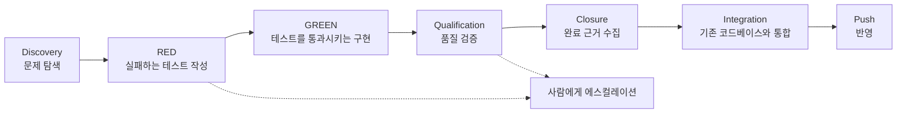

- 원문 출처: Facebook 게시물 (https://www.facebook.com/share/p/19iCfUufMF/)
- 이 문서는 원문의 논지를 상세히 풀어 설명하면서, 원문이 언급하거나 전제하고 있는 개념들(Claude Code Auto Mode, Context Engineering, Agentic Engineering, 관련 연구 결과 등)을 실제로 검색하여 사실관계를 확인하고 덧붙인 해설문이다. 어디까지가 외부에서 검증 가능한 사실이고 어디부터가 원문 작성자 개인의 프레임워크와 주장인지는 13장의 출처 투명성 표에 구분해 두었다.


## 목차

1. 이 글이 다루는 문제
2. 자율성을 줄이는 게 안전하다는 믿음의 함정
3. "계약(Contract)"이라는 새로운 접근
4. 계약이 정의하는 일곱 단계의 생애주기
5. 에이전트가 절대 혼자 결정해서는 안 되는 다섯 가지
6. 자율성을 지나치게 줄였을 때 실제로 벌어지는 일
7. 충분한 자율성이 주어졌을 때 에이전트가 하는 일
8. Context Engineering, 외부 설계에서 계약 안의 규칙으로
9. Harness Engineering, 사람이 짜던 오케스트레이션에서 모델 내장 기능으로
10. 리뷰의 재배치 — 1차 리뷰어가 된 에이전트와 교차 모델 검증
11. Builder의 시대에서 Architect의 시대로
12. 이 논의가 개인과 조직에 의미하는 것
13. 출처 투명성 — 무엇이 확인된 사실이고 무엇이 저자의 해석인가
14. 참고 자료

---

## 1. 이 글이 다루는 문제

원문은 짧지만 하나의 명확한 주장을 담고 있다. "코딩 에이전트의 품질을 망치는 가장 쉬운 방법은, 계속 사람에게 허락을 받게 만드는 것이다." 그리고 그 뒤에 곧바로 "자율성을 줄이는 것이 안전하다는 믿음은, 점점 틀린 명제가 되고 있다"는 문장이 따라온다.

이 두 문장은 지금 AI 코딩 도구를 실무에 쓰는 사람이라면 한 번쯤 마주치는 딜레마를 정확히 짚는다. 에이전트에게 일을 맡기자니 불안해서 승인 버튼을 계속 누르게 되고, 그 승인 절차 때문에 오히려 작업 흐름이 끊기고 결과물의 질도 떨어지는 경험이다. 원문은 이 딜레마의 해법으로 "자율성을 늘리느냐 줄이느냐"가 아니라 "에이전트와 어떤 계약(Contract)을 맺느냐"라는 완전히 다른 축을 제시한다. 이 문서는 그 계약이라는 개념이 구체적으로 무엇을 의미하는지, 그리고 이 주장이 현재 업계에서 실제로 일어나고 있는 변화와 어떻게 맞닿아 있는지를 차근차근 풀어본다.

## 2. 자율성을 줄이는 게 안전하다는 믿음의 함정

원문은 Claude Code의 Auto Mode를 예로 든다. 이는 실제로 존재하는 기능이다. Anthropic은 이를 "Bash 명령 하나 실행할 때마다 사람이 승인해야 하는 기본 동작 방식과, 모든 권한 확인을 건너뛰는 `--dangerously-skip-permissions` 사이의 중간 경로"로 설명한다. Auto Mode에서는 도구 호출이 실행되기 전에 별도의 분류기(classifier)가 먼저 그 행동이 파일 대량 삭제나 민감 정보 유출, 악성 코드 실행처럼 파괴적인 결과를 낳을 수 있는지 검사한다. 안전하다고 판단된 행동은 자동으로 실행되고, 위험하다고 판단된 행동은 차단되어 에이전트가 다른 접근 방식을 택하도록 유도된다. 만약 에이전트가 계속 차단되는 행동을 반복해서 시도하면, 그때는 사람에게 승인을 요청하는 프롬프트가 뜬다. 이 기능은 2026년 3월 24일 발표되었고, 처음에는 Team 플랜 대상의 연구 프리뷰(research preview) 형태로 제공되기 시작했다. [1][9]

원문은 여기서 "한 단계 더 갈 수 있다"고 말한다. 에이전트에게 그저 "알아서 코딩해"라고 지시하는 대신, 한 번의 실행(run) 안에서 프로젝트가 통과해야 할 전체 생애주기를 미리 계약의 형태로 부여하자는 것이다. 이 지점이 원문의 핵심 논지가 시작되는 곳이다. Auto Mode처럼 매 순간의 권한을 자동 판단하게 하는 것만으로는 부족하고, 애초에 에이전트가 무엇을 스스로 결정해도 되고 무엇을 사람에게 반드시 올려야 하는지를 작업이 시작되기 전에 설계해 두어야 한다는 것이다.

## 3. "계약(Contract)"이라는 새로운 접근

원문이 말하는 계약은 법률 문서 같은 것이 아니다. 에이전트가 작업을 수행하는 동안 지켜야 할 경계선과, 그 경계선을 넘었을 때 반드시 사람에게 보고해야 하는 조건들을 미리 명시해 둔 규칙 집합에 가깝다. 원문의 표현을 빌리면 "핵심은 무작정 자율성을 많이 주는 게 아니다. 어디까지는 스스로 판단해도 되고, 어디서부터는 반드시 사람에게 올라와야 하는지를 먼저 설계하는 것"이다.

이 발상 자체는 원문 저자만의 독창적인 발명이라기보다, 2026년 상반기부터 에이전트 거버넌스 논의에서 반복적으로 등장하는 흐름과 궤를 같이한다. 예를 들어 한 연구는 작업 범위, 권한 경계, 요구되는 근거, 수용 기준을 명시한 "위임 계약(delegation contract)"을 사용한 에이전트 실행과 그렇지 않은 실행을 비교했는데, 명시적 계약이 있을 때 정답률 자체는 크게 달라지지 않았지만 결과물의 검토 용이성(reviewability)이 유의미하게 좋아졌다는 결과를 보고했다. 계약이 있는 실행에서만 변경 파일 목록, 알려진 한계 사항, 잔여 위험 설명이 결과물에 포함되었고, 검토자들이 느끼는 모호함은 통계적으로 유의하게 줄어들었다. [8] 또 다른 실험적 프로젝트는 "계약 없는 자율 에이전트 코드는 실패로 간주한다"는 규칙을 CI 단계에 강제로 심어, 에이전트가 만든 변경 사항에는 반드시 대응하는 계약 문서가 있어야 통과되도록 설계하기도 했다. [10] 즉 "에이전트에게 계약을 준다"는 발상은 지금 여러 곳에서 독립적으로 수렴하고 있는 실무 패턴이며, 원문은 이 패턴을 코딩 에이전트의 품질 문제에 적용해 설명하고 있는 것으로 읽을 수 있다.

## 4. 계약이 정의하는 일곱 단계의 생애주기

원문은 이 계약이 구체적으로 어떤 흐름을 요구하는지 하나의 순서로 제시한다.

Discovery(탐색) → RED → GREEN → Qualification(품질 검증) → Closure(마무리) → Integration(통합) → Push(반영)



이 일곱 단계 가운데 RED와 GREEN이라는 이름은 소프트웨어 개발에서 이미 오래 쓰여온 테스트 주도 개발(Test-Driven Development, TDD)의 Red-Green-Refactor 순환에서 가져온 표현이다. 먼저 아직 구현되지 않은 기능에 대해 실패하는 테스트를 작성하고(RED), 그 테스트를 통과시키는 최소한의 구현을 만든 다음(GREEN), 구조를 개선하는 순서다. 원문의 계약은 이 익숙한 개발 방법론의 리듬 위에 Discovery, Qualification, Closure, Integration, Push라는 단계를 앞뒤로 덧붙여, 에이전트가 코드를 작성하는 순간만이 아니라 문제를 처음 발견하는 순간부터 실제로 저장소에 반영되는 순간까지의 전체 여정을 하나의 계약으로 묶은 것이라고 이해할 수 있다.

다만 이 정확한 일곱 단계 명칭과 순서를 그대로 사용하는 외부의 표준 문서나 공식 프레임워크는 이번 조사 과정에서 확인되지 않았다. 대신 확인된 것은, RED와 GREEN을 포함한 "완결된 증명 단위"라는 개념, 그리고 실행 중인 에이전트가 스스로 완료 여부를 선언하도록 두지 않고 별도의 상태 모델(예: running → completion_claimed → verifying → accepted / rejected / escalated / undetermined)을 두어야 한다는 논의가 최근 에이전트 실무 커뮤니티에서 비슷한 문제의식으로 다뤄지고 있다는 점이다. [11] 즉 원문의 일곱 단계는 저자가 자신의 실무 경험을 바탕으로 구성한 프레임워크로 보는 것이 타당하며, 그 밑바탕에 깔린 문제의식 자체는 업계에서 폭넓게 공유되고 있는 흐름이다.

## 5. 에이전트가 절대 혼자 결정해서는 안 되는 다섯 가지

계약에서 가장 중요한 부분은 아마도 에이전트가 스스로 판단해서는 안 되는 지점을 명시하는 조항일 것이다. 원문은 이를 다섯 가지로 정리한다.

첫째, "완료"의 정의 자체를 바꾸는 일이다. 원문의 표현으로는 acceptance 계약의 변경인데, 무엇을 완료로 볼 것인지에 대한 기준 자체를 에이전트가 임의로 수정하는 것을 막아야 한다는 의미다. 둘째, 시스템이 절대 깨서는 안 되는 약속, 즉 invariant와 충돌하는 일이다. 셋째, 이 코드가 누구의 관할인지를 바꾸는 일, 다시 말해 ownership의 이동이다. 넷째, 새로운 아키텍처나 API가 필요해지는 상황이다. 다섯째, 서로 다른 권위 있는 근거(authoritative evidence)들이 모순될 때다.

원문은 이 다섯 가지를 묶어 "이건 코딩 문제가 아니라 architecture와 governance의 결정이기 때문"이라고 설명한다. 다시 말해 코드 몇 줄을 고치는 수준의 국소적인 판단과, 시스템의 경계와 책임 소재를 바꾸는 수준의 판단을 구분하고, 후자만큼은 반드시 사람에게 넘기도록 계약에 못박아 두어야 한다는 것이다. 이 구분법 역시 앞서 언급한 에이전트 거버넌스 논의와 맞닿아 있다. 한 사례 연구는 에이전트에게 역할을 부여할 때 "책임 범위, 권한 경계, 권한 모델, 필요한 입력값, 산출물 계약, 정지 조건"을 명시적으로 정의해야 하며, 분류 규칙이나 승인 요건, 정확한 기준점 검증처럼 결정론적으로 처리할 수 있는 부분은 에이전트의 확률적 판단에 맡기지 않고 코드로 강제해야 한다고 지적한다. 반대로 모호함과 해석, 설계상의 트레이드오프가 필요한 영역에서는 에이전트가 유용하다고 본다. [10] 원문이 나열한 다섯 가지 항목은 정확히 이 구분선, 즉 "결정론적으로 판정할 수 없고 설계와 거버넌스 판단이 필요한 지점"을 짚고 있다고 볼 수 있다.

## 6. 자율성을 지나치게 줄였을 때 실제로 벌어지는 일

원문은 반대의 경우, 즉 불안한 마음에 자율성을 확 낮췄을 때 무슨 일이 벌어지는지를 구체적으로 묘사한다. "몇 줄 고치고 리뷰. 다시 몇 줄 고치고 승인. 테스트 하나 돌리고 또 승인. 흐름이 계속 끊긴다. 왕복이 폭발하고, 느려지고, 토큰도 더 쓴다."

여기서 원문이 특히 강조하는 지점은 속도 손실이 진짜 문제가 아니라는 것이다. 진짜 손실은 "하나의 문제를 발견하고, 증명하고, 닫는 evidence의 단위가 잘게 찢어진다"는 데 있다. 승인이 너무 자주 끼어들면 리뷰어 앞에 도착하는 것은 하나로 완결된 증명이 아니라 조각난 diff 열 개가 되고, 무엇이 왜 바뀌었는지에 대한 서사 자체가 사라진다는 것이다.

이 관찰은 실제 연구 결과와도 맥락이 통한다. 프린스턴 대학교 연구진이 발표한 SWE-agent 논문은, 언어 모델에게 그냥 셸(shell)만 던져주는 것과, 파일을 보고 편집하고 검색하는 데 특화된 인터페이스를 함께 제공하는 것 사이에 얼마나 큰 성능 차이가 나는지를 실험으로 보였다. 그 결과 언어 모델 친화적인 인터페이스를 채택했을 때 셸만 사용하는 에이전트보다 64%의 상대적 성능 향상이 나타났다. [6] 이 결과가 시사하는 바는, 에이전트의 성능을 좌우하는 것은 모델 자체의 능력보다도 그 모델이 세상과 상호작용하는 인터페이스의 설계라는 점이다. 원문이 말하는 "왕복 폭발"과 "근거의 파편화" 역시, 사람이 매 스텝마다 개입해 인터페이스를 방해하는 방식으로 설계되면, 아무리 뛰어난 모델이라도 하나의 완결된 해결 흐름을 만들어내지 못한다는 것과 같은 맥락에서 이해할 수 있다.

## 7. 충분한 자율성이 주어졌을 때 에이전트가 하는 일

반대로 계약과 에스컬레이션 조건이 명확하고 충분한 자율성이 주어지면 어떤 일이 벌어질까. 원문은 이렇게 정리한다. "Fixture가 깨지면 fixture를 고친다. Test harness가 문제면 harness까지 추적한다. 같은 defect class가 보이면 sibling 코드까지 훑는다. 테스트가 통과했다고 끝내지 않고, 정말 끝났다는 evidence까지 모아서 돌아온다."

이 묘사는 최근 코딩 에이전트가 실제로 갖추게 된 능력과 상당히 겹친다. 에이전트가 코드를 변경하는 데 그치지 않고, 테스트를 직접 돌리고, 실패 로그를 읽어 원인을 추적하고, 유사한 결함이 다른 곳에도 있는지 저장소 전체를 검색하고, 최종적으로 git diff와 status까지 확인해서 스스로 "정말 끝났는가"를 검증하는 흐름은, 최근 하네스 개선 연구들이 공통적으로 지향하는 목표이기도 하다. 예를 들어 하네스 자체를 개선해 에이전트의 실패 패턴을 재사용 가능한 개입으로 바꾸는 한 연구는, 결정론적 환경에서 18개의 서로 다른 모델과 7개의 벤치마크 조합 126개 가운데 116개에서 성능이 향상되었고 평균 상대 개선율이 88.5%에 달했다고 보고했다. 이때 모델 가중치나 평가 환경 자체는 전혀 손대지 않고, 오직 모델과 환경 사이의 런타임 인터페이스, 즉 하네스만 개선했다는 점이 핵심이다. [7] 원문이 말하는 "fixture를 스스로 고치고 sibling 코드까지 훑는" 에이전트의 모습은, 바로 이런 하네스 차원의 개선이 실제로 구현해내고 있는 능력과 정확히 같은 방향을 가리킨다.

## 8. Context Engineering, 외부 설계에서 계약 안의 규칙으로

원문은 이런 변화를 좀 더 큰 흐름 속에 위치시킨다. "예전에는 Context Engineering이라는 이름으로, 모델이 필요한 정보를 언제 어떻게 다시 보게 할 것인지 외부에서 정교하게 설계해야 했다"는 것이다.

Context Engineering이라는 용어 자체의 유래를 짚어보면 원문의 서술을 더 명확히 이해할 수 있다. 이 용어는 2025년 6월 Shopify의 CEO Tobi Lütke가 "프롬프트 엔지니어링보다 이 표현이 더 좋다"고 언급하면서 널리 퍼지기 시작했고, Andrej Karpathy가 며칠 뒤 이를 더 확장해서 설명하며 힘을 실었다. Context Engineering은 시스템 프롬프트, 도구 정의, 검색된 데이터, 대화 이력, 메모리 상태, 출력 형식 등 모델이 추론 시점에 보게 되는 모든 정보를 체계적으로 설계하고 관리하는 작업을 가리키는 말로 자리 잡았다. [2][3]

원문이 말하는 변화는, 예전에는 이 모든 정보를 사람이 매번 정교하게 패키징해서 모델에게 밀어 넣어야 했는데, 지금은 많은 경우 이 과정이 훨씬 단순해졌다는 것이다. 특정 작업이 시작되기 전에 "이 작업을 시작하기 전에 이 파일들을 다시 읽어라", "현재 branch와 HEAD와 contract를 다시 확인해라", "이전 결론을 믿지 말고 authoritative source를 새로 읽어라"라는 규칙을 계약 안에 써주기만 하면, 이후로는 모델이 스스로 필요한 맥락을 다시 획득한다는 것이다. 즉 Context Engineering의 실질적인 작업 내용이 계약 속의 몇 개 규칙으로 압축되어 흡수되고 있다는 관찰이다. 이는 2026년 현재 여러 업계 분석에서도 반복적으로 지적되는 흐름과 일치한다. 정적인 프롬프트 주입에서 동적인 런타임 조립(dynamic runtime assembly)으로 넘어가고 있다는 진단이 대표적이다. [4]

## 9. Harness Engineering, 사람이 짜던 오케스트레이션에서 모델 내장 기능으로

같은 논리가 하네스에도 적용된다. 원문은 "예전에는 모델 밖에서 테스트 실행, 실패 감지, 재시도, 디버깅, 탐색, 검증을 하나하나 orchestration해야 했다"고 말한다. 지금의 코딩 에이전트는 이 상당 부분을 스스로 처리한다. 코드를 바꾸고, 테스트를 돌리고, 실패 로그를 읽고, 원인을 추적하고, 다시 수정하고, 유사 결함을 검색하고, 전체 테스트 스위트를 돌리고, git diff와 status까지 확인하는 일련의 과정을 에이전트가 자체적으로 수행한다는 것이다.

이 변화는 앞서 언급한 SWE-agent와 Life-Harness 연구가 공통적으로 가리키는 결론과 같은 방향이다. 에이전트의 실질적인 성능은 모델 자체의 파라미터를 바꾸는 것보다, 그 모델을 둘러싼 런타임 인터페이스, 즉 하네스를 어떻게 설계하느냐에 훨씬 크게 좌우된다는 것이다. 그리고 최근에는 이런 하네스 기능들, 즉 테스트 실행, 실패 진단, 재시도, 탐색, 검증의 상당 부분이 Claude Code나 Codex 같은 코딩 에이전트의 네이티브 기능 안으로 흡수되고 있다. 그 결과 원문의 표현대로 "코딩 에이전트는 이제 단순한 코드 실행기가 아니다. 1차 엔지니어이자 1차 리뷰어가 됐다"는 진단으로 이어진다.

## 10. 리뷰의 재배치 — 1차 리뷰어가 된 에이전트와 교차 모델 검증

에이전트가 1차 엔지니어이자 1차 리뷰어의 역할까지 맡게 되면서, 원문은 흥미로운 실무 습관 하나를 소개한다. "그래서 나는 2차 리뷰에는 GPT를 쓴다. 같은 모델이 자기 작업을 다시 리뷰하면 같은 맹점을 공유할 가능성이 커지기 때문이다."

이는 원문 저자 개인이 채택하고 있는 실무 습관으로, 외부에서 표준화된 절차는 아니다. 다만 그 근거로 제시하는 논리, 즉 같은 모델이 자신의 작업을 검토하면 같은 맹점을 반복해서 놓칠 위험이 있다는 발상은, 여러 모델을 함께 사용하는 오케스트레이션 연구에서 실제로 다뤄지는 현상과 통한다. 독립 연구는 여러 모델을 함께 사용할 때 얻을 수 있는 정확도의 한계가 이른바 공동 실패율(co-failure rate)에 의해 결정되며, 모델 간 오류의 상관관계를 단순한 쌍별 상관계수로만 측정하면 이 한계를 체계적으로 과소평가하게 된다는 점을 보인 바 있다. 다시 말해 서로 다른 모델이라 하더라도 비슷한 유형의 실수를 함께 저지를 가능성이 존재하며, 이를 정확히 계량하지 않으면 다중 모델 전략의 효과를 과대평가하기 쉽다는 것이다. 이 연구 결과를 원문의 실무 습관에 비추어 보면, "다른 모델로 2차 검토를 한다"는 선택 자체는 합리적인 방향이되, 그것만으로 맹점이 완전히 사라진다고 단정할 근거는 아니라는 점도 함께 새겨둘 필요가 있다.

원문은 이 재배치가 사람의 역할도 함께 바꾼다고 본다. 사람의 리뷰는 fixture나 문법을 들여다보는 수준에서 한 단계 위로 올라가, 계약이 지켜졌는지, invariant가 살아 있는지, ownership 경계를 넘지 않았는지, 정말 Closure라고 선언할 수 있는지를 판단하는 역할로 이동한다는 것이다. 이는 앞서 5장에서 언급한, 에이전트가 절대 스스로 판단해서는 안 되는 다섯 가지 항목과 정확히 맞물린다. 즉 사람의 개입 지점이 코드의 세부 사항에서 계약 자체의 준수 여부로 이동한다는 것이 원문 전체를 관통하는 하나의 그림이다.

## 11. Builder의 시대에서 Architect의 시대로

원문은 이 모든 흐름을 하나의 시대 전환으로 요약한다. "벽돌을 하나씩 쌓던 Builder의 시대에서, 에이전트들이 스스로 집을 짓도록 설계도와 건축법과 준공 기준을 만드는 Architect의 시대로 넘어가고 있다."

이 표현에 등장하는 "Agentic Engineering"이라는 개념적 배경도 실제로 확인할 수 있는 최근 흐름이다. Andrej Karpathy는 2025년 2월 "vibe coding"이라는 용어를 처음 소개해 널리 퍼뜨렸는데, 정확히 1년 뒤인 2026년 2월 4일 이번에는 "agentic engineering"이라는 용어를 제시했다. 그의 설명에 따르면 "agentic"이라는 단어가 붙은 이유는 이제 사람이 코드를 직접 작성하는 비중이 99%의 경우에 줄어들고 그 대신 코드를 작성하는 에이전트들을 오케스트레이션하게 되기 때문이며, "engineering"이라는 단어가 붙은 이유는 이 작업에도 배우고 숙련도를 높일 수 있는 기예와 과학이 존재하기 때문이다. [4][5] 이 용어가 등장한 배경에는, 단순히 프롬프트를 던지고 결과를 받아들이는 "vibe coding"의 한계, 즉 상태가 유지되지 않고 매번 새로운 대화처럼 시작된다는 한계를 넘어, 스스로 계획을 세우고 코드를 작성하고 테스트를 돌리고 실패를 감지해 반복하는 에이전트를 사람이 계획 단계에서부터 설계하고 조율한다는 문제의식이 깔려 있다. [5]

원문이 말하는 "설계의 가치가 급격하게 올라간다"는 진단도 이런 흐름과 정확히 맞닿아 있다. 계약이 명확하면 중간 승인 없이 Discovery에서 Push까지 한 호흡에 끝나지만, 계약이 없거나 빈약하면 아무리 좋은 모델도 계속 물어볼 수밖에 없다는 것이다. "이거 바꿔도 될까요?", "이 API 새로 만들까요?", "이 테스트를 수정해도 될까요?" 같은 질문들은 사람 눈에는 멍청해 보일 수 있지만, 원문의 표현을 빌리면 "억울한 에이전트들에게는 계약 부재가 만든 정당한 질문들"이며 "설계의 공백이 만들어낸 기술부채의 이자들"이라는 것이다. 결국 병목은 코딩 능력이 아니라, 에이전트가 움직일 세계의 경계를 정의하는 설계력이라는 결론으로 이어진다.

## 12. 이 논의가 개인과 조직에 의미하는 것

원문의 마지막 문장은 짧지만 질문을 던진다. "앞으로 비싸지는 사람은 코더가 아니라, 수십 개의 에이전트가 자율적으로 움직여도 시스템이 무너지지 않게 설계하는 사람이다. 개인뿐일까? 제품도, 회사도 마찬가지다."

이 결론은 단순히 개인의 역량 이야기에 그치지 않는다. 계약이라는 단위를 코드 몇 줄 수준을 넘어 제품과 조직 단위로 확장해서 생각해 보면, 한 회사가 여러 에이전트를 동시에 굴릴 수 있는지 여부는 결국 그 회사가 얼마나 명확한 경계와 에스컬레이션 규칙을 미리 문서화해 두었는가에 달려 있다는 이야기로 읽을 수 있다. 앞서 살펴본 사례 연구에서도, 여러 에이전트가 동시에 협업하는 상황에서는 권한, 코드 소유권, 리뷰 독립성, 근거, 이견 처리, 에스컬레이션, 그리고 기반 소프트웨어가 바뀐 이후 이전 결정이 여전히 유효한지에 대한 명확한 규칙이 필요하다는 점이 실제로 문제가 되었다고 보고하고 있다. [10] 이는 원문이 개인의 코딩 습관 수준에서 출발한 이야기를, 조직이 여러 자율 에이전트를 안전하게 운용하기 위한 거버넌스 설계 문제로 확장할 수 있는 근거가 된다.

## 13. 출처 투명성 — 무엇이 확인된 사실이고 무엇이 저자의 해석인가

아래 표는 이 문서에서 다룬 주요 주장들을 신뢰도 수준에 따라 구분한 것이다.

| 구분 | 내용 |
|---|---|
| 확인된 사실 (공식 발표·논문) | Claude Code Auto Mode의 존재와 작동 방식, 2026년 3월 24일 발표, Team 플랜 연구 프리뷰로 시작 [1][9] |
| 확인된 사실 (공식 발표·논문) | SWE-agent 논문의 64% 상대적 성능 향상 수치 (Yang et al., NeurIPS 2024) [6] |
| 확인된 사실 (공식 발표·논문) | Life-Harness 연구의 126개 조합 중 116개 개선, 평균 88.5% 상대적 개선율 (arXiv:2605.22166) [7] |
| 확인된 사실 (다수 매체 보도) | Context Engineering 용어가 2025년 6월 Tobi Lütke의 언급에서 시작해 Andrej Karpathy가 확산시켰다는 유래 [2][3] |
| 확인된 사실 (다수 매체 보도) | Agentic Engineering 용어를 Andrej Karpathy가 2026년 2월 4일 제시했다는 사실 [4][5] |
| 단일 출처 참고 | 공동 실패율(co-failure rate)이 다중 모델 전략의 정확도 상한을 결정한다는 연구 결과 (arXiv:2606.27288, 본 프로젝트의 이전 조사에서 확인된 내용을 재인용) |
| 단일 출처 참고 | 위임 계약(delegation contract)이 정답률보다 검토 용이성을 높인다는 실험 결과 [8] |
| 원문 저자의 프레임워크·해석 | Discovery → RED → GREEN → Qualification → Closure → Integration → Push라는 정확한 일곱 단계 명칭과 순서 — 이 구체적인 조합을 사용하는 외부 표준 문서는 확인되지 않았으며, 저자 개인의 실무 정리로 보는 것이 타당함 |
| 원문 저자의 프레임워크·해석 | 에이전트가 절대 스스로 판단해서는 안 되는 다섯 가지 항목의 구체적 목록 — 문제의식은 업계 논의와 일치하나, 목록 자체는 원문 저자의 정리임 |
| 원문 저자의 개인 실무 습관 | "2차 리뷰에는 GPT를 쓴다"는 구체적 습관 — 원문 저자 개인의 선택이며, 일반화된 권고나 검증된 최적 관행으로 단정할 근거는 없음 |

## 14. 참고 자료

[1] Anthropic, "Auto mode for Claude Code," https://claude.com/blog/auto-mode

[2] Forkast News, "Context Engineering (정의)," https://forkast.news/glossary/context-engineering/

[3] Lyzr, "Context engineering: a framework for governed multi-agent production," https://lyzr.ai/blog/context-engineering/

[4] Taskade, "What Is Agentic Engineering? Complete History," https://www.taskade.com/blog/what-is-agentic-engineering

[5] Simon Willison, "What is agentic engineering?," https://feeds.simonwillison.net/guides/agentic-engineering-patterns/what-is-agentic-engineering/

[6] Yang, J., Jimenez, C. E., et al., "SWE-agent: Agent-Computer Interfaces Enable Automated Software Engineering," arXiv:2405.15793, NeurIPS 2024

[7] "Adapting the Interface, Not the Model: Runtime Harness Adaptation for Deterministic LLM Agents," arXiv:2605.22166

[8] "Software delegation contracts, reviewability, and coding-agent work," https://codex.danielvaughan.com/2026/07/05/software-delegation-contracts-reviewability-coding-agent-work-codex-cli-guardian-evidence-bundles/

[9] tessl.io, "Claude Code gets auto mode to cut approval fatigue," https://tessl.io/blog/claude-code-gets-auto-mode-to-cut-approval-fatigue/

[10] "I built an AI software team; the hard part wasn't coding," https://levelup.gitconnected.com/i-built-an-ai-software-team-the-hard-part-wasnt-coding-225382309c08

[11] Cursor Forum, "Should a Coding Agent Be Allowed to Mark Its Own Task Complete?," https://forum.cursor.com/t/should-a-coding-agent-be-allowed-to-mark-its-own-task-complete/168557


```
https://www.facebook.com/share/p/19iCfUufMF/

코딩 에이전트의 품질을 망치는 가장 쉬운 방법은, 계속 사람에게 허락을 받게 만드는 것이다. 자율성을 줄이는 것이 안전하다는 믿음은, 점점 틀린 명제가 되고 있다.
AI 엔지니어링은 지금, CRUD와 API라는 벽돌을 하나씩 쌓아 모델을 감싸던 시대에서, 에이전트에게 집 전체를 짓게 하는 Agentic Engineering의 시대로 넘어갔다.
그리고 그 중심에는 에이전트와 맺는 계약(Contract)이 있다.
Claude Code에는 Auto Mode가 있다. Bash 명령 하나 실행할 때마다 사람이 “Proceed”를 눌러야 하는 흐름을 없애준다. 그런데 여기서 한 단계 더 갈 수 있다.
에이전트에게 “알아서 코딩해”라고 하는 게 아니라, 한 번의 run에서 프로젝트가 통과해야 할 전체 생명주기를 계약으로 주는 것이다.
Discovery → RED → GREEN → Qualification → Closure → Integration → Push
핵심은 무작정 자율성을 많이 주는 게 아니다. 어디까지는 스스로 판단해도 되고, 어디서부터는 반드시 사람에게 올라와야 하는지를 먼저 설계하는 것이다. 예를 들어 이런 건 에이전트가 마음대로 결정하지 못하게 막는다.
“완료”의 정의 자체를 바꾸는 일 — acceptance 계약 변경
시스템이 절대 깨면 안 되는 약속과 충돌하는 일 — invariant 위반
이 코드가 누구 관할인지 바꾸는 일 — ownership 이동
새로운 architecture나 API가 필요한 일
authoritative evidence끼리 서로 모순되는 일
이건 코딩 문제가 아니라 architecture와 governance의 결정이기 때문이다. 그럼 반대로, 에이전트에게 다 맡기는 것이 불안해서 자율성을 확 낮추면 어떻게 될까.
안전해지기는커녕, 최신 모델 기반의 코딩 에이전트에서는 정반대 현상이 나타난다.
몇 줄 고치고 리뷰. 다시 몇 줄 고치고 승인. 테스트 하나 돌리고 또 승인. 흐름이 계속 끊긴다. 왕복이 폭발하고, 느려지고, 토큰도 더 쓴다.
그런데 진짜 손실은 속도가 아니다. 하나의 문제를 발견하고, 증명하고, 닫는 evidence의 단위가 잘게 찢어진다.
리뷰어 앞에 도착하는 건 완결된 증명 하나가 아니라 조각난 diff 열 개다. 무엇이 왜 바뀌었는지의 서사가 사라진다. 그래서 자율성을 지나치게 줄이면 오히려 코드 품질까지 떨어진다.
반대로 contract와 escalation 조건을 명확히 정의하고 충분한 자율성을 주면, 에이전트는 로컬 문제를 자기 안에서 닫기 시작한다.
Fixture가 깨지면 fixture를 고친다.
Test harness가 문제면 harness까지 추적한다.
같은 defect class가 보이면 sibling 코드까지 훑는다.
테스트가 통과했다고 끝내지 않고, 정말 끝났다는 evidence까지 모아서 돌아온다.
Claude와 GPT의 상위 모델들이 에이전트화되기 시작하면서, 우리가 그동안 모델 바깥에 따로 쌓아왔던 엔지니어링 계층 자체가 점점 모델 안으로 흡수되고 있다.
예전에는 Context Engineering이라는 이름으로, 모델이 필요한 정보를 언제 어떻게 다시 보게 할 것인지 외부에서 정교하게 설계해야 했다.
그런데 지금은 많은 경우 훨씬 단순해진다. 특정 프로세스가 시작되기 전에,
“이 작업을 시작하기 전에 이 파일들을 다시 읽어라.”
“현재 branch와 HEAD와 contract를 다시 확인해라.”
“이전 결론을 믿지 말고 authoritative source를 새로 읽어라.”라고 계약에 써주면 된다.
Context를 사람이 계속 패키징해서 밀어 넣는 것이 아니라, 필요한 context를 모델이 스스로 다시 획득하도록 무엇을 언제 다시 관측해야 하는지를 규칙으로 주는 방식이다.
Harness도 비슷하다. 예전에는 모델 밖에서 테스트 실행, 실패 감지, 재시도, 디버깅, 탐색, 검증을 하나하나 orchestration해야 했다.
지금의 코딩 에이전트는 상당 부분을 스스로 한다. 코드를 바꾸고, 테스트를 돌리고, 실패 로그를 읽고, 원인을 추적하고, 다시 수정하고, sibling defect를 검색하고, 전체 suite를 돌리고, git diff와 status까지 확인한다.
많은 harness capability가 모델과 agent runtime 안으로 흡수되고 있다.
코딩 에이전트는 이제 단순한 코드 실행기가 아니다. 1차 엔지니어이자 1차 리뷰어가 됐다.
그래서 나는 2차 리뷰에는 GPT를 쓴다. 같은 모델이 자기 작업을 다시 리뷰하면 같은 맹점을 공유할 가능성이 커지기 때문이다. 만든 쪽과 다른 눈이 같은 contract 위에서 다시 본다.
그러면 사람의 리뷰는 한 단계 위로 올라갈 수 있다. Fixture나 syntax를 보는 게 아니라 — 계약이 지켜졌는지. Invariant가 살아 있는지. Ownership boundary를 넘지 않았는지. 정말 Closure라고 선언할 수 있는지.
에이전트의 코딩이 좋아질수록, 코딩 자체의 가치는 내려가고 설계의 가치는 급격하게 올라간다.
계약이 명확하면 중간 승인 없이 Discovery에서 Push까지 한 호흡에 끝난다. 계약이 없거나 빈약하면 아무리 좋은 모델도 계속 물어볼 수밖에 없다.
“이거 바꿔도 될까요?”, “이 API 새로 만들까요?”, “이 테스트를 수정해도 /될까요?”
우리에게는 멍청한 질문처럼 보이지만, “억울한” 에이전트들에게는 계약 부재가 만든 정당한 질문들이다. 설계의 공백이 만들어낸 기술부채의 이자들인 셈이다.
결국 병목은 코딩 능력이 아니라, 에이전트가 움직일 세계의 경계를 정의하는 설계력이다.
벽돌을 하나씩 쌓던 Builder의 시대에서, 에이전트들이 스스로 집을 짓도록 설계도와 건축법과 준공 기준을 만드는 Architect의 시대로 넘어가고 있다.
앞으로 비싸지는 사람은 코더가 아니라, 수십 개의 에이전트가 자율적으로 움직여도 시스템이 무너지지 않게 설계하는 사람이다.
개인뿐일까? 제품도, 회사도 마찬가지다.

```