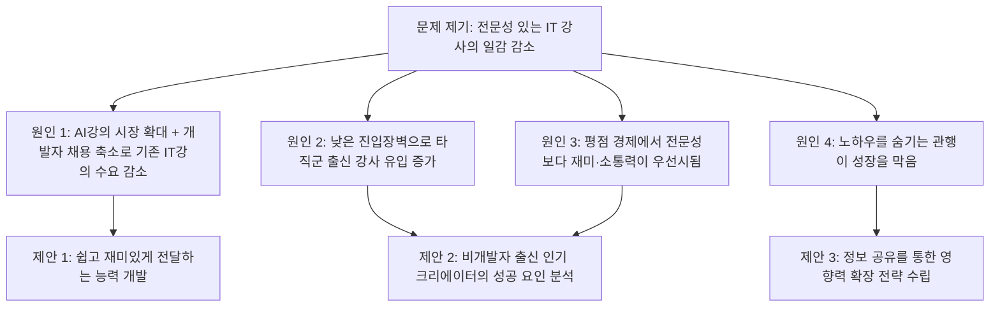
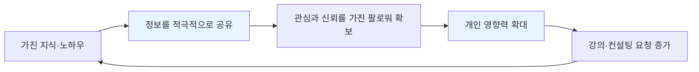

- 원본 게시글: https://www.threads.com/share/_egXKRCUh/
- (Threads는 로봇 접근을 차단하고 있어 원문 페이지를 직접 열람할 수는 없었으나, 대화창에 공유된 원문 텍스트 전체를 근거로 분석했습니다. 아래 내용은 원문의 주장을 재구성하고, 그중 사실관계로 확인 가능한 부분은 공개된 통계와 보도자료로 검증한 결과입니다.)

---

## 1. 이 글은 결국 무엇에 관한 이야기인가

이 게시글은 한 문장으로 요약하면 **"개발자 출신의 전통적인 IT 강사들이 최근 강의 시장에서 밀려나고 있으며, 그 원인은 시장 축소와 경쟁자 유입, 평가 구조의 변화, 그리고 정보 공유 방식의 변화라는 네 가지 흐름이 겹쳤기 때문"** 이라는 주장을 담고 있습니다.

글쓴이는 이 현상을 개인의 능력 문제가 아니라 **구조적인 변화**로 진단하고 있습니다. 즉 "강의를 못해서" 일이 줄어든 것이 아니라, 시장 자체의 규칙이 바뀌었는데 기존 강사들이 그 규칙 변화에 적응하지 못했다는 시각입니다. 그리고 글의 후반부에서는 이 진단을 바탕으로, 일감이 줄어든 IT 강사들에게 세 가지 구체적인 행동을 제안하는 것으로 마무리됩니다.

글 전체의 구조를 도식으로 정리하면 다음과 같습니다.

이제 이 네 가지 원인 각각을 순서대로 뜯어보면서, 어디까지가 통계로 확인되는 사실이고 어디까지가 글쓴이의 경험에 근거한 주관적 해석인지 구분해 설명하겠습니다.

---

## 2. 원인 ① — "AI 강의 시장은 커지는데, 기존 IT 강의 시장은 작아졌다"

### 2-1. 원문의 주장

글쓴이는 AI 강의 시장이 성장하면서 상대적으로 기존 IT 강의(코딩 문법, 리눅스, 운영체제 등 전통적인 컴퓨터공학 커리큘럼) 시장이 줄어들었고, 그 배경에는 개발자 채용 자체가 크게 줄어든 흐름이 있다고 설명합니다.

### 2-2. 실제 데이터로 확인해보기

이 부분은 실제로 여러 공개 자료를 통해 상당 부분 뒷받침됩니다.

**첫째, 국내 소프트웨어 인력 증가세가 눈에 띄게 둔화되었습니다.** 소프트웨어정책연구소(SPRi)가 2026년 8월 발표한 「2025 SW산업 실태조사」에 따르면, 2025년 국내 소프트웨어 인력은 64만 3천 명으로 전년 대비 0.2%(약 1,400명) 늘어나는 데 그쳤습니다. 2024년의 증가율이 7.3%였던 것과 비교하면 사실상 정체 상태에 가깝습니다. 같은 자료는 이 시기 소프트웨어 기업의 매출이 4%가량 늘어난 것과 대비해, 회사는 성장하는데 사람은 거의 늘리지 않는 이른바 "고용 없는 성장" 현상이 뚜렷해졌다고 분석합니다.

**둘째, 신입/청년층 정보통신업 일자리가 실제로 줄어드는 신호가 통계에 잡혔습니다.** 2026년 5월 기준 한국의 상용근로자 수는 전년 동월 대비 7천 명 줄어들었는데, 이는 1999년 12월 이후 약 26년 만에 처음 나타난 감소입니다. 이 감소분을 세대별로 뜯어보면 20~30대 상용직이 19만 7천 명 줄어든 반면 60대 이상이 그 빈자리를 채우는 "세대 역전" 현상이 나타났고, 특히 20대 상용직 감소 폭은 정보통신업에서 5만 7천 명으로, 제조업 감소분(3만 6천 명)보다 더 컸습니다. 시장에서는 이를 신입 개발자 채용이 경력직 중심으로 재편되는 흐름으로 해석하고 있습니다.

**셋째, 해외 연구에서도 비슷한 방향의 결과가 나오고 있습니다.** 생성형 AI를 도입한 기업을 대상으로 한 하버드의 한 연구에 따르면, 그런 기업에서는 주니어 개발자 고용이 약 6분기(1년 반) 만에 9~10% 줄어든 반면 시니어 개발자 고용은 거의 영향을 받지 않았습니다. 같은 맥락에서 주요 빅테크 기업들은 최근 3년 사이 신입 채용 규모를 절반가량 줄인 것으로 알려져 있습니다.

**다만 이 흐름을 "개발자라는 직업 자체가 필요 없어졌다"로 단순화하는 것은 조심해야 합니다.** SignalFire가 2026년에 내놓은 「State of Tech Talent Report」를 보면, 대형 기술기업들의 신규 채용 중 엔지니어가 차지하는 비중은 2019년 46%에서 2025년 55%로 오히려 늘었습니다. 이 보고서가 그리는 그림은 "개발자가 필요 없어졌다"가 아니라, **회사들이 더 적은 인원으로 더 높은 성과를 내는 쪽으로 조직을 압축하면서, 그 압축의 대상이 개발자 자체보다는 기획·조율·검토 같은 중간 관리 계층에 먼저 몰리고 있다**는 쪽에 가깝습니다. 즉 "신입 개발자" 채용은 확실히 줄었지만, 그 이유가 오로지 AI가 코드를 대신 짜기 때문만은 아니라는 뉘앙스가 있습니다.

**넷째, 이런 변화 속에서 기존 코딩 교육 기관들도 커리큘럼을 스스로 바꾸고 있는 정황이 있습니다.** 국내의 한 대표적인 코딩 부트캠프는 최근 기존의 IT 일반 부트캠프 과정(프로덕트 매니지먼트, 데브옵스, 클라우드, iOS 앱 개발, 마케팅 등)을 전면 리뉴얼하는 동시에, AI 전문가 및 금융권 데이터 분석가를 기르는 프리미엄 브랜드를 새로 내놓았습니다. 이는 "순수 코딩 문법" 중심의 전통적인 커리큘럼만으로는 시장의 요구를 충족시키기 어려워졌고, 교육 기관들 스스로가 AI·데이터 중심으로 무게중심을 옮기고 있음을 보여주는 사례로 볼 수 있습니다.

### 2-3. 소결

정리하면, "개발자 신입 채용이 축소되고 있다"는 부분과 "그로 인해 전통적인 코딩·리눅스·운영체제 교육에 대한 수요가 예전 같지 않다"는 부분은 여러 통계와 보도로 상당히 뒷받침되는 사실에 가깝습니다. 다만 그 원인이 순전히 "AI가 개발자를 대체해서"라기보다는, **기업들이 소수 정예로 조직을 압축하면서 신입보다 경력직을 선호하는 구조 변화가 함께 작용한 결과**로 보는 것이 더 정확합니다.

---

## 3. 원인 ② — "AI 강의는 진입장벽이 낮아 타직군 출신 강사가 대거 유입됐다"

### 3-1. 원문의 주장

글쓴이는 AI 강의, 특히 요즘 유행하는 "바이브 코딩" 강의가 전통적인 프로그래밍 강의보다 배우기 쉽고 가르치기 쉬운 편이라, 마케터·기획자·영업 출신 등 원래는 코딩 강의 시장에 없던 사람들이 대거 강사로 진입하게 되었다고 설명합니다.

### 3-2. 실제 데이터로 확인해보기

이 부분 역시 실제 교육 플랫폼에서 뚜렷하게 관찰되는 현상입니다. 국내 대표 온라인 강의 플랫폼들에는 "비전공자도 가능한 AI 바이브코딩", "왕초보도 코딩 가능한 AI 바이브코딩", "기획자를 위한 바이브코딩 특강" 같은 제목의 강좌가 매우 많이 개설되어 있고, 실제로 그 강사진의 이력을 살펴보면 순수 개발자 출신뿐 아니라 前 IT교육 전략기획실장, 마케팅·기획 담당자, 창업 경험자 등 배경이 상당히 다양합니다. 한 강좌 소개에는 "개발팀 눈치 보지 말고 기획·마케팅·영업 담당자가 직접 서비스를 구현한다"는 문구가 명시적으로 등장하기도 합니다.

또한 국비지원 성격의 교육기관에서도 "직장인 AI 바이브코딩 트랙", "AI 시대 가장 빠른 코딩 입문" 같은 과정을 운영하며, 대상자를 코딩을 전혀 모르는 비전공자·직장인으로 명확히 설정하고 있습니다. 정부 차원에서도 학교 현장에 자연어 기반 AI 실습(이른바 "바이브코딩") 도구를 보급하는 정책이 진행 중이라는 보도가 있어, AI 교육에 대한 정책적 예산과 수요 자체가 빠르게 늘고 있다는 배경도 확인됩니다.

다만 여기서 한 가지 균형 잡힌 시각이 필요합니다. 실제 강좌 목록을 보면 마케터·기획자 출신 강사만 늘어난 것이 아니라, "20년차 개발자, 350개 이상 프로젝트 경험" 같은 이력을 내세우는 개발자 출신 강사들도 여전히 이 시장에 적극적으로 뛰어들고 있습니다. 즉 "개발자 출신 강사가 밀려나고 비개발자 출신 강사만 남았다"기보다는, **개발자 출신과 비개발자 출신이 한 시장 안에서 이전보다 훨씬 치열하게 경쟁하게 된 상태**로 이해하는 것이 더 정확한 묘사에 가깝습니다.

### 3-3. 소결

"진입장벽이 낮아지면서 다양한 배경의 강사가 몰려들었다"는 부분은 실제 강의 플랫폼의 강좌 목록만 살펴봐도 쉽게 확인되는 사실입니다. 다만 "그래서 개발자 출신 강사가 밀려났다"는 결론까지는 명확한 통계로 확인하기 어렵고, 오히려 "경쟁자 수 자체가 급격히 늘었다"는 부분까지가 데이터로 뒷받침되는 선이라고 보는 것이 안전합니다.

---

## 4. 원인 ③ — "평점 경제에서는 전문성보다 쉽고 재미있는 전달력이 우선한다"

### 4-1. 원문의 주장

글쓴이는 개발자 출신 강사들이 전문성을 강조하는 경향이 있는 반면, 최근에는 쉽고 재미있게 설명하는 강의가 평점을 훨씬 잘 받는다고 주장합니다. 그 결과 "개발자 출신 = 소통이 어렵고 강의가 어렵다"는 인식이 어느 정도 형성되었다고 진단합니다.

### 4-2. 이 부분에 대한 검증 결과

이 주장은 이번 조사에서 **한국의 특정 통계로는 명확히 검증하기 어려운 부분**입니다. 즉 "개발자 출신 강사의 평점이 실제로 더 낮다"거나 "쉬운 강의가 평점이 몇 퍼센트 더 높다"는 식의 구체적인 국내 수치 자료는 찾지 못했습니다.

다만 이 주장이 완전히 근거 없는 인상비평은 아닙니다. 온라인 교육 플랫폼의 특성상 수강생의 만족도(평점, 후기)가 노출 순위와 매출에 직접적인 영향을 준다는 것은 업계에서 널리 알려진 구조이고, 실제 강좌들의 홍보 문구를 봐도 "너무 쉽고 자세하게 강의해주신다"는 후기가 강의력을 평가하는 핵심 문구로 반복해서 등장하는 것을 확인할 수 있었습니다. 즉 **"쉬운 전달력이 평점과 직결된다"는 시장의 압력 자체는 실제로 존재**하는 것으로 보이지만, "그로 인해 전문성 중심의 강사가 구조적으로 밀려났다"는 인과관계까지는 이번 조사로는 통계적으로 입증되지 않았습니다.

이 항목은 원문에서 가장 **글쓴이 본인의 현장 경험과 관찰에 의존하는 부분**으로 이해하는 것이 정확하며, 읽는 사람 입장에서도 "검증된 사실"이 아니라 "업계 관계자의 주관적 진단"으로 받아들이는 것이 바람직합니다.

---

## 5. 원인 ④ — "노하우를 숨기지 않고 공유하는 사람이 빠르게 성장한다"

### 5-1. 원문의 주장

글쓴이는 많은 기존 IT 강사들이 자신만의 노하우를 잘 공개하지 않는 경향이 있었다고 지적하면서, 반대로 "댓글 달면 자료 드릴게요", "제가 쓰는 방법 공유할게요" 같은 방식으로 적극적으로 정보를 공유하며 사람을 모으는 것이 요즘의 성장 방식이라고 설명합니다.

### 5-2. 이 부분에 대한 검증 결과

이 항목 역시 구체적인 국내 통계로 "정보를 공유하는 강사가 그렇지 않은 강사보다 몇 배 더 빨리 성장한다"는 식의 수치를 확인하기는 어려웠습니다. 다만 이 주장은 최근 몇 년간 널리 퍼진 창작자 경제(크리에이터 이코노미)의 일반적인 성장 전략과 맥락이 같습니다. 무료 정보나 자료를 미끼로 잠재 고객을 모으고("리드 마그넷"), 이렇게 모인 팔로워를 바탕으로 신뢰를 쌓은 뒤 유료 강의나 컨설팅으로 전환하는 방식은 소셜미디어 마케팅에서 이미 일반화된 흐름으로 볼 수 있습니다.

정리하면, 이 항목도 "국내 SNS 마케팅에서 널리 관찰되는 일반적 패턴"이라는 선에서는 합리적인 관찰이지만, "이 전략을 쓴 강사와 안 쓴 강사의 성장 속도를 비교한 수치 자료"까지는 존재하지 않으므로, 3번 항목과 마찬가지로 **글쓴이의 경험적 관찰**로 받아들이는 것이 정확합니다.

---

## 6. 네 가지 원인, 사실관계 정리표

아래 표는 지금까지 살펴본 네 가지 원인이 각각 어느 정도로 데이터에 의해 뒷받침되는지를 요약한 것입니다.

| 원인 | 검증 상태 | 근거 |
|---|---|---|
| ① AI강의 시장 확대 + 기존 IT강의 시장 축소 | 상당 부분 데이터로 확인됨 | SPRi 2025 SW산업 실태조사, 2026년 5월 상용근로자 통계, 하버드 주니어 개발자 고용 연구, 빅테크 신입채용 축소 보도 |
| ② 낮은 진입장벽으로 타직군 강사 유입 | 부분적으로 확인됨 | 국내 온라인 강의 플랫폼의 실제 강좌·강사진 구성 (단, "개발자 출신이 밀려났다"는 결론까지는 불확실) |
| ③ 평점 경제에서 전문성보다 전달력 우선 | 검증 자료를 찾지 못함 (글쓴이의 관찰) | 온라인 교육 플랫폼의 평점 구조 자체는 존재하나, 이를 뒷받침하는 구체적 통계는 확인되지 않음 |
| ④ 노하우 공유가 성장을 이끈다 | 검증 자료를 찾지 못함 (글쓴이의 관찰) | 창작자 경제의 일반적 마케팅 패턴과 방향은 같으나, 구체적 비교 수치는 확인되지 않음 |

이 표에서 알 수 있듯, 원문의 네 가지 진단 중 **앞의 두 가지(시장 축소, 경쟁자 유입)는 비교적 객관적인 근거가 있는 편이고, 뒤의 두 가지(평점 구조, 정보 공유 문화)는 업계 종사자의 관찰과 통념에 가까운 주장**입니다. 이 구분을 염두에 두고 글을 읽으면, 원문이 말하는 "구조적 변화"라는 큰 틀은 신뢰할 만하되, 세부적인 인과관계는 하나의 가설로 받아들이는 것이 균형 잡힌 독해라고 할 수 있습니다.

---

## 7. 글쓴이가 제안하는 세 가지 해법

원문은 진단에 그치지 않고, 강의가 잘 들어오지 않는 IT 강사들에게 다음 세 가지 실천 방안을 제안합니다.

**첫째, 전문성을 더 쌓기보다 "쉽고 재미있게 전달하는 방법"을 고민하라는 것입니다.** 이는 앞서 3번 원인에 대한 직접적인 대응책으로, 지식의 총량을 늘리는 것보다 전달 방식을 개선하는 데 자원을 배분하라는 제안입니다.

**둘째, 바이브코딩을 가르치는 유튜버들을 서로 비교 분석해보라는 것입니다.** 특히 개발자 출신보다 마케터·기획자 출신 크리에이터가 더 인기 있는 사례들을 놓고, 정확히 어떤 차이가 시청자의 선택을 좌우하는지 직접 뜯어보라는 실천적 조언입니다. 이는 막연히 "전달력을 높이라"는 1번 제안을 실제로 실행 가능한 수준까지 구체화하는 방법론에 해당합니다.

**셋째, 자신이 가진 정보를 숨기지 말고, 그 정보를 활용해 사람을 모으고 영향력을 키우는 계획을 세우라는 것입니다.** 이는 4번 원인에 대한 대응책으로, "정보를 아끼는 것"에서 "정보를 미끼로 신뢰와 팔로워를 쌓는 것"으로 전략 자체를 전환하라는 제안입니다.

이 세 가지 제안이 어떻게 하나의 선순환 구조로 연결되는지를 도식으로 표현하면 다음과 같습니다.

이 순환 구조에서 핵심은, 기존의 "정보를 아껴서 희소성을 유지하는 전략"과 정반대로, **정보를 공개함으로써 오히려 사람을 모으고, 그 사람들이 다시 강의 수요로 이어지는 흐름**을 만드는 것입니다. 원문 마지막 문단이 강조하듯, 이제 IT 강사의 경쟁력은 "얼마나 잘 아는가"라는 단일 축이 아니라, "잘 알려주고, 잘 보여주고, 사람들이 스스로 찾아오게 만드는 능력"까지 포함하는 다축 경쟁으로 바뀌고 있다는 것이 이 글 전체의 최종 결론입니다.

---

## 8. 종합 평가

이 게시글은 개발자 출신 IT 강사들이 체감하고 있는 시장 변화를 네 가지 원인으로 구조화해서 설명하고, 이에 대한 세 가지 실천적 대응 방향을 제시하는 짧은 진단·처방형 콘텐츠입니다.

검증 결과를 종합하면, **"신입 개발자 채용 축소와 전통적 코딩 교육 수요 감소"라는 거시적 배경, 그리고 "AI 강의 시장으로 다양한 배경의 강사가 몰려들며 경쟁이 치열해졌다"는 시장 구조 변화는 공개된 통계와 실제 강의 플랫폼 현황으로 상당히 뒷받침되는 사실**입니다. 반면 "평점이 전문성보다 재미를 우대한다"거나 "노하우 공유가 성장의 핵심 열쇠"라는 뒤의 두 진단은, 통계적으로 입증된 사실이라기보다는 **업계 현장에서 반복적으로 관찰되는 경향성에 대한 저자 본인의 해석**으로 받아들이는 것이 정확한 독해입니다.

다만 이 두 가지가 "검증되지 않았다"는 것이 "틀렸다"는 뜻은 아닙니다. 온라인 교육 플랫폼이 평점과 후기를 노출 알고리즘의 핵심 지표로 사용하는 구조, 그리고 무료 정보 공유를 통해 팔로워를 모으는 것이 창작자 경제 전반에서 보편화된 성장 전략이라는 점은 이미 폭넓게 알려진 사실이므로, 저자의 해석은 근거 없는 추측이라기보다는 **충분히 개연성 있는 업계 진단**으로 볼 수 있습니다. 다만 이를 "검증된 통계"로 오인하지 않도록 구분해서 읽는 것이 이 문서의 목적이었습니다.

---

## 9. 참고 자료

- 소프트웨어정책연구소(SPRi), 「2025 SW산업 실태조사」(2026년 8월 발표) — 잡플래닛 콘텐츠 재인용: https://www.jobplanet.co.kr/contents/news-8452
- 리포테라(2026년 6월) 통계 재인용, 브런치: https://brunch.co.kr/@ammucp/78
- Addy Osmani 발언 및 하버드 연구 인용, 위키독스 블로그(2026년 4월 10일): https://wikidocs.net/blog/@jaehong/11190/
- SignalFire, 「State of Tech Talent Report 2026」 관련 분석, 브런치: https://brunch.co.kr/@jabez/105
- 코드스테이츠 'CollegeX' 브랜드 출범 관련 보도, 디지털인사이트: https://ditoday.com/코드-스테이츠-it-부트캠프-전면-리뉴얼과-함께-collegex/
- 국내 온라인 강의 플랫폼의 AI 바이브코딩 관련 강좌 페이지 다수 (인프런 등)
- 클래스팅 AI 학교용 바이브코딩 기능 출시 관련 보도, 유니콘팩토리: https://www.unicornfactory.co.kr/article/2026051808092996357

---

*이 문서는 공유된 Threads 게시글 원문을 바탕으로 재구성한 해설이며, 통계 인용 부분은 위 참고 자료에 근거합니다. Threads 자체 페이지는 로봇 접근이 차단되어 있어 직접 열람하지 못했다는 점을 밝혀둡니다.*
