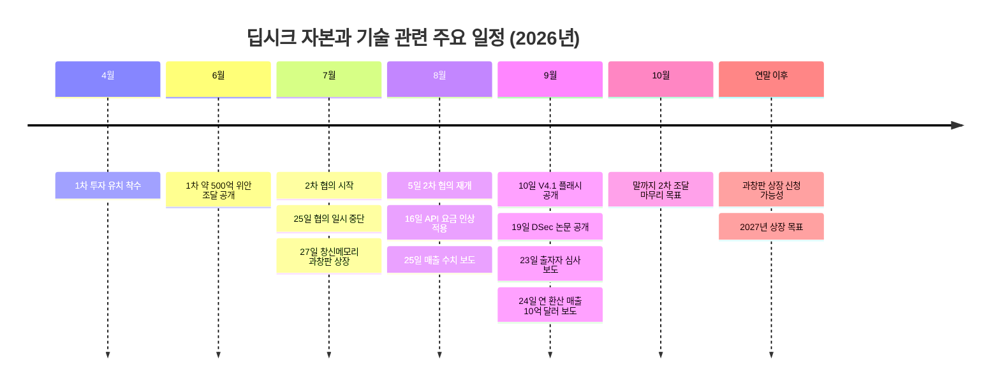
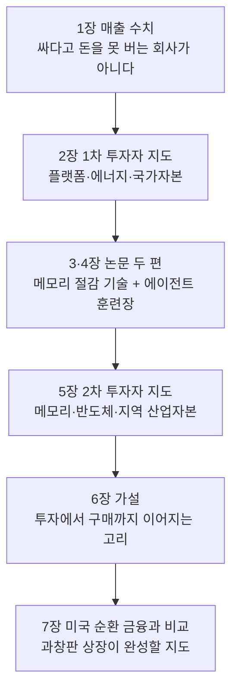
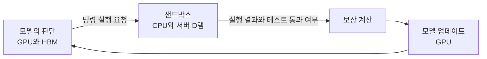
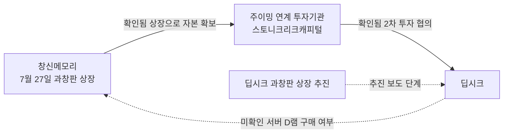
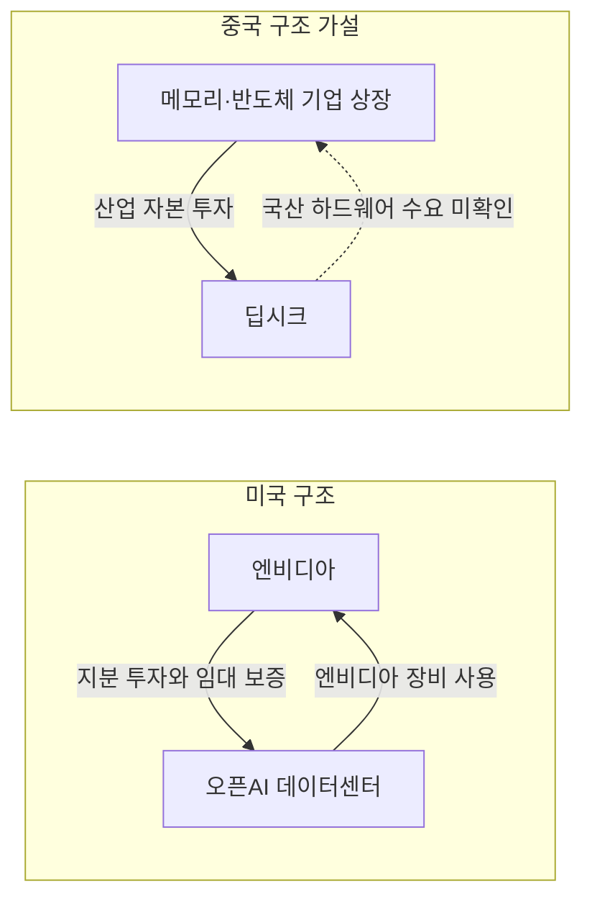

- **대상 글**: [「#중국AI미래지도 딥시크, 2차 투자 유치 막바지…창신메모리 창업자와 과창판 향한다」](https://www.facebook.com/share/19UXt1FcS1/)
- **검증 기준일**: 2026년 9월 28일
- **성격**: 원문의 내용을 풀어 설명하고, 수치와 사실관계를 최신 보도·논문 원문과 대조한 해설 문서

---

## 0. 먼저 읽는 요약

이 글이 던지는 메시지는 한 문장으로 줄일 수 있습니다. 딥시크는 더 이상 "싸게 파는 AI 회사"가 아니라, 실제로 돈을 벌기 시작한 회사이며, 그 회사로 흘러 들어가는 돈의 지도를 보면 중국이 AI 산업을 어떻게 짜고 있는지 보인다는 것입니다.

글은 이 주장을 네 단계로 쌓습니다. 첫째, 매출과 이익률 수치로 딥시크가 돈을 벌 수 있음을 보여 줍니다. 둘째, 1차 투자자 명단(플랫폼·에너지·국가자본)과 2차 투자자 명단(메모리·반도체·지역 산업자본)을 비교합니다. 셋째, 최근 나온 논문 두 편으로 딥시크가 GPU의 고대역폭 메모리(HBM)를 아끼는 기술과, CPU 서버의 D램을 대량으로 쓰는 에이전트 훈련장을 동시에 준비하고 있음을 보여 줍니다. 넷째, 여기서 "상장한 메모리 기업 → 창업자 연계 자본의 딥시크 투자 → 딥시크의 메모리 구매"로 이어지는 순환 고리를 하나의 가설로 제시하고, 미국 엔비디아의 순환 금융과 견줍니다.

검증해 보니 수치와 날짜의 대부분은 사실과 일치했습니다. 다만 글을 읽을 때 함께 알아 두면 좋은 보완점이 있습니다. 가장 큰 것은 딥시크가 8월에 API 요금을 크게 올렸고, 최근의 "연 환산 10억 달러"는 그 인상 이후의 수치라는 점, 그리고 같은 기간 순손실이 여전히 크다는 점입니다. 또 글 후반부의 순환 고리는 글쓴이 스스로 밝히듯 "가설"이며, 딥시크가 창신메모리 제품을 실제로 구매한다는 근거는 아직 공개되지 않았습니다. 이 문서는 뒤에서 이 부분을 "확인된 사실"과 "글쓴이의 해석"으로 나누어 정리합니다.

---

## 1. 배경: 딥시크와 지금까지의 자금 조달

딥시크는 2023년에 퀀트 헤지펀드 하이플라이어(High-Flyer)가 만든 AI 기업으로, 본사는 항저우에 있습니다. 2025년 1월 저비용·고성능 오픈소스 모델로 세계 AI 업계를 놀라게 한 이후 줄곧 주목받아 왔습니다. 오랫동안 외부 투자를 받지 않고 창업자 량원펑의 헤지펀드 자금으로 운영되었다는 점이 특징이었습니다.

그 원칙이 2026년에 바뀝니다. 2026년 4월에 첫 외부 투자 유치를 시작했고 6월에 약 500억 위안 규모로 마무리했습니다. 보도에 따르면 이 1차 라운드에서 량원펑이 200억 위안을 직접 출자했고, 텐센트가 100억 위안, CATL이 50억 위안을 냈습니다. 이 밖에 국가 AI 산업투자기금, 넷이즈, 징둥, IDG캐피털, 모놀리스, 스샹캐피털 등이 참여한 것으로 전해집니다.

곧이어 7월 중순부터 2차 투자 협의가 시작되었고, 7월 25일에는 량원펑이 투자자 회의에서 한 발언이 온라인에 유출되면서 협의가 일시 중단되었습니다. 이후 8월 5일경 조용히 재개되었고, 지금은 마무리 단계에 있습니다. 글의 제목이 말하는 "막바지"가 바로 이 국면입니다.

---

## 2. 글의 논리 구조

글은 일곱 개 소제목으로 나뉘어 있지만, 실제로는 아래와 같은 하나의 흐름입니다.

---

## 3. 장별 해설과 검증

### 3-1. 매출: "싸서 돈이 될까 싶었는데" (글 1장)

**글이 말하는 것.** 딥시크가 모델을 오픈웨이트(가중치 공개)로 내놓고 API 가격도 낮췄기 때문에 시장은 "이걸로 어떻게 돈을 버나"를 의심했습니다. 그런데 올해 1~7월 매출이 약 4억 7,500만 위안(약 965억 원)으로 지난해 연간 매출의 약 10배였고, 전체 매출총이익률은 44.6%, API 사업은 82.9%였다는 보도가 나왔습니다. 9월 24일에는 최근 매출 속도를 1년으로 환산하면 10억 달러에 이른다는 보도가 이어졌습니다.

**쉽게 풀면.** 매출총이익률은 "팔아서 남긴 돈에서 그 상품을 만드는 직접 비용만 뺀 비율"입니다. API 사업은 모델을 호출하는 횟수만큼 요금을 받는 장사인데, 서버 효율을 높여 원가를 낮춘 덕에 이 부문에서는 100원을 받으면 약 83원이 남는다는 뜻입니다. 다만 회사 전체로는 연구 인력, 훈련용 컴퓨팅, 인프라 투자 같은 비용이 훨씬 커서 이 44.6%가 곧 "이익"은 아닙니다.

**검증 결과.**
- 매출 4억 7,500만 위안(약 7,070만 달러), 전년도 연간 매출의 약 10배, 총이익률 44.6%, API 이익률 82.9%는 미국 매체 디인포메이션(The Information)의 8월 25일자 보도를 여러 매체가 인용한 내용과 일치합니다.
- 같은 보도에는 글에 없는 정보가 있습니다. 같은 기간 순손실이 약 7억 1,500만 위안이었고(지난해 연간 순손실은 9억 3,500만 위안), AI 인프라 관련 지출이 약 110억 위안으로 전년도 연간 12억 위안의 거의 10배였습니다. 즉 매출은 빠르게 늘었지만 회사는 아직 적자이며, 그 적자는 컴퓨팅 확충에 들어가는 돈이 매출보다 훨씬 크기 때문입니다.
- 연 환산 10억 달러는 디인포메이션이 9월 24일 보도한 내용으로, 량원펑이 최근 투자자 회의에서 밝힌 수치라고 전해집니다. 몇 달 전 보도된 4억~5억 달러 수준의 두 배 이상입니다.

**꼭 알아 둘 보완점: 가격은 낮아지기만 한 것이 아닙니다.** 글은 "API 가격을 낮추면서"라고 서술하지만, 최근 상황은 더 복잡합니다. 디인포메이션에 따르면 딥시크는 8월에 모델에 따라 API 요금을 2.3배에서 4.5배까지 올렸고, 량원펑은 투자자들에게 이 인상으로 고객이 줄지 않았다고 말했습니다. 10억 달러라는 연 환산 수치는 바로 이 인상 이후의 속도입니다. 따라서 이 수치가 "가격 인상 효과 때문인지, 사용량이 늘어서인지, 신규 고객 덕분인지"는 공개된 정보만으로는 구분되지 않습니다. 또 "연 환산"은 최근의 속도를 1년으로 늘려 잡은 숫자이지 이미 받은 돈이 아니라는 점, 그리고 딥시크의 소비자용 챗봇은 여전히 무료이고 매출은 주로 개발자가 내는 API 요금이라는 점도 함께 기억해 둘 필요가 있습니다.

글의 "사용량을 늘려 AI 서비스의 표준을 선점하려는 생태계 전략"이라는 설명은 글쓴이의 해석입니다. 딥시크가 그렇게 밝혔다는 근거는 찾지 못했습니다. 다만 저가 정책과 오픈소스 공개가 사용자 기반을 넓혀 왔다는 관찰 자체는 합리적입니다.

---

### 3-2. 1차 투자자 지도 (글 2장)

**글이 말하는 것.** 1차 조달(약 500억~510억 위안)의 참여자를 산업별로 나누어 읽습니다. 창업자 량원펑이 최대 출자자이고, 텐센트·징둥·넷이즈는 클라우드와 소비자 서비스라는 "이용자와 만나는 접점", CATL은 데이터센터의 전력과 에너지 저장, 국가 AI 산업투자기금과 벤처캐피털은 "오래 버틸 자본"을 대표한다는 해석입니다. 그래서 AI 모델에 필요한 세 요소인 플랫폼, 전력, 장기 자본이 1차 투자에 모였다고 봅니다. GPU와 냉각 설비는 확인된 직접 투자자 분류에 없고 앞으로의 인프라 수요 영역에 가깝다고 선을 긋습니다.

**검증 결과.** 투자자 명단과 규모는 로이터, 월스트리트저널 등 여러 보도와 일치합니다. 글이 인용한 6월 16일자 《중국기금보》 보도라는 출처 자체는 제가 직접 확인하지 못했지만, 내용은 교차 확인됩니다. 한 가지 덧붙일 점은 기업가치입니다. 상장사 공시에서 역산된 1차 라운드 가치는 약 3,508억 8,000만 위안이었고, 로이터가 전한 관계자 설명으로는 투자 후 기준 약 4,500억 위안으로 보도가 갈립니다. 어떤 기준(투자 전·후, 지분 종류)인지에 따라 다르므로 하나의 숫자로 단정하기는 어렵습니다.

"플랫폼·에너지·국가자본"이라는 분류와 각 투자자에 붙인 역할은 글쓴이의 프레임입니다. 틀린 해석은 아니지만 투자자가 공식적으로 그런 목적을 밝힌 것은 아니라는 점을 구분해서 읽으면 좋습니다.

---

### 3-3. V4.1 플래시: 메모리는 줄이고 시장은 키운다 (글 3장)

**글이 말하는 것.** 9월 10일 공개된 딥시크 V4.1 플래시가 이전 모델보다 GPU의 HBM에 상주하는 저장 공간을 토큰당 890바이트로 낮췄고(약 4분의 1), 서버 메모리나 저장장치에 두는 공간도 약 8분의 1로 줄였다고 소개합니다. 그런데 메모리를 덜 쓰는 모델에 왜 반도체 투자자가 관심을 가질까요? 글의 답은 "단위 비용이 낮아지면 모델과 에이전트를 쓰는 곳이 늘어 전체 수요는 오히려 커질 수 있다"는 것입니다.

**쉽게 풀면.** 여기서 말하는 "정보 저장 공간"의 정체는 **KV 캐시**입니다. AI가 긴 대화나 문서를 다룰 때, 앞에서 읽은 내용을 매번 처음부터 다시 계산하지 않도록 중간 결과를 적어 두는 메모장이라고 생각하면 됩니다. 이 메모장은 글이 길어질수록 커지고, 그것을 GPU의 초고속 메모리(HBM)에 담아야 하기 때문에 긴 문맥을 다루는 서비스의 원가를 좌우합니다. 토큰당 890바이트라면 100만 토큰짜리 긴 문맥에서도 이 부분이 약 890MB 수준입니다(모델을 돌리는 데 필요한 나머지 메모리는 별도).

**검증 결과.**
- 딥시크는 9월 10일 V4.1 플래시를 공개했습니다. API에서는 모델 이름 `deepseek-flash`로 제공되며, 가중치는 MIT 라이선스로 허깅페이스에 공개되었습니다. 총 5,520억 개 매개변수의 멀티모달 전문가혼합(MoE) 모델이고 최대 100만 토큰 문맥을 지원합니다.
- 논문(arXiv 2609.19969, 제목 "DeepSeek-V4.1-Flash: Pushing the Limits of KV Cache Compression")은 전역 KV 캐시가 항상 HBM에 머무는 크기를 토큰당 890바이트로, 이전 V4-플래시의 약 4분의 1이라고 밝힙니다. 이전 V4-플래시는 토큰당 3,514바이트였으니 계산도 맞습니다. 영구 보관용 캐시(SSD나 호스트 메모리)는 약 8분의 1로 줄었습니다. 글은 이 논문의 공개일을 9월 17일로 적고 있습니다.
- 기술적으로는 계층 간 KV 재사용(CSA2)과 FP4(4비트) 저장을 결합한 결과입니다.
- 딥시크 공식 변경 로그는 출시와 함께 API 가격이 인하되었다고 밝힙니다. 이는 "효율이 곧 가격 인하 여력"이라는 글의 논리와 방향이 같습니다.

**해석 부분.** "효율이 좋아져도 설비 수요는 줄지 않는다"는 판단은 사용량이 가격 하락만큼 늘어난다는 전제 위에 서 있습니다. 경제학에서 흔히 말하는 효율 개선의 역설과 같은 논리인데, 이는 전망이지 이미 확인된 결과가 아닙니다. 위에서 본 것처럼 최근에는 오히려 일부 모델 가격이 올랐다는 점도 함께 고려해야 합니다.

---

### 3-4. DSec: 에이전트 훈련장과 250TB D램 (글 4장)

**글이 말하는 것.** 9월 19일 공개된 딥시크 엘라스틱 컴퓨트(DSec) 논문은 AI 에이전트가 코드를 실행하고 결과를 확인하며 연습하는 대규모 "샌드박스" 시설을 설명합니다. 한 운영 단위가 CPU 노드 약 160대, 3만 코어, 서버용 D램 약 250TB를 쓰고 하루 약 300만 개의 독립 환경을 다룬다고 합니다. 글은 이 250TB가 GPU의 HBM이 아니라 CPU 서버의 D램이라는 점을 강조하며, 결국 AI 시대의 하드웨어를 GPU와 HBM만으로 논할 수 없다고 결론짓습니다.

**쉽게 풀면.** 에이전트를 가르치려면 모델이 실제 컴퓨터 환경에서 파일을 열고, 명령을 실행하고, 테스트가 통과하는지 확인하는 경험을 수없이 반복해야 합니다. 그때마다 격리된 가상 컴퓨터가 필요한데 이것이 샌드박스입니다. 모델이 다음 행동을 "생각"하는 동안에는 GPU가 일하고, 그 행동이 "실제로 실행"되는 곳은 CPU와 서버 메모리입니다.

**검증 결과.** 논문(arXiv 2609.22978, 2026년 9월 19일)을 직접 확인했고, 글의 수치는 정확합니다.
- 한 운영 단위(scale unit)가 약 160개 CPU 노드, 3만 코어, 약 250TB의 D램으로 이루어지고, 하루 약 300만 개 샌드박스를 서비스합니다. 여기에 더해 최대 동시 실행 약 38만 개, 초당 5,000개 이상의 생성 속도가 기재되어 있습니다.
- 저자는 량원펑을 포함해 131명이 맞습니다. 다만 저자 중 일부(예: 제1저자와 교신저자 중 한 명)는 칭화대 소속으로 표기되어 있어, 131명 전원이 딥시크 직원이라고 읽으면 정확하지 않습니다.
- 논문은 왜 메모리가 중요한지도 스스로 설명합니다. 에이전트 샌드박스의 약 90%는 요청한 CPU의 5% 이하만 평균적으로 사용합니다. 모델의 다음 지시를 기다리며 쉬는 시간이 길기 때문입니다. 그런데 파일 수정, 설치된 패키지, 실행 중인 서비스 같은 상태는 계속 메모리에 붙들려 있습니다. 그래서 CPU는 남는데 메모리가 먼저 한계에 닿고, 논문은 메모리 공유와 회수 기법으로 피크 메모리를 40.2%, 시간 누적 메모리 사용을 21.2% 줄였다고 보고합니다. 글이 말하는 "D램의 중요성"은 이 점에서 근거가 있습니다.

**선을 그어야 하는 부분.**
1. 이 시설은 논문 제목 그대로 **훈련과 평가용**입니다. 글의 "에이전트가 문서를 만들고 처리하는 실무 작업을 이어가는 동안 CPU와 서버용 D램이 필요하다"는 서술은 이 인프라를 서비스 운영으로 확장한 추론으로, 논문이 직접 말하는 내용은 아닙니다.
2. 글은 딥시크가 "D램의 중요성을 논문으로 입증"했다고 쓰는데, 논문이 보여 준 것은 "에이전트 샌드박스에서 메모리가 용량 한계를 좌우한다"는 사실이지 특정 메모리를 사야 한다는 결론이 아닙니다. 논문 본문에는 메모리 제조사가 언급되지 않습니다.
3. 논문의 성능 실험은 별도의 10노드 시험 클러스터에서 이루어졌고, 그 사양은 AMD EPYC 9655 프로세서와 노드당 512GB~1.5TB D램이었습니다. 운영 환경에 실제로 어떤 서버와 메모리를 쓰는지는 공개되어 있지 않습니다.

---

### 3-5. 2차 투자자 명단과 창신메모리 (글 5장)

**글이 말하는 것.** 2차 협의 명단에는 반도체 색채가 짙어졌습니다. 기가디바이스와 창신메모리(CXMT)의 창업자 주이밍이 연계된 스토니크리크캐피털(투자 협의 규모 약 50억 위안), 중신궈지(SMIC)가 설립에 참여한 차이나포천테크캐피털, 보위캐피털, CPE, 허페이 국유자본 투자 플랫폼 등이 거론됩니다. 9월 23일에는 량원펑 측이 출자기관의 최종 투자자를 심사하며 일부 후보를 제외했다는 보도가 나왔습니다. 창신메모리는 7월 27일 과창판에 상장했고, 량원펑 측 투자기관도 창신메모리의 신규 공모주 배정에 참여했습니다.

**검증 결과.**
- 2차 조달 규모는 500억 위안, **투자 전 기업가치는 약 5,000억 위안**(약 740억 달러)입니다. 글의 "기업가치 5,000억 위안"은 투자 전 기준이라는 점을 알아 두면 좋습니다. 500억 위안이 모두 들어오면 투자 후 가치는 약 5,500억 위안(약 810억 달러 안팎)이 됩니다.
- 기존 주주인 모놀리스, 스샹캐피털, CATL이 참여하고, 신규로 CPE, 레전드캐피털, 스토니크리크캐피털이 협의 중이며, 기가디바이스 계열 자금과 허페이 국유 투자 플랫폼도 관여한다는 보도(SCMP, 블룸버그 계열)가 있습니다. 스토니크리크는 "주이밍과 역사적으로 연결된 반도체 특화 사모펀드"로 소개됩니다.
- 스토니크리크의 협의 규모 약 50억 위안, 량원펑 측 펀드가 창신메모리 공모주에 약 1억 7,500만 위안을 배정받아 사모펀드 중 최고 배정 비율을 얻었다는 내용은 중국 벤처 매체 36Kr 보도와 일치합니다.
- 차이나포천테크캐피털(CFTC)은 SMIC가 다른 주주와 함께 설립한 투자사로 소개됩니다. 다만 매체마다 SMIC 계열 투자 기관의 표기가 다르게 나오므로, 정확한 명단은 최종 출자 구조가 공개될 때 확인하는 것이 안전합니다.
- 9월 23일자 투자계(36Kr 전재) 보도는 딥시크가 출자자(LP)를 강하게 심사하고 있고, 국유자산 배경 LP, 비상장기업, 소액 개인 등 상당수를 탈락시켰다고 전합니다. 이 보도는 동시에 라운드가 크게 초과 청약되었고 아직 완전히 마감되지는 않았으며, 10월 안에 자금 납입이 끝날 것으로 예상된다고 전합니다.
- 창신메모리는 7월 27일 과창판에 상장했습니다. 공모가 8.66위안으로 약 579억 2,000만 위안을 조달했고, 첫날 종가는 49위안으로 공모가 대비 약 466% 상승했으며 시가총액은 약 3조 3,000억 위안으로 본토 상장사 중 최대가 되었습니다. 상장 설명서상 2025년 세계 D램 시장 점유율은 7.67%입니다.

이 대목에서 글이 짚는 핵심은 "돈의 출처와 산업적 기여도를 함께 본다"는 것입니다. 딥시크가 단순히 돈만 주는 투자자가 아니라 공급망 관계에서 도움이 되는 투자자를 고른다는 해석이고, 보도 내용과 결이 맞습니다. 다만 이것 역시 정황에 기반한 해석입니다.

---

### 3-6. 고리는 닫힐까 (글 6장)

**글이 말하는 것.** 글쓴이는 "중국식 자본 순환"의 가설을 세웁니다. 메모리 기업은 상장으로 자본을 확보하고, 창업자와 연계된 기관은 모델 기업에 투자하고, 모델 기업이 자국산 반도체와 서버를 산다면 돈은 제품 수요의 형태로 하드웨어 산업에 돌아갑니다. 그러나 이 고리는 아직 완성되지 않았고, 현재 확인되는 것은 "상장, 투자 논의, 잠재적 메모리 수요"라는 세 개의 점뿐이며 이 점들이 실제 거래로 이어질지는 출자 구조와 구매 계약으로 판단할 수 있다고 유보합니다.

**검증 결과.** 세 점은 모두 사실로 확인됩니다. 창신메모리 상장(확인), 주이밍 연계 자본의 딥시크 투자 협의(보도 확인, 최종 마감 전), 서버 D램 수요(딥시크 논문에서 메모리가 병목이라는 점은 확인, 다만 논문은 특정 제조사를 언급하지 않음)입니다. 반면 네 번째 점인 **딥시크가 창신메모리 제품을 구매한다는 사실이나 계약은 제가 확인한 어떤 보도에도 없습니다.** 글쓴이가 "아직 남은 한 칸"이라고 스스로 밝힌 부분이 정확히 이 지점입니다. 이 글의 가장 정직한 대목이기도 합니다.

참고로 딥시크가 이번 자금을 어디에 쓰려는지는 보도에서 일부 확인됩니다. 연구개발과 컴퓨팅 확충, 자체 데이터센터 구축과 AI 칩 확보에 쓸 계획이라고 전해집니다(SCMP, 파이낸셜타임스 등). 다만 이것이 곧 특정 국산 메모리 구매를 뜻하지는 않습니다.

---

### 3-7. 엔비디아의 순환 금융, 중국의 순환 상장 (글 7장)

**글이 말하는 것.** 미국은 반도체 공급자인 엔비디아가 AI 기업과 인프라에 투자하고, 데이터센터에는 금융 보증을 서고, 그 시설에 다시 자사 장비가 들어가는 구조입니다. 8월 27일 제출된 엔비디아 분기 공시에 오픈AI가 이용할 데이터센터 관련 보증이 담겼다고 합니다. 중국은 하드웨어 기업의 상장, 국유·지방·산업자본의 투자, 모델 기업의 설비 수요가 서로 연결될 가능성이 눈에 띕니다. 딥시크가 과창판에 상장하면 공개 시장 자금까지 끌어와 연구와 인프라에 쓸 수 있고, 이 지도가 실제 공급 계약으로 이어지면 딥시크는 중국의 AI 수요를 자국 하드웨어 산업에 전달하는 중심이 될 수 있다는 결론입니다.

**검증 결과.**
- 엔비디아의 2027 회계연도 2분기(2026년 7월 26일 종료) 분기보고서는 2026년 8월에 체결한 보증을 담고 있습니다. 내용은 SB에너지가 오하이오주 파이크 카운티에 짓는 데이터센터 캠퍼스(약 4.25GW 규모, 오픈AI가 20년 임차)에 대해 엔비디아가 임대료·전력 비용 등의 신용을 지원하되 총 의무를 **1,050억 달러**로 제한한다는 것입니다. 보증은 시설이 단계적으로 가동될 때 효력이 생기고 첫 가동은 2029 회계연도로 예상되며, 오픈AI가 엔비디아에 상환·면책하기로 했고, 오픈AI가 만족스러운 신용등급을 얻으면 종료되는 조건이 붙습니다. 이 보증 계약 자체는 8월 17일 공시·발표되었습니다. 글의 "8월 27일 분기 공시"는 실적 발표(현지 8월 26일)에 맞춘 분기보고서를 가리키는 것으로 보이나, 제출 날짜를 별도로 확인하지는 못했습니다.
- 초기에는 최대 2,500억 달러 보증이 논의되었다가 1,200억 달러 미만, 그리고 최종 1,050억 달러로 줄었다는 보도가 있습니다. 젠슨 황 CEO는 이것이 순환 금융이 아니며 "임대료는 오픈AI가 낸다"고 반박했습니다. 엔비디아는 같은 분기보고서에서 생태계에 대한 지분 투자 990억 달러와 추가 투자 약정 250억 달러(2026년 7월 26일 기준)도 공시했습니다.
- 딥시크의 과창판 상장 준비는 SCMP와 디인포메이션 등이 보도했습니다. 연말께 상장 신청서를 낼 수 있고 2027년 상장을 목표로 하며, 상장을 준비할 투자은행도 이미 골랐다고 합니다. 글이 인용한 9월 24일 보도(2차 조달을 10월 말까지 마칠 계획)도 확인됩니다.

**해석 부분.** "순환 상장"은 글쓴이가 붙인 이름이고 공식 용어가 아닙니다. 미국의 엔비디아 사례는 "공시로 확인되는 계약"이고, 중국의 사례는 "아직 확인되지 않은 연결의 가능성"이라는 점에서 성격이 다릅니다. 글도 "가능성이 눈에 띈다"고 조심스럽게 표현하고 있습니다. 또 투자업계에서는 기업가치 5,000억 위안에 진입하는 투자자가 상장 후 시총 기대를 높게 잡고 있어 안전마진이 얇아질 수 있고, 상장 후 의무 보유 기간(락업)도 있다는 경고도 나옵니다.

두 모델의 차이를 간단히 표로 정리하면 다음과 같습니다.

| 구분 | 미국(엔비디아 중심) | 중국(글이 제시하는 가설) |
|---|---|---|
| 중심 | 반도체 공급자 엔비디아 | 모델 기업 딥시크 |
| 자금 경로 | 지분 투자, 임대료 보증, 장비 판매 | 하드웨어 기업 상장, 산업·지방·국가 자본 투자, 모델사의 설비 수요 |
| 근거 수준 | 공시로 확인된 계약 | 투자 협의 보도는 확인, 구매 계약은 미확인 |
| 핵심 위험 | 공급자가 고객의 자금 조달을 돕는 구조의 부담 | 상장 후 밸류에이션 부담, 실제 구매로 이어지는지 불확실 |

---

## 4. 사실과 해석을 나누어 읽기

이 글은 사실 전달과 해석이 섞여 있어서, 어디까지가 확인된 내용인지 구분해 두면 도움이 됩니다.

**확인된 사실이 중심인 부분.** 1~7월 매출과 이익률 수치, 연 환산 10억 달러 보도, 1차 투자자 명단과 규모, V4.1 플래시의 공개일·KV 캐시 890바이트·4분의 1·8분의 1, DSec 논문의 노드·코어·D램·샌드박스 수치, 창신메모리 상장, 2차 조달 규모와 목표 시점, 출자자 심사 보도, 엔비디아의 보증 공시입니다.

**글쓴이의 해석이 중심인 부분.** 투자자별 역할 분류(플랫폼·에너지·국가자본), "생태계 전략으로 표준을 선점한다"는 평가, 효율 개선이 오히려 설비 수요를 키운다는 전망, DSec를 실무 서비스 인프라로 확장한 이해, 순환 고리 가설과 "순환 상장"이라는 표현입니다.

**보완이 필요한 부분.** ① 8월 API 요금 인상과 이후의 매출 증가를 함께 볼 것, ② 순손실과 인프라 지출 규모, ③ 5,000억 위안은 투자 전 기준이라는 점, ④ DSec는 훈련·평가용 인프라라는 점과 저자 131명 중 일부가 칭화대 소속이라는 점, ⑤ 창신메모리와 딥시크 사이의 구매 관계는 미확인이라는 점입니다.

---

## 5. 앞으로 확인할 지표

이 이야기가 어느 방향으로 굳어질지는 다음 신호로 판단할 수 있습니다.

첫째, **2차 조달의 최종 마감과 출자 구조 공개**입니다. 목표는 10월 말이며, 최종 투자자 명단과 각자의 지분·자금 성격이 공개되어야 글이 말한 "산업 지도"의 실제 모습이 드러납니다. 둘째, **딥시크의 과창판 상장 신청서**입니다. 신청서(설명서)에는 주요 공급업체, 구매 계약, 특수관계 거래가 공시되기 때문에 창신메모리와의 관계가 있다면 이곳에서 확인될 가능성이 큽니다. 셋째, **API 요금 인상 이후의 고객 유지**입니다. 10억 달러 런레이트가 유지되는지, 아니면 인상 효과가 일시적이었는지가 가치 평가의 핵심입니다. 넷째, **V4.1 프로급 모델의 등장과 가격 정책**입니다. 딥시크는 V4.1 플래시를 "새 아키텍처 계열에서 가장 작은 모델"로 소개해 왔기 때문에, 더 큰 모델이 나오면 메모리·컴퓨팅 수요를 실제로 어떻게 바꾸는지 볼 수 있습니다.

---

## 6. 용어 풀이

- **오픈웨이트**: 모델의 학습된 가중치(핵심 파일)를 공개해 누구나 내려받아 쓸 수 있게 하는 방식입니다.
- **API 매출총이익률**: API 요금 수입에서 그 서비스를 돌리는 직접 비용을 뺀 뒤 남는 비율입니다. 회사 전체 이익률이 아닙니다.
- **런레이트(연 환산 매출)**: 최근 한 달가량의 매출 속도를 1년 치로 늘려 잡은 숫자입니다. 실제로 받은 연 매출과 다릅니다.
- **투자 전 기업가치(프리머니)**: 새 돈이 들어오기 전의 회사 가치입니다. 여기에 조달액을 더하면 투자 후 가치가 됩니다.
- **KV 캐시**: AI가 앞서 읽은 내용을 다시 계산하지 않도록 저장해 두는 중간 결과입니다. 문맥이 길수록 커집니다.
- **HBM**: GPU 옆에 붙어 있는 초고속 메모리로 값이 비쌉니다. 모델이 판단하는 순간 필요한 정보를 담습니다.
- **D램(DRAM)**: 일반 서버와 PC의 작업용 메모리입니다. HBM보다 느리지만 용량을 크게 쓸 수 있습니다.
- **샌드박스**: 에이전트가 안전하게 명령을 실행해 볼 수 있도록 격리된 가상 실행 환경입니다.
- **강화학습 롤아웃**: 모델이 환경에서 행동하고 결과에 따라 보상을 받으며 학습하는 시도 한 판을 뜻합니다.
- **과창판(STAR Market)**: 상하이증권거래소의 과학기술 혁신 기업 전용 시장입니다.
- **출자자(LP)와 운용사(GP)**: 펀드에 돈을 대는 쪽이 LP, 그 돈을 굴리는 쪽이 GP입니다.
- **MoE(전문가혼합)**: 모델의 일부 전문가 영역만 골라 쓰는 구조로, 전체 크기에 비해 실제 연산량을 줄입니다.

---

## 7. 참고 자료 (검증에 사용한 주요 출처)

**딥시크 논문·공식 자료**
- DeepSeek-V4.1-Flash 논문(arXiv 2609.19969): https://arxiv.org/abs/2609.19969
- DeepSeek Elastic Compute(DSec) 논문(arXiv 2609.22978): https://arxiv.org/abs/2609.22978
- 딥시크 API 변경 로그: https://api-docs.deepseek.com/updates/

**딥시크 투자·매출 보도**
- The Standard, 2차 조달 재개(2026년 8월 5일): https://www.thestandard.com.hk/finance/article/339123/DeepSeek-resumes-second-funding-round-at-pre-money-valuation-of-500b-yuan
- The Standard, 1~7월 매출 보도(2026년 8월 26일): https://www.thestandard.com.hk/finance/article/341002/DeepSeeks-first-seven-month-revenue-surged-tenfold-to-475-million-yuan-report-says
- PYMNTS, 매출·손실·인프라 지출(2026년 8월 26일): https://www.pymnts.com/news/artificial-intelligence/2026/deepseek-eyes-7-billion-dollar-fundraise-revenues-jump-tenfold
- RuntimeWire, 연 환산 10억 달러와 요금 인상(2026년 9월 24일): https://runtimewire.com/article/deepseek-billion-dollar-revenue-run-rate-fundraise
- SCMP, 2차 조달 마무리 단계와 투자자 명단(2026년 8월 26일): https://www.scmp.com/tech/big-tech/article/3365280/deepseek-nears-pre-ipo-funding-round-2027-market-debut-takes-shape-sources
- Yahoo Finance(로이터 전재), 1차 라운드 기업가치 역산(2026년 7월 16일): https://finance.yahoo.com/technology/ai/articles/chinese-filing-implies-deepseek-valuation-145508150.html
- Manila Times(로이터 전재), 1차 라운드 출자 내역(2026년 7월 19일): https://www.manilatimes.net/2026/07/20/business/foreign-business/chinas-deepseek-to-raise-fresh-capital-at-74-billion-valuation-ahead-of-onshore-ipo-sources-say/2387159
- Fortune(블룸버그 인용), 협의 일시 중단(2026년 7월 25일): https://fortune.com/2026/07/25/deepseek-liang-wenfeng-backers-fundraising-pause-viral-posts-investors/
- 36Kr(투자계 전재), 출자자 심사와 초과 청약(2026년 9월 23일): https://eu.36kr.com/en/p/3995785666449543
- 36Kr, 주이밍과 스토니크리크 관련 보도: https://eu.36kr.com/en/p/3996852677382274

**V4.1 플래시 출시·기술 해설**
- Hugging Face 논문 페이지: https://huggingface.co/papers/2609.19969
- KDnuggets 해설: https://www.kdnuggets.com/why-deepseek-v4-1-flash-is-such-an-exciting-open-model-release

**창신메모리 상장**
- CNBC, 상장 첫날(2026년 7월 27일): https://www.cnbc.com/2026/07/27/cxmt-china-market-debut-chipmaker-ipo.html
- China Daily(2026년 7월 28일): https://www.chinadaily.com.cn/a/202607/28/WS6a67eb6ba310986e2b46793a.html

**엔비디아 보증 공시**
- 엔비디아 분기보고서(10-Q, 2026년 7월 26일 종료 분기): https://www.sec.gov/Archives/edgar/data/0001045810/000104581026000075/nvda-20260726.htm
- 엔비디아 8-K(2026년 8월 17일): https://www.sec.gov/Archives/edgar/data/1045810/000104581026000069/nvda-20260817.htm
- Fortune, 보증 규모 축소 경과(2026년 8월 18일): https://fortune.com/2026/08/18/openai-data-center-deal-with-nvidia-comes-in-145-billion-lower-than-reportedsignaling-concerns-of-artificial-demand-for-chips/

> 원화 환산액은 원문 글의 기준을 따랐으며 환율에 따라 달라질 수 있습니다. 투자 협의 관련 내용은 관계자를 인용한 보도이므로 최종 마감 시점에 바뀔 수 있습니다. 이 문서는 정보 제공 목적이며 투자 권유가 아닙니다.

---

**작성일: 2026년 9월 28일**
