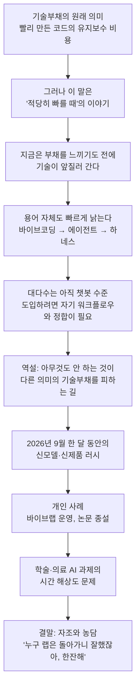
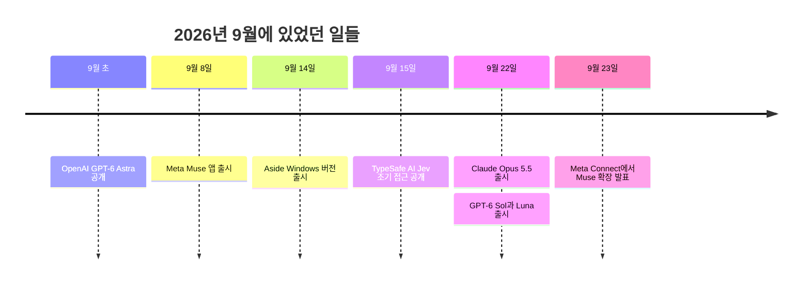
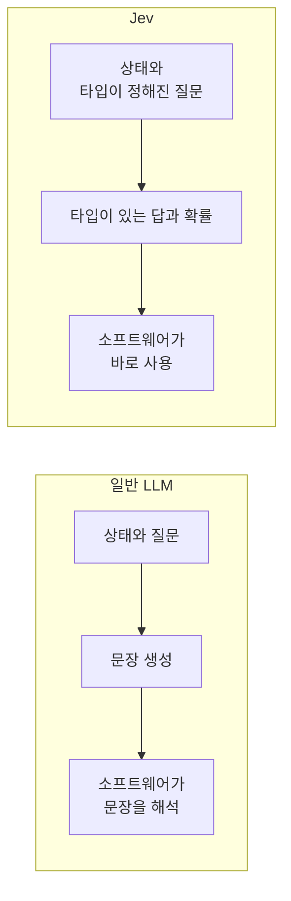
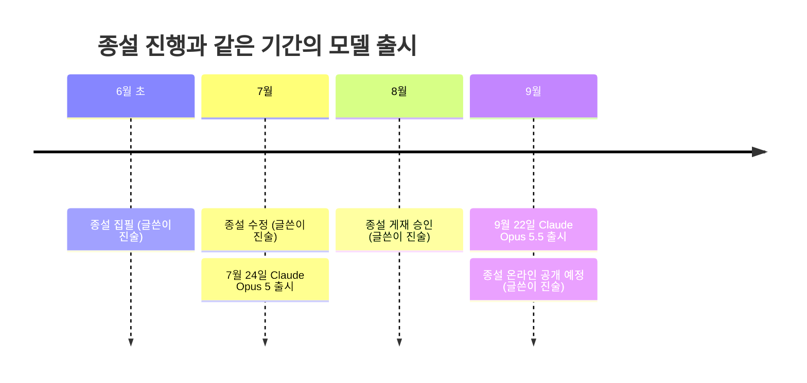
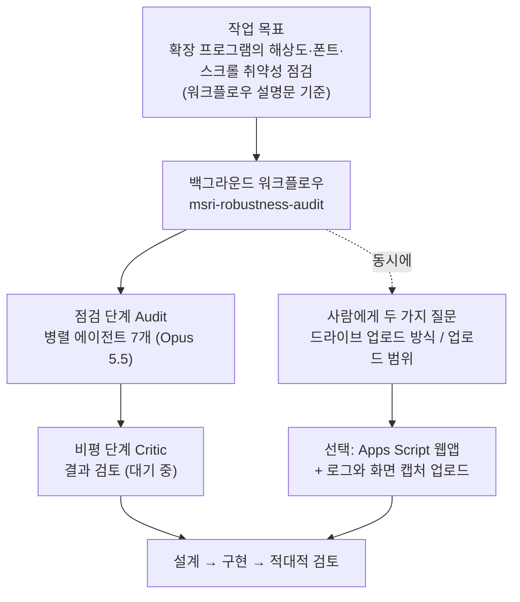

**이 문서는 2026년 9월 말에 SNS에 게시된 한국어 장문 글(이하 "이 글")의 내용을 문단별로 풀어 설명하고, 글에 등장하는 최신 사건과 용어를 검색으로 확인한 결과를 함께 정리한 해설서입니다. 검증된 사실과 글쓴이 개인의 진술·의견을 구분해서 적었고, 확인하지 못한 부분은 확인하지 못했다고 명시했습니다.**

> 
> 바이브코딩 시대에 가장 많이 사용되었던 용어중 하나가 기술부채다. 당장 돌아가는 코드로 만들었던거 때문에 생기는 유지보수비용으로 나중에 감당해야한다는 그런 이야기고, 당연히 옳은 이야기다.
> 
> 그런데 그것도 적당히 빠를때 이야기다. 지금은 부채를 느끼기도 전에 기술이 치고 나간다. 사실 바이브 코딩이라는 말 자체도 이제 사어처럼 들린지 좀 오래 되었다. 에이전트, 하네스, 엔지니어링 어쩌고도 다 이제 obsoleted 될 용어. 물론 개념은 남겠지만.
> 
> 그런데 아직도 대부분의 사람들은 챗봇으로 쓰고있고, 웨이브를 탄다고 해도, 자신의 코어밸류-워크플로우와 정합시키는 것은 결국 직접 하거나 누군가는 해줘야 하기 때문에 손대지 않고 있고, 이것이 사실 현명하다. 즉 아예 아무것도 안하는 것이 다른 의미의 기술부채 (기술 업데이트의 필요성) 를 안 일으키는 현명한 선택이다. 뛰는 강남집값 앞에서 현금만 들고 있는거 같은 느낌은 들지만. 글타고 그 쌈지돈으로 어쩌고 저쩌고 해봤자 사실 거인들 앞에서 공깃놀이 같다.
> 
> 다시 시간의 주제로 돌아가보자. 현재 프론티어 AI가 바뀌는 판과 새롭게 나오는 신기술은 이제 양민으로서 거의 따라가기가 힘들었다. 바이브코딩-오픈클로-헤르메스 까진 좋았다. 하지만 이번달에만 해도 Jev가 나왔고, 물건너 (아마도) 최초의 유저 프렌들리 에이전트인 muse, 그리고 Agent imbedded browser인 Aside가 윈도우 버전으로 나오고, opus 5.5가 나오고, GPT 6 sol이 나오고 또 코드 리셋권을 주는데.
> 
> 5월에 바이브랩을 시작할때만 해도 올 한해 정도는 이걸로 진행할 수 있지 않을까 했는데, 아니었다. 랩이름에 코딩을 안넣은건 그나마 신의 한수로, 바이브가 바이브코딩이 아니라 2차 회식 바이브라고 우길 수 있기 때문이다. 더 이상 human in the loop가 아니라 인간은 방해가 될 뿐이 될 시기는 머지 않았다. 이 시기를 전통적인 움직임으로서는 도저히 따라 갈 수가 없다.
> 
> 채택후 출간까지 1년이 걸리는 전통적 논문은 고생했다는 의미는 되지만, 이미 논문을 보고 뭔가를 하기엔 너무너무 늦다. 아카이브도 늦다. 프로시딩은 몇천개 몇만개 나오지만 이를 따라갈 연구자도 버겁고 늦다. 내 종설만 해도 8월에 억셉이 되었지만, 9월이면 리젝되었어야 한다고 생각할 정도다. 아니 무슨 바이브 코딩이냐 2026년 9월에. 전통적이라면 6월초에 쓰고-7월에 리비전하고-8월에 억셉되고-9월에 epub(이색희들 결국 넘기겠지만) 스케줄은 말도 안되게 빠르지만, 이미 시효를 지나서 부끄러울 정도다.
> 
> 쉽게 쉽게 정신승리를 하자면, 이럴수록 인간의 가치가 소중해지고 어쩌고 저쩌고 뇌피셜을 끄적거리는건 너무 쉽다. 근데, 그게 의미가 있습니까? 아니 그게 돈이 됩니까? 하면 한없이 작아지는 것도 사실이다.
> 
> 그리고 수많은 의료 특화 LLM, Agent 과제들도 솔직히, 너무너무 나이브하다는 생각이 든다. 이런 temporal resolution (?)으로 캐치업 할 수 없다. 하지만 누구 랩은 돌아가니 잘했자나. 한잔해~
> 
> https://www.facebook.com/share/p/19DMPJ793H/
> 

---

## 1. 한눈에 보기

이 글은 한마디로 **"AI 기술이 바뀌는 속도가 사람이 따라갈 수 있는 한계를 넘어섰다"는 체감을 자조 섞인 유머로 풀어낸 에세이**입니다. 글쓴이는 소프트웨어 개발에서 오래 쓰여 온 개념인 "기술부채"에서 출발합니다. 기술부채는 지금 당장 돌아가게만 만든 코드가 나중에 유지보수 비용으로 돌아온다는 뜻인데, 바이브코딩 시대에 특히 많이 언급되었습니다. 글쓴이는 이 말이 옳기는 하지만 "적당히 빠를 때"의 이야기라고 말합니다. 지금은 부채를 실감하기도 전에 기술이 앞서 나가 버리기 때문입니다.

이어서 글쓴이는 이번 달(2026년 9월)에만 새 모델과 새 에이전트 제품이 줄줄이 쏟아졌다는 점을 나열합니다. 그리고 자신의 연구실 운영과 논문 작성 경험을 예로 들어, 전통적인 학술 출판 속도로는 이 흐름을 도저히 따라갈 수 없다고 토로합니다. 마지막에는 의료 특화 LLM·에이전트 연구 과제도 시간 해상도가 너무 낮다고 평가하면서도, "그래도 누구 랩은 돌아가니 잘했다, 한잔하자"라는 농담으로 글을 맺습니다.

첨부된 자료는 두 가지입니다. 하나는 "빠르지만 틀린 계산"을 소재로 한 밈이고, 다른 하나는 여러 AI 에이전트가 백그라운드에서 병렬로 코드 점검 작업을 수행하는 세션 화면입니다. 두 자료의 내용은 4장에서 따로 풀어 드립니다.

---

## 2. 글의 논리 흐름

글은 크게 "개념 비판 → 역설 → 사건 나열 → 개인 사례 → 자조적 결말"의 순서로 진행됩니다.

---

## 3. 문단별 상세 해설

### 3.1 첫 문단: 기술부채라는 말과 바이브코딩

**기술부채(technical debt)란 무엇인가.** 이 비유는 소프트웨어 개발자 워드 커닝햄이 1992년 OOPSLA 학회 경험 보고서에서 처음 쓴 것으로 알려져 있습니다. 그는 처음 출하하는 미완성 코드를 빚을 지는 일에 빗대었습니다. 조금의 빚은 개발 속도를 높여 주지만 제때 갚지 않으면 이자가 붙고, 결국 조직 전체가 빚의 무게에 멈춰 설 수 있다는 취지였습니다. 여기서 눈여겨볼 대목은 커닝햄의 원문도 "빠르게 만들고 신속히 갚는다"는 전제 위에 서 있다는 점입니다. 이 글이 말하는 "적당히 빠를 때의 이야기"라는 표현은 이 전제를 짚은 것으로 읽을 수 있습니다.

**바이브코딩은 무엇인가.** 이 용어는 안드레이 카파시가 2025년 2월 2일 X(옛 트위터)에 올린 글에서 나왔습니다. 그는 분위기(vibe)에 완전히 몸을 맡기고 코드가 존재한다는 사실조차 잊는 새로운 코딩 방식이라고 설명했습니다. 이 말은 빠르게 퍼져 2025년 콜린스 사전이 올해의 단어로 선정했습니다. 원래 정의는 AI가 만든 코드를 꼼꼼히 읽지 않고 받아들이는 방식을 가리키기 때문에, 대충 만든 코드가 쌓여 기술부채가 된다는 우려가 자연스럽게 함께 따라다녔습니다. 글쓴이가 "바이브코딩 시대에 가장 많이 쓰인 용어 중 하나가 기술부채"라고 한 것은 이 맥락입니다.

**"사어처럼 들린다"는 말의 의미.** 글쓴이는 바이브코딩이라는 말이 이미 사어(죽은 말)처럼 들린 지 오래라고 합니다. 에이전트, 하네스, 엔지니어링 같은 말도 곧 낡은 용어가 될 것이라고 예상합니다. 다만 "개념은 남겠다"고 덧붙입니다. 참고로 "하네스(harness)"는 AI 에이전트에서 모델 자체를 뺀 나머지, 즉 도구, 기억, 실행 제약, 피드백 루프 등을 통틀어 부르는 말로 정착 중입니다. 이 용어는 2026년 2월 미첼 하시모토가 처음 소개했고, 같은 해 3월 랭체인이 "에이전트 = 모델 + 하네스"라는 정의를 내놓은 것으로 정리되어 있습니다. 즉 이 말도 나온 지 1년이 채 되지 않았는데, 글쓴이는 벌써 낡아 가고 있다고 느끼는 것입니다. 이것이 글 전체를 관통하는 "속도" 문제의 첫 번째 사례입니다.

### 3.2 둘째 문단: 아무것도 하지 않는 것이 현명한 이유

이 문단이 글에서 가장 역설적인 부분입니다. 글쓴이의 논리를 순서대로 풀면 다음과 같습니다.

1. 아직 대부분의 사람은 AI를 챗봇으로만 씁니다.
2. 신기술의 파도에 올라타려 해도, 그 기술을 자기 조직의 핵심 가치(코어밸류)와 업무 흐름(워크플로우)에 **맞물리게 정렬하는 일**은 결국 본인이 직접 하거나 누군가 대신해 줘야 합니다.
3. 그 일이 번거로워서 손대지 않는 사람이 많고, 글쓴이는 이것이 오히려 현명하다고 봅니다.
4. 이유는 이렇습니다. 기존의 기술부채가 "코드를 대충 만든 대가"라면, 새 기술을 붙잡은 사람은 "기술이 바뀔 때마다 갈아엎어야 하는 대가", 즉 **기술 업데이트의 필요성이라는 다른 종류의 부채**를 집니다. 아무것도 안 하면 이 부채는 생기지 않습니다.

곧바로 글쓴이는 이 논리의 불안감도 인정합니다. "뛰는 강남 집값 앞에서 현금만 들고 있는 것 같은 느낌"이라는 비유는, 안 하는 것이 합리적이더라도 남들이 앞서 나가는 걸 지켜보는 초조함은 남는다는 뜻입니다. 또 "그 쌈지돈(작은 돈)으로 뭘 해봤자 거인들 앞에서는 공기놀이 같다"고 덧붙입니다. 개인이나 작은 조직이 자원을 들여 따라가 봐야 대형 AI 기업의 속도와 규모 앞에서는 소꿉놀이처럼 보인다는 자조입니다.

### 3.3 셋째 문단: "이번 달"의 사건들

글쓴이는 시간 문제를 본격적으로 다루며, 이번 달에만 벌어진 일들을 나열합니다. 아래 표는 각 항목을 검색으로 확인한 결과입니다. (오늘은 2026년 9월 28일이므로 "이번 달"은 2026년 9월입니다.)

| 글에서 언급한 것 | 확인된 사실 | 날짜 |
|---|---|---|
| 바이브코딩–오픈클로–헤르메스 | 오픈클로(OpenClaw)와 헤르메스 에이전트(Hermes Agent)는 모두 오픈소스 에이전트 프로젝트입니다. 헤르메스는 Nous Research가 만들었고, 스스로 기술(스킬)을 만들고 개선하는 "자기 개선형" 에이전트를 표방합니다. 헤르메스에는 오픈클로에서 설정과 기억을 옮겨 오는 이전 명령도 들어 있습니다. | 올해 상반기부터 |
| Jev | TypeSafe AI가 공개한 "System One 모델"입니다. 글을 쓰지 않고 정해진 형식의 답과 확률만 돌려주는 의사결정용 모델입니다. | 9월 15일 |
| muse | Meta가 출시한 개인용 AI 에이전트 앱입니다. | 9월 8일 |
| Aside (윈도우 버전) | 에이전트가 내장된 브라우저 Aside의 Windows 버전입니다. | 9월 14일 |
| Opus 5.5 | Anthropic의 새 모델입니다. Claude 5.5 계열의 첫 모델입니다. | 9월 22일 |
| GPT 6 sol | OpenAI의 GPT-6 계열 모델입니다. 같은 날 Luna도 함께 나왔습니다. | 9월 22일 |
| 코드 리셋권 | Anthropic이 구독 사용자에게 사용량 한도 리셋권을 제공했습니다. | 9월 22일 |

아래 타임라인으로 보면 한 달 동안 얼마나 빽빽했는지 한눈에 들어옵니다.

각 항목을 하나씩 풀어 보겠습니다.

**(1) Jev — "말하지 않는 AI".** Jev는 일반적인 대화형 LLM이 아닙니다. 프로그램의 현재 상태와 "타입이 정해진 질문"을 함께 넣으면, 문장이 아니라 **정해진 형식의 답과 그 확신도(확률)** 를 돌려줍니다. 예를 들어 "이 요청은 어느 담당 부서로 보내야 하는가"라는 닫힌 질문에 선택지별 확률로 답하는 식입니다. 일반 LLM은 문장을 생성한 뒤 소프트웨어가 그 문장을 다시 해석해야 하지만, Jev의 출력은 소프트웨어가 곧바로 쓸 수 있습니다.

만든 곳은 샌프란시스코의 TypeSafe AI이고, 창업자 디오구 알메이다는 OpenAI에서 RLHF 등을 연구하다 2024년에 나온 인물로 소개됩니다. 9월 15일 제한적 조기 접근으로 공개되었고, 같은 날 4,000만 달러 규모 시드 투자 유치가 함께 발표되었습니다. 요금은 회사 발표 기준으로 입력 토큰 100만 개당 0.042달러이며 출력 토큰은 별도 과금하지 않습니다. 블룸버그는 9월 25일 기사에서 Jev의 출시 영상이 X에서 약 4,000만 회 조회되었고, 파이낸셜타임스 보도로는 100억 달러 이상 가치를 제시한 투자 제안이 있었다고 전했습니다. 다만 속도·가격 수치는 대부분 회사가 직접 밝힌 것이고 독립 검증은 아직 초기 단계입니다. 모델 가중치가 공개된 것도 아니고 호스팅 서비스 형태로만 제공됩니다.

**(2) Muse — "누구나 쓰는 에이전트".** Muse는 Meta가 9월 8일 출시한 개인용 AI 에이전트 앱입니다. 이메일·캘린더 같은 계정과 연결해 예약, 양식 작성, 일정 정리 같은 일을 대신 처리합니다. Meta는 이를 "모든 사람을 위해 만든 세계 최초의 개인용 AI 에이전트"라고 소개했는데, 이 "세계 최초"는 Meta 측의 자체 표현입니다. 글쓴이가 "물 건너(해외의) (아마도) 최초의 유저 프렌들리 에이전트"라고 쓴 것은 이 표현을 조심스럽게 받아들인 것으로 보입니다. 무료 요금제가 있고 월 20달러, 100달러 요금제가 있으며, 미국에서 먼저 18세 이상에게 제공됩니다. 9월 23일 Meta Connect에서는 열쇠고리 형태의 "Muse Charm" 기기와 실시간 아바타 기능이 발표되었습니다. CNN은 센서타워 자료를 인용해 출시 후 250만 회 이상 내려받았다고 전했고, CNBC는 사용자가 직접 거부하지 않으면 대화 내용이 Meta의 모델 학습에 쓰일 수 있다고 보도했습니다.

**(3) Aside — "에이전트가 들어 있는 브라우저".** Aside는 Y Combinator의 지원을 받은 스타트업의 브라우저로, 사람과 에이전트가 함께 쓰도록 새로 만들었다고 소개합니다. 이미 로그인해 둔 웹사이트와 계정을 그대로 활용해 에이전트가 일을 처리하며, 민감한 작업은 사람의 승인을 요구합니다. 6월 23일 맥OS 버전으로 출시된 뒤 9월 6일 윈도우 비공개 베타를 거쳐 9월 14일 윈도우 버전이 나왔습니다. 9월 22일에는 Opus 5.5와 GPT-6 Sol·Luna를 Aside에서 쓸 수 있게 되었다는 공지도 있었습니다.

**(4) Opus 5.5.** Anthropic이 9월 22일 공개한 모델로 Claude 5.5 계열의 첫 모델입니다. 회사는 "대부분의 작업에서 Fable 5.1과 같은 수준이면서, Opus 5보다 40% 저렴하다"고 밝혔습니다. API 가격은 입력 100만 토큰당 4달러, 출력 20달러입니다. Opus 5(7월 24일 출시)가 나온 지 약 두 달 만의 후속 모델입니다. Sonnet 5.5와 Haiku 5.5도 곧 이어서 나올 예정이라고 공지했습니다. 다만 모든 수치가 그대로 검증된 것은 아닙니다. The New Stack의 자체 비교에서는 비용 절감 주장은 확인됐지만 속도 향상 주장은 기대에 못 미쳤다고 보도했습니다. 한편 독립 평가기관 Artificial Analysis의 종합 지수에서는 1위를 기록했다고 heise가 전했습니다.

**(5) 코드 리셋권.** Anthropic은 Opus 5.5 공지에서 Pro, Max, Team 및 좌석제 Enterprise 요금제의 5시간 사용 한도를 올렸고, 구독 사용자에게 "한도 리셋"을 제공하되 **저장해 두었다가 원하는 때 쓸 수 있게** 했다고 밝혔습니다. 글쓴이가 말한 "코드 리셋권"이 이 조치를 가리킨다고 보는 것이 가장 자연스럽습니다. 다만 글쓴이는 어느 회사의 어떤 리셋인지 명시하지 않았으므로, 이 연결은 문맥에 따른 해석입니다.

**(6) GPT-6 Sol.** OpenAI는 같은 날(9월 22일) GPT-6 Sol과 Luna를 내놓았습니다. 두 모델은 ChatGPT의 Work와 Codex에서 쓸 수 있으며(일반 Chat에서는 아님), API 가격은 Sol이 입력 100만 토큰당 2달러·출력 10달러, Luna가 0.10달러·0.50달러입니다. 이달 초 나온 플래그십 GPT-6 Astra를 보완하는 하위 모델 성격입니다. VentureBeat는 이 날 Anthropic과 OpenAI가 같은 시점에 가격 경쟁 성격의 발표를 했다는 점을 짚었습니다.

이 목록에서 글쓴이가 강조하고 싶었던 핵심은 개별 제품이 아니라 **"이 모든 일이 한 달 안에 일어났다"는 밀도**입니다. 같은 날 Anthropic과 OpenAI가 모델을 발표했고, The New Stack이 "OpenAI의 비교는 이미 낡았다"고 쓸 정도였습니다. 글쓴이가 "양민으로서는 따라가기 힘들다"고 한 것은 이 밀도에 대한 반응입니다.

### 3.4 넷째 문단: 바이브랩과 "인간이 방해가 되는 시기"

이 부분은 글쓴이 개인의 경험담으로, 외부에서 검증할 수 있는 정보가 아닙니다. 글에 따르면 5월에 "바이브랩"이라는 이름의 연구실(랩)을 시작했을 때는 최소 올해 한 해는 이 방향으로 갈 수 있을 것이라 생각했는데 그렇지 않았습니다. 그래서 랩 이름에 "코딩"을 넣지 않은 것이 신의 한 수였다고 말합니다. "바이브"를 바이브코딩이 아니라 "2차 회식 분위기"라고 우길 수 있기 때문이라는 농담입니다.

그다음 주장이 이 글의 가장 강한 문장입니다. "휴먼 인 더 루프(human in the loop)", 즉 AI가 하는 일의 중간중간에 사람이 판단하고 승인하는 구조가 이제는 필요하지 않게 되어, **인간이 방해만 되는 시기가 머지않았다**는 것입니다. 그리고 이 시기를 전통적인 방식의 움직임으로는 따라갈 수 없다고 말합니다. 이는 글쓴이의 전망이며 사실 확인의 대상이 아니라는 점을 구분해서 읽어야 합니다. 참고로 Anthropic은 Opus 5.5 소개에서 이 모델이 무리한 행동을 덜 하고 주어진 경계 안에서 움직이는 경향이 강화되었다고 강조했는데, 이는 사람의 개입이 줄어드는 방향의 사용(장시간 무인 실행)이 늘고 있음을 보여 주는 대목이기도 합니다. 실제로 발표문에는 한 고객이 여러 저장소에 걸친 작업을 밤새 사람 없이 18시간 넘게 돌렸다는 사례가 실려 있습니다.

### 3.5 다섯째 문단: 학술 출판의 시간 문제

글쓴이는 학술 지식이 유통되는 전통적 경로가 지금의 속도에 너무 느리다고 말합니다.

- **저널 논문**: 채택 후 출간까지 1년쯤 걸리니 "고생했다"는 의미는 있어도, 그 논문을 보고 무언가를 시작하기에는 이미 너무 늦습니다.
- **아카이브(arXiv)**: 심사 전 공개 논문 서버조차 늦다고 합니다.
- **프로시딩(학회 논문집)**: 수천, 수만 편이 쏟아지는데 이를 따라갈 연구자도 벅차고 늦습니다.
- **자신의 종설(리뷰 논문)**: 8월에 게재 승인(억셉)이 되었지만 9월인 지금은 "리젝되었어야 한다"고 생각할 정도라고 합니다. "2026년 9월에 무슨 바이브코딩이냐"는 자조입니다.

글쓴이가 밝힌 일정은 6월 초 집필, 7월 수정(리비전), 8월 승인, 9월 온라인 선공개(epub)입니다. 전통적 기준으로는 "말도 안 되게 빠른" 일정인데도 이미 시효가 지났다고 말합니다. 괄호 속 "이××들 결국 넘기겠지만"은 문맥상 출판 쪽 일정이 결국 밀릴 것이라는 푸념으로 읽히지만, 글에 구체적인 설명은 없습니다.

이 대비는 글쓴이의 논점을 잘 보여 줍니다. 종설이 집필에서 승인까지 가는 동안 Anthropic만 해도 Opus 5(7월 24일)에서 Opus 5.5(9월 22일)까지 약 60일 사이에 새 세대가 나왔습니다. 문서가 세상에 나올 즈음에는 그 문서가 다루던 "최신"이 이미 한 세대 뒤로 밀려 있는 셈입니다.

### 3.6 여섯째 문단: 정신승리와 "돈이 됩니까?"

글쓴이는 이런 상황에서 "그럴수록 인간의 가치가 소중해진다" 같은 말을 적는 것은 너무 쉽다고 말합니다. "뇌피셜(근거 없이 머릿속으로만 만든 주장)"을 끄적이는 것에 불과하다는 뜻입니다. 그러고는 "그게 의미가 있습니까? 그게 돈이 됩니까?"라고 스스로에게 되묻고, 그 질문 앞에서는 한없이 작아진다고 인정합니다. 즉 위안이 되는 서사(인간의 가치)와 시장이 실제로 값을 쳐 주는 것 사이의 간극을 솔직히 인정하는 대목입니다.

### 3.7 일곱째 문단: 의료 특화 LLM·에이전트 과제 비판

글쓴이는 수많은 의료 특화 LLM과 에이전트 과제가 "너무너무 나이브(순진)"하다고 평가합니다. 이유는 "이런 temporal resolution(시간 해상도)으로는 캐치업할 수 없다"는 것입니다. 여기서 "시간 해상도"는 과제를 기획하고 수행하고 결과를 내는 사이클의 촘촘함을 가리키는 표현으로 읽힙니다. 기술이 몇 주 단위로 바뀌는데 몇 달~몇 년 단위로 계획하고 검증하는 연구 과제는 결과가 나올 때쯤이면 대상 기술이 이미 바뀌어 있다는 비판입니다. 글쓴이가 어떤 특정 과제를 지목한 것은 아닙니다.

### 3.8 마지막 문장: "누구 랩은 돌아가니 잘했잖아. 한잔해~"

이 문장은 앞의 비관적인 논의를 뒤집는 농담 섞인 마무리입니다. 이 모든 어려움 속에서도 어쨌든 연구실이 굴러가고 있다는 사실 자체를 격려하며 "한잔하자"고 끝냅니다. "누구 랩"이 특정 연구실인지 글쓴이 본인의 랩인지는 글에서 분명하지 않습니다. 글 전체가 진지한 진단과 자조를 오가는 만큼, 이 문장은 결론이라기보다 분위기를 풀어 주는 쉼표에 가깝습니다.

---

## 4. 첨부 자료 해설

### 4.1 첨부 자료 1: "전 수학에 빠릅니다" 밈

캡틴 아메리카가 등장하는 영화 장면을 네 칸으로 편집하고 한국어 자막을 붙인 밈입니다. 대화는 다음과 같이 흘러갑니다.

1. 캡틴이 "전 수학에 빠릅니다"라고 말합니다.
2. 상대가 "그럼 750×1920이 뭐지?"라고 묻습니다.
3. 캡틴이 "230"이라고 답합니다.
4. 상대가 "근접하지도 않잖아"라고 하자 캡틴은 "하지만 빨랐죠"라고 받아칩니다.
5. 마지막 칸에서는 주변 인물들과 몸싸움이 벌어집니다.

실제 정답은 750×1920 = 1,440,000입니다. (75 × 192 = 14,400이고 여기에 100을 곱하면 1,440,000이 됩니다.) 답이 230이라면 "근접하지도 않은" 정도가 아니라 자릿수부터 다릅니다. 이 밈의 웃음 포인트는 **"정확성이 전혀 없어도 빠르기만 하면 됐다고 우기는 태도"** 입니다.

글쓴이는 이 밈이 글의 어디에 연결되는지 직접 설명하지 않았습니다. 따라서 아래 두 가지는 확인된 사실이 아니라 **글의 주제와 이어 볼 수 있는 해석**입니다.

- 속도만 앞세우고 내용은 부실한 결과물, 예컨대 시간 해상도만 높이고 정확성·깊이는 담보하지 못하는 연구 과제에 대한 풍자로 읽을 수 있습니다.
- 반대로 "빠르게 냈지만 이미 시효가 지난" 자신의 종설이나 랩 운영에 대한 자조로 읽을 수도 있습니다.

### 4.2 첨부 자료 2: 백그라운드에서 돌아가는 다중 에이전트 점검 작업

이 자료는 AI 코딩 에이전트 세션의 대화 화면과 오른쪽 "백그라운드 작업" 패널을 함께 담고 있습니다. 어떤 제품의 화면인지는 자료에 명시되어 있지 않으므로 특정하지 않겠습니다. 자료에서 읽을 수 있는 내용은 다음과 같습니다.

**대화 영역.** AI는 먼저 코드 구조를 파악하면서 드라이버 좌표계와 `content.js`를 살펴보고 있다고 보고합니다. `content.js`는 일반적으로 브라우저 확장 프로그램이 웹페이지 안에서 실행하는 스크립트 파일의 이름입니다. 또 구글 드라이브 MCP 연결과 읽기가 확인되었다고 하고, 곧 **해상도·폰트·스크롤에 의존하는 지점**과 **과거 버그 목록**을 확인하는 병렬 점검을 시작하겠다고 말합니다. (MCP는 AI가 외부 도구와 데이터에 연결하도록 하는 개방형 규약입니다.)

이후 "msri-robustness-audit"라는 이름의 **워크플로우**가 시작됩니다. 자료에는 7개 에이전트가 함께 일하고, 진행 시간이 7분 29초로 표시되어 있습니다. AI는 "점검 워크플로우가 백그라운드에서 돌고 있다(7개 관점 + 완성도 검토). 그 사이 사장님 결정이 필요한 부분 두 가지를 여쭙는다"고 하며 사용자에게 다음 두 가지를 묻습니다.

| 질문 | 추천 선택지 |
|---|---|
| 로그를 구글 드라이브로 보내는 방식은? (드라이브에서 읽는 것은 확인됐고, 문제는 확장 프로그램이 드라이브에 "쓰는" 방법) | Apps Script 웹앱 |
| 드라이브에 무엇까지 올릴까? | 로그와 화면 캡처 |

사용자는 두 추천안을 그대로 택했고, AI는 "Apps Script 웹앱 + 로그·화면 캡처 업로드로 간다"고 정리한 뒤, **감사 결과가 나오면 그것을 근거로 설계 → 구현 → 적대적 검토 순서로 진행하겠다**고 말합니다. (Apps Script는 구글의 스크립트 플랫폼이며 웹앱 형태로 배포해 외부에서 오는 요청을 받아 드라이브에 파일을 저장하는 용도로 쓸 수 있습니다. 자료에서는 확장 프로그램이 드라이브에 직접 쓰기 어렵다는 점이 문제로 언급되어 있습니다.)

**오른쪽 패널.** 작업 이름은 msri-robustness-audit이고 유형은 워크플로우, 에이전트는 7개, 사용 토큰은 393.2k입니다. 작업 설명은 "확장 프로그램의 해상도·DPI·줌·폰트·스크롤 취약성을 점검하고, 과거 버그를 목록화하고, 설계를 조정하고, 드라이브 로그 업로드를 만든다"는 취지의 영문 문장입니다. 단계는 두 개로 표시됩니다.

- **Audit(점검)**: 0/7 진행, 7개 에이전트 모두 Opus 5.5 모델이며 앞의 두 개는 각각 7분 29초를 표시합니다.
- **Critic(비평)**: 아직 시작된 에이전트가 없음.

아래는 이 구조를 도식으로 옮긴 것입니다.

**이 자료가 글과 어떻게 연결되는가.** 글쓴이는 자료에 대한 설명을 따로 적지 않았습니다. 다만 자료가 보여 주는 사실은 명확합니다. 사람이 세부 작업을 하나하나 지시하지 않아도 여러 에이전트가 동시에 점검을 수행하고, 사람에게 돌아오는 것은 "어느 쪽으로 갈까요"라는 굵직한 선택 질문 두 개뿐입니다. 3.3장에서 본 Opus 5.5가 실제 작업에 투입되어 있다는 점(모델 열에 Opus 5.5 표기)도 확인됩니다. 이 장면을 글의 "인간이 점점 방해가 된다"는 주장과 함께 놓고 볼지는 독자의 판단에 달려 있습니다. 자료 속 사람은 아직 결정 두 건을 내리는 역할을 맡고 있습니다.

---

## 5. 용어 사전

| 용어 | 쉬운 설명 |
|---|---|
| 기술부채 | 빨리 만들려고 대충 만든 코드가 나중에 수정·유지보수 비용으로 돌아오는 현상을 빚에 비유한 말. |
| 바이브코딩 | AI에게 원하는 바를 자연어로 말하고 코드는 세세히 읽지 않은 채 결과 위주로 받아들이는 코딩 방식. 2025년 2월 카파시가 명명. |
| 에이전트 | 목표를 받으면 도구를 써 가며 여러 단계를 스스로 수행하는 AI 시스템. |
| 하네스(harness) | AI 에이전트에서 모델 자체를 뺀 나머지 전부(도구, 기억, 실행 제약, 피드백 루프 등). "에이전트 = 모델 + 하네스". |
| 에이전틱 엔지니어링 | 에이전트를 안정적으로 쓰기 위해 명세, 하네스, 평가, 맥락 관리 등을 설계하는 실무 영역을 부르는 말로 쓰임. |
| 휴먼 인 더 루프 | AI의 작업 과정 중간에 사람이 판단·승인으로 개입하는 구조. |
| 프론티어 AI | 그 시점 가장 앞선 성능의 최첨단 AI 모델. |
| 정합(시킨다) | 서로 어긋나지 않게 맞춘다는 뜻. 여기서는 AI 기술을 자기 업무 가치와 흐름에 맞춰 통합하는 일. |
| 코어밸류 | 조직이나 개인이 지키려는 핵심 가치. |
| 종설 | 여러 연구를 모아 정리한 리뷰 논문. |
| 억셉·리젝 | 논문의 게재 승인(accept)과 거절(reject). |
| 프로시딩 | 학회에서 발표된 논문을 묶은 논문집. |
| arXiv(아카이브) | 심사 전 논문을 미리 공개하는 온라인 서버. |
| epub | 정식 인쇄에 앞서 온라인으로 먼저 게재하는 것. |
| temporal resolution | 시간 해상도. 여기서는 연구·개발 사이클이 얼마나 촘촘하고 빠른가를 뜻하는 비유. |
| obsoleted | 낡아서 쓸모가 없어진, 구식이 된. |
| 양민 | 평범한 일반인을 자조적으로 부르는 표현. |
| 쌈지돈 | 주머니 속 적은 돈. |
| 뇌피셜 | 근거 없이 머릿속으로만 만든 주장. |
| System One 모델 | Jev를 만든 회사가 쓰는 표현. 빠르고 직관적인 판단(카너먼의 시스템 1)에서 이름을 따온, 문장 대신 결정을 내리는 모델. |
| MCP | AI가 외부 서비스·데이터에 연결하도록 해 주는 개방형 규약. |

---

## 6. 사실 확인 정리

**검색으로 확인한 사실**

- 기술부채 비유는 1992년 워드 커닝햄의 OOPSLA 경험 보고서에서 유래했다.
- 바이브코딩은 2025년 2월 2일 안드레이 카파시가 X에서 처음 사용했고, 2025년 콜린스 올해의 단어로 선정되었다.
- Meta Muse는 2026년 9월 8일 출시되었다.
- Aside 윈도우 버전은 2026년 9월 14일 출시되었다.
- Jev는 2026년 9월 15일 TypeSafe AI가 조기 접근으로 공개했다.
- Claude Opus 5.5와 GPT-6 Sol·Luna는 2026년 9월 22일 공개되었다.
- Anthropic은 Opus 5.5 발표에서 구독 사용자에게 저장해 두고 원할 때 쓸 수 있는 사용량 한도 리셋을 제공한다고 밝혔다.

**회사 발표 수치이거나 자체 주장이어서 독립 검증이 더 필요한 것**

- Jev의 응답 속도와 가격 우위 (회사 발표, 독립 실험은 초기 단계).
- Muse가 "세계 최초의 개인용 에이전트"라는 표현 (Meta의 자체 주장).
- Opus 5.5의 "40% 저렴, 30% 빠름" (일부 독립 테스트에서 속도 주장은 미치지 못한 것으로 보도).

**글쓴이 개인의 진술이라 외부 검증이 불가능한 것**

- 5월에 바이브랩을 시작했다는 이야기, 랩의 운영 상황.
- 종설의 집필·수정·승인 일정.
- "인간이 방해가 되는 시기가 머지않았다"는 전망.
- 의료 특화 LLM·에이전트 과제가 나이브하다는 평가.

**확인하지 못한 것**

- 원문 SNS 링크는 자동 접근이 차단되어 열어 보지 못했고, 전달받은 본문 텍스트와 첨부 자료를 기준으로 작성했습니다.
- "코드 리셋권"이 Anthropic의 조치를 가리킨다는 연결은 문맥에 따른 해석입니다. OpenAI 쪽의 유사 조치는 확인하지 못했습니다.
- 첨부 자료 2의 "MSRI"가 무엇의 약자인지, 어떤 제품의 화면인지는 자료에 나와 있지 않아 다루지 않았습니다.

---

## 7. 이 글을 읽는 세 가지 포인트

첫째, 이 글은 기술부채를 부정하지 않습니다. 오히려 "빚은 갚는 시간이 있을 때 성립하는 개념인데 지금은 갚을 시간보다 기술이 바뀌는 시간이 짧다"는 문제를 제기합니다. 커닝햄이 처음 말한 "빨리 갚는다"는 전제가 흔들린다는 관찰입니다.

둘째, 글쓴이의 결론은 "그러니 이렇게 하자"가 아니라 "이렇게 해도 저렇게 해도 불안하다"에 가깝습니다. 아무것도 안 하면 부채는 없지만 뒤처지는 느낌이 있고, 뭔가 하면 그 순간 낡습니다. 글이 유머와 자조로 끝나는 것은 이 딜레마에 정답이 없다는 인식과 맞닿아 있습니다.

셋째, 글에 나오는 사건들은 모두 실제로 2026년 9월 한 달 사이에 있었던 일입니다. 글쓴이의 체감("한 달에 이렇게 많이")은 과장이 아니라 확인 가능한 사실에 근거하고 있습니다. 반면 "인간이 방해가 된다"는 전망과 학술·의료 연구 과제에 대한 평가는 글쓴이의 판단이므로 별개로 다루어야 합니다.

---

## 8. 참고한 출처

- Anthropic, "Introducing Claude Opus 5.5" — https://www.anthropic.com/claude-opus-5-5
- VentureBeat, Claude Opus 5.5 출시 보도 — https://venturebeat.com/technology/anthropic-releases-claude-opus-5-5-beating-fable-5-1-on-key-agentic-benchmarks-at-60-cheaper-api-price
- KDnuggets, Opus 5.5 정리 — https://www.kdnuggets.com/everything-claude-opus-5-5-actually-ships-with
- The New Stack, Opus 5.5와 Opus 5 비교 — https://thenewstack.io/claude-opus-5-5-vs-opus-5/
- heise online, 외부 벤치마크 결과 — https://www.heise.de/en/news/External-benchmarks-Claude-Opus-5-5-overtakes-OpenAI-s-Astra-and-Fable-5-1-11466259.html
- The New Stack, GPT-6 Sol·Luna 출시 — https://thenewstack.io/openai-gpt-6-sol-luna-release/
- 9to5Mac, GPT-6 Sol·Luna 출시 — https://9to5mac.com/2026/09/22/openai-upgrading-chatgpt-and-codex-with-two-more-gpt-6-models/
- Bloomberg, Jev 관련 보도 — https://www.bloomberg.com/news/articles/2026-09-25/jev-an-ai-model-that-can-t-chat-takes-on-bigger-rivals
- Wikipedia, Jev (AI model) — https://en.wikipedia.org/wiki/Jev_(AI_model)
- The Register, Jev 분석 — https://www.theregister.com/devops/2026/09/23/shut-up-and-calculate-jevs-new-ai-primitives-for-coders/5298431
- Wavect, Jev 문서·구조 리뷰 — https://wavect.io/blog/jev-ai-decision-model-review/
- CNBC, Meta Muse 출시 — https://www.cnbc.com/2026/09/08/meta-personal-ai-agents-public-reckoning-privacy-safety.html
- TechCrunch, Meta Muse 신규 기능 — https://techcrunch.com/2026/09/23/everything-new-coming-to-metas-ai-agent-muse/
- CNN Business, Muse 사용기 — https://www.cnn.com/2026/09/23/tech/meta-muse-ai-agent
- ABC News, Muse 개요 — https://abcnews.com/Business/metas-muse-ai-agent/story?id=136680507
- Runtime Wire, Aside 윈도우 출시 — https://runtimewire.com/article/aside-ai-browser-launches-windows-app
- Aside 공식 X 계정 — https://x.com/AsideAI
- Aside 변경 이력 — https://docs.aside.com/changelog/components
- Nous Research, Hermes Agent (GitHub) — https://github.com/nousresearch/hermes-agent
- Parallel, OpenClaw와 Hermes 비교 — https://parallel.ai/articles/openclaw-vs-nousresearch-hermes
- Ward Cunningham, "The WyCash Portfolio Management System" (OOPSLA '92) 관련 해설 — https://newsletter.getdx.com/p/tech-debt-research
- 바이브코딩 기원 정리 — https://zalt.me/blog/2026/07/who-coined-vibe-coding
- Dev Community, 바이브코딩 정리 — https://dev.to/rawveg/the-vibe-coding-reckoning-k38
- Martin Fowler, "Harness engineering for coding agent users" — https://martinfowler.com/articles/harness-engineering.html
- 하네스 용어 유래 관련 논문 — https://arxiv.org/pdf/2607.25890

---

작성일: 2026년 9월 28일
