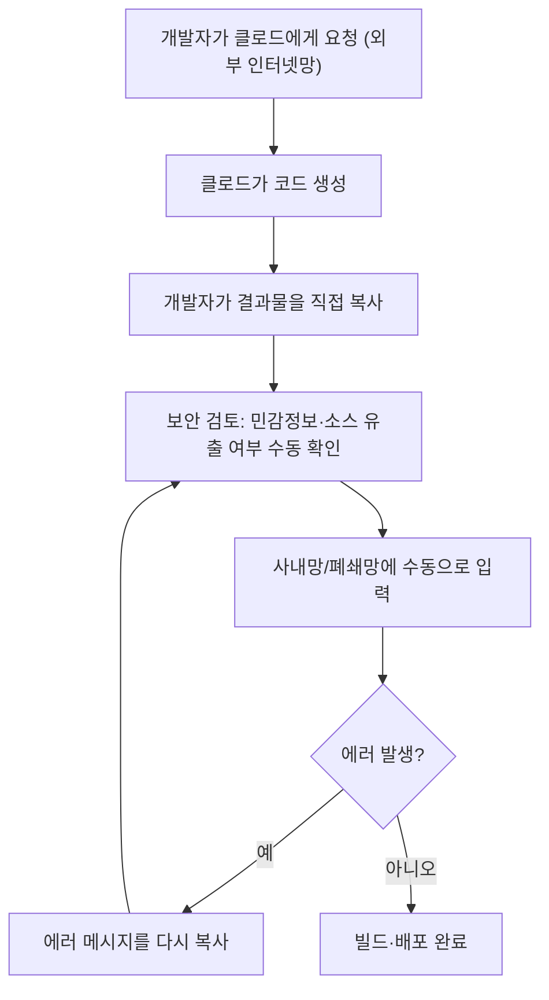
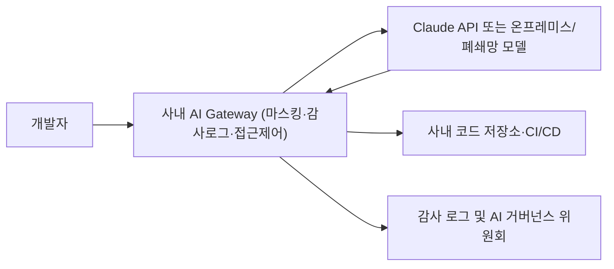

### 대기업 AX 프로젝트와 한국형 망분리 딜레마

```
대기업에서 AX 프로젝트 하게 되셨나요? 
축하드립니다! 이제 당신은 인간 API입니다

클로드가 코드 짜줌 -> 내가 사내망에 넣음 -> 에러 뱉음
-> 보안 걸리는 내용 없는지 보고 클로드에 보냄
-> 클로드가 코드 수정해줌 -> 또 내가 사내망에 넣음
-> 또 에러남 -> 또 .....

무한반복하다보면 어느 순간 깨달음이 옴

˗ˋˏ
　　　　　　　아
　나는 클로드랑 사내망을 연결하는
　　　　API 나부랭이구나
　　　　　　　　　　　　　　ˎˊ˗

https://www.threads.com/share/BAXaUkE_Nz/
```


## 목차
1. 들어가며 — 게시물이 그려낸 장면
2. '인간 API' 루프의 해부
3. 근본 원인 — 한국의 망분리 규제란 무엇인가
4. 생성형 AI 코딩 도구가 망분리 앞에서 멈추는 이유
5. 2024~2026년, 금융권 규제 완화의 실제 타임라인
6. 공공·국방 부문의 별도 트랙 — N2SF와 폐쇄망 AI
7. 기업들이 만들고 있는 우회로 — 온프레미스, AI Gateway, 폐쇄망 코딩 에이전트
8. 현장의 목소리 — 대기업 AX 웨비나가 보여주는 표준 해법
9. 정리 및 시사점

---

## 1. 들어가며 — 게시물이 그려낸 장면

공유된 게시물은 대기업 AX(AI Transformation, AI 전환) 프로젝트에 투입된 어느 실무자의 자조 섞인 경험담이다[11]. 내용을 간추리면 이렇다. 클로드가 코드를 작성해 준다. 그 코드를 사내망에 넣는다. 에러가 난다. 에러 내용에 보안에 걸릴 만한 정보가 없는지 확인한 뒤 다시 클로드에게 전달한다. 클로드가 코드를 고쳐 준다. 그 코드를 또 사내망에 넣는다. 또 에러가 난다. 이 과정을 무한히 반복하다 보면 어느 순간 "나는 클로드와 사내망을 연결하는 API 나부랭이구나"라는 깨달음이 온다는 것이다.

이 문장은 농담의 형태를 띠고 있지만, 그 안에 담긴 관찰은 정확하다. 실제로 지금 한국의 적지 않은 대기업·금융사·공공기관·국방기관에서, 개발자는 문자 그대로 클로드(혹은 다른 생성형 AI)와 사내 폐쇄망 사이를 손으로 오가며 데이터를 복사하고 붙여넣는 역할을 수행하고 있다. 이 문서는 이 현상이 왜 발생하는지, 그 구조적 원인은 무엇인지, 그리고 이를 해소하기 위해 2024년부터 2026년 현재까지 어떤 규제 변화와 기술적 대응이 실제로 이루어지고 있는지를 검증 가능한 자료를 바탕으로 설명한다. 다만 "인간 API"라는 표현 자체는 이번에 공유된 게시물에서 사용된 표현이며, 업계에서 공식적으로 통용되는 용어라는 근거는 확인되지 않았다는 점은 분명히 해 둔다.

## 2. '인간 API' 루프의 해부

게시물이 묘사한 순환 구조를 도식으로 그리면 다음과 같다.



이 그림에서 핵심은 화살표 C와 E, 그리고 G다. 이 세 구간은 시스템이 아니라 사람이 수행한다. 클로드는 인터넷에 연결된 외부 환경에서 작동하고, 실제 코드가 실행되고 검증되어야 하는 사내 시스템은 그 인터넷과 물리적 혹은 논리적으로 끊어져 있기 때문에, 그 사이의 데이터 이동은 자동화된 API 호출이 아니라 사람이 파일을 복사하고, 내용을 눈으로 검토하고, 다시 붙여넣는 수작업으로 채워진다. 이 반복 작업에서 개발자가 실제로 하고 있는 일은 코딩이 아니라 클로드와 사내망 사이의 '통신 프로토콜' 역할이며, 게시물의 표현을 빌리면 그것이 바로 "API 나부랭이"가 된 순간이다.

## 3. 근본 원인 — 한국의 망분리 규제란 무엇인가

이 현상의 뿌리에는 한국 특유의 망분리(網分離) 규제가 있다. 망분리란 업무에 사용하는 내부망과 인터넷에 연결된 외부망을 물리적으로, 혹은 최소한 논리적으로 분리하여 운영하도록 하는 보안 체계를 말한다. 외부로부터의 해킹이나 내부 정보의 유출을 원천적으로 차단하겠다는 목적으로, 금융·공공·국방·의료 등 민감한 정보를 다루는 기관에서는 이것이 감독 규정이나 법령을 통해 의무화되어 있다.

금융권의 경우 이 물리적 망분리 규제가 10년 넘게 유지되어 온 대표적인 산업 규제였다고 보도되었다[6]. 업계에서는 이 규제가 인터넷을 빠르게 연결해 솔루션을 개발하고 고도화하는 데 가장 큰 걸림돌로 통했으며, 망분리 규제 때문에 금융회사들이 오픈소스를 활용해 업무 환경에 맞는 AI 모델을 자체적으로 개발할 길이 사실상 막혀 있었다는 평가도 있었다[5]. 그리고 이 규제는 금융권에만 국한된 것이 아니다. 망분리 규정을 적용받는 대표적인 영역으로 공공기관, 금융, 국방, 의료기관이 함께 거론되며[8], 실제로 국방 소프트웨어 개발 현장에서도 민감한 데이터와 소스코드를 외부로 반출하지 않으면서 생산성과 보안 수준을 함께 높여야 하는 과제가 존재한다고 보도되었다[9]. 여기에 더해, 정부 규제와 별개로 ISMS-P(정보보호 및 개인정보보호 관리체계) 인증을 받은 일반 기업들도 인증 요건의 일부로 유사한 망 분리 체계를 자체적으로 운영하는 경우가 많다는 점도 실제 기업 현장의 질문에서 확인된다[10]. 즉 게시물 속 상황이 반드시 금융이나 공공기관에서만 벌어지는 일은 아니며, ISMS-P 인증을 유지하는 일반 대기업의 개발 조직에서도 얼마든지 재현될 수 있는 구조라는 뜻이다.

## 4. 생성형 AI 코딩 도구가 망분리 앞에서 멈추는 이유

문제는 클로드 코드를 비롯한 대부분의 생성형 AI 코딩 도구가 기본적으로 외부 클라우드와 통신하는 방식으로 작동한다는 점이다. 개발자가 입력한 명령과 참고로 제공한 내부 소스코드는 그 처리를 위해 외부 서버로 전송되며, 바로 이 전송 행위 자체가 망분리 규정을 적용받는 조직에서는 규정 위반이 되거나 최소한 별도의 예외 승인 절차를 거쳐야 하는 사안이 된다[8]. 다시 말해, 사내망 내부에 앉아 있는 개발자의 컴퓨터에서는 애초에 클로드의 API를 직접 호출할 수 없다. 그래서 실무에서는 별도의 외부망 연결 PC나 개인 기기로 클로드를 사용해 코드를 얻고, 그 결과물을 물리적으로 옮겨(대개 문서 형태로 반출 절차를 거쳐) 사내망 안의 실제 개발·테스트 환경에 입력하는 방식이 자리 잡게 된다. 게시물이 묘사한 "클로드가 코드 짜줌 → 내가 사내망에 넣음"이라는 문장은 바로 이 물리적 단절을 그대로 반영한 것이다.

이 구조에서 발생하는 비효율은 단순히 손이 많이 가는 문제에 그치지 않는다. 코드가 실제로 실행되는 사내 환경의 라이브러리 버전, 내부 API 스펙, 조직 고유의 코딩 컨벤션, 레거시 시스템과의 연동 방식 등은 외부의 클로드가 알지 못하는 정보이기 때문에, 에러가 발생했을 때 그 에러 메시지 안에 실제 원인 파악에 필요한 맥락(내부 시스템 이름, 내부 IP, 테이블 구조 등)이 섞여 있을 가능성이 높다. 그래서 개발자는 에러를 그대로 복사해 보내는 것이 아니라, 그 안에서 보안에 걸릴 만한 내용을 걸러내는 검토 작업을 매번 수행해야 하며, 이 필터링 과정에서 정작 문제 해결에 필요한 정보까지 함께 지워져 다음 답변의 정확도가 떨어지는 악순환이 생기기도 한다.

## 5. 2024~2026년, 금융권 규제 완화의 실제 타임라인

이러한 비효율에 대한 문제의식은 금융 당국에서도 이미 공유되고 있었고, 실제로 지난 2년 사이 단계적인 규제 완화가 진행되어 왔다. 금융위원회는 2024년 8월 '금융분야 망분리 개선 로드맵'을 발표하며 단계적 완화를 예고했다[14]. 이 로드맵에 따르면 금융회사가 규제 샌드박스, 즉 혁신금융서비스 신청 심사를 받으면 생성형 AI 등에 대한 인터넷 활용 제한 규제를 완화받을 수 있는 길이 우선 열렸다[5].

이후 2026년 1월 사전예고를 거쳐, 같은 해 4월 20일부터는 '전자금융감독규정 시행세칙' 개정안이 정식으로 시행되었다[10]. 이 개정으로 금융회사는 혁신금융서비스 심사라는 별도 절차를 거치지 않아도, 금융보안원의 평가를 통과한 클라우드 기반 SaaS(서비스형 소프트웨어)를 내부 업무망에서 사용할 수 있게 되었다[1][6]. 이는 외부 네트워크 활용이 필요하다는 금융 현장의 목소리를 반영한 조치로 설명되었으며, 금융 당국은 보안 수준을 계속 살피면서 생성형 AI 서비스의 활용 범위를 점차 넓혀 갈 계획이라고 밝혔다[6].

여기서 한 달 뒤인 2026년 5월, 금융 당국은 한 걸음 더 나아가 대형 금융사 49곳을 대상으로 망분리 규제를 1년간 한시적으로 풀었다. 이는 생성형·자율형 AI의 확산에 따른 보안 대응 차원의 조치로, 보안 역량과 AI 활용 능력이 검증된 곳을 대상으로 챗봇, 자산관리, 여신심사 등 혁신 서비스 개발을 지원하기 위한 목적이며, 중소형 금융사를 위한 별도의 AI 보안 지원책도 함께 병행되었다고 보도되었다[3][4]. 정리하면, 2024년 8월의 로드맵 발표에서 시작해 2026년 4월의 SaaS 예외 허용, 그리고 2026년 5월의 대형 금융사 한시적 전면 완화까지, 약 2년에 걸쳐 단계적으로 규제의 문턱이 낮아져 온 셈이다.

다만 이 완화는 어디까지나 보안 역량이 사전에 검증된 대형 금융사 49곳에 한정된 1년짜리 한시 조치이며, 금융보안원 평가를 통과한 특정 SaaS에 한정된 예외라는 점은 분명히 짚어야 한다. 즉 이 조치들이 금융권 전체의 망분리 규제를 전면 폐지한 것은 아니며, 검증받지 못한 중소형 금융사나 다른 산업의 조직들에게는 여전히 게시물이 묘사한 수작업 루프가 일상적인 현실일 가능성이 크다.

## 6. 공공·국방 부문의 별도 트랙 — N2SF와 폐쇄망 AI

금융권과 별개로 공공 부문에서도 움직임이 있다. 한국인터넷진흥원(KISA)은 공공 업무 환경의 디지털 전환을 지원하기 위해 총 55억 원 규모의 N2SF 도입·실증 사업을 추진하고 있다. 이 가운데 이미 검증된 보안 모델을 실제 기관에 적용하는 도입 지원 사업에 45억 원, 새로운 모델의 안전성을 시험하는 실증 용역에 9억 9천만 원을 투입할 계획이며, 과제당 최대 7억 5천만 원의 정부 지원금이 투입된다고 밝혀졌다[2]. KISA는 이 사업에서 '업무 환경에서 생성형 AI 활용', '외부 클라우드 활용 업무 협업 체계' 등 현장에서 가장 필요로 하는 여섯 가지 주요 모델을 선정했다고 전해지며, 이는 2025년 잇따른 보안 사고를 계기로 사이버 보안 패러다임이 N2SF라는 새로운 체계로 전환된 흐름과 맞닿아 있다고 설명되었다[2]. 다만 이 N2SF라는 명칭이 정확히 무엇의 약자인지, 그리고 2025년의 보안 사고가 구체적으로 어떤 사건이었는지는 확인한 자료에 명시되어 있지 않아, 이 문서에서는 추가로 확인되지 않은 세부 내용을 추측하지 않는다.

국방 분야에서는 좀 더 구체적인 사례가 확인된다. 시선AI라는 기업은 자사의 솔루션 '인트라젠엑스'로 공군의 국방망 관련 사업을 수주했다고 보도되었다. 이 솔루션은 외부망과 분리된 서버에서 구동되는 온프레미스 방식으로, 생성된 코드의 취약점을 자동으로 점검하는 기능을 갖추고 있다고 설명된다. 시선AI 대표는 이번 수주가 인트라젠엑스의 안전성과 기술력을 국방망에서 검증하고 관련 시장 진입을 위한 핵심 레퍼런스를 확보했다는 데 의미가 있다고 밝히며, 엄격한 보안 규제와 망분리 환경이 필요한 공공기관, 금융권, 대기업, 방산기업을 대상으로 고통제 폐쇄망 AX 사업을 확대하겠다는 계획을 전했다[9]. 이 발언은 시선AI 측의 자체 입장이라는 점을 밝혀 둔다.

## 7. 기업들이 만들고 있는 우회로 — 온프레미스, AI Gateway, 폐쇄망 코딩 에이전트

규제 완화가 진행되는 한편, 시장에서는 아예 규제를 건드리지 않고 문제를 해결하려는 기술적 시도들도 나타나고 있다. 외교저널의 보도에 따르면, 기업이 통제하는 환경 안에서 AI 코딩 에이전트를 운영하는 방식은 크게 세 가지로 나뉜다. 첫째는 온프레미스로, 기업 내부 인프라에서 대형언어모델과 AI 코딩 에이전트를 직접 운영하는 방식이다. 둘째는 프라이빗 클라우드로, 별도의 VPC(가상 사설 네트워크)와 접근 제어 정책을 적용하는 방식이다. 셋째는 에지·로컬 AI로, 일부 모델이나 추론 기능을 개발자와 물리적으로 가까운 내부 환경에서 처리하는 방식이다[7].

같은 보도는 이러한 기업용 AI 코딩 환경이 단순히 IDE 플러그인 하나를 설치하는 것만으로는 구축되지 않는다고 지적한다. 먼저 AI에 입력해도 되는 데이터와 제한해야 할 데이터를 구분해야 하고, 보안 요구 수준에 맞춰 프라이빗 LLM, 오픈소스 모델, 혹은 하이브리드 모델 중 하나를 선택해야 한다. 그다음 AI Gateway라는 중간 관문을 통해 사용자·프로젝트·모델별 접근 권한과 로그를 관리하고, Git 저장소, 기술 문서, API 명세, 이슈 트래커, 내부 지식 기반 등을 이 게이트웨이에 연결하는 과정이 필요하다. 여기에 조직의 개발 표준과 프레임워크에 맞춘 코딩 에이전트를 구축하고, 이를 CI/CD 파이프라인 및 코드 리뷰 프로세스와 연계하는 작업까지 더해진다[7]. 이렇게 만들어진 환경의 장점은 보안뿐만이 아니다. AI가 기업 내부의 소스코드와 기술 문서, 코딩 규칙까지 함께 이해할 수 있게 되므로, 일반적인 외부용 AI 코딩 도구보다 실제 프로젝트에 맞는 답변과 코드를 내놓을 수 있다는 것이다[7].

민간 기업들의 제품화 사례도 나타나고 있다. 교육 기업 팀스파르타는 2026년 8월 19일 서울 코엑스에서 열린 'AI 서밋 서울 & 엑스포 2026'에서 폐쇄망 기반 AI 코딩 에이전트 'AX 포트리스(AX Fortress)'를 공개했다. 이 제품은 인터넷 연결 없이 코드 생성과 검토, 빌드·테스트·배포까지 수행하도록 설계되었다고 소개되었다. 팀스파르타 대표는 생성형 AI를 도입하고 싶어도 보안 규제 때문에 적용하지 못했던 기업과 기관들이 폐쇄망 환경에서도 높은 수준의 AI 성능을 경험할 수 있다는 가능성을 확인한 자리였다고 언급했으며, 이후 공공·보안·금융·의료 분야 기업 및 기관과 기술 검토 및 도입 협의를 추진할 계획이라고 밝혔다[8]. 이 역시 팀스파르타 측의 자체 발표 내용임을 밝혀 둔다.

이러한 사례들이 공통으로 겨냥하는 지점은 명확하다. 게시물 속 개발자가 손으로 수행하던 보안 검토와 데이터 이동을, 사람이 아니라 게이트웨이나 폐쇄망 전용 에이전트가 자동으로 처리하도록 만드는 것이다. 목표 상태를 도식으로 나타내면 다음과 같다.



이 구조에서는 개발자가 직접 코드를 복사해 옮기거나 에러 메시지를 검열할 필요가 없다. 게이트웨이가 민감 정보를 자동으로 마스킹하고, 모든 호출을 기록하며, 정책에 어긋나는 요청을 차단하기 때문이다. 다만 이런 아키텍처를 실제로 구축하려면 조직 차원의 투자와 합의가 선행되어야 하며, 아직 모든 조직이 이 단계에 도달한 것은 아니라는 점을 함께 고려해야 한다.

## 8. 현장의 목소리 — 대기업 AX 웨비나가 보여주는 표준 해법

이 문제가 실제 기업 현장에서 얼마나 반복적으로 제기되는 질문인지를 보여주는 자료도 있다. 클로드 코드를 기반으로 한 대기업 AX 웨비나(500명 참가) 후기에 따르면, 73개의 실시간 질문 가운데 거의 3분의 1이 보안 관련 이슈였다고 한다. "사내망과 분리 운영 중인데 도입이 가능한가", "API 연동 시 데이터 유출을 어떻게 막나", "ISMS-P 인증 기업은 어디부터 건드려야 하나" 같은 질문이 반복해서 제기되었다는 것이다[10].

이 자료에 따르면 강연자가 제시한 답변의 순서는 항상 같았다고 한다. 첫째, 모든 클로드 호출을 사내 AI Gateway 한 곳으로 집중시켜 마스킹과 감사 로그, 차단을 중앙에서 통제한다. 둘째, 마스킹된 데이터로 구성된 샌드박스 환경에서 먼저 레드팀 테스트를 거친다. 셋째, IT·보안·법무·현업 부서가 함께 참여하는 AI 거버넌스 위원회를 정례적으로 운영한다. 그리고 무엇보다 중요한 것은 보안팀을 AX의 반대편에 서 있는 검문소로 취급하는 것이 아니라, 파일럿 초기 단계부터 함께 설계에 참여하는 공동 설계자로 끌어들이는 구조라고 설명한다. 이런 구조를 미리 갖추어 두면 "보안 검토를 통과하지 못해 프로젝트가 6개월 지연되는" 전형적인 실패 패턴을 구조적으로 피할 수 있다는 것이 이 자료의 결론이다[10]. 이 내용은 해당 블로그(클라이원트) 한 곳의 후기 형태로 확인된 것이며, 다른 독립적인 출처를 통해 동일한 수치가 교차 검증된 것은 아니라는 점은 밝혀 둔다.

## 9. 정리 및 시사점

게시물이 담고 있는 웃음의 배경에는 실제로 존재하는 구조적 문제가 있다. 생성형 AI 코딩 도구는 태생적으로 외부 클라우드와 통신하도록 설계되어 있는 반면, 한국의 금융·공공·국방·의료 기관과 ISMS-P 인증을 유지하는 다수의 일반 대기업은 법령이나 내부 정책에 따라 업무망을 인터넷과 분리해 운영해야 한다. 이 두 조건이 충돌하는 지점에서, 사람이 직접 결과물을 복사하고 검토하고 옮기는 역할을 떠맡게 되는 것이 바로 게시물 속 "인간 API" 경험이다.

이 문제에 대한 대응은 두 갈래로 동시에 진행되고 있다. 한쪽에서는 금융 당국이 2024년 8월 로드맵 발표 이후 2026년 4월 SaaS 예외 허용, 5월 대형 금융사 49곳에 대한 1년 한시 완화로 이어지는 단계적 규제 완화를 진행하고 있고, 공공 부문에서도 KISA가 N2SF라는 새로운 보안 모델을 55억 원 규모로 실증하고 있다. 다른 한쪽에서는 시장의 기업들이 온프레미스 구축, VPC 기반 프라이빗 클라우드, AI Gateway를 통한 중앙 통제, 그리고 아예 인터넷 연결 없이 작동하는 폐쇄망 전용 코딩 에이전트 같은 기술적 대안을 내놓고 있다.

다만 이러한 변화들은 아직 예외적이고 부분적인 단계에 머물러 있다는 점을 정확히 짚어야 한다. 금융권의 완화 조치는 사전에 보안 역량을 검증받은 대형 금융사 49곳에 한정된 1년짜리 한시 조치이며, 공공 부문의 N2SF 사업 역시 아직 '도입·실증' 단계에 있다. 따라서 이런 제도적 예외나 전용 인프라를 아직 갖추지 못한 대다수의 조직에서는, 게시물이 묘사한 것과 같은 수작업 반복 루프가 2026년 9월 현재도 여전히 일상적인 현실일 가능성이 높다. 결국 이 게시물은 단순한 유머가 아니라, 한국의 AX 프로젝트가 기술 도입 속도와 보안 규제 사이의 간극에서 겪고 있는 과도기적 진통을 정확하게 포착한 기록이라고 볼 수 있다.

---

## 참고자료

[1] 알서포트(Rsupport), "2026 금융권 망분리 규제 완화, AI 보안 강화의 기회가 되려면?" — https://www.rsupport.com/blog/ai-security-network-separation-finance/

[2] 드림시큐리티, "2026 망 분리 완화의 실체, N2SF 도입으로 생성형 AI 보안과 업무 효율 다 잡는 법" — https://www.dreamsecurity.com/pr/news/1091

[3] 서울신문, "AI 공격은 AI로 방어… 대형금융사 망분리 규제 1년간 푼다" (2026.05.25) — https://www.seoul.co.kr/news/economy/2026/05/25/20260525031003

[4] 아시아경제, "금융사, 내부망서 생성형 AI 쓴다…망분리 전격 완화" (2026.05.24) — https://view.asiae.co.kr/article/2026052411593219895

[5] ZDNet Korea, "'AI 인재도, 데이터도 없다'…망분리 완화부터 속도내야" (2025.05.23) — https://zdnet.co.kr/view/?no=20250522082208

[6] 보험신문(insnews), "망분리 규제 완화… 보험·은행 'AI 혁신' 시동" (2026.04.27) — https://www.insnews.co.kr/news/articleView.html?idxno=90379

[7] 외교저널(Diplomacy Journal), "AI 코딩, 내부 환경에서 더 안전하게…소스코드 외부 유출 우려 낮춘다" — https://www.djournal.co.kr/news/article.html?no=117670

[8] 벤처스퀘어, "소스코드 외부 전송 없이 AI 코딩…팀스파르타, 'AI 서밋 서울 2026'서 AX 포트리스 공개" (2026.08.20) — https://www.venturesquare.net/1107471

[9] 벤처스퀘어, "외부망 끊어도 AI 코딩·보안 점검…시선AI, 공군 국방망 사업 수주" — https://www.venturesquare.net/1112999

[10] 클라이원트(Cliwant) 블로그, "대기업 AX 웨비나 질문 TOP 10 | 클로드 코드 실전 전략" (2026.04.22) — https://blog.cliwant.com/enterprise-ax-claude-code-webinar-top-10-questions/

[11] 사용자가 공유한 Threads 게시물 원문 — https://www.threads.com/share/BAXaUkE_Nz/ (해당 페이지는 robots.txt로 자동 접근이 차단되어 있어, 대화창에 직접 붙여넣어진 텍스트를 원문으로 사용함)

## 출처 신뢰도 표

| 구분 | 해당 내용 |
|---|---|
| 확인된 사실 (복수 언론 보도) | 금융권 망분리 10년 이상 유지 이력, 2024년 8월 로드맵, 2026년 4월 SaaS 예외 시행, 2026년 5월 대형 금융사 49곳 1년 완화, 망분리가 금융·공공·국방·의료 전반에 적용된다는 점 |
| 단일 출처 보도 | KISA N2SF 사업 규모(55억 원) 및 세부 예산 배분, 대기업 AX 웨비나의 질문 통계 및 표준 대응 절차 |
| 기업 자체 발표(제품 홍보 성격 포함) | 팀스파르타 'AX 포트리스' 및 대표 발언, 시선AI '인트라젠엑스' 및 대표 발언 |
| 해석·분석(작성자 종합) | 게시물 속 반복 루프와 망분리 규제 사이의 인과 관계 설명, "인간 API" 경험이 과도기적 현상이라는 결론, Mermaid 다이어그램으로 표현된 현재·목표 아키텍처 |

