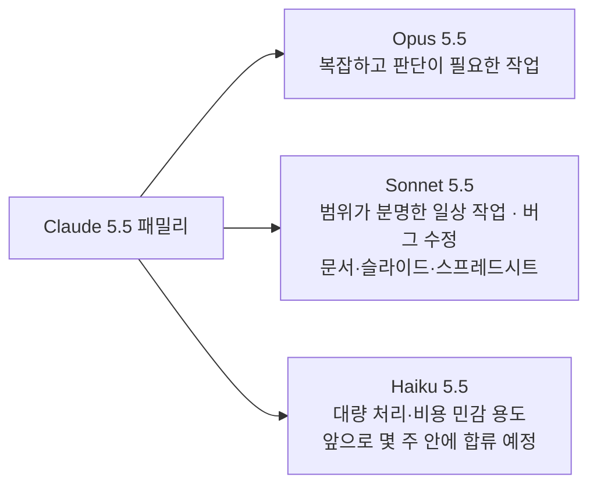
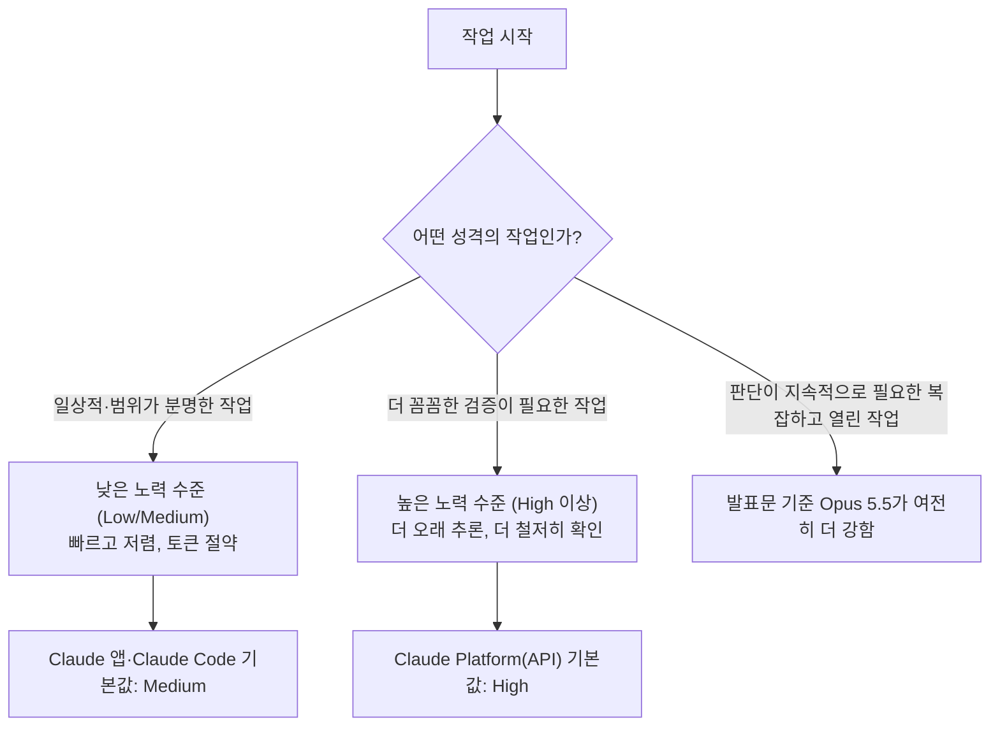
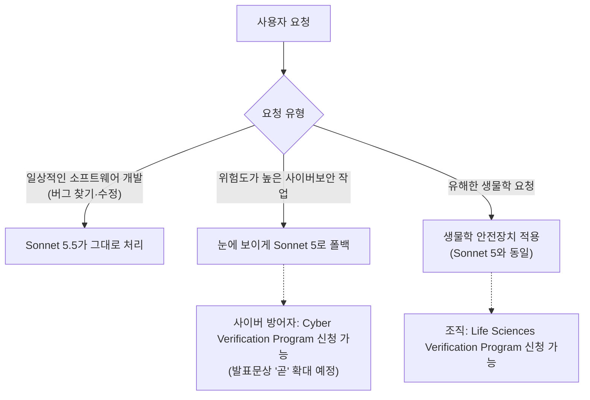
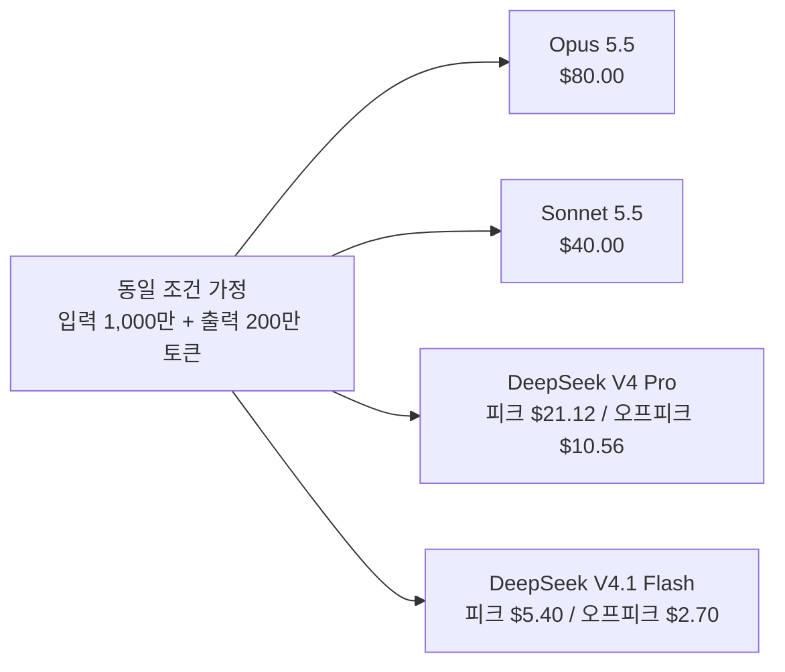
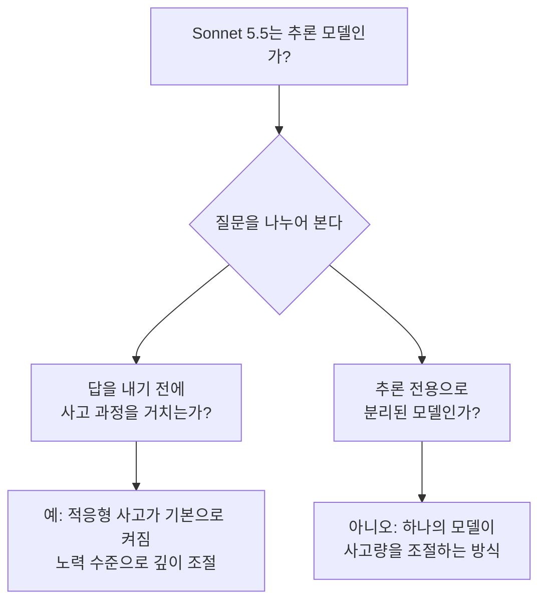
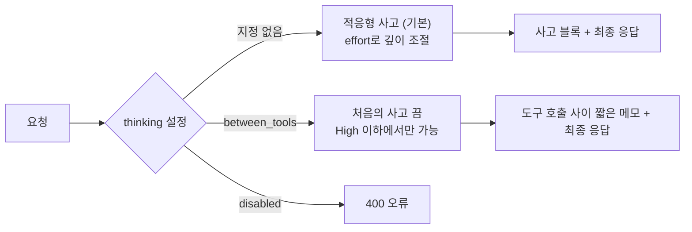

- 작성 기준일: 2026년 9월 29일
- 근거 자료: Anthropic 공식 발표문 ["Introducing Claude Sonnet 5.5"](https://www.anthropic.com/claude-sonnet-5-5)(2026년 9월 28일 게시), Anthropic 공식 Threads 계정(claudeai)의 8개 연속 게시물
- 이 문서는 위 자료에 실제로 적혀 있는 내용만 바탕으로 작성했으며, 자료에 없는 내용은 "발표문에서는 밝히지 않았다"고 명시했습니다.

---

## 1. 한눈에 보는 요약

Anthropic은 2026년 9월 28일 Claude Sonnet 5.5를 공개했습니다. 발표문은 이 모델을 "Claude 5.5 패밀리의 두 번째 모델"로 소개합니다. 첫 번째는 Opus 5.5이고, 세 번째 구성원인 Claude Haiku 5.5는 "앞으로 몇 주 안에" 합류할 예정이라고 되어 있습니다.

발표문이 내세우는 핵심 메시지는 세 가지입니다. 첫째, 이전 세대인 Sonnet 5보다 분명히 좋아졌다는 점입니다. 둘째, 출력 속도가 30% 이상 빨라졌다는 점입니다. 셋째, 대부분의 작업에서 비용이 최대 30% 줄어든다는 점입니다. 여기서 중요한 것은 "가격표"가 내려간 것이 아니라는 사실입니다. 토큰당 가격은 Sonnet 5와 같고, 같은 일을 하는 데 필요한 토큰 수가 줄어들어 작업 하나당 비용이 내려간다는 것이 발표문의 설명입니다.

Sonnet 5.5의 역할은 Opus 5.5의 "더 빠르고 저렴한 짝"입니다. 발표문은 Opus 5.5가 세심한 판단이 필요한 복잡한 작업에 맞춰져 있는 반면, Sonnet 5.5는 범위가 분명한 일상적 작업, 버그 수정, 그리고 완성도 높은 문서·슬라이드·스프레드시트 제작에서 가장 강하다고 설명합니다. 디자인 감각도 좋다는 언급이 함께 있습니다.

---

## 2. Sonnet 5.5는 어떤 모델인가

### 2.1 패밀리 안에서의 위치

Claude 5.5 패밀리는 세 개의 등급으로 구성됩니다. Opus는 가장 어려운 일을 맡는 상위 모델이고, Haiku는 대량 처리와 비용에 민감한 애플리케이션을 겨냥한 모델이며, Sonnet은 그 사이에서 속도와 비용, 성능의 균형을 잡는 모델입니다. 발표문은 Sonnet 5.5를 "Opus 5.5를 보완하는 모델"이라고 표현합니다.

발표문은 성능 비교에서도 이 관계를 솔직하게 적어 두었습니다. 여러 평가에서 Max 노력 수준의 Sonnet 5.5가 Opus 5.5와 비슷한 점수를 내기도 하지만, 벤치마크 점수는 모델 능력의 한 단면일 뿐이라고 밝힙니다. 그리고 Anthropic 자체 테스트와 외부 테스터의 평가 모두에서, 지속적인 판단이 필요한 복잡하고 열린 작업에서는 Opus 5.5가 여전히 분명히 더 강하다고 명시합니다. 즉 "Sonnet 5.5가 Opus 5.5를 대체한다"는 주장이 아니라 "역할이 나뉜다"는 것이 공식 입장입니다.

### 2.2 Sonnet 5 대비 개선된 다섯 가지 영역

발표문은 개선점을 다섯 항목으로 정리합니다.

**성능.** 에이전트형 코딩 평가인 Terminal-Bench 4.0에서 Sonnet 5.5는 70.6%를 기록했고, Sonnet 5는 10.3%였습니다. 실제 직업 업무를 폭넓게 평가하는 GDPval-AA에서는 Opus 5.5보다 2점 낮은 수준입니다. 또한 장시간에 걸친 작업과 시각 정보 이해에 강해서, 화면 정보만 보고 진행하는 방식으로 게임 *Pokémon Red*를 클리어한 최초의 Sonnet 모델이라고 소개합니다.

**협업.** Opus 5.5와 마찬가지로 이전 세대보다 글을 더 명확하게 쓴다고 합니다. 초기 테스터들은 Sonnet 5보다 협업 파트너로 더 낫다고 평가했고, 빠른 속도 덕분에 복잡도가 낮은 작업을 빠르게 반복하며 다듬는 데 적합하다고 발표문은 적고 있습니다.

**비용.** 가격은 Sonnet 5와 동일하게 입력 토큰 100만 개당 2달러, 출력 토큰 100만 개당 10달러, 캐시 읽기 100만 토큰당 0.20달러입니다. 다만 같은 작업을 하는 데 훨씬 적은 토큰이 필요한 경우가 일반적이어서, Anthropic의 테스트에서 작업당 비용이 이전 모델보다 최대 30% 낮았다고 합니다.

**속도.** 출력 생성이 Sonnet 5보다 30% 이상 빠르며, 지금까지 나온 Sonnet 중 가장 빠른 모델입니다.

**정렬(Alignment)과 안전.** 자동화된 행동 감사에서 대부분의 정렬 지표에서 Sonnet 5와 같거나 더 좋았다고 합니다. 사이버보안 역량이 Opus 5 수준에 견줄 만해졌기 때문에, 가장 강력한 모델들에 적용해 온 것과 유사한 사이버 안전장치와 폴백(fallback)을 처음으로 적용한 Sonnet 모델이 되었습니다. 생물학 관련 안전장치는 Sonnet 5와 동일합니다. 두 안전장치 모두 위험도가 높은 좁은 범위의 요청을 겨냥하며, 일반적인 소프트웨어 개발과 대부분의 생명과학 작업에는 영향이 없다고 밝힙니다.

---

## 3. 성능: 숫자로 확인하는 변화

### 3.1 벤치마크 종합표

아래 표는 발표문의 비교표를 그대로 옮긴 것입니다. 비교 대상은 Sonnet 5.5, 이전 세대 Sonnet 5, 상위 모델 Opus 5.5, 그리고 OpenAI의 GPT-6 Sol입니다. "—"는 발표문에서 해당 수치를 제시하지 않았다는 뜻입니다.

| 영역 | 벤치마크 | Sonnet 5.5 | Sonnet 5 | Opus 5.5 | GPT-6 Sol |
| --- | --- | --- | --- | --- | --- |
| 에이전트형 코딩 | Terminal-Bench 4.0 | 70.6% | 10.3% | 66.4% (각주 1) | — |
| 에이전트형 코딩 | FrontierCode 1.1 (Main) | 46.2% (Max) / 52.1% (Xhigh) | 42.4% | 54.4% | 49.3% |
| 에이전트형 코딩 | CursorBench 4.0 | 55.5% | 34.1% | 57.8% | — |
| 지식 업무 | GDPval-AA v2.1 | 1844 | 1449 | 1846 | 1487 (각주 4) |
| 지식 업무 | AA-Briefcase v1.1 | 1811 | 1359 | 1822 | 1483 (각주 4) |
| 다학제 추론 | Humanity's Last Exam (도구 사용) | 64.5% | 54.9% | 67.7% | — |
| 컴퓨터 사용 | OSWorld 2.1 (partial) | 80.1% | 57.0% | 81.8% | — |
| 시각 차트 인식 | Chartography (도구 없음) | 61.6% | 15.6% | 64.4% | 53.6% (각주 4) |

이 표를 읽을 때 유의할 점이 몇 가지 있습니다. 발표문의 각주에 따르면 Opus 5.5의 Terminal-Bench 4.0 점수는 Xhigh 노력 수준에서의 결과로, 해당 모델이 낼 수 있는 가장 높은 점수입니다. 또한 Terminal-Bench와 CursorBench는 GPT-6 Sol의 성능을 공개적으로 보고하지 않았기 때문에, 발표문의 차트에서는 GPT-5.6 Sol의 결과를 대신 사용했다고 밝히고 있습니다. 표에서 GPT-6 Sol 칸이 "—"인 것은 이 때문입니다.

### 3.2 표를 서술로 풀어 읽기

가장 눈에 띄는 변화는 Terminal-Bench 4.0입니다. 명령줄 환경에서 여러 단계로 이어지는 전문적인 작업을 얼마나 잘 완수하는지를 재는 이 평가에서 Sonnet 5는 10.3%였는데 Sonnet 5.5는 70.6%를 기록했습니다. 표에 적힌 Opus 5.5의 66.4%보다도 높은 수치입니다. 다만 각주에 있듯이 Opus 5.5의 수치는 Xhigh 수준의 결과라는 점, 그리고 발표문이 이 표에서 Sonnet 5.5의 70.6%가 어느 노력 수준에서 나온 것인지는 따로 적지 않았다는 점을 함께 알아 두어야 합니다.

FrontierCode는 에이전트가 만든 코드 변경이 사람의 수정 없이 그대로 병합될 수 있는지를 평가합니다. 여기서는 Opus 5.5가 54.4%로 가장 높고, Sonnet 5.5는 Xhigh에서 52.1%, Max에서 46.2%입니다. Max 수준의 점수가 Xhigh보다 낮다는 점은 발표문이 각주 2에서 직접 설명합니다. FrontierCode는 범위를 벗어난 변경을 아무리 품질이 좋고 도움이 되더라도 감점하는데, Max 수준에서 Sonnet 5.5가 Claude Code의 코드 리뷰 스킬을 더 자주 실행했다고 합니다. 이 스킬은 리뷰를 여러 서브에이전트로 나누어 진행하는데, Cognition이 검토한 두 사례에서 이것이 시간 초과 또는 작업 범위를 넘어선 추가 수정으로 이어졌고 결과적으로 점수가 낮아졌다는 설명입니다.

CursorBench 4.0은 실제 Cursor 코딩 세션에서 가져온, 모호하고 여러 파일에 걸친 작업으로 코딩 에이전트를 평가합니다. Sonnet 5.5는 55.5%로 Opus 5.5(57.8%)에 약 2점 차이까지 다가섰고, Sonnet 5(34.1%)와는 20점 넘게 벌어졌습니다.

지식 업무를 재는 GDPval-AA에서 Sonnet 5.5는 1844점으로, Opus 5.5의 1846점과 사실상 같은 수준이며 Sonnet 5의 1449점보다 약 400점 높습니다. 발표문은 이 평가가 9개 주요 산업, 44개 직업에 걸친 실제 업무를 다룬다고 설명합니다. 새 벤치마크인 AA-Briefcase(장시간 지식 업무)에서도 1811점으로 Opus 5.5(1822점)에 가깝고 Sonnet 5(1359점)를 크게 앞섭니다. 발표문은 장시간 지식 업무에서 Sonnet 5와 GPT-6 Sol을 분명히 앞선다고 정리합니다.

컴퓨터 사용(OSWorld 2.1)은 80.1%로 Opus 5.5의 81.8%에 근접하고, 시각 차트 인식(Chartography)은 61.6%로 Opus 5.5의 64.4%에 근접합니다. 특히 차트 인식은 Sonnet 5가 15.6%에 불과했던 영역이라 향상 폭이 매우 큽니다.

### 3.3 평가 결과를 읽을 때 알아야 할 각주

발표문은 두 가지 보정 사항을 각주로 밝히고 있습니다.

첫째, GDPval-AA와 AA-Briefcase는 Artificial Analysis가 Claude Platform의 출시 전 배포판에서 실행했습니다. Anthropic은 그 배포판에 구조화된 출력을 쓰는 요청의 응답 품질을 떨어뜨릴 수 있는 버그가 있었다고 밝혔습니다. Anthropic은 이 영향이 있더라도 작을 것이며 Sonnet 5.5의 성능을 오히려 낮게 나타냈을 것이라고 예상하고, 해당 버그는 이후 수정되었다고 설명합니다.

둘째, OpenAI가 최근 GPT-6 Sol의 시각 이해를 떨어뜨리던 버그를 고쳤는데, Artificial Analysis의 공식 AA-Briefcase v1.1·GDPval-AA v2.1 점수와 Surge AI의 Chartography 점수에는 그 수정이 아직 반영되지 않았을 수 있습니다. Artificial Analysis는 AA-Briefcase와 GDPval-AA에 큰 영향은 없을 것으로 보고 있고, Anthropic 내부 테스트에서는 Chartography 점수도 영향을 받지 않은 것으로 보인다고 합니다.

### 3.4 노력 수준(effort level)에 따른 성능과 비용

이 발표에서 가장 실용적인 부분은 노력 수준별 비교입니다. 발표문은 각 모델의 점수를 작업당 비용에 대해 그린 차트를 제공하는데, 노력 수준이 올라갈수록 모델이 더 오래 일하게 되어 작업당 비용도 오르고 대체로 점수도 오른다고 설명합니다. 차트에서 좌상단에 가까운 점일수록 비용 대비 성능이 좋은 것입니다.

발표문이 이 차트들에서 뽑아낸 결론은 다음과 같습니다.

- 여러 벤치마크에서 Sonnet 5.5는 Low 또는 Medium 노력 수준만으로 Sonnet 5의 최고 점수를 넘어서며, 작업당 비용은 약 10분의 1 수준입니다.
- Terminal-Bench 4.0에서는 Claude 앱의 기본값인 Medium 노력 수준에서 Sonnet 5의 최고 점수를 크게 넘어서면서 작업당 비용은 10분의 1 미만입니다.
- FrontierCode에서는 Claude Platform의 기본값인 High 노력 수준에서 GPT-6 Sol의 최고 점수와 같은 점수를 내면서 작업당 비용은 약 5분의 1입니다. 같은 High 설정끼리 비교하면 Sonnet 5보다 10점 높고 작업당 비용은 약 15분의 1입니다.
- CursorBench에서는 Low 노력 수준에서도 Sonnet 5의 최고 점수를 넘고, 작업당 비용은 10분의 1 미만입니다.
- 새 벤치마크 AA-Briefcase에서는 Medium 노력 수준에서 Sonnet 5의 최고 점수를 넘으며, 작업당 비용은 약 9분의 1입니다.

발표문은 Sonnet 5.5가 Opus 5.5를 가장 잘 보완하는 구간은 작업당 비용이 낮은 낮은 노력 수준이라고 설명합니다. 높은 설정에서는 비슷한 비용으로 비슷한 성능을 낼 수 있다고도 덧붙입니다.

노력 수준의 기본값도 정리해 둘 만합니다. 발표문에 따르면 Claude Code와 Claude 앱의 기본 노력 수준은 Medium이고, Claude Platform(API)의 기본값은 High입니다. 낮은 설정에서는 답변이 빨라지고 토큰을 덜 쓰므로 일상적인 작업에 알맞고, 높은 설정에서는 더 오래 추론하고 결과를 더 꼼꼼히 검증합니다.

---

## 4. 코딩 영역에서의 변화

발표문은 코딩에서의 도약이 특히 두드러진다고 평가합니다. 앞서 본 FrontierCode·CursorBench 수치 외에, 초기 테스터들의 관찰이 두 가지 소개되어 있습니다. 하나는 코드베이스를 이해하는 속도가 빠르다는 점이고, 다른 하나는 효율성입니다. 나란히 비교 실행했을 때 Sonnet 5.5는 도구 호출을 Sonnet 5보다 더 많이 묶어서(batching) 처리했고, 그 결과 단계 수와 비용이 줄었다고 합니다.

발표문에 실린 고객 코멘트는 다음과 같이 요약할 수 있습니다.

**Epic Games(최고운영책임자 Daniel Vogel).** 초기 테스트에서 상위 등급 모델에 기대하는 품질 기준을 충족했고, 시스템 설계 감사와 데이터 흐름 검토를 잘 소화했다고 합니다. 게임플레이 시스템 아키텍처를 위한 수만 줄의 코드를 다루었고, 응답이 빠르며, 여러 시간이 걸리는 작업을 처리했고, 세세하게 지시하지 않아도 결과를 냈다고 전합니다.

**Every(디자이너 Tyler Nishida).** 코딩이 빠르고 반복 작업에서 빠르게 방향을 조정할 수 있으며, 필요하면 오래 작업할 수도 있다고 평가했습니다. Opus 5.5의 자연스러운 글쓰기 개선점 일부를 갖고 있어 함께 일하기 더 즐겁다고 합니다.

**CodeRabbit(AI 담당 부사장 David Loker).** 복잡도가 다양한 상황에서 Sonnet 5보다 판단이 좋으면서 출력 토큰은 크게 덜 쓴다고 합니다. Sonnet 5가 웹 검색을 지나치게 자주 하던 경향과 높은 토큰 사용량이 새 모델에서는 사라졌다고 하며, 단순하거나 중간 난이도의 코드 리뷰부터 이 모델로 옮기고 앞으로 몇 주 안에 더 옮길 계획이라고 밝혔습니다.

**SpaceXAI(ML 디렉터 Sualeh Asif).** CursorBench 4.0에서 55.5%로 프런티어 수준의 성능을 냈고, Opus 5.5 다음이라고 언급했습니다. 성능과 비용의 균형을 원하는 개발자에게 인기를 끌 것으로 본다고 합니다.

**Base44(AI 엔지니어링 리드 Gabriel Grinberg).** 실제 앱 제작 118건에서 Sonnet 5.5가 만든 앱의 점수가 Opus 5에 견줄 만했다고 합니다. 한 번 만드는 데 평균 3.6번 반복했는데 Opus 5는 7.7번이었고, 비교한 모델 중 실패한 도구 호출이 가장 적었으며, 작업 도중 사용자에게 질문하느라 멈추는 일이 드물었다고 합니다.

**Unity(크리에이티브 테크놀로지스트 Sam Zhang).** 프로젝트를 다시 열고 실행 시점에 결과를 검사하는 엄격한 기준을 쓰는데, Sonnet 5.5의 작업 대부분이 그 검사를 통과했다고 합니다. 여러 단계로 이루어진 Unity 에디터·코딩 벤치마크에서는 작업의 90%를 완료해 비슷한 모델들을 앞섰다고 전합니다.

**Creator(크리에이티브 코더 Kevin Ngo).** Opus 5.5가 게임의 아키텍처와 전반적인 틀을 정하면, 구현은 Sonnet 5.5에 맡겨도 안심이 된다고 말합니다. 장시간에 걸친 복잡한 작업을 다루는 방식이 인상적이었다고 합니다.

이 코멘트들을 종합하면 공통된 흐름이 보입니다. 속도, 적은 토큰 사용, 그리고 도구 호출의 효율성입니다. 그리고 Creator의 언급에서 드러나듯 "설계는 Opus, 구현은 Sonnet"이라는 역할 분담이 실사용자들 사이에서 자연스럽게 나오고 있다는 점도 발표문의 위치 설정과 맞닿아 있습니다.

---

## 5. 지식 업무 영역에서의 변화

지식 업무에서도 향상이 여러 영역에서 확인된다고 발표문은 말합니다. 정량화하기 어려운 개선점으로는 더 자연스러운 대화 상대라는 평가, 그리고 디자인 감각이 언급됩니다. 사용자 인터페이스에 완성도를 더해 주고, 슬라이드 템플릿을 따라 거의 수정이 필요 없는 슬라이드를 만들어 낸다는 것입니다.

Anthropic의 내부 테스트 사례도 하나 소개됩니다. 어떤 상장 기업의 분기 실적 자료와 컨퍼런스콜 녹취록, 그리고 슬라이드 템플릿을 주고 10장짜리 운영 리뷰를 만들게 했더니, 전문가 두 명이 첫 초안을 그대로 보내도 될 수준이라고 판단했다고 합니다.

고객 코멘트는 다음과 같습니다.

**Slack(수석 엔지니어 Curtis Allen).** 프롬프트를 바꾸지 않고도 오프라인 Slackbot 평가 대부분에서 Sonnet 5보다 나았고, 더 적은 단계와 약 14% 적은 출력 토큰으로 해냈다고 합니다.

**Zendesk(AI 디렉터 Abhinay Kathuria).** 응답과 에스컬레이션 요청을 아우르는 수백 건의 실제 지원 사례를 넣어 본 결과, 현재 프로덕션에서 쓰는 Claude 모델들보다 잘못된 판단이 적고 티켓 해결이 빨랐다고 합니다. 티켓 처리 속도는 20% 빨라졌다고 전합니다.

**Balyasny Asset Management(수석 AI 엔지니어 Joe Poirier).** Q&A, 추출, 분석, 예측을 아우르는 2,441개의 비공개 금융 과제에서 Sonnet 5보다 높은 점수를 냈습니다. 답변 하나당 약 12만 1천 토큰을 썼는데 Sonnet 5는 49만 7천 토큰을 썼다고 합니다. 대량 처리 워크플로에서 비교한 7개 모델 가운데 품질 대비 비용이 가장 좋았다고 평가합니다.

**Box(AI 제품 부사장 Yashodha Bhavnani).** 원본 문서의 데이터를 다시 확인해 Sonnet 5가 놓친 오류를 잡아내며, 이전 모델보다 더 정확하고 2.4배 빠르고 전체 토큰은 12% 적게 썼다고 합니다. 금융·의료 분야 고객들이 민감한 업무에 안심하고 쓸 수 있을 것이라고 기대를 표했습니다.

**Lovable(공동창업자 겸 CTO Fabian Hedin).** 더 적고 더 견고한 단계로 생각하기 때문에 진행 상황을 보기까지 기다리는 시간이 줄어든다고 합니다. 코딩 평가에서 도구 호출이 3분의 1 적었고 셸 실행은 대략 절반이었다고 전합니다.

**Atlassian(AI 제품 총괄 Jamil Valliani).** 매달 수백만 건의 Rovo 지원 작업이 이뤄지는 환경에서 실행 속도가 중요하다며, Sonnet 5보다 최대 30% 빠르게 Rovo 에이전트를 돌릴 수 있게 될 것이라고 말합니다.

---

## 6. 가격과 속도

### 6.1 가격표

| 100만 토큰당 가격 | Claude Sonnet 5.5 | Claude Opus 5.5 |
| --- | --- | --- |
| 캐시 읽기 | $0.20 | $0.20 |
| 캐시 쓰기 | $2.50 | $5 |
| 입력 토큰 | $2 | $4 |
| 출력 토큰 | $10 | $20 |

Sonnet 5.5의 입력·출력 단가는 Opus 5.5의 정확히 절반입니다. 캐시 쓰기 단가도 절반이고, 캐시 읽기 단가는 두 모델이 같습니다. 그리고 앞서 설명했듯 Sonnet 5.5의 가격은 Sonnet 5와 같습니다. 비용 절감은 단가 인하가 아니라 토큰 사용량 감소에서 나옵니다. 발표문은 그 예로 Sonnet 5.5가 같은 작업에 필요한 토큰이 더 적고 출력도 30% 이상 빠르다고 설명하며, 여러 코드 생성 시연으로 효율을 보여 줍니다. 시연 프롬프트로는 "400마리 찌르레기 떼 군무를 HTML 파일 하나로", "바람이 모래 언덕을 빚는 모습", "시계로 이루어진 시계" 세 가지가 있습니다.

### 6.2 비용 구조를 이해하는 방법

이 부분은 발표문의 구조를 이해하기 쉽게 풀어 쓴 설명입니다. 작업 하나의 비용은 대략 "사용한 토큰 수 × 토큰 단가"로 결정됩니다. Sonnet 5.5는 단가를 그대로 두고 토큰 수를 줄였기 때문에, 같은 예산으로 더 많은 작업을 처리할 수 있게 됩니다. 발표문에 있는 Balyasny의 사례(답변당 약 12만 1천 토큰 대 49만 7천 토큰)나 Box의 사례(전체 토큰 12% 절감)가 이 구조를 잘 보여 줍니다.

---

## 7. 안전성

### 7.1 정렬 평가

발표문은 Sonnet 5.5가 모델 역량의 최전선을 넓히는 모델이 아니기 때문에, 정렬 평가를 어떤 역량 수준의 모델에도 적용되는 좁은 범위의 위험에 맞췄다고 설명합니다. 사용자의 이익에 반하는 행동, 사용자를 오도하는 행동, 고위험 오용에 협조하는 행동이 그 대상입니다.

약 1,850개 시나리오로 Claude를 테스트하는 자동화 행동 감사에서, Sonnet 5.5는 정렬, 오용 저항성, 정직성의 대부분 지표에서 Sonnet 5와 같거나 더 좋았습니다. 새로운 격리(containment) 평가에서는 샌드박스를 벗어나려는 시도가 드물다는 점에서 Anthropic이 테스트한 최고 모델인 Opus 5.5에 가까웠고, 컨테이너의 한계를 시험해 보는 경향은 Anthropic의 모든 모델 가운데 가장 낮았다고 합니다. 전체 감사에서는 Opus 5.5가 여전히 약간 더 낫지만, Sonnet 5.5가 사용자 의도와 충돌하는 목표를 추구한다는 증거는 발견하지 못했다고 밝힙니다.

동시에 발표문은 어떤 평가도 모든 실패를 확실히 잡아내지는 못하며, Sonnet 5.5에 아직 발견하지 못한 경향이 있을 수 있다고 인정합니다. 그래서 자체 정렬 작업과 아래의 안전장치를 함께 쓴다고 설명합니다.

### 7.2 안전장치 세 가지

**사이버보안.** Sonnet 5.5의 사이버 역량은 Sonnet 5보다 크게 향상되었기 때문에 Opus 5.5와 비슷한 안전장치와 함께 배포됩니다. 사용자는 일상적인 소프트웨어 개발의 일부로 자신의 코드에서 버그를 찾고 고치는 일은 그대로 할 수 있습니다. 하지만 위험도가 더 높은 사이버보안 작업은 눈에 보이는 방식으로 Sonnet 5로 폴백됩니다. 발표문은 곧 사이버 방어자들이 확장된 Cyber Verification Program에 신청해서, Sonnet 5.5, Opus 5.5, Claude Mythos 모델의 더 고급 기능에 단계별로 접근할 수 있게 될 것이라고 예고합니다.

**생물학.** Sonnet 5와 같은 생물학 안전장치를 사용합니다. 유해한 요청을 겨냥하며 대부분의 연구, 교육, 임상 작업은 영향을 받지 않습니다. 다만 일부 미생물학·바이러스학 요청이 잘못 걸릴 수 있다고 밝힙니다. 생물학 관련 작업의 전 범위를 위해 설계된 안전장치를 쓰고 싶은 조직은 Life Sciences Verification Program에 신청할 수 있습니다.

**증류(Distillation).** 증류 공격이란 공격자가 수천 개의 가짜 계정을 이용해 모델의 능력을 산업적 규모로 빼내는 것을 말합니다. 이를 통해 나쁜 의도를 가진 쪽이 Claude에 내장된 안전장치 없이도 고성능 모델을 만들 수 있게 됩니다. Sonnet 5.5는 Sonnet 5보다 훨씬 강력하기 때문에, 추론 과정 추출을 막는 안전 분류기와 함께 출시되는 첫 Sonnet 모델입니다. 또한 보존된 사고(preserved thinking)를 확대해서 Claude의 사고 내용이 그것을 만든 계정과 분리될 수 없도록 했습니다. 대부분의 개발자는 변화를 느끼지 못할 것이지만, 대화를 계정 사이에서 옮기는 경우(예: Claude Code에서 세션 도중 계정을 바꾸는 경우)에는 공식 문서의 설명을 확인해야 한다고 안내합니다.

---

## 8. 시작하는 방법과 개발자가 알아야 할 점

Claude Sonnet 5.5는 발표 당일부터 모든 플랫폼에서 사용할 수 있으며, Amazon Web Services, Google Cloud, Microsoft Azure도 포함됩니다. Opus 5.5 및 Sonnet 5와 마찬가지로 데이터 무보존(zero data retention) 옵션으로 사용할 수 있습니다. 개발자는 Claude Platform에서 모델 이름 `claude-sonnet-5-5`로 시작하면 됩니다.

이전 버전에서 넘어오는 개발자에게 중요한 변경이 하나 있습니다. Sonnet을 생각(thinking)을 끈 상태로 운영해 왔다면, Sonnet 5.5로 옮기기 전에 새로 생긴 `between_tools` 설정으로 바꿔야 합니다. 발표문은 이 설정이 처음에 하는 생각(up-front thinking)은 계속 꺼 둔다고 설명하며, 자세한 내용은 마이그레이션 가이드를 보라고 안내합니다.

---

## 9. 정리: 이 발표가 의미하는 것

발표문 내용만으로 정리할 수 있는 핵심은 다음과 같습니다.

첫째, Sonnet 5.5는 Sonnet 5의 단순한 후속 버전 수준을 넘어, 특히 에이전트형 코딩과 시각 차트 인식에서 점수가 크게 뛴 모델입니다. 둘째, 가격을 내린 것이 아니라 토큰 효율을 높여 작업당 비용을 낮췄습니다. 셋째, Opus 5.5와의 관계는 경쟁이 아닌 분업으로 설명되며, 발표문 스스로도 복잡하고 열린 작업에서는 Opus 5.5가 여전히 강하다고 인정합니다. 넷째, 사이버보안 역량이 커진 만큼 Sonnet 모델로서는 처음으로 사이버 안전장치와 증류 방지 분류기가 적용되었고, 이에 따라 일부 고위험 작업은 Sonnet 5로 폴백됩니다. 다섯째, Haiku 5.5가 곧 합류하면 Claude 5.5 패밀리가 완성됩니다.

발표문에서 밝히지 않은 부분도 있습니다. Haiku 5.5의 구체적인 출시일은 "앞으로 몇 주 안에"라고만 되어 있고 정확한 날짜는 나와 있지 않습니다. 확장된 Cyber Verification Program의 시작 시점도 "곧"이라고만 되어 있습니다. 또한 발표문의 표에서 Sonnet 5.5의 Terminal-Bench 4.0 점수(70.6%)가 어느 노력 수준에서 나온 것인지는 별도로 명시되지 않았습니다. 이런 부분은 추정하지 않고, 공식 시스템 카드와 문서를 확인하시길 권합니다.

---

## 10. 용어 풀이

- **에이전트형 코딩(Agentic coding):** 모델이 코드를 한 번 작성하고 끝나는 것이 아니라, 도구를 호출하고 결과를 확인하며 여러 단계에 걸쳐 스스로 작업을 진행하는 방식의 코딩입니다.
- **노력 수준(Effort level):** Low, Medium, High, Xhigh, Max로 나뉘며, 높을수록 모델이 더 오래 추론하고 결과를 더 철저히 확인하는 대신 비용이 늘어납니다. 발표문 설명 기준입니다.
- **작업당 비용:** 벤치마크 과제 하나를 수행하는 데 든 평균 비용(USD)입니다.
- **폴백(Fallback):** 위험도가 높은 요청이 감지되면 요청을 다른 모델(여기서는 Sonnet 5)이 처리하도록 넘기는 동작입니다.
- **증류 공격:** 다수의 가짜 계정으로 모델의 출력을 대량 수집해 그 능력을 복제하려는 시도입니다.
- **보존된 사고(Preserved thinking):** 발표문에 따르면 Claude의 사고 내용이 그것을 만든 계정에 묶여서 다른 계정으로 분리해 쓸 수 없게 하는 기능입니다.
- **캐시 읽기/쓰기:** 반복해서 쓰는 프롬프트 내용을 저장해 두고 다시 불러오는 기능에 대한 과금 항목입니다.

---

## 11. 출처

- Anthropic, "Introducing Claude Sonnet 5.5" (2026년 9월 28일): https://www.anthropic.com/claude-sonnet-5-5
- Anthropic, "Claude Sonnet 5.5 System Card" (평가 방법 상세): https://www.anthropic.com/claude-sonnet-5-5-system-card
- Anthropic, 마이그레이션 가이드(생각 끄기 설정): https://platform.claude.com/docs/en/models/sonnet-5-5/migration-guide#turn-thinking-off
- Anthropic, 보존된 사고 문서: https://platform.claude.com/docs/en/build-with-claude/preserved-thinking
- Anthropic 공식 Threads 계정(claudeai) 연속 게시물 8건: https://www.threads.com/share/BAUAnlMHEB/

---

# 별첨 1. DeepSeek 모델과의 가격 비교

> 작성 기준일: 2026년 9월 29일
> Sonnet 5.5 가격은 Anthropic 발표문(2026년 9월 28일), DeepSeek 가격은 DeepSeek 공식 API 문서의 "Models & Pricing" 페이지를 직접 열어 확인한 값입니다. DeepSeek은 "가격은 달라질 수 있으며 이 페이지를 정기적으로 확인하라"고 안내하므로, 계약이나 예산 확정 전에는 반드시 원문을 다시 확인하시기 바랍니다.

## A-1. 먼저 알아 둘 점: "동급"의 의미

Sonnet 5.5와 정확히 대응하는 DeepSeek 모델이 공식적으로 지정되어 있지는 않습니다. 이 별첨에서는 현재 DeepSeek API가 제공하는 두 모델을 모두 놓고 가격을 비교합니다. 하나는 기본 저비용 모델인 `deepseek-flash`(DeepSeek-V4.1-Flash)이고, 다른 하나는 더 큰 모델인 `deepseek-v4-pro`(DeepSeek-V4-Pro-0813)입니다.

이 문서는 **가격 비교**만을 다룹니다. 이번에 확인한 자료 중에는 Sonnet 5.5와 DeepSeek 모델을 같은 조건에서 직접 비교한 성능 평가가 없었습니다. 따라서 "가격이 이만큼 싸다"는 말은 성능이 같다는 뜻이 아니며, 성능 동등성은 이 문서에서 주장하지 않습니다.

## A-2. 100만 토큰당 가격 비교표

DeepSeek은 2026년 8월 16일 16:00(UTC)부터 피크/오프피크 가격제를 도입했으며, 오프피크 가격은 피크 가격의 절반입니다. 아래 표는 공식 가격 페이지의 수치입니다.

| 구분 | Claude Sonnet 5.5 | Claude Opus 5.5 | DeepSeek V4.1 Flash (피크) | DeepSeek V4.1 Flash (오프피크) | DeepSeek V4 Pro (피크) | DeepSeek V4 Pro (오프피크) |
| --- | --- | --- | --- | --- | --- | --- |
| 입력 (캐시 미스) | $2 | $4 | $0.30 | $0.15 | $1.32 | $0.66 |
| 입력 (캐시 히트/읽기) | $0.20 | $0.20 | $0.006 | $0.003 | $0.044 | $0.022 |
| 출력 | $10 | $20 | $1.20 | $0.60 | $3.96 | $1.98 |

표를 읽을 때 두 가지를 유의하세요. 첫째, Anthropic은 별도의 캐시 쓰기 요금(Sonnet 5.5는 $2.50, Opus 5.5는 $5)을 두는데, DeepSeek 공식 가격 페이지에는 캐시 쓰기 항목이 따로 없습니다. 둘째, Anthropic의 가격에는 피크/오프피크 구분이 발표문에 나와 있지 않습니다.

## A-3. 배율로 풀어 읽기

위 표의 숫자를 나누어 계산한 배율입니다. 계산은 모두 표의 값만 사용했습니다.

Sonnet 5.5와 V4.1 Flash를 비교하면, 입력 단가는 피크 기준으로 약 6.7배, 오프피크 기준으로 약 13.3배 차이가 납니다. 출력 단가는 피크 기준 약 8.3배, 오프피크 기준 약 16.7배입니다. 캐시된 입력의 경우 Sonnet 5.5의 캐시 읽기 단가($0.20)가 V4.1 Flash 캐시 히트 단가보다 피크 기준 약 33배, 오프피크 기준 약 67배 높습니다.

Sonnet 5.5와 V4 Pro를 비교하면 격차가 훨씬 작습니다. 입력은 피크 기준 약 1.5배, 오프피크 기준 약 3.0배이고, 출력은 피크 기준 약 2.5배, 오프피크 기준 약 5.1배입니다. 캐시 입력은 피크 기준 약 4.5배, 오프피크 기준 약 9.1배입니다.

즉 DeepSeek은 모든 구간에서 더 저렴하지만, 어느 모델과 비교하느냐에 따라 격차의 크기가 크게 달라집니다. Flash와 비교하면 한 자릿수 후반에서 십수 배, 큰 모델인 Pro와 비교하면 1.5배에서 5배 정도입니다.

## A-4. 예시 계산: 입력 1,000만 토큰 + 출력 200만 토큰

가격이 실제 청구액에 어떻게 반영되는지 보여 주기 위한 가정 계산입니다. 캐시 히트가 전혀 없고, 두 모델이 같은 토큰 수를 쓴다고 가정했습니다. 이 가정은 실제와 다를 수 있습니다(A-6 참고).

| 모델 | 입력 비용 | 출력 비용 | 합계 |
| --- | --- | --- | --- |
| Claude Opus 5.5 | $40.00 | $40.00 | $80.00 |
| Claude Sonnet 5.5 | $20.00 | $20.00 | $40.00 |
| DeepSeek V4 Pro (피크) | $13.20 | $7.92 | $21.12 |
| DeepSeek V4 Pro (오프피크) | $6.60 | $3.96 | $10.56 |
| DeepSeek V4.1 Flash (피크) | $3.00 | $2.40 | $5.40 |
| DeepSeek V4.1 Flash (오프피크) | $1.50 | $1.20 | $2.70 |

## A-5. DeepSeek 가격제의 특징

**피크/오프피크.** 공식 문서에 따르면 피크 시간은 UTC 기준 월요일부터 금요일까지 01:00~04:00와 06:00~10:00이며, 중국 공휴일은 제외됩니다. 그 밖의 모든 시간, 즉 주말과 중국 공휴일 전체는 오프피크입니다. 시차만 계산하면 한국 시간(UTC+9)으로는 10:00~13:00와 15:00~19:00에 해당합니다. 다만 요일 구분이 UTC 기준이라는 점은 참고하시기 바랍니다. 일정을 미룰 수 있는 배치 작업은 오프피크로 옮겨 요금을 절반으로 줄일 수 있습니다.

**모델 구성과 변동.** 공식 변경 로그에 따르면 V4.1 Flash는 네이티브 멀티모달을 지원하며 `deepseek-flash`라는 모델명으로 호출합니다. 이전 세대인 V4 Flash와 V4 Flash Vision Exp는 종료되었고, 기존 모델명은 임시로 V4.1 Flash로 연결됩니다. V4 Pro는 9월 14일 이후 종료될 예정이었으나, DeepSeek이 사용자 요구를 이유로 결제 방식을 유지한 채 계속 제공하기로 했습니다. 공식 가격 페이지 기준으로 비전 기능은 Flash만 지원하고 Pro는 지원하지 않습니다. 두 모델 모두 컨텍스트 길이는 100만 토큰, 최대 출력은 38만 4천 토큰입니다. 또한 DeepSeek은 추가 변경이 있으면 별도 공지하겠다고 밝히고 있어, 가격과 모델 구성이 다시 바뀔 수 있습니다.

**참고 정보(제3자 보도).** 가격 비교 사이트 BenchLM은 DeepSeek이 9월 10일 발표에서 V4.1 Flash가 성능·비용·속도 면에서 V4 Pro보다 낫다는 이유로 Pro를 단계적으로 종료하려 했다고 전합니다. 이 내용은 DeepSeek 공식 문서가 아닌 제3자 사이트의 설명이므로 참고용으로만 보시기 바랍니다.

## A-6. 단가 비교만으로 결론 내리기 어려운 이유

이 부분은 위 자료들의 한계를 정리한 것으로, 자료에 적힌 사실과 논리적 한계를 구분해서 썼습니다.

첫째, 작업당 비용은 "단가 × 토큰 수"로 정해집니다. Anthropic 발표문은 Sonnet 5.5가 Sonnet 5보다 같은 작업에 훨씬 적은 토큰을 쓴다고 설명하지만, 이번에 확인한 자료에는 DeepSeek 모델이 같은 작업에 토큰을 얼마나 쓰는지에 대한 비교가 없습니다. 따라서 위 예시 계산의 "같은 토큰 수" 가정은 단순화입니다. 특히 DeepSeek의 두 모델은 기본적으로 사고(thinking) 모드를 지원하는데, 사고 모드에서 토큰이 얼마나 늘어나는지는 확인한 자료에 없습니다.

둘째, 성능이 다릅니다. Sonnet 5.5는 발표문에서 Terminal-Bench 4.0 70.6%, CursorBench 4.0 55.5% 등의 점수를 공개했지만, 같은 벤치마크에 대한 DeepSeek 모델의 공식 수치를 이번 조사에서 확인하지 못했습니다. 따라서 이 문서는 어느 쪽이 더 낫다고 말하지 않습니다.

셋째, 가격 외의 조건이 다릅니다. Anthropic 발표문은 Sonnet 5.5를 Amazon Web Services, Google Cloud, Microsoft Azure에서 사용할 수 있고 데이터 무보존(zero data retention) 옵션이 있다고 밝힙니다. 또 사이버·생물학 안전장치와 증류 방지 분류기가 적용되며, 위험도가 높은 사이버보안 작업은 Sonnet 5로 폴백됩니다. DeepSeek 쪽은 이번에 확인한 공식 가격 페이지에서 이런 항목을 다루지 않았습니다. 데이터 처리 방식이나 규제 준수 요건이 중요한 조직은 각 제공자의 정책 문서를 별도로 검토해야 합니다.

넷째, DeepSeek은 가격을 자주 바꿨습니다. 2026년 8월 16일에 피크/오프피크제를 도입했고 9월 10일에는 V4.1 Flash 출시와 함께 가격을 조정했습니다. 이 별첨의 수치도 시간이 지나면 달라질 수 있습니다.

## A-7. 한 줄 정리

Sonnet 5.5는 Anthropic의 상위 모델 Opus 5.5의 절반 가격이지만, DeepSeek의 공식 가격표와 비교하면 V4.1 Flash보다 약 7~17배, V4 Pro보다 약 1.5~5배 비쌉니다. 다만 이 격차는 단가 기준일 뿐이며, 작업당 실제 비용과 성능 차이는 이번에 확인한 자료로는 판단할 수 없습니다. 실제 도입 판단에는 자신의 작업으로 두 모델을 직접 돌려 토큰 사용량과 결과 품질을 함께 측정해 보시길 권합니다.

## A-8. 별첨 출처

- DeepSeek API Docs, "Models & Pricing": https://api-docs.deepseek.com/quick_start/pricing/
- DeepSeek API Docs, "Change Log": https://api-docs.deepseek.com/updates/
- Anthropic, "Introducing Claude Sonnet 5.5" (2026년 9월 28일): https://www.anthropic.com/claude-sonnet-5-5
- BenchLM.ai, "DeepSeek API Pricing (September 2026)" (제3자, 참고용): https://benchlm.ai/deepseek/api-pricing

---

# 별첨 2. Sonnet 5.5는 추론 모델인가

> 작성 기준일: 2026년 9월 29일
> 근거 자료: Anthropic 발표문, Claude Platform 공식 문서(Claude Sonnet 5.5 개요, What's new in Claude Sonnet 5.5, Sonnet 5.5 마이그레이션 가이드), DeepSeek 공식 API 문서
> 발표문과 공식 문서에 적힌 내용만 근거로 삼았고, 문서에 없는 내부 구조나 학습 방식은 추정하지 않았습니다.

## B-1. 결론부터

Sonnet 5.5는 "생각(thinking)을 하는 모델"이 맞습니다. 공식 문서에 따르면 적응형 사고(adaptive thinking)가 기본으로 켜져 있고, 사고의 깊이는 노력 수준(effort) 매개변수로 조절합니다. 다만 "추론 전용 모델을 따로 두는" 방식이 아니라, 하나의 모델이 작업에 따라 생각하는 양을 조절하는 방식입니다. 그리고 생각을 완전히 끄는 옵션은 없습니다. 이전에 쓰던 "생각 끄기(`disabled`)" 설정은 오류(400)를 반환하고, 가장 낮은 설정은 처음의 생각만 끄는 `between_tools`입니다.

"추론 모델"이라는 말은 공식 분류명이 아니라 관용적 표현이라 정의에 따라 답이 달라질 수 있습니다. 이 문서에서는 질문을 두 가지로 나누어 답합니다. 첫째, 답을 내기 전에 사고 과정을 거치는가? 그렇습니다. 둘째, 일반 모델과 분리된 추론 전용 모델인가? 아닙니다.

## B-2. 공식 자료가 밝힌 사실

**적응형 사고가 기본입니다.** 개요 문서는 적응형 사고가 기본으로 켜져 있다고 밝힙니다. claude.dev 블로그도 thinking 필드 없이 요청하면 적응형 사고로 실행된다고 설명합니다. "적응형"이라는 이름 그대로 모델이 작업의 난이도에 맞춰 얼마나 생각할지를 정하는 방식입니다.

**사고의 깊이는 노력 수준이 정합니다.** What's new 문서에 따르면 effort 매개변수가 사고 깊이를 조절하며, Claude API의 기본값은 High입니다. 발표문은 같은 내용을 이렇게 설명합니다. 낮은 설정에서는 답변이 빠르고 토큰을 덜 쓰며 일상 작업에 알맞고, 높은 설정에서는 더 오래 추론하고 결과를 더 철저히 확인합니다. Unite.AI는 노력 수준이 Low, Medium, High, Xhigh, Max의 다섯 단계이고, Claude Code와 Claude 앱의 기본은 Medium, Claude Platform의 기본은 High라고 정리했습니다. claude.dev 블로그는 노력 수준이 재조정되어서 같은 이름의 단계가 Sonnet 5와 같은 양의 사고를 만들지 않으므로 이전 설정을 그대로 가져오지 말라고 안내합니다.

**생각을 완전히 끌 수는 없습니다.** claude.dev 블로그는 Sonnet 5.5에서 `thinking: {"type": "disabled"}`를 보내면 400 오류가 난다고 설명합니다. 대신 새로 생긴 `between_tools` 설정을 쓰라고 합니다. 개요 문서는 이것이 가장 낮은 사고 설정이며 처음의 사고(up-front thinking)를 끄는 것이고, High 노력 수준 이하에서만 작동한다고 밝힙니다. 마이그레이션 가이드는 Xhigh나 Max에서 이 설정을 쓰면 400 오류가 난다고 덧붙입니다. 또한 `between_tools`에서도 도구 호출 사이에 짧은 진행 상황 메모는 계속 씁니다.

**도구 호출 사이의 글이 "사고 블록"으로 옵니다.** 마이그레이션 가이드에 따르면 Sonnet 5.5가 도구 호출 사이에 쓰는 한두 문장보다 긴 메모는 진행 상황 업데이트 형태의 사고 블록으로 반환되며, 기본 표시 설정에서는 내용이 비어 있습니다. 이 내용을 사용자에게 보여 주려면 `thinking.display`를 "updates"(베타) 또는 "summarized"로 지정해야 합니다. 이 변경은 요청을 실패시키지는 않지만, 설정하지 않으면 도구 호출 사이에 화면이 조용해질 수 있다고 문서는 경고합니다.

**사고 내용은 모델과 대화에 묶입니다.** 발표문은 Sonnet 5.5가 보존된 사고(preserved thinking)를 확대해서 사고 내용이 그것을 만든 계정과 분리될 수 없다고 밝힙니다. What's new 문서는 이전 기록을 수정한 뒤 Sonnet 5.5의 사고 블록을 다시 보내면 400 오류가 날 수 있다고 하며, 대화를 이어 붙이는(append-only) 방식으로 유지하라고 안내합니다. 또한 발표문에 따르면 추론 과정 추출을 막는 안전 분류기가 Sonnet 모델로는 처음 적용되었습니다. 모델이 생각한 내용 자체가 보호 대상이 될 만큼 중요한 산출물로 다뤄진다는 뜻으로 읽을 수 있으나, 이 문장은 문서 내용을 풀어 쓴 해석입니다.

**그 밖의 관련 변경.** 개요 문서에 따르면 temperature, top_p, top_k를 기본값이 아닌 값으로 설정하면 400 오류가 나고, 캐시할 수 있는 최소 프롬프트 길이는 512토큰입니다. claude.dev 블로그는 메시지 단위로 노력 수준을 지정하는 기능(베타)이 추가되었다고 소개합니다. 토크나이저는 Sonnet 5와 같아서 같은 글이 같은 토큰 수가 됩니다.

## B-3. 사고 관련 설정 정리

| 설정 | 동작 | 사용 가능한 노력 수준 |
| --- | --- | --- |
| 적응형 사고 (기본값) | 모델이 난이도에 따라 사고량을 정함. 깊이는 effort로 조절 | Low, Medium, High, Xhigh, Max |
| `between_tools` | 처음의 사고를 끔. 도구 호출 사이 짧은 진행 메모는 유지 | Low, Medium, High (Xhigh·Max는 400 오류) |
| `disabled` | 지원하지 않음 | 400 오류 |

## B-4. 비용과 속도에 주는 의미

노력 수준이 "얼마나 오래 생각하는가"를 정하기 때문에, 같은 모델이라도 설정에 따라 작업당 비용이 크게 달라집니다. 발표문의 차트 설명이 이를 보여 줍니다. 노력 수준이 올라갈수록 작업당 비용도 올라가고 대체로 점수도 올라가며, 여러 벤치마크에서 Low나 Medium의 Sonnet 5.5가 Sonnet 5의 최고 점수를 약 10분의 1 비용으로 넘어섰다고 합니다. 반대로 Sonnet 5.5의 FrontierCode 점수는 Max에서 Xhigh보다 낮았는데, 발표문은 그 원인을 Max에서 코드 리뷰 스킬이 더 자주 실행된 것으로 설명합니다. "더 오래 생각한다고 항상 좋은 것은 아니다"라는 점을 발표문 스스로 보여 주는 사례입니다.

또 하나 알아 둘 점은 사고 토큰도 출력 토큰으로 과금되는지입니다. 이번에 확인한 Sonnet 5.5 문서 발췌에서는 이 내용을 직접 확인하지 못했습니다. Opus 5.5 마이그레이션 가이드에는 max_tokens가 사고와 응답 텍스트를 함께 포함한다는 설명이 있으나, 이는 Opus 5.5 문서의 내용이므로 Sonnet 5.5에 적용되는지는 공식 문서에서 직접 확인하시길 권합니다.

## B-5. DeepSeek과의 차이 (참고)

별첨 1에서 다룬 DeepSeek 공식 가격 페이지에 따르면 `deepseek-flash`(V4.1 Flash)와 `deepseek-v4-pro`는 사고 모드와 비사고 모드를 모두 지원하며, 사고 모드가 기본입니다. DeepSeek의 공식 변경 로그는 V4 계열의 사고 모드에 low, high, max의 세 단계 사고 노력 수준이 있다고 밝히고 있습니다. 즉 사고 모드가 켜져 있을 때 깊이를 고를 수 있다는 점은 Sonnet 5.5와 닮았습니다.

차이는 "끌 수 있는가"입니다. DeepSeek은 공식 문서상 비사고 모드가 별도로 있는 반면, Sonnet 5.5는 `disabled`가 오류이고 가장 낮은 설정이 `between_tools`입니다. 다만 이 비교는 두 회사의 문서에 적힌 설정 방식을 대조한 것이며, 실제 사고 토큰 사용량이나 답변 품질을 비교한 것은 아닙니다.

## B-6. 한 줄 정리

Sonnet 5.5는 적응형 사고가 기본으로 켜져 있고 노력 수준으로 사고 깊이를 조절하는 모델이라는 점에서 "추론을 하는 모델"입니다. 하지만 추론 전용 모델이 따로 있는 것이 아니라 하나의 모델이 작업에 맞춰 생각의 양을 조절하며, 생각을 완전히 끌 수 없고 가장 낮은 설정도 처음의 사고만 끄는 방식입니다. 공식 문서가 "추론 모델"이라는 분류명을 직접 쓰는지는 이번에 확인한 자료에서 찾지 못했습니다.

## B-7. 별첨 2 출처

- Claude Platform Docs, "Claude Sonnet 5.5" (개요): https://platform.claude.com/docs/en/models/sonnet-5-5/overview
- Claude Platform Docs, "What's new in Claude Sonnet 5.5": https://platform.claude.com/docs/en/models/sonnet-5-5/whats-new-sonnet-5-5
- Claude Platform Docs, "Migrating to Claude Sonnet 5.5": https://platform.claude.com/docs/en/models/sonnet-5-5/migration-guide
- claude.dev Blog, "Building with Claude Sonnet 5.5": https://claude.dev/blog/building-with-claude-sonnet-5-5/
- Unite.AI, "Anthropic Releases Claude Sonnet 5.5 at Unchanged Sonnet 5 Pricing" (제3자, 참고용): https://www.unite.ai/anthropic-releases-claude-sonnet-5-5-at-unchanged-sonnet-5-pricing/
- Anthropic, "Introducing Claude Sonnet 5.5": https://www.anthropic.com/claude-sonnet-5-5
- DeepSeek API Docs, "Models & Pricing" 및 "Change Log": https://api-docs.deepseek.com/quick_start/pricing/ , https://api-docs.deepseek.com/updates/
