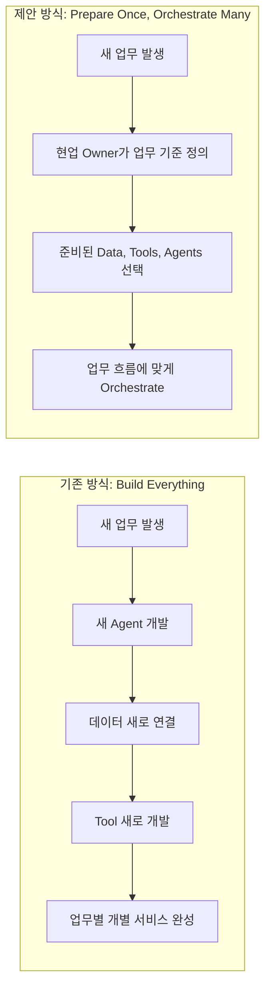
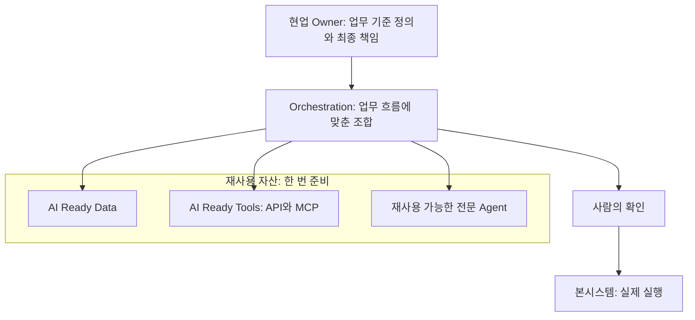
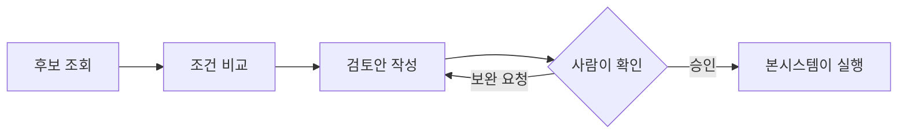
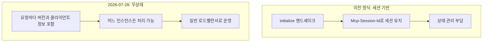

- 단상 「Agent를 많이 만드는 회사보다, Agent가 일할 수 있는 환경을 먼저 만들자」 분석
- 작성일: 2026-09-29

```
단상

몇 개월 동안 Enterprise AI를 고민했다.

Agent를 만들고,
Workflow를 연결하고,
Data를 붙이고,
MCP와 권한을 고민하고,
기존 시스템과 연결하면서 계속 한 가지 질문이 남았다.

“AI에게 일을 맡기려면 무엇부터 만들어야 할까?”

처음에는 당연히 Agent라고 생각했다.

새로운 업무가 생기면
새로운 Agent를 만들고,
필요한 데이터를 붙이고,
Tool을 개발하고,
하나의 서비스를 완성한다.

그런데 계속 해보니 생각이 조금 바뀌었다.

매번 처음부터 만드는 것이 아니라,
이미 준비된 것들을 Orchestrate할 수 있어야 한다.

회사의 데이터가 AI Ready Data로 준비되어 있고,
기존 시스템의 기능이 API와 MCP라는 AI Ready Tools로 열려 있고,
복잡한 전문 업무는 재사용 가능한 Agent로 존재한다. GE 기반 AI 업무환경 · 현업 Owner와 GE·본시스템의 역할.pdf

그러면 새로운 업무가 생길 때마다
Zero Base에서 개발할 필요가 없다.

현업 Owner가 업무 기준을 정하고,

Data + Tools + Agents

를 업무 흐름에 맞게 연결한다.

후보를 조회하고,
조건을 비교하고,
검토안을 만들고,
사람이 확인하고,
필요하면 본시스템이 실행한다.

Build Everything이 아니라,
Prepare Once, Orchestrate Many.

이게 몇 개월 동안 고민하면서
내가 그리고 싶었던 Enterprise AI 한판이다.

그래서 앞으로 개발자가 준비해야 할 것도 조금 달라진다.

“어떤 Agent를 만들까요?”보다 먼저,

“우리가 만든 것을 다른 업무에서도
Orchestrate할 수 있게 준비했는가?”

를 물어야 한다.

잘 준비된 Data 하나,
잘 설계된 MCP Tool 하나,
재사용 가능한 전문 Agent 하나가
여러 Workflow의 재료가 될 수 있어야 한다.

그때부터 AI 개발은
매번 새로운 서비스를 만드는 일이 아니라,

회사가 이미 가진 능력을
AI가 조합해서 일할 수 있는 환경을 만드는 일이 된다.

몇 개월을 돌아 내가 내린 결론은 단순하다.

Agent를 많이 만드는 회사보다,
Agent가 일할 수 있는 환경을 먼저 만들자.

어쩌면 그것이
Enterprise AI를 확산시키는 시작점일지도 모르겠다.

https://www.facebook.com/share/p/1JZ1MfY68b/

```


---

## 0. 이 문서를 읽기 전에

이 문서는 Enterprise AI에 대한 한 편의 짧은 글(단상)이 무엇을 말하려는지 풀어서 설명하고, 그 주장이 2026년 9월 현재의 기술·시장 정보와 어떻게 맞닿아 있는지를 검토합니다.

먼저 밝혀둘 한계가 있습니다. 글의 원문이 게시된 Facebook 페이지는 자동 접근을 허용하지 않아 직접 열어볼 수 없었습니다. 그래서 이 문서의 해설은 전달받은 본문 텍스트에만 근거합니다. 또한 본문 중간에 「GE 기반 AI 업무환경 · 현업 Owner와 GE·본시스템의 역할.pdf」라는 파일명이 참조 자료처럼 끼어 있는데, 그 PDF의 내용은 제가 볼 수 없었습니다. 따라서 "GE"가 정확히 무엇의 약어인지는 이 문서에서 정의하지 않고, 추측으로 채우지도 않았습니다.

문서 전체에서 내용의 성격을 세 가지로 구분해 표시했습니다.

| 표시 | 의미 |
|---|---|
| **[원문]** | 전달받은 글에 실제로 적혀 있는 내용 |
| **[확인된 사실]** | 이번에 검색으로 출처를 확인한 외부 정보 |
| **[해석]** | 위 두 가지를 바탕으로 한 저의 해석이며, 사실로 확정된 것은 아님 |

---

## 1. 한 문장 요약

이 글의 결론은 제목 그대로입니다. 새로운 업무가 생길 때마다 Agent를 처음부터 만드는 방식(Build Everything)을 버리고, 데이터·도구·전문 Agent를 재사용 가능한 부품으로 한 번 잘 준비해 두었다가(Prepare Once) 업무마다 그것들을 조합해서(Orchestrate Many) 일하게 하자는 제안입니다.

글쓴이는 이것을 "Agent를 많이 만드는 회사보다, Agent가 일할 수 있는 환경을 먼저 만드는 회사"라는 문장으로 압축하고, 그것이 Enterprise AI를 확산시키는 시작점일지도 모른다는 조심스러운 문장으로 끝맺습니다.

---

## 2. 글의 흐름을 따라가며 읽기

### 2.1 출발점: "무엇부터 만들어야 할까?"

글은 몇 달 동안 Enterprise AI를 고민한 이야기로 시작합니다. Agent를 만들고, Workflow를 연결하고, 데이터를 붙이고, MCP와 권한을 고민하고, 기존 시스템과 연결하는 과정을 거치면서 하나의 질문이 계속 남았다고 합니다. 「AI에게 일을 맡기려면 무엇부터 만들어야 할까?」라는 질문입니다.

이 질문이 중요한 이유는, 대부분의 조직이 이 질문에 너무 빨리 답하기 때문입니다. "당연히 Agent부터"라고 답하는 것이 가장 자연스럽습니다. 눈에 보이는 결과물이 Agent이고, 데모도 Agent로 하기 때문입니다. 글쓴이도 처음에는 그렇게 생각했다고 고백합니다.

### 2.2 처음의 생각: 업무가 생기면 Agent를 만든다

처음의 접근은 이렇게 요약됩니다. 새로운 업무가 생기면 새로운 Agent를 만들고, 필요한 데이터를 붙이고, Tool을 개발하고, 하나의 서비스를 완성합니다. 업무 하나당 서비스 하나를 세로로 완성하는 방식입니다.

이 방식은 시작이 쉽고 결과가 빨리 보인다는 장점이 있습니다. 하지만 업무가 열 개, 백 개로 늘어나면 같은 데이터 연결, 같은 시스템 연동, 같은 권한 처리를 업무마다 반복해서 만들게 됩니다.

### 2.3 생각의 전환: 준비된 것을 조합한다

글의 핵심 전환은 다음 문장에 있습니다. 매번 처음부터 만드는 것이 아니라, 이미 준비된 것들을 Orchestrate할 수 있어야 한다는 것입니다. 그러기 위해 회사에 세 가지 준비물이 있어야 한다고 말합니다.

1. **AI Ready Data**: 회사의 데이터가 AI가 쓰기 좋은 상태로 준비되어 있어야 합니다.
2. **AI Ready Tools**: 기존 시스템의 기능이 API와 MCP로 열려 있어야 합니다.
3. **재사용 가능한 Agent**: 복잡한 전문 업무는 다른 곳에서도 불러 쓸 수 있는 Agent로 존재해야 합니다.

이 세 가지가 갖춰져 있으면 새 업무가 생겨도 Zero Base에서 개발할 필요가 없어집니다. 현업 Owner가 업무 기준을 정하고, Data + Tools + Agents를 업무 흐름에 맞게 연결하면 됩니다.

### 2.4 업무가 실제로 흘러가는 모습

글은 조합된 업무의 흐름을 다섯 개의 동사로 보여줍니다. 후보를 조회하고, 조건을 비교하고, 검토안을 만들고, 사람이 확인하고, 필요하면 본시스템이 실행한다는 것입니다.

여기서 눈여겨볼 점은 두 가지입니다. 첫째, AI가 만든 것은 "검토안"까지이고 최종 결정 앞에 "사람이 확인"하는 단계가 명시되어 있습니다. 둘째, 실제 실행은 AI가 아니라 "본시스템"이 합니다. 문맥상 본시스템은 기존에 업무를 실제로 처리하는 회사의 핵심 시스템을 가리키는 것으로 읽힙니다. 즉 AI는 판단을 돕는 층에 있고, 기록과 실행의 책임은 기존 시스템과 사람에게 남겨 두는 설계입니다.

### 2.5 구호: Build Everything이 아니라 Prepare Once, Orchestrate Many

글은 이 생각을 한 줄로 정리합니다. 모든 것을 새로 만드는 대신 한 번 준비하고 여러 번 조합한다는 것입니다. 글쓴이는 이것이 몇 달간의 고민 끝에 그리고 싶었던 "Enterprise AI 한판"이라고 표현합니다. 한판이란 전체 그림을 뜻하는 표현으로 읽힙니다.

### 2.6 개발자의 질문이 바뀐다

이 글에서 실무적으로 가장 큰 울림을 주는 부분입니다. 개발자가 먼저 던질 질문이 "어떤 Agent를 만들까요?"에서 「우리가 만든 것을 다른 업무에서도 Orchestrate할 수 있게 준비했는가?」로 바뀌어야 한다는 주장입니다.

이 질문을 받아들이면 산출물의 평가 기준이 달라집니다. 하나의 업무에서 잘 돌아가는 Agent보다, 여러 Workflow의 재료가 될 수 있는 잘 준비된 데이터 하나, 잘 설계된 MCP Tool 하나, 재사용 가능한 전문 Agent 하나가 더 큰 자산이 됩니다. 글쓴이는 그때부터 AI 개발이 매번 새 서비스를 만드는 일이 아니라, 회사가 이미 가진 능력을 AI가 조합해 일할 수 있는 환경을 만드는 일이 된다고 말합니다.

---

## 3. 핵심 개념을 쉬운 말로 풀어보기

건물 공사에 비유하면 이해가 쉽습니다. 집을 지을 때마다 벽돌을 직접 굽고, 못을 직접 만들고, 설계도를 새로 그리는 건설사는 없습니다. 규격화된 자재와 검증된 공법이 준비되어 있고, 현장마다 그것을 조합합니다. 이 글이 말하는 Enterprise AI도 같은 구조입니다. (이 비유는 이해를 돕기 위한 것이며 원문에 있는 표현은 아닙니다.)

| 개념 | 쉬운 설명 | 건설 비유 |
|---|---|---|
| AI Ready Data | AI가 바로 읽고 판단 근거로 쓸 수 있게 정리·관리된 회사 데이터 | 규격에 맞게 다듬어 둔 자재 |
| AI Ready Tools (API, MCP) | 기존 시스템의 기능을 AI가 안전하게 호출할 수 있게 열어 둔 창구 | 표준 규격의 연결 부품 |
| 재사용 가능한 Agent | 복잡한 전문 업무를 맡아 처리하는, 여러 업무에서 불러 쓸 수 있는 Agent | 검증된 전문 시공팀 |
| 현업 Owner | 업무의 기준을 정하고 결과에 책임지는 업무 담당자 | 건축주 겸 감리 |
| Orchestrate | 위 재료들을 업무 순서에 맞게 조합해 실행하는 것 | 현장 소장의 공정 관리 |
| 본시스템 | 실제 업무 처리와 기록이 이뤄지는 기존 핵심 시스템 | 준공 후 실제로 사용하는 건물 |

### 3.1 왜 "현업 Owner"가 등장하는가

기술 글에서 흥미로운 대목은 업무 기준을 정하는 주체가 개발자가 아니라 현업 Owner로 지정되어 있다는 점입니다. Orchestrate의 "무엇을, 어떤 조건으로, 어떤 순서로"는 결국 업무 지식이기 때문입니다. 개발자는 재료를 준비하고, 현업은 그 재료를 어떤 기준으로 조합할지 정합니다. 글은 이런 역할 분담을 전제하고 있으며, 첨부로 언급된 PDF의 제목도 「현업 Owner와 GE·본시스템의 역할」로 되어 있어 역할 구분을 다룬 자료로 보입니다. 다만 PDF 내용은 확인하지 못했습니다.

---

## 4. 두 접근법의 비교



두 방식의 차이를 표로 정리하면 다음과 같습니다. 이 표는 원문의 논지를 제가 비교 형태로 재구성한 것입니다.

| 관점 | Build Everything | Prepare Once, Orchestrate Many |
|---|---|---|
| 새 업무가 생겼을 때 | 처음부터(Zero Base) 개발 | 준비된 자산을 조합 |
| 개발자의 첫 질문 | 어떤 Agent를 만들까? | 우리가 만든 것을 다른 업무에서도 조합할 수 있는가? |
| 데이터·도구의 위치 | 업무별 서비스 안에 내장 | 회사 공용 자산으로 분리 |
| 업무 기준의 주인 | 개발 요구사항에 묻혀 있음 | 현업 Owner가 명시적으로 정의 |
| 확장 방식 | 서비스 개수가 늘어남 | 조합의 경우의 수가 늘어남 |
| 초기 투자 | 작음 | 큼 (재사용 설계가 필요) |
| 한계 비용 | 업무마다 비슷하게 큼 | 자산이 쌓일수록 낮아짐 |

마지막 두 줄은 논리적 귀결에 가까운 [해석]입니다. 준비 단계의 초기 투자가 더 크다는 점은 뒤의 검토 부분에서 다시 다룹니다.

---

## 5. 글이 그리는 전체 구조



위 구조에서 위쪽은 "무엇을 왜 하는가"를 정하는 층이고, 가운데는 "어떻게 조합하는가"를 다루는 층이며, 아래쪽은 "무엇으로 하는가"를 제공하는 재료 층입니다. 마지막에 사람의 확인을 거쳐 본시스템이 실행합니다. 글의 요지는 회사의 경쟁력이 맨 위의 화려한 Agent 개수가 아니라 가운데 조합 층을 떠받치는 재료 층의 품질에 있다는 것입니다.

### 5.1 업무 하나가 흘러가는 방식

원문이 제시한 다섯 단계를 흐름도로 그리면 다음과 같습니다. 사람이 검토안에 만족하지 못할 때 보완을 요청하는 되돌림 화살표는 원문에 없는 것으로, 이해를 돕기 위해 제가 덧붙인 [해석]입니다.



---

## 6. 2026년 9월 현재의 정보와 맞춰보기

이 글의 주장은 개인적 경험에서 나온 결론이지만, 최근의 기술 표준과 시장 조사 결과를 함께 놓고 보면 방향이 상당 부분 겹칩니다. 아래는 검색으로 출처를 확인한 내용입니다. 확인 날짜는 모두 2026-09-29입니다.

### 6.1 "AI Ready Tools": MCP가 2026-07-28 개정판으로 크게 바뀌었습니다

**[확인된 사실]** Model Context Protocol의 2026-07-28 개정판이 2026년 7월 28일에 정식 공개되었습니다. 공식 블로그에 따르면 이번 개정의 핵심은 무상태(stateless) 프로토콜 코어입니다. 이전의 양방향·상태 유지 프로토콜에서 요청/응답 형태의 무상태 프로토콜로 바뀌었다고 설명합니다.

공식 블로그가 밝힌 주요 변경점은 다음과 같습니다.

- 초기화 핸드셰이크(`initialize`/`initialized`)와 `Mcp-Session-Id` 헤더가 폐지되었습니다. 각 요청이 프로토콜 버전, 클라이언트 정보, 클라이언트 기능을 스스로 담아 보내며, 어떤 요청이든 일반적인 라운드로빈 로드밸런서 뒤의 어느 서버 인스턴스에나 도달할 수 있고 공유 저장소도 필요 없다고 합니다.
- 서버가 사용자에게 중간에 확인을 구하는 흐름(elicitation 등)은 Multi Round-Trip Requests(MRTR)로 재설계되었습니다. 서버가 `input_required` 결과를 돌려주면 클라이언트가 답을 붙여 원래 호출을 다시 보내는 방식입니다.
- 메서드와 도구 이름이 `Mcp-Method`, `Mcp-Name` HTTP 헤더로 전달되어, 게이트웨이나 속도 제한기, WAF가 본문을 해석하지 않고도 라우팅과 인가를 할 수 있습니다.
- `tools/list` 등 목록 응답에 캐시 힌트(`ttlMs`, `cacheScope`)가 붙어 도구 목록을 캐시할 수 있습니다.
- 인가 강화: RFC 9207 발급자(issuer) 검증, 클라이언트 자격증명을 발급자에 묶는 규칙, 그리고 Dynamic Client Registration(DCR)을 공식 폐기 대상으로 삼고 Client ID Metadata Documents(CIMD)로 옮겨 가는 방향이 포함되었습니다.
- Tasks는 핵심 사양에서 확장(extension)으로 이동했고, MCP Apps와 Enterprise Managed Authorization(EMA)도 공식 확장에 포함됩니다.
- Roots, Sampling, Logging 기능과 예전 HTTP+SSE 전송 방식은 폐기 예정이며, 최소 12개월간 계속 동작합니다.

또 같은 글에 따르면 Tier 1 SDK 전반에서 월 다운로드가 5억 건에 가깝고, TypeScript와 Python SDK는 누적 10억 다운로드를 넘었습니다. 2026년 8월 22일 갱신된 MCP 로드맵은 이번 개정 덕분에 원격 MCP 서버가 다른 일반 HTTP 서비스와 다를 바 없어졌다고 설명하고, 기업 준비도(enterprise readiness) 작업이 주로 인가 개선으로 나타났다고 정리합니다. 로드맵에 따르면 Enterprise-Managed Authorization 확장도 이제 안정(stable) 상태입니다.

**이것이 글의 주장과 어떻게 연결되는가 [해석]:** 글이 말하는 "잘 설계된 MCP Tool 하나가 여러 Workflow의 재료가 된다"는 전제는, MCP 서버를 한 번 만들어 여러 업무에서 안정적으로 호출할 수 있어야 성립합니다. 무상태 전환은 서버를 일반 웹 서비스처럼 확장·운영할 수 있게 해 이 전제의 운영 부담을 낮춥니다. 헤더 기반 라우팅과 강화된 인가는 "누가 어떤 도구를 호출할 수 있는가"라는 글쓴이의 권한 고민(MCP와 권한)에 직접 닿아 있습니다. MRTR로 도구가 실행 전에 사용자 확인을 구할 수 있게 된 점은, 글이 강조한 "사람이 확인하고"라는 단계를 프로토콜 차원에서 지원하는 방향으로 읽을 수 있습니다. 다만 이것은 제 해석이며, 개정판이 그런 목적으로 설계되었다고 공식 문서가 말한 것은 아닙니다.

한 가지 실무상 주의점이 있습니다. 공식 블로그는 세션 식별자에 의존하던 개발자에게는 마이그레이션 비용이 있을 것이라고 직접 언급합니다. 이미 MCP 서버를 만들어 운영 중이라면 어느 개정판을 대상으로 하는지 확인해야 합니다.



위 도표에서 "상태 관리 부담"은 공식 글의 "공유 저장소 없이도 된다"는 서술에서 거꾸로 짐작한 [해석]이며, 공식 글이 이전 방식의 단점으로 그렇게 명시한 것은 아닙니다.

### 6.2 "재사용 가능한 Agent": Agent 간 통신 표준 A2A가 1.0에 도달했습니다

**[확인된 사실]** Agent2Agent(A2A) 프로토콜은 Google이 2025년 4월에 공개했고, Linux Foundation이 2025년 6월 23일 프로젝트 출범을 발표했습니다. Linux Foundation의 2026년 4월 9일자 발표에 따르면 첫 안정 사양인 버전 1.0이 나왔고, 다중 테넌시와 현대화된 보안 흐름 등이 포함되었으며, 지원 조직은 50여 곳에서 150곳 이상으로 늘었습니다. 지원 조직에는 AWS, Cisco, Google, IBM, Microsoft, Salesforce, SAP, ServiceNow가 들어 있습니다.

**[확인된 사실, 2차 자료]** 한 기술 해설 글은 v1.0이 2026년 3월 12일에 출시되었다고 적고 있고, A2A의 설계 원칙은 다른 프레임워크로 만든 Agent들이 서로를 발견하고 작업을 위임하되 내부 상태나 도구 목록을 노출하지 않는 것이라고 설명합니다. 이 두 내용은 Linux Foundation 공식 문서가 아닌 해설 글에서 확인한 것이므로 공식 사양으로 다시 확인하는 것이 좋습니다.

**연결 [해석]:** 글이 말하는 "복잡한 전문 업무는 재사용 가능한 Agent로 존재한다"는 그림은, Agent가 서로 다른 팀·프레임워크에서 만들어져도 표준 방식으로 호출될 수 있어야 현실이 됩니다. A2A가 1.0의 안정 사양에 이르렀다는 사실은 이 방향의 생태계가 실제로 굳어지고 있음을 보여주는 근거입니다. 다만 A2A를 쓸 것인지, 조직 내부에서 별도 방식으로 Agent를 노출할 것인지는 글에서 언급된 바 없으며 여기서 판단하지 않습니다.

### 6.3 "AI Ready Data": 데이터 준비가 왜 첫 번째 과제인가

**[확인된 사실]** Gartner는 2025년 2월 26일자 자료에서 2026년까지 AI-ready data의 뒷받침이 없는 AI 프로젝트의 60%를 조직들이 포기할 것이라고 전망했습니다. 같은 자료는 2024년 3분기에 데이터 관리 책임자 248명을 조사한 결과 63%의 조직이 AI에 맞는 데이터 관리 관행을 갖추지 못했거나 갖췄는지 확신하지 못한다고 밝혔습니다.

**[확인된 사실, 2차 자료]** 한 분석 글은 Gartner의 AI-ready data 정의를 이렇게 요약합니다. 특정 사용 사례에 맞춰져 있고, 자산 단위로 거버넌스가 적용되며, 품질 관문이 있는 자동화 파이프라인과 실시간 메타데이터로 관리되고, 지속적으로 품질이 보증되는 데이터라는 것입니다. 이 정의도 2차 자료라서 Gartner 원문에서 직접 확인한 것은 아닙니다.

**한 가지 조심할 점:** "2026년까지"라는 전망 시한이 곧 끝나지만, 실제로 60%가 포기되었는지를 사후 검증한 자료는 이번 검색에서 확인하지 못했습니다. 이 수치는 어디까지나 과거 시점의 예측입니다.

**연결 [해석]:** 글이 데이터를 준비물의 첫 번째로 꼽은 것은 시장 조사가 지적하는 실패 원인과 방향이 일치합니다. 다만 "AI Ready Data"가 Gartner의 용어와 정확히 같은 의미로 쓰였는지는 글에서 정의되지 않았으므로 단정할 수 없습니다.

### 6.4 "Build Everything"의 위험: 에이전트 프로젝트 취소 전망

**[확인된 사실]** Gartner는 2025년 6월 25일 보도자료에서 2027년 말까지 에이전틱 AI 프로젝트의 40% 이상이 비용 증가, 불분명한 사업 가치, 부족한 위험 통제 때문에 취소될 것이라고 전망했습니다. 같은 자료에서 Gartner는 현재의 많은 에이전틱 AI 프로젝트가 초기 실험이나 개념 검증 단계이고 과열된 기대에 이끌려 잘못 적용되는 경우가 많다고 지적했습니다. 또한 기존 시스템에 Agent를 통합하는 일은 기술적으로 복잡하고 워크플로를 흔들며 값비싼 개조가 필요할 수 있다고 했습니다. 한편으로 2028년까지 일상 업무 의사결정의 최소 15%가 에이전틱 AI에 의해 자율적으로 이뤄지고, 기업용 소프트웨어의 33%가 에이전틱 AI를 포함할 것이라는 전망도 함께 내놓았습니다.

2026년에 나온 후속 자료도 있습니다. 한 산업 분석 글은 Gartner의 2026년 에이전틱 AI 하이프 사이클이 이 분야를 "부풀려진 기대의 정점"에 놓았고, 조직의 17%만 AI 에이전트를 배포했지만 60% 이상이 2년 안에 배포할 계획이라고 전했습니다(2차 자료). 2026년 7월 7일자 Forbes 기고는 이 취소 전망이 여전히 유효한 경고라고 다시 짚었습니다.

**연결 [해석]:** Gartner가 든 취소 이유는 모델 성능이 아니라 비용, 사업 가치, 위험 통제입니다. 업무마다 Agent를 새로 만들면 비용이 업무 수만큼 반복되고, 데이터·권한·감사 같은 위험 통제도 업무마다 따로 붙여야 합니다. 글이 제안하는 "한 번 준비하고 재사용"은 이 반복 비용과 통제 분산을 줄이려는 시도로 읽을 수 있습니다. 다만 재사용 구조를 택하면 취소 위험이 줄어든다는 것을 직접 입증한 자료를 이번에 찾은 것은 아닙니다. 이 연결은 논리적 추론입니다.

---

## 7. 이 접근이 성립하려면 필요한 조건 (냉정한 검토)

이 글은 방향을 제시하는 단상이므로 세부 구현이나 성과 데이터를 담고 있지 않습니다. 그래서 이 방향이 실제로 작동하려면 어떤 조건이 필요한지 [해석]으로 정리해 둡니다.

**첫째, "준비"의 비용을 누가 부담하는가의 문제입니다.** 업무 하나를 빨리 만드는 것보다 여러 업무가 함께 쓸 부품을 만드는 것이 더 많은 시간과 합의를 요구합니다. 부품이 한 업무의 요구에만 맞춰 만들어지면 다른 업무에서는 쓸 수 없고, 반대로 지나치게 일반화하면 어느 업무에도 딱 맞지 않게 됩니다. 재사용 가능성은 설계 단계에서 의도적으로 확보해야 하는 속성입니다.

**둘째, 재사용 자산에는 주인이 있어야 합니다.** 여러 업무가 하나의 데이터나 도구에 의존하게 되면 그것을 바꿀 때 영향 범위가 넓어집니다. 버전 관리, 변경 공지, 품질 책임자가 없으면 공용 자산은 오히려 병목이 됩니다. 글이 현업 Owner라는 역할을 명시한 것은 이런 책임 구조를 염두에 둔 것으로 보이지만, 공용 자산의 관리 주체에 대한 언급은 본문에 없습니다.

**셋째, 권한과 통제는 조합될수록 복잡해집니다.** Agent가 여러 도구를 엮어 쓰면 "이 사용자가 이 업무에서 이 도구를 이 목적으로 써도 되는가"를 매번 판단해야 합니다. MCP 2026-07-28의 인가 강화와 Enterprise-Managed Authorization 확장은 이 문제를 다루는 도구를 제공하지만, 조직의 권한 정책 자체를 대신 정해주지는 않습니다.

**넷째, 사람의 확인 단계가 형식적으로 변질되지 않아야 합니다.** 글은 "사람이 확인하고"를 흐름에 넣었지만, 검토안이 많아지면 확인이 기계적인 승인으로 굳어질 수 있습니다. 어떤 업무에서 어느 수준의 확인이 필요한지는 현업 Owner가 기준으로 정해야 할 부분입니다.

**다섯째, 이 글은 결론을 "일지도 모르겠다"고 맺습니다.** 글쓴이 스스로 이것이 Enterprise AI 확산의 시작점"일지도" 모른다고 여지를 남겼습니다. 이 문서도 그 태도를 존중해, 이 접근이 검증된 정답이라고 말하지 않습니다. 이 글이 제안하는 것은 검증이 끝난 방법론이라기보다 의사결정의 우선순위입니다.

---

## 8. 개발자가 실제로 던져볼 질문들

글이 제안한 질문 「우리가 만든 것을 다른 업무에서도 Orchestrate할 수 있게 준비했는가?」를 점검 가능한 형태로 풀어 쓰면 다음과 같습니다. 이 목록은 글의 취지를 실무에 옮긴 제 [해석]이며 원문에 있는 체크리스트가 아닙니다.

**데이터에 대해서는** 이 데이터가 특정 화면이나 보고서가 아니라 AI가 직접 읽을 수 있는 형태로 정리되어 있는지, 출처와 갱신 시점을 함께 알 수 있는지, 누가 품질을 책임지는지를 물어볼 수 있습니다.

**도구(API, MCP)에 대해서는** 이 도구의 설명이 처음 보는 Agent도 올바르게 호출할 수 있을 만큼 명확한지, 읽기와 쓰기가 구분되어 있고 쓰기에는 확인 절차가 있는지, 호출 주체별 권한이 통제되는지, 그리고 현재의 MCP 개정판(2026-07-28)을 기준으로 만들어졌는지를 물어볼 수 있습니다.

**Agent에 대해서는** 이 Agent가 하나의 업무가 아니라 하나의 전문 영역을 담당하도록 범위가 잡혀 있는지, 입력과 출력의 형식이 다른 업무에서도 이해할 수 있게 정의되어 있는지, 내부 구현을 몰라도 호출해 쓸 수 있는지를 물어볼 수 있습니다.

**조합에 대해서는** 이 자산들을 엮어 새 업무를 만들 때 개발 없이 현업 Owner가 기준만 바꿔서 구성할 수 있는 부분이 얼마나 되는지를 물어볼 수 있습니다. 이 질문의 답이 "거의 없다"면 아직 Prepare 단계에 머물러 있는 것입니다.

---

## 9. 결론

이 글이 말하는 바를 한 문단으로 다시 정리하면 이렇습니다. Enterprise AI에서 진짜 자산은 업무마다 새로 만든 Agent의 개수가 아니라, 데이터, 도구, 전문 Agent라는 재사용 가능한 부품과 그것들을 업무 흐름에 맞게 조합하는 구조입니다. 업무 기준은 현업 Owner가 정하고, AI는 조회·비교·검토안 작성을 맡으며, 사람이 확인하고, 실제 실행은 기존 본시스템이 합니다. 그래서 개발자는 "무엇을 만들까"보다 "만든 것이 재사용되도록 준비했는가"를 먼저 물어야 합니다.

최신 정보로 확인한 바로는, 이 방향을 뒷받침하는 기술 기반은 빠르게 성숙하고 있습니다. MCP는 2026년 7월 28일 개정으로 무상태 구조와 강화된 인가를 갖춰 도구를 공용 자산으로 운영하기 쉬워졌고, Agent 간 통신 표준인 A2A는 안정 사양 1.0에 이르렀습니다. 동시에 Gartner의 전망은 데이터 준비 부족과 비용·가치·위험 통제의 실패가 프로젝트 좌초의 주된 원인임을 경고합니다. 이 두 흐름은 "먼저 환경을 만들자"는 글의 결론과 방향이 같습니다.

다만 이 방향이 곧 성공을 보장하는 것은 아닙니다. 재사용 설계의 비용, 공용 자산의 책임 주체, 조합된 권한의 통제, 사람 확인의 실질화는 여전히 조직이 풀어야 할 숙제입니다. 글쓴이가 끝맺음에서 남긴 "시작점일지도 모르겠다"는 신중한 표현이 가장 정확한 현재의 위치일 것입니다.

---

## 10. 출처 및 확인 내역

모든 출처는 2026-09-29에 확인했습니다.

| 구분 | 내용 | 출처 | 성격 |
|---|---|---|---|
| 원문 | 단상 본문 (Facebook 게시물) | https://www.facebook.com/share/p/1JZ1MfY68b/ | 자동 접근이 차단되어 열람 불가. 전달받은 본문 텍스트에 근거 |
| MCP 개정 | 2026-07-28 사양 공개, 변경점 상세 (2026-07-28) | https://blog.modelcontextprotocol.io/posts/2026-07-28/ | 공식 블로그 (1차) |
| MCP 사양 | 최신 사양 문서 (2026-07-28 버전) | https://modelcontextprotocol.io/specification/2026-07-28 | 공식 사양 (1차) |
| MCP 로드맵 | 2026-08-22 갱신 로드맵 | https://blog.modelcontextprotocol.io/posts/mcp-roadmap/ | 공식 블로그 (1차) |
| MCP 거버넌스 | 2025년 12월 Agentic AI Foundation 기증 | https://scalar.com/learn/mcp/what-is-mcp | 2차 해설 자료. 이 문서 본문에서는 인용하지 않음 |
| A2A | 1주년, v1.0, 150개 이상 조직 (2026-04-09) | https://www.linuxfoundation.org/press/a2a-protocol-surpasses-150-organizations-lands-in-major-cloud-platforms-and-sees-enterprise-production-use-in-first-year | Linux Foundation 보도자료 (1차) |
| A2A | Linux Foundation 프로젝트 출범 (2025-06-23) | https://www.linuxfoundation.org/press/linux-foundation-launches-the-agent2agent-protocol-project-to-enable-secure-intelligent-communication-between-ai-agents | Linux Foundation 보도자료 (1차) |
| A2A | v1.0 출시일(2026-03-12), 설계 원칙 설명 | https://eco.com/support/en/articles/14845481-a2a-agent-to-agent-protocol-explained | 2차 해설 자료 |
| Gartner | 에이전틱 AI 프로젝트 40% 이상 취소 전망 (2025-06-25) | https://www.gartner.com/en/newsroom/press-releases/2025-06-25-gartner-predicts-over-40-percent-of-agentic-ai-projects-will-be-canceled-by-end-of-2027 | Gartner 보도자료 (1차) |
| Gartner | AI-ready data 부족 시 AI 프로젝트 60% 포기 전망 (2025-02-26) | https://www.gartner.com/en/newsroom/press-releases/2025-02-26-lack-of-ai-ready-data-puts-ai-projects-at-risk | Gartner 보도자료 (1차) |
| Gartner 2차 | 2026 하이프 사이클 위치, 17% 배포 등 | https://www.ihlservices.com/news/analyst-corner/2026/06/gartner-predicts-40-of-agentic-ai-projects-will-be-canceled-by-2027-heres-what-the-retail-store-level-shows/ | 2차 분석 자료 |
| Gartner 2차 | AI-ready data 정의 요약 | https://sranalytics.io/blog/why-95-of-ai-projects-fail/ | 2차 분석 자료 |
| 논평 | 취소 전망 재조명 (2026-07-07) | https://www.forbes.com/sites/robertszczerba/2026/07/07/why-40-of-agentic-ai-projects-may-be-canceled-by-2027/ | 기고문 |

### 확인하지 못한 것

- 원문 Facebook 게시물의 실제 화면과 댓글
- 본문에 언급된 PDF 「GE 기반 AI 업무환경 · 현업 Owner와 GE·본시스템의 역할」의 내용, 그리고 "GE"의 정확한 의미
- Gartner의 "2026년까지 60% 포기" 전망이 실제로 맞았는지에 대한 사후 검증 자료
- 재사용 중심 구조(Prepare Once, Orchestrate Many)가 프로젝트 성공률을 실제로 높인다는 직접적인 실증 자료

---

작성 일자: 2026-09-29
