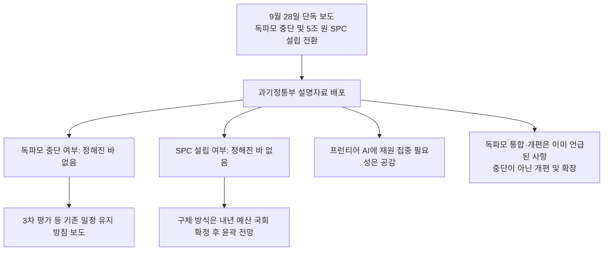
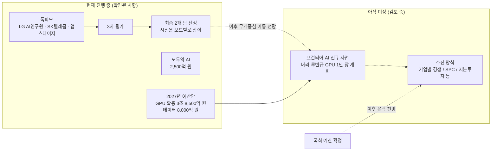

- 대상 기사: AI타임스 [「과기부, 국대 AI 중단설 일축…"현 구조로는 프런티어 역부족" 지적도」](https://www.aitimes.com/news/articleView.html?idxno=215733) (김해원 기자, 2026년 9월 28일 입력)
- 이 문서는 해당 기사를 풀어 설명하고, 2026년 9월 29일 기준으로 확인 가능한 후속·배경 보도를 함께 검토해 정리한 것입니다.

---

## 1. 한눈에 보는 요약

2026년 9월 28일 한 매체가 "정부가 '국가대표 AI' 사업인 독자 AI 파운데이션 모델(이하 독파모)을 중단하고, 5조 원 규모의 특수목적법인(SPC)을 세워 프런티어급 AI 개발로 전환한다"는 취지의 단독 보도를 냈습니다. 같은 날 과학기술정보통신부(과기정통부)는 설명자료를 내어 이를 사실상 부인했습니다. 핵심은 두 가지입니다.

첫째, 독파모 중단이나 SPC 설립 여부는 **아직 정해진 바가 없다**는 것입니다. 둘째, 그렇다고 지금 구조를 그대로 유지하겠다는 뜻은 아니며, 최상위급 AI 모델 개발에 재원을 집중해야 한다는 **필요성에는 깊이 공감한다**는 것입니다. 과기정통부 관계자는 독파모의 "통합 및 개편"은 이미 예산안 간담회 등에서 언급된 사항이며, 중단이 아니라 "개편 및 확장"의 개념이라고 설명했습니다.

기사의 후반부는 전문가 반응입니다. 고려대 AI연구소 최병호 교수는 개편 구상이 전반적으로 타당하다고 평가하면서도, GPU 지원에 비해 데이터와 인재 확보 방안이 부족하다고 지적했습니다. 기사 제목의 "현 구조로는 프런티어 역부족"이라는 표현은 이런 전문가 의견을 압축한 것으로 읽힙니다.

---

## 2. 용어부터 정리하기

기사를 이해하려면 몇 가지 용어가 필요합니다.

**독자 AI 파운데이션 모델(독파모)** 은 정부가 "국가대표 AI"를 육성하겠다며 추진해 온 프로젝트입니다. 외국 모델의 가중치를 가져다 쓰는 것이 아니라, 설계부터 사전학습까지 국내 기술로 직접 수행한 대규모 언어모델을 만드는 것이 취지입니다. 정부는 이 과정에서 GPU와 데이터를 지원하고, 정해진 시점마다 평가를 통해 참여 팀을 줄여 나가는 방식으로 운영해 왔습니다.

**프런티어급 AI**는 그 시점에 세계 최상위 수준으로 평가받는 모델을 뜻합니다. 기사에서 최병호 교수는 프런티어급이 되려면 최소 1조 단위의 매개변수(파라미터)가 필요하다고 말했는데, 이는 교수의 발언이며 기사는 이를 근거로 국내에는 이 조건을 충족한 모델이 아직 없다고 전합니다. 파라미터는 모델이 학습을 통해 조정하는 내부 숫자의 개수로, 흔히 모델의 덩치를 가늠하는 지표로 쓰입니다.

**특수목적법인(SPC)** 은 특정 사업을 수행하기 위해 별도로 세우는 법인입니다. 이번 논의에서는 정부와 민간이 함께 출자해 프런티어 AI 개발만 전담하는 법인을 만든다는 구상을 가리킵니다.

**투자형 R&D(출자 방식)** 는 연구비를 보조금으로 주고 끝내는 것이 아니라, 정부가 지분을 확보해 성과를 공유하는 방식입니다. 과기정통부는 신규 R&D 사업의 성과를 공유하고 투자 손실을 줄이기 위해 이런 방식을 적극 추진하겠다고 밝힌 바 있습니다.

---

## 3. 사건의 전개: 보도부터 해명까지

기사가 다루는 하루의 흐름은 다음과 같습니다.

한 매체가 정부가 독파모를 중단하고 5조 원 규모 SPC를 설립해 프런티어급 AI 개발로 전환한다고 단독 보도했습니다. 다만 제가 확인한 범위에서는 이 최초 보도의 원문을 찾지 못했으므로, 그 세부 내용은 AI타임스가 전한 요약과 이후 보도를 통해서만 알 수 있습니다.

같은 날 과기정통부가 설명자료를 냈고, 여러 매체가 이를 다뤘습니다. 헤럴드경제가 인용한 연합뉴스 보도에 따르면 과기정통부는 독파모 3차 평가 진행 여부를 포함해 프로젝트 운영 방안 전반을 종합적으로 재검토 중이며, 프런티어 AI 개발을 위한 SPC 설립안도 논의 선상에 올라 있는 것으로 알려졌습니다. 즉 "확정된 것은 없다"는 해명과 "재검토 중"이라는 보도가 함께 존재합니다. 이 둘은 모순이 아니라, 검토는 진행되지만 결정은 나오지 않았다는 같은 상태를 다르게 표현한 것으로 볼 수 있습니다.

---

## 4. 과기정통부가 실제로 말한 것과 말하지 않은 것

과기정통부의 입장은 조심스럽게 읽어야 합니다. 부인한 것은 "독파모 중단"과 "SPC 설립이 확정되었다"는 두 가지입니다. 반면 SPC 설립이나 정부 지분투자를 정책 옵션 중 하나로 검토해 온 사실 자체는 부인하지 않았습니다. 디지털투데이는 정부가 프런티어 AI 개발을 위한 SPC 설립이나 지분투자 방식을 정책 옵션들 중 하나로 검토해 왔다고 전했고, 배경훈 부총리 겸 과기정통부 장관이 7월 기자간담회에서 이미 이런 방향을 언급했다고 보도했습니다.

배 장관은 당시 프런티어 AI 모델 개발에 엔비디아 차세대 GPU인 베라 루빈 약 1만 장이 필요하고 GPU 가격만 약 3조 5천억 원이 들 것으로 추산했다고 합니다. 그러면서 정부가 특정 기업에 이 정도 규모의 자원을 몰아주는 방식은 현실적으로 어렵다며, 정부 지분투자나 SPC 설립 같은 투자형 R&D 방식을 검토하고 있다고 밝혔습니다. 따라서 이번 보도는 완전히 새로운 이야기라기보다, 이미 공개된 검토 방향이 "중단"과 "5조 원"이라는 강한 표현으로 요약되어 나오면서 논란이 커진 사례에 가깝습니다. 과기정통부 관계자가 "여론에서 오해가 생겨 별도 자료를 준비했다"고 말한 것도 이런 맥락입니다.

---

## 5. 일정은 어떻게 되나: 보도별로 표현이 다릅니다

독파모의 남은 일정에 대해서는 매체마다 표현이 조금씩 다릅니다. 이 부분은 단정하지 않고 차이를 그대로 적어 둡니다.

아주경제는 현재 참여 중인 3개 팀(LG AI연구원, SK텔레콤, 업스테이지)을 대상으로 연말까지 단계평가를 진행해 2개 팀을 선정하는 계획을 예정대로 추진한다고 보도했습니다. 디지털투데이는 예정대로 내년 2월까지 진행하며 3차 평가를 거쳐 2월에 최종 2개 기업을 선정할 것으로 전망했습니다. 한편 8월 18일 2차 평가 결과 발표 당시 여러 매체는 3차 평가를 거쳐 "내년 초" 최종 2개 팀을 선정한다고 전했고, 3차 평가의 세부 항목과 배점은 확정되지 않았다고 했습니다. 정확한 시점은 과기정통부의 후속 공식 발표를 기다려야 합니다.

분명한 것은 최종 2개 팀 선정 이후 정책의 무게중심이 프런티어 AI 쪽으로 쏠릴 가능성이 높다는 관측입니다. 다만 이것은 매체의 전망이지 정부가 확정한 사항이 아닙니다.

---

## 6. 왜 지금 이런 이야기가 나오나: 배경 정리

### 6-1. 독파모 1차·2차 평가의 흐름

독파모는 처음에 5개 정예팀으로 출발했습니다. 2026년 1월 15일 1차 평가 결과, 네이버클라우드와 NC AI가 탈락하고 LG AI연구원, SK텔레콤, 업스테이지 3개 팀이 남았습니다. 네이버클라우드는 종합 점수로는 상위권이었지만 중국 알리바바 큐웬 모델의 비전 인코더와 가중치를 사용해 독자성 기준을 충족하지 못한다는 판단을 받았고, NC AI는 종합 점수가 상위 4개 팀에 들지 못했습니다. 정부는 빈자리를 채우기 위해 추가 공모를 했고, 이후 모티프테크놀로지스가 합류해 4개 팀 구도가 됐습니다.

2026년 8월 18일 2차 평가에서는 LG AI연구원, SK텔레콤, 업스테이지가 통과하고 모티프가 탈락했습니다. 배점은 벤치마크 40점, 전문가 평가 35점, 사용자 평가 25점이었습니다. 흥미로운 대목은 모티프입니다. 모티프3는 글로벌 평가지수인 AAII에서 47점을 받아 미국·중국을 제외한 국가의 모델 중 최고 성능을 기록했지만, 종합 평가에서는 사용성과 활용성 면에서 근소하게 밀려 탈락했습니다. 과기정통부는 팀 간 점수 격차가 크지 않았고 항목마다 순위가 달라 일관되게 1위를 한 팀이 없었다고 설명했습니다.

### 6-2. 세계 최상위 모델과의 격차

과기정통부는 2차 평가에서 최상위 글로벌 모델과의 격차가 줄었다고 밝혔습니다. 1월 1차 평가 때는 최상위 모델(GPT-5.2, 51점)과 국내 최고점(32점)의 차이가 19점이었는데, 8월에는 최상위(클로드 오퍼스 5, 63점)와 모티프3(47점)의 차이가 16점으로 줄었다는 것입니다. 다만 이는 정부가 발표한 수치이며, 격차가 "줄었다"는 것과 "따라잡았다"는 것은 전혀 다른 이야기입니다. 게다가 기준이 되는 최상위 모델 자체가 계속 앞으로 나가고 있습니다.

### 6-3. 정부 스스로의 문제의식

이데일리에 따르면 9월 8일 국가AI전략위원회 출범 1주년 성과보고회에서 신진우 분과위원장은 독파모 성과를 두고 프런티어 모델 확보 측면에서 "3강"에 안착한 것으로 본다고 평가하면서도, 미국과 중국의 모델이 빠르게 발전해 독파모만으로 따라갈 수 있느냐는 고민을 늘 하고 있다고 말했습니다. 같은 자리에서 5조 원 이상이 투입될 것으로 예상되는 프런티어 AI를 기존의 기업별 경쟁 방식으로 이어갈지, SPC 같은 별도 방식으로 갈지를 묻는 질문에 대해 위원회에서 논의는 많이 하지만 결정된 사항은 아직 없다는 답이 나왔습니다. 하정우 상근부위원장은 정부와 기업이 각자 단독으로 하기보다 정부가 가이드와 평가 기준을 제시하고 기업과 함께 추진하는 방식을 제안했습니다.

배경훈 장관도 8월 27일 미래전략회의에서 독파모 2차 평가 결과에 대해 글로벌 수준에 비추어 여전히 아쉬운 부분이 있다고 언급했고, 9월 16일에는 페이스북을 통해 AI 속도를 늦출 여유가 없다며 "속도 조절"이 아닌 "속도 책임"을 강조했습니다. 이런 발언들을 종합하면, 정부 안팎에서 사업 재편 논의가 여러 달 이어져 왔다는 점은 분명합니다.

---

## 7. 돈은 얼마나 배정됐나: 2027년 예산안으로 보는 방향

기사에서 언급된 "프런티어 AI"의 재원 문제는 9월 1일 국무회의에서 의결된 2027년도 예산안에서 구체적으로 드러납니다. AI타임스 보도를 정리하면 다음과 같습니다.

| 항목 | 내용 |
|---|---|
| 2027년 정부 총지출 | 820조 9천억 원 (역대 최대) |
| 2027년 정부 R&D 예산 | 39조 5천억 원 (올해 35조 5천억 원에서 4조 원, 11.2% 증가) |
| 과기정통부 소관 예산 | 29조 6,476억 원 (올해 추경 대비 24.5% 증가) |
| 과기정통부 R&D 예산 | 14조 1천억 원 (정부 전체 R&D의 36%) |
| AI 예산 | 9조 4천억 원 (올해 대비 84.3% 증가, 정부 전체 AI 예산의 57%) |
| 최상위 AI 모델·기술 (독자 AI 모델, 차세대 AI 기술, AI 보안) | 5조 5,937억 원 |
| 독자 AI 모델용 GPU 확충 | 올해 2조 841억 원에서 내년 3조 8,500억 원으로 증액 |
| 데이터 경쟁력 강화 | 올해 300억 원에서 내년 8,000억 원으로 26배 증액 |
| 모두의 AI | 2,500억 원 (엔비디아 B200 2,000장 분량 임차 비용 포함) |

여기서 눈여겨볼 점이 세 가지 있습니다. 하나는 프런티어급 AI 개발에 베라 루빈급 GPU 1만 장을 투입한다는 계획이 예산에 반영됐다는 점입니다. 다른 하나는 정부가 기존 독파모를 넘어 자원을 집중 투입하는 신규 사업을 조만간 발표할 예정이라고 밝혔다는 점입니다. 마지막으로, 이전 사업에서 확보한 기술과 인재를 신규 사업과 연계한다는 방침이 명시되어 있다는 점입니다. 즉 예산안 단계에서부터 "독파모 이후"를 염두에 둔 설계가 이미 들어가 있었던 셈입니다.

참고로 배 장관이 7월에 추산한 GPU 가격 약 3조 5천억 원과 예산안의 GPU 확충 3조 8,500억 원은 서로 다른 출처의 서로 다른 항목이므로, 같은 숫자로 보고 비교하지는 않겠습니다. 또한 언론에서 거론되는 "5조 원"이 어떤 산식에서 나온 숫자인지는 제가 확인한 자료에서는 알 수 없습니다.

---

## 8. 전문가 평가 자세히 읽기

기사에 인용된 최병호 교수의 발언은 세 갈래로 나눌 수 있습니다.

**첫째, 경쟁 방식에 대한 평가입니다.** 그는 국가 단위 AI 개발에 기업 간 경쟁 방식은 애초에 적합하지 않았다고 말합니다. 경쟁은 여러 팀이 병렬로 시도하게 만들어 다양성을 확보하는 장점이 있지만, 프런티어급처럼 막대한 자원이 한 곳에 모여야 하는 영역에서는 자원이 분산되는 단점이 더 크다는 논리입니다. 이 주장에는 반론도 가능합니다. 경쟁 체제가 만든 성과(예를 들어 2차 평가에서 나온 다양한 접근)를 포기하고 한곳에 몰아주면 실패 위험도 한곳에 집중되기 때문입니다. 기사에서는 이런 반대 의견까지는 다루지 않았습니다.

**둘째, 역량 결집에 대한 평가입니다.** 프런티어급에 필요한 규모를 충족한 국내 모델이 없는 만큼 역량을 결집해 결과를 내는 것이 바람직하다고 봤습니다.

**셋째, 한계 지적입니다.** GPU 지원에 비해 데이터와 인재 확보 방안이 상대적으로 부족하다는 것입니다. 그는 체계적인 데이터 팩토리 구축과 우수 인재 유지가 관건이라고 강조했습니다. 또한 대학·산업계 겸업이 제도적으로는 열려 있지만 실제 사례가 드물다며, 세제 혜택과 병역 특례처럼 연구자가 현장에서 충분히 보상받을 수 있는 과감한 지원이 뒤따라야 한다고 말했습니다.

이 지적을 앞서 본 2027년 예산안과 겹쳐 보면 흥미롭습니다. 예산안에서 데이터 경쟁력 강화 예산은 300억 원에서 8,000억 원으로 크게 늘었고 "1조 토큰" 규모의 고품질 학습 데이터 구축이 목표로 제시되었습니다. 교수의 "데이터가 상대적으로 부족하다"는 지적은 GPU 예산 증가폭(약 1조 7천억 원)과 데이터 예산 증가폭(약 7,700억 원)의 절대 규모 차이를 겨냥한 것일 수도 있고, 예산의 실행 방식을 겨냥한 것일 수도 있습니다. 기사만으로는 어느 쪽인지 단정할 수 없습니다. 인재 문제는 예산안에서 "AI 포용사회(글로벌 AI, AI 인재, AI 역량강화)" 항목 1조 1,707억 원에 일부 포함되어 있지만, 교수가 말한 세제·병역 특례 같은 제도적 유인은 예산이 아니라 제도 개편의 영역이라는 점이 다릅니다.

---

## 9. 지금 상태를 구조도로 정리하기

현재 확인되는 정책 트랙을 단순화하면 아래와 같습니다. 점선으로 표시한 부분은 아직 결정되지 않은 사항입니다.

---

## 10. 앞으로 지켜볼 지점

이 사안은 결론이 난 것이 아니므로, 다음 항목들이 실제로 어떻게 발표되는지가 핵심입니다.

첫째, 과기정통부가 예고한 "독파모의 다음 단계와 대한민국 프런티어 AI 모델 개발 방향" 공개입니다. 과기정통부는 이를 빠른 시일 내에 공개하겠다고 밝혀 왔고, 여기에 추진 방식이 담길 가능성이 큽니다.

둘째, 국회의 2027년 예산 심의입니다. 아주경제는 SPC 설립을 포함한 구체적 추진 방식이 내년도 예산이 국회에서 확정된 뒤 윤곽이 드러날 전망이라고 전했습니다.

셋째, 독파모 3차 평가의 세부 항목과 시점입니다. 2차 평가 발표 때 정부는 3차 평가의 항목과 배점이 아직 확정되지 않았고 예산안과 연계해 발표하겠다고 했습니다. 프런티어 사업과의 관계 속에서 평가 기준이 어떻게 조정되는지 볼 필요가 있습니다.

넷째, 참여 방식입니다. 배 장관이 밝힌 대로 정부가 특정 기업에 자원을 몰아주기 어렵다면, 어떤 기업이 어떤 조건으로 참여하고 정부가 어떤 지분을 갖는지가 실질적인 쟁점이 됩니다. 1월 독파모 추가 공모 때 네이버·카카오·NC 등 주요 기업이 재도전을 꺼렸다는 보도가 있었던 만큼, 민간의 참여 유인을 어떻게 설계하느냐가 성패를 가를 수 있습니다.

---

## 11. 이 기사를 읽을 때 주의할 점

이 기사와 관련 보도를 읽을 때 구분해야 할 것이 몇 가지 있습니다.

먼저 **확정된 사실과 검토 중인 사안**을 구분해야 합니다. 확정된 것은 과기정통부가 중단과 SPC 설립을 결정한 바 없다고 밝힌 것, 2027년 예산안에 프런티어 AI용 GPU와 데이터 예산이 반영된 것, 독파모 3개 팀이 평가를 이어가고 있다는 것입니다. 검토 중인 것은 SPC 설립, 지분투자, 독파모의 통합·개편 방식입니다.

다음으로 **매체의 프레임**을 구분해야 합니다. "중단설 일축"은 정부 해명을 중심에 둔 표현이고, "현 구조로는 프런티어 역부족"은 전문가 발언을 압축한 제목입니다. 한 전문가의 의견이 곧 정부 입장이나 학계 전체의 합의는 아닙니다. 기사에서도 전문가들이 전반적으로 타당하다는 평가를 내놓았다고 하지만, 인용된 인물은 최병호 교수 한 명입니다.

마지막으로 **숫자의 출처**를 구분해야 합니다. 1조 파라미터 기준은 교수의 발언이고, 5조 원은 언론 보도와 전략위 논의 과정에서 거론된 규모이며, 예산안의 항목별 금액은 정부 발표입니다. 이들을 서로 같은 숫자로 연결하려면 추가 확인이 필요합니다.

---

## 12. 참고한 자료

- AI타임스, 「과기부, 국대 AI 중단설 일축…"현 구조로는 프런티어 역부족" 지적도」 (2026.09.28) — https://www.aitimes.com/news/articleView.html?idxno=215733
- 디지털투데이, 「과기정통부 "독파모 예정대로 진행"…프론티어 AI에 재원 집중은 필요」 (2026.09.28) — https://www.digitaltoday.co.kr/news/articleView.html?idxno=703365
- 아주경제, 「과기정통부 "독파모 중단 미정"…연말 평가 예정대로」 (2026.09.28) — https://www.ajunews.com/view/20260928181034870
- 헤럴드경제, 「정부, '독파모' 대수술하나…특수목적법인 설립도 거론」 (2026.09.28) — https://biz.heraldcorp.com/article/10886682
- AI타임스, 「"독파모 넘어 프론티어 AI로"…정부, GPU 1만장 확보에 3.85조 배정」 (2026.09.01) — https://www.aitimes.com/news/articleView.html?idxno=214714
- AI타임스, 「배경훈 장관 "AI 속도 늦출 여유 없다…중요한 것은 속도책임"」 (2026.09.16) — https://www.aitimes.com/news/articleView.html?idxno=215346
- 이데일리, 「"5조 프론티어 AI, 독파모 다음은?"…국가AI전략위 "추진 방식 아직 미정"」 — https://www.edaily.co.kr/News/Read?newsId=03735926645578152
- AI타임스, 「업스테이지·SKT·LG 독파모 3차 평가 진출…모티프 탈락」 (2026.08.18) — https://www.aitimes.com/news/articleView.html?idxno=214041
- 뉴스토마토, 「'독파모' 2차 결과 공개…모티프 탈락」 (2026.08.18) — https://www.newstomato.com/readnews.aspx?no=1310552
- ZDNet Korea, 「'독파모' 1차서 네이버·NC AI 동반 탈락…정부, 정예팀 1곳 추가 공모」 (2026.01.15) — https://zdnet.co.kr/view/?no=20260115150326
- 뉴스핌(네이트 뉴스), 「'독자성 미달·성능 최저점'…네이버·NC 탈락 이유는」 (2026.01.15) — https://m.news.nate.com/view/20260115n33195

이 문서에 담긴 내용은 위 보도에서 확인되는 범위로 한정했으며, 확인되지 않은 부분은 그렇다고 명시했습니다. 상황이 빠르게 변하는 사안이므로 이후 과기정통부의 공식 발표를 함께 확인하시기 바랍니다.

---

작성일: 2026년 9월 29일
