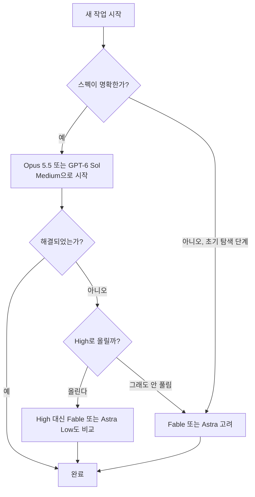
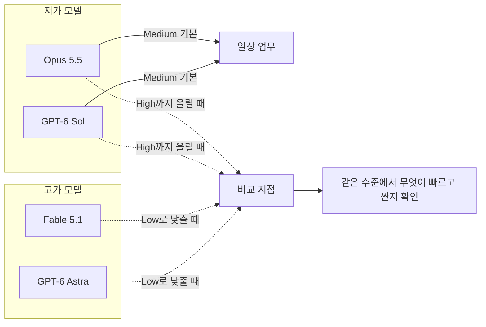

- 작성 기준일: 2026-09-29
- 대상 글: 실무 경험을 바탕으로 Fable, Astra, Opus 5.5, GPT-6 Sol 네 모델의 선택 기준과 effort(추론 강도) 설정을 정리한 소셜 미디어 게시글

> 
> 모델 및 Effort 선택 기준 알려드립니다. Fable, Astra, Opus 5.5, GPT-6 Sol 모델 기준.
> 
> 수치적으로 재 본 것은 아니지만, 일반 웹 서비스, 앱, 데스크탑 앱, 디자인, 머신러닝 프로젝트, 프롬프트 엔지니어링, 데이터 분석 그리고 신규 프로젝트와 유지보수 프로젝트 등 다양한 실제 실무에 사용한 경험적 의견입니다.
> 
> 결론부터 말하자면, 보통은 그냥 Opus 5.5 + GPT 6 Sol Medium 으로 기분에 따라 번갈아가면서 쓰면 됨.
> 
> 다만 Opus, GPT High 까지는 그 대신 Fable, Astra를 Low로 사용하는게 더 빠르고 좋을 수 있고, 어떤 경우는 비용이 덜 들기도 함.
> 
> 복합적이고 넓은 사고를 요하는 경우 Fable이 아직 확실히 독보적이긴 하고, Astra는 세부사항을 파고드는 능력이 좋음.
> 
> 여러 프로젝트에 써 본 경험상 가장 좋은 기본 조합은 Fable High 계획 + Astra Low 구현 + Astra Medium 리뷰인데 토큰이 순삭될 수 있어서 권장은 어려움.
> 
> 근데 보통의 문제에는 이정도까지 쓸 필요가 없기 때문에, 어떻게 해도 해결이 안되는 문제가 아니면 그냥 Opus 5.5, GPT 6 Sol Medium 무지성으로 쓰시면 됩니당. ☺️
> 
> Fable, Astra가 본격적으로 필요한 일은 스펙이 명확히 정해지지 않은 초기 단계의 복합적인 작업 혹은 밀레니엄 문제같은 초고차원 문제 정도.
> 
> https://www.facebook.com/share/p/1cMUBEBJsU/
> 

---

## 0. 먼저 알아둘 점

이 문서는 게시글 본문(사용자가 공유한 내용)을 해설하고, 그 주장이 현재 공개된 공식 문서와 제3자 평가에서 어디까지 뒷받침되는지 함께 살펴봅니다.

게시글이 걸려 있는 페이스북 링크는 자동 접근이 차단되어 열어 볼 수 없었습니다. 따라서 해설은 공유해 주신 본문 텍스트를 기준으로 했으며, 링크 안의 댓글이나 추가 내용은 반영하지 못했습니다.

또한 글쓴이 스스로 "수치적으로 재 본 것은 아니고 경험적 의견"이라고 밝히고 있습니다. 그래서 이 문서는 세 가지를 구분해서 씁니다.

- **공식 문서나 보도로 확인된 사실**: 가격, 기본 effort, 출시일, 벤치마크 수치 등
- **글쓴이의 경험적 의견**: "Fable이 독보적", "Astra는 세부사항을 잘 판다" 같은 체감 평가
- **아직 확인하지 못한 부분**: 그렇다고 명시하고 추측으로 메우지 않음

---

## 1. 한눈에 보는 게시글의 핵심

게시글의 주장은 한 문장으로 줄이면 이렇습니다.

> "대부분의 일은 Opus 5.5나 GPT-6 Sol을 Medium으로 쓰면 충분하고, 정말 안 풀리는 문제에서만 Fable이나 Astra를 꺼내라."

여기에 몇 가지 보조 주장이 붙습니다.

1. Opus와 GPT를 High까지 올릴 바에는 차라리 Fable이나 Astra를 Low로 쓰는 편이 빠르고 좋을 수 있으며, 어떤 경우에는 비용도 덜 든다.
2. 넓고 복합적인 사고가 필요할 때는 Fable이 아직 독보적이고, Astra는 세부사항을 파고드는 능력이 좋다.
3. 가장 좋았던 조합은 "Fable High로 계획 → Astra Low로 구현 → Astra Medium으로 리뷰"인데, 토큰이 빠르게 소진되어 권장하기는 어렵다.
4. Fable과 Astra가 본격적으로 필요한 경우는 스펙이 아직 정해지지 않은 초기의 복합 작업이나 극도로 어려운 문제 정도다.

---

## 2. 등장하는 네 모델은 무엇인가

### 2.1 Claude Opus 5.5 (Anthropic)

Anthropic은 2026년 9월 22일 Claude Opus 5.5를 공개했습니다. Claude 5.5 계열의 첫 모델입니다. API 모델 ID는 `claude-opus-5-5`입니다.

- **가격**: 입력 100만 토큰당 4달러, 출력 100만 토큰당 20달러입니다. 이전 Opus 5의 5달러/25달러보다 20% 낮습니다. 캐시 읽기 비용은 0.50달러에서 0.20달러로 60% 내려갔습니다.
- **기본 effort**: Opus 5.5는 기본값이 **medium**입니다. Opus 5는 기본이 high였습니다.
- **사고 방식**: 적응형 사고(adaptive thinking)가 항상 켜져 있어서 끌 수 없고, effort 설정으로 사고의 깊이를 조절합니다.
- **성능 주장**: Anthropic은 "대부분의 작업에서 Fable 5.1 수준"이라고 밝혔고, 일반적인 워크로드에서 기본 설정 기준 Opus 5보다 40% 저렴하다고 밝혔습니다. 다만 이 40%는 Anthropic의 추정치이며, 토큰 사용량 감소 효과를 포함하기 때문에 워크로드에 따라 달라질 수 있고 독립적으로 확인된 수치는 아닙니다.
- **중요한 특징**: Anthropic은 Opus 5.5가 medium에서 Opus 5의 high와 같거나 더 나은 성능을 냈다고 밝혔습니다. 반대로 같은 이름의 effort에서는 Opus 5.5가 턴당 더 많이 생각하는 경향이 있어서, Opus 5에서 쓰던 high나 xhigh를 그대로 가져오면 비용이 늘 수 있다는 점을 공식 지침이 경고합니다.

### 2.2 Claude Fable 5.1 (Anthropic)

Fable은 Anthropic의 상위 티어 모델입니다. Fable 5.1은 9월 1일에 공개되었고, 기존 Fable 5와 같은 가격에 장시간 에이전트형 코딩, 다단계 리서치, 문서·스프레드시트·슬라이드 작업이 강화되었다고 소개됩니다.

- **가격**: 입력 10달러, 출력 50달러(100만 토큰당)입니다. 캐시 읽기는 1달러에서 0.25달러로 내려갔습니다.
- **기본 effort**: **high**입니다. 다섯 단계(low, medium, high, xhigh, max)를 모두 지원합니다.
- **공식 위치 설정**: Anthropic 문서는 "대부분의 워크로드는 Opus로 시작하고, 요구 수준이 높은 추론과 장기 에이전트 작업이거나 Opus를 높은 effort로 써도 부족할 때 Fable을 쓰라"고 안내합니다.
- **Effort 관련 공식 설명**: Fable 5 계열은 낮은 effort에서도 성능이 좋아서, 이전 모델의 xhigh를 능가하는 경우가 많다고 문서가 설명합니다.

### 2.3 GPT-6 Astra (OpenAI)

OpenAI의 GPT-6 계열 최상위 모델입니다. OpenAI는 스스로 "가장 지능적이고 가장 잘 정렬된 모델"이라고 소개하며, 가장 까다롭고 중요한 프로젝트에 쓰도록 안내합니다.

- **가격**: 입력 10달러, 출력 50달러로 알려져 있으며 이는 Fable 5.1과 같은 수준입니다. 이 가격은 개인 블로그 분석에서 확인한 것이라, 정확한 수치는 OpenAI 가격표에서 다시 확인하시길 권합니다.
- **Effort**: Astra는 `none` effort를 지원하지 않습니다. Sol과 Luna는 지원합니다.
- **토큰 효율**: Artificial Analysis에 따르면 max effort에서 작업당 출력이 약 2.7만 토큰으로, 다른 모델 대비 적게 씁니다. 같은 지수 점수에서 Fable 5.1(max, fallback 포함)의 작업당 7.63달러 대비 Astra는 3.26달러였다고 합니다.
- **한 개발자의 사용 후기**: 한 개발자는 Astra를 high로 돌렸을 때 구현 완성도가 더 높았지만 소요 시간이 48분으로 medium의 31분보다 길었다고 기록했고, 그래도 기본값은 medium으로 쓰겠다고 결론냈습니다. 이는 한 저장소에서 한 번씩 돌린 결과라서 일반화하기는 어렵습니다.

### 2.4 GPT-6 Sol (OpenAI)

Astra 이후 확장된 라인업 중 중간 티어입니다. OpenAI가 GPT-6 Sol과 Luna를 함께 공개하면서 "GPT-6 Astra는 여전히 모든 면에서 최고이고, Sol과 Luna는 비용 효율을 앞세운 모델"이라고 구분했습니다.

- **가격**: 입력 2달러, 출력 10달러(100만 토큰당)로, GPT-5.6 Sol의 4달러/20달러보다 50% 인하되었습니다.
- **제공 방식**: ChatGPT Work와 Codex에서 Plus, Pro, Business, Enterprise, Edu 사용자에게 제공되고, API 모델명은 `gpt-6-sol`입니다.
- **OpenAI가 밝힌 성능**: FrontierCode에서 Fable 5.1 xhigh와 맞먹는 성능을 훨씬 낮은 비용으로 낸다고 주장합니다. 다만 이는 OpenAI가 선택해서 공개한 평가 결과입니다.

### 2.5 네 모델의 가격 비교

| 모델 | 입력 (100만 토큰) | 출력 (100만 토큰) | 기본 effort |
| --- | --- | --- | --- |
| Claude Fable 5.1 | $10 | $50 | high |
| Claude Opus 5.5 | $4 | $20 | medium |
| GPT-6 Astra | $10 (비공식 확인) | $50 (비공식 확인) | 공식 확인 못함 |
| GPT-6 Sol | $2 | $10 | 공식 확인 못함 |

이 표에서 게시글의 구도가 자연스럽게 나옵니다. 값싼 두 모델(Opus 5.5, Sol)이 "일상용"이고, 비싼 두 모델(Fable, Astra)이 "필요할 때만 쓰는 특수용"입니다. 단가만 비교하면 Fable과 Astra는 Opus 5.5의 2.5배, Sol의 5배입니다.

---

## 3. Effort(추론 강도)란 무엇인가

Effort는 모델이 답을 내기 전에 얼마나 깊이 생각하고 얼마나 많은 도구 호출과 출력을 쓸지를 조절하는 설정입니다. Anthropic 문서는 이것을 엄격한 토큰 예산이 아니라 "행동 신호"라고 설명합니다. 낮은 effort에서도 어려운 문제에는 여전히 생각하지만, 같은 문제에 대해 높은 effort보다 덜 생각한다는 뜻입니다.

Effort는 출력의 모든 토큰에 영향을 미칩니다. 그래서 effort를 올리면 답이 좋아질 가능성과 함께 **비용과 시간이 함께 늘어납니다.** 게시글이 "High까지는 Fable이나 Astra의 Low가 더 나을 수 있다"고 말하는 배경이 여기에 있습니다. 이름이 같은 effort 단계라도 모델마다 실제 사고량이 다르다는 점은 Anthropic도 공식적으로 밝힌 내용입니다.

이 그림의 요점은 "저가 모델의 높은 effort"와 "고가 모델의 낮은 effort"가 서로 경쟁하는 구간이 있다는 것입니다. 게시글은 그 구간에서는 후자가 나을 때가 있다고 봅니다.

---

## 4. 게시글 주장별 검증

### 4.1 "보통은 Opus 5.5 + GPT-6 Sol Medium이면 충분하다"

**대체로 뒷받침됩니다.**

- Anthropic 공식 문서는 대부분의 워크로드에서는 Opus로 시작하라고 안내합니다. Opus 5.5의 기본값이 medium이라는 점도 게시글의 권장과 일치합니다.
- Anthropic은 Opus 5.5가 medium에서 Opus 5 high와 같거나 더 낫다고 밝혔습니다.
- 비용 대비 성능을 보여 주는 사례도 있습니다. Cursor의 CursorBench 4.0에서 Opus 5.5 medium은 52.5%를 작업당 2.91달러에 기록했고, Fable 5.1 max는 51.8%를 작업당 17.28달러에 기록했습니다. 점수 차이는 오차 범위로 보는 게 안전하지만, 비용 차이(약 83%)는 큽니다. 이 수치는 Cursor의 평가표를 인용한 보도이며, 이 문서에서 직접 검증하지는 못했습니다.
- Sol 쪽에서도 OpenAI가 비용 대비 성능을 강조합니다. 예를 들어 DeepSWE에서 GPT-6 Sol max가 Fable 5의 최고 점수와 1.1%p 차이이면서 작업당 비용은 약 80% 낮다고 밝혔습니다. 이것도 OpenAI가 공개한 수치입니다.

### 4.2 "High까지는 Fable/Astra Low가 더 빠르고 좋고, 비용도 덜 들 수 있다"

**부분적으로만 확인됩니다.**

- Fable이 낮은 effort에서도 성능이 좋다는 것은 Anthropic 공식 문서가 직접 말하는 내용입니다. 다만 그 문장은 "이전 세대 모델의 xhigh와 비교"한 것이라, Opus 5.5 high와의 직접 비교는 아닙니다.
- Artificial Analysis가 Fable 5.1의 effort별 결과를 공개했는데, low가 47점에 작업당 2.37달러, medium이 49점에 2.98달러, high가 51점에 3.91달러였습니다. Low와 high의 점수 차이는 4점이고 비용은 약 1.5달러 차이입니다. 즉 "낮춰도 크게 떨어지지 않는다"는 방향은 맞습니다.
- 다만 같은 평가 체계에서 Opus 5.5의 max effort가 58점(작업당 5.98달러)으로 Fable 5.1(53점)보다 높게 나왔다는 보도가 있습니다. 이 수치대로라면 지수 기준으로는 Opus 5.5가 Fable 5.1보다 앞서기 때문에, "Fable Low가 Opus High보다 좋다"는 주장이 항상 성립한다고 보기는 어렵습니다. 어떤 작업이냐에 따라 달라질 것입니다.
- 게시글의 이 주장은 어디까지나 글쓴이의 실무 체감이고, 제가 확인한 자료에서 "Fable Low vs Opus High"를 같은 조건으로 직접 비교한 결과는 찾지 못했습니다.

### 4.3 "복합적이고 넓은 사고에는 Fable이 독보적, Astra는 세부 파고들기에 강하다"

**공식적으로 확인되는 부분과 체감 의견이 섞여 있습니다.**

- Anthropic은 Fable 5.1을 어려운 추론과 장기 에이전트 작업용으로 위치시키고, Opus로 해결이 안 될 때 쓰라고 안내합니다. 이 포지셔닝은 게시글의 결론과 일치합니다.
- 하지만 "독보적"이라는 표현은 최신 제3자 평가와는 다소 어긋납니다. Anthropic 스스로도 Opus 5.5가 대부분의 작업에서 Fable 5.1 수준이라고 하고, 독립 평가에서도 Opus 5.5가 더 높은 점수를 받은 사례가 있습니다. Opus 5.5가 나오기 전에는 Fable이 훨씬 앞선다는 인식이 자연스러웠을 텐데, 글쓴이의 경험이 Opus 5.5 출시(9월 22일) 이전 사용에 기반한 것인지는 게시글만으로는 알 수 없습니다.
- Astra의 "세부사항을 파고드는 능력"은 체감 표현이라 검증하기 어렵습니다. 참고로 Astra의 벤치마크 상 강점은 Terminal-Bench-Science와 AutomationBench 등에서 선두라는 점, 컴퓨터 사용 능력이 OpenAI 모델 중 최고라는 OpenAI의 설명 정도입니다.

### 4.4 "Fable High 계획 + Astra Low 구현 + Astra Medium 리뷰는 좋지만 토큰이 순삭된다"

**"토큰이 많이 든다"는 부분은 가격 구조상 타당합니다.**

두 모델 모두 100만 토큰당 10달러/50달러 수준이라, Opus 5.5(4달러/20달러)나 Sol(2달러/10달러)과 비교하면 같은 토큰을 써도 비용이 크게 벌어집니다. 게다가 계획, 구현, 리뷰를 각각 다른 모델이 맡으면 서로의 결과를 다시 읽는 입력 토큰도 추가됩니다.

다만 "이 조합이 가장 좋다"는 부분은 글쓴이의 개인 경험으로, 제가 확인할 수 있는 공개 평가에는 이 조합을 직접 비교한 자료가 없습니다.

이 흐름의 논리는 분명합니다. 방향을 잡는 계획에는 폭넓은 사고를 쓰고, 이미 방향이 정해진 구현에는 낮은 강도를 쓰고, 마지막 점검에는 조금 더 높은 강도를 쓰는 식으로 단계마다 강도를 다르게 배분하는 방식입니다.

### 4.5 "Fable/Astra는 스펙이 불명확한 초기 단계나 초고난도 문제에만"

**설계 원칙으로는 합리적입니다.**

스펙이 명확하면 구현은 대개 기계적인 작업에 가까워서 저가 모델로 충분합니다. 반대로 요구사항 자체를 정리해야 하는 초기 단계에서는 실수의 대가가 커서 상위 모델에 투자할 이유가 있습니다. 이 논리는 Anthropic과 OpenAI가 각자 상위 모델을 "가장 까다롭고 중요한 일"용으로 안내하는 방향과도 일치합니다.

---

## 5. 실무에 적용하는 방법

### 5.1 기본 흐름

1. 새 작업은 Opus 5.5나 GPT-6 Sol의 Medium으로 시작합니다.
2. 결과가 부족하면 바로 High로 올리지 말고, 같은 작업을 Fable이나 Astra의 Low로도 한 번 시도해 봅니다. 게시글의 경험칙이 맞는지는 각자의 작업에서만 확인할 수 있습니다.
3. 그래도 안 풀리는 문제, 혹은 스펙이 흐릿한 초기 설계 단계에서만 Fable이나 Astra를 High 근처로 씁니다.

### 5.2 Anthropic이 공식적으로 권하는 방법과의 연결

Anthropic은 effort를 명시적으로 설정하고, medium에서 시작한 뒤 자신의 작업으로 effort 스윕(단계별 비교)을 돌려 보라고 권합니다. 게시글의 "Medium으로 무지성 사용"은 이 권고의 출발점과 같은 방향입니다. 또한 Fable 5.1은 대화 도중에도 메시지 단위로 effort를 바꿀 수 있고, 그래도 프롬프트 캐시가 유지된다고 문서에 나와 있습니다. OpenAI도 GPT-6에서 대화 중 effort를 바꿔도 캐시를 유지하는 방법을 안내합니다. 즉 "처음에는 낮게, 어려운 대목에서만 올리는" 운용이 기술적으로 지원됩니다.

### 5.3 주의할 점

- **effort 이름은 모델 간에 같은 뜻이 아닙니다.** Anthropic 문서가 직접 밝힌 내용입니다. Opus 5에서 쓰던 high를 Opus 5.5에 그대로 쓰면 더 오래 생각해서 비용이 늘 수 있습니다.
- **벤치마크 수치는 서로 다른 조건에서 측정됩니다.** 같은 Artificial Analysis 지수라도 개정 버전에 따라 Fable 5.1이 66점이라는 보도와 53점이라는 보도가 함께 존재합니다. 이는 지수 개정 차이로 보이는데, 어느 쪽이든 서로 다른 개정판의 숫자를 섞어 비교하면 안 됩니다.
- **제조사가 공개한 비교는 제조사에 유리한 항목이 선택됩니다.** OpenAI와 Anthropic 모두 자사 모델이 비용 대비 우위인 사례를 골라 소개합니다. 자신의 작업으로 직접 확인하는 것이 가장 정확합니다.
- **claude.ai 채팅에서는 effort를 직접 고르지 못합니다.** effort는 API와 Claude Code에서 쓰는 제어값이고, 채팅에서는 모델 선택과 프롬프트로 조절합니다. 게시글의 "Opus 5.5 High" 같은 표현은 Claude Code나 API 환경을 전제로 한 것으로 보입니다.

---

## 6. 게시글에서 확인하지 못한 부분

정직하게 밝히면, 아래 항목은 이번 조사에서 확인하지 못했습니다.

- 페이스북 게시글의 원문 전체와 댓글
- GPT-6 Astra와 Sol의 공식 기본 effort 값
- Fable Low와 Opus High를 같은 과제에서 직접 비교한 독립 평가
- "Fable High + Astra Low + Astra Medium" 조합의 공개 검증 자료
- Astra 가격의 OpenAI 공식 가격표 직접 확인(블로그 인용만 확인)

---

## 7. 결론

이 게시글은 "비싼 모델은 아껴 쓰고, 대부분은 중간 티어를 Medium으로 쓰라"는 실용적인 원칙을 말하고 있고, 이 원칙은 현재 공개된 가격 구조와 공식 가이드와 잘 맞습니다.

- **확인되는 부분**: Opus 5.5와 Sol은 저렴하고 기본 사용에 충분한 성능을 낸다는 점, Fable과 Astra는 단가가 2.5배에서 5배 높다는 점, effort를 올릴수록 비용과 시간이 늘어난다는 점, 상위 모델은 어려운 문제에 쓰라는 공식 포지셔닝
- **체감 의견에 머무는 부분**: Fable Low가 Opus High보다 낫다는 주장, Astra의 세부 파고들기 능력, 3단계 조합의 우수성
- **최근에 달라진 부분**: Opus 5.5가 나오면서 "Fable이 확실히 독보적"이라는 인식은 예전보다 약해졌습니다. Anthropic 스스로도 Opus 5.5가 대부분의 작업에서 Fable 5.1 수준이라고 설명합니다.

가장 안전한 사용법은 게시글이 말하듯 Medium으로 시작하고, 막히는 지점에서만 위 티어로 올려 보는 것입니다. 그리고 자주 쓰는 작업 몇 개로 직접 비교해 보고 자신만의 기준을 세우는 것이 제일 정확합니다.

---

## 참고 자료

- Anthropic, Claude Platform Docs: Effort, Claude Fable 5.1 개요, Pricing
- Anthropic, "Introducing Claude Fable 5.1 and Claude Mythos 5.1"
- OpenAI, "Introducing GPT-6 Sol and Luna", "GPT-6 Astra", Model guidance
- Artificial Analysis, "Benchmarking GPT-6 Astra" 및 모델 비교 페이지
- MarkTechPost, Technology Org, mixed-news, Requesty, Finout, BenchLM 등 Opus 5.5 출시 및 가격 관련 보도(2026년 9월)
- DEV Community, "Switching from GPT-5.6 Sol to GPT-6 Astra: Start with Medium Effort"

*이 문서의 수치 중 다수는 각 제조사나 매체가 공개한 값이며, 독립적으로 재현되지 않았습니다.*

작성 일자: 2026-09-29
