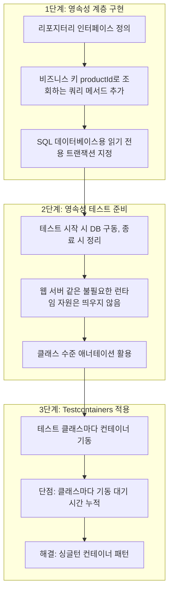
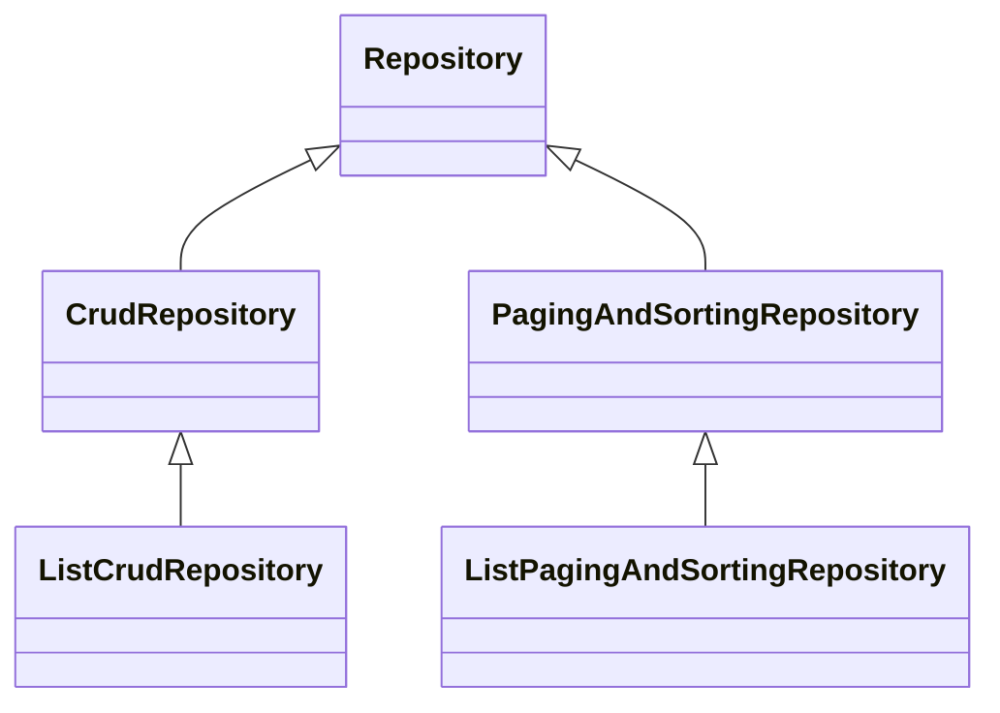
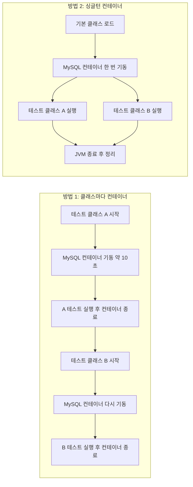
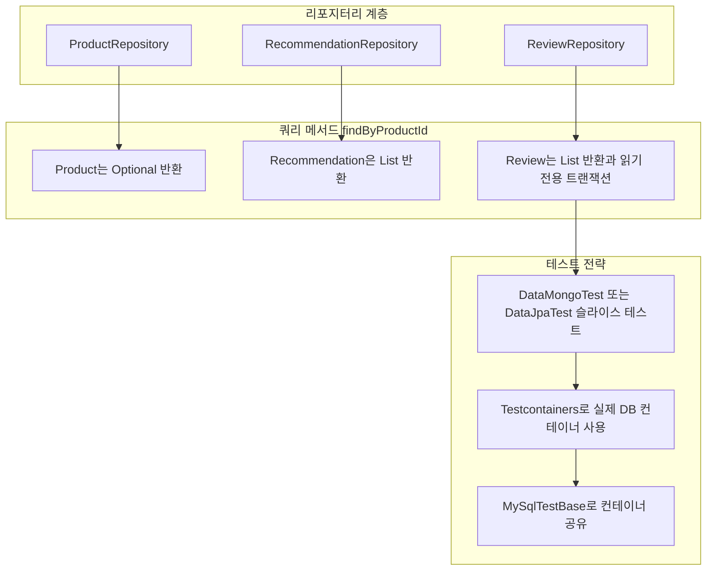

- 대상: 『스프링 부트 3와 스프링 클라우드를 활용한 마이크로서비스 구축』 146~149쪽
- 주제: 스프링 데이터에서 리포지터리 정의하기 → 영속성에 중점을 둔 자동화 테스트 → Testcontainers 사용
- 최신 정보 확인 기준일: 2026-09-29

---

## 0. 이 문서를 읽는 방법

이 문서는 책의 네 페이지에 담긴 내용을 순서대로 풀어 설명하고, 각 대목마다 "지금(2026년 9월 말) 기준으로 달라진 점이 있는가"를 웹 검색으로 확인해 덧붙입니다. 구성은 다음과 같습니다.

- **책이 말하는 내용**: 책에 실제로 적힌 설명과 코드를 그대로 풀어 씁니다.
- **왜 그렇게 되는가**: 스프링 공식 문서와 라이브러리 문서에서 확인한 배경을 설명합니다.
- **최신 동향 보정**: 책이 쓰인 시점 이후에 바뀐 사실을 출처와 함께 정리합니다.

확인되지 않은 내용은 추측으로 채우지 않았습니다. 책의 페이지만으로 확정할 수 없는 부분은 "이 발췌만으로는 알 수 없다"고 명시했습니다.

---

## 1. 전체 그림 먼저 보기

이 네 페이지는 하나의 이야기입니다. 마이크로서비스 세 개(Product, Recommendation, Review)의 **영속성 계층**을 만들고, 그것이 의도대로 동작하는지 **자동화된 테스트**로 검증하되, 데이터베이스는 **Docker 컨테이너**로 띄워서 테스트하자는 흐름입니다.



이 문서의 나머지 부분은 위의 세 단계를 하나씩 자세히 설명합니다.

---

## 2. 스프링 데이터에서 리포지터리 정의하기 (146쪽)

### 2.1 책이 말하는 내용

책은 스프링 데이터가 리포지터리를 정의하기 위한 일련의 인터페이스를 제공한다고 소개하고, 그중 두 가지를 사용하겠다고 밝힙니다.

첫 번째는 `CrudRepository`입니다. 데이터베이스에 저장된 데이터에 대해 생성, 읽기, 갱신, 삭제라는 기본 작업의 표준 메서드를 제공합니다. 두 번째는 `PagingAndSortingRepository`입니다. 이 인터페이스는 앞의 `CrudRepository`에 페이징과 정렬을 지원하는 기능을 더한다고 책은 설명합니다.

이어서 책은 각 서비스에 어떤 인터페이스를 쓸지 정합니다. Recommendation과 Review 리포지터리는 `CrudRepository`를 기반으로 하고, Product 리포지터리는 `PagingAndSortingRepository`를 기반으로 합니다. 그리고 세 리포지터리 모두에 비즈니스 키인 `productId`로 엔티티를 조회하는 추가 쿼리 메서드를 넣겠다고 예고합니다.

여기서 "비즈니스 키"라는 표현에 주목할 필요가 있습니다. 엔티티에는 저장소가 내부적으로 부여하는 기본 키(ID)가 있지만, 마이크로서비스 사이에서 "이 상품에 대한 추천, 이 상품에 대한 리뷰"를 연결하려면 업무적으로 의미 있는 상품 번호가 필요합니다. 그 역할을 하는 것이 `productId`이고, 그래서 기본 키가 아닌 `productId`로 조회하는 메서드를 따로 만들어야 합니다.

### 2.2 최신 동향 보정: 책의 Product 리포지터리가 두 인터페이스를 함께 상속하는 이유

147쪽의 Product 리포지터리 코드를 보면 `PagingAndSortingRepository<ProductEntity, String>`와 `CrudRepository<ProductEntity, String>`를 **둘 다** 상속합니다. 앞서 책은 "PagingAndSortingRepository가 CrudRepository에 페이징과 정렬을 추가한다"고 설명했는데, 코드에서는 굳이 둘을 함께 적은 것입니다. 이 차이는 스프링 데이터 3.0에서 생긴 변경 때문입니다.

스프링 데이터 2022.0(Turing) 릴리스 노트에 따르면, 정렬 계열 리포지터리는 더 이상 대응하는 CRUD 리포지터리를 상속하지 않습니다. 즉 `PagingAndSortingRepository`는 더 이상 `CrudRepository`를 상속하지 않으며, 예전 동작이 필요하면 두 인터페이스를 모두 명시적으로 상속해야 합니다. 이렇게 바꾼 이유는 정렬 지원 기능을 새로 도입된 List 계열 리포지터리와 쉽게 조합하기 위해서라고 릴리스 노트는 밝힙니다. 스프링 공식 블로그도 같은 취지로, 이 변경 덕분에 `PagingAndSortingRepository`를 `CrudRepository`, `ListCrudRepository`, 또는 직접 만든 기반 인터페이스와 자유롭게 결합할 수 있게 되었다고 설명합니다.

따라서 책의 코드가 두 인터페이스를 함께 상속하는 것은 스프링 부트 3(스프링 데이터 3) 기준에서 **필요한 정확한 선언**입니다. 다만 146쪽의 문장("CrudRepository에 기능을 추가한다")은 스프링 데이터 2 시절의 상속 구조를 떠올리게 하는 표현이라는 점을 알고 읽는 것이 좋습니다. 이 점은 책의 오류라기보다, 3.0에서 상속 관계가 바뀐 사실을 알아야 코드와 설명이 맞아떨어진다는 뜻입니다.

현재의 상속 관계는 다음과 같습니다.



두 계열이 `Repository`에서 각각 갈라져 나온다는 점이 핵심입니다. 스프링 데이터 3에서 새로 추가된 `ListCrudRepository`는 `CrudRepository`의 메서드를 그대로 물려받되, `saveAll`, `findAll`, `findAllById`가 `Iterable` 대신 `List`를 돌려줍니다. `ListPagingAndSortingRepository`도 마찬가지로 정렬 조회의 반환형을 `List`로 바꾼 변형입니다.

또 하나 알아 둘 최신 사실이 있습니다. 코드 마이그레이션 도구인 OpenRewrite에는 스프링 데이터 3 이전 코드를 위해 `CrudRepository`를 자동으로 추가해 주는 레시피가 있는데, 2026년 4월에 이 레시피가 "이미 스프링 데이터 3.x를 쓰는 프로젝트에는 불필요하게 손대지 않도록" 수정되었습니다. 이 변경 내용은 "3.0에서 `PagingAndSortingRepository`가 `CrudRepository`를 상속하지 않게 된 것은 설계 의도"라는 점을 다시 확인해 줍니다.

---

## 3. 쿼리 메서드와 세 개의 리포지터리 (147쪽)

### 3.1 메서드 이름으로 쿼리를 만든다

책은 스프링 데이터가 **메서드 서명에 대한 명명 규칙**을 기반으로 쿼리 메서드를 정의하도록 지원한다고 설명합니다. 예로 `findByProductId(int productId)`를 듭니다. 이 서명은 스프링 데이터가 기본 컬렉션이나 테이블에서 엔티티를 반환하는 쿼리를 **자동으로 생성**하게 만듭니다. 이 경우 `productId` 매개변수로 넘긴 값과 같은 `productId` 필드를 가진 엔티티를 반환합니다.

즉 개발자는 SQL도, MongoDB 쿼리도 직접 쓰지 않습니다. 인터페이스에 이름만 규칙대로 선언하면 스프링 데이터가 런타임에 구현을 만들어 줍니다. 자세한 선언 방법은 스프링 데이터 공식 문서의 쿼리 메서드 상세 페이지를 참고하라고 책은 안내합니다.

### 3.2 세 리포지터리 코드 읽기

**Product 리포지터리**는 다음 모양입니다.

```java
public interface ProductRepository extends
    PagingAndSortingRepository<ProductEntity, String>,
    CrudRepository<ProductEntity, String> {

  Optional<ProductEntity> findByProductId(int productId);
}
```

제네릭의 두 번째 인수 `String`은 엔티티의 기본 키 타입입니다. 반환형이 `Optional<ProductEntity>`인 이유를 책은 "이 메서드가 0개 또는 1개의 product 엔티티를 반환할 수 있으므로"라고 설명합니다. 상품은 `productId` 하나에 하나만 존재하므로 결과가 없거나 하나입니다. 그 사실을 반환형으로 드러낸 것입니다.

**Recommendation 리포지터리**는 다음 모양입니다.

```java
public interface RecommendationRepository extends CrudRepository<RecommendationEntity, String> {

  List<RecommendationEntity> findByProductId(int productId);
}
```

한 상품에 대한 추천은 여러 개일 수 있으므로 0개 이상을 담는 `List`를 반환하도록 정의했다고 책은 설명합니다.

**Review 리포지터리**는 다음 모양입니다.

```java
public interface ReviewRepository extends CrudRepository<ReviewEntity, Integer> {

  @Transactional(readOnly = true)
  List<ReviewEntity> findByProductId(int productId);
}
```

Review는 기본 키 타입이 `Integer`이고, 조회 메서드 위에 `@Transactional(readOnly = true)`가 붙어 있습니다. 이 부분은 4장에서 따로 설명합니다.

### 3.3 한눈에 비교

| 리포지터리 | 기반 인터페이스 | 기본 키 타입 | `findByProductId` 반환형 | 반환형을 그렇게 정한 이유(책의 설명) |
|---|---|---|---|---|
| Product | `PagingAndSortingRepository` + `CrudRepository` | `String` | `Optional<ProductEntity>` | 0개 또는 1개 |
| Recommendation | `CrudRepository` | `String` | `List<RecommendationEntity>` | 0개 이상 |
| Review | `CrudRepository` | `Integer` | `List<ReviewEntity>` | (`@Transactional(readOnly = true)` 지정) |

### 3.4 이 발췌만으로는 알 수 없는 것

기본 키 타입이 `String`인 두 리포지터리와 `Integer`인 Review 리포지터리의 차이, 그리고 148쪽에서 `@DataMongoTest`와 `@DataJpaTest`가 나란히 소개되는 점을 함께 보면, Review는 SQL(MySQL) 기반이고 나머지 둘은 다른 종류의 저장소(문서형 저장소)를 쓴다고 **읽힙니다**. 다만 이 네 페이지에는 "Product와 Recommendation이 MongoDB를 쓴다"고 직접 적힌 문장이 없습니다. Review가 SQL 데이터베이스를 쓴다는 것은 148쪽 첫 문장("SQL 데이터베이스가 트랜잭션을 지원하므로")과 149쪽("Review 마이크로서비스의 통합 테스트가 MySQL을 실행하는 도커 컨테이너를 사용")에서 확인됩니다. 나머지 둘의 저장소는 책의 다른 장을 확인해야 확정할 수 있습니다.

---

## 4. 트랜잭션: Review 리포지터리에만 `@Transactional(readOnly = true)`가 붙는 이유 (147~148쪽)

### 4.1 책이 말하는 내용

148쪽 첫머리에서 책은 이렇게 설명합니다. **SQL 데이터베이스는 트랜잭션을 지원하므로**, 쿼리 메서드인 `findByProductId()`에 대해 기본 트랜잭션 유형(예제에서는 읽기 전용)을 지정해야 한다는 것입니다. 그리고 이것으로 핵심 마이크로서비스에 대한 영속성 계층 구축이 끝났다고 말합니다. 리포지터리 클래스의 전체 소스는 각 핵심 마이크로서비스 프로젝트의 `persistence` 패키지에서 볼 수 있습니다.

### 4.2 왜 그렇게 해야 하는가

스프링 데이터 JPA 공식 문서의 "트랜잭션" 항목이 이 부분을 정확히 뒷받침합니다.

`CrudRepository`에서 물려받은 메서드들은 `SimpleJpaRepository`의 트랜잭션 설정을 그대로 물려받습니다. 읽기 작업은 `readOnly` 플래그가 켜져 있고, 그 밖의 작업은 일반 `@Transactional`이 적용됩니다. 그러나 **개발자가 인터페이스에 직접 선언한 쿼리 메서드는 기본적으로 어떤 트랜잭션 설정도 적용되지 않습니다.** 공식 문서는 이런 메서드를 트랜잭션 안에서 실행하려면 리포지터리 인터페이스에 `@Transactional`을 붙이라고 안내하며, 읽기 전용 조회에는 `readOnly = true`를 권장합니다. 읽기 전용으로 표시하면 JDBC 드라이버와 JPA 구현체가 최적화할 수 있는 힌트가 되고, 예를 들어 하이버네이트는 더티 체크를 건너뛰는 방향으로 동작할 수 있다고 문서는 설명합니다.

정리하면, Review 리포지터리의 `findByProductId`는 **개발자가 선언한 쿼리 메서드**이기 때문에 트랜잭션 설정이 자동으로 붙지 않으며, 그래서 책이 명시적으로 `@Transactional(readOnly = true)`를 붙인 것입니다.

### 4.3 최신 동향

이 동작은 스프링 데이터 JPA 공식 문서의 현재 버전 페이지에도 동일하게 기술되어 있습니다. 따라서 이 대목은 2026년 현재도 유효합니다. 참고로 문서의 예제는 개별 메서드가 아니라 리포지터리 인터페이스 자체에 `@Transactional(readOnly = true)`를 붙이고, 갱신 메서드에만 별도로 `@Transactional`을 다시 붙여 덮어쓰는 방식을 보여 줍니다.

---

## 5. 영속성에 중점을 둔 자동화된 테스트 작성 (148쪽)

### 5.1 책이 말하는 내용

책은 영속성 테스트를 작성할 때 바라는 점을 먼저 나열합니다.

- 테스트가 시작될 때 데이터베이스가 구동되고, 테스트가 끝나면 종료되기를 바란다.
- 웹 서버(예: Netty)처럼 런타임에 필요한 **다른 자원**이 구동되기를 기다리게 만들고 싶지 않다.

이 요구사항에 맞춰 스프링 부트가 **클래스 수준 애너테이션 두 개**를 제공한다고 소개합니다.

- `@DataMongoTest`: 테스트가 시작될 때 MongoDB 데이터베이스를 구동한다.
- `@DataJpaTest`: 테스트가 시작될 때 SQL 데이터베이스를 구동한다.

`@DataJpaTest`에는 부연 설명이 붙습니다. 기본적으로 스프링 부트는 다른 테스트에 미치는 부정적인 부수효과의 위험을 최소화하기 위해 SQL 데이터베이스에 대한 업데이트를 **롤백**하도록 테스트를 구성합니다. 그런데 예제의 경우 이런 동작 방식 때문에 일부 테스트가 실패하게 될 것이므로, 클래스 수준 애너테이션 `@Transactional(propagation = NOT_SUPPORTED)`를 사용해 **자동 롤백을 비활성화**한다고 합니다. 책은 왜 일부 테스트가 실패하는지까지는 이 페이지에서 설명하지 않습니다.

### 5.2 왜 "슬라이스 테스트"인가

`@DataJpaTest`와 `@DataMongoTest`는 전체 애플리케이션을 띄우지 않고 **데이터 접근 계층에 필요한 빈만** 구성하는 "슬라이스 테스트" 애너테이션입니다. 웹 서버를 기동하지 않으니 책이 말한 "웹 서버가 구동되기를 기다리게 만들고 싶지 않다"는 요구를 충족합니다.

### 5.3 최신 동향 보정 ① `@DataJpaTest`의 실제 기본 동작

책은 `@DataJpaTest`가 "SQL 데이터베이스를 구동한다"고 요약했지만, 정확히는 다음과 같이 이해하는 편이 안전합니다. 스프링 부트 4.1.1 API 문서 기준으로 `@DataJpaTest`가 붙은 테스트는 기본적으로 다음 두 가지를 합니다.

1. 각 테스트를 **트랜잭션 안에서 실행하고 끝나면 롤백**합니다. (책이 말한 롤백이 바로 이것입니다.)
2. 명시적으로 설정했거나 자동 구성되는 `DataSource`를 **임베디드 인메모리 데이터베이스로 교체**합니다.

이 기본 동작은 `@AutoConfigureTestDatabase`로 바꿀 수 있습니다. 즉 `@DataJpaTest` 혼자서 MySQL 같은 "진짜" 데이터베이스를 띄우는 것은 아닙니다. 기본값으로는 클래스패스에 있는 임베디드 데이터베이스(예: H2)로 바꿔치기하고, 임베디드 데이터베이스가 클래스패스에 없으면 교체에 실패했다는 예외가 발생할 수 있다는 사례도 보고되어 있습니다.

그래서 MySQL 컨테이너 같은 실제 데이터베이스와 함께 쓰려면 `@AutoConfigureTestDatabase(replace = AutoConfigureTestDatabase.Replace.NONE)`를 지정해 "내가 준 데이터 소스를 교체하지 말라"고 알려 주어야 한다고 여러 자료가 공통으로 안내합니다. 책이 149쪽에서 Testcontainers를 소개하기 위해 `@DataJpaTest`가 아닌 `@SpringBootTest`를 예로 든 것도 이 맥락에서 자연스럽습니다.

### 5.4 최신 동향 보정 ② 롤백 비활성화 방법

책의 `@Transactional(propagation = NOT_SUPPORTED)` 처방은 여전히 공식적으로 통용되는 방법입니다. 스프링 프레임워크 테스트 문서는 `@Transactional`이 붙어 있어도 `propagation`이 `NOT_SUPPORTED`나 `NEVER`이면 테스트가 트랜잭션 안에서 실행되지 않는다고 설명합니다. 그러니 이 설정을 하면 테스트가 남긴 데이터가 롤백되지 않고 실제로 커밋됩니다. 이 경우 테스트 사이에 데이터가 남을 수 있으므로, 각 테스트 시작 전에 데이터를 정리하는 습관이 필요합니다.

### 5.5 최신 동향 보정 ③ 스프링 부트 4에서 패키지가 바뀜

2026년 9월 기준 스프링 부트의 안정 버전은 4.x 계열입니다. 6월 기준 안정 버전이 4.1.0이었고, 9월 25일에는 4.2.0-M2 마일스톤이 발표되었습니다. 스프링 부트 3.5는 오픈소스 지원이 2026년 6월 30일에 종료되었습니다. 책의 제목이 스프링 부트 3 기반이므로, 책의 코드를 최신 버전에서 그대로 따라 하면 몇 군데에서 차이가 납니다.

대표적인 것이 테스트 애너테이션의 패키지입니다. 4.x의 API 문서에서 `@DataJpaTest`는 `org.springframework.boot.data.jpa.test.autoconfigure` 패키지에 있습니다. 3.x에서는 `org.springframework.boot.test.autoconfigure.orm.jpa` 패키지였으므로, 애너테이션 이름은 같아도 import 경로는 달라졌습니다. 4.x용 Testcontainers 예제에서도 `AutoConfigureTestDatabase`가 `org.springframework.boot.data.jpa.test.autoconfigure` 아래에서 import되는 것을 확인할 수 있습니다.

---

## 6. Testcontainers 사용 (148~149쪽)

### 6.1 Testcontainers가 무엇인가

책은 Testcontainers를 **데이터베이스나 메시지 브로커 같은 리소스 관리자를 도커 컨테이너로 실행해서 자동화된 통합 테스트 실행을 단순화하는 라이브러리**라고 소개합니다. JUnit 테스트가 시작될 때 도커 컨테이너를 자동으로 시작하고, 테스트가 끝나면 컨테이너를 종료하도록 구성할 수 있습니다.

이 방식의 장점은 "운영과 같은 종류의 데이터베이스"로 테스트할 수 있다는 것입니다. 임베디드 데이터베이스와 실제 MySQL은 SQL 방언이나 동작이 미묘하게 다를 수 있는데, 컨테이너로 진짜 MySQL을 띄우면 그 차이에서 오는 문제를 테스트 단계에서 잡을 수 있습니다.

### 6.2 방법 ①: 테스트 클래스마다 컨테이너 선언

책은 기존 스프링 부트 테스트 클래스에서 Testcontainers를 쓰려면 테스트 클래스에 `@Testcontainers` 애너테이션을 추가하면 된다고 설명합니다. 그리고 `@Container` 애너테이션으로 Review 마이크로서비스의 통합 테스트가 MySQL 도커 컨테이너를 쓰도록 선언할 수 있다며 다음 코드를 보여 줍니다.

```java
class SampleTests {
  @Container
  private static MySQLContainer database = new MySQLContainer("mysql:9.2.0");
```

코드를 한 줄씩 풀면 다음과 같습니다.

- `@SpringBootTest`: 스프링 부트 애플리케이션 컨텍스트를 띄우는 통합 테스트라는 표시입니다.
- `@Testcontainers`: Testcontainers의 JUnit 확장을 활성화합니다. 이 확장이 `@Container`가 붙은 필드를 찾아 시작과 종료를 관리합니다.
- `@Container`와 `static`: 컨테이너를 정적 필드로 선언하면 테스트 클래스 전체에서 한 번 시작되고 클래스가 끝나면 종료됩니다.
- `new MySQLContainer("mysql:9.2.0")`: 어떤 버전의 MySQL 컨테이너를 쓸지 지정합니다.

이 발췌는 컨테이너를 **선언하는 방법**만 보여 줍니다. 컨테이너의 접속 주소를 스프링의 데이터 소스에 연결하는 설정은 이 코드 조각에 없고, 다음 예제(`@ServiceConnection`)에서 등장합니다.

책은 버전 관련 팁도 덧붙입니다. 예제에 지정한 MySQL 9.2.0 버전은 **동일한 버전이 사용되도록 도커 컴포즈 파일에서 복사해 온 것**이라고 합니다. 개발 환경(도커 컴포즈)과 테스트 환경의 데이터베이스 버전을 일치시키려는 의도입니다.

### 6.3 방법 ①의 단점

책은 이 방식의 단점을 분명히 말합니다. **각 테스트 클래스가 자체 도커 컨테이너를 쓴다**는 점입니다. macOS에서는 도커 컨테이너에서 MySQL을 구동하는 데 보통 10초 정도가 걸린다고 하며(이는 책의 경험적 서술이며 환경에 따라 다를 수 있습니다), 같은 유형의 테스트 컨테이너를 쓰는 테스트 클래스가 여러 개면 그 대기 시간이 클래스마다 더해집니다.

### 6.4 방법 ②: 싱글턴 컨테이너 패턴

이 대기 시간을 피하기 위해 책은 **싱글턴 컨테이너 패턴**을 제안합니다. 공통 기본 클래스에서 컨테이너를 한 번만 띄우고, 모든 테스트 클래스가 그 기본 클래스를 상속받아 같은 컨테이너를 공유하는 방식입니다. Review 마이크로서비스에서 쓰는 기본 클래스 `MySqlTestBase`는 다음과 같습니다.

```java
public abstract class MySqlTestBase {

  @ServiceConnection
  static final JdbcDatabaseContainer database =
    new MySQLContainer("mysql:9.2.0").withStartupTimeoutSeconds(300);

  static {
    database.start();
  }
}
```

코드를 부분별로 풀어 보겠습니다.

- `public abstract class`: 직접 실행하는 테스트가 아니라 **상속용 기본 클래스**입니다.
- `static final ... database`: 정적이고 변경 불가능한 필드이므로 JVM 안에서 하나의 컨테이너 인스턴스만 존재합니다.
- `@ServiceConnection`: 스프링 부트가 이 컨테이너의 접속 정보를 읽어 데이터 소스 설정을 **자동으로 구성**하게 하는 애너테이션입니다. 스프링 부트 공식 문서는 이 애너테이션이 컨테이너 종류에 맞는 접속 정보 빈을 자동으로 정의하고, 그것이 자동 구성에 쓰이면서 관련 설정 프로퍼티를 덮어쓴다고 설명합니다. 사용하려면 `spring-boot-testcontainers` 모듈을 테스트 의존성으로 추가해야 합니다. 이 기능은 스프링 부트 3.1에서 도입되었고, 그 이전에는 `@DynamicPropertySource`로 URL, 사용자명, 비밀번호를 직접 등록해야 했습니다.
- `withStartupTimeoutSeconds(300)`: 컨테이너가 준비될 때까지 최대 300초까지 기다리라는 설정입니다. 컨테이너가 느리게 뜨는 환경에서 시간 초과로 실패하는 것을 막습니다.
- `static { database.start(); }`: 클래스가 로드될 때 컨테이너를 **수동으로 시작**하는 정적 초기화 블록입니다. 이 클래스를 상속하는 테스트가 처음 로드될 때 한 번만 실행됩니다.

Testcontainers 공식 문서도 동일한 패턴을 설명합니다. 싱글턴 컨테이너는 기본 클래스가 로드될 때 한 번만 시작되며, 그 클래스를 상속하는 모든 테스트 클래스가 컨테이너를 공유합니다. 종료는 개발자가 명시적으로 하지 않으며, Ryuk 컨테이너가 JVM 종료 후 컨테이너를 정리합니다.

이 패턴에서 `@Testcontainers`와 `@Container`를 쓰지 않는다는 점이 중요합니다. 도커(Docker)의 Testcontainers 가이드는 싱글턴 컨테이너를 만든 기본 클래스에 `@Testcontainers`와 `@Container`를 함께 붙이는 것을 흔한 잘못된 구성으로 꼽으며, 그렇게 하면 컨테이너가 테스트 클래스가 끝날 때마다 중지된다고 경고합니다. 책의 `MySqlTestBase`가 정적 초기화 블록에서 직접 `start()`를 호출하는 이유가 여기에 있습니다.

### 6.5 두 방식의 차이를 그림으로 보기



### 6.6 최신 동향 보정 ① Testcontainers 2.x

Testcontainers는 2025년 10월에 2.0이 나왔고, 2026년 7월에 발행된 글에서는 2.0.5 버전 의존성이 예시로 쓰이고 있어 2.0.x 계열이 이어지고 있습니다. 2.0의 주요 변경은 다음과 같습니다.

- **JUnit 4 지원 제거**: 2.0부터는 JUnit 4를 지원하지 않습니다.
- **아티팩트 이름 변경**: 모든 모듈 이름 앞에 `testcontainers-`가 붙었습니다. 예를 들어 `org.testcontainers:mysql`은 `org.testcontainers:testcontainers-mysql`이 되었습니다. MySQL 모듈 공식 페이지의 의존성 예시도 `testcontainers-mysql` 2.0.1로 안내합니다.
- **컨테이너 클래스 패키지 이동**: 컨테이너 클래스가 `org.testcontainers.<모듈명>` 패키지로 옮겨졌습니다. 예를 들어 `MySQLContainer`는 `org.testcontainers.mysql` 아래에 있습니다.
- **제네릭 축소**: 한 글은 2.x가 API의 제네릭을 줄였다고 정리합니다. 1.x의 `MySQLContainer<SELF extends MySQLContainer<SELF>>` 같은 자기 참조 제네릭이 그 예이며, 2.x 예제들은 `new PostgreSQLContainer("postgres:16-alpine")`처럼 꺾쇠 없이 씁니다.

마이그레이션은 OpenRewrite의 `Testcontainers2Migration` 레시피로 대부분 자동화할 수 있다고 해당 글과 문서가 안내합니다.

책의 코드에는 Testcontainers 버전이 명시되어 있지 않으므로, 책의 예제를 2.x 프로젝트에서 그대로 옮기면 **import 경로와 의존성 이름이 달라서** 컴파일이 되지 않을 수 있습니다. 책의 `JdbcDatabaseContainer`, `withStartupTimeoutSeconds` 같은 세부 API가 2.x에서 어떻게 되어 있는지는 이번 검색에서 개별적으로 확인하지 못했으므로, 2.x로 옮길 때는 공식 문서에서 해당 클래스와 메서드를 직접 확인하기를 권합니다.

### 6.7 최신 동향 보정 ② `@ServiceConnection`과 슬라이스 테스트

`@ServiceConnection`은 `@SpringBootTest`뿐 아니라 `@DataJpaTest`와도 쓸 수 있습니다. 젯브레인스의 2024년 12월 글은 `@DataJpaTest`, `@Testcontainers`, `@Container`, `@ServiceConnection`을 함께 쓰는 예제를 보여 주며, `@DynamicPropertySource` 없이도 데이터 소스가 컨테이너를 가리키게 된다고 설명합니다. 다만 앞서 5.3에서 말했듯이 `@DataJpaTest`와 함께 쓸 때는 `@AutoConfigureTestDatabase(replace = NONE)`가 필요하다는 안내가 여러 곳에서 일관되게 나옵니다.

### 6.8 최신 동향 보정 ③ 책의 MySQL 9.2.0 버전은 지금 어떤 위치인가

책이 고른 MySQL 9.2.0은 2026년 9월 기준으로 **오래된 Innovation 릴리스**입니다. 오라클의 MySQL 문서는 9.1.0 Innovation이 9.2.0으로 업그레이드되는 것을 예로 들며 9.2.0이 Innovation 트랙 릴리스임을 보여 줍니다. Innovation 릴리스는 다음 릴리스가 나올 때까지만 지원되므로 계속 업그레이드해야 합니다.

현재 상황은 다음과 같이 확인됩니다.

- MySQL 9.7이 9.x 계열의 첫 LTS이며 2026년 4월에 나왔습니다. LTS는 5년의 프리미어 지원과 3년의 확장 지원을 받습니다.
- 9.7은 순차 버전 체계를 쓰는 마지막 릴리스 라인이며, 이후 릴리스는 `YY.M` 형식의 달력 버전을 씁니다. 2026년 7월 릴리스가 MySQL 26.7입니다.
- MySQL 8.0은 2026년 4월 8.0.46을 끝으로 수명이 종료되었습니다. 8.4 LTS는 계속 지원됩니다.

따라서 책의 원칙(개발용 도커 컴포즈와 테스트 컨테이너의 MySQL 버전을 일치시킨다)은 그대로 유효하지만, 새로 시작하는 프로젝트라면 구체적인 버전 값은 LTS 계열 중에서 운영 환경과 맞춰 정하는 것이 좋습니다. 어떤 버전이 가장 좋은지는 운영 환경 조건에 달려 있으므로 여기서 특정 버전을 단정하지는 않습니다.

---

## 7. 네 페이지를 하나로 묶어 보기

책이 세운 구조를 한 장의 흐름으로 정리하면 다음과 같습니다.



---

## 8. 실무에서 기억해 둘 점

**첫째, 상속 구조를 코드로 확인하세요.** 스프링 데이터 3 이후에는 `PagingAndSortingRepository`만 상속하면 `save`, `findById` 같은 CRUD 메서드가 없습니다. 책의 Product 리포지터리처럼 CRUD 인터페이스를 함께 상속해야 합니다.

**둘째, 직접 선언한 쿼리 메서드에는 트랜잭션이 자동으로 붙지 않습니다.** SQL 저장소를 쓴다면 `@Transactional(readOnly = true)`를 인터페이스나 메서드에 붙여야 한다는 것이 스프링 데이터 JPA 공식 문서의 설명입니다.

**셋째, `@DataJpaTest`의 기본값은 임베디드 DB와 롤백입니다.** 실제 MySQL 컨테이너와 쓰려면 교체를 끄고(`Replace.NONE`), 롤백 때문에 테스트가 어긋나면 `NOT_SUPPORTED`로 롤백을 끕니다. 롤백을 끄면 데이터가 남으므로 정리 전략이 필요합니다.

**넷째, 컨테이너를 공유하려면 수명 관리 방식을 섞지 마세요.** 싱글턴 패턴의 기본 클래스에는 정적 초기화 블록에서 `start()`를 부르고, `@Testcontainers`/`@Container`를 함께 붙이지 않습니다.

**다섯째, 새 프로젝트라면 버전 축을 먼저 확인하세요.** 스프링 부트 4.x, Testcontainers 2.x, MySQL LTS 계열에서는 책의 예제와 import 경로, 의존성 이름, 애너테이션 패키지가 다를 수 있습니다.

---

## 9. 용어 정리

| 용어 | 뜻 |
|---|---|
| 리포지터리 | 데이터 저장소에 접근하는 계층을 인터페이스로 추상화한 것. 스프링 데이터가 구현을 자동 생성함 |
| 비즈니스 키 | 업무적으로 의미가 있는 식별자. 이 책에서는 `productId` |
| 쿼리 메서드 | 메서드 이름 규칙으로 쿼리를 자동 생성하는 메서드. 예: `findByProductId` |
| 슬라이스 테스트 | 애플리케이션 전체가 아닌 특정 계층에 필요한 빈만 올리는 테스트 |
| 롤백 | 트랜잭션 중 변경한 내용을 되돌리는 것 |
| Testcontainers | 테스트 중에 도커 컨테이너로 DB 등 외부 자원을 띄우고 종료해 주는 라이브러리 |
| 싱글턴 컨테이너 패턴 | 공통 기본 클래스에서 컨테이너를 한 번만 띄워 여러 테스트 클래스가 공유하는 방식 |
| `@ServiceConnection` | 컨테이너의 접속 정보를 스프링 부트가 자동으로 연결해 주는 애너테이션 (스프링 부트 3.1 도입) |
| Ryuk | Testcontainers가 JVM 종료 후 남은 컨테이너를 정리하도록 쓰는 보조 컨테이너 |
| LTS | 장기 지원 릴리스 |

---

## 10. 참고한 자료

- 스프링 데이터 2022.0(Turing) 릴리스 노트: https://github.com/spring-projects/spring-data-commons/wiki/Spring-Data-2022.0-(Turing)-Release-Notes
- Announcing ListCrudRepository & Friends for Spring Data 3.0 (스프링 블로그): https://spring.io/blog/2022/02/22/announcing-listcrudrepository-friends-for-spring-data-3-0/
- OpenRewrite `MigratePagingAndSortingRepository` 레시피: https://docs.openrewrite.org/recipes/java/spring/data/migratepagingandsortingrepository
- rewrite-spring PR #996 (2026-04-10 병합): https://github.com/openrewrite/rewrite-spring/pull/996
- Spring Data JPA 트랜잭션 문서: https://docs.spring.io/spring-data/jpa/reference/jpa/transactions.html
- Spring Boot `@DataJpaTest` API 문서(4.1.1): https://docs.spring.io/spring-boot/api/java/org/springframework/boot/data/jpa/test/autoconfigure/DataJpaTest.html
- Spring Framework 테스트 트랜잭션 문서: https://docs.spring.io/spring/reference/6.0-SNAPSHOT/testing/testcontext-framework/tx.html
- Spring Boot Testcontainers 참조 문서(v4.0.6): https://github.com/spring-projects/spring-boot/blob/v4.0.6/documentation/spring-boot-docs/src/docs/antora/modules/reference/pages/testing/testcontainers.adoc
- Testing Spring Boot Applications Using Testcontainers (JetBrains Blog, 2024-12): https://blog.jetbrains.com/idea/2024/12/testing-spring-boot-applications-using-testcontainers/
- Testcontainers 수동 수명 주기 제어(싱글턴 컨테이너): https://java.testcontainers.org/test_framework_integration/manual_lifecycle_control/
- Singleton containers pattern (Docker 가이드): https://docs.docker.com/guides/testcontainers-java-lifecycle/singleton-containers/
- Testcontainers MySQL 모듈: https://testcontainers.com/modules/mysql/
- TestContainers 2 — an upgrade that's well worth it (doubleSlash, 2026-07): https://blog.doubleslash.de/en/software-technologien/coding-and-frameworks/testcontainers-2-an-upgrade-worth-it/
- OpenRewrite Testcontainers 2 마이그레이션: https://docs.openrewrite.org/recipes/java/testing/testcontainers/testcontainers2migration
- Spring Boot 4.0 릴리스 노트: https://github.com/spring-projects/spring-boot/wiki/Spring-Boot-4.0-Release-Notes
- Spring 블로그 릴리스 목록(Spring Boot 4.2.0-M2, 2026-09-25): https://spring.io/blog/category/releases/
- HeroDevs, Spring Boot 버전과 EOL: https://www.herodevs.com/blog-posts/spring-boot-versions-eol-dates-and-latest-releases-april-2026
- MySQL 릴리스 모델(Innovation과 LTS): https://dev.mysql.com/doc/refman/26.7/en/mysql-releases.html
- MySQL 8.0 릴리스 노트(EoL 안내): https://docs.oracle.com/cd/E17952_01/mysql-8.0-relnotes-en
- MySQL 수명 주기 정리(endoflife.date): https://endoflife.date/mysql

---

작성 일자: 2026-09-29
