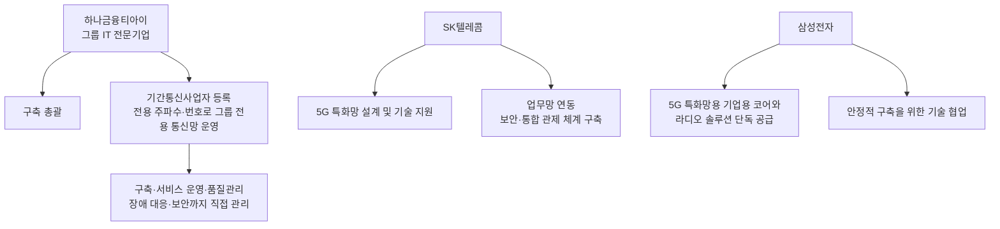
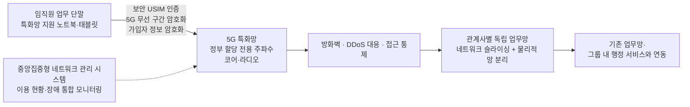
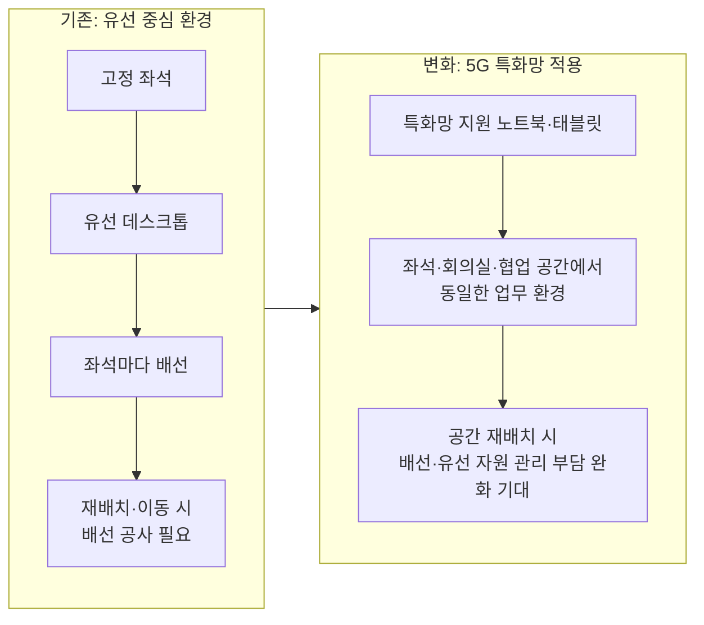
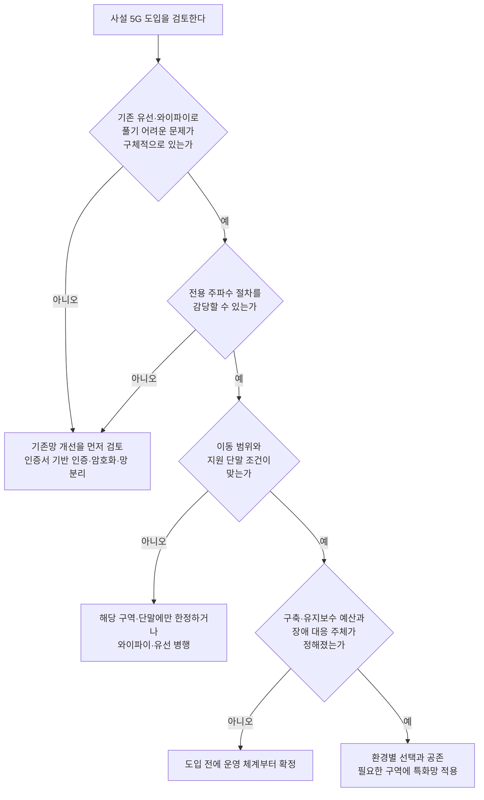

- 작성 기준일: 2026년 9월 29일
- 이 문서는 Threads 게시글의 주장과 댓글 대화를 발표 자료, 언론 보도, 제도 문서, 벤더 기술 자료와 대조해 정리했습니다. 출처로 뒷받침되지 않는 내용은 "확인되지 않음"으로 표시했고, 필자의 점검 제안은 "제안"이라고 밝혔습니다. 벤더(장비·솔루션 회사)가 낸 자료는 그 사실을 별도로 적었습니다.

---

## 0. 먼저 결론부터

2026년 9월 28일, SK텔레콤과 하나금융그룹이 하나금융티아이, 삼성전자와 함께 인천 청라국제도시의 하나금융그룹 청라 헤드쿼터에 5G 특화망 기반 스마트오피스를 구축하고 운영에 들어갔다고 밝혔습니다. 대상은 지하 1층부터 지상 15층까지 16개 층, 10개 관계사, 임직원 약 3,000명입니다. 발표 주체들은 이것을 "금융권 최초"라고 소개했습니다.

이 소식에서 눈여겨볼 대목은 속도가 아닙니다. 발표문이 강조하는 것은 유선 케이블과 고정 좌석에 묶여 있던 금융권 업무 환경을, 보안 요건을 지키면서 무선으로 풀어냈다는 점입니다. 게시글의 글쓴이도 같은 관점에서, 이 사례를 "와이파이는 보안이 약해서 5G로 바꿨다"로 읽으면 핵심을 놓친다고 말합니다. 기업용 와이파이도 인증서 기반 인증, 암호화, 망 분리를 갖출 수 있으므로 보안은 무선 기술의 이름이 아니라 설계에서 결정된다는 논리입니다.

그래서 글쓴이는 사설 5G가 회사 와이파이를 전부 대체하기보다는, 전용 주파수의 필요성, 이동 범위, 지원 단말, 구축·운영 비용에 따라 환경별로 선택되고 공존할 것이라고 봅니다. 그리고 네트워크 개발자로서 궁금한 것은 이동 중 세션 유지, 장애 복구, 인증된 단말의 권한 통제이며, 앞으로 쌓일 운영 데이터가 이 선택의 가치를 보여줄 것이라고 마무리합니다.

이 문서는 그 논리를 하나씩 풀어 설명하고, 어디까지가 공식 자료로 확인되는 사실이고 어디부터가 아직 공개되지 않은 영역인지를 구분해 보여드립니다.

---

## 1. 무슨 일이 있었나

### 1-1. 발표의 뼈대

SK텔레콤은 28일 보도자료에서 하나금융그룹, 삼성전자와 함께 5G 특화망 기반 스마트오피스를 구축하고 본격 운영에 들어간다고 밝혔습니다. 하나금융 측도 같은 날 하나금융티아이가 SK텔레콤, 삼성전자와 함께 5G 특화망을 실제 업무망에 적용한 그룹 공동 스마트오피스를 구축했다고 발표했습니다.

대상 건물은 이달부터 단계적으로 이전이 진행 중인 하나금융그룹 청라 헤드쿼터입니다. 이 건물은 올해 준공되었고, 9월부터 하나금융지주와 하나은행 등 10개 관계사 임직원이 순차적으로 입주하고 있습니다. 5G 특화망은 이 건물의 업무·공용 공간 16개 층(지하 1층~지상 15층)에 적용되며, 이용 인원은 약 3,000명입니다.

핵심 변화는 기존의 유선 중심 업무 환경을, 좌석과 유선 연결의 제약 없이 일할 수 있는 하이브리드 업무 환경으로 바꾸는 것입니다. 직원들은 5G 특화망을 지원하는 노트북, 태블릿 같은 업무용 단말로 자기 좌석은 물론 회의실과 협업 공간에서도 같은 업무 환경에 접속합니다. 기존 업무망 및 그룹 내 행정 서비스와도 연동해, 새 환경으로 넘어갈 때 생길 수 있는 불편을 줄였다고 합니다.

### 1-2. 누가 무엇을 맡았나

세 주체의 역할은 발표 자료와 보도에 다음과 같이 나뉘어 있습니다.

여기서 주목할 점이 하나 있습니다. 하나금융티아이가 기간통신사업자 등록을 마치고, 과학기술정보통신부에서 할당받은 전용 주파수와 번호로 그룹 전용 통신망의 전 과정을 직접 관리한다는 보도입니다. 즉 통신사가 대신 운영해 주는 구조가 아니라, 그룹 IT 자회사가 통신망 사업자의 자격까지 갖춰 운영 책임을 지는 구조로 발표되었습니다. 이 점은 뒤의 댓글 대화에서 나오는 "장애 대응 주체"라는 화두와 정확히 맞닿아 있습니다.

### 1-3. 망은 어떤 구조로 발표되었나

발표된 구성 요소를 개념적으로 배치하면 아래와 같습니다. 이 그림은 발표된 요소를 이해하기 쉽게 늘어놓은 개념도이며, 실제 장비 배치나 세부 토폴로지가 공개된 것은 아닙니다.

발표된 보안 요소를 쉬운 말로 풀면 다음과 같습니다.

- **전용 주파수**: 정부(과학기술정보통신부)로부터 하나금융그룹이 할당받은 주파수를 씁니다. 일반 통신사의 공용망과 섞이지 않고, 외부 통신망과 분리된 무선 환경이라고 발표되었습니다.
- **보안 USIM 기반 인증**: 통신용 칩(USIM)에 든 정보로 단말과 사용자를 확인해, 등록된 업무 단말과 사용자만 접속하도록 했습니다. 비밀번호만 아는 누군가가 아무 기기로 붙는 방식과 다릅니다.
- **구간별 암호화**: 5G 무선 구간과 가입자 정보를 각각 암호화했습니다.
- **방화벽, DDoS 대응, 접근 통제**: 망 전 구간에 겹겹이 적용했다고 합니다.
- **관계사별 독립 업무망**: 네트워크 슬라이싱(하나의 물리 인프라 위에 논리적으로 분리된 망을 만드는 기술)과 물리적 망 분리 기술을 활용해, 10개 관계사가 각자의 보안 정책과 업무 특성에 맞게 운영하도록 했습니다.

또한 SK텔레콤은 향후 AI 기반 업무 서비스와 데이터 활용이 늘어날 것을 대비해 확장성을 고려했다고 밝혔습니다. 스마트빌딩, 지능형 출입통제, AI CCTV, 모바일 사원증, 업무용 AI 서비스 등과 연계할 수 있도록 설계했다는 설명입니다.

### 1-4. 왜 이런 시도를 했나

SK텔레콤의 설명에 따르면 금융권은 엄격한 보안과 망 분리 요건 때문에 고정 좌석과 유선 데스크톱 중심의 업무 환경을 유지할 수밖에 없었습니다. 그 결과 사무실 자리를 재배치할 때마다 배선 공사가 필요했고, 직원이 회의실이나 프로젝트 공간으로 옮겨 가며 일하는 데에도 제약이 있었습니다.

하나금융은 프로젝트 구성원이 한 공간에 모여 실시간으로 협업하고 조직 변화에 따라 사무 공간을 유연하게 재배치할 수 있다는 점을 기대 효과로 꼽았습니다. 하나금융티아이 대표는 금융보안 규제를 준수하면서 공간의 제약 없이 소통하고 협업할 수 있는 환경이라고 설명했습니다. SK텔레콤은 이를 자사가 추진하는 엔터프라이즈 AX 전략의 대표 사례로 내세웠는데, AI와 데이터를 실제 업무에 폭넓게 쓰려면 임직원이 어디서든 안전하고 안정적으로 사내 시스템에 접속할 수 있는 네트워크 기반이 필수라는 논리입니다.

여기서 "기대"라는 단어에 주의가 필요합니다. 배선 공사 부담 완화나 협업 활성화는 발표 시점에서 기대 효과로 제시된 것이지, 운영 후 측정된 성과가 아닙니다.

**참고: 망 분리란 무엇인가.** 금융권에서 말하는 망 분리는 업무 시스템이 있는 내부 통신망을 인터넷 같은 외부 통신망과 분리·차단하는 제도입니다. 발표문은 이 망 분리 요건이 유선·고정 좌석 중심 환경을 낳았다고 설명하지만, 어떤 조항이 무선 사용을 막았는지까지 구체적으로 짚지는 않았습니다. 한편 2026년 4월에는 금융당국이 내부 업무망에서 클라우드 기반 소프트웨어(SaaS)를 쓸 수 있도록 망 분리 예외를 제도화하는 시행세칙 개정을 발표했는데, 이는 SaaS 이용에 관한 별도의 규제 개선입니다. 이번 5G 특화망 사례가 그 개정과 연결되어 있다고 발표된 바는 없습니다.

### 1-5. 하나금융타운이라는 배경

청라 헤드쿼터는 하나금융이 인천 청라국제도시에서 추진해 온 "하나금융타운" 프로젝트의 완성판으로 소개되었습니다.

건물을 새로 지어 이전하는 시점에 망을 처음부터 설계할 수 있었다는 점은, 이미 배선이 깔린 기존 사옥에 사설 5G를 덧붙이는 것과 조건이 다르다는 뜻이기도 합니다. 다만 이 점을 발표문이 직접 설명한 것은 아니며, 신축·이전 시점에 구축했다는 사실 자체가 확인되는 부분입니다.

---

## 2. 용어부터 정리: 5G 특화망(이음5G)이란

### 2-1. 통신사 5G와 무엇이 다른가

게시글이 "휴대전화로 접속하는 일반 통신사 5G와는 다르다"고 말하는 부분입니다. 5G 특화망은 기업이나 기관이 전용 주파수를 활용해 특정 공간에 구축하는 맞춤형 5G 네트워크입니다. 정부 자료 기준으로 일반 5G 이동통신은 소수 사업자가 대규모 투자로 전국 단위 망을 구축해 서비스하는 데 비해, 5G 특화망은 다수 사업자가 토지·건물 같은 제한된 구역에 소규모로 구축할 수 있다는 점이 다릅니다. 정부는 이 특화망에 "이음(e-Um) 5G"라는 이름을 붙였습니다. 나와 우리, 사물과 사회까지 이어 준다는 뜻이 담겨 있습니다.

### 2-2. 어떤 주파수를 쓰나

과학기술정보통신부는 2021년에 5G 특화망용으로 두 대역을 공급하기로 했습니다. 하나는 4.7GHz 대역 100MHz 폭(4.72~4.82GHz)이고, 다른 하나는 28GHz 대역 600MHz 폭(28.9~29.5GHz)입니다. SK텔레콤 보도자료의 설명도 특화망 전용 주파수로 4.7GHz와 28GHz를 언급합니다. 다만 하나금융이 이 가운데 어느 대역을 쓰는지는 확인한 자료에 명시되어 있지 않습니다.

### 2-3. 주파수는 어떻게 받나

주파수를 받는 길은 크게 두 가지입니다. 기간통신사업자로 등록해 다른 기업에 특화망 서비스를 제공하려면 "할당" 방식으로, 자기 업무용 자가망을 직접 구축하려면 "지정" 방식으로 공급받습니다. 할당 방식은 경매가 아니라 정부가 산정한 대가를 내는 방식이고, 대가는 토지·건물의 면적을 기준으로 산정됩니다. 이용 기간은 제도 설계 당시 2년에서 5년 사이에서 신청 기업이 고를 수 있게 되어 있었습니다.

하나금융티아이가 기간통신사업자 등록을 마치고 할당받은 전용 주파수와 번호를 쓴다는 보도 내용은, 위 두 방식 중 "기간통신사업자 등록"을 전제로 하는 쪽의 조건과 일치합니다. 다만 공식 자료가 이를 어떤 유형으로 부르는지는 명시하지 않았습니다.

### 2-4. 얼마나 퍼져 있나

한국방송통신전파진흥원(KCA) 자료에 따르면 2024년 말 기준 5G 특화망 공급 현황은 37개 시설자, 82개소입니다. 정부는 2022년에 2030년까지 5G 특화망 1,000개소 구축을 목표로 제시한 바 있습니다. 즉 제도 도입 5년 안팎으로 수십 곳이 구축된 초기 시장이며, 기업용 사무실 무선망으로 쓰는 사례는 이번처럼 눈에 띄는 발표가 나오는 단계입니다. 앞서 사례로는 네이버 제2사옥(로봇 운영), 성균관대 스마트캠퍼스(2025년 개통) 같은 곳이 있습니다.

### 2-5. 핵심 용어 사전

| 용어 | 쉬운 설명 |
|---|---|
| 5G 특화망(이음5G) | 특정 건물·구역에서 전용 주파수로 운영하는 기업·기관 전용 5G 망 |
| 코어(Core) | 가입자 인증, 세션 관리, 트래픽 경로 제어를 맡는 망의 두뇌 부분 |
| 라디오(RAN) | 단말과 무선으로 직접 통신하는 기지국 장비 |
| USIM | 가입자 식별·인증 정보를 담은 통신용 칩 |
| 네트워크 슬라이싱 | 하나의 물리 인프라 위에 서로 격리된 논리 망을 나누어 만드는 기술 |
| 핸드오버 | 이동하는 단말이 한 기지국에서 다른 기지국으로 끊김 없이 연결을 넘기는 과정 |
| 기간통신사업자 | 통신 회선 설비를 갖추고 통신 서비스를 제공하기 위해 정부에 등록하는 사업자 |

---

## 3. 게시글의 논리를 하나씩 읽기

### 3-1. "눈여겨볼 부분은 속도보다 업무망의 변화다"

5G라고 하면 빠른 속도를 먼저 떠올리기 쉽습니다. 그런데 확인한 SK텔레콤 보도자료와 언론 보도에는 처리 속도나 지연 시간 같은 성능 수치가 등장하지 않습니다. 발표의 중심은 유선 배선과 고정 좌석의 제약을 없애는 것, 관계사별로 분리된 업무망을 무선으로 제공하는 것, 그리고 이를 금융 보안 요건 안에서 해내는 것입니다. 글쓴이가 "속도"가 아니라 "업무망의 변화"를 보라고 한 것은 발표 내용과 부합합니다.

### 3-2. "와이파이는 보안이 약해서 5G로 바꿨다"가 왜 틀린 요약인가

이 부분이 게시글의 가장 중요한 교정입니다. 게시글이 출처로 든 시스코의 2025년 12월 글은 기업 무선 보안이 무선 규격 이름 하나로 끝나지 않는다고 설명합니다. 이 글이 제시하는 요소는 다음과 같습니다.

- **인증**: 단순한 MAC 주소 필터링은 위조가 쉬워 부족하고, 802.1X 인증과 TLS 기반 EAP 방식으로 단말과 네트워크가 X.509 인증서로 서로를 증명하는 상호 인증이 필요하다는 설명입니다.
- **암호화**: WPA3를 지원하며, WPA3-Enterprise-192 같은 강화된 모드와 인증·해제 공격을 막는 관리 프레임 보호(PMF)를 언급합니다.
- **분리·통제**: 컨트롤러와 신원 서비스 엔진을 연동해 동적 VLAN 배정, 접근 제어 목록, 보안 그룹 태그로 단말을 격리하는 예를 듭니다.
- **탐지와 운영**: 무선 침입 방지 시스템으로 가짜 AP 같은 위협을 찾고, 펌웨어 패치와 인증서 만료 관리를 게을리하지 말라고 강조합니다.

다시 말해 기업용 와이파이도 인증서 기반 인증, 암호화, 망 분리를 갖출 수 있다는 게시글의 주장은 이 자료로 뒷받침됩니다. 다만 이 글은 시스코의 제품 마케팅 담당자가 쓴 것이라, 자사 솔루션이 가능하게 하는 범위를 보여주는 자료이지 5G와의 중립적 비교 자료는 아닙니다. 같은 글도 와이파이가 전파를 넓게 퍼뜨리는 특성상 가짜 AP 같은 공격 표면이 있다는 점을 인정합니다.

반대편도 마찬가지입니다. 사설 5G를 소개하는 벤더 자료들은 USIM 기반 인증과 면허 주파수 사용을 강점으로 내세웁니다. 하지만 하나금융 사례를 보면 USIM 인증 하나로 끝내지 않고, 무선 구간 암호화, 가입자 정보 암호화, 방화벽, DDoS 대응, 접근 통제, 관계사별 망 분리를 함께 얹었습니다. 즉 5G든 와이파이든 보안은 이름이 아니라 겹겹이 쌓은 설계의 결과라는 점에서 글쓴이의 시각과 발표 내용이 일관됩니다.

### 3-3. "전면 대체보다 환경에 따른 선택과 공존"

글쓴이는 사설 5G가 회사 와이파이를 모두 대체하지는 않을 것이며, 판단 기준으로 네 가지를 듭니다. 전용 주파수의 필요성, 이동 범위, 지원 단말, 구축·운영 비용입니다. 이 기준을 자료와 대조하면 다음과 같습니다.

**전용 주파수의 필요성.** 5G 특화망은 정부에서 주파수를 할당·지정받는 절차와, 할당 방식이라면 기간통신사업자 등록이 필요합니다. 하나금융티아이도 기간통신사업자 등록을 마쳤다고 보도되었습니다. 반면 와이파이는 비면허 대역을 쓰므로 이런 절차 없이 쓸 수 있습니다. 이 차이가 곧 도입의 문턱이 됩니다.

**이동 범위.** 벤더 자료들은 사설 5G가 출력이 커서 더 적은 무선 장비로 넓은 면적을 덮고, 이동 중 연결 전환을 망이 주도한다고 설명합니다. 반대로 와이파이는 단말이 스스로 어느 AP로 옮길지 결정하는 구조라고 소개합니다. 이런 주장은 로봇이나 지게차처럼 계속 움직이는 장비에서 특히 강조됩니다. 다만 이 설명은 장비·솔루션 회사가 낸 자료이고, 와이파이에도 로밍을 돕는 표준(802.11k/v/r)이 있어 실제 체감은 구성에 따라 달라집니다. 사무실처럼 이동이 사람 걸음 수준인 환경에서 이 차이가 얼마나 체감되는지는 별개의 검증이 필요합니다.

**지원 단말.** 하나금융 사례에서도 접속 대상은 "5G 특화망을 지원하는" 노트북과 태블릿입니다. 일반 와이파이 노트북이나 스마트폰이 그대로 붙는 것이 아닙니다. 2024년 말 전자신문 보도에서도 업계 관계자들이 특화망 활성화를 위해 지원 단말 확대와 이동성 제공을 정부에 요청했습니다. 단말 생태계는 지금도 도입의 제약 조건이라는 뜻입니다.

**구축·운영 비용.** 비용은 뒤의 4장에서 따로 다룹니다. 하나금융의 투자 규모는 확인한 자료에서 공개되지 않았습니다.

정리하면 다음과 같이 비교할 수 있습니다. 표의 5G·와이파이 특성 중 일부는 벤더 자료에 근거한 일반론이라, 개별 환경에서는 달라질 수 있습니다.

| 항목 | 기업용 와이파이 | 5G 특화망(이음5G) |
|---|---|---|
| 주파수 | 비면허 대역(2.4·5·6GHz)을 공유 | 정부가 할당·지정한 전용 주파수 |
| 인증 | 802.1X와 인증서 기반 인증 구성 가능 | USIM 기반 인증(하나금융은 보안 USIM 적용) |
| 암호화 | WPA3 계열 | 무선 구간·가입자 정보 암호화(하나금융 발표) |
| 이동 시 연결 전환 | 단말 주도 로밍이 일반적(보조 표준 존재) | 망 주도 핸드오버라는 것이 벤더 설명 |
| 단말 | 거의 모든 단말 사용 가능 | 특화망 지원 단말 필요 |
| 도입 절차 | 별도 주파수 절차 없음 | 주파수 할당·지정 절차, 할당 방식은 사업자 등록 필요 |
| 운영 주체 | 기업 IT 조직 | 하나금융 사례는 그룹 IT 자회사가 직접 관리 |

산업용 네트워크 솔루션 업체의 비교 글도 대부분의 기업이 둘 중 하나가 아니라 둘을 함께 쓸 것이라고 전망하며, 이동성과 확정적 성능이 필요한 자산에는 사설 5G를, 일반 IT·레거시 단말·손님 접속에는 와이파이를 배치하는 혼합 모델을 소개합니다. 이 전망 역시 업계 자료이지만, 게시글의 "공존" 결론과 방향이 같습니다.

이 판단 흐름을 도식화하면 아래와 같습니다. 이 그림은 게시글의 논리를 정리한 것이며 공식 기준이 아닙니다.

### 3-4. "네트워크 개발자 입장에서 궁금한 것"

글쓴이는 다음 세 가지를 꼽습니다. 각각 무슨 뜻이고, 지금 공개된 자료로 어디까지 알 수 있는지를 정리합니다.

**첫째, 이동 중 세션은 얼마나 안정적으로 유지되는가.** 사용자가 회의실로 걸어가는 도중에도 화상회의나 원격 접속 같은 연결이 끊기지 않아야 이동 가능한 업무 환경이라 부를 수 있습니다. 핸드오버가 매끄러운지가 관건입니다. 발표 자료에는 이와 관련한 측정 결과나 기준이 없습니다. 5G의 망 주도 핸드오버가 유리하다는 설명은 벤더 자료에 있지만, 하나금융 환경에서 실제로 어떤지는 운영 데이터가 나와야 알 수 있습니다.

**둘째, 장애 시 업무는 어떻게 복구되는가.** 발표된 내용은 중앙집중형 네트워크 관리 시스템으로 이용 현황과 장애를 통합 모니터링한다는 것, 그리고 하나금융티아이가 장애 대응을 포함한 운영 전 과정을 직접 관리한다는 것까지입니다. 반면 설비 이중화 구성, 복구 목표 시간, 특화망이 멈췄을 때의 대체 접속 경로 같은 정보는 확인한 자료에서 공개되지 않았습니다. 무선 단독 환경으로 전환하면 무선망 장애가 곧 업무 중단으로 이어질 수 있어 이 부분이 특히 궁금한 것이 자연스럽습니다.

**셋째, 인증된 단말의 접근 권한은 어디까지 통제되는가.** 발표에는 등록된 단말과 사용자만 접속하도록 했다는 것, 접근 통제를 적용했다는 것, 관계사별로 독립된 업무망을 구성했다는 것이 담겨 있습니다. 하지만 일단 인증을 통과한 단말이 망 안에서 무엇에 접근할 수 있는지를 어느 세밀도로 통제하는지, 접속 기록과 감사를 어떻게 남기는지는 공개되지 않았습니다. 접속 자격을 확인하는 일과 접속 후 권한을 통제하는 일은 다른 층위의 문제이므로, 글쓴이의 질문은 발표 내용의 빈틈을 정확히 짚은 셈입니다.

### 3-5. "구축 소식 이후에 쌓일 운영 데이터가 이 선택의 가치를 보여줄 것이다"

입주가 이번 달부터 순차적으로 시작된 만큼 이 망은 이제 막 운영에 들어간 단계입니다. 따라서 지금 나온 이야기는 설계 의도와 기대 효과이지 운영 성과가 아닙니다. 필자의 제안으로, 앞으로 공개되거나 내부에서 관찰되면 판단에 도움이 될 지표를 정리하면 다음과 같습니다. 이 목록은 발표된 내용이 아니라 제안입니다.

- 이동 중 세션 단절 빈도와 재접속 소요 시간
- 장애 발생 건수와 복구 시간, 장애 시 업무 영향 범위
- 인증 실패와 비정상 접속 시도의 탐지 현황
- 좌석 재배치와 조직 개편 시 실제로 줄어든 배선·유선 자원 관리 작업량
- 특화망 지원 단말 확보와 교체에 든 비용

---

## 4. 게시글 아래 댓글 대화 읽기

### 4-1. 첫 번째 댓글

한 이용자는 파급력이 클 줄 알고 이직했는데 효과 대비 너무 비싸다는 취지로 남겼습니다. 이 댓글만으로는 무엇을 가리켜 하는 말인지, 5G 특화망을 말하는지 다른 대상을 말하는지 분명하지 않습니다. 그래서 이 문서는 이 댓글의 구체적 의미를 해석하지 않고, 도입 비용의 효율을 의문시하는 반응이 있었다는 정도로만 소개합니다.

### 4-2. 두 번째 댓글과 글쓴이의 답글

또 다른 이용자는 교육청도 이음5G가 뜨거운 관심사라고 들었고, 회의에서 상급 기관 팀장이 학교 예산으로 이음5G를 도입해 보면 어떻겠느냐고 물었을 때 초기 구축 비용, 연간 유지보수, 주파수 사용료가 머릿속을 스쳐 표정 관리가 안 됐다고 웃으며 남겼습니다. 글쓴이는 도입 이야기를 듣는 순간 구축 이후의 비용과 운영까지 계산하신 것이라고 받으면서, 학교라면 기존 망으로 풀기 어려운 문제가 무엇인지부터 짚어야 하고, 도입 예산뿐 아니라 유지보수 예산과 장애 대응 주체까지 정해 줘야 현장에서도 검토할 수 있다고 답했습니다.

이 대화는 앞의 3-3 판단 흐름도의 마지막 두 질문, 즉 문제의 구체성과 비용·운영 주체 문제로 그대로 이어집니다. 그리고 이 대화에서 비용 항목으로 나온 세 가지를 자료와 대조하면 다음과 같습니다.

**주파수 사용료.** 제도상 대가는 건물 면적과 대역에 따라 산정되므로 규모에 따라 달라집니다. 참고로 공개된 초기 사례를 보면, 2021년 12월 네이버클라우드가 두 대역 전체를 5년 기준으로 할당받을 때 주파수 이용비용은 1,473만 원이었고, 2022년 8월 네이블커뮤니케이션즈가 4.7GHz 대역 전체를 할당받을 때 대가는 308만 원이었습니다. 다만 이는 특정 건물과 시점의 사례이며 16개 층짜리 신사옥이나 학교에 그대로 적용할 수 있는 숫자가 아닙니다. 또한 KCA 안내 자료에는 교육·연구 목적의 비영리법인이 28GHz 대역을 쓸 때 전파사용료를 전부 감면하는 규정이 있다고 나와 있으므로, 학교 같은 곳은 대역과 자격에 따라 비용 구조가 다를 수 있습니다.

**초기 구축비와 유지보수.** 주파수 비용은 전체 비용의 일부일 뿐입니다. 2021년 넷매니아스 분석은 특화망 장비가 3GPP 규격의 셀룰러 장비라 고가이고, 여러 벤더 장비를 통합하는 경험이 부족하면 시간과 비용이 많이 들며, 기존 기업망 담당자가 와이파이나 유선처럼 쉽게 운영하기 어렵다는 점을 도입 장벽으로 꼽았습니다. 이는 시점이 다소 지난 분석이라 현재 시장 가격과 다를 수 있으나, 댓글에서 나온 걱정이 근거 없는 것이 아님을 보여줍니다.

**교육청 사례에 관한 정정 참고.** 확인한 자료에서 교육청이 이음5G를 직접 구축한 사례는 찾지 못했습니다. 대신 2023년 SK텔레콤이 경기도교육청에 구축한 것은 "5G 국가망"으로, 통신사 5G 망 위에서 네트워크 슬라이싱과 전용 장치로 일반 5G 데이터 신호와 분리된 업무 전용 경로를 만든 방식입니다. 직원용 노트북에 전용 모뎀을 지급해 출장지나 이동 중에도 행정망에 접속하도록 한 사례였습니다. 이는 전용 주파수로 건물 안에 자체 망을 짓는 이음5G와는 다른 방식이므로, 이름이 비슷해도 구분해서 봐야 합니다.

---

## 5. 확인된 것과 확인되지 않은 것

| 구분 | 내용 |
|---|---|
| 확인됨 (공식 발표·보도) | 2026년 9월 28일 발표. 청라 헤드쿼터 16개 층, 10개 관계사, 약 3,000명 대상. 정부 할당 전용 주파수, 보안 USIM 인증, 무선 구간·가입자 정보 암호화, 방화벽, DDoS 대응, 접근 통제, 관계사별 독립망(슬라이싱+물리적 분리). 하나금융티아이의 기간통신사업자 등록과 직접 운영. 삼성전자의 코어·라디오 단독 공급. |
| 발표 주체의 주장 | "금융권 최초." 배선·유선 자원 관리 부담 완화, 협업 활성화 등 기대 효과. 금융보안 규제 준수. |
| 확인되지 않음 | 사용 대역(4.7GHz인지 28GHz인지). 투자 규모와 운영 비용. 처리 속도·지연·가용성 등 성능 수치. 설비 이중화와 복구 목표. 인증 이후 세부 권한 통제 방식. 운영 성과 데이터. |
| 독립 검증 한계 | "금융권 최초"는 사업자 발표 기준이며, 이 문서는 다른 금융사의 유사 사례가 없다는 사실을 독립적으로 확인하지 못했습니다. 확인한 보도 대부분이 SK텔레콤과 하나금융의 발표를 바탕으로 하고 있어, 발표 밖의 제3자 검증 자료는 아직 없습니다. |

게시글 말미에 "금융권 최초는 사업자 발표 기준"이라고 단서를 단 것은 이 점에서 정확한 처리입니다.

---

## 6. 실무에서 이 사례를 읽는 법

이 사례를 자기 조직에 견주어 볼 때 유용한 질문을 정리합니다. 이 목록은 필자의 제안입니다.

1. **풀려는 문제가 무엇인가.** 속도가 아니라 배선 제약, 좌석 유연성, 이동성, 망 분리 중 무엇이 실제 병목인지 먼저 특정해야 합니다. 그 문제가 기존 와이파이의 인증·분리 설계 개선으로 풀리는지도 함께 따져야 합니다.
2. **전용 주파수가 정말 필요한가.** 주파수 절차, 사업자 등록 여부, 이용 기간과 대가를 확인해야 합니다.
3. **단말이 준비되는가.** 지원 단말의 종류와 조달, 교체 주기를 확인해야 합니다.
4. **운영 책임이 명확한가.** 유지보수 예산과 장애 대응 주체, 관제 체계를 도입 전에 정해야 합니다. 하나금융이 그룹 IT 자회사를 사업자로 등록해 운영을 직접 맡는 구조를 택한 것도 이 문제에 대한 하나의 답으로 볼 수 있습니다.
5. **무선 단독으로 갈 것인가, 병행할 것인가.** 장애 시 대체 경로가 있는지, 특화망과 와이파이·유선을 어떻게 나누어 쓸지 설계해야 합니다.

---

## 7. 출처

발표·보도 (2026년 9월 28일 전후)

1. SK텔레콤 뉴스룸, "SKT-하나금융-삼성전자, 금융권 최초로 '5G 특화망 스마트 오피스' 구축해 AX 가속" (2026.09.28) — https://news.sktelecom.com/231230
2. 파이낸셜뉴스, "하나금융, SKT·삼성전자와 청라 사옥에 '5G 스마트 오피스' 구축" (2026.09.28) — https://www.fnnews.com/news/202609280923364271
3. 디지털타임스, "하나금융, SKT·삼성전자와 '5G 특화망' 구축…청라 헤드쿼터 스마트 오피스" — https://www.dt.co.kr/article/12086046
4. SBS Biz, "SKT·하나금융·삼성전자, 금융권 첫 '5G 특화망 스마트오피스' 구축" — https://biz.sbs.co.kr/article/20000336918
5. 신아일보, "SKT-삼성전자, 하나금융 청라 사옥 5G 특화망 스마트 오피스 구축" — https://www.shinailbo.co.kr/news/articleView.html?idxno=5066224

게시글이 인용한 출처

6. Cisco Blogs, "Guardians of the Wi-Fi: Cisco Field Manual for Securing Wireless" (2025.12.02, 벤더 자료) — https://blogs.cisco.com/networking/guardians-of-the-wi-fi-cisco-field-manual-for-securing-wireless

5G 특화망(이음5G) 제도와 현황

7. NETMANIAS, "과기정통부의 5G 특화망 주파수 공급방안 (28GHz, 4.7GHz) 전문" (2021) — https://www.netmanias.com/ko/post/blog/15133/5g-private-5g/supply-of-private-5g-spectrum-in-korea
8. 한국방송통신전파진흥원(KCA), "5G특화망(이음5G)" (2024년 말 기준 37개 시설자 82개소) — https://www.kca.kr/contentsView.do?pageId=www277
9. KCA, "이음5G 이용자 타입별 주파수 이용안내" (교육·연구 비영리법인 28GHz 전파사용료 감면 등) — https://www.kca.kr/home/www/down/%EC%9D%B4%EC%9D%8C5G%20%EC%9D%B4%EC%9A%A9%EC%9E%90%20%ED%83%80%EC%9E%85%EB%B3%84%20%EC%A3%BC%ED%8C%8C%EC%88%98%20%EC%9D%B4%EC%9A%A9%EC%95%88%EB%82%B4.pdf
10. 이음5G 주파수 이용관리 시스템(spectrummap.kr), 이음5G 명칭 안내 — https://spectrummap.kr/eum5gportal/jointuseAnly/about2
11. 스마트투데이, "네이버클라우드, 5G특화망 첫 할당받아 '브레인리스 로봇' 운용에 활용" (2021.12.28) — https://www.smarttoday.co.kr/ko-kr/articles/22175
12. 이데일리, "과기정통부, 네이블커뮤니케이션즈에 이음 5G 주파수 할당" (2022.08) — https://edaily.co.kr/News/Read?mediaCodeNo=257&newsId=02699446632426008
13. 이데일리, "이음5G 주파수 추가신청 절차 간소화…'30년까지 3조원 투자 촉진'" (2022.11.09) — https://edaily.co.kr/News/Read?mediaCodeNo=257&newsId=02971686632524080
14. 전자신문, "'5G특화망 4.7GHz 단말 확대·이동성 제공 등 필요' 산업계 목소리" (2024.12.25) — https://www.etnews.com/20241224000256
15. NETMANIAS, "이음 5G 4가지 구축 모델" (2021) — https://www.netmanias.com/ko/private-5g/eum5g/1753/
16. 바이라인네트워크, "에스넷, 성균관대 스마트캠퍼스 5G 특화망 구축" (2025.07) — https://byline.network/2025/07/4-312/

사설 5G와 와이파이 비교 (벤더·업계 자료)

17. Ericsson, "Private Networks: 4G & 5G Connectivity Explained" — https://www.ericsson.com/en/private-networks
18. Industrial Networking Solutions, "Private 5G vs. Wi-Fi: Which Technology Is Right for Your Business?" — https://www.industrialnetworking.com/resources/private-5g-vs-wifi-which-technology-is-right-for-your-business/

교육청 5G 국가망 사례

19. SK텔레콤 뉴스룸, "SKT, 경기도교육청에 5G 국가망 구축" (2023) — https://news.sktelecom.com/197903
20. 뉴시스, "SKT, 경기도교육청에 5G 국가망 구축…교육행정기관 최초" (2023.09.01) — https://www.newsis.com/view/NISX20230901_0002434135

금융권 망 분리 배경

21. 금융위원회, 금융회사 SaaS 이용 관련 망분리 규제 예외 시행세칙 개정 보도자료 (2026.04.20) — https://www.fsc.go.kr/no010101/86745?srchCtgry=&curPage=&srchKey=&srchText=&srchBeginDt=&srchEndDt=
22. 금융위원회, 「금융분야 망분리 개선 로드맵」 보도자료 — https://www.fsc.go.kr/no010101/82885?srchCtgry=&curPage=&srchKey=&srchText=&srchBeginDt=&srchEndDt=
