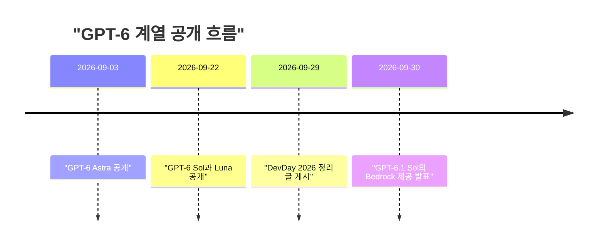
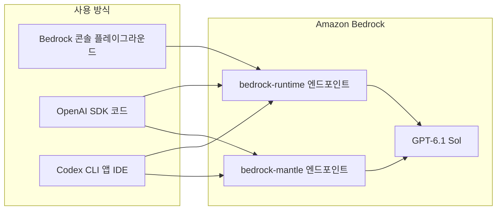
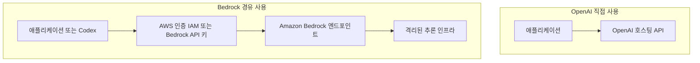
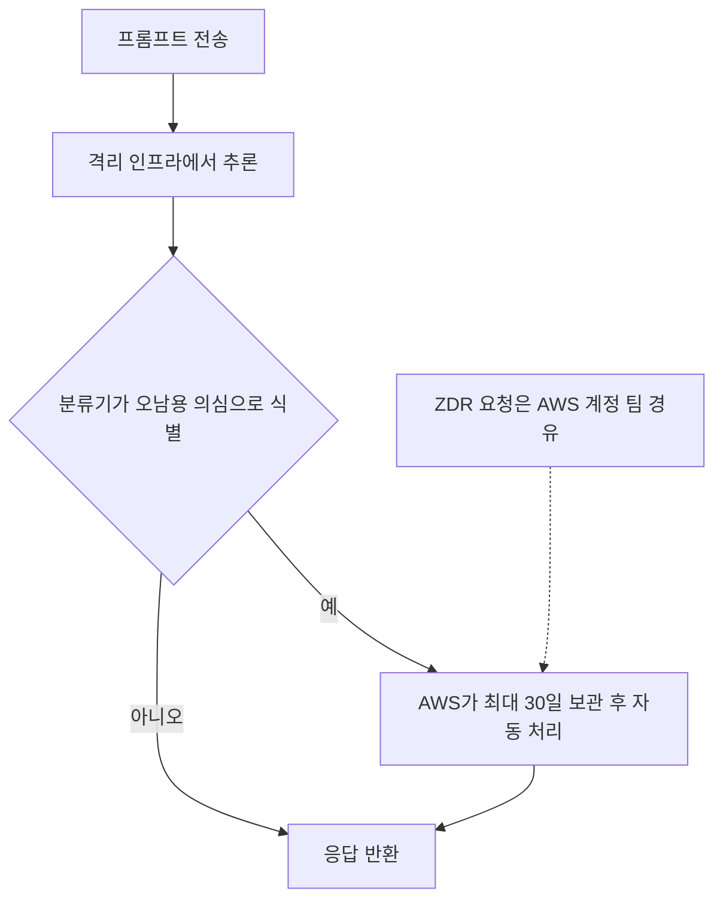

> 이 문서는 소셜 미디어에 공유된 ["GPT-6.1 Sol을 Amazon Bedrock에서 바로 사용 가능"](https://www.facebook.com/share/p/1ESuyPUa3V/)이라는 게시글의 내용을, 원문(AWS Builder Center 블로그)과 OpenAI 공식 발표, AWS·OpenAI 공식 문서를 직접 확인하여 풀어 쓴 것입니다. 확인되지 않은 내용은 추측으로 채우지 않고 "확인되지 않음"으로 표시했습니다.

---

## 1. 한눈에 보는 요약

2026년 9월 30일, AWS는 OpenAI의 GPT-6.1 Sol을 Amazon Bedrock에서 사용할 수 있게 되었다고 발표했습니다. GPT-6.1 Sol은 OpenAI가 DevDay 2026(2026년 9월 29일 정리글 게시)에서 공개한 모델로, 기존 GPT-6 Sol의 대폭 업그레이드 버전입니다. OpenAI는 이 모델이 자사의 최상위 모델인 GPT-6 Astra에 "거의 근접한" 지능을 에이전트형 코딩, 컴퓨터 사용, 전문 업무에서 보여주면서도 Astra 표준 입출력 토큰 가격의 5분의 1 수준이라고 설명합니다.

게시글이 전하는 핵심 메시지는 세 가지로 정리됩니다.

1. **모델**: GPT-6.1 Sol은 성능과 비용을 함께 고려해야 하는 업무용 모델이며, 코드베이스 분석, 복잡한 문서 이해, 여러 단계의 업무·컴퓨터 사용 워크플로에 강점이 있다고 소개됩니다.
2. **채널**: Bedrock 콘솔과 OpenAI SDK(Responses API)로 호출할 수 있고, OpenAI의 코딩 에이전트 Codex도 Bedrock을 모델 제공자로 설정해 사용할 수 있습니다.
3. **보안·데이터 정책**: IAM, CloudTrail, PrivateLink(VPC 엔드포인트)로 통제·감사할 수 있고, 추론 데이터는 모델 학습에 쓰이지 않으며, 운영자 접근이 차단된 격리 인프라에서 추론이 실행됩니다.

---

## 2. 배경: 이 발표가 나온 흐름

먼저 모델 이름 체계를 정리하면 이해가 쉽습니다. OpenAI 공식 발표에 따르면 현재 GPT-6 계열은 세 갈래로 나뉩니다.

| 모델 | OpenAI의 포지셔닝 | 표준 API 가격(백만 토큰당) |
|---|---|---|
| GPT-6 Astra | 최고 결과를 위한 가장 지능적인 모델 | 입력 $10 / 출력 $50 / 캐시 입력 $1 |
| GPT-6.1 Sol | Astra에 근접한 지능을 5분의 1 가격에 | 입력 $2 / 출력 $10 / 캐시 입력 $0.10 |
| GPT-6 Luna | 대규모 일상 업무용의 빠르고 효율적인 모델 | 입력 $0.10 / 출력 $0.50 / 캐시 입력 $0.01 |

위 가격은 OpenAI 공식 발표 페이지 기준의 **OpenAI 자체 API 가격**입니다. Amazon Bedrock에서의 GPT-6.1 Sol 요금은 이번에 확인한 자료에 구체적 수치가 없었으므로, AWS의 Bedrock 요금 페이지에서 직접 확인하셔야 합니다.

시간순으로 보면 다음과 같은 흐름입니다. 모두 OpenAI 공식 페이지에 표시된 날짜입니다.



참고로 AWS 쪽 자료에 따르면 GPT-6 Sol과 GPT-6 Luna는 9월에 Bedrock에서 정식 출시(GA)되었고, 그 이전에는 GPT-5.6 Sol·Terra·Luna가 7월에 Bedrock에서 정식 출시되었습니다. 즉 OpenAI 모델을 Bedrock에서 제공하는 흐름은 이번이 처음이 아니라, 모델 세대가 바뀔 때마다 이어져 온 것입니다.

---

## 3. GPT-6.1 Sol은 어떤 모델인가

### 3.1 포지셔닝

OpenAI는 GPT-6.1 Sol을 "새로운 균형점"이라고 표현합니다. 최상위 모델인 Astra는 가장 어려운 문제를 위한 것이고, Sol은 매일 반복되는 중요한 업무에서 성능과 비용의 균형을 맞추는 모델이라는 뜻입니다. 게시글의 "'Astra'급 지능"이라는 표현은 원문 기준으로는 "near-Astra", 즉 Astra에 **근접한** 지능이라는 뜻이므로, Astra와 동일하다는 의미로 읽으면 안 됩니다. OpenAI 스스로도 가장 어려운 과학 연구 과제에는 Astra를 써야 한다고 명시하고 있습니다.

### 3.2 OpenAI가 공개한 성능 수치

아래는 OpenAI 발표문에 실린 벤치마크 결과를 옮긴 것입니다. 이 수치들은 OpenAI가 자체 연구 환경이나 API에서 측정한 것이고, 경쟁 모델 수치는 공개된 보고서에서 가져왔다고 OpenAI가 밝히고 있으므로, 독립적으로 검증된 결과가 아니라는 점을 감안해서 읽으셔야 합니다.

**코딩 (DeepSWE v1.1)**: 실제 코드베이스에서 장기간에 걸친 소프트웨어 엔지니어링 과제를 푸는 벤치마크입니다. OpenAI에 따르면 GPT-6.1 Sol은 GPT-6 Astra와 같은 수준의 점수를 약 5분의 1 비용으로 내고, GPT-6 Sol의 최고 점수를 6.4%p 넘어서며, 그것도 더 낮은 추론 강도와 더 낮은 비용에서 달성했다고 합니다.

**전문 업무 (GDP.pdf)**: 표, 차트, 도표, 작은 글씨까지 포함된 복잡한 PDF를 읽고 금융·의료·법률 등 여러 전문 영역의 질문에 답하는 벤치마크입니다. OpenAI는 GPT-6.1 Sol이 Opus 5.5(fallback 포함)보다 높은 점수를 과제당 절반 미만의 비용으로 기록했고, Astra의 최고 수준 성능에는 약 5분의 1 비용으로 근접했다고 설명합니다.

**업무 자동화 (AutomationBench)**: 영업, 마케팅, 운영, 지원, 재무, HR 전반에서 47개 도구를 사용해 여러 단계의 업무 흐름을 끝까지 수행하는지 보는 벤치마크입니다. OpenAI에 따르면 중간 추론 강도에서 GPT-6.1 Sol은 Opus 5.5보다 2.2%p 높고 비용은 약 3분의 1이며, GPT-6 Sol보다는 같은 설정에서 4.8%p 향상되었습니다.

**컴퓨터 사용 (OSWorld 2.0 오프라인 세트)**: 일상 및 전문 업무에 걸친 장기 컴퓨터 조작 과제입니다. 최대 추론 강도에서 GPT-6 Sol보다 7%p 높고 비용은 절반 미만이며, Astra와의 격차는 2.1%p로 비용은 약 7분의 1이라고 합니다.

**과학 연구 (Terminal-Bench Science 0.1)**: 데이터 분석, 시뮬레이션, 정리 증명 등을 포함합니다. 최대 추론 강도에서 GPT-6 Sol 점수의 두 배 이상이며, 과제당 평균 비용이 $5.47로 Opus 5.5의 $23.21, Astra의 $23.80보다 75% 이상 낮다고 합니다. 다만 이 벤치마크에서 가장 높은 점수는 여전히 Astra의 68.1%이며, OpenAI도 가장 어려운 과학 연구에는 Astra를 권장합니다.

**사실성**: 사용자가 이전 모델의 사실 오류를 지적했던 실제 ChatGPT 대화를 비식별화해 만든, 일부러 어렵게 구성한 평가입니다. 낮은 추론 강도에서 사실 오류가 포함된 응답의 비율이 GPT-6 Sol의 11.4%에서 GPT-6.1 Sol의 7.7%로 줄었고, 이는 약 32% 감소입니다. OpenAI는 이 프롬프트들이 일반적인 사용을 대표하지 않는다고 분명히 밝혔습니다.

### 3.3 안전성 관련 설명

OpenAI는 GPT-6.1 Sol이 GPT-6 Sol보다 정렬(alignment) 평가에서 크게 개선되어 Astra에 가까워졌다고 말합니다. 예를 들어 검색 도구가 고장 났을 때 이를 사용자에게 알리지 않는 비율이 GPT-6 Sol 4.9%, GPT-6.1 Sol 2.1%, GPT-6 Astra 1.5%, GPT-6 Luna 28.7%로 제시되었습니다. 이 역시 실패를 유도하도록 고른 과제에서의 수치이며 일반적인 사용 시 실패율이 아니라고 OpenAI가 명시했습니다. 자세한 내용은 OpenAI의 GPT-6.1 Sol 시스템 카드 부록에 있다고 안내되어 있습니다.

---

## 4. Amazon Bedrock에서 사용하는 방법

### 4.1 전체 그림

Bedrock에서 GPT-6.1 Sol을 쓰는 길은 크게 세 가지입니다. 콘솔 플레이그라운드에서 바로 실행하는 방법, OpenAI SDK로 프로그램에서 호출하는 방법, 그리고 Codex 같은 에이전트 도구의 모델 제공자로 연결하는 방법입니다.



위 그림에서 콘솔이 어느 엔드포인트를 쓰는지는 원문에 명시되어 있지 않으므로, 콘솔 연결선은 단순한 "경로 예시"로만 봐 주시기 바랍니다. 확실한 것은 SDK와 Codex가 두 엔드포인트(mantle, runtime) 중 하나를 선택해 접속한다는 점입니다.

### 4.2 콘솔에서 시도하기

원문은 Amazon Bedrock 콘솔에서 Test 메뉴의 Playground를 열고 모델로 GPT 6.1 Sol을 선택하면 프롬프트를 바로 실행해 볼 수 있다고 안내합니다.

### 4.3 코드로 호출하기 (OpenAI SDK + Responses API)

원문이 제시한 절차는 네 단계입니다.

1. Bedrock 콘솔에서 장기(long-term) API 키를 생성합니다.
2. Python 환경에 OpenAI SDK를 설치합니다.
3. 환경 변수에 Bedrock API 키와 엔드포인트를 지정합니다. 원문의 예시는 `OPENAI_API_KEY`에 Bedrock API 키를, `OPENAI_BASE_URL`에 `https://bedrock-runtime.us-east-1.amazonaws.com/openai/v1`을 넣는 방식입니다.
4. `client.responses.create(...)`를 호출하며 모델 ID로 `openai.gpt-6.1-sol`을 지정합니다.

원문 예시 코드는 다음과 같습니다.

```python
from openai import OpenAI

client = OpenAI()

response = client.responses.create(
    model="openai.gpt-6.1-sol",
    input="Can you explain the features of Amazon Bedrock?",
    max_output_tokens=512,
)
print(response.output_text)
```

원문은 Chat Completions API도 `bedrock-mantle` 엔드포인트에서 사용할 수 있다고 덧붙입니다.

**모델 ID와 엔드포인트 조합에 대한 주의점**: AWS 사용자 가이드의 OpenAI 모델 문서에는 GPT-6.1 Sol이 us-east-1의 `bedrock-mantle`과, `bedrock-runtime`의 미국 지역 교차 리전 추론(US geographic cross-Region inference)을 통해 제공된다고 되어 있습니다. 그리고 Mantle에서는 `openai.gpt-6.1-sol`, Runtime에서는 `us.openai.gpt-6.1-sol`을 쓰라고 안내합니다. 반면 원문 블로그의 예시는 runtime 주소에 `openai.gpt-6.1-sol`을 조합해 두었습니다. 두 설명이 서로 다르게 보이므로, 실제로 적용하실 때는 AWS의 GPT-6.1 Sol 모델 카드에 적힌 엔드포인트별 모델 ID를 기준으로 삼으시는 편이 안전합니다. 어느 쪽이 맞는지는 이번 조사에서 실제 호출로 검증하지 못했습니다.

**원문 표기 불일치**: 원문 블로그에는 "GPT-5.1 Sol on Bedrock in action"이라는 소제목과 "GPT-5.6 models on Amazon Bedrock을 사용해 보세요"라는 마무리 문장이 있고, 모델 카드 링크 중 하나도 GPT-5.6 계열을 가리킵니다. 글 제목과 본문 대부분이 GPT-6.1 Sol을 말하고 있으므로 표기가 일관되지 않은 것으로 보이며, 구체적인 모델 ID나 문서는 반드시 GPT-6.1 Sol용으로 확인하세요.

### 4.4 Codex에서 Bedrock 모델 사용하기

Codex는 저장소, 로컬 파일, 터미널, 개발 도구와 연동해 기능 구현, 버그 수정, 테스트 실행을 수행하는 OpenAI의 코딩 에이전트입니다. OpenAI 도움말에 따르면 Bedrock 구성에서는 Codex가 CLI, 데스크톱 앱, IDE 확장 중 하나로 **로컬**에서 실행되고, 모델 요청만 Amazon Bedrock으로 전달됩니다. 이때 OpenAI가 호스팅하는 Responses API는 요청 경로에 들어가지 않습니다.

설정과 관련해 공식 문서에서 확인된 내용은 다음과 같습니다.

- Mantle 경로를 쓰려면 `~/.codex/config.toml`에 `model_provider = "amazon-bedrock"`을 추가합니다. Runtime 경로는 `amazon-bedrock-runtime`이라는 제공자 이름을 씁니다.
- 인증은 두 가지입니다. `AWS_BEARER_TOKEN_BEDROCK` 환경 변수가 설정되어 있으면 이를 먼저 쓰고, 없으면 AWS SDK 자격 증명 체인(SSO 프로필 등)으로 넘어갑니다. 이 구성에서는 `OPENAI_API_KEY`를 사용하지 않습니다.
- 모델 ID는 정확한 값을 써야 하고, Runtime에서는 추론 프로필 ID, Mantle에서는 모델 ID를 씁니다.
- Codex CLI에서 `/status`로 현재 모델 제공자가 `amazon-bedrock`인지 확인할 수 있습니다.

제약 사항도 있습니다. OpenAI 문서는 OpenAI 호스팅 클라우드 서비스나 호스팅 도구, 클라우드 관리형 도구 검색에 의존하는 일부 Codex 기능은 Bedrock 사용 시 지원되지 않는다고 밝힙니다. Fast Mode 역시 Bedrock에서는 쓸 수 없습니다. Fast Mode는 우선 처리를 사용하는데 Bedrock의 초기 제공은 온디맨드 추론만 지원하기 때문이라고 합니다. 브라우저 사용 자동화는 "제한적"으로 표시되어 있습니다.

또 하나, OpenAI의 Codex GitHub 저장소에는 Codex CLI v0.135.0 환경에서 내장 `amazon-bedrock` 제공자가 도구를 `namespace` 형식으로 직렬화하여 Bedrock Mantle에서 HTTP 400 검증 오류가 난다는 이슈가 보고된 바 있습니다. 이는 특정 시점의 사용자 보고이며, 현재 해결되었는지는 이번에 확인하지 못했습니다. 도구(MCP 서버 등)를 많이 붙인 상태에서 오류를 만나면 이 사례를 참고해 보시기 바랍니다.

원문은 AWS 개발 작업을 위해 "Agent Toolkit for AWS"를 쓰면 하나의 터미널 명령으로 Codex를 AWS 문서, API, 서비스와 연결할 수 있다고도 안내합니다.

---

## 5. 요청이 흐르는 경로와 보안 구조

### 5.1 일반 OpenAI API와 Bedrock 경로의 차이



Bedrock 경로에서는 접근 통제, 결제, 쿼터, 리전, 요청 처리가 모두 AWS 계정과 Bedrock 제어 기능으로 관리됩니다. 이 점이 AWS를 이미 표준 플랫폼으로 쓰는 조직에게 이번 발표가 의미 있는 이유입니다.

### 5.2 원문이 밝힌 세 가지 기술 사항

**모델 액세스(점진적 확대)**: GPT-6.1 Sol 액세스는 모든 AWS 계정으로 점진적으로 확대되는 중입니다. 지금 액세스가 없어도 Bedrock 사용량에 따라 곧 활성화된다고 하며, 빨리 쓰려면 담당 AWS 지원 팀에 문의하라고 안내합니다. 즉 "발표 당일에 모든 계정에서 바로 켜진다"는 뜻이 아닙니다.

**모니터링과 통제**: IAM 정책으로 모델 접근을 관리하고 AWS CloudTrail로 호출(invocation)을 감사할 수 있습니다. AWS PrivateLink 기반 VPC 엔드포인트를 쓰면 트래픽을 네트워크 경계 안에 둘 수 있습니다. 추론은 하드웨어 격리 인프라에서 운영자 접근이 차단된(zero-operator access) 상태로 실행되어, 추론 중에는 AWS 운영자도 프롬프트와 생성 결과에 접근할 수 없다고 합니다.

**데이터 보존**: 추론 데이터는 모델 학습에 쓰이지 않고, GPT-6.1 Sol을 쓴다고 해서 OpenAI와 데이터 공유에 동의해야 하는 것도 아닙니다. 자동화된 오남용 탐지에서 분류기(classifier)가 걸러낸 트래픽은 AWS가 최대 30일 보관하며 프로그래밍 방식으로만 처리합니다. 데이터 무보존(zero data retention)은 AWS 계정 팀을 통해 요청할 수 있습니다.



위 흐름에서 점선은 "ZDR을 별도로 요청할 수 있다"는 관계를 나타냅니다. ZDR을 요청하면 구체적으로 어떤 범위의 보존이 사라지는지는 AWS 문서의 데이터 보존 항목에서 확인하셔야 합니다.

한 가지 구분해 둘 점이 있습니다. DevDay 2026에서 OpenAI는 별도로 "Private Intelligence"와 "Private Safety Processing"을 소개했는데, 이는 OpenAI 자체 플랫폼에서의 데이터 보호 기능입니다. Bedrock에서의 데이터 취급은 위에서 설명한 AWS 쪽 정책을 따르므로 두 가지를 섞어서 이해하시면 안 됩니다.

---

## 6. OpenAI 자체 제공 채널과의 관계

OpenAI 발표에 따르면 GPT-6.1 Sol은 ChatGPT의 Plus, Pro, Business, Enterprise, Edu 사용자를 위한 **ChatGPT Work와 Codex**에서 오늘부터 쓸 수 있습니다. 다만 아직 **Chat**에서는 제공되지 않는다고 명시되어 있습니다. 개발자는 OpenAI API에서 `gpt-6.1-sol`이라는 이름으로 사용할 수 있습니다.

또한 OpenAI는 앞으로 며칠 안에 Codex에서 표준 속도보다 최대 8배 빠른 토큰 생성을 제공하는 **GPT-6.1 Sol Ultrafast**를 내놓겠다고 밝혔습니다. DevDay 정리글에서도 GPT-6.1 Sol Ultrafast는 "곧 제공"으로 표시되어 있습니다. Bedrock에서 이 속도 티어가 제공되는지는 이번에 확인된 자료가 없습니다.

DevDay 2026에서는 이와 함께 Bedrock 관련 발표도 있었습니다. OpenAI는 Amazon과 협력해 **Bedrock Managed Agents, powered by OpenAI**를 내놓았고, Agents API의 핵심 기능을 AWS에서 네이티브로 쓰도록 맞춤화해 OpenAI 에이전트를 전적으로 AWS 안에서 실행할 수 있다고 설명합니다. 이번 GPT-6.1 Sol 발표와는 별개의 제품이지만, 같은 흐름에 속하는 소식입니다.

---

## 7. 실무 관점에서 정리: 어떤 조직에 어떤 의미가 있나

이 절은 위에서 확인된 사실을 바탕으로 한 정리이며, 각 항목의 근거를 함께 적었습니다.

**AWS 중심 조직**: 모델 접근을 IAM으로, 감사를 CloudTrail로, 네트워크 격리를 PrivateLink로 처리하고 결제도 AWS를 통해 하고 싶은 조직은, OpenAI와 별도 계약이나 별도 통제 체계를 만들지 않고도 GPT-6.1 Sol을 도입할 수 있습니다. 근거는 원문의 "Things to know"와 OpenAI 도움말이 설명하는 AWS 관리 방식입니다.

**코딩 에이전트 도입 조직**: Codex를 로컬 개발 환경에서 쓰되 모델 호출만 Bedrock으로 보내는 구성이 가능합니다. AWS 파트너 네트워크 블로그(2026년 8월)는 이 구성에서 모델 추론이 Bedrock의 Responses API로 라우팅되고, 사용량 기반 과금이며 좌석 라이선스나 개발자별 약정이 필요 없고, 데이터 상주(residency)는 선택한 Bedrock 리전에 남는다고 설명합니다. 다만 앞서 본 것처럼 Fast Mode 등 일부 기능은 쓸 수 없습니다.

**비용에 민감한 에이전트 워크로드**: OpenAI 자체 가격 기준으로 캐시 입력이 백만 토큰당 $0.10이라, 같은 컨텍스트를 반복 재사용하는 에이전트에 유리하다고 OpenAI가 강조합니다. Bedrock에서 프롬프트 캐싱과 요금이 어떻게 적용되는지는 GPT-6.1 Sol 기준으로는 확인하지 못했으므로 Bedrock 요금 페이지를 보셔야 합니다. 참고로 앞선 GPT-5.6 계열 발표에서 AWS는 "요금이 OpenAI 자체 요율과 같고 기존 AWS 약정에 사용량이 반영된다"고 설명했지만, 이것이 GPT-6.1 Sol에도 그대로 적용된다고 단정할 근거는 이번 조사에서 확인되지 않았습니다.

**도입 전 점검 목록**

1. 계정에 GPT-6.1 Sol 액세스가 이미 열렸는지 콘솔에서 확인하고, 없으면 AWS 지원 팀에 문의
2. 사용할 리전과 엔드포인트 결정 (문서상 us-east-1의 Mantle, 또는 미국 교차 리전 추론을 통한 Runtime)
3. 엔드포인트에 맞는 모델 ID 확인 (Mantle은 `openai.gpt-6.1-sol`, Runtime은 `us.openai.gpt-6.1-sol`로 문서에 기재)
4. 컨텍스트 윈도우 한도 확인 (GPT-6.1 Sol의 Bedrock 한도는 이번에 확인하지 못했으며, 참고로 GPT-6 Sol과 Luna는 AWS 발표에서 최대 1M 토큰으로 안내됨)
5. 데이터 무보존이 필요하면 AWS 계정 팀에 ZDR 요청
6. Codex를 쓴다면 지원되지 않는 기능(Fast Mode 등)과 Codex 버전 요구 사항 확인

---

## 8. 자주 생기는 오해와 정정

**"Astra급이다"**: OpenAI의 표현은 "near-Astra"입니다. 일부 벤치마크에서는 Astra와 같은 수준이거나 몇 %p 차이로 근접했지만, 모든 영역에서 동일하다는 뜻이 아니며 OpenAI도 어려운 과학 연구에는 Astra를 권합니다.

**"모든 AWS 계정에서 지금 바로 쓴다"**: 원문은 액세스가 점진적으로 확대되는 중이라고 밝힙니다. 게시글 제목의 "바로 사용가능"은 출시를 알리는 표현이고, 계정별 활성화 시점은 다를 수 있습니다.

**"Bedrock에서도 OpenAI의 모든 기능을 똑같이 쓴다"**: OpenAI와 AWS 문서 모두 Bedrock 제공 범위가 OpenAI API와 다를 수 있다고 안내합니다. Codex의 경우 OpenAI 호스팅 서비스에 의존하는 기능은 지원되지 않습니다.

**"벤치마크 수치는 검증된 결과다"**: 제시된 수치는 OpenAI가 발표한 것입니다. 경쟁 모델 수치는 공개 보고서에서 가져왔고, 평가 조건(추론 강도, 도구, 프롬프트)에 따라 결과가 달라질 수 있다고 OpenAI 스스로 각주에 밝혔습니다. 실제 업무 도입 전에는 자체 데이터로 검증하는 것이 좋습니다.

---

## 9. 참고 자료

- AWS Builder Center, "Get started with OpenAI GPT-6.1 Sol on Amazon Bedrock in 5 minutes" (2026-09-30 게시, 작성자 Channy Yun)
- OpenAI, "Introducing GPT-6.1 Sol"
- OpenAI, "DevDay 2026 Recap" (2026-09-29)
- OpenAI Help Center, "Use Codex with Amazon Bedrock" 및 "Configure Codex with Amazon Bedrock"
- OpenAI Developers, "Use Codex with Amazon Bedrock", "OpenAI models in Amazon Bedrock"
- AWS 사용자 가이드, OpenAI 모델 카드 및 "OpenAI models" 문서
- AWS What's New, "OpenAI GPT-6 Sol and GPT-6 Luna are now generally available on Amazon Bedrock"
- AWS Machine Learning Blog, GPT-5.6 Bedrock 관련 글 (2026년 7월)
- AWS Partner Network Blog, "Accelerating software development with OpenAI ChatGPT Codex on Amazon Bedrock" (2026년 8월)
- GitHub openai/codex 이슈 (namespace 도구 형식 관련 보고)

---

작성 일자: 2026-09-30
