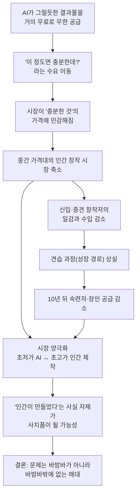
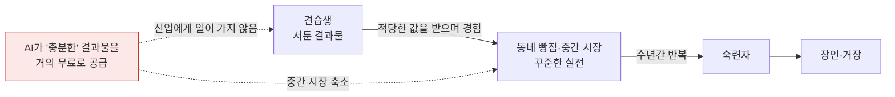

- 작성 기준일: 2026년 9월 30일
- 해설 대상: Threads에 게시된 ["AI는 어쩌면 바밤바와 비슷하다"](https://www.threads.com/share/_q9p49sqW/)로 시작하는 글
- 참고 사항: 원문 링크는 자동 접근이 차단되어 직접 열람하지 못했고, 제공해주신 본문 전체를 기준으로 해설했습니다. 작성자가 누구인지는 확인하지 못했으므로 언급하지 않습니다. 글 속 사실 주장은 2026년 9월 기준으로 검색해 확인한 연구와 자료로 점검했고, 확인되지 않은 부분은 확인되지 않았다고 명시했습니다.

---

## 1. 한눈에 보는 요약

이 글은 하나의 비유로 굴러가는 에세이입니다. 편의점에서 싸게 사 먹는 밤맛 아이스크림 바(바밤바)가 AI이고, 빵집에서 사람이 정성 들여 만드는 몽블랑이 사람의 창작물입니다. 글쓴이의 핵심 주장은 "AI가 사람보다 뛰어나서 문제가 되는 것이 아니라, '이 정도면 충분한' 결과물을 거의 공짜로 무한히 공급하기 때문에 문제가 된다"는 것입니다.

글쓴이가 그리는 미래는 이렇습니다. 시장의 양 끝에는 아주 싼 AI 결과물과 아주 비싼 '진짜 인간 작품'이 남습니다. 그런데 그 사이에 있던 것, 즉 적당한 값을 받고 꽤 괜찮은 것을 만들던 수많은 창작자와 그들이 성장하던 자리가 사라집니다. 중간이 사라지면 장인이 될 사람이 자랄 곳도 사라지니, 십 년 뒤의 숙련자는 어디서 나오느냐는 질문으로 이어집니다. 마지막 문장은 글 전체를 요약합니다. 문제는 바밤바가 아니라 바밤바밖에 없는 매대라는 것입니다.

이 글은 논문이 아니라 비유를 이용한 의견 글이므로, 문장 하나하나가 통계적 사실을 주장하는 것은 아닙니다. 다만 그 안에는 실제 연구로 점검해 볼 수 있는 주장이 몇 가지 들어 있습니다. 이 문서는 먼저 글의 논리를 차근차근 풀어 설명하고, 그다음 각 주장이 최신 연구와 얼마나 맞아떨어지는지 확인합니다.

---

## 2. 글의 논리 구조 한눈에 보기

아래 도표는 글이 전개되는 인과 흐름을 정리한 것입니다.

이 흐름에서 눈여겨볼 점은 두 가지입니다. 첫째, 출발점이 "AI의 성능이 인간을 넘어선다"가 아니라 "AI가 충분히 괜찮고 값이 거의 없다"라는 점입니다. 둘째, 피해가 가장 먼저 닿는 곳이 최고 수준의 거장이 아니라 그 아래에서 성장 중인 층이라고 본다는 점입니다.

---

## 3. 비유를 먼저 이해하기

### 3-1. 바밤바는 무엇을 뜻하는가

바밤바는 편의점 어디서나 살 수 있는 밤맛 아이스크림 바입니다. 값이 싸고, 구하기 쉽고, 맛이 크게 실패하는 일이 드뭅니다. 글쓴이는 이 특징들이 그대로 생성형 AI의 특징과 겹친다고 봅니다. 문장, 그림, 번역, 간단한 코드를 몇 초 만에, 거의 돈을 들이지 않고, 대체로 무난한 수준으로 내놓는다는 점에서 그렇습니다. 여기서 '꽤 그럴듯한 밤맛'이라는 표현이 중요합니다. 진짜 밤의 깊이는 아니지만 밤맛이라고 느끼기에는 충분하다는 뜻입니다.

### 3-2. 몽블랑은 무엇을 뜻하는가

몽블랑은 밤 크림을 소복하게 쌓아 올린 프랑스식 디저트입니다. 글쓴이가 꼽는 제작 과정은 좋은 밤을 고르고, 퓌레를 만들고, 크림을 짜고, 반죽을 굽고, 팔리지 않은 제품을 폐기하는 것까지입니다. 즉 손이 많이 가고, 재료 손실 위험을 빵집이 떠안는 물건입니다. 글에서 몽블랑은 '사람이 시간과 위험을 들여 만드는 창작물'의 상징입니다.

### 3-3. 왜 '중간'이 핵심인가

글은 몽블랑을 세 층으로 나눕니다. 맨 위에는 유명 파티시에가 만드는 아주 비싼 몽블랑이 있습니다. 맨 아래에는 바밤바가 있습니다. 그리고 그 사이에 퇴근길에 고민하다 살 수 있는 몽블랑, 생일이 아니어도 가끔 자신에게 선물할 수 있는 몽블랑, 동네 빵집마다 맛이 조금씩 다른 몽블랑이 있습니다. 글쓴이가 잃을까 걱정하는 것은 바로 이 세 번째 층입니다. 맨 위는 이름 자체가 가치라서 살아남고, 맨 아래는 AI가 채우고, 가운데가 비어 버리는 그림입니다.

---

## 4. 주장을 단계별로 풀어 읽기

### 4-1. "선택지가 하나 더 늘어난 것뿐"이라는 낙관에서 시작한다

글은 처음에 바밤바가 등장해도 아무 문제가 없다고 인정합니다. 몽블랑도 있고 바밤바도 있으니 선택지가 늘었을 뿐이라는 것입니다. 이 서술은 글쓴이가 기술 자체를 부정하려는 것이 아님을 보여 줍니다. 글의 후반부에도 "바밤바가 나쁜 것은 아니다"라는 문장이 다시 나옵니다. 그러니 이 글을 반AI 선언으로 읽으면 결이 맞지 않습니다. 글쓴이의 관심은 도구의 선악이 아니라 시장 구조의 변화입니다.

### 4-2. 문제는 수요가 옮겨 갈 때 생긴다

사람들이 몽블랑을 점점 덜 사 먹기 시작하면 빵집은 몽블랑을 진열할 이유가 줄어듭니다. 이것이 글의 첫 번째 논리 고리입니다. 대부분의 사람에게 바밤바가 충분히 만족스럽다면, 손이 많이 가는 상품은 만들수록 손해가 되는 상품이 됩니다. 그래서 '충분한 것'의 가격이 시장의 기준선이 됩니다. 글은 이를 "시장은 언제나 '충분한 것'의 가격에 민감하다"라고 압축합니다.

### 4-3. AI의 위협은 '더 뛰어남'이 아니라 '거의 공짜인 무한 공급'이다

이 부분이 글의 가장 독특한 관점입니다. 흔히 AI와 인간의 일자리를 이야기할 때 "AI가 인간보다 잘하는가"를 묻습니다. 글쓴이는 질문을 바꿉니다. 최고의 결과가 꼭 필요하지 않은 일이라면 사람들은 "이 정도면 충분한데?"라고 생각하게 되고, 그때 결정 요인은 품질이 아니라 가격이라는 것입니다. 글, 그림, 번역이 그 예로 나옵니다.

### 4-4. 위험한 것은 거장도 아마추어도 아닌 '그 사이'에 있는 사람들이다

글쓴이는 살아남을 사람을 두 부류로 봅니다. 독보적인 작가, 유명 일러스트레이터, 최고의 번역가처럼 이름 자체가 가치인 사람들은 여전히 자리가 있습니다. 취미로 만드는 사람도 돈을 벌려는 목적이 아니므로 사라지지 않습니다. 위험한 것은 아주 유명하지는 않지만 꽤 좋은 글을 쓰는 사람, 적당한 값에 괜찮은 그림을 그리는 사람, 기업과 출판사의 자잘한 번역으로 경력을 쌓는 사람, 작은 프로젝트의 코드를 짜며 실력을 키우는 사람입니다. 이들이 문화와 전문직 생태계의 실질적인 허리를 이룬다는 것이 글쓴이의 시각입니다.

### 4-5. 오늘의 장인은 어제의 견습생이었다

여기서 글은 단기 소득 문제에서 장기 인재 공급 문제로 넘어갑니다. 유명 파티시에도 처음에는 크림을 잘못 올리고 반죽을 태우던 견습생이었다는 것입니다. 그 서툰 시기를 돈을 받으며 견딜 수 있었던 것은 동네 빵집에서 사람들이 적당한 값을 내고 그 결과물을 사 주었기 때문입니다. 만약 "AI보다 조금 잘하는 신입에게 왜 돈을 주지?"라는 질문이 반복되면, 당장의 비용은 줄지만 미래 전문가가 자랄 공간이 없어집니다. 그래서 글은 "신입이 일을 해 보지 못한다면 십 년 뒤의 숙련자는 어디에서 나오는가"라고 묻습니다.

점선 화살표가 글쓴이가 걱정하는 지점입니다. 사다리의 첫 단과 중간 단에 발판이 사라지면 위쪽 단에 오를 사람이 줄어듭니다.

### 4-6. 몽블랑의 가치는 '결과'만이 아니라 '선택'에 있다

글은 몽블랑을 즐기는 사람이 밤맛만 먹는 것이 아니라고 말합니다. 어떤 집은 밤의 질감을 거칠게 남기고, 어떤 집은 크림을 훨씬 부드럽게 만들며, 어떤 파티시에는 럼 향을 강하게, 다른 파티시에는 머랭을 강조합니다. 소비자는 "이 사람은 왜 이렇게 만들었을까?"라는 선택을 함께 맛봅니다.

소설과 그림도 마찬가지입니다. 작가가 왜 이 단어를 골랐는지, 왜 여기서 문장을 끊었는지, 왜 이 인물을 용서하지 않았는지가 작품의 일부라는 것입니다. 글쓴이는 이를 저자성이라는 말로 정리합니다. 결과물의 품질만으로는 설명되지 않는 선택, 시행착오, 취향, 경험의 총합이 인간 창작의 가치라는 주장입니다.

### 4-7. 역설적으로 '인간이 만들었다'가 사치품이 될 수 있다

AI가 보편화되면 "100% Human-made. No Generative AI."라는 표시가 붙은 것이 수제 초콜릿이나 스페셜티 커피처럼 값을 더 받는 시대가 올 수도 있다고 글은 말합니다. 여기서 '올 수도 있다'라는 표현에 주목해야 합니다. 이것은 확정된 사실이 아니라 글쓴이의 전망입니다.

### 4-8. 결론: 기술은 더 많은 사람에게 '그럭저럭 좋은 것'을 주고, 더 좋은 것은 줄인다

글의 결론은 하나의 역설입니다. 누구나 싸고 훌륭한 바밤바를 마음껏 먹을 수 있게 되는 동시에, 평범한 사람이 기분 낼 때 사 먹던 몽블랑은 사라지고, '진짜 인간이 만든 몽블랑'만 아주 비싼 값에 남는다는 것입니다. 그래서 던져야 할 질문은 "AI가 인간의 창작을 없앨 것인가"가 아니라 "인간 창작의 중간 가격대를 없애지는 않을 것인가"라고 글은 제안합니다. 문화가 두꺼워지려면 몇 명의 천재와 수많은 소비자만으로는 부족하고, 그 사이에서 적당한 돈을 받고 적당히 실패하며 꽤 좋은 것을 계속 만드는 사람들이 필요하다는 것이 글의 마지막 논지입니다.

---

## 5. 최신 자료로 점검해 보기

여기서부터는 글이 담고 있는 주장을 실제 연구와 대조합니다. 결론부터 말하면, 글의 핵심 직관 중 일부는 데이터와 방향이 일치하지만, 인과관계가 확정된 것은 아니며 서로 다른 결과를 내는 연구도 있습니다.

### 5-1. "신입이 먼저 밀린다"는 주장

가장 직접적으로 관련된 연구는 스탠퍼드 디지털 이코노미 랩의 Erik Brynjolfsson, Bharat Chandar, Ruyu Chen이 미국 급여 처리 회사 ADP의 급여 데이터로 수행한 "Canaries in the Coal Mine?" 연구입니다. 이 연구는 2025년 8월에 처음 나왔고, 2026년 8월 12일에 개정판 요약이 공개되었습니다.

개정판이 밝힌 사실을 요약하면 다음과 같습니다.

- 경제 전반에서 광범위한 일자리 대체는 관찰되지 않습니다. 연구진이 첫 번째 사실로 꼽은 내용입니다.
- 그러나 AI에 많이 노출된 직업에서 22~25세 노동자의 고용은, AI 노출이 낮은 직업의 같은 나이대 고용 추이를 따라갔을 경우의 수준보다 약 19% 낮은 상태입니다. 경력이 쌓인 노동자에게는 이런 격차가 나타나지 않습니다.
- 이 격차는 2025년 7월 자료 기준 15%에서 2026년 6월 기준 19%로 커졌습니다.
- 조정은 해고가 늘어서가 아니라 젊은 층의 채용이 줄어드는 방식으로 이루어지는 것으로 보입니다. 이는 글이 말한 "신입에게 왜 돈을 주지?"라는 구조와 결이 같습니다.
- 감소는 AI가 사람의 업무를 자동화하는 방향으로 쓰이는 직업에 집중되어 있고, AI가 사람을 보완하는 방향으로 쓰이는 직업에서는 고용이 유지되거나 늘었습니다.
- 지금까지의 조정은 기본급이 아니라 고용에서 나타나고 있습니다.

절대 수준으로 보면, 가장 노출이 큰 두 구간에서 22~25세 고용은 2022년 11월부터 2026년 6월 사이 약 11% 줄었고, 노출이 가장 낮은 세 구간의 같은 연령대는 약 10% 늘었습니다.

이 연구에서 특히 흥미로운 것은 개정판에 새로 추가된 '명시적 지식과 암묵적 지식'의 구분입니다. 교육이나 교재, 문서화된 절차로 가르칠 수 있는 명시적(codified) 지식에 크게 의존하는 직업에서는 젊은 층의 고용이 줄었습니다. 반대로 실습, 멘토링, 실제 상황에 반복해서 노출되며 얻는 암묵적(tacit) 지식에 의존하는 직업에서는 경력자의 고용이 늘었습니다. 연구진은 이 패턴이 "생성형 AI가 이미 글과 디지털 정보로 부호화된 지식을 재현하고 적용하는 데 특히 뛰어나다"는 해석과 일관된다고 설명합니다. 몽블랑 비유로 바꾸면, 레시피에 적힌 부분은 AI가 따라 하지만 손의 감각처럼 몸으로 익히는 부분은 여전히 사람에게 남는다는 뜻입니다. 글쓴이가 걱정하는 '견습을 통한 성장'이 바로 그 암묵적 지식을 얻는 통로라는 점에서, 두 논의는 자연스럽게 이어집니다.

다른 연구도 방향이 비슷합니다. Hosseini와 Lichtinger(2025)는 생성형 AI를 도입한 기업에서 주니어 고용이 비도입 기업 대비 9% 줄고 시니어 고용은 영향이 없었다고 보고했습니다. 이 연구도 원인을 해고가 아니라 주니어 채용 둔화에서 찾습니다. 또 국제통화기금(IMF)의 2026년 보고서는 이 연구를 인용하면서, 일부 전문 직종이 줄고 있는 가운데 소프트웨어 개발자가 가장 두드러진다고 언급합니다. 다른 요약 자료에 따르면 Stanford AI Index 2026은 22~25세 소프트웨어 개발자의 고용이 2024년 정점 대비 20% 가까이 줄었다고 보고합니다. 이 수치는 2차 자료를 통해 확인한 것이므로 원문 확인이 필요합니다.

### 5-2. 그러나 "AI 때문"이라고 단정할 수는 없다

글은 인과관계를 전제로 쓰였지만, 연구자들은 훨씬 조심스럽습니다. 스탠퍼드 연구진 스스로 이 결과가 인과 추정이 아닌 기술적(descriptive) 패턴이며, 단일 연구를 결정적 증거로 보지 않는다고 밝힙니다. 그리고 다음과 같은 주의점을 명시합니다.

- 교육 수준을 고려하면 노출이 큰 젊은 층과 작은 젊은 층 사이의 격차가 줄어듭니다.
- 생성형 AI가 널리 쓰이기 전부터 보이는 추세 차이도 있습니다.
- 격차 추정치가 ADP 표본에서 전국 조사 자료보다 더 크게 나옵니다.

다른 연구들도 결이 갈립니다. 스탠퍼드 정책연구소(SIEPR)의 2026년 7월 정책 브리프는 AI 노출 직업의 채용 감소가 연준의 통화정책 전환 이후이지만 ChatGPT 등장 이전에 시작되었다고 보는 두 편의 논문을 소개하고, 신입 고용 감소가 2024년 전에는 뚜렷하지 않다는 결과도 소개하면서 AI 외 요인이 작용했을 가능성이 그럴듯하다고 정리합니다. 덴마크 자료로 분석한 Humlum과 Vestergaard(2026)는 AI 도입이 젊은 층 고용 감소의 주된 원인은 아니라고 결론 냅니다. Anthropic 경제학자들이 2026년 3월에 발표한 연구는 AI에 노출된 노동자와 그렇지 않은 노동자 사이의 실업률 격차가 작고 통계적으로 유의하지 않다고 보고했고, 22~25세 진입 노동자의 취업률이 14% 낮아졌다는 결과는 연구진 스스로 한계 수준의 유의성이라고 설명한 것으로 전해집니다. 이 내용도 2차 요약을 통해 확인한 것입니다.

정리하면, 젊은 층의 채용이 AI 노출 직업에서 상대적으로 약해졌다는 관찰은 여러 자료에서 반복해 나타납니다. 하지만 그 원인이 AI인지, 금리와 경기, 재택근무 같은 다른 요인인지에 대해서는 연구자들 사이에서도 합의가 없습니다. 글의 걱정은 "지금 나타나는 신호와 방향이 일치하는 가설"이지, 증명된 사실은 아닙니다.

### 5-3. 글, 그림, 번역 같은 창작·언어 노동은 어떤가

글이 예로 든 번역과 글쓰기는 연구가 비교적 많은 영역입니다. Demirci 등의 연구(Journal of Economic Behavior & Organization 게재 논문으로 확인된 ScienceDirect 초록)는 온라인 프리랜서 시장에서 ChatGPT 출시 이후 글쓰기와 번역처럼 AI로 대체 가능한 기술의 수요가 반사실적 추세 대비 20~50% 줄었다고 보고합니다. 다만 같은 연구에서 플랫폼 전체의 프리랜서 수요는 줄지 않았고, 감소는 1~3주짜리 단기 일감에서 가장 두드러졌으며 장기 프로젝트에는 덜 집중되었습니다. 또한 보완적 역할의 초보자 수요는 줄었다는 결과도 포함되어 있습니다. 이 결과는 "먼저 밀리는 것은 짧고 규격화된 일, 그리고 초보자"라는 글의 그림과 겹칩니다.

작가·번역가 단체 조사도 있습니다. 영국 Society of Authors의 조사(787명 응답, 대상 풀 약 12,500명)에서 번역가의 43%와 일러스트레이터의 37%가 생성형 AI 때문에 일의 소득 가치가 줄었다고 답했고, 향후 소득이 줄 것이라고 예상한 비율은 번역가 77%, 일러스트레이터 78%였다고 보도되었습니다. 이 수치는 2차 매체가 옮긴 것이며, 응답자가 회원 표본이라는 점에서 전체 시장을 대표한다고 보기는 어렵습니다. 프리랜서 시장 연구를 소개한 한 기사는 반대 방향의 신호도 전합니다. 고가 계약(1,000달러 초과)이 여러 분야에서 늘었고 AI 관련 기술을 가진 프리랜서가 비슷한 조건의 프리랜서보다 약 40% 더 번다는 내용입니다. 이 신호는 변화의 모양이 단순한 '중간 소멸'이 아니라 훨씬 복잡할 수 있음을 알려 줍니다. 이 자료만으로 글의 '중간 공동화' 가설을 확인하거나 반박할 수는 없습니다.

### 5-4. "충분하다"는 감각과 획일화 위험

글의 후반부 논지, 즉 문화는 다양한 선택으로 두꺼워진다는 관점은 실험 연구와 맞닿아 있습니다. Doshi와 Hauser의 연구(Science Advances, 2024년 7월)에서는 LLM이 준 이야기 아이디어를 쓴 참가자들의 단편소설이 더 창의적이고, 더 잘 쓰였고, 더 즐겁다고 평가되었고, 그 효과는 원래 창의성이 낮은 참가자에게서 특히 컸습니다. 그러나 AI의 도움을 받은 소설들은 사람만으로 쓴 소설들보다 서로 더 비슷했습니다. 저자들은 이를 개인은 이득을 보지만 집단적으로는 새로움의 폭이 좁아지는 사회적 딜레마로 설명합니다.

이 결과는 글의 주장을 정확히 증명하는 것은 아닙니다. 이 실험은 시장 가격이나 창작자의 생계를 다룬 것이 아니라 단편소설 한 종류에서의 아이디어 지원 효과를 측정했습니다. 다만 "개인에게 이롭지만 전체 다양성은 줄어들 수 있다"는 구조는 글쓴이가 몽블랑의 다양한 맛을 강조한 이유와 같은 방향의 관찰입니다.

### 5-5. "100% Human-made"가 값이 될 것인가

이 대목에서는 실제로 벌어지고 있는 움직임이 하나 확인됩니다. 미국 작가 단체인 Authors Guild는 'Human Authored'라는 인증 제도를 운영합니다. 이 인증은 책의 텍스트가 사람에 의해 쓰였고 AI가 생성한 것이 아니라는 표시이며, 맞춤법·문법 검사 같은 극히 미미한 AI 사용은 허용합니다. 회원 대상 베타로 2025년 1월에 시작되었고, 2026년 3월에 미국에서 책을 내는 모든 저자에게 공식 확대되었습니다. 비회원은 책 한 권당 10달러를 내고 회원은 무료이며, 출판사가 대량 구매하는 방식도 열렸습니다. Publishers Weekly에 따르면 2026년 3월 시점에 3,000명이 넘는 저자가 5,000종의 책을 인증했습니다. 협회 CEO는 AI가 만든 스팸 도서가 플랫폼에 넘쳐 나면서 사람이 쓴 작품을 구별해 달라는 요구가 커지고 있다고 설명했습니다.

여기서 반드시 짚어야 할 한계가 있습니다. 같은 보도에서 협회는 인증 전에 원고 자체를 AI 사용 여부로 검증하지는 않으며, 믿을 만한 탐지 방법이 현재로서는 없다고 인정했습니다. 인증은 저자가 정직하게 선언했다는 데 기대는 방식입니다. 그리고 이 인증이 실제로 가격 프리미엄을 만들어 내는지에 대한 자료는 이번 검색에서 확인하지 못했습니다. 그러므로 "인간이 만들었다는 사실이 사치품이 된다"는 글의 전망은 그런 수요를 겨냥한 표시 제도가 등장했다는 점까지는 현실과 닿아 있지만, 실제 프리미엄이 형성되고 있다는 증거는 아직 확인되지 않았습니다.

---

## 6. 글이 말하는 것과 말하지 않는 것

이 글을 정확히 읽으려면 글이 주장하는 범위를 구분하는 것이 도움이 됩니다.

글이 실제로 말하는 것은 첫째, AI의 위협은 품질 우위보다 '충분한 품질의 초저가 공급'에서 온다는 것입니다. 둘째, 그 충격이 거장보다 중간층과 신입층에 먼저 닿을 수 있다는 것입니다. 셋째, 중간 시장이 견습과 성장의 무대였으므로 그것이 사라지면 장기적으로 숙련자 공급이 줄 수 있다는 것입니다. 넷째, 인간 창작의 가치에는 결과의 품질뿐 아니라 저자성이 있다는 것입니다.

글이 말하지 않는 것도 분명합니다. 글은 AI가 창작을 없앨 것이라고 하지 않고, 바밤바가 나쁘다고 하지 않으며, 이 모든 일이 반드시 일어난다고 단정하지도 않습니다. 대부분의 문장이 "~일 수 있다", "~할지도 모른다", "~가능성"의 형태입니다. 이것이 이 글을 예측이 아니라 경고로 읽어야 하는 이유입니다.

한편 비유가 완벽하게 들어맞지 않는 지점도 있습니다. 몽블랑과 바밤바는 서로 다른 재료와 공정으로 만들어지는 별개의 제품이지만, AI 결과물과 인간 결과물은 같은 시장에서 같은 용도로 직접 경쟁하는 경우가 많습니다. 또 AI를 도구로 쓰는 창작자도 많아서, 현실에서는 '바밤바냐 몽블랑이냐'의 양자택일보다 둘이 섞이는 경우가 흔합니다. 글의 마지막 문장이 던지는 요점, 즉 선택지가 다양하게 남아 있는 시장 구조의 가치는 이 한계와 별개로 유효한 문제 제기로 읽을 수 있습니다.

---

## 7. 핵심 주장별 근거 상태 정리

| 글의 주장 | 관련 자료가 보여 주는 것 | 확인 수준 |
|---|---|---|
| AI 노출이 큰 직업에서 젊은 층이 먼저 밀린다 | 스탠퍼드/ADP 연구에서 22~25세 격차가 19%로 확대, 채용 감소 중심 | 관찰은 반복 확인, 원인은 미확정 |
| 해고보다 신입 채용이 줄어드는 방식이다 | 스탠퍼드, Hosseini-Lichtinger 연구가 채용 둔화를 지적 | 여러 연구에서 방향 일치 |
| 번역·글쓰기 같은 규격화된 일이 타격을 받는다 | 프리랜서 시장 연구에서 대체 가능 기술 수요 20~50% 감소, 단기 일감 중심 | 플랫폼 한 곳의 연구 결과 |
| 경력자는 상대적으로 안전하다 | 스탠퍼드 연구에서 경력자 격차 없음, 암묵지 직업에서는 경력자 고용 증가 | 현재까지의 패턴 |
| AI 결과물은 서로 비슷해진다 | Doshi-Hauser 실험에서 AI 지원 소설이 서로 더 유사 | 단편소설 실험에 한정 |
| 인간 제작 표시가 프리미엄이 된다 | Human Authored 인증 제도 존재, 프리미엄 형성 여부는 확인 안 됨 | 전망, 증거 미확인 |
| 중간 가격대가 공동화된다 | 직접 측정한 연구는 이번 검색에서 확인하지 못함 | 가설 |
| 경제 전반에 대량 실업이 온다 | 스탠퍼드, Anthropic, IMF 등이 아직 뚜렷한 총량 신호 없다고 보고 | 현재까지 확인되지 않음 |

---

## 8. 결론: 이 글에서 가져갈 수 있는 것

이 글의 가장 큰 장점은 AI 논쟁의 질문을 바꾼다는 데 있습니다. "AI가 사람만큼 잘하는가"라는 성능 논쟁에서 "충분히 좋고 거의 공짜인 공급이 시장의 구조와 사람이 자라는 경로를 어떻게 바꾸는가"라는 구조 논쟁으로 옮겨 갑니다. 최신 연구들은 이 질문이 허황되지 않다는 점을 보여 줍니다. 젊은 층의 채용이 AI 노출이 큰 직업에서 상대적으로 약해졌고, 그 격차가 2026년 중반까지 벌어졌다는 관찰이 여러 자료에서 나타납니다. 그리고 이 현상이 명시적 지식 위주의 업무에서 두드러진다는 분석은 견습을 통해 암묵지를 쌓는 경로가 위협받는다는 글의 우려와 논리적으로 맞닿습니다.

동시에 냉정하게 기억할 점도 있습니다. 이런 패턴이 AI 때문인지는 아직 결론이 나지 않았고, 국가나 연구 방법에 따라 결과가 다르며, 경제 전체의 대량 실업 신호는 확인되지 않았습니다. 창작 시장의 '중간 공동화'와 '인간 제작 프리미엄'은 현재로서는 가설과 전망의 영역입니다.

그러므로 이 글은 이렇게 읽는 것이 가장 정확합니다. 확정된 미래에 대한 예언이 아니라, 지금 관찰되는 신호가 이어질 경우 무엇을 잃을 수 있는지를 바밤바와 몽블랑이라는 쉬운 그림으로 보여 주는 경고문이라는 것입니다. 그리고 그 경고가 남기는 실천적 질문은 결국 하나입니다. 사람이 서툰 채로 시작해서 숙련자로 자랄 수 있는 자리를, 우리는 어떻게 계속 남겨 둘 것인가.

---

## 9. 참고한 자료

- Stanford Digital Economy Lab, "No Widespread Displacement, but the AI Employment Gap for Young Workers Has Widened to 19%" (2026년 8월 12일, Brynjolfsson·Chandar·Chen): https://digitaleconomy.stanford.edu/news/canariesaug26/
- Federal Reserve Bank of Dallas, "Young workers' employment drops in occupations with high AI exposure" (2026년 1월 6일): https://www.dallasfed.org/research/economics/2026/0106
- Stanford SIEPR, "What is really happening to jobs? Separating AI hype from reality" (2026년 7월): https://siepr.stanford.edu/publications/policy-brief/what-really-happening-jobs-separating-ai-hype-reality
- IMF, "New Jobs Creation in the AI Age" (SDN/2026/001): https://www.imf.org/-/media/files/publications/sdn/2026/english/sdnea2026001.pdf
- Demirci 외, "Winners and losers of generative AI: Early Evidence of Shifts in Freelancer Demand" (ScienceDirect): https://www.sciencedirect.com/science/article/pii/S0167268124004591
- Doshi & Hauser, "Generative AI enhances individual creativity but reduces the collective diversity of novel content", Science Advances 10(28), 2024: https://pmc.ncbi.nlm.nih.gov/articles/PMC11244532
- Authors Guild, Human Authored 인증 안내 및 FAQ: https://authorsguild.org/human-authored/faq/
- Publishers Weekly, "Authors Guild Opens Human Authored Certification to All U.S. Authors and Publishers" (2026년 3월): https://www.publishersweekly.com/pw/by-topic/industry-news/publisher-news/article/99836-authors-guild-opens-human-authored-certification-to-all-u-s-authors-and-publishers.html
- Techxplore, "The more commodified your job, the more likely AI can do it" (2026년 4월): https://techxplore.com/news/2026-04-commodified-job-ai-lessons-online.html
- 2차 요약 자료(원문 확인이 추가로 필요한 수치를 포함): IntuitionLabs, "AI and Entry-Level Jobs: What Hiring Data Really Shows"(2026년 9월 기준) https://intuitionlabs.ai/articles/ai-entry-level-employment-hiring-data / Digital Applied, "AI and Jobs in 2026" https://www.digitalapplied.com/blog/ai-and-jobs-2026-what-the-labor-data-shows-analysis / Business Outstanders(Society of Authors 조사 인용) https://businessoutstanders.com/artificial-intelligence/ai-replacing-writers-job-loss-data
