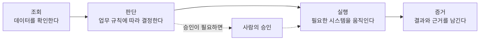
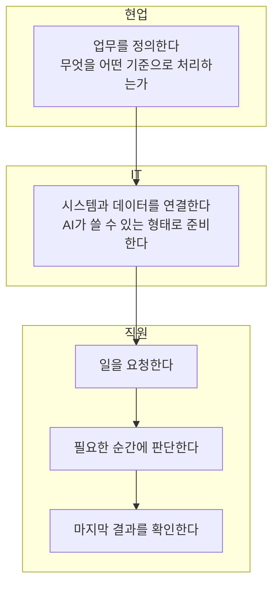
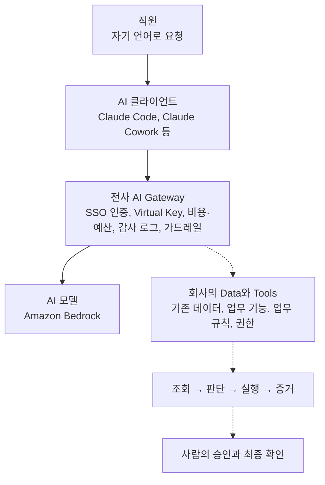

> GS리테일의 Enterprise AI 방향을 담은 단상 한 편을 문장 단위로 풀어 읽고, 2026년 10월 1일 기준으로 확인되는 공개 정보와 대조해 정리한 글입니다.

---

## 0. 먼저 밝혀둘 것: 이 글이 근거로 삼는 자료

이 해설의 대상은 "AI에게 일을 맡기려면 우리는 무엇을 준비해야 할까?"라는 질문으로 시작하는 짧은 글입니다. 원문이 올라온 페이스북 게시물은 자동 접근이 허용되지 않아 링크에서 직접 읽어오지는 못했고, 전달받은 본문 텍스트를 기준으로 해설합니다.

이 글에서는 내용을 세 가지로 구분해서 씁니다.

- **원문이 말하는 것**: 게시글에 실제로 적힌 주장과 구조입니다.
- **공개 자료로 확인되는 것**: 뉴스, AWS 기술 블로그, MCP 공식 사양 등 출처가 있는 사실입니다. 문서 맨 아래에 출처를 모아두었습니다.
- **확인되지 않는 것**: 공개 자료만으로는 알 수 없는 부분입니다. 이런 부분은 추측으로 채우지 않고 "확인되지 않음"이라고 표시했습니다.

---

## 1. 한 문단 요약

이 글의 핵심은 "AI 도입의 성패는 좋은 모델을 고르는 데 있지 않고, 회사가 가진 데이터와 업무 기능(Tools)을 AI가 안전하게 쓸 수 있게 준비하는 데 있다"는 주장입니다. 직원이 AI에게 질문해서 답변을 받는 단계에서는 결국 사람이 그 답을 들고 시스템을 찾아가 일을 처리해야 합니다. 그래서 글쓴이는 업무가 끝났다고 말할 수 있는 기준을 **조회 → 판단 → 실행 → 증거**라는 네 단계로 제시합니다. AI가 데이터를 조회하고, 업무 규칙에 따라 판단하고, 시스템을 실행하고, 마지막에 그 결과와 근거를 남겨야 비로소 "일을 맡겼다"고 할 수 있다는 것입니다. 이를 위해 현업은 업무를 정의하고, IT는 시스템과 데이터를 연결하며, 직원은 요청하고 중요한 순간에 판단하고 결과를 확인하는 사람이 됩니다.

---

## 2. 원문을 순서대로 읽기

### 2-1. 출발점: 회사의 일은 "답변"으로 끝나지 않는다

글은 GS리테일이 어떤 회사인지부터 짚습니다. 편의점, 슈퍼, 홈쇼핑이 있고 그 뒤에서 수많은 직원과 시스템이 움직이는 회사입니다. 이런 회사에서 AI를 쓰면 흥미로운 장면이 생긴다고 합니다. AI가 아무리 좋은 답변을 해줘도 직원에게는 일이 하나 더 남는다는 것입니다. "그래서 이제 내가 뭘 해야 하지?"라는 질문이 그것입니다.

이 대목이 글 전체의 문제의식입니다. 챗봇은 질문에 답을 주는 데서 끝나지만, 회사의 업무는 대개 다음과 같은 연쇄로 이루어져 있습니다.

1. 최신 정보를 확인한다.
2. 업무 규칙을 적용한다.
3. 요청한 사람의 권한을 확인한다.
4. 필요하면 시스템을 실행한다.
5. 때로는 사람의 승인을 받는다.

AI가 1번 근처에서 멋진 문장을 만들어줘도 2번부터 5번은 여전히 사람이 직접 하고 있다면, 업무 시간은 생각만큼 줄지 않습니다. 글쓴이는 이 간극을 "AI가 답변하는 회사"와 "AI가 일하는 회사"의 차이로 봅니다.

### 2-2. Enterprise AI는 모델 선택이 아니라 "Data와 Tools 준비"

글쓴이는 Enterprise AI를 준비한다는 것이 "AI 모델 하나를 잘 선택하는 문제가 아니라고 생각한다"고 말합니다. 대신 회사의 **Data와 Tools를 AI가 사용할 수 있도록 준비하는 것**에 가깝다고 정의합니다.

여기서 쓰는 두 단어를 쉽게 풀면 이렇습니다.

- **Data**: 회사가 이미 쌓아둔 고객, 상품, 점포, 주문 같은 정보입니다.
- **Tools**: 회사가 이미 만들어둔 업무 기능입니다. 예를 들어 "주문을 조회한다", "환불을 처리한다", "승인을 요청한다"처럼 시스템이 수행하는 동작 하나하나가 Tool입니다.

글쓴이가 강조하는 점은 새로 만드는 것이 아니라 **기존 데이터와 업무 기능을 연결하고, 그 위에 회사의 업무 규칙과 권한을 연결한다**는 점입니다. 그렇게 해두면 직원은 복잡한 시스템 메뉴를 찾아다니는 대신 자기 말로 요청할 수 있습니다.

- "이 고객 상황 확인해줘."
- "조건에 맞으면 처리해줘."
- "필요한 승인 요청하고 결과 알려줘."

세 문장은 순서대로 조회, 판단과 실행, 승인과 보고에 대응합니다. 사용자의 입장에서는 말 한마디지만, 그 뒤에서는 회사가 이미 가진 시스템이 움직입니다.

### 2-3. "Tool Call 하나 허용하는 것"보다 훨씬 어려운 이유

글의 중간 지점에서 어조가 바뀝니다. AI에게 일을 맡기는 것은 **Tool Call 하나를 허용하는 것보다 훨씬 어렵다**고 말합니다. Tool Call이란 AI가 "이 기능을 이 값으로 실행해 달라"고 시스템에 요청하는 호출입니다. 기술적으로는 호출 하나를 열어주면 AI가 시스템을 움직일 수 있습니다. 하지만 회사에서는 호출이 가능하다는 것과 호출해도 된다는 것이 전혀 다른 문제입니다. 글쓴이는 다섯 가지 질문을 던집니다.

| 질문 | 쉽게 말하면 | 왜 필요한가 |
|---|---|---|
| 누가 요청했는가 | 신원 확인 | 같은 요청도 누가 했느냐에 따라 처리가 달라집니다. |
| 그 사람이 실행할 권한이 있는가 | 권한 확인 | AI가 대신 실행하더라도 권한은 요청자의 것을 넘어설 수 없어야 합니다. |
| 어떤 조건에서 실행할 것인가 | 업무 규칙 | 회사의 정책과 기준이 코드나 규칙으로 반영되어야 합니다. |
| 사람의 승인이 필요한가 | 승인 절차 | 금액이나 영향이 큰 일은 사람이 확인해야 합니다. |
| 결과가 정말 반영되었는가 | 결과 검증 | "처리했습니다"라는 말과 실제 시스템 반영은 다릅니다. |

마지막 질문은 특히 중요합니다. 대화형 AI는 실행에 실패하고도 성공했다고 말할 수 있기 때문에, 실제로 시스템에 반영되었는지 확인하는 단계가 따로 있어야 합니다.

그리고 글쓴이는 이 모든 질문 위에 한 줄을 얹습니다.

> AI가 무엇을 했는지 사람이 확인할 수 있어야 합니다.

이 한 줄이 뒤에 나오는 "증거"라는 단계로 이어집니다.

### 2-4. 업무 완료의 정의: 조회 → 판단 → 실행 → 증거

글쓴이가 이 글에서 가장 힘주어 제안하는 틀입니다.

네 단계를 하나씩 풀어보겠습니다.

**조회.** AI가 답변을 지어내는 것이 아니라 회사의 실제 데이터를 읽어옵니다. 최신 정보를 확인한다는 말이 여기에 해당합니다.

**판단.** 읽어온 데이터에 업무 규칙을 적용합니다. 원문이 말하는 "조건에 맞으면 처리해줘"가 이 단계입니다. 규칙은 모델의 기억이 아니라 회사가 정의한 기준이어야 합니다.

**실행.** 판단 결과에 따라 시스템을 움직입니다. 이 단계에서 신원, 권한, 승인이 모두 걸립니다.

**증거.** 무엇을 근거로 어떤 판단을 하고 무엇을 실행했는지 기록으로 남깁니다. 글쓴이는 "여기까지 와야 비로소 AI에게 일을 맡겼다고 말할 수 있지 않을까"라고 묻습니다. 조회와 판단만 해주는 AI는 훌륭한 조력자이지만, 증거까지 남기는 AI여야 사람이 안심하고 일을 넘길 수 있다는 뜻입니다.

이 네 번째 단계를 "완료의 정의"에 넣었다는 점이 이 글의 가장 독특한 대목입니다. 많은 AI 도입 사례가 "답변 품질"이나 "자동 실행"에서 멈추는 데 비해, 이 글은 사후 확인 가능성을 완료 조건으로 못 박습니다.

### 2-5. 역할 분담: 현업, IT, 직원

글쓴이는 이것이 IT만의 일이 아니라고 말합니다.

- **현업**은 업무를 정의합니다. 업무 규칙을 가장 잘 아는 사람들이기 때문입니다.
- **IT**는 시스템과 데이터를 연결합니다.
- **직원**은 "모든 과정을 AI에게 넘기는 사람"이 아니라 요청하고, 필요한 순간에 판단에 참여하고, 최종 결과를 확인하는 사람이 됩니다.

직원의 역할 설명이 중요합니다. 글쓴이는 AI가 사람을 대체한다고 말하지 않습니다. 사람은 흐름의 처음과 가장 중요한 중간, 그리고 끝에 남습니다. 앞에서 말한 "사람의 승인"과 "증거 확인"이 이 역할과 맞물립니다.

### 2-6. 맺음: 질문하는 회사에서 일을 맡기는 회사로

마지막 문장은 방향 선언입니다. "AI에게 질문하는 회사에서 AI에게 일을 맡기는 회사로." 그리고 이것이 GS리테일이 준비하고 있는 Enterprise AI의 방향이라고 밝힙니다.

---

## 3. 어려운 말 쉽게 풀기

**Enterprise AI.** 개인이 쓰는 AI가 아니라 회사 전체가 업무에 쓰는 AI입니다. 개인용과 다른 점은 보안, 권한, 비용 관리, 기록 같은 회사의 요구를 함께 만족해야 한다는 것입니다.

**Tool Call.** AI가 시스템의 기능 하나를 호출하는 동작입니다. 사람으로 치면 직원이 "이 서류 결재 올려줘"라고 시스템에 명령을 내리는 것과 비슷합니다.

**MCP (Model Context Protocol).** AI가 외부 도구와 데이터에 연결되는 방식을 표준화한 공개 규격입니다. 원문은 MCP를 직접 언급하지 않습니다. 다만 "회사의 Data와 Tools를 AI가 사용할 수 있게 준비한다"는 문제는 업계에서 MCP 같은 표준으로 풀고 있는 문제와 같은 영역이어서 아래 4장에서 배경으로 소개합니다.

**AI Gateway.** 사람과 AI 모델 사이에 놓는 관문입니다. 모든 AI 호출이 이곳을 지나면서 인증, 비용 기록, 사용량 제한, 감사 로그 같은 공통 정책을 받습니다.

**감사 로그(증거).** 누가 언제 무엇을 요청했고 AI가 무엇을 했는지 남기는 기록입니다. 문제가 생겼을 때 원인을 따라갈 수 있는 근거가 됩니다.

---

## 4. 2026년 10월 기준으로 확인되는 공개 정보

### 4-1. 이 문제를 풀려는 표준: MCP 2026-07-28 사양

MCP는 Anthropic이 2024년 11월에 공개한 규격이며, 이후 Linux Foundation 산하 Agentic AI Foundation으로 넘어가 업계 공동 표준이 되었다고 여러 자료가 전하고 있습니다. 가장 최근의 정식 사양은 **2026년 7월 28일에 발행된 2026-07-28 버전**입니다. 공식 발표와 해설 자료에 따르면 이 개정은 초기 공개 이후 가장 큰 변경으로 평가되며 주요 내용은 다음과 같습니다.

- **상태 비저장(stateless) 프로토콜 코어**: 초기 핸드셰이크와 프로토콜 수준의 세션이 사라지고 모든 요청이 스스로 완결됩니다. 서버를 여러 대로 늘리고 부하를 나누기 쉬워진다는 의미입니다.
- **인증 강화**: OAuth 2.0과 OpenID Connect 관행에 더 가깝게 맞추었고, 인증 응답에 포함된 발급자(iss) 값을 클라이언트가 검증하도록 요구합니다.
- **확장 프레임워크와 Tasks**: 오래 걸리는 작업을 다루는 Tasks가 공식 확장으로 분리되었습니다.

원문의 질문, 곧 "누가 요청했는가", "그 사람이 실행할 권한이 있는가"는 바로 이 인증과 권한 영역과 맞닿아 있습니다. 다만 사양이 인증의 틀을 제공한다고 해서 회사의 업무 권한까지 자동으로 해결되는 것은 아닙니다. 어떤 직원이 어떤 업무를 실행할 수 있는지는 여전히 회사가 정의해야 합니다.

한편 한 기업용 AI 아키텍처 분석 글은 MCP가 통합과 도구 접근의 표준일 뿐이고, 어떤 데이터가 기준이 되는지, 쓰기가 어떻게 버전 관리되는지, 감사 증거가 어떻게 보존되는지는 따로 정해야 한다고 지적합니다. 이 지적은 원문이 "실행" 뒤에 "증거"를 별도 단계로 둔 이유와 정확히 맞아떨어집니다.

### 4-2. GS리테일이 공개적으로 밝힌 움직임

**① 현장 중심 AX와 조직 자산화 (2026년 7월)**
GS리테일은 7월 6일 서울 역삼 GS타워에서 'AX 현장 사례 공유회'를 열었고 경영진과 부문 리더 등 150여 명이 온오프라인으로 참석했습니다. 소개된 사례는 회사 주도의 대형 프로젝트가 아니라 현업 구성원이 자기 업무 문제를 직접 정의하고 AI로 풀어낸 것들이었습니다. 이 자리에서 회사는 개인 결과물을 안전하게 검증하고 공유하는 '샌드박스', AI가 쓰기 쉬운 데이터를 쌓는 '데이터 빌리지', 시스템 일관성을 높이는 공통 기술 기준, 그리고 '현장 밀착형 엔지니어(FDE)' 육성 과정을 준비한다고 밝혔습니다. 김학민 AI데이터부문장은 임직원의 AI 활용 경험을 조직의 자산과 경쟁력으로 바꾸는 단계라고 말했습니다.

이 내용은 원문의 구도와 잘 겹칩니다. 원문이 말한 "현업은 업무를 정의하고, IT는 시스템과 데이터를 연결한다"는 분담이 현업의 문제 정의, 데이터 빌리지, 공통 기술 기준이라는 공개 계획과 같은 방향입니다.

**② 오픈이노베이션 (2026년 7월)**
7월 16일 'The GS Challenge Future Retail' 4기 밋업에서 선발된 스타트업 5개사와 AI 기반 사업 실증을 시작했고 11월까지 진행한다고 보도되었습니다. 전사 17개 사업부의 수요를 조사해 데이터 및 AI 인텔리전스, 자율형 오퍼레이션 최적화, 디지털 인게이지먼트 혁신 등을 핵심 영역으로 정했다고 합니다.

**③ 전사 AI Gateway (2026년 9월 7일 AWS 기술 블로그)**
GS리테일 클라우드인프라팀이 AWS와 함께 쓴 글에서 전사 AI Gateway의 구조가 공개되었습니다. 핵심만 정리하면 다음과 같습니다.

- 개발자용으로는 Claude Code를, 현업 사용자용으로는 Claude Cowork를 각각 Amazon Bedrock 위에서 쓰는 방식을 표준으로 삼았습니다.
- 사용자 PC와 모델 사이에 오픈소스 LiteLLM 기반의 AI Gateway를 두어 모든 모델 호출을 하나의 관문으로 통합했습니다.
- 사내 SSO로 로그인해 개인별 Virtual Key를 발급받고, Gateway는 이 키로 사용자를 식별해 권한, 모델 정책, 비용, 감사 정책을 적용합니다. 글에 따르면 신원의 신뢰 원천은 요청 본문이 아니라 SSO이며, 키 발급은 감사 기록이 선행됩니다.
- 700개 팀, 수천 명 규모를 전제로 팀 단위 AWS 계정을 나누어 비용과 쿼터를 팀별로 분리했고, 팀·팀원·개인 3계층의 예산 한도를 둡니다.
- 데이터가 인터넷을 경유하지 않도록 Direct Connect와 PrivateLink를 통해 Bedrock에 접근하며, 호출 전수에 대한 감사 로깅과 가드레일(민감 정보 입력 방지)을 적용합니다.

이 글은 후속 2부를 예고하면서, 모델 호출을 넘어 업무를 실제로 처리하는 AI 에이전트가 늘어나면서 "사내 메일·파일·일정에 접근할 때 누구의 권한으로 읽는가"와 "막아 둔 인터넷 접근을 어떤 경계 안에서 허용하는가"라는 질문이 나왔다고 밝혔습니다. 이 두 가지를 Amazon Bedrock AgentCore 기반으로 구현한 사례를 다룰 예정이라고 합니다.

**④ 고객 접점의 AI (2026년 9월)**
GS샵은 9월 16일부터 모바일 앱에 'AI 쇼핑 어시스턴트'를 도입했습니다. 뷰티 상품군부터 적용하며 상품 검색, 리뷰 요약, 상품 비교, 그리고 보고 있던 상품의 맥락을 이어받는 대화형 에이전트를 제공하고, 적용 범위를 단계적으로 넓힐 계획이라고 합니다. 직원용 업무 AI와는 성격이 다른 고객용 서비스입니다.

### 4-3. 업계 흐름

한국에서도 기업용 MCP를 전면에 내세우는 제안이 나오고 있습니다. 전자신문 보도에 따르면 워카토는 2026년 4월 행사에서 'Enterprise MCP'를 제안하면서 등록·권한·접근 범위·사용량 제어·모니터링을 포함하는 구조를 설명했고, 구매 승인 업무에서 Jira 이슈 생성, Slack 승인 알림, 구매 처리, 전표 생성까지 하나의 흐름으로 엮는 예를 들었습니다. 원문의 "승인 요청하고 결과 알려줘"와 같은 종류의 업무입니다. 또 MCP 게이트웨이를 AI 에이전트와 MCP 서버 사이에서 도구 탐색, 인증, 접근 정책, 로깅을 한곳에 모으는 제어 계층으로 설명하는 자료도 있고, 이 자료는 Gartner가 2026년 말까지 기업용 애플리케이션의 40%에 작업 특화 AI 에이전트가 들어갈 것으로 본다고 전합니다(2025년에는 5% 미만).

---

## 5. 원문의 메시지와 공개 사실을 연결해 보기

아래 그림은 원문의 구상과 지금까지 공개된 GS리테일의 움직임을 한 장에 놓아본 것입니다. 실선은 공개 자료로 확인되는 부분이고 점선은 원문이 방향으로 제시했지만 공개 자료로는 구현 여부를 확인할 수 없는 부분입니다.

연결해서 읽을 때 정리할 수 있는 점은 다음과 같습니다.

**첫째, 원문이 던진 질문의 상당 부분은 이미 "관문" 수준에서 답이 만들어지고 있습니다.** "누가 요청했는가"는 SSO와 Virtual Key로, "비용과 사용량이 누구에게 귀속되는가"는 팀 계정 분리와 3계층 예산으로, "무엇을 했는지 확인할 수 있는가"의 일부는 전수 감사 로깅으로 다루고 있습니다. 즉 증거를 남기는 토대는 공개된 범위에서 이미 설계되어 있습니다.

**둘째, 원문이 말하는 "Data와 Tools 연결"과 "조회 → 판단 → 실행 → 증거"가 실제로 어디까지 가동 중인지는 공개 자료로는 확인되지 않습니다.** AWS 블로그의 1부는 모델 호출을 통제하는 계층을 다루며, 업무 시스템을 직접 실행하는 에이전트 단계는 후속 2부에서 다룰 예정이라고만 밝혔습니다. 따라서 이 글을 "이미 완성된 시스템의 소개"로 읽기보다는 "회사가 준비하고 있는 방향의 선언"으로 읽는 것이 정확합니다. 원문 마지막 문장도 "준비하고 있는 방향"이라고 쓰고 있습니다.

**셋째, 사람의 역할에 대한 입장이 일관됩니다.** 원문은 직원이 "필요한 순간 판단에 참여"한다고 했고, 공개된 AX 계획 역시 현업이 문제를 직접 정의하고 FDE 같은 현장 인재를 키우는 쪽에 무게를 둡니다. AI를 사람을 대체하는 존재가 아니라 사람의 요청을 받아 일을 처리하는 존재로 두고, 사람은 정의, 판단, 확인에 남기는 구조입니다.

---

## 6. 읽고 나서 생각해볼 점

원문의 다섯 질문을 실제 업무에 적용해 보면 구현에서 부딪히는 지점이 보입니다. 아래는 원문의 논리를 따라 실무에서 점검할 만한 항목으로 정리한 것이며, 특정 회사의 실제 사정에 대한 주장이 아닙니다.

1. **누구의 권한으로 실행하는가.** AI가 대신 실행하더라도 요청한 사람의 권한을 넘어서면 안 됩니다. AI 전용 만능 계정을 만들면 편하지만 권한 통제가 무너집니다. AWS 블로그가 2부의 질문으로 "누구의 권한으로 읽는가"를 꼽은 것도 같은 맥락입니다.
2. **판단 규칙을 어디에 두는가.** 업무 규칙이 프롬프트 안에만 있으면 바뀔 때 추적하기 어렵습니다. 규칙은 현업이 정의하고 시스템이 참조하는 형태로 관리되어야 합니다.
3. **승인의 기준을 어떻게 정하는가.** 모든 일에 승인을 걸면 자동화의 의미가 줄고, 아무 일에도 걸지 않으면 위험합니다. 금액, 영향 범위, 되돌릴 수 있는지 여부 같은 기준이 필요합니다.
4. **"반영되었다"를 무엇으로 확인하는가.** AI의 말이 아니라 대상 시스템의 결과 값으로 확인해야 합니다. 증거는 대화 기록이 아니라 시스템 기록과 연결되어야 신뢰할 수 있습니다.
5. **증거를 사람이 읽을 수 있는가.** 로그가 있어도 읽을 수 없으면 소용이 없습니다. 원문이 "사람이 확인할 수 있어야 한다"고 한 것은 기록의 존재보다 가독성과 추적 가능성을 요구하는 말로 읽힙니다.

---

## 7. 마무리

이 글이 설득력 있는 이유는 AI 도입의 중심을 "모델의 똑똑함"에서 "회사의 준비 상태"로 옮겨 놓았기 때문입니다. 모델은 계속 바뀌지만 회사의 데이터, 업무 기능, 규칙, 권한은 회사가 가진 고유한 자산이고, 그것을 AI가 안전하게 쓸 수 있게 연결해 두면 모델이 바뀌어도 그 위의 업무는 유지됩니다. 공개된 AI Gateway 설계에서도 모델이 바뀌어도 애플리케이션은 변하지 않는 구조를 만들겠다는 원칙이 보이는데, 같은 생각을 업무 영역까지 넓힌 것이 이 글의 구상이라고 볼 수 있습니다.

정리하면 다음과 같습니다.

- 질문에 답하는 AI는 직원에게 다음 할 일을 남깁니다.
- 일을 맡기려면 Data와 Tools, 그리고 업무 규칙과 권한을 AI가 쓸 수 있게 준비해야 합니다.
- 일이 끝났다는 기준은 **조회 → 판단 → 실행 → 증거**입니다.
- 현업은 정의하고, IT는 연결하고, 직원은 요청과 판단과 확인을 맡습니다.
- 공개 자료로 확인되는 것은 그 토대가 되는 관문, 인증, 비용, 감사 체계와 현업 중심 AX 계획이며, 업무 실행 단계의 구체적 구현은 앞으로 공개될 내용입니다.

---

## 참고한 공개 자료

- GS리테일 AX 현장 사례 공유회: 헤럴드경제(biz.heraldcorp.com/article/10801562), 뉴스핌(newspim.com/news/view/20260708000132)
- GS리테일 오픈이노베이션 4기 PoC 착수: 아주경제(ajunews.com/view/20260720145839903)
- GS리테일의 전사 AI Gateway 구축 사례 1부 (2026-09-07): aws.amazon.com/ko/blogs/tech/gsretail-aigateway-01/
- GS샵 AI 쇼핑 어시스턴트: 이투데이(etoday.co.kr/news/view/2626218)
- MCP 2026-07-28 사양: modelcontextprotocol 공식 블로그(blog.modelcontextprotocol.io/posts/2026-07-28-release-candidate/), 사양 릴리스(github.com/modelcontextprotocol/specification/releases/tag/2026-07-28), 해설(4sysops.com, equixly.com/blog/2026/08/05/stateless-mcp/)
- 워카토 Enterprise MCP 제안: 전자신문(etnews.com/20260428000472)
- 기업용 에이전트에서 MCP와 context 거버넌스의 구분: puppyone.ai/ko/blog/state-of-enterprise-ai-agents-patterns-won-lost
- MCP 게이트웨이 개념과 Gartner 전망 인용: getmaxim.ai/articles/enterprise-mcp-gateway-for-ai-agents-best-platform-in-2026/

---

작성일: 2026년 10월 1일
