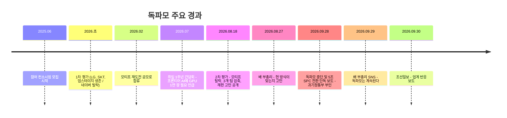
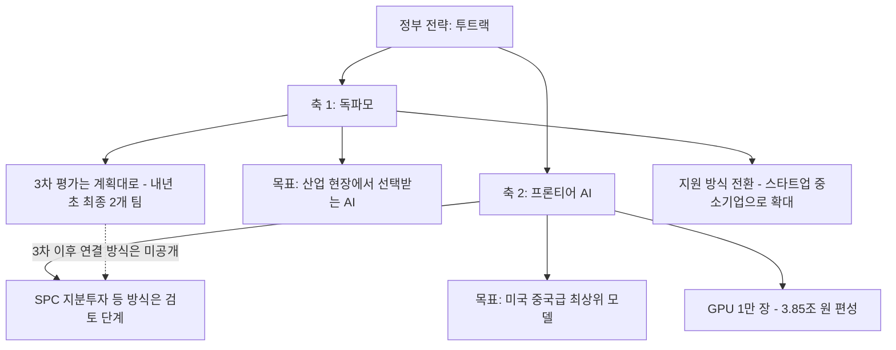

**조선일보 [「배경훈 '독파모 계속된다' 해명에… AI 업계 '어차피 끝난 것'」](https://www.chosun.com/economy/tech_it/2026/09/30/OJGVSFWT7FDAHKDTU5R3DRNPC4/)(2026.09.30) 기사와, 이 기사를 계기로 올라온 SNS 비판 글의 주장을 최신 보도와 대조해 정리한 해설서입니다.**

>
> 배경훈은 1년사이 AI경쟁 양상이 달라졌다고 말하는데 달라진거 하나도없다. 첨부터 나랏돈 빼먹기로 작정하고 시작한 기형적인 프로젝트였다. 그냥 눈감고 모른척 했을 뿐. 이제와서 왜 말을 바꾸면서 독파모를 포기 하느냐? 현재 3개 업체가 남았는데 누구를 1위로 뽑던 세계시장과 격차가 너무 크기 때문이다. 제대로된 프로젝트 였다면 이 프로젝트 주동자인 하정우가 왜 국회의원 하겠다고 정치권을 기웃거리겠는가?
>
>다시 몇조를 투자해서 또 시작한다고 하는데 1년 지나면 마찬가지다. 한국이 가야될 길은 거대한 파운데이션 모델 만드는 것이 아니다. 가능한 많은 연구자들이 소형 AI 모델을 개발 할 수 있도록 지원하는 것이 현명하다. 프론티어 모델 만든다는 헛소리는 이제 그만 하고 대학들이 GPU 쓸수 있도록 지원 하라.
>
>https://www.threads.com/share/BATEPO6d5p/
>

---

## 1. 한눈에 보는 요약

2026년 9월 28일경 한 매체가 "정부가 독파모를 중단하고 5조 원 규모의 특수목적법인(SPC)을 세워 프론티어급 AI 개발로 전환한다"고 단독 보도했습니다. 과학기술정보통신부(과기정통부)는 즉시 "정해진 바 없다"며 진화에 나섰고, 9월 29일 밤 배경훈 부총리 겸 과기정통부 장관이 직접 SNS에 "독파모는 계속된다"는 글을 올렸습니다. 다음 날인 9월 30일 조선일보는 이 해명을 다루며 "AI 업계는 '어차피 끝난 것'이라고 본다"는 취지의 제목을 달았습니다.

핵심 쟁점은 한 문장으로 줄일 수 있습니다. **정부는 "독파모도 하고 프론티어 AI도 하겠다(투트랙)"고 말하지만, 업계 일각에서는 "독파모 방식은 사실상 수명이 다했고 재편이 불가피한데 정부가 이제야 인정하는 것"이라고 본다**는 것입니다.

> **자료의 한계**: 조선일보 기사 본문 전체는 검색으로 확보하지 못했습니다. 제목·부제("배 부총리 '1년 사이 AI경쟁 양상 달라져' / 업계 '그걸 이제 알았나' '장기 전략부재'")와, 같은 시기 다른 언론들의 보도로 배경을 재구성했습니다. 업계 관계자가 구체적으로 누구인지, 어떤 근거를 댔는지는 본문을 확인하지 못해 이 문서에서 다루지 않습니다.

---

## 2. 용어부터 정리

**독파모(독자 AI 파운데이션 모델 프로젝트)** 는 흔히 '국가대표 AI 선발전'으로 불립니다. 과기정통부가 2025년 6월 20일 참여 컨소시엄 모집을 시작했고, 목표는 글로벌 수준의 독자 AI 파운데이션 모델을 개발해 오픈소스로 활용할 수 있게 함으로써 다양한 AI 서비스 출시와 산업 전 영역의 AI 전환(AX)을 앞당기는 것이었습니다. 평가 단계마다 정부는 목표만 제시하고 구체적인 개발 전략은 참여팀이 정하는 미국 DARPA 방식을 적용했고, 대학·대학원생 참여를 필수 조건으로 두었습니다.

**프론티어 AI**는 그 시점에 세계에서 가장 성능이 높은 최상위급 모델을 뜻합니다. 정부 설명에 따르면 앤트로픽이나 오픈AI의 최상위 모델처럼 대규모 자원을 투입해 만드는 모델입니다.

**GPU 1만 장**이라는 숫자가 자주 나옵니다. 배 부총리는 7월 20일 취임 1주년 간담회에서 프론티어 모델에 엔비디아 차세대 '베라 루빈' GPU 약 1만 장이 필요하며 구매비만 최소 3조 5천억 원이라고 설명했습니다. 반면 현재 독파모 참여 기업이 지원받는 GPU는 B200 기준 약 500~735장 수준입니다. 두 사업의 자원 규모가 20배 가까이 차이 난다는 뜻입니다.

---

## 3. 독파모가 걸어온 길

독파모는 처음에 5개 정예팀으로 출발했습니다. 1차 단계평가에서 LG AI연구원, SK텔레콤, 업스테이지가 살아남았고 네이버는 탈락했습니다. 이후 1개 팀을 더 뽑는 재도전 공모가 열려(모집 공고는 2026년 1월) 모티프테크놀로지스가 2월에 합류했습니다.

2026년 8월 18일 2차 단계평가 결과가 나왔습니다. 평가는 벤치마크 40점, 전문가 35점, 사용자 25점으로 구성됐고, 업스테이지·SK텔레콤·LG AI연구원이 통과했습니다. 세계 평가기관 아티피셜 애널리시스의 지능지수(AAII)에서 가장 높은 점수(47점)를 받은 모티프는 사용성·활용성 평가가 낮아 탈락했습니다. AAII 원점수는 모티프 47점, 업스테이지 37점, SK텔레콤 35점, LG AI연구원 31점이었고, 모티프의 종합점수는 65.8점이었습니다.

같은 날 정부는 독파모를 대폭 재편할 수 있다는 신호를 냈습니다. 유니콘팩토리 보도에 따르면 원래 목표인 "글로벌 프론티어 모델의 95% 수준"을 기준으로 삼으면 57점 이상이 나와야 하는데, 최고점이 47점이었다는 점이 정부 고민의 배경으로 소개됩니다. 류제명 2차관은 "전면적으로 재편하는 방향을 고민하고 있다"고 밝혔고, 최종 선정은 연내에서 내년 초로 미뤄졌습니다.

8월 27일 배 부총리는 "1년 반 전에 세팅한 방식 그대로 독파모를 진행하는 게 맞느냐는 생각이 있다"고 말했습니다. 그는 또 3년 내 승부를 봐야 하고 2027년부터 승부를 내기 위한 판을 짜야 한다고 덧붙였습니다.

---

## 4. 배경훈 부총리의 해명, 무엇을 말했나

9월 29일 밤 게시글의 골자는 다음과 같습니다.

첫째, **결론은 "독파모는 계속된다"** 입니다. 지금 진행 중인 3차 평가는 계획대로 마무리하고, 동시에 프론티어 AI에도 국가 차원에서 도전해야 한다는 것입니다.

둘째, **왜 독파모를 멈추면 안 되는가**에 대해 그는 산업 현장에 필요한 AI가 모두 초거대 프론티어 모델일 필요는 없다고 답했습니다. 제조·금융·의료·공공서비스·피지컬 AI 같은 현장에서는 비용, 속도, 보안, 전문성을 따진 최적의 AI가 필요하다는 논리입니다. 특히 중국 오픈웨이트 AI의 확산을 독파모를 계속해야 하는 이유로 들었습니다. 한국 산업과 공공이 외국 모델에만 의존하지 않으려면 경쟁력 있는 국산 모델이 현장에서 실제로 쓰여야 한다는 것입니다.

셋째, **지원 방식을 바꾸겠다**고 예고했습니다. 사업 초기에는 GPU 자체가 부족해 경쟁을 통해 소수에 자원을 집중할 수밖에 없었지만, 지금은 정부와 민간의 GPU 투자가 크게 늘었으니 "누구를 탈락시킬 것인가"보다 "어떻게 더 많은 가능성을 키울 것인가"를 고민해야 한다는 주장입니다. 스타트업과 중소기업에도 충분한 컴퓨팅 자원을 주겠다고 했습니다.

넷째, **두 개의 축**이라는 구도를 제시했습니다. 프론티어 AI는 기술적 한계를 돌파하는 축, 독파모는 국산 AI가 산업과 사회 곳곳에서 쓰이게 하는 축이라는 설명입니다.

다만 서울경제 보도에 따르면 3차 평가 이후 독파모를 프론티어 AI 개발과 어떻게 연결할지는 구체적으로 밝히지 않았습니다. 바로 이 대목이 업계의 "장기 전략 부재"라는 비판이 파고드는 지점으로 보입니다.

---

## 5. 정부 발표에서 서로 다른 말처럼 보이는 부분

같은 사안을 두고 최근 정부 관계자 발언이 조금씩 달라 혼란이 생긴 측면이 있습니다. 확인되는 사실만 나열하면 이렇습니다.

- 9월 28일 과기정통부 설명자료: 독파모 중단과 SPC 설립 여부는 "아직 정해진 바 없다". 다만 관계자는 "독파모의 통합 및 개편은 이미 예산안 간담회 등에서 언급된 사항"이며 "중단이 아니라 개편 및 확장의 개념"이라고 했습니다.
- 9월 29일 과기정통부 관계자: 3차 전형은 예정대로 진행되고, 전형을 중단하고 갑자기 프론티어 모델 전형으로 바꾸는 일은 없다. 프론티어 모델은 독파모와 별도의 신규 전형으로 갈 가능성이 높으며, 독파모는 전부 정부가 지원하지만 프론티어는 큰 프로젝트를 하겠다는 의지가 있는 기업이 들어와야 한다고 설명했습니다.
- 뉴스1 보도: 독파모가 여러 기업이 힘을 모아 프론티어 AI를 공동 개발하는 방식으로 재편될 전망이며, 내년 최상위 AI 모델·기술 확보에 5조 5,937억 원을 투입할 계획입니다. 이 중 '베라 루빈' 1만 장 확보에만 3조 8,500억 원이 들어갑니다.

즉 "중단"은 부인했지만 "개편·통합"은 정부도 인정한 상태입니다. 업계가 "어차피 끝난 것"이라고 말하는 배경에는 이 표현 차이가 있어 보입니다. 다만 이것은 제목과 정황에 근거한 해석이며, 업계의 구체적 발언은 본문을 확인해야 알 수 있습니다.

---

## 6. "1년 사이 AI 경쟁 양상이 달라졌다"는 말의 의미

기사 부제는 배 부총리가 "1년 사이 AI 경쟁 양상이 달라졌다"고 말했다고 전합니다. 부총리의 최근 발언을 종합하면 그가 말하는 변화는 대략 세 가지입니다.

하나는 **프론티어 모델의 등장과 격차 확대**입니다. 5월 29일 기자간담회에서 그는 지난해에는 산업 특화 AI로 AX를 하겠다는 전략이었는데 "미토스와 같은 프론티어 AI 모델이 나오면서 새로운 고민거리가 생겼다"고 말했습니다. 또한 프론티어 AI를 보유한 국가와 그렇지 못한 국가의 격차가 앞으로 훨씬 커질 수 있다고 봅니다.

둘은 **중국 오픈웨이트 모델의 확산**입니다. 산업 현장에서 중국산 개방형 모델이 퍼지고 있어 국산 모델이 선택받아야 한다는 논리입니다. 반면 7월 간담회에서 그는 중국도 장기적으로는 미국처럼 폐쇄형 중심으로 전환할 가능성이 크고, 미국과 중국이 고성능 AI를 통제하는 시대가 오면 외산 서비스가 갑자기 중단되거나 가격이 급등해도 대응할 수 없다고 경고했습니다.

셋은 **GPU 인프라 사정의 변화**입니다. 그는 "GPU가 부족해서 연구 성과를 내기 어렵다는 이야기는 이제 많이 나오지 않는다"고 평가하면서도, 한국의 AI 전체 예산이 미국 빅테크 한 곳의 투자 수준이라는 점을 한계로 꼽았습니다.

---

## 7. 첨부하신 SNS 글의 주장, 사실관계 점검

글쓴이의 문제의식은 크게 여섯 가지입니다. 각각 확인된 사실과 글쓴이의 의견을 구분해 보겠습니다.

| 주장 | 확인 결과 |
|---|---|
| ① 1년 사이 달라진 게 없다 | **의견**입니다. 다만 정부 스스로 "초기에는 GPU가 부족해 소수에 집중했다"고 한 만큼 환경이 바뀌었다는 것이 정부 논리이고, 평가 방식·자원 배분을 바꾸려는 움직임은 실제로 확인됩니다. |
| ② 처음부터 나랏돈 빼먹기로 작정한 프로젝트였다 | **확인되지 않습니다.** 제가 확인한 보도들은 사업 설계의 한계(경쟁 방식, 자원 분산, 평가 구조)를 지적할 뿐, 횡령이나 유용 정황을 다룬 것은 없습니다. 검증되지 않은 단정입니다. |
| ③ 3개 업체 중 누구를 1위로 뽑아도 세계와 격차가 크다 | **부분적으로 정부·전문가 인식과 겹칩니다.** 정부도 "현 구조로는 프론티어에 역부족"이라는 문제의식을 드러냈고, 최병호 고려대 교수는 프론티어급에는 최소 1조 단위 매개변수가 필요한데 이를 충족한 국내 모델은 없다고 평가했습니다. 다만 "1위를 뽑는다"는 표현은 부정확합니다. 내년 초 최종 **2개 팀**을 선정하는 구조입니다. |
| ④ 하정우가 주동자인데 국회의원을 하겠다고 정치권을 기웃거린다 | **시점이 어긋납니다.** 하정우 전 대통령실 AI미래기획수석은 4월 27일 사의를 표명하고 부산 북구갑 재보궐선거에 출마했으며, 6월 3일 선거에서 한동훈 후보(42.96%)에 1,392표 뒤진 41.26%로 낙선했습니다. 출마 이유로 본인은 "입법으로 AI 정책 속도를 높이겠다"는 점을 들었고, 민주당 지도부의 설득과 전재수 전 의원의 공백을 메울 카드라는 정치적 배경이 함께 보도됐습니다. 그가 독파모의 "주동자"였는지, 출마가 독파모와 연결되는지는 제가 확인한 보도에서는 근거를 찾지 못했습니다. |
| ⑤ 다시 몇 조를 투자해 또 시작한다 | **사실에 가깝습니다.** 내년도 AI 예산 9.4조 원, 그중 GPU에 3조 8,500억 원이 편성됐습니다. 다만 SPC 설립 등 구체 방식은 확정되지 않았고, 예산은 국회 심의(국정감사·예산 심사)를 거칩니다. |
| ⑥ 프론티어 모델 대신 소형 모델 연구자와 대학 GPU를 지원하라 | **정책 제안(의견)** 입니다. 정부도 "산업 현장에 초거대 모델이 모두 필요한 것은 아니다"라며 스타트업·중소기업 컴퓨팅 지원 확대를 말하지만, 프론티어 도전 자체는 포기하지 않는다는 점이 다릅니다. |

### 이 논쟁에서 양쪽이 내세우는 논리

**프론티어 도전에 회의적인 쪽**은 세계 최상위 모델과의 격차가 크고 투자 규모(정부 전체 AI 예산이 빅테크 1곳 수준)가 한계이므로, 선택과 집중보다 다양한 연구자와 소형·특화 모델 생태계를 넓혀야 한다고 봅니다.

**프론티어 도전을 지지하는 쪽**은 프론티어 AI 보유 여부가 산업 경쟁력과 안보, 외산 의존 위험(서비스 중단·가격 급등)에 직결되므로 독자 역량이 없으면 종속된다고 봅니다. 최병호 교수도 국가 단위 AI 개발에 기업 간 경쟁 방식은 애초에 맞지 않았다며 역량을 결집하는 방향에는 공감했지만, GPU 지원에 비해 데이터와 인재 확보 방안이 부족하다고 지적했습니다.

두 입장이 반드시 배타적이지는 않습니다. 정부의 투트랙 구상 자체가 "특화·소형 모델 확산"과 "프론티어 도전"을 함께 가겠다는 것이기 때문입니다. 실제 쟁점은 **한정된 재원과 인력을 어떤 비율로, 어떤 방식(경쟁 선발 vs 공동 개발 vs SPC)으로 배분하느냐**입니다.

---

## 8. 앞으로 지켜볼 지점

1. **독파모 3차 평가**: 내년 초 LG AI연구원, SK텔레콤, 업스테이지 중 2개 팀이 최종 선정될 예정입니다.
2. **3차 이후 연결 방식**: 독파모 성과가 프론티어 프로젝트에 어떻게 편입되는지, 별도 신규 전형이 열리는지가 아직 미공개입니다.
3. **국회 심의**: 9.4조 원 AI 예산과 GPU 3.85조 원이 국정감사와 예산 심사에서 투자 대비 성과 논란을 넘을 수 있는지가 관건입니다.
4. **GPU 배분**: 대규모 GPU가 일부 기업에 집중되지 않고 스타트업과 연구자에게도 돌아가는지가 감사 쟁점으로 거론됩니다.
5. **조선일보 기사 본문**: 업계 발언의 구체적 내용(누가, 어떤 근거로 "어차피 끝난 것"이라 했는지)은 원문 확인이 필요합니다.

---

## 9. 참고한 보도

- 머니투데이, 「배경훈 부총리 "독파모는 계속된다…프론티어 AI에도 도전해야"」 (2026.09.30) https://www.mt.co.kr/tech/2026/09/30/2026093005550830283
- 국민일보, 「배경훈 부총리, '독파모 중단설' 일축…"프런티어AI도 도전"」 https://www.kmib.co.kr/article/view.asp?arcid=9000018469
- 서울경제, 「배경훈 부총리 "독파모는 계속된다"....중단설 일축」 https://m.sedaily.com/article/20096366
- 머니투데이, 「국대 AI 3차 전형 중단한다고? 정부, 선 긋기 나섰다」 (2026.09.29) https://www.mt.co.kr/tech/2026/09/29/2026092911204175358
- AI타임스, 「과기부, 국대 AI 중단설 일축…"현 구조로는 프런티어 역부족" 지적도」 https://www.aitimes.com/news/articleView.html?idxno=215733
- 뉴스1, 「독파모 넘어 '프런티어 AI' 공동개발…정부, SPC 설립 검토」 https://www.news1.kr/it-science/internet-platform/6301350
- 데일리안, 「AI에 9.4조·GPU 3.85조…'세계 3강' 얼마나 다가섰나 [미리보는 국감-과학]」 https://www.dailian.co.kr/news/view/1694283/AI-94%EC%A1%B0GPU-385%EC%A1%B0%E2%80%98%EC%84%B8%EA%B3%84-3%EA%B0%95-2026
- 이데일리, 「[단독] 독파모 2차, 업스테이지·SKT·LG 통과…AAII 1위 모티프 탈락이유」 https://edaily.co.kr/News/Read?mediaCodeNo=257&newsId=04270566645548632
- 유니콘팩토리, 「국가대표 AI 2차 선발전 업스테이지·SKT·LG 통과…"독파모 재편 고민"(종합)」 https://www.unicornfactory.co.kr/article/2026081812375747016
- 아시아투데이(네이트 뉴스), 「LG·SKT·업스테이지 3파전 된 '독파모'…"지원규모·체계 재편 검토"」 https://m.news.nate.com/view/20260818n28785
- 머니투데이, 「배경훈 부총리, 모티프 논란 의식…」 (2026.08.27) https://www.mt.co.kr/tech/2026/08/27/2026082711380081533
- 아이뉴스24(네이트 뉴스), 「배경훈 부총리 "독자 AI 확보 못하면 글로벌 기업에 종속…"」 https://m.news.nate.com/view/20260720n28550
- 디지털데일리(네이트 뉴스), 「[일문일답] "프론티어 AI에 3.5조원 승부수…독자AI와 투트랙 간다"」 https://m.news.nate.com/view/20260720n25525
- 이투데이(네이트 뉴스), 「취임 1년 배경훈 "AGI급 개발 도전해야…공격적 투자 필요"」 https://m.news.nate.com/view/20260531n06469
- 보안뉴스, 「우리 기술 '독자 AI 파운데이션 모델' 만들 정예 팀 찾는다」 https://m.boannews.com/html/detail.html?idx=137755
- 보안뉴스, 「과기정통부 '독자 AI 모델 프로젝트' LG·SKT·업스테이지 생존… 네이버 탈락 '이변'」 https://m.boannews.com/html/detail.html?idx=141524
- ZDNet Korea, 「하정우 전 AI수석, 부산 북구 출마 공식화」 https://zdnet.co.kr/view/?no=20260429134157
- 부산일보(다음 뉴스), 「한동훈 42.96% 하정우 41.26% 박민식 15.76%…부산 북구갑 후보별 득표(최종)」 https://v.daum.net/v/5ELWrb8BGe

---

작성일: 2026년 10월 1일
