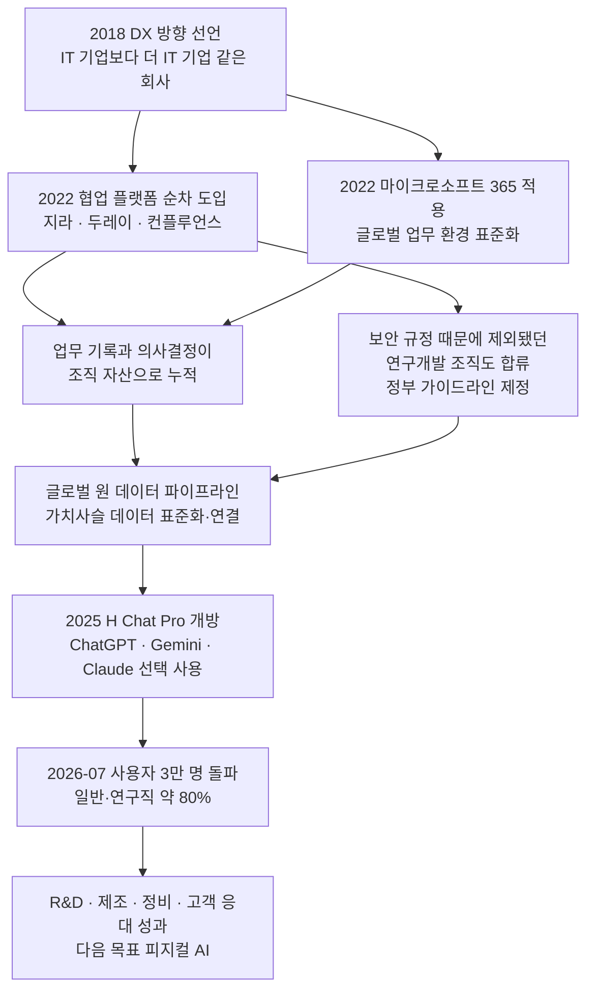
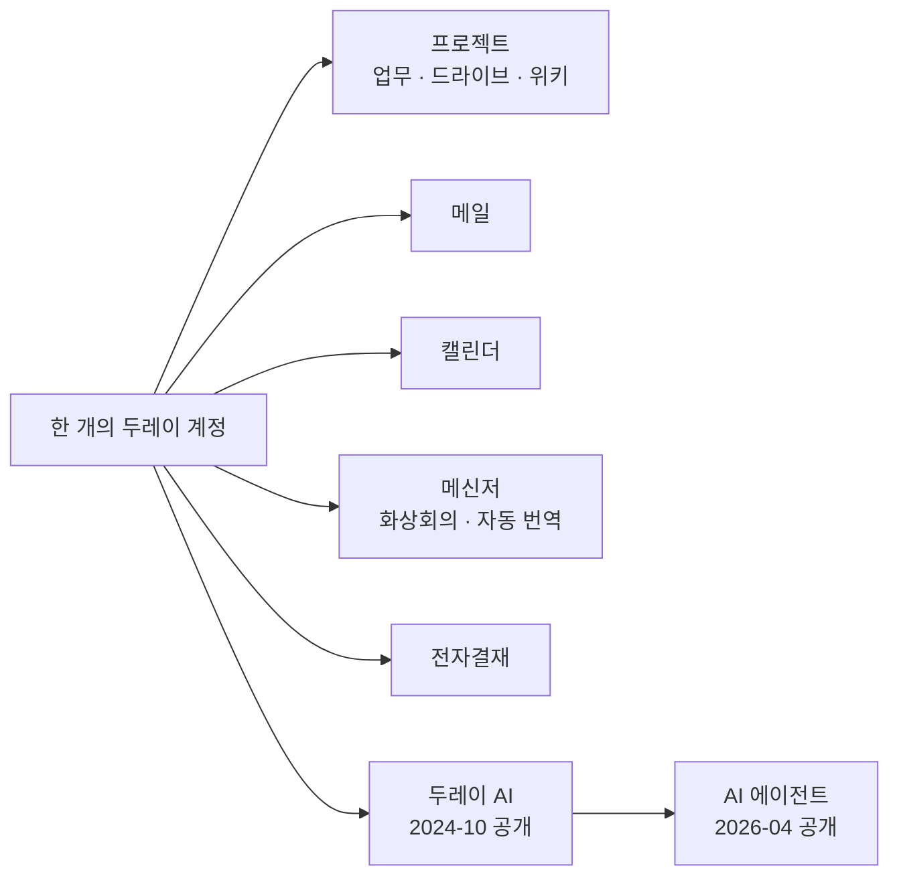
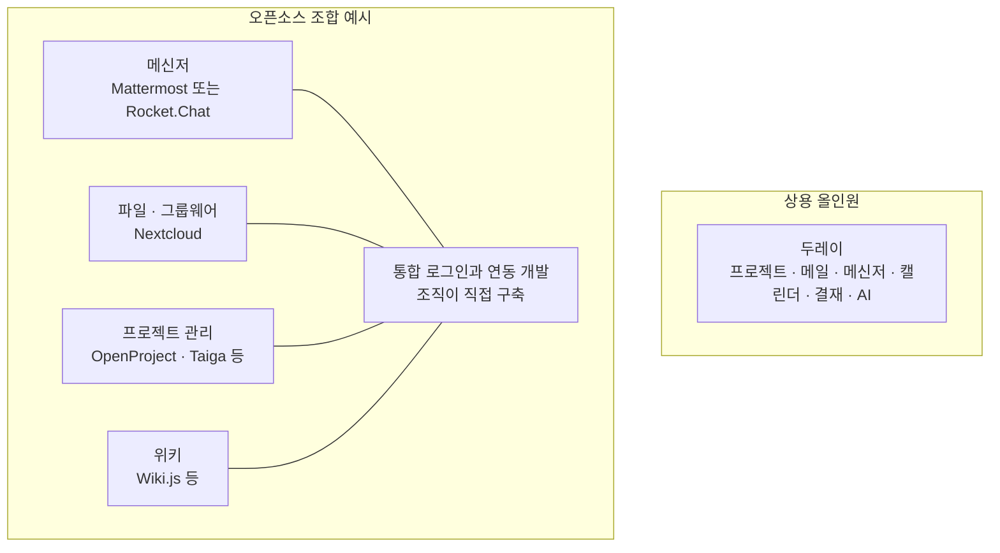
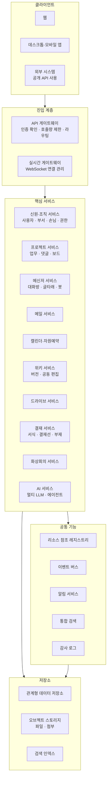
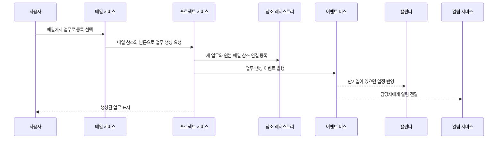
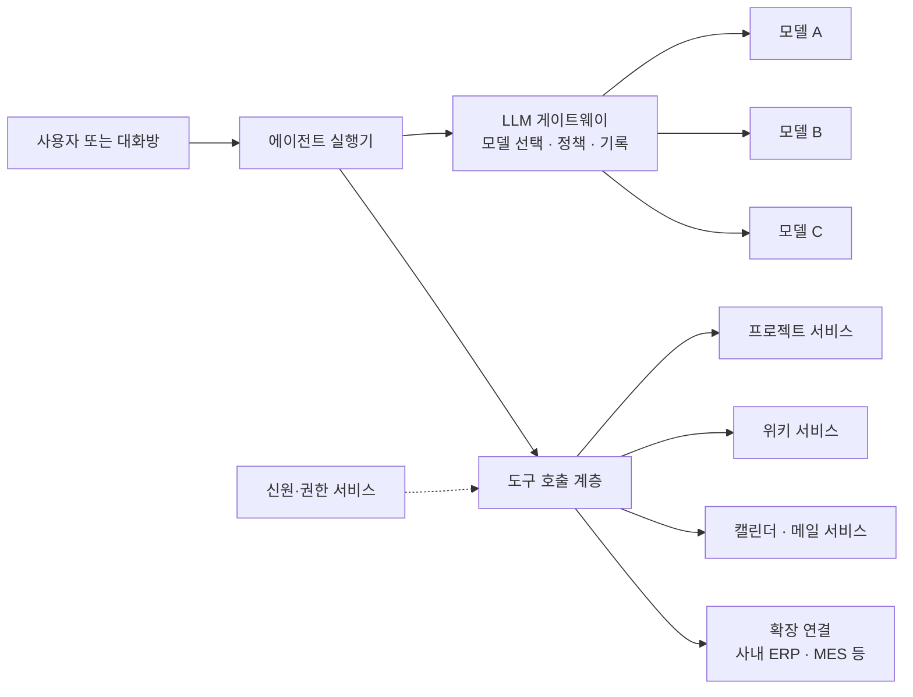
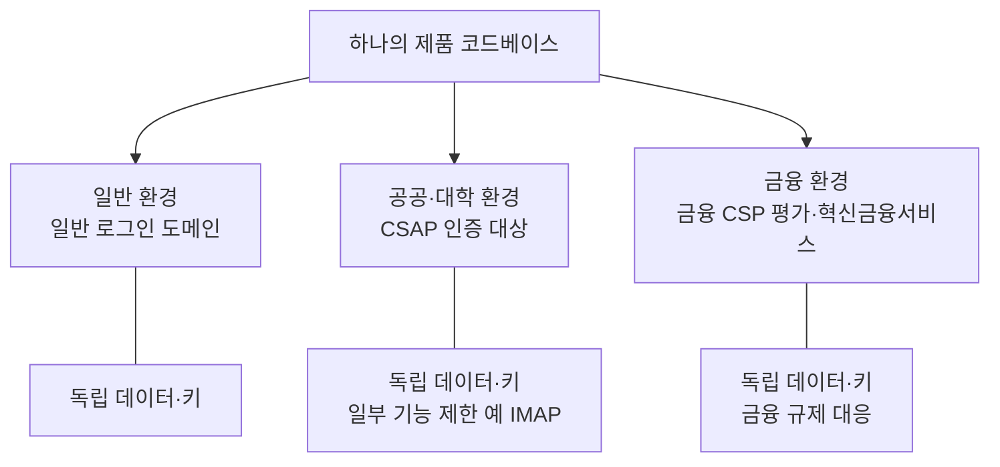
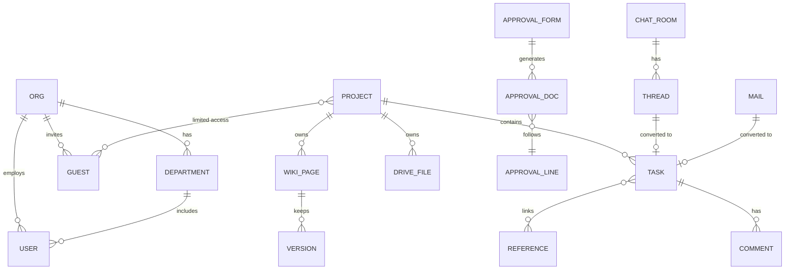

> **한 줄 요약**
> 현대차그룹은 2022년부터 지라(Jira)·두레이(Dooray!)·컨플루언스(Confluence)와 마이크로소프트 365를 순차적으로 도입해 협업 환경을 표준화했고, 이를 토대로 사내 생성형 AI 플랫폼 'H Chat Pro'를 전 임직원에게 열었습니다. 두레이는 NHN에서 분사한 국산 올인원 협업 SaaS이며, 최근에는 AI 에이전트 기능까지 붙이고 있습니다. 반면 "오픈소스로 두레이 같은 올인원 환경을 직접 조립하기는 어렵다"는 주장은 사실을 나열한 것이 아니라 **엔지니어링 관점의 일반적 판단**이므로, 성격을 구분해서 읽어야 합니다.

---

## 0. 이 문서가 다루는 내용

이 문서는 세 덩어리의 문답 내용을 하나로 묶어 검증한 결과입니다. 첫 번째는 "현대차그룹이 어떤 협업 툴을 도입했고, 그것이 AI 전환(AX)과 어떻게 연결되는가"라는 이야기입니다. 두 번째는 "두레이는 어떤 서비스이며 누가 쓰는가"라는 설명입니다. 세 번째는 "두레이 같은 상용 올인원 솔루션을 오픈소스로 대체하기가 왜 어려운가"라는 논지입니다.

검증은 2026년 10월 1일 기준으로 확인할 수 있는 최신 언론 보도와 기업 공식 게시글을 바탕으로 했습니다. 본문에서는 **확인된 사실**, **기업이 스스로 발표한 수치**, **일반적인 판단(추론)** 을 서로 다른 것으로 구분해 적었습니다. 확인하지 못한 내용은 확인하지 못했다고 밝혔습니다.

---

## 1. 현대차그룹은 무엇을 했나

### 1.1 출발점: "IT 기업보다 더 IT 기업 같은 회사"

현대차그룹의 디지털 전환(DX)은 2018년 정의선 회장이 "IT 기업보다 더 IT 기업 같은 회사가 되겠다"는 방향을 밝히면서 구체화되었다고 소개됩니다. 일부 보도는 그룹이 2019년부터 DX와 AX를 추진해 왔다고 표현하는데, 2018년은 선언의 시점이고 2019년은 실제 추진이 본격화된 시점으로 읽으면 두 표현이 충돌하지 않습니다.

### 1.2 2022년, 협업 플랫폼을 한꺼번에가 아니라 "순차적으로" 도입

2022년부터 현대차그룹은 업무 관리·의사결정 기록용 도구인 지라와 두레이, 문서 공동 작성과 지식 공유용 도구인 컨플루언스를 차례로 들여왔습니다. 같은 해에 마이크로소프트의 클라우드 협업 플랫폼인 마이크로소프트 365도 적용해 글로벌 사업장의 업무 환경을 같은 틀로 맞췄습니다.

여기서 눈여겨볼 대목이 하나 있습니다. 자율주행과 수소 같은 연구개발 조직은 국가 핵심기술 관련 보안 규정 때문에 외부 협업 도구를 쓸 수 없었습니다. 그런데 정부 부처가 가이드라인을 신속히 마련해 주면서 이 조직들까지 같은 플랫폼에 올라올 수 있었다고 합니다. 즉 "툴을 샀다"에서 끝난 것이 아니라, **보안 규정이라는 제도적 장벽까지 풀어서 전사 표준을 만들었다**는 점이 이 사례의 핵심입니다.

### 1.3 협업 툴 다음 단계: 흩어진 데이터를 잇는 '글로벌 원 데이터 파이프라인'

협업 툴이 사람의 일을 기록하는 층이라면, 데이터 파이프라인은 기계가 읽을 수 있는 데이터를 잇는 층입니다. 현대차그룹은 연구개발·생산·품질·판매 등 가치사슬 곳곳에 흩어져 있던 데이터를 표준화하고 연결하는 '글로벌 원 데이터 파이프라인'을 만들었다고 밝혔습니다.

### 1.4 그 위에 얹은 AI: H Chat Pro

이 기반 위에서 사내 생성형 AI 플랫폼 'H Chat Pro'가 확산되었습니다. 현대차그룹은 2025년부터 이 플랫폼을 일반 임직원에게 열었고, 보안이 확보된 환경에서 ChatGPT, Gemini, Claude 등 여러 외부 모델 가운데 골라 쓸 수 있게 했습니다. 문서 작성, 정보 탐색, 데이터 분석, 코드 개발에 쓰이며, 최근에는 개발자가 아닌 일반 직원이 업무용 AI 에이전트를 직접 만들어 쓰는 사례도 늘고 있다고 합니다.

### 1.5 2026년 8월 12일 발표회에서 공개된 수치

현대차그룹은 2026년 8월 12일 서울 양재 본사에서 'AX 성과 발표회'를 열고 다음과 같은 성과를 공개했습니다. 아래 수치는 모두 **기업이 직접 발표한 값**이며, 외부 기관이 독립적으로 검증한 것이 아닙니다.

- **이용 규모**: 2026년 7월 기준 H Chat Pro 사용자가 3만 명을 넘었고, 이는 현대차·기아 일반·연구직 임직원의 약 80%에 해당합니다. (현대차그룹 자체 게시글은 이를 "전 직원의 약 80%"로 표현하고, 다수 언론은 "일반·연구직의 약 80%"로 적었습니다. 모수의 표현이 조금 다르므로 정확히는 후자를 따르는 것이 안전합니다.)
- **충돌안전 AI 어시스턴트**: 과거 충돌시험 데이터를 통합 검색·분석해 관련 자료 탐색 시간을 약 90% 줄였다고 합니다.
- **제조 현장**: 비전 AI로 차량 정보를 자동 검증해 연간 약 52억 원(52억 4천만 원으로 보도한 곳도 있음)의 비용을 절감하고 있다고 합니다.
- **정비 지원**: LLM 기반 정비 지원 AI가 정비 대응 시간을 약 42% 줄였다고 합니다.
- **고객 리뷰 대응**: 리뷰 한 건 처리 시간이 평균 35분에서 5분 수준으로 줄었고, 전체 리뷰의 85% 이상이 AI로 처리되고 있으며, 9월부터는 대응 프로세스 전체를 자동화할 계획이라고 합니다.

발표를 주도한 진은숙 현대차·기아 ICT담당 사장은 "AI를 가장 많이 쓰는 기업이 아니라 가장 제대로 활용하는 기업"이 목표라는 취지로 말했고, 향후 차량·로보틱스·제조 현장과 AI가 결합하는 '피지컬 AI'로 범위를 넓히겠다고 밝혔습니다.

### 1.6 전체 흐름을 한 장으로 보면

### 1.7 도구별 역할 분담

현대차그룹이 이 도구들을 각각 어떤 용도로 썼는지에 대해 공개된 설명은 비교적 단순합니다. 지라와 두레이는 업무 진행 현황과 의사결정 사항을 관리하는 쪽이고, 컨플루언스는 문서 공동 작성과 지식 공유를 맡습니다. 마이크로소프트 365는 글로벌 사업장의 업무 환경을 하나로 맞추는 기반입니다. 다만 **지라와 컨플루언스가 구체적으로 어떤 방식으로 연동되는지, 두레이와 지라의 업무 범위를 내부에서 어떻게 나누는지는 제가 찾은 공개 자료에서 확인되지 않았습니다.** 이 부분은 추측하지 않고 비워 두겠습니다.

### 1.8 협업 툴이 가져온 변화, 그리고 그 표현의 출처

협업 툴 도입으로 부서 간 정보와 데이터를 공유하기가 쉬워지고, 필요한 정보를 더 빨리 찾게 되며, 부문 경계를 넘어 함께 문제를 푸는 문화가 퍼졌다는 설명은 현대차그룹의 공식 글에 나옵니다. 업무 진행 상황과 의사결정이 개인이 아니라 조직의 자산으로 쌓인다는 취지의 설명도 같은 맥락입니다. 다만 이것은 회사가 스스로 내린 평가라는 점을 기억해야 합니다.

---

## 2. 두레이(Dooray!)는 어떤 서비스인가

### 2.1 정체와 연혁

두레이는 NHN 그룹 내부의 업무 채널로 출발해 2019년 9월 외부 서비스를 시작한 올인원 협업 서비스입니다. 2021년 8월 1일 독립 법인 'NHN두레이'로 분사했고, 당시 NHN의 완전 자회사로 독립했습니다. 대표는 두레이의 탄생부터 사업을 이끌어 온 백창열 대표입니다. 따라서 "NHN의 자회사가 만든 국산 협업 플랫폼"이라는 설명은 맞습니다.

### 2.2 올인원이라는 말의 구체적 의미

올인원이란 여러 협업 기능을 한 계정, 한 플랫폼 안에서 쓸 수 있다는 뜻입니다. 공식 설명 기준으로 두레이는 프로젝트(업무·드라이브·위키), 메일, 메신저, 캘린더, 전자결재를 하나로 통합해 SaaS로 제공합니다. 초기부터 공동 편집, 화상회의, 무료 통화, 자동 번역 같은 온라인 협업 기능을 갖췄다고 소개되었고, AI 기반 한일·일한 번역 기능이 탑재되었다는 보도도 있습니다.

### 2.3 누가 쓰는가

- **공공·연구·교육**: 서울대학교, KAIST, 한국은행, KIST, KDI, ETRI 등이 도입한 기관으로 보도되었습니다. 회사는 2025년 초 기준으로 공공기관 120여 곳 이상이 두레이를 쓰며 공공 협업툴 시장 점유율 1위라고 밝혔습니다. 우주항공청과 국방부에도 도입되었다는 보도가 있습니다.
- **금융**: 2024년 12월 국내 협업툴 최초로 금융위원회 혁신금융서비스 지정을 받았고, 이후 우리금융그룹(15개 계열사), DB손해보험, IBK기업은행 등으로 확산되었습니다. 2026년 4월 기자간담회에서는 25개 금융기관이 도입했다고 발표되었습니다. 우리금융 측 담당자는 국산·외산 약 10개 솔루션을 검토한 끝에 비용 경쟁력, 커스터마이징 유연성, 올인원 기능 통합을 이유로 두레이를 골랐다고 밝혔습니다.
- **민간 대기업**: 현대차그룹이 2022년부터 지라·컨플루언스와 함께 두레이를 도입했다는 점은 여러 보도와 현대차그룹 자체 글에서 일치합니다.

회사가 밝힌 성장 지표로는 최근 3년간 SaaS 부문 구독 매출이 연평균 40% 성장했다는 발표(2026년 4월)가 있습니다. 이 역시 회사 발표입니다.

### 2.4 AI 기능: 대화형에서 행동형으로

두레이는 2024년 10월 'Dooray! AI'를 공개했습니다. 챗GPT, 제미나이, 클로드 등 여러 거대언어모델(멀티 LLM)을 고객사의 보안 환경과 업종에 맞춰 쓸 수 있는 방식입니다. 이어 2026년 4월 28일 기자간담회에서는 두 번째 단계인 'Dooray! AI Agent'를 선보였습니다. 요약·질의응답을 넘어 실제로 업무를 수행하는 '행동형' 에이전트라는 것이 회사의 설명입니다. 에이전트는 네 종류로 소개되었습니다.

1. **마이 에이전트**: 사용자의 메일, 캘린더, 개인 위키를 종합해 오늘의 일정과 할 일을 정리하고 우선순위를 제안하는 개인 비서입니다.
2. **프로젝트 에이전트**: 특정 프로젝트 안의 업무·위키·캘린더 데이터를 바탕으로 업무 조회·생성·수정, 댓글 추가, 위키 검색 등을 합니다.
3. **익스텐션 에이전트**: 두레이와 연결되어 있지 않은 사내 시스템(ERP, MES 등)이나 데이터베이스를 두레이가 제공하는 파이썬 기반 SDK로 이어 붙이는 방식입니다. 예컨대 인사 시스템을 연결하면 간단한 명령으로 휴가나 연장근로를 신청할 수 있다고 설명했습니다.
4. **빌트인 에이전트**: 특정 업무에 특화된 에이전트입니다.

에이전트는 일반 사용자 계정과 비슷한 수준으로 메신저 대화방에 초대되어 팀원처럼 일할 수 있고, 여러 에이전트를 동시에 쓰는 것도 가능하다고 합니다. 한편 에이전트 도입으로 요금제 변화가 불가피하다는 보도도 있었는데, 구체적인 요금은 제가 확인한 자료에 없습니다. 2026년 6월에는 공공 AI 박람회에 참가해 행정기관과 지자체에도 같은 서비스를 제안했습니다.

---

## 3. "오픈소스로 두레이 같은 환경을 만들기는 어렵다"는 주장

### 3.1 먼저 이 주장의 성격부터

앞선 문답은 이 주장에 "맞습니다"라고 답했지만, 이 문장은 뉴스로 확인되는 사실이 아닙니다. 특정 사례를 조사해서 나온 결론이 아니라 소프트웨어 통합과 운영에 관한 **일반적인 엔지니어링 경험칙**입니다. 그래서 이 문서는 "틀렸다"가 아니라 "합리적인 판단이지만 조건에 따라 달라진다"고 정리합니다. 또한 제가 확인한 자료 어디에도 **현대차그룹이 오픈소스 조합을 검토했다가 포기했다는 내용은 없습니다.** 그룹이 상용 플랫폼을 고른 이유를 오픈소스와 비교해서 설명한 자료도 찾지 못했습니다. 따라서 "현대차그룹 같은 대기업은 이 이유 때문에 상용을 택한다"는 문장은 추정입니다.

### 3.2 오픈소스로 조립한다는 것이 구체적으로 무엇인가

두레이가 한 계정 안에서 제공하는 기능을 오픈소스로 채우려면 영역마다 다른 소프트웨어를 골라야 합니다. 이번에 확인한 2026년 비교 글들에서 자주 거론되는 후보는 다음과 같습니다.

- **팀 메신저**: 마터모스트(Mattermost)는 개발자·DevOps 중심 채팅으로, 로켓챗(Rocket.Chat)은 슬랙 대체와 고객 대응(옴니채널)까지 포함하는 도구로 소개됩니다. 두 제품 모두 팀 에디션·커뮤니티 에디션은 MIT 라이선스로 소개되며, 유료 엔터프라이즈 요금제가 따로 있습니다.
- **파일·그룹웨어**: 넥스트클라우드(Nextcloud)는 파일 동기화, 화상 통화(Talk), 오피스 편집, 캘린더 등을 묶어 제공하는 자체 호스팅 협업 허브로 평가됩니다.
- **프로젝트 관리**: 오픈프로젝트(OpenProject), 타이가(Taiga), 플레인(Plane), 위칸(Wekan) 등이 거론됩니다.
- **위키·문서**: 위키.js(Wiki.js) 등이 등장합니다. 앞선 문답에 나온 레드마인, 북스택, 아웃라인, 짐브라는 이번 검색의 비교 자료에서는 직접 확인하지 못했으므로, 이 문서에서는 "해당 문답이 든 예시"로만 취급합니다.

### 3.3 어려움을 말하는 네 가지 논거, 어디까지 뒷받침되는가

**① 파편화된 솔루션을 직접 이어야 한다.** 여러 제품을 조합할 때 API 연동과 단일 로그인(SSO) 구축이 필요하다는 점은 일반적으로 맞습니다. 다만 넥스트클라우드처럼 파일·화상통화·캘린더를 한 제품에 묶어 둔 사례도 있어서, "모든 영역이 완전히 따로 논다"고까지 말하는 것은 과장입니다.

**② 화면과 사용 방식이 제각각이라 경험이 끊긴다.** 서로 다른 개발 주체가 만든 제품이면 화면이 통일되기 어렵다는 것은 합리적인 설명입니다. 다만 사용자 교육비가 "크게" 늘어난다는 정도는 조직마다 다르며 수치로 확인된 바는 없습니다.

**③ 라이선스는 무료지만 인프라와 인력은 조직 몫이다.** 이 대목은 외부 자료와도 일치합니다. 이번에 확인한 비교 자료 중에는 마터모스트와 로켓챗 모두 자체 호스팅 설치와 업그레이드에 관리자의 전문성이 필요하고, 이것이 안정성과 사용 경험에 영향을 준다고 지적한 것이 있습니다. 로켓챗을 두고도 직접 운영할 DevOps 역량이 있을 때에 한해 자유도가 높다고 평가한 글이 있었습니다. 다만 "버전 충돌로 전체 시스템이 마비될 위험을 상시 안는다"는 표현은 가능성의 서술이지 측정된 사실이 아닙니다.

**④ 모바일 앱과 푸시 알림 운영이 까다롭다.** 기업 보안 정책에 맞춘 커스텀 빌드와 스토어 배포·갱신 부담은 업계에서 흔히 제기되는 우려입니다. 다만 이번 조사에서 이 항목을 직접 검증한 자료는 찾지 못했으므로 "합리적 추론" 정도로 보는 것이 정확합니다.

### 3.4 "그래서 TCO(총소유비용)가 상용 구독보다 훨씬 크다"는 결론

이 결론은 **조직의 규모와 인력, 보안 요구에 따라 뒤집힐 수 있는 조건부 명제**입니다. 자체 호스팅 서비스에 쓸 DevOps 인력이 이미 있고, 데이터를 반드시 사내에 두어야 하며, 필요한 기능이 채팅이나 파일 공유처럼 좁다면 오픈소스가 합리적일 수 있습니다. 반대로 메일·결재·위키·메신저·프로젝트를 한 번에, 그것도 컴플라이언스 인증까지 갖춘 형태로 원한다면 올인원 SaaS가 유리하다는 쪽이 설득력을 얻습니다. 실제로 우리금융그룹은 약 10개 솔루션을 비교한 끝에 비용 경쟁력과 올인원 통합을 이유로 두레이를 골랐다고 밝혔는데, 이는 "상용 올인원이 선택되는 현실적 이유"를 보여 주는 사례일 뿐, 오픈소스와 직접 맞붙은 비교는 아닙니다.

---

## 4. 종합 판정

| 앞선 문답의 주장 | 확인 결과 |
|---|---|
| 2022년부터 지라·두레이·컨플루언스 순차 도입 | **확인됨.** 다수 언론과 현대차그룹 자체 글이 일치 |
| 같은 시기 마이크로소프트 365 활용, 글로벌 환경 표준화 | **확인됨.** 2022년 적용, 글로벌 사업장 업무 환경 표준화 |
| 업무 기록·의사결정이 조직 자산으로 누적, 정보 공유 투명성 향상 | **회사의 공식 설명으로 확인됨.** 다만 자체 평가이며 독립 검증은 아님 |
| 협업 환경 정비가 H Chat Pro 안착과 AX로 이어짐 | **회사의 서사로 확인됨.** 3만 명, 일반·연구직 약 80%는 회사 발표 수치 |
| 두레이는 NHN의 자회사가 만든 국산 올인원 협업 SaaS | **확인됨.** 2019년 서비스 시작, 2021년 8월 분사 |
| 두레이 주요 기능: 프로젝트·메신저·메일·캘린더·드라이브·위키·전자결재 | **확인됨.** 근무 관리 기능은 이번 자료에서 별도로 확인하지 못함 |
| 한국은행, ETRI, 서울대, 금융권이 사용 | **확인됨.** 금융위 혁신금융서비스 지정은 2024년 12월 |
| 현대차그룹은 외산 툴과 두레이를 "글로벌 업무 공조 효율화를 위해" 유기적으로 조합한 대표 사례 | **절반만 확인.** 세 도구를 함께 도입한 것은 사실이나, 그 목적과 조합 방식에 대한 공개 설명은 찾지 못함 |
| 오픈소스로 올인원 환경을 직접 조립하기는 어렵고 TCO가 더 커진다 | **일반적 추론.** 일부 근거는 있으나 조건부이며, 현대차그룹의 선택 이유로 연결할 근거는 없음 |

---

## 5. 이 문서의 한계

첫째, 현대차그룹의 성과 수치는 대부분 2026년 8월 12일 발표회에서 회사가 밝힌 것이어서 독립적으로 검증되지 않았습니다. 둘째, 두레이의 고객사 수와 매출 성장률 역시 회사의 기자간담회와 보도자료에 의존합니다. 셋째, 오픈소스 제품들의 라이선스와 요금 정책은 자주 바뀌므로, 실제 도입을 검토한다면 각 프로젝트의 공식 문서에서 최신 조건을 직접 확인해야 합니다. 넷째, 두레이의 에이전트 요금 체계처럼 아직 구체적으로 알려지지 않은 정보는 이 문서에서 추측하지 않았습니다.

---

## 참고 자료

- 머니투데이, "현대차그룹, AI로 일하는 방식 바꿨다" (2026-08-12): https://www.mt.co.kr/industry/2026/08/12/2026081117141659163
- 스마트투데이, "현대차그룹, AX 성과 발표회 개최": https://www.smarttoday.co.kr/ko-kr/articles/110384
- 현대자동차그룹 공식 스토리, "현대차그룹이 AI를 경쟁력으로 만드는 방법": https://www.hyundaimotorgroup.com/ko/story/hyundai-motor-group-ai-competitiveness
- 더피알, "AI보다 '일하는 방식' 먼저 바꿨다…현대차그룹의 AX 공식": https://www.the-pr.co.kr/news/articleView.html?idxno=62254
- 이지경제, "현대차그룹, AI 전환 본격화…'H Chat Pro' 사용자 3만명 돌파": https://www.ezyeconomy.com/news/articleView.html?idxno=238638
- 네이트뉴스(스마트비즈), "현대차그룹, 전사 AI 전환 가속": https://m.news.nate.com/view/20260812n24888
- 지디넷코리아, "NHN, 비즈니스 SaaS 법인 'NHN두레이' 설립" (2021): https://zdnet.co.kr/view/?no=20210803094124
- 비즈워치, "NHN, 계열사 상장 본격화…내후년엔 '두레이'" (2021): https://news.bizwatch.co.kr/article/industry/2021/11/16/0022
- 비즈워치, "NHN, 협업툴 'AI 두레이'로 승부수" (2024): https://news.bizwatch.co.kr/article/mobile/2024/10/15/0046
- 뉴스토마토, "NHN두레이, 지난해 매출 30% 성장…금융·공공 시장 공략 박차" (2025): https://www.newstomato.com/ReadNews.aspx?no=1253876
- 지디넷코리아, "'AI가 직접 업무 수행'…협업툴 NHN두레이, '행동형 에이전트'로 차별화" (2026-04): https://zdnet.co.kr/view/?no=20260429082202
- 딜사이트, "NHN두레이, AI 에이전트 4종 공개…공공·금융 공략" (2026-04): https://dealsite.co.kr/articles/160986/068020
- NHN 공식 블로그(INSIDE NHN), "NHN두레이, AI 에이전트 시대 속 '올인원' 데이터로 협업의 패러다임을 바꾸다" (2026-05-22): https://inside.nhn.com/tech/306
- 이투데이, "NHN두레이, '2026 공공 AI 박람회' 참가": https://www.etoday.co.kr/news/view/2596298
- ONES, "10 Best Open Source Collaboration Software Picks for 2026": https://ones.com/blog/10-best-open-source-collaboration-software-picks-for-2026/
- Meetrix, "Best Collaboration Tools on AWS Marketplace (2026)": https://meetrix.io/blogs/best-collaboration-tools-aws-marketplace/
- Rework, "Best Mattermost Alternatives in 2026": https://resources.rework.com/tools/productivity/best-mattermost-alternatives
- WorldMetrics, "Top 10 Best Opensource Collaboration Software of 2026": https://worldmetrics.org/best/opensource-collaboration-software/

---

작성일: 2026년 10월 1일

# 별첨. Dooray 같은 올인원 협업 솔루션을 만들기 위한 기능 요구사항과 시스템 아키텍처

> 본문 보고서(「현대차그룹의 협업 플랫폼 도입, NHN 두레이(Dooray!), 그리고 오픈소스 대체의 현실」)의 별첨입니다.
> **한 줄 요약**: 두레이가 공개한 기능을 기준으로 요구사항을 도출하면 "업무(프로젝트)를 중심축으로 메신저·메일·캘린더·위키·드라이브·결재·AI가 한 계정, 한 데이터 모델 위에서 서로를 참조하는 구조"가 핵심입니다. 이 구조를 만들려면 개별 기능보다 **공통 신원·조직 모델, 객체 간 참조 모델, 이벤트 연동, 환경 분리, 보안 인증**을 먼저 설계해야 합니다.

---

## 0. 이 별첨을 읽기 전에: 무엇이 사실이고 무엇이 설계 제안인가

이 문서에는 성격이 다른 세 종류의 내용이 섞여 있습니다. 독자가 구분할 수 있도록 먼저 밝혀 둡니다.

첫째는 **두레이의 공개 기능**입니다. 두레이 공식 서비스 소개 페이지에서 직접 확인한 내용으로, 요구사항 도출의 근거가 됩니다. 둘째는 **표준·제도·오픈소스 구성요소의 공식 설명**입니다. CSAP 인증 체계, Keycloak, Yjs, LiveKit 등이 여기에 해당합니다. 셋째는 **이 문서가 제안하는 설계**입니다. 이것은 공개된 기능 요건을 만족시키기 위해 일반적인 소프트웨어 설계 원칙으로 도출한 것이지, **두레이의 실제 내부 구조가 아닙니다.** 두레이의 내부 아키텍처(서버 구성, 데이터베이스 선택 등)는 제가 확인한 공개 자료에 나오지 않았으므로 추측하지 않았습니다. 이 점을 혼동하지 않고 읽으시면 됩니다.

범위는 사용자가 지정한 대로 "기능 요구사항과 시스템 아키텍처"이며, 개발 일정·인력·비용은 다루지 않았습니다.

---

## 1. 제품의 정체성: 무엇을 만드는가

### 1.1 두레이의 공개 구성

두레이 공식 사이트가 소개하는 서비스 메뉴는 열두 가지입니다. 프로젝트, 메신저, 메일, 화상회의, 드라이브, 위키, 캘린더, 주소록, 결재, 홈/게시판, 자원예약, 폼입니다. 여기에 2024년 10월에 공개된 'Dooray! AI'와 2026년 4월에 공개된 'Dooray! AI Agent'가 더해졌습니다. 또한 로그인 진입점이 일반, 공공기관·대학교, 금융 세 갈래로 나뉘어 있고, 한국어·영어·일본어 화면을 제공하며, 별도의 API 문서(Dooray! API)가 공개되어 있습니다.

### 1.2 설계 철학으로 읽을 수 있는 대목

공식 소개 문구는 두레이를 "프로젝트 협업을 기반으로 메신저, 메일, 전자결재까지 기업에 필요한 모든 협업을 올인원으로 제공"하는 서비스라고 설명합니다. 즉 **프로젝트가 중심축**입니다. 기능 소개를 읽어 보면 이 철학이 곳곳에서 드러납니다. 업무 안에서 다른 업무·위키 문서·드라이브 파일을 참조할 수 있고, 메일 본문을 업무나 일정으로 바로 등록할 수 있고, 메신저의 글타래를 업무로 바로 등록할 수 있고, 업무 만기일이 캘린더에 나타납니다. 다시 말해 "올인원"은 메뉴가 많다는 뜻이 아니라 **기능들이 서로를 데이터로 참조하고 변환할 수 있다**는 뜻입니다. 이 점이 요구사항과 아키텍처 전체를 결정합니다.

---

## 2. 기능 요구사항

아래 요구사항은 두레이 공식 서비스 소개 페이지에 명시된 기능을 바탕으로 정리했습니다. 각 항목에 번호(FR-도메인-순번)를 붙였습니다.

### 2.1 공통 기반

모든 도메인이 공유하는 기반 요구사항입니다. 공식 소개에서 직접 확인되는 것은 "한 계정으로 여러 서비스를 쓴다", "손님을 초대한다", "다국어를 지원한다", "API를 제공한다" 정도이며, 나머지는 이를 성립시키기 위해 필요한 요건으로 제가 풀어 쓴 것입니다.

- **FR-COM-01 단일 계정과 조직 모델**: 조직(회사)·부서·사용자 계층을 갖고, 한 번의 로그인으로 모든 서비스에 접근합니다. 결재선이 사용자 또는 부서로 지정되므로(결재 항목 참조) 부서가 일급 객체여야 합니다.
- **FR-COM-02 손님(외부 사용자) 모델**: 외부 협력업체를 손님으로 초대하면, 손님은 초대받은 프로젝트에만 접근해 업무와 댓글을 조회·등록할 수 있습니다. 메신저도 손님과 함께 쓸 수 있습니다. 손님은 조직 구성원과 다른 권한 등급이어야 합니다.
- **FR-COM-03 객체 간 참조**: 업무가 다른 업무, 위키 문서, 드라이브 파일을 참조하고, 참조된 항목이 제목·아이콘·상태로 표시되어야 합니다. 이를 위해 모든 서비스의 객체가 공통된 방식의 식별자를 가져야 합니다.
- **FR-COM-04 객체 변환**: 메일 → 업무/일정, 메신저 글타래 → 업무 같은 서비스 간 변환이 본문 복사 없이 가능해야 합니다.
- **FR-COM-05 다국어**: 한국어·영어·일본어 UI. 메신저와 메일의 자동 번역(아래 참조)은 별도 기능입니다.
- **FR-COM-06 공개 API**: 외부 시스템이 업무·메신저 등을 다룰 수 있는 API와 인증 방식을 제공합니다. (공식 사이트에 'Dooray! API' 문서가 별도로 있습니다.)
- **FR-COM-07 다중 클라이언트**: 웹 외에 내려받아 쓰는 클라이언트(공식 사이트에 다운로드 메뉴가 있음)를 제공합니다. 어떤 운영체제를 지원하는지는 이번에 확인하지 않았습니다.

### 2.2 프로젝트(업무 관리)

- **FR-PRJ-01 보드 뷰와 플래닝 뷰**: 업무 진행 상황을 한눈에 볼 수 있는 보드와 계획 중심의 플래닝 두 가지 보기를 제공합니다.
- **FR-PRJ-02 업무 객체**: 담당자·기한을 지정하고 진행 상태를 추적하며, 댓글을 달 수 있습니다.
- **FR-PRJ-03 만기일의 캘린더 반영**: 업무에 지정한 만기일이 캘린더에 즉시 나타납니다.
- **FR-PRJ-04 참조**: 업무 안에서 다른 업무·위키·드라이브 파일을 참조합니다(FR-COM-03).
- **FR-PRJ-05 손님 협업**: 프로젝트 단위로 외부 손님을 초대하고, 손님의 접근을 그 프로젝트로 한정합니다(FR-COM-02).
- **FR-PRJ-06 프로젝트 단위 자산 묶음**: 프로젝트마다 드라이브·위키·캘린더가 딸려 있어야 합니다. 공식 소개가 "프로젝트와 함께 쓰는 서비스"로 드라이브, 위키, 캘린더를 제시하기 때문입니다.

### 2.3 메신저

- **FR-MSG-01 주제별 그룹 대화**: 그룹 대화방을 만들 수 있습니다.
- **FR-MSG-02 메시지 수정·삭제 허용 기간 설정**: 일정 기간 내 수정과 삭제를 허용하는 정책을 관리자가 조절할 수 있어야 합니다.
- **FR-MSG-03 멘션과 모아보기**: 특정 멤버를 @멘션하고, 자신을 멘션한 메시지만 따로 볼 수 있습니다.
- **FR-MSG-04 자료 보관함과 검색**: 이미지·문서·비디오·링크 등 유형별로 보관하고 검색합니다.
- **FR-MSG-05 실시간 번역**: 메시지를 입력하면 상대의 언어로 자동 번역됩니다.
- **FR-MSG-06 글타래(스레드)**: 하나의 주제에 집중해 대화하고, 원하는 글타래만 팔로우하거나 취소할 수 있으며, 글타래를 바로 업무로 등록합니다.
- **FR-MSG-07 리액션**: 이모지로 간편하게 반응합니다.
- **FR-MSG-08 즉시 화상회의**: 채팅 중에 한 번에 화상회의를 시작합니다.
- **FR-MSG-09 슬래시 커맨드와 알림 봇**: 투표·선착순·스크럼 같은 명령을 사용자가 직접 만들 수 있고, 장애 알림·전자결재·사내 공지 같은 정보를 알림 봇으로 받습니다.
- **FR-MSG-10 손님 참여**: 외부 사용자와 메신저를 함께 씁니다(FR-COM-02).
- **FR-MSG-11 타 서비스 알림 수신**: 메일 도착 알림, 올린 기안 확인이 메신저에서 가능해야 합니다. 공식 소개가 메일·결재와 메신저의 연동을 직접 언급합니다.

### 2.4 메일

- **FR-MAIL-01 조직 도메인 메일**: 조직의 도메인으로 메일 주소를 만들어 쓸 수 있고, 가입 상품에 따라 여러 개의 자체 도메인을 쓸 수 있습니다.
- **FR-MAIL-02 메일 → 업무·일정 등록**: 본문을 복사하지 않고 업무나 일정으로 등록합니다.
- **FR-MAIL-03 메일 자동 번역**: 한 번의 클릭으로 한국어로 번역합니다.
- **FR-MAIL-04 발송 취소**: 같은 도메인으로 보낸 메일에 한해 취소할 수 있으며, 수신자가 읽기 전이거나 발송 후 24시간 이내일 때만 가능합니다. 요구사항에는 이 두 가지 조건이 그대로 포함되어야 합니다.
- **FR-MAIL-05 IMAP 연동**: 외부 메일 클라이언트에서 IMAP으로 쓸 수 있고, 연결 시 별도의 비밀번호를 관리해 단말을 잃어버려도 계정을 안전하게 지킬 수 있게 합니다. 단, 공식 소개는 **공공기관에는 IMAP이 제공되지 않는다**고 명시합니다. 즉 환경(일반/공공/금융)에 따라 기능 제공 범위가 달라지는 요건이 존재합니다.
- **FR-MAIL-06 대화방별 메일 설정**: 메신저의 대화방에 메일을 연결해 내용을 확인할 수 있습니다.

### 2.5 위키

- **FR-WIKI-01 마크다운 에디터**: 글자만으로 서식을 적용합니다.
- **FR-WIKI-02 발표/회의 모드**: 클릭 한 번으로 프레젠테이션 모드로 전환합니다.
- **FR-WIKI-03 외부 공유**: 위키 문서를 조직 밖의 사람에게 공유합니다.
- **FR-WIKI-04 버전 관리**: 모든 변경 이력이 자동 저장되고, 누가 무엇을 바꿨는지 확인하며 이전 버전으로 되돌릴 수 있습니다.
- **FR-WIKI-05 공동 편집**: 공식 소개는 "함께 문서를 완성해 나간다"고 표현합니다. 동시에 여러 사람이 편집하는 방식(동시 커서 표시 여부 등)의 세부는 이번에 확인하지 못했으므로, 요구사항으로는 "여러 사람이 같은 문서를 충돌 없이 수정할 수 있다" 수준으로 잡는 것이 안전합니다.

### 2.6 결재

- **FR-APR-01 서식 직접 제작**: 회사가 쓰는 결재 서식을 드래그 앤 드롭으로 만들고 관리합니다.
- **FR-APR-02 결재선**: 개인용·공용 결재선을 설정하고 자주 쓰는 결재선을 등록하며, 결재선의 대상은 사용자 또는 부서입니다.
- **FR-APR-03 합의 단계 등 다양한 결재 유형**: 결재 흐름에 '합의' 같은 단계가 존재합니다(공식 소개 문구에서 확인).
- **FR-APR-04 부재 시 처리**: 부재 사유와 일정을 표시하고, 부재 시 결재를 어떻게 처리할지 설정합니다.
- **FR-APR-05 서식 공개 범위**: 부서별로 서식을 공개할 범위를 정합니다.
- **FR-APR-06 메신저 연동**: 올린 기안을 메신저에서 바로 확인합니다.

### 2.7 그 밖의 서비스

화상회의, 드라이브, 캘린더, 주소록, 홈/게시판, 자원예약, 폼은 공식 서비스 메뉴에 존재하는 항목입니다. 이번 조사에서는 이 서비스들의 세부 기능까지는 확인하지 않았습니다. 따라서 이 문서는 세부 요구사항을 만들어 내지 않고, 다음과 같이 **확인된 연결 관계만** 요구사항으로 남깁니다.

- 화상회의는 무료로 쓸 수 있고, 채팅 중에도 바로 시작할 수 있으며, 위키에 쓴 내용을 회의에서 함께 보고 논의할 수 있어야 합니다.
- 드라이브는 프로젝트별로 대용량 파일을 보관·공유하는 용도로 쓰이고(공식 소개의 서비스 설명 기준), 업무에서 참조됩니다.
- 캘린더는 업무 만기일과 메일에서 등록한 일정을 보여 줍니다.

세부 기능은 도입 단계에서 공식 도움말을 근거로 별도 확정해야 합니다.

### 2.8 AI 기능

- **FR-AI-01 멀티 LLM**: 챗GPT·제미나이·클로드 등 여러 거대언어모델 가운데 고객사의 보안 환경과 업종에 맞는 것을 고를 수 있어야 합니다.
- **FR-AI-02 일상 업무 지원**: 메일 요약과 초안 작성 같은 실무 기능을 제공합니다. 고객이 AI 챗봇을 한 번의 클릭으로 만드는 기능도 2024년 공개 당시 소개되었습니다.
- **FR-AI-03 에이전트(행동형 AI)**: 단순 질의응답을 넘어 두레이 안에 쌓인 업무 데이터를 직접 활용해 업무를 수행합니다. 4종이 소개되었습니다. 마이 에이전트는 메일·캘린더·개인 위키를 종합해 일정과 할 일을 요약하고 우선순위를 제안합니다. 프로젝트 에이전트는 프로젝트의 업무·위키·캘린더 데이터를 바탕으로 업무 조회·생성·수정, 댓글 추가, 위키 조회·검색을 합니다. 익스텐션 에이전트는 ERP·MES 같은 사내 시스템이나 데이터베이스를 파이썬 기반 SDK로 연결합니다. 빌트인 에이전트는 특정 업무에 특화되어 있습니다.
- **FR-AI-04 에이전트의 대화방 참여**: 에이전트가 일반 사용자 계정과 비슷한 수준으로 메신저 대화방에 초대되어 팀원처럼 일하고, 여러 에이전트를 동시에 쓸 수 있습니다.

### 2.9 비기능 요구사항

**환경 분리**: 두레이는 일반, 공공기관·대학교, 금융 로그인 진입점이 따로 있습니다. 이는 단순한 링크 분리가 아니라 **서로 다른 규제 환경을 서로 다른 운영 단위로 다룬다**는 설계 요건으로 읽는 것이 자연스럽습니다. 공공은 CSAP 인증, 금융은 금융 CSP 안정성 평가와 혁신금융서비스 지정이라는 별도의 제도를 거쳤다는 보도와도 맞물립니다. (진입점이 분리되어 있다는 것까지가 확인된 사실이고, 내부적으로 인프라를 물리 분리했는지는 확인하지 못했습니다.)

**보안 인증(공공 시장 진출 요건)**: 국가·공공기관 업무를 위해 클라우드 서비스를 제공하려는 사업자는 CSAP(클라우드서비스 보안인증)을 받아야 합니다. 한국인터넷진흥원(KISA) 안내에 따르면 SaaS 표준등급은 관리적·기술적 및 공공기관용 추가 보호조치로 총 13개 분야 79개 통제항목으로 구성되고, 간편등급은 11개 분야 31개 통제항목이며, 유효기간은 5년입니다. (다른 평가기관 안내에는 표준등급이 78개 통제항목으로 적힌 자료도 있어, 기준 개정 시점에 따라 숫자가 다를 수 있습니다. 실제 신청 시에는 최신 고시를 확인해야 합니다.) 또한 최근에는 상·중·하 등급제가 도입되어, 하 등급이 먼저 시행되었고 상·중 등급은 별도 기준 검증을 거쳐 추가되는 방식이라고 안내됩니다. 등급은 시스템이 다루는 정보의 민감도에 따라 나뉘는데, 개인정보가 없는 공개 데이터를 다루는 시스템이 하, 비공개 업무자료를 다루는 시스템이 중, 민감정보를 포함하거나 행정 내부 업무를 운영하는 시스템이 상으로 설명됩니다. 협업 도구는 메일·결재·위키에 내부 문서가 담기므로, 공공 시장을 목표로 한다면 높은 등급 요구를 염두에 두어야 한다는 것이 합리적인 해석이나, 어느 등급이 적용될지는 인증기관과 고객 기관의 판단 사항입니다.

**금융 시장 요건**: 두레이는 금융 CSP 안정성 평가(금융보안원 평가)를 마쳤고, 2024년 12월 금융위원회 혁신금융서비스로 지정되었습니다. 이후 금융위가 침해사고 대응기관 평가를 거친 SaaS에는 혁신금융서비스 심사를 생략하는 개정안을 사전 예고했다는 보도가 있었습니다. 금융 시장을 노린다면 이 제도 변화를 추적해야 합니다.

**글로벌·다국어**: 영어·일본어 UI와 자동 번역은 앞서 요구사항에 포함했습니다.

**감사·접근 통제**: 손님 접근 제한, 부서별 서식 공개 범위, 부재 시 위임 같은 기능이 권한 모델을 요구한다는 것은 확인되지만, 감사 로그의 구체적 요건은 공식 소개 페이지에서 확인되지 않았습니다. 일반적인 보안 인증 대응을 위해 필요할 가능성이 높으나, 구체 항목은 인증 기준 문서로 확정해야 합니다.

---

## 3. 시스템 아키텍처 (설계 제안)

### 3.1 설계 목표

앞의 요구사항에서 아키텍처가 반드시 풀어야 할 다섯 가지 문제가 도출됩니다.

1. **서비스 간 참조와 변환**: 업무가 위키·파일·메일·글타래를 참조하고 서로 변환된다.
2. **하나의 신원, 하나의 조직 모델**: 사용자·부서·손님·에이전트가 모든 서비스에서 같은 방식으로 인식된다.
3. **실시간성**: 채팅, 알림, 공동 편집, 화상회의.
4. **환경별 규제 분리**: 일반·공공·금융.
5. **AI가 사용자의 권한 안에서만 행동하기**: 에이전트가 업무를 직접 수행하되, 접근 권한을 넘지 않는다.

### 3.2 전체 구조

이 구조는 설계 제안이며, 서비스를 반드시 이렇게 나눠야 한다는 뜻은 아닙니다. 초기에는 하나의 애플리케이션 안에서 모듈로 나누고, 부하와 책임이 커지는 부분만 분리해도 같은 논리 구조가 성립합니다.

### 3.3 핵심 설계 결정

#### 결정 1: 모든 객체에 공통 참조 식별자를 둔다

"업무 안에서 위키·파일·다른 업무를 참조하고, 참조된 항목이 제목·아이콘·상태로 보인다"는 요구는, 각 서비스가 서로의 내부 구조를 몰라도 **'객체의 종류와 번호'만으로 요약 정보를 가져올 수 있어야** 성립합니다. 이를 위해 "객체 종류 + 고유 번호"를 표준 형식의 참조 식별자로 정하고, 각 서비스가 "이 식별자의 제목·아이콘·상태·접근 가능 여부를 알려 달라"는 공통 조회 규약을 구현하도록 만드는 방식을 제안합니다. 참조 레지스트리는 이 규약의 창구 역할을 합니다. 이렇게 하면 새 서비스(예: 폼)가 추가될 때 업무 쪽 코드를 고치지 않아도 참조 대상이 될 수 있습니다.

핵심은 **접근 가능 여부를 참조를 보는 사람 기준으로 매번 계산**하는 것입니다. 참조된 위키 문서에 접근 권한이 없는 사용자에게는 제목조차 노출되지 않아야 합니다. 이 부분을 놓치면 올인원 구조가 곧바로 정보 유출 경로가 됩니다.

#### 결정 2: 서비스 간 변환은 이벤트로 연결한다

"메일 → 업무", "글타래 → 업무", "업무 만기일 → 캘린더", "메일 도착 → 메신저 알림", "기안 → 메신저 확인" 같은 연결은 서비스 사이의 직접 호출로 엮기보다 **이벤트 발행·구독**으로 엮는 편이 유지보수에 유리하다는 것이 일반적인 설계 원칙입니다. 한 서비스가 "이 메일이 업무로 등록되었다"는 사실을 발행하면, 캘린더·알림·검색 인덱스가 각자 구독해 반응합니다. 반대로 변환 자체(메일 본문을 업무 설명으로 가져오기)는 사용자가 동작을 시작한 순간에 일어나는 동기 처리이므로, 두 방식을 구분해야 합니다.

#### 결정 3: 신원·조직·권한은 하나의 서비스가 소유한다

사용자, 부서, 손님, 그리고 AI 에이전트까지 **'주체(principal)'라는 하나의 개념**으로 다루고, 모든 서비스는 "이 주체가 이 객체에 이 동작을 할 수 있는가"를 같은 규칙으로 판단하도록 합니다. 손님은 초대받은 프로젝트에만 접근해야 하고, 결재선은 사용자나 부서를 대상으로 하며, 에이전트는 일반 계정과 비슷한 수준으로 대화방에 참여한다는 공개 설명이 모두 이 구조를 전제합니다.

인증 프로토콜 측면에서는 직접 만들기보다 표준 규격을 따르는 신원 서버를 쓰는 선택지가 있습니다. 예를 들어 오픈소스 신원·접근 관리 서버인 키클록(Keycloak)은 OpenID Connect, OAuth 2.0, SAML 2.0을 지원하고, 기존 LDAP·액티브 디렉터리와 연결하는 사용자 연합과 외부 인증 제공자 중계(아이덴티티 브로커링), 한 번의 로그아웃으로 전체 로그아웃되는 기능을 제공한다고 공식 사이트가 설명합니다. 다만 외부 평가 글은 몇 가지 한계도 지적합니다. 자체 호스팅이어서 배포·클러스터링·데이터베이스 영속성·업그레이드·모니터링을 운영팀이 맡아야 하고, SCIM 2.0 표준 엔드포인트를 기본 제공하지 않으며, 접근 인증 심사 같은 신원 거버넌스 기능은 외부 연계가 필요하다는 것입니다. 기업 고객이 자사 인사 시스템과 계정을 자동 동기화하길 원한다면 이 한계를 보완할 설계가 필요합니다. 키클록은 하나의 예시이며, 같은 역할을 하는 다른 제품이나 자체 구현도 선택지입니다.

#### 결정 4: 실시간 계층을 분리한다

채팅·알림·접속 상태 표시는 연결을 오래 유지하는 방식의 실시간 통신이 필요하고, 일반 요청·응답 서비스와 부하 특성이 다릅니다. 그래서 별도의 실시간 게이트웨이를 두고, 일반 서비스는 이 계층에 이벤트를 밀어 넣어 연결된 사용자에게 전달하도록 하는 구조를 제안합니다. 앞의 이벤트 버스가 여기에도 쓰입니다.

#### 결정 5: 위키 공동 편집은 충돌 해결 알고리즘을 검증된 라이브러리에 맡긴다

여러 사람이 같은 문서를 동시에 고칠 때 변경이 서로 덮어쓰이지 않게 하는 문제는 직접 풀기 어려운 영역입니다. 대표적인 접근이 CRDT(충돌 없는 복제 데이터 타입)입니다. 오픈소스 라이브러리 Yjs의 공식 설명에 따르면, Yjs는 변경 사항이 다른 참여자에게 자동으로 전달되고 충돌 없이 병합되는 공유 데이터 타입을 제공하며, 오프라인 편집·버전 스냅샷·실행 취소·공유 커서를 지원하고 여러 기존 리치 텍스트 에디터와 연동됩니다. 이런 라이브러리를 쓰면 위키의 버전 관리(FR-WIKI-04)와 동시 편집(FR-WIKI-05) 요구를 한 기반 위에서 풀 수 있습니다. 다만 두레이가 실제로 이 방식을 쓰는지는 확인되지 않았고, 동시 편집 알고리즘으로는 OT(운영 변환) 같은 다른 접근도 있습니다. 어느 쪽이든 "충돌 해결 알고리즘은 직접 만들지 않는다"는 원칙은 유효하다는 것이 제 판단입니다.

#### 결정 6: 화상회의는 미디어 서버를 별도로 둔다

화상회의는 영상·음성 스트림을 여러 참가자에게 전달하는 미디어 서버가 필요합니다. 공개된 오픈소스로는 LiveKit과 Jitsi 계열이 있습니다. LiveKit 공식 저장소는 이를 WebRTC 기반의 확장 가능한 다자간 회의 오픈소스 프로젝트로 소개하고, 서버는 Go 언어와 Pion WebRTC 구현체로 작성되었으며 Apache License 2.0이라고 밝힙니다. 한 오픈소스 목록은 Jitsi Meet과 Jitsi Videobridge도 Apache-2.0으로 분류합니다. 화상회의를 직접 구현하는 것보다 이런 미디어 서버(SFU)를 쓰고, 메신저 대화방과 위키에서 회의를 시작하는 연결부만 직접 만드는 것이 합리적입니다. 라이선스는 변경될 수 있으므로 도입 시점에 각 저장소에서 확인해야 합니다.

#### 결정 7: 메일은 표준 프로토콜 위에서 '내부 전달'과 '외부 전달'을 구분한다

메일은 외부 세계와 SMTP·IMAP 같은 표준 프로토콜로 맞물립니다. 두레이의 발송 취소 기능은 "같은 도메인으로 보낸 메일에만, 수신자가 읽기 전이거나 24시간 이내일 때" 가능하다는 조건이 붙어 있는데, 이는 **조직 내부로 전달되는 메일은 서비스가 직접 보관·전달하므로 회수할 수 있지만 외부 서버로 나간 메일은 회수할 수 없다**는 기술적 사정과 일치하는 요구로 해석됩니다(해석이며, 두레이의 구현 방식은 확인되지 않았습니다). 따라서 메일 서비스 설계 시 내부 전달 경로와 외부 전달 경로를 구분하고, 내부 전달 경로에서 읽음 상태를 추적해야 합니다. IMAP 연결용 별도 비밀번호는 외부 클라이언트용 자격 증명을 분리해 유출 시 피해를 줄이려는 요건이므로, 신원 서비스가 '앱 전용 비밀번호'를 발급·폐기하는 기능을 가져야 합니다.

#### 결정 8: AI는 '사용자 권한을 대리하는' 게이트웨이 뒤에 둔다

멀티 LLM 지원과 행동형 에이전트라는 요구에서 도출되는 설계는 다음과 같습니다.

- **LLM 게이트웨이**: 여러 모델을 한 인터페이스 뒤에 숨겨, 고객사의 보안 환경과 업종에 따라 쓸 모델을 정책으로 선택하게 합니다. 외부 모델로 나가는 데이터의 범위를 이 지점에서 통제하고 기록할 수 있습니다. (금융·공공 환경에서 어떤 모델을 쓸 수 있는지는 고객 정책 사항이며 이번에 확인하지 않았습니다.)
- **도구 호출 계층**: 에이전트가 업무 조회·생성·수정, 댓글 추가, 위키 검색 같은 동작을 할 때, 기존 서비스의 공개 API와 같은 경로를 쓰게 합니다. 이때 **호출의 주체를 에이전트를 호출한 사용자(또는 그 에이전트에 부여된 계정)로 고정**해 권한 판단을 신원 서비스에 맡기면, 에이전트가 사람이 볼 수 없는 데이터를 읽거나 쓰는 사고를 구조적으로 막을 수 있습니다. 공식 설명이 에이전트를 "일반 사용자 계정과 동등한 수준"으로 대화방에 참여시킨다고 한 것은 이 방향과 일치합니다.
- **확장 연결**: 두레이가 파이썬 기반 SDK로 사내 시스템을 이어 붙이는 익스텐션 에이전트를 제공한다는 점에서, 외부 시스템을 도구로 등록하는 표준 인터페이스가 필요합니다. 호출 권한, 입력 검증, 실패 처리를 이 계층에서 공통으로 다뤄야 합니다.

### 3.4 환경 분리 설계

일반·공공·금융 세 환경은 요구되는 인증, 데이터 위치, 제공 기능(예: 공공기관의 IMAP 미제공)이 서로 다릅니다. 이를 하나의 제품 코드에서 다루려면 다음 두 가지를 구분해 설계해야 합니다.

- **같은 코드, 다른 배포**: 환경마다 독립된 배포 단위를 두고, 설정(기능 켜기·끄기, 외부 연동 허용 범위)으로 차이를 표현합니다. 공공기관 환경에서 IMAP을 끄는 것이 대표적인 설정 차이입니다.
- **데이터의 환경 간 격리**: 한 환경의 조직 데이터가 다른 환경으로 흘러가지 않도록 저장소·키·로그인 도메인을 분리합니다.

두레이는 로그인 도메인이 세 갈래로 분리되어 있으나(일반·공공·금융), 이것이 내부적으로 어떤 격리 수준인지는 공개 자료로 확인되지 않았습니다. 이 문서의 위 구분은 규제 대응을 위한 일반적 접근을 서술한 것입니다.

### 3.5 데이터와 권한 모델의 골격

공개 기능에서 도출되는 주요 객체와 관계를 단순화하면 다음과 같습니다.

여기서 주목할 것은 세 가지입니다. 하나, **손님과 프로젝트 사이의 관계가 '제한된 접근'이라는 별도 관계**로 존재한다는 점입니다. 둘, **메일·글타래가 업무로 변환될 때 원본과의 연결이 남는다**는 점입니다. 셋, **결재선이 사용자와 부서 양쪽을 참조할 수 있어야** 한다는 점입니다. 이 다이어그램은 개념 구조이며 실제 테이블 설계가 아닙니다.

---

## 4. 설계 시 특히 위험한 지점

이 구조를 직접 만들 때 실패하기 쉬운 지점을 정리합니다. 아래는 모두 앞의 요구사항과 설계에서 논리적으로 따라 나오는 위험이며, 실제 사례 통계에 근거한 것이 아닙니다.

**참조를 통한 정보 노출**: 객체 간 참조가 늘어날수록, 보는 사람의 권한을 확인하지 않고 제목·미리보기를 보여 주는 코드가 한 곳이라도 있으면 권한 우회가 됩니다. 참조 조회를 반드시 공통 규약으로 통일해야 합니다.

**손님 권한의 누수**: 손님이 초대받은 프로젝트에만 접근해야 한다는 규칙은 업무뿐 아니라 검색 결과, 알림, 에이전트 응답, 메일 요약 등 모든 경로에 적용되어야 합니다. 통합 검색과 AI 서비스는 특히 별도의 권한 필터를 거치도록 해야 합니다.

**에이전트의 권한 상승**: 에이전트가 사용자보다 넓은 권한으로 데이터를 읽는 구조가 되면, 일반 사용자가 에이전트를 통해 볼 수 없는 정보를 얻을 수 있습니다. 3.3의 결정 8처럼 호출 주체를 고정해야 합니다.

**환경 분리의 우회**: 금융·공공 환경에서 외부 LLM, 외부 번역, 외부 알림 서비스 같은 연동이 의도치 않게 활성화되면 규제 위반 소지가 생깁니다. 외부 연동은 환경 설정에서 명시적으로 허용한 것만 동작하도록(기본 차단) 하는 편이 안전합니다.

**실시간 계층의 한계 혼재**: 채팅·알림·편집이 같은 연결 계층을 공유하면 한 기능의 부하가 다른 기능의 지연으로 번질 수 있습니다. 트래픽 특성이 다르므로 분리 가능한 구조로 시작해야 합니다.

---

## 5. 이 별첨의 한계

첫째, 두레이의 **실제 내부 구조**는 이 문서의 근거 자료에 없습니다. 3장은 요구사항을 만족시키기 위한 일반적 설계 제안입니다. 둘째, 공식 서비스 메뉴 가운데 화상회의, 드라이브, 캘린더, 주소록, 홈/게시판, 자원예약, 폼은 세부 기능을 확인하지 않았습니다. 셋째, CSAP 통제항목 수와 등급제 세부는 기관별 안내와 개정 시점에 따라 달라질 수 있어, 실제 인증을 준비하려면 최신 고시를 직접 확인해야 합니다. 넷째, 키클록·Yjs·LiveKit 등 오픈소스 구성요소는 공식 설명을 근거로 한 **후보 예시**이며, 각 제품의 최신 버전과 라이선스, 운영 요건은 도입 시점에 공식 문서로 재확인해야 합니다. 다섯째, 개발 일정·인력·비용은 이 별첨의 범위가 아닙니다.

---

## 참고 자료

- 두레이 공식 서비스 소개(프로젝트): https://dooray.com/main/service
- 두레이 공식 서비스 소개(메신저): https://dooray.com/main/service/messenger/
- 두레이 공식 서비스 소개(메일): https://dooray.com/main/service/mail/
- 두레이 공식 서비스 소개(위키): https://dooray.com/main/service/wiki/
- 두레이 공식 서비스 소개(결재): https://dooray.com/main/service/workflow/
- 지디넷코리아, "'AI가 직접 업무 수행'…협업툴 NHN두레이, '행동형 에이전트'로 차별화" (2026-04): https://zdnet.co.kr/view/?no=20260429082202
- 보안뉴스, "NHN Dooray, AI 탑재한 'Dooray! AI' 공개" (2024-10): https://m.boannews.com/html/detail.html?idx=133605
- 데일리안, "NHN두레이, 금융 부문 SaaS 협업툴 1위 올라…AI 에이전트로 확산": https://www.dailian.co.kr/news/view/1603338/NHN%EB%91%90%EB%A0%88%EC%9D%B4-%EA%B8%88%EC%9C%B5-%EB%B6%80%EB%AC%B8-SaaS-%ED%98%91%EC%97%85-2026
- 한국인터넷진흥원(KISA), 클라우드서비스 보안인증(CSAP) 제도 소개: https://isms.kisa.or.kr/main/csap/intro/
- 한국인터넷진흥원(KISA), 클라우드서비스 보안인증(CSAP): https://www.kisa.or.kr/1050603
- 한국정보통신진흥협회(KAIT), CSAP 심사: https://www.kait.or.kr/user/MainMenuList.do?cateSeq=9&menuSeq=133
- 정보보호공시종합포털(ISAC), 클라우드서비스 보안인증 평가 소개: https://www.isac.or.kr/sub/03/eval_csap
- 이폼사인, "클라우드 서비스 보안인증 CSAP, 쉽게 파헤쳐보기": https://www.eformsign.com/kr/blog/%ED%81%B4%EB%9D%BC%EC%9A%B0%EB%93%9C-%EC%84%9C%EB%B9%84%EC%8A%A4-%EB%B3%B4%EC%95%88%EC%9D%B8%EC%A6%9D-csap-%EC%89%BD%EA%B2%8C-%ED%8C%8C%ED%97%A4%EC%B3%90%EB%B3%B4%EA%B8%B0/
- Keycloak 공식 사이트: https://www.keycloak.org/
- LoginRadius, Keycloak 개요와 한계: https://www.loginradius.com/protocol/keycloak
- Yjs 공식 문서: https://docs.yjs.dev/
- Yjs 저장소 설명: https://github.com/sanalabs/yjs
- LiveKit 저장소: https://github.com/livekit/livekit/blob/master/README.md
- awesome-selfhosted 목록(Jitsi 등 라이선스 분류): https://gitea.sporada.eu/sporada/awesome-selfhosted/commit/0613ade8c634a52b3684f207d3d5a4ed7759622e

---

작성일: 2026년 10월 1일
