> AI에게 "질문하는 회사"에서 "일을 맡기는 회사"로 가려면 무엇을 준비해야 하는지, 초보자도 따라올 수 있도록 개념, 구조, 예제, 도입 순서를 한 문서로 정리했습니다. 특정 회사나 제품의 이름은 쓰지 않았습니다.

---

## 1. Enterprise AI란 무엇인가

Enterprise AI는 한마디로 **회사의 실제 업무를 AI가 안전하게 처리하도록 만드는 체계**입니다. 개인이 챗봇에게 질문하고 답을 읽는 수준을 넘어서, AI가 회사의 데이터를 읽고, 업무 규칙에 따라 판단하고, 필요한 시스템을 실행하고, 그 과정을 기록으로 남기는 것까지 포함합니다.

이 문서의 핵심 주장은 하나입니다. **Enterprise AI의 성패는 "어떤 AI 모델을 고르느냐"보다 "회사의 데이터와 업무 기능을 AI가 쓸 수 있게 얼마나 잘 준비하느냐"에 달려 있다**는 것입니다. 모델은 시간이 지나면 더 좋은 것으로 교체할 수 있지만, 회사의 데이터, 업무 규칙, 권한 체계는 회사가 직접 정리해 두어야만 쓸 수 있는 고유한 자산이기 때문입니다.

문서는 다음 순서로 진행됩니다. 먼저 왜 답변만으로는 부족한지 보고(2장), AI가 일하려면 무엇이 필요한지 구성 요소를 살펴봅니다(3~4장). 그다음 일이 "끝났다"는 기준인 **조회 → 판단 → 실행 → 증거**를 배우고(5장), 두 가지 예제로 감각을 익힙니다(6~7장). 이후 안전하게 맡기기 위한 질문과 장치(8~9장), 업계 표준 동향(10장), 역할 분담과 단계적 도입(11~12장), 점검 목록(13장), 정리(14장)로 마무리합니다. 별첨 A에서는 "온톨로지를 반드시 구축해야 하는가"를, 별첨 B에서는 이 모든 것을 현장에서 실현하는 AX와 FDE를 따로 다룹니다.

---

## 2. 왜 필요한가: 답변만 하는 AI의 한계

회사에서 AI를 쓰다 보면 흔한 장면이 있습니다. AI가 아주 훌륭한 답변을 해주었는데, 결국 직원에게는 일이 하나 더 남습니다. "그래서 이제 내가 뭘 해야 하지?"라는 질문입니다.

이유는 회사의 일이 답변으로 끝나지 않기 때문입니다. 실제 업무는 보통 이런 연쇄로 이루어집니다.

1. 최신 정보를 확인한다.
2. 업무 규칙을 적용한다.
3. 요청한 사람의 권한을 확인한다.
4. 필요하면 시스템을 실행한다.
5. 때로는 사람의 승인을 받는다.

챗봇형 AI가 1번 근처에서 그럴듯한 문장을 만들어줘도, 2번부터 5번은 여전히 사람이 직접 해야 합니다. 그러면 AI를 도입해도 업무 시간이 기대만큼 줄지 않습니다.

환불 요청을 예로 들어 두 방식을 비교해 보겠습니다.

| 구분 | 질문하는 AI | 일을 맡기는 AI |
|---|---|---|
| 직원의 요청 | "이 고객 환불 가능해?" | "이 고객 환불 가능하면 처리해줘" |
| AI가 하는 일 | "환불 규정상 구매 후 7일 이내면 가능합니다"라고 안내 | 주문 조회, 규정 확인, 필요 시 승인 요청, 환불 실행, 처리 내역 기록 |
| 직원에게 남는 일 | 주문 조회, 기간 확인, 시스템 입력, 결재 요청 전부 | 요청과 필요한 순간의 승인, 최종 결과 확인 |
| 결과 | 답변은 받았지만 일은 그대로 | 일이 처리되고 근거가 남음 |

---

## 3. Enterprise AI의 구성 요소

AI가 회사에서 일하려면 모델 하나로는 부족합니다. 네 가지가 함께 필요합니다.

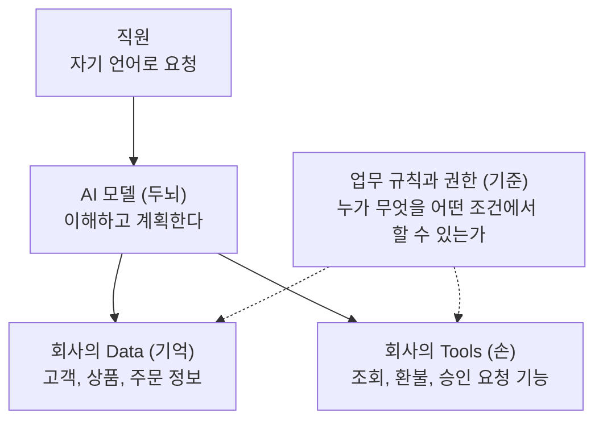

각 요소를 쉬운 말로 풀면 다음과 같습니다.

**AI 모델(두뇌).** 사람의 말을 이해하고 어떤 순서로 일할지 계획합니다. 교체가 가능한 부분입니다.

**Data(기억).** 회사가 이미 쌓아 둔 고객, 상품, 주문, 재고 같은 정보입니다. AI가 지어낸 답이 아니라 실제 데이터를 읽어야 정확한 일이 가능합니다.

**Tools(손).** 시스템이 수행하는 동작 하나하나입니다. "주문을 조회한다", "환불을 처리한다", "승인을 요청한다"가 각각 Tool입니다. 새로 만드는 것이 아니라 회사가 이미 가진 업무 기능을 AI가 부를 수 있는 형태로 연결하는 일입니다.

**업무 규칙과 권한(기준).** "환불은 구매 후 7일 이내, 5만 원 초과는 팀장 승인"처럼 회사가 정한 기준과, 누가 어떤 일을 할 수 있는지에 대한 권한입니다.

비유하면 이렇습니다. 아주 똑똑한 신입사원(모델)이 입사했다고 합시다. 고객 장부(Data)를 볼 수 없고, 업무 시스템(Tools)을 쓸 수 없고, 업무 매뉴얼과 결재 권한(규칙과 권한)이 없다면 그 신입사원에게 어떤 일도 맡길 수 없습니다. Enterprise AI를 준비한다는 것은 이 신입사원이 일할 수 있는 환경을 만들어 주는 일입니다. 다만 Data의 "의미"를 어느 수준까지 정리해야 하는지, 즉 온톨로지가 반드시 필요한지는 별첨 A에서 따로 다룹니다.

---

## 4. 꼭 알아야 할 용어

| 용어 | 뜻 | 예 | 일상 비유 |
|---|---|---|---|
| Data | 회사가 쌓아 둔 정보 | 주문 내역, 재고 수량, 점포 목록 | 도서관의 책 |
| Tool | 시스템이 수행하는 동작 하나 | 주문 조회, 환불 처리, 승인 요청 | 공구함의 공구 |
| Tool Call | AI가 Tool을 실행해 달라고 보내는 요청 | 환불처리(주문번호=123, 금액=5,000) | 직원의 업무 지시 |
| MCP | AI와 외부 도구, 데이터를 잇는 공개 연결 규격 | 여러 시스템을 같은 방식으로 연결 | 어디에나 맞는 표준 단자 |
| AI Gateway | 모든 AI 사용이 지나가는 하나의 관문 | 인증, 비용 기록, 사용량 제한, 로그 | 건물 출입 게이트 |
| 감사 로그(증거) | 누가 언제 무엇을 했는지 남긴 기록 | "홍길동 요청, 환불 승인, 14시 03분" | 영수증과 결재 기록 |

여기서 가장 중요한 구분은 **Tool Call을 열어주는 것과 열어줘도 되는지 판단하는 것**입니다. 기술적으로는 Tool Call 하나를 허용하는 것이 어렵지 않습니다. 하지만 회사에서는 "호출할 수 있다"와 "호출해도 된다"가 전혀 다른 문제이고, Enterprise AI의 대부분의 노력은 후자에 들어갑니다.

---

## 5. 업무 완료의 공식: 조회 → 판단 → 실행 → 증거

AI에게 일을 맡겼다고 말하려면 어디까지 해야 할까요? 이 문서는 네 단계가 모두 있어야 한다고 봅니다.

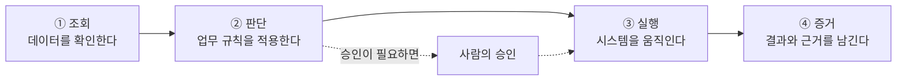

**① 조회.** AI가 기억이나 추측으로 답하지 않고 회사의 실제 데이터를 읽어 옵니다. 최신 정보를 확인한다는 뜻입니다. 예를 들어 환불 건이라면 주문일, 결제 금액, 이전 환불 이력을 읽습니다.

**② 판단.** 읽어 온 데이터에 업무 규칙을 적용합니다. 규칙은 모델의 기억이 아니라 회사가 정의한 기준이어야 합니다. "구매 후 5일이 지났으니 7일 규정 이내이고, 금액이 3만 원이니 한도 이내"처럼 근거가 있는 판단이어야 합니다.

**③ 실행.** 판단 결과에 따라 시스템을 움직입니다. 이 단계에서 신원 확인, 권한 확인, 사람의 승인이 모두 걸립니다.

**④ 증거.** 무엇을 근거로 어떤 판단을 했고 무엇을 실행했는지 기록으로 남깁니다. 이 단계가 빠지면 AI가 "처리했습니다"라고 말해도 사람은 그것이 사실인지 확인할 방법이 없습니다.

많은 AI 도입 사례가 "답변이 똑똑한가"나 "자동으로 실행되는가"에서 멈춥니다. 이 공식은 한 걸음 더 나아가 **사람이 나중에 확인할 수 있는가**를 완료의 조건에 넣었다는 점이 특징입니다.

---

## 6. 예제 1: 고객 환불 요청 처리

직원이 한 문장으로 요청한다고 가정해 보겠습니다. (아래의 상황과 금액은 설명을 위한 가상의 사례입니다.)

> 직원: "고객 A님 주문 환불 가능하면 처리해줘."

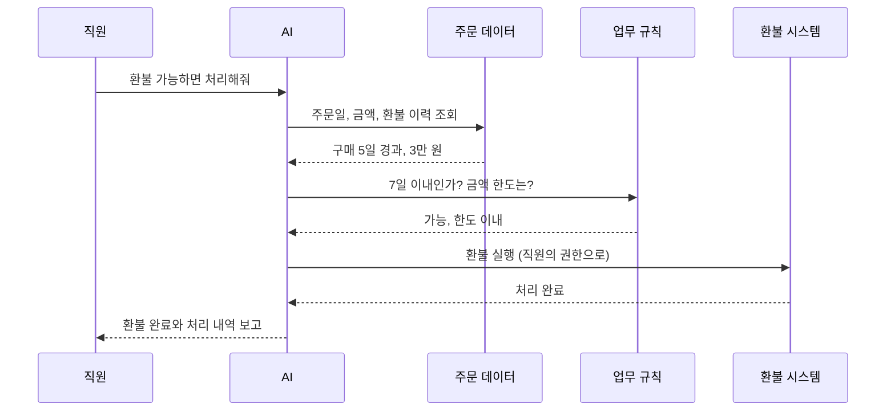

각 단계에서 일어나는 일은 다음과 같습니다.

| 단계 | AI가 하는 일 | 근거와 결과 |
|---|---|---|
| 조회 | 주문 데이터에서 주문일, 결제 금액, 환불 이력 확인 | 구매 5일 경과, 결제 3만 원, 이전 환불 없음 |
| 판단 | 환불 규정에 적용 | 7일 이내이므로 가능, 금액이 한도 이내이므로 승인 불필요 |
| 실행 | 환불 Tool 호출 | 요청한 직원의 권한으로 실행 |
| 증거 | 처리 내역 기록 | 환불 완료, 사유 단순 변심, 처리 시각, 요청자 |

**같은 요청이 고액이라면?** 결제 금액이 100만 원이었다고 해 보겠습니다. 판단 단계에서 "한도를 초과하므로 관리자 승인 필요"로 갈라지고, AI는 실행하지 않은 채 승인 요청을 만듭니다. 관리자가 승인하면 그때 실행되고, 승인한 사람과 시각이 증거에 함께 남습니다. 직원은 같은 한 문장을 말했을 뿐인데, 금액에 따라 자동으로 다른 경로를 타는 것입니다.

---

## 7. 예제 2: 재고 부족 시 발주 요청

두 번째 예제는 사람의 승인이 중간에 끼어드는 경우입니다. (역시 가상의 사례입니다.)

> 직원: "우유 재고 부족한 점포 확인하고 발주해줘."

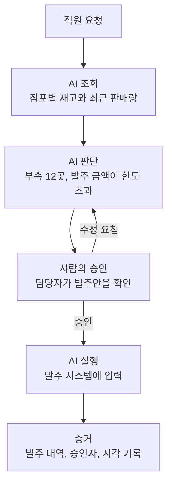

이 예제에서 눈여겨볼 점은 **승인 단계가 "거절 또는 수정"으로 되돌아갈 수 있다**는 것입니다. 담당자가 발주 수량이 많다고 판단하면 수정을 요청하고, AI는 안을 고쳐서 다시 올립니다. 자동화의 목표는 사람을 빼는 것이 아니라 **사람이 꼭 필요한 순간에만 부르는 것**입니다. 조회와 계산처럼 반복적인 일은 AI가 맡고, 금액과 영향이 큰 결정은 사람이 합니다.

---

## 8. 맡기기 전에 던지는 다섯 가지 질문

AI에게 일을 맡길 때, 업무마다 다음 다섯 질문에 답할 수 있어야 합니다.

| 질문 | 쉽게 말하면 | 왜 필요한가 | 비유 |
|---|---|---|---|
| 누가 요청했는가 | 신원 확인 | 같은 요청도 요청자에 따라 처리가 달라집니다 | 신분증 확인 |
| 그 사람이 실행할 권한이 있는가 | 권한 확인 | AI가 대신 실행해도 권한은 요청자의 것을 넘을 수 없어야 합니다 | 출입 카드 |
| 어떤 조건에서 실행하는가 | 업무 규칙 | 회사의 정책이 규칙으로 반영되어야 합니다 | 업무 매뉴얼 |
| 사람의 승인이 필요한가 | 승인 절차 | 금액이나 영향이 큰 일은 사람이 확인해야 합니다 | 결재 |
| 결과가 정말 반영되었는가 | 결과 검증 | "처리했습니다"라는 말과 실제 반영은 다릅니다 | 영수증 |

예를 들어 신입사원이 "대표님이 시켰어요"라고 말해도 신원과 권한은 따로 확인하듯, AI도 같습니다. 특히 마지막 질문이 중요합니다. 대화형 AI는 실행에 실패하고도 성공했다고 말할 수 있으므로, 반영 여부는 AI의 말이 아니라 **대상 시스템의 결과 값**으로 확인해야 합니다.

---

## 9. 안전장치의 중심: AI Gateway와 거버넌스

앞의 다섯 질문을 AI를 쓸 때마다 사람이 하나하나 챙길 수는 없습니다. 그래서 회사들은 **모든 AI 사용이 하나의 관문을 지나가도록** 만듭니다. 이 관문을 보통 AI Gateway라고 부릅니다.

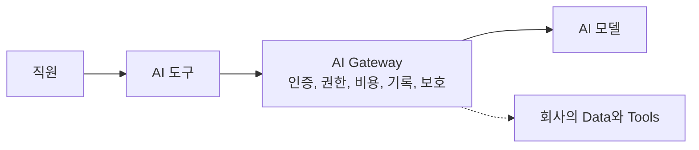

일반적으로 이 관문이 맡는 역할은 네 가지입니다.

**인증과 권한.** 회사의 로그인 체계로 사용자를 확인하고, 그 사람이 쓸 수 있는 모델과 기능을 제한합니다. 신원의 기준은 요청 내용에 적힌 이름이 아니라 로그인 체계가 확인해 준 정보여야 안전합니다.

**비용과 한도.** 팀별, 개인별 사용량과 예산을 기록하고 한도를 넘지 않게 제한합니다. AI 사용량이 늘수록 누가 얼마나 썼는지 알아야 합니다.

**기록(감사 로그).** 모든 호출을 기록해 두어, 문제가 생겼을 때 누가 언제 무엇을 요청했는지 추적할 수 있게 합니다. 5장의 "증거"를 받쳐 주는 바탕입니다.

**보호(가드레일).** 개인정보나 기밀처럼 AI에 입력되면 안 되는 정보를 막거나 걸러냅니다.

### 9-1. 요청 한 건이 관문을 지나는 과정

관문의 역할이 실제로 어떻게 이어지는지, 직원이 AI 도구에 질문 하나를 보내는 장면으로 따라가 보겠습니다. (설명을 위한 일반적인 흐름입니다.)

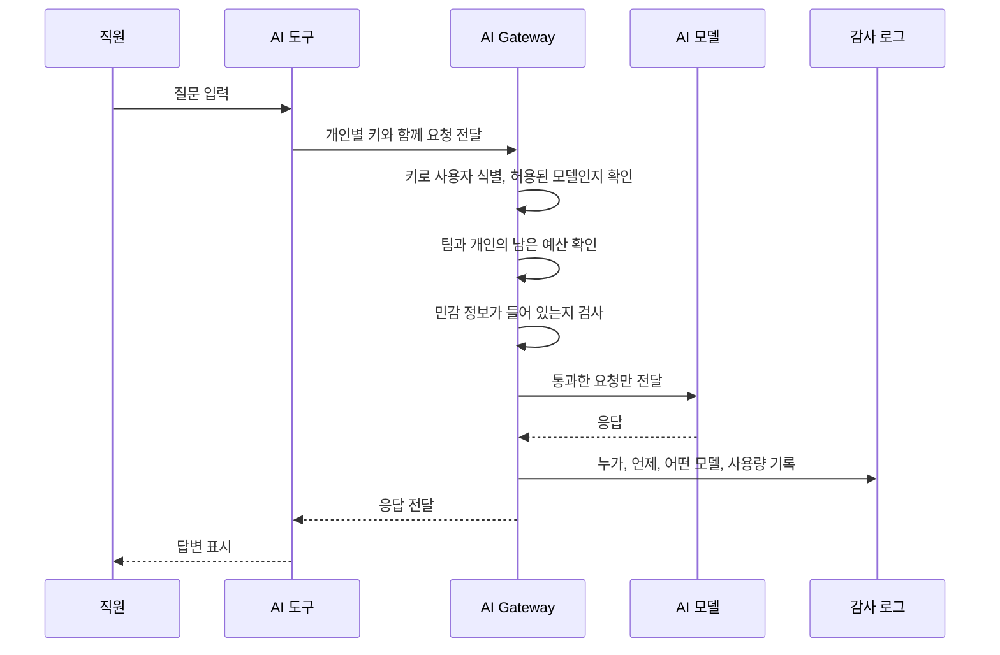

핵심은 직원이나 AI 도구가 모델과 **직접 통신하지 않는다**는 점입니다. 모든 요청이 반드시 관문을 거치기 때문에, 인증, 예산, 보호, 기록이라는 공통 정책을 도구마다 따로 만들 필요 없이 한곳에서 적용할 수 있습니다. 모델을 다른 것으로 바꾸더라도 직원이 쓰는 도구와 정책은 그대로 유지됩니다.

### 9-2. 사례: 대규모 조직의 전사 AI Gateway

이 구성이 실제로 어떻게 쓰이는지, 공개된 한 대기업의 구축 사례를 살펴보겠습니다. 이 사례는 해당 기업이 2026년 9월에 공개한 기술 블로그의 내용을 바탕으로 하며, 이 문서의 취지에 맞춰 회사명과 제품명은 일반 명칭으로 바꾸어 정리했습니다.

**배경.** 개발자는 AI 코딩 도구를, 현업 직원은 AI 업무 도구를 쓰려는 수요가 약 700개 팀, 수천 명 규모로 빠르게 늘고 있었습니다. 팀마다 제각각 AI 서비스에 가입해 쓰면 어떤 정보가 외부로 나가는지, 비용이 얼마나 나오는지 회사가 파악할 수 없게 됩니다.

**선택.** 두 종류의 도구를 모두 클라우드 사업자가 제공하는 관리형 모델 서비스 위에서 쓰는 방식을 전사 표준으로 정했습니다. 그리고 사용자의 PC와 모델 사이에 오픈소스 기반의 AI Gateway를 두어, 모든 모델 호출을 하나의 관문으로 모았습니다.

| 영역 | 이 사례에서 확인된 설계 | 앞에서 배운 개념과의 연결 |
|---|---|---|
| 인증 | 사내 SSO로 로그인하고 개인별 가상 키(Virtual Key)를 발급받음. 신원의 기준은 요청 내용이 아니라 SSO이며, 키 발급은 감사 기록이 먼저 남도록 설계 | 다섯 질문 중 "누가 요청했는가" |
| 권한과 정책 | 관문이 가상 키로 사용자를 식별해 쓸 수 있는 모델과 정책을 적용 | "권한이 있는가" |
| 비용 | 팀 단위로 클라우드 계정을 나누고, 팀, 팀원, 개인의 3계층으로 예산 한도를 설정 | 비용 귀속과 한도 |
| 보안 | 모델 호출이 인터넷을 거치지 않도록 전용 사설 연결을 사용하고, 민감 정보 입력을 막는 가드레일 적용 | 보호(가드레일) |
| 기록 | 모델 호출 전수에 대한 감사 로깅 | 5장의 "증거"를 받치는 바탕 |

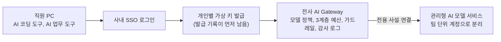

**이 사례에서 배울 점은 세 가지입니다.**

1. **신원을 요청 내용이 아니라 로그인 체계에서 가져옵니다.** 8장의 "대표님이 시켰어요" 비유와 같습니다. 사용자가 요청에 어떤 이름을 적든, 관문은 로그인으로 확인된 정보만 믿습니다.
2. **통제와 편의를 함께 얻습니다.** 직원은 평소 쓰던 도구를 그대로 쓰고, 회사는 비용과 보안과 기록을 한곳에서 관리합니다. 통제가 불편으로 이어지지 않아야 직원이 관문을 우회하지 않습니다.
3. **기록이 먼저입니다.** 가상 키를 발급하는 순간부터 감사 기록이 남도록 한 것은 5장에서 강조한 "증거"를 처음부터 설계에 넣은 예입니다.

**이 사례가 다루는 범위.** 이 사례가 공개한 부분은 주로 **AI 모델을 부르는 일의 통제**입니다. 해당 기업은 후속 글에서 AI 에이전트가 사내 메일, 파일, 일정에 접근할 때 "누구의 권한으로 읽는가", 그리고 막아 둔 인터넷 접근을 "어떤 경계 안에서 허용하는가"를 다룰 예정이라고 밝혔습니다. 즉 모델 호출 통제 다음 단계로 업무 시스템 접근 통제를 이어가는 흐름이며, 업무 시스템 실행 부분의 구체적인 구현은 이 시점에 공개된 내용만으로는 확인되지 않습니다.

### 9-3. 관문이 다루는 범위와 그 너머

앞의 사례에서 보듯 관문은 주로 **"AI 모델을 부르는 것"을 통제**합니다. AI가 회사의 업무 시스템을 직접 실행하는 단계에서는 "누구의 권한으로 읽고 실행하는가", "어떤 범위까지 허용하는가"라는 질문이 추가로 생기고, 이를 위한 별도의 설계가 필요합니다. 위 그림의 점선이 바로 이 확장 단계입니다.

---

## 10. 표준과 업계 동향: MCP

AI가 회사의 도구와 데이터에 연결되는 방식을 표준화하려는 흐름의 중심에 **MCP(Model Context Protocol)** 가 있습니다. 공개 규격이므로 특정 회사의 시스템에 묶이지 않고 여러 도구를 같은 방식으로 연결할 수 있다는 점이 장점입니다. 흔히 "AI 도구 연결의 표준 단자"에 비유합니다.

가장 최근의 정식 사양은 **2026년 7월 28일에 발행된 2026-07-28 버전**입니다. MCP 공식 블로그의 발표 내용을 기준으로 핵심 변화를 정리하면 다음과 같습니다.

| 변화 | 내용 | Enterprise AI에서의 의미 |
|---|---|---|
| 상태 비저장(stateless) 핵심 | 초기 연결 절차와 세션을 없애고 모든 요청이 스스로 완결되도록 함 | 서버를 여러 대로 늘려 일반적인 부하 분산 장비 뒤에 두기 쉬워짐 |
| 헤더 기반 라우팅 | 호출하는 기능의 이름이 요청 헤더에 담김 | 관문이나 방화벽이 본문을 열어보지 않고도 라우팅과 사용량 계량, 권한 판단 가능 |
| 다중 왕복 요청(MRTR) | 도구가 실행 도중 사용자에게 확인을 구하는 흐름을 지원 | 실행 전에 "이 비용을 승인하시겠습니까" 같은 사람의 확인을 끼워 넣기 쉬워짐 |
| 목록 캐시 힌트 | 도구 목록 응답에 캐시 정보 포함 | 불필요한 재조회 감소 |
| 인증 강화 | 발급자(iss) 검증 의무화, 발급자별 자격 증명 분리, 동적 클라이언트 등록은 폐기 예정 | 인증 영역의 보안 구멍을 줄임 |
| 확장 프레임워크 | Tasks(오래 걸리는 작업), 앱 확장, 기업 관리형 인증 등을 공식 확장으로 정리 | 장시간 작업과 기업 환경 요구를 표준 안에서 다룸 |
| 폐기 정책 | Roots, Sampling, Logging 등은 폐기 예정이며 최소 12개월 유지 | 업그레이드 계획을 세울 시간 확보 |

공식 발표에 따르면 주요 SDK의 월간 다운로드가 합쳐서 5억 건에 가깝다고 하니, 이미 널리 쓰이는 규격입니다.

두 가지는 분명히 해 두어야 합니다. 첫째, 이 사양은 연결과 인증의 **틀**을 제공할 뿐 회사의 업무 규칙이나 승인 기준까지 대신 정해 주지 않습니다. 어떤 직원이 어떤 업무를 어떤 조건에서 실행할 수 있는지는 여전히 회사가 정의해야 합니다. 둘째, 새 버전은 이전 버전과 호환되지 않는 변경을 포함하므로, 도입할 때는 기존 연결과의 병행 운영 계획이 필요합니다.

---

## 11. 누가 무엇을 맡을까: 역할 분담

Enterprise AI는 IT 부서만의 일이 아닙니다. 세 주체가 각자의 몫을 해야 합니다.

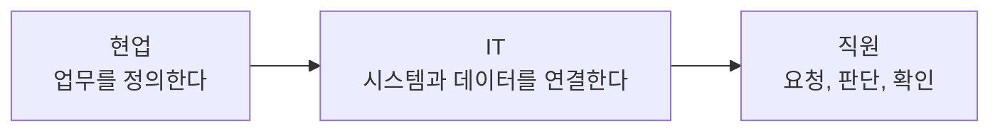

| 주체 | 하는 일 | 예 |
|---|---|---|
| 현업 | 무엇을 자동화할지, 어떤 기준으로 판단할지, 언제 승인이 필요한지 정의 | "환불은 7일 이내, 5만 원 초과는 팀장 승인" |
| IT | 시스템과 데이터를 연결하고 인증, 권한, 기록, 보안을 관리 | 환불 기능을 AI가 호출할 수 있는 Tool로 준비하고 권한을 연결 |
| 직원 | 자기 언어로 요청하고, 중요한 순간에 판단하고, 최종 결과를 확인 | 발주안을 보고 "승인" 또는 "수정" 선택 |

직원의 역할 설명이 중요합니다. 직원은 **모든 과정을 AI에게 넘기는 사람이 아니라**, 일을 요청하고 필요한 순간에 판단에 참여하고 마지막 결과를 확인하는 사람입니다. 업무 규칙을 가장 잘 아는 사람은 현업이므로, 규칙의 정의를 IT에 떠넘기면 AI가 엉뚱한 기준으로 일하게 됩니다. 현업의 정의와 IT의 연결 사이를 현장에서 메우는 역할(FDE)과 이를 포함한 전환(AX)은 별첨 B에서 다룹니다.

---

## 12. 도입은 단계적으로: 읽기부터 시작하기

처음부터 AI에게 실행까지 맡기면 위험합니다. 위험이 낮은 일부터 맡기며 신뢰를 쌓는 것이 안전합니다.

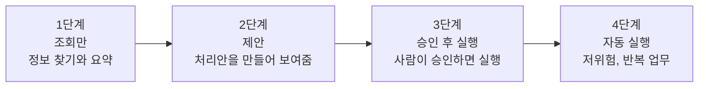

| 단계 | AI가 하는 일 | 예 | 위험 |
|---|---|---|---|
| 1단계 조회만 | 정보 찾기, 요약 | 고객 상황 확인 | 낮음 (데이터를 바꾸지 않음) |
| 2단계 제안 | 처리안 작성 | 발주안 초안 | 낮음 (사람이 보고 직접 처리) |
| 3단계 승인 후 실행 | 사람이 승인하면 실행 | 고액 환불 | 중간 (승인 기록이 핵심) |
| 4단계 자동 실행 | 규칙 안에서 스스로 실행 | 소액 환불 | 관리 필요 (규칙과 사후 점검이 핵심) |

각 단계를 넘어갈 때는 "증거(기록)"가 제대로 남는지, 오류가 났을 때 되돌릴 수 있는지를 먼저 확인합니다. 모든 업무가 4단계까지 가야 하는 것도 아닙니다. 고액이거나 되돌리기 어려운 일은 3단계에 머무는 것이 적절할 수 있습니다.

---

## 13. 도입 점검 체크리스트

- [ ] 자동화할 업무를 현업이 직접 정의했는가
- [ ] 업무 규칙이 모델의 기억이 아니라 문서나 시스템으로 관리되는가
- [ ] AI가 읽을 Data와 부를 Tool이 정리되어 있는가
- [ ] 요청자의 신원을 로그인 체계로 확인하는가
- [ ] AI가 요청자의 권한을 넘어서 실행하지 못하게 되어 있는가
- [ ] 금액과 영향에 따른 승인 기준이 정해져 있는가
- [ ] 실행 결과를 대상 시스템의 값으로 확인하는가
- [ ] 누가 언제 무엇을 요청하고 AI가 무엇을 했는지 기록이 남는가
- [ ] 그 기록을 사람이 읽고 추적할 수 있는가
- [ ] 개인정보 같은 민감 정보가 AI에 들어가지 않게 막는 장치가 있는가
- [ ] 팀별, 개인별 사용량과 비용을 볼 수 있는가
- [ ] 오류가 났을 때 되돌리거나 중단하는 절차가 있는가
- [ ] 읽기 전용 업무부터 시작하는 단계적 계획이 있는가

---

## 14. 정리

- 답변만 하는 AI는 직원에게 다음 할 일을 남깁니다.
- Enterprise AI는 모델 선택의 문제가 아니라 **Data, Tools, 업무 규칙, 권한**을 AI가 쓸 수 있게 준비하는 일입니다.
- 일이 끝났다는 기준은 **조회 → 판단 → 실행 → 증거**입니다.
- 맡기기 전에는 신원, 권한, 조건, 승인, 반영 확인의 다섯 질문에 답할 수 있어야 합니다.
- 이 질문들을 개별 업무마다 사람이 챙기지 않도록 관문(AI Gateway)과 표준(MCP) 위에서 체계적으로 처리합니다.
- 현업은 정의하고, IT는 연결하고, 직원은 요청과 판단과 확인을 맡습니다.
- 읽기부터 시작해 신뢰가 쌓이는 만큼 맡기는 범위를 넓힙니다.

---

## 별첨 A. Enterprise AI에 온톨로지는 반드시 필요한가

### A-1. 결론부터

**"온톨로지를 반드시 구축해야 한다"는 주장은 확인된 근거로는 뒷받침되지 않습니다.** 다만 **"데이터와 업무의 의미를 AI가 일관되게 이해하도록 정리하는 일"은 사실상 필수**에 가깝습니다. 온톨로지는 그 일을 가장 형식적이고 정교하게 하는 방법 중 하나일 뿐이고, 그보다 가벼운 방법으로 시작해도 되는 경우가 많습니다.

이 결론을 세 문장으로 나누면 다음과 같습니다.

1. AI 에이전트가 정확하게 일하려면 용어의 정의, 개체 간 관계, 업무 규칙을 담은 "의미 계층(semantic layer, context layer)"이 필요하다는 것이 시장조사기관 가트너의 공식 입장입니다.
2. 그러나 그 의미 계층을 반드시 "온톨로지"라는 형식으로 만들어야 한다고 가트너가 말한 것은 아닙니다. 이 공식 자료에는 온톨로지라는 말이 직접 요구 사항으로 등장하지 않습니다.
3. 온톨로지가 특히 중요해지는 때는 AI가 **여러 시스템에 걸쳐 판단하거나 실제로 업무를 실행**할 때입니다. 단순히 문서를 찾아 요약하는 용도라면 필요성이 훨씬 낮습니다.

### A-2. 먼저 용어를 정리하자

이 주제에서 가장 많이 혼동되는 것이 용어입니다. 같은 것을 가리키는 말이 아니라 서로 다른 층입니다.

| 용어 | 한 줄 설명 | 비유 | 형식의 무게 |
|---|---|---|---|
| 용어집(Business Glossary) | 업무 용어의 뜻을 사람이 읽을 수 있게 적어 둔 목록 | 사내 용어 사전 | 가벼움 |
| 시맨틱 레이어(Semantic Layer) | 매출, 재고 같은 **지표의 계산법과 데이터 연결 방식**을 한곳에 정의해 둔 계층 | 계산식을 모아 둔 공식집 | 중간 |
| 온톨로지(Ontology) | 업무에 나오는 **개념의 종류, 속성, 관계, 규칙**을 기계가 읽을 수 있게 정의한 모델 | 업무 세계의 설계도 | 무거움 |
| 지식그래프(Knowledge Graph) | 온톨로지의 틀 위에 **실제 고객, 상품, 주문**을 점과 선으로 연결한 데이터 | 설계도대로 채운 실제 지도 | 무거움 |
| 컨텍스트 레이어(Context Layer) | 위의 것들에 출처, 품질, 소유자, 정책 같은 신뢰 정보까지 묶어 AI에게 주는 계층의 총칭 | AI에게 건네는 업무 맥락 패키지 | 구성에 따라 다름 |

핵심 구분은 이렇습니다. 시맨틱 레이어는 "매출을 어떻게 계산하는가"에 답하고, 온톨로지는 "이 고객이라는 개념이 무엇이며 주문, 계약과 어떤 관계인가"에 답합니다. 온톨로지가 설계도라면 지식그래프는 그 설계도에 따라 채운 실제 내용입니다.

### A-3. 왜 "의미" 문제가 생기는가: 예제로 보기

AI가 실패하는 흔한 이유는 모델이 멍청해서가 아니라 **같은 말이 시스템마다 다른 뜻**이기 때문입니다. 본문의 예제에 이어 가상의 사례로 살펴보겠습니다.

**예제 1. 환불의 "구매일"** (6장의 환불 예제 연장)

환불 규정은 "구매 후 7일 이내"였습니다. 그런데 회사 안에서 "구매일"이 이렇게 다르게 쓰인다고 해 보겠습니다.

| 시스템 | "구매일"이 뜻하는 것 |
|---|---|
| 주문 시스템 | 고객이 주문 버튼을 누른 날 |
| 결제 시스템 | 결제가 승인된 날 |
| 배송 시스템 | 상품을 고객이 받은 날 |

AI가 어느 시스템에서 날짜를 읽느냐에 따라 같은 주문이 "7일 이내"가 되기도 하고 "7일 초과"가 되기도 합니다. 규칙 자체는 맞게 적용했는데 결과는 틀리는 상황입니다. 이때 필요한 것은 "환불 기준일은 배송 완료일로 한다"처럼 **개념의 정의를 하나로 정하고 모든 시스템과 연결해 두는 일**이며, 이것이 곧 의미 계층의 역할입니다.

**예제 2. 발주의 "가용 재고"** (7장의 발주 예제 연장)

"우유 재고 부족한 점포를 찾아줘"라는 요청에서 재고는 창고에 있는 수량일 수도, 이미 다른 주문에 배정된 수량을 뺀 수량일 수도, 입고 예정 수량을 포함한 것일 수도 있습니다. 정의가 정해져 있지 않으면 AI는 부족하지 않은 점포에 발주를 올리거나, 부족한 점포를 놓칠 수 있습니다.

두 예제의 공통점은 **정답이 시스템 안에 있어도 "무엇을 정답으로 볼지"를 AI가 스스로 알 수 없다**는 것입니다. 그리고 이런 의미 문제는 AI가 읽기만 할 때보다 **실행까지 할 때** 훨씬 큰 사고로 이어집니다. 잘못 읽으면 틀린 답변으로 끝나지만, 잘못 읽고 실행하면 잘못된 환불과 잘못된 발주가 실제로 일어나기 때문입니다.

### A-4. 확인된 근거와 그 한계

**가트너의 공식 입장 (2026년 5월 11일 발표).** 가트너는 의미(semantics)를 소홀히 하면 AI 에이전트가 부정확하고 비효율적이 되어 비용 낭비와 데이터·AI 거버넌스 취약점이 생긴다고 밝혔습니다. 주요 내용은 다음과 같습니다.

- AI 에이전트는 업무 흐름의 각 단계에서 맥락 정보를 이해해야 정확하고 효율적인 답을 낼 수 있습니다.
- 조직 데이터 안의 구체적인 관계와 규칙에 대한 명확한 이해가 없으면 에이전트는 정확하게 일할 수 없고, 환각과 편향, 신뢰할 수 없는 결과를 낼 가능성이 훨씬 높습니다.
- 데이터·분석 책임자는 **컨텍스트 레이어를 데이터·분석 인프라의 핵심 구성 요소로 구축**해야 하며, 기존의 스키마(표 구조) 중심 데이터 모델만으로는 에이전트에게 충분하지 않습니다.
- 가트너는 2027년까지 AI-ready 데이터에서 의미를 우선시하는 조직이 에이전트 정확도를 최대 80% 높이고 비용을 최대 60% 줄일 것으로 **예측**했습니다. 이는 예측이며, 실제 결과가 보장된 수치가 아닙니다.

**이 근거가 말하지 않는 것.** 이 공식 자료는 "의미와 맥락을 담은 계층이 필요하다"고 말하지만, 그것을 **온톨로지로 만들어야 한다거나 지식그래프를 구축해야 한다고 특정하지는 않습니다.** "온톨로지가 필수"라는 말은 이 근거에서 나오지 않으며, 의미 계층을 어떤 형태로 구현할지는 조직의 상황에 맡겨져 있습니다.

**업계의 다른 의견.** 검색해 본 업계 글들은 대체로 이렇게 갈립니다. 다만 이 글들은 데이터 플랫폼이나 온톨로지 도구를 판매하는 업체가 쓴 경우가 많아, 온톨로지의 필요성을 강조하는 방향으로 기울었을 가능성을 감안해서 읽어야 합니다.

- 주로 읽고 요약하는 보조형 AI나, 범위가 단순하고 잘 변하지 않는 업무에는 형식적인 온톨로지가 과할 수 있다는 의견이 있습니다.
- 데이터를 만들고, 거래를 승인하고, 자원을 배정하는 등 **실제로 업무를 실행하는 에이전트**에는 온톨로지 계층이 안전하게 운영하기 위한 기반이라는 의견이 많습니다.
- 가볍게 시작하라는 조언이 공통적입니다. 용어집이나 시맨틱 레이어부터 시작해 필요할 때 키우라는 것이며, 용어집을 "가벼운 온톨로지"로 보는 시각도 있습니다.

### A-5. 우리 조직에는 어느 수준이 필요한가

필요한 수준은 AI에게 **무엇을 맡기느냐**에 따라 달라집니다. 이 문서의 도입 4단계(12장)와 연결해 보면 판단하기 쉽습니다.

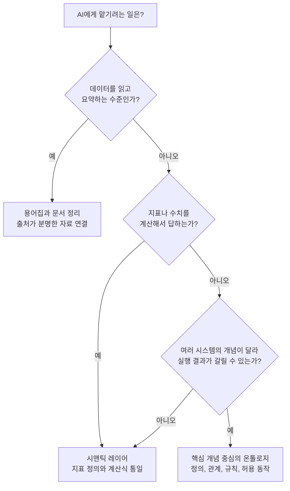

| AI에게 맡기는 일 | 12장의 단계 | 의미 계층의 필요 수준 | 권장 출발점 |
|---|---|---|---|
| 규정 문서 검색과 요약 | 1단계 조회만 | 낮음 | 용어집, 출처가 분명한 문서 |
| 매출, 재고 같은 수치 질의 | 1~2단계 | 중간 | 시맨틱 레이어(지표 정의 통일) |
| 환불, 발주 처리안 제안 | 2단계 제안 | 중간~높음 | 핵심 개념(고객, 주문, 재고)의 정의 통일 |
| 승인 후 실행 | 3단계 | 높음 | 개념 정의 + 규칙 + 허용 동작을 명시한 온톨로지 |
| 규칙 안에서 자동 실행 | 4단계 | 가장 높음 | 위 전부 + 변경 관리와 사후 점검 |

이 표의 "필요 수준"은 앞에서 정리한 근거와 업계 의견을 종합한 일반적인 가이드이며, 정해진 기준은 아닙니다. 같은 3단계라도 업무 범위가 좁고 시스템 간 의미 충돌이 없다면 가벼운 정의만으로 충분할 수 있습니다.

### A-6. 단계적으로 키우는 방법

처음부터 회사 전체를 모델링하려는 접근은 실패하기 쉽습니다. 맡길 업무 하나를 정하고, 그 업무에 나오는 핵심 개념부터 정리해 나가는 편이 현실적입니다.

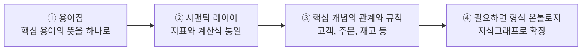

1. **용어집.** 맡길 업무에 나오는 용어 10~20개의 뜻을 한 문장으로 정하고 책임자를 지정합니다. 위 예제라면 "환불 기준일 = 배송 완료일"처럼 정하는 것입니다.
2. **시맨틱 레이어.** 자주 묻는 지표의 계산법과 데이터 출처를 한곳에 정의합니다.
3. **핵심 개념의 관계와 규칙.** 고객이 어떤 주문을 가지는지, 어떤 상태에서 어떤 동작이 허용되는지를 정리합니다. 이 단계부터 온톨로지의 영역입니다.
4. **형식 온톨로지.** 여러 시스템과 여러 AI 에이전트가 같은 의미를 공유해야 하고 추론까지 필요해질 때 표준 형식으로 확장합니다.

각 단계는 이전 단계의 결과물을 버리지 않고 쌓아 올립니다. 용어집이 곧 온톨로지의 첫 재료가 되므로, 가볍게 시작했다고 해서 나중에 처음부터 다시 만들어야 하는 것은 아닙니다.

### A-7. 흔한 오해와 주의할 점

**오해 1. "온톨로지를 만들면 AI가 알아서 정확해진다."** 온톨로지는 의미를 정리한 설계도일 뿐, 신원 확인, 권한, 승인, 감사 기록 같은 안전장치(8~9장)를 대신하지 않습니다. 의미가 맞아도 권한이 없는 실행을 막는 것은 다른 장치의 몫입니다.

**오해 2. "MCP로 연결하면 의미 문제도 해결된다."** MCP는 AI와 도구를 잇는 연결과 인증의 틀(10장)이며, "구매일이 무엇을 뜻하는가"까지 정해 주지 않습니다. 연결은 의미 계층 없이도 되지만, 그 연결 위에서 정확하게 일하려면 의미 계층이 별도로 필요합니다.

**오해 3. "한 번 만들면 끝난다."** 업무 규칙과 시스템은 계속 바뀌므로 의미 계층도 계속 관리해야 합니다. 형식이 무거울수록 설계와 유지에 전문성과 운영 인력이 더 필요하고, 관리되지 않는 온톨로지는 오래된 정의가 쌓여 오히려 AI를 오도할 수 있습니다.

**위험. 과설계.** 지금 맡길 업무에 필요하지 않은 개념까지 모델링하느라 시간을 쓰면, 정작 AI에게 일을 맡기는 시점이 늦어집니다. 맡길 업무 기준으로 범위를 좁히는 것이 안전합니다.

### A-8. 이 문서의 구조에서 어디에 해당하는가

- 3장의 네 가지 구성 요소 중 **Data**와 **업무 규칙과 권한**이 의미 계층과 맞닿아 있습니다. Data에 "무엇을 뜻하는지"의 정의가 붙어야 AI가 올바르게 읽습니다.
- 5장의 **판단** 단계에서 적용하는 업무 규칙이 모호한 정의 위에 서 있으면 올바른 규칙을 적용해도 결과가 틀립니다.
- 11장의 역할 분담에서 **현업이 개념의 정의를 정하는 주체**입니다. 의미는 시스템이 아니라 업무에서 나오기 때문에 IT가 대신 정할 수 없습니다.

### A-9. 점검 질문

- [ ] AI에게 맡길 업무에 나오는 핵심 용어를 목록으로 뽑았는가
- [ ] 같은 용어가 시스템마다 다른 뜻으로 쓰이는 곳을 확인했는가
- [ ] 각 용어의 기준 정의를 정하고 그 책임자를 지정했는가
- [ ] 지표의 계산식과 데이터 출처가 한곳에 정의되어 있는가
- [ ] 허용되는 동작과 허용되지 않는 동작이 개념과 함께 명시되어 있는가
- [ ] AI가 읽기만 하는지, 실행까지 하는지에 따라 필요한 수준을 구분했는가
- [ ] 정의가 바뀔 때 누가 어떻게 갱신하는지 정해져 있는가

---

## 별첨 B. Enterprise AI와 AX, FDE

### B-1. 한눈에 보기

- **AX(AI Transformation, AI 전환)** 는 AI 도구를 몇 개 도입하는 것이 아니라 **업무 흐름과 판단 구조를 AI를 전제로 다시 설계하는 전환**을 뜻합니다.
- **FDE(Forward Deployed Engineer, 현장 배치 엔지니어)** 는 현업 가까이에서 일하며 AI를 시연 수준에서 **실제 업무에서 쓰이는 수준으로 끌어올리는 엔지니어**를 뜻합니다.
- 이 문서의 맥락에서 정리하면, AX는 **방향과 목표**이고 Enterprise AI의 준비(Data, Tools, 규칙과 권한, 관문)는 **기반**이며, FDE는 현업의 업무와 그 기반을 **현장에서 이어 붙이는 사람**입니다.

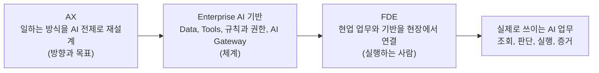

### B-2. AX란 무엇인가

AX는 AI Transformation의 약자로 한국어로는 "AI 전환"이라 부릅니다. 여러 국내 자료가 공통으로 설명하는 핵심은 **"도입"과 "전환"의 구분**입니다. 직원이 대화형 AI로 메일 초안을 쓰는 것은 좋은 활용이지만 그 자체가 전환은 아닙니다. 전환은 업무가 흘러가는 방식과 사람이 판단하는 자리가 함께 바뀌는 것을 말합니다.

흔히 DX(Digital Transformation, 디지털 전환)와 비교하는데, 이 문서의 용어로 풀면 다음과 같습니다.

| 구분 | DX (디지털 전환) | AX (AI 전환) |
|---|---|---|
| 하는 일 | 종이와 수작업을 디지털 시스템으로 옮김 | 디지털 위에서 판단의 일부를 AI와 나눔 |
| 사람과 시스템의 관계 | 사람이 시스템을 조작하고 명령 | AI가 조회, 분석, 제안하고 사람은 확인과 결정에 집중 |
| 예 | 수기 결재를 전자결재로, 장부를 ERP로 | 문의 1차 분류, 처리안 작성, 승인 후 실행 |
| 전제 | 업무가 디지털로 기록됨 | DX로 쌓인 데이터와 시스템이 있음 |

여기서 중요한 점은 **AX가 DX를 대체하는 것이 아니라 DX 위에 쌓인다**는 것입니다. 데이터가 디지털로 쌓여 있고 업무 기능이 시스템으로 존재해야 AI가 조회하고 실행할 수 있기 때문입니다. 이 문서의 Data와 Tools가 바로 DX가 남긴 자산입니다.

**"도입"과 "전환"의 차이를 예제로 보자.** (가상의 사례입니다.)

| | AI 도입 | AI 전환(AX) |
|---|---|---|
| 상황 | 고객센터 직원이 대화형 AI에게 환불 규정을 물어봄 | 환불 요청이 들어오면 AI가 주문을 조회하고 규칙을 적용해 처리안을 만들고, 직원은 승인만 함 |
| 바뀐 것 | 직원이 규정을 찾는 시간 | 업무 흐름, 직원의 역할, 승인 기준, 기록 방식 |
| 필요한 것 | AI 도구 | 6장의 흐름 전체(조회, 판단, 실행, 증거)와 이를 받치는 기반 |

도입은 도구를 쓰는 사람이 몇 명 늘어나면 성공이고, 전환은 업무의 구조가 바뀌어야 성공입니다. 그래서 AX는 IT 프로젝트이기 전에 **현업의 업무를 다시 설계하는 일**입니다.

### B-3. FDE란 무엇인가

**정의.** FDE는 고객이나 현업 조직 가까이에서 일하면서 기술 솔루션을 개발, 맞춤화, 배포하는 엔지니어입니다. 소프트웨어 개발 능력에 업무 도메인 이해와 최종 사용자와의 직접 협업을 결합한 직무이며, 요구 분석, 설계, 구현, 시스템 통합, 배포 등 시스템의 전 과정에 관여하는 것이 보통입니다.

**기원과 최근 흐름.** 이 직무는 복잡한 현장 환경에 맞춤형 솔루션을 빠르게 공급하기 위해 한 데이터 분석 소프트웨어 기업이 대중화한 것으로 알려져 있습니다. 2026년에는 주요 AI 기업이 고객 조직 안에 FDE를 배치해 AI 시스템과 업무 흐름을 구현하는 대규모 배치 전담 조직을 출범시켰다고 보도되었습니다. AI가 실험을 넘어 실제 업무에 들어가면서 "마지막 구간"을 맡는 사람의 수요가 커지고 있다는 해석이 일반적입니다.

**비슷한 직무와의 차이.** 아래 구분은 업계 설명을 종합한 일반적인 정리이며 회사마다 직무 정의는 다를 수 있습니다.

| 직무 | 주로 하는 일 | 일하는 위치 |
|---|---|---|
| 일반 소프트웨어 엔지니어 | 여러 고객이 함께 쓰는 하나의 제품을 만듦 | 제품 개발 조직 |
| 솔루션 엔지니어 | 시연하고 설정하며 도입을 지원 | 판매 단계에 가까움 |
| 컨설턴트 | 분석하고 전략과 보고서를 제시 | 자문 |
| **FDE** | **한 고객(현업)의 환경에 들어가 실제로 동작하는 코드를 만들고 배포하고 책임짐** | **현업과 가까운 현장** |

핵심 차이는 "슬라이드가 아니라 **실제로 동작하는 시스템**을 만들어 낸다"는 점과 "현업 환경 안에서 일한다"는 점입니다.

### B-4. 왜 Enterprise AI에서 FDE가 중요한가

AI가 시연에서는 잘 동작하는데 실제 업무에서는 쓰이지 않는 일이 흔합니다. 이유는 이 문서에서 다룬 것들이 현장마다 다르게 얽혀 있기 때문입니다.

- 어떤 데이터를 읽어야 하는지, 같은 용어가 시스템마다 어떻게 다른지(별첨 A)
- 어떤 업무 기능을 AI가 부를 수 있게 열어야 하는지(3~4장)
- 판단 규칙과 승인 기준이 어디에 있는지(5, 6, 7장)
- 요청자의 권한이 어떻게 연결되는지(8, 9장)
- 결과를 어떻게 검증하고 기록하는지(5장의 증거)

이것들은 책상에서 설계해서는 알 수 없고, 현업의 실제 업무를 보면서 맞춰야 합니다. 그 일을 맡는 사람이 FDE입니다. 11장의 역할 분담으로 말하면, **현업은 업무를 정의하고 IT는 시스템을 연결하는데, 그 사이의 간극을 현장에서 메우는 역할**입니다.

**FDE가 환불 업무를 AI에게 맡기도록 만드는 과정** (6장 예제 연장, 가상의 사례)

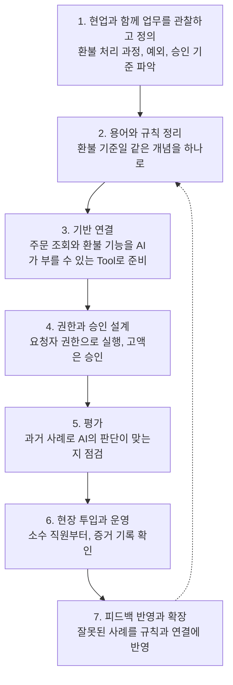

| FDE의 작업 | 이 문서에서 대응되는 부분 |
|---|---|
| 업무 관찰과 정의 | 11장 현업의 역할, 6장 예제 |
| 용어와 규칙 정리 | 별첨 A (의미 정리), 5장 판단 단계 |
| Tool 연결 | 3~4장 Data와 Tools, 10장 MCP |
| 권한과 승인 설계 | 8장 다섯 가지 질문, 9장 AI Gateway |
| 평가와 점검 | 5장 증거, 13장 체크리스트 |
| 현장 투입과 확장 | 12장 단계적 도입 |

특히 7번에서 6번으로 되돌아가는 점선처럼, 현장에서 발견한 실패는 용어와 규칙으로 되돌아가 반영됩니다. AI는 한 번 만들고 끝나는 시스템이 아니라 **계속 조정해야 하는 시스템**이기 때문에, 현장에 상주하는 사람이 필요합니다.

### B-5. 외부 FDE와 사내 FDE

FDE라고 하면 AI 공급사가 고객 회사에 엔지니어를 파견하는 형태를 먼저 떠올리지만, 기업이 **자사 구성원 중에서 FDE 역할을 맡을 사람을 키우는** 방식도 있습니다.

| 구분 | 외부 FDE (공급사 파견형) | 사내 FDE (사내 육성형) |
|---|---|---|
| 소속 | AI 공급사 | 자사 |
| 강점 | 제품과 최신 기술 이해가 깊음 | 업무와 조직, 시스템을 이미 잘 앎, 지속 운영에 유리 |
| 약점 | 업무 맥락을 새로 배워야 함, 계약 기간이 있음 | 기술 역량을 키우는 데 시간이 필요 |
| 어울리는 경우 | 초기 구축, 전문 기술이 필요한 도입 | 여러 부서로 확산, 장기 운영 |

국내 한 대기업은 2026년 7월 AX 현장 사례 공유회에서, 현업이 자기 업무 문제를 직접 정의해 AI로 풀어낸 사례를 소개하고, 개인 결과물을 안전하게 검증하는 샌드박스, AI가 쓰기 쉬운 데이터를 쌓는 환경, 공통 기술 기준과 함께 **현장 밀착형 엔지니어(FDE) 육성 과정**을 준비한다고 밝혔습니다. (회사명은 이 문서의 취지에 맞춰 생략합니다.) 이 사례는 외부 인력에 의존하기보다 **현업을 아는 사람이 기술을 익혀 현장을 연결하는 구조**를 만들겠다는 방향으로 읽을 수 있습니다. 다만 이 육성 과정의 구체적 커리큘럼과 성과는 공개된 범위에서 확인되지 않습니다.

### B-6. AX를 추진하는 구조: 세 개의 층

AX는 한 팀이 혼자 할 수 없습니다. 층마다 맡는 일이 다릅니다.

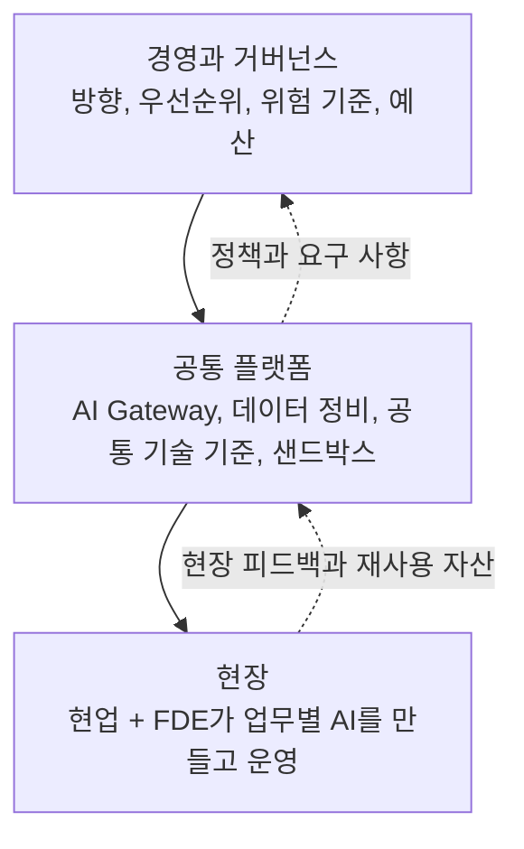

| 층 | 하는 일 | 이 문서와의 연결 |
|---|---|---|
| 경영과 거버넌스 | 어떤 업무부터 맡길지, 어디까지 자동화할지, 위험 기준 결정 | 12장 단계적 도입, 8장 승인 기준 |
| 공통 플랫폼 | 모든 현장이 공통으로 쓰는 관문, 데이터, 기술 기준 제공 | 9장 AI Gateway, 별첨 A |
| 현장 | 업무별 AI를 만들고 운영, 결과를 확인 | 6~7장 예제, 11장 직원의 역할 |

이 구조에서 FDE의 역할은 **현장 층에서 일하면서 공통 플랫폼을 활용하고, 현장에서 얻은 교훈을 플랫폼으로 되돌려 보내는 것**입니다. 한 현장에서 만든 용어 정의, 연결, 평가 자료를 다른 현장이 재사용할 수 있어야 AX가 한두 팀의 성공에 그치지 않고 조직 전체로 확산됩니다.

### B-7. FDE는 만능이 아니다: 한계와 주의점

FDE가 유용한 곳이 있는 만큼 맞지 않는 곳도 있습니다. 근거로 확인한 내용과 일반적인 주의점을 구분해서 적습니다.

**확인된 내용.** 한 경제지 분석은 FDE가 AI처럼 계속 변하는 환경에서 현업 팀과 함께 실시간으로 조정하며 소프트웨어와 업무를 맞추는 데 특히 가치가 크다고 봅니다. 반면 엄격한 거버넌스와 배포 절차가 있는 전통적이고 안정적인 시스템에서는 이런 방식이 위험을 낳을 수 있어 항상 적절하지는 않다고 경고합니다. 현장에서 "그때그때 조정"하는 방식이 통제된 변경 관리와 부딪힐 수 있다는 뜻입니다.

**일반적으로 유의할 점.** (아래는 위 근거를 이 문서의 맥락에 적용한 정리입니다.)

1. **소수 인력 의존.** FDE가 현장에 맞춰 만든 것이 그 사람 머릿속과 개인 코드에만 있으면 확산도, 인수인계도 어렵습니다. 용어 정의, 연결, 평가 자료를 문서와 공통 자산으로 남겨야 합니다.
2. **통제 우회의 위험.** 현장에서 빠르게 맞추다 보면 인증, 권한, 기록 같은 안전장치(8~9장)를 건너뛰고 싶어집니다. FDE도 공통 플랫폼의 관문을 통해서만 일해야 합니다.
3. **직무 명칭의 유동성.** 이 직무가 얼마나 오래 같은 모습으로 갈지는 불확실하다는 전망도 있습니다. AI 도구가 성숙하고 데이터 환경이 정비되면 일의 모습이 바뀔 수 있으므로, 직무명보다 **그 역할이 하는 일(현장 연결, 평가, 운영)** 을 기준으로 생각하는 편이 안전합니다.
4. **AX는 기술 문제만이 아니다.** 직원이 새로운 업무 방식을 받아들이도록 역할과 평가 기준, 교육을 함께 바꿔야 합니다. FDE가 기술적으로 완벽하게 연결해도 직원이 쓰지 않으면 전환은 일어나지 않습니다.

### B-8. FDE에게 필요한 역량과 육성 방법

FDE에게는 세 가지 역량이 함께 요구됩니다.

| 역량 | 내용 | 예 |
|---|---|---|
| 기술 | 프로그래밍, 시스템 연결, AI 에이전트와 평가 방법 이해 | API 연결, 결과 검증 자동화 |
| 업무 이해 | 현업 업무의 흐름, 규칙, 예외를 파악 | 환불의 예외 조건 파악 |
| 소통 | 현업과 IT 사이에서 말을 번역 | "고액"의 기준을 현업과 합의 |

사내 육성은 다음처럼 단계를 밟는 것을 생각해 볼 수 있습니다. (일반적인 제안이며 특정 조직의 방식이 아닙니다.)

1. **현업 챔피언 단계.** 자기 업무에서 AI로 풀 문제를 직접 정의해 봅니다.
2. **샌드박스 실습.** 안전한 환경에서 AI와 Tool을 연결해 보고 결과를 검증합니다.
3. **공통 기준 학습.** 인증, 권한, 기록, 평가 같은 공통 기술 기준을 익힙니다.
4. **실제 업무 투입.** 위험이 낮은 업무(12장의 1~2단계)부터 맡고, 점차 범위를 넓힙니다.

### B-9. 점검 질문

- [ ] AX의 목표가 "도구 도입"이 아니라 "업무 흐름과 판단 구조의 재설계"로 정의되어 있는가
- [ ] 전환할 업무를 현업이 직접 정의했는가
- [ ] 현업과 IT 사이를 현장에서 이어 줄 사람(FDE 역할)이 지정되어 있는가
- [ ] 그 사람이 공통 플랫폼의 관문과 기준 안에서 일하도록 되어 있는가
- [ ] 현장에서 만든 용어, 연결, 평가 자료가 공통 자산으로 남고 재사용되는가
- [ ] 외부 인력과 사내 인력의 역할을 구분하고 장기 운영 계획이 있는가
- [ ] 직원의 역할과 평가 기준, 교육이 새 업무 방식에 맞게 바뀌는가
- [ ] 안정적이고 통제가 엄격한 시스템에는 변경 관리 절차를 유지하는가

### B-10. 정리

- AX는 AI 도구 도입이 아니라 **일하는 방식과 판단 구조의 재설계**이고, DX가 쌓아 둔 데이터와 시스템 위에 만들어집니다.
- FDE는 **현업 가까이에서 실제로 동작하는 AI 업무를 만들고 운영하는 엔지니어**로, 현업의 정의와 IT의 연결 사이를 현장에서 메웁니다.
- Enterprise AI의 기반(Data, Tools, 규칙과 권한, AI Gateway)이 준비되어야 FDE가 일할 수 있고, FDE가 현장에서 얻은 교훈이 다시 기반을 단단하게 만듭니다.
- FDE는 만능이 아닙니다. 소수 인력 의존, 통제 우회, 직무의 유동성을 관리하고, 현장의 성과를 공통 자산으로 남겨 조직 전체로 확산해야 합니다.

---

## 참고한 공개 자료

- MCP 공식 블로그, "The 2026-07-28 Specification" (2026-07-28): https://blog.modelcontextprotocol.io/posts/2026-07-28/
- MCP 2026-07-28 사양 본문: https://modelcontextprotocol.io/specification/2026-07-28
- MCP 2026-07-28 정식 릴리스 기록: https://github.com/modelcontextprotocol/specification/releases/tag/2026-07-28
- (별첨 A) Gartner 보도자료, "Gartner Says Lack of Semantics Causes Inaccurate AI Agents and Wasted Spending" (2026-05-11): https://www.gartner.com/en/newsroom/press-releases/2026-05-11-gartner-says-lack-of-semantics-causes-inaccurate-artificial-intelligence-agents-and-wasted-spending

- (별첨 B) Wikipedia, "Forward Deployed Engineer" (FDE의 정의, 확산 흐름, 효과가 상황에 따라 다르다는 경제지 분석 인용): https://en.wikipedia.org/wiki/Forward_Deployed_Engineer

별첨 B의 AX 정의와 DX 비교(B-2)는 국내 기업과 서비스 업체들이 공개한 여러 AX 설명 글에서 공통으로 나타나는 내용을 정리한 것이고, FDE와 유사 직무의 구분(B-3)과 사내 육성 단계(B-8)는 업계 설명을 종합한 일반적인 정리입니다. 이 글들은 업체가 작성한 경우가 많고 본문 전체를 열람하지는 않았으므로 구인 공고 증가율이나 보수 같은 수치는 인용하지 않았습니다. B-5의 국내 대기업 사례는 2026년 7월에 보도된 행사 내용을 바탕으로 회사명을 생략하고 정리한 것이며, 육성 과정의 구체적인 내용은 공개된 범위에서 확인되지 않습니다.

별첨 A의 용어 정리와 필요 수준 판단(A-2, A-5, A-6)은 온톨로지, 시맨틱 레이어, 지식그래프를 비교한 여러 업계 블로그 글을 검색해 참고한 일반적인 정리입니다. 이 글들은 대부분 데이터 플랫폼이나 온톨로지 도구를 판매하는 업체가 쓴 것이고 본문 전체를 열람하지는 않았으므로, 그 글에 나온 정확도나 비용 수치는 인용하지 않았습니다. 별첨에서 직접 근거로 인용한 것은 위의 가트너 보도자료뿐입니다.

예제 1, 2의 상황과 수치는 이해를 돕기 위한 가상의 사례이며 실제 조직의 사례가 아닙니다. 9장의 관문 구성 요소와 9-1의 요청 흐름은 일반적으로 쓰이는 설계 패턴을 설명한 것이고, 9-2의 사례는 한 기업이 2026년 9월에 공개한 기술 블로그를 바탕으로 회사명과 제품명을 일반 명칭으로 바꾸어 정리한 것입니다.

---

작성일: 2026년 10월 2일
