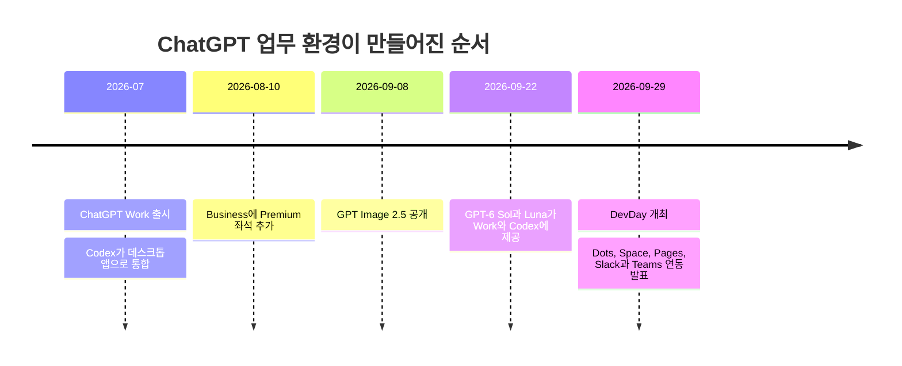
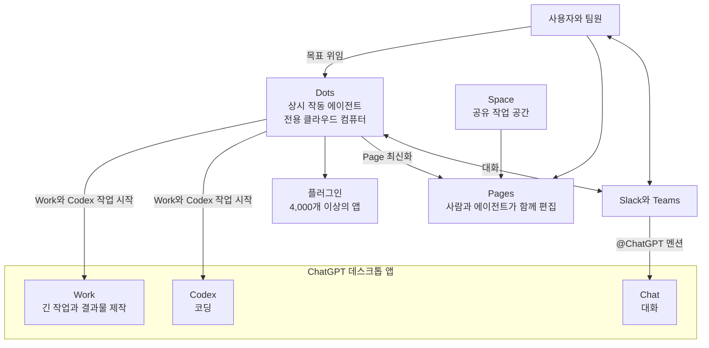
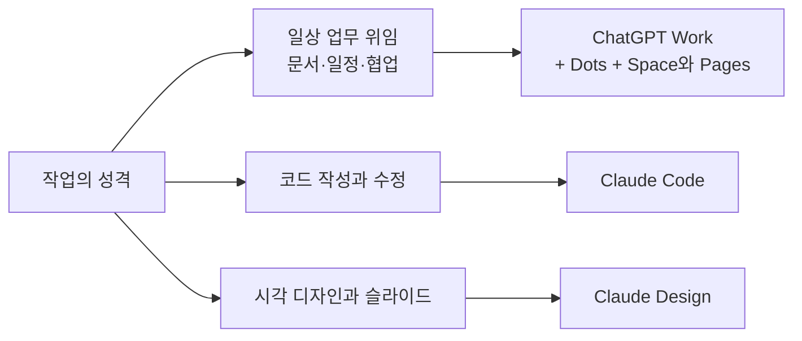

- **작성 기준일**: 2026년 10월 2일
- **다루는 글**: 작성자 본인의 Facebook 게시글(본문은 직접 붙여 주신 텍스트 기준) 및 함께 공유된 작업 화면
- **검증 방식**: 공개된 보도, 공식 릴리스 노트, 제3자 해설을 교차 확인했습니다. 확인되지 않은 부분은 추측하지 않고 "확인하지 못함"으로 표시했습니다.
- **참고**: Facebook 링크는 자동 열람이 차단되어 직접 읽지 못했습니다. 따라서 게시글 내용은 붙여 주신 본문만을 근거로 삼았습니다.

> 
> OpenAI의 DemoDay 발표된 Dots + Pages 서비스 조합이면 노션 구독 해지 해도 되겠다. 슬랙이랑 연동한다면 더욱더 코워킹이 편리하다.
> 
> '클로드와 한달 살기' 강의를 'ChatGPT와 한달살기'로 변경하고 며칠 Dots + Pages + Project + Plugins(MoAI-Cowork) 조합으로 한달 4주 커리큘럼을 다시 짜보자.
> 
> 이번에는 일정 연기하지 않고 강의 시작 할 수 있을 것 같다. 이제서야 내가 원했던 커리큘럼이 제대로 나올 것 같다. 
> 
> 많이 답답했는데, 
> 이제 속이 시~원하네..
> 
> 새로운 내피셜(구스생각)이긴 하나...
> 결국 에이전틱 코딩은 Claude Code, 
> 에이전틱 워킹은 ChatGPT Work가 더 맞다. 
> 
> 이유는 영상이 아니라면, ChatGPT Work에서 이미지 생성까지 가능하기에 힉스필드 구독을 하지 않아도 된다. 그리고 Dots와의 연동은 너무 편하다.
> 
> 우리 회사는 업무용은 ChatGPT 팀요금제로 다시 옮겨 가야 할듯. ㅋㅋ 그리고 기본 요금제는 Pro $100 요금제로 사용하면 됨.
> 
> 그리고 이번 DemoDay 발표 이후로 ChatGPT Work의 비중은 점차적으로 더 커질 것이고 Codex CLI는 여전히 Claude Code에 비하면 아직 멀었다. 
> 
> 따라서, 
> - Agentic Working: ChatGPT Work
> - Agentic Coding: Claude Code
> - Agentic Design: Claude Design
> 
> https://www.facebook.com/share/p/1Esvz5hA6J/
> 

---

## 1. 먼저 결론부터

이 글은 한 문장으로 줄이면 이렇습니다. **"OpenAI가 새로 내놓은 Dots(상시 작동 에이전트)와 Pages(사람과 에이전트가 함께 쓰는 문서)가 노션과 슬랙 협업을 대체할 만큼 쓸 만해졌고, 그래서 업무용 AI 구독과 강의 커리큘럼을 Claude 중심에서 ChatGPT 중심으로 재편하겠다"** 는 선언입니다. 여기에 "일하는 에이전트는 ChatGPT Work, 코딩 에이전트는 Claude Code, 디자인 에이전트는 Claude Design"이라는 3분할 구상이 덧붙어 있습니다.

검증해 보니 글의 사실 부분은 대체로 정확했습니다. 다만 몇 가지는 바로잡거나 단서를 붙여야 합니다.

- 행사 이름은 DemoDay가 아니라 **DevDay 2026**이며, 샌프란시스코에서 **2026년 9월 29일(미국 현지, 한국 시각 9월 30일 새벽)** 열렸습니다.
- Dots는 **Pro 또는 Business의 Premium 좌석**에서 제공됩니다. 일반 Business(Standard) 좌석이 대상이라는 공식 확인은 찾지 못했습니다. "팀 요금제로 옮긴다"면 좌석 종류가 비용을 좌우합니다.
- Pages는 문서 기능으로서 실제 출시되었지만, **협업 슬라이드는 "앞으로 몇 주 안", 협업 스프레드시트는 "곧 제공"** 단계입니다. 노션의 데이터베이스를 대체한다고 확인된 자료는 없습니다.
- "Codex CLI는 아직 Claude Code에 한참 못 미친다"는 부분은 **작성자 본인의 견해**입니다. 제3자 비교 자료들은 엇갈리며, 상당수가 "점점 비슷해지고 있다"고 평가합니다.

아래에서 하나씩 풀어 설명합니다.

---

## 2. 행사의 정체: DevDay 2026에서 무엇이 발표되었나

OpenAI는 2026년 9월 29일 DevDay에서 20개가 넘는 제품과 업데이트를 한꺼번에 내놓았습니다. 그중 가장 앞에 선 것이 **Dots**였고, 같은 날 **ChatGPT Space**, **Pages**, 팀 기능, 그리고 **Slack·Microsoft Teams에서 @ChatGPT를 부르는 기능**이 함께 공개되었습니다. 플러그인 생태계 확장과 GPT-6.1 Sol 같은 모델 업데이트도 같은 날 나왔습니다.

이 발표를 이해하려면 직전 석 달의 흐름을 알아야 합니다. OpenAI는 2026년 7월에 **ChatGPT Work**를 출시하면서 기존 Codex를 ChatGPT 데스크톱 앱으로 합쳤습니다. Work는 긴 작업을 맡기면 문서, 스프레드시트, 발표 자료, 보고서 같은 결과물까지 만들어 주는 에이전트 모드이고, Sites(웹사이트 제작·게시), 예약 작업, 내장 브라우저, 로컬 파일 접근, 백그라운드 컴퓨터 사용 기능을 함께 담았습니다. 이번 DevDay는 그 위에 "항상 켜져 있는 에이전트(Dots)"와 "함께 일하는 공간(Space, Pages)"을 얹은 셈입니다.

---

## 3. 글에 등장하는 구성 요소를 하나씩 풀어 보기

### 3-1. Dots: "대화가 끝나도 일하는" 에이전트

Dots는 OpenAI가 **GPT-6 Astra** 모델을 기반으로 만든 **상시 작동 에이전트**입니다. 일반 ChatGPT 대화는 사용자가 메시지를 보내야 움직이지만, Dot은 목표를 받으면 **자기 전용 클라우드 컴퓨터**에서 24시간 일을 이어 갑니다. 사용자는 언제든 Dot의 컴퓨터를 열어 진행 중인 작업을 들여다볼 수 있고, Dot은 피드백을 받으면서 사용자의 기준과 습관을 점차 학습한다고 OpenAI는 설명합니다.

연결 범위는 넓습니다. OpenAI의 플러그인 생태계를 통해 **4,000개가 넘는 앱**에 접근하며, 사용자는 **ChatGPT, Slack, Microsoft Teams**에서 Dot과 대화할 수 있습니다. 음성 통화는 가능하고 문자 메시지는 "곧 제공"으로 안내되었습니다. 한 매체는 Dot이 이름과 모양을 직접 꾸밀 수 있는 작은 캐릭터 형태라고 전했는데, 공유해 주신 작업 화면에 캐릭터와 이름이 붙어 있는 것도 이와 맞닿아 보입니다. 다만 화면 속 이름이 Dot의 이름인지는 글에서 직접 설명되지 않았으므로 단정하지 않습니다.

운영 방식에서 눈여겨볼 점은 다음과 같습니다.

- **생성 위치**: 처음 만드는 것은 ChatGPT 데스크톱 앱이나 데스크톱 브라우저(chatgpt.com/dots)에서만 가능합니다. 만든 뒤에는 모바일 앱에서도 대화할 수 있습니다.
- **권한과 승인**: Dot은 ChatGPT와 동일한 권한 체계를 따르고, 스스로 행동해도 되는 경우와 승인을 받아야 하는 경우를 사용자가 규칙으로 정할 수 있습니다. 한 보도에 따르면 백그라운드에서 먼저 조사할 때는 읽기 전용 도구만 쓰도록 제한됩니다.
- **안전성 문서**: OpenAI는 GPT-6 Astra 시스템 카드에 Dots 부록을 게시하고, 악성 메일을 대량으로 흘려 넣는 프롬프트 주입 시험 결과를 실었다고 합니다.
- **사용량 처리**: Dot과 나누는 대화는 일반 ChatGPT 사용량에 포함되지 않습니다. 반면 Dot이 시작하거나 관리하는 **Codex·Work 작업은 평소처럼 해당 한도에 포함**됩니다. 출시 후 첫 한 달은 확장된 한도가 적용되고, 이후의 이용 조건은 OpenAI가 별도로 공개하겠다고 밝혔습니다.
- **개수**: 요금제당 첫 번째 Dot이 포함되며, 더 많은 Dot과 Dot별 속도·월간 작업량 증설 옵션은 추후 추가될 예정입니다.

### 3-2. Space와 Pages: "에이전트와 같이 쓰는 문서 공간"

**ChatGPT Space**는 기존의 Library를 대체하는 공유 작업 공간으로, Pro, Business, Enterprise 요금제에서 데스크톱과 웹으로 제공됩니다. 팀원, ChatGPT, 그리고 각자의 Dot이 같은 프로젝트 지식을 놓고 일하는 곳이며, 폴더, 업로드한 파일, 그리고 **Pages**가 이 안에 모입니다.

**Pages**는 사람과 에이전트가 함께 쓰고 고치는 문서입니다. 글, 차트, 시각화를 한 문서 안에서 만들 수 있고, OpenAI는 연결된 도구의 정보가 바뀌면 함께 갱신되는 "살아 있는 문서(Living Pages)" 개념을 내세웁니다. 예컨대 직원이 Slack이나 Teams에서 자기 Dot에게 "계획이 바뀌었으니 공유 Page를 최신으로 유지해 줘"라고 요청하는 흐름이 OpenAI가 든 사례입니다. 공유 범위는 보기·편집 권한으로 나누어 부여하고 언제든 바꾸거나 철회할 수 있으며, 워크스페이스 관리자가 정한 공유 규칙이 그대로 적용됩니다. 개인의 ChatGPT 맥락과 Space의 공유 콘텐츠는 구분됩니다.

출시 범위에는 차이가 있습니다. 한 정리 글에 따르면 Pages는 웹과 데스크톱에서 만들고 편집할 수 있지만 **모바일에서는 찾기, 읽기, 공유만** 되고 생성·편집은 이후 제공입니다. **협업 슬라이드는 앞으로 몇 주 안, 협업 스프레드시트는 곧 제공**으로 안내되어 있어 아직 완비된 상태가 아닙니다. 또 **팀(Teams)과 팀 작업(Team Tasks)** 은 Business와 Enterprise에서 제공되며, 일정이나 이벤트(새 메일, 새 Slack 메시지 등)를 계기로 작업이 돌아갑니다.

### 3-3. Slack과 Teams 연동: 두 갈래가 있습니다

글의 "슬랙이랑 연동한다면 더욱더 코워킹이 편리하다"는 말은 사실 두 가지 서로 다른 기능과 연결됩니다. 혼동하기 쉬우므로 구분해 둡니다.

첫째는 **Dot을 Slack·Teams에서 부르는 것**입니다. Dot 자체가 ChatGPT, Slack, Teams에서 답한다고 OpenAI가 밝혔고, OpenAI 내부에서는 Slack에 버그가 올라오면 Dot이 조사를 시작하는 방식으로 쓰고 있다고 전해집니다.

둘째는 **@ChatGPT 멘션**입니다. Business와 Enterprise(한 자료는 Edu 포함)에서 Slack이나 Teams의 채널, 다이렉트 메시지, 스레드에 @ChatGPT를 부르면 긴 스레드를 요약하거나 대화를 바탕으로 슬라이드를 만들어 줍니다. 한 해설 글은 출시 시점의 @ChatGPT에는 **기억 기능이 없다**고 정리했습니다. 이 부분은 한 곳의 설명이므로 직접 확인이 필요합니다.

Anthropic 쪽에도 비슷한 방향의 기능이 있습니다. 한 보도에 따르면 Anthropic은 Enterprise와 Team 요금제용 베타로 **Claude Tag**를 내놓아, Slack 채널에서 @Claude를 불러 작업을 맡기는 방식을 지원합니다. 즉 "Slack 안에서 에이전트를 부른다"는 흐름은 ChatGPT만의 것이 아닙니다.

### 3-4. 플러그인: 연결의 기반

DevDay에서는 플러그인에 **확장 기능**이 추가되어, 제3자 앱이 ChatGPT 사이드바에 전용 자리, 대화형 패널, 파일 뷰어를 가질 수 있게 되었습니다. 기존에도 Slack, SharePoint, Airtable, Google Drive 같은 도구를 연결할 수 있었고, 이번에 그 연결이 "앱처럼 보이는" 형태로 진화한 것입니다. Dot이 접근하는 4,000여 개 앱이 모두 이 플러그인 생태계를 거칩니다.

글에 나오는 **MoAI-Cowork**라는 플러그인은 제가 공개 자료에서 확인하지 못했습니다. 작성자가 직접 만들었거나 별도로 배포하는 플러그인으로 보이지만 확인된 사실은 아니므로 이 해설에서는 평가하지 않습니다. 참고로 Anthropic의 Claude Cowork에도 별도의 플러그인 체계가 있는데, 이것은 ChatGPT 플러그인과는 다른 제품의 기능입니다.

### 3-5. Project

글의 "Project"는 ChatGPT의 프로젝트 기능을 가리키는 것으로 읽힙니다. 이번 조사에서는 프로젝트 기능의 최근 변경 내용을 따로 확인하지 못했습니다. 다만 Space가 기존 Library를 대체하며 "프로젝트 맥락을 공유하는 곳"이라고 소개되었으므로, 프로젝트와 Space가 어떻게 역할을 나누는지는 커리큘럼을 짜기 전에 실제 화면에서 확인하시길 권합니다.

### 3-6. 전체 구조 한눈에 보기

---

## 4. 공유해 주신 작업 화면에서 읽히는 것

게시글과 함께 공유된 화면은 ChatGPT 데스크톱 앱입니다. 왼쪽에는 연결된 서비스(Google Calendar 등)를 바탕으로 한 대화가 이어지고, 오른쪽에는 "구스의 개인 스크래치패드"라는 제목의 Page가 열려 있습니다. 읽히는 내용만 정리하면 다음과 같습니다.

- **Page 안의 구조**: 본문은 "오늘 확인할 일", "다음 할 일" 같은 제목 아래 **체크리스트**로 정리되어 있고, 일부 항목에는 다른 Page로 보이는 링크가 걸려 있습니다. 즉 Page 간 연결로 업무 맥락을 엮는 사용 방식입니다.
- **블록 편집 메뉴**: 블록을 누르면 "전환", "아래에 삽입", "링크 복사", "삭제"가 뜨고, 전환 하위에는 텍스트, 제목 1~3, 글머리 기호 목록, 번호 매기기 목록, 체크리스트, 인용, 코드가 있습니다. 노션의 블록 편집과 닮은 구조입니다. 메뉴에는 "마지막 수정자"와 수정 시각도 표시됩니다.
- **시각화 블록**: 한쪽에는 "시각화를 설명하세요"라는 입력 칸이 달린 블록이 있어, 문장으로 설명하면 시각 자료를 만들어 넣는 방식으로 보입니다. CNBC가 Pages를 "글쓰기, 차트 생성, 정보 시각화를 함께 하는 문서"라고 소개한 것과 일치합니다.
- **대화와 문서의 병행**: 대화 창에서 일정, 결제, 보안 점검 같은 업무를 다루면서 오른쪽 Page에 할 일을 정리하는 배치입니다. 이는 "Dot과 대화하면서 같은 공간의 Page를 갱신한다"는 OpenAI의 설명 구도와 맞습니다.

화면만으로는 어느 부분을 Dot이 자동으로 작성했고 어느 부분을 직접 쓰셨는지 구분할 수 없습니다. 따라서 그 비율이나 품질에 대한 판단은 하지 않습니다.

---

## 5. 글의 주장별 검증

### 5-1. "Dots + Pages면 노션 구독을 해지해도 되겠다"

**확인된 사실**: Pages에는 블록 기반 편집, 링크, 체크리스트, 시각화, 에이전트와의 공동 편집, 권한 관리가 있습니다. 개인 스크래치패드와 할 일 관리 용도라면 노션의 역할 일부를 실제로 대신할 수 있어 보입니다.

**확인되지 않은 부분**: 제가 찾은 자료 어디에도 Pages에 노션식 **데이터베이스(속성, 필터, 관계형 보기)** 가 있다는 내용은 없었습니다. 노션이 강한 영역으로 흔히 지목되는 것이 바로 데이터베이스와 그 위의 조회·집계입니다(다만 이를 다룬 비교 글들은 2026년 초 무렵의 것이 많아 현재 상태와 다를 수 있습니다). 스프레드시트 협업도 "곧 제공" 단계입니다. 또 기존 노션 자료를 Pages로 옮기는 경로가 공식적으로 제공되는지도 확인하지 못했습니다.

**정리**: 해지 여부는 **지금 노션을 무엇에 쓰고 계신지**에 달려 있습니다. 문서와 할 일 중심이면 대체 가능성이 높고, 데이터베이스 중심이면 확인된 근거가 부족합니다. 이는 사실이 아니라 판단의 문제이므로, 해지 전에 핵심 데이터베이스를 Pages에서 재현해 보는 시험을 권합니다.

### 5-2. "업무용은 ChatGPT 팀 요금제로, 기본은 Pro $100"

요금 구조는 다음과 같이 확인됩니다.

| 구분 | 월 요금 | Dots | 비고 |
|---|---|---|---|
| ChatGPT Pro 100 | 100달러 | 첫 Dot 포함으로 안내 | 월 결제만 가능. EEA·스위스·영국은 출시 시점에 제외 |
| ChatGPT Pro 200 / 500 | 200달러 / 500달러 | 첫 Dot 포함 | Dots는 500달러 등급 전용이 아님 |
| Business Standard 좌석 | 연 결제 20달러 / 월 결제 25달러 | 대상으로 안내되지 않음 | 공식 확인은 미비 |
| Business Premium 좌석 | 연 결제 100달러 / 월 결제 125달러 | 첫 Dot 포함 | 사용량 5배, 5시간 제한 없음. 2026년 8월 10일 추가. 워크스페이스는 최소 2좌석 |

여기서 짚을 점이 세 가지 있습니다.

1. **Pro 100에 Dot이 포함되는지는 발표 직후 보도가 엇갈렸습니다.** 한 요금 해설은 일부 매체가 "포함되지 않는다"고 전했다고 적었지만, 한국어 정리 글은 도움말 문서가 Pro 100·200·500을 모두 적었고 OpenAI 관계자가 X에서 Pro 100도 포함된다고 밝혔다고 전합니다. 결제 전에 플랜 선택 화면에서 직접 확인하시기 바랍니다.
2. **Dots는 Business의 일반 좌석이 아니라 Premium 좌석 기능**으로 안내됩니다. 팀 전체가 Dot을 쓰려면 사람 수만큼 Premium 좌석이 필요하고, 그만큼 비용이 올라갑니다. 반면 Space와 Pages, @ChatGPT의 Slack·Teams 연동은 Business 전반에서 제공됩니다.
3. **한국은 Pro의 제외 지역(EEA, 스위스, 영국)에 들어 있지 않습니다.** 한국 Pro 계정에서 Dot 생성 화면이 열렸다는 개인 후기도 있으나, 점진 제공이라 계정에 따라 시점이 다를 수 있습니다. 후기는 개인 경험이라 공식 보장은 아닙니다.

### 5-3. "ChatGPT Work에서 그림 생성까지 되니 힉스필드 구독이 필요 없다"

**확인된 사실**: OpenAI 공식 문서는 ChatGPT 앱에서 내장 그림 생성이 gpt-image-2를 쓰며 Codex 사용 한도에 포함된다고 안내합니다. 2026년 9월 8일에는 GPT Image 2.5가 ChatGPT에 공개되어 스케치를 그림으로 바꾸는 기능이 들어오고 생성 지연이 절반으로 줄었다고 합니다. 한 요금제 가이드는 Pro에서 그림 생성이 "무제한에 더 빠름"이라고 적었습니다. 또 Work의 스킬 목록에 그림 생성 스킬이 기본 포함되어 있다는 소개 글도 있습니다.

**글의 단서도 중요합니다.** 작성자는 "영상이 아니라면"이라는 조건을 달았습니다. 이번 조사에서는 ChatGPT의 영상 생성 기능을 확인하지 않았고, 힉스필드의 기능 범위도 조사하지 않았습니다. 따라서 "그림 생성은 Work 안에서 해결된다"까지는 근거가 있고, 힉스필드를 완전히 대체하는지는 확인하지 못했습니다.

### 5-4. "에이전틱 코딩은 Claude Code, 에이전틱 워킹은 ChatGPT Work, 에이전틱 디자인은 Claude Design"

이 3분할은 작성자의 판단이며, 각 도구의 현재 상태는 다음과 같이 확인됩니다. 아래에는 한 가지 공개해 둘 점이 있습니다. 저는 Anthropic이 만든 Claude이므로, 이 비교는 제 의견이 아니라 제3자 자료의 서술을 기준으로 정리했습니다.

**ChatGPT Work 쪽**: 위에서 본 것처럼 Work는 Dots, Space, Pages, 플러그인과 한 덩어리로 묶이는 방향입니다. 한 해설은 "Chat, Work, Codex, Pages, 플러그인, Dots가 점점 하나의 더 큰 시스템의 부분처럼 보인다"고 평가했습니다. "ChatGPT Work의 비중이 점차 커질 것"이라는 작성자의 전망은 이 방향성과 부합하지만, 어디까지나 전망입니다.

**Claude Code 쪽**: Codex와 Claude Code의 비교는 자료마다 결론이 다릅니다. Claude Code가 설정 깊이(스킬, 훅, 서브에이전트, MCP)와 긴 자율 작업에서 앞선다는 평가가 있는 반면, Codex가 달러당 코딩 분량과 GitHub 자동화에서 유리하고 일부 개발자 후기에서는 더 안정적이라는 평가도 있습니다. 한 비교 글은 "둘 다 최상위 수준이며 점점 비슷해지고 있다"고 결론지었고, 두 도구를 병행하는 패턴(구현은 Claude Code, 테스트·리뷰·정리는 Codex)을 소개한 곳도 있습니다. 즉 "Codex가 아직 한참 멀었다"는 표현은 작성자의 사용 경험에 근거한 의견으로 읽어야 하며, 일반적으로 합의된 사실은 아닙니다.

**Claude Design 쪽**: Anthropic Labs가 2026년 4월 17일에 내놓은 제품으로, 대화만으로 프로토타입, 슬라이드, 원페이저 등을 만들며 Claude Opus 4.7 기반의 연구 미리보기로 시작했습니다. 팀의 코드베이스와 디자인 파일을 읽어 디자인 시스템을 자동 구성할 수 있고, Canva, PDF, PPTX, 독립 HTML, Claude Code 인계 묶음으로 내보낼 수 있습니다. 기존 구독 한도를 사용하며 초과분은 추가 사용량으로 처리합니다. 현재 정식 출시 여부와 최신 요금 정책은 이번에 확인하지 못했습니다.

---

## 6. "ChatGPT와 한달살기" 커리큘럼을 짤 때 걸리는 사실들

강의 재구성 계획 자체는 작성자의 결정 사항이므로 평가하지 않고, 설계에 영향을 줄 수 있는 **확인된 사실**만 정리합니다. 아래 "시사점"은 제가 사실에서 끌어낸 해석이며, 사실과 구분해서 읽어 주십시오.

| 확인된 사실 | 커리큘럼에 주는 시사점 |
|---|---|
| Dots는 Pro 또는 Business Premium에서만 제공되고 Free, Go, Plus에는 없음 | 수강생이 Dots를 직접 실습하려면 월 100달러 이상의 구독이 필요함. 시연 중심으로 갈지, 실습 가능 대상을 한정할지 결정이 필요함 |
| 출시 후 첫 한 달은 Dots 사용량이 플랜 한도에 포함되지 않고, 이후 조건은 추후 공개 | 4주 강의가 이 기간에 걸치면 중간에 사용량 정책이 바뀔 수 있음 |
| 제공은 점진적이어서 계정마다 도착 시점이 다름 | 강의 시작 전에 수강 환경별로 Dot 생성 가능 여부를 점검해야 함 |
| Dot은 데스크톱 앱이나 데스크톱 브라우저에서만 새로 만들 수 있음 | 모바일만 쓰는 수강생을 위한 대안 필요 |
| Pages는 모바일에서 읽기·공유만 가능, 협업 슬라이드와 스프레드시트는 아직 미출시 | 4주 안에 기능이 추가되면 내용이 달라질 수 있어 주차별 점검 필요 |
| Dot이 Codex·Work에서 시작한 작업은 해당 한도를 소모함 | 실습 설계 시 한도 소진 속도를 감안해야 함 |
| Dots, Space, @ChatGPT는 요금제와 지역 조건이 서로 다름 | 강의 안내문에 "어느 기능이 어느 요금제인지" 표를 넣는 것이 안전함 |

특히 이 분야는 발표 직후라 정보가 며칠 단위로 바뀝니다. 강의 자료에 요금, 한도, 지역 조건을 쓸 때는 **작성 날짜를 함께 표기**하는 편이 안전합니다.

---

## 7. 이번 조사에서 확인하지 못한 것

정직하게 밝혀 두면, 아래 항목은 근거를 찾지 못했거나 확인이 불충분했습니다.

- 작성자의 Facebook 게시글 원문과 댓글(접근 차단)
- MoAI-Cowork 플러그인의 정체와 기능
- Pages의 데이터베이스 기능 유무, 노션 자료 이전 경로
- Business 일반(Standard) 좌석에서의 Dots 사용 가능 여부(공식 확인 미비)
- Pro 100의 Dots 포함 여부에 대한 OpenAI의 최종 공식 문구(보도와 후기가 엇갈림)
- ChatGPT의 영상 생성 기능, 힉스필드의 기능 범위
- ChatGPT 프로젝트 기능의 이번 변경 사항
- Claude Design의 현재 정식 출시 여부와 최신 요금

---

## 8. 출처

**OpenAI DevDay 2026 및 Dots**
- The Neuron, "OpenAI DevDay 2026: ChatGPT is becoming an AI operating system" — https://www.theneuron.ai/news/openai-devday-2026-chatgpt-is-becoming-an-ai-operating-system/
- BetaNews, "OpenAI launches dots, always-on ChatGPT agents with their own computers" — https://betanews.com/article/openai-dots-agents-chatgpt/
- Neowin, "OpenAI announces Dots…" — https://www.neowin.net/news/openai-announces-dots-a-new-type-of-always-on-ai-agent-for-chatgpt-users/
- The Rundown AI, "OpenAI launches dots, bringing GPT-6 Astra to 24/7 agents" — https://www.therundown.ai/news/openai-dots-chatgpt-astra-agents
- CNBC, "OpenAI DevDay recap" — https://www.cnbc.com/2026/09/29/openai-devday-2026-live-updates.html
- 9to5Google, "OpenAI launches Dots…" — https://9to5google.com/2026/09/29/openai-dots-agent/
- VentureBeat, "OpenAI launches Dots… and ChatGPT Space" — https://venturebeat.com/technology/openai-launches-dots-always-on-ai-agent-coworkers-and-chatgpt-space-where-they-can-collaborate-with-human-teams
- MediaNama, "OpenAI launches Dots…" — https://www.medianama.com/2026/10/223-openai-launches-dots-devday-2026/
- LML Repair News, Dots 해설 — https://www.lmlrepair.com/news/openai-launches-dots-always-on-chatgpt-agents-that-keep-working-after-you-close-the-tab

**Space, Pages, Slack·Teams, 플러그인**
- Android Headlines, "OpenAI Launches ChatGPT Space…" — https://www.androidheadlines.com/2026/09/openai-launches-chatgpt-space-collaborative-hub.html
- NewsBytes, "ChatGPT Space lets teams work alongside AI agents" — https://www.newsbytesapp.com/news/science/chatgpt-space-lets-teams-work-alongside-ai-agents/story
- Releasebot, OpenAI 릴리스 노트 — https://releasebot.io/updates/openai
- Rohit AI, "ChatGPT Space: OpenAI's Shared Workspace…" — https://rohitai.com/blog/chatgpt-space-pages-team-tasks-ai-agents
- Szymon Paluch, "ChatGPT Space, Pages and plugins…" — https://szymonpaluch.com/blog/posts/chatgpt-space-pages
- BigGo Finance, 플러그인 확장과 팀 작업 공간 — https://finance.biggo.com/news/39785a8a-38c0-468a-85ff-a9a6ac296d35

**요금제와 한국 제공**
- eesel AI, "OpenAI Dots pricing" — https://www.eesel.ai/blog/openai-dots-pricing
- The AI Career Lab, "ChatGPT Go vs Plus vs Pro (Sept 2026)" — https://theaicareerlab.com/blog/chatgpt-pricing-plans-explained
- Layer3 Labs, "ChatGPT Dots Pricing and Plan Guide" — https://www.layer3labs.io/guides/chatgpt-dots-pricing
- Dots Playbook, "OpenAI Dots Pricing (Unofficial)" — https://dotsplaybook.com/openai-dots-pricing
- 디지털마케터, "오픈AI 닷츠(dots) 정리" — https://www.digitalmarketer.co.kr/insights/openai-dots-agent
- 위키독스 오픈위키, "OpenAI Dots 출시" — https://wikidocs.net/blog/@openwiki/32110/
- 지피터스, "오픈 AI 닷츠(Dots) 사용기" — https://www.gpters.org/nocode/post/opeun-ai-dasceu-dots-sayonggi-dareun-haneseudeulgwaneun-mweoga-dalra-M41UH6FPNUXtaeK

**ChatGPT Work와 그림 생성**
- The Neuron, "GPT-5.6 and ChatGPT Work" — https://www.theneuron.ai/explainer-articles/gpt-5-6-and-chatgpt-work-everything-openai-announced/
- OpenAI, "GPT-5.6" — https://openai.com/index/gpt-5-6/
- AI Toolbox, "ChatGPT Models Explained" — https://www.ai-toolbox.co/chatgpt-models/chatgpt-models-explained-complete-comparison-2026
- OpenAI 학습 문서, "Image generation" — https://learn.chatgpt.com/docs/image-generation
- Wikipedia, "GPT Image" — https://en.wikipedia.org/wiki/GPT_Image

**Claude 측 및 비교**
- Unite.AI, "Anthropic Launches Claude Design" — https://www.unite.ai/anthropic-launches-claude-design-for-visual-prototyping-and-presentations/
- The Kode Lab, Claude Design 정리 — https://thekodelab.com/en/tags/anthropic-labs/
- Claude Market, "Codex vs Claude Code" — https://claudemarket.ai/blog/codex-vs-claude-code
- Superset, "Claude Code vs Codex" — https://superset.sh/compare/claude-code-vs-codex
- Superblocks, "Codex vs Claude Code" — https://www.superblocks.com/blog/codex-vs-claude-code
- GadgetBond, "Anthropic expands Cowork with open-source agent plug-ins" — https://gadgetbond.com/anthropic-cowork-agentic-plugins/

**노션 비교(참고용, 일부는 이전 시점 자료)**
- Gend, "Notion MCP vs Notion AI" — https://www.gend.co/blog/notion-mcp-vs-notion-ai
- Coursiv, "Notion AI vs ChatGPT in 2026" — https://coursiv.io/blog/notion-ai-vs-chatgpt
