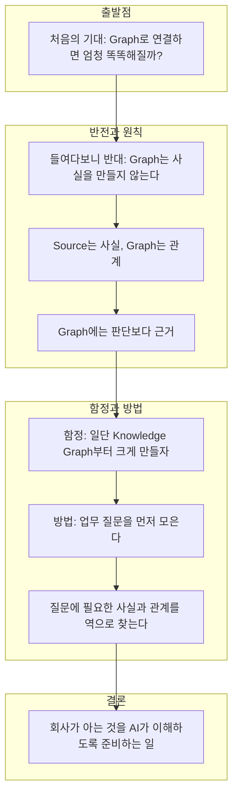
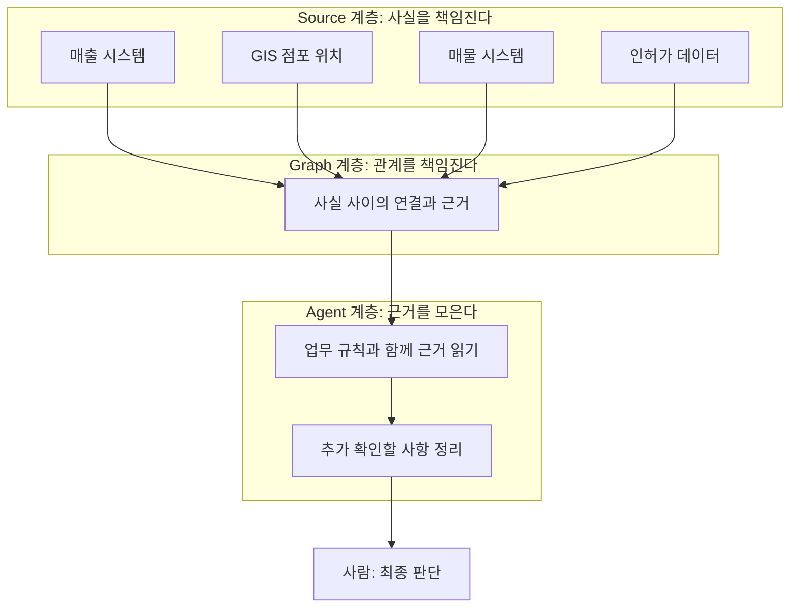
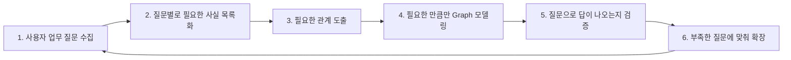
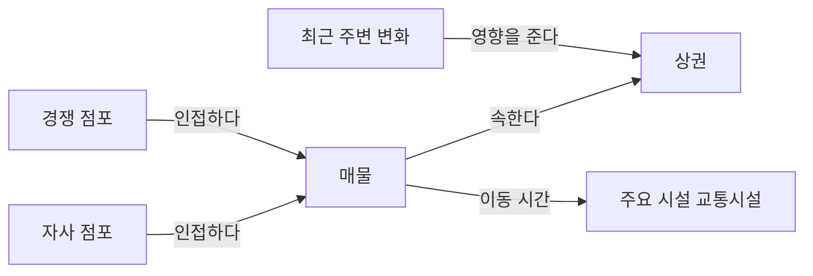
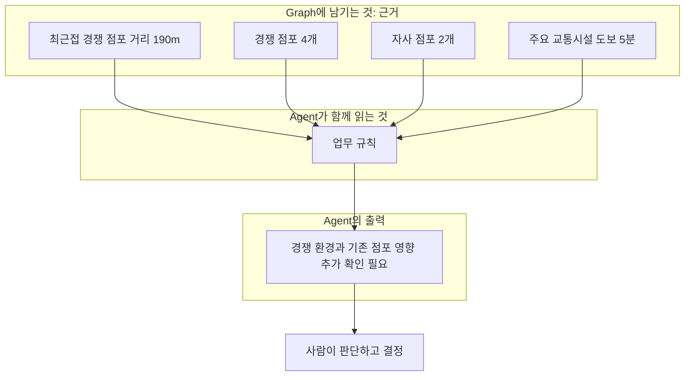

- 작성일: 2026-10-02
- 분석 대상: 점포개발 Agent를 고민하며 Graph를 바라본 단상(사용자가 본문을 직접 전달)
- 문서 성격: 글의 논지를 풀어 설명하고, 2026년 10월 시점의 관련 동향을 검색으로 교차 확인한 해설서


```
단상

요즘 점포개발 Agent를 고민하면서 Graph를 보고 있다.

처음에는 이런 생각이 들었다.

“점포, 경쟁점, 상권 데이터를 Graph로 연결하면 뭔가 엄청 똑똑해지는 건가?”

그런데 계속 들여다보니 오히려 반대였다.

Graph가 새로운 사실을 만들어주는 것은 아니다.

매출은 매출 시스템이 알고 있고,
점포 위치는 GIS가 알고 있고,
매물은 매물 시스템이 알고 있고,
인허가는 관련 데이터가 알고 있다.

Graph가 하는 일은 의외로 단순하다.

이미 알고 있는 사실들을 연결한다.

예를 들어 어떤 매물이 있다.

이 매물은 어느 상권에 속하는가?
주변에 자사 점포는 몇 개인가?
가장 가까운 경쟁 점포는 어디인가?
주요 시설까지 얼마나 걸리는가?
최근 주변 환경에는 어떤 변화가 있었는가?

사실 하나하나는 이미 회사 어딘가에 있다.

문제는 사람이 업무를 할 때
그 사실들을 항상 연결해서 본다는 것이다.

그래서 이런 원칙이 중요해졌다.

Source는 사실을 책임지고,
Graph는 관계를 책임진다.

그리고 하나 더.

Graph에 판단까지 넣기 시작하면 위험해진다.

“경쟁 점포가 190m 떨어져 있다”는 사실이다.

하지만
“경쟁이 심하다”는 판단이다.

“주변에 자사 점포가 2개 있다”는 사실이지만
“이곳은 적합하지 않다”는 판단이다.

그래서 Graph에는 가능하면 판단보다 근거를 남기는 게 좋다.

거리 190m.
경쟁 점포 4개.
자사 점포 2개.
주요 교통시설 도보 5분.

그리고 Agent가 업무 규칙과 함께 이 근거를 읽는다.

“경쟁 환경과 기존 점포와의 영향을 추가 확인할 필요가 있습니다.”

이렇게 되면 AI가 사람의 결정을 대신하는 것이 아니라
판단에 필요한 사실을 빠르게 모아주는 동료가 된다.

여기서 개발자가 자주 빠지는 함정도 있다.

“그럼 일단 Knowledge Graph부터 크게 만들죠.”

나는 오히려 반대로 가려고 한다.

먼저 사용자의 질문을 모은다.

“이 매물 주변 환경 좀 봐줘.”
“기존 점포와 얼마나 가까워?”
“비슷한 상권의 점포 성과는 어때?”
“최근 주변에 어떤 변화가 있었어?”
“내가 추가로 확인할 것은 뭐야?”

그리고 이 질문에 답하려면
어떤 사실과 어떤 관계가 필요한지 역으로 찾는다.

Graph부터 만드는 것이 아니라
업무 질문이 Graph의 모양을 결정하게 하는 것.

결국 점포개발 AI를 준비한다는 것은
새로운 데이터를 잔뜩 만드는 일이 아닐지도 모른다.

회사가 이미 가지고 있는 사실을 믿을 수 있게 정리하고,
그 사실 사이의 관계를 연결하고,
질문했을 때 근거가 자연스럽게 따라오도록 만드는 일.

데이터는 사실을 제공한다.
Graph는 사실 사이를 연결한다.
AI는 그 근거를 모아 사람이 더 빨리 판단하도록 돕는다.

어쩌면 Enterprise AI에서 제일 어려운 것은
AI를 똑똑하게 만드는 것이 아니라,

회사가 알고 있는 것을 AI가 이해할 수 있게 준비하는 일인지도 모르겠다.

https://www.facebook.com/share/p/1MRqHpuo4V/
```

---

## 0. 먼저 밝혀둘 점: 이 문서의 근거와 표기 규칙

원문은 Facebook 게시물 링크와 함께 전달되었습니다. 해당 링크는 사이트의 자동 접근 차단 설정 때문에 열 수 없었습니다. 따라서 이 문서는 대화창에 붙여 넣어 주신 본문 전체를 기준으로 작성했으며, 게시자·게시일 같은 원문 메타 정보는 확인하지 못했습니다.

문서 안의 내용은 출처의 성격에 따라 세 가지로 나누어 표기합니다.

- **[원문]**: 전달해 주신 글에 실제로 적힌 내용입니다.
- **[검색 확인]**: 웹 검색으로 확인한 외부 자료의 내용입니다. 출처가 벤더(판매 회사)인 경우 "벤더 설명"이라고 따로 적었습니다. 판매 회사의 글은 자사 제품에 유리한 관점을 담고 있을 수 있기 때문입니다.
- **[해설]**: 글을 이해하기 쉽도록 제가 덧붙인 해석과 가상의 예시입니다. 확인된 사실이 아니며, 점포개발 업무나 사내 시스템의 실제 구조를 아는 척하지 않기 위해 예시는 모두 설명용 가정이라고 밝혀 두었습니다.

---

## 1. 한눈에 보는 요약

이 글의 중심 주장은 한 문장으로 줄일 수 있습니다. **Graph는 새로운 사실을 만들어내는 마법의 도구가 아니라, 회사 안 여러 곳에 흩어진 사실을 연결해 주는 도구**라는 것입니다.

글쓴이는 처음에 "점포, 경쟁점, 상권 데이터를 Graph로 연결하면 뭔가 엄청 똑똑해지는 것 아닌가" 하고 기대했다가, 들여다볼수록 반대라는 결론에 이릅니다. 매출은 매출 시스템이, 위치는 GIS가, 매물은 매물 시스템이, 인허가는 관련 데이터가 이미 알고 있습니다. Graph가 하는 일은 그 사실들을 서로 이어 붙이는 것입니다.

이 인식에서 글은 네 가지 원칙을 끌어냅니다.

1. **역할 분담**: Source는 사실을 책임지고, Graph는 관계를 책임집니다.
2. **사실과 판단의 분리**: Graph에는 판단("경쟁이 심하다")이 아니라 근거("경쟁 점포 4개, 최근접 190m")를 남깁니다.
3. **Agent의 위치**: Agent는 업무 규칙과 함께 근거를 읽고 "추가로 확인할 것"을 정리해 주는 동료이지, 사람의 결정을 대신하는 존재가 아닙니다.
4. **질문 주도 설계**: Knowledge Graph를 크게 먼저 만들지 말고, 사용자의 업무 질문을 먼저 모은 뒤 그 질문에 답하는 데 필요한 사실과 관계를 역으로 찾아 Graph의 모양을 정합니다.

마지막 문장은 글 전체의 결론입니다. Enterprise AI에서 가장 어려운 일은 AI를 똑똑하게 만드는 것이 아니라, **회사가 이미 알고 있는 것을 AI가 이해할 수 있게 준비하는 일**일지도 모른다는 것입니다.

---

## 2. 글의 전체 구조 한눈에 보기

글은 "의문 → 반전 → 원칙 → 경고 → 방법 → 결론"의 순서로 흘러갑니다. 아래 도식은 이 흐름을 정리한 것입니다.



---

## 3. 본문 상세 해설

### 3.1 "Graph가 똑똑하게 만들어 주는 것은 아니다"

글쓴이가 가장 먼저 바로잡는 것은 Graph에 대한 기대입니다. 새로운 기술을 도입할 때 사람들은 흔히 "이걸 붙이면 지능이 올라가겠지"라고 기대합니다. 그런데 Graph는 데이터 사이의 **연결 구조**를 저장하고 탐색하는 방식일 뿐이어서, 그 안에 들어 있지 않은 새로운 사실을 스스로 만들어 내지는 못합니다.

글에서 드는 예가 이 점을 잘 보여줍니다. 매출은 매출 시스템이, 점포 위치는 GIS가, 매물은 매물 시스템이, 인허가는 관련 데이터가 알고 있습니다. 즉 **사실의 원천(Source)은 이미 회사 안에 존재**합니다. Graph를 도입한다고 해서 매출 숫자가 더 정확해지거나 새로운 인허가 정보가 생기는 것은 아닙니다.

### 3.2 그렇다면 Graph는 무엇을 하는가: "이미 아는 사실을 연결한다"

글은 하나의 매물을 놓고 사람이 실제로 던지는 질문들을 나열합니다.

- 이 매물은 어느 상권에 속하는가?
- 주변에 자사 점포는 몇 개인가?
- 가장 가까운 경쟁 점포는 어디인가?
- 주요 시설까지 얼마나 걸리는가?
- 최근 주변 환경에는 어떤 변화가 있었는가?

이 질문에 필요한 사실 하나하나는 회사 어딘가에 이미 있습니다. 어려운 부분은 **사람이 업무를 할 때 그 사실들을 항상 한꺼번에 연결해서 본다는 점**입니다. 담당자는 매물 정보를 보다가 지도를 열고, 다시 자사 점포 현황을 열고, 경쟁 점포 목록을 확인하고, 최근 변화를 따로 찾아봅니다. 이 "열어서 맞춰 보는" 과정이 사람의 시간을 잡아먹고, 놓치는 부분을 만듭니다.

Graph의 가치는 여기에 있습니다. 매물이라는 한 점에서 출발해 상권, 자사 점포, 경쟁 점포, 주요 시설, 최근 변화로 이어지는 연결을 미리 구성해 두면, 질문이 들어왔을 때 그 연결을 따라가며 근거를 한 번에 모을 수 있습니다.

### 3.3 핵심 원칙: "Source는 사실을 책임지고, Graph는 관계를 책임진다"

이 문장은 책임 소재를 나누는 선언입니다. 사실이 틀렸다면 그것은 원천 시스템의 문제이고 원천에서 고쳐야 합니다. 사실 사이의 연결이 틀렸다면 그것은 Graph의 문제입니다. 이렇게 책임을 나누면 장애나 오류가 생겼을 때 어디를 봐야 하는지가 분명해집니다.

[해설] 이 원칙은 "Graph 안에 사실의 사본을 또 하나 만들지 말라"는 방향으로도 읽힙니다. 같은 사실이 두 곳에 있으면 어느 쪽이 맞는지 다투게 되기 때문입니다. 다만 글에는 Graph가 원천 데이터를 복제해서 담는지, 원천을 참조만 하는지에 대한 구체적 설명이 없으므로, 이 부분은 글쓴이의 의도를 확정할 수 없습니다.

아래 도식은 이 역할 분담과 Agent·사람의 위치를 함께 보여줍니다.



### 3.4 위험 신호: "Graph에 판단까지 넣으면 위험해진다"

글에서 가장 실무적인 통찰은 **사실과 판단을 구분**하라는 대목입니다. 글의 예를 표로 정리하면 다음과 같습니다.

| 구분 | 예시 | 성격 |
|---|---|---|
| 사실 | 경쟁 점포가 190m 떨어져 있다 | 측정·확인 가능한 값 |
| 판단 | 경쟁이 심하다 | 해석, 기준에 따라 달라짐 |
| 사실 | 주변에 자사 점포가 2개 있다 | 측정·확인 가능한 값 |
| 판단 | 이곳은 적합하지 않다 | 업무 기준과 맥락에 따른 결론 |

판단을 Graph에 미리 넣어 두면 생기는 문제를 풀어 보겠습니다.

첫째, **판단의 기준은 바뀝니다.** "경쟁이 심하다"의 기준이 반경 200m 안에 몇 개인지, 업종이 같은지, 상권 성격이 어떤지는 시기와 전략에 따라 달라집니다. 판단이 Graph에 박혀 있으면 기준이 바뀔 때마다 Graph 내용을 고쳐야 합니다. 반면 근거만 있다면 기준이 바뀌어도 근거는 그대로이고, 읽는 쪽의 규칙만 바꾸면 됩니다.

둘째, **판단이 사실처럼 보이게 됩니다.** "경쟁 심함"이라는 값이 저장되어 있으면 읽는 사람이나 AI는 그것을 확정된 사실로 받아들이기 쉽습니다. 어떻게 그런 결론이 나왔는지 거슬러 올라가기 어려워집니다.

셋째, **책임 소재가 흐려집니다.** 최종 판단은 사람의 몫인데, 판단이 데이터 안에 숨어 있으면 누가 그 결정을 내렸는지 알 수 없게 됩니다.

그래서 글쓴이는 Graph에는 "거리 190m. 경쟁 점포 4개. 자사 점포 2개. 주요 교통시설 도보 5분."처럼 근거만 남기자고 합니다.

### 3.5 Agent의 역할: 결정을 대신하는 존재가 아니라 "사실을 빠르게 모아주는 동료"

근거가 Graph에 있으면 Agent가 그것을 **업무 규칙과 함께** 읽습니다. 글의 예시 출력은 "경쟁 환경과 기존 점포와의 영향을 추가 확인할 필요가 있습니다."입니다.

이 문장이 흥미로운 이유는 결론("적합하다/부적합하다")을 내리지 않기 때문입니다. 대신 **무엇을 더 확인해야 하는지**를 제안합니다. 글쓴이의 표현으로는 AI가 사람의 결정을 대신하는 것이 아니라 판단에 필요한 사실을 빠르게 모아주는 동료가 되는 구조입니다.

[검색 확인] 이 구도는 소매 입지 분야의 다른 사례에서도 비슷하게 나타납니다. 인도 Jio Commerce의 Retail Vista라는 입지 선정 에이전트 소개 페이지는 에이전트가 발굴과 분석을 하고 커밋(결정)은 사람이 소유한다는 취지로 역할을 나눕니다. 이 내용은 해당 제품 페이지의 설계 설명이며, 실제 성과를 검증한 자료는 아닙니다.

### 3.6 개발자가 빠지는 함정: "일단 Knowledge Graph부터 크게 만들죠"

글쓴이는 반대 방향으로 가겠다고 말합니다. 먼저 사용자의 질문을 모읍니다. 글에 나온 예는 다음과 같습니다.

- 이 매물 주변 환경 좀 봐줘.
- 기존 점포와 얼마나 가까워?
- 비슷한 상권의 점포 성과는 어때?
- 최근 주변에 어떤 변화가 있었어?
- 내가 추가로 확인할 것은 뭐야?

그리고 이 질문에 답하려면 어떤 사실과 어떤 관계가 필요한지를 **역으로** 찾습니다. 결과적으로 "업무 질문이 Graph의 모양을 결정"하게 됩니다. 아래 도식은 그 순서입니다.



이 방식의 장점은 **쓰이지 않는 데이터를 만드는 낭비를 막는다**는 점입니다. 데이터부터 크게 정리하면 "나중에 쓸 일이 있겠지" 하고 넣은 항목이 대부분 쓰이지 않는 채 유지 비용만 만듭니다. 질문에서 출발하면 모든 노드와 관계가 최소한 하나의 업무 질문과 연결됩니다.

### 3.7 결론부: 점포개발 AI를 준비한다는 것

글은 결론에서 세 가지 일을 말합니다.

1. 회사가 이미 가진 사실을 **믿을 수 있게 정리**한다.
2. 그 사실 사이의 **관계를 연결**한다.
3. 질문했을 때 **근거가 자연스럽게 따라오도록** 만든다.

그리고 세 줄로 역할을 요약합니다. 데이터는 사실을 제공하고, Graph는 사실 사이를 연결하며, AI는 그 근거를 모아 사람이 더 빨리 판단하도록 돕는다는 것입니다.

여기서 "믿을 수 있게"라는 표현이 중요합니다. 사실이 믿을 수 없다면 그 위에 아무리 연결을 잘 얹어도 소용이 없습니다. 글의 마지막 문장이 AI 성능이 아니라 **준비 작업**을 어려운 일로 꼽는 이유가 여기에 있습니다.

---

## 4. 이해를 돕는 가상 예시

[해설] 아래는 글의 개념을 설명하기 위한 **가상의 예시**입니다. 실제 점포개발 시스템의 구조나 데이터 항목이 아니며, 글에 나온 질문들을 그림으로 옮겨 본 것입니다.

### 4.1 하나의 매물을 중심으로 한 관계

글의 질문들이 Graph에서 어떤 연결로 표현될 수 있는지 보여줍니다. 매물에서 출발해 질문에 필요한 대상으로 선이 뻗어 나갑니다.



각 선은 글의 질문 하나에 대응합니다. "어느 상권에 속하는가"는 매물과 상권의 선, "자사 점포는 몇 개인가"와 "가장 가까운 경쟁 점포는 어디인가"는 각각 자사·경쟁 점포와의 선, "주요 시설까지 얼마나 걸리는가"는 시설과의 선, "최근 변화는 무엇인가"는 변화와 상권의 선입니다.

### 4.2 근거를 저장하고 판단은 읽는 쪽에서 내리는 흐름

같은 근거를 두고 Graph와 Agent가 어떻게 일을 나누는지 보여줍니다.



여기서 "추가 확인 필요"라는 출력은 어떤 규칙 때문에 나왔는지 거슬러 올라갈 수 있습니다. 근거(숫자)와 규칙(기준)이 분리되어 있기 때문입니다. 규칙이 바뀌면 같은 근거에서도 다른 문장이 나올 수 있고, 그 변화의 원인이 어디인지도 분명합니다.

---

## 5. 최신 동향 교차 확인 (2026년 10월 2일 기준 검색)

글의 논지가 업계의 흐름과 어떻게 맞닿아 있는지 검색으로 확인했습니다. 아래 내용은 모두 검색된 자료의 범위 안에서만 적었으며, 각 항목에 출처 성격을 함께 표기했습니다.

### 5.1 "Graph + LLM" 조합은 2026년 엔터프라이즈 AI의 주요 화두 [검색 확인, 벤더 설명]

Graphwise와 Propel Software 관계자들이 2025년 12월 말 기사에서 밝힌 2026년 전망에 따르면, 기업들은 "LLM이냐 지식 시스템이냐"를 논쟁하는 단계를 지나 둘을 결합하게 됩니다. 이들은 근거 없는 자율성은 위험하며, 쓸모 있는 에이전트와 환각을 일으키는 에이전트의 차이는 기반이 되는 지식 그래프의 품질에 달려 있다고 주장합니다. 또 지식 그래프 기반 검색 증강 생성(GraphRAG)을 의미 기반 백본으로 삼아 여러 에이전트를 잇는 공유 기억이자 조정 허브로 쓰게 된다고 전망합니다.

같은 자료에는 에이전트 프레임워크를 먼저 투자하고 견고한 단일 에이전트 GraphRAG 시스템은 나중에 만드는 "수레를 말보다 앞에 두는" 문제가 드러날 것이라는 지적, 그리고 버전 관리되는 지식 그래프와 에이전트 상호작용 로그를 컴플라이언스 보고에 쓴다는 내용이 있습니다.

다만 이 자료는 지식 그래프 사업을 하는 회사(Graphwise)의 전망이므로 **업계 전체의 합의라기보다 벤더의 관점**으로 읽는 것이 안전합니다. 이 전망이 글쓴이의 입장과 겹치는 부분은 "Agent 이전에 근거가 되는 지식 기반을 먼저 갖춘다"는 방향입니다.

### 5.2 GraphRAG의 대표 구현(Microsoft)과 그 비용 [검색 확인]

Microsoft의 GraphRAG는 원문 텍스트에서 LLM으로 엔티티·관계·핵심 주장을 추출해 그래프를 만들고, 그래프를 군집화한 뒤 군집별 요약을 만들어 질의 시 활용하는 방식으로 설명됩니다(Rubin Lake 기술 레이더가 Microsoft GraphRAG 문서를 인용한 설명). 그림 같은 시각 자료가 아니라 **텍스트 문서에서 관계를 뽑아내는 접근**이라는 점이 중요합니다.

같은 기술 레이더는 GraphRAG를 "Assess(평가)" 단계로 분류하며 다음 점을 지적합니다.

- 장점: 엔티티·관계·군집을 명시해 다단계(multi-hop) 추론을 개선하고, 구조화된 지식과 LLM 요약을 결합할 수 있습니다.
- 단점: 그래프 구축, 엔티티 해결(같은 대상을 같은 것으로 묶는 일), 유지보수가 비쌉니다. 단순한 하이브리드 검색으로 충분한 용도에는 과할 수 있습니다.
- 권고: 좁은 코퍼스에서 시작해 강력한 하이브리드 검색과 리랭킹에 견주어 비교하고, 그래프 기반 검색이 답변 품질이나 발견 가능성을 **측정 가능하게** 개선할 때만 승격시키라고 합니다.

[해설] 이 권고는 글쓴이의 "Graph부터 크게 만들지 않는다"는 태도와 결이 같습니다. 한 가지 구분할 점이 있습니다. Microsoft GraphRAG는 **비정형 텍스트에서 LLM이 관계를 추출**하는 방식이고, 글이 그리는 구도는 **매출·GIS·매물·인허가처럼 이미 구조화된 시스템의 사실을 연결**하는 방식으로 읽힙니다. 후자는 LLM의 추출 오류 위험이 상대적으로 작고 대신 시스템 간 식별자 맞추기가 핵심 과제가 되겠지만, 이는 글에 직접 쓰여 있지 않은 제 해석입니다.

### 5.3 소매 입지 분야의 AI Agent 동향 [검색 확인, 벤더 설명]

점포개발과 직결되는 소매 입지 분야에서 확인된 내용입니다. 아래는 모두 판매 회사의 제품·교육 자료이므로 성과 수치는 검증된 사실이 아니라 **벤더의 주장**입니다.

- **상권(trade area) 정의 방식**: GrowthFactor의 지식 베이스는 상권을 운전 시간·도보 시간 등으로 그리는 방식과 실제 방문객이 어디서 오는지로 정하는 방식을 소개합니다. 이어서 상권 안의 경쟁·보완 업체를 분석하며, 신규 입지는 핵심 상권 특성과 입지 특성이 비슷한 기존 점포와 유사하게 성과를 낼 것이라는 원칙을 제시합니다. 글쓴이가 "비슷한 상권의 점포 성과는 어때?"를 핵심 질문으로 든 것과 맞닿는 대목입니다.
- **에이전트의 평가 루프**: GrowthFactor의 에이전트 해설 글은 주소를 지오코딩하고 상권을 그린 뒤 인구통계·유동인구를 가져오고, 입지를 점수화하며, 자사 포트폴리오의 유사 점포와 비교하고 잠식(cannibalization) 가능성을 표시하는 순서로 설명합니다. 같은 글은 위원회에 점수를 올리기 전 무엇을 검증해야 하는지를 다루고, **반박할 수 없는 에이전트는 배울 수 없는 에이전트**라는 취지로 근거 제시의 중요성을 강조합니다.
- **인간과 에이전트의 분업**: 앞서 언급한 Retail Vista 소개 페이지는 H3 육각 격자 위에 데이터셋과 경쟁 지도를 얹은 "공간 기반" 위에서 하위 에이전트들이 BigQuery·지도·경로 API를 호출해 후보를 발굴한다고 적습니다. 같은 페이지에는 의사결정은 사람이 하고 발굴·분석은 에이전트가 한다는 문구와, 기존에 실제로 열린 점포의 1년 차 매출에 대해 기회 점수를 백테스트한다는 설계 항목이 있습니다. 이 페이지만으로는 백테스트 결과나 실제 도입 성과를 확인할 수 없었습니다.
- **자연어 질의형 GIS**: Atlas 같은 제품은 "소득이 얼마 이상이고 인구밀도가 얼마 이상인 지점을 찾아 달라"는 식의 자연어 질의로 상권 데이터를 거르는 기능을 소개합니다. 이 역시 제품 홍보 페이지입니다.

이 자료들이 말해 주는 공통 방향은 **점포 입지 판단이 "위치, 상권, 경쟁, 기존 점포, 성과 비교"라는 관계적 질문의 묶음**이라는 점이며, 이는 글쓴이가 Graph에 주목한 이유와 일치합니다. 다만 위 제품들이 내부적으로 Graph 데이터베이스를 쓰는지는 해당 자료에서 확인되지 않았습니다. (Retail Vista 페이지는 H3 격자를 "공간 그래프"라고 표현하지만, 이것이 Neo4j 같은 그래프 DB를 뜻하는지는 알 수 없습니다.)

### 5.4 Graph DB와 Agent를 잇는 도구 환경 [검색 확인]

Neo4j 쪽 자료에서는 다음이 확인됩니다.

- Neo4j는 LLM이 자연어 질문을 Cypher 쿼리로 바꿔 실행하는 Text2Cypher 방식과, 벡터 검색과 Cypher를 결합한 GraphRAG 검색기를 제공합니다.
- MCP(Model Context Protocol) 서버로 이 기능을 에이전트에 노출하는 사례가 있습니다. 공식 Neo4j MCP 서버(neo4j/mcp)와 Neo4j Labs의 MCP 서버(Cypher, Memory, Data Modeling)가 언급되며, 커뮤니티가 만든 GraphRAG용 통합 MCP 서버(벡터·전문 검색·검색 결합 Cypher)도 공개되어 있습니다.
- Neo4j Aura Agent 문서에 따르면 현재 에이전트는 **읽기 전용 쿼리만** 지원하고, 외부 노출은 REST로 제공되며 MCP·A2A는 "곧 지원" 예정이라고 적혀 있습니다. 이 문서의 작성 시점은 확인하지 못했으므로, 현재 상태는 공식 문서에서 다시 확인해야 합니다.

[해설] 글의 구도(근거를 Graph에서 읽고, 판단은 Agent·사람이 한다)에서는 에이전트가 Graph를 **읽기 전용으로** 다루는 것이 자연스럽습니다. 위 읽기 전용 지원은 이 방향과 맞지만, 글이 도구 선택까지 논한 것은 아닙니다.

### 5.5 동향 교차 확인 종합

| 글의 주장 | 외부 자료와의 관계 | 근거 성격 |
|---|---|---|
| 에이전트에는 근거가 되는 지식 기반이 먼저 필요하다 | 2026년 전망에서 같은 방향의 주장이 확인됨 | 벤더 전망 |
| Graph부터 크게 만들지 않는다 | 좁게 시작하고 하이브리드 검색과 비교하라는 권고가 확인됨 | 기술 레이더(평가 의견) |
| AI는 결정을 대신하지 않고 근거를 모은다 | 소매 입지 에이전트 소개에서 인간 결정 소유 구도가 확인됨 | 벤더 설계 설명 |
| 비슷한 상권의 점포 성과를 본다 | 입지 분석 원칙으로 확인됨 | 벤더 교육 자료 |
| Source가 사실, Graph가 관계 | 이 문구와 정확히 같은 표현은 검색에서 찾지 못함 | 해당 없음 |

마지막 행은 정직하게 적어 둡니다. "Source는 사실을, Graph는 관계를 책임진다"라는 정식화는 이번 검색에서 외부의 동일 표현을 확인하지 못했으며, 글쓴이 고유의 정리로 보는 것이 맞습니다.

---

## 6. 글을 더 단단하게 만드는 보완 관점 [해설]

이 절은 글에 대한 비판이 아니라, 글의 원칙을 실제 설계로 옮길 때 마주칠 만한 지점을 제 관점에서 짚어 본 것입니다. 모두 **해설자의 의견**이며 원문에 적힌 내용도, 검색으로 확인된 사실도 아닙니다.

**첫째, 사실과 판단의 경계는 생각보다 얇습니다.** "경쟁 점포 4개"는 숫자이지만, 무엇을 경쟁 점포로 칠지(업종, 반경, 영업 중 여부)에는 이미 업무 기준이 들어 있습니다. 그렇다면 근거를 남길 때 "어떤 기준으로 센 숫자인가"를 속성으로 함께 남기는 편이 좋습니다. 그래야 기준이 달라진 뒤에도 숫자의 의미를 오해하지 않습니다.

**둘째, 거리 190m는 원천 사실이라기보다 계산 결과일 수 있습니다.** 직선거리인지 도보 경로 거리인지에 따라 값이 달라집니다. 이런 파생 값은 계산 방식과 기준 시점을 함께 기록해 두면 근거로서의 신뢰도가 올라갑니다.

**셋째, "믿을 수 있게 정리한다"를 구체화할 필요가 있습니다.** 글의 결론부가 강조한 이 작업은 실무에서 대체로 다음 질문으로 바뀝니다. 같은 매물이나 점포를 시스템마다 같은 대상으로 묶는 식별자가 있는가, 각 사실이 언제 기준인가, 어느 시스템에서 왔는가. 이 세 가지가 없으면 Graph는 연결은 잘하지만 믿기는 어려운 지도가 될 수 있습니다.

**넷째, 업무 규칙은 Graph 밖에 두겠다는 결정이 암묵적으로 들어 있습니다.** 글은 Agent가 "업무 규칙과 함께" 근거를 읽는다고 했습니다. 규칙을 어디에 두고 누가 바꾸는지가 정해져야, 판단을 Graph에 넣지 않는다는 원칙이 지켜집니다.

**다섯째, 수집한 질문은 곧 평가 기준이 됩니다.** 글에서 모으자고 한 사용자 질문은 Graph를 설계하는 출발점이면서, 완성 후에 "이 질문들에 근거가 제대로 따라오는가"를 확인하는 시험 문제로도 쓸 수 있습니다. 이는 5.2절에서 본 "측정 가능한 개선이 있을 때 확장한다"는 권고와도 연결됩니다.

**여섯째, 모든 질문에 Graph가 필요한 것은 아닙니다.** "주변 자사 점포가 몇 개인가"처럼 하나의 공간 쿼리로 끝나는 질문은 GIS 쿼리나 일반 데이터베이스 조인으로도 풀립니다. Graph의 강점은 여러 시스템에 걸친 다단계 연결을 한 번에 따라가야 할 때 드러나므로, 질문 목록을 놓고 Graph가 실제로 이득인 질문이 무엇인지 가려 보는 작업이 선행되면 좋습니다.

---

## 7. 용어 정리

| 용어 | 쉬운 설명 |
|---|---|
| Source(원천 시스템) | 사실을 실제로 보유하고 관리하는 시스템. 이 글에서는 매출, GIS, 매물, 인허가 |
| Graph / Knowledge Graph | 대상(노드)과 그 사이의 관계(엣지)를 저장하는 구조. 연결을 따라가며 탐색하기 좋음 |
| 근거(Evidence) | 판단의 재료가 되는 측정·확인 가능한 사실. "190m", "4개" 같은 값 |
| 판단(Judgment) | 근거에 기준을 적용해 내리는 해석. "경쟁이 심하다", "적합하지 않다" |
| 업무 규칙 | 근거를 어떻게 읽어야 하는지에 대한 회사의 기준 |
| Agent | 질문을 받아 필요한 도구와 데이터를 호출해 결과를 정리하는 AI |
| GraphRAG | Graph를 활용해 검색해 오는 방식의 RAG(검색 증강 생성). 구현 방식은 여러 가지 |
| Text2Cypher | 자연어 질문을 Neo4j의 질의 언어 Cypher로 바꾸는 방식 |
| MCP | AI 에이전트가 외부 도구와 데이터에 연결하는 개방형 프로토콜(Model Context Protocol) |
| 잠식(Cannibalization) | 새 점포가 기존 자사 점포의 매출을 가져가는 현상 |
| 엔티티 해결 | 서로 다른 데이터에서 같은 대상을 찾아 하나로 묶는 작업 |

---

## 8. 맺으며

이 글은 기술 도입기에 흔히 생기는 과열된 기대를 한 걸음 물러서서 점검한 기록입니다. 핵심은 세 가지로 요약됩니다.

첫째, Graph는 사실을 만들지 않고 **연결**합니다. 둘째, Graph에는 판단이 아니라 **근거**를 남기고, 판단은 업무 규칙과 사람이 맡습니다. 셋째, 설계는 데이터가 아니라 **업무 질문**에서 시작합니다.

외부 동향을 확인해 보면 이 방향은 "에이전트 이전에 근거 기반을 먼저 갖춘다", "좁게 시작해 효과를 측정한다", "결정은 사람이 가진다"라는 흐름과 겹칩니다. 다만 그 근거 대부분이 벤더의 전망이나 제품 설명이어서, 실제 도입 효과를 단정할 만한 독립 검증 자료는 이번 검색에서 확인하지 못했습니다. 이 점은 글의 가치를 깎는 것이 아니라, 앞으로 사내에서 직접 질문 목록으로 검증해 볼 부분이 어디인지를 알려 주는 표지로 보시면 됩니다.

---

## 9. 참고 자료

검색 및 확인일은 모두 2026-10-02입니다.

1. Enterprise AI and agentic software trends shaping 2026 (Intelligent CIO, 2025-12-24): https://www.intelligentcio.com/eu/2025/12/24/enterprise-ai-and-agentic-software-trends-shaping-2026/ — Graphwise·Propel Software 관계자의 전망. 벤더 관점.
2. The 2026 Enterprise AI Horizon (Graphwise): https://graphwise.ai/?p=244666 — 하이브리드 아키텍처, GraphRAG, "수레와 말" 비유, 버전 관리되는 지식 그래프. 벤더 관점.
3. GraphRAG and Context Graphs (Rubin Lake 기술 레이더): https://rubinlake.com/en/technology-radar/ai-and-data-engineering/graphrag-context-graphs — Microsoft GraphRAG 문서를 인용한 구조 설명과 Assess 단계 평가. 비용·과잉 위험과 좁게 시작하라는 권고.
4. Microsoft Supercharges RAG with Knowledge Graphs (AI Business, 2024-02-15): https://aibusiness.com/nlp/microsoft-supercharges-rag-with-knowledge-graphs — Microsoft GraphRAG 발표 당시 보도.
5. Graph RAG (Weaviate 블로그): https://weaviate.io/blog/graph-rag — GraphRAG 개념과 MS GraphRAG의 2단계 구조 설명.
6. Simple Trade Area Analysis for Confident Site Selection (GrowthFactor 지식 베이스): https://growthfactor.ai/resources/knowledge-base — 상권 정의와 경쟁·보완 업체 분석 원칙. 벤더 자료.
7. AI Agents for Site Selection: How They Work in 2026 (GrowthFactor): https://www.growthfactor.ai/resources/blog/ai-agents-site-selection — 입지 평가 루프와 검증 관점. 벤더 자료.
8. Retail Vista (Jio Commerce): https://glass.jiocommerce.io/agents/retail-vista/ — 에이전트와 사람의 역할 분담, H3 격자 기반 설계, 백테스트 항목. 제품 소개 페이지이며 성과 검증 아님.
9. Retail & Marketing (Atlas): https://atlas.co/solutions/retail-marketing/ — 자연어 기반 상권 분석 기능 소개. 벤더 자료.
10. Aura GraphRAG Agents (Neo4j 개발자 문서): https://www.neo4j.com/developer/genai-ecosystem/aura-agent — Text2Cypher, 읽기 전용 에이전트, 외부 노출 방식. 작성 시점 미확인.
11. Implementing Neo4j GraphRAG Retrievers as MCP Server (Neo4j 개발자 블로그): https://neo4j.com/blog/developer/neo4j-graphrag-retrievers-as-mcp-server/ — Neo4j Cypher MCP 서버와 GraphRAG 검색기의 MCP 노출 사례.
12. mcp-neo4j-graphrag (GitHub): https://github.com/neo4j-field/mcp-neo4j-graphrag — 벡터·전문 검색과 Cypher를 결합한 커뮤니티 MCP 서버.
13. 분석 대상 원문: https://www.facebook.com/share/p/1MRqHpuo4V/ — 자동 접근이 차단되어 직접 열람하지 못함. 전달받은 본문 기준으로 분석.

---

작성 일자: 2026-10-02
