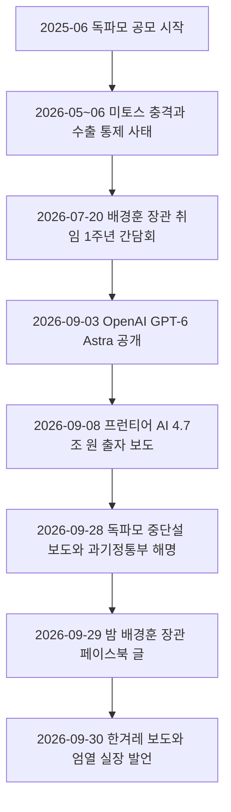
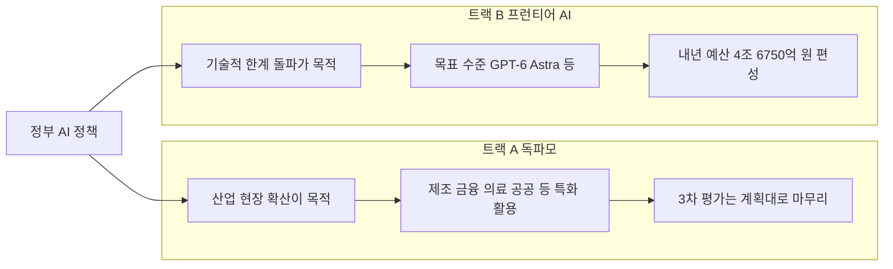
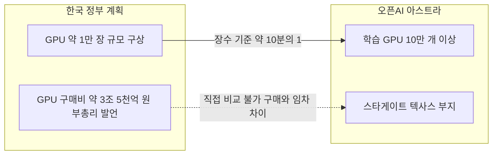
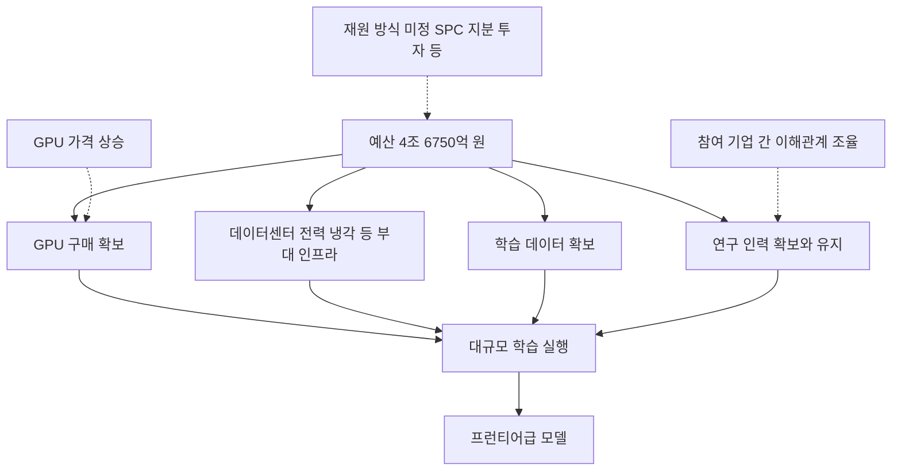

- 작성 기준일: 2026-10-02
- 대상 기사: 한겨레 선담은 기자, 「정부, 'GPT-6 아스트라' 수준 프런티어 AI모델 개발 나선다」 (2026-09-30)
- 이 문서의 서술은 모두 아래 「참고 자료」에 적은 출처에서 확인한 내용입니다. 출처가 직접 말하지 않은 부분은 반드시 "추정" 또는 "단순 산술"이라고 표시했습니다.

> 
> 
> 4조 6750억이면 아스트라 가능한 거 맞아요?
> 
> 진짜 이거 맞나 모르겠네....
> 
> https://www.threads.com/share/_nVcpygv0/
> 

---

## 1. 먼저 결론부터

질문은 "4조 6,750억 원이면 아스트라급이 가능한 게 맞느냐"입니다. 확인된 자료만으로 답하면 다음과 같습니다.

**"가능하다"고 확인된 바는 없습니다.** 정부(과학기술정보통신부, 이하 과기정통부)가 말한 것은 "아스트라 수준을 **목표로 하겠다**"입니다. 목표를 세웠다는 뜻이지, 이 예산으로 달성할 수 있다는 보증이 아닙니다. 오히려 기사를 쓴 한겨레는 "GPU 가격이 계속 오르는 상황이라 이 예산만으로는 프런티어 모델 개발에 필요한 자원을 충분히 확보하기 어렵다는 게 정부와 업계의 공통된 의견"이라고 전하고 있습니다. 즉 예산을 편성한 정부 스스로도 이 돈만으로 충분하다고 말하지 않는 상태입니다.

또 하나 짚어야 할 점은 이 사업의 구체적인 틀이 아직 정해지지 않았다는 것입니다. 과기정통부는 9월 28일 공식 설명자료에서 독파모 중단 여부와 특수목적법인(SPC) 설립 여부 등은 "아직 정해진 바 없다"고 밝혔고, 9월 8일 보도에서도 "총액과 출자 형태 외에 나머지 구체적인 내용은 결정된 바 없다"는 과기정통부 관계자의 말이 전해졌습니다. 결정되지 않은 사업의 성패를 숫자 하나로 단정하기는 어렵습니다.

이 문서는 이 결론이 어떤 근거에서 나오는지를 차근차근 설명합니다.

---

## 2. 기사가 말하는 내용

한겨레 기사의 핵심은 세 가지입니다.

첫째, 정부가 최근 중단설이 돌았던 '국가대표 AI' 사업, 즉 독자 AI 파운데이션 모델 프로젝트(줄여서 독파모)를 **계획대로 마무리하되**, 그와 별도로 글로벌 수준의 프런티어 모델 개발을 추진하겠다는 입장을 냈다는 것입니다. 배경훈 부총리 겸 과기정통부 장관은 9월 29일 밤 페이스북에 "독파모는 계속된다. 그리고 대한민국은 동시에 프런티어 인공지능에도 도전해야 한다"고 썼습니다. 프런티어 AI는 기술적 한계를 돌파하는 축, 독파모는 AI가 산업과 사회 곳곳에서 쓰이게 하는 축이라는 "두 개의 축"이 정부의 설명입니다.

둘째, 목표 수준에 대한 발언입니다. 엄열 과기정통부 인공지능정책실장은 한겨레에 "애초 독파모는 글로벌 수준의 90~95% 성능을 따라잡자는 취지로 계획됐는데, 여기에 안주하면 글로벌 격차를 좁히기 어렵다는 업계의 우려를 들었다"고 말했고, 새로 추진할 프런티어 모델은 "범용인공지능(AGI)의 초기 단계로 평가받는 오픈AI의 'GPT-6 아스트라' 등의 수준을 목표로 하겠다"고 설명했습니다.

셋째, 돈입니다. 정부는 내년도 예산안에 프런티어 AI 개발용으로 **4조 6,750억 원**을 편성했고, 상당 부분이 GPU 구매에 쓰일 전망입니다. 다만 앞서 말한 것처럼 이 예산만으로는 자원이 충분치 않다는 것이 정부와 업계의 공통된 의견이며, 구체적인 재원 마련 방안은 "정해진 바 없다"는 것이 과기정통부 입장입니다.

기사에는 두 가지 과제도 적혀 있습니다. 하나는 참여 기업 간 이해관계 조율입니다. 스타트업 업계에서는 대규모 자본이 필요한 사업 구조상 사실상 대기업의 '하청'으로 전락할 수 있다는 우려가 나오고, 기존 독파모 정예팀인 SK텔레콤과 LG AI연구원 같은 대기업은 참여를 긍정적으로 검토하는 분위기라고 합니다. 다른 하나는 기업의 자체 투자 부담입니다. 참여 조건을 두고 정부와 논의가 이어질 전망입니다.

---

## 3. 배경: 왜 지금 이런 발표가 나왔나

### 3-1. 독파모가 무엇인가

독파모는 정부가 국내 기술로 챗GPT나 제미나이 같은 독자 AI 모델을 만들겠다며 2025년 6월 공모를 시작한 사업입니다. 5개 정예팀을 뽑아 GPU와 데이터셋 등 개발 자원을 지원하고, 결과물은 오픈소스로 활용할 수 있게 해 산업 전반의 AI 전환을 돕는다는 구상이었습니다. 공모 당시 팀당 GPU 500장으로 시작해 1,000장 이상으로 늘리는 방식이 제시되었고, 평가를 통해 팀을 가려내는 경쟁형 구조였습니다. 목표는 최근 6개월 이내 글로벌 AI 모델 대비 벤치마크 성능 95% 이상이었습니다.

배경훈 부총리는 이번 글에서 "사업을 처음 기획할 당시에는 지원할 수 있는 GPU 자체가 부족했다. 한정된 자원을 경쟁을 통해 소수에게 집중할 수밖에 없었지만, 지금은 상황이 달라지고 있다"고 설명했습니다. 현재는 독파모 3차가 진행 중이며, 부총리는 3차를 "계획대로 제대로 마무리하겠다"고 밝혔습니다.

### 3-2. '미토스 충격'과 수출 통제

한겨레는 과기정통부가 올해 5~6월 앤트로픽발 '미토스 충격'과 미국 트럼프 행정부의 수출 통제 사태를 겪으며 프런티어 모델 개발 필요성을 절감했다고 전합니다. 이 부분은 앤트로픽의 공식 설명으로도 사실관계가 확인됩니다. 앤트로픽은 2026년 6월 9일 Claude Fable 5와 Mythos 5를 출시했고, 6월 12일 미국 상무부 수출 통제를 준수하기 위해 두 모델 접근을 중단했으며, 상무부가 6월 30일 통제를 해제하자 7월 1일 접근을 복구했습니다. 외국 최상위 모델에 대한 접근이 정치적 결정으로 며칠간이라도 끊길 수 있다는 점이 한국 정부가 말하는 "기술 종속" 우려의 직접적인 배경입니다.

### 3-3. 이번 발표까지의 경과

7월 20일 간담회에서 배경훈 부총리는 프런티어 AI를 구현하려면 엔비디아의 차세대 베라 루빈(Vera Rubin) GPU 약 1만 장과 GPU 구매비만 최소 3조 5천억 원이 필요하다고 밝혔습니다. 이때는 "내년도 예산을 마련해 추진해야 하는 사안으로 재정당국을 설득 중이며 아직 결정된 것은 없다"고 했습니다. 이후 9월 8일에 정부가 프런티어 AI 개발 지원을 위해 미래대응기금 방식으로 4조 7천억 원을 출자할 계획이라는 보도가 나왔고, 이 재원은 과기정통부가 제시한 내년도 AI 예산안 약 9조 4천억 원에 포함된 것으로 전해졌습니다. 한겨레가 쓴 4조 6,750억 원과 다른 매체의 4조 7천억 원은 같은 규모를 반올림해서 표기한 것으로 보입니다. 다만 두 보도가 같은 항목이라고 정부가 명시한 자료는 이번 조사에서 확인하지 못했습니다.

### 3-4. 중단설과 정부의 해명

9월 28일, 한 매체가 정부가 독파모를 중단하고 5조 원 규모의 SPC를 설립해 프런티어급 AI 개발로 전환한다고 단독 보도했습니다. 과기정통부는 같은 날 설명자료를 내고 "독파모 중단 및 최상위급 AI 모델 개발 관련 SPC 설립 여부 등은 아직 정해진 바 없다"고 했고, 다만 "독파모의 통합 및 개편은 이미 예산안 간담회 등에서 언급된 사항이며 중단이 아니라 개편 및 확장의 개념"이라고 설명했습니다. 이어 부총리가 직접 SNS에 글을 올려 사업 지속 의지를 밝혔습니다. 중단설이 사실이 아니라는 정부 입장이 두 차례 나온 셈입니다.

한편 헤럴드경제는 같은 시기에 정부가 독파모를 프런티어급 개발로 확대하는 방안을 검토 중이며 SPC 설립이 논의되고 있다고 보도했습니다. 정부 공식 입장은 "정해진 바 없다"이므로, SPC는 어디까지나 검토 중인 방안으로 읽어야 합니다.

### 3-5. 정부가 그리는 '투 트랙'

부총리는 "산업 현장에 필요한 AI가 모두 초거대 프런티어 모델일 필요는 없다"며 제조, 금융, 의료, 공공서비스, 피지컬 AI에서는 비용, 속도, 보안, 전문성을 고려한 AI가 필요하다고 했습니다. 또 중국 오픈웨이트 AI 확산을 독파모를 계속해야 하는 이유로 꼽았습니다. 두 트랙은 서로 목적이 다르다는 것이 정부의 논리입니다.

---

## 4. 비교 대상인 'GPT-6 아스트라'는 무엇인가

기준점을 정확히 알아야 "가능한가"를 따질 수 있으므로 아스트라부터 정리합니다.

- **출시**: 오픈AI는 2026년 9월 3일 GPT-6 Astra를 공개했습니다. 첫날에는 제한된 조직에 먼저 제공하고 이후 며칠에 걸쳐 ChatGPT 유료 이용자와 API로 넓혔습니다. API 모델명은 gpt-6-astra입니다. 이후 9월 22일에 GPT-6 Sol과 Luna가, 9월 29일에는 GPT-6.1 Sol이 추가로 발표되어 아스트라는 현재 오픈AI 모델군의 한 구성원입니다.
- **성격**: 오픈AI는 "우리가 지금까지 폭넓게 배포한 가장 뛰어난 모델"이라고 소개했고, 사이버보안 능력이 자사 대비태세 프레임워크의 'Critical' 단계에 처음 도달한 모델이라고 밝혔습니다. 그래서 고급 사이버 기능은 검증된 조직에 한정하는 등 제한을 둔 채 출시되었습니다.
- **학습 규모**: 오픈AI 측 발언을 전한 Axios 보도에 따르면 아스트라는 텍사스 스타게이트 부지에서 **10만 개 이상의 GPU**를 사용한 오픈AI 역대 최대 규모의 학습으로 만들어졌습니다. 오픈AI 사장 그렉 브록먼도 여러 인터뷰에서 10만 개를 넘는 GPU로 학습한 것은 이번이 처음이라고 말했습니다. 엔비디아 젠슨 황은 이 모델이 엔비디아 그레이스 블랙웰 GPU 10만 개 이상으로 학습되었다고 언급했습니다.
- **가격**: API 가격은 입력 100만 토큰당 10달러, 출력 100만 토큰당 50달러로 보도되었습니다.

"AGI 초기 단계"라는 표현은 한겨레 기사에서 엄열 실장이 쓴 평가이고, 오픈AI 측에서도 브록먼이 AGI 도래로 평가될 수 있다고 말한 것으로 보도되었습니다. 이 평가가 학계에서 합의된 것은 아니므로, 이 문서에서는 "AGI"라는 말 자체를 사실로 전제하지 않고 "현재 공개된 최상위권 모델"이라는 의미로만 다룹니다.

---

## 5. 숫자로 따져 보기: 4조 6,750억 원은 어느 정도의 돈인가

### 5-1. 우리가 확인한 숫자들

| 항목 | 내용 | 출처 성격 |
|---|---|---|
| 프런티어 AI 내년 예산 | 4조 6,750억 원 (다른 보도는 약 4조 7천억 원) | 한겨레 및 복수 매체 보도 |
| 부총리가 말한 필요 규모 | 베라 루빈 GPU 약 1만 장, GPU 구매비만 최소 약 3조 5천억 원. 플랫폼, 클러스터, 전력, 냉각 등 부대비용은 별도 | 배경훈 부총리 7월 20일 발언 |
| 내년 과기정통부 AI 예산안 | 9조 4,211억 원 (올해보다 84.3% 증가). 이 중 AI 컴퓨팅 자원 확충에 3조 8,500억 원을 편성해 최신 GPU 약 1만 장 확보 계획 | 데일리안, ZDNet Korea 보도 |
| 현재 독파모 팀당 GPU | 엔비디아 B200 약 500~735장 | 부총리 7월 20일 발언 |
| 아스트라 학습에 쓰인 GPU | 10만 개 이상 | 오픈AI 측 발언 및 보도 |

**주의할 점이 하나 있습니다.** 4조 6,750억 원(프런티어 AI 개발)과 3조 8,500억 원(AI 컴퓨팅 자원 확충, GPU 약 1만 장)이 같은 돈의 다른 표현인지, 별개 항목인지, 일부가 겹치는지를 정부가 명시한 자료는 이번 조사에서 찾지 못했습니다. 두 숫자를 더하거나 같은 것으로 합치지 않고, 이 문서에서도 별개로 취급합니다. 여러 매체가 "GPU 1만 장"이라는 같은 수량을 서로 다른 예산 항목과 연결해 보도하고 있어 독자가 혼동하기 쉬운 지점입니다.

### 5-2. 단순 산술로 보는 구성

부총리가 7월에 말한 "GPU 1만 장에 3조 5천억 원"을 그대로 가져와서 계산해 보겠습니다. 이것은 **정부가 제시한 숫자를 이용한 단순 산술**이며, 실제 예산 내역이 아닙니다.

- GPU 1장당 약 3억 5천만 원이라는 계산이 나옵니다 (3조 5천억 ÷ 1만 장).
- 4조 6,750억 원에서 GPU 구매비 3조 5천억 원을 빼면 약 1조 1,750억 원이 남습니다.
- 이 남은 돈으로 전력과 냉각 설비를 포함한 데이터센터 구축 부대비용, 학습 데이터 확보, 연구 인력 인건비, 그리고 GPU를 돌리는 전기요금과 운영비까지 감당해야 합니다.

단, 4조 6,750억 원 전체가 "내년 한 해 동안" 쓰이는 돈인지, GPU 구매 외에 어떤 항목이 포함되는지는 확인된 바 없습니다. 위 계산은 "GPU 구매비가 이 예산의 큰 부분을 차지할 것"이라는 한겨레의 설명과 부총리의 7월 발언을 겹쳐 본 것에 불과합니다.

### 5-3. 아스트라 쪽 규모와 견주면

장수만 보면 정부가 구상하는 규모는 아스트라 학습에 쓰인 규모의 약 10분의 1입니다. 다만 이 비교에는 한계가 있습니다. 한국이 구상하는 것은 블랙웰의 다음 세대인 베라 루빈이고, 아스트라는 그레이스 블랙웰로 학습했습니다. 세대가 다른 GPU의 장당 성능 차이를 반영한 정량 비교는 이번 조사에서 확인한 자료에 없으므로, "장수가 10분의 1이니 성능도 10분의 1"처럼 환산하지 않습니다. 장수가 적으면 같은 연산량을 채우는 데 더 오랜 시간이 걸린다는 일반 원리는 분명하지만, 얼마나 걸리는지는 알 수 없습니다.

**아스트라 학습 비용은 공식 공개된 바 없습니다.** 오픈AI의 내부 컴퓨팅 비용은 공개되지 않았다는 점을 해설 매체도 분명히 적고 있습니다. 다만 외부 분석가들이 가정을 두고 추정한 값은 있습니다. 한 투자 분석가는 GPU 10만 개를 90~120일 동안 GPU 시간당 2.5~3.5달러에 쓴다고 가정해 **주 학습 1회분 연산 비용이 약 5억~10억 달러**일 것이라고 추정했습니다. 같은 용량을 연산 임대 업체의 공시 가격(시간당 10.5달러 수준)으로 계산하면 훨씬 높아져 약 23억~30억 달러라는 계산도 함께 제시되었습니다. 이것은 **제3자의 가정 기반 추정치**이며 오픈AI가 확인한 숫자가 아닙니다. 또한 사전 실험, 데이터, 인력, 안전성 평가, 출시 후 서비스(추론) 비용은 제외된 값입니다.

참고로 이 추정치를 원화로 단순 환산하면, 환율을 1달러당 1,400~1,500원으로 가정할 때 약 7,000억~1조 5천억 원입니다(위 5억~10억 달러 기준, 환율은 이 문서의 가정이며 실제 환율은 확인하지 않았습니다). 이 숫자만 보면 "한 번의 학습 연산 비용"은 4조 6,750억 원보다 작아 보일 수 있습니다. 그러나 이 비교는 오해하기 쉽습니다. 오픈AI는 이미 구축된 스타게이트 인프라에서 단가 할인을 받아 연산을 사용하는 형태로 추정된 반면, 한국은 GPU를 **직접 구매하고 데이터센터 인프라를 갖춰야** 하기 때문입니다. 한 번 학습하는 비용과, 학습 설비를 새로 마련하는 비용은 다른 문제입니다. 더 나아가 최상위 모델은 한 번에 성공하는 것이 아니라 여러 차례의 실험과 재학습을 거치므로, 1회분 학습 비용으로 총사업비를 가늠하는 것은 위험합니다.

규모감을 위한 참고로, 2차 해설 매체는 오라클이 오픈AI의 스타게이트 애빌린 부지를 위해 엔비디아 GB200 약 40만 개에 약 400억 달러를 쓸 계획이라고 적고 있습니다. 이 수치는 일반 해설 블로그에서 가져온 것이라 신뢰도가 높지 않으므로, "오픈AI 쪽 인프라 투자가 한국 프런티어 예산과 자릿수가 다른 규모일 수 있다"는 정도의 참고로만 읽어 주세요.

---

## 6. 그래서 "가능한가"를 어떻게 읽어야 하나

### 6-1. 정부와 업계가 직접 한 말

- 한겨레: 예산만으로는 프런티어 모델 개발에 필요한 자원을 충분히 확보하기 어렵다는 것이 정부와 업계의 공통된 의견이다. GPU 가격이 계속 오르고 있다.
- 한겨레: 부총리가 7월에 "정부의 지분 투자나 SPC 설립"을 직접 언급했지만 구체적 재원 마련 방안은 "정해진 바 없다"는 것이 현재 입장이다.
- 디지털데일리: 정부가 GPU와 개발비를 직접 지원하는 방식만으로는 글로벌 프런티어 모델과 장기간 경쟁하기에 한계가 있을 수 있다는 의미로 부총리 발언을 해석했다(이는 해당 매체의 해석입니다).
- AI타임스(최병호 고려대 AI연구소 교수): 프런티어급은 최소 1조 단위 매개변수가 필요한데 이를 충족한 국내 모델은 없다. 기업 간 경쟁 방식은 국가 단위 AI 개발에 적합하지 않았으므로 역량을 결집하는 것은 바람직하다. 그러나 GPU 지원에 비해 데이터와 인재 확보 방안은 상대적으로 부족하다. 체계적인 데이터 팩토리 구축과 우수 인재 유지가 관건이다.

### 6-2. 돈 말고 따져야 할 병목

아스트라급 모델을 만든다는 것은 GPU만 사면 되는 일이 아닙니다. 위 인용에서 전문가가 짚은 것처럼 데이터와 인재가 필요하고, 한겨레가 짚은 것처럼 참여 기업 간 이해관계 조율도 필요합니다. 아래 그림은 이 요소들이 서로 어떻게 맞물리는지를 정리한 것입니다.

점선 화살표는 기사와 전문가 발언에서 확인된 위험 요인입니다. 이 가운데 GPU 가격 상승과 재원 방식 미정은 정부 측도 인정한 부분이고, 데이터와 인재 문제는 전문가가 지적한 부분입니다.

### 6-3. 이 문서가 내리는 평가

종합하면 질문에 대한 정직한 답은 다음과 같습니다.

1. **"4조 6,750억 원이면 아스트라급이 가능하다"는 주장은 어디서도 확인되지 않았습니다.** 정부는 목표 수준을 말했을 뿐이고, 한겨레는 정부와 업계 모두 예산 부족을 인정한다고 전했습니다.
2. **장수 기준으로 보면 정부가 구상하는 GPU 규모는 아스트라 학습 규모의 약 10분의 1입니다.** 다만 GPU 세대가 달라 성능을 단순 환산하지는 못합니다.
3. **예산이 곧 GPU 장수로 환산되는 구조라서, GPU 가격이 오르면 같은 예산으로 살 수 있는 연산 자원이 줄어듭니다.** 이 점은 한겨레가 직접 언급한 위험입니다.
4. **사업 방식 자체가 미정입니다.** 출자(미래대응기금)인지, SPC인지, 독파모와 어떻게 연계되는지, 기업의 자체 투자 비중은 얼마인지가 정해지지 않았습니다.
5. 따라서 지금 시점에서 가장 정확한 표현은 "목표는 아스트라급, 그러나 재원과 방식은 아직 정해지지 않았고 현재 예산만으로 충분하다고 말하는 주체는 없다"입니다.

이것이 "불가능하다"는 결론은 아닙니다. 불가능하다는 근거도 이번 조사에서는 확인되지 않았습니다. 확인되지 않은 것을 확인된 것처럼 말하지 않는 것이 이 문서의 원칙입니다.

---

## 7. 헷갈리기 쉬운 용어와 숫자 정리

**프런티어 AI**: 그 시점에 공개된 가장 높은 성능 수준의 AI 모델을 뜻하는 업계 용어입니다. 이번 기사에서는 오픈AI의 GPT-6 Astra와 앤트로픽의 미토스급 모델이 기준점으로 언급됩니다.

**독파모**: 독자 AI 파운데이션 모델 프로젝트의 줄임말입니다. 정부 지원으로 국내 기업 정예팀이 경쟁하며 자체 AI 모델을 개발하는 사업이고, 이번 발표에서는 "계속된다"고 확인된 사업입니다.

**SPC(특수목적법인)**: 특정 사업을 위해 별도로 세우는 회사입니다. 정부와 여러 기업이 함께 출자해 하나의 프런티어 모델을 개발하는 방안으로 검토되는 것으로 전해졌으나, 설립은 결정되지 않았습니다.

**미래대응기금**: 9월 8일 보도에서 프런티어 AI에 4조 7천억 원을 출자하는 방식으로 언급된 재원 형태입니다. 이 보도에서도 연계 방식 등 세부 사항은 미정이라고 했습니다.

**4조 6,750억 원과 4조 7천억 원**: 같은 규모를 서로 다르게 표기한 것으로 보이며, 이 문서에서는 한겨레 표기인 4조 6,750억 원을 사용했습니다.

---

## 8. 앞으로 확인해야 할 것들

이 사안은 계속 진행 중이므로 아래 항목이 확정되는 순간 평가가 달라질 수 있습니다. 모두 현재 시점에서는 "미정"으로 보도된 것들입니다.

1. 프런티어 사업의 추진 구조(출자, SPC, 출연 등)와 독파모와의 연계 방식
2. 4조 6,750억 원의 정확한 내역과 집행 기간, 그리고 3조 8,500억 원(AI 컴퓨팅 자원 확충)과의 관계
3. 참여 기업과 기업의 자체 투자 비중, 스타트업의 역할
4. GPU 조달 시점과 실제 단가(가격 상승 반영 여부)
5. 데이터 확보 및 인재 유지 방안
6. 국회 국정감사와 예산 심사 과정에서 투자 대비 성과 논쟁이 어떻게 정리되는지 (예산안 심의 결과에 따라 금액이 달라질 수 있습니다)

---

## 9. 출처의 신뢰 수준 구분

| 구분 | 의미 | 이 문서에서의 예 |
|---|---|---|
| 정부 공식 발언 | 장관, 실장, 과기정통부 설명자료 | 아스트라 수준 목표, 독파모 지속, 구체 방식 미정 |
| 언론 보도 | 한겨레, 머니투데이, 디지털데일리, AI타임스 등 | 예산 규모, 재원 방식 보도, 업계 반응 |
| 기업 공식 발표 | 오픈AI 발표 및 Axios 등이 전한 오픈AI 측 발언 | 아스트라 출시일, 10만 GPU 학습 |
| 제3자 추정 | 분석가의 가정 기반 계산 | 아스트라 학습 연산 비용 5억~10억 달러 |
| 단순 산술 | 이 문서가 공개된 숫자로 직접 계산한 값 | GPU 장당 약 3억 5천만 원, 남는 금액 약 1조 1,750억 원 |

이 문서가 인용한 Threads 링크(요청 시 함께 주신 공유 링크)는 해당 사이트가 자동 접근을 허용하지 않아 열어 보지 못했습니다. 따라서 그 글의 내용은 이 문서에 반영하지 않았습니다.

---

## 참고 자료

모든 URL은 2026-10-02에 확인했습니다.

**한국 정부 정책 및 보도**

- 한겨레(다음 게재), 「정부, 'GPT-6 아스트라' 수준 프런티어 AI모델 개발 나선다」, 선담은 기자, 2026-09-30: https://v.daum.net/v/20260930163206773
- 머니투데이, 「배경훈 부총리 "독파모는 계속된다…프론티어 AI에도 도전해야"」: https://www.mt.co.kr/tech/2026/09/30/2026093005550830283
- 머니투데이, 「"독파모 계속된다"… 중단설 끊은 배경훈」: https://www.mt.co.kr/tech/2026/10/01/2026093019473640928
- 디지털데일리, 「"독파모 중단 없다" 해명에도 업계 여진 지속…'불공정' 불씨 끄려면」: https://www.ddaily.co.kr/page/view/2026093020121617505
- AI타임스, 「과기부, 국대 AI 중단설 일축…"현 구조로는 프런티어 역부족" 지적도」: https://www.aitimes.com/news/articleView.html?idxno=215733
- 이투데이, 「정부, 국산 프론티어 AI 개발에 4.7조원 투입⋯"미토스 잡는다"」(2026-09-08): https://www.etoday.co.kr/news/view/2623278
- 파이낸셜뉴스, 「정부, '글로벌 프론티어 AI' 개발 기금 4.7조원 출자한다」(2026-09-08): https://www.fnnews.com/news/202609082051551388
- 헤럴드경제, 「2000억 쏟아붓고 백지화 된 '독파모'…프런티어 AI 개편 논란」: https://biz.heraldcorp.com/article/10887387
- 데일리안, 「AI에 9.4조·GPU 3.85조…'세계 3강' 얼마나 다가섰나 [미리보는 국감-과학]」: https://www.dailian.co.kr/news/view/1694283/
- ZDNet Korea, 「[AI 고속도로] 엔비디아 베라 루빈 서버 경쟁 막 올랐다…韓도 도입 채비」(2026-09-29): https://zdnet.co.kr/view/?no=20260929155121
- 디지털데일리 일문일답(네이트 게재), 「"프론티어 AI에 3.5조원 승부수…독자AI와 투트랙 간다"」(2026-07-20): https://m.news.nate.com/view/20260720n25525
- 보안뉴스, 「우리 기술 '독자 AI 파운데이션 모델' 만들 정예 팀 찾는다」(2025-06-20): https://m.boannews.com/html/detail.html?idx=137755

**GPT-6 Astra**

- OpenAI, 「GPT-6 Astra: A new generation of intelligence」: https://openai.com/index/gpt-6-astra/
- OpenAI, 「Safety overview: GPT-6 Astra」(2026-09-03): https://openai.com/index/safety-overview-gpt-6-astra/
- Wikipedia, 「GPT-6 Astra」: https://en.wikipedia.org/wiki/GPT-6_Astra
- Techmeme(Axios 보도 요약), 「OpenAI says Astra was built on its largest-ever training run, using more than 100,000 GPUs at its Stargate site in Texas」: https://www.techmeme.com/260903/p36
- VentureBeat, 「'Welcome to the AGI era': OpenAI launches GPT-6 Astra」: https://venturebeat.com/technology/welcome-to-the-agi-era-openai-launches-gpt-6-astra
- Wccftech, 「OpenAI's ~$1 Billion GPT-6 Astra Heralds The Age Of AGI…」(학습 비용 추정, 제3자 추정): https://wccftech.com/openais-1-billion-gpt-6-astra-heralds-the-age-of-agi-according-to-nvidias-jensen-huang-yet-anthropics-fable-5-1-still-beats-it-on-swe-bench-pro-and-coding-benchmarks/
- Shanu Mathew의 X 게시물(학습 비용 추정 계산식 원문, 제3자 추정): https://x.com/ShanuMathew93/status/2096703825407070686
- Shattered, 「Brockman Declares AGI Era After Astra 100K-GPU Run」: https://shattered.io/brockman-astra-agi-era-100k-gpu-2026/
- MindStudio, 「GPT-6 Astra Pricing and Access」: https://www.mindstudio.ai/blog/gpt-6-astra-pricing-access
- IndMoney, 「GPT-6 Astra: Is It AGI? Pricing, Nvidia & OpenAI」(오라클 투자 계획 언급, 2차 자료): https://www.indmoney.com/blog/us-stocks/gpt-6-astra-explained-agi-nvidia-openai

**Anthropic 모델 접근 중단 및 복구**

- Anthropic 공식 설명: https://www.anthropic.com/news/fable-mythos-access

---

작성 일자: 2026-10-02
