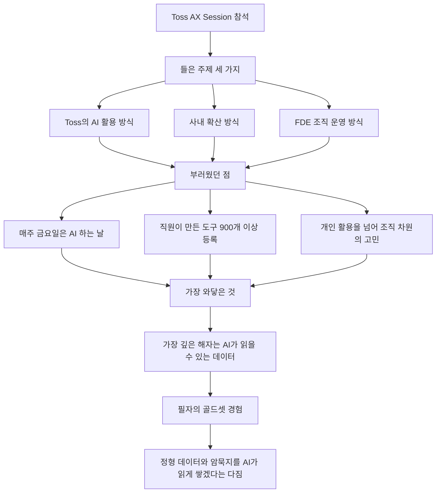
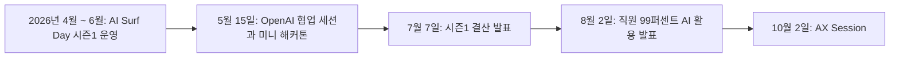
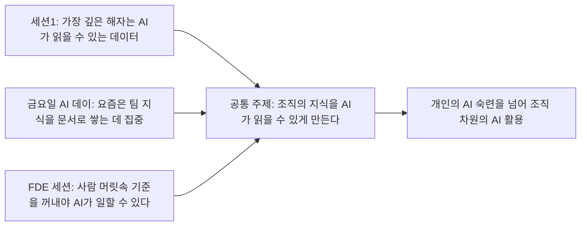
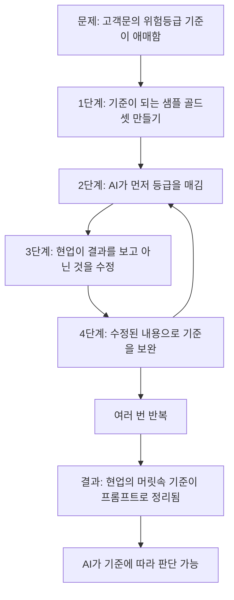

### Toss AX Session 후기 게시글 해설

작성 기준일: 2026년 10월 3일

---

## 목차

1. 이 문서의 성격과 검증 범위
2. 한눈에 보는 핵심
3. 게시글이 전하는 이야기의 구조
4. 먼저 알아둘 용어: AX, FDE, 해자, 골드셋
5. Toss가 공개해 온 AI 확산 방식
6. 세 개의 세션이 하나의 이야기로 모이는 지점
7. 필자의 골드셋 경험을 단계별로 풀어 보기
8. 이 이야기를 다른 조직에 옮길 때 생각해 볼 점
9. 검증 현황: 무엇이 확인되었고 무엇이 확인되지 않았는가
10. 참고 자료

---

## 1. 이 문서의 성격과 검증 범위

이 문서는 Threads에 올라온 한 편의 후기 게시글을 풀어서 설명하기 위해 쓴 글입니다. 게시글은 crystal.logs라는 계정이 쓴 것으로, 다른 회사에 다니는 데이터 분석가가 Toss(운영사 Viva Republica)에서 열린 AX Session에 다녀온 뒤 느낀 점을 정리한 내용입니다. 행사 안내 문구에는 세션 일자가 2026년 10월 2일로 적혀 있고, 게시글은 그 다음 날인 10월 3일 기준으로 "오늘 다녀왔다"고 말하는 형식을 취하고 있습니다 [1].

먼저 한계를 분명히 해 두겠습니다. 이 글이 설명하는 대상은 게시글에 담긴 내용이며, 세션 자체의 발표 자료나 녹화본은 공개된 것을 찾지 못했습니다. 따라서 세션에서 어떤 발표자가 어떤 말을 했는지는 게시글 필자의 전언으로만 알 수 있습니다. 이 문서는 그 전언을 그대로 옮긴 부분, Toss가 공개한 자료로 교차 확인한 부분, 그리고 읽는 사람의 이해를 돕기 위한 해설 부분을 구분해서 적습니다. 해설 부분에는 "해설"이라는 표시를 붙였고, 마지막 9장에 확인 여부를 표로 다시 정리했습니다.

Threads 링크는 직접 불러올 수 없어서, 게시글 본문은 전달받은 텍스트를 기준으로 삼았습니다.

---

## 2. 한눈에 보는 핵심

게시글의 줄거리는 단순합니다. 필자는 Toss가 AI를 어떻게 쓰는지, 사내에 어떻게 퍼뜨렸는지, FDE 조직을 어떻게 운영하는지를 들었고, 그중에서 부러운 점이 여러 개 있었다고 말합니다. 매주 금요일을 통째로 AI에 쓰는 날로 운영하고, 직원이 만든 도구를 말 한마디로 사내에 올릴 수 있는 플랫폼에는 벌써 900개가 넘는 도구가 올라가 있다는 이야기였습니다. 필자는 "개인이 AI를 잘 쓰는 단계는 이미 지났고, 이제는 조직 차원에서 어떻게 잘 쓸지를 고민하고 있더라"고 요약합니다.

그런데 필자가 가장 마음에 남았다고 꼽은 것은 따로 있었습니다. 첫 번째 세션에서 나온 "가장 깊은 해자는 AI가 읽을 수 있는 데이터"라는 말입니다. 필자는 데이터 분석가로 일해 왔기 때문에 이 말이 특히 와닿았다고 합니다. 그리고 다른 세션들도 결국 같은 이야기였다고 정리합니다. 금요일 AI 데이는 요즘 팀의 지식을 문서로 쌓는 데 집중하고 있고, FDE 세션에서는 사람의 머릿속에 있는 기준을 꺼내 줘야 AI가 일할 수 있다고 했다는 것입니다.

마지막으로 필자는 자신의 경험을 덧붙입니다. 고객 문의의 위험등급을 정해야 하는데 기준이 애매했던 적이 있었고, 기준이 되는 샘플인 골드셋을 만든 뒤 AI로 먼저 등급을 매겨 현업에 넘기고, 현업이 틀린 것을 고쳐 주면 기준을 보완해 다시 돌리는 과정을 반복했다고 합니다. 그렇게 몇 번 돌리고 나니 현업의 머릿속에만 있던 기준이 프롬프트로 정리되어 AI가 판단할 수 있게 되었다는 이야기입니다. 필자는 앞으로도 정형 데이터와 사람의 암묵지를 AI가 읽을 수 있는 형태로 차근차근 쌓아 가겠다고 글을 맺습니다.

한 문장으로 줄이면 이렇습니다. AI 모델은 누구나 빌려 쓸 수 있게 되었으므로, 조직의 경쟁력은 그 조직만이 가진 지식을 AI가 읽고 쓸 수 있는 형태로 얼마나 잘 쌓아 두었는가에서 갈린다는 것이 게시글이 전하는 핵심 메시지입니다. 이 마지막 문장은 게시글의 흐름을 제가 풀어 쓴 해설입니다.

---

## 3. 게시글이 전하는 이야기의 구조

게시글은 크게 네 덩어리로 이루어져 있습니다. 먼저 참석 소감과 세션 주제, 다음으로 부러웠던 점, 그다음으로 가장 와닿았던 한 가지, 마지막으로 필자 본인의 사례와 다짐입니다. 아래 도식은 이 흐름을 정리한 것입니다.

한 가지 눈여겨볼 점은 부러움의 대상으로 꼽힌 것과 가장 와닿은 것이 서로 다른 층위라는 사실입니다. 금요일 AI 데이나 도구 플랫폼은 눈에 보이는 제도이고, "AI가 읽을 수 있는 데이터"는 그 제도들이 공통으로 향하는 방향입니다. 필자는 겉으로 드러난 제도보다 그 밑을 흐르는 방향을 더 중요하게 읽었다는 뜻입니다.

게시글에서 "~대요", "~더라고요"처럼 전해 들은 말투로 쓰인 부분은 필자가 현장에서 들은 내용이라는 점도 기억해 두면 좋습니다. 900개라는 숫자나 플랫폼의 작동 방식은 필자가 발표에서 들은 것이며, 이 문서가 독립적으로 확인한 숫자가 아닙니다.

---

## 4. 먼저 알아둘 용어: AX, FDE, 해자, 골드셋

게시글에는 업계에서 자주 쓰는 용어가 네 개 등장합니다. 이 용어들을 알고 읽으면 글의 의미가 훨씬 또렷해집니다.

**AX**는 AI Transformation의 줄임말로, 조직이 AI를 도입해 일하는 방식 자체를 바꾸는 것을 가리킵니다. Toss의 기술 블로그도 많은 기업이 AX에 집중하고 있지만 정해진 정답이 없어서 각자 다른 방법으로 접근하고 있다고 설명하면서 이 용어를 같은 뜻으로 사용합니다 [2]. 단순히 AI 도구를 하나 도입하는 것과 달리, AX는 업무 흐름과 조직 문화까지 바꾸는 일이라는 점이 핵심입니다.

**FDE**는 Forward Deployed Engineer의 줄임말입니다. 전진 배치를 뜻하는 군사 용어에서 온 이름으로, 본사 사무실이 아니라 고객이나 현업 조직의 현장에 가까이 배치되는 엔지니어를 말합니다. 이 직무를 만든 Palantir의 설명에 따르면, 일반 제품 엔지니어가 하나의 기능을 여러 고객에게 전달하는 사람이라면 FDE는 한 고객에게 여러 기능을 전달하는 사람입니다 [9]. KT가 FDE 육성을 설명하면서 내놓은 정의도 비슷합니다. 고객이나 현업 조직과 함께 문제를 정의하고, 데이터 구조를 설계하고, AI를 구현하고, 운영까지 맡는 현장 밀착형 엔지니어라는 것입니다 [10]. 게시글이 "FDE 조직은 어떻게 운영하는지 들었다"고 할 때의 FDE는 이런 역할을 하는 사람들의 조직을 뜻합니다.

**해자**는 성 둘레에 파 놓은 물길을 뜻하는 말로, 경영에서는 경쟁자가 쉽게 따라오지 못하게 막아 주는 지속적인 경쟁 우위를 비유할 때 씁니다. "가장 깊은 해자"라는 표현은 여러 경쟁 우위 요소 중에서 가장 오래 버티고 따라 하기 어려운 것이 무엇이냐는 질문에 대한 답으로 등장한 것입니다.

**골드셋**은 전문가가 정답을 확인해 둔 기준 샘플 모음을 가리킵니다. AI가 낸 결과를 평가하거나 AI에게 판단 기준을 가르칠 때 "이 정도가 정답이다"라고 보여 주는 기준점 역할을 합니다. 게시글에서 필자는 이를 "기준이 되는 샘플(골드셋)"이라고 직접 풀어서 설명했습니다.

---

## 5. Toss가 공개해 온 AI 확산 방식

게시글 속 이야기가 어디서 왔는지 이해하려면 Toss가 지금까지 공개해 온 내용을 함께 보는 것이 도움이 됩니다. 아래 흐름은 공개된 기사와 Toss의 기술 블로그를 날짜순으로 이어 본 것입니다.

### 5.1 AI Surf Day: 금요일을 AI에 내어 준 실험

Toss의 DevRel 매니저 신유라 님이 2026년 6월 5일에 쓴 기술 블로그 글에 따르면, Toss는 4월부터 6월까지 매주 금요일을 AI Surf Day로 정해 운영했습니다. 월요일부터 목요일까지는 본업에 집중하고, 금요일은 AI를 마음껏 실험하고 업무에 적용해 보는 날이라는 취지였습니다 [2]. 이름은 "파도를 멈출 수는 없지만 서핑하는 방법은 배울 수 있다"는 문장에서 가져왔다고 합니다. 인터뷰에서 신 매니저는 회사가 온전한 시간만 확보해 주면 직원들이 알아서 집단지성을 발휘하리라는 믿음이 컸다고 도입 배경을 설명했습니다 [12].

프로그램은 세 갈래로 굴러갔습니다. 첫째는 AI Surf Club으로, 직원들이 AI와 관련된 주제로 자유롭게 모임을 열고 참여하는 방식입니다. 시작과 동시에 약 200개의 클럽이 생겼다고 합니다. 둘째는 AI Surf Weekly로, 사내의 우수 활용 사례와 교훈, 최신 AI 인사이트를 공유하는 시간입니다. 신 매니저는 비슷한 필요를 가진 서로 다른 조직의 직원들을 연결해 주었더니 며칠 걸릴 일이 몇 시간이나 하루 만에 해결된 사례들이 있었다고 소개합니다. 셋째는 AI Surf Evangelist로, 도구를 가장 잘 다루는 사람이 아니라 팀에 AI를 퍼뜨리는 데 진심인 사람을 전 계열사에서 추천받아 142명을 뽑았습니다 [2].

7월 7일에 나온 시즌1 결산 발표에 따르면, 12주 동안 전 계열사가 참여해 총 509개의 실습 모임이 열렸고 만족도는 5점 만점에 평균 4.9점이었습니다 [3]. 다만 6월 5일 글에는 AI Surf Day를 우선 6월까지 진행하며 이후 지속 여부는 논의 중이라고 적혀 있었습니다 [2]. 게시글이 말하는 "매주 금요일은 통째로 AI 하는 날"이 시즌1 이후에도 이어지고 있는지는 제가 찾은 공개 자료로는 확인하지 못했습니다. 이 부분은 필자가 세션에서 들은 현재 상황으로 받아들이면 됩니다.

### 5.2 OpenAI와의 협업 세션

5월 15일에는 OpenAI 전문가가 참여하는 AI 협업 세션이 AI Surf Day의 특별 회차로 열렸습니다. 온오프라인으로 약 400명이 참여했고 만족도는 5점 만점에 4.7점이었습니다. 오전에는 개발자 트랙에서 Codex로 개발 업무를 자동화하는 방법을, 비개발자 트랙에서 ChatGPT 워크스페이스 에이전트로 반복 업무를 자동화하는 방법을 다뤘습니다. 오후에는 개발자와 비개발자가 한 팀을 이뤄 2시간 30분 안에 실무에 쓸 수 있는 결과물을 만드는 미니 해커톤이 열렸습니다 [5].

수상작 두 개는 이 문서의 주제와도 맞닿아 있어서 따로 짚어 둘 만합니다. 하나는 Toss Place의 메뉴 분류 어드민입니다. 매일 새로 들어오는 수천 건의 상품 데이터를 AI 에이전트가 미리 정해 둔 분류 틀에 따라 1차로 분류하고, 결과를 확인할 수 있는 링크를 담당자에게 보내면, 담당자가 어드민에서 확정하거나 반려하는 구조입니다 [2]. 다른 하나는 Codex가 iOS 시뮬레이터를 직접 조작해 기능이 잘 동작하는지 검증하고 증거 영상까지 남기는 개발용 도구입니다 [2]. 앞의 사례는 "AI가 먼저 분류하고 사람이 확인한다"는 흐름을 담고 있는데, 이는 뒤에서 볼 필자의 골드셋 경험과 구조가 닮았습니다.

### 5.3 99퍼센트, 스킬 마켓플레이스, Mint

8월 2일 보도에 따르면 Toss는 자체 조사 결과 직원의 99퍼센트가 업무에 AI를 활용한다고 밝혔습니다. 사내에서는 하루에도 수십 개의 AI 스킬과 도구가 업데이트되고, 결과물은 사내 협업 도구와 스킬 마켓플레이스에 자유롭게 공유되며, 다른 팀이 만든 도구를 자기 업무에 맞게 다듬어 쓰는 흐름이 이어진다고 합니다. ChatGPT, Claude, Slack, Notion과 내부 서비스를 포함해 80개 이상의 도구를 하나의 환경으로 연결한 사내 패키지 매니저 Mint도 직원이 만든 도구가 사내에 퍼진 대표 사례로 소개되었습니다. 이를 뒷받침하는 사내 AI 거버넌스 조직은 전사 정책과 모니터링 체계, AI 윤리위원회, 보안 리스크 관리, AI 프로젝트의 등록과 승인 절차, 접근 권한 체계를 맡고 있다고 합니다. 또 비즈니스 조직이 연 사내 AI 컴페티션에는 19개 팀이 참여했고, 1등 작품은 직원들이 만든 AI 결과물을 한곳에 모아 팀 단위로 공유하고 재사용하게 해 주는 사내 AI 허브 플랫폼이었다고 합니다 [4].

여기서 주의할 점이 있습니다. 게시글이 말한 "말 한마디로 사내에 올리는 플랫폼, 900개 이상"이 위에서 소개한 스킬 마켓플레이스, Mint, AI 허브 중 무엇과 같은 것인지는 게시글에도 공개 자료에도 명시되어 있지 않습니다. 방향이 같은 사례가 공개되어 있다는 것까지만 말할 수 있고, 같은 플랫폼이라고 단정하지는 않겠습니다.

### 5.4 지식을 쌓는 쪽의 공개 사례

게시글의 후반부가 말하는 "팀 지식을 문서로 쌓는 일"과 방향이 같은 공개 사례도 있습니다. Toss의 테크니컬 라이팅 챕터가 쓴 기술 블로그 글은 사내 문서 플랫폼 토독(todoc)을 소개합니다. 글에 따르면 토독은 흩어진 지식을 한곳에 모아 단일 진실 공급원의 역할을 하고, 사내 메신저에서 오간 의사결정과 코드, 논의를 자동으로 문서로 만들며, 누군가의 의지에 기대지 않아도 문서가 갱신되는 구조를 만들고 있다고 합니다. 이 플랫폼은 AI로 쉽게 연결할 수 있고 팀의 지식을 쉽게 쌓을 수 있다는 점이 필요했던 배경으로 언급됩니다 [7]. AI Surf Club에서도 데이터 엔지니어 한 분이 팀이 함께 쓸 수 있는 지식 자산을 만들어 보려는 LLM Wiki 활용법 모임을 열었다고 합니다 [2].

### 5.5 Toss의 FDE

FDE에 관해서는 Toss의 채용 공고가 단서를 줍니다. 공고에 따르면 Toss의 AIOC 팀은 업무 매뉴얼과 도메인 지식을 AI가 이해하고 실행하게 만들어, 사람이 전화로 하던 일을 자동화하는 팀입니다. 이 팀의 첫 번째 FDE는 고객 조직의 지식 체계와 업무 정책을 AI가 실제 운영 환경에서 쓸 수 있도록 백엔드와 데이터 연동을 설계하고 안정화하는 일을 맡는다고 되어 있고, Toss 내부부터 먼저 적용하고 있다고 합니다 [8]. 이 공고는 세션에서 소개된 FDE 조직과 같은 것인지 확인되지 않는 별개의 자료입니다. 다만 "업무 매뉴얼과 도메인 지식을 AI가 이해하고 실행하게 만든다"는 문장은 게시글의 "사람 머릿속에 있는 기준을 꺼내 줘야 AI가 일할 수 있다"는 말과 같은 문제를 다루고 있다는 점에서 참고가 됩니다.

---

## 6. 세 개의 세션이 하나의 이야기로 모이는 지점

게시글에서 가장 중요한 문장은 "다른 세션도 결국 같은 얘기였어요"입니다. 필자가 들은 세 가지 이야기는 겉으로는 서로 달라 보입니다. 첫 번째 세션은 데이터가 해자라는 이야기, 금요일 AI 데이는 문화와 제도의 이야기, FDE 세션은 조직과 역할의 이야기였으니까요. 그런데 필자는 이 셋을 하나로 묶어 읽었습니다.

### 6.1 왜 "읽을 수 있는"이라는 조건이 붙는가

해설입니다. 여기서 "AI가 읽을 수 있는 데이터"라는 말에서 중요한 것은 데이터가 많다는 사실이 아니라 AI가 접근해서 이해할 수 있는 형태로 존재한다는 조건입니다. 어느 회사에나 고객 데이터, 업무 기록, 담당자의 경험이 있지만, 그것이 서로 다른 시스템에 흩어져 있거나, 문서로 남아 있지 않거나, 특정 사람의 머릿속에만 있다면 AI는 그것을 참고할 수 없습니다. 반대로 같은 AI 모델을 쓰더라도 읽을 수 있는 자료가 풍부한 조직은 더 정확하고 더 그 회사다운 결과를 얻게 됩니다. 모델은 시장에서 구할 수 있지만 한 조직이 오랫동안 쌓은 지식은 구할 수 없다는 점이 이것을 해자라고 부르는 이유일 것입니다.

### 6.2 필자가 말한 세 종류의 지식

게시글의 마지막 문장에는 "정형 데이터든 사람의 암묵지든"이라는 표현이 나옵니다. 이를 풀어 보면 AI가 읽을 수 있게 만들어야 할 대상이 세 가지로 나뉩니다. 첫째는 표와 데이터베이스처럼 이미 구조를 갖춘 정형 데이터입니다. 둘째는 회의록, 매뉴얼, 의사결정 기록처럼 문서로 남길 수 있는 지식입니다. 셋째는 베테랑 담당자가 "이건 위험하다, 이건 괜찮다"고 판단하는 감각처럼 말로 설명된 적이 없는 암묵지입니다. 금요일 AI 데이가 팀 지식을 문서로 쌓는 데 집중한다는 이야기는 둘째에, FDE가 사람 머릿속 기준을 꺼내 준다는 이야기는 셋째에 대응하고, 첫 번째 세션의 데이터 이야기는 첫째와 전체를 아우르는 것으로 읽힙니다. 이 대응 관계는 게시글의 서술을 바탕으로 제가 정리한 해설입니다.

### 6.3 같은 방향을 가리키는 다른 현장의 목소리

Toss 밖에서도 비슷한 주장이 나옵니다. 올해 4월 삼성SDS 인더스트리 데이에서 Palantir의 FDE는 기업의 AI 전환에서 성패를 가르는 것이 에이전트 도입이 아니라 AI가 기업의 데이터와 업무 맥락을 이해할 수 있는 구조라고 말했습니다. 그는 데이터와 비즈니스 로직, 운영 액션이 통합된 구조가 필요하고 그것을 가능하게 하는 것이 온톨로지라고 설명했으며, 1단계에서 데이터와 비즈니스 로직을 통합해 온톨로지를 구축하고 2단계에서 사람과 AI가 협업하는 구조로 업무를 재설계하는 로드맵을 제시했습니다 [11]. KT도 Palantir의 데이터 플랫폼을 활용한 사내 해커톤에서 데이터를 의미 단위로 연결하는 온톨로지를 구축하고 그 위에서 AI 에이전트를 구현했다고 밝혔습니다 [10]. 용어와 기술은 다르지만 "AI가 일하려면 조직의 데이터와 업무 맥락이 먼저 구조화되어야 한다"는 방향은 게시글의 메시지와 겹칩니다.

---

## 7. 필자의 골드셋 경험을 단계별로 풀어 보기

필자가 든 사례는 이 모든 이야기를 한 번에 보여 주는 작은 모형입니다. 고객 문의의 위험등급을 정해야 하는데 기준이 애매했다는 것이 출발점이었습니다. 기준이 애매하다는 말은 기준이 아예 없다는 뜻이 아니라, 담당자들은 경험으로 판단하고 있지만 그 판단 기준이 글로 정리되어 있지 않다는 뜻에 가깝습니다. 필자는 이 문제를 다음과 같은 순환 구조로 풀었습니다.

첫 단계는 골드셋을 만드는 일입니다. 기준이 말로 정리되어 있지 않으니, 우선 "이런 문의는 이 등급"이라고 답이 정해진 샘플을 모았습니다. 둘째 단계에서는 이 샘플을 기준으로 AI가 먼저 등급을 매겼습니다. 완벽할 필요는 없고, 사람이 고칠 수 있는 초안을 만드는 것이 목적입니다. 셋째 단계에서 AI가 매긴 결과를 현업에 넘겼고, 현업은 결과를 보고 틀린 것만 고쳤습니다. 넷째 단계에서는 현업이 고친 내용을 바탕으로 기준을 보완하고 다시 AI를 돌렸습니다. 이 순환을 몇 번 반복하자 현업의 머릿속에만 있던 기준이 프롬프트라는 형태로 정리되었고, AI가 그 기준으로 판단할 수 있게 되었다는 것이 필자의 설명입니다.

### 7.1 이 방식이 잘 맞는 이유

해설입니다. 사람은 빈 종이에 기준을 쓰라고 하면 막막해하지만, 눈앞에 놓인 구체적인 사례를 보고 "이건 틀렸다"고 말하는 것은 훨씬 쉽게 해냅니다. 이 방식은 현업에게 기준을 서술하라고 요구하는 대신 AI의 초안을 판정해 달라고 요청하기 때문에, 현업이 이미 가진 감각을 작은 부담으로 끌어낼 수 있습니다. 수정이 쌓일수록 어떤 경우에 AI와 현업의 판단이 갈리는지가 드러나고, 그 차이가 곧 문서로 옮겨야 할 기준이 됩니다. 필자가 Toss 세션의 FDE 이야기에서 같은 경험을 떠올린 것도 이 때문으로 보입니다.

### 7.2 Toss의 공개 사례와의 구조적 유사성

앞에서 본 Toss Place 메뉴 분류 어드민도 AI가 먼저 1차 분류를 하고 담당자가 확정하거나 반려하는 구조였습니다 [2]. 또 Toss Bank의 금융소비자보호 팀은 AI Surf Club에서 대외 민원 모니터링 포털을 한 달 만에 만들었고, 팀원들이 민원 회신문 초안 자동화와 민원 분류 자동화 결과물도 만들었다고 합니다 [2]. 고객 접점의 문의나 민원을 AI로 분류하고 사람이 확인한다는 점에서 필자의 사례와 영역이 비슷합니다. 다만 이 사례들이 필자와 같은 방법을 썼다는 근거는 없으므로, 어디까지나 구조가 닮았다는 정도로만 이해하면 됩니다.

---

## 8. 이 이야기를 다른 조직에 옮길 때 생각해 볼 점

이 장은 게시글의 흐름에서 이끌어 낸 해설이며, 사실 주장이 아닙니다.

첫째, 도구를 고르기 전에 지식의 상태를 먼저 살펴보는 편이 순서에 맞습니다. 게시글이 전하는 세 세션의 공통점은 AI 도구의 성능이 아니라 AI가 참고할 지식의 상태를 이야기했다는 것입니다. 우리 조직에서 사람에게만 있는 판단, 문서화되지 않은 기준, 흩어진 데이터가 어디에 있는지 파악하는 일이 AI 활용의 출발점이 됩니다.

둘째, 기준을 한 번에 완성하려 하기보다 순환 구조를 만드는 것이 현실적입니다. 필자의 사례는 처음부터 완벽한 기준을 쓰지 않았습니다. 샘플을 만들고, AI가 초안을 내고, 현업이 고치고, 기준을 다듬는 과정을 몇 번 돌려서 기준이 만들어졌습니다. 기준이 애매해서 AI를 못 쓰겠다는 판단보다, 애매한 기준을 AI와 함께 선명하게 만든다는 접근이 가능하다는 것을 보여 줍니다.

셋째, 기록이 일하는 흐름 속에서 자연스럽게 쌓이도록 하는 것이 중요해 보입니다. Toss의 토독이 사내 메신저의 논의와 코드 변경에서 문서를 자동으로 만들고 갱신하려는 것도 같은 문제의식입니다 [7]. 기록을 위해 따로 시간을 내야 하는 구조는 오래 유지되기 어렵다는 경험이 이런 설계의 배경에 있다고 볼 수 있습니다. 이 마지막 문장은 공개 글의 설명을 바탕으로 한 해석입니다.

넷째, 개인의 숙련과 조직의 역량은 다른 문제라는 점입니다. 게시글의 표현대로 개인이 AI를 잘 쓰는 단계와 조직이 AI를 잘 쓰는 단계는 다릅니다. Toss의 공개 자료를 보면 이를 위해 자율 학습 모임, 도구 공유 장터, 사내 에반젤리스트, 거버넌스 조직을 함께 갖추고 있습니다 [2][4]. 개인의 노하우가 조직의 자산으로 옮겨 가려면 공유와 재사용, 그리고 안전하게 쓰기 위한 규칙이 모두 필요하다는 것을 보여 주는 사례입니다.

---

## 9. 검증 현황: 무엇이 확인되었고 무엇이 확인되지 않았는가

| 내용 | 구분 | 근거 |
| --- | --- | --- |
| Toss가 2026년 4월~6월 매주 금요일 AI Surf Day를 운영함 | 복수 공개 출처로 확인 | [2][3][12] |
| AI Surf Evangelist 142명, 실습 모임 509개, 만족도 평균 4.9점 | 공개 자료로 확인 (Toss 발표 기반) | [2][3] |
| 5월 15일 OpenAI 협업 세션, 약 400명 참여 | 복수 공개 출처로 확인 | [2][5][6] |
| 직원 99퍼센트 AI 활용, Mint가 80개 이상 도구 연결 | 단일 보도, Toss 자체 조사 기반 | [4] |
| 토독이 사내 지식의 단일 진실 공급원 역할을 하려 함 | Toss 기술 블로그의 자기 설명 | [7] |
| Toss AIOC 팀이 첫 FDE를 채용 중 | 채용 공고 기반, 세션 속 FDE 조직과 같은지는 미확인 | [8] |
| 2026년 10월 2일 Toss AX Session이 열림 | 게시글과 행사 안내 문구 기준 | [1] |
| 사내 도구 플랫폼에 900개 이상의 도구가 올라가 있음 | 필자가 세션에서 전해 들은 말, 독립 확인 불가 | [1] |
| 금요일 AI 데이가 현재도 매주 운영되며 팀 지식 문서화에 집중하고 있음 | 필자의 전언, 시즌1 종료 이후 운영 여부는 공개 자료로 확인하지 못함 | [1][2] |
| 첫 세션에서 "가장 깊은 해자는 AI가 읽을 수 있는 데이터"라는 말이 나옴 | 필자의 전언, 발표 자료 미확인 | [1] |
| FDE 세션에서 사람 머릿속 기준을 꺼내야 AI가 일한다고 말함 | 필자의 전언, 발표 자료 미확인 | [1] |
| 세 세션이 같은 이야기라는 해석 | 필자의 해석 | [1] |
| "읽을 수 있는"이라는 조건의 의미, 골드셋 순환이 잘 맞는 이유, 8장의 시사점 | 이 문서의 해설 | 해당 장 참고 |

---

## 10. 참고 자료

[1] crystal.logs, Threads 게시글 "오늘 회사에서 토스 AX 세션에 다녀왔어요" (본문은 전달받은 텍스트 기준) https://www.threads.com/share/_hQ_FwnWG/

[2] Toss Tech, 신유라, "토스팀이 AI 파도를 마주하는 방법: AI Surf Day" (2026년 6월 5일) https://toss.tech/article/ai-surf-day

[3] 이데일리, "구성원이 직접 만드는 AI 문화… 토스, 전사 프로그램 'AI 서프 데이' 성료" (2026년 7월 7일) https://edaily.co.kr/News/Read?mediaCodeNo=257&newsId=02938886645512224

[4] 뉴시스(네이트 뉴스 게재), "토스 '직원 99%가 AI 활용'…'AI 네이티브' 조직 전환 가속화" (2026년 8월 2일) https://m.news.nate.com/view/20260802n06437

[5] 네이트 뉴스, "토스, 오픈AI와 사내 워크숍 진행…'개발·반복 업무 자동화'" (2026년 5월 25일 보도) https://m.news.nate.com/view/20260525n04100

[6] 블로터, "토스, 남다른 인공지능 감각…샘 올트먼號 오픈AI와 맞손 잡은 배경" https://www.bloter.net/news/articleView.html?idxno=663452

[7] Toss Tech, "2. 전문성 밖으로 나아가기" (테크니컬 라이팅 챕터, 토독 소개) https://toss.tech/article/technical-writing-2

[8] freehire, "Forward Deployed Engineer — Toss" (채용 공고 요약) https://freehire.me/jobs/forward-deployed-engineer-toss-bv3dy3bh

[9] LabHub 블로그, "FDE(Forward Deployed Engineer)란 무엇인가 — 고객사 현장에 배치되는 엔지니어" (2026년 8월 12일) https://labhub.hopto.org/blog/career/2026-08-12-fde-what-is-forward-deployed-engineer

[10] 디지털데일리(네이트 뉴스 게재), "KT, AI 에이전트 넘어 AX 실행력 키운다…FDE 확보 속도" (2026년 7월 16일) https://m.news.nate.com/view/20260716n22929

[11] 아이뉴스24(네이트 뉴스 게재), "팔란티어 '온톨로지 없인 AI 무용지물…기업 데이터 맥락 먼저 구조화해야'" (2026년 4월 17일) https://m.news.nate.com/view/20260417n24481

[12] 이투데이, "[핀사이트] '금요일은 AI와 노는 날'…토스가 업무를 멈춘 이유" https://www.etoday.co.kr/news/view/2597258
