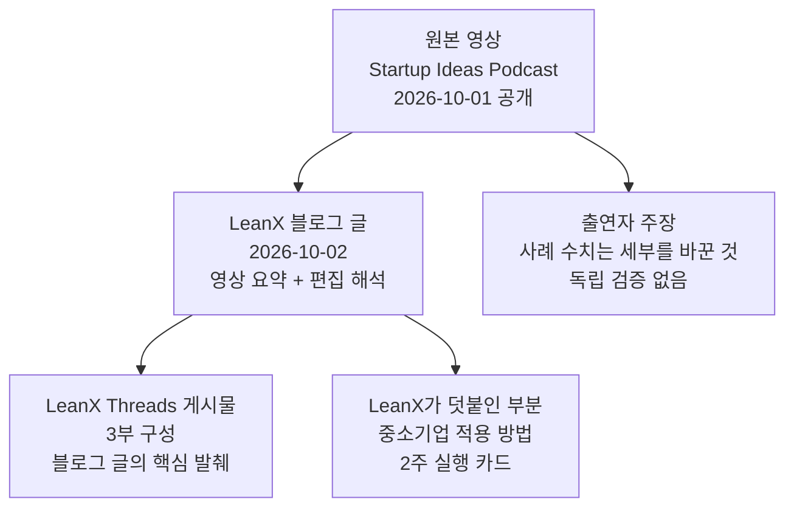
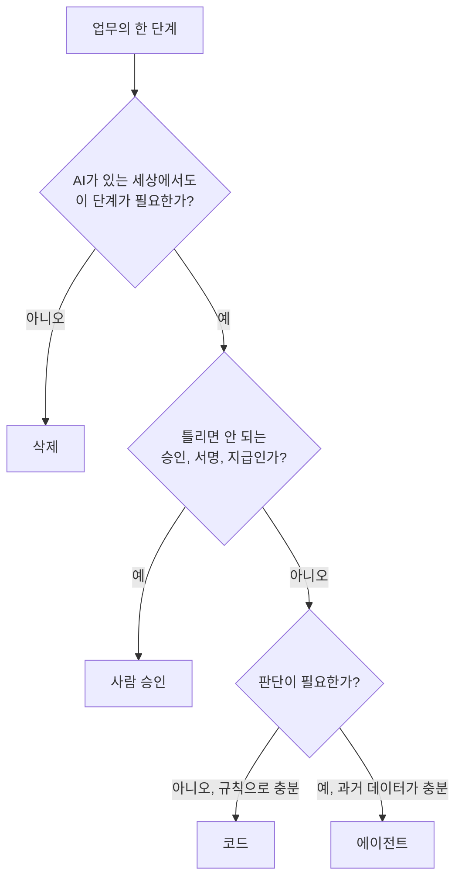
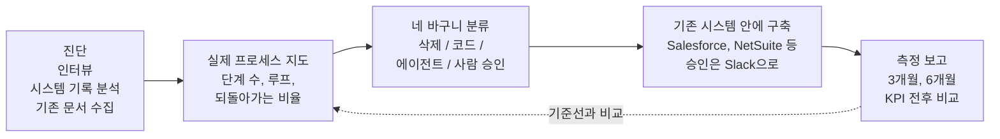

**영상 · LeanX 블로그 글 · Threads 게시물이 각각 무엇을 말하는지, 무엇이 확인되었고 무엇이 확인되지 않았는지 정리한 문서**

작성 기준일: 2026년 10월 3일

> 
> "왜 FDE는 연봉 100만 달러를 받는가"
> 
> Greg Isenberg 새 영상. 출연자 Vass(Veric Agents)의 한 문장: "AI를 적용하지 마라." AI는 바르는 게 아니라 프로세스를 다시 짜는 일.
> 
> 사례: 매출 50억 달러 상장사 견적~계약 프로세스. 보고서엔 6단계. CRM 위에 분석 에이전트 올려 보니 20단계, 루프 7개, 61%가 1단계로 되돌아감.
> 
> 임원들: "우리 부서를 우리보다 잘 아시네요."
> 
> FDE가 실제로 하는 일 4가지
> 1. 지도 그리기: 인터뷰 + 시스템 기록 3~4주 관찰 + 흩어진 문서
> 2. 모든 단계를 네 바구니로: 삭제 / 코드 / 에이전트 / 사람 승인
> 3. 새 화면 없이 기존 CRM·ERP 안에 에이전트 심기. 승인은 슬랙으로
> 4. 고치기 전에 세기: 17단계→7, 24일→6일, 직행률 18%→87%, 건당 $31→$6
> 
> 중소기업도 같습니다. 시스템이 23개가 아니라 카톡·엑셀·이카운트일 뿐, 규칙이 사람 머릿속에 있다는 건 같으니까요. 그래서 인터뷰가 진단의 7할.
> 
> 영상 속 60명 회계법인: "6단계"라던 업무가 실제 14단계, 수금 재요청 70%. "첫 프로젝트는 여기서 시작하라."
> 
> 2주 실행 카드까지 정리:
> [https://blog.leanx.kr/fde-dont-apply-ai-sme-process-reengineering](https://blog.leanx.kr/fde-dont-apply-ai-sme-process-reengineering)
> 
> https://www.threads.com/share/_xYb5BwuN/
> 

---

## 0. 먼저 한 문단으로 정리하면

이 자료는 세 겹으로 되어 있습니다. 가장 바깥에는 Greg Isenberg가 진행하는 팟캐스트 *The Startup Ideas Podcast*의 2026년 10월 1일자 에피소드가 있습니다. 여기서 Greg는 Varick Agents라는 AI 구축 회사의 대표 Vas를 초대해 "포워드 디플로이드 엔지니어(FDE, 고객 현장에 투입되어 AI를 실제 업무에 배치하는 엔지니어)가 기업에 들어가 실제로 무엇을 하는가"를 구체적인 사례와 함께 묻습니다. 그 영상을 한국어 독자, 특히 중소기업 대표를 위해 요약하고 해석한 글이 LeanX 블로그의 "AI를 바르지 말고 프로세스를 다시 짜라"입니다. 마지막으로 그 블로그 글의 핵심만 3부작으로 줄여 올린 것이 LeanX의 Threads 게시물입니다.

영상의 중심 주장은 단순합니다. 기업 AI 도입이 성과를 내려면, 먼저 업무가 실제로 어떻게 흘러가는지 지도로 그리고, 그 지도의 모든 단계를 정리한 다음에야 에이전트를 넣어야 한다는 것입니다. 이미 엉망인 업무 위에 AI를 얹으면 "엉망을 더 빠르게" 만들 뿐이라는 것이 "AI를 적용하지 마라"의 뜻입니다.

---

## 1. 자료의 구조: 무엇이 무엇을 요약하고 있는가

이 구조를 이해하면 글을 읽을 때 구분이 쉬워집니다. 사례의 숫자와 인용은 영상 속 출연자의 말에서 왔고, "중소기업이라면 이렇게 바꿔라"는 부분과 2주 실행 카드는 LeanX가 직접 만든 해석입니다. LeanX 글 스스로도 마지막 출처 문단에서 이 점을 밝히고 있습니다. 즉 사례의 수치는 출연자가 세부를 바꿔 설명한 것이어서 독립적으로 검증된 것이 아니며, 중소기업 적용과 2주 실행 카드는 LeanX의 편집 해석이라는 것입니다.

---

## 2. 원본 영상에 대해 확인된 사실

검색으로 확인한 내용을 먼저 정리합니다.

| 항목 | 확인된 내용 |
|---|---|
| 프로그램 | The Startup Ideas Podcast (진행: Greg Isenberg, Late Checkout 대표) |
| 에피소드 제목 | ["Become a $1M/yr FDE (Full Course)"](https://www.youtube.com/watch?v=1a5HxU52vCQ) (팟캐스트 플랫폼 기준 제목) |
| 공개일 | 2026년 10월 1일 (Podscan 기준 20:30 표기) |
| 게스트 | Vas (X 계정 @vasuman). Varick Agents 대표, 이전에 Meta에서 AI 업무를 했다고 본인 X 프로필에 적혀 있음 |
| 에피소드 설명 | 프로세스 재설계로 AI가 성과를 낸다는 주장, 인터뷰·프로세스 마이닝·단계 분류·기존 시스템 안에 에이전트 구축이라는 방법, 매출 50억 달러 상장 소프트웨어 회사 사례, 건당 인보이스 비용을 31달러에서 6달러로 줄인 매입 업무 개편, 5일 시작 계획 |
| 구성(타임스탬프) | 03:58 FDE 개요 → 05:02 AI 롤업과 프로세스 재설계 → 08:04 개인 시스템 비유 → 09:55 회사 프로세스 파악 → 14:11 50억 달러 소프트웨어 회사 사례 → 18:11 모든 단계의 네 바구니 → 19:04 기존 기록 시스템 안에 구축 → 21:36 PE 포트폴리오 사례 → 23:43 경영진에게 파는 법 → 27:07 NetSuite 5개사 프로세스 매핑 → 28:39 매입 프로세스 지도 예시 → 32:54 직원 60명 회계법인 사례 → 34:51 코드·에이전트·사람 구분 → 36:00 모델 선택 → 38:16 사이드킥 대 백그라운드 에이전트 → 40:29 최고 FDE의 세 역량 → 42:25 FDE 보수가 높은 이유 → 45:26 5일 시작 계획 → 47:39 온프레미스 하드웨어 수요 → 48:36 OpenAI Private Intelligence → 50:20 전체 플레이북 → 52:01 마무리 |
| 광고 구간 | 영상 앞부분(약 1분 30초 지점)에 Google이 후원하는 음성 AI 소개가 들어 있음 |

이 구성표는 LeanX 글의 순서와 거의 일치합니다. 네 바구니, 기존 시스템 안에 심기, 회계법인 사례, 사이드킥과 백그라운드 에이전트, 5일 계획, 온프레미스 질문이 모두 영상의 챕터로 확인됩니다. LeanX 글이 "영상 앞부분의 Google Gemini 음성 도구 소개는 광고 구간"이라고 적은 것도 사실과 부합합니다.

### 표기 차이와 혼동하기 쉬운 점

두 가지를 짚어 두어야 합니다.

첫째, 이름 표기입니다. 자동 생성된 영상 자막에는 게스트 이름이 "Voss"나 "Vas"로, 회사가 "Varic"이나 "Veric"으로 나옵니다. 회사의 공식 사이트 주소와 게스트 본인의 X 프로필, 컨퍼런스 발표 노트는 "Varick Agents"로 적고 있습니다. LeanX 글의 "Veric Agents"와 "Vass"는 자막 표기를 따른 것으로 보이며, 회사를 찾아보려면 "Varick Agents"로 검색해야 합니다. 게스트의 성명은 6월 30일 AI Engineer 컨퍼런스 발표 노트에 Vasuman Moza로 기록되어 있습니다.

둘째, 같은 게스트와 Greg가 이미 7월에도 FDE 주제로 에피소드를 하나 냈습니다. 제목은 "FDE: The $1M/Year AI Job Explained"이며, FDE가 되기 위한 30일 계획과 감사(audit)·평가(evals)·배포(deployment)의 순환 구조가 중심이었습니다. 이번 10월 에피소드에서 Greg는 직접 "얼마 전 같은 게스트와 한 번 했는데 그때는 개괄 수준이었고, 요청이 많아 더 깊이 들어간다"고 말합니다. 따라서 인터넷에서 "Greg Isenberg FDE 영상"을 검색하면 두 에피소드가 섞여 나오는데, LeanX 글이 다루는 것은 10월 1일 쪽입니다. 사례(견적~계약, 매입, 회계법인)와 네 바구니는 10월 에피소드의 내용입니다.

---

## 3. 영상의 핵심 주장을 순서대로 풀어 읽기

### 3.1 왜 FDE는 연봉 100만 달러를 받는다고 하는가

영상의 첫 장면에서 Greg는 이 질문을 던지고 스스로 답합니다. 에이전트를 배치해 회사에 500만, 1,000만, 2,500만 달러의 가치를 만들어 낸다면, 회사는 그 일부를 기꺼이 나눠 줄 수 있다는 것입니다. 이 설명은 영상 도입부의 발언 그대로입니다.

여기서 주의할 점이 있습니다. 100만 달러는 시장의 보통 연봉이 아닙니다. 7월 에피소드를 분석한 한 블로그가 2026년 7월 21일 기준으로 공개 채용 공고를 확인한 바에 따르면, OpenAI의 샌프란시스코 FDE 공고는 기본급 162,000~280,000달러에 주식 보상을 제시했고, Palantir의 뉴욕 FDSE 공고는 135,000~200,000달러였습니다. 100만 달러는 게스트가 말한 예외적 상단이라는 것이 그 글의 정리입니다. 이 공고 수치는 제가 오늘 다시 확인한 것이 아니라 그 글에 기록된 7월 시점의 값이라는 점도 밝혀 둡니다.

### 3.2 "AI를 적용하지 마라"는 무슨 뜻인가

LeanX 글에 따르면 Vas는 "Don't apply AI"라는 글을 썼다고 소개하며, AI 도입 파일럿이 실패하는 이유를 하나로 정리합니다. 업무가 어떻게 돌아가는지 이해하지 못한 채 전 직원에게 라이선스를 나눠 주거나 에이전트를 얹기 때문이라는 것입니다. 참고로 Vas의 X 프로필에는 Celonis와 한 인터뷰에 맞춰 올라온 "AI is not a coat of paint(AI는 페인트칠이 아니다)"라는 제목의 기사가 보입니다. LeanX 글이 인용한 "페인트처럼 바르는 게 아니라 프로세스를 다시 짜는 일"이라는 표현과 같은 계열의 주장입니다.

영상이 드는 비유는 개인의 디지털 생활입니다. 우리는 받은편지함도 여러 개, 파일 저장소도 여러 개, 메신저도 여러 개 쓰지만 "고객 메일은 Gmail, 가족 연락은 iMessage"처럼 머릿속의 암묵적 규칙으로 무리 없이 삽니다. 회사도 같은 구조인데, 그 규칙이 부서마다 지역마다 다르고 문서로 남아 있지 않습니다. LeanX 글이 소개하는 가상의 회사는 8개 회사를 인수해 5개 지역에서 23개 시스템을 쓰고, 시카고는 SAP·Salesforce·Workday, 토론토는 NetSuite·HubSpot·ADP를 씁니다. 이런 곳에 AI를 그냥 얹으면 결과는 "엉망을 더 빠르게"가 된다는 것이 요지입니다.

### 3.3 진짜 프로세스를 찾는 세 가지 방법

LeanX 글은 영상의 진단 순서를 세 갈래로 정리합니다.

- **사람 인터뷰.** 재무 업무라면 매입, 매출, 대사, 청구, 은행, 재무계획 담당을 차례로 만납니다. 어느 회사에서나 "20년 근속자가 그냥 처리한다"는 말이 나오는데, 그 지식은 문서에 없기 때문입니다.
- **시스템 기록 분석.** Salesforce 같은 시스템에 몇 주 접근해 데이터가 얼마나 자주 들어오고 수정되는지 보면, 문서에 없는 절차가 드러납니다. 영상 챕터에 "프로세스 마이닝"이 언급되는 것이 바로 이 작업입니다.
- **기존 문서 수집.** SharePoint, Drive, Notion, Slack, 스프레드시트에 흩어진 낡은 문서를 모읍니다.

인터뷰에서 물을 질문도 LeanX 글에 정리되어 있습니다. 왜 지금 방식으로 하는가, 누가 정하는가, 어느 단계가 형식이고 어느 단계가 실제인가, 예외는 언제 얼마나 자주 생기는가입니다.

### 3.4 네 개의 사례

LeanX 글은 사례를 표로 정리했습니다. 아래는 그 내용을 풀어 쓴 것이며, 숫자는 모두 출연자의 설명으로 전달된 것입니다.

**① 매출 50억 달러 상장 소프트웨어 회사의 견적~계약 프로세스.** 최고매출책임자(CRO)가 의뢰한 건입니다. 컨설팅 보고서에는 6단계로 적혀 있었는데, CRM 위에 프로세스 분석 에이전트를 올려 실제 기록을 보니 20단계에 되돌아가는 루프가 7개였고, 요청의 61%가 1단계로 돌아갔다고 합니다. 법무 반려 12%, 재승인 30%라는 수치도 함께 나옵니다. 임원들이 "우리 부서를 우리보다 더 잘 아시네요"라고 말했다는 일화가 이 사례의 핵심입니다. 한 사람의 설명만 들으면 틀린 지도를 얻는다는 교훈입니다.

**② 매입(AP) 프로세스 재설계.** 17단계가 7단계로, 처리 기간이 24일에서 6일로 줄었다고 합니다. 예외 루프는 6개에서 1개로, 사람 손 없이 곧바로 처리되는 인보이스 비율은 18%에서 87%로, 건당 비용은 31달러에서 6달러로 바뀌었다는 설명입니다. 이 가운데 **건당 31달러에서 6달러라는 수치는 에피소드 공식 설명란에도 적혀 있어 확인됩니다.** 해석상 중요한 부분은 직행률 18%입니다. 이는 대부분의 건이 '예외 경로'로 처리되고 있었다는 뜻이며, 개선의 상당 부분이 에이전트보다 프로세스 재설계에서 나왔다는 것이 출연자의 설명으로 전달됩니다.

**③ 직원 60명 규모 회계법인.** "6단계"라고 알던 업무가 실제로는 14단계였고, 수금 재요청이 70%, 파트너 반려가 35%였다고 합니다. 이 사례에서 영상은 단계의 속도보다 단계 사이의 대기 시간이 비용이라는 점을 강조하며, 처음 FDE 프로젝트를 한다면 이 정도 규모에서 시작하라고 권합니다. 영상 챕터에 "60명 회계법인 사례"가 있는 것은 확인되지만, LeanX 글이 덧붙인 세부 수치(매출 1,200만 달러, 고객 400, 시스템 4개)와 "타사 사례"라는 구분은 제가 원문 대본을 직접 볼 수 없어 확인하지 못했습니다.

**④ PE(사모펀드) 롤업.** 엔지니어 35명이 70개 회사를 담당하고, 세무 신고가 30% 빨라지며 정확도 98%, 콜센터 마진 60% 이상이라는 내용입니다. 영상에 "PE 포트폴리오 사례" 챕터가 있는 것은 확인되지만 개별 수치는 확인하지 못했습니다.

네 사례의 공통점은 LeanX 글의 정리대로 하나입니다. **고치기 전에 먼저 세었다는 것**입니다. 단계 수, 되돌아가는 비율, 대기 일수, 건당 비용이 기준선이 되어야 몇 달 뒤 "이렇게 바뀌었다"고 말할 수 있습니다.

### 3.5 모든 단계를 네 바구니로 나눈다

지도를 그린 다음 모든 단계를 네 칸으로 분류하는 것이 영상의 가장 구조적인 부분입니다. 에피소드 요약에는 "삭제, 평범한 코드, 에이전트, 사람의 결정"으로 적혀 있습니다. LeanX 글의 설명을 풀면 다음과 같습니다.

- **삭제:** AI 이후의 세상에서는 존재할 이유가 없는 단계입니다.
- **코드:** 판단이 필요 없는 규칙입니다. "X이면 Y"나 API 호출 한 번으로 끝나는 일입니다.
- **에이전트:** 과거 데이터가 충분하고 판단이 필요한 일입니다. 예를 들어 "모니터는 보통 사무용품이지만 특정 거래처에서 사면 예외"처럼 문맥이 필요한 분류입니다.
- **사람 승인:** 승인, 협상, 서명, 지급처럼 틀리면 안 되는 일입니다. 인보이스를 에이전트가 끝까지 지급하게 두면 피싱 사기에 당할 수 있다는 것이 이유로 소개됩니다.

아래 도식은 이 분류를 이해하기 쉽게 만든 것으로, **영상이 이 순서로 질문한다고 말한 것은 아닙니다.** 네 바구니의 정의를 질문 형태로 바꿔 본 학습용 그림입니다.

### 3.6 새 화면을 만들지 말고 기존 시스템 안에 심는다

LeanX 글이 "영상에서 가장 실무적인 조언"이라고 꼽는 부분입니다. 에이전트를 새 화면으로 팔지 말고, 고객이 이미 쓰는 기록 시스템 안에 심으라는 것입니다. 이 회사의 에이전트는 Salesforce를 읽고 Salesforce 안에서 일하며, 사람 승인이 필요하면 Slack 메시지로 묻는다고 설명됩니다. 에피소드 요약에도 "Salesforce, NetSuite, Slack 같은 고객이 이미 쓰는 도구 안에 에이전트를 만든다"고 적혀 있어 방향은 확인됩니다. 이유는 ERP 이전에 수년과 1,000만 달러를 쓴 회사가 실제로 있기 때문에, CRM을 AI 네이티브 제품으로 바꾸자는 제안은 고객을 잃게 만든다는 것입니다. 다만 CRM이 아예 없는 중소기업이라면 하나 설치해 주는 것은 괜찮다는 단서가 붙습니다.

### 3.7 팔 때는 결과를 판다

가치는 비용 절감, 매출 증가, 리스크 완화의 세 가지로 설명되고, 누구에게 말하느냐에 따라 앞세우는 것이 달라집니다. 재무 책임자에게는 비용이 먼저이지만 결산 마감에 22일이 걸리는 회사에는 "같은 비용으로 4~8일"을 제안하면 반응이 온다고 합니다. 인사 책임자에게는 비용이 아니라 "더 좋은 사람을 더 빨리 뽑고 첫날부터 교육한다"가 통한다고 합니다. 영상 챕터 "경영진에게 파는 법"이 이 부분입니다. 에피소드 요약의 표현으로는 "각 구매자가 신경 쓰는 결과를 팔고, 전후 KPI로 증명한다"입니다.

### 3.8 모델 선택과 에이전트의 두 종류

모델에 대해서는, 대부분의 업무에 최상위 프런티어 모델이 필요하지 않고 상위 모델의 하위 버전이나 공개 모델로 충분할 수 있으니 워크플로마다 여러 모델을 시험해 고르라는 입장이 전달됩니다. 에이전트는 두 종류로 나뉩니다. **사이드킥**은 대화하며 일을 시키는 개인 에이전트이고, **백그라운드 에이전트**는 묻지 않고 뒤에서 같은 일을 반복하다 필요할 때만 알리는 에이전트입니다. 출연자의 경험으로는 전자는 10~20%, 후자는 70~80% 빨라진다고 전해집니다. 이 수치는 영상 속 경험담이며 독립 검증되지 않았습니다. 그리고 백그라운드 에이전트를 만들려면 앞서 그린 프로세스 지도가 반드시 필요하다는 점이 이 논의가 앞의 논리와 이어지는 지점입니다.

### 3.9 5일 시작 계획

영상은 시작하는 사람에게 일주일짜리 과제를 줍니다. LeanX 글의 정리는 이렇습니다.

| 요일 | 과제 |
|---|---|
| 월 | 내 데이터가 들어 있는 앱을 전부 적는다 |
| 화 | 지난주에 한 일 20가지를 적는다 (구독 해지처럼 잊고 있던 일 포함) |
| 수 | 그중 하나를 끝까지 단계별로 쓴다 |
| 목 | 모든 단계를 네 바구니로 나눈다 |
| 금 | 중소기업에 연락해 워크플로 하나를 무료로라도 해 준다 |

---

## 4. 전체 흐름을 한 장의 도식으로

LeanX 글이 소개하는 계약 구조(4주 진단, 4주 구축, 3개월·6개월 시점의 측정 보고)는 글에서 출연자의 설명으로 전달된 것이며, 이 부분의 세부는 제가 원문으로 확인하지 못했습니다. 아래는 글에 나온 순서를 그대로 도식화한 것입니다.

핵심은 맨 처음 지도에서 나온 숫자(기준선)가 맨 마지막 측정 보고의 비교 대상이 된다는 점입니다. 고치기 전에 세어 두지 않으면 효과를 증명할 수 없습니다.

---

## 5. LeanX가 덧붙인 것: 중소기업 번역

LeanX 글에서 영상 내용과 LeanX의 해석이 섞여 있는 부분을 분리해 보겠습니다. 다음은 영상의 주장이 아니라 LeanX의 관점으로 읽어야 합니다.

**"중소기업은 시스템이 23개가 아니라 카카오톡, 엑셀, 네이버 메일, 이카운트 정도다."** 이것은 영상 속 가상 회사를 한국 중소기업으로 번역한 비유입니다. 규칙이 사람의 머릿속에 있다는 점은 같다는 논리입니다. 영상 속 출연자도 중소기업은 "대부분 사람 머릿속에 있다"고 말했다고 글은 전합니다.

**"인터뷰가 중소기업 AX 진단의 7할."** 영상에서 출연자가 중소기업에는 기록 시스템이 별로 없다고 한 것은 전달되지만, "7할"이라는 비율은 글에서 영상의 인용으로 표시되어 있지 않고 별도의 근거도 제시되지 않았습니다. 실무의 어림으로 받아들이시고, 정확한 통계로 인용하지 않는 편이 안전합니다.

**"바구니를 거꾸로 채워라(사람 승인 → 삭제 → 코드 → 에이전트)."** 영상의 방법이 아니라 LeanX의 제안입니다. 결제, 발송, 계약, 고객 최종 답변 같은 경계를 먼저 정하고 시작하라는 것입니다. 같은 맥락에서 나오는 "삭제만으로 20~30%가 사라지는 경우가 흔하다"는 문장도 근거가 제시되지 않은 LeanX의 현장 경험담입니다.

**"에이전트는 엑셀을 읽고 쓰며, 승인은 카카오톡이나 슬랙으로."** 영상의 "기존 시스템 안에 심는다"는 원칙을 한국 중소기업 환경에 적용한 LeanX의 제안입니다.

**2주 실행 카드.** 영상의 5일 과제를 회사 안에서 쓰도록 바꾼 LeanX의 도구입니다. 1주차에 도구 목록, 담당자 인터뷰 2명, 업무 1개의 단계 쓰기, 네 바구니 분류, 기준선 표를 만들고, 2주차에 삭제와 코드 자동화, 에이전트 1개 구축, 저비용 모델로 샘플 20건 벤치마크를 하며, 2주 뒤 같은 표를 다시 채웁니다. 종료 기준은 "대표가 6단계라고 알던 업무의 실제 단계 수와 되돌아가는 비율을 숫자로 말할 수 있는 것"입니다. 글은 LeanX의 AX 컨설팅도 2주 진단과 2주 구축으로 시작한다고 밝히는데, 이것은 영상 내용이 아니라 LeanX 자신의 서비스 설명입니다.

---

## 6. Threads 게시물은 무엇을 말하는가

LeanX의 Threads 게시물(leanx.official)은 3부작이며, 앞의 두 부분은 다음과 같습니다.

**1부.** "왜 FDE는 연봉 100만 달러를 받는가"라는 질문으로 시작해 "AI를 적용하지 마라, AI는 바르는 게 아니라 프로세스를 다시 짜는 일"이라는 출연자의 한 문장을 소개합니다. 이어 50억 달러 상장사의 견적~계약 사례(보고서 6단계, 실제 20단계, 루프 7개, 61%가 1단계로 회귀)와 임원들의 반응을 짧게 전합니다.

**2부.** "FDE가 실제로 하는 일 4가지"를 번호로 정리합니다. 지도 그리기, 네 바구니로 분류, 새 화면 없이 기존 CRM·ERP 안에 에이전트를 심고 승인은 슬랙으로 받기, 고치기 전에 세기(17단계에서 7단계, 24일에서 6일, 직행률 18%에서 87%, 건당 31달러에서 6달러)입니다.

같은 게시물에는 "중소기업도 같다"는 문장과 직원 60명 회계법인 사례, 그리고 블로그 글 링크가 이어집니다. 게시물은 블로그 글의 요약판이므로, 블로그 글에 있는 단서(수치는 출연자의 설명이라는 점, LeanX의 편집 해석이라는 점)가 생략되어 있습니다. 게시물만 읽는 독자는 "인터뷰가 진단의 7할" 같은 LeanX의 표현을 영상의 주장으로 오해하기 쉽습니다.

---

## 7. 확인된 것, 확인하지 못한 것

| 구분 | 내용 |
|---|---|
| **확인됨** | 에피소드의 존재와 공개일(2026-10-01), Greg Isenberg와 Vas(Varick Agents)의 대담이라는 점 |
| **확인됨** | 영상 구성이 LeanX 글의 순서와 일치함 (네 바구니, 기존 시스템 안에 구축, 회계법인 사례, 사이드킥과 백그라운드 에이전트, 5일 계획, 온프레미스 질문) |
| **확인됨** | 매출 50억 달러 상장 소프트웨어 회사 사례의 존재, 건당 인보이스 비용 31달러에서 6달러라는 수치 |
| **확인됨** | 영상 앞부분에 Google 후원 음성 AI 소개 구간이 있음 |
| **확인됨** | 에피소드 요약에 "삭제, 코드, 에이전트, 사람의 결정"이라는 네 갈래 분류와 "전후 KPI로 증명" 문구가 있음 |
| **확인하지 못함** | 61%, 7개 루프, 법무 반려 12%, 재승인 30%, 17단계에서 7단계, 24일에서 6일, 직행률 18%에서 87% 등 개별 수치 (전체 대본이 유료 접근이라 직접 대조하지 못함) |
| **확인하지 못함** | 회계법인의 매출·고객 수·"타사 사례" 구분, PE 롤업의 35명·70개 회사·세무 30%·정확도 98%·마진 60% 이상, Thrive 언급 |
| **확인하지 못함** | 4주 진단, 4주 구축, 3·6개월 측정이라는 계약 구조, 모델 선택과 사이드킥·백그라운드 에이전트의 속도 향상률 (10~20%, 70~80%) |
| **확인하지 못함** | LeanX 글이 적은 조회수, 좋아요 수, 정확한 상영 시간, Greg가 출연자 회사와 금전 관계가 없다고 밝혔다는 내용 |
| **LeanX의 해석** | 인터뷰가 진단의 7할, 삭제만으로 20~30%, 바구니를 거꾸로 채우기, 엑셀과 카톡 중심 정착, 2주 실행 카드 |

"확인하지 못함"이 곧 "틀렸다"는 뜻은 아닙니다. 다만 이 수치들을 외부에 인용하실 때는 "출연자의 설명에 따르면"이라는 단서를 붙이시고, 가능하면 영상 해당 구간을 직접 들어 보시기 바랍니다.

---

## 8. 배경 지식: FDE란 무엇인가

FDE는 원래 데이터 분석 소프트웨어 회사 Palantir가 2000년대 중반부터 쓰던 모델에서 비롯되었다고 설명됩니다. 엔지니어가 고객 현장에 상주하며 업무를 배우고 소프트웨어를 고객에 맞게 만드는 방식입니다. 최근에는 생성형 AI의 확산으로 AI 기업들이 같은 방식으로 인력을 채용하면서 이 직무가 주목받고 있습니다. 영상과 이를 정리한 글들이 공통으로 말하는 FDE의 본질은 같은 모델을 누구나 살 수 있는 시대에 경쟁력이 "배포", 즉 모델을 실제 업무에 연결하고 성과를 측정하는 능력으로 옮겨 간다는 것입니다.

한 가지 주의할 점은, FDE 모델 자체에 한계를 지적하는 시각도 있다는 것입니다. 고가의 엔지니어를 고객 현장에 보내는 방식은 공급자 입장에서 확장하기 어렵기 때문에 가장 흔한 직무가 되기는 어렵다는 분석이 소개되어 있습니다. 그래서 Varick 같은 회사는 FDE를 보조하는 자체 에이전트로 인원 증가 없이 확장하려 한다고 컨퍼런스 발표 요약에 전해집니다. 이 부분은 이번 영상의 직접 내용이 아니라 배경 정보입니다.

---

## 9. 이 자료를 활용할 때의 읽는 법

첫째, 이 영상의 가장 오래 남을 가치는 사례의 숫자보다 **순서**입니다. 지도 그리기, 분류, 기존 시스템 안에 구축, 전후 측정이라는 순서는 회사 규모와 상관없이 쓸 수 있습니다.

둘째, 사례 숫자는 출연자가 세부를 바꿔 설명한 것입니다. 숫자의 정확성이 아니라 "무엇을 센다"는 지표 설계(단계 수, 되돌아가는 비율, 대기 시간, 건당 비용)를 가져가시는 것이 안전합니다.

셋째, 출연자는 AI 구축 회사의 대표입니다. 즉 FDE 서비스를 파는 당사자이므로, "프로세스 재설계가 AI 성과를 좌우한다"는 주장에는 이해관계가 있다는 점을 염두에 두고 들으시면 됩니다. 그렇다고 주장이 틀렸다는 뜻은 아니며, 영상이 사례와 방법을 구체적으로 공개했다는 점이 평가할 만합니다.

넷째, 한국 중소기업에 적용할 때는 LeanX의 번역(2주 실행 카드 등)을 출발점으로 쓰되, 그 안의 비율과 기간은 영상의 사실이 아니라 LeanX의 경험에 근거한 제안으로 받아들이시면 됩니다.

---

## 10. 참고한 출처

- The Startup Ideas Podcast 에피소드 정보 (Podscan): https://podscan.fm/podcasts/the-startup-ideas-podcast — 에피소드 제목, 공개일, 설명, 챕터, 광고 구간, 사례 소개 확인
- Vas(@vasuman) X 프로필: https://x.com/vasuman — 직함, Meta 이력, Celonis 인터뷰 기사 제목 확인
- Varick Agents: https://www.varickagents.com/
- 7월 에피소드를 정리한 글 (JQ AI SYSTEMS, 2026-07-21): https://www.ai.joaoqueiros.com/blog/ai-forward-deployed-engineer-audit-evals-deployment-career-blueprint — 7월 에피소드와의 구분, FDE 공개 채용 공고 연봉 범위 확인
- AI Engineer 컨퍼런스 발표 노트 (2026-06-30): https://deployedengineer.com/blog/varick-ai-forward-deployed-engineering — 게스트 성명과 회사 접근 방식
- Forward Deployed Engineer 개요 (Wikipedia): https://en.wikipedia.org/wiki/Forward_Deployed_Engineer
- LeanX 블로그 글 및 Threads 게시물: 사용자가 제공한 본문
