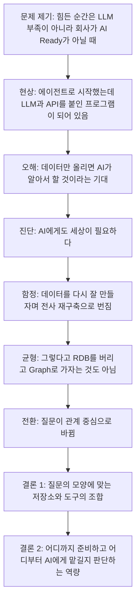
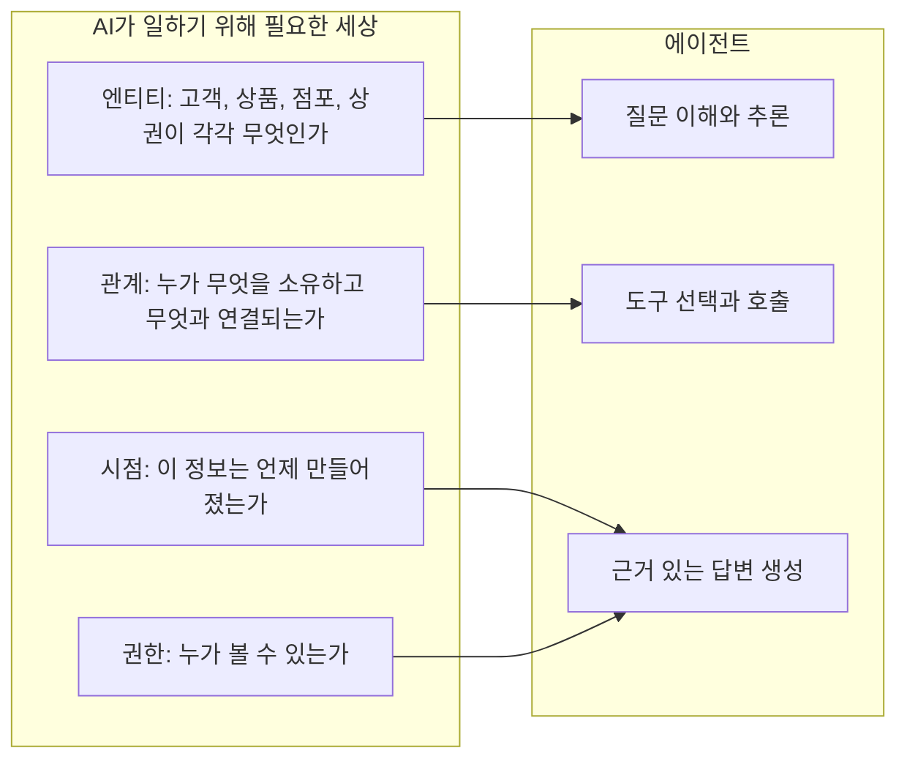
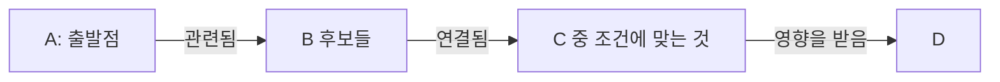
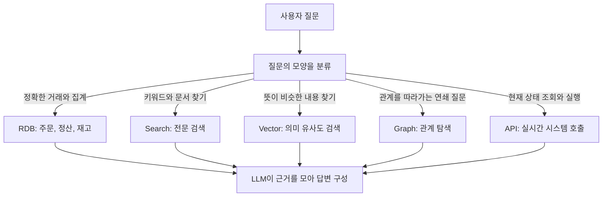

- 작성일: 2026-10-03
- 대상 글: 에이전트를 만들며 느낀 "회사가 AI Ready가 아닐 때의 어려움"에 관한 단상 (Facebook 게시물로 공유된 글)
- 작성 방식: 제공된 본문을 단락별로 해설하고, 2026년 10월 현재 확인 가능한 최신 자료로 주장의 근거를 점검했다.

```
단상

에이전트를 만들면서 가장 힘든 순간은
LLM이 부족할 때가 아니었다.

회사가 AI Ready가 아닐 때였다.

처음에는 이상해진다.

LLM을 붙이고 API를 몇 개 연결했는데
분명 Agent라고 시작한 것이
어느 순간 거대한 LLM + API 프로그램이 되어 있다.

그리고 현타가 온다.

“Agent가 알아서 해주면 안 되나?”

여기서 더 무서운 주문이 등장한다.

“데이터만 다 올려주면 AI가 알아서 하지 않을까요?”

안 한다. 😅

AI에게도 세상이 필요하다.

무엇이 고객이고,
무엇이 상품이고,
누가 무엇을 소유하고,
어떤 점포와 어떤 상권이 연결되어 있으며,
이 정보가 언제 만들어졌고,
누가 볼 수 있는지.

데이터가 있다고
AI Ready인 것은 아니다.

그래서 어느 순간 이런 생각을 하게 된다.

“그럼 데이터를 다시 잘 만들자.”

테이블을 다시 만들고,
Key를 다시 잡고,
Relation을 다시 정의하고,
RDB를 아주 예쁘게 설계하기 시작한다.

틀린 일은 아니다.

그런데 Agent를 만들다가
갑자기 전사 데이터 재구축 프로젝트를 하고 있다면
한번 생각해볼 필요가 있다.

우리가 해결하려던 문제가 무엇이었지?

그렇다고 답이
“RDB를 버리고 Graph로 가자”도 아니다.

RDB는 여전히 훌륭하다.

주문, 정산, 재고처럼
정확한 구조와 트랜잭션이 중요한 곳에서는 특히 그렇다.

하지만 질문이 달라지고 있다.

“A와 관련된 B를 찾아줘.”

“그 B와 연결된 C 중 조건에 맞는 것은?”

“그 C에 영향을 주는 D는?”

질문이 질문을 낳는다.

이런 순간부터 중요한 것은
Row 하나가 아니라 Relationship이다.

Graph가 재미있어지는 지점이다.

그리고 그 위에 LLM이 올라가면
사람은 JOIN을 생각하지 않는다.

그냥 묻는다.

AI 시대의 데이터 아키텍처는
RDB냐 Graph냐를 고르는 종교전쟁이 아니다.

RDB, Search, Vector, Graph, API.

질문의 모양에 따라
적절한 것을 연결하는 것.

어쩌면 Agent 시대의 진짜 엔지니어링 역량은
무엇을 새로 만드는 능력보다

어디까지 준비하고,
어디부터 AI에게 맡길지를 판단하는 능력인지도 모르겠다.

AI Ready의 핵심은
AI를 준비하는 것이 아니라

AI가 일할 수 있는 세상을 준비하는 것이다.

https://www.facebook.com/share/p/1D3jwq3KZE/
```

---

## 0. 먼저 밝혀 둘 것: 이 문서의 근거와 한계

이 문서는 사용자가 대화창에 붙여 넣은 본문 전체를 분석 대상으로 삼았다. 함께 전달된 Facebook 공유 링크는 해당 사이트가 자동화된 접근을 허용하지 않아 열 수 없었다. 따라서 게시물의 작성자, 게시 시점, 댓글, 첨부 자료는 확인하지 못했고, 이 문서에서도 다루지 않는다. 본문에 나오는 "점포", "상권" 같은 단어로 보아 유통·상권 영역의 업무를 염두에 둔 글로 읽히지만, 이는 단어에서 받은 인상일 뿐 글쓴이가 어떤 회사나 프로젝트를 말하는지는 본문만으로 알 수 없다.

외부 자료는 신뢰도에 따라 세 가지로 구분해 표시했다. 이 구분은 문서 끝의 출처 목록에서도 동일하게 쓴다.

| 표시 | 의미 |
|---|---|
| **[1차]** | 원 발표 기관(Gartner 보도자료, arXiv 논문 등)에서 직접 확인한 내용 |
| **[2차]** | 1차 자료를 인용한 매체·벤더 블로그를 통해서만 확인한 내용. 수치와 출처가 정확히 일치하는지 원문 대조는 하지 못함 |
| **[해석]** | 확인된 사실이 아니라, 본문을 읽고 필자가 덧붙인 해석 |

미래를 예측하는 Gartner의 문장("~할 것이다")은 어디까지나 예측이며 이미 일어난 사실이 아니라는 점도 함께 기억해야 한다.

---

## 1. 한 문단 요약

이 글의 주장은 한 줄로 줄이면 이렇다. **에이전트 프로젝트가 막히는 진짜 원인은 모델 성능이 아니라, AI가 일할 수 있는 "세상"(업무 대상과 그 사이의 관계, 시점, 권한)이 조직 안에 정리되어 있지 않다는 점이다.** 그렇다고 해결책이 전사 데이터를 처음부터 다시 만드는 것은 아니며, RDB를 버리고 Graph로 가는 것도 아니다. 질문이 "하나의 행(row)을 찾는 것"에서 "관계를 따라가며 연쇄적으로 묻는 것"으로 바뀌고 있으므로, 질문의 모양에 맞게 RDB, 검색, 벡터, 그래프, API를 알맞게 연결하는 것이 정답에 가깝다. 그리고 에이전트 시대의 엔지니어링 역량은 무언가를 새로 만드는 힘보다 "어디까지 사람이 준비하고 어디부터 AI에게 맡길지 정하는 판단력"이라는 것이 글의 결론이다.

---

## 2. 글의 논리 흐름

글은 감정의 흐름(현타 → 오해 → 깨달음 → 함정 → 균형 → 결론)을 따라 전개된다. 아래 도표는 그 흐름을 한눈에 보여 준다.



---

## 3. 단락별 상세 해설

### 3-1. "가장 힘든 순간은 LLM이 부족할 때가 아니라 회사가 AI Ready가 아닐 때였다"

글의 첫 문장은 프로젝트 실패의 원인을 모델에서 조직으로 옮겨 놓는다. 에이전트를 만드는 사람이 가장 먼저 겪는 오해는 "모델이 더 좋아지면 해결된다"는 기대인데, 이 글은 그 기대를 정면으로 뒤집는다.

여기서 말하는 **AI Ready**는 막연한 구호가 아니라 업계에서 비교적 구체적인 의미로 쓰이는 용어다. Gartner는 2025년 2월 보도자료에서, AI에 맞는 데이터 요건은 전통적인 데이터 관리와 크게 다르다고 짚었다. 먼저 조직이 "AI에 준비된 데이터가 무엇인지" 스스로 정의해야 하고, 데이터를 개별 AI 활용 사례(use case)에 맞춰 정렬해야 하며, 학습용 데이터셋과 운영 중인 AI에 공급되는 실시간 데이터 파이프라인을 준비해야 한다고 설명한다. 메타데이터 관리, 데이터 관측 가능성(observability), 데이터·AI 거버넌스에 지속적으로 투자해야 한다는 권고도 포함된다. 또한 데이터에 문제가 있다면 그 데이터는 AI에 준비된 것이 아니라는 취지의 문장도 있다. **[1차]**

즉 AI Ready는 "데이터가 많다"가 아니라 "특정한 AI 업무에 쓸 수 있도록 품질, 의미, 거버넌스가 갖춰져 있다"는 뜻에 가깝다. 이 글이 말하는 "회사가 AI Ready가 아니다"는 이 의미와 결을 같이한다. **[해석]**

### 3-2. "LLM + API 프로그램이 되어 있다"는 현타

글쓴이는 에이전트를 만든다고 시작했지만 어느새 "LLM을 붙이고 API를 몇 개 연결한 거대한 프로그램"이 되어 있다고 말한다. 이 대목은 개발자라면 공감할 만한 장면이다.

왜 이런 일이 생기는지는 본문에 명시되어 있지 않으므로 필자의 해석을 덧붙인다. 에이전트가 스스로 판단하려면 "고객이란 무엇이고, 어떤 상품과 어떻게 연결되며, 어느 시스템의 값이 기준인가"를 알고 있어야 한다. 이 지식이 조직 어디에도 정리되어 있지 않으면, 개발자는 그 빈자리를 코드와 프롬프트로 직접 채워 넣게 된다. 결과적으로 판단은 에이전트가 아니라 개발자가 짠 분기문이 하고, LLM은 입력을 해석해 API를 고르는 얇은 층으로 줄어든다. **[해석]**

참고로 Gartner는 2025년 6월 보도자료에서 "에이전트 워싱(agent washing)"이라는 표현을 쓰며, 실제로는 챗봇이나 RPA, AI 어시스턴트인 제품을 에이전트로 포장하는 시장의 관행을 지적했다. 이 지적은 벤더를 향한 것이어서 글쓴이의 경험과 같은 이야기는 아니지만, "에이전트라고 부르지만 실질은 기존 자동화"라는 현상이 산업 전반에서 문제로 인식되고 있다는 점은 확인된다. 같은 보도자료에서 Gartner는 에이전트 AI 프로젝트의 40% 이상이 비용 증가, 불분명한 사업 가치, 부족한 위험 통제 때문에 2027년 말까지 취소될 것으로 예측했다. **[1차]**

### 3-3. "데이터만 다 올려주면 AI가 알아서 하지 않을까요?"

글쓴이가 "더 무서운 주문"이라고 부른 이 요청은 현업에서 매우 흔하다. 글은 "안 한다"고 단호하게 답한다.

최신 자료는 이 판단을 뒷받침한다. Gartner는 2026년 5월 11일(런던 Data & Analytics Summit) 발표에서, 의미(semantics)를 소홀히 하면 AI 에이전트가 부정확하고 비효율적이 되며 비용 낭비와 거버넌스 취약성이 커진다고 밝혔다. 에이전트는 워크플로의 각 단계에서 입력되는 맥락을 이해해야 정확한 답을 적정 비용으로 낼 수 있고, 조직 데이터 안의 관계와 규칙에 대한 명확한 이해가 없으면 환각과 편향, 신뢰할 수 없는 결과가 훨씬 많아진다는 설명이다. 같은 발표에서 Gartner는 "전통적인 스키마 중심 데이터 모델만으로는 더 이상 충분하지 않다. 비즈니스 맥락과 데이터의 의미가 빠져 있기 때문"이라고 지적했고, 2027년까지 AI 준비 데이터에서 의미를 우선시하는 조직은 에이전트 AI 정확도를 최대 80% 높이고 비용을 최대 60% 줄일 것으로 예측했다. **[1차]** (정확도·비용 수치는 예측이며, "최대"라는 상한 표현이 붙어 있음에 유의해야 한다.)

이 발표는 글의 핵심 문장 — "데이터가 있다고 AI Ready인 것은 아니다" — 과 거의 같은 이야기를 업계 분석가의 언어로 한 것이다. 데이터를 올리는 일은 필요조건일 뿐이고, 그 데이터가 무엇을 가리키는지 알려 주는 의미 계층이 없으면 에이전트는 방향을 잡지 못한다.

한편 2026년 3월 Cloudera와 Harvard Business Review Analytic Services가 AI 의사결정자 230여 명을 조사한 보고서에서는, 자사 데이터가 AI 도입에 "완전히 준비되었다"고 답한 기업이 7%에 그쳤다고 한다. 이 수치는 해당 보고서를 인용한 블로그를 통해 확인한 것으로 원문 대조는 하지 못했다. **[2차]**

### 3-4. "AI에게도 세상이 필요하다" — 다섯 가지 질문

본문은 AI에게 필요한 "세상"을 다섯 가지 질문으로 풀어 쓴다. 무엇이 고객이고, 무엇이 상품이며, 누가 무엇을 소유하는가. 어떤 점포와 어떤 상권이 연결되어 있는가. 이 정보는 언제 만들어졌고, 누가 볼 수 있는가.

이를 데이터 용어로 바꾸면 **엔티티의 정의, 엔티티 사이의 관계, 정보의 시점(최신성), 접근 권한**이 된다. 아래 도표는 이 네 요소가 에이전트에게 어떻게 공급되어야 하는지를 정리한 것이다. (도표의 구성은 본문의 질문을 필자가 네 항목으로 묶은 것이다. **[해석]**)



이 네 가지는 Gartner가 말하는 "맥락" 및 "의미"의 내용과 겹친다. Gartner는 맥락을 "조직 데이터 안의 구체적인 관계와 규칙에 대한 명확한 이해"로 설명한다. **[1차]** 특히 "시점"과 "권한"은 환각을 막는 문제인 동시에 보안·컴플라이언스 문제여서, 에이전트가 실제 업무에 들어가는 순간 가장 먼저 부딪히는 항목이기도 하다. **[해석]**

### 3-5. "그럼 데이터를 다시 잘 만들자" — 전사 재구축의 함정

글의 가장 실무적인 대목이다. 테이블을 다시 만들고, 키를 다시 잡고, 관계를 다시 정의하고, RDB를 예쁘게 설계하는 일은 "틀린 일은 아니지만", 에이전트를 만들다가 전사 데이터 재구축 프로젝트를 하고 있다면 원래 풀려던 문제가 무엇이었는지 돌아보라고 글은 말한다.

이 경고는 Gartner의 권고와 방향이 같다. Gartner는 AI 준비 데이터를 만들 때 데이터를 개별 AI 활용 사례에 정렬하라고 권한다. **[1차]** 즉 "모든 데이터를 한꺼번에 완벽하게"가 아니라 "이 에이전트가 풀 문제에 필요한 데이터부터"가 기본 접근이다. 이 문장 자체는 Gartner 문서에 있는 "use case 정렬" 원칙에 대한 필자의 해석이며, 한 가지 활용 사례에서 시작하라는 직접적인 조언은 벤더 블로그에서도 반복되지만 그쪽은 **[2차]** 수준이다.

다만 균형을 잡을 점이 있다. 글은 "재구축하지 말자"고 하지 않는다. 데이터 준비가 필요 없다는 뜻이 아니라, **에이전트의 문제 정의를 잃어버린 채 데이터 정비가 목적이 되는 것**을 경계하라는 말이다. 이 구분이 중요하다. Gartner가 같은 맥락에서 메타데이터 관리, 관측 가능성, 거버넌스에 지속 투자하라고 말하는 것을 보면, 데이터 기반 정비 자체는 오히려 권장 사항이기 때문이다. **[1차]**

### 3-6. "RDB를 버리고 Graph로 가자도 아니다"

글은 RDB의 가치를 분명히 인정한다. 주문, 정산, 재고처럼 정확한 구조와 트랜잭션이 중요한 곳에서 RDB는 여전히 훌륭하다는 것이다. 이 주장에 대해 별도로 검증이 필요한 사실은 없다. 트랜잭션 일관성(ACID)이 필요한 업무에서 관계형 데이터베이스가 표준이라는 점은 널리 받아들여지는 기술 상식이며, 이를 반박하는 최신 연구나 발표는 이번 조사에서 발견되지 않았다.

흥미로운 것은 최신 연구도 "하나를 고르는" 방향이 아니라 "결합하는" 방향이라는 점이다. 2026년 3월에 최신 개정판(v3)이 나온 논문 「RAG vs. GraphRAG: A Systematic Evaluation and Key Insights」는 표준화된 평가 절차 아래에서 RAG와 GraphRAG를 비교했다. 결과는 과제와 평가 관점에 따라 두 방식의 강점이 서로 다르다는 것이고, 두 방식의 장점을 결합하는 선택·통합 전략이 일관된 성능 향상을 가져왔다고 보고한다. 이 논문은 실패 양상과 효율성의 상충 관계도 함께 분석한다. **[1차]** (이 논문이 비교한 것은 일반 RAG와 GraphRAG이며 RDB는 비교 대상이 아니다. 여기서 확인되는 것은 "하나의 검색 방식이 모든 과제에서 우월하지 않다"는 점이다.)

### 3-7. "A와 관련된 B를 찾아줘" — 질문이 질문을 낳는 구조

글은 질문의 성격이 바뀌고 있다고 주장한다. "A와 관련된 B를 찾아줘", "그 B와 연결된 C 중 조건에 맞는 것은?", "그 C에 영향을 주는 D는?" 같은 질문은 앞 단계의 답이 다음 단계의 입력이 된다. 이런 질문에서는 개별 행보다 행 사이의 **관계**가 정보의 핵심이 된다.

이를 그림으로 나타내면 다음과 같다. (A~D는 본문의 기호를 그대로 쓴 일반적인 예시이며 특정 업무를 가리키지 않는다.)



이런 연쇄 질문을 "멀티홉(multi-hop) 질문"이라고 부른다. 최신 GraphRAG 자료들은 바로 이 유형에서 그래프의 가치를 설명한다. 그래프 데이터베이스는 엔티티와 관계를 일급(first-class) 요소로 저장하기 때문에, 여러 단계의 관계를 따라가는 탐색이 가능하다는 설명이 대표적이다. 다만 이런 서술은 그래프 데이터베이스 벤더의 블로그에서 나온 것이므로 **[2차]** 이며, 벤더의 이해관계가 있다는 점을 감안해 읽어야 한다.

여기서 반드시 구분해야 할 것이 있다. 흔히 "GraphRAG"로 가장 많이 인용되는 Microsoft Research의 논문 「From Local to Global: A Graph RAG Approach to Query-Focused Summarization」(Edge 외, arXiv:2404.16130)은 **이 글이 말하는 "관계를 따라가는 질문"과 같은 문제를 다룬 것이 아니다.** 이 논문이 겨냥한 것은 "데이터 전체의 주요 주제는 무엇인가"처럼 말뭉치 전체를 아우르는 "전역 요약(global sensemaking)" 질문이다. 일반적인 벡터 RAG는 이런 질문에 구조적으로 약하다고 보고, LLM으로 엔티티 지식 그래프를 만든 뒤 밀접한 엔티티 묶음(커뮤니티)별 요약을 미리 생성하는 방식을 제안했다. 약 100만 토큰 규모 데이터에서 전역 질문에 대해 답변의 포괄성과 다양성이 벡터 RAG 기준선보다 크게 개선되었다고 보고한다. **[1차]** 따라서 이 논문은 "그래프가 유용하다"는 일반론의 근거로는 쓸 수 있어도, "멀티홉 관계 탐색에서 그래프가 이긴다"는 직접적 증거로 인용해서는 안 된다.

일부 블로그는 GraphRAG가 멀티홉 추론 정확도를 몇 배로 끌어올렸다는 구체적 수치를 이 논문의 결과로 소개하지만, 논문 초록과 결론에서 해당 수치를 확인하지 못해 이 문서에는 싣지 않았다.

### 3-8. "그냥 묻는다" — JOIN을 생각하지 않는 사용자

그래프 위에 LLM이 올라가면 사람은 JOIN을 생각하지 않고 그냥 묻는다는 대목이다. 이는 기술적 사실이라기보다 사용자 경험(UX)에 대한 비전이다.

이 비전이 가능하려면 두 가지가 전제되어야 한다. 첫째, 자연어 질문을 그래프 쿼리나 SQL로 안정적으로 바꾸는 계층이 신뢰할 만해야 한다. 둘째, 그 계층이 참조하는 의미 정의(무엇이 고객이고 무엇이 매출인가)가 정확해야 한다. Gartner가 2026년 3월 Data & Analytics Summit 이후 강조한 "컨텍스트 계층(context layer)" 논의는 바로 이 두 번째 전제를 다룬다. 한 매체 보도에 따르면 이 행사의 한 세션에서 Gartner 분석가가 "MCP에만 의존하는 에이전트 분석 프로젝트의 60%가 2028년까지 일관된 시맨틱 계층의 부재로 실패할 것"이라고 예측했다고 한다. 다만 이 예측은 여러 벤더 블로그가 행사 발언으로 전하는 내용이고 Gartner 보도자료 원문에서는 확인하지 못했으므로 **[2차]** 로 취급한다. 이 예측이 의미하는 바는 MCP가 연결을 표준화해 줄 뿐 의미를 만들어 주지는 않는다는 점이다. **[해석]**

### 3-9. "RDB냐 Graph냐를 고르는 종교전쟁이 아니다"

글의 중심 처방이다. RDB, Search, Vector, Graph, API를 질문의 모양에 따라 적절히 연결하라는 것이다. 이를 의사결정 흐름으로 그리면 다음과 같다. 도표의 분류 기준은 글의 문장을 바탕으로 필자가 정리한 것이다. **[해석]**



이 구조는 최신 산업 자료에서도 반복해서 등장한다. Neo4j가 주최한 NODES AI 2026의 "Agentic GraphRAG" 세션은 질문의 구조와 위험 신호에 따라 벡터 검색과 그래프 탐색 사이에서 질의를 라우팅하는 다중 에이전트 시스템을 소개한다. 이는 벤더 행사의 발표 소개문이므로 **[2차]** 에 해당하며, 라우팅이라는 설계 방향이 현장에서 논의되고 있다는 정도로만 읽어야 한다. 한 엔터프라이즈 RAG 가이드는 "2026년의 시스템은 질의를 분류하고, 알맞은 도구(벡터 인덱스, 지식 그래프, SQL, 코드 검색)로 보낸 뒤 단계적으로 검색한다"고 서술하며 벡터는 폭넓은 재현율에, 그래프는 벡터 검색이 구조적으로 풀기 어려운 멀티홉 질문에 쓰인다고 정리한다. 이 역시 벤더 콘텐츠여서 **[2차]** 다.

그래프가 만능이 아니라는 점도 함께 기억해야 한다. 여러 벤더 블로그는 그래프를 구축하는 과정(엔티티·관계 추출)에 LLM 호출이 많이 들어 비용이 크다고 경고한다. 구체적인 배수(예: 일반 RAG 대비 3~5배)를 제시하는 글도 있으나 출처가 단일 벤더 블로그라 이 문서에서는 수치를 채택하지 않는다. 비용이 크다는 방향성만 참고하는 것이 안전하다. **[2차]**

### 3-10. 마지막 두 문단 — 에이전트 시대의 엔지니어링 역량

글은 "에이전트 시대의 진짜 엔지니어링 역량은 무엇을 새로 만드는 능력보다, 어디까지 준비하고 어디부터 AI에게 맡길지를 판단하는 능력인지도 모르겠다"고 말하며, "AI Ready의 핵심은 AI를 준비하는 것이 아니라 AI가 일할 수 있는 세상을 준비하는 것"이라는 문장으로 끝맺는다.

"모르겠다"라는 유보적 표현에서 알 수 있듯, 이는 검증된 법칙이 아니라 글쓴이의 가설이다. 그러나 이 가설은 최신 업계 분석과 방향이 맞는다. Gartner는 컨텍스트 계층 구축이 데이터·분석 인프라의 핵심 요소가 되어야 한다고 조언했고, 의미 역량에 대한 예산을 "타협할 수 없는 기반"으로 잡아야 한다고 밝혔다. **[1차]** 한 벤더 블로그는 Gartner가 2026년 8월 「Emerging Tech Impact Radar: Generative AI」에서 "AI 컨텍스트 플랫폼"을 하나의 범주로 정의했다고 전한다. 이 서술은 해당 벤더의 해설 페이지를 통해서만 확인했으므로 **[2차]** 이며, 보고서 원문은 Gartner 고객만 열람할 수 있다.

정리하면, "준비의 범위를 정하는 판단"은 구체적으로 다음 질문들로 나뉜다. 이 질문 목록은 글의 취지를 실무 점검 항목으로 풀어 본 필자의 제안이다. **[해석]**

1. 이 에이전트가 풀려는 문제가 무엇이며, 그 문제에 반드시 필요한 엔티티와 관계는 무엇인가.
2. 그 정보의 원천은 어느 시스템이며, 기준이 되는 값(single source of truth)은 어디인가.
3. 정보가 만들어진 시점과 접근 권한을 에이전트가 알 수 있는 형태로 제공하는가.
4. 사람이 미리 정의해야 하는 규칙과, 모델의 판단에 맡겨도 되는 영역의 경계는 어디인가.
5. 틀렸을 때 어떻게 발견하고 되돌릴 것인가.

---

## 4. 최신 자료로 본 근거 점검표

글의 핵심 주장이 최신 자료와 어느 정도 맞는지 한눈에 정리하면 다음과 같다.

| 글의 주장 | 확인된 근거 | 신뢰도 | 비고 |
|---|---|---|---|
| 데이터가 있다고 AI Ready인 것은 아니다 | Gartner(2025-02-26): AI 준비 데이터는 전통적 데이터 관리와 요건이 크게 다르며, 활용 사례 정렬·메타데이터·거버넌스·관측 가능성이 필요 | [1차] | "2026년까지 AI 준비 데이터가 뒷받침하지 않는 AI 프로젝트의 60% 중단" 예측 포함 |
| 데이터만 올린다고 AI가 알아서 하지 않는다 | Gartner(2026-05-11): 맥락과 의미가 없으면 환각·부정확·비용 증가. 스키마 중심 모델만으론 부족 | [1차] | 정확도 80% 향상·비용 60% 절감은 2027년 예측(상한 표현) |
| 에이전트 프로젝트가 기대만큼 풀리지 않는다 | Gartner(2025-06-25): 에이전트 AI 프로젝트 40% 이상이 2027년 말까지 취소될 것으로 예측 | [1차] | 원인은 비용·불분명한 가치·위험 통제 |
| 전사 재구축 대신 문제에 맞춘 준비 | Gartner: 데이터를 AI 활용 사례에 정렬할 것 | [1차] | "작게 시작하라"는 표현은 필자 해석 |
| 어떤 검색 방식도 만능이 아니다 | arXiv:2502.11371(v3, 2026-03): RAG와 GraphRAG의 강점이 과제별로 다르고 결합 전략이 일관되게 개선 | [1차] | RDB 비교는 아님 |
| 그래프는 전역 질문에서 벡터 RAG보다 유리할 수 있다 | arXiv:2404.16130(Microsoft): 전역 요약 질문에서 포괄성·다양성 개선 | [1차] | 관계 탐색(멀티홉)과는 다른 문제 설정 |
| 멀티홉·관계 탐색에서 그래프가 강점 | 그래프 DB 벤더 블로그·행사 소개문 다수 | [2차] | 벤더 이해관계 있음. 독립 검증 필요 |
| MCP만으로는 부족하고 시맨틱 계층이 필요 | Gartner 행사 발언을 인용한 벤더 블로그 다수 | [2차] | 보도자료 원문 미확인 |
| 소수 기업만이 데이터가 완전히 준비됐다고 답함 | Cloudera·HBR 조사(2026-03) 인용 블로그: 7% | [2차] | 원 보고서 미확인 |

---

## 5. 이 글을 읽을 때 주의할 점

**첫째, 글의 주된 근거는 저자의 경험이다.** 이 글은 연구 논문이 아니라 현장의 단상이므로 통계나 출처를 제시하지 않는다. 위에서 정리한 외부 자료는 글의 방향을 지지하는 정황 증거이지, 글이 말한 개별 사례를 검증해 주는 것이 아니다.

**둘째, "Graph가 답"이라는 결론으로 읽으면 안 된다.** 글 스스로 이를 경계한다. 그래프의 이점은 질문이 관계 탐색 중심일 때 두드러지며, 그래프를 만들고 유지하는 비용(엔티티·관계 추출, 스키마 관리, 최신성 유지)이 따른다는 점은 여러 자료에서 공통적으로 언급된다. **[2차]**

**셋째, 의미 계층은 그래프만의 몫이 아니다.** Gartner가 말하는 시맨틱스·컨텍스트 계층에는 온톨로지, 시맨틱 레이어(지표 정의), 메타데이터, 지식 그래프가 두루 포함된다. 그래프는 그중 하나의 구현 수단이다. 따라서 "AI가 일할 수 있는 세상"을 준비한다는 것은 반드시 그래프 데이터베이스를 도입한다는 뜻이 아니다. 기존 RDB 위에 의미 정의와 관계 정보를 정리하는 것도 같은 목표의 다른 경로가 될 수 있다. **[해석]**

**넷째, 예측 수치는 예측일 뿐이다.** "60% 중단", "40% 취소", "정확도 최대 80% 향상"은 모두 Gartner의 전망이며, 실제 결과는 2026~2028년에 확인될 일이다.

---

## 6. 실무에서 이 글을 어떻게 쓸 수 있는가

이 절은 글의 취지를 팀 논의에 활용하는 방법에 대한 필자의 제안이다. **[해석]**

에이전트 프로젝트를 시작하기 전에, 모델 선택 회의보다 먼저 "이 에이전트가 사는 세상의 지도"를 그려 보는 것이 출발점이 될 수 있다. 에이전트가 다룰 엔티티를 열거하고, 엔티티 사이의 관계와 기준 시스템, 갱신 주기, 열람 권한을 한 장에 정리하면, 어디가 이미 준비되어 있고 어디가 비어 있는지가 보인다. 비어 있는 곳이 에이전트의 문제와 직결되면 그 부분만 정비하고, 그렇지 않다면 과감히 범위 밖으로 두는 것이 "전사 재구축으로 번지는 것"을 막는 방법이다.

그 다음으로, 예상되는 질문들을 모아 모양별로 분류해 보면 어떤 저장소와 도구가 필요한지 자연스럽게 정해진다. 집계와 트랜잭션은 RDB, 문서 탐색은 검색과 벡터, 연쇄 관계 질문은 그래프, 실시간 상태는 API가 맡는다. 이때 모든 질문이 한 곳으로 몰리지 않도록 라우팅 기준을 명시해 두는 것이 중요하다.

마지막으로 "어디부터 AI에게 맡길 것인가"는 한 번 정하고 끝내는 문제가 아니다. 모델이 바뀌고 도구가 늘어남에 따라 사람이 정의해 주어야 하는 영역과 모델이 스스로 판단할 수 있는 영역의 경계는 이동한다. 이 경계를 주기적으로 다시 점검하는 운영 체계를 갖추는 것이 글이 말한 "판단하는 능력"의 실질이라고 할 수 있다.

---

## 7. 출처 목록

아래는 이 문서에서 참조한 자료다. 접속 확인일은 모두 2026-10-03이다.

### 7-1. [1차] 자료

1. Gartner, "Lack of AI-Ready Data Puts AI Projects at Risk" (2025-02-26)
   https://www.gartner.com/en/newsroom/press-releases/2025-02-26-lack-of-ai-ready-data-puts-ai-projects-at-risk
2. Gartner, "Gartner Predicts Over 40% of Agentic AI Projects Will Be Canceled by End of 2027" (2025-06-25)
   https://www.gartner.com/en/newsroom/press-releases/2025-06-25-gartner-predicts-over-40-percent-of-agentic-ai-projects-will-be-canceled-by-end-of-2027
3. Gartner, "Gartner Says Lack of Semantics Causes Inaccurate AI Agents and Wasted Spending" (2026-05-11)
   https://www.gartner.com/en/newsroom/press-releases/2026-05-11-gartner-says-lack-of-semantics-causes-inaccurate-artificial-intelligence-agents-and-wasted-spending
4. Edge 외, "From Local to Global: A Graph RAG Approach to Query-Focused Summarization", arXiv:2404.16130 (Microsoft)
   https://arxiv.org/abs/2404.16130
5. Han 외, "RAG vs. GraphRAG: A Systematic Evaluation and Key Insights", arXiv:2502.11371 (v3, 2026-03-04 개정)
   https://arxiv.org/abs/2502.11371

### 7-2. [2차] 자료 (1차 자료를 인용하거나 벤더가 작성한 콘텐츠)

6. Freevacy(Privacy Newsfeed), Gartner 2025-02 AI 준비 데이터 조사 요약 (63% 수치 인용)
   https://www.freevacy.com/news/gartner/gartner-reveals-60-of-ai-projects-with-data-issues-will-fail/6155
7. Insoftex, "Is Your Data Actually Ready for AI?" (Cloudera·HBR 2026-03 보고서 7% 인용)
   https://insoftex.com/insights/ai-data-readiness/
8. Neo4j, "NODES AI 2026 – Agentic GraphRAG: Autonomous Knowledge Graph Construction and Adaptive Retrieval"
   https://neo4j.com/videos/nodes-ai-2026-agentic-graphrag-autonomous-knowledge-graph-construction-and-adaptive-retrieval-2/
9. FalkorDB, "GraphRAG, AI Agents, and Memory: How Graph Databases Power the Next Wave of AI in 2026"
   https://www.falkordb.com/blog/graph-database-ai-agents/
10. Atolio, "Enterprise RAG in 2026: Challenges, Architecture, and Best Practices"
    https://www.atolio.com/blog/enterprise-rag-guide
11. Tellius, "What Is a Context Layer for AI Agents? The 2026 Definitive Guide" (Gartner D&A 2026 세션 발언 인용)
    https://www.tellius.com/resources/blog/what-is-a-context-layer-for-ai-agents-the-definitive-guide-for-2026
12. Atlan, "Gartner AI Context Platform: Vendors and Criteria [2026]" (Emerging Tech Impact Radar 2026-08-07 인용)
    https://atlan.com/know/ai-agent/context-layer/gartner-impact-radar-ai-context-platform/

### 7-3. 열람하지 못한 자료

13. 대상 Facebook 게시물 (사이트의 자동 접근 차단으로 열람 불가)
    https://www.facebook.com/share/p/1D3jwq3KZE/

---

작성 일자: 2026-10-03
