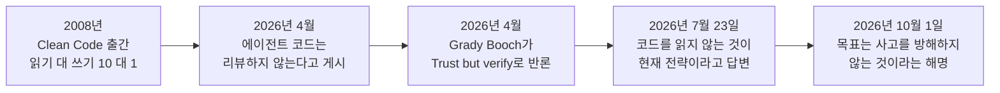
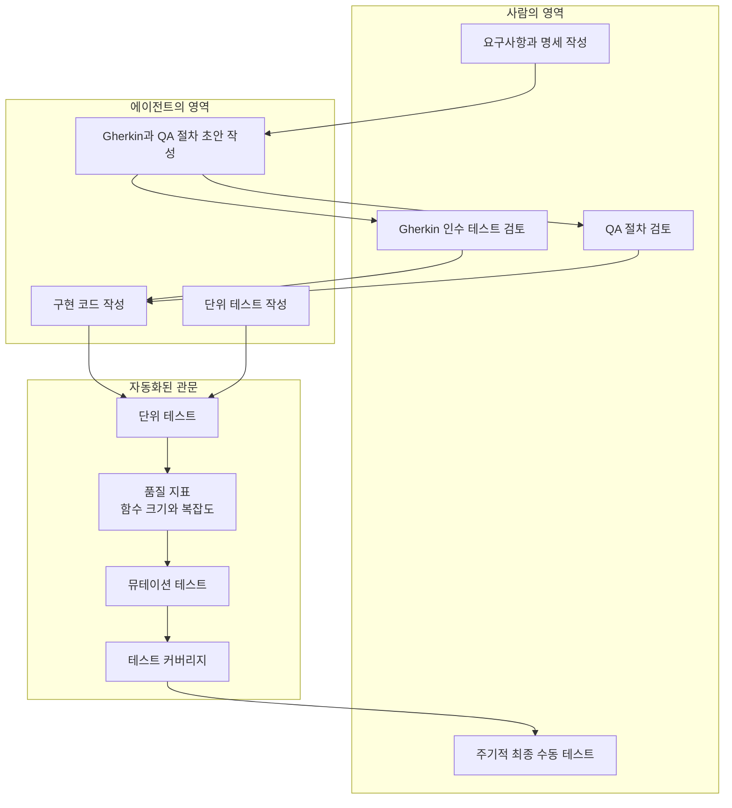
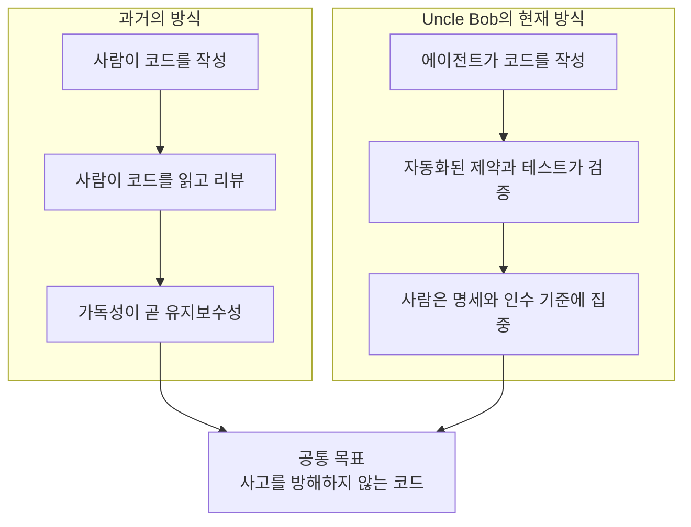

- 작성 기준일: 2026-10-03
- 이 문서는 웹 검색으로 확인한 자료만을 근거로 작성했습니다. 각 주장에는 출처가 있고, 출처가 없는 해석은 "해석"이라고 명시했습니다.

[https://x.com/unclebobmartin/status/2105647907705868659](https://x.com/unclebobmartin/status/2105647907705868659)

> 
> 클린 코드의 저자 Uncle Bob이
> 더 이상 코드를 읽지 않는다고 글을 남겼습니다
> 
> 코드를 깨끗하게 유지해야했던 이유는
> 유지보수를 위한 가독성이라 생각하는데
> 더이상 인간을 위한 코드의 가독성은 
> 큰 의미가 없기 때문이 아닐까요?
> 
> 이제는 클린코드에 써야했던 시간을
> 시스템 아키텍처에 대한 고민이나
> 성능 최적화, 비즈니스 문제 해결 같은
> 진짜 중요한 일에 사용할 수 있게 되었습니다
> 
> https://www.threads.com/share/BATsiy1Uhb/
> 

---

## 1. 한눈에 보는 요약

2026년 10월 1일, Clean Code의 저자 Robert C. Martin(통칭 Uncle Bob)이 X(구 트위터)에 짧은 글을 남겼습니다. 번역하면 다음과 같습니다.

> 사람들은 Clean Code의 저자가 더 이상 코드를 읽지 않는다는 사실에 충격을 받은 듯하다. 하지만 놀랄 일이 아니다. 나는 왜 Clean Code를 썼는가? 코드를 깨끗하게 유지하는 목표는 무엇인가? 그것을 진짜 일, 곧 "생각하기"에서 비켜서게 하려는 것이다.

이 글이 나오게 된 직접적인 맥락은 2026년 7월 23일, Uncle Bob이 한 개발자의 질문에 답하면서 "내 에이전트가 쓴 코드는 읽지 않는다"라고 밝혔던 일입니다. 그 발언이 몇 달 동안 개발자 커뮤니티에서 논쟁을 일으켰고, 10월 1일 글은 그 논쟁에 대한 본인의 "후속 해명"에 해당합니다. 다만 10월 1일 글이 구체적으로 어떤 반응에 답한 것인지는 글 자체에 나와 있지 않으므로, 이 문서에서는 "7월 발언 이후 이어진 논쟁에 대한 설명"이라는 수준까지만 말씀드립니다.

핵심 메시지는 세 가지로 정리됩니다.

첫째, Uncle Bob은 "코드가 중요하지 않다"고 말한 것이 아닙니다. 그는 코드를 사람이 눈으로 읽는 방식 대신, 테스트와 지표와 제약으로 검증하는 방식을 택했다고 말했습니다.

둘째, 그가 말하는 클린 코드의 목적은 "깨끗함 그 자체"가 아니라 "코드가 사고(thinking)를 방해하지 않게 하는 것"입니다.

셋째, 그는 여전히 코드의 구조적 품질(함수 크기, 복잡도 등)을 엄격하게 관리합니다. 다만 그 일을 사람의 눈이 아니라 기계적 제약이 맡게 했다는 점이 달라졌습니다.

---

## 2. 누가, 무엇을 말했는가

### 2.1 Robert C. Martin과 Clean Code

Robert Cecil Martin은 1952년 12월 5일생으로, 위키백과 기준 2026년 현재 73세입니다. 17세에 소프트웨어 업계에 들어왔고 독학으로 배웠으며, 1991년에 Object Mentor를 설립했습니다. 그가 2008년에 Prentice Hall에서 낸 『Clean Code: A Handbook of Agile Software Craftsmanship』는 전 세계 소프트웨어 공학 교육에서 가장 널리 읽힌 책 가운데 하나입니다. 이 책 1장에는 코드를 읽는 시간과 쓰는 시간의 비율이 10 대 1을 훌쩍 넘는다는 유명한 추정이 실려 있습니다. 바로 이 추정이 "코드는 쓰는 사람이 아니라 읽는 사람을 위해 써야 한다"는 클린 코드 운동의 핵심 논거였습니다.

그래서 이 책의 저자가 "코드를 읽지 않는다"고 말했을 때 충격이 컸던 것입니다. 책의 전제 자체를 뒤집는 것처럼 들렸기 때문입니다.

### 2.2 논쟁의 타임라인

아래는 확인된 사건들을 시간순으로 정리한 것입니다.

각 단계를 풀어서 설명드리겠습니다.

**2026년 4월.** 블로거 Raphael Moura의 글에 따르면, Uncle Bob은 4월에 이미 에이전트가 쓴 코드를 리뷰하지 않으며 대신 커버리지, 의존성 구조, 순환 복잡도(cyclomatic complexity), 모듈 크기, 뮤테이션 테스트 같은 지표를 측정한다고 게시했습니다. 이에 대해 소프트웨어 공학계의 원로 Grady Booch가 공개적으로 반응했습니다. Booch는 자신은 생성된 코드를 모두 리뷰한다고 했고, 이유로 지표는 기능이 동작한다는 확신을 줄 뿐 에이전트가 취약점을 넣지 않았다는 확신, 미래의 이해 가능성을 해치는 죽은 코드가 없다는 확신, 성능에 영향을 주는 누락된 리팩터링이 없다는 확신은 주지 못한다는 점을 들었습니다. 결론은 "신뢰하되 검증하라(Trust but verify)"였다고 합니다.

**2026년 7월 23일.** 한 개발자가 자신이 책임지는 코드는 이해해야 한다는 취지로 의견을 냈고, Uncle Bob이 여기에 답했습니다. 요지는 이렇습니다. 자신은 60년대 말부터 코딩을 해 온 사람이고, 현재의 전략은 에이전트가 쓴 코드를 하나도 읽지 않는 것이며, 그것이 에이전트의 생산성을 온전히 누리는 유일한 방법이라는 것입니다. 대신 에이전트를 "극단적인 제약"으로 둘러싼다고 했고, 그 목록으로 단위 테스트, Gherkin 테스트, QA 절차, 품질 지표, 뮤테이션 테스트, 테스트 커버리지 등을 들었습니다. 그리고 에이전트가 이 모든 관문을 통과해야 하기 때문에 결과물에 대한 확신이 매우 높다고 설명했습니다. Codingwithroby의 글에 따르면 이 발언은 수백만 조회를 기록했고 며칠 안에 Hacker News에도 올라갔습니다.

**2026년 10월 1일.** 이번에 공유해 주신 글입니다. 한국 시간 오후 10시 15분으로 표기된 이 게시물은 공유해 주신 시점 기준 약 94만 회 조회, 답글 248, 재게시 772, 마음 7,684, 북마크 1,664를 기록하고 있습니다. 수치는 계속 변하므로 참고용으로만 보시기 바랍니다.

---

## 3. 코드를 읽지 않고 어떻게 믿을 수 있는가: "관문(gauntlet)" 구조

"코드를 읽지 않는다"는 말만 들으면 무책임하게 들리지만, Uncle Bob의 실제 방식은 상당히 체계적입니다. 여러 해설 글이 이 구조를 "gauntlet(양쪽에서 가해지는 매를 맞으며 통과하는 줄)"이라는 비유로 설명합니다. 결과물이 여러 겹의 검증을 모두 통과해야만 신뢰를 얻는다는 뜻입니다.

### 3.1 누가 무엇을 쓰고, 누가 무엇을 검토하는가

explainx.ai의 정리에 따르면, 그가 같은 스레드에서 밝힌 역할 분담은 다음과 같습니다. 구현 코드와 단위 테스트는 에이전트가 쓰고 아무도 읽지 않습니다. Gherkin 인수 테스트와 QA 절차도 에이전트가 쓰지만 이쪽은 Uncle Bob이 검토합니다. 검토 강도는 중요도에 따라 꼼꼼히 보기도 하고 표본 점검만 하기도 합니다. 그리고 주기적으로 직접 최종 수동 테스트를 합니다.

이 도식에서 눈여겨볼 점은, 사람의 주의가 "구현 코드"에서 빠져나와 "무엇이 올바른 동작인가를 정의하는 문서"로 옮겨 갔다는 것입니다. Raphael Moura는 이를 "검사자(inspector)에서 관문 설계자(designer)로의 이동"이라고 표현했습니다. 코드를 읽는 시간이 사라진 것이 아니라 읽는 대상이 바뀐 것입니다. 명세와 인수 기준, 테스트, 뮤테이션 점수, 리뷰어의 지적 사항이 새로운 읽기 대상이 됩니다.

### 3.2 왜 뮤테이션 테스트가 핵심인가

Uncle Bob의 목록 중 가장 눈에 덜 띄지만 가장 중요한 항목이 뮤테이션 테스트입니다. 커버리지는 "테스트 중에 이 코드가 실행되었는가"만 알려줍니다. 뮤테이션 테스트는 코드에 일부러 결함을 심고(조건을 뒤집거나, 호출을 지우는 식으로) 테스트가 그 변화를 알아차리는지를 확인합니다. 에이전트는 측정되는 지표에 맞춰 최적화하는 경향이 있으므로, 커버리지만 목표로 삼으면 모든 줄을 실행하지만 아무것도 검증하지 않는 테스트를 만들어 낼 수 있습니다. 뮤테이션 테스트는 그런 테스트를 걸러내는 장치입니다. 이 설명은 Raphael Moura의 해설에 근거한 것이며, Uncle Bob 본인도 자신의 테스트 스위트의 빈틈을 메우려고 Claude에게 Clojure용 뮤테이션 테스터를 쓰게 했다고 알려져 있습니다.

### 3.3 제약은 "요청"이 아니라 "강제"여야 한다

Moura가 강조하는 또 다른 점은, Uncle Bob의 목록에 있는 항목이 모두 프롬프트에 적힌 부탁이 아니라 CI에서 실행되어 통과하지 못하면 실패로 처리되는 장치라는 것입니다. 제약이 시스템 프롬프트에만 있다면 그것은 정중한 부탁일 뿐 제약이 아니라는 지적입니다.

---

## 4. 이번 게시물의 핵심: "클린 코드의 목적은 사고(thinking)다"

이번 글에서 Uncle Bob은 질문을 던지고 스스로 답합니다. 클린 코드를 왜 썼는가, 코드를 깨끗하게 유지하는 목표는 무엇인가. 그의 답은 "진짜 일인 생각하기에서 코드를 비켜서게 하는 것"입니다.

이 문장을 이해하려면 "방해가 된다"는 상황을 떠올리면 됩니다. 지저분한 코드는 읽는 사람의 머릿속에서 많은 자원을 가져갑니다. 이 함수가 무슨 일을 하는지, 이 변수가 어디서 바뀌는지를 추적하느라 정작 풀어야 할 문제(비즈니스 규칙, 설계, 트레이드오프)를 생각할 여력이 줄어듭니다. 클린 코드는 그 인지 부담을 줄여서 사고에 쓸 여력을 확보하려는 수단이었다는 것이 그의 설명입니다.

그렇다면 에이전트가 코드를 쓰고 기계적 관문이 품질을 지켜 준다면, 사람은 더 이상 코드를 읽는 부담을 질 필요가 없어집니다. 같은 목적(사고에 집중)을 더 효율적인 수단으로 달성한 셈이므로 놀랄 일이 아니라는 것이 이번 글의 논리입니다.

여기서 같은 스레드의 다른 발언도 함께 봐야 합니다. Codingwithroby의 인용에 따르면 그는 사람의 큰 수작업 투입이 "최초 명세"와 "최종 테스트"에 있다고 말했습니다. 즉 사람이 쓰는 사고의 시간은 코드 읽기가 아니라 무엇을 만들지 정하고 결과를 확인하는 쪽에 있다는 뜻입니다.

---

## 5. 공유해 주신 해석을 검토하며

공유해 주신 글에는 세 가지 해석이 담겨 있습니다. 하나씩, 출처로 확인되는 부분과 그렇지 않은 부분을 나눠 보겠습니다.

### 5.1 "인간을 위한 코드 가독성은 더 이상 큰 의미가 없기 때문이 아닐까요?"

이 해석은 **절반만 맞습니다.**

맞는 부분은, Uncle Bob 본인이 에이전트의 코드를 사람이 읽을 필요가 없다는 입장을 취하고 있다는 점입니다. 사람이 읽지 않는다면 "사람을 위한 가독성"의 가치는 그만큼 줄어듭니다.

보정이 필요한 부분은, 그가 "깨끗한 코드 자체가 의미 없다"고 말한 적은 없고 오히려 반대의 발언이 있다는 점입니다. explainx.ai가 인용한 같은 스레드의 다른 답변에서 그는 코드의 깨끗함이 여전히 매우 중요하다고 말했습니다. 지저분한 코드는 에이전트를 느리게 만들고, 에이전트가 자기가 만든 엉킴을 풀지 못하고 헤매는 것을 직접 봤으며, 결국 자신이 개입해서 풀어야 했다고 합니다. 그래서 엉킴이 생기지 않도록 함수 크기와 복잡도를 강하게 제한한다고 했습니다.

정리하면 이렇게 말하는 것이 정확합니다.

> 코드의 **구조적 품질**은 여전히 중요하다. 다만 그것을 확인하는 주체가 사람의 눈에서 자동화된 지표와 제약으로 바뀌었고, 깨끗함의 수혜자도 사람만이 아니라 에이전트가 되었다.

### 5.2 "클린 코드에 쓰던 시간을 아키텍처, 성능 최적화, 비즈니스 문제 해결에 쓸 수 있게 되었다"

이 해석은 **Uncle Bob의 취지와 방향이 일치합니다.** 그가 말한 "진짜 일은 생각하기"와 "사람의 수작업은 명세와 최종 테스트에 쓴다"는 발언이 이를 뒷받침합니다.

다만 두 가지는 구분해야 합니다. 아키텍처, 성능 최적화, 비즈니스 문제 해결이라는 구체적 항목은 사용자님의 해석이지 Uncle Bob이 열거한 목록이 아닙니다. 또한 "시간이 생겼다"는 말에는 단서가 필요합니다. 관문을 설계하고 유지하는 일 자체가 새로운 노동이기 때문입니다. Anthropic의 엔지니어링 글을 인용한 Moura의 설명에 따르면, 모델이 혼자 20분, 9달러로 해결하는 과제가 완전한 하네스를 붙이면 약 6시간, 200달러가 들었고 개선된 두 번째 버전에서도 4시간, 124달러였다고 합니다. 검증 장치에는 비용이 따른다는 뜻입니다. 시간이 없어지는 것이 아니라 쓰는 곳이 이동하는 것에 가깝습니다.

### 5.3 "이제는 인간을 위한 가독성이 의미가 없다"는 일반화

이 일반화는 **현재 근거로는 지지하기 어렵습니다.** 이유는 세 가지입니다.

하나. 지지하는 쪽의 해설조차 이 방식에 전제가 있다고 말합니다. Moura는 읽지 않을 권리는 Uncle Bob이 반세기에 걸쳐 쌓은 경험으로 얻은 것이라고 하면서, 헤드라인만 따라 하고 관문은 만들지 않는 것은 확신에 찬 바이브 코딩이라고 경고합니다.

둘. Grady Booch의 반론처럼, 지표가 보장하지 못하는 영역(보안 취약점, 죽은 코드, 성능에 영향을 주는 리팩터링 누락)이 있다는 지적이 공개적으로 제기된 상태입니다.

셋. Moura 본인도 동의하는 입장이지만, 자신의 체계에서는 아키텍처와 규범적 계산(외부 규정에 근거한 계산)은 "읽지 않는 구간"에 넣지 않는다고 밝혔습니다. 같은 입장을 지지하는 사람 안에서도 경계선은 서로 다릅니다.

---

## 6. 반론과 한계

### 6.1 Grady Booch의 반론: 지표가 못 보는 것

앞서 소개했듯 Booch는 지표로는 기능의 정확성만 확인될 뿐, 취약점이나 죽은 코드, 성능상의 놓친 개선점은 확인되지 않는다고 지적했습니다. Moura는 이에 대한 보완책으로 세 가지를 제시합니다. 배포된 애플리케이션을 직접 실행해 보는 QA 에이전트(동적 검증), SAST·SCA·비밀정보 스캔 같은 보안 검사를 PR마다 결정적 관문으로 돌리는 것, 그리고 아키텍처와 규범적 계산은 영구적으로 사람이 검토하는 경계입니다.

### 6.2 "검토하는 사람이 곧 쓴 사람이면 안 된다"

Moura는 추론 기반 검증 층에서는 검토자가 작성자와 달라야 한다고 말합니다. Anthropic이 문서화한 바와 같이, 에이전트가 자기 결과물이 평범해도 자신 있게 칭찬하는 편향이 있기 때문입니다. 자기 diff를 에이전트에게 스스로 리뷰시키는 것은 학생이 자기 시험지를 채점하는 것과 같다는 비유입니다.

### 6.3 Uncle Bob 본인의 자기 점검: "테스트 과적재"

explainx.ai에 따르면 Uncle Bob은 별도 게시물에서 Gherkin, 단위 테스트, QA 테스트, 뮤테이션 테스트를 모두 겹겹이 얹는 방식을 강하게 밀어붙였지만, AI에게 시키기 쉽다고 해서 반드시 해야 하는 것은 아니며 많은 경우 단위 테스트만 쓴다고 말했습니다. 관문의 깊이를 "중요도"에 맞춰야 한다는 뜻이며, 그 선을 어디에 긋느냐는 본인도 계속 조정하는 중이라는 해석이 가능합니다. 이 마지막 문장은 해당 매체의 해석입니다.

### 6.4 "읽기는 수단이고, 이해가 목적이다"

Moura가 짚은 네 번째 단서는 가장 곱씹을 만합니다. 코드를 읽는 것은 수단이고 시스템의 논리를 이해하는 것이 목적인데, 관문은 수단만 대체한다는 것입니다. 시스템은 여전히 사람의 것이므로 변경이 왜 안전한지 설명하고 다음 경계를 그을 수 있어야 하며, 이해가 읽기와 함께 빠져나가면 자기 저장소의 관광객이 된다고 경고합니다. 그는 중요한 기능마다 실제로 읽어 보는 워크스루 의식을 유지한다고 했습니다.

### 6.5 커뮤니티 반응

반응은 크게 갈렸습니다. 한 분석 페이지는 120개의 가시적인 X 반응(540개 계정 기준)에서 긍정과 부정이 거의 반반으로 나뉘었다고 집계했습니다. 긍정 쪽은 엄격한 테스트를 신뢰하는 방식을 노련한 시니어의 접근으로 평가했고, 부정 쪽은 결과물이 "슬롭"이 된다고 비판하거나 그를 시대에 뒤떨어졌다고 조롱했습니다. 10월 1일 게시물의 답글에서도 "클린 코드도 하나의 컬트였고 AI도 마찬가지"라는 냉소적인 의견이 확인됩니다. 이 집계는 표본이 작고 7월 발언에 대한 것이므로 정밀한 여론으로 읽으시면 안 됩니다.

---

## 7. 반대편에서 본 "클린 코드는 AI 시대에도 중요하다"

흥미로운 점은 "클린 코드는 에이전트에게도 도움이 된다"는 주장이 여러 곳에서 나온다는 것입니다. 이 주장은 Uncle Bob의 입장과 모순되지 않고 오히려 같은 방향입니다.

Fabio Akita는 2026년 4월 20일 글 「Clean Code for AI Agents」에서, 주 독자가 LLM이라면 클린 코드 원칙의 우선순위를 다시 매겨야 한다고 주장했습니다. 그의 논지를 요약하면 이름이 의도를 드러내고 검색 가능해야 한다는 원칙은 에이전트가 grep으로 코드를 탐색하기 때문에 오히려 더 중요해지고, 반대로 "주석은 코드 냄새"라는 2008년의 반사 신경은 뒤집혔다는 것입니다. 에이전트가 다음 세션에서 읽을 맥락을 리뷰에서 지워 버리면 손해라는 설명입니다. 또 타입이 있는 코드는 에이전트에게 즉각적인 정답지를 준다고 했습니다. Akita는 Claude Code가 기본적으로 한 번에 2,000줄씩 읽는다는 점을 전제로 삼았는데, 이는 그의 글에 적힌 설명이며 제가 별도로 확인한 사항은 아닙니다.

또 다른 자료인 한 기술 글(feedbagel 요약)은 코딩 에이전트가 컨텍스트에 제한을 받기 때문에 구조가 나쁜 코드에서는 토큰을 더 쓰고 성능이 나빠진다고 정리합니다. GitHub의 Kinsey Durham Grace는 2026년 9월 23일 Rails World 발표에서 코드베이스가 곧 컨텍스트 윈도우가 되므로 일관되지 않은 관례가 에이전트의 나쁜 코드의 원인이 된다고 소개했습니다(발표 요약문 기준).

이 자료들을 종합하면 이렇게 말할 수 있습니다. "사람이 읽을 필요가 줄었다"와 "코드의 구조가 덜 중요해졌다"는 서로 다른 명제입니다. 첫째는 Uncle Bob이 주장하는 바이고, 둘째는 그가 직접 부정한 바입니다. 구조의 독자가 사람에서 에이전트로 바뀌었을 뿐입니다.

---

## 8. 정리: 사실과 해석의 구분

| 구분 | 내용 | 근거 |
| --- | --- | --- |
| 확인된 사실 | 2026-10-01 Uncle Bob이 "클린 코드의 목표는 사고를 방해하지 않게 하는 것"이라는 취지로 게시 | X 게시물 검색 결과 |
| 확인된 사실 | 2026-07-23 "에이전트가 쓴 코드는 읽지 않는 것이 현재 전략"이라고 본인이 답변 | X 원문(twitter.com 검색 결과), Moura 블로그, explainx.ai |
| 확인된 사실 | 대신 단위 테스트, Gherkin, QA 절차, 품질 지표, 뮤테이션 테스트, 커버리지로 에이전트를 제약 | 위 원문 인용 |
| 확인된 사실 | 지저분한 코드는 에이전트를 느리게 하므로 함수 크기와 복잡도를 강하게 제한 | explainx.ai가 인용한 스레드 답변 |
| 확인된 사실 | 4월에 이미 비슷한 입장을 게시했고 Grady Booch가 "Trust but verify"로 반론 | Moura 블로그 |
| 매체의 해석 | 사람의 역할이 검사자에서 관문 설계자로 이동했다 | Moura, explainx.ai |
| 사용자님의 해석 | 인간용 가독성은 의미가 줄었다 | 절반만 지지됨(5.1 참조) |
| 사용자님의 해석 | 확보된 시간을 아키텍처, 성능, 비즈니스 문제에 쓴다 | 방향은 일치하나 구체 항목은 해석 |
| 확인되지 않음 | 10월 1일 게시물이 어떤 특정 반응에 답한 것인지 | 게시물에 명시 없음 |
| 확인되지 않음 | 공유해 주신 Threads 링크의 내용 | 직접 열어 보지 않았습니다 |

관계 구조를 한 장으로 정리하면 다음과 같습니다.

두 방식은 수단이 다를 뿐 목표가 같다는 것이 이번 게시물의 요지입니다.

---

## 9. 실무적으로 시사하는 점 (해석)

아래 내용은 출처에 근거한 해석이며, Uncle Bob이 직접 권고한 것은 아닙니다.

첫째, "코드를 읽지 않는다"를 따라 하기 전에 "무엇이 읽기를 대신하는가"를 먼저 갖춰야 합니다. Moura는 이를 "읽지 않을 권리는 쌓아서 얻는 것"이라고 표현했고, 자신의 체계에서는 변경 유형별로 연속해서 깨끗하게 통과한 PR이 30건 쌓이면 그 유형에 한해 읽지 않는 구간으로 승격시킨다고 설명했습니다. 이는 그의 개인 운영 규칙이므로 보편적 기준이 아닙니다.

둘째, 뮤테이션 테스트와 같이 "테스트의 질"을 재는 장치가 있어야 커버리지 수치가 착시로 끝나지 않습니다. Moura는 Java는 PIT, JavaScript와 TypeScript는 Stryker, Python은 mutmut이 있다고 소개합니다.

셋째, 관문은 고정 자산이 아닙니다. Moura에 따르면 각 관문은 "모델이 혼자서는 못 하는 일"에 대한 가정을 담고 있어서 모델 세대가 바뀌면 일부가 낡습니다. 정기적으로 재점검하지 않은 관문은 파이프라인의 군더더기가 됩니다.

넷째, 사람이 끝까지 쥐고 있어야 하는 영역은 여전히 있습니다. 비즈니스 규칙의 변경, 서비스 경계, 규범적 계산, 보안 같은 영역입니다. 이는 Moura와 Booch의 논의에서 공통적으로 나타나는 지점입니다.

---

## 10. 참고 자료

모든 자료는 2026-10-03에 접근하여 확인했습니다.

**원문 및 1차 자료**

- Uncle Bob Martin, X 게시물 (2026-10-01): https://x.com/unclebobmartin/status/2105647907705868659
- Uncle Bob Martin, X 게시물 (2026-07-23, 에이전트 코드를 읽지 않는 전략): https://twitter.com/unclebobmartin/status/2080257779395154409
- Robert C. Martin 위키백과(생년과 경력 확인): https://en.wikipedia.org/wiki/Robert_C._Martin

**해설 및 분석 글**

- Raphael Moura, "The right not to read the code" (2026-07-24): https://raphamoura.dev/en/blog/o-direito-de-nao-ler-o-codigo/
- explainx.ai, "Uncle Bob Doesn't Review AI Code. He Builds a Gauntlet Instead" (2026-07-23 게시, 2026-09-25 수정): https://explainx.ai/blog/uncle-bob-ai-coding-gauntlet-tests-not-reviews-july-2026
- Codingwithroby, "Uncle Bob Said Do Not Read Code": https://www.codingwithroby.com/newsletter/uncle-bob-said-do-not-read-code
- Startup Fortune, "Uncle Bob Martin says he no longer reads AI-generated code and the developer world is split": https://startupfortune.com/uncle-bob-martin-says-he-no-longer-reads-ai-generated-code-and-the-developer-world-is-split/
- Digg 집계 페이지(X 반응 요약): https://digg.com/tech/xjqbsn4t

**AI 시대의 클린 코드 관련**

- Fabio Akita, "Clean Code for AI Agents" (2026-04-20): https://akitaonrails.com/en/2026/04/20/clean-code-for-ai-agents/
- Kinsey Durham Grace, "Agent-Proof Your Rails App: Your Codebase Is the Prompt" (Rails World 2026): https://www.rubyevents.org/talks/agent-proof-your-rails-app-your-codebase-is-the-prompt

**참고: 검증 한계**

X 게시물 원문 페이지는 자동 접근이 차단되어 있어, 10월 1일 게시물 문구는 검색 결과에 표시된 본문과 사용자님이 공유해 주신 게시물 내용을 대조하여 확인했습니다. 조회수 등 수치는 시점에 따라 달라집니다. 이 문서의 7월 발언 인용은 위 2차 자료들이 공통으로 인용한 원문 내용을 바탕으로 의역한 것입니다.

---

작성 일자: 2026-10-03
