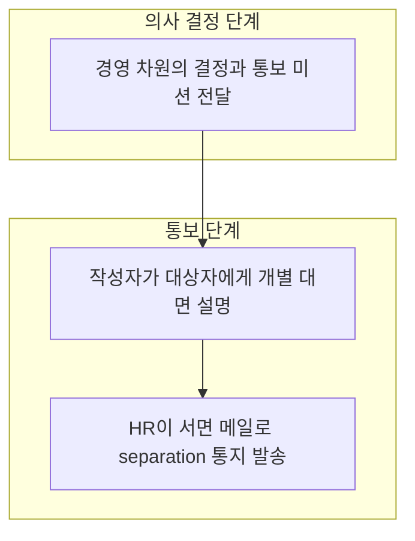
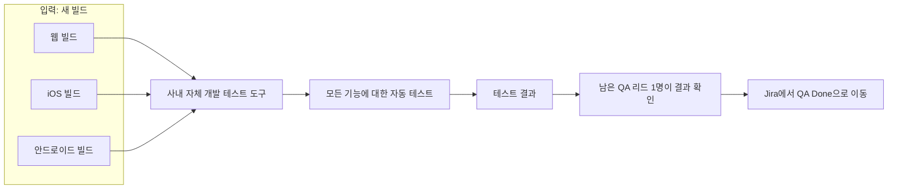
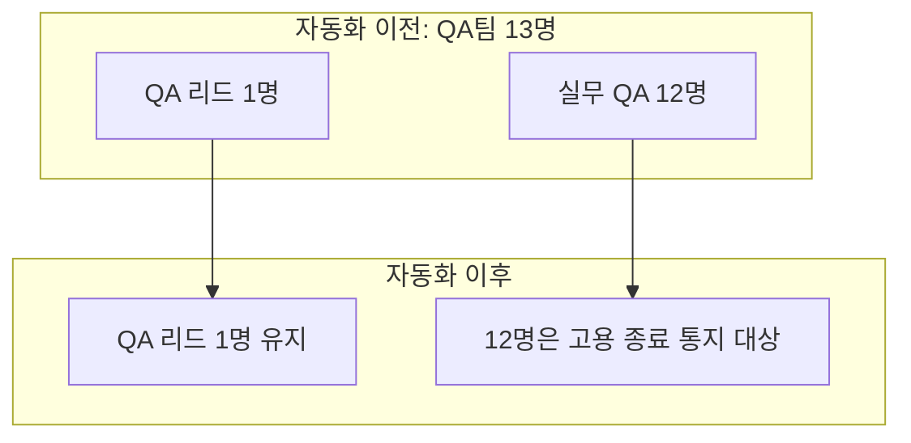
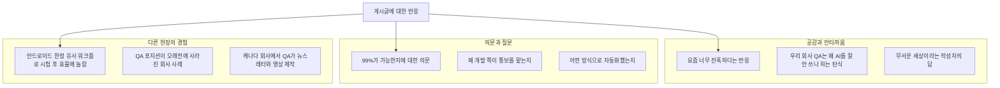
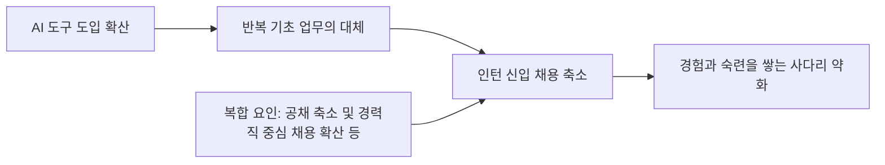

> 작성 일자: 2026-10-03
>
> 이 문서는 Threads에 올라온 한 게시글과 그 아래 달린 댓글·작성자 답글을 풀어서 설명하고, 글의 배경이 되는 기술(AI 기반 QA 자동화)과 노동시장·법제 정보를 최신 자료로 확인해 덧붙인 해설서입니다.

```
우리 회사에서 QA를 완전히 자동화하는 걸 해냈다. 
새로운 빌드가 나오면 99%의 버그를 잡아낸다. 

그리고 나에게 미션이 떨어졌다. 
QA팀 인력 13명 중에서, 리드를 제외한 12명에게
Notice of separation을 통보하라는 것. 

참으로 가슴 아프고 어려운 일이다. 
AI 개발을 하면서 앞으로 이런 딜레마가 계속되겠지. 
대졸 신입도 이제 안 뽑는다고 하고. 
슬프고 흐린 금요일 오전이다.

https://www.threads.com/share/_i7AVqLGQ/

```

---

## 0. 먼저 알아둘 점: 이 문서가 확인한 것과 확인하지 못한 것

원본 게시글의 주소(`threads.com/share/...`)는 Threads 쪽에서 자동 접근을 막고 있어 페이지를 직접 열어 보지 못했습니다. 따라서 게시글 본문과 댓글은 전달해 주신 텍스트를 기준으로 정리했습니다. 작성 시각은 "6시간 전", "2시간 전"처럼 상대 표기로만 되어 있어 정확한 게시 일시는 알 수 없고, 본문에 "금요일 오전"이라고 적혀 있다는 사실만 확인됩니다.

또 하나 분명히 해둘 점이 있습니다. 이 글은 한 개인이 쓴 SNS 게시글입니다. 회사 이름, 사용한 도구의 이름과 구조, "99%"라는 수치의 산출 근거는 글에도 댓글에도 공개되어 있지 않습니다. 그래서 이 문서는 "작성자가 이렇게 말했다"는 것과 "일반적으로 알려진 사실"을 구분해서 서술하고, 확인되지 않은 부분을 추측으로 메우지 않았습니다.

---

## 1. 한눈에 보는 요약

작성자는 미국에서 일하는 회사원으로, 스스로를 회사의 프로덕트 총괄이라고 밝힙니다. 그가 속한 회사는 QA(품질 보증, 소프트웨어를 출시하기 전에 오류를 찾는 일)를 AI로 완전히 자동화하는 데 성공했고, 새 빌드가 나올 때마다 버그의 99%를 잡아낸다고 합니다. 그 결과 QA팀 13명 가운데 팀 리드 1명만 남기고 12명에게 고용 종료 통지(Notice of separation)를 전달하라는 지시가 작성자에게 내려왔다고 합니다.

작성자는 이 일을 "가슴 아프고 어려운 일"이라고 표현하고, AI를 개발하는 입장에서 앞으로도 이런 딜레마가 계속될 것이며 대졸 신입도 이제 뽑지 않는다는 말이 나온다고 덧붙입니다. 마지막 문장은 "슬프고 흐린 금요일 오전"입니다.

댓글에서는 몇 가지 구체적인 사실이 추가로 드러납니다. 남는 1명은 직접 테스트를 하는 것이 아니라 AI가 낸 결과를 확인하고 Jira에서 티켓을 "QA Done"으로 옮기는 역할을 맡는다는 점, 웹·iOS·안드로이드 빌드를 도구에 올리면 전 기능을 자동으로 테스트한다는 점, 이 도구는 사내에서 자체 개발했고 Claude 토큰을 매우 많이 사용해 만들었다는 점 등입니다.

---

## 2. 게시글 본문을 한 문장씩 풀어 읽기

### 2-1. "우리 회사에서 QA를 완전히 자동화하는 걸 해냈다. 새로운 빌드가 나오면 99%의 버그를 잡아낸다."

여기서 "빌드"는 개발자들이 작성한 코드를 하나의 실행 가능한 앱이나 서비스 형태로 묶어 낸 결과물입니다. 새 빌드가 나올 때마다 QA 담당자는 기존 기능이 망가지지 않았는지, 새 기능이 의도대로 동작하는지 확인해 왔습니다. 작성자는 이 과정을 AI가 전부 수행하게 만들었다고 말합니다.

주의해서 볼 대목은 "99%"입니다. 이 수치가 무엇을 기준으로 한 비율인지는 글에서 설명되지 않습니다. 사전에 알려진 버그 목록 대비 탐지율인지, 출시 후 발견된 버그 대비 사전 탐지율인지, 어떤 기간과 어떤 제품을 대상으로 측정했는지 알 수 없습니다. 실제로 한 댓글 작성자도 "99%가 가능하냐"고 되물었는데, 작성자의 답글은 이 수치의 근거를 설명하지 않고 남는 1명의 역할로 화제가 넘어갑니다. 따라서 99%는 "작성자가 전한 내부 성과 수치"로 읽는 것이 정확합니다.

### 2-2. "QA팀 인력 13명 중에서, 리드를 제외한 12명에게 Notice of separation을 통보하라는 것."

"Notice of separation"은 글자 그대로 고용 관계의 분리(종료)를 알리는 통지입니다. 작성자의 문맥상 12명이 회사를 떠나게 된다는 의미로 쓰였습니다. 13명 중 12명이면 QA팀의 약 92%에 해당합니다.

### 2-3. "AI 개발을 하면서 앞으로 이런 딜레마가 계속되겠지. 대졸 신입도 이제 안 뽑는다고 하고."

작성자는 AI를 만드는 일이 곧 누군가의 일자리를 줄이는 일과 연결되는 구조를 "딜레마"라고 부릅니다. 신입을 뽑지 않는다는 말은 작성자가 들은 이야기로 제시되며, 어느 회사나 통계를 가리키는지는 밝히지 않았습니다. 이 부분의 사회적 배경은 6장에서 공개 통계로 따로 확인합니다.

---

## 3. 작성자가 댓글에서 추가로 밝힌 내용

게시글의 본문만으로는 보이지 않던 사실이 작성자의 답글에서 조금씩 드러납니다. 질문과 답을 순서대로 풀어 보겠습니다.

### 3-1. "한 명만 남기고 다 내보내는 건 너무 가혹하다, AI가 만든 코드를 AI가 QA한다니"

작성자는 이렇게 답합니다. 남는 한 명은 직접 QA 업무를 하는 것이 아니라, AI가 테스트한 결과를 확인하고 Jira에 QA Done으로 옮기는 작업만 하면 되는 역할이라서 씁쓸하다는 내용입니다.

Jira는 개발 업무의 진행 상황을 티켓 단위로 관리하는 도구입니다. "QA Done"은 어떤 작업이 QA 단계를 통과했다는 상태 값입니다. 즉 남는 리드의 일은 테스트 수행에서 결과 확인과 상태 승인으로 바뀐다는 뜻입니다. 이는 사람의 역할이 "실행"에서 "검수와 승인"으로 이동한 구조이며, 이 점은 뒤에서 다시 다룹니다.

### 3-2. "안드로이드뿐 아니라 iOS와 웹까지 충분히 가능하다"

한 댓글 작성자는 안드로이드(AOS) 한정으로 비슷한 워크플로를 조금씩 시험해 보고 있는데 효율이 너무 높아져서 어리둥절할 정도였고, 이 정도까지 가능한 줄 몰랐다며 무섭다는 경험을 공유했습니다. 작성자는 안드로이드만이 아니라 iOS와 웹까지 충분히 가능하다고 답했습니다. 웹, iOS, 안드로이드는 대부분의 소비자용 소프트웨어가 제공되는 세 개의 주요 화면 환경이므로, 이 세 환경이 모두 자동화 대상이라는 말은 적용 범위가 넓다는 의미입니다.

### 3-3. "어떤 방식으로 QA를 자동화했는지 아시나요?"

작성자는 자세히 말할 수 없다고 선을 그으면서도 큰 틀을 밝혔습니다. 내부에서 자체적으로 만든 도구가 있고, 그 도구에 모든 빌드(웹, iOS, 안드로이드)를 업로드하면 자동으로 모든 기능에 대한 테스트를 수행하는 방식이라는 것입니다. 그리고 Claude 토큰을 어마어마하게 사용해서 만들었다는 점을 덧붙였습니다.

여기서 토큰은 AI 모델이 글을 읽고 쓰는 처리량의 단위로, 모델을 많이 호출할수록 사용량과 비용이 늘어납니다. "토큰을 어마어마하게 썼다"는 말은 이 시스템이 모델 호출을 대규모로 사용한다는 정도를 알려 줄 뿐이며, 구체적인 구조나 비용은 공개되지 않았습니다.

### 3-4. "개발하시는 분한테 통보하라고 하는 건 누구인지 너무하다" / "무슨 포지션이길래 해고 통보를 전달받나요?"

두 질문 모두 "왜 하필 작성자가 통보를 맡느냐"는 취지입니다. 작성자는 본문에 쓰지 않았던 사실을 공개합니다. 자신은 프로덕트 헤드(총괄)이며, 이 회사에서 제품을 총괄하는 입장이라는 것입니다. 그리고 절차에 대해서는 이렇게 설명합니다. 먼저 자신이 대상자에게 대면으로 잘 설명한 뒤에 HR이 서면으로 통보한다는 것, 그리고 다른 답글에서는 HR이 이 과정을 안내하고 구성원들에게는 separation 메일만 보낸다고 한다는 것입니다.

두 답글의 표현이 다소 압축되어 있어 세부 순서를 단정하기는 어렵지만, 큰 흐름은 "작성자가 개별적으로 먼저 설명하고, 그 뒤에 HR이 공식 서면(메일) 통지를 발송한다"로 읽힙니다.



### 3-5. "그랩타일? 이랑 비슷한 건가요" — Greptile과의 관계

한 댓글 작성자가 비슷한 도구를 떠올렸고, 작성자는 Greptile을 사용해 본 적이 있지만 단순 PR 리뷰 용도로 잠깐 썼을 뿐이라고 답했습니다. 오히려 자사 프로덕트에 더 최적화된 자체 개발 도구로 보면 된다고 설명했습니다.

Greptile은 Y Combinator 2024년 겨울 배치에 속한 회사이며, 풀 리퀘스트(PR, 코드 변경 제안)를 검토할 때 변경된 부분뿐 아니라 저장소 전체의 맥락을 고려해 리뷰하는 AI 코드 리뷰 도구입니다. 다시 말해 Greptile은 "작성된 코드를 읽고 검토"하는 도구이고, 작성자가 말한 자체 도구는 "빌드를 실제로 실행해 기능을 테스트"하는 도구라서 성격이 다릅니다. 작성자 본인도 둘을 같은 범주로 보지 않았습니다.

### 3-6. 마지막으로 남긴 심정

한 댓글 작성자가 QA 포지션은 놀랍지 않고 오래 갈 직종은 PM일 것 같다고 하자, 작성자는 함께 일한 사람들과의 이별이 힘들다고 답했습니다. 기술적 성과를 이야기하는 글이지만 작성자의 감정은 일관되게 무거운 쪽에 있습니다.

---

## 4. 이런 QA 자동화는 기술적으로 어떻게 가능한가

작성자의 회사가 실제로 어떤 구조를 쓰는지는 공개되지 않았습니다. 다만 2026년 현재 시장에는 같은 방향의 도구들이 이미 존재하므로, 그 일반적인 원리를 소개하면 이 글의 맥락을 이해하는 데 도움이 됩니다. 아래 내용은 해당 도구 공급사와 업계 글에서 확인한 일반론이며, 작성자 회사의 시스템을 설명하는 것이 아닙니다.

### 4-1. 기존 자동화와 에이전트형 자동화의 차이

전통적인 테스트 자동화는 사람이 "이 버튼을 누르고, 이 값을 확인하라"는 스크립트를 미리 작성해 두는 방식입니다. 화면이 조금만 바뀌어도 스크립트가 깨지기 때문에 유지보수에 많은 인력이 들었습니다. 최근의 에이전트형 접근은 "로그인한 뒤 홈 화면이 뜨는지 확인하라"처럼 목적을 자연어로 주면 AI 에이전트가 화면을 보고 스스로 판단하며 수행하는 방식입니다. 한 공급사의 설명에 따르면 iOS 시뮬레이터 빌드나 안드로이드 APK에 대해 자연어로 쓴 테스트를 에이전트가 실행하며, 웹까지 하나의 플랫폼에서 다룹니다. 또 다른 도구들도 웹과 네이티브 iOS·안드로이드 앱을 같은 에이전트 방식으로 테스트하고 CI/CD 및 PR 워크플로에 연결한다고 소개합니다.

안드로이드 쪽에는 이런 에이전트의 능력을 가늠하는 공개 벤치마크도 있습니다. 구글 딥마인드 연구진이 만든 AndroidWorld는 AI 에이전트가 실제 앱을 조작하고 시스템 권한을 처리하며 복합적인 사용자 목표를 끝까지 수행하는지를 평가합니다. 다만 업계 블로그의 순위와 점수는 대체로 공급사가 직접 보고한 수치이므로, 그대로 일반화하기보다는 참고 지표로만 보는 것이 안전합니다.

### 4-2. 사람이 완전히 빠지는가: 업계의 혼합형 모델

같은 시장에는 사람과 AI를 섞은 모델도 있습니다. 2026년 7월 31일자 한 비교 글에 따르면 QA Wolf는 자체 엔지니어가 AI 도구와 함께 고객사의 end-to-end 테스트를 만들고 유지해 주는 "서비스형" 모델로 소개되며, 웹·iOS·안드로이드·Electron을 실제 기기까지 포함해 다룹니다. 같은 글은 mabl을 웹·모바일·API·성능·접근성 테스트를 한 시스템에서 다루는 플랫폼으로 소개하면서, AI 코딩 에이전트가 코드를 많이 쓰는 시대에는 기능을 쓴 에이전트와 다른 독립적인 검증 계층이 필요하다는 관점을 언급합니다.

이는 댓글에서 나온 "AI가 만든 코드를 AI가 QA한다"는 우려와 정확히 맞닿는 지점입니다. 업계에서는 이를 약점이 아니라 "독립 검증 계층"이라는 설계 개념으로 다루기도 합니다. 다만 그 독립성이 실제로 충분한지는 도구와 조직마다 다르므로, 게시글의 회사 사례만으로 판단할 수는 없습니다.

### 4-3. 작성자 회사의 구조를 그림으로 정리하면

아래는 작성자가 직접 밝힌 내용만으로 그린 흐름도입니다. 밝히지 않은 내부 구조는 넣지 않았습니다.



### 4-4. 조직 구조의 변화



---

## 5. 댓글에 나타난 반응과 다른 사람들의 경험담

댓글은 크게 세 갈래로 나뉩니다. 먼저 공감과 안타까움, 다음으로 신뢰성과 절차에 대한 의문, 마지막으로 자신의 직장 경험을 곁들인 증언입니다.



경험담 가운데 눈여겨볼 것은 세 가지입니다. 하나는 안드로이드에 한정해 비슷한 워크플로를 시험 중인 사람이 효율이 너무 높아 놀랐다는 이야기입니다. 다른 하나는 자신의 회사는 QA 포지션을 없앤 지 오래라 QA 직무가 남아 있다는 사실이 더 놀랍고, 개발 포지션도 사라지는 중이라 QA의 소멸이 새롭지 않으며 그나마 오래 갈 직종은 PM일 것 같다는 의견입니다. 마지막으로 캐나다 소재 회사에 다닌다고 밝힌 사람은 이미 자기 회사의 QA가 뉴스레터와 영상을 만들고 있고, 엔지니어인 본인도 활성 사용자를 점검하고 마케팅 콘텐츠를 만든다고 적었습니다. 이는 QA가 "사라지는" 것이 아니라 다른 업무로 이동하는 경우도 있음을 보여 주는 개인 증언이지만, 어디까지나 개인이 전하는 이야기이고 일반화할 수 있는 근거는 아닙니다.

---

## 6. 작성자가 말한 "신입도 안 뽑는다"는 말은 통계로 어떻게 확인되는가

게시글에서 신입 채용 이야기는 한 줄이지만, 공개된 최신 자료로 맥락을 확인해 볼 수 있습니다. 여기서 소개하는 수치는 모두 국내외 언론이 인용한 조사 결과이며, AI가 유일한 원인이라고 단정하는 자료는 아니라는 점을 함께 적습니다.

### 6-1. 한국의 신입 채용

뉴스핌이 2026년 9월에 보도한 내용에 따르면, OECD의 「한국경제보고서 2026」은 소프트웨어, 출판, R&D처럼 AI 활용도가 높은 산업에서 29세 이하 고용이 2022년부터 2025년 7월까지 약 4년 동안 6만 4천 명 줄었다고 정리했습니다. 4대 시중은행의 채용 규모는 2023년 1,880명, 2024년 1,380명, 2025년 1,280명으로 줄었고, 올해 상반기는 485명으로 전년 같은 기간보다 18.5% 감소했다고 합니다. 같은 기사에서 한국은행은 AI 고노출 업종의 청년 일자리가 줄었다고 진단하면서도, 기업 내부 교육과 장기 고용 관계의 약화, 공채 축소와 수시·경력직 중심 채용 확산 같은 여러 요인이 함께 작용했다고 보았습니다.

이데일리와 인크루트가 2026년 6월 23~26일 기업 206곳을 대상으로 한 조사에서는, AI를 도입한 기업의 31.6%가 향후 채용 규모를 일부 또는 대폭 줄일 계획이라고 답했고 늘리겠다는 응답은 3.1%였습니다. 채용을 줄인 이유로는 "AI가 기존 업무를 대체해 필요 인력이 줄었다"가 70%로 가장 많았고, 가장 먼저 줄인 직급으로는 응답 기업의 60%가 인턴과 신입을 꼽았으며 중견기업은 75%였습니다. 같은 기사에는 네이버가 올해 상반기에 팀네이버 신입공채를 진행하지 않았다는 내용도 있는데, 회사 측은 채용 축소가 아니라 AI 시대에 맞는 선발 방식의 개편이라고 설명한다고 되어 있습니다.

한국바른채용인증원이 채용 전문 면접관 414명을 조사한 「2026년 채용 트렌드 전망」에서도 "AI 확대에 따른 인력 축소 및 질적 채용 전환"이 63%로 상위 항목에 올랐습니다.

### 6-2. 반대 방향의 신호도 있다

모든 자료가 한 방향인 것은 아닙니다. 개발자 커뮤니티 GeekNews에 소개된 글에 따르면 IBM은 신입 채용을 세 배로 늘리겠다고 밝혔고, 소프트웨어 엔지니어의 경우 반복 코딩은 줄고 고객과 상호작용하는 업무는 늘어나는 식으로 직무를 다시 설계한다고 합니다. 이는 커뮤니티에 실린 요약이며, 같은 글에는 실제 취지가 AI 활용 능력이 높은 신입에게 AI 도입을 맡기려는 것이라는 해석과, 단가 경쟁력이 없다는 반응 등 엇갈린 댓글도 함께 달려 있습니다. 즉 "신입은 이제 안 뽑는다"는 말은 일부 기업과 일부 직무에서는 사실로 확인되지만, 모든 기업에 해당하는 전면적 현상으로 보기는 어렵습니다.



---

## 7. 절차와 법적 쟁점: 이런 통보는 어떤 규칙 아래서 이루어지는가

작성자는 미국 회사를 배경으로 하므로 미국 기준을 간단히 살펴보겠습니다. 다만 작성자의 근무 주(州), 회사 규모, 계약 형태, 퇴직 조건은 공개되지 않았으므로 이 회사의 경우가 법적으로 어떠한지는 판단할 수 없습니다. 아래는 일반적인 제도 소개이며 법률 자문이 아닙니다.

미국 연방 WARN법(Worker Adjustment and Retraining Notification Act)은 상시 근로자 100명 이상인 사업장이 대규모 감원이나 사업장 폐쇄를 할 때 60일 전에 서면으로 통지하거나 그에 상응하는 임금을 지급하도록 요구합니다. 대규모 감원의 요건은 30일 동안 최소 50명이 해고되고 그 인원이 해당 사업장 근로자의 3분의 1 이상인 경우 등으로 정리됩니다. 이 법은 1988년 8월 4일에 제정되었고, 연방법에 못 미치는 규모의 감원에도 적용될 수 있는 주법을 둔 주가 여럿 있습니다(캘리포니아, 뉴욕, 뉴저지, 일리노이 등).

이를 이 사례에 적용하면 이렇게 말할 수 있습니다. 해고 대상이 12명이라는 숫자만으로는 연방 WARN법의 50명 기준에 미치지 못합니다. 그러나 같은 시기에 다른 부서의 감원이 있는지, 어느 주에서 일하는지, 개별 고용계약이나 퇴직 패키지가 어떤지는 알 수 없으므로, 이 회사에 어떤 의무가 있었는지는 게시글만으로는 확인되지 않습니다.

또한 한국 독자가 흔히 떠올리는 한국 노동법의 해고 규율은 미국과 다릅니다. 댓글에서 "HR이나 해당팀 부서장이 해야지"라는 의견이 나온 것도 이런 일반적 직관에서 비롯된 반응으로 보이며, 작성자는 프로덕트 총괄이 대면 설명을 먼저 하고 HR이 서면 통지를 하는 구조라고 답했습니다.

---

## 8. 확인된 것과 확인되지 않은 것

| 항목 | 상태 | 설명 |
|---|---|---|
| QA를 AI로 자동화했다는 작성자의 주장 | 작성자 진술 | 회사명과 시스템 구조는 비공개 |
| 새 빌드에서 버그 99%를 잡는다는 수치 | 작성자 진술, 근거 미공개 | 분모와 측정 방식이 글에 없음 |
| QA팀 13명 중 리드를 제외한 12명이 통지 대상 | 작성자 진술 | 본문에 명시 |
| 남는 1명은 결과 확인과 Jira QA Done 처리를 담당 | 작성자 진술 | 댓글 답글에서 확인 |
| 웹·iOS·안드로이드 빌드를 올리면 전 기능을 자동 테스트 | 작성자 진술 | 구체적 구조는 비공개 |
| Claude 토큰을 매우 많이 써서 만들었다 | 작성자 진술 | 사용량과 비용은 비공개 |
| 작성자의 직책이 프로덕트 총괄이며 대면 설명 후 HR이 서면 통지 | 작성자 진술 | 댓글 답글에서 확인 |
| 한국 청년·신입 채용 감소 추세 | 공개 자료로 확인 | AI 단독 원인은 아니라는 분석 병존 |
| AI 기반 자율 QA 도구가 시장에 존재 | 공개 자료로 확인 | 공급사 설명 위주이므로 성능 수치는 참고용 |
| 해당 해고가 WARN법 대상인지 | 확인 불가 | 주, 회사 규모, 계약 조건이 불명 |

---

## 9. 이 사례가 던지는 시사점

첫째, 이 글에서 가장 눈에 띄는 변화는 사람이 맡던 일의 종류가 바뀌었다는 점입니다. 테스트를 직접 실행하던 일은 사라지고, 결과를 확인하고 승인하는 일만 남았다는 것이 작성자의 설명입니다. 테스트 전략을 세우고 결과를 판단하는 역할이 사람에게 남는다는 시각과, 승인 작업만 남아 사실상 업무가 소멸한다는 시각이 갈리는 지점이며, 이 글의 작성자는 후자에 더 가까운 감정을 드러냅니다.

둘째, 수치를 읽는 방법입니다. 99%라는 숫자는 강한 인상을 주지만, 분모와 측정 방식이 없으면 비교도 검증도 어렵습니다. 같은 도구가 다른 회사에서도 같은 성과를 낼지, 출시 이후 사용자에게 도달한 결함은 어떠했는지 같은 질문은 이 글만으로는 답할 수 없습니다.

셋째, 통보의 방식에 관한 문제입니다. 제품을 만드는 사람이 자신과 함께 일한 동료에게 직접 소식을 전하는 구조는 댓글에서도 여러 사람이 의아해했고, 작성자 스스로도 힘든 일이라고 말했습니다. 기술 도입의 결과가 조직 내 개인의 부담으로 전달되는 방식 역시 AI 도입 논의에서 함께 다뤄야 할 주제입니다.

넷째, 채용 시장 전체로 보면 신입 채용 축소가 일부 기업과 직무에서 뚜렷하지만 원인은 복합적이라는 점입니다. 한국은행조차 AI 외의 요인을 함께 언급했고, IBM처럼 반대 방향의 사례도 보도됩니다. 이 글 한 편을 근거로 업계 전체를 단정하기보다는, 직무별로 반복 업무 비중이 높은 영역부터 변화가 빠르다는 정도로 읽는 것이 사실에 가깝습니다.

---

## 10. 참고한 출처

게시글 본문과 댓글 외에, 아래 공개 자료를 확인했습니다. 원본 Threads 게시글은 접근이 제한되어 직접 열람하지 못했습니다.

- 뉴스핌, 「[AI시대 청년일자리]⑤韓 신입 줄어든다…성장사다리 '흔들'」 — https://www.newspim.com/news/view/20260915001152
- 이데일리·인크루트 공동 조사 보도, 「신입 채용 60%↓…AI가 몰고온 "조용하지만 잔인한 구조조정"」 — https://m.news.nate.com/view/20260705n15341
- 한경 잡앤조이, 「'2026년 채용트렌드'… '소규모 질적 채용' 전환·AI 잘 활용하는 인재 선호」 — https://magazine.hankyung.com/job-joy/article/202512290531d
- GeekNews, IBM 신입 채용 확대 관련 요약 — https://news.hada.io/topic?id=26705
- Greptile 고객 사례 (Anthropic) — https://claude.com/customers/greptile
- Y Combinator, Greptile 소개 (Longterm Wiki 캐시) — https://www.longtermwiki.com/resources/sid_PcgjH0yDQg
- Autosana 블로그, 자율 QA 에이전트 설명 — https://blog.autosana.ai/blog/autonomous-qa-testing-ai-agent-how-it-works
- AskUI, Android 테스트용 에이전트 도구 비교 (AndroidWorld 언급) — https://askui.com/blog-posts/agentic-ai-tools-android-testing-2025
- DevToolLab, 「Best AI QA and Autonomous Testing Tools for Developers in 2026」(2026-07-31) — https://devtoollab.com/blog/best-ai-qa-autonomous-testing-tools
- Legal Aid at Work, WARN법 안내 — https://legalaidatwork.org/factsheet/the-w-a-r-n-act-mass-layoffs-or-businessplant-closings/
- Sanford Heisler, WARN법과 주법 안내 — https://sanfordheisler.com/blog/2024/07/employees-hit-by-mass-layoffs-have-rights-under-the-warn-act/

---

작성 일자: 2026-10-03
